# 五、图形设计

视觉图形是任何游戏的关键部分。他们设置场景，设置游戏的基调，并决定一个游戏是否有视觉吸引力。不同游戏之间的细节水平差异很大，从最初的乒乓球游戏(只有简单的阻挡球棒和球)到现代商业游戏(可能包括真实的视频镜头)。

在一个理想的世界里，所有的开发者都是伟大的艺术家，或者有一个艺术家可以为他们创作图形。情况并不总是这样，所以这一章看一些简单的方法来创建适合在游戏中使用的图形。即使你有一个专业的艺术家，一些程序员可能会创建被称为程序员艺术的基本图像，在创建专业艺术作品之前，它被用作占位符来演示游戏。

保持简单，这本书将主要涵盖简单的像素艺术为基础的字符和简单的 2D 图像。这些图形可能适合 20 世纪 80 年代的复古感觉，或者与许多独立游戏中使用的风格一致。如果你想创建一些更复杂的 2D 或 3D 图形，它还会看一些其他有用的工具。

你在游戏中包含的细节水平将取决于你自己的艺术天赋(或者你的图形设计师的艺术天赋，如果是多人团队的一部分)和用于创建图形的时间量。即使你在绘画方面不是特别有艺术天赋，你仍然可以创造一些简单的卡通风格的图像。我为这本书里的所有游戏制作了图形；虽然它们不太可能赢得任何现实主义奖项，但它们表明，你无需成为专业艺术家，也能创作出一些简单的图形。

## 创建主题

在开始创建图形之前，您应该决定图形的样式和主题。当开始编程时，从简单的图像开始通常是一个好主意，因为这些图像在 Pygame Zero 使用的简单 Actor 对象中工作得很好。与你在商业 AAA 游戏中看到的栩栩如生的角色相比，这些也需要更少的处理能力。这并不意味着你的角色需要毫无生气，因为你仍然可以赋予角色他们自己的风格和个性。

其他一些需要考虑的事情:

*   游戏是基于什么样的环境？游戏可以基于陆地，海洋，甚至太空。每个地方都有自己的挑战和优势。

*   图形会逼真吗？可以创建图形来创建现实主义或可以带你到一个幻想世界。

*   这个游戏对家庭友好吗？如果你想让游戏适合小孩子，那么你应该避免暴力、不良语言和其他不合适的内容。如果游戏确实包含某种程度的暴力或破坏，那么漫画式的暴力比使用栩栩如生的图像更适合儿童。你可以考虑有一个家庭友好模式，更适合年轻玩家的图形。

*   人物可以定制吗？如果主角是一个人，那么玩家可能会喜欢选择一个可以与之交往的角色。这可能是通过提供不同的性别、肤色、头发颜色或衣着选择。如果角色是一种动物或幻想生物，那么可能会有不同动物或生物的选项。这也适用于无生命的物体，如车辆，不同的品牌、型号或颜色。

决定主题后，你可以为背景和游戏中的角色创建图像。

## 文件格式

有不同的文件格式可用于图像。最常见的两种是位图和矢量格式，我们将在这里讨论。

### 位图图像

到目前为止使用的图像都是位图图像。位图图像(也称为光栅图像)是作为单个像素创建的，这些像素是图像的最小单个块。位图定义了组成图像的每个像素的颜色。

如图 [5-1](#Fig1) 所示。这是一个 10 x 10 像素的简单图像，白色背景，黑色矩形。涂成白色的方块将被存储为白色像素，涂成黑色的方块将被存储为黑色像素。

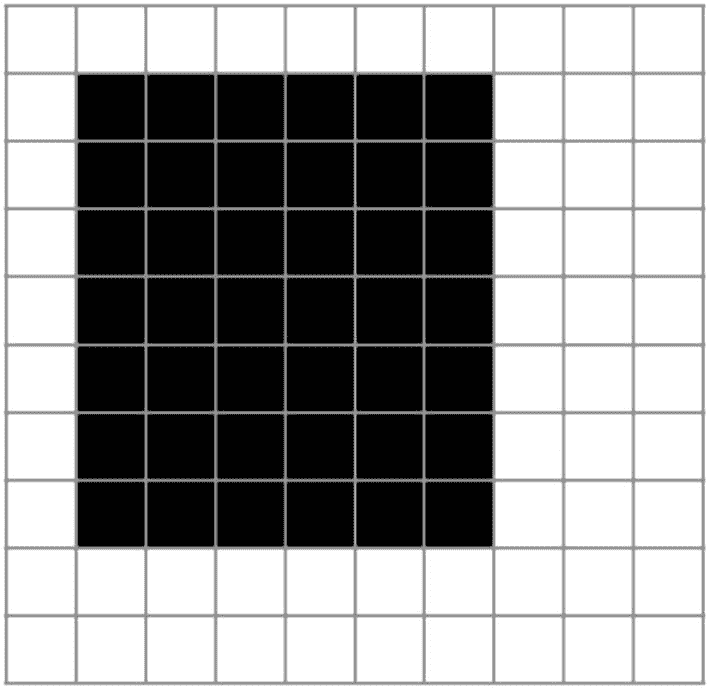

图 5-1

简单位图图像

这是一个微不足道的形象。位图图像通常由更多的像素组成，因此存储每个像素的颜色会导致文件非常大。比如指南针游戏用的背景图是 800 x 600 像素，也就是 48 万像素。如果使用 3 个字节来表示颜色(这是典型的)，那么该图像的大小大约为 1.4 MB。您可以通过将图像转换为 Windows 位图来证明这一点。bmp)图像格式。为了避免如此大的文件，图像格式通常支持压缩。

Pygame Zero 中使用的两种最流行的图像格式是 PNG(.png)和 JPEG(。jpg)。PNG(便携式网络图形)格式支持无损压缩。这减小了文件大小，但保持了图像中所有数据的完整性。JPEG 格式(由联合图像专家组创建)使用有损压缩，这种压缩会删除文件中的一些信息，同时使文件看起来尽可能接近原始文件。有损压缩通常会使文件变小，但会导致质量下降。

JPEG 文件适用于压缩优先的大型图像。这使它们成为一种有用的照片格式。

PNG 具有良好的压缩性，没有质量损失，并且支持透明性，因此它通常是游戏编程的好选择。

### 矢量图像

位图图像的替代物是矢量图像。矢量图像不是存储每个像素的细节，而是存储如何从形状创建图像的指令。对于之前在图 [5-1](#Fig1) 中使用的图像，文件格式将描述如何使用矩形创建图像。

清单 [5-1](#PC1) 显示了如何将位图图像绘制成矢量图像的伪代码。

```py
Create blank page 10 pixels x 10 pixels
Set the page color to white
Draw a rectangle starting at position 1,1 which is 6 x 7 pixels in size.
Color the rectangle black

Listing 5-1Example of a try except exception handling

```

Tip

伪代码是用来描述程序如何工作的。它不能直接在任何编程语言中运行，因为它没有正常编程语言所需的正确词汇或语法。它有助于解释代码如何工作。

矢量图像的主要优点如下:

*   可以编辑和移动这些形状，而不会丢失与其他形状重叠的任何信息。

*   当放大一个形状时，它仍然是清晰的，而位图变成像素化的。

*   通常文件较小。

矢量图像的一种流行格式是 SVG(可缩放矢量图形),它是一种通用文件格式。还有许多其他矢量文件格式，它们通常与特定的编辑应用相关联(例如 LibreOffice Draw 中使用的 ODG)。

Pygame Zero 不能像显示位图图像那样显示这些图像。在设计游戏时，必须将矢量图像转换为位图图像，使用能够理解矢量图像格式的代码进行转换，或者使用指示 Pygame Zero 使用其内置形状工具创建图像的代码。这些方法中的每一种都将在本章或接下来的两章中讨论。

## 有用的工具

有许多工具可以用来设计计算机图形。这里展示的例子都是免费的，可以在 Raspberry Pi 上使用。对于其中的一些，显示了如何创建图像的示例。

### Draw 程式库

Draw 是 LibreOffice 办公套件中包含的应用之一。默认情况下，它包含在 Raspberry Pi NOOBs 映像中，并可从网站 [`www.libreoffice.org/`](http://www.libreoffice.org/) 获得其他操作系统。

Draw 对于创建 2D 矢量图像非常有用，然后可以将其转换为位图图像，以便在 Pygame Zero 中使用。

图 [5-2](#Fig2) 中的截图显示了一个在 Draw 中创建的人。右图被分成不同的组件，以展示如何使用基本形状创建这些组件。


图 5-2

在 LibreOffice Draw 中创建的人物精灵图像

有几种不同的形状可供使用，如图 [5-3](#Fig3) 所示。对于更复杂的形状，绘图工具包括一个选项，用于使用可以形成任何形状的线集合来创建不规则多边形。


图 5-3

图书馆绘图中的简单形状绘图工具

设计完精灵后，可以使用导出选项将其导出为 PNG 文件。如果您勾选了“选择”复选框，那么它将只导出选定的对象。如果您在同一个文档中创建多个图像，这将非常有用。

### 红宝石红宝石红宝石红宝石红宝石红宝石红宝石红宝石红宝石红宝石红宝石红宝石红宝石红宝石红宝石红宝石红宝石红宝石红宝石红宝石红宝石红宝石红宝石红宝石

LibreOffice Draw 是一个很好的程序，但是对于一个更专业的绘图应用来说，还有另外一个免费的选择，那就是 Inkscape。Inkscape 是一个矢量绘图程序，它将自己与 Adobe Illustrator 和 CorelDRAW 相比较。默认情况下，它不包含在 NOOBS 安装中，但可以使用

```py
sudo apt install inkscape

```

Inkscape 也可用于其他操作系统，可从 [`https://inkscape.org/`](https://inkscape.org/) 下载。图 [5-4](#Fig4) 中的截图显示了 Inkscape 中一辆汽车的图纸。

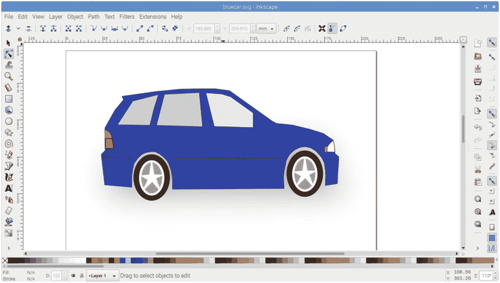

图 5-4

在 Inkscape 中创建的汽车图像

Inkscape 比 LibreOffice Draw 稍难使用，但功能更强大。如果您还不熟悉矢量绘图程序，那么您可能想先尝试 LibreOffice Draw，然后在准备进入下一阶段时使用 Inkscape。它的工作方式有所不同的一个例子是 LibreOffice Draw 有一个用于创建不规则多边形的多边形工具，而在 Inkscape 中这是通过使用铅笔工具来实现的。要创建多边形，请绘制第一条线，然后从前一条线的末端开始每条后续线。完成后，单击第一条线的起点将产生一个多边形，您可以用颜色填充它。

Inkscape 文件直接保存为 SVG 文件，这使它们有助于与其他应用共享，并且图像可以导出为 PNG 位图文件，以便在 Pygame Zero 中使用。

### GIMP

GIMP (GNU 图像处理程序)是一个位图编辑器。这是一个功能强大的工具，有很多特性，但由于这一点，它可能很难学习。它可以安装在树莓 Pi 上，使用

```py
sudo apt install gimp

```

在其他操作系统上，您可以在 [`www.gimp.org`](http://www.gimp.org) 下载一个版本。GIMP 有很多方法可以用来创建图形。这里展示了两个例子，一个是从图画或照片中创建背景图像，另一个展示了如何使用它来创建适合精灵的简单像素艺术。

#### 从图画或照片创建计算机图像

这个例子将展示从图画或照片创建计算机图形图像背后的原理。这可以用来将概念作品制作成游戏的背景。在这种情况下，我从一个城堡的照片中创建了一个城堡的计算机图形图像。照片图像首先被加载到 GIMP 中，并调整到成品图像的大小，如图 [5-5](#Fig5) 所示。

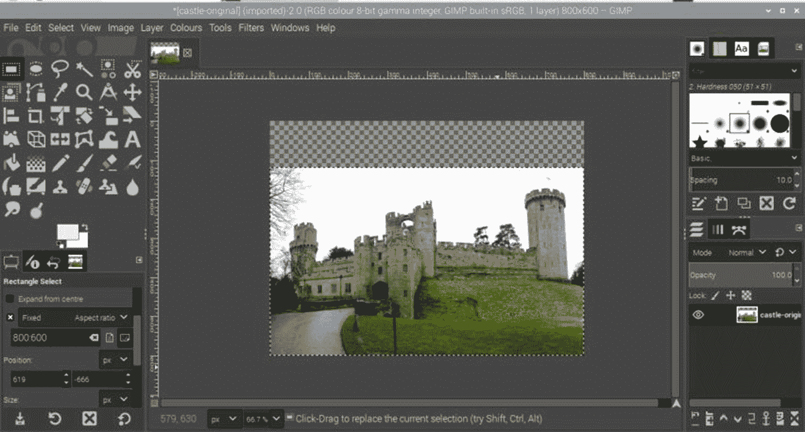

图 5-5

GIMP 与一座城堡的照片

你会看到在图像的顶部有一个透明区域(棋盘图案)。这是因为调整了图像的大小以达到所需的宽高比。

图像将被创建在一个新的层，照片最终被删除。使用图层工具创建新图层，如图 [5-6](#Fig6) 所示。

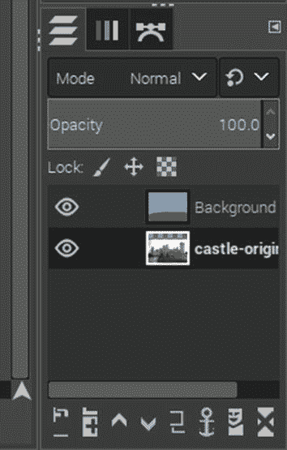

图 5-6

带有新层的 GIMP 层对话框

新图层被分为两个区域，分别显示蓝天和绿地。使用的主要工具是自由选择工具(套索)和填充工具(桶)；这些都在图 [5-7](#Fig7) 中突出显示。

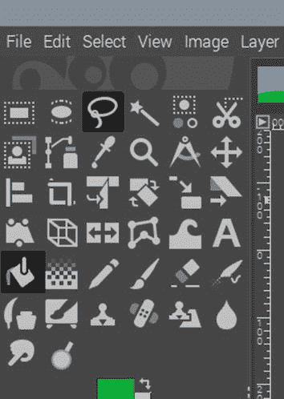

图 5-7

显示自由选择和填充工具的 GIMP 工具对话框

可以调整图层的顺序和不透明度，以便可以在背景中看到照片，然后使用自由选择工具绘制轮廓。您可以使用 Ctrl 和鼠标滚轮来放大和缩小。您可以使用滚动条在图像中移动。如果你不小心点错了地方，那就用键盘上的退格键。选区如图 [5-8](#Fig8) 所示，可以看到城堡形状的隐约轮廓。

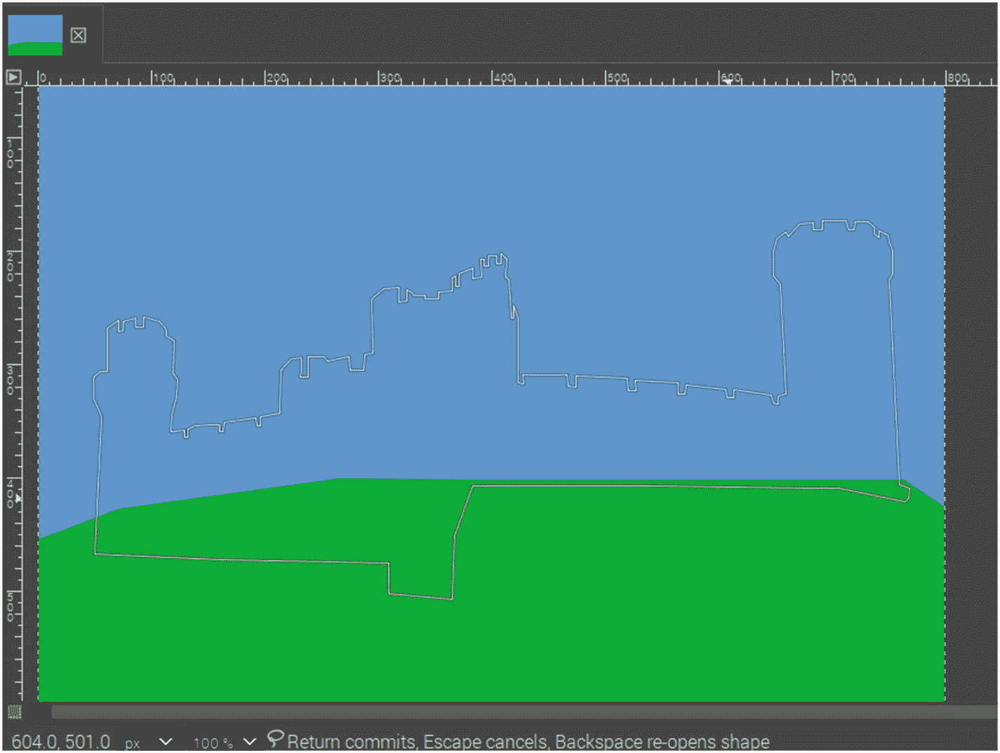

图 5-8

GIMP 中城堡轮廓的选择

然后使用填充工具用适当的颜色填充轮廓。这是重复添加更多的细节，如门和窗户。图像可以保存为 GIMP XCF 文件，这将允许您继续编辑它，并导出为 PNG 文件，以便在 Pygame Zero 中使用。导出的城堡图像如图 [5-9](#Fig9) 所示。

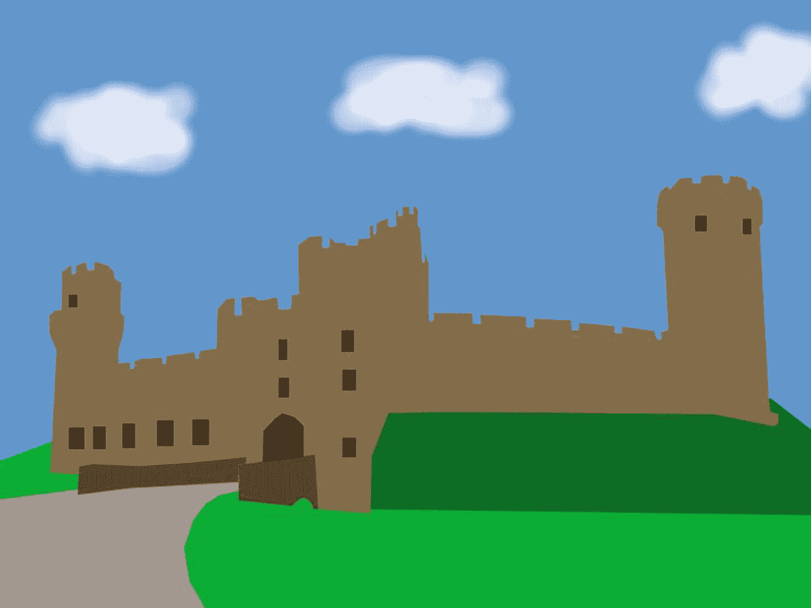

图 5-9

城堡的导出图像

重复这个过程，直到达到适当的细节水平。我已经添加了一座桥，一条路，以及干护城河远处的深绿色。

也可以使用铅笔或画笔在图像上绘图。我已经用画笔工具添加了一些云彩。这些是用软笔刷在两层上绘制的，部分透明，给它一个更柔和的外观。

#### 创建像素艺术精灵

另一种方法是利用你自己的想象力完全从头开始创建图像。在这个例子中，一个简单的航天器像素艺术精灵。首先创建一个新的图像。将大小设置为适当的细节级别(在本例中为 32 x 32 像素)，并在“更多选项”对话框下，选择背景为透明。

然后，您可以放大图像，并使用“大小”设置为 1 的笔单独为相关像素着色。我首先创建一个简单的轮廓形状，如图 [5-10](#Fig10) 所示。

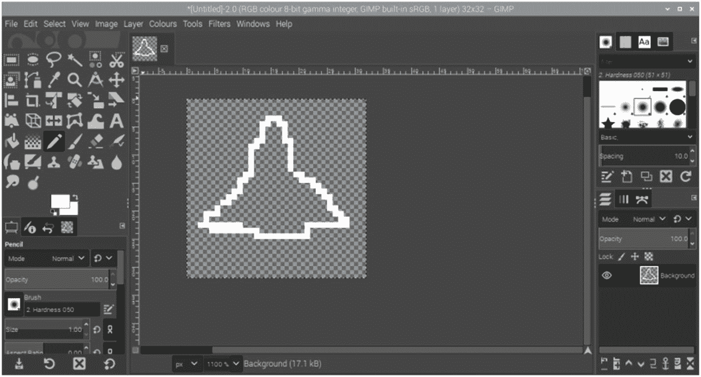

图 5-10

在 GIMP 中创建像素艺术精灵

为了更容易创建对称，我添加了一个临时层，用一条线显示图像的中间。然后，您可以为线条的每一侧计算相同数量的像素。如图 [5-11](#Fig11) 所示。

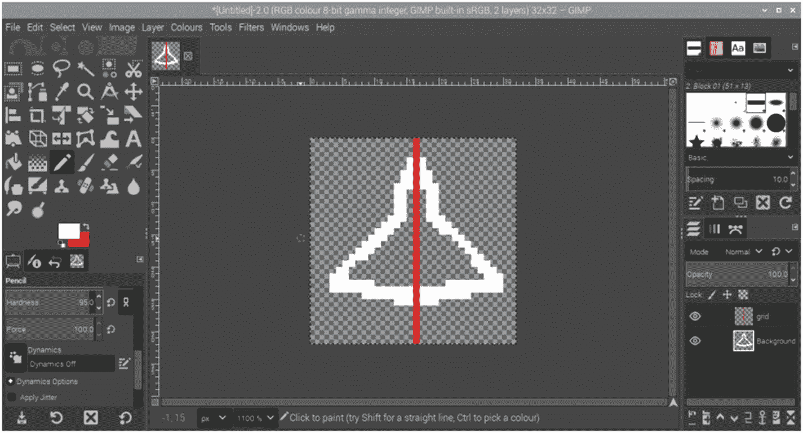

图 5-11

用对称线在 GIMP 中创建像素艺术精灵

根据需要继续添加细节。一旦完成，图像可以导出为 PNG 文件，如图 [5-12](#Fig12) 所示。在导出图像时，通常应该将任何未使用的像素保留为透明，但是我将背景着色为灰色，以便更容易看到白色图像。


图 5-12

像素艺术飞船

### 搅拌机

到目前为止讨论的工具都是为 2D 图像设计的。Blender 是一款 3D 设计工具。这对创建 3D 游戏很有用，但这超出了本书的范围；相反，我将展示一个示例，说明如何通过将光照和阴影应用到 3D 模型，然后将其导出为 2D 图像，来创建更加 3D 的外观。

Blender 是一款免费提供的专业设计工具。可以安装在树莓 Pi 上。

```py
sudo apt install blender

```

如果在树莓 Pi 上运行，那么我建议使用 4GB 内存的树莓 Pi 4；它可以在旧版本上运行，但是非常慢，几乎不可用。对于其他操作系统，程序可以从 [`www.blender.org`](http://www.blender.org) 下载。

Blender 是一个非常强大的工具，但是很难学。它在屏幕上到处都有工具，在不同的地方有多个下拉菜单，鼠标操作与 2D 工具不同。因此，对于新用户来说，这可能会非常混乱。

如果你真的学会了，那么它会很有用。你可能想从一些简短的教程开始，着眼于某些方面，而不是试图在一个项目中全部掌握。

创建 3D 对象超出了本书的范围，但了解如何在游戏中使用 Blender 中创建的对象可能会有所帮助。以下步骤显示了如何将搅拌机模型导出为适合在游戏中使用的 2D 图像。

图 [5-13](#Fig13) 中的图像显示了一个为游戏创建的简单的导弹/子弹图像。它由圆柱体和圆锥体组成。作为一个没有阴影的基本 2D 对象，它看起来非常简单，但是通过应用光源，你可以看到阴影，它可以呈现更 3D 的外观。


图 5-13

带有导弹三维模型的搅拌机

设计完图像后，可以将对象渲染成 2D 图像，然后保存为图像文件，如图 [5-14](#Fig14) 所示。

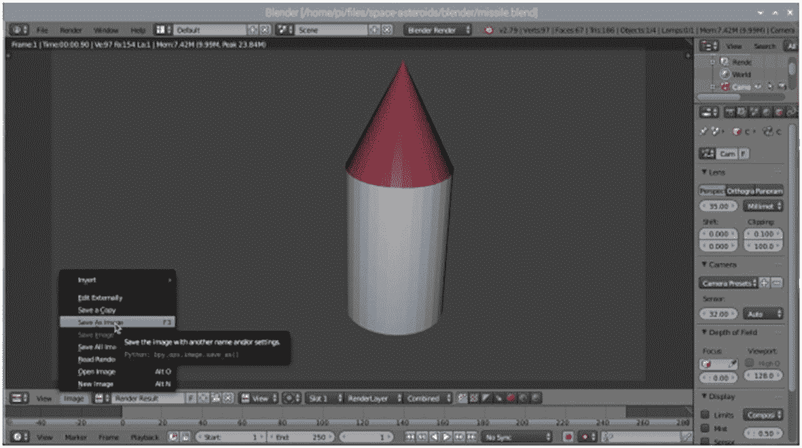

图 5-14

带另存为图像菜单选项的搅拌机

### 使用代码创建

到目前为止，这些工具都是在工具中创建图像，然后导出到 Pygame Zero 中使用。另一种方法是使用代码在 Pygame Zero 中生成图像。这可以利用 Pygame Zero 中的形状绘制工具。

第 7 章包括一个完全使用这种技术从头开始制作的游戏。游戏截图如图 [5-15](#Fig15) 所示。

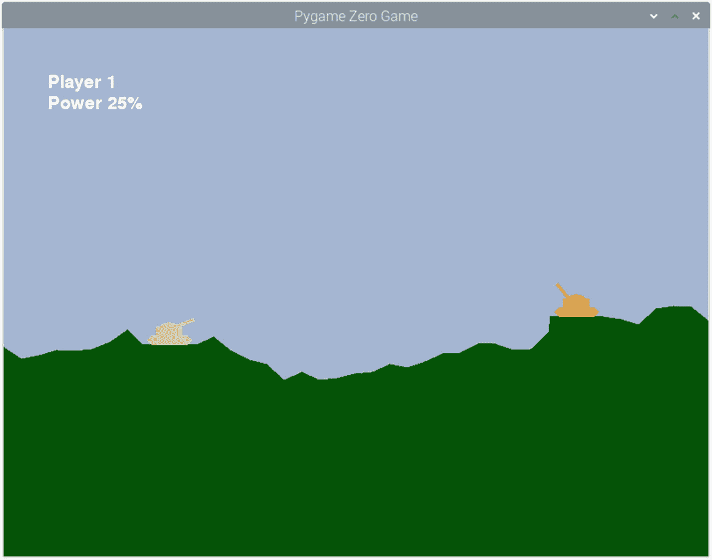

图 5-15

使用代码创建的坦克游戏截图

这个游戏中的图形是基本的，但是可以添加更多的细节来使它们更加真实。

## 其他来源

如果你不想创建自己的图像，那么你可以让别人创建一些图形。你将需要检查图形的许可，允许你在游戏中使用它们。一些许可证可能会对图形的使用、修改和分发方式加以限制。他们也可能根据你的游戏是否被货币化而强加不同的许可。

以下是可能有用的一小部分来源；请注意，这些网站中的某些网站可能对不同的图像使用不同的许可证，或者可能使用限制图像使用方式的许可证:

*   打开游戏艺术-[`https://opengameart.org/`](https://opengameart.org/)

*   肯尼—[`https://kenney.nl/`](https://kenney.nl/)

*   pixabay─[`https://pixabay.com/`](https://pixabay.com/)

*   Itch.io 免费游戏资产—[`https://itch.io/game-assets/free`](https://itch.io/game-assets/free)

这不是一个详尽的列表。使用互联网搜索引擎进行搜索，将会列出其他带有适合在您自己的游戏中使用的图形的网站。

## 摘要

这展示了一些可用于创建计算机游戏编程中使用的图像的常用工具。它们是如何被使用的细节已经超出了本书的范围，但是它已经包括了你在创建图形时可能想要使用的一些技术的概述。它还包括一些网站的建议，可能有合适的图形可以使用。

下一章将介绍 Pygame Zero 中如何使用颜色，以及在游戏编程中使用颜色的一些技巧。