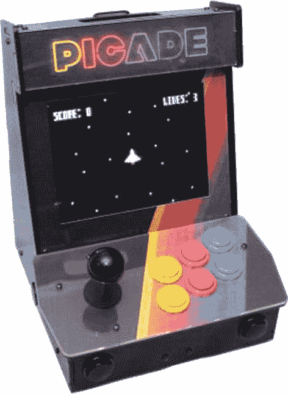
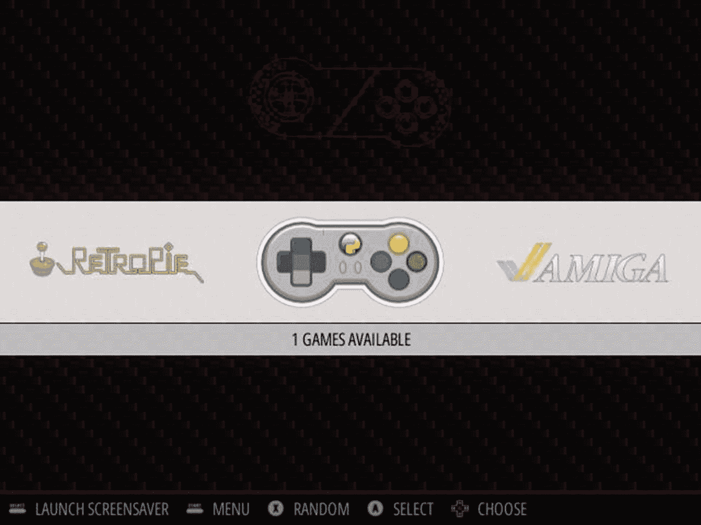
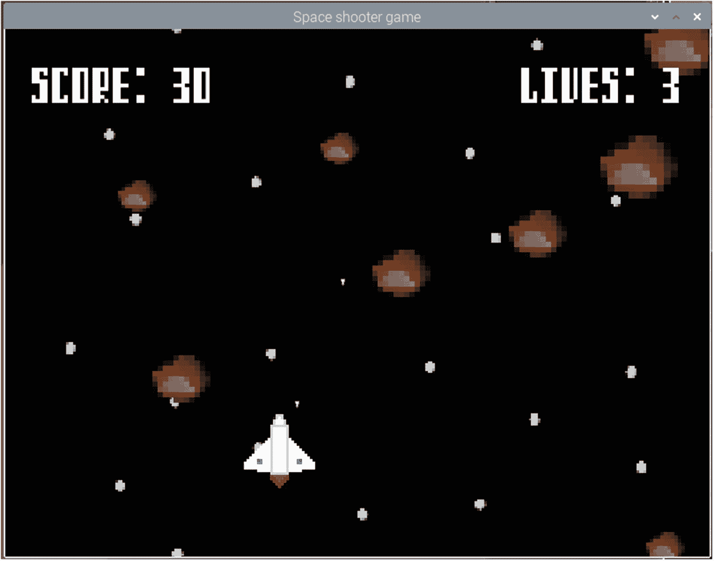
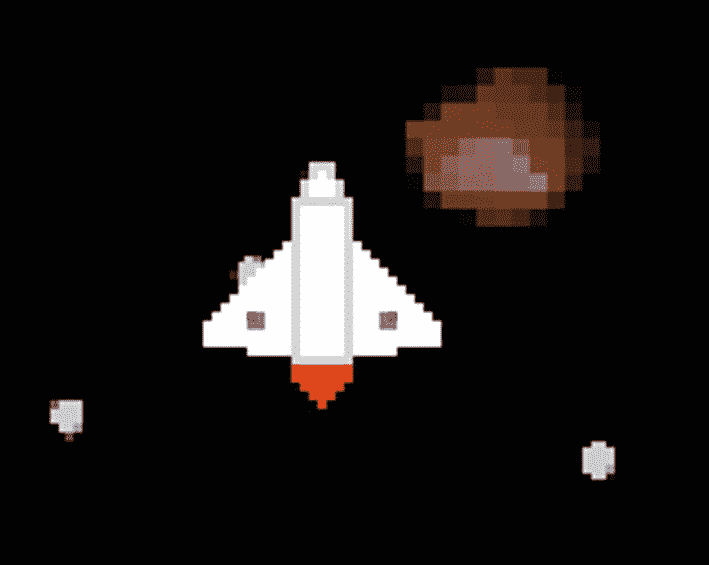

# 十一、改进和调试

这最后一章将研究一些额外的技术来改进你的代码。当出现问题时，它还会为调试提供一些帮助。决赛将是一场 2D 自上而下的太空射击游戏。这将有助于你建立信心，利用从本书中学到的知识创建自己的游戏。

## 其他技术

在本书中，介绍了几种不同的游戏制作技术。其中一些被广泛应用于多种游戏中，而另一些可能只对特定类型的游戏有益。还有很多其他的东西可以改善游戏性，让游戏看起来更专业，或者节省你的时间。我在这里增加了一些，可以帮助你提高编程技巧的数量。

### 关于 Pygame Zero 的更多信息

Pygame Zero 的官方文档可以在 [`https://pygame-zero.readthedocs.io/en/stable/`](https://pygame-zero.readthedocs.io/en/stable/) 在线获得。文档在初次学习 Pygame Zero 时非常有用，但它提供的内容有限。

有一些功能没有包含在官方文档中。标题变量就是一个例子。这就像用来改变窗口大小的宽度和高度变量，但是在这种情况下，标题替换了游戏窗口标题栏上的标题。还有一个图标选项，可用于向任务栏上的应用添加缩略图图标。清单 [11-1](#PC1) 展示了这两者在一个示例程序中的作用。

```py
WIDTH = 400
HEIGHT = 200
TITLE = "My Game Title"
ICON = "spacecrafticon.png"

Listing 11-1Program with TITLE and ICON options

```

图标中引用的文件需要在应用运行的目录中。这通常是与可执行文件相同的目录，但是在 Mu 的情况下，您可能需要将它复制到 mu_code 目录。理想情况下，图标应该是一个 32 x 32 像素大小的 PNG 文件。

图 [11-1](#Fig1) 显示了在 Raspberry Pi 上运行的程序。左边的游戏不包括标题或图标条目，所以有默认的“Pygame Zero Game”和默认图标。右边的标题是“我的游戏标题”，包括一个飞船图标。


图 11-1

运行带有或不带有标题和图标条目的程序

如果这些都是无证的，那你怎么发现他们呢？我认为值得考虑的是，Pygame Zero 仍然处于早期阶段，正在随着时间的推移进行开发。在您阅读本文时，这些特性可能已经添加到文档中。也可能有更多的新特性还没有在文档中出现。

了解这些特性的一个方法是查看其他人创建的程序。这样你就能看到别人发现了什么。还有一个地方就是看 Pygame Zero 的源代码。源代码在 GitHub 上的 [`https://github.com/lordmauve/pgzero`](https://github.com/lordmauve/pgzero) 。源代码是非常高级的代码，因此对于经验不足的程序员来说可能很难读懂。在寻找特定的东西时，它有时会很有用。

### 更多关于 Pygame 的信息

除了 Pygame Zero，还可以调用父库 Pygame 中的方法。这已经在第 7 章的坦克游戏中使用过了。一个例子是直接使用 Pygame 库的`pygame.draw.polygon`。

你可以在 [`www.pygame.org/docs/`](http://www.pygame.org/docs/) 的官方文档中找到更多关于 Pygame 的信息。

### 添加字体

在之前的游戏中，屏幕上显示的文字一直使用默认字体。您可以通过在游戏目录中创建一个`fonts`目录并将字体复制到那里来使用其他字体。您可以将现有字体复制到该文件夹中，也可以添加自定义字体，而无需在系统上安装它们。在 Linux(包括 Raspberry Pi)上，通常可以通过从/usr/share/fonts/truetype 复制系统字体来使用它们。或者，你可以在网上搜索找到许多免费的字体。其他系统，如 Windows，很可能对许多字体有版权限制。如果你想和别人分享你的游戏，你应该避免任何非自由字体。当你发布你的游戏时，你可能还需要包括字体的版权信息。

字体的安装有一个异常，因为对于 Pygame Zero，字体的文件名必须全部是小写的。字体文件还必须是以. ttf 扩展名结尾的 True Type 字体。将字体文件复制到 fonts 目录时，您需要重命名该字体文件，以删除任何大写字母。

一旦文件在字体目录中，您可以通过使用文件名(没有。ttf 扩展名)。这显示在以下代码中:

```py
screen.draw.text("This is using the Deja Vu Sans Font", fontname="dejavusans", fontsize=40, topleft=(30,30), color=(255,255,255))

```

这使用了似曾相识的字体，这是树莓派的标准字体，也可以从 [`https://dejavu-fonts.github.io/`](https://dejavu-fonts.github.io/) 免费下载。

### 滚动屏幕

一些游戏可以使用滚动背景。这通常用于玩家在屏幕上保持静止(或在屏幕范围内移动)，但背景移动以使玩家看起来在移动的情况。这可以是从一边滚动到另一边(通常在平台游戏中使用，玩家从左到右行走)或从上到下(用于显示交通工具，如飞机，正在向屏幕顶部移动)。

根据游戏的不同，你可能会有一个重复的背景图片，或者你可能会有多个图片可以从一个滚动到另一个。通常，这些图像与屏幕大小相同，但这不是必须的。

创造这种效果的一种方法是使用`screen.blit`,它已经在本书的大部分游戏中被用作背景图像。这用于在屏幕上显示图像。在图像位置中使用偏移将显示与屏幕重叠的图像部分。图 [11-2](#Fig2) 中的图表显示了如何定位两个具有不同偏移量的相同图像，从而产生看起来连续的图像。


图 11-2

创建滚动屏幕

清单 [11-2](#PC3) 中的代码展示了如何实现这一点。它使用一个`scroll_position`作为第一幅图像的 x 位置，第二幅图像紧随其后，从屏幕外开始。可以调整`scroll_speed`以适当加快或减慢滚动速度。

```py
scroll_speed = 2
scroll_position = 0

def draw ():
    screen.blit("background_scroll", (scroll_position,0))
    screen.blit("background_scroll", (scroll_position+800,0))

def update():
    global scroll_position
    scroll_position -= scroll_speed
    if (scroll_position <= -800):
        scroll_position = 0

Listing 11-2Creating a scrolling background

```

### 从 CSV 配置文件中读取

当保存游戏的高分时，文件的读写在第 [4](04.html) 章中有介绍。在这种情况下，它只是一个单一的条目。当存储了更多的信息时，就需要以一种信息易于检索的方式存储数据。

有许多不同的文件格式可以使用，每一种都有其优点和缺点。一种简单的格式是将信息存储为逗号分隔的值，称为 CSV 文件。在这种格式中，文件的每一行都包含多个值，用逗号分隔，如下所示:

```py
String value,1,2,3.1

```

在本例中，有一个字符串，后跟两个整数和一个浮点数。需要注意的重要一点是，数字是以字符串的形式存储的，所以在它们被转换成数字之前，您不能操作它们。

第一步是将文件分成独立的部分。因为它们是用逗号分隔的，所以您可以使用`string.split`方法，该方法根据字符来分隔字符串。在这种情况下，它会根据逗号的位置来拆分行。如果字符串中有逗号怎么办？如果字符串中有逗号，那么 CSV 格式会在字符串两边加上引号，表示引号中的逗号不应被拆分。在下面的条目中，值是相同的，但是这次字符串中有一个逗号。

```py
"String, value",1,2,3.1

```

现在不能再使用 split 方法，因为这样会忽略引号，导致字符串被分成两个值。

解决方案是使用知道如何处理 CSV 文件的模块。Python 包含了可以做到这一点的 csv 模块。为了演示这一点，我们需要一个 CSV 文件。清单 [11-3](#PC6) 中的文件是敌人文件的简化版本，将在太空射击游戏中使用。

```py
0.3,asteroid,asteroid_sml,200,0,4
0.9,asteroid,asteroid_sml,100,0,4
0.9,asteroid,asteroid_med,400,0,3
1.2,asteroid,asteroid_sml,750,0,4

Listing 11-3Sample CSV file for reading demo

```

这是用来制造需要躲避或摧毁的小行星。第一个字段是小行星出现在屏幕上的时间(以秒为单位)，表示它是小行星的关键字“小行星”，图像文件名，x 和 y 坐标，最后是小行星的速度(以像素/时间间隔为单位)。

文件另存为 csvdemo.csv。扩展名表示它是 csv 文件，但它可以有不同的扩展名。在游戏中，它将被命名为“敌人. dat ”,以表明它是一种数据文件形式。扩展名对程序如何处理文件没有任何影响，但是如果您命名文件。csv 文件，则可以在电子表格或类似的应用中打开该文件。这可能是你不希望玩家能够做到的。

该文件是在文本编辑器中创建的。不可能使用 Mu 来编辑文件，因为它只允许您编辑 Python 文件，但是在 Raspberry Pi 和 Linux 发行版上有一个文本编辑器应用，或者使用其他操作系统，该编辑器可能被称为记事本或文本编辑。

读取文件的源代码如清单 [11-4](#PC7) 所示。

```py
import csv
import sys

configfile = "csvdemo.csv"

try:
    with open(configfile, 'r') as file:
        csv_reader = csv.reader(file)
        for enemy_details in csv_reader:
            start_time = float(enemy_details[0])
            # value 1 is type
            image = enemy_details[2]
            start_pos = (int(enemy_details[3]),
                int(enemy_details[4]))
            velocity = float(enemy_details[5])
            print ("Start time {}, Image {}, Start Pos {}, Velocity {}".format(start_time, image, start_pos, velocity))
except IOError:
    print ("Error reading configuration file "+configfile)
    # Just end as cannot play without config file
    sys.exit()
except:
    print ("Corrupt configuration file "+configfile)
    sys.exit()

Listing 11-4Code to read in a CSV configuration file

```

这是一个标准的 Python 3 可执行文件，而不是 Pygame Zero 文件。要在 Mu 中运行代码，您需要更改模式。该代码在文件打开命令之前使用了`with`关键字，但在其他方面与之前读取文件的方式相似。当使用`with`关键字时，不需要显式关闭文件。这在读取文件出现问题时非常有用，因为关闭文件是自动处理的。

整个操作包含在一个 try except 子句中，该子句将尝试并捕捉任何错误。在这种情况下，发生错误时什么也做不了，因为没有文件中的数据，程序什么也做不了。如果错误是由于读取文件时的 IOError 造成的，那么它会给出一个与文件损坏时不同的错误消息。

使用`csv.reader`处理 CSV 文件，它解析文件并放入`csv_reader`中，后者将数据存储为 2D 列表。在需要数值的地方，根据需要使用 int 或 float 进行转换。如果数据格式不正确，它们将触发异常，因此它们也包含在 try 子句中。

### 操纵杆和游戏手柄

到目前为止，游戏都被设计成用鼠标或键盘来玩。下一步将是增加对操纵杆或游戏手柄的支持。不幸的是，Pygame Zero 还不支持游戏手柄，尽管它在路线图上被列为一个潜在的未来功能。在此之前，可以使用 QJoyPad 来模拟键盘按键。这个可以从 [`http://qjoypad.sourceforge.net/`](http://qjoypad.sourceforge.net/) 下载。游戏手柄需要在每台使用它的电脑上进行配置。

为了获得更真实的街机游戏体验，Picade 或 Picade 控制台可以提供一个操纵杆，它可以像键盘一样工作。

### 为 Picade 创建街机游戏

如果你想在游戏中获得完整的街机游戏体验，那么 Picade 是一款基于 Raspberry Pi 的紧凑型街机。它可以作为一个需要连接到电视或显示器的控制台使用，也可以作为一个带有内置屏幕的完整拱廊机柜使用。

Picade arcade 机柜的照片如图 [11-3](#Fig3) 所示。



图 11-3

皮莫罗尼皮卡德运行空间射击游戏

Picade 使用安装在树莓派上的帽子。然后将帽子连接到安装在橱柜顶部和侧面的操纵杆和拱廊按钮(开关)。帽子将按键转换成信号发送给树莓派，就好像它们来自键盘一样。您也可以单独购买帽子，用它来打造自己的橱柜。另一种方法是使用不同的电路板来模拟按键，如 Makey Makey 或 Arduino。

图 [11-4](#Fig4) 中的图像显示了与操纵杆相关的按键以及 Picade 上的每个按钮。


图 11-4

Pimoroni Picade 按键布局

大多数为键盘设计的游戏使用方向键，它们被映射到 Picade 上的操纵杆。按钮有点模糊，所以为了让游戏可以在标准键盘和 Picade 上玩，允许按下两个不同的键来提供 Picade 和普通键盘的兼容性是很有用的。

这通过在按键检查中使用布尔“或”来实现。以下代码摘自坦克游戏第 [7](07.html) 章，该章允许使用键盘空格键或 Picade 底部黄色按钮(左移)来发射炮弹。

```py
if (keyboard.space or keyboard.lshift):
            game_state = 'start'

```

您可能还想考虑通过配置文件来配置关键代码。

另一件需要注意的事情是，Picade 的屏幕尺寸为传统的 4:3，虽然它可以玩为不同屏幕尺寸设计的游戏，但分辨率 800 x 600 和 1024 x 768 是一个不错的选择。

为 Picade 设计的游戏可以使用键盘而不是操纵杆和按钮在任何树莓 Pi 上运行。Picade 通常运行 RetroPie，这将在下面讨论。

### 复古派

RetroPie 提供了一种在树莓 Pi 上玩复古电脑游戏的方式。这可以是 Picade，也可以是普通的覆盆子 Pi。RetroPie 通常用于通过模拟器玩老式电脑游戏。由于商业游戏的潜在版权问题，默认情况下它通常不包括任何游戏。

除了运行模拟器游戏，RetroPie 还可以运行在 Pygame 或 Pygame Zero 中创建的游戏。在 RetroPie 中添加对游戏的支持可以让更多的人使用它。RetroPie 可以按照 [`https://retropie.org.uk/`](https://retropie.org.uk/) 的说明下载安装。

RetroPie 默认不包含 Pygame Zero，但是 Pygame Zero 可以使用

```py
sudo apt install python3-pgzero

```

您可以添加一个新菜单来安装您自己的游戏。要向系统添加新菜单，将清单 [11-5](#PC10) 中的编码添加到文件`/etc/emulationstation/es_systems.cfg`中的`</systemList>`条目之前。

```py
  <system>
    <name>pgzero</name>
    <fullname>Pygame Zero</fullname>
    <path>/home/pi/RetroPie/roms/pgzero</path>
    <extension>.sh</extension>
    <command>%ROM%</command>
    <theme>pgzero</theme>
  </system>

Listing 11-5Define new menu for RetroPie

```

在适当的主题文件夹中也需要有一个条目。源代码中包含一个文件。这可以按照以下说明进行提取:

```py
cd ~
tar -xvzf pgzero-retro-theme.tgz
cd /etc/emulationstation/themes/carbon
sudo cp -r ~/retropietheme/* .

```

安装后，会有一个 Pygame Zero 的菜单。

要在 RetroPie 上安装游戏，在 roms 目录下创建一个文件夹，通常是~/RetroPie/roms。在我的例子中，我创建了一个名为 pgzero 的。在该目录中，创建一个简单的 shell 脚本来启动程序。脚本文件如清单 [11-6](#PC12) 所示。

```py
cd ~/compassgame
pgzrun compassgame.py

Listing 11-6Script file for launching the compass game ~/RetroPie/roms/pgzero/CompassGame.py

```

脚本文件还需要可执行权限，这可以通过使用

```py
chmod +x ~/RetroPie/roms/pgzero/CompassGame.py

```

游戏现在可以从主菜单中选择。菜单截图如图 [11-5](#Fig5) 所示。



图 11-5

双打零式菜单

## 排除故障

当程序出错时，这就是所谓的 bug。早期的错误可能包括机械问题，其中包括一只死了的蛾子阻碍了继电器的关闭。现在，它通常指计算机代码中的错误。这可能是与预期行为相比，对程序运行方式产生负面影响的任何事情。这可能是程序根本没有运行，也可能是演员需要移动两个额外像素才能被检测到的小错误。这也可能是一个性能问题，即程序运行速度比它应该运行的速度慢。

如何测试和调试程序的细节很容易写满一整本书。这本书将着眼于一些与调试和性能相关的技术。

### 错误消息

首先要检查的是是否有任何错误消息。在 Mu 中，这些通常显示在屏幕底部的面板中。但是，当您单击“停止”时，它们将会丢失。另一种方法是尝试从命令行运行程序，看看是否会得到错误消息。

有时给出的信息会很明显，帮助你马上找到问题。对于一些错误消息，您可能需要做一些调查。例如，典型的错误消息可能包括

```py
KeyError: "No image found like 'batleship'. Are you sure the image exists?"

```

首先要检查的是该名称是否与预期的文件匹配。在这种情况下，有一个错别字“战舰”拼写错误。

如果名称是正确的，那么您应该检查文件是否在正确的目录中。对于图像，它应该在`img/`子目录中。还要注意，在某些情况下，文件是从其他位置引用的，这可能是相对于程序文件的位置，或者在某些情况下是在程序运行的目录中(如`~/mu_code`目录)。

其他错误可能是指代码中的语法错误。他们通常会给你行号，但是要注意代码中的错误可能比它说的要早。例如，这是无效语法错误消息的一部分:

```py
  File "battleship.py", line 19
    grid_img_2 = Actor ("grid", topleft=(500,150))
             ^
SyntaxError: invalid syntax

```

该错误似乎表明问题出在第 19 行。但是，查看第 18 行和第 19 行的代码可以发现，错误实际上出现在第 18 行。

```py
18\. grid_img_1 = Actor ("grid", topleft=(50,150)
19\. grid_img_2 = Actor ("grid", topleft=(500,150))

```

在这种情况下，第 18 行缺少右括号。由于缺少括号，解释器认为第 19 行是第 18 行的延续，并且第 19 行有错误。这是一种常见的情况，所以总是努力在有错误的那一行之前检查查找错误。

同样不要忘记确保 Mu 处于 Pygame Zero 模式。如果你得到一个错误，说“NameError: name 'Actor '未定义”，那么这可能是因为你正试图在 Python 3 模式下运行。

### 检查变量名

另一个常见的问题是输入错误的变量名。如果你试图把一些东西存储到一个不同的变量中，那么 Python 会创建一个新的变量。因此，引用正确变量的代码将看不到更新。请记住，变量名是区分大小写的，因此使用错误的大小写会产生相同的效果。

您还应该检查该变量在当前范围内是否可访问。如果你试图更新一个没有包含在全局变量中的变量，那么它会创建一个局部变量而不会更新全局变量。

### 打印报表

当试图理解程序的行为时，一个有用的工具是使用打印命令。当程序在图形显示中运行时，这些可用于向控制台显示消息。

通过添加一些打印命令，您可以随着游戏的进行跟踪变量的状态，看看会发生什么。

### IDE 调试工具

Mu 编辑器包括一些基本的调试工具，这些工具可以改进打印语句的添加。Mu 中有一个调试模式(在播放按钮旁边)。您可以通过单击行号在代码中设置断点。断点由红色圆圈表示。从菜单中，您可以运行到断点，或者单步执行，一些变量会显示在右侧的新窗格中。

随着编程的进展，您可能想看看专业的 IDE(集成开发环境)。不幸的是，用 Pygame Zero 设置大多数 ide 是很困难的，所以你现在可能想坚持使用 Mu，但这是你将来可能想看的东西。

### 橡皮鸭调试

有时候程序并没有按照你期望的方式运行，你也不知道为什么。如果是这种情况，那么了解一下程序应该如何工作是很有用的。这样做的一个好方法是在单步执行代码时大声描述它应该如何工作。这可以用在无生命的物体上，比如橡皮鸭。这个想法是，在讨论代码的工作方式时，您可能会意识到为什么它没有像预期的那样工作。这种效果令人惊讶。我最喜欢的调试鸭如图 [11-6](#Fig6) ，但是你不需要用鸭；任何其他对象也一样。


图 11-6

英国调试鸭

### 表演

Python 的一个特点是它是一种解释型语言。这意味着您编写的基于文本的代码在运行时会被转换为计算机能够理解的代码。这与编译语言相比，编译语言是在程序运行之前完成的。一般来说，解释型语言比先编译程序要慢，这可能会导致性能问题。

到目前为止，本书中创建的游戏都很短，因此应该不会导致性能问题，但是随着使用的演员和资源数量的增加，您可能会发现代码开始运行缓慢。

本书中的一些代码已经通过检查自更新功能上次运行以来的时间来允许以不同的速度运行，但这可能不足以阻止游戏无响应。

当编写代码时，首要任务通常是使代码尽可能简单，这样就很容易理解它是如何工作的。这有助于限制错误的数量，并使其更容易维护，但它可能不会产生最有效的代码。

可以采取一些措施来提高程序的性能。首先要确定性能问题可能出在哪里。如果不了解问题出在哪里，那么资源可能会浪费在优化很少使用的代码上，或者计算机处于空闲状态而不会注意到性能的提高。通常你需要在程序运行过程中定期调用的循环中寻找。

下一件事是确保您有某种测试方法来查看您的更改是否提高了性能。有时，所做的更改听起来可能会提高性能，但实际上会降低性能。

以下是一些可以提高性能的建议:

*   如果一个现有的 Python 库已经存在，那么就使用它(它可能已经被优化了)。

*   检查消耗大量资源的循环。

*   避免全局变量。

*   在函数中，一旦完成就返回，而不是继续执行不必要的代码。

*   使用代码模式(找到其他人创建的已经考虑了性能的代码)。

*   重新设计算法。

这些只是一些建议，可能会也可能不会提高性能。最后一个技巧是模糊的，实际上取决于您正在创建的代码。如果你在做别人可能已经做过的事情，比如整理信息，那就看看别人都创造了什么代码。可能有些算法处理少量数据比处理大量数据效果更好。

## 太空射击游戏

这本书的最后一个游戏是一个太空射击游戏。在这部影片中，一艘宇宙飞船飞来飞去，向阻挡它前进的障碍物射击。这个游戏吸收了整本书中讨论过的很多技术。它是为 Picade 设计的，但使用键盘控制也能同样工作良好。为了适应街机的主题，游戏有一种有意的复古感觉，包括位图图像、乐谱的块字体和微小的声音效果。

该游戏的设计模拟了一个小行星带，飞船必须绕过这个小行星带或者炸开一条路。小行星被称为敌人，因为未来可能还会有敌人的飞船飞过屏幕。

游戏截图如图 [11-7](#Fig7) 。



图 11-7

太空射击游戏

源代码被分成不同类的多个文件。飞船被定义为 Actor 类的子类。这显示在清单 [11-7](#PC17) 中。

```py
from pgzero.actor import Actor

class SpaceShip(Actor):

    def set_speed (self, movement_speed):
        self.movement_speed = movement_speed

    def move (self, direction):
        if (direction == "up"):
            self.y -= self.movement_speed
        elif (direction == "down"):
            self.y += self.movement_speed
        elif (direction == "left"):
            self.x -= self.movement_speed
        elif (direction == "right"):
            self.x += self.movement_speed
        # Make sure that the ship remains on the screen
        if self.x < 20:
            self.x = 20
        if self.x > 780:
            self.x = 780
        if self.y < 20:
            self.y = 20
        if self.y > 580:
            self.y = 580

Listing 11-7Spaceship class in file spaceship.py

```

这实质上是指南针游戏中角色代码的面向对象版本。这比指南针游戏简单，因为当飞船移动时图像不会改变。一个可能的改进是添加不同的图像，如果你想让船看起来像是在侧移时倾斜，或者让火焰在加速前进时变得更大。

下一个文件是小行星类。这是一个 Actor 类的孩子处理屏幕上小行星的绘制。这显示在清单 [11-8](#PC18) 中。

```py
from pgzero.actor import Actor
import time
from constants import *

class Asteroid(Actor):

    def __init__ (self, screen_size, start_time, image, start_pos, velocity):
        Actor.__init__(self, image, (start_pos))
        self.screen_size = screen_size
        self.start_pos = start_pos
        self.start_time = start_time
        self.velocity = velocity
        self.status = STATUS_WAITING

    def update(self, level_time, time_interval):
        if self.status == STATUS_WAITING:
            # Check if time reached
            if (time.time() > level_time + self.start_time):
                # Reset to start position
                self.x = self.start_pos[0]
                self.y = self.start_pos[1]
                self.status = STATUS_VISIBLE
        elif self.status == STATUS_VISIBLE:
            self.y+=self.velocity * 60 * time_interval

    def reset(self):
        self.status = STATUS_WAITING

    def draw(self):
        if self.status == STATUS_VISIBLE:
            Actor.draw(self)

    def hit(self):
        self.status = STATUS_DESTROYED

Listing 11-8Asteroid class in file asteroid.py

```

这个类通过添加一些变量和方法来扩展 Actor 类。`start_time`是相对于每一关的开始，小行星出现在屏幕上的时间。根据小行星的大小，小行星可以有不同的图像。`start_pos`决定了小行星在屏幕上的起始位置，然后速度就是小行星向屏幕底部移动的速度，是小行星移动的像素数的度量。

update 方法处理小行星何时变得可见，并相对于其速度移动小行星。重置方法隐藏了小行星。hit 方法更新显示小行星是否已被摧毁的状态。draw 方法测试小行星是否可见，如果可见，则调用父 draw 方法在屏幕上显示它。

constants.py 文件中存储了几个必需的常量。这是为了使它们在多个文件和类中可用。这显示在清单 [11-9](#PC19) 中。

```py
# Status for each of the enemies
STATUS_WAITING = 0
STATUS_VISIBLE = 1
STATUS_DESTROYED = 2
STATUS_OFFSCREEN = 3

# Delay in seconds for messages on screen
DELAY_TIME = 2

Listing 11-9Shared constants in file constants.py

```

这可以像系统配置文件一样使用，但是在编辑该文件时需要小心，因为它是一个 Python 文件，任何错误都可能导致程序停止运行，并显示一条模糊的错误消息。

小行星类别定义了单个小行星。敌人类提供了一个小行星的集合，因此可以同时处理多个实例。这显示在清单 [11-10](#PC20) 中。

```py
import sys
import time
import csv
from constants import *
from pgzero.actor import Actor
from asteroid import Asteroid

# Enemies is anything that needs to be destroyed
# Could be an asteroid or an enemy fighter etc.

class Enemies:

    def __init__(self, screen_size, configfile):
        self.screen_size = screen_size
        self.asteroids = []
        # Time that this level started
        self.level_time = time.time()
        self.level_end = None
        # Load the config file
        try:
            with open(configfile, 'r') as file:
                csv_reader = csv.reader(file)
                for enemy_details in csv_reader:
                    if enemy_details[1] == "end":
                        self.level_end = float(enemy_details[0])
                    elif enemy_details[1] == "asteroid":
                        start_time = float(enemy_details[0])
                        # value 1 is type
                        image = enemy_details[2]
                        start_pos = (int(enemy_details[3]),
                            int(enemy_details[4]))
                        velocity = float(enemy_details[5])
                        self.asteroids.append(Asteroid(start_time, image, start_pos, velocity))
        except IOError:
            print ("Error reading configuration file "+configfile)
            # Just end as cannot play without config file
            sys.exit()
        except:
            print ("Corrupt configuration file "+configfile)
            sys.exit()

    # Next level reset time
    def next_level (self):
        self.level_time = time.time()
        for this_asteroid in self.asteroids:
            this_asteroid.reset()

    def reset (self):
        self.level_time = time.time()

        for this_asteroid in self.asteroids:
            this_asteroid.reset()
    # Updates positions of all enemies
    def update(self, time_interval):
        # Check for level end reached
        if (self.level_end != None and
            time.time() > self.level_time + self.level_end):
                self.next_level()

        for this_asteroid in self.asteroids:
            this_asteroid.update(self.level_time, time_interval)

    # Draws all active enemies on the screen
    def draw(self, screen):
        for this_asteroid in self.asteroids:
            this_asteroid.draw()

    # Check if a shot hits something - return True if hit
    # otherwise return False
    def check_shot(self, shot):
        # check for any visible objects colliding with shot
        for this_asteroid in self.asteroids:
            # skip any that are not visible
            if this_asteroid.status != STATUS_VISIBLE:
                continue
            if (this_asteroid.colliderect(shot)):
                this_asteroid.hit()
                return True
        return False

    # Check if crashed - return True if crashed
    # otherwise return False
    def check_crash(self, spacecraft, collide_points=None):
        for this_asteroid in self.asteroids:
            # skip any that are not visible
            if this_asteroid.status != STATUS_VISIBLE:
                continue
            # Crude detection based on rectangles
            if (this_asteroid.colliderect(spacecraft)):
                # More accurate detection, but more time consuming
                # (optional if collide_points default to None)
                if (collide_points == None):
                    this_asteroid.status = STATUS_DESTROYED
                    return True
                for this_point in collide_points:
                    if this_asteroid.collidepoint(
                        spacecraft.x+this_point[0],
                        spacecraft.y+this_point[1] ):
                            this_asteroid.status = STATUS_DESTROYED
                            return True
        return False

Listing 11-10Enemies class in file enemies.py

```

这个职业已经被命名和编写，所以它可以扩展到其他敌人，而不仅仅是小行星。__init__ 方法主要用于读取配置文件。配置文件使用逗号分隔的变量来定义每个敌人出现的时间、地点和速度。这与清单 [11-4](#PC7) 中的前一段代码相同，但是增加了一个额外的选项“end ”,以表示当到达关卡末尾时，会创建一个小行星对象的新实例，而不是打印到屏幕上。这存储在小行星列表中。

其他方法处理改变一个水平，包括重置所有的敌人。更新方法检查到达关卡时间的终点，否则只为每个小行星调用更新。draw 方法循环绘制任何已创建的小行星。check_shot 和 check_crash 方法检查是否有任何镜头或航天器撞击了小行星。如果这两种情况中的任何一种发生了，那么这颗小行星将被毁灭。check_crash 方法使用一种新技术来检测冲突。以前的碰撞使用了 colliderect，它使用了一个包含整个航天器的矩形。这样做的问题是，由于图像顶部的大部分区域不是船的一部分，碰撞发生得太快了。这可以在图 [11-8](#Fig8) 中看到，航天器和小行星之间仍然有明显的间隙，但它们的矩形重叠。



图 11-8

不规则形状上的碰撞问题

为了克服这个问题，使用了基于航天器末端的点列表。

Player 类用于与播放器相关的变量。代码包含在清单 [11-11](#PC21) 中。

```py
class Player:
    def __init__ (self):
        self.lives = 3
        self.score = 0

    def reset (self):
        self.lives = 3
        self.score = 0

Listing 11-11Player class in file player.py

```

如您所见，这是一个非常简单的类，只有几行代码。它用于存储玩家剩余的生命数并跟踪分数。这是为了避免出现难以管理的全局变量。取而代之的是 player 类的一个实例，它可以用来保存生命的数量和分数。

Shot 类是 Actor 类的子类，用于跟踪镜头。这显示在清单 [11-12](#PC22) 中。

```py
from pgzero.actor import Actor

class Shot(Actor):

    def update(self, time_interval):
        self.y-=3 * 60 * time_interval

Listing 11-12Player class in file player.py

```

镜头基本上是一个演员与镜头的形象发射。快照所需的大部分功能由父类提供，但是提供了一个更新方法来在每次刷新时移动演员的位置。

其余的代码在 spaceshooter.py 文件中，如清单 [11-13](#PC23) 所示。

```py
import time
from constants import *
from spaceship import SpaceShip
from player import Player
from shot import Shot
from enemies import Enemies

WIDTH=800
HEIGHT=600
TITLE="Space shooter game"
ICON="spacecrafticon.png"

scroll_speed = 2

player = Player()

spacecraft = SpaceShip("spacecraft", (400,480))
spacecraft.set_speed(4)

enemies = Enemies((WIDTH,HEIGHT), "enemies.dat")

# List to track shots
shots = []
# shot last fired  timestamp - to ensure don't fire too many shots
shot_last_fired = 0
# time in seconds
time_between_shots = 0.5

scroll_position = 0

# spacecraft hit points

# positions relative to spacecraft center which classes as a collide
spacecraft_hit_pos = [
    (0,-40), (10,-30), (-10,-30), (13,-15), (-13,-15), (25,-3), (-25,-3),
    (46,12), (-46,12), (25,24), (-25,24), (10,27), (-10,27), (0,27) ]

# Status
# "start" = Press fire to start
# "game" = Game in progress
# "gameover" = Game Over
status = "start"

# value for waiting when asking for option
wait_timer = 0

def draw ():
    # Scrolling background
    screen.blit("background", (0,scroll_position-600))
    screen.blit("background", (0,scroll_position))

    enemies.draw(screen)

    spacecraft.draw()

    # Shots
    for this_shot in shots:
        this_shot.draw()

    screen.draw.text("Score: {}".format(player.score), fontname="computerspeak", fontsize=40, topleft=(30,30), color=(255,255,255))
    screen.draw.text("Lives: {}".format(player.lives), fontname="computerspeak", fontsize=40, topright=(770,30), color=(255,255,255))

    if status == "start" or status == "start-wait":
        screen.draw.text("Press fire to start game", fontname="computerspeak", fontsize=40, center=(400,300), color=(255,255,255))
    elif status == "gameover" or status == "gameover-wait":
        screen.draw.text("Game Over", fontname="computerspeak", fontsize=40, center=(400,200), color=(255,255,255))

def update(time_interval):
    global status, scroll_position, shot_last_fired, wait_timer
    # Allow Escape to quit straight out of the game regardless of state of the game
    if keyboard.escape:
        sys.exit()
    # Wait on fire key press to start game
    if status == "start":
        # start timer
        wait_timer = time.time() + DELAY_TIME
        status = "start-wait"
    if status == "start-wait":
        if (time.time() < wait_timer):
            return
        if keyboard.space or keyboard.lshift:
            player.reset()
            enemies.reset()

            status = "game"
    elif status == "gameover":
        # start timer
        wait_timer = time.time() + DELAY_TIME
        status = "gameover-wait"
    elif status == "gameover-wait":
        if (time.time() < wait_timer):
            return
        if keyboard.space or keyboard.lshift:
            status = "start"
    elif status == "game":
        # Scroll screen
        scroll_position += scroll_speed
        if (scroll_position >= 600):
            scroll_position = 0

        # Update existing shots
        for this_shot in shots:
            # Update position of shot
            this_shot.update(time_interval)
            if this_shot.y <= 0:
                shots.remove(this_shot)
            # Check if hit asteroid or enemy
            elif enemies.check_shot(this_shot):
                player.score += 10
                # remove shot (otherwise it continues to hit others)
                shots.remove(this_shot)
                sounds.asteroid_explode.play()

        if enemies.check_crash(spacecraft, spacecraft_hit_pos):
            player.lives -= 1
            if player.lives < 1:
                status = "gameover"
                return
            else:
                sounds.space_crash.play()

        # Update enemies after checking for a shot hit
        enemies.update(time_interval)

        # Handle keyboard

        if keyboard.up:
            spacecraft.move("up")
        if keyboard.down:
            spacecraft.move("down")
        if keyboard.left:
            spacecraft.move("left")
        if keyboard.right:
            spacecraft.move("right")
        if keyboard.space or keyboard.lshift:
            # check if time since last shot reached
            if (time.time() > shot_last_fired + time_between_shots):
                # rest time last fired
                shot_last_fired = time.time()
                shots.append(Shot("shot",(spacecraft.x,spacecraft.y-25)))
                # Play sound of gun firing
                sounds.space_gun.play()

Listing 11-13Space shooter main program file spaceshooter.py

```

这段代码的大部分应该是熟悉的，因为它使用的技术与其他游戏或本章前面的清单中使用的技术相似。

主要的类实例是玩家、飞船和敌人。还有一个列表用于跟踪发射的子弹。航天器撞击位置列表用于航天器的碰撞点位置。

draw 函数包括清单 [11-2](#PC3) 中的背景滚动代码。然后从敌人和飞船对象中调用每个绘制方法。它还根据需要显示文本，使用计算机朗读字体。字体的详细信息可从 [`https://fontstruct.com/fontstructions/show/1436469`](https://fontstruct.com/fontstructions/show/1436469) 获得，许可详细信息包含在字体目录中。

更新函数处理游戏的状态，调用各种更新方法并更新背景滚动图像的位置。

它会更新镜头，并删除任何超出屏幕顶部的镜头。它还检查飞船是否已经坠毁，并更新生命或将状态更改为游戏结束。代码的其余部分处理按键和飞行器的移动，并在按下 fire 按钮时创建一个 Shot 类的新实例。

spaceshooter.py 文件还通过位于`sounds`目录中的三个文件添加音效:`asteroid_explode.wav`、`space_crash.wav`和`space_gun.wav`。这些声音文件基于来自 freesound 库的 Creative Commons 许可下的文件。我用 Audacity 编辑了声音，改变了音调，过滤掉了有限的频率范围。license.txt 文件中包含源代码的详细信息。

还有一个文件需要确定小行星应该什么时候出现。这是一个名为 answers . dat 的文件，遗憾的是 Mu 只能用来编辑以结尾的文件。因此应该使用另一个文本编辑器来编辑该文件。这是一个决定每个小行星何时出现的配置文件。配置文件如清单 [11-14](#PC24) 所示。

```py
0.3,asteroid,asteroid_sml,200,0,4
0.9,asteroid,asteroid_sml,100,0,4
0.9,asteroid,asteroid_med,400,0,3
1.2,asteroid,asteroid_sml,750,0,4
1.2,asteroid,asteroid_sml,400,0,4
1.6,asteroid,asteroid_lge,350,0,4
2.0,asteroid,asteroid_med,200,0,4
2.4,asteroid,asteroid_sml,150,0,2.5
2.5,asteroid,asteroid_med,450,0,4
2.7,asteroid,asteroid_med,605,0,4
3.0,asteroid,asteroid_lge,720,0,4
3.1,asteroid,asteroid_sml,380,0,4
3.6,asteroid,asteroid_lge,770,0,4
3.8,asteroid,asteroid_sml,200,0,3
3.8,asteroid,asteroid_sml,100,0,4
4.1,asteroid,asteroid_med,400,0,4
4.4,asteroid,asteroid_sml,750,0,4.5
5.0,asteroid,asteroid_sml,400,0,4
5.0,asteroid,asteroid_lge,350,0,3
5.0,asteroid,asteroid_med,200,0,4
5.2,asteroid,asteroid_sml,150,0,4
5.2,asteroid,asteroid_sml,600,0,3
5.2,asteroid,asteroid_med,620,0,4
5.2,asteroid,asteroid_med,450,0,5
5.5,asteroid,asteroid_lge,720,0,4
5.6,asteroid,asteroid_sml,380,0,4
6.0,asteroid,asteroid_lge,770,0,4
9.0,end

Listing 11-14Space shooter enemies configuration file enemies.dat

```

文件中引用了三个不同的图像，asteroid_sml.png、asteroid_med.png 和 asteroid_lge.png，它们都在`images`目录中。

还有一个名为 spacecrafticon.png 的图标文件，用于应用标题栏上显示的图标。

文件“敌人. dat”和“spacecrafticon.png”需要在程序运行的目录中。从命令行运行时，这通常是 spaceshooter.py 文件所在的位置。如果从 Mu 编辑器运行游戏，那么这两个文件将需要在`mu_code`目录中。

## 摘要

太空射击游戏使用了贯穿全书的各种技术。还可以添加其他功能。一个有用的特性是一个高分，就像指南针游戏中增加的那样。另一种是针对不同类型的敌人，也许是一种可以反击而不是直接撞上飞船的敌人。如果你不喜欢复古的感觉，那么你可以把图片换成质量更好的。

## 接下来去哪里？

回顾书中的游戏，你会发现许多游戏使用了相同或相似的技术。这些是开始创作游戏所需要的基本技能，但是还有很多需要学习。最好的学习方法是去写一些代码并创建你自己的游戏。

你可以从这本书的一个游戏开始，增加新的功能。你可以从一个现有的游戏开始，改变主要玩家的形象来彻底改变游戏。也许把飞船换成赛车，把背景换成赛车必须行驶的赛道。

感觉更冒险？现在，你已经看到了这些在不同游戏中的实现，你将有希望学到足够的知识来设计和创建你自己的游戏。附录中有一些有用的链接，链接到你可能会发现有用的更多信息；这包括 Pygame Zero 代码以及可以一起使用的 Pygame。

希望这表明游戏编程是对每个有编程经验的人开放的。

我将进一步开发这些游戏，或者创建你自己的版本。我制作的任何新版本都将通过社交媒体 PenguinTutor 在 Twitter、脸书和 YouTube 上分享。请随意分享你所做的任何改进或者你受这本书启发而创造的任何东西。