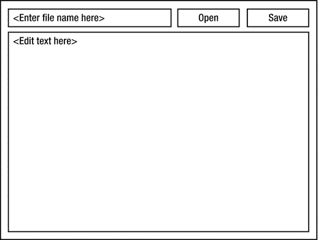

# 12.图形用户界面

在这相当短的一章中，您将学习如何为您的 Python 程序制作图形用户界面(GUI)的基础知识——您知道，带有按钮和文本字段之类的东西的窗口。Python 事实上的标准 GUI 工具包是 Tkinter，它是标准 Python 发行版的一部分。但是，还有其他几个工具包可用。这有它的优点(更大的选择自由)和缺点(其他人不能使用你的程序，除非他们安装了相同的 GUI 工具包)。幸运的是，Python 可用的各种 GUI 工具包之间没有冲突，所以您可以安装任意多的不同 GUI 工具包。

本章简要介绍了 Tkinter 的使用，我们将在第 [28](28.html) 章对此进行介绍。Tkinter 很容易使用，但如果你想使用它的所有功能，还有很多东西要学。我在这里只讲一些皮毛，以便让你继续下去；关于更多的细节，你应该参考标准图书馆参考中关于图形用户界面的章节。在那里，您可以找到 Tkinter 的文档，以及到具有更深入信息的站点的链接，以及对其他 GUI 包使用的建议。

## 构建一个示例 GUI 应用程序

为了演示如何使用 Tkinter，我将向您展示如何构建一个简单的 GUI 应用程序。你的任务是编写一个基本程序，使你能够编辑文本文件。我们不打算写一个完全成熟的文本编辑器，而是坚持要点。毕竟，目标是演示 Python 中 GUI 编程的基本机制。

这个最小文本编辑器的要求如下:

*   它必须允许你打开文本文件，给定它们的文件名。
*   它必须允许您编辑文本文件。
*   它必须允许您保存文本文件。
*   它必须允许你退出。

当编写一个 GUI 程序时，画一个你想要的草图通常是很有用的。图 [12-1](#Fig1) 显示了一个简单的布局，它满足了我们的文本编辑器的需求。



图 12-1。

A sketch of the text editor

该界面的元素可以按如下方式使用:

*   在按钮左侧的文本字段中键入文件名，然后点按“打开”以打开文件。

文件中包含的文本放在底部的文本字段中。

*   您可以在大文本栏中随心所欲地编辑文本。
*   如果要保存更改，请单击 save 按钮，该按钮将再次使用包含文件名的文本字段，并将大文本字段的内容写入文件。
*   没有退出按钮——我们将只使用默认 Tkinter 菜单中的退出命令。

这可能看起来有点令人生畏的任务，但它真的是小菜一碟。

### 初步探索

首先，您必须导入`tkinter`。为了保持其名称空间的独立性并节省一些输入，您可能需要对其进行重命名。

```py
import tkinter as tk

```

不过，如果您愿意的话，只导入它的所有内容也没什么坏处。对于一些初步的探索，让我们只使用交互式解释器。

```py
>>> from tkinter import *

```

要启动 GUI，我们可以创建一个顶层组件或小部件，它将充当我们的主窗口。我们通过实例化一个`Tk`对象来做到这一点。

```py
>>> top = Tk()

```

此时，应该会出现一个窗口。在普通程序中，我们会在这里插入对函数`mainloop`的调用，以进入 Tkinter 主事件循环，而不是简单地退出程序。在交互式解释器中不需要这样做，但是请随意尝试。

```py
>>> mainloop()

```

当 GUI 仍在工作时，解释器似乎会挂起。要继续，请退出 GUI 并重新启动解释器。

各种小部件都有很明显的名字。例如，要创建一个按钮，需要实例化`Button`类。如果没有`Tk`实例，创建一个小部件也会实例化`Tk`，所以你可以直接进入。

```py
>>> from tkinter import *
>>> btn = Button()

```

此时按钮不可见—您需要使用布局管理器(也称为几何管理器)来告诉 Tkinter 放置它的位置。我们将使用包管理器，它最简单的形式就是调用`pack`方法。

```py
>>> btn.pack()

```

小部件有各种属性，我们可以用它们来修改它们的外观和行为。这些属性就像字典字段一样可用，所以如果我们想给按钮一些文本，所需要的只是一个赋值。

```py
>>> btn['text'] = 'Click me!'

```

现在，您应该有一个类似如下的窗口:


向按钮添加一些行为也很简单。

```py
>>> def clicked():
...     print('I was clicked!')
...
>>> btn['command'] = clicked

```

如果您现在单击按钮，您应该会看到打印出来的消息。

您可以使用`config`方法一次设置几个属性，而不是单独分配。

```py
>>> btn.config(text='Click me!', command=clicked)

```

您还可以使用其构造函数来配置小部件。

```py
>>> Button(text='Click me too!', command=clicked).pack()

```

### 布局

当我们在一个小部件上调用`pack`时，它被放置在它的父小部件或主部件中。主窗口小部件可以作为可选的第一个参数提供给构造函数；如果我们不提供，将使用主顶级窗口，如下面的代码片段所示:

```py
Label(text="I'm in the first window!").pack()
second = Toplevel()
Label(second, text="I'm in the second window!").pack()

```

`Toplevel`类代表主窗口之外的顶层窗口，`Label`只是一个文本标签。

如果没有任何参数，pack 将简单地将窗口小部件堆叠在一个单独的居中的列中，从窗口的顶部开始。例如，下面的代码将生成一个又高又薄的窗口，其中只有一列按钮:

```py
for i in range(10):
    Button(text=i).pack()

```

幸运的是，您可以调整小部件的位置和拉伸。你打包一个小部件的面是由`side`参数给定的，你提供`LEFT`、`RIGHT`、`TOP`或`BOTTOM`。如果您希望小部件填充 x 或 y 方向上分配给它的空间，您可以指定一个值为`X`、`Y`或`BOTH`的`fill`。如果您希望它随着父窗口(在本例中是窗口)的增长而增长，您可以将`expand`设置为 true。还有其他选项，用于指定锚定和填充，虽然我不会在这里使用它们。要获得快速概览，您可以使用以下内容:

```py
>>> help(Pack.config)

```

还有其他布局管理器选项，可能更适合您的口味，即`grid`和`place`。你在布局的小部件上调用这些方法，就像使用`pack`一样。为了避免麻烦，你应该为一个容器使用一个布局管理器，比如一个窗口。

`grid`方法允许您通过将对象放置在不可见表格的单元格中来对其进行布局；如果小部件跨越多行或多列，您可以通过指定一个`row`和`column`以及可能的一个`rowspan`或`columnspan`来做到这一点。通过指定坐标`x`和`y`，以及小部件的`height`和`weight`，方法允许您手动放置小部件。这很少是一个好主意，但有时可能需要。这两个几何图形管理器还具有附加参数，您可以使用以下命令找到这些参数:

```py
>>> help(Grid.configure)
>>> help(Place.config)

```

### 事件处理

如您所见，我们可以通过设置`command`属性为按钮提供一个动作。这是事件处理的一种特殊形式，对此 Tkinter 也有一种更通用的机制:`bind`方法。您可以在想要处理给定类型事件的小部件上调用这个函数，指定事件的名称和要使用的函数。这里有一个例子:

```py
>>> from tkinter import *
>>> top = Tk()
>>> def callback(event):
...     print(event.x, event.y)
...
>>> top.bind('<Button-1>', callback)
'4322424456callback'

```

这里，`<Button-1>`是使用左键(按钮 1)的鼠标点击(或等效操作)的名称。我们将它绑定到回调函数，每当我们在顶部窗口中单击时都会调用该函数。事件对象被传递给回调，根据事件的种类，它有不同的属性。例如，对于鼠标点击，它提供 x 和 y 坐标，在本例中打印出来。许多其他种类的事件是可用的。您可以使用以下命令来查找列表

```py
>>> help(Tk.bind)

```

并且可以通过查阅先前描述的资源来找到进一步的信息。

### 最终方案

至此，我们已经大致了解了编写程序所需的内容。我们只需要找出用于小文本字段和大文本区域的小部件的名称。快速浏览文档告诉我们,`Entry`就是我们想要的单行文本字段。通过组合`Text`和`Scrollbar`可以构建一个多行、滚动的文本区域，但是在`tkinter.scrolledtext`模块中已经有了一个可用的实现。一个`Entry`的内容可以使用它的`get`方法提取，而对于`ScrolledText`对象，我们将使用`delete`和`insert`方法，用适当的参数来指示文本中的位置。在我们的例子中，我们将使用`'1.0'`指定第一行和第零个字符(即在第一个字符之前)，使用`END`指定文本的结尾，使用`INSERT`指定当前插入点。结果程序如清单 [12-1](#Par56) 和图 [12-2](#Fig2) 所示。


图 12-2。

The final text editor

```py
from tkinter import *
from tkinter.scrolledtext import ScrolledText

def load():
    with open(filename.get()) as file:
        contents.delete('1.0', END)
        contents.insert(INSERT, file.read())

def save():
    with open(filename.get(), 'w') as file:
        file.write(contents.get('1.0', END))

top = Tk()
top.title("Simple Editor")

contents = ScrolledText()

contents.pack(side=BOTTOM, expand=True, fill=BOTH)

filename = Entry()
filename.pack(side=LEFT, expand=True, fill=X)

Button(text='Open', command=load).pack(side=LEFT)
Button(text='Save', command=save).pack(side=LEFT)

mainloop()

Listing 12-1.Simple GUI Text Editor

```

您可以使用以下步骤尝试编辑器:

1.  运行程序。您应该得到一个类似于前面运行中的窗口。
2.  在大文本区域中键入一些内容(例如，`Hello, world!`)。
3.  在小文本字段中键入文件名(例如，`hello.txt`)。请确保该文件不存在，否则将被覆盖。
4.  单击保存按钮。
5.  退出程序。
6.  重启程序。
7.  在小文本字段中键入相同的文件名。
8.  单击打开按钮。文件的文本应该重新出现在大文本区域。
9.  随心所欲地编辑文件，然后再次保存。

现在你可以继续打开、编辑和保存，直到你厌倦为止。然后你就可以开始考虑改进了。例如，允许你的程序用`urllib`模块下载文件怎么样？

当然，你也可以考虑在你的程序中使用更多的面向对象的设计。例如，您可能希望将主应用程序作为一个定制应用程序类的实例来管理，该类具有设置各种小部件和绑定的方法。参见第 28 章中的一些例子。和任何 GUI 包一样，Tkinter 有很多小部件和其他类供您使用。您应该使用`help(tkinter)`或查阅文档来获取您想要使用的任何图形元素的信息。

## 用别的东西

大多数 GUI 工具包的基本原理大致相同。然而，不幸的是，当学习如何使用一个新的软件包时，需要花时间来找到通过所有细节的方法，使您能够准确地做您想要做的事情。因此，在决定使用哪个包之前，您应该慢慢来(例如，参见 Python 标准库参考中关于其他 GUI 包的部分)，然后沉浸在它的文档中并开始编写代码。我希望这一章已经提供了理解该文档所需的基本概念。

## 快速总结

让我们再次回顾一下我们在本章中讲述的内容:

*   图形用户界面(GUI):GUI 有助于使你的程序更加用户友好。不是所有的程序都需要图形用户界面，但是每当你的程序与用户交互时，图形用户界面可能会有所帮助。
*   Tkinter: Tkinter 是一个成熟的、广泛可用的 Python 跨平台 GUI 工具包。
*   布局:通过直接指定组件的几何图形，可以非常简单地定位组件。然而，要使它们在调整包含它们的窗口大小时行为正常，您需要使用某种布局管理器。
*   事件处理:用户执行的动作触发 GUI 工具包中的事件。为了有用，您的程序可能会被设置为对这些事件做出反应；否则，用户将无法与之交互。在 Tkinter 中，使用`bind`方法将事件处理程序添加到组件中。

### 什么现在？

就这样。你现在知道如何编写可以通过文件和图形用户界面与外界交互的程序。在下一章，你将学习许多程序系统的另一个重要组成部分:数据库。