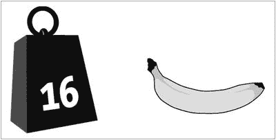
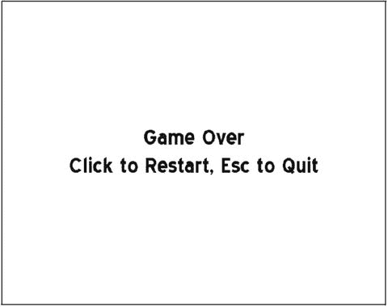
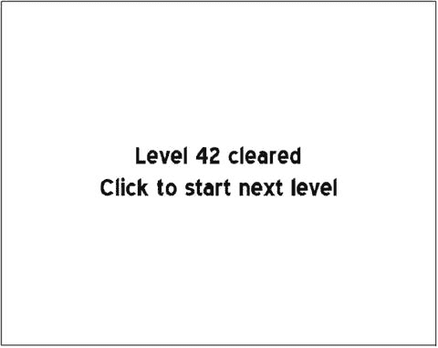
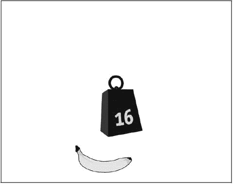
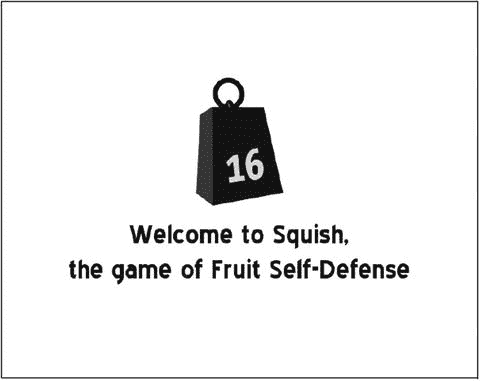

# 二十九、项目 10：自己动手的街机游戏

欢迎来到期末专题。既然您已经体验了 Python 众多功能中的几个，是时候大干一场了。在这一章中，你将学习如何使用 Pygame，一个可以让你用 Python 编写完整的全屏街机游戏的扩展。虽然很容易使用，但 Pygame 非常强大，由几个组件组成，这些组件在 Pygame 文档中有详细描述(可在 Pygame 网站上找到， [`http://pygame.org`](http://pygame.org) )。这个项目向您介绍了一些主要的 Pygame 概念，但是因为这一章只是作为一个起点，所以我跳过了几个有趣的特性，比如声音和视频处理。一旦熟悉了基础知识，我建议您自己研究一下其他特性。你可能还想看看 Will McGugan 和 Harrison Kinsley 的《Python 游戏开发入门》(Apress，2015)或 Paul Craven 的《用 Python 和 Pygame 编程街机游戏》(Apress，2016)。

## 有什么问题？

那么，如何编写一个电脑游戏呢？基本的设计过程类似于你编写其他程序时使用的过程，但是在你可以开发一个对象模型之前，你需要设计游戏本身。它的特点、背景和目标是什么？

在这里，我将保持事情相当简单，以免混淆基本 Pygame 概念的演示。如果你喜欢的话，可以随意创建一个更复杂的游戏。

我们要创建的游戏是基于著名的巨蟒剧团的小品《对新鲜水果的自卫》在这个小品中，一名军士长(约翰·克立斯饰)正在指导他的士兵如何自卫，以对付挥舞着新鲜水果的袭击者，这些水果包括石榴、糖水芒果、青果和香蕉。防御技术包括使用枪，释放老虎，并在攻击者身上放下 16 吨重的重物。在这个游戏中，我们将扭转局面——玩家控制着一只香蕉，它拼命试图在自卫过程中幸存下来，避免 16 吨重的重物从上面落下。我想一个合适的游戏名字可能是 Squish。

Note

如果你想在阅读本章的时候尝试自己的游戏，请随意。如果您只是想改变游戏的外观和感觉，只需替换图形(一些 GIF 或 PNG 图像)和一些描述性文本。

这个项目的具体目标围绕着游戏设计。游戏应该按照设计的那样运行(香蕉应该是可移动的，16 吨的重量应该从上面落下)。此外，代码应该是模块化的，易于扩展(一如既往)。一个有用的需求可能是游戏状态(比如游戏介绍、各种游戏关卡和“游戏结束”状态)应该是设计的一部分，并且新的状态应该易于添加。

## 有用的工具

这个项目中唯一需要的新工具是 Pygame，可以从 Pygame 网站( [`http://pygame.org`](http://pygame.org) )下载。要让 Pygame 在 UNIX 中运行，您可能需要安装一些额外的软件，但是这些都记录在 Pygame 安装说明中(也可以从 Pygame 网站上获得)。与大多数 Python 包一样，最简单的选择可能是使用`pip`简单地安装 Pygame。

Pygame 发行版包含几个模块，其中大部分在这个项目中是不需要的。以下部分描述了您确实需要的模块。(这里只讨论您需要的特定函数或类。)除了下面几节中描述的函数之外，所使用的各种对象(如曲面、组和精灵)还有几个有用的方法，我将在实现一节中讨论这些方法。

### 皮尤游戏

`pygame`模块自动导入所有其他 Pygame 模块，所以如果你把`import pygame`放在程序的顶部，你可以自动访问其他模块，比如`pygame.display`和`pygame.font`。

`pygame`模块包含了`Surface`函数，它返回一个新的表面对象。表面对象只是给定大小的空白图像，可用于绘图和位图传送。blit(调用一个表面对象的`blit`方法)仅仅意味着将一个表面的内容转移到另一个表面。(blit 这个词来源于技术术语 block transfer，缩写为 BLT。)

功能是任何 Pygame 游戏的核心。它必须在游戏进入主事件循环之前被调用。该功能自动初始化所有其他模块(如`font`和`image`)。

当您想要捕捉特定于 Pygame 的错误时，您需要使用`error`类。

### pygame.locals

`pygame.locals`模块包含了您可能想在自己的模块范围内使用的名字(变量)。它包含事件类型、按键、视频模式等的名称。它被设计成当你导入所有东西(`from pygame.locals import *`)时可以安全使用，尽管如果你知道你需要什么，你可能想要更具体一些(例如，`from pygame.locals import FULLSCREEN`)。

### pygame .显示器

`pygame.display`模块包含处理 Pygame 显示的函数，这些函数可以包含在普通窗口中，也可以占据整个屏幕。在这个项目中，您需要以下功能:

*   `flip`:更新显示。通常，当您修改当前屏幕时，可以分两步完成。首先，对从`get_surface`函数返回的表面对象执行所有必要的修改，然后调用`pygame.display.flip`来更新显示以反映您的更改。
*   `update`:当您只想更新屏幕的一部分时，代替`flip`。它可以与从`RenderUpdates`类的`draw`方法返回的矩形列表(在即将到来的`pygame.sprite`模块的讨论中描述)一起用作它的唯一参数。
*   `set_mode`:设置显示尺寸和显示类型。有几种可能的变化，但是这里您将限制自己使用`FULLSCREEN`版本和默认的“在窗口中显示”版本。
*   `set_caption`:设置 Pygame 程序的标题。当你在一个窗口(相对于全屏)中运行游戏时，`set_caption`功能非常有用，因为标题被用作窗口标题。
*   `get_surface`:在调用`pygame.display.flip`或`pygame.display.blit`之前，返回一个你可以在上面绘制图形的表面对象。这个项目中唯一用于绘图的表面方法是`blit`，它将一个表面对象中的图形转移到另一个给定位置的表面对象上。(此外，`Group`对象的`draw`方法将用于在显示面上绘制`Sprite`对象。)

### 皮游戏字体

`pygame.font`模块包含了`Font`函数。字体对象用于表示不同的字体。它们可以用来将文本呈现为图像，然后在 Pygame 中用作普通图形。

### 皮格，雪碧

`pygame.sprite`模块包含两个非常重要的类:`Sprite`和`Group`。

`Sprite`类是所有可见游戏对象的基类——在这个项目中，是香蕉和 16 吨重的物体。为了实现你自己的游戏对象，你子类化`Sprite`，覆盖它的构造函数来设置它的`image`和`rect`属性(它们决定了`Sprite`的外观和放置位置)，并覆盖它的`update`方法，每当 sprite 可能需要更新时就会调用这个方法。

`Group`类(及其子类)的实例被用作`Sprite`的容器。一般来说，使用组是一件好事。在简单的游戏中(比如在这个项目中)，只需创建一个名为`sprites`或`allsprites`或类似的群组，并将你所有的`Sprite`加入其中。当您调用`Group`对象的`update`方法时，您所有`Sprite`对象的`update`方法将被自动调用。此外，`Group`对象的`clear`方法用于擦除它包含的所有`Sprite`对象(使用回调进行擦除)，而`draw`方法可用于绘制所有的`Sprite`对象。

在这个项目中，您将使用`Group`的`RenderUpdates`子类，它的`draw`方法返回一个受影响的矩形列表。然后，这些可以被传递到`pygame.display.update`以仅更新显示器中需要更新的部分。这可能会大大提高游戏的性能。

### pygame 鼠标

在 Squish 中，您将使用`pygame.mouse`模块做两件事:隐藏鼠标光标和获取鼠标位置。你用`pygame.mouse.set_visible(False)`隐藏鼠标，用`pygame.mouse.get_pos()`得到位置。

### pygame.event

`pygame.event`模块跟踪各种事件，比如鼠标点击、鼠标运动、按键被按下或释放等等。要获得最近事件的列表，使用函数`pygame.event.get`。

Note

如果仅仅依靠`pygame.mouse.get_pos`返回的鼠标位置等状态信息，就不需要使用`pygame.event.get`。然而，你需要保持 Pygame 的更新(“同步”)，这可以通过定期调用函数`pygame.event.pump`来实现。

### 游戏，图像

`pygame.image`模块用于处理以 GIF、PNG、JPEG 和其他几种文件格式存储的图像。在这个项目中，您只需要`load`函数，它读取一个图像文件并创建一个包含该图像的表面对象。

## 准备

现在你已经知道了一些不同的 Pygame 模块是做什么的，是时候开始破解第一个原型游戏了。但是，在启动原型并运行之前，您需要做一些准备工作。首先你要确定你安装了 Pygame，包括`image`和`font`模块。(您可能希望在交互式 Python 解释器中导入这两者，以确保它们可用。)

你还需要几张图片。如果你想坚持这一章提出的游戏主题，你需要一张描绘 16 吨重的图片和一张描绘香蕉的图片，这两张图片都显示在图 [29-1](#Fig1) 中。它们的确切大小并不重要，但您可能希望它们保持在 100 × 100 到 200 × 200 像素的范围内。这两个图像应该以通用的图像文件格式提供，比如 GIF、PNG 或 JPEG。



图 29-1。

The weight and banana graphics used in my version of the game Note

你可能还需要一个单独的启动画面，第一个欢迎游戏用户的画面。在这个项目中，我也简单地使用了重量符号。

## 首次实施

当您使用 Pygame 这样的新工具时，保持第一个原型尽可能简单并专注于学习新工具的基础知识，而不是程序本身的复杂性，通常会有所回报。让我们将 Squish 的第一个版本限制为一个 16 吨重的重物从上面落下的动画。为此所需的步骤如下:

1.  使用`pygame.init`、`pygame.display.set_mode`和`pygame.mouse.set_visible`初始化 Pygame。用`pygame.display.get_surface`得到屏幕表面。用纯白填充屏幕表面(用`fill`方法)并调用`pygame.display.flip`显示这一变化。
2.  加载重量图像。
3.  使用图像创建一个自定义`Weight`类的实例(一个`Sprite`的子类)。将该对象添加到一个名为`sprites`的`RenderUpdates`组中。(这在处理多个精灵的时候会特别有用。)
4.  用`pygame.event.get`获取所有最近的事件。依次检查所有事件。如果发现类型为`QUIT`的事件，或者如果发现代表退出键(`K_ESCAPE`)的类型为`KEYDOWN`的事件，退出程序。(事件类型和键保存在事件对象的属性`type`和`key`中。可以从`pygame.locals`模块导入`QUIT`、`KEYDOWN`和`K_ESCAPE`等常量。)
5.  调用`sprites`组的`clear`和`update`方法。`clear`方法使用回调来清除所有精灵(在本例中是权重)，`update`方法调用`Weight`实例的`update`方法。(后一种方法必须自己实现。)
6.  以屏幕表面为参数调用`sprites.draw`，在当前位置绘制`Weight` sprite。(每次调用`update`时，这个位置都会改变。)
7.  用从`sprites.draw`返回的矩形列表调用`pygame.display.update`,只在正确的地方更新显示。(如果你不需要这个性能，你可以在这里使用`pygame.display.flip`来更新整个显示。)
8.  重复步骤 4 到 7。

参见清单 [29-1](#Par42) 中实现这些步骤的代码。如果用户退出游戏，例如关闭窗口，就会发生`QUIT`事件。

```py
import sys, pygame
from pygame.locals import *
from random import randrange

class Weight(pygame.sprite.Sprite):

    def __init__(self, speed):
        pygame.sprite.Sprite.__init__(self)
        self.speed = speed
        # image and rect used when drawing sprite:
        self.image = weight_image
        self.rect = self.image.get_rect()
        self.reset()

    def reset(self):
        """
        Move the weight to a random position at the top of the screen.
        """
        self.rect.top = -self.rect.height
        self.rect.centerx = randrange(screen_size[0])

    def update(self):
        """
        Update the weight for display in the next frame.
        """
        self.rect.top += self.speed

        if self.rect.top > screen_size[1]:
            self.reset()

# Initialize things
pygame.init()
screen_size = 800, 600
pygame.display.set_mode(screen_size, FULLSCREEN)
pygame.mouse.set_visible(0)

# Load the weight image
weight_image = pygame.image.load('weight.png')
weight_image = weight_image.convert() # ... to match the display

# You might want a different speed, of courase
speed = 5

# Create a sprite group and add a Weight
sprites = pygame.sprite.RenderUpdates()
sprites.add(Weight(speed))

# Get the screen surface and fill it
screen = pygame.display.get_surface()
bg = (255, 255, 255) # White
screen.fill(bg)
pygame.display.flip()

# Used to erase the sprites:
def clear_callback(surf, rect):
    surf.fill(bg, rect)

while True:
    # Check for quit events:
    for event in pygame.event.get():
        if event.type == QUIT:
            sys.exit()
        if event.type == KEYDOWN and event.key == K_ESCAPE:
            sys.exit()
    # Erase previous positions:
    sprites.clear(screen, clear_callback)
    # Update all sprites:
    sprites.update()
    # Draw all sprites:
    updates = sprites.draw(screen)
    # Update the necessary parts of the display:
    pygame.display.update(updates)

Listing 29-1.A Simple “Falling Weights” Animation (weights.py)

```

您可以使用以下命令运行该程序:

```py
$ python weights.py

```

在执行这个命令时，应该确保`weights.py`和`weight.png`(权重图像)都在当前目录中。图 [29-2](#Fig2) 显示了结果的截图。


图 29-2。

A simple animation of falling weights

大部分代码应该是不言自明的。然而，有几点需要解释一下:

*   所有的 sprite 对象都应该有两个名为`image`和`rect`的属性。前者应该包含一个 surface 对象(一个图像)，后者应该包含一个 rectangle 对象(只需用`self.image.get_rect()`初始化即可)。这两个属性将在绘制精灵时使用。通过修改`self.rect`，可以四处移动精灵。
*   表面对象有一个叫做`convert`的方法，可以用来创建一个不同颜色模型的副本。您不需要担心细节，但是使用没有任何参数的`convert`会创建一个为当前显示定制的表面，并且显示它会尽可能快。
*   颜色通过 RGB 三元组(红绿蓝，每个值为 0-255)来指定，因此元组`(255, 255, 255)`表示白色。

通过为矩形的属性(`top`、`bottom`、`left`、`right`、`topleft`、`topright`、`bottomleft`、`bottomright`、`size`、`width`、`height`、`center`、`centerx`、`centery`、`midleft`、`midright`、`midtop`和`midbottom`)赋值，或者调用`inflate`或`move`等方法，可以修改矩形(例如本例中的`self.rect`)。(这些都在 [`http://pygame.org/docs/ref/rect.html`](http://pygame.org/docs/ref/rect.html) 的 Pygame 文档中有描述。)

既然 Pygame 的技术细节已经到位，是时候扩展和重构游戏逻辑了。

## 第二次实施

在这一节中，我没有一步一步地向您介绍设计和实现，而是向源代码添加了大量的注释和文档字符串，如清单 [29-2](#Par42) 到 [29-4](#Par62) 所示。您可以检查源(“使用源”，还记得吗？)来看看它是如何工作的，但这里有一个要点的简短纲要(和一些不太直观的细节):

*   游戏由五个文件组成:`config.py`，包含各种配置变量；`objects.py`，包含游戏对象的实现；`squish.py`，包含主`Game`类和各种游戏状态类；还有`weight.png`和`banana.png`，游戏中用到的两个形象。
*   rectangle 方法`clamp`确保一个矩形被放置在另一个矩形内，如果必要的话移动它。这用于确保香蕉不会移出屏幕。
*   rectangle 方法`inflate`在水平和垂直方向上按给定的像素数调整矩形的大小。这用于缩小香蕉边界，以便在记录点击(或“挤压”)之前，允许香蕉和权重之间有一些重叠。
*   游戏本身由一个游戏对象和各种游戏状态组成。游戏对象一次只有一个状态，状态负责处理事件并在屏幕上显示自己。一个状态也可以告诉游戏切换到另一个状态。(`Level`状态可以例如告诉游戏切换到`GameOver`状态。)

就这样。您可以通过执行`squish.py`文件来运行游戏，如下所示:

```py
$ python squish.py

```

您应该确保其他文件在同一目录中。在 Windows 中，您可以简单地双击`squish.py`文件。

```py
# Configuration file for Squish
# -----------------------------

# Feel free to modify the configuration variables below to taste.
# If the game is too fast or too slow, try to modify the speed
# variables.

# Change these to use other images in the game:
banana_image = 'banana.png'
weight_image = 'weight.png'
splash_image = 'weight.png'

# Change these to affect the general appearance:
screen_size = 800, 600
background_color = 255, 255, 255
margin = 30
full_screen = 1
font_size = 48

# These affect the behavior of the game:
drop_speed = 1
banana_speed = 10
speed_increase = 1
weights_per_level = 10
banana_pad_top = 40
banana_pad_side = 20

Listing 29-2.The Squish Configuration File (config.py)

```

```py
import pygame, config, os
from random import randrange

"This module contains the game objects of the Squish game."

class SquishSprite(pygame.sprite.Sprite):

    """
    Generic superclass for all sprites in Squish. The constructor
    takes care of loading an image, setting up the sprite rect, and
    the area within which it is allowed to move. That area is governed
    by the screen size and the margin.
    """

    def __init__(self, image):
        super().__init__()
        self.image = pygame.image.load(image).convert()
        self.rect = self.image.get_rect()
        screen = pygame.display.get_surface()
        shrink = -config.margin * 2
        self.area = screen.get_rect().inflate(shrink, shrink)

class Weight(SquishSprite):

    """
    A falling weight. It uses the SquishSprite constructor to set up
    its weight image, and will fall with a speed given as a parameter
    to its constructor.
    """

    def __init__(self, speed):
        super().__init__(config.weight_image)
        self.speed = speed
        self.reset()

    def reset(self):
        """
        Move the weight to the top of the screen (just out of sight)
        and place it at a random horizontal position.
        """
        x = randrange(self.area.left, self.area.right)
        self.rect.midbottom = x, 0

    def update(self):
        """
        Move the weight vertically (downwards) a distance
        corresponding to its speed. Also set the landed attribute
        according to whether it has reached the bottom of the screen.
        """
        self.rect.top += self.speed
        self.landed = self.rect.top >= self.area.bottom

class Banana(SquishSprite):

    """
    A desperate banana. It uses the SquishSprite constructor to set up
    its banana image, and will stay near the bottom of the screen,
    with its horizontal position governed by the current mouse
    position (within certain limits).
    """

    def __init__(self):
        super().__init__(config.banana_image)
        self.rect.bottom = self.area.bottom
        # These paddings represent parts of the image where there is
        # no banana. If a weight moves into these areas, it doesn't
        # constitute a hit (or, rather, a squish):
        self.pad_top = config.banana_pad_top
        self.pad_side = config.banana_pad_side

    def update(self):
        """
        Set the Banana's center x-coordinate to the current mouse
        x-coordinate, and then use the rect method clamp to ensure
        that the Banana stays within its allowed range of motion.
        """
        self.rect.centerx = pygame.mouse.get_pos()[0]
        self.rect = self.rect.clamp(self.area)

    def touches(self, other):

        """
        Determines whether the banana touches another sprite (e.g., a
        Weight). Instead of just using the rect method colliderect, a
        new rectangle is first calculated (using the rect method
        inflate with the side and top paddings) that does not include
        the 'empty' areas on the top and sides of the banana.
        """
        # Deflate the bounds with the proper padding:
        bounds = self.rect.inflate(-self.pad_side, -self.pad_top)
        # Move the bounds so they are placed at the bottom of the Banana:
        bounds.bottom = self.rect.bottom
        # Check whether the bounds intersect with the other object's rect:
        return bounds.colliderect(other.rect)

Listing 29-3.The Squish Game Objects

(objects.py)

```

```py
import os, sys, pygame
from pygame.locals import *
import objects, config

"This module contains the main game logic of the Squish game."

class State:

    """
    A generic game state class that can handle events and display
    itself on a given surface.
    """

    def handle(self, event):
        """
        Default event handling only deals with quitting.
        """
        if event.type == QUIT:
            sys.exit()
        if event.type == KEYDOWN and event.key == K_ESCAPE:
            sys.exit()

    def first_display(self, screen):
        """
        Used to display the State for the first time. Fills the screen
        with the background color.
        """
        screen.fill(config.background_color)
        # Remember to call flip, to make the changes visible:
        pygame.display.flip()

    def display(self, screen):
        """
        Used to display the State after it has already been displayed
        once. The default behavior is to do nothing.
        """
        pass

class Level(State):
    """
    A game level. Takes care of counting how many weights have been
    dropped, moving the sprites around, and other tasks relating to
    game logic.
    """

    def __init__(self, number=1):
        self.number = number
        # How many weights remain to dodge in this level?
        self.remaining = config.weights_per_level

        speed = config.drop_speed
        # One speed_increase added for each level above 1:
        speed += (self.number-1) * config.speed_increase
        # Create the weight and banana:
        self.weight = objects.Weight(speed)
        self.banana = objects.Banana()
        both = self.weight, self.banana # This could contain more sprites...
        self.sprites = pygame.sprite.RenderUpdates(both)

    def update(self, game):
        "Updates the game state from the previous frame."
        # Update all sprites:
        self.sprites.update()
        # If the banana touches the weight, tell the game to switch to
        # a GameOver state:
        if self.banana.touches(self.weight):
            game.next_state = GameOver()
        # Otherwise, if the weight has landed, reset it. If all the
        # weights of this level have been dodged, tell the game to
        # switch to a LevelCleared state:
        elif self.weight.landed:
            self.weight.reset()
            self.remaining -= 1
            if self.remaining == 0:
                game.next_state = LevelCleared(self.number)

    def display(self, screen):

        """
        Displays the state after the first display (which simply wipes
        the screen). As opposed to firstDisplay, this method uses
        pygame.display.update with a list of rectangles that need to
        be updated, supplied from self.sprites.draw.
        """
        screen.fill(config.background_color)
        updates = self.sprites.draw(screen)
        pygame.display.update(updates)

class Paused(State):
    """
    A simple, paused game state, which may be broken out of by pressing
    either a keyboard key or the mouse button.
    """

    finished = 0 # Has the user ended the pause?
    image = None # Set this to a file name if you want an image
    text = ''    # Set this to some informative text

    def handle(self, event):
        """
        Handles events by delegating to State (which handles quitting
        in general) and by reacting to key presses and mouse
        clicks. If a key is pressed or the mouse is clicked,
        self.finished is set to true.
        """
        State.handle(self, event)
        if event.type in [MOUSEBUTTONDOWN, KEYDOWN]:
            self.finished = 1

    def update(self, game):
        """
        Update the level. If a key has been pressed or the mouse has
        been clicked (i.e., self.finished is true), tell the game to
        move to the state represented by self.next_state() (should be
        implemented by subclasses).
        """
        if self.finished:
            game.next_state = self.next_state()

    def first_display(self, screen):
        """
        The first time the Paused state is displayed, draw the image
        (if any) and render the text.
        """
        # First, clear the screen by filling it with the background color:
        screen.fill(config.background_color)

        # Create a Font object with the default appearance, and specified size:
        font = pygame.font.Font(None, config.font_size)

        # Get the lines of text in self.text, ignoring empty lines at
        # the top or bottom:
        lines = self.text.strip().splitlines()

        # Calculate the height of the text (using font.get_linesize()
        # to get the height of each line of text):
        height = len(lines) * font.get_linesize()

        # Calculate the placement of the text (centered on the screen):
        center, top = screen.get_rect().center
        top -= height // 2

        # If there is an image to display...
        if self.image:
            # load it:
            image = pygame.image.load(self.image).convert()
            # get its rect:
            r = image.get_rect()
            # move the text down by half the image height:
            top += r.height // 2
            # place the image 20 pixels above the text:
            r.midbottom = center, top - 20
            # blit the image to the screen:
            screen.blit(image, r)

        antialias = 1   # Smooth the text
        black = 0, 0, 0 # Render it as black

        # Render all the lines, starting at the calculated top, and
        # move down font.get_linesize() pixels for each line:
        for line in lines:
            text = font.render(line.strip(), antialias, black)
            r = text.get_rect()
            r.midtop = center, top
            screen.blit(text, r)
            top += font.get_linesize()

        # Display all the changes:
        pygame.display.flip()

class Info(Paused):

    """
    A simple paused state that displays some information about the
    game. It is followed by a Level state (the first level).
    """

    next_state = Level
    text = '''
    In this game you are a banana,
    trying to survive a course in
    self-defense against fruit, where the
    participants will "defend" themselves
    against you with a 16 ton weight.'''

class StartUp(Paused):

    """
    A paused state that displays a splash image and a welcome
    message. It is followed by an Info state.
    """

    next_state = Info
    image = config.splash_image
    text = '''
    Welcome to Squish,
    the game of Fruit Self-Defense'''

class LevelCleared(Paused):
    """
    A paused state that informs the user that he or she has cleared a
    given level. It is followed by the next level state.
    """

    def __init__(self, number):
        self.number = number
        self.text = '''Level {} cleared
        Click to start next level'''.format(self.number)

    def next_state(self):
        return Level(self.number + 1)

class GameOver(Paused):

    """
    A state that informs the user that he or she has lost the
    game. It is followed by the first level.
    """

    next_state = Level
    text = '''
    Game Over
    Click to Restart, Esc to Quit'''

class Game:

    """
    A game object that takes care of the main event loop, including
    changing between the different game states.
    """

    def __init__(self, *args):
        # Get the directory where the game and the images are located:
        path = os.path.abspath(args[0])
        dir = os.path.split(path)[0]
        # Move to that directory (so that the image files may be
        # opened later on):
        os.chdir(dir)
        # Start with no state:
        self.state = None
        # Move to StartUp in the first event loop iteration:
        self.next_state = StartUp()

    def run(self):
        """
        This method sets things in motion. It performs some vital
        initialization tasks, and enters the main event loop.
        """
        pygame.init() # This is needed to initialize all the pygame modules

        # Decide whether to display the game in a window or to use the
        # full screen:
        flag = 0                  # Default (window) mode

        if config.full_screen:
            flag = FULLSCREEN     # Full screen mode
        screen_size = config.screen_size
        screen = pygame.display.set_mode(screen_size, flag)

        pygame.display.set_caption('Fruit Self Defense')
        pygame.mouse.set_visible(False)

        # The main loop:
        while True:
            # (1) If nextState has been changed, move to the new state, and
            #     display it (for the first time):
            if self.state != self.next_state:
                self.state = self.next_state
                self.state.first_display(screen)
            # (2) Delegate the event handling to the current state:
            for event in pygame.event.get():
                self.state.handle(event)
            # (3) Update the current state:
            self.state.update(self)
            # (4) Display the current state:
            self.state.display(screen)

if __name__ == '__main__':
    game = Game(*sys.argv)

    game.run()

Listing 29-4.The Main Game Module (squish.py)

```

游戏的部分截图如图 [29-3](#Fig3) 到 [29-6](#Fig6) 所示。



图 29-6。

The “game over” screen



图 29-5。

The “level cleared” screen



图 29-4。

A banana about to be squished



图 29-3。

The Squish opening screen

## 进一步探索

以下是一些改进游戏的方法:

*   给它加上声音。
*   记录分数。例如，每躲开一个重量可以值 16 点。留个高分档案怎么样？或者甚至是一个在线高分服务器(使用`asyncore`或 XML-RPC，分别在第 [24 章](24.html)和第 [27 章](27.html)中讨论)？
*   让更多的物体同时落下。
*   颠倒一下逻辑:让玩家尝试被击中，而不是躲避，就像彼得·古德(Peter Goode)的老 Memotech 游戏《抓蛋者》(Egg Catcher)一样，这是 Squish 的主要灵感来源。
*   给玩家不止一条“命”
*   创建游戏的独立可执行文件。(详见第 [18 章](18.html)。)

关于 Pygame 编程的一个更复杂(也非常有趣)的例子，可以看看 Pygame 维护者 Pete Shinners 的 SolarWolf 游戏( [`http://www.pygame.org/`](http://www.pygame.org/) `shredwheat/solarwolf`)。你可以在 Pygame 网站上找到大量的信息和其他几款游戏。如果玩 Pygame 让你迷上了游戏开发，你可能会想去看看像 [`http://www.gamedev.net`](http://www.gamedev.net) 或 [`http://gamedev.stackexchange.com`](http://gamedev.stackexchange.com) 这样的网站。网络搜索应该会给你很多类似的网站。

### 什么现在？

嗯，就是这样。你已经完成了最后一个项目。如果你评估你已经完成的事情(假设你已经跟踪了所有的项目)，你应该会对自己留下深刻的印象。所展示主题的广度让您领略了 Python 编程世界中等待您的各种可能性。我希望到目前为止您已经享受了这次旅行，并祝您在作为 Python 程序员的继续旅程中好运。