# 五、基于 Raspberry Pi 的传感器节点

使用 XBee 模块和微控制器托管传感器是构建传感器网络的一种经济方式。但是，当您需要的计算能力超过微控制器所能提供的能力时，该怎么办呢？如果您需要将数据转换为不同的格式，将数据合并到应用程序中，或者打印传感器数据的硬拷贝，该怎么办？在这些情况下，您可能需要一台处理能力更强、能够使用常见应用程序、允许使用脚本语言并能访问外围设备的计算机。

虽然个人电脑相对便宜，但在传感器网络中使用个人电脑有一些明显的缺点，尤其是作为传感器节点。如果传感器位于主电源不可靠或不可用的区域，或者存在过热风险的区域，或者根本没有安装个人计算机的空间的区域，则必须将数据传输到另一个节点进行处理，或者将其存储在本地，以后再进行处理。

然而，使用个人计算机作为传感器节点还有另一个限制:个人计算机没有通用输入/输出(I/O)端口。您可以购买扩展卡来收集数据，但这些扩展卡通常是为服务器或台式计算机而设计的。如果考虑计算机和数据采集卡的成本，传感器节点的成本就变得不经济了。

那么，在这些情况下你会怎么做？要是有一台低成本的计算机就好了，它具有足够的处理能力和内存，使用标准外围设备，支持可编程 I/O 端口、，并且外形小巧。这正是树莓派能做到的。

本章探讨如何开始使用 Raspberry Pi，包括如何使用系统以及如何使用 I/O 端口读取传感器。您还将探索几种类型的传感器，并研究如何从它们读取数据的差异。

Note

我们将涵盖树莓 Pi 3B 和最新的树莓 Pi 4B。你可以在这本书的项目中使用任何一个，但大多数数字描绘的是树莓派 3B 和 3B+。幸运的是，所有的 GPIO 连接在 3B、3B+和 4B 板上是相同的。

## 什么是树莓派？

Raspberry Pi 是一款小型廉价的个人电脑。虽然它缺乏 RAM(随机存取存储器)扩展的能力，也没有 CD、DVD 和硬盘等板载设备，但它拥有简单个人电脑所需的一切。也就是说，它有四个 USB 端口(Raspberry Pi 3 有 2.0 端口，Raspberry Pi 4B 有两个 USB 2.0 和两个 USB 3 端口)，一个以太网端口，HDMI 视频，甚至还有一个用于声音的音频连接器。

Raspberry Pi 有一个 SD 驱动器 <sup>[3](#Fn3)</sup> ，你可以用它来引导电脑进入几个 Linux 操作系统中的任何一个。您只需要一根 HDMI 电缆和显示器(或带有 HDMI 转 DVI 适配器的 DVI 电缆和显示器)、一个 USB 键盘和鼠标，以及一个 5V 电源，就可以开始运行了。

Note

在撰写本文时，还不能在 Raspberry Pi 4B 上从 USB 驱动器启动。博客暗示这一功能将很快可用。当它可用时，您可以通过将操作系统移动到 USB 驱动器来轻松创建更快的引导系统。

您也可以使用电脑上的 USB 端口为您的 Raspberry Pi 供电。在这种情况下，您需要一根 USB A 型公头转微型 USB B 型公头电缆(3B Raspberry Pi)或 USB A 型公头转 USB-C 公头电缆。将 type A 端插入电脑上的 USB 端口，将 micro-USB type B/USB-C 端插入 Raspberry Pi 电源端口。

该板有多种版本，裸板价格低至 35.00 美元。较新的 Raspberry Pi 4B 有 1GB、2GB、4GB 或 8GB 版本(只有内存不同)，价格从 35 美元到 65 美元不等。可以从 SparkFun 和 Adafruit 等电子产品供应商那里在线购买。一些百思买零售商已经开始销售 Raspberry Pi 4B 2GB 主板以及基本配件(如外壳、电源)。大多数在线供应商都有一系列附件，这些附件已经过测试和验证，可以与 Raspberry Pi 一起使用。这些设备包括小型显示器、微型键盘，甚至用于安装主板的机箱。

在本节中，您将探索 Raspberry Pi 的起源，浏览硬件连接，并了解开始使用 Raspberry Pi 需要哪些附件。

### 高贵的出身

Raspberry Pi 旨在成为一个探索计算机科学主题的平台。设计者看到了提供廉价、易操作的计算机的需要，这种计算机可以被编程以与诸如伺服电机、显示设备和传感器之类的硬件交互。他们还想打破在个人电脑上花费数百美元的模式，从而让更多的人可以使用电脑。

设计者观察到学生进入计算机科学课程的体验下降。学生们在进入他们的学年时，对计算机系统、硬件或编程很少或没有经验，而不是在编程或硬件方面有一些经验。相反，学生们精通互联网技术和应用。其中一个因素是个人电脑的成本更高，更复杂，这意味着父母不愿意让他们的孩子在家用电脑上做实验。

这给学术机构带来了挑战，它们不得不调整课程，让计算机科学迎合学生的口味。由于学生缺乏兴趣或能力，他们不得不放弃较低级别的硬件和软件课题。学生们不再希望学习计算机科学的基础知识，如汇编语言、操作系统、计算理论和并发编程。相反，他们希望学习更高级的语言来开发应用程序和 web 服务。因此，一些学术机构不再提供基础计算机科学的课程。这可能会导致未来几代计算机专业人员知识和技能的流失。

为了应对这种趋势，树莓派的设计者认为，配备了正确的平台，年轻人可以回到个人电脑的实验中，因为在那个时代，个人电脑需要更大的承诺来学习系统和编程，以满足你的需求。例如，久负盛名的 Commodore 64、Amiga 以及早期的苹果和 IBM 个人电脑提供的软件非常有限。拥有许多这样的机器后，我在很小的时候就接触到了编程的奇迹和发现。 <sup>[5](#Fn5)</sup>

Why is it Called Raspberry Pi?

这个名字部分来源于设计委员会的贡献，部分是为了延续以水果命名新计算平台的传统(想想吧)。Pi 部分来自 Python，因为设计者希望 Python 成为计算机编程的首选语言。但是，也有其他编程语言可供选择。

Raspberry Pi 试图提供一个鼓励实验的廉价平台。以下部分将探讨更多有关 Raspberry Pi 的信息，包括可用的型号、所需的附件以及在哪里购买主板。

### 模型

Raspberry Pi 板目前有两种型号分类:型号 A 和型号 b。早期的型号 A 板是第一批大规模生产的板，具有 256MB 的 RAM，一个 USB 端口，没有以太网端口。紧随其后的是第一个 B 型板，它有 512MB 的内存，两个 USB 端口和一个以太网端口。图 [5-1](#Fig1) 显示了型号 A 板的版本 3 变体，命名为 Raspberry Pi 3A+。


图 5-1

树莓派 3A+(由树莓派基金会提供)

What Does The “+” Mean?

型号名称中的“+”符号表示它是同一版本的更新版本，只是做了一些改进。例如，3B+包括一个稍快的处理器和一系列细微的改进。通常，这些主板实际上是相同的，您可能不会注意到差异，但是如果您想要“最新”或“更好”的主板，您会想要带有“+”标志的主板。

图 [5-2](#Fig2) 显示了被指定为树莓派 3B+的版本 3 模型 B 板。请注意，电路板稍微大了一点，连接也多了。

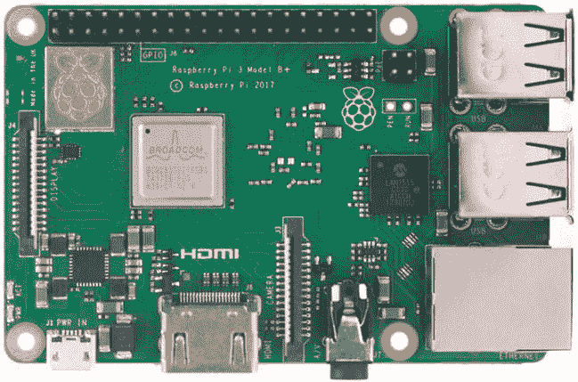

图 5-2

树莓派 3B+(由树莓派基金会提供)

图 [5-3](#Fig3) 显示了被指定为 Raspberry Pi 4B 的最新型号 B 板。该图描述了 3B+型号的一些改进，包括更多 RAM、USB-C 电源、两个 HDMI 端口和 USB 3 支持。另外，它是迄今为止最快的树莓派电脑！

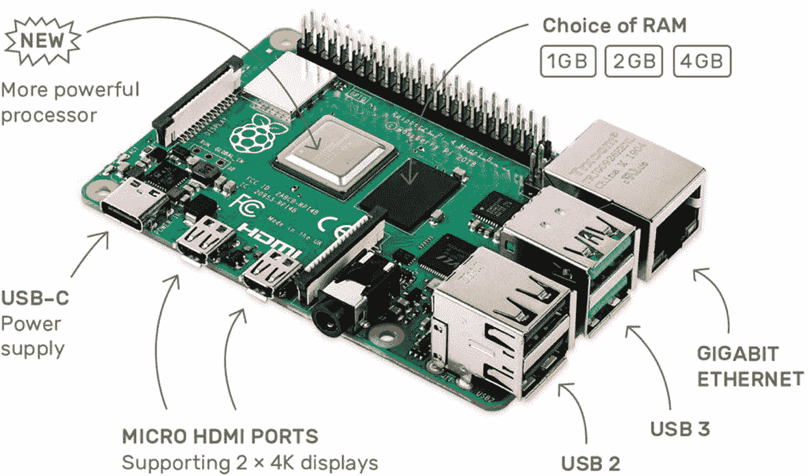

图 5-3

Raspberry Pi 4B(由 Raspberry Pi 基金会提供)

你经常可以在网上零售商和拍卖网站上找到树莓派 3A+的产品，价格比树莓派 3B+板略低。最新的 Raspberry Pi 4B 仍然需求量很大，因此您可能需要支付更多的价格来购买这些主板，但请货比三家，寻找建议零售价为 35 美元(1GB)、45 美元(2GB)、55 美元(4GB)或 91 美元(8GB)的零售商。如果您计划使用 Raspberry Pi 进行实验，并且不需要额外的内存来运行内存密集型应用程序，您可以使用 Raspberry Pi 3A+。

Tip

对于本书中的项目，建议使用树莓 Pi 3B+或最新的树莓 4B。本章和其余章节中的示例使用 B 型变型——树莓派 3B+或 4B。

### 董事会之旅

不比一副扑克牌大多少，Raspberry Pi 板包含许多用于连接设备的端口。本节介绍电路板的概况。如果你想跟着你的冲浪板走，拿着它，让树莓派的标志朝上。我将顺时针绕着棋盘工作。图 [5-4](#Fig4) 描绘了带有所有主要连接器标签的电路板图。


图 5-4

树莓派 3B+(由树莓派基金会提供)

在近侧的中央，您可以看到一个 HDMI 连接器。HDMI 连接器的左侧是 micro-USB 电源连接器，右侧是摄像头连接器和音频连接器。众所周知，某些主板上的电源连接器有点脆弱，所以插拔时要小心。使用您的树莓派时，请务必避免给这根电缆带来额外的压力。

在电路板的左侧，我们可以看到 WiFi 芯片的位置。microSD 卡连接器位于电路板的下侧。有趣的是，大多数保护套都不是为了保护 microSD 卡而设计的。安装后，microSD 卡会突出主板几厘米。

电路板的另一侧是通用输入/输出(GPIO)接头(双排 20 个引脚)，可用于连接传感器和其它器件。在本章的后面，您将使用该连接器。

电路板的右侧是四个 USB 连接器和一个以太网连接器。连接到 Raspberry Pi 上的 USB 端口的外部供电 USB 集线器可以为一些电路板供电，但建议您使用连接到 micro-USB 连接器的专用电源。

Caution

因为板子很小，所以很容易把它用在不稳定的地方，比如在行驶中的汽车上或凌乱的桌子上。确保您的 Raspberry Pi 放在安全的地方。micro-USB 电源和 microSD 卡插槽似乎最容易损坏。 <sup>[6](#Fn6)</sup>

花点时间检查一下电路板的顶面和底面。如您所见，元件安装在两侧。这与大多数只在一面有元件的电路板不同。Raspberry Pi 两面都有组件的主要原因是它使用多层进行跟踪。这使得电路板可以更小，并且能够使用两个表面来安装其元件。这可能是考虑使用外壳的最有说服力的理由——保护电路板底部的元件，从而避免短路和电路板故障。

### 所需附件

Raspberry Pi 作为裸系统板出售，没有机箱、电源或外围设备。根据您计划如何使用 Raspberry Pi，您需要一些常见的附件。如果你像我一样一直在积累备用物品，快速翻一翻你的商店可能会找到你需要的大部分物品。

如果你想在控制台模式下使用 Raspberry Pi(没有图形用户界面)，你需要一个 USB 电源(Raspberry Pi 4B 的 USB-C)，一个键盘，一根 HDMI 线和显示器。树莓 Pi 3B、3B+板的电源最低额定值应为 2500mA 或更高，树莓 Pi 4B 的电源最低额定值应为 3000mA USB-C (15 瓦)或更高。如果你想使用带有图形用户界面的 Raspberry Pi，你还需要一个鼠标。

如果你不得不购买这些物品，坚持使用没有额外功能的普通品牌和型号。例如，避免使用最新的多功能键盘和鼠标。很可能他们需要的驱动程序并不适用于 Raspberry Pi 的各种操作系统。

你还必须有一张 microSD 卡。我推荐 16GB 或者更高的版本。回想一下，microSD 是唯一可用的板载存储介质。您需要将操作系统安装到卡上，并且您创建的任何文件都将存储在卡上。

如果您想在应用程序中使用声音，您还需要一套支持标准 3.5 毫米音频插孔的有源扬声器。最后，如果你想将你的 Raspberry Pi 连接到互联网，你需要接入 WiFi 接入端口或以太网集线器。

### 推荐配件

我强烈建议至少添加小的橡胶或硅胶自粘缓冲垫，以使电路板远离您的办公桌。电路板底部有许多尖尖的插脚，可能会接触到导电材料，从而导致短路，更糟糕的是，可能会出现树莓皮。这些保险杠在大多数家装和五金店都有售。

如果您计划将板从一个房间移动到另一个房间，或者您想要确保您的 Raspberry Pi 受到良好的保护以防意外损坏，您应该考虑购买一个盒子来放置板。有许多箱子可供选择，从简单的卡扣模型到由激光切割丙烯酸树脂甚至轧制铝制成的模型。下面的列表包括几个很好的选择，并附有供应商链接。

#### 别住它

SparkFun 的 Pi Tin 是一款简单、透明的两件式表壳，可按扣在一起。它使用光导管使读取状态指示灯更容易，并有用于 GPIO 接头的切口。它不贵，是精打细算的人的绝佳选择。它是为树莓派 3B+制作的。图 [5-5](#Fig5) 显示了来自 SparkFun ( [`www.sparkfun.com/products/13103`](http://www.sparkfun.com/products/13103) )的 Pi Tin。

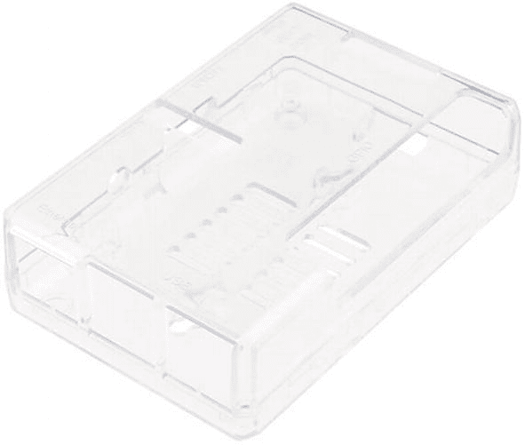

图 5-5

Pi Tin(由 SparkFun 提供)

用于 Raspberry Pi 4B 的铝制散热器外壳

SparkFun 的 Raspberry Pi 4B 的铝制散热器外壳是一个为 Raspberry Pi 4B 制造的带有散热器的良好金属外壳的例子。它由两块内置散热垫的金属制成，散热垫通过螺栓连接在一起。这是一种极简设计，不会使电路板变得更大(但更重)。它比基本的塑料外壳贵一点，但能提供更好的冷却和保护，而且对我来说，它看起来也比其他的好。图 [5-6](#Fig6) 展示了 SparkFun ( [`www.sparkfun.com/products/15773`](http://www.sparkfun.com/products/15773) )的铝制散热器外壳。我还见过这种设计的版本，如果你需要额外的冷却，顶部有一个或两个风扇。

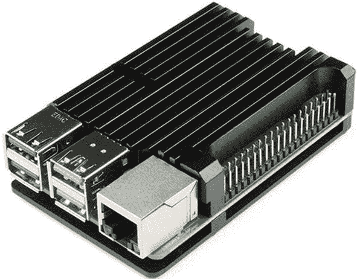

图 5-6

用于 Raspberry Pi 4B 的铝制散热器外壳(由 SparkFun 提供)

#### Pibow 切

Pibow Coupé ( [`www.adafruit.com/products/2083`](http://www.adafruit.com/products/2083) )可从 Adafruit 和其他供应商处获得，并为树莓 Pi 3B+和 4B 提供各种颜色(也可用于其他树莓 Pi 板)。它是由丙烯酸片制成的，但它们以一种新颖的切片图案排列。组装 Pibow 时，将树莓皮放在底板上，堆叠各层，最后放在顶板上。关键层为包括 GPIO 接头在内的所有端口提供切口。四个尼龙扣件把箱子固定成一个整体。组装后，外壳看起来很棒，而且非常坚固。图 [5-7](#Fig7) 显示了 Adafruit 生产的 3B 覆盆子酱的皮鲍 Coupé。


图 5-7

Pibow Coupé(由 Adafruit 提供)

Tip

如果这些案例都不符合你的需求或审美选择，你可以在 [`www.adafruit.com/category/395`](http://www.adafruit.com/category/395) 的 Adafruit 找到一大堆选项。你一定会在那里找到你想要的东西！

除了机箱之外，您还应该考虑购买(或从备件中取出)一个带电源的 USB 集线器。USB 集线器电源模块应该为 2500mA 或更大(有些人建议您只需要 1500mA，但如果您想将 USB 设备连接到您的主板，则更大更好)。如果您计划使用消耗大量电力的 USB 设备，如 USB 硬盘驱动器或 USB 软导弹发射器，则需要一个供电集线器。

#### 去哪里买

树莓派在欧洲已经有一段时间了。越来越容易找到，但很少有实体店有树莓酱。幸运的是，许多在线零售商都有它的存货，还有许多已知与树莓派配合使用的配件。以下是一些比较受欢迎的在线零售商，提供了他们的 Raspberry Pi 目录条目链接:

*   活力四射( [`www.sparkfun.com/categories/233`](http://www.sparkfun.com/categories/233)

*   Adafruit ( [`www.adafruit.com/category/105`](http://www.adafruit.com/category/105)

*   PiShop.us ( [`www.pishop.us`](http://www.pishop.us) )

*   PiHut(国际船舶)( [`www.thepihut.com`](http://www.thepihut.com) )

下一节将介绍一个关于开始使用 Raspberry Pi 的简短教程。如果您已经学会如何使用 Raspberry Pi，您可以跳到下一节，开始学习如何将传感器连接到您的电路板。

## 树莓派教程

Raspberry Pi 是一台拥有惊人的功能和通用性的个人电脑。您可能会认为它是一个玩具或一个严重受限的平台，但这与事实相差甚远。通过添加 USB、WiFi、以太网和 HDMI 视频等板载外围设备，Raspberry Pi 拥有了轻量级台式计算机所需的一切。对于配有 2GB、4GB 或 8GB 内存的 Raspberry Pi 4B 来说尤其如此——这些内存构成了不错的台式计算机！

此外，如果您考虑添加 GPIO 头，Raspberry Pi 就不仅仅是一台简单的桌面计算机，它还履行了作为一个旨在促进硬件实验的计算系统的职责。

以下部分提供了一个简短的教程，介绍如何开始使用新的 Raspberry Pi，从裸板到完全可操作的平台。许多优秀的作品更详细地讨论了这个主题。如果你发现自己陷入困境，或者想知道更多关于开始使用 Raspberry Pi 和 Raspbian 操作系统的信息，请参见 B. Schell 的*使用 Raspberry Pi 进行计算*(a press，2019)。如果你想了解更多关于在硬件项目中使用 Raspberry Pi 的信息，一个极好的深度资源是 W. Gay 的*高级 Raspberry Pi*(a press，2018)。

### 入门指南

如“所需附件”一节所述，您需要一个 microSD 卡(建议使用 16GB)、一个额定电流为 2500mA 或更高的 USB 电源(带有公 micro-USB 连接器(或用于 Raspberry Pi 4B 的 USB-C)、一个键盘、一个鼠标(可选)以及一个 HDMI 电缆和显示器或一个带有 HDMI 适配器的 DVI 显示器。然而，在您将这些东西插入您的 Raspberry Pi 并享受它的光辉之前，您需要为您的 microSD 卡创建一个引导映像。

### 安装启动映像包

安装启动映像的过程包括选择映像、下载它，然后将其复制到您的 microSD(因此简称为 SD)卡。以下部分详细介绍了相关步骤。

#### 选择图像

你需要做的第一件事是决定你想要使用哪个操作系统版本。有几个很好的选择，包括标准的 Raspbian“buster”变体。每一个都可以作为一个称为图像或卡片图像的压缩文件。你可以在 Raspberry Pi foundation 下载页面上找到推荐图片的列表以及下载每张图片的链接: [`www.raspberrypi.org/downloads`](http://www.raspberrypi.org/downloads) 。以下图片是该网站提供的部分图片:

*   *Raspbian Buster* :基本或默认图像。它基于 Debian，包含图形用户界面、开发工具和基本的多媒体功能。

*   *Ubuntu MATE* :为基本的桌面计算提供一个完整的、熟悉的(如果你知道 Ubuntu 的话)桌面环境。

*   Ubuntu Core:一个强化的 Ubuntu 核心操作系统，适用于安全性非常重要的场合。

*   *Ubuntu Server* :运行服务器应用的 Ubuntu Server 缩小版。

如果您刚刚开始使用 Raspberry Pi，您应该使用 Raspbian 图像。本书中的例子也推荐使用这个图像。

有两种方法可以为你的树莓派制作图像。最简单的方法是使用一个特殊的引导加载所谓的新的开箱即用软件(NOOBS)，这是用来帮助简化您的板设置。另一种是下载特定的镜像，用镜像格式化 SD 卡。在接下来的部分中，我将向您展示这两种方法。

#### 使用 NOOBS 安装

这是迄今为止最简单的方法来建立你的 SD 卡。你需要做的就是从 [`www.raspberrypi.org/downloads/noobs/`](http://www.raspberrypi.org/downloads/noobs/) 下载并解压 NOOBS，格式化 SD 卡，然后复制文件。一旦您从 NOOBS 启动，您将被引导安装默认操作系统(Raspbian)或您选择的另一个系统(需要额外的下载)。

有一些学习如何用 NOOBS 安装 Raspbian 的优秀资源。 [`www.raspberrypi.org/help/videos/#noobs-setup`](http://www.raspberrypi.org/help/videos/%2523noobs-setup) 有一段很好听的视频。

还有一个完整的安装指南，引导您完成整个过程。参见`projects.raspberrypi.org/en/projects/raspberry-pi-setting-up`。对于那些完全不熟悉使用 Raspberry Pi 或者从未做过任何格式化或 SD 卡设置的人来说，这些链接是一个不错的选择。但是，我将在这里向那些对使用电脑感到舒适的人总结这些步骤:

1.  从 [`www.raspberrypi.org/downloads/noobs/`](http://www.raspberrypi.org/downloads/noobs/) 下载 NOOBS 二进制。有两个选项:一个较小的在安装过程中使用互联网下载，另一个较大的有 Raspbian 映像。如果您的互联网连接速度较慢，或者在安装期间无法将您的 Raspberry Pi 连接到互联网，您应该选择带有 Raspbian 的版本(而不是 Lite 版本)。这是一个 Zip 文件，您可以下载并解压缩。

2.  您必须格式化 SD 卡。为了获得最佳效果，请使用 16GB 或 32GB 的卡。你可以使用任何你想要的应用程序，但我发现最好的是从 [`www.sdcard.org/downloads/formatter/index.html`](http://www.sdcard.org/downloads/formatter/index.html) 下载 SD Formatter，它适用于大多数平台。

3.  接下来，从 NOOBS 档案中找到您之前解压缩的文件，并将它们全部复制到 SD 卡上。

4.  将 SD 卡插入您的树莓派；连接鼠标、键盘和显示器。打开电源。

5.  按照屏幕指示安装 Raspbian。

就这样！同样，在线教程和视频要详细得多，但是现在你已经了解了这个过程，跟随在线教程将会非常容易。

#### 安装 Raspbian

如果想把 Raspbian 安装到 SD 卡或者不想用 NOOBS，可以从 [`www.raspberrypi.org/downloads/raspbian/`](http://www.raspberrypi.org/downloads/raspbian/) 下载 Raspbian。对于这本书，你应该选择名为“Raspbian Buster 带桌面和推荐软件”的那本。与 NOOBS 选件不同，该文件是一个可引导映像文件，需要通过特殊过程在 SD 卡上构建新的可引导映像。

Tip

参见 [`www.raspberrypi.org/documentation/installation/installing-images/README.md`](http://www.raspberrypi.org/documentation/installation/installing-images/README.md) 获取树莓派安装图像的教程。

下载完映像后，首先解压缩文件，然后将映像传输(有时称为“写入”)到 SD 卡。有多种方法可以做到这一点。以下部分描述了一些适用于各种平台的简化方法。您的计算机上必须连接有 SD 卡读写器。有些系统内置了 SD 卡驱动器(联想笔记本电脑、苹果笔记本电脑和台式机等等)。

##### Windows 操作系统

要在 Windows 上创建 SD 卡映像，您可以使用来自 Launchpad ( [`https://launchpad.net/win32-image-writer`](https://launchpad.net/win32-image-writer) )的 Win32 磁盘映像软件。下载该文件，并将其安装在您的系统上。如果还没有解压缩映像，请将其解压缩，然后将 SD 卡插入 SD 卡读写器。启动 Win32 Disk Imager 应用程序，选择顶部框中的图像，然后单击 *WRITE* 将图像复制到 SD。

Caution

复制过程会覆盖 SD 卡上已有的任何内容，因此请务必先将这些照片复制到您的硬盘上！

##### Mac OS X

要在 Mac 上创建 SD 卡映像，请下载映像并将其解压缩。将您的 SD 卡插入 SD 卡读写器。确保卡是用 FAT32 格式化的。接下来，打开系统报告。(提示:使用*苹果*菜单➤ *关于这台 Mac。*)

如果您有内置读卡器，请单击读卡器，或者浏览 *USB* 菜单并找到 SD 卡。记下磁盘编号。比如可以是`disk4`。

接下来，打开*磁盘工具*，卸载 SD 卡。你需要这样做来允许*磁盘工具*安装并连接到卡上。现在事情变得有点混乱。打开终端，运行以下命令，将磁盘号替换为 n，将镜像文件的路径和名称替换为`<image_file>`:

```py
sudo dd if=<image_file> of=/dev/diskn bs=1m

```

此时，您应该会看到磁盘驱动器指示灯闪烁(如果有)，您需要耐心等待。这个步骤可以在没有用户反馈的情况下运行一段时间。当命令提示符再次显示时，您就知道它完成了。

##### Linux 操作系统

要使用 Linux 创建 SD 卡映像，您需要知道 SD 卡读卡器的设备名称。执行以下命令查看当前安装的设备:

```py
df -h

```

接下来，插入 SD 卡或连接读卡器，等待系统识别。再次运行该命令:

```py
df -h

```

花点时间检查这个列表，并将其与第一次执行进行比较。“额外”设备是您的 SD 读卡器。记下设备名称，例如`/dev/sdc1`。该数字是分区号。所以，`/dev/sdc1`是分区 1，设备是`/dev/sdc`。接下来，卸载设备(我将使用前面的例子):

```py
umount /dev/sdc1

```

使用以下命令写入映像，将设备名称替换为`<device>`，将映像文件的路径和名称替换为`<image_file>`(例如`/dev/sdc`和`my_image.img`):

```py
sudo dd bs=4M if=<image_file> of=<device>

```

此时，您应该会看到磁盘驱动器指示灯闪烁(如果有)，您可能需要耐心等待。这个步骤可以在没有用户反馈的情况下运行一段时间。当命令提示符再次显示时，您就知道它完成了。

### 启动

要启动您的 Raspberry Pi，请插入带有新图像的 SD 卡，并插入您的外围设备。等到最后插上 USB 电源。因为树莓派没有开/关开关，所以一通电就会启动。下面描述了您将看到的首次引导 Raspbian 的过程。设置步骤仅执行一次(但是如果需要，您可以在以后更改设置)。

当您打开 Raspberry Pi 时，系统会启动，然后开始加载操作系统。您会看到一个很长的语句列表，这些语句传达了每个子系统在加载时的状态，后面是一个欢迎标语。你不必试图去阅读甚至理解所有出现的行， <sup>[7](#Fn7)</sup> 但是你应该注意任何错误或警告。

您可能还会看到一条关于调整启动设备大小的消息，您的 Raspberry Pi 可能会重新启动。这是自动的，没什么好担心的。事实上，它可以确保启动卷扩展到 microSD 支持的最大大小。当引导序列完成时，您将看到 Raspbian 桌面，如图 [5-8](#Fig8) 所示。


图 5-8

Raspbian 桌面

请注意，桌面中央有一个打开的对话框。同样，这些步骤只会在第一次引导时执行一次。这些步骤包括以下内容:

*   *欢迎来到树莓派*:点击*下一步*开始设置。您可以取消，稍后再运行安装程序。

*   *设置国家*:选择你的国家、语言和时区。点击*下一步*继续。

*   *设置密码*:选择默认用户的密码。点击*下一步*继续。

*   *设置屏幕*:如果你的屏幕边缘显示一个黑色矩形，你可以勾选复选框，让视频适配器在下次启动时正确同步。点击*下一步*继续。

*   *选择 WiFi 网络*:选择您的 WiFi 接入点连接互联网。您可以点击*跳过*跳过该步骤，或者点击*下一步*继续。

*   *更新软件*:如果你已经连接到互联网，你可以选择下载并安装 Raspbian 的更新。这是强烈推荐的，当您选择这个选项时，您将经历几个更多的信息对话框，向您显示更新的进度。您可以点击*跳过*跳过该步骤。完成后点击*下一步*继续。

*   *设置完成*:设置完成。点击*下一步*继续，如果您选择了任何需要重启的选项，系统将立即重启。

图 [5-9](#Fig9) 显示了从左上开始从左到右工作的每个步骤。


图 5-9

首次启动设置序列

当系统下一次启动时，您将看到 Raspbian 桌面，其中配置了您的设置。如果您设置了 WiFi 连接，它会自动重新连接。不错。

#### SD 卡的维护和进给

想象一下这个场景。您正在创建文件、下载文档等等。您的生产力很高，并且您正在享受您的新的低成本、超级酷的树莓派。现在想象一下电源线不小心被踢出墙外，你的树莓 Pi 没电了。没什么大不了的，对吧？嗯，大部分时间。

SD 卡没有你的硬盘坚固。您可能已经知道突然关闭 Linux 系统是不明智的，因为这样做会导致文件损坏。嗯，在 Raspberry Pi 上，它会导致您的磁盘映像完全丢失。症状包括从轻微的读取错误到无法在引导程序上引导或加载映像。这是有可能发生的——而且据其他人报道，这种情况已经发生了不止一次。

这并不是说所有的 SD 卡都是坏的，也不是说 Raspberry Pi 有问题。意外断电时的损坏是这种介质的副作用。有人报告说，某些 SD 卡比其他 sd 卡更容易出现这种情况。你能做的保护自己的最好的事情是使用一个已知的可以与 Raspberry Pi 一起工作的 SD 卡，并确保使用`sudo shutdown -h now`命令关闭系统——并且永远不要以任何其他方式关闭系统。

你也可以备份你的 SD 卡。详见 [`http://elinux.org/RPi_Beginners#Backup_your_SD_card`](http://elinux.org/RPi_Beginners%2523Backup_your_SD_card) 。

Tip

如果您在使用您的树莓派时需要任何帮助，在 [`www.raspberrypi.org/help/`](http://www.raspberrypi.org/help/) 有非常有用的文章，官方文档在 [`www.raspberrypi.org/documentation/`](http://www.raspberrypi.org/documentation/) 。

### GPIO 引脚映射

Raspberry Pi 有一个特殊的硬件特性，称为通用 I/O (GPIO)头。它位于主板的左上方，类似于软盘驱动器的磁头。 <sup>[8](#Fn8)</sup> 接头由两排 20 个公插脚组成。

所有 GPIO 引脚都可以配置为输入(读取)或输出(写入)。电压读数可用于数字 I/O。具体来说，当电压小于 1.7V 时，值为 0；大于 1.7V 的值为 1。对于输出引脚，您可以设置 0 至 3.3V 的电压。

图 [5-10](#Fig10) 显示了树莓 Pi 3B+(和 4B)的 GPIO 头的布局。


图 5-10

GPIO 引脚分配(raspberrypi.org 提供)

请注意，引脚没有按顺序命名。例如，有 GPIO 1 和 GPIO 2，但它们在接头上并不相邻(GPIO 1 在接头位置或引脚 28 的右侧，GPIO 2 在接头位置或引脚 3 的左侧)。这种命名可能会引起混淆，因为它不符合您的预期，也不反映 Arduino 等微控制器的整洁布局。因此，当使用 GPIO 接头时，您应该仔细检查您的引脚选择。

Caution

不要将 pin 码误认为 GPIO 号。务必用接头上使用的位置或引脚号仔细检查要使用的连接名称。例如，GPIO 16 不在管脚 16，而是在管脚 36。

还要注意，有些引脚有两个名称。例如，GPIO 14 和 GPIO 15 也被分别命名为 TXD(发送)和 RXD(接收)。这些引脚可用于串行通信。GPIO 18 和 GPIO 21 标记为 PWM(脉冲波调制)，用于为 led、电机和类似设备供电。GPIO 0 和 GPIO 1 也分别命名为 SDA 和 SCL，用于 I2C 通信。I2C 是一种快速数字协议，使用两条线(加上电源和地)从电路(或设备)读取数据。最后，GPIO 9、GPIO 10 和 GPIO 11 也分别命名为 MISO、MOSI 和 SCKL，用于 SPI 通信。

Caution

所有引脚都被限制在 3.3V。试图发送超过 3.3V 可能会损坏您的 Raspberry Pi。在连接到您的 Raspberry Pi 之前，请始终测试您的电路的最大电压。您还应该将电流限制在不超过 5mA。

Adafruit 有一个漂亮的附件，使得使用 GPIO 更加容易。这是一个小 PCB，上面印有 GPIO 的布局。它叫做 GPIO 参考卡，可以在 [`https://www.adafruit.com/product/2263`](https://www.adafruit.com/product/2263) 找到。图 [5-11](#Fig11) 显示了卡片的样子(为简洁起见旋转，为细节放大)。我建议你下次从 Adafruit 订购时买一个。

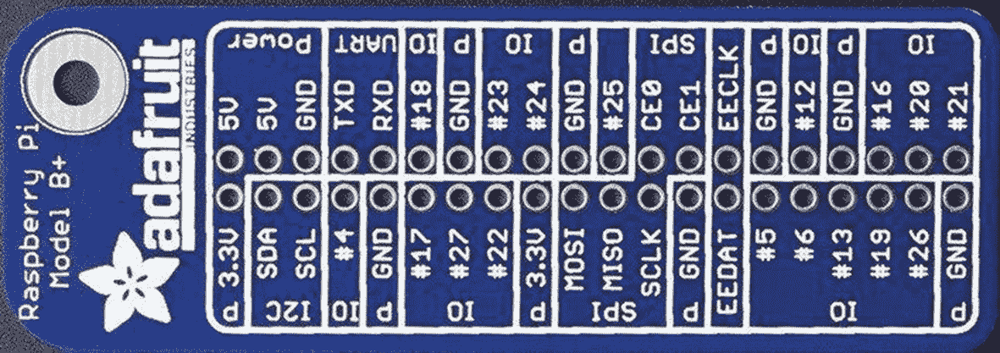

图 5-11

GPIO 参考卡(Adafruit 提供)

如果您想确保您的 Raspberry Pi 免受更高电压和电流的影响，大多数扩展板都有额外的电源保护电路。有许多扩展板可用，包括格特板( [`www.element14.com/community/docs/DOC-51726?ICID=raspberrypi-gert-banner`](http://www.element14.com/community/docs/DOC-51726%253FICID%253Draspberrypi-gert-banner) )。这本书不包括扩展板的使用，但如果您的传感器涉及复杂的电路，需要更多的端口或额外的功能，如电机控制器或继电器，您可能会考虑使用扩展板。

这里使用的不是扩展板，而是一个简单的原型板。我选择的这个叫做 Pi T-Cobbler Plus 分线板，可以从 Adafruit ( [`www.adafruit.com/products/2028`](http://www.adafruit.com/products/2028) )买到。它具有一根带状电缆和一个兼容试验板的连接器，其引脚排列顺序与 Raspberry Pi 上的相同。图 [5-12](#Fig12) 显示了圆头圆头圆头圆头圆头圆头圆头圆头圆头圆头圆头圆头圆头圆头圆头圆头圆头圆头圆头圆头圆头圆头圆头圆头圆头圆头圆头圆头圆头圆头圆头圆头圆头圆头圆头圆头圆头圆头圆头圆头圆头圆头圆头圆头圆头圆头圆头圆头圆头圆头圆头圆头圆头圆头圆头圆头圆头圆头圆头圆头圆头圆头圆头圆头圆头圆头圆头圆头圆头圆头圆头圆头圆头圆头圆头圆头圆头圆头圆头圆头圆头圆头圆除了通过将 Raspberry Pi 连接到试验板来简化 GPIO 工作之外，该板不提供任何其他功能。

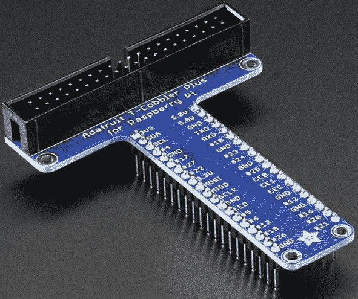

图 5-12

Pi T-Cobbler Plus 分线板(由 Adafruit 提供)

Caution

无论何时想要将传感器或电路连接到 GPIO 接头，无论是直接连接(不推荐)还是通过分线板连接(推荐)，都应该先关闭 Raspberry Pi。这听起来可能很不方便，甚至在你完成一个项目时会觉得很痛苦，但这是确保你不会意外短路或连接错误的最好方法。

我发现最好在关闭 Raspberry Pi 电源的情况下进行连接，并通过几次验证连接是否连接到正确的引脚。很容易连接到错误的引脚——数量太多，而且非常接近。奇怪的密码排列也没有帮助。经过适当的告诫，让我们开始使用您的 Raspberry Pi GPIO 并连接一些传感器吧！

Pi T-Cobbler 的一个更小的替代方案是将带状连接器放在中间，在试验板上占用更少的空间。这个版本叫做圆周率补鞋匠加版，在 [`www.adafruit.com/products/2029`](http://www.adafruit.com/products/2029) 有售。图 [5-13](#Fig13) 所示为圆周率补鞋匠加号。


图 5-13

Pi 鞋匠加分线板(由 Adafruit 提供)

Note

Pi T-Cobbler Plus 和 Cobbler Plus 可能会部分组装。您可能需要将试验板接头焊接(或让人焊接)到分线板。

你还可以在流行的在线拍卖和电子产品折扣网站上找到 Pi T-Cobbler Plus 和 Cobbler Plus 的几种变体。一个很好的例子就是来自 SparkFun ( [`www.sparkfun.com/products/13717`](http://www.sparkfun.com/products/13717) )的 SparkFun Pi Wedge。该板的布局与 Pi T-Cobbler Plus 相似，但 GPIO 引脚的排列顺序略有不同(但为了便于参考，该板印制在 PCB 上)。

无论您选择哪种分线板，它都可以让您将您的 Raspberry Pi 连接到试验板上，从而使电子设备(和传感器)的试验更加容易。它不会保护你免受意外的电力过载，所以要注意这一点。以下项目使用试验板；所以，如果你有一个馅饼，把你的覆盆子馅饼连到你的面包板上。

现在，您已经知道如何将硬件连接到 GPIO 引脚，您需要知道需要什么软件才能让您编写程序来读写这些引脚。

### 所需软件

您需要安装一些软件包来使用 GPIO 头。本节研究使用 Python 编程语言所需的软件。您可以使用 C 和 Scratch 语言扩展，但 Python 是最好学的，因为它在语法上易于阅读和掌握。此外，Raspberry Pi 的设计者最初选择 Python 作为其唯一的语言，所以您可能会在互联网上找到更多的例子来参考想法和帮助。我们已经看过了关于 MicroPython 的教程，我们将在 Raspberry Pi 上使用的 Python 几乎是相同的，至少在我们如何编写代码方面是如此。

默认情况下，Raspbian 包含 Python 和许多支持库。但它不包括你需要的一切。为了完全访问所有 GPIO 特性，您还需要 Raspberry Pi Python GPIO 模块(`RPi.GPIO`)用于与 GPIO 引脚通信，`pySerial`用于连接串行设备，以及`python-smbus`用于访问 I2C 总线。如果你用的是扩展板，厂商可能也有你需要安装的特殊模块。Pi T-Cobbler 分线板不需要特殊模块。如果你对写游戏感兴趣，你可能也想安装`python-game`包。

但是首先，你需要一些先决条件。您必须使用以下命令安装额外的 Python 模块。您的 Raspberry Pi 需要连接到互联网才能执行这些命令，因为它们从互联网下载模块:

```py
sudo apt-get update
sudo apt-get install python-dev

```

要安装`RPi.GPIO`模块、`pySerial`和`python-smbus`模块，发出以下命令:

```py
sudo apt-get install python-rpi.gpio
sudo apt-get install python-serial
sudo apt-get install python-smbus

```

既然您已经加载了软件，是时候进行实验了！如果你没有插上分线板，关闭你的 Raspberry Pi(从终端使用`sudo shutdown –h now`或从 *Raspbian* 菜单关闭)并连接分线板，然后重启你的 Raspberry Pi。

### 项目:硬件“你好，世界！”

在这个项目中，您将构建一个“Hello，World！”树莓派的项目。这个项目使用了一个 LED，Raspberry Pi 通过调用 Python 库函数来打开和关闭它。这是一个很好的开始项目，但它与如何使用传感器无关。

因此，在本节中，您将使用一个经过修改的 LED 项目，我们只需通过添加一个传感器来触发 LED。在这种情况下，您仍然可以通过使用可以说是最基本的传感器来简化事情:按钮。目标是每当按钮被按下时，LED 就会亮起。

#### 硬件连接

让我们首先组装一个树莓派、来自 Adafruit 的派 T-Cobbler(可选)、试验板、一个 LED 和一个按钮。你从关掉树莓派开始。

将分线板插入试验板。将 3.3V 引脚(而非 5V 引脚)连接到试验板电源轨，将接地引脚连接到接地轨，并在电路板的另一侧绕一圈。此连接为分线板供电。因此，您不需要试验板电源。

将 LED 和按钮放在试验板的一侧，如图 [5-14](#Fig14) 所示。请记住，LED 上最长的边是正极。注意，为了简洁起见，我展示了 Raspberry Pi 和 Pi Cobbler 分线板，但没有展示 Raspberry Pi 的电缆。Raspberry Pi 通过带状电缆连接到 Pi Cobbler Plus(您可以以同样的方式使用 T-Cobbler Plus)。确保对齐电缆，使彩色条纹(指示针脚 1)与连接器上的针脚 1 对齐。对树莓派和分线板都这样做。


图 5-14

带按钮的 LED 图示

Caution

将 5V 引脚连接到 GPIO 接头上的任何其他引脚都会损坏您的 Raspberry Pi。如果您使用需要 5V 输入的传感器，请确保仔细检查其最大输出为 3.3V 或更低。

你就快到了。现在，将一根跳线从电源轨连接到按钮的一侧，并将按钮的另一侧连接到分线板上的引脚 GPIO 17(左侧的引脚 6)。将 LED 连接到试验板上的地线和一个 150 欧姆的电阻(颜色:棕色、绿色、棕色、金色)。LED 的另一侧应连接到分线板上的 GPIO 7 引脚(参见图 [5-13](#Fig13) )。

你还需要一个电阻，在按钮没按下的时候把按钮拉低。将一个 10K 欧姆电阻器(颜色:棕色、黑色、橙色、金色)放在按钮一侧，用导线连接到 GPIO 17 引脚和地。LED 最短的一侧是接地侧。这一侧应该是连接到电阻的一侧。你连接电阻的方向无关紧要。它用于限制 LED 的电流。再次检查图纸，以确保您有一个类似的设置。

A Cool Gadget

使用树莓酱最酷的小工具之一是 Adafruit ( [`www.adafruit.com/products/942`](http://www.adafruit.com/products/942) )的树莓酱碟安装板。这个小亚克力板有足够的空间放一个全尺寸的面包板和一个覆盆子馅饼。它甚至有安装孔，用于将树莓酱固定在盘子上，还有小橡胶脚，用于保持盘子远离工作表面。下图显示了工作中的安装板。请注意，这张图片显示的是一个旧的 Raspberry Pi 板，但所有最新的 Raspberry Pi 板都适合。

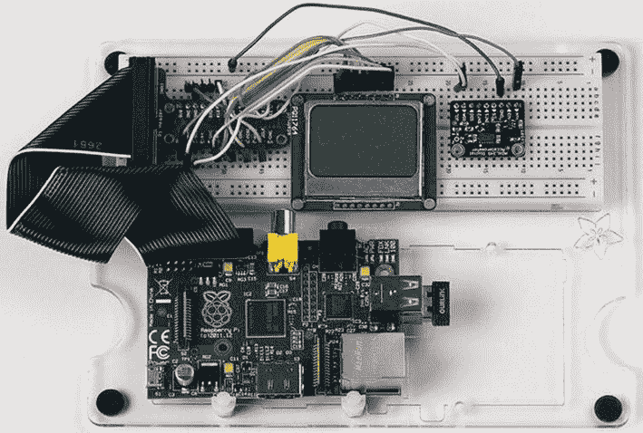

虽然你可以用 Lexan 或 Plexiglas 制作你自己的覆盆子 Pi 安装板，但 Adafruit 产品比你自己制作的要好一点。大约 23.00 美元，你就可以把你的树莓派和实验板放在一起，避免树莓派底部的组件与导电材料接触而导致你的桌子划伤和短路。

#### 写剧本

这个项目需要的脚本需要两个引脚:一个输出和一个输入。输出引脚将点亮 LED，输入引脚将检测按钮接合。将正电压连接到按钮的一侧，另一侧连接到输入引脚。当检测到输入引脚上的电压时，告诉 Raspberry Pi 处理器向输出引脚发送正电压。这种情况下，LED 的正极连接到输出引脚。

现在，用下面的命令打开一个文本编辑器，创建一个新的 Python 模块(或者使用您选择的编辑器，比如从*编程*菜单中选择的 Thonny Python IDE):

```py
nano hello_raspi.py

```

当编辑器打开时，键入以下代码来设置 GPIO 模块并建立引脚分配:

```py
import RPi.GPIO as GPIO   # GPIO library
LED_PIN = 7
BUTTON_PIN = 17
GPIO.setmode(GPIO.BCM)
GPIO.setup(LED_PIN, GPIO.OUT)
GPIO.setup(BUTTON_PIN, GPIO.IN)

```

如图 [5-13](#Fig13) 所示，输入引脚为 GPIO 17 引脚，输出引脚为 GPIO 7 引脚。让我们使用一个变量来存储这些数字，这样您就不必担心重复硬编码的数字(并冒着出错的风险)。使用`GPIO.setup(`方法设置每个管脚的模式(`GPIO.IN`、`GPIO.OUT`)。

你还需要放置代码在输入引脚状态为*高* ( `==1`)时打开 LED。在这种情况下，当输入引脚状态为*高* ( `1`)时，使用`GPIO.output()`方法将输出引脚设置为*高*，同样，当输入引脚状态为*低* ( `0`)时，将输出引脚设置为*低*。我们将代码封装在一个`try…except…finally`块中，以捕获键盘中断，并在最后清理 GPIO 分配(关闭输出引脚)。以下代码显示了所需的语句:

```py
GPIO.output(LED_PIN, GPIO.LOW)
while 1:
    if GPIO.input(BUTTON_PIN) == 1:
        GPIO.output(LED_PIN, GPIO.HIGH)
    else:
        GPIO.output(LED_PIN, GPIO.LOW)

```

Tip

回想一下，缩进在 Python 中很重要。缩进的语句形成一个代码块。例如，要对一个 if 语句执行多个语句，当条件被评估为 true 时，缩进所有要执行的行。

现在让我们看看清单 [5-1](#PC11) 中的完整脚本，以及适当的文档。

```py
#
# RasPi Simple Sensor - Beginning Sensor Networks 2nd Edition
#
# For this script, we explore a simple sensor (a pushbutton) and a simple response to sensor input (a LED). When the
  sensor is activated (the button is pushed), the LED
  is illuminated.

import RPi.GPIO as GPIO

# Pin assignments
LED_PIN = 7
BUTTON_PIN = 17

# Setup GPIO module and pins
GPIO.setmode(GPIO.BCM)
GPIO.setup(LED_PIN, GPIO.OUT)
GPIO.setup(BUTTON_PIN, GPIO.IN)

# Set LED pin to OFF (no voltage)
GPIO.output(LED_PIN, GPIO.LOW)
try:
    # Loop forever
    while 1:
        # Detect voltage on button pin
        if GPIO.input(BUTTON_PIN) == 1:
            # Turn on the LED
            GPIO.output(LED_PIN, GPIO.HIGH)
        else:
            # Turn off the LED
            GPIO.output(LED_PIN, GPIO.LOW)
except KeyboardInterrupt:
    print("Done!")
finally:
    GPIO.cleanup()

Listing 5-1Simple Sensor Script

```

Tip

为了节省大量的打字时间，您可以从 Apress 网站下载本章或书中任何示例的代码。

一旦您输入了脚本或将它下载到您的 Raspberry Pi 上，您就可以运行它了。要运行 Python 脚本，请按如下方式启动它:

```py
python3 hello_raspi.py

```

Note

我使用`python3`和后来的`pip3`，它们是为 Python 版本 3 执行的。在最新版本的 Raspbian 上使用这个。旧版本或其他发行版可能不支持 Python3，在这种情况下，您可以省略命令中的“3”。

#### 测试传感器

一旦脚本启动，您会在树莓 Pi 上看到什么？如果你做对了每一件事，答案是“什么都没有”它只是用一个黑暗的 LED 回望着你——几乎是嘲弄地。现在，按下按钮。LED 是否点亮？如果是这样，那么恭喜你:你是一名 Raspberry Pi Python GPIO 程序员！

如果 LED 不亮，按住按钮一两秒钟。如果这不起作用，请检查您的所有连接，以确保您插入了试验板上的正确线路，并且您的 LED 正确就位，长边连接到电阻器和 GPIO 7 引脚。

另一方面，如果 LED 灯一直亮着，尝试将按钮重新调整 90 度。您可能将按钮设置在了错误的方向。

尝试这个项目几次，直到兴奋过去。如果你是覆盆子酱的老手，那可能是很短的一段时间。如果这一切对你来说都是新的，那就按下那个按钮，享受建造第一个传感器节点的荣耀吧！

现在，你怎么阻止它？因为你编码了一个死循环(故意的)，你需要使用`Ctrl+C`来取消脚本。这不会损害你的树莓皮或 GPIO 或电路。

下一节研究一个使用温度和湿度传感器的更复杂的传感器节点。

#### 为了更多乐趣

为了让这个脚本更加用户友好，您可以修改代码以更优雅地退出。以下是一些有趣的建议:

*   循环不超过 10，000 次迭代。提示:使用一个变量并递增它。

*   使用第二个 LED，并设置代码来切换两个 LED，以便当按下按钮时，一个点亮，另一个熄灭。

*   使用一个*第二个*按钮，这样当按下*第二个*按钮时，循环终止。提示:使用`sys.exit()`或`break`。

## 用 Raspberry Pi 托管传感器

Raspberry Pi 的 GPIO 引脚使其成为托管传感器的理想平台。因为大多数传感器只需要很少的支持组件，所以您通常可以在一个 Raspberry Pi 上托管多个传感器。例如，可以托管一个温度传感器，甚至多个温度、气压、湿度和其他传感器，用于从给定地点采样天气状况。

Analog Only?

Raspberry Pi GPIO 引脚不支持数字信号，它们都是模拟引脚。这是有助于压低价格的许多小成本因素之一。要访问数字信号，您需要一个模数控制器。如果遇到需要使用数字传感器的情况，可以看看 Adafruit ( [`www.adafruit.com/products/1083`](http://www.adafruit.com/products/1083) )的带可编程增益放大器的 12 位 ADC—4 通道。

正如我在第 [1](01.html) 章中所讨论的，有许多传感器可供选择。SparkFun 和 Adafruit 都有很好的网站，提供大量关于他们销售的产品的信息。你也可以谷歌一下 Raspberry Pi 使用模拟传感器的例子。

虽然本章演示了如何使用连接到试验板的分线板在 Raspberry Pi 中托管传感器，但仅限使用模拟和 3.3V 最大电压的限制使得 Raspberry Pi 不如 Arduino 通用。此外，您必须使用 root 运行 Python 脚本，在 Raspberry Pi 上托管传感器比使用 Arduino 更难(但也不过分)也更麻烦。

您仍然可以将传感器直接连接到 Raspberry Pi，如下一节所示。但是，您可能想考虑使用 Raspberry Pi 作为聚合节点，使用 XBee 连接到 XBee 托管的传感器，甚至 Arduino 托管的传感器。但首先，让我们看看如何将传感器连接到树莓 Pi 并读取一些数据。

为了使事情变得简单，你使用一个类似于你在第 3 章中使用的项目。更具体地说，您用一个 Raspberry Pi 和一个温度传感器构建一个传感器节点。在开始之前，让我们讨论一些与使用 Raspberry Pi GPIO 头相关的安全因素。

## 项目:建立一个树莓温度传感器节点

您要探索的下一个项目是另一个温度传感器示例。这一次，你使用一个温度传感器，利用一个特殊的数字协议来发送。如前所述，Raspberry Pi 没有模数转换器。

虽然这可能是另一个温度传感器节点，但该项目还会让您体验如何读取使用单线协议的数字传感器，该协议内置于 Raspberry Pi GPIO 中。具体来说，您可以使用 SparkFun 和 Adafruit 提供的 DS18B20 数字温度传感器。

在某些方面，这个项目的硬件部分比之前的项目更容易，因为零件更少；但是代码更复杂。让我们从硬件设置开始。

### 硬件设置

这个项目需要的硬件是一个试验板、一个用于 Raspberry Pi 的分线板(如 Pi Cobbler+)、一个 DS18B20 数字温度传感器、一个 0.10mF 电容和一些跳线。将分线板插入试验板，将引脚 1 (3.3V)对准试验板上的位置 1。这将有助于您通过使用试验板上的数字更容易地确定引脚的方向，从而快速找到引脚，而不用数(和数错)它们。图 [5-15](#Fig15) 显示了分线板的正确方向。为了简洁，我省略了带状电缆。

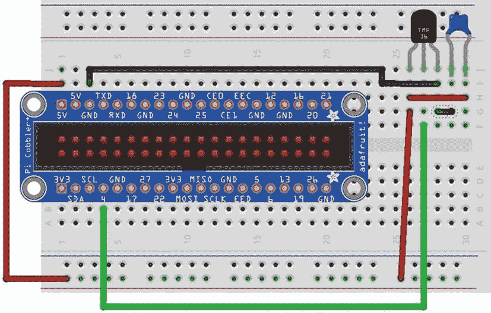

图 5-15

将温度传感器连接到树莓皮

接下来，将温度传感器安装到分线板的右侧，引脚 1 位于左侧。如果您拿着传感器，使平面朝向您，则针 1 位于传感器平面的左侧。如图 [5-15](#Fig15) 所示，在引脚 3(右侧)和引脚 2(中间)之间连接 0.10 毫伏的电容器或使用跳线。

将分线板的电源连接到试验板的电源轨，并将分线板的地线连接到试验板的地线轨，如图 [5-14](#Fig14) 所示。接下来，将电源连接到传感器的引脚 3，将接地连接到引脚 1。最后，将传感器的引脚 2 连接到 GPIO 4。为什么选择 GPIO 4？因为传感器是数字传感器，您可以使用单线设施(因为它只使用一根数据线)来读取数据。酷吧。

What About The Waterproof Version?

如果您有 DS18B20 数字温度传感器的防水版本，该传感器有四根导线。通常，电线被涂上红色、黑色、白色或黄色或橙色，以及铜色或银色。不使用铜线或银线；这是屏蔽的一部分。红线连接电源，黑线接地，白色或黄色或橙色是数据线。

### 测试硬件

一旦你仔细检查了你的连接，继续启动你的 Raspberry Pi。因为传感器使用单线协议读取数据，所以您可以使用 Raspberry Pi 内置的功能从传感器读取数据。这远不如编写 Python 脚本优雅，但它允许您在开始编程之前看到一切都正常工作。

您将使用一个名为`modprobe`的特殊实用程序。这个实用程序将模块加载(或卸载)到 Linux 内核中。在其他操作系统的术语中，它加载设备驱动程序。modprobe 实用程序可以做的远不止加载模块(驱动程序)；要了解更多信息，请参见 [`http://linux.die.net/man/8/modprobe`](http://linux.die.net/man/8/modprobe) 。

您想要加载的模块被命名为`w1-gpio`和`w1-therm`。`w1-gpio`模块注册并加载连接到 GPIO 4 引脚的新传感器。`w1-therm`模块注册并加载支持温度传感器的模块。

要使用这些模块，我们必须在重启您的 Pi 之前，通过编辑添加下面一行到`/boot/config.txt`来启用它们。使用命令`sudo nano /boot/config.txt`并在文件中的任意位置添加下面一行(对于其他示例，最好是靠近末尾)。请注意，这使引脚 4 成为默认引脚。您可以通过添加选项`gpiopin=N`到该行来指定您想要使用的 pin。编辑文件，然后在连接传感器之前关闭您的 Raspberry Pi。有关编辑文件包括添加多个传感器的更多信息，请参见 [`https://pinout.xyz/pinout/1_wire#`](https://pinout.xyz/pinout/1_wire) 。

```py
dtoverlay=w1-gpio

```

当您使用`modprobe`加载这些模块中的每一个模块时(首先是`w1-gpio`，Raspberry Pi 启用引脚 GPIO 4 上的数据收集，并从传感器读取数据并将其存储在文件中。该文件以`28`开头，后跟一个唯一的文件名。如果您有其他传感器，每个传感器都会有一个文件。

Note

无论是否创建了传感器，都会创建该文件，但要查看有意义的数据，您应该关机，连接传感器，然后在检查该文件之前重新启动。

该文件包含从传感器读取的原始数据。您可以打开该文件并检查其内容以查看原始数据。你可能会看到没有什么意义的数据，但我们会破译代码中的数据。清单 [5-2](#PC14) 显示了用于加载模块的命令，然后检查文件以及显示所创建文件名称的输出。

```py
pi@raspberrypi:~ $ sudo modprobe w1-gpio
pi@raspberrypi:~ $ sudo modprobe w1-therm
pi@raspberrypi:~ $ cd /sys/bus/w1/devices/28-1a1970a65dff
pi@raspberrypi:/sys/bus/w1/devices/28-1a1970a65dff $ ls
driver  hwmon  id  name  power  subsystem  uevent  w1_slave
pi@raspberrypi:/sys/bus/w1/devices/28-1a1970a65dff $ cat w1_slave
3e 01 55 00 7f ff 0c 10 8d : crc=8d YES
3e 01 55 00 7f ff 0c 10 8d t=19875
pi@raspberrypi:/sys/bus/w1/devices/28-1a1970a65dff $ cat w1_slave
3f 01 55 00 7f ff 0c 10 ce : crc=ce YES
3f 01 55 00 7f ff 0c 10 ce t=19937
pi@raspberrypi:/sys/bus/w1/devices/28-1a1970a65dff $ cat w1_slave
3f 01 55 00 7f ff 0c 10 ce : crc=ce YES
3f 01 55 00 7f ff 0c 10 ce t=19937
pi@raspberrypi:/sys/bus/w1/devices/28-1a1970a65dff $ cat w1_slave
3e 01 55 00 7f ff 0c 10 8d : crc=8d YES
3e 01 55 00 7f ff 0c 10 8d t=19875
pi@raspberrypi:/sys/bus/w1/devices/28-1a1970a65dff $ cat w1_slave
5e 01 55 00 7f ff 0c 10 6c : crc=6c YES
5e 01 55 00 7f ff 0c 10 6c t=21875

Listing 5-2Testing the Temperature Sensor Hardware

```

注意，在这个例子中，我运行了`cat` <sup>[9](#Fn9)</sup> (连接并打印)实用程序多次打印出文件中的数据。在运行实用程序时，我将手放在传感器上，以模拟温度的升高。你能看出这些值是如何变化的吗？

### 软件设置

此项目所需的软件已经安装。您将编写一个简短的 Python 脚本来读取来自传感器的数据，并将其显示到标准输出(终端窗口)。首先导入所需的模块，如下所示:

```py
import glob
import os
import time

```

接下来，使用名为`os`的 Python 模块进行系统调用，运行前面示例中的两个`modprob` e 命令。在这种情况下，你使用`os.system()`方法:

```py
os.system('modprobe w1-gpio')
os.system('modprobe w1-therm')

```

在您进入代码读取文件之前，让我们通过声明几个变量来包含目录和文件名，使它变得更容易。在这种情况下，您不知道文件名，但知道目录。您可以使用 glob 模块在特定目录中搜索与通配符匹配的文件。您可以使用以下代码来实现这一点:

```py
base_dir = '/sys/bus/w1/devices/'
datadir = glob.glob(base_dir + '28*')[0]
datafile = datadir + '/w1_slave'

```

请注意，您知道父目录和目录的开始部分。glob 模块为您完成所有工作。如果有多个目录匹配通配符，调用将返回一个列表。在这种情况下，您只有一个传感器，因此您只能看到一个目录。

现在您已经准备好从文件中读取数据了。您可以随心所欲地设计自己的代码，但是我选择编写两个方法(用 def 指令定义)。我将使用一种方法打开文件并读取文件中的所有行(数据),使用另一种方法使用读取的数据计算摄氏和华氏温度。我们来看第一种方法。我把它命名为`read_data()`:

```py
def read_data():
    f = open(datafile, 'r')
    lines = f.readlines()
    f.close()
    return lines

```

如您所见，它非常简单，读起来就像您想象的步骤。具体来说，您打开文件，读取文件中的所有行，关闭文件，并返回您读取的内容。

现在我们来看第二种方法。我把它命名为`get_temp()`:

```py
def get_temp():
    temp_c = None
    temp_f = None
    lines = read_data()

    while not lines[0].strip().endswith('YES'):
        time.sleep(0.25)
        lines = read_data()
    pos = lines[1].find('t=')
    if pos != -1:
        temp_string = lines[1][pos+2:]
        temp_c = float(temp_string) / 1000.00
        temp_f = temp_c * 9.00 / 5.00 + 32.00
    return temp_c, temp_f

```

这个方法有两个部分。第一部分使用前面的方法从文件中读取数据，并检查第一行(Python 中数组和列表从索引 0 开始)以查看状态是否为`YES`。如果不是，您再次读取文件中的行，并重复，直到您找到一个具有正确、有效状态的文件。

下一部分在文件中查找读取的数据。在这种情况下，您查找以 t=开头的子字符串，然后读取其后的数据，并将其转换为摄氏度和华氏度。您返回这些值用于打印数据。

让我们把它们放在一起。清单 [5-3](#PC20) 显示了完整的脚本，包括文档。打开一个编辑器，创建一个名为 pi_temp.py 的文件，并输入所示的源代码。随意修改它，以适应你的心情或特定的幽默。

花一些时间来研究这个完整的代码，直到您理解它是如何工作的。在这个文件中有几个 python ms<sup>[10](#Fn10)</sup>，所以如果有些代码不是很清楚，不要被吓倒。例如，看看倒数第二行的 print 语句。这个语句可以用不同的方式编写，但是这里显示的是大多数 Python 程序员采用的公认标准。

```py
# RasPi Temperature Sensor - Beginning Sensor Networks Second Edition
#
# For this script, we explore connecting a digital temperature
  sensor to the Raspberry Pi and reading the data. We display
  the temperature in Celsius and Fahrenheit.

# Import Python modules (always list in alphabetical order)
import glob
import os
import time

# Issue the modprobe statements to initialize the GPIO and
# temperature sensor modules
os.system('modprobe w1-gpio')
os.system('modprobe w1-therm')

# Use glob to search the file system for files that match the prefix.
base_dir = '/sys/bus/w1/devices/'
# Save the directory to the file.
datadir = glob.glob(base_dir + '28*')[0]
# Create the full path to the file
datafile = datadir + '/w1_slave'

# Procedure for reading the raw data from the file.
# Open the file and read all of the lines then close it.
def read_data():
    f = open(datafile, 'r')
    lines = f.readlines()
    f.close()
    return lines

# Read the temperature and return the values found.
def get_temp():
    # Initialize the variables.
    temp_c = None
    temp_f = None
    lines = read_data()

    # If the end of the first line ends with something other than 'YES'
    # Try reading the file again until 'YES' is found.
    while not lines[0].strip().endswith('YES'):
        time.sleep(0.25)
        lines = read_data()

    # Search the second line for the data prefixed with 't='
    pos = lines[1].find('t=')

    # A return code of -1 means it wasn't found

.
    if pos != -1:

        # Get the raw data located after the 't=' until the end of the line.
        temp_string = lines[1][pos+2:]

        # Convert the scale for printing
        temp_c = float(temp_string) / 1000.00

        # Convert to Fahrenheit
        temp_f = temp_c * 9.00 / 5.00 + 32.00

    # Return the values read
    return temp_c, temp_f

# Main loop. Read data then sleep 1 second until cancelled with CTRL+C.
while True:
    temp_c, temp_f = get_temp()
    print("Temperature is {0} degrees Celsius, "
          "{1} degrees Fahrenheit.".format(temp_c, temp_f))
    time.sleep(1)

Listing 5-3The pi_temp.py Script

```

花几分钟时间仔细检查您的文件，以确保您正确输入了所有语句。如果您的台式机或笔记本电脑上有编辑器，您可能希望使用它来创建和编辑文件，并使用语法检查功能来捕捉任何错误。该脚本无法在您的台式机或笔记本电脑上正确运行，但检查语法会有很大帮助。

现在软件写好了，让我们看看它做什么。

### 测试传感器

和前面的项目一样，您需要使用`sudo python ./pi_temp.py`以 root 用户身份运行脚本。当您这样做时，您可能不会立即看到任何输出，但是在一两秒钟内，您应该会开始看到如下所示的输出:

```py
$ python ./pi_temp.py
Temperature is 20.062 degrees Celsius, 68.11160000000001 degrees Fahrenheit.
Temperature is 20.187 degrees Celsius, 68.3366 degrees Fahrenheit.
Temperature is 21.25 degrees Celsius, 70.25 degrees Fahrenheit.
Temperature is 21.437 degrees Celsius, 70.5866 degrees Fahrenheit.
Temperature is 21.875 degrees Celsius, 71.375 degrees Fahrenheit.
Temperature is 21.687 degrees Celsius, 71.0366 degrees Fahrenheit.
Temperature is 21.5 degrees Celsius, 70.7 degrees Fahrenheit.
Temperature is 21.187 degrees Celsius, 70.1366 degrees Fahrenheit.
Temperature is 21.0 degrees Celsius, 69.8 degrees Fahrenheit.

```

如果您遇到语法错误，请返回并检查您是否完全按照清单 [5-3](#PC20) 中所示输入了每一行。Python 非常擅长提供足够的信息来修复大多数语法错误。如果遇到任何错误，您不仅会看到错误是什么，还会看到发生错误的文件的行号。修复错误后，再次尝试该脚本，直到看到正确的输出。

下一节将探讨一个更复杂的项目，在该项目中，Raspberry Pi 与使用 I2C 协议的数字传感器进行通信。

### 为了更多乐趣

为了让这个项目更有趣一点，尝试连接第二个传感器(同类型)，并打印出数据，包括读取数据的传感器。提示:您可以使用文件中嵌入的序列号来识别传感器，并且您应该将它们并联。也就是说，每个传感器连接到相同的地(引脚 1)和电源连接(引脚 3)。每个传感器的数据输出(引脚 2)连接到同一个 GPIO 引脚。

对于额外的特殊乐趣，修改代码以检测何时传感器读取失败并打印适当的错误消息。你能发现这在哪里是可能的吗？ <sup>[11](#Fn11)</sup> 给你一个提示:如果没有找到`t=`，在`get_temp()`方法中会发生什么？

## 项目:建立一个树莓气压传感器节点

这个项目演示了如何使用不同类型的传感器——使用 I2C 总线的传感器。为此，您需要四根电线来连接传感器，并需要一些设备来与传感器通信。幸运的是，Raspberry Pi 有这样的功能，但是要使它可用还需要一些工作。您将使用 Adafruit ( [`www.adafruit.com/products/2651`](http://www.adafruit.com/products/2651) )的 BMP280 传感器模块。图 [5-16](#Fig16) 显示了 Adafruit 的模块。

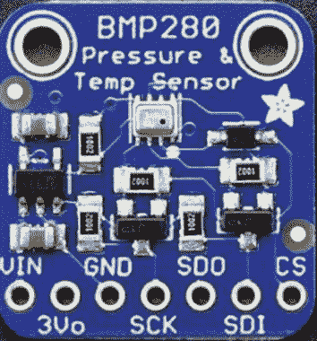

图 5-16

BMP280 I2C 传感器(Adafruit 提供)

默认情况下，Raspberry Pi 上的 I2C 功能是禁用的。在查看该项目的硬件设置之前，让我们启用 I2C 特性。你可以通过打开*首选项*菜单下的 Raspberry Pi 配置工具轻松完成。点击*界面*选项卡，勾选 I2C 复选框，如图 [5-17](#Fig17) 所示。

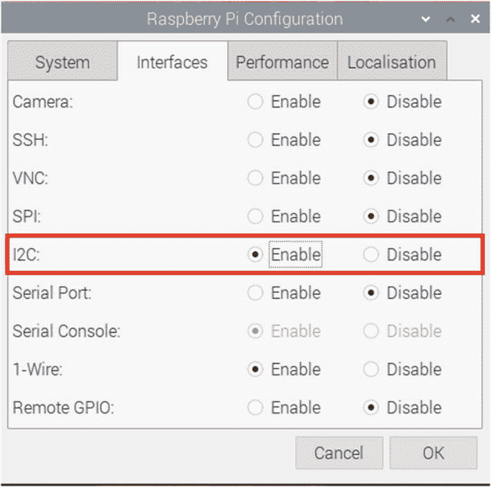

图 5-17

启用 I2C 接口

接下来，我们需要安装 I2C 工具和实用程序。为此，您可以打开终端并输入以下命令:

```py
$ sudo apt-get install i2ctools

```

就这样！现在，您可以开始连接硬件了。这个项目的硬件部分比上一个项目要简单，因为部件少，但代码更复杂。让我们从硬件设置开始。

### 硬件设置

这个项目需要的硬件是一个试验板、一个用于 Raspberry Pi 的分线板(如 Pi Cobbler+)、一个 BMP280 传感器模块和一些跳线。将分线板插入试验板，将引脚 1 (3.3V)对准试验板上的位置 1。

将 Raspberry Pi Cobbler+板上的 5V 引脚连接到传感器模块上。将接地线连接到传感器上的接地线。Raspberry Pi 上的 I2C 引脚是 GPIO 0 (SDA)和 GPIO 1 (SCL)。将这些引脚连接到传感器模块上的相应引脚(在 BMP280 上，SDA 连接到 SCK，在 BMP280 上，SCL 连接到 SDI)。图 [5-18](#Fig18) 显示了物理连接。


图 5-18

将 BMP280 传感器连接到树莓 Pi

### 测试硬件

一旦你仔细检查了你的连接，继续启动你的 Raspberry Pi。登录后，运行以下命令:

```py
sudo i2cdetect -y 1

```

该命令使用实用程序来检测 I2C 总线上的任何传感器。我说传感器是因为你可以使用 I2C 协议连接多个传感器。每个传感器都有自己的地址。以下代码显示了运行命令的输出:

```py
$ sudo i2cdetect -y 1
     0  1  2  3  4  5  6  7  8  9  a  b  c  d  e  f
00:          -- -- -- -- -- -- -- -- -- -- -- -- --
10: 10 -- -- -- -- -- -- -- -- -- -- -- -- -- -- --
20: -- -- -- -- -- -- -- -- -- -- 2a -- -- -- -- --

40: -- -- -- 43 -- -- -- -- -- -- -- -- -- -- -- --
50: -- -- -- -- -- -- -- -- -- -- -- -- -- -- -- --
60: -- -- -- -- -- -- -- -- -- -- -- -- -- -- -- --
70: -- -- -- -- -- -- -- 77

```

请注意，在示例中，图表显示第 7 列第 70 行的数据，值为 77。这意味着传感器位于地址`0x77`(十六进制)。如果安装了其他传感器，它们也会出现在图表中。记住这个地址，因为代码需要它。

Note

如果您在该命令的输出中看不到任何设备，请用**–y 0**试试看是否会产生任何输出。例如，使用 **sudo i2cdetect -y 0** 。

### 软件设置

该项目所需的软件需要您之前安装的 Python 库，以及一个用于与 BMP280 通信的特殊库。您需要一个特殊的模块，因为 I2C 协议是双向的，并且大多数 I2C 组件被设计为响应一个或多个命令来调用数据生成。在这种情况下，您需要一个支持 BMP280 传感器模块的 Python 模块。

这个库是由 Adafruit 的好心人创建的，可以从 Python 包库(PyPi <sup>[12](#Fn12)</sup> )下载。您可以在 [`https://readthedocs.org/projects/adafruit-circuitpython-bmp280/downloads/pdf/latest/`](https://readthedocs.org/projects/adafruit-circuitpython-bmp280/downloads/pdf/latest/) 找到该库的综合文档。

要下载并安装模块，在终端中发出`sudo pip3 install adafruit-circuitpython-bmp280`命令。此命令将为您下载并安装库及其所有依赖库。这有多酷？注意有些 Raspbian 发行版可能不需要`sudo`。下面显示了安装的摘录。

```py
$ sudo pip3 install adafruit-circuitpython-bmp280
Looking in indexes: https://pypi.org/simple, https://www.piwheels.org/simple
Collecting adafruit-circuitpython-bmp280
  Downloading https://www.piwheels.org/simple/adafruit-circuitpython-bmp280/adafruit_circuitpython_bmp280-3.1.2-py3-none-any.whl
...
Successfully installed Adafruit-Blinka-3.9.0 Adafruit-PlatformDetect-2.2.0 Adafruit-PureIO-1.0.4 adafruit-circuitpython-bmp280-3.1.2 adafruit-circuitpython-busdevice-4.1.4

```

I2C Sensor Libraries

有许多 I2C 传感器模块可供选择。然而，相应的 Python(或其他语言)库并没有为它们全部构建。在决定在网络中使用传感器之前，您应该研究是否有支持传感器的库。如果您是一名程序员，您可以通过检查数据手册并编写适当的命令与传感器交互，修改现有代码(库)以增加对新传感器的支持。

您将使用 Adafruit_BMP280 代码模块从 I2C 总线读取数据。Python 模块支持许多 I2C 模块，包括 BMP280，并且基于也在这个目录中的`Adafruit_I2C`模块。要使用`Adafruit_BMP280`库，您需要导入 BMP280 模块的类及其依赖项，如下所示:

```py
import board
import busio
import time
import adafruit_bmp280

```

接下来，您需要初始化该类。在这种情况下，您使用来自`busio`模块的名为`I2C`的助手类来配置对 I2C 接口的使用。接下来，我们使用该实例初始化 BMP280 类，如下所示。您将该实例分配给一个变量，以便以后可以使用它来调用库。默认地址是`0x77`。如果您从`i2cdetect`实用程序中看到一个不同的地址，将十六进制地址和参数`address=<hexadecimal>`传递给 BMP280 类的构造函数。

```py
i2c = busio.I2C(board.SCL, board.SDA)
bmp280 = adafruit_bmp280.Adafruit_BMP280_I2C(i2c)

```

还有一个选项我们可能想做:校准模块在我们的位置使用。我们通过为我们的位置传递 hPa 值来实现这一点。在这种情况下，我们使用美国大部分地区的标准(但在某些地区可能会有所不同)。

```py
bmp280.sea_level_pressure = 1013.25

```

一旦完成，您只需要使用库提供的属性读取值，然后打印出信息。您使用的主要属性如下所示:

```py
bmp280.temperature
bmp280.pressure
bmp280.altitude

```

现在让我们把它们放在一起。清单 [5-4](#PC30) 显示了脚本的完整清单。打开一个编辑器，创建一个名为`pi_bmp280.py`的文件，输入显示的源代码。

正如您所看到的，在新库的帮助下，您的 Python 脚本变得非常短并且非常容易编写。这是一个很好的例子，展示了 Python 社区的成员如何自由地(好吧，至少是大多数)交流思想，并为常见和不常见的任务共享代码。

```py
#
# RasPi I2C Sensor - Beginning Sensor Networks 2nd Edition
#
# For this script, we connect to and read data from an
# I2C sensor. We use the BMP280 sensor module from Adafruit
# or Sparkfun to read barometric pressure and altitude
# using the Adafruit I2C Python code.

import board
import busio
import time

import adafruit_bmp280

# First, we configure the BMP280 class instance for our use.
i2c = busio.I2C(board.SCL, board.SDA)
bmp280 = adafruit_bmp280.Adafruit_BMP280_I2C(i2c)

# Calibrate the pressure (hPa) at sea level for our location
# in this case the East coast US
bmp280.sea_level_pressure = 1013.25

# Read data until cancelled
while True:
    try:
        # Read the data
        pressure = float(bmp280.pressure)
        altitude = bmp280.altitude

        # Display the data
        print("The barometric pressure at altitude {0:.2f} "
              "is {1:.2f} hPa.".format(pressure, altitude))

        # Wait for a bit to allow sensor to stabilize
        time.sleep(3)

    # Catch keyboard interrupt (CTRL-C) keypress
    except KeyboardInterrupt:
        break

Listing 5-4The pi_bmp280.py Script

```

现在软件写好了，让我们看看它做什么。

### 测试传感器

和前面的项目一样，您需要使用`python3 ./pi_bmp280.py`以 root 用户身份运行脚本。当您这样做时，可能不会马上看到任何输出；但是在一两秒钟内，您应该会看到如下所示的输出:

```py
$ python3 ./pi_bmp280.py
The barometric pressure at altitude 1007.25 is 50.37 hPa.
The barometric pressure at altitude 1007.28 is 50.24 hPa.
The barometric pressure at altitude 1007.24 is 50.40 hPa.
The barometric pressure at altitude 1007.24 is 50.74 hPa.
The barometric pressure at altitude 1007.22 is 50.45 hPa.
The barometric pressure at altitude 1007.25 is 50.27 hPa.
The barometric pressure at altitude 1007.25 is 49.83 hPa.
The barometric pressure at altitude 1007.26 is 50.19 hPa.
The barometric pressure at altitude 1007.27 is 50.16 hPa.

```

下一节将探索一个更复杂的项目，在这个项目中，Raspberry Pi 是一个数据收集器(一个聚合节点),通过 XBee 无线连接到传感器节点来托管传感器数据。您将重用在第 [4](04.html) 章中创建的传感器节点。如果您没有通读并成功构建第 [4](04.html) 章中的项目，您可能想要在继续之前返回并完成最后一个项目。

### 为了更多乐趣

如你所见，BMP280 传感器读取大气压力，但它也读取温度。更改前面的代码以读取温度数据和大气压力。

## 项目:为 XBee 传感器节点创建 Raspberry Pi 数据收集器

这个项目结合了你在本章中所学的树莓 Pi，第 [2](02.html) 章中所学的 XBee，以及第 [4](04.html) 章中所学的 XBee 传感器节点。更具体地说，您使用一个 Raspberry Pi 和一个使用 XBee 模块连接传感器和 Raspberry Pi 的远程传感器。你已经从第 4 章[了解了基本知识，所以让我们开始吧。](04.html)

### XBee 传感器节点

按照第 [4](04.html) 章的内容创建 XBee 传感器节点。提醒一下，该节点的构造如图 [5-19](#Fig19) 所示。

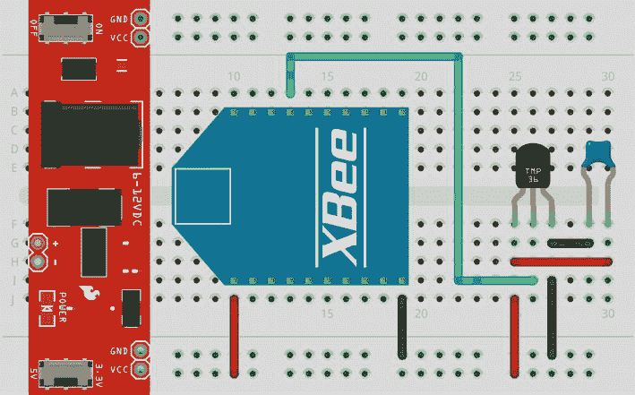

图 5-19

XBee 传感器节点

如果您尚未配置第 [4](04.html) 章中的传感器节点，或者如果您需要重置模块，您应该首先确保加载了最新的固件，并使用表 [5-1](#Tab1) 中所示的设置。请注意，您不需要第 [4](04.html) 章中的 *IR* 设置，但是如果您想要重用您在该章中使用的模块，这是可以的。

表 5-1

XBee 传感器节点选项和值

<colgroup><col class="tcol1 align-left"> <col class="tcol2 align-left"> <col class="tcol3 align-left"> <col class="tcol4 align-left"></colgroup> 
| 

密码

 | 

设置名称

 | 

描述

 | 

价值

 |
| --- | --- | --- | --- |
| D3 | a3/上帝 3 | 触发模拟或数字数据记录 | 2—ADC |
| 身份 | 平移 ID | 网络的 Id | Eight thousand and eighty-eight |
| 镍 | 节点标识符 | 节点的名称 | TMP36 |
| V+ | 电源电压阈值 | 电源电压 | FFFF(总是发送) |

Tip

确保使用“`TMP36`”作为节点 id ( `NI`)。除非节点 id 与以下代码中的值匹配，否则项目不会返回结果。

协调器节点应使用最新加载的固件和表 [5-2](#Tab2) 中所示的设置进行类似配置。

表 5-2

XBee 协调器选项和值

<colgroup><col class="tcol1 align-left"> <col class="tcol2 align-left"> <col class="tcol3 align-left"> <col class="tcol4 align-left"></colgroup> 
| 

密码

 | 

设置名称

 | 

描述

 | 

价值

 |
| --- | --- | --- | --- |
| 身份 | 平移 ID | 网络的 Id | Eight thousand and eighty-eight |
| 镍 | 节点标识符 | 节点的名称 | 协调者 |

### 五金器具

这个项目的硬件设置非常简单。你需要做的就是使用 GPIO 头的串行接口来连接 XBee 的串行接口。就这么简单！在所有硬件连接完成并确认正确之前，不要打开 Raspberry Pi 或传感器节点的电源。我将在本节稍后告诉您何时通电。

你需要一个试验板和一个 XBee 试验板适配器，就像你在第 [4 章](04.html)中使用的那个；将其插入试验板。然后插入您的 Raspberry Pi 试验板适配器。现在，将 3.3V 和地线连接到 XBee 适配器上的引脚。如果你使用的是 SparkFun ( [`www.sparkfun.com/products/11373`](http://www.sparkfun.com/products/11373) 调节的 XBee Explorer，可以连接 5V 电源，因为 XBee Explorer 可以调节电源(因此得名)。如图所示，SparkFun 板一侧的接头中排列有串行接口引脚。它还具有板载电压调节功能，以便在您意外将 5V 引脚而不是 3.3V 引脚连接到 explorer 时保护 XBee。

Note

如果您已经将试验板接头焊接到 XBee 适配器，但没有焊接串行 I/O 接头，请花一点时间来完成这项工作。您可以通过另一个接头连接 XBee，但统一的接头使它更容易一些。

接下来，将 Raspberry Pi Cobber+上的 TXD(输出)引脚 GPIO 14 连接到 XBee Explorer 上的 DIN 引脚。然后将 Raspberry Pi Cobble+上的 RXD(输入)引脚 GPIO 15 连接到 XBee Explorer 上的 DOUT 引脚。图 [5-20](#Fig20) 显示了完成的连接。


图 5-20

将 XBee 连接到树莓 Pi

如果您没有使用 SparkFun 适配器，请务必查看适配器上的文档，以确保您连接了正确的引脚。将您的协调器 XBee 模块插入 XBee。

你还需要做一件事。Raspberry Pi 的设计者包括了在启动时将串行终端连接到 Raspberry Pi 的功能。首选项中有一个设置允许您启用此界面。默认情况下，它是禁用的。

要打开串行接口，打开终端并输入命令`sudo raspi-config`。这将打开 Raspberry Pi 配置工具。要启用串行接口，选择`raspi-config`中的*接口选项*。最简单的方法是使用箭头键并突出显示选择，然后按下*键进入*。

在下一个屏幕上，选择 *Seria* l 选项，然后按照接下来的三个屏幕禁用通过串口登录 shell(选择*否*，启用硬件串口(选择*是*，然后在确认页面上按*回车*。

当控制返回到主屏幕时，使用*选项卡*键选择*完成*，然后选择*是*以允许树莓派重新启动。图 [5-21](#Fig21) 显示了屏幕顺序和您应该选择的选项。


图 5-21

启用串行接口(raspi-config)

在你的机器重新启动后，我们可以安装项目所需的软件。

### 软件

在编写脚本之前，您需要下载并安装一个特殊的库。这个项目需要的软件是由 Digi 提供的一个特殊的 Python 模块，它是专门为封装 XBee 协议和帧处理机制(使之易于使用)而开发的。要安装该模块，请发出以下命令:

```py
$ sudo pip3 install digi-xbee
Looking in indexes: https://pypi.org/simple, https://www.piwheels.org/simple
Collecting digi-xbee
  Downloading https://www.piwheels.org/simple/digi-xbee/digi_xbee-1.3.0-py3-none-any.whl (224kB)
    100% |████████████████| 225kB 10kB/s
Collecting srp (from digi-xbee)
  Downloading https://www.piwheels.org/simple/srp/srp-1.0.15-py3-none-any.whl
Requirement already satisfied: pyserial>=3 in /usr/lib/python3/dist-packages (from digi-xbee) (3.4)
Requirement already satisfied: six in /usr/lib/python3/dist-packages (from srp->digi-xbee) (1.12.0)
Installing collected packages: srp, digi-xbee
Successfully installed digi-xbee-1.3.0 srp-1.0.15

```

这个库有许多用于 XBee 模块的类，并且有许多例子可以用于您自己的项目。我们将会看到使用图书馆的一种方式。关于该库中其他特性的更多细节，您可以使用以下 URL 下载 Digi-Python 程序员指南: [`https://xbplib.readthedocs.io/en/latest/getting_started_with_xbee_python_library.html`](https://xbplib.readthedocs.io/en/latest/getting_started_with_xbee_python_library.html)

如果你想看库本身的代码，你可以在 GitHub 的 [`https://github.com/digidotcom/xbee-python`](https://github.com/digidotcom/xbee-python) 看到。

一旦安装了库，您就可以开始使用它了。对于这个例子，我们将使用基本的`XBeeDevice`库以及助手库`IOLine`和`IOMode`，如下所示:

```py
from digi.xbee.devices import XBeeDevice
from digi.xbee.io import IOLine, IOMode

```

在实例化这些类之前，让我们做一些定义，使维护更容易，并提高源代码的可读性。在这种情况下，您创建一个对串行端口、波特率、远程节点名称(`NI`来自传感器节点设置)、传感器在远程节点上连接的模拟线路以及采样速率的引用:

```py
SERIAL_PORT = "/dev/ttyS0"
BAUD_RATE = 9600
# Analog pin we want to monitor/request data
ANALOG_LINE = IOLine.DIO3_AD3
SAMPLING_RATE = 15

```

Note

如果您已经更改了 XBee 模块的波特率，则必须在此处使用该波特率。

现在您可以实例化 XBeeDevice 类，如下所示。传入我们之前定义的串口和波特率。

```py
device = XBeeDevice(SERIAL_PORT, BAUD_RATE)

```

现在我们准备进入程序的核心部分。我们将使用两种你在使用方法之前可能没见过的技术。首先，我们将创建一个方法来连接到 ZigBee 网络，并检索我们可以用来读取数据的远程 XBee 模块类的实例。其次，我们将创建第二种方法，用于以采样率读取数据。这被称为回调方法，因为每当采样率要求读取数据时，库就用它来“回调”你的程序。

下面的代码显示了我们用来设置名为`get_remote_device()`的远程设备的方法。在这里，我们连接到网络，然后请求网络通过节点 id ( `NI`)搜索我们的远程节点，如果找到，我们捕获它的地址，请求模拟线路，最后设置采样率。如果你按照第 [4](04.html) 章中的示例操作，这应该看起来很熟悉。

```py
def get_remote_device():
    """Get the remote node from the network
    Returns:
    """
    # Request the network class and search the network for the remote node
    xbee_network = device.get_network()
    remote_device = xbee_network.discover_device(REMOTE_NODE_ID)
    if remote_device is None:
        print("ERROR: Remove node id {0} not found.".format(REMOVE_NODE_ID))
        exit(1)
    remote_device.set_dest_address(device.get_64bit_addr())
    remote_device.set_io_configuration(ANALOG_LINE, IOMode.ADC)
    remote_device.set_io_sampling_rate(SAMPLING_RATE)

```

下面显示了名为`io_sample_callback()`的回调方法。在这个方法中，我们在名为`sample`的参数中获得以特殊格式传递的样本(参见下面的代码)。我们还将远程节点的实例作为`remote`，将样本的时间作为`time`。因此，您不仅可以看到样本的来源，还可以看到样本的日期和时间。酷！

```py
def io_sample_callback(sample, remote, time):
    print("Reading from {0} at {1}:".format(REMOTE_NODE_ID,
                                            remote.get_64bit_addr()))
    # Get the temperature in Celsius
    temp_c = ((sample.get_analog_value(ANALOG_LINE) * 1200.0 / 1024.0) – 500.0) / 10.0
    # Calculate temperature in Fahrenheit
    temp_f = ((temp_c * 9.0) / 5.0) + 32.0
    print("\tTemperature is {0}C. {1}F".format(temp_c, temp_f))
    # Calculate supply voltage
    volts = (sample.power_supply_value * (1200.0 / 1024.0)) / 1000.0
    print("\tSupply voltage = {0}v".format(volts))

```

注意，我们还在这个方法中放置了解密数据的代码。具体来说，我们用摄氏度计算温度，将其转换为华氏度，然后计算节点处的电压。我将代码的细节作为练习，但是我们已经在前面的例子中使用了公式。

好了，现在剩下的就是把所有的东西放在一起。我们遵循 Digi-Python 示例中提出的模式，将代码封装在一个`try...except`块中来捕获错误。在块内部，我们简单地打开设备类实例(启动实例)，获取远程设备，并注册回调方法。我们使用无限循环配置和键盘上的 trap`Ctrl+C`命令来退出脚本。

```py
try:
    print("Welcome to example of reading a remote TMP36 sensor!")

    device.open()  # Open the device class
    # Setup the remote device
    get_remote_device()
    # Register a listener to handle the samples received by the local device.
    device.add_io_sample_received_callback(io_sample_callback)
    while True:
        pass
except KeyboardInterrupt:
    if device is not None and device.is_open():
        device.close()

```

在我们把代码看作一个单元之前，让我们讨论一下参数`sample`中返回的数据的格式。这里，由于我们请求模拟线路 DIO3_AD3，我们看到样本是一个包含两个字典的元组:第一个是数据样本，第二个是电源电压。如果您简单地打印出`sample`参数的值，您将会看到这是如何形成的。下面的代码显示了测试运行中返回的一些数据的示例:

```py
> {[IOLine.DIO3_AD3: 563], [Power supply voltage: 3277]}
> {[IOLine.DIO3_AD3: 565], [Power supply voltage: 3269]}
> {[IOLine.DIO3_AD3: 565], [Power supply voltage: 3273]}
> {[IOLine.DIO3_AD3: 564], [Power supply voltage: 3272]}
> {[IOLine.DIO3_AD3: 563], [Power supply voltage: 3273]}
> {[IOLine.DIO3_AD3: 569], [Power supply voltage: 3269]}
> {[IOLine.DIO3_AD3: 566], [Power supply voltage: 3269]}
> {[IOLine.DIO3_AD3: 564], [Power supply voltage: 3268]}

```

现在让我们把所有这些放在一起，看看完整的代码是什么样子的。打开一个编辑器，创建文件`pi_xbee.py`，输入清单 [5-5](#PC40) 中的代码。

```py
#
# Raspberry Pi Data Aggregator - Beginning Sensor Networks Second Edition
#
# For this script. we read data from an XBee remote data mode
# from a ZigBee Coordinator connected to a Raspberry Pi via a
# serial interface.
#
# The data read includes an analog value from DIO3/AD3 and the current voltage value.
#
from digi.xbee.devices import XBeeDevice
from digi.xbee.io import IOLine, IOMode

# Serial port on Raspberry Pi
SERIAL_PORT = "/dev/ttyS0"
# BAUD rate for the XBee module connected to the Raspberry Pi
BAUD_RATE = 9600
# The name of the remote node (NI)
REMOTE_NODE_ID = "TMP36"
# Analog pin we want to monitor/request data
ANALOG_LINE = IOLine.DIO3_AD3
# Sampling rate
SAMPLING_RATE = 15

# Get an instance of the XBee device class
device = XBeeDevice(SERIAL_PORT, BAUD_RATE)

# Method to connect to the network and get the remote node by id
def get_remote_device():
    """Get the remote node from the network

    Returns:
    """
    # Request the network class and search the network for the remote node
    xbee_network = device.get_network()
    remote_device = xbee_network.discover_device(REMOTE_NODE_ID)
    if remote_device is None:
        print("ERROR: Remove node id {0} not found.".format(REMOVE_NODE_ID))
        exit(1)
    remote_device.set_dest_address(device.get_64bit_addr())
    remote_device.set_io_configuration(ANALOG_LINE, IOMode.ADC)
    remote_device.set_io_sampling_rate(SAMPLING_RATE)

def io_sample_callback(sample, remote, time):
    print("Reading from {0} at {1}:".format(REMOTE_NODE_ID,
                                            remote.get_64bit_addr()))
    # Get the temperature in Celsius
    temp_c = ((sample.get_analog_value(ANALOG_LINE) * 1200.0 / 1024.0) – 500.0) / 10.0

    # Calculate temperature in Fahrenheit
    temp_f = ((temp_c * 9.0) / 5.0) + 32.0
    print("\tTemperature is {0}C. {1}F".format(temp_c, temp_f))

    # Calculate supply voltage
    volts = (sample.power_supply_value * (1200.0 / 1024.0)) / 1000.0
    print("\tSupply voltage = {0}v".format(volts))

try:
    print("Welcome to example of reading a remote TMP36 sensor!")

    device.open()  # Open the device class

    # Setup the remote device
    get_remote_device()

    # Register a listener to handle the samples received by the local device.
    device.add_io_sample_received_callback(io_sample_callback)
    while True:
        pass
except KeyboardInterrupt:
    if device is not None and device.is_open():
        device.close()

Listing 5-5Reading Data from an XBee Module

```

### 测试最终项目

现在您可以运行您的脚本并观察输出。以`python3 ./pi_xbee.py`开始脚本。清单 [5-6](#PC41) 显示了该脚本的示例输出。为了看到数据的变化，我只需触摸传感器(小心不要短路引脚)，让我的体温增加读数。

```py
$ python3 ./pi_xbee.py
Welcome to example of reading a remote TMP36 sensor!
Reading from TMP36 at 0013A2004192DB79:
    Temperature is 15.9765625C. 60.7578125F
    Supply voltage = 3.840234375v
Reading from TMP36 at 0013A2004192DB79:
    Temperature is 16.2109375C. 61.1796875F
    Supply voltage = 3.830859375v
Reading from TMP36 at 0013A2004192DB79:
    Temperature is 16.2109375C. 61.1796875F
    Supply voltage = 3.835546875v
Reading from TMP36 at 0013A2004192DB79:
    Temperature is 16.09375C. 60.96875F
    Supply voltage = 3.834375v
Reading from TMP36 at 0013A2004192DB79:
    Temperature is 15.9765625C. 60.7578125F
    Supply voltage = 3.835546875v
Reading from TMP36 at 0013A2004192DB79:
    Temperature is 16.6796875C. 62.0234375F
    Supply voltage = 3.830859375v
Reading from TMP36 at 0013A2004192DB79:
    Temperature is 16.328125C. 61.390625F
    Supply voltage = 3.830859375v
Reading from TMP36 at 0013A2004192DB79:
    Temperature is 16.09375C. 60.96875F
    Supply voltage = 3.8296875v

Listing 5-6Output of the XBee Aggregate Node Script (pi_xbee.py)

```

你看到类似的东西了吗？如果是这样，那么您做得很好，现在已经具备了构建传感器节点和基于 Raspberry Pi 的传感器数据聚合器所需的知识。

如果您根本看不到任何数据，请返回第 [4](04.html) 章，并遵循本章最后一个项目的故障排除提示。您可以随时将协调器模块插入 USB explorer，并使用个人计算机上的终端程序来查看是否正在从 XBee 传感器节点接收数据。

Tip

如果您没有看到任何数据，请关闭您的传感器节点和 Raspberry Pi。从 Raspberry Pi 中移除协调器模块，将其插入 USB XBee Explorer，将其插入您的个人计算机，并将串行程序连接到端口，然后给传感器节点加电。过一会儿，您应该会看到协调器节点正在接收数据。

### 为了更多乐趣

如果您想扩展项目，可以添加第二个 XBee 传感器节点，并修改代码以指定数据来自哪个节点。例如，脚本应该记录(写入标准输出)数据源以及来自 XBee 的传感器数据。

## 部件购物清单

完成本章中的项目需要一些组件；它们在表 [5-3](#Tab3) 中列出。其中一些，比如 XBee 模块和支持硬件，也包含在第四章[的购物清单中。](04.html)

表 5-3

所需组件

<colgroup><col class="tcol1 align-left"> <col class="tcol2 align-left"> <col class="tcol3 align-left"> <col class="tcol4 align-left"></colgroup> 
| 

项目

 | 

供应商

 | 

是吗？成本美元

 | 

所需数量

 |
| --- | --- | --- | --- |
| 树莓 Pi 型号 B | 大多数在线商店，如 Adafruit、SparkFun 和 Mouser | $35.00 及以上 <sup>[13](#Fn13)</sup> | one |
| 5V 电源(3A，3B，3B+) | [T2`www.pishop.us/product/wall-adapter-power-supply-micro-usb-2-4a-5-25v/`](http://www.pishop.us/product/wall-adapter-power-supply-micro-usb-2-4a-5-25v/) | $9.95 | one |
| 5V 电源(4B) | [T2`www.raspberrypi.org/products/type-c-power-supply/`](http://www.raspberrypi.org/products/type-c-power-supply/) | $8.00 | one |
| HDMI 或 HDMI 转 DVI 电缆 | 大多数在线和零售商店 | 变化 | one |
| HDMI 或 DVI 监视器 | 大多数在线和零售商店 | 变化 | one |
| USB 键盘 | 大多数在线和零售商店 | 变化 | one |
| USB A 型到微型 USB 插头 | 大多数在线和零售商店 | 变化 | one |
| SD 卡，2GB 或更大 | 大多数在线和零售商店 | 变化 | one |
| 树莓派补鞋匠+(你也可以用 T-补鞋匠+) | [T2`www.adafruit.com/products/2028`](http://www.adafruit.com/products/2028) | $7.95 | one |
|   | [T2`www.adafruit.com/products/2029`](http://www.adafruit.com/products/2029) |   |   |
| 150 欧姆电阻器 | 大多数在线和零售商店 | 变化 | one |
| 0.10 毫伏电容 | 大多数在线和零售商店 | 变化 | one |
| 10K 欧姆电阻器 | 大多数在线和零售商店 | 变化 | one |
| 发光二极管 | 大多数在线和零售商店 | 变化 | one |
| DS18B20 数字温度传感器 | [T2`www.adafruit.com/product/374`](http://www.adafruit.com/product/374) | $3.95 | one |
| 按钮 | 大多数在线和零售商店 | 变化 | one |
| BMP280 传感器 | [T2`www.adafruit.com/products/2651`](http://www.adafruit.com/products/2651) | $9.95 | one |
| 试验板(非迷你) | [T2`www.sparkfun.com/products/9567`](http://www.sparkfun.com/products/9567) | $5.95 | Two |
| [T2`www.adafruit.com/product/64`](http://www.adafruit.com/product/64) |
| XBee Explorer 受管制 | [T2`www.sparkfun.com/products/11373`](http://www.sparkfun.com/products/11373) | $9.95 | Two |

## 摘要

在本章中，您探索了 Raspberry Pi 的起源，包括硬件之旅和可用操作系统列表。您了解了如何创建 SD 引导映像，并学习了如何开始使用 Raspberry Pi。

您还了解了如何使用 GPIO 头点亮 LED，从传感器读取数据，以及通过 XBee 从 XBee 传感器节点读取数据。通过执行这些项目，您对 Raspberry Pi 的了解要比大多数人多得多。

到目前为止，您应该开始看到构建传感器网络的各个部分开始融合在一起。您已经探索了用于无线通信的 XBee 模块、使用 XBee 和 Raspberry Pi 的主机传感器，甚至是如何使用这两个平台构建聚合传感器节点。

我们通过检查 Arduino 平台来完成我们的传感器节点之旅。在下一章，我们将学习什么是 Arduino，以及如何用它来安装传感器。酷！

<aside aria-label="Footnotes" class="FootnoteSection" epub:type="footnotes">Footnotes [1](#Fn1_source)

在这种情况下，您需要 I/O 端口，这些端口可以用作电子电路中的组件，并且可以被编程库访问(读取和写入)。

  [2](#Fn2_source)

大多数 USB 硬盘和 DVD 驱动器都可以工作。

  [3](#Fn3_source)

安全数字(SD):一个邮票大小的小型可移动存储驱动器。 [`http://en.wikipedia.org/wiki/Secure_Digital`见](http://en.wikipedia.org/wiki/Secure_Digital)。

  [4](#Fn4_source)

我的母校已经做出了这个非常悲伤的转变。我哀悼知识的丧失。

  [5](#Fn5_source)

我的第一台真正的电脑是 IBM PCjr。随后，我在 computer 公司制造了自己的 IBM 个人电脑，配有一个 10MB 的硬盘。啊，那是个人电脑的光辉岁月！

  [6](#Fn6_source)

猜猜我是怎么知道的。是的，我不得不至少一次修理各种板上的两个连接器。

  [7](#Fn7_source)

他们走得如此之快；反正你也不可能看懂。基本上，除非有错误，否则它们就是噪音，并且通常出现在显示的最后几行中。

  [8](#Fn8_source)

什么事？没听说过软驱？最初的的确是软绵绵的。对于加分，8 英寸双面双密度软盘介质的存储容量是多少？

  [9](#Fn9_source)

如果你好奇，没有狗的命令。

  [10](#Fn10_source)

这意味着这是首选方式。有时代码可以被描述为“Python 化的”，这也意味着它是用首选的 Python 风格或特定的语法编写的。对于每个学习 Python 的人来说，学习用 Python 编程是其次的，但能够知道其中的区别是一个真正的 Python 爱好者的标志。

  [11](#Fn11_source)

铁杆代码迷和黑客都喜欢这种东西。

  [12](#Fn12_source)

[`https://pypi.org/`见](https://pypi.org/)。

  [13](#Fn13_source)

我建议货比三家，找到最好的交易。在撰写本文时，对 Raspberry Pi 4B 的需求仍然大于供应，因此成本有点高。

 </aside>