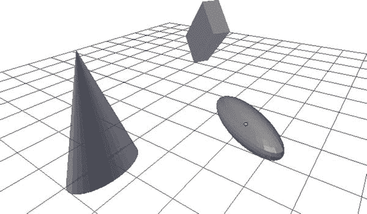
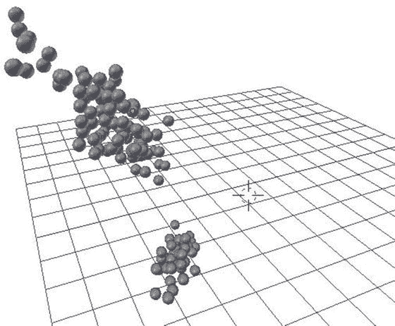
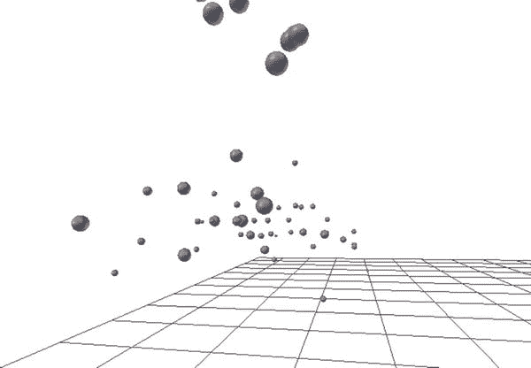
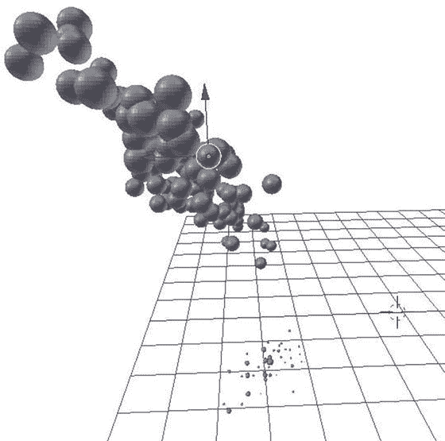
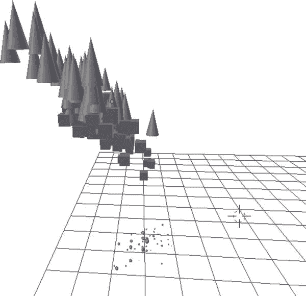

# 2.bpy 模块

本章介绍并详述了`bpy`模块的主要组件。这样，我们解释了 Blender 的许多重要行为。我们涵盖了选择和激活、创建和删除、场景管理和代码抽象。

Blender Python API 的官方文档可以在 [`http://www.blender.org/api/`](http://www.blender.org/api/) 选择 Blender 的一个版本找到。我们在本文中使用 Blender 2.78c，所以我们的文档可以在 [`http://www.blender.org/api/blender_python_api_2_78c_release/`](http://www.blender.org/api/blender_python_api_2_78c_release/) 找到。

## 模块概述

我们首先介绍一下`bpy`每个子模块的背景。

### bpy .运营

正如所暗示的，这个子模块包含操作符。这些主要是操纵对象的函数，类似于 Blender artists 在默认界面中操纵对象的方式。子模块还可以操作 3D 视口、渲染、文本等等。

对于操纵 3D 对象，两个最重要的类是`bpy.ops.object`和`bpy.ops.mesh`。`object`类包含同时操作多个选定对象的函数以及许多通用工具。`mesh`类包含一次操作一个对象的顶点、边和面的函数，通常是在编辑模式下。

目前在`bpy.ops`子模块中有 71 个类，它们都有很好的名字和组织。

Note

模块、子模块和类的文档可以通过将 Pythonic 路径附加到对象并将`.html`附加到您版本的 Blender 文档的主 URL 来直接访问。例如，`bpy.ops.mesh`类的文档可以在这里找到: [`www.blender.org/api/blender_python_api_2_78c_release/bpy.ops.mesh.html`](http://www.blender.org/api/blender_python_api_2_78c_release/bpy.ops.mesh.html) 。

### bpy .上下文

`bpy.` `context`子模块用于通过各种状态标准访问 Blender 的对象和区域。该子模块的主要功能是为 Python 开发人员提供一种访问用户正在使用的当前数据的方法。如果我们创建一个按钮来置换所有选中的对象，我们可以允许用户选择他所选择的对象，然后置换`bpy.context.select_objects`中的所有对象。

我们在构建附加组件时经常使用`bpy.context.scene`，因为它是某些 Blender 对象的必需输入。我们还可以使用`bpy.context`来访问活动对象，在对象模式和编辑模式之间切换，并接受来自油性笔的数据。

### bpy.data

该子模块用于访问 Blender 的内部数据。解释这个特定模块的文档可能会很困难(页面直接指向一个单独的类)，但是我们在本文中将会非常依赖它。`bpy.data.objects`类包含所有决定物体形状和位置的数据。当我们说前面的子模块`bpy.context`可以很好地将我们指向对象组时，我们的意思是`bpy.context`类将生成对`bpy.data`类的数据块的引用。

### bpy.app

这个子模块并没有完整的文档，但是到目前为止，我们确信这些信息可以在脚本和插件开发中发挥很大的作用。子模块`bpy.app.handlers`是我们在本文中唯一关心的一个。`handlers`子模块包含特殊功能，用于触发定制功能以响应 Blender 中的事件。最常用的是帧改变句柄，它在每次 3D 视口更新时(即帧改变后)执行一些功能。

### bpy.types、bpy.utils 和 bpy.props

这些模块将在后面关于插件开发的章节中详细讨论。读者可能会发现`*/bpy.types.html`中的文档对于描述我们在别处使用的对象类别很有用。

### bpy.path

这个子模块本质上与 Python 自带的`os.path`子模块相同。对于核心开发团队之外的 Blender Python 开发人员来说很少有用。

## 选择、激活和规范

Blender 界面设计得很直观，同时也提供了复杂的功能。某些操作逻辑上适用于单个对象，而其他操作逻辑上可以同时用于一个或多个对象。为了处理这些场景，Blender 开发人员创建了三种方法来访问对象及其数据。

*   选择:一次可以选择一个、多个或零个对象。使用选定对象的操作可以同时对单个对象或多个对象执行该操作。
*   激活:在任何给定时间，只有一个对象是活动的。作用于活动对象的操作通常更加具体和激烈，因此不能直观地一次对许多事物执行。
*   规范:(仅限 Python)Python 脚本可以通过名称访问对象，并直接写入其数据块。虽然操纵所选对象的操作通常是诸如平移、旋转或缩放之类的不同动作，但是向特定对象写入数据通常是诸如位置、方向或大小之类的声明性动作。

### 选择对象

在继续之前，建议读者在 3D 视口中创建一些不同的对象作为示例。转到三维视口标题➤添加查看对象创建菜单。

当我们在 3D 视口中单击鼠标右键时，对象会高亮显示和取消高亮显示。当我们按住 Shift 键并四处点击时，我们能够一次高亮显示多个对象。三维视口中的这些高光表示选定的对象。要列出所选对象，请在交互式控制台中键入清单 [2-1](#Par20) 中的代码。

```py
# Outputs bpy.data.objects datablocks

bpy.context.selected_objects
Listing 2-1.Getting a List of Selected Objects

```

正如我们前面提到的,`bpy.context`子模块非常适合根据 Blender 中对象的状态获取对象列表。在本例中，我们提取了所有选定的对象。

```py
# Example output of Listing 2.1, list of bpy.data.objects datablocks

[bpy.data.objects['Sphere'], bpy.data.objects['Circle'], bpy.data.objects['Cube']]

```

在这种情况下，名为`Sphere`的球体、名为`Circle`的圆和名为`Cube`的立方体都在 3D 视口中被选中。我们返回了一个包含`bpy.data.objects`数据块的 Python 列表。已知这种类型的所有数据块都有一个`name`值，我们可以遍历清单 [2-1](#Par20) 的结果来访问所选对象的名称。参见清单 [2-2](#Par24) ，这里我们获取了所选对象的名称和位置。

```py
# Return the names of selected objects

[k.name for k in bpy.context.selected_objects]

# Return the locations of selected objects

# (location of origin assuming no pending transformations)

[k.location for k in bpy.context.selected_objects]

Listing 2-2.Getting a List of Selected Objects

```

现在我们知道了如何手动选择对象，我们需要根据一些标准自动选择对象。必备功能在`bpy.ops`中。清单 [2-3](#Par26) 创建一个函数，它将一个对象名作为参数并选择它，默认情况下清除所有其他选择。如果用户指定`additive = True`，该功能将不会预先清除其他选择。

```py
import bpy

def mySelector(objName, additive=False):

    # By default, clear other selections

    if not additive:
      bpy.ops.object.select_all(action='DESELECT')

    # Set the 'select' property of the datablock to True

    bpy.data.objects[objName].select = True

# Select only 'Cube'

mySelector('Cube')

# Select 'Sphere', keeping other selections

mySelector('Sphere', additive=True)

# Translate selected objects 1 unit along the x-axis

bpy.ops.transform.translate(value=(1, 0, 0))

Listing 2-3.Programmatically Selecting Objects

```

Note

要在不使用 Python 脚本的情况下轻松查看对象名称，请导航到属性窗口并选择橙色立方体图标。现在，活动对象将在该子窗口的顶部附近显示其名称，如图 [2-1](#Fig1) 所示。此外，3D 视口的左下角将显示活动对象的名称。我们将在本章的下一小节讨论激活。


图 2-1。

Checking object names in the Blender interface

### 激活对象

与选择一样，激活也是 Blender 中的一种对象状态。与选择不同，在任何给定时间只能有一个对象处于活动状态。这种状态通常用于单个对象的顶点、边和面操作。这种状态与编辑模式也有密切关系，我们将在本章后面详细讨论。

当我们在 3D 视窗中左键单击时，我们单击的任何对象都将高亮显示。当我们以这种方式突出显示单个对象时，Blender 会选择并激活该对象。如果我们按住 Shift 并在 3D 视口周围单击鼠标左键，则只有我们单击的第一个对象是活动的。

注意图 [2-1](#Fig1) 中所示的属性窗口区域，其中显示了活动对象的名称。也可以通过图 [2-1](#Fig1) 底部的菜单激活对象。

要访问 Python 中的活动对象，在交互控制台中键入清单 [2-4](#Par32) 。注意，有两个等价的`bpy.context`类用于访问活动对象。就像选择的对象一样，我们返回一个`bpy.data.objects`数据块，我们可以直接操作它。

```py
# Returns bpy.data.objects datablock

bpy.context.object

# Longer synonym for the above line

bpy.context.active_object

# Accessing the 'name' and 'location' values of the datablock

bpy.context.object.name
bpy.context.object.location

Listing 2-4.Accessing the Active Object

```

列表 [2-5](#Par34) 类似于列表 [2-3](#Par26) 的激活。由于在任何给定时间只能有一个对象处于活动状态，因此激活功能要简单得多。我们将一个`bpy.data.objects`数据块传递给一个场景属性，该属性在激活时处理内部数据。因为 Blender 只允许单个对象处于活动状态，所以我们可以对`bpy.context.scene`进行单次赋值，并允许 Blender 的内部引擎处理其他对象的停用。

```py
import bpy

def myActivator(objName):

  # Pass bpy.data.objects datablock to scene class

  bpy.context.scene.objects.active = bpy.data.objects[objName]

# Activate the object named 'Sphere'

myActivator('Sphere')

# Verify the 'Sphere' was activated

print("Active object:", bpy.context.object.name)

# Selected objects were unaffected

print("Selected objects:", bpy.context.selected_objects)

Listing 2-5.Programmatically Activating an Object

```

Note

当我们引入用于文本编辑器而不是交互式控制台(通常是多行程序)的清单时，我们总是导入`bpy`。默认情况下，在交互控制台中导入`bpy`模块，但是在文本编辑器中脚本的每次运行都是一个独立的会话，默认情况下不会导入`bpy`。此外，当我们想在交互式控制台中查看程序的输出时，我们只需输入我们想查看信息的对象。当我们想要查看文本编辑器的输出时，我们使用打印函数将输出发送到打开 Blender 的终端。否则，除了文本编辑器脚本中的警告和错误，我们将看不到其他输出。

### 指定对象(按名称访问)

本节详细介绍了如何通过指定对象名来返回`bpy.data.objects`数据块。清单 [2-6](#Par37) 显示了如何访问给定名称的对象的`bpy.data.objects`数据块。基于我们到目前为止的讨论，列出 [2-6](#Par37) 可能看起来微不足道。数据块引用的这种循环性质有一个非常重要的目的。

```py
# bpy.data.objects datablock for an object named 'Cube'

bpy.data.objects['Cube']

# bpy.data.objects datablock for an object named 'eyeballSphere'

bpy.data.objects['eyeballSphere']

Listing 2-6.Accessing an Object by Specification

```

清单 [2-7](#Par39) 与清单 [2-3](#Par26) 和 [2-5](#Par34) 类似，但适用于规范。`mySelector()`和`myActivator()`的目标是返回具有给定状态的对象的数据块。在这种情况下，`mySpecifier()`很容易返回数据块。

```py
import bpy

def mySpecifier(objName):
    # Return the datablock

    return bpy.data.objects[objName]

# Store a reference to the datablock

myCube = mySpecifier('Cube')

# Output the location of the origin

print(myCube.location)

# Works exactly the same as above

myCube = bpy.data.objects['Cube']
print(myCube.location)

Listing 2-7.Programmatically Accessing an Object by Specification

```

## 伪循环引用和抽象

`bpy.data.objects`数据块有一个非常有趣的属性，它突出了为 Blender Python API 做出的许多明智的架构决策。为了促进模块化、可扩展性和自由抽象，`bpy.data.objects`数据块被构建为无限嵌套。我们称之为伪循环引用，因为虽然引用是循环的，但它们发生在对象内部而不是对象之间，这使得该概念不同于循环引用。

参见清单 [2-8](#Par42) 中数据块进行伪循环引用的简单例子。

```py
# Each line will return the same object type and memory address

bpy.data
bpy.data.objects.data
bpy.data.objects.data.objects.data

bpy.data.objects.data.objects.data.objects.data

# References to the same object can be made across datablock types

bpy.data.meshes.data
bpy.data.meshes.data.objects.data
bpy.data.meshes.data.objects.data.scenes.data.worlds.data.materials.data

# Different types of datablocks also nest

# Each of these lines returns the bpy.data.meshes datablock for 'Cube'

bpy.data.meshes['Cube']
bpy.data.objects['Cube'].data
bpy.data.objects['Cube'].data.vertices.data
bpy.data.objects['Cube'].data.vertices.data.edges.data.materials.data

Listing 2-8.Pseudo-Circular Referencing

```

清单 [2-8](#Par42) 展示了 Blender Python API 的强大特性。当我们将`.data`追加到一个对象时，它返回一个对父数据块的引用。这种行为有一些限制。例如，我们不能追加`.data.data`来从`bpy.data.meshes[]`数据块移动到`bpy.data`数据块。尽管如此，这种行为将有助于我们构建清晰易读的自然模块化的代码库。

我们将在本文中创建工具，使我们能够在 Blender 中构建和操作对象，而无需直接调用`bpy`模块。虽然伪循环引用看起来微不足道，就像我们在清单 [2-8](#Par42) 中展示的那样，但是读者会发现在抽象`bpy`模块时，它经常在工具箱中隐式地发生。

## 使用 bpy 进行转换

本节讨论了`bpy.ops.transorm`类的主要组成部分及其在其他地方的类似物。它自然地扩展了抽象的主题，并介绍了一些有用的 Blender Python 技巧。

清单 [2-9](#Par47) 是创建、选择和变换对象的最小工具集。脚本的底部运行一些示例转换。图 [2-2](#Fig2) 显示了 3D 视口中 minimal toolkit 测试运行的输出。



图 2-2。

Minimal toolkit test

```py
import bpy

# Selecting objects by name

def select(objName):
    bpy.ops.object.select_all(action='DESELECT')
    bpy.data.objects[objName].select = True

# Activating objects by name

def activate(objName):
    bpy.context.scene.objects.active = bpy.data.objects[objName]

class sel:
    """Function Class for operating on SELECTED objects"""

    # Differential

    def translate(v):
        bpy.ops.transform.translate(
            value=v, constraint_axis=(True, True, True))

    # Differential

    def scale(v):

        bpy.ops.transform.resize(value=v, constraint_axis=(True, True, True))

    # Differential

    def rotate_x(v):
        bpy.ops.transform.rotate(value=v, axis=(1, 0, 0))

    # Differential

    def rotate_y(v):
        bpy.ops.transform.rotate(value=v, axis=(0, 1, 0))

    # Differential

    def rotate_z(v):
        bpy.ops.transform.rotate(value=v, axis=(0, 0, 1))

class act:
    """Function Class for operating on ACTIVE objects"""

    # Declarative

    def location(v):
        bpy.context.object.location = v

    # Declarative

    def scale(v):
        bpy.context.object.scale = v

    # Declarative

    def rotation(v):
        bpy.context.object.rotation_euler = v

    # Rename the active object

    def rename(objName):
        bpy.context.object.name = objName

class spec:

    """Function Class for operating on SPECIFIED objects"""

    # Declarative

    def scale(objName, v):
        bpy.data.objects[objName].scale = v

    # Declarative

    def location(objName, v):
        bpy.data.objects[objName].location = v

    # Declarative

    def rotation(objName, v):
        bpy.data.objects[objName].rotation_euler = v

class create:
    """Function Class for CREATING Objects"""

    def cube(objName):
        bpy.ops.mesh.primitive_cube_add(radius=0.5, location=(0, 0, 0))
        act.rename(objName)

    def sphere(objName):
        bpy.ops.mesh.primitive_uv_sphere_add(size=0.5, location=(0, 0, 0))
        act.rename(objName)

    def cone(objName):
        bpy.ops.mesh.primitive_cone_add(radius1=0.5, location=(0, 0, 0))
        act.rename(objName)

# Delete an object by name

def delete(objName):

    select(objName)
    bpy.ops.object.delete(use_global=False)

# Delete all

objects

def delete_all():

    if(len(bpy.data.objects) != 0):
        bpy.ops.object.select_all(action='SELECT')
        bpy.ops.object.delete(use_global=False)

if __name__ == "__main__":

    # Create a cube

    create.cube('PerfectCube')

    # Differential transformations combine

    sel.translate((0, 1, 2))

    sel.scale((1, 1, 2))
    sel.scale((0.5, 1, 1))

    sel.rotate_x(3.1415 / 8)
    sel.rotate_x(3.1415 / 7)

    sel.rotate_z(3.1415 / 3)

    # Create a cone

    create.cone('PointyCone')

    # Declarative transformations overwrite

    act.location((-2, -2, 0))
    spec.scale('PointyCone', (1.5, 2.5, 2))

    # Create a Sphere

    create.sphere('SmoothSphere')

    # Declarative transformations overwrite

    spec.location('SmoothSphere', (2, 0, 0))
    act.rotation((0, 0, 3.1415 / 3))
    act.scale((1, 3, 1))

Listing 2-9.Minimal Toolkit for Creation and Transformation (ut.py)

```

注意注释标签是有区别的和声明性的。在 Blender Python 中有几种旋转、缩放和平移对象的方法，但是记住哪些函数决定了一个表单(声明性的)以及哪些函数修改了一个表单(差分的)是很重要的。幸运的是，`bpy`函数和类值的措辞相当直观。例如，rotate 是动词，因此是微分，而 rotation 是名词，因此是陈述性的。

清单 [2-9](#Par47) ，我们称之为`ut.py`，是一个定制实用程序类的良好起点。

在这本书里，我们感兴趣的是教 Blender Python API，而不是作者的`ut.py`模块。虽然`ut.py`模块是一个很好的参考和教学工具，但我们将在以后的章节中避免使用它的单行函数调用。虽然这些函数调用可能在短期内解决我们的问题，但是它们模糊了我们想要通过重复来强化的类结构和参数。

现在，我们将在以后的章节中用`ut.py.`做一些很酷的可视化，我们将添加庞大而有意义的实用函数，同时将单行函数视为占位符。

## 用最小工具包可视化多元数据

在本节中，我们使用清单 [2-9](#Par47) 中的工具包来可视化多元数据。在我们开始之前，使用文本编辑器底部的工具条给这个工具包一个 Python 文件名`ut.py`。现在，单击文本编辑器底部的加号创建一个新脚本。文件`ut.py`现在是 Blender Python 环境中的一个链接脚本，我们可以将它导入到环境中的其他脚本中。

我们将可视化著名的费希尔虹膜数据集。这个数据集有五列数据。前四列是描述花的尺寸的数值，最后一列是描述花的类型的分类值。在这个数据集中有三种类型的花:setosa，versicolor 和 virginica。

清单 [2-10](#Par55) 作为这个例子的标题代码。它导入必要的模块:我们的工具包`ut`、`csv`模块和`urllib.request`。我们将使用`urllib`从文件库中获取数据，然后使用`csv`解析它。没有必要理解清单 [2-10](#Par55) 中的所有代码来从这个例子中获益。

```py
import ut
import csv
import urllib.request

###################

# Reading in Data #

###################

# Read iris.csv from file repository

url_str = 'http://blender.chrisconlan.com/iris.csv'
iris_csv = urllib.request.urlopen(url_str)
iris_ob = csv.reader(iris_csv.read().decode('utf-8').splitlines())

# Store header as list, and data as list of lists

iris_header = []
iris_data = []

for v in iris_ob:
    if not iris_header:
        iris_header = v
    else:
        v = [float(v[0]),
             float(v[1]),
             float(v[2]),
             float(v[3]),
             str(v[4])]
        iris_data.append(v)

Listing 2-10.Reading in iris.csv for the Exercise

```

### 可视化三维数据

由于 Blender 是一个 3D 建模套件，可视化三维数据似乎是最合理的。清单 [2-11](#Par57) 在 3D 视口的(x，y，z)值处放置一个球体，该视口由每次观察的萼片长度、萼片宽度和花瓣长度指定。

```py
# Columns:

# 'Sepal.Length', 'Sepal.Width',

# 'Petal.Length', 'Petal.Width', 'Species'

# Visualize 3 dimensions

# Sepal.Length, Sepal.Width, and 'Petal.Length'

# Clear scene

ut.delete_all()

# Place data

for i in range(0, len(iris_data)):
    ut.create.sphere('row-' + str(i))
    v = iris_data[i]
    ut.act.scale((0.25, 0.25, 0.25))
    ut.act.location((v[0], v[1], v[2]))

Listing 2-11.Visualizing Three Dimensions

of Data

```

球体的结果集出现在 3D 视口中，如图 [2-3](#Fig3) 所示。显然，本文中印刷的 2D 图片并没有很好地体现这一模式。使用 Blender 的鼠标和键盘移动工具，用户可以非常直观地探索这些数据。



图 2-3。

Visualizing Three Dimensions of Iris Data

### 可视化四维数据

幸运的是，使用 Blender Python，我们有三种以上的方法可以参数化对象。为了说明最后的数字变量，花瓣宽度，我们将通过花瓣宽度来缩放球体。这将允许我们在 Blender 中可视化和理解四维数据。清单 [2-12](#Par60) 是对之前版本的一个小小的修改。

```py
# Columns:

# 'Sepal.Length', 'Sepal.Width',

# 'Petal.Length', 'Petal.Width', 'Species'

# Visualize 4 dimensions

# Sepal.Length, Sepal.Width, 'Petal.Length',

# and scale the object by a factor of 'Petal.Width'

# Clear scene

ut.delete_all()

# Place data

for i in range(0, len(iris_data)):
    ut.create.sphere('row-' + str(i))
    v = iris_data[i]
    scale_factor = 0.2
    ut.act.scale((v[3] * scale_factor,) * 3)
    ut.act.location((v[0], v[1], v[2]))

Listing 2-12.Visualizing Four Dimensions of Data

```

球体的结果集出现在 3D 视口中，如图 [2-4](#Fig4) 所示。很明显，下面一组球体的萼片宽度很小。图 [2-5](#Fig5) 放大这组数据。



图 2-5。

Visualizing Four Dimensions of Iris Data Pt. 2



图 2-4。

Visualizing Four Dimensions of Iris Data

### 可视化五维数据

从我们到目前为止所看到的，在这个数据中至少存在两个非常不同的集群。我们将挖掘花卉物种数据来寻找关系。为了在 3D 视口中轻松区分不同类型的花，我们可以为每种花指定一个几何形状。参见清单 [2-13](#Par64) 。

```py
# Columns:

# 'Sepal.Length', 'Sepal.Width',

# 'Petal.Length', 'Petal.Width', 'Species'

# Visualize 5 dimensions

# Sepal.Length, Sepal.Width, 'Petal.Length',

# and scale the object by a factor of 'Petal.Width'

# setosa = sphere, versicolor = cube, virginica = cone

# Clear scene

ut.delete_all()

# Place data

for i in range(0, len(iris_data)):
    v = iris_data[i]

    if v[4] == 'setosa':
        ut.create.sphere('setosa-' + str(i))
    if v[4] == 'versicolor':
        ut.create.cube('versicolor-' + str(i))
    if v[4] == 'virginica':
        ut.create.cone('virginica-' + str(i))

    scale_factor = 0.2
    ut.act.scale((v[3] * scale_factor,) * 3)
    ut.act.location((v[0], v[1], v[2]))

Listing 2-13.Visualizing Five Dimensions of Data

```

3D 视口中的结果输出(图 [2-6](#Fig6) )揭示了数据中尺寸和物种之间的关系。我们看到许多球果，在较大的簇的顶端是海滨锦葵花，我们看到许多立方体，在较大的簇的底部是杂色花。这两个物种的尺寸有些重叠。球体，刚毛花，组成了完全分离的较小尺寸的花簇。



图 2-6。

Visualizing Five Dimensions of Iris Data

### 讨论

用不到 200 行代码，我们为交互式多元数据可视化软件构建了一个强大的概念验证。像这样的概念可以用我们尚未涉及的高级 API 函数来扩展，包括纹理、GUI 开发和顶点级操作。目前，我们的示例软件可以在以下方面进行改进:

*   在我们的五维可视化中，改变球体的颜色比给每个物种指定一个形状更直观。
*   我们读入数据的方法是静态的和无 GUI 的。一个插件开发者自然希望将这种方法应用于任何数据集，让用户全面控制他查看什么以及如何查看。

*   无法缩放可视化工具的数据。iris 数据工作得很好，因为数值方便地在(0，0，0) 10 的范围内，这大约是默认情况下容易查看的搅拌机单元的数量。
*   我们可以研究一个更好的系统来缩放对象，使它们最好地代表数据。比如球体的体积与半径的立方成正比，那么我们可以考虑将数据值的立方根作为半径传递给`scale()`函数。可以说这创造了一个更直观的形象。由于 3D 视口中球体覆盖的面积与其半径的平方成比例，因此可以对数据值的平方根进行同样的论证。

注意，通过`ut.py`，主脚本能够在 Blender 中操纵模型，而无需调用或导入`bpy`。这无论如何都不是一个推荐的做法，但是它是 Blender Python 环境如何将`bpy`视为函数和数据的全局集合的范例。

## 结论

本章介绍了很多关于 Blender Python API 的重要高级概念，以及`bpy`模块的详细核心函数。在下一章，我们将详细讨论编辑模式和`bmesh`模块。在第 3 章[结束时，用户应该能够使用 API 创建任何形状。随着我们引入更加复杂和相互依赖的过程，抽象将变得更加重要和费力。](3.html)