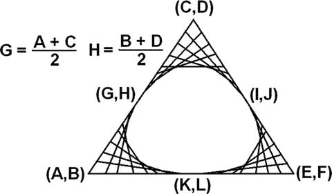
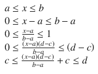

# 10.测试

据说“永远保持警惕是自由的代价。” [<sup>1</sup>](#Fn1) 是的，因为永远的警惕是一切品质的代价。当编写代码时，这意味着边写边测试，在编写完代码后立即测试每个关键功能，而不是等到整个程序都写完了。CABTAB:编码一点；测试一下。早期测试可能是减少编码错误的最好方法。如果我们在编写代码时没有发现每个代码块中的错误，那么以后当我们试图调试代码时，我们对代码就不太熟悉了。

我们测试已知输入的预期输出。我们测试超出范围的值、偏离 1 的值、无意义/互换的数据、空集、零长度步骤、糟糕的游戏移动(非法移动或不合法移动)、除以零、前置条件、后置条件、不变量、适当的关系，尤其是边界条件。你进行的测试被称为系统测试和增量原型。

回想一下，二维视频屏幕在内部由一维列表表示。因此，如果我们希望通过像素戳在矩形(`WIDTH` × `HEIGTH`)屏幕上画一个圆，那么二维图像必须转换成一维表示。我试图直接做到这一点。看看下面的代码。一维列表被称为`image`。三条线(A、B 和 C)中只有一条是正确的，然而它们看起来都是正确的。哪个是正确的？

```py
def frange(start, stop, step = 1):
    i = start
    while i < stop:
        yield i # <-- not return i
        i += step

def drawCircle(cx, cy, radius, image):
    from math import cos, sin
    for t in frange(0, 6.28, 0.01): # range will not allow float steps.
        x = cx + radius*cos(t)
        y = cy + radius*sin(t)
        image[int(y)*WIDTH  + int(x)] = 255 # <--A
        image[int(y *WIDTH) + int(x)] = 255 # <--B
        image[int(y *WIDTH  +     x)] = 255 # <--C
    return image

```

唯一正确的线是 b。我花了几分钟看这段代码(和线 A ),试图发现为什么圆被展开成波浪。表达式`y*WIDTH` first 必须向下舍入。这个例子的要点是，如果不测试代码，错误是不可能避免的。

下面的陷阱抓住了我的一个聪明的学生:

```py
   v = [0]*2
   print('v =', v)  # v = [0, 0]
   m = [v]*2 #
   print('m =', m)  # m = [[0, 0], [0, 0]]
   m[0][0] = 8
   print('m =',m)   # m = [[8, 0], [8, 0]]
#--Surprise: m[0][0] and m[1][0] share the same memory address.

```

几年前，我设计了一个简单的问题来确定我的高中三年级和四年级学生中谁在数学方面比较弱。随便找个高中生试试。

根据其他字母求解 y:。[3 分钟]

后来我意识到，编写这个问题的解决方案提供了一个有启发性的例子，说明消除逻辑错误是多么困难。

测验 4。用你最喜欢的语言，写下面这个简短的函数，然后把你的代码和我的进行比较。

```py
def solveEquation(a,b,c,d,x):
#   +---------------------------------------------------------+
#   | Given: (x-a) = (b*y-c)/(d-y)                            |
#   | Return the unique value for y, if it exists.            |
#   |        if no value for y exists, then print an          |
#   |           error message and exit the program.           |
#   |        if multiple values for y exist, then print       |
#   |           a warning and return a valid value for y.     |
#   +---------------------------------------------------------+
#... Finish writing this function.

```

祝你好运。

```py
#                     QUIZ 4 (My Solution)
def solveEquation(a,b,c,d,x):
#   +---------------------------------------------------------+
#   | Given: (x-a) = (by-c)/(d-y)                             |
#   | Return the unique value for y, if it exists.            |
#   |           [y = (x*d - a*d + c)/(x-a+b).]                |
#   |        If no value for y exists, then print an          |
#   |           error message and exit the program.           |
#   |        If multiple values for y exist, then print       |
#   |           a warning and return a valid value for y.     |
#   +---------------------------------------------------------+

    if (x == (a-b) and (c != b*d)):
       exit('ERROR: No solution. The expression reduces to c = b*d.')

    if (x == (a-b) and (c == b*d)):
       print('WARNING: y is NOT unique: y may take ANY value, except d.')
       return int(not d) # y = 0 or 1

    if (x != (a-b) and (c == b*d)):
       exit('ERROR: No solution. The expression reduces to y = d.')

#---Note: x != (a-b) and c != b*d).
    y = (x*d - a*d + c)/(x-a+b)   # <-- No division by zero and no y = d.
    return y

```

不幸的是，这个问题太难了，以至于它的教育用途受到了限制。不过，这是一种培养解决问题技能的练习。

你可能会认为`A += B`只是`A = A + B`的简写符号。这在 Python 中是不正确的，也许在其他一些语言中也是如此。

```py
def append1(A): #
    A += [3]    #
#------------------------
def append2(A):
    A = A + [3] # The two As are different objects.
#------------------------
def main():
    A = [1,2]
    append1(A)
    print(A) # output: [1, 2, 3]

    A = [1,2]
    append2(A)
    print(A) # output: [1, 2] ß Surprise!

```

那么，我们如何保护自己免受这种句法毒害呢？答案是让我们的代码保持简单，并且边走边测试。

为了修正一个错误，每个人尝试的第一个工具是猜测，因为这不需要努力，而且很多时候是成功的。只有当我们无法通过猜测来修复错误时，我们才必须停下来思考。但有时我们不会停下来——我们只是不断改变，希望我们的问题会消失。在这一点上，我们的效率实际上可能会降到零以下。我们可能开始改变不应该改变的代码。

发现学校程序中错误的主要方法是通过程序运行测试数据并检查结果(跟踪)。有时，对于复杂的算法，编写一个通过函数运行随机数据并检查答案的测试程序是有帮助的。

另一种发现错误的方法是放置错误陷阱，只有在发现错误时才会打印。这在某种程度上给了我们一个自调试程序。这样做的一个原因是，程序某一部分的错误修正可能会导致另一部分的失败。

Misko Hevery 在 YouTube 视频中提出了一个有趣的问题:你能从测试中重建源代码吗？我最初的反应是“当然不是。”然后他建议用一组测试来讲述一个故事。假设测试看起来像这样:

```py
Test1_ItShouldDoThis()
Test2_ItShouldDoThat()
Test3_ItShouldDoSomethingElse()
Test4_ItShouldDoThisToo()
Test5_ItShouldExitLikeThis()

```

所以，也许他是对的，也许我们的测试应该是为了讲述一个故事。

测验 5。(重要)回想一下，两个向量的点积是它们成对乘积的和。例如，`x = [1,2,3,4]`和`y = [2, -3, 0, 5]`的点积为

```py
1×2 + 2×(-3) + 3×0 + 4×5 = 16.

```

下面的四个函数都正确地计算并返回两个向量(又名列表，又名数组)`x`和`y`的点积。唯一的区别是错误陷阱。哪一个是首选的错误陷阱:A、B、C 还是 D？

```py
#---Method A.
def dotProd(x,y):
    return sum(x[n]*y[n] for n in range(len(x)))

#---Method B.
def dotprod(x,y):
    assert type(x) == type(y) == list
    return sum(x[n]*y[n] for n in range(len(x)))

#---Method C.
def dotprod(x,y):
    assert len(x) == len(y)
    return sum(x[n]*y[n] for n in range(len(x)))

#---Method D.
def dotprod(x,y):
    assert type(x) == type(y) == list
    assert len(x)  == len(y)
    return sum(x[n]*y[n] for n in range(len(x)))

```

我的答案在脚注里。 [<sup>3</sup>](#Fn3)

编写函数时，考虑测试不会产生编译或运行时错误的任何先决条件和边界条件。养成这种习惯将会节省你几个小时的调试时间。下面是一个奇特的断言，当一个更简单的形式就可以了，它可能不值得花时间去编码。尽管如此，你应该知道这样的形式是可能的。

```py
    import sys
    assert x>0, 'in function ' + sys._getframe().f_code.co_name + \
                ' x =  ' + str(x)

```

输出:`AssertionError: in function doIt x =  -1`

此外，不要在 Python 断言周围放置圆括号或方括号。非空的元组或列表总是被评估为真(语法毒药)。

程序员构建的错误陷阱可以打印比断言更多的信息，可以关闭文件，并且可以将信息保存在错误文件中。那么为什么有人更喜欢使用内置的 assert 语句，而不是编写一个错误陷阱呢？回答:

1.  断言立即被视为错误陷阱，而不是函数任务的一部分。
2.  断言比用户构建的错误陷阱更快更容易编写。
3.  IDE 会将光标放在程序中的断言行上；一个错误陷阱通常会打印一条错误信息并退出程序。

测验 6。编写一个函数，期望接收两个大小相同的字符串，并返回不同但相对位置相同的字母数，例如，接收“abcdef”和“axcxfe”的函数将返回 4。我的答案在本章末尾。至少在 Python 中，有一种巧妙的方法可以做到这一点。

考虑在程序运行时或结束后打印一些统计数据(时髦的术语:动态性能分析)。当然，总是打印每个程序的运行时间——没有例外。这可以帮助你确定你的程序的大 O。您可能还想打印

1.  进行递归调用的次数和达到的递归深度，
2.  树中被访问的节点数量(我这样做是为了衡量 alpha-beta 修剪的性能。我的程序通过修剪减少了 2/3 的节点。),
3.  已达到最大树级深度，
4.  队列或某些其他动态数据结构的最大大小，
5.  写入或读出文件的项目数，
6.  或者每次移动所用的时间，也许是游戏中每次移动的平均时间。

在编写代码之前编写测试和调试实用程序有几个好处。

1.  当你写完你的代码，你可以立即测试它，而不是花几分钟去创建一个测试。
2.  您实际上编写了测试，而不是转移到另一个函数。
3.  首先编写测试有助于在编写函数之前勾勒出它的轮廓。

不测试你的代码的一些原因是:1)它很无聊/有压力/很累，2)它明显减慢了我们的进度，3)我们不习惯测试，以及 4)我们担心我们可能真的会发现一个 bug。所有这些借口都是自欺欺人的形式。坦率地说，不进行测试意味着草率、懒惰和无能。

*   学生程序员:“有什么办法可以摆脱这种痛苦吗？”
*   C.S .老师:“是的。不要一开始就陷入其中:边走边测试，防御性地编写代码。”

# -

测验 6 答案:

```py
different sameLettersInSamePlaceCount(stng1, stng2):
    return sum(ch1 != ch2 for (ch1, ch2) in zip(stng1, stng2))

```

好吧，如果你不知道`zip`功能，那么你就不可能使用它。指令

```py
print(list(zip(stng1, stng2)))

```

生产

```py
[('a', 'a'), ('b', 'x'), ('c', 'c'), ('d', 'x'), ('e', 'f'), ('f', 'e')]

```

`zip`函数值得记住。其实这个例子很值得记住。注意这个理解是生成器理解，不是列表理解(没有方括号)。注意函数名有多长。浏览一下这个简单的代码就能告诉读者它是做什么的。那么为什么不用`lettersCount`这个名字或者更简单的名字呢？答:因为我们想让读者确切地知道函数计算和返回什么，而不必检查函数代码。

* * *

我一生都在研究高中数学/计算机科学问题，这促使我为计算机科学专业的学生提供另外三个数学问题:

1.  根据 f (x)给定 g (x)，我们能根据 g(x)写出 f (x)吗？有时候，如果你发现了窍门。给定，用和写出 f (x)为 g (x)和参数 a、b、c 和 d 的函数
2.  Given , with , find f (x) such that , and f(x) increases uniformly as x increases uniformly—e.g., if x is  of the way between a and b, then f (x) is  of the way between c and d. The need for this formula is common in graphics. For example, you need this formula to draw the fancy web shape on the right. As x ranges from `G` to `C`, y must uniformly range from `H` to `D`.

    

3.  一个汽车散热器能容纳`quartCap`夸脱。它装有百分之`pct1`的防冻溶液。编写一个函数`antifreeze`,返回正确的溶液夸脱数(四舍五入到最多 2 位小数),该溶液应被排空并重新注入纯防冻剂，以使浓度达到百分之`pct2`。在不可能的情况下退出程序——例如，我们假设`pct1`和`pct2`是介于`0`和`1`之间的数字。

* * *

答案 1。，其中 x 在 f 的定义域内，由于原方程两边的 x 代表相同的值，所以两边用代替，然后简化。

答案 2。。

代数:我知道的最简单的推导如下图。

T2】

解析几何:问题自然归结为求通过点(a，c)和(b，d)的直线。这样一条线的斜率是，通过将(a，c)代入可以得到 b ’,这样我们就得到了。由此，。这个表达式简化为。

答案 3。

```py
def antifreeze (quartCap, pct1, pct2):
    assert 0<= pct1 <=1 and 0<= pct2 <=1 and pct1 <= pct2 and quartCap > 0, \
            ["ERROR (bad input):", quartCap, pct1, pct2] # Note the FOUR cases.

    return round(quartCap*(pct2-pct1)/(1-pct1), 2)

```

Footnotes [1](#Fn1_source)

摘自爱尔兰演说家和政治家约翰·菲尔波特·柯伦 1790 年的一次演讲。参见维基百科。

  [2](#Fn2_source)

如果一种语言提供了方便、简洁的快捷方式，那么这些快捷方式可以被描述为语法糖，这个术语是在 1964 年创造的。Python 中内置的字典数据结构是关联矩阵/列表的语法糖。我怀疑 Python 比其他任何语言都有更多的语法优势。

  [3](#Fn3_source)

问题 5 答案:我选择 C 是因为如果没有`len(x) == len(y)`，一个错误会不被发现地传递到程序的其余部分。我认为如果没有这个错误陷阱，这个函数就没有写好。然而，我们不需要检查`x`和`y`的数据类型，因为编译器会为我们做这些。编译器检查以确保`x`和`y`都是可下标的，并且它们是数字的集合，而不是字符串或对象。请记住，Python 中的 times 操作符(*)是重载的，例如`’cat’*3 = ‘catcatcat’`。偶尔会出现奇怪的错误。世界级的程序员会测试这种可能性吗？我的观点:保护我们的代码免受每一种极其罕见的可能性，是不划算的。