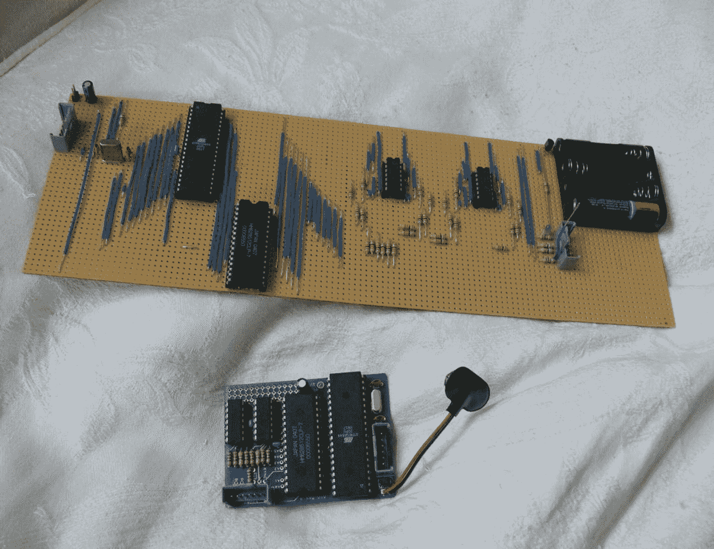
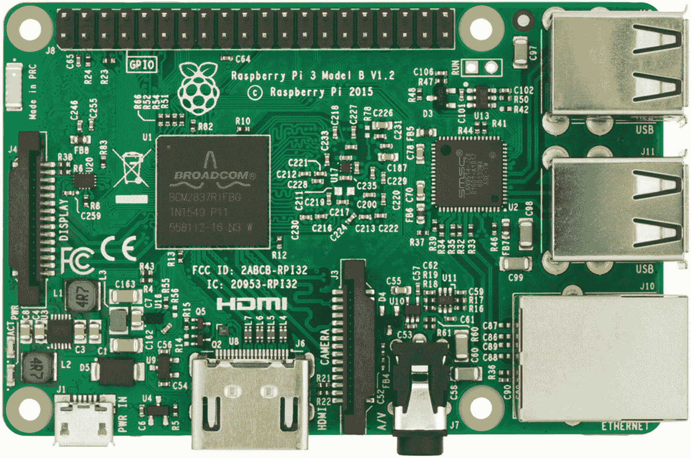
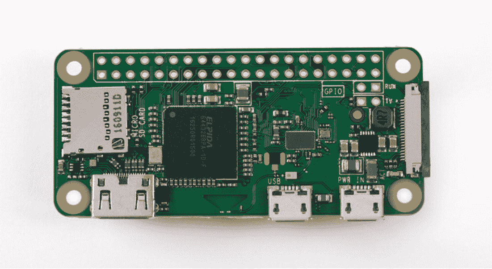
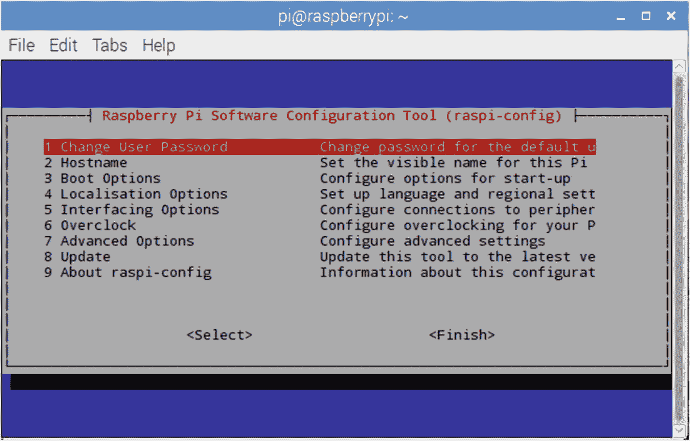

# 一、树莓派简介

所以，你已经有了一台树莓派迷你电脑，你在想:“现在怎么办？”也许这是一个礼物。也许你听说过这个“覆盆子馅饼”,并决定找出所有的骚动是怎么回事。也许你已经对计算机有经验了，但对 Linux 或 Python 却没有。也许你是一个 Linux 极客，从来没有用几行代码和正确安装的硬件和软件做过伺服运动或点亮过 LED。或者，也许你对电脑的熟悉程度只达到了查看邮件和上网冲浪的程度，但却渴望了解更多。或者(这是我最喜欢的场景之一)你是一名教育家，对教育下一代计算机、编程和一般技术感兴趣。

不管是什么情况，欢迎！你即将加入一个俱乐部——恐怕不是一个特别排外的俱乐部，因为加入的费用只有大约 35 美元和一点创造力，但仍然是一个俱乐部——由学生、教师、业余爱好者、艺术家和工程师组成。作为这个俱乐部的成员，你将能够与任何愿意听你唠叨的人智能地讨论*包管理器*、 *ARM 处理器*和*点配置文件*。你将熟悉伺服系统、发光二极管和单芯片相机。也许最重要的是，您将能够连接到您的新迷你计算机，使用许多编程语言中的一种对其进行编程(尽管本书仅涉及 Python)，构建项目，并将这些项目与 Pi 进行交互，使其能够与物理世界进行交互并做一些非常酷的事情。

凭借这本书，我特此介绍你加入这个俱乐部。您的经验并不重要，因为我将一步一步地引导您完成设置 Pi 的过程，这样您就可以轻松地使用它。我将给你一个坚实的 Linux 背景，让你对幕后发生的事情有一个概念，我将用整整一章来讲述 Python，这种看似强大的脚本语言被脸书、谷歌甚至 NASA 这样的科技公司所使用。我还打算向你介绍电子学的基本原理，这是许多技术工程书籍要么掩盖，要么完全忽略的东西。有安全因素要考虑(例如，由于短路脂肪电池，我几乎有几次小爆炸)以及良好的建筑实践；您将了解好的和坏的焊点之间的区别，如何避免用 X-ACTO 刀切掉手指，以及 40ω和 40KΩ电阻之间的区别。

当然，如果你已经熟悉了所有这些介绍性的项目，可以随意跳到好的部分——项目。大部分都可以在一个周末左右完成，我也尽量把成本控制在合理的范围内。所有程序都是用 Python 编写的。在每一章的开始，我会给你一个购物清单和在哪里购买零件的建议，然后我们就开始建造。这些项目不一定要建立在彼此的基础上，也不一定要按顺序进行，尽管从第一个项目到最后一个项目，它们的复杂性会增加。

你能用 Pi 做什么样的项目？一个更好的问题可能是什么样的项目*不能*用 Pi 来做。它已经被用于从网络服务器到汽车电脑(*汽车电脑*)到集群计算到嵌入式机器视觉设备到 CNC 控制器的所有东西。。。这个清单还在继续。我希望读完这本书后，你会有自己的一些想法，以及将这些想法付诸实践所需的技能。

不管你拿起这本书的原因是什么，你的主要目标应该是获得乐趣和学习一些东西。希望一路走来能帮上忙！

## 树莓派的历史

对一些读者来说，树莓派似乎是新的；有相当多的人不知道这是什么。即使是现在，在第一个圆周率产生七年后，大量在线文章的开头都是这样的:“树莓圆周率是一个小型的信用卡大小的计算机，爱好者已经开始使用它了。。."这与 Arduino 形成了鲜明的对比；大多数关注时事的人至少听说过它，即使他们不知道它是什么或它的用途，因为它自 2005 年以来一直存在，并在世界各地的爱好者、极客和自己动手者中获得了巨大的声音追随者。

### Arduino

对于那些*不知道*的人来说，Arduino 是一个微控制器平台，有许多不同的外形和尺寸，安装在 PCB 上，可以轻松插入大多数计算机的 USB 端口。它允许用户通过一种叫做*草图*的程序中类似 C 的编程语言对板载 Atmega 芯片进行编程来做各种事情。典型的 Arduino 草图可能如下所示:

```py
#include <Servo.h>

void setup()
{
     myservo.attach(9);
}

void loop()
{
    myservo.write(95);
    delay(1000);
    myservo.write(150);
    delay(1000);
}

```

这个程序将前后移动一个连接的伺服电机(一个可以通过软件精确控制的小电机)，两次移动之间有一秒钟的延迟。

在计算能力方面，Arduino 不如 Pi 强大，但它也是一种完全不同的动物，因为它是一个微控制器，而不是一台计算机，所以比较它们有点像比较斑马和鳄梨。然而，这两台机器确实很好地互补，我将在第 [14](https://doi.org/10.1007/978-1-4842-3769-4_14) 章讨论如何互补。

正如我所说的，树莓派已经存在了几年——确切地说是七年。有几种不同的型号可供选择，新的改进版本大约每隔一年发布一次。

圆周率的创造者——埃本·厄普顿、罗布·穆林斯、杰克·朗和艾伦·迈克罗夫特——在 2006 年首次提出了教学用廉价电脑的想法。他们都来自英国剑桥大学，他们担心 Commodore 64、Amiga 和 Spectrum 等廉价个人电脑的消亡会对年轻人的编程能力产生负面影响。由于台式机和笔记本电脑的价格高达数百或数千美元，儿童和青少年被禁止在家庭的主电脑上练习编程，因为他们害怕破坏它。

与此同时，厄普顿和其他人意识到许多大学计算机科学课程已经简化为“微软 Word 101”和“如何使用 HTML 创建网页”这四位创始人希望提高新生的编程知识水平，因此，计算机科学和工程课程可能会变得更强大，更适用于现实世界中的 STEM 领域。

显然，更便宜的计算机是必要的。他们尝试了微控制器和各种芯片、试验板和印刷电路板(见图 [1-1](#Fig1) )，但直到 2008 年这个想法才变得更加可行。由于移动设备的爆炸，芯片变得更小、更便宜、更强大。这些芯片使他们能够设计一种能够支持多媒体的设备，而不仅仅是命令行编程，他们认为这对于吸引所有年龄的学生很重要。年轻人更有可能对支持媒体的设备感兴趣，因此也更有可能尝试在这种设备上编程。



图 1-1

Eben Upton 的 2006 年树莓派原型(图片树莓派基金会)

2008 年，最初的四位创作者与皮特·洛马斯(Pete Lomas)和大卫·布拉本(David Braben)一起成立了树莓派基金会(the Foundation)，三年后第一个大规模生产的 Pi 下线。

### 注意

名称 *Raspberry Pi* 是对早期以水果命名的微型计算机数量的认可，如苹果和橘子，而 *Pi* 来自 Python 脚本语言，这一直是 Pi 设计的一个组成部分。

一年之内，基金会售出了超过一百万台。创始成员已经多次谈到他们是如何被对他们设备的爆炸性兴趣惊呆的。他们最初的目标是把一个便宜的可编程设备放在教育工作者和他们的学生手中，这个目标已经实现了，但是 Pi 的意义还不止于此。显然，他们不是唯一失去在更便宜的机器上编程能力的人；世界各地的爱好者(包括你真正的爱好者)用订单淹没了 element14、Premier Farnell 和 RS Electronics 以至于预购 Pi 的人不得不等待长达 6 个月的时间，以供不应求。(在撰写本文时，Pi 的最新型号之一 Pi Zero W 仍然只能在每个客户一台的基础上提供。)许多客户可能是现在或以前的程序员，渴望玩一台新的、小的、功能强大的计算机。例如，我第一次学会用 BASIC 语言编程是在 Commodore VIC-20 上，这是一台具有令人印象深刻的 5KB 内存的计算机。

除了教育，圆周率还有无数的其他用途，就像树莓圆周率基金会的*关于我们*页面上写的那样:

*   我们得到了教育界的极大关注、支持和帮助，对于来自远离我们最初目标的机构和个人的大量咨询，我们感到很高兴，也有点受宠若惊。发展中国家对 Raspberry Pi 感兴趣，将其作为生产力设备，用于那些根本负担不起运行传统台式 PC 所需的电源和硬件的地区；医院和博物馆已经联系我们，了解如何使用 Raspberry Pi 来驱动显示设备。严重残疾儿童的父母和我们谈论过监控和辅助应用程序；似乎有 100 万人拿着热烙铁想要制造一个机器人。

幸运的是，在很大程度上，供应已经安全地赶上了需求。购买圆周率不再需要等待，除了零 W 之外，每位顾客也不再有购买一个圆周率的限制。有数不清的“帽子”(形状合适的配件市场附加板，具有各种功能)，以及一个摄像头板和一个官方触摸屏显示器，它们都可以插入 Pi 上的端口。创始人还积极鼓励其他公司复制他们的模式，这可能是今天有这么多小型单板计算机的主要原因。

## 探索圆周率

由于有许多不同的设计可供使用，所以不可能只写一个章节来详尽地说明 Pi 的内置部件和设计。不过，我将保持这一节的篇幅，只讨论最近的三个版本:Pi version 3、Zero 和 Zero W，因为 Zero 和 Zero W 的设置几乎完全相同，所以我们只需要描述其中一个。所有这些主板的价格都很低；版本 3 目前约 35 美元，零约 5 美元，零 W 为 10 美元。2018 年 3 月 14 日，也被称为圆周率日，树莓派基金会发布了圆周率第三版的更新，即 3 B+这个新版本对最初的版本 3 进行了一些升级，包括双频 WiFi、稍快的 CPU (1.4GHz)和以太网供电(PoE)功能。由于这个版本仍然是非常新的，因为它的外形几乎与最初的版本 3 相同，并且它的升级不会影响本书中的任何项目，所以我不会在这一点上提及它。

圆周率的大小这些年来没变过。Pi 3 的尺寸与 Pi 1 相同:85.6 毫米 x 56mm 毫米 x 21mm 毫米。Pi Zero 和 Zero W 稍微小一点:30mm x 65mm x 3.5mm(没有 USB 和以太网端口使得厚度差异巨大)。最新的 Pi 重了一点——45 克，而原来的是 31 克——但幸运的是，当你试图将新的 Pi 安装到旧的案例或项目设计中时，重量可能不会成为因素。

看一下图 [1-2](#Fig2) ，我将带你从 GPIO 引脚开始，顺时针方向浏览一下电路板。



图 1-2

树莓 Pi 3

### GPIO 引脚

正如你在图中所看到的，电路板的小空间里装了很多东西。你可以看到，沿着顶部，从 Pi 的早期版本到当前模型的最大改进之一:从 26 个增加到 40 个 GPIO(通用输入/输出)引脚。这些引脚允许您将 Pi 连接到任何数量的物理扩展，从 led 和伺服电机到电机控制器和扩展板(通常称为“hats”)。对于普通的台式机或笔记本电脑，与这样的物理设备接口几乎是不可能的，因为串行端口在较新的设备上几乎已经消失，并且不是每个人都能够为 USB 端口编写低级设备驱动程序。然而，Pi 带有预安装的库，允许您使用 Python、C 或 C++访问 pin，如果您不喜欢预安装的版本，还可以使用其他库(例如 PiGPIO 和 ServoBlaster)。

### USB 和以太网

接下来，我们将沿着外部边缘看到两对 USB 端口和以太网端口。它们都连接到 LAN 9514(USB 端口左侧的芯片)，提供 USB2.0 和 10/100 以太网连接。与所有其他 pi 一样，该芯片充当 USB 到以太网的适配器，这使得板载以太网能够工作。

### 音频插孔

板上的 3.5 毫米音频插孔可用于任何标准耳机。如果可用，HDMI 声音通过 HDMI 接口传送。声音输出也可以通过 I <sup>2</sup> S 实现。I <sup>2</sup> S 不在本书讨论范围内，但它是一种用于将数字音频设备连接在一起的串行接口标准。

### 相机连接器

板上的摄像头连接器允许您将官方的 Raspberry Pi 摄像头板(图 [1-3](#Fig3) )或 NoIR(红外)摄像头板连接到 Pi。


图 1-3

Raspberry Pi 相机板

### 高清晰度多媒体接口

摄像头电路板连接器后面是 Pi 的 HDMI(高清多媒体接口)端口。许多 Pi 爱好者认为，这是 Pi 从一开始就与众不同的地方，因为它总是能够显示高清图形。最新版本的 Pi 板载 400MHz Broadcom VideoCore IV GPU，使其能够以高达 60fps 的速度输出全高清视频。它可以支持蓝光质量的播放，并在芯片上支持 OpenGL 和 OpenVG 库，虽然它没有 H.265 解码硬件，但 GPU 运行速度足够快，可能能够在软件中解码 H.265。

### 力量

继续顺时针方向，我们来到微型 USB 电源输入端口。类似于以前版本的 Pi，你可以用一个标准的手机充电器给你的 Pi 供电，但要确保它至少能提供 2A。Pi 3 本身可能不会使用那么多电流，但如果四个设备插入四个 USB 端口，它肯定可以。

你也可以用电池给 Pi 供电(我倾向于用 LiPos)，但是有一个警告:*Pi 没有板载电源调节器！*如果你习惯使用 Arduino，你知道你可以插上 9V 电池，然后上路。如果你用圆周率来尝试，迎接你的将是一股神奇的烟雾，你需要买一个新的圆周率。我将讨论移动 Pi 必不可少的项目中的电压调节器。

### 显示

电路板顶部的最后一个连接器是 DSI 显示器连接器，用于连接官方的 Raspberry Pi 7 "触摸屏显示器。这款显示器于 2015 年发布，最终满足了 Pi 爱好者的需求，他们需要一种简单的方式来与 Pi 交互，而不必带着巨大的显示器和键盘。如果你没有显示器或不需要触摸屏界面，你仍然可以自由使用普通的 HDMI 显示器和 USB 键盘和鼠标。

### 片上系统

整个 Pi 上最重要的一块是中间的大黑芯片，也称为 *SoC* ，或 *芯片*上的*系统。Pi 的芯片是 Broadcom PCM2837，配有 1.2GHz ARM Cortex A53 四核集群。这甚至比最近的 Pi 都有了巨大的改进，其中最大的改进是在多线程处理方面。不幸的是，一个代价是新芯片消耗了更多的能量。如果你正在寻找低功耗，你可能会更好地与老型号或与零或零 w。*

### sd 卡

最后，在电路板的底部是 microSD 卡插槽。Pi 最大的节省空间的特点之一是它没有真正的硬盘。SD 卡的作用类似于固态硬盘(SSD)。这种形式因素在 Pi 版本的过程中有所变化；当前版本只支持 microSD 卡，没有弹簧加载。您需要使用至少 4GB 的卡来最小化安装 Raspbian(Pi 的首选操作系统)以便在 Pi 上工作，建议使用 8GB 的卡。我已经能够在 Pi 上使用高达 64GB 的卡，但是您的结果可能会因卡的制造商而异。如果你担心数据降级或启动失败，坚持使用名牌卡。

### 不可见

在 Pi 3 的主板上看不到的一点是它内置的 WiFi 和 ble(蓝牙低能耗)功能。这些由 Broadcom BCM43438 芯片提供，该芯片提供 2.4GHz 802.11n 无线局域网、BLE 和蓝牙 Classic 4.1 无线电支持。对我来说，这是对原始 Pi 的巨大改进，因为我不再需要购买和配置 USB WiFi 转换器，同时失去了 USB 端口，蓝牙兼容性在构建物联网(IoT)应用程序时是一个巨大的便利。

## Pi 零/零 W

这是对 Pi 3 的设置的一个相当详尽的介绍，但如果不看看 Pi 的最新兄弟 Pi Zero 和 Pi Zero W(图 [1-4](#Fig4) )，任何新书都不会完整。圆周率零点于 2015 年 11 月推出，随后是零点 W。Zero W 基本上是与 Zero 相同的型号，只是内置了无线互联网。



图 1-4

圆周率零点 W

让我们快速浏览一下 Zero W 提供的一切。

### 通用输入输出接口

您可能会注意到的第一件事是缺少标题。为了降低成本，因为你只需为 0 支付 5 美元，为 0 W 支付 10 美元，Pi 基金会决定你必须自己焊接接头。这是一个很小的代价，因为它仍然拥有 40 个引脚，引脚排列与全尺寸 Pi 相同。

### 相机连接器

继续顺时针旋转电路板，您会发现 Pi 相机电路板的连接器。这里的区别是形状因素:Zero 的连接器比 Pi 3 上的连接器薄得多。Zero 仍然使用相同的相机板，但电缆连接不同。如果你打算把你的 Pi 相机和你的 Zero 一起使用，确保你订购了一根适配器线，大多数卖 Pi 配件的地方都有卖。

### 力量

在电路板的底部，您会看到两个微型 USB 端口。第一个是相机接口旁边的电源接口，就像较大的 Pis 一样。一个标准的手机充电器应该在这里做得很好，因为零不需要太多的电流。再次，像 Pi 一样，它没有*而不是*有一个电压调节器，所以请确保您只给它一个干净的 5V 电源。

### 通用串行总线

电源微型 USB 连接器旁边是微型 USB 端口。要在 Zero 上使用大多数外设，您需要购买微型转标准 USB 集线器。确保你得到一个不需要外部电源的，除非你打算使用像网络摄像头这样的耗电设备。在这种情况下，你需要一个有电源的集线器，因为零线不能提供太多的电流。

### 高清晰度多媒体接口

继续顺时针方向，在微型 USB 端口之后是迷你 HDMI 端口，这(显然)将需要一个迷你 HDMI 适配器。Zero 不像更大的 Pi 那样有单独的 GPU，但它仍然能够通过该端口输出完整的 1080p 输出。

### sd 卡

最后，microSD 卡插槽是这个小小的板上的最后一个东西。像更大的 Pi 一样，你至少需要 4GB 的卡才能在 Zero 上做任何有价值的事情，我真的建议 8GB 或更大。

### 片上系统

电路板中央的黑色大芯片是 Broadcom PCM2835，配有 1GHz 的 ARM11 处理器。如果这些规格听起来很熟悉，它们应该是:它与最初的 Raspberry Pi 上封装的芯片相同，只是运行速度更快一些。价格点已经下降了一点，使其能够放置在像 Zero 这样的低功耗板上。

### 不可见

像 Pi 3 一样，Zero W 的无名英雄之一是内置的 2.4GHz 804.11n 局域网，BLE 和经典的蓝牙 4.1 功能。无线电芯片和 Pi 3 上的一样，但是天线有点不同，我想它看起来很快。如果你仔细观察 USB 输出和迷你 HDMI 端口之间的电路板边缘，你会看到一个小三角形。那个三角形实际上是在 PCB 的各层中切割出来的，是一个谐振腔，大小正好可以与 WiFi 无线电波进行交互。这是一个巧妙的想法，并有助于保持零小和便宜。

Zero 和 Zero W 都是令人难以置信的廉价设备，如果你打算用 Pi 做任何工作，我强烈建议每样都买一个或多个。对于价格，你真的不能击败你可以用他们两个做什么。

## 将 Raspberry Pi 与类似设备进行比较

你可能会问，是什么使 Pi 优于其他小型微型计算机，如 Arduino，也许还有 Beagleboard 系列设备？答案是 Pi 不一定比 T1 更好；这些板中的每一个都占据了一个特定的位置，很难对它们进行比较，尤其是像 Arduino 这样的微控制器。Arduinos 非常适合创建简单的项目，甚至可以控制一个非常简单的机器人，在很多情况下，使用 Pi 来实现这种目的是多余的。至于其他的微型计算机，一个主要的区别是价格。与 Pi 密切相关的是 Beagleboard，但该板的建议价格超过 75 美元——比 Pi 高得多。购买 Raspberry Pi 意味着你在支持一个慈善组织，该组织旨在将廉价电脑送到世界各地的小学生手中，所以这也是存在的。

## Pi 入门

我想你会同意，现在是把圆周率从盒子里拿出来的最好时机，如果你还没有的话。在开始之前，请继续阅读。

## Pi 的硬件要求

让我们快速看一下 Pi 的要求是什么，然后我们将启动它。为了本章的目的——实际上，这本书的大部分内容——我将假设你，读者，使用的是圆周率 3 而不是零。大多数事情将保持不变；如果有明显的差异，比如在电源要求方面，我一定会提到它们。

### 连接电源

我已经提到了权力。Pi 需要 5V——不多也不少。再次，因为它值得重复:*Pi 没有板载电压调节器！*你不能插上 9V 电池或壁式电源插座就指望它能工作。要么使用能输出 5V 电压的手机充电器，要么从网上电子商店或购买圆周率圆周率圆周率圆周率圆周率圆周率圆周率圆周率的地方获得优质电源。电源输出也应至少为*1.5A，最好是 2A。如果它没有足够的电源，请准备好面对你的 Pi 的一些古怪行为，比如鼠标和键盘无法工作，甚至完全无法启动。*

### 添加显示器

你需要的下一个外设，至少在一开始，是一个具有 HDMI 或 DVI 功能的显示器。如果你只有 DVI 输入，那也没关系，因为 HDMI-DVI 转换器无处不在。在您设置好它并且安装了所有必要的软件之后，您可以在一个*无头*配置中运行 Pi。这意味着你可以从同一个网络上的另一台计算机上使用 SSH(安全外壳)甚至 VNC(虚拟网络计算)客户端登录。但是首先你需要一个显示器，这样你就可以看到你在做什么。一步步来。

### 添加 USB 集线器

虽然 Model 3 有四个 USB 端口，但您可能希望在某个时候添加一个 USB 集线器。如果你使用零，你肯定需要一个，至少在开始的时候。当你添加一个集线器时，性能会变得有点挑剔，因为当涉及到与 Pi 一起工作时，一些 USB 集线器已经被证明比其他的更好地工作*。也许最重要的必要特征是集线器是外部供电的；这将防止你的 Pi 必须提供足够的电力给你那天决定插入的任何耗电设备。如果你没有空闲的网络中心，不知道该尝试什么，树莓派论坛通常是一个开始寻找的好地方( [`http://www.raspberrypi.org/phpBB3`](http://www.raspberrypi.org/phpBB3) )。在这里，像你一样的用户已经尝试了无数不同的品牌，并报告了哪些可以，哪些不可以，哪些需要稍微调整。幸运的是，集线器相对便宜，所以如果您尝试的第一个不工作，您可以在其他地方使用它，并用您的 Pi 尝试不同的。*

 *我在 Zero 上使用的是 MakerSpot 迷你 USB 集线器(图 [1-5](#Fig5) )。


图 1-5

MakerSpot 迷你 USB 集线器

然而，在这里你应该照我说的做，而不是照我做的做，因为这个特殊的集线器是*而不是*外部供电的。它确实做了我需要它做的一切，而没有导致我的 Zero 遭受停电(由于电量不足而导致的怪异行为)，所以请随意用它复制我的成功。

现在您已经为您的 Pi 配备了所有必要的外部部件，您已经准备好开始设置它了。

## Pi 操作系统

Raspberry Pi 的默认操作系统(OS)——它设计使用的操作系统——是 Linux。Pi 3 可以运行物联网版本的 Windows 10，但设置它可能有点棘手，以我的经验来看，Pi 在 Linux 上运行得更好。如果你不熟悉 Linux 操作系统，不要担心——我们将在第 [2](02.html) 章中一探究竟。不过现在，我们知道 Linux 有几种版本，或者说是*发行版* : Ubuntu(最流行的版本之一)、Debian、Mint、Red Hat、Fedora 以及其他一些不太知名的版本。Pi 使用了 Debian 的一个版本，名为 *Raspbian。*

因为 Pi 没有硬盘，所以您必须下载磁盘映像并将其复制到 SD 卡。Pi 将使用该映像进行引导，它还将充当内存/RAM。几乎任何大小的卡都可以，只要它至少有 4GB，如果你打算在卡上加载大量的额外软件，最好是 8GB 以上(是的，你最终会这样做)。正如我前面提到的，高达 64GB 的卡已经被证明可以正常工作；除此之外，你的结果可能会有所不同。建议你用名牌卡，而且应该是*4 级*，表示卡的速度。

### 格式化卡片

你的第一个任务是格式化卡，这样你的 Pi 就可以读取它。使用内置 SD 读卡器或 USB 适配器将 SD 卡插入电脑。现在，执行以下操作:

*   【Windows 用户:在 [`https://www.sdcard.org/downloads/formatter_4/eula_windows/`](https://www.sdcard.org/downloads/formatter_4/eula_windows/) 从 SD 协会下载格式化工具程序。使用所有默认设置安装并启动它。在工具的选项菜单中，将“格式大小调整”选项设置为“开”，确保您选择了正确的 SD 卡，然后单击“格式”

*   **对于 Mac 用户**:从 [`https://www.sdcard.org/downloads/formatter_4/eula_mac/`](https://www.sdcard.org/downloads/formatter_4/eula_mac/) 下载 Mac 版格式化工具。双击下载的`.pkg`文件，使用所有默认设置安装该工具。一旦安装完毕，打开它，选择“覆盖格式”选项。确保您选择了正确的 SD 卡，然后单击“格式化”

### 安装操作系统

既然卡已正确格式化，您可以在上面安装操作系统了。大部分用户可以使用 [`http://www.raspberrypi.org/downloads`](http://www.raspberrypi.org/downloads) 的 Pi 基金会的 NOOBS(全新开箱即用软件)。但是，如果您愿意，您可以直接下载 Raspbian 图像本身。甚至还有一个 Raspbian Lite 操作系统，它的内存占用要小得多，非常适合 Zero 和 Zero W 等较小的系统。NOOBS 系统在第一次启动时，实际上会为您提供一个安装操作系统的选择，包括两个版本的 XBMC (Xbox Media Center)、Pidora 和 Raspbian。出于本书和后续章节的目的，我们将安装 Raspbian。

一旦你下载了你选择的操作系统(NOOBS:1.3 GB；Raspbian: 1.7GB)，使用您选择的解压缩实用程序将其解压缩(Windows:右键单击，“Extract all”；Mac:双击)。然后，将提取的文件复制到您的 SD 卡上。

就这样。您的 Pi 现在可以启动了。

## 连接外围设备

准备好连接所有这些美妙的组件了吗？别急，莫克·萨比。连接外设有一个优先顺序。这可能看起来很奇怪，但有*可能*(即使可能性极小)以错误的顺序连接电源、显示器和其他部件可能会导致电压尖峰并烧毁您的主板。所以，习惯于按照这个顺序把事情联系起来，这样你就不会有潜在的麻烦了。顺序如下:

1.  插入 SD 卡。

2.  连接显示器。

3.  连接 USB 外围设备(键盘、鼠标、集线器)。

4.  连接以太网电缆。

5.  连接电源。

事实上，这里要记住的最关键的细节是最后接上电源。你或许可以在其他人身上蒙混过关，但权力应该永远留在最后。

没有开关；一旦你插上电源，板上的 led 应该开始亮起，你应该在你的监视器上短暂地看到一个彩虹屏幕(图 [1-6](#Fig6) )。


图 1-6

Pi 彩虹启动屏幕

这个屏幕实际上是由 Pi 的固件在初始化板载 GPU 时生成的。GPU 在屏幕上绘制四个像素，然后对它们进行纹理化，从而产生多色正方形。您应该只看到很短的一段时间，然后随着 Pi 继续其引导过程，出现一个滚动的文本列表。

## 配置 Pi

当您第一次使用 NOOBS 启动 Pi 时，您会看到一个有六个选项的选择框:Archlinux、OpenELEC、Pidora、RISC OS、RaspBMC 和 Raspbian(尽管这些选项可能会根据您阅读本文的时间而发生变化)。用鼠标选择 Raspbian，然后单击窗口左上角的“安装操作系统”按钮。在随后的弹出框中单击“是”进行确认，然后等待图像写入 SD 卡。这可能值得一看，因为进度窗口有一些提示，你可以在等待时阅读。如果您刚刚下载了 Raspbian 映像，Pi 应该会自动引导到桌面(图 [1-7](#Fig7) )。


图 1-7

Pi 的默认桌面

一旦您的 Pi 已经启动，并且您在桌面上，您应该首先访问的是软件配置工具，也称为`raspi-config`。这可以通过键入

```py
$ sudo raspi-config

```

在一个终端。(要启动终端，请单击菜单栏中的终端图标。)这个工具允许您对配置进行更改，比如扩展文件系统、启用 SSH 和摄像头，以及设置 Pi 的语言环境。最后一项(可从 Localisation Options 子菜单中访问)比您想象的更重要，因为 Pi 的默认区域设置(以及相关的键盘布局)是在英国，这意味着如果您在美国，当您第一次按 Shift > 2 时，您会感到不愉快的惊讶，因为您以为会得到“@”符号，但却看到双引号(")。

要浏览`raspi-config`工具(图 [1-8](#Fig8) ，用箭头键选择您想要更改的选项，按 Tab 键，然后按 Enter 键选择您的选项。一定要启用摄像头，因为您稍后会用到它，以及 SSH 访问和 VNC 功能——所有这些都可以在接口选项子菜单中找到。我还会启用 I2C、SPI 和串行，因为它们总是很方便，以后还会用到。随心所欲地玩所有的设置，记住你不能真的破坏任何东西。如果你把你的卡做成砖块，使它无法使用，只需使用 SDCard 工具重新格式化它，并把操作系统复制到它上面，这样你就可以重新开始。稍后，你可能要更加小心，但我会告诉你如何备份你的卡，这样你就不会丢失任何设置，如果你做一些愚蠢的事情。



图 1-8

`raspi-config`

当你玩完`raspi-config`后，选择“完成”并按回车键。

您的 Pi 现在已经启动并运行。恭喜你，给自己一个鼓励！尽情享受，但不要太舒服。你的下一个任务应该是确保一切都是最新的。大多数 Linux 发行版都会定期发布更新和升级，Raspbian 也不例外。从 Pi 基金会提供 NOOBS 或拉斯扁的图像供下载到今天，很有可能已经对软件和内核进行了几次重要的升级。

要更新 Pi，请确保您的以太网电缆已插入并启动终端(单击终端图标或按 Ctrl–Alt–t)。在提示符下，键入

```py
$ sudo apt-get update

```

当 Pi 刷新它的软件列表时，你会看到一行行的文本流畅地流过。完成后，将返回“`$`”提示。此时，键入

```py
$ sudo apt-get upgrade

```

同样，文本行应该滚动过去。如果可以下载新软件，Pi 会询问您是否要下载并安装它。按 Enter 键(默认选项)。当它完成并返回到`$`提示符时，一切都应该是最新的版本。根据更新的内容，可能会提示您重新启动。这样做，你就会跟上时代。

### 注意

当我提示您在终端中输入文本时，当您看到“$”字符时，您实际上不应该键入美元符号。这是由于您使用的 shell 环境而在终端中出现的提示符。

## 关闭码头

在我们开始讨论 Linux 之前，我们先来讨论一下关机。事实上，关闭 Pi 真的没有必要；这是一个如此低功耗的设备，设计师只是希望你让它运行。不过，你可以把它关掉，为了节省一点钱，也许还有你的 Pi，我建议你在用完之后把它关掉。由于没有“关闭”开关，Pi 实际上被设计为只需拔掉插头就可以关机，应该不会发生什么不好的事情(假设您已经保存了工作，没有在忙什么，等等)。但是仅仅拔掉它就让我们许多电脑类型的人畏缩不前，所以让我教你真正的，*正确的*关机方法。打开终端，在提示符下键入

```py
$ sudo shutdown now

```

这将使处理器经历正确的关闭序列，终止正在运行的进程，停止线程，等等。完了，拔下圆周率，真的很安全。

如果希望从终端重新启动，请键入

```py
$ sudo shutdown –r now

```

将重新启动 Pi。

## 摘要

现在，您已经了解了 Pi，安装了它的操作系统，并对它进行了更新，使其寿命缩短了一英寸。还向您介绍了`raspi-config`工具，您甚至还使用了一点命令行界面(CLI)。是时候深入了解一下 Linux 了。*