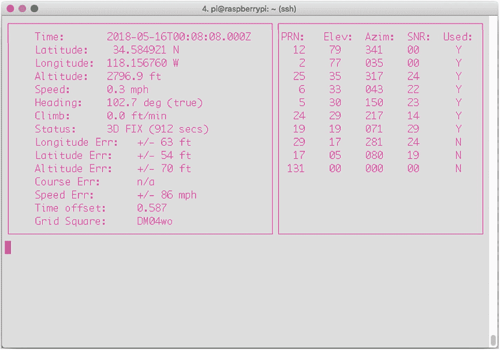
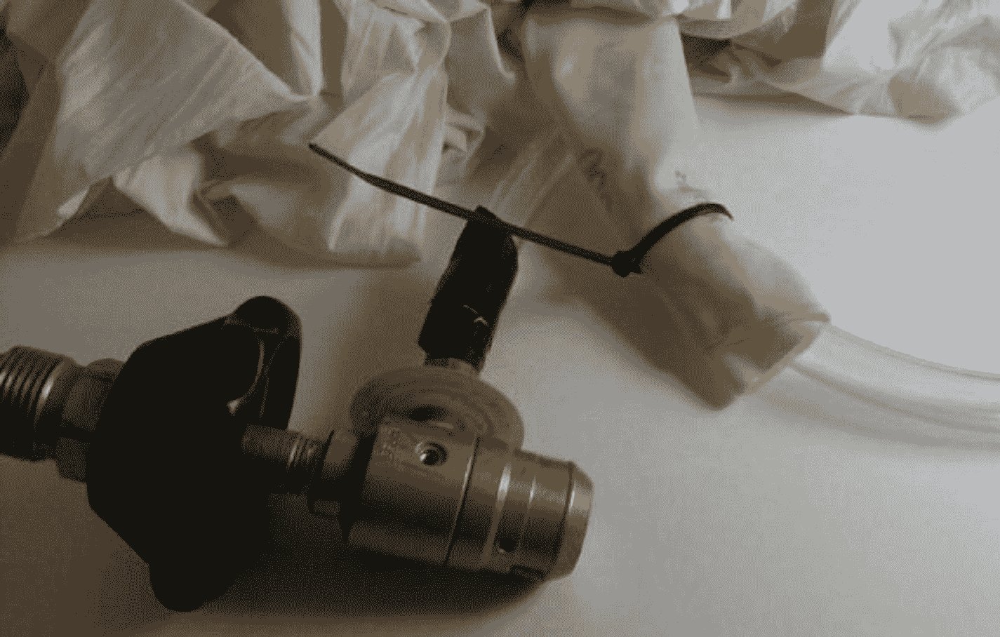
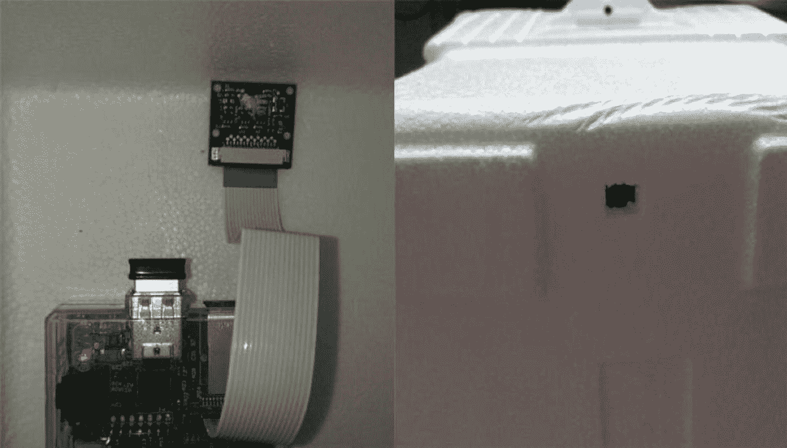
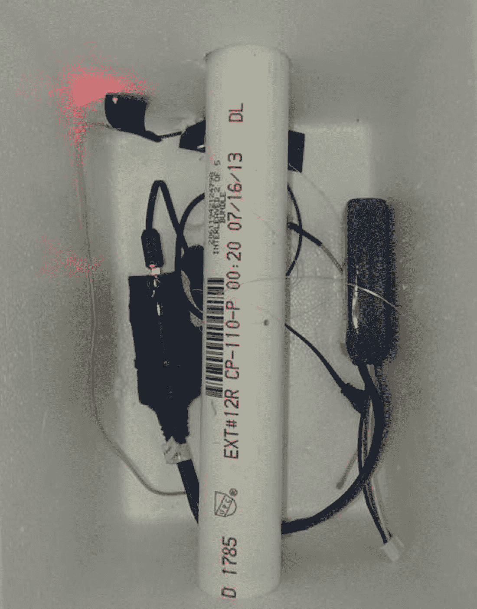

# 十一、气象气球

你可能对气象气球很熟悉。有时直径可达 20 英尺，它们可以充满氦，给定一个小的科学有效载荷，并上升到大气层的上限，在它们前进的过程中记录各种传感器读数。然后，当外部压力明显小于气球内部压力时，它们就会破裂，有效载荷在一个小降落伞的帮助下落回地球。发射气球的小组追踪下落的包裹并取回数据。通过这种方式，科学家和业余爱好者可以对大气层的上层了解很多。

虽然在前一章中用树莓派操作无线电控制的飞机很酷，但它也有些乏味，因为我们记录了它的位置并将它的路径数据上传到 Google Earth。这个项目背后的概念是建造一个气象气球，非常简单，但更先进。我们将充气并发射一个小型气象气球，能够将树莓派送到至少 30，000 英尺的高空。然后，我们将对 Pi 进行编程，使其经常拍照，为我们的飞行提供图像记录，我们还将使用一个小型 GPS 设备来记录 Pi 的行程。

但是我们不会就此止步，因为那有点无聊，而且已经被许多不同的爱好者和专业人士做过了。此外，我们将通过编程 Pi 来记录自己每隔 15 秒左右说出其坐标，从而实时更新气球正在做什么——它的纬度、经度，甚至高度。然后，我们将通过地面无线电广播这段录音。我们所需要做的就是把我们的小型调频收音机调到预先指定的频率，这样我们就能听到我们的气球在和我们说话，给我们实时更新它的状况。

我们去买零件吧！

### 警告

在美国，FAA 法规要求您在发射前 6 至 24 小时通知该机构相关信息，如发射时间和地点、预测高度、气球描述和着陆位置预测。联邦航空局还要求你跟踪气球的位置，并有能力更新联邦航空局的信息，如果需要的话。系留气球和自由气球的规则不同；更多信息，请参见 [`http://www.gpo.gov/fdsys/pkg/CFR-2012-title14-vol2/pdf/CFR-2012-title14-vol2-part101.pdf`](http://www.gpo.gov/fdsys/pkg/CFR-2012-title14-vol2/pdf/CFR-2012-title14-vol2-part101.pdf) 的完整规定。

## 零件购物清单

像遥控飞机一样，这是书中最昂贵的项目之一，因为气象气球可能有点贵，你需要从聚会用品商店或焊接用品商店购买或租赁一罐氦气。这是你需要的:

*   带摄像板的树莓皮

*   LiPo 电池和 5V 调节器为 Pi 供电

*   直径 6-7 英尺的乳胶气象气球

*   GPS 接收器( [`https://www.adafruit.com/products/746`](https://www.adafruit.com/products/746) )

*   GPS 天线(可选)( [`https://www.adafruit.com/products/851`](https://www.adafruit.com/products/851) )

*   手持式调幅/调频收音机

*   10 英尺长的电线

*   小型泡沫聚苯乙烯冷却器

*   模型火箭降落伞

*   暖手宝

*   钓鱼线——至少 5000 码

*   1 英尺长的手术导管，内径约为 1 英寸

*   氦——大约 250 立方英尺

*   管道胶带、电工胶带、橡皮筋、拉链

## 设置 GPS 接收器

就像第 10 章[中的遥控飞机项目一样，这个项目的一个重要组成部分就是让 GPS 设备和你的 Pi 一起运行。为此，您将安装 Python `gpsd`模块，并使用 Pi 的通用异步接收器/发送器(UART)引脚#7 和#8。Python `gpsd`模块是一个更大的代码库的一部分，旨在允许 Pi 等设备监控连接的 GPS 和自动识别系统(AIS)接收器，并具有 C、C++、Java 和 Python 的端口。它允许您“读取”由大多数 GPS 接收器传输的国家海洋电子协会格式的数据。](10.html)

UART 接口是旧的；它基本上是一个串行(RS-232)连接，但对于我们的目的来说，这就是我们所需要的。它由电源的正极(+)和负极(–)连接以及发送和接收引脚组成。首先输入下面一行，安装读取 GPS、`gpsd`及其相关程序所需的软件:

```py
sudo apt-get install gpsd gpsd-clients python-gps

```

接下来，我们需要禁用默认的`gpsd systemd`服务，因为我们安装的服务应该会覆盖它。用...做这件事

```py
sudo systemctl stop gpsd.socket
sudo systemctl disable gpsd.socket

```

现在，我们需要禁用串行 getty 服务:

```py
sudo systemctl stop serial-getty@ttyS0.service
sudo systemctl disable serial-getty@ttyS0.service

```

我们还需要强制 Pi 的 CPU 使用固定频率，并启用 UART 接口。通常，CPU 的频率会根据负载而变化，但不幸的是，这可能会影响 GPS 模块等敏感项目。这将稍微影响您的 Pi 的性能，但您不太可能会注意到很大的差异。为此，编辑`/boot/config.txt`文件:

```py
sudo nano /boot/config.txt

```

并将最后一行从

```py
enable_uart=0

```

到

```py
enable_uart=1

```

现在，通过键入以下命令重新启动

```py
sudo shutdown –r now.

```

当您重新启动并运行时，将 GPS 接收器连接到 Pi，如下所示:

*   将接收器的 VIN 连接到 Pi 的 5V(引脚#2)。

*   将 GND 连接到 Pi 引脚 6。

*   将 Rx 连接到 Pi Tx(引脚#8)。

*   将 Tx 连接到 Pi Rx(引脚#10)。

当接收器的 LED 开始闪烁时，你就知道你有电了。我们使用的 GPS 接收器有两种闪烁速率。当它通电但没有 GPS 定位时，它每秒钟闪烁一次。当它被定位时，它每十五秒闪烁一次。

当你有了一个补丁，你可以测试你的`gpsd`程序。进入

```py
sudo killall gpsd

```

(终止任何正在运行的实例)然后

```py
sudo gpsd /dev/ttyS0 -f /var/run/gpsd.sock

```

然后，通过键入以下命令启动通用 GPS 客户端

```py
cgps -s

```

客户端是一个普通的查看器；它只是获取`gpsd`程序正在接收的数据并显示给用户。

数据开始流动可能需要一段时间，但当它开始流动时，你应该会看到如图 [11-1](#Fig1) 所示的屏幕。



图 11-1

`cgps`流

我们不会使用`cgps`显示屏——这只是一种确保 GPS 单元正确连接并正常工作的简便方法。我们将使用 Python 的`gps`模块与 GPS 板通信。

## 存储 GPS 数据

在这个项目中，您将把 GPS 数据写入一个文件，以便以后读取、记录和传输。我们可以为此使用日志文件，就像我们对 RC plane 项目所做的那样，但是学习使用 Python 读写普通文件也很重要。在您的终端中，启动 Python 提示符并键入

```py
f = open('testfile.txt', 'w')

```

这将打开一个文件—在本例中是`testfile.txt`。第二个参数可以是以下四个值之一:

*   文件是只读的。

*   **‘w’**文件只用于写入。(每次打开文件时，以前的数据将被清除。)

*   **'a'** 文件将被追加到。

*   该文件以可读写方式打开。

要继续，请键入

```py
f.write('This is a test of my file-writing')
f.close()

```

如果您现在通过按下`Ctrl+d`退出 Python 提示符并列出您的目录内容，您将看到`testfile.txt`被列出，查看它的内容将显示您刚刚输入的行。现在，再试一次:启动另一个 Python 提示符并键入

```py
f = open('testfile.txt', 'w')
f.write('This text should overwrite the first text')
f.close()

```

并退出 Python 提示符。因为您使用'`w`'参数打开了文件，所以所有原始文本都被覆盖。这就是你要在我们的 GPS 定位文件中做的事情。我们对像以前一样在飞机日志文件中保存位置不感兴趣；相反，每个位置将被记录，然后传输，然后我们可以通过用'`w`'标志打开它，用下一个位置覆盖它。

## 安装 PiFM

要让你的 Pi 通过无线电和你说话，你需要使用一个由伦敦帝国学院机器人协会成员开发的方便的小工具。该模块名为`PiFM`，使用 Pi 的现有硬件将其变成一个漂亮的小型调频发射机。

要使用该模块，您首先需要下载它。在您的`/balloon`目录中，打开一个终端并键入

```py
wget http://omattos.com/pifm.tar.gz

```

下载完成后，通过键入

```py
tar -xvzf pifm.tar.gz

```

这将把编译后的二进制文件、源代码和一些声音文件放在您的目录中。您现在已经准备好使用`PiFM`包了。要进行测试，请将一根一英尺长的电线连接到您的 Pi 的 7 号引脚(GPIO 号引脚)。现在，在您的终端中，键入

```py
sudo ./pifm sound.wav 100.0

```

把你的收音机调到 100.0 调频。你应该被奖励一首熟悉的曲子。如果您偶然听不到任何声音，请尝试在命令末尾添加**‘22050’**，因为额外的参数(声音文件的采样率)可能需要明确说明，这取决于您拥有的软件版本。

恭喜你！你把你的 Pi 变成了无线电发射机。现在，让我们把它变成一个 DJ。

## 安装节

我敢肯定，如果我们的电脑能和我们说话，我们大多数人都会喜欢的。幸运的是，由于我们使用的是 Linux，当谈到一个好的语音合成器程序时，我们有几个选择。我们将要使用的是 Festival，它是免费的，非常容易使用。它还附带了一个我们将使用的方便的文本到语音的录音功能。

Festival 可以从您的标准 Pi 存储库中获得，这意味着要使用它，您只需要输入

```py
sudo apt-get install festival

```

它会下载并安装。一旦下载和安装过程完成，尝试一下。将一对耳机插入 Pi 的 3.5 毫米音频输出插孔。然后，在您的终端中，键入以下内容:

```py
echo "I'm sorry Dave, I'm afraid I can't do that." | festival --tts

```

你的私人侦探会和你说话。(如果你不知道的话，这句话是经典电影 *2001:太空* *奥德赛*中的计算机哈尔说的。如果你没看过，那就把这本书放下去看吧。现在。我会等的。)

好了，现在你可以让你的 Pi 说出你在命令行中告诉它的任何一行。虽然这很酷，但我们需要让它从文本文件中读取一行:类似于“当前高度 10，000 英尺，当前位置纬度 92 度，经度 164 度。”最简单的方法是使用 Festival 非常方便的`text2wave`功能。这个函数读取一个文件，例如`position.txt`，并记录下来。它的语法是

```py
text2wave position.txt -o position.wav

```

现在，知道我们将每 15 秒更新一次`position.txt`文件，我们可以在使用`PiFM`广播该记录之前使用`text2wave`功能重新记录其内容。

然而，有一个小问题:`text2wave`使用 44100 kHz 的采样率对其录音进行编码，而 PiFM 需要 22050 kHz 的采样率。这需要我们工具包的另一个程序—FFMPEG。

## 安装 FFMPEG

在音频和视频编码器、解码器和代码转换器的世界中，FFMPEG 无疑是最流行和最强大的程序之一。它可以将电影文件从 MPG 格式转换为 AVI 格式，将 AVI 文件分离成单独的帧，甚至可以将音频从电影中分离出来，通过连续的过滤器，然后重新附加到视频中。

然而，尽管所有这些壮举都令人印象深刻，但我们需要使用它来将我们的音频从 44100 kHz 更改为 22050 kHz。首先用以下命令获取源文件

```py
wget https://ffmpeg.org/releases/ffmpeg-snapshot-git.tar.bz2

```

下载完成后，用

```py
tar -vxjf ffmpeg-snapshot-git.tar.bz2

```

完成提取后，用`cd`进入结果目录

```py
cd ffmpeg

```

然后键入

```py
./configure

```

配置安装。当*完成后，输入*

```py
make

```

然后

```py
sudo make install

```

安装`ffmpeg`库。这不是一个小图书馆，所以在它编译的时候，你可以随意喝杯咖啡或者小睡一会儿。

### 替代 avconv

如果从源代码安装`ffmpeg`让你紧张，还有另一个选择:在 Pi 上使用`ffmpeg`的替代品，`avconv`。这个库应该已经存在于您的 Pi 上，所以不需要安装。

现在，为了转换我们的`position.wav`文件，我们使用以下语法:

```py
ffmpeg -i "position.wav" -y -ar 22050 "position.wav"

```

或者

```py
avconv -i "position.wav" -y -ar 22050 "position.wav"

```

就是这样— `position.wav`现在已经以 22050 kHz 的采样率重新编码，并准备广播。如果我们想广播`position.wav`的内容，我们可以输入一个终端

```py
sudo ./pifm position.wav 103.5 22050

```

(103.5 FM 是它将被广播到的频率。当然，要根据你当地的电台进行调整。)

## 准备 Pi

如果你在 RC 飞机章节之后阅读这一章，你可能认识这里的大部分设置，因为这些项目的许多部分是非常相似的。您需要做的第一件事是确保每次启动 Pi 时`gpsd`模块都会运行。为此，通过键入以下命令打开您的`rc.local`文件

```py
sudo nano /etc/rc.local

```

并将下面一行添加到末尾:

```py
sudo gpsd /dev/ttyS0 -F /var/run/gpsd.sock

```

### 注意

有关`rc.local`文件的更多信息，请参见第 [10 章](10.html)中的侧栏。

现在，每次我们启动 Pi 时,`gpsd`模块都会运行。

然而，我们还没有完成`rc.local`文件。很可能当您发射气球时，您只想给 Pi 加电并发射，而不必担心登录和启动您编写的程序。幸运的是，您也可以用`rc.local`文件做到这一点。在启动时，在`gpsd`模块发射后，在它开始记录数据之前，你会想要给你的 GPS 板几秒钟来定位一些卫星。为此，在刚刚显示的`gpsd`行之后，添加该行

```py
sleep(45)

```

让 Pi 暂停 45 秒，然后添加一行

```py
sudo python /home/pi/Documents/balloon/balloon.py

```

(当然，要确保这条线与你存放气球程序的地方相匹配。)您的气球程序现在将自动启动，在您的 GPS 模块开始从其卫星定位中读取数据 45 秒后。

## 使用线程和对象

我们将在这个项目中使用的一个重要编程特性是*线程*。如果你已经在第 10 章[的](10.html)中建造了遥控飞机项目，这将是你的旧帽子。然而，如果你没有，这里有一个快速的纲要。

线程很重要，因为它们允许你的程序和处理器同时执行几个任务，而且它们不会占用所有的内存和处理能力来完成一个简单的任务。一个简单的导入线程的调用就可以让您充分利用线程的全部功能以及它们能为您做的一切。

线程实际上是做什么的？线程允许你的计算机(看起来)同时执行几个任务。我说“表面上”是因为处理器仍然一次只能执行一个进程，但线程允许它在进程之间来回切换，速度之快就好像同时执行它们一样。有关线程的更多介绍，请参见第 [10](10.html) 章的侧栏。

我们将用它们来查询 GPS 接收器。通过使用线程，当我们继续获取数据时，我们的主缓冲区不会被数据填满，我们仍然可以将数据记录在我们的`position.txt`文件中以备后用。为了尽可能高效地使用线程，我们将创建一个名为*轮询器*的对象，它将使用`gps`模块每隔 15 秒向 GPS 接收器请求信息。每当我们得到一个位置读数，我们将更新文本文件并拍照。

### 注意

关于对象、类和面向对象编程的复习，请参见第 [10](10.html) 章的侧栏。

我们的线程对象将这样定义:

```py
class myObject(threading.Thread):
       def __init__(self):
       #function used to initiate the class and thread
       threading.Thread.__init__(self)        #necessary to start the thread
       def run(self):
       #function performed while thread is running

```

从程序的主要部分，我们可以通过声明一个新的`myObject`对象(一个新线程)来启动线程:

```py
newObject = myObject()

```

然后开始

```py
newObject.start()

```

线程现在用自己的`myObject`实例运行，称为`newObject`。我们的线程(如本章最后的代码所示)将从

```py
threading.Thread.__init__(self)

```

一旦它被启动，它将继续执行它的功能(在我们的例子中，收集 GPS 数据，传输它，并拍照)，直到我们退出程序或关闭 Pi。

## 连接比特

这个气象气球项目的建设可能相当复杂，所以留出几个小时来做好一切准备。

首先要做的是安装氦气罐。当你租油箱时，它应该配有一个调节器和一个用来给气球充气的奶嘴。这可以用来填充你的气球，只需一个小小的改动。将外科手术导管套在调节器上，并用胶带牢牢固定。然后可以将管子插入气球的颈部进行填充(如图 [11-2](#Fig2) 所示),并用拉链固定。



图 11-2

调节器至气球颈部设置

调节器与气球的连接安全后，你就可以把你的有效载荷组装起来了。在你的聚苯乙烯泡沫冷却器的底部切一个足够大的小洞，以适合 Pi 的相机板。将相机放入孔中，必要时用胶带固定。(见图 [11-3](#Fig3) 。)在冷却器的底部，安装 Pi 及其电池组，准备在任务启动时连接。



图 11-3

放置在冷却器中的摄像机

在冷却器底部戳一个小洞。这是 GPS 天线、FM 天线和气球系绳的位置。将它们穿过孔，并将 FM 天线连接到 Pi 的 7 号引脚。如果尚未将 GPS 板连接到 Pi(参见本章前面的“设置 GPS 接收器”一节),则将天线连接到 GPS。两个天线应该自由悬挂在底部，系绳应该连接到您的渔线线轴上。将系绳的自由端固定在你的冷却器上，不要撕裂冷却器；我切了一段聚氯乙烯管的长度冷却器和系绳。(见图 [11-4](#Fig4) 。)



图 11-4

冷却器内部显示了连接到 PVC 管的系绳

现在，打开暖手宝，通过摇晃和混合里面的东西来激活它们。把它们放在冷却器的底部，把你的 Pi 和电池组放在上面。暖手宝很重要，因为高层大气会变得相当冷——冷到足以让你的电子设备停止工作。加温器应该使冷却器内部保持足够的温度，以使您的 Pi 在飞行的顶点继续工作。

你需要把降落伞系在冷藏箱的盖子上，以防气球爆炸，从而保护你的 Pi。我发现最好的方法是在盖子上戳一个洞，将降落伞绳穿过这个洞，然后用热胶水将它们固定在盖子上。然后，*在降落伞上松松地系一根绳子——系得足够紧，以便在上升时保持降落伞关闭，但又足够松，以便在冷却器开始自由下落时让降落伞挣脱并打开。*

 *最后要做的事情是给 Pi 加电，把盖子紧紧地贴在冷却器上，然后把它贴在装满的气球上。当气球达到所需的体积时(这将随着你的有效载荷的重量而变化，所以有必要做一些实验)，将它从油箱中取出，并用拉链或橡皮筋系住末端。然后，用拉链将气球的颈部系在你的冷却器上，然后松开。气球将飘入大气层，一边飘一边拍照。与此同时，将你的收音机调到 103.5 FM(或者你在最终代码中设置的任何一个电台)，当你的气球准确地告诉你它有多高时，你可以收听实时更新。除非它爆裂(总是一种明显的可能性)，否则气球应该行进到所附钓鱼线的末端，这是一个尽可能获得更多线的好理由，以便允许你的气球尽可能高地上升。当要取回你的气球时，用附带的钓鱼线把它卷回来。为了保护你的手臂肌肉，你可能想把钓鱼线线轴连接到电钻上。

### 注意

在放飞气球之前，请咨询当地的 FAA 分支机构或同等机构，以确定最佳的发射时间和地点。

## 查看照片结果

根据您的发射结果，您可以希望从您的 Pi 获得一些良好的高空拍摄，如图 [11-5](#Fig5) 、 [11-6](#Fig6) 、 [11-7](#Fig7) 、 [11-8](#Fig8) 和 [11-9](#Fig9) 所示。您的结果可能会有所不同，但如果您的第一次启动不顺利，您随时可以再试一次！


图 11-9

高空图片


图 11-8

高空图片


图 11-7

高空图片


图 11-6

高空图片


图 11-5

高空图片

## 最终代码

该代码(从`Apress.com`开始以`balloon.py`的形式提供)将查询 GPS 板，记录并传输其坐标，并定期用车载摄像头拍照:

```py
import os
from gps import *
import time
import threading
import subprocess

#set up variables
picnum = 0
gpsd = None

class GpsPoller(threading.Thread):
    def __init__(self):
        threading.Thread.__init__(self)
        global gpsd
        global picnum
        gpsd = gps(mode=WATCH_ENABLE)
        self.current_value = None
        self.running = True
    def run(self):
        global gpsd
        while gpsp.running:
            gpsd.next()

if __name__ == '__main__':
    gpsp = GpsPoller()
    try:
        gpsp.start()
        while True:
            f = open('position.txt', 'w')
            curAlt = gpsd.fix.altitude
            curLong = gpsd.fix.longitude
            curLat = gpsd.fix.latitude
            f.write( str(curAlt) + "feet altitude," + str(curLong) + "degrees longitude," + str(curLat) +
            " degrees latitude")
            f.close()
            subprocess.call(["text2wave position.txt -o position.wav"], shell = True)
            subprocess.call(['ffmpeg -i "position.wav" -y -ar 22050 "position.wav"'], shell = True)
            subprocess.call(["sudo ./pifm position.wav 103.5 22050"], shell = True)
            subprocess.call(["raspistill -o /home/pi/Documents/balloon/image" + str(picnum) + ".jpg"], shell=True)
            picnum = picnum + 1
            time.sleep(15)
    except (KeyboardInterrupt, SystemExit):
        gpsp.running = False
        gpsp.join()

```

## 摘要

在本章中，您对您的 Pi 进行了编程，以从 GPS 模块获取其位置，并将其位置传输给您，以便您可以停留在地面上，并将它发送到高层大气中进行拍照。您再次使用了线程，并且更多地使用了面向对象的代码，我希望您从高层获得了一些好的图片。

在下一章中，我们将反其道而行之，将圆周率发送到水下。*