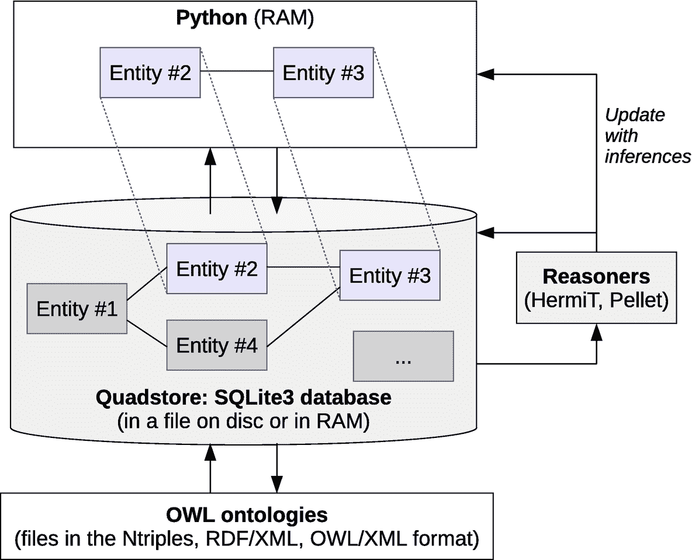

# 1.介绍

在过去的十年中，形式本体已经广泛应用于计算机科学中来构建数据和知识。与此同时，Python 编程语言在教学、商业和研究中越来越广泛。然而，直到最近，只有很少的工具和资源致力于使用 Python 中的本体。事实上，大多数关于本体的书籍或教程都是相当理论化的，并没有涉及编程，或者它们局限于像 Java 这样更复杂的语言。

这个问题在生物医学领域尤其重要，在这个领域，本体和 Python 被广泛使用。在我作为索邦巴黎大学医学信息学教师和研究人员的日常生活中，我经常看到学生和工程师构建后来没有被使用的本体。这些文件保存在一个 u 盘上，因为不容易将本体与现有的软件整合。

这本书的存在就是为了填补这个空白。它展示了如何使用 Python 轻松访问本体并将其发布为动态网站，以构建新的本体，执行自动推理，将实体链接到医学术语，或在 DBpedia 中进行一些研究…使用 Owlready，这是我从 2013 年开始为“面向本体的编程”开发的 Python 模块。并且，在这本书里，我们不会害怕实现基于本体的程序:你会看到比数学公式更多的源代码！

## 1.1 这本书是给谁的？

这本书是为任何想用 Python 操作和构建本体，或者想从实用的角度发现本体世界的人准备的，尤其是为计算机科学家和语义网应用程序开发人员、生物信息学家、人工智能领域的科学家、这些学科的学生…或者只是为好奇的人准备的！

要读这本书，建议了解一下面向对象编程，用 Python 或者另一种面向对象语言(Java，C++等)。).另一方面，不需要了解 Python 语言或掌握正式的本体，章节 [2](02.html) 和 [3](03.html) 包含提醒。

## 1.2 为什么是本体论？

本体论的概念来源于柏拉图的哲学和著作。在计算机科学中，本体是“一个领域中所有实体以及这些实体之间存在的关系的正式描述”。这个定义可能看起来很复杂！事实上，它是以一种机器可以利用的方式来描述知识，并关注完整性和“普遍性”。本体是所谓的“符号”人工智能的一部分，它由结构化知识组成，使其可以被计算机访问，这与机器学习(如神经网络、深度学习等)相反。).

下图展示了一个非常简单的生态学领域的本体论的例子，用图解法表示(注意:“狗鱼”和“蟑螂”是两种鱼类):

这里，我们有八个实体，用矩形表示，以及这些实体之间的关系。存在几类关系:

*   层级“是-a”关系:它们将一个实体链接到一个更一般的实体。例如，人是动物，狗鱼是动物，多氯联苯是污染物，等等。在编程中，术语“继承”也用于命名这些关系。

*   地理关系(“生活”、“存在于”):它们指示实体的位置，将实体链接到一个地方。例如，狗鱼生活在湖里。

*   各种横向关系(“吃”，“集中”):例如，人类吃梭鱼。

通过查阅这个图表，你会很容易地推断出一个人很可能是被多氯联苯所陶醉。本体的优势是使这种推理不仅可以被人类使用，也可以被机器使用:在一种名为 reasoner 的软件的帮助下，计算机将能够重现这种推理，并推断出人类有被 PCB 毒害的风险。

为此，本体依赖于描述逻辑(参见附录 A)。OWL 语言(万维网联盟 W3C 标准化的网络本体语言)是最常用于形式化本体的语言之一。OWL 支持大量不同的描述逻辑。OWL 语言可以翻译成 RDF(资源描述框架)，RDF 本身通常用 XML(可扩展标记语言)表示。

本体有两个主要目的:

*   自动推理:由于概念、关系及其属性的集合是以一种正式的方式描述的，因此自动执行逻辑推理成为可能。

*   知识的重用:所有的本体共享相同的名称空间，并且可以链接在一起，导致了*语义网*。

此外，还有许多为本体设计的工具，如 Protégé editor 或 HermiT and Pellet reasoners。使用本体论允许你使用所有这些工具，尽管对于一个给定的项目，你可能不需要本体论的全部潜力。

## 1.3 为什么选择 Python？

最常用于处理本体的编程语言是 Java。然而，Java 是一种复杂的语言，而且在某些领域很少使用，例如生物医学领域。

相反，今天兴起的语言是 Python，尤其是在生物医学领域(的确，这本书的几个例子将来自生物学或医学)。与其他编程语言相比，Python 的主要优势在于它优化了程序员的时间:与大多数其他语言相比，Python 允许程序员更快地开发他/她的程序。15 年前，当我意识到用 Python 只需要一天就可以完成用 Java 需要三天的任务时，这就是我选择 Python 的原因！

如今，Python 经常被用作链接其他组件的粘合剂，如数据库、网站、文本文件…或本体，正如我们将在本书中看到的。

## 1.4 为什么 Owlready？

Owlready 允许“面向本体的编程”，即对象和类是一个本体的实体的面向对象编程。面向本体的编程是一种比通常的 Java 应用编程接口(API)更简单和更强大的方法，如由 OWLAPI 和 JENA 提出的，其中本体的实体的行为不像编程语言的对象和类。

Owlready 提供了三个世界中最好的:

*   形式本体的表达能力，也就是说，详细描述复杂知识、将它们联系在一起以及对这些知识进行推理的能力

*   **关系数据库的访问速度**，具有快速存储和搜索能力

*   Python 等面向对象编程语言的灵活性，能够执行“命令性”的代码行，向计算机发出“命令”，这是本体或数据库本身无法做到的

Owlready 包含了一个带有 OWL 语义层的图形数据库。这个数据库被称为 *quadstore* ，因为它以 RDF 格式存储四元组，也就是说，RDF 三元组的形式(subject，property，object)添加了一个本体标识符(参见第 [11](11.html) 章，了解 RDF 和 Owlready 的 quadstore 结构的更详细的解释)。

这个 quadstore 以一种紧凑的格式存储来自已加载的本体的所有信息。它可以以 SQLite3 数据库文件的形式放在 RAM 或磁盘上。然后，Owlready 在需要时将本体实体加载到 Python 中，并在不再需要时自动从 RAM 中删除它们。此外，如果在 Python 中修改了这些实体，Owlready 会自动更新 quadstore。

下图显示了 Owlready 的一般架构:

这种架构使得加载大量本体(几十或几百千兆字节)同时非常快速地访问特定实体成为可能，例如，通过文本搜索。它还允许对应于 OWL 本体的语义级别(不像许多图形数据库局限于 RDF 级别)。然而，Owlready 也可以用作简单的对象数据库、图形数据库或对象关系映射器(ORM ),而没有利用本体的表达能力所带来的好处。

Owlready 是作为自由软件发布的(GNU LGPL 许可证)。本书涵盖了 owl ready 2-0.25 版本(`owlready2`模块)。关于其安装，您可以参考第 2.11 节。如果您在学术环境中使用 Owlready，请引用以下文章:

*   拉米 JB。***owl ready:Python 中面向本体的编程，具有生物医学本体的自动分类和高级构造*** 。医学中的人工智能 2017；80:11-28 [`http://www.lesfleursdunormal.fr/_downloads/article_owlready_aim_2017.pdf`](http://www.lesfleursdunormal.fr/_downloads/article_owlready_aim_2017.pdf)

## 1.5 图书大纲

前两章包含提醒:第 [2](02.html) 章介绍 Python，第 [3](03.html) 章介绍 OWL 本体。如果你已经掌握了这些概念，你可以快速阅读这些章节。

然后第 [4](04.html) 、 [5](05.html) 和 [6](06.html) 章解释了如何用 Owlready 在 Python 中操作和创建本体。这些章节介绍了 Owlready 的基本特性。

以下章节描述了更具体的功能。第[章 7](07.html) 涉及自动推理，第[章 8](08.html) 涉及注释和文本搜索，第[章 9](09.html) 涉及医学术语的管理。

最后，最后两章描述了高级特性。第 [10](10.html) 章展示了如何将 Python 方法集成到 OWL 本体的类中，第 [11](11.html) 章展示了如何直接访问 Owlready 的 RDF quadstore。

这本书的源代码可以在 GitHub 上通过这本书的产品页面获得，位于 [`www.apress.com/978-1-4842-6551-2`](http://www.apress.com/978-1-4842-6551-2) 。

## 1.6 摘要

在这一介绍性章节中，我们介绍了形式本体论、Python 和 Owlready，并且我们画出了本书内容的大纲。