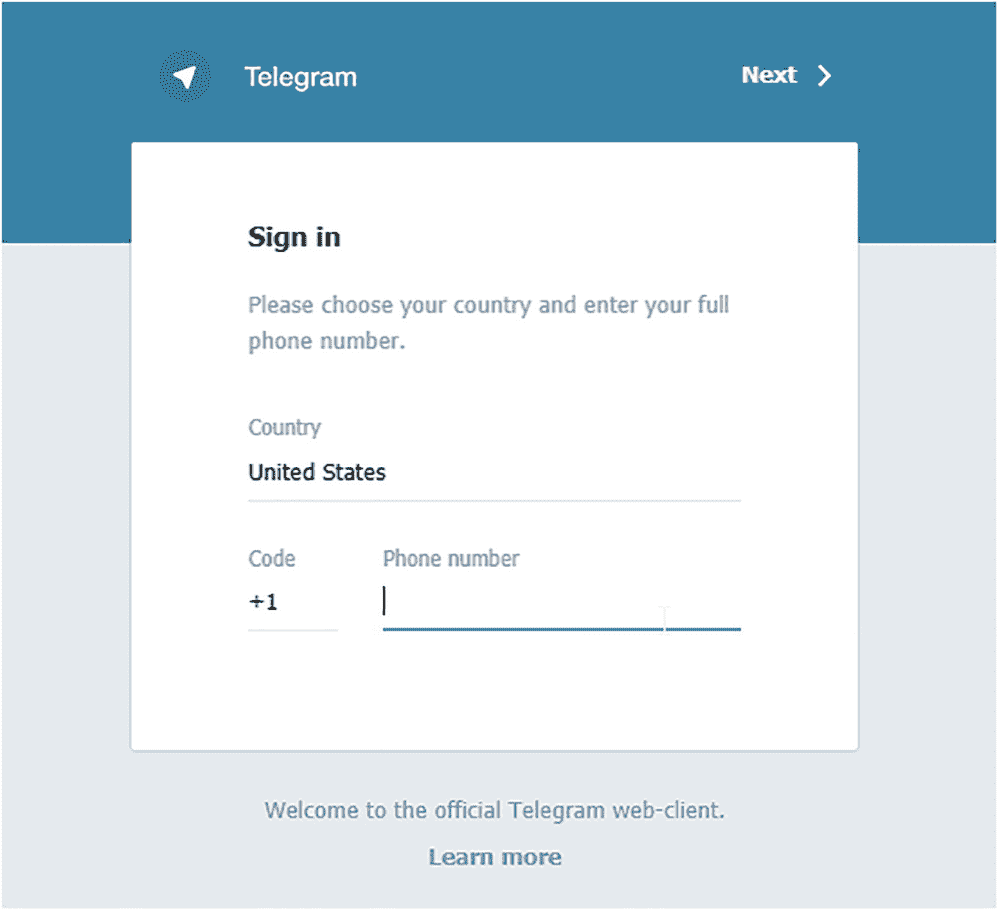
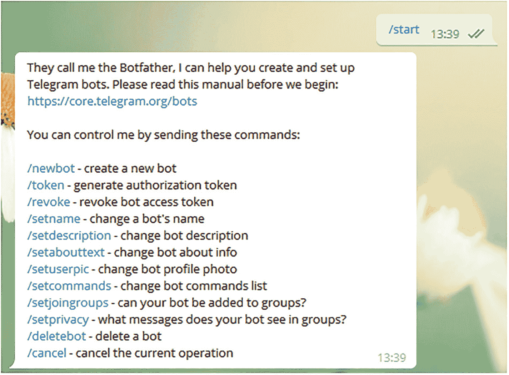
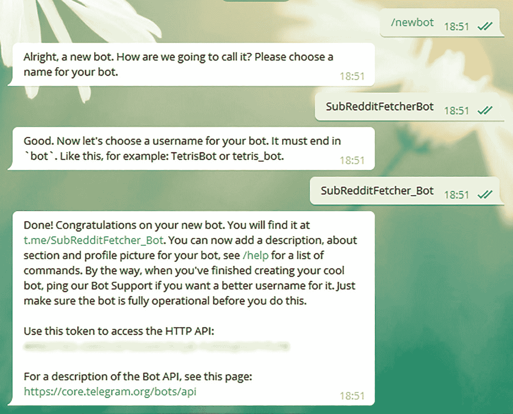
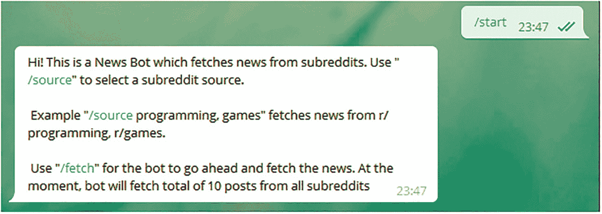
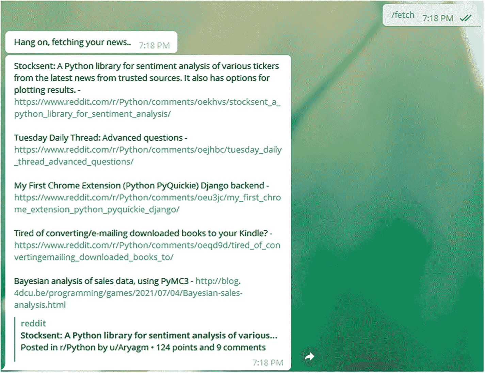

# 3.构建 Python 应用程序

对于许多开始编程的人来说，他们的首要问题之一是弄清楚他们能构建什么。仅仅通过阅读很少能学会编程。许多人认为他们可以阅读几本指南，看看语法，然后轻松地学习如何编程。但是编程需要动手实践。

因此，本书包含了一个示例 Python 项目。该项目在开始时并不复杂，但随着经验的积累，很容易对项目进行进一步的扩展和定制。

## 关于项目

Note

本书假设你具备 Python 的基础知识，并且已经安装了 Python 3.6 或更高版本。

为了帮助您熟悉 Docker，这本书将教您如何使用现有的 Python 应用程序，从 Python 命令行运行它，介绍不同的 Docker 组件，然后将应用程序转换为容器化的映像。

Python 应用程序是一个简单的应用程序，具有 bot 接口，使用 Telegram Messenger 从 Reddit 获取最近 10 篇文章。使用 Telegram，您可以订阅子编辑列表。web 应用程序将检查新帖子的订阅子编辑，如果发现新主题，它会将主题发布到 bot 接口。当用户请求时，该接口将把消息传送到电报信使。

最初，您不会保存首选项(即 subreddit 订阅)，而是将重点放在启动和运行机器人上。一旦一切正常，您将学习如何将首选项保存到文本文件中，并最终保存到数据库中。

## 设置电报信使

在您继续之前，您需要一个电报信使帐户。要注册，请转到 [`https://telegram.org`](https://telegram.org) ，为您选择的平台下载应用程序并安装。一旦它运行，你将被要求提供一个手机号码。Telegram 用这个来验证你的帐户。输入您的手机号码，如图 [3-1](#Fig1) 所示。



图 3-1

电报注册页面

输入您的号码后，您应该会获得一个一次性密码来登录。输入一次性密码并登录，如图 [3-2](#Fig2) 所示。


图 3-2

电报的一次性密码

## BotFather: Telegram 的机器人创建接口

Telegram 使用一个名为“机器人父亲”的机器人作为其创建新机器人和更新它们的接口。要开始使用 BotFather，请在搜索面板中键入`BotFather`。在聊天窗口中，输入`/start`。

这将触发 BotFather 提供一组介绍性的消息，如图 [3-3](#Fig3) 所示。



图 3-3

父亲的选择

### 用机器人父亲创建机器人

您将使用 BotFather 生成一个新的机器人。首先在电报信使中输入`/newbot`。这会引发一系列你需要回答的问题(大部分都很直白)。由于 Telegram 的限制，机器人的用户名必须总是以`bot`结尾。这意味着你可能得不到你想要的用户名(见图 [3-4](#Fig4) )。



图 3-4

电报机器人准备行动

除了文档的链接，您还会注意到 Telegram 发布了一个令牌。HTTP 是一种无状态协议——web 服务器不知道也不跟踪谁在请求资源。客户机需要标识自己，以便 web 服务器可以标识客户机、授权客户机并为请求提供服务。Telegram 使用 API 令牌(以下简称为`<token>`，包括在代码示例中)作为一种识别和授权机器人的方式。

Caution

令牌极其敏感。如果它被泄露到网上，任何人都可以作为你的机器人发布消息。不要将其签入您的版本控制或发布到任何地方！

当使用您不熟悉的 API 时，最好使用一个好的工具来测试和探索端点，而不是马上输入代码。REST API 测试工具的一些例子包括[失眠](https://insomnia.rest/)、[邮差](https://www.getpostman.com/)和[卷曲](https://curl.haxx.se/)。

Telegram 的 Bot API 文档可以在 [`https://core.telegram.org/bots/api`](https://core.telegram.org/bots/api) 获得。要提出请求，您必须包含`<token>`。常规 URL 如下:

[T2`https://api.telegram.org/bot<token>/METHOD_NAME`](https://api.telegram.org/bot%253ctoken%253e/METHOD_NAME)

让我们尝试一个样例 API 请求，它确认令牌按预期工作。Telegram Bot API 提供了一个用于测试`auth`令牌的`/getMe`端点。您可以尝试一下，首先不用令牌，如清单 [3-1](#PC1) 所示。

```py
curl https://api.telegram.org/bot/getMe

{
  "ok": false,
  "error_code": 404,
  "description": "Not Found"
}

Listing 3-1Making a curl Request to Telegram API Without a Token

```

如果没有机器人令牌，Telegram 就不会接受这个请求。现在试试这个令牌，如清单 [3-2](#PC2) 所示。

```py
curl https://api.telegram.org/bot<token>/getMe

{
  "ok": true,
  "result": {
    "id": 495637361,
    "is_bot": true,
    "first_name": "SubRedditFetcherBot",
    "username": "SubRedditFetcher_Bot"
  }
}

Listing 3-2Making a curl Request to Telegram API with a Valid Token

```

您可以看到，使用适当的令牌，Telegram 可以识别并授权机器人。这确认了 bot 令牌是正确的，您可以继续使用该应用程序。

## 新闻机器人:Python 应用程序

Newsbot 是一个 Python 脚本，在 [Telegram bot API](https://core.telegram.org/bots/api) 的帮助下与 Bot 进行交互。新闻机器人做以下事情:

*   持续轮询 Telegram API 以获取发布到 bot 的新更新。

*   如果检测到获取新更新的关键字，它将从选定的子编辑中获取新闻。

在幕后，Newsbot 处理这些场景:

*   如果有一条以`/start`或`/help`开头的新消息，它会显示关于该做什么的简单帮助文本。

*   如果有一条消息以`/sources`开头，后跟一个子编辑列表，那么它接受它们作为来自适用的 Reddit 帖子的子编辑。

Newsbot 依赖于几个 Python 库；

*   Praw 或 Python Reddit API 包装器，用于从子编辑中获取帖子。

*   Requests 是最流行的 Python 库之一，它为 HTTP 请求提供了更简单、更干净的 API。

### 新闻机器人入门

要开始使用 Newsbot，请下载该 bot 的源代码。源代码可以在本书的 GitHub 资源库中找到，在 [`https://github.com/Apress/practical-docker-with-python`](https://github.com/Apress/practical-docker-with-python) 。

如果您熟悉 Git，可以使用以下命令克隆 repo:

```py
git clone https://github.com/Apress/practical-docker-with-python.git

```

或者，您可以单击绿色的 Code 按钮，并从 GitHub 存储库页面选择 Download ZIP 来获取源代码。一旦克隆了 repo 或解压了 ZIP 文件，通过键入以下命令切换到包含源代码的目录:

```py
cd practical-docker-with-python/source-code/chapter-3/python-app

```

现在安装依赖项。为此，请键入以下内容:

```py
pip3 install -r requirements.txt

```

*pip* (Pip 安装包)是一个安装 Python 库的包管理器。pip 包含在 Python 2.7.9 和更高版本以及 Python 3.4 和更高版本中。 *pip3* 表示您正在为 Python 3 安装库。如果没有安装 pip，请在继续之前安装它。

`-r`标志告诉 pip 从`requirements.txt`安装所需的包。

pip 将检查、下载和安装依赖项。如果一切顺利，您应该会看到清单 [3-3](#PC6) 中的输出。

```py
Collecting praw==3.6.0 (from -r requirements.txt (line 1))
  Downloading praw-3.6.0-py2.py3-none-any.whl (74kB)
Collecting requests==2.18.4 (from -r requirements.txt (line 2))
[...]
Installing collected packages: requests, update-checker, decorator, six, praw
Successfully installed decorator-4.0.11 praw-3.6.0 requests-2.18.4 six-1.10.0 update-checker-0.16

Listing 3-3The Output from a Successful pip Install

```

如果已经安装了一些包，pip 将不会重新安装它们，并且会用一条`"Requirement already satisfied"`消息通知您已经安装了依赖项。

### 运行新闻机器人

让我们启动机器人。bot 需要一个来自您之前创建的 Telegram 的认证令牌(称为`<token>`)。这需要设置为一个名为`NBT_ACCESS_TOKEN`的环境变量。没有这个令牌，机器人将不会运行。要设置此令牌，请打开一个终端，并根据您的平台输入以下命令。

Windows 用户:

```py
setx NBT_ACCESS_TOKEN <token>

```

Linux 和 macOS 用户:

```py
export NBT_ACCESS_TOKEN=<token>

```

现在，通过键入以下命令启动 Python 脚本:

```py
python newsbot.py

```

如果一切正常，您应该会看到周期性的 OK 消息，如清单 [3-4](#PC10) 所示。这意味着 Newsbot 正在运行，并且正在主动侦听更新。

```py
python newsbot.py
INFO: get_updates - received response: {'ok': True, 'result': []}
INFO: get_updates - received response: {'ok': True, 'result': []}
INFO: get_updates - received response: {'ok': True, 'result': []}
INFO: get_updates - received response: {'ok': True, 'result': []}
INFO: get_updates - received response: {'ok': True, 'result': []}
INFO: get_updates - received response: {'ok': True, 'result': []}

Listing 3-4Output from Newsbot When It Is Running and Listening to Messages from Telegram

```

### 向新闻机器人发送消息

在本节中，您将尝试向 Newsbot 发送一条消息，看看它是否接受请求。在“机器人父亲”窗口中，单击指向机器人的链接(或者，您也可以使用机器人用户名进行搜索)。单击开始按钮。这将触发一个`/start`命令，该命令将被机器人拦截。

注意，日志窗口显示了传入的请求和正在发送的传出消息，如清单 [3-5](#PC11) 所示。

```py
INFO: get_updates - received response: {'ok': True, 'result': []}
INFO: get_updates - received response: {'ok': True, 'result': []}
INFO: get_updates - received response: {'ok': True, 'result': []}
INFO: get_updates - received response: {'ok': True, 'result': [{'update_id': 720594461, 'message': {'message_id': 5, 'from': {'id': 7342383, 'is_bot': False, 'first_name': 'Sathya', 'last_name': 'Bhat', 'username': 'sathyabhat', 'language_code': 'en-US'}, 'chat': {'id': 7342383, 'first_name': 'Sathya', 'last_name': 'Bhat', 'username': 'sathyabhat', 'type': 'private'}, 'date': 1516558659, 'text': '/start', 'entities': [{'offset': 0, 'length': 6, 'type': 'bot_command'}]}}]}
INFO: handle_incoming_messages - Chat text received: /start
INFO: post_message - posting
                    Hi! This is a News Bot which fetches news from subreddits. Use "/source" to select a subreddit source.

 Example "/source programming, games" fetches news from r/programming, r/games.

 Use "/fetch" for the bot to go ahead and fetch the news. At the moment, bot will fetch total of 10 posts from all subreddits
                 to 7342383
INFO: get_updates - received response: {'ok': True, 'result': []}

Listing 3-5The Newsbot Responding to Commands

```

图 [3-5](#Fig5) 显示电报信使窗口。



图 3-5

新闻机器人对开始消息的响应

尝试设置一个源子编辑。在电报信使窗口中，键入以下内容:

```py
/source python

```

你应该从机器人那里得到一个肯定的确认，说源被选中了(见图 [3-6](#Fig6) )。


图 3-6

分配的来源

现在你可以告诉机器人获取一些消息。为此，请键入:

```py
/fetch

```

机器人应该发送一个关于获取帖子的确认消息。然后它将发布来自 Reddit 的帖子(见图 [3-7](#Fig7) )。



图 3-7

新闻机器人发布来自 Python subreddit 的头条新闻

bot 有效；正如预期的那样，它获得了最高职位。在接下来的一系列章节中，您将学习如何将 Newsbot 移动到 Docker。

## 摘要

在这一章中，你学习了本书的 Python 项目的细节，它是一个聊天机器人。您还了解了如何安装和配置 Telegram Messenger，如何使用 Telegram 的 BotFather 创建 bot，如何安装 bot 的依赖项，以及如何运行 bot 并确保其正常工作。在下一章中，您将深入了解 Docker，了解关于 Dockerfiles 的更多信息，并通过为其编写 Dockerfile 来将 Newsbot 应用程序容器化。