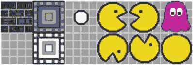
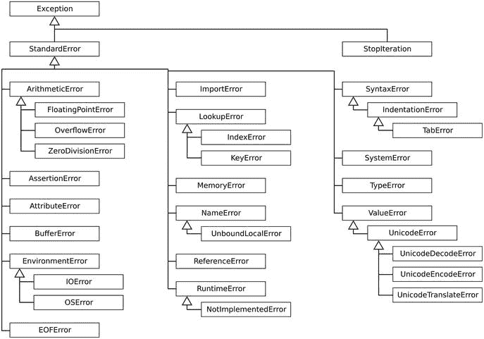
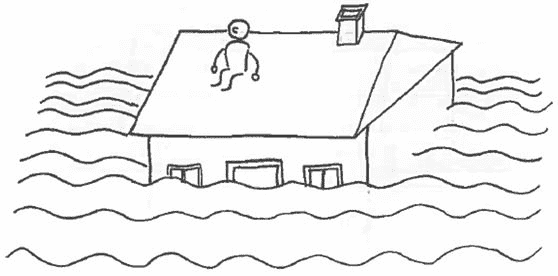

# 二、Python 中的异常

有一次，我们不小心在标题中多加了一个零:“2000 辆坦克被毁。”当局非常生气。—1941 年我祖父在印刷厂工作时的回忆

只要一个程序包含一行程序代码，这一行就可能包含缺陷——这是迟早的事。如果缺陷是当我们的代码没有做预期的事情时，调试就是修复这些缺陷。这比听起来更复杂。调试意味着几件事:

*   我们知道一个正确的程序应该做什么。
*   我们知道我们的程序有缺陷。
*   我们承认缺陷需要修复。
*   我们知道如何修复它。

对于很多细微的 bug 来说，前三点都不是小事。然而，当 Python 程序中出现异常时，情况是相当明显的:我们希望异常消失。因此，在这一章中，我们将集中讨论最后一点:如何修复我们已知的缺陷。我们将在后面的章节中处理其他问题。

## 例外是我们知道的缺陷

很少有程序在第一次尝试时能顺利运行。通常，在事情开始工作之前，我们至少会看到一条错误消息。当我们在 Python 中看到错误消息或异常时，我们知道我们的代码有问题。重复使用第 [1](01.html) 章的比喻，如果我们的程序是一栋建筑，一个异常将意味着房子着火了(图 [2-1](#Fig1) )。因为 Python 异常通常是因为缺陷而发生的，所以是否存在 bug 几乎没有疑问。所以这种缺陷比较容易调试。


图 2-1。

If a program were a building, an Exception would be a fire. There is no reason to run away from an Exception. At least we know it’s there.

例如，我们将为 MazeRun 游戏准备图形。我们将使用 Pygame 从图形瓷砖构建一个图像。这些瓷砖有 32 × 32 像素大，我们可以将它们巧妙地组合起来，以构建关卡和移动的对象。所有图块都在一个图像文件中，如图 [2-2](#Fig2) 所示。我们需要读取图像文件，并将所有方形图块存储在 Python 字典中，以便我们可以轻松地访问它们，例如使用字符作为关键字:



图 2-2。

Tiles we will use to create graphics for MazeRun. We want to create a dictionary, from which we can access tiles by single characters (e.g., represent the wall tile in the top-left corner with a #). The image itself is in the XPM format (tiles.xpm. The format allows Pygame to handle transparency easily, although other formats may work equally well.

```py
tiles = {
    '#': wall_tile_object,
    ' ': floor_tile_object,
    '*': player_object,
}

```

在编写创建字典的代码时，我们将看到 Python 中的典型异常。在本章中，我们将研究三种简单的异常调试策略:

1.  读取错误位置的代码
2.  理解错误信息
3.  捕捉异常

在这样做的同时，我们将有希望从总体上了解缺陷的本质。

## 阅读代码

一般来说，Python 中的异常分为两类:执行代码前引发的异常(`SyntaxErrors`)和执行代码时引发的异常(所有其他)。只有在 Python 没有找到任何`SyntaxError`的情况下，才开始逐行解释并执行代码。从那时起，可能会出现其他类型的异常。

### 句法误差

最容易修复的 Python 异常是`SyntaxError`及其子类型`IndentationError`。在这两种情况下，Python 都无法正确地解释或标记 Python 命令，因为它写得很糟糕。在执行任何代码之前完成标记化。因此，语法错误总是第一个出现的错误。出现`SyntaxError`的原因大多是不同种类的错别字:遗忘的字符、多余的字符、用错地方的特殊字符等等。让我们看一个例子。我们通过导入 Pygame 开始准备我们的牌组:

```py
imprt pygame

```

我在编程的第一天就看到了一条恼人的消息，这条消息很可能在我的最后一天也会看到:

```py
File "load_tiles.py", line 2
    imprt pygame
               ˆ
SyntaxError: invalid syntax

```

有一个拼错的`import`命令 Python 不懂。这可能也发生在你身上。在这种情况下，只需阅读错误消息中的代码，看看问题出在哪里。我们可以通过一直读取错误消息中指出的代码来确定缺陷吗？为了找到答案，我们需要查看更多的异常。第二个常见的`SyntaxError`是由缺少括号引起的。假设我们尝试在图像中定义一系列图块及其 x/y 索引:

```py
TILE_POSITIONS = [
    ('#', 0, 0), # wall
    (' ', 0, 1), # floor
    ('.', 2, 0), # dot
    ('*', 3, 0), # player

```

这段代码在你输入 Python 的那一刻就爆炸了:

```py
SyntaxError: unexpected EOF while parsing

```

在错误消息中，Python 并没有给我们多少关于右方括号丢失的线索。它到达文件的末尾并退出。但是，如果我们在文件中添加另一行，例如，以像素为单位的图块大小:

```py
SIZE = 32

```

错误消息变为

```py
  File "load_tiles.py", line 11
    SIZE = 32

SyntaxError: invalid syntax

```

请注意，回溯指示列表后的行，这与丢失的括号无关。只是碰巧挡了道。Python 程序员需要学会快速识别丢失括号的症状。此外，一个好的编辑会为我们计算括号，并在一个括号似乎丢失时委婉地指出。我们可以从一个`SyntaxError`来识别缺陷，但是描述往往不准确。缺少括号的一个更令人不安的方面是，如果我们忘记了开始括号，我们会得到一个完全不同类型的异常:

```py
TILE_POSITIONS = ('#', 0, 0), # wall
                 (' ', 0, 1), # floor
                 ('.', 2, 0), # dot
                 ('*', 3, 0), # player
                ]

```

这一行失败于

```py
IndentationError: unexpected indent

```

Python 不知道为什么第二行在这里缩进。注意，只有当第一个列表项从赋值行开始时，我们才会得到一个`IndentationError`；不然又是一个`SyntaxError`。这类缺陷非常常见，但通常是最容易修复的。

Conclusion

Python 代码中类似的缺陷会导致不同的错误消息。

除了缺少括号之外，`IndentationError`也是由于错误的缩进造成的。如果我们用冒号(:)表示一个新的代码块，但是忘记缩进，就会出现错误的缩进。如果我们使用的空格比前一行多了一个或少了一个，就会出现错误的缩进。如果我们在文件的某个地方使用制表符而不是空格，最糟糕的缩进情况就会发生，因为我们无法在视觉上区分它们。这可以通过使用为编写 Python 代码而设计的编辑器来避免。幸运的是，错误缩进的症状往往很明显(见图 [2-3](#Fig3) ，我们可以通过检查错误消息中的行号来确定一个`IndentationError`的位置。


图 2-3。

An IndentationError if programs were buildings

### 调试语法错误的最佳实践

通过仔细阅读错误消息中指出的代码行，通常可以修复`SyntaxError`或其子类型`IndentationError`。该策略有点类似于朱利叶斯·凯撒著名的“veni-vidi-vici”:我们首先转到代码中指示的行(veni)，然后我们查看该位置的行(vidi)并修复问题(vici)。在实践中，许多异常可以用这种策略在很短的时间内解决。对`SyntaxError`最常见的修复如下:

*   首先查看错误消息中指定的行。
*   看它正上方的线。
*   将有错误的代码块剪切并粘贴到一个单独的文件中。语法错误在剩下的内容中存在吗？(其他误差还可以。)
*   检查命令`if, for, def,`或`class`后是否缺少冒号。
*   检查是否缺少括号。如果有一个好的编辑，很容易找到它们。
*   检查不完整的引号，尤其是在多行字符串中。
*   注释错误消息中指示的行。误差有变化吗？
*   检查您的 Python 版本。(你是在 Python 3 中使用不带括号的`print`吗？)
*   使用每当按 Tab 时插入四个空格的编辑器。
*   确保您的代码符合 PEP8(参见第 [14 章](14.html))。

## 检查错误消息

在上一节中，我们使用了“veni-vidi-vici”策略来修复`SyntaxErrors`，实际上我们已经足够仔细地查看了错误消息中的行。这个策略对所有的 bug 都有效吗？鉴于我们前面还有五章关于调试的内容，可能不会。让我们看一个稍微复杂一点的例子。为了创建一个图像，我们将创建一个字典来查找矩形块进行复制。这些长方形是 pygame。矩形对象。我们在助手函数`get_tile_rect()`中创建矩形，在函数`load_tiles()`中创建图块字典。这是第一个实现:

```py
from pygame import image, Rect, Surface

def get_tile_rect(x, y):
    """Converts tile indices to a pygame.Rect"""
    return Rect(x * SIZE, y * SIZE, SIZE, SIZE)

def load_tiles():
    """Returns a dictionary of tile rectangles"""
    tiles = {}
    for symbol, x, y in TILE_POSITIONS:
        tiles[x] = get_tile_rect(x, y)
    return tiles

```

现在，我们可以调用函数并尝试从字典中提取墙砖(缩写为' # '):

```py
tiles = load_tiles()
r = get_tile_rect(0, 0)
wall = tiles['#']

```

然而，执行这段代码会导致一个`KeyError`:

```py
Traceback (most recent call last):
  File "load_tiles.py", line 32, in <module>
    wall = tiles['#']
KeyError: '#'

```

无论我们如何仔细观察第 32 行，我们都没有发现从`tiles`请求一个' # '有什么问题。这就是我们的字典应该如何工作。而如果缺陷不在第 32 行，我们可以从逻辑上推断，它一定在别的地方。

Conclusion

错误信息中给出的位置不一定是缺陷的位置。

怎样才能找到缺陷？为了获得更多信息，我们将仔细查看错误消息。阅读 Python 产生的错误消息并不困难。Python 中的错误消息包含三条相关信息:错误类型、错误描述和回溯。让我们浏览一下:

### 错误类型

从技术上讲，错误消息意味着 Python 引发了一个`Exception`。错误类型指示引发了哪个异常类。所有异常都是`Exception`类的子类。在 Python 3.5 中，总共有 47 种不同的异常类型。您可以查看例外的完整列表

```py
[x for x in dir(__builtins__) if 'Error' in x]

```

图 [2-4](#Fig4) 中的图表显示了这些类之间的层次关系。您可以看到许多错误类型都与输入/输出有关。同样耐人寻味的是，有四个独立的类别与 Unicode 相关。



图 2-4。

Hierarchy of Python Exceptions. The figure shows the inheritance for 34 of the 47 Exceptions in Python 3.5\. Fine-grained types, mostly subclasses of IOError , were left out for clarity.

从 Python 3 开始，Unicode 将字符拼写错误的可能性提高了几个数量级。对于有经验的 Python 程序员来说，了解可能的异常类型以及它们的含义是坚实的背景知识。在我们的例子中，`KeyError`是一个明确的暗示，表明我们试图在字典中查找不存在的东西。

### 错误描述

错误类型后面的文本向我们描述了到底是什么问题。这些描述有时非常准确，有时不准确。例如，当调用带有太多或太少参数的函数时，错误消息会给出准确的数字:

```py
TypeError: get_tile_rect() takes 2 positional arguments but 3 were given

```

这同样适用于解包元组失败的情况。在其他情况下，Python 礼貌地告诉我们，它不知道哪里出了问题。大多数`NameError` `s`都属于这一类。用我们的`KeyError`，我们得到的唯一信息就是人物`'#'`。一个有经验的开发人员的内心声音会很快自动完成这个任务

*   亲爱的用户:
*   谢谢你最近的命令。我按照您的指示尝试从`tiles`字典中提取值' # '。但是翻了一遍之后，我找不到了。我到处都找遍了，但它不在那里。你确定你没把条目放在别的地方吗？真的很抱歉，希望下次能做得更好。
*   永远属于你，蟒蛇

### 追溯

回溯包含代码中发生异常的准确信息。它包含以下内容:

1.  执行的代码的副本。有时我们会立即发现这里的缺陷。这次不会。
2.  发生错误时执行的行号。缺陷一定是在代码行本身或者在之前执行的代码行中。
3.  导致错误的函数调用。你可以像阅读事件链一样阅读我们的回溯:“模块调用函数 X，函数 X 调用 Y，而 Y 又因异常而失败。”您可以在回溯的不同行中看到这两个事件。当阅读较长的回溯时，从底部开始阅读。这并不意味着错误的原因总是在底部。但通常它会给我们一个提示，告诉我们去哪里寻找问题。

### 扣除

为了追踪我们的`KeyError`，我们可以推断:如果键`'#'`不在字典中，那么这个键是否被写过呢？钥匙写在哪一行？那条线打通了吗？在代码中有几个地方，流入`tiles`字典的数据可能会被中断。检查`load_tiles`功能时，您可能会注意到分配了错误的键。执行该任务的命令是

```py
tiles[x] = get_tile_rect(x, y)

```

虽然它应该是

```py
tiles[symbol] = get_tile_rect(x, y)

```

阅读和理解错误信息有助于识别缺陷。即使缺陷更加复杂，错误信息通常会给我们一个寻找问题来源的起点。然而，我们注意到一些推论是必要的，因为异常出现在与有缺陷的行不同的行中。有许多可能导致相同症状的缺陷。有时我们需要检查几个位置。在一个简短的代码片段中，我们可以直观地应用演绎，并检查缺陷的多个候选位置。在第 [4](04.html) 章中，我们将看到一个更系统的方法。

## 捕捉异常

一旦导入和`tiles`字典开始工作，我们就可以尝试加载带有图块的图像:

```py
from pygame import image, Rect

tile_file = open('tiless.xpm', 'rb')

```

该操作失败，并显示以下无关紧要的消息:

```py
FileNotFoundError: [Errno 2] No such file or directory: 'tiless.xpm'

```

缺陷是一个拼写错误的文件名。A `FileNotFoundError`是`IOError`的子类。`FileNotFoundError`的所有兄弟姐妹都是处理数据时非常常见的错误。在一些项目中，似乎我一半的错误是`IOErrors`。幸运的是，这是一个精确的错误消息，几乎没有解释的余地。这个错误可以通过仔细检查代码中的路径和文件名来修复。为了修复缺陷，我们需要找出文件的真实位置，然后重新检查代码中的拼写。有时我们会因为讨厌的细节而需要几次尝试:绝对和相对路径，缺少下划线、破折号，最后但同样重要的是，窗口上的反斜杠需要用 Python 字符串中的双反斜杠(\\)来表示。导致`IOError`的缺陷几乎完全是一个错误的文件名。

很明显，我们不能防止每一个 Python 异常。我们还能做什么？一种可能性是对程序内部的异常做出反应。我们试图做一个手术，意识到它可能会失败。如果失败，Python 将引发一个异常。有了`try.. except`结构，我们可以做出特定的反应。捕捉异常非常有用的典型情况是用户输入文件名:

```py
filename = input("Enter the file name: ")
try:
    tiles = load_tile_file(filename)
except IOError:
    print("File not found: {}".format(filename))

```

使用`except`语句，我们相应地对特定类型的异常做出反应。这种策略被称为 EAFP，“请求原谅比请求许可更容易。”“请求原谅”意味着对异常做出反应，“请求许可”意味着在试图打开文件之前检查文件是否存在。更容易，因为提前检查每一件可能出错的事情既不可能也不可取。Python 开发人员 Alex Martelli 指出，捕捉异常是对无效输入或配置设置做出反应并对用户隐藏异常的一个很好的策略。捕捉异常对于在终止程序之前保存重要数据也很有用。但是捕捉异常也受到了相当多的批评。Joel Spolsky 是软件开发领域的一位著名权威，他说:

*   原因是我认为异常并不比“goto’s”更好，后者自 20 世纪 60 年代以来就被认为是有害的，因为它们创建了从代码的一个点到另一个点的突然跳转。

事实上，异常通过程序的路径在代码中是不可见的。通过观察 Python 函数，我们看不到它内部可能会引发什么异常，也看不到任何引发的异常会在哪里停止。因此，考虑所有可能的执行路径变得非常困难，这更容易引入额外的缺陷。此外，我们需要小心决定捕捉哪些异常。当然，`try.. except`的以下用法是个糟糕的主意:

```py
try:
    call_some_functions()
except:
    pass

```

这种结构被称为尿布模式。它捕捉一切，但过一会儿你就不想往里面看了。它让异常消失了，但是反而产生了一个更糟糕的问题:异常被覆盖了，但是我们诊断正在发生什么的可能性也被覆盖了(比较图 [2-5](#Fig5) )。最佳实践是只在明确定义的情况下使用`try.. except`，并且总是捕捉特定的异常类型。



图 2-5。

If Exceptions were a fire in the building, this is what `except: pass` would look like. We extinguish the Exception for sure, but is that really what we want?

### 调试 IOErrors 的最佳实践

因为 IOErrors 很常见，而且对初学者来说非常烦人，所以在这里列举最常见的应对策略也无妨:

*   在终端或文件浏览器中找到文件的确切位置。
*   打印程序中使用的路径和文件名。和真的比较一下。
*   查看当前工作目录(`import os; print(os.getcwd ())`)。
*   用绝对路径替换相对路径。
*   在 Unix 上:确保您拥有对相关文件的访问权限。
*   使用`os.path`模块为您处理路径和目录。
*   在你前进的道路上要小心反斜线！您需要用正斜杠(/)或双反斜杠(\\)来替换它们，以获得正确的分隔符。

## 错误和缺陷

在本章中，我们已经看到了三种处理导致异常的缺陷的策略:通过查看代码来调试它，通过查看错误消息来调试它，以及捕捉异常。让我们总结一下我们的观察:有时错误消息直接指向缺陷(例如，a `SyntaxError`)。也有很多例子，错误消息足够精确，可以将缺陷缩小到几种可能性(例如，一个`IOError`)。其他的错误信息更加模糊，需要有经验才能明白是什么意思。你可能会发现本章给出的典型应对策略很有帮助。但是我们也看到了缺陷是如何远离错误信息中的位置的。在这种情况下，错误消息没有多大帮助。就像甲骨文一样，它提供了一个提示，但是仅仅通过查看错误消息是不可能定位缺陷的。在 Python 中，通常有许多可能导致相同错误的缺陷，这种情况对于`TypeError`、`ValueError`、`AttributeError`和`IndexError`来说非常常见。另一个棘手的情况是，如果我们将错误的数据输入到像`pygame.Rect;`这样的库函数中，结果我们将从库中得到一个异常，即使缺陷在我们自己的代码中。在这些情况下，我们需要考虑错误消息中的所有信息:代码中的位置、错误类型和回溯。在许多情况下，这些信息足以定位缺陷，这是一个很好的直观调试策略。

用`try.. except`沉默异常怎么办？捕捉异常是处理超出我们控制的异常情况的一个很好的策略:例如，无效的输入数据或错误的文件名。但是异常处理不足以修复程序中已经存在的缺陷。一个程序不会因为假装一切都是正确的而工作得更好。但是`try.. except`向我们展示了我们可以管理程序抛出的错误，即使我们没有意识到潜在的缺陷。我们将在下一章进一步探讨的一个结论是，错误和缺陷是截然不同的。错误是我们观察到的东西，是出了问题的征兆。另一方面，缺陷隐藏在代码的某个地方。要修复代码，我们需要首先找到潜在的缺陷。找到缺陷就成了一个演绎问题。

### 缺陷从何而来？

为什么我们首先要引入缺陷？我们程序中出现缺陷的原因是多方面的。为了成功地调试，有必要知道缺陷来自哪里。以下是我如何制作大部分 Python bugs 的:

*   首先，在实施过程中出现了错误。代码在我的脑海中是正确的，但是在到文本编辑器的路上出错了:一个丢失的冒号，一个拼错的变量，一个忘记的参数。或者我忘记了如何使用一个函数并添加错误的参数。这些缺陷中的大部分会在早期失效，通常会有例外。
*   第二，糟糕的计划产生了更多微妙的缺陷。代码在我的头脑中已经是不正确的:我选择了一个不合适的方法，忘记了一个重要的细节，以至于我最终解决了一个与我最初打算的不同的问题。这种缺陷比较难识别。通常的结果是，我可以重新开始编写一段代码。测试是尽早发现糟糕计划的好策略。
*   第三，糟糕的设计间接导致缺陷。每当我写了多余的代码，很少注意清理我的代码，或者没有记录我正在做的事情，后来对程序的修改更有可能产生不正确的程序。为了避免这样的问题，我们需要维护软件项目的最佳实践。
*   最后，还有潜在的人为因素。当第一次使用一个语言特性或库时，当与其他程序员交流困难时，当匆忙或疲惫地编写程序时，缺陷就会蜂拥而至。除了前面提到的实践，对自己的能力保持谦虚的态度也很有帮助。不要盲目地相信你的代码，因为它会包含更多的缺陷。

Python 不是最容易调试的语言。Python 中的动态类型会导致非常普通的错误消息，需要进行解释。在其他语言中，编译器提供更精确的消息(和更多的错误)来帮助我们生成可执行代码。另一方面，Python 给了我们许多与代码近距离互动的可能性，近距离检查缺陷。这使我们能够一次解决一个问题，并在出现异常时将其消除。如果我们想让我们的程序正确运行，我们需要利用这一点作为优势。因为仅仅查看错误消息是不够的，我们将需要查看其他调试技术来调试甚至发现更具挑战性的缺陷。在转向系统调试的方法之前，我们将在下一章进一步研究缺陷的本质。

## 正确的代码

在我们开始下一章之前，有必要完成加载图块的代码。有了导入、瓷砖列表和调试好的`load_tiles`函数，我们可以添加几行代码来组成三个瓷砖的图像。以下是完整的代码:

```py
from pygame import image, Rect, Surface

TILE_POSITIONS = [
    ('#', 0, 0), # wall
    (' ', 0, 1), # floor
    ('.', 2, 0), # dot
    ('*', 3, 0), # player
]

SIZE = 32

def get_tile_rect(x, y):
    """Converts tile indices to a pygame.Rect"""
    return Rect(x * SIZE, y * SIZE, SIZE, SIZE)

def load_tiles():
    """Returns a dictionary of tile rectangles"""
    tile_image = image.load('tiles.xpm')
    tiles = {}
    for symbol, x, y in TILE_POSITIONS:
        tiles[symbol] = get_tile_rect(x, y)
    return tile_image, tiles

if __name__ == '__main__':
    tile_img, tiles = load_tiles()
    m = Surface((96, 32))
    m.blit(tile_img, get_tile_rect(0, 0), tiles['#'])
    m.blit(tile_img, get_tile_rect(1, 0), tiles[' '])
    m.blit(tile_img, get_tile_rect(2, 0), tiles['*'])
    image.save(m, 'tile_combo.png')

```

代码产生了一个图像，我们可以把它作为概念的证明，我们现在可以用瓷砖组成更大的图形(见图 [2-6](#Fig6) )。也许 tile 的例子已经鼓励你自己去尝试，这样你很快就会有很多机会去调试你自己的错误信息。代码存储在文件`maze run/load tiles.py`中，可从 [`https://github.com/krother/maze_run`](https://github.com/krother/maze_run) 获得。


图 2-6。

Successfully composed tiles

## 最佳实践

*   导致错误的错误代码被称为缺陷。
*   一些异常有精确的错误信息，可以通过检查代码来修复。
*   在错误消息指示的位置发现了一些缺陷。
*   一些缺陷远离错误信息中给出的位置。
*   错误消息由错误类型、描述和追溯组成。
*   演绎是一种确定错误根本原因的策略。
*   用`try.. except`捕捉异常是一种处理特定情况和错误类型的策略。
*   总是将`except`与特定的异常类型一起使用。
*   千万不要在`pass`里面使用`except`。
*   错误和缺陷是明显的。