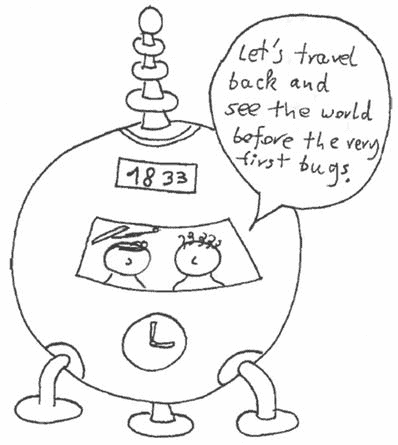
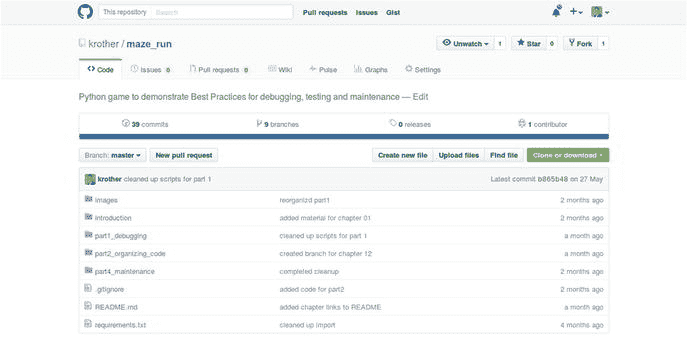
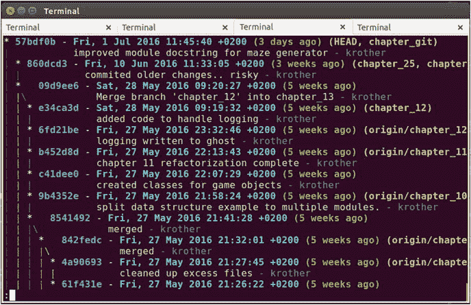
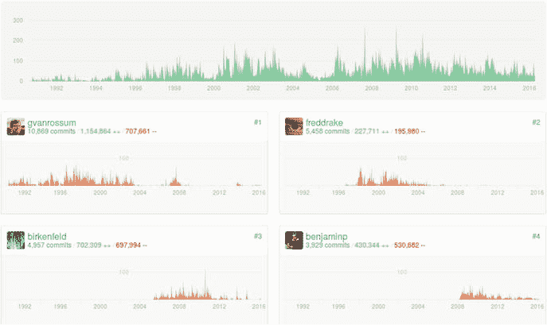

# 十二、版本控制

根据大气中的污染成分来判断，我相信我们已经来到了二十世纪的下半叶。——斯波克，星际迷航 4:回家的旅程

有一次，我参与了一个研究项目，涉及一个数据库、一个公共 web 服务器和大量 Python 代码。有一天服务器的硬盘崩溃了，把所有东西都抹掉了。我们试图从分散在不同人电脑上的文件中恢复服务，但失败了。这个项目再也没有实现。我们将需要一个时间机器来恢复项目以前的状态。具有讽刺意味的是，当我一年后从事另一个网络数据库项目时，历史重演了。服务器上的磁盘又崩溃了。这一次，我们真的有了时间机器。我们可以像崩溃前一样拿走所有代码和数据。虽然我们不得不手动配置一些东西，但网站很快又运行了。现在你可能想知道我们如何恢复旧代码。或者，更准确地说:“你是如何给自己造出那个时间机器的？”我们的时光机叫版本控制(见图 [12-1](#Fig1) )。在本章中，我们将了解什么是版本控制以及如何使用它。



图 12-1。

Version Control is a bit like time traveling in your source code—temporal paradoxa included. To see a world without program bugs, you would have to travel back into the 19th century before Ada Lovelace wrote the very first computer program.

在前几章中，我们的程序有了很大的变化。我们应用了各种调试和编码策略，并相应地编辑了我们的代码。在尝试不同的方法时，我们可能会复制 Python 文件来保存新旧版本。一段时间后，我们会看到文件越积越多(例如，模块将游戏区域绘制为一个方格):

```py
draw_grid.py
draw_grid2.py
draw_grid2_new_version.py
draw_grid3.py
draw_map.py
draw_map_buggy.py
draw_map_with_introspection.py

```

看起来我们的项目已经发展壮大了。几天不使用代码后，正确使用这些文件将会非常困难。出现类似下面的问题:最近修改的文件真的是您应该使用的文件吗？再问一下`draw_map`和`draw_grid`有什么区别？删除所有其他的安全吗，或者它们仍然包含重要的代码片段吗？如果我们的代码包含分布在多个目录中的文件，情况会变得更糟。简而言之，结果是我们的计划有变成一团乱麻的危险。

版本控制是解决这个问题的方法。版本控制意味着跟踪你的程序代码和相关文件中的所有变化，这样随着时间的推移，你可以建立一个你的代码是如何开发的日志。版本控制使我们能够在以后恢复到任何以前的时间点。正因为如此，版本控制被认为是长期维护任何项目的最基本、最重要的最佳实践。即使是小型的单人项目，回报也很快。

在这一章中，我们将使用版本控制系统 git，来跟踪 MazeRun 代码中的变化，并把它放在一个公共源代码库中。

## git 入门

git 是 Linux 的发明者 Linus Torvalds 写的。它是当今最常用和最先进的版本控制系统。几乎不用说，它是免费的。使用 git 可以做的事情包括:

1.  创建存储库
2.  将文件添加到存储库中
3.  检查项目的历史
4.  跳到更早的状态并返回
5.  在公共存储库上发布代码
6.  并行管理多个代码分支

在 Ubuntu Linux 上，可以用

```py
sudo apt-get install git

```

### 创建存储库

git 中的项目被组织在存储库中。一般来说，存储库是一组版本控制在一起的文件。这是什么意思？让我们考虑一个具体的例子。假设您在一个名为`maze_run`的目录中拥有 MazeRun 游戏的所有文件(包括 Python 代码、图像，可能还有一些数据文件)。我们希望使用 git 来跟踪这些文件中的变化。首先，我们从命令行用`git init`命令创建一个新的存储库:

```py
cd maze_run/
git init

```

您应该会看到这样的消息:

```py
Initialized empty Git repository in /home/krother/projects/maze_run/

```

起初，似乎什么都没有改变。但是如果你更仔细地看(用`ls -la`)，你会注意到一个叫做`.git`的隐藏文件夹。这是 git 存储随着时间的推移应用于文件的更改的地方。现在我们的项目可以开始发展自己的历史了。

### 将文件添加到存储库中

当我们初始化一个存储库时，git 会自动开始跟踪现有的文件吗？我们可以随时通过输入以下命令来检查 git 对当前目录的了解

```py
git status

```

我们得到这样一条消息:

```py
Untracked files:
   (use "git add <file>..." to include in what will be committed)

     draw_maze.py
     event_loop.py
     generate_maze.py
     load_tiles.py
     maze_run.py
     moves.py
     util.py
     images/

nothing added to commit

but untracked files present (use "git add" to track)

```

git 告诉我们的是，它看到了以前从未见过的文件，因此它们还不在存储库中。我们可以使用`git add`命令将这些文件和整个目录添加到存储库中:

```py
git add *.py
git add images/*

```

通过再次使用`git status`，您可以检查 git 记录了哪些文件。添加适用于任何类型的文件(源代码、文本文件、图像、Word 文档)。然而，git 对于文本文件中的更改最有效。

为了告诉 git 我们已经完成了文件的添加，我们可以使用 commit 命令并附加一条消息:

```py
git commit

-m "added first working version of MazeRun"

```

之后`git status`报告:

```py
nothing to commit

, working directory clean

```

commit 命令将我们文件的内容复制到 git 的内部文件的`.git`目录中。我们现在已经完整地记录了这些变化。无论我们后来在 Python 代码中做了什么改变，只要我们不弄乱`.git`目录(这通常不是一个好主意，除非您真的知道自己在做什么)，我们都可以恢复到以前的状态。

### 跟踪文件中的更改

版本控制的主要用途是跟踪文件中的变化。假设我们想要编辑第三章中介绍的随机迷宫生成器的描述。像以前一样，我们在我们喜欢的文本编辑器中打开文件(`generate_maze.py`)，并进行修改。例如，我们可以替换斯巴达的评论

```py
# Code for chapter 03 - Semantic Errors

```

更具说明性的 docstring 解释了该模块的功能及其局限性:

```py
"""

Random Maze Generator

Creates X*Y grids consisting of walls (#) and floor tiles (.),

forming a network of connected corridors.

Warning: Sometimes, the algorithm will create enclosed spaces,
but it is good enough to experiment with debugging techniques.

This module was introduced in chapter 03 - Semantic Errors

"""

```

当我们保存文件时，更改不会自动添加到 git 存储库中。我们可以再次使用`git status`检查哪些文件已经更改:

```py
> git status
On branch master
Changes not staged for commit

:
  (use "git add <file>..." to update what will be committed)

    modified: generate_maze.py

nothing added to commit but untracked files present (use "git add" to track)

```

您还可以查看`git diff`到底发生了什么变化。输出包含我们添加的每一行的前缀`+`和我们删除的每一行的前缀:

```py
> git diff
index c0d5a33..2ea0321 100644
--- a/part1_debugging/generate_maze.py
+++ b/part1_debugging/generate_maze.py
@@ -1,5 +1,13 @@
+"""

+Random Maze Generator

-# Code for chapter 03 - Semantic Errors
+Creates X*Y grids consisting of walls (#) and floor tiles (.),
+so that the floor tiles are connected.
+
+Warning: Sometimes, the algorithm will create enclosed spaces.
+
+This module was introduced in chapter 03 - Semantic Errors
+"""

 import random

```

要将这些更改写入存储库，我们需要添加文件并再次提交更改:

```py
git add generate_maze.py

git commit

-m "improved module docstring for maze generator"

```

作为一种捷径，您可以在一个步骤中完成添加和提交更改，只要文件`generate_maze.py`已经被添加到存储库中，以便 git 知道它:

```py
git commit -a -m "improved module docstring for maze generator"

```

`git` `commit` `-a -m`命令将从您的存储库中添加最近更改过的所有文件。这是有用的，因为它节省了您逐个添加每个文件的努力。在更大的项目中，有时希望从一轮编辑中创建多个提交(例如，如果您正在写一本书，提交可以被标记为“第 [12 章](12.html)的附加数字”、“第 [15 章](15.html)的固定代码示例”等)。).git 为您提供了对单个提交内容的细粒度控制。作为一个最佳实践，我建议手动添加文件，而不是使用`git commit -a -m,`只是为了意识到你在添加什么。

每天提交至少在一个工作日结束时提交你所有的改变是一个好习惯。如果您正在与其他人协作或进行密集开发，提交可能会更频繁地发生。在高峰时段，我每隔几分钟就使用`git commit`。

### 移动和删除文件

除了改变文件的内容之外，我们可能想要将文件移动到不同的地方或者将它完全扔掉。普通的 Unix 命令`mv`和`rm`仍然工作，但是 git 会变得混乱，因为它期望的文件已经不在那里了。相反，我们需要明确地告诉 git 我们想要移动或删除一个文件。

`git mv`命令相当于移动文件的`mv`。它的工作方式与`mv`完全相同，只是在我们的存储库中添加了一个注释，说明该文件曾经在其他地方。完整的命令可能如下所示:

```py
git mv foo.py examples/foo.py

```

类似地，`git rm`删除一个文件，但仍会记住存储库中以前的内容:

```py
git rm bar.py

```

使用`-f`标志可以覆盖更改，但是我不推荐使用`-f`作为最佳实践。使用`git status`,我们可以检查 git 是否注意到了移动和删除的文件。在移动和删除文件之后，需要使用`git commit`将更改提交到存储库，就像我们之前编辑文件时所做的那样。

### 放弃更改

在编辑代码时，有时会发现一个想法行不通。或者说原来我们已经把自己纠结得太厉害了，不如扔掉所有改动，重新开始。或者我们只是不小心删除了代码。在文本编辑器中，按下`Ctrl+A, Backspace, Ctrl+S`很容易毁掉几个小时和几天的工作。在这些情况下，我们可以使用存储库来撤销我们的更改，并退回到一个已知的状态。假设我们弄乱了文件`generate_maze.py`(鉴于您已经将最近的变更提交到一个存储库中，在家里尝试是安全的)。

我们可以用`git checkout`命令恢复文件:

```py
git checkout generate_maze.py

```

这将重新创建上次提交时的文件。我们也可以用一个命令恢复当前目录中的所有文件:

```py
git checkout .

```

对于频繁的提交，`git checkout`就像一个项目范围的撤销功能。

## 浏览我们代码的历史

当在一段时间内跟踪我们代码中的变化时，我们会进行大量的提交。我们的知识库正在积累自己的历史。理想情况下，这段历史被静静地保存在`.git`目录中，我们再也不需要查看它了。然而，有一天我们可能会注意到，我们搞砸了一些以前有效的事情。在这种情况下，我们可以使用 git 作为我们的时间机器，回去看看代码以前是什么样子的(见图 [12-1](#Fig1) )。

我们需要弄清楚的第一件事是进入时间机器的日期。命令`git log`给出了我们之前所做的所有提交的列表:

```py
> git log
commit a11d542accc755a47533783b462c69992e218e73

Author: krother <krother@academis.eu>
Date:   Fri Jul 1 11:45:40 2016 +0200

    improved module docstring for maze generator

commit b865b483a7e042e02724464cc6bd944b23e2324e
Author: krother <krother@academis.eu>
Date:   Fri May 27 21:18:51 2016 +0200

    cleaned up scripts for part 1
...

```

每次提交都包含散列码、作者、时间戳和我们编写的消息(此时编写描述性的提交消息是值得的)。我们还可以限制关于单个文件的日志消息的输出:

```py
> git log util.py
commit b9699d1e57292d33aa908a790013c93e15f24962
Author: krother <krother@academis.eu>
Date:   Sat May 21 06:29:25 2016 +0200

    reorganizd part1

```

为了获得更长时间的历史概况，使用`--pretty=oneline`选项将每个提交压缩到一行是很有用的:

```py
git log --pretty=oneline generate_maze.py
a11d542accc755a47533783b462c69992e218e73 improved module docstring
b865b483a7e042e02724464cc6bd944b23e2324e cleaned up scripts for part 1
6c3f01bb1efbe1dfdf6479a60c96897505c1d7a4 cleaned up code for chapter 03
b9699d1e57292d33aa908a790013c93e15f24962 reorganized part1

```

Why do we need hash codes instead of simply numbering commits from 1 to X?

时间旅行的类比为我们提供了一个很好的解释:想象我们回到过去给更早的自己一个考试的结果。我们会用现在的两个版本创建另一个历史(一个考试失败，一个考试完美)。除了产生的科学问题之外，仅仅通过一个日期很难明确地提到两个交替的现实中的一个。

有了像 git 这样的时间旅行机器，我们有可能改变代码的历史。此外，您(或一个团队)可以并行创建多个历史。简而言之，线性历史与时间旅行不太合拍。git 避免由此导致的悖论的方法是将每次提交视为独立于时间线的唯一事件——在计算机科学中，哈希代码是识别此类数据项的首选工具。我还没有在现实生活中看到哈希码应用于时间旅行，但这个想法听起来并不太糟糕。

### 签出旧的提交

确定了感兴趣的提交后，我们可以跳回到项目的历史中。让我们假设我们想要检查标记为“重组 part1”的提交之后的代码是什么样子的。我们需要从`git log`的输出中复制的`git checkout`命令和相应的散列码`b9699d1e572..`。我们回到过去

```py
git checkout b865b483a7e042e02724464cc6bd944b23e2324e

```

git 给我们一个警告消息(“分离的头”)，基本上意味着时间旅行是潜在危险的，git 将放弃任何更改，除非我们明确声明不是这样。当我们抓住机会简单地回顾过去并在编辑器中打开`generate_maze.py`时，我们注意到我们最近的 docstring 已经消失了。模块的标题再次显示如下

```py
# Code for chapter 03 - Semantic Errors

```

git 已经更改了存储库中的所有文件，使其类似于提交历史中的状态。

### 回溯到最近一次提交

使用`git log`,我们只能看到比跳转点更早的提交。也就是说，我们更新的提交是不可见的(我们看不到它的哈希代码)。我们会永远被困在过去吗？还好我们的时光机有一个`go back”`按钮。当我们看够了过去，我们可以回到现在

```py
git checkout master

```

我们的 docstring 再次出现在磁盘上的`generate_maze.py`中(取决于您的编辑器处理其他程序正在编辑的文件的能力，您可能会从您的文本编辑器中获得或多或少的惊讶反应)。

## 在 GitHub 上发布代码

即使你不是用 git 开发代码，在某些时候不碰到 GitHub 几乎是不可能的。GitHub 是一个拥有数百万储存库的网站，包含从 Hello World 程序到整个操作系统的所有内容。GitHub 为开发者提供了一个共享代码和合作项目的市场(见图 [12-2](#Fig2) )。使用 GitHub 有很多好处:

*   您可以从多台计算机访问您的程序代码，而无需 SSH。
*   在 GitHub 上发布代码是一个备份系统。
*   您可以在 web 浏览器中浏览已发布存储库的源代码。
*   其他程序员可以复制一个项目，改进它，并友好地请你重新整合他们的更改。
*   自述文件会自动呈现并显示在项目页面上。
*   每个项目都有一个问题跟踪器，它是一个轻量级的项目管理工具。
*   您可以将附加服务插入 Github 存储库中。例如，可以自动执行测试或者发布文档。



图 12-2。

GitHub is a platform to share source code and to collaborate with other developers. The screenshot shows an earlier version of the MazeRun repository .

在撰写本文时，GitHub 是这个星球上开源开发事实上的中心平台。然而，您也可以将它用于私有存储库(通过付费计划)。我见过的很多程序员都把某个人在 GitHub 上的存在看做是一种名片。GitHub 概要文件并不能提供对编程技能的非常准确的评估(例如，因为大多数商业项目并不公开可见)，但是熟悉该平台可以被认为是大多数编程语言的最佳实践。幸运的是，使用 GitHub 你只需要记住三个命令:`git push, git pull,`和`git clone.`

### 在 GitHub 上开始一个项目

在 GitHub 上开始自己的项目很容易。你进入 [`http://github.com`](http://github.com) `,`为自己创建一个账户，找到按钮“创建一个新的存储库”。之后，你主要是按照屏幕上的指示输入项目名称和描述。最相关的决定是你是把新的资源库从 GitHub 复制到你的电脑还是从你的电脑复制到 GitHub。GitHub 将显示这两个选项的命令，以便您可以将它们复制粘贴到 Unix 终端中。您只需要这样做一次，所以我们不会详细讨论确切的命令。

哪个选项更好？这取决于你已经有了什么:如果你还没有在你的电脑上用`git init`创建一个存储库，用`git clone`把存储库从 GitHub 复制到你的电脑上就更简单了。如果您已经在本地使用了 git，即使是一两次提交，也最好使用页面上给出的命令将现有的存储库复制到 GitHub。目前，GitHub 针对这种情况(例如针对 MazeRun 存储库)提出的命令如下:

```py
git remote  add  origin  https://github.com/krother/maze_run.git

git push -u origin master

```

### 使用 GitHub 作为单一贡献者

一旦我们在 GitHub 上建立了项目，并完成了第一步配置，事情就变得简单了。我们如何发布我们的代码？让我们假设我们是项目中唯一的工作人员。我们在本地编写代码，并用`git commit`将更改提交给本地存储库。每隔一段时间(例如，每天)，我们会将我们的更改提交到 GitHub，这样其他人就可以阅读它，并且我们的代码是安全的，以防计算机的驱动器崩溃。提交后，我们需要输入的是

```py
git push

```

git 会要求我们输入用户名和密码，我们就完成了。如果第一次出现问题，两个最常见的原因是 git 存储库设置不正确(在这种情况下，您可以安全地删除 GitHub 上的存储库，创建一个新的，然后重试)以及您的互联网连接通过代理服务器工作，默认情况下不允许连接(一些公司和公共场所会这样做)。在这种情况下，请咨询您的网络管理员。

这种工作流不仅仅对一个人的编程项目有用。如果我们通过 GitHub 发布教程或培训材料(例如，使用 [`http://gitbook.com`](http://gitbook.com) )或通过 GitHub 页面`(` [`http://pages.github.com`](http://pages.github.com) `).`管理我们自己的网站，效果也很好

### 从事其他人开始的项目

最初，git 是为一起工作的开发团队而创建的。这个想法是两个或更多的开发人员可以并行处理相同的代码。他们交换代码中的更改，因此公共代码库的增长速度比他们必须等待另一个人完成要快得多。通过`GitHub`开始一个现有的项目很容易。基本上任何人都可以使用`git clone`来获得存储库的副本。例如，我们可以开始开发 MazeRun 游戏的本地变体:

```py
git clone https://github.com/krother/maze_run.git

```

`git clone`命令创建 GitHub 项目的本地副本。它还复制了`.git`目录，因此项目的整个历史也被复制了。稍后，我们可以和`git pull`一起检查 GitHub 上的库是否有任何变化:

```py
git pull

```

要使用`git pull`，我们需要首先提交我们自己的更改。

### 有多个参与者的项目

默认情况下，只有存储库的所有者可以更改其内容。但是如果我们想和某人合作一个项目，我们可以在 Github 项目的设置中添加多个贡献者。通过添加一个贡献者，我们允许这个人添加代码到项目中，改变它的设置，甚至删除整个项目。这些特权应该只给予你认识和信任的人。

对于多个参与者，典型的工作流如下:

1.  用`git clone`或`git pull`更新我们的本地副本。
2.  编辑代码。
3.  用`git commit.`提交更改
4.  再次运行`git pull`检查变化。
5.  随后，用`git push.`发布所有内容

### 由两个人合并更改

当两个或更多的人编辑相同的代码时，一个大问题就要出现了。想象一下，你和其他人同时编辑代码。双方都提交代码(前面列表中的步骤 3)。第 4 步和第 5 步会发生什么？如果两个人处理不同的文件，git 会自动合并两次编辑。合并时，将使用每次提交的最新文件。如果同一个文件是由两个人编辑的，合并会更复杂。通常，git 会要求您手动合并文件。您将得到一个标记了冲突更改的文件。然后你有机会解决冲突，用`git add`和`git commit`贡献代码。

### 拉取请求

有许多高级选项可以促进与其他开发人员的协作:例如，您可以创建自己的已发布项目副本(称为 Fork)。您可以在不修改原始项目的情况下更改分叉。然而，如果您认为您的更改值得被合并回原始项目中，这可以通过一个拉请求来完成。假设您在 GitHub 上创建了自己的 MazeRun 分支，并在项目副本中为游戏添加了音效。如果我们认为这也是对我的代码的一个很好的补充，会发生什么呢:

*   您在 GitHub 上创建了一个提交到我的存储库的 Pull 请求。
*   我收到拉取请求，并检查将要发生的变化。
*   我接受这些改变。
*   代码被合并(假设没有合并冲突)。

一个好的拉请求需要相关人员之间的某种交流，否则收到拉请求的开发人员很容易被弄糊涂。Pull 请求类似于 merge，只是它完全发生在 GitHub 上。拉请求是对开源软件进行大小改进的一种常见方式。

## 分支发展

git 的一个关键特性是我们可以并行处理多件事情。为了将时间机器的等效物延伸得更远一点，想象我们有多个交替的现实(2009 年的《星际迷航》电影包含了一个这造成的实际问题的极好例子)。幸运的是，有了 git，这些交替的现实或分支并不那么难以管理。

默认情况下，有一个单独的分支，称为`master`。让我们假设我们想要为游戏开发一个新的实验特性(例如，音效)。我们可以使用命令为其创建一个专用分支，并将其命名为`sound_effects`:

```py
git branch sound_effects

```

现在我们有两个代码分支，`master`和`sound_effects`，两者仍然是相同的。我们可以看到所有分支

```py
git branch

```

我们看到一个分支列表，当前活动的分支标有星号(`*`):

```py
* master
  sound_effects

```

为了处理新的分支，我们需要切换到它:

```py
git checkout sound_effects

```

你可以用`git branch`验证我们现在真的在新的分支机构了。我们现在可以正常地编辑代码、添加文件和提交。这里，我们简单地创建一个占位符:

```py
echo "print(‘BEEP’)" >> sound.py
git add sound.py
git commit -m "created file for sound effects"

```

新文件被添加到新分支的存储库中。让我们切换回`master`分支:

```py
git checkout master

```

我们注意到新创建的文件`sound.py`不见了！我们的代码中现在有两个交替的现实。

### 合并分支

在某些时候，我们可能会决定音效已经足够成熟，可以包含在节目的主线中。我们可以将一个分支的更改应用到另一个分支。假设我们仍然在`master`分支中。我们可以使用`git merge`将`sound_effects`分支的变更合并到`master`中:

```py
git merge sound_effects

```

请注意，`master`分支在此期间可能会进一步发展。在这种情况下，git 将合并更改，并要求我们手动合并，以防它们重叠。这样，我们可以确保代码总是一致的。

使用 git 中的分支进行开发有几种做法。最重要的最佳实践是将稳定的代码保存在`master`分支中，并将新实现的特性保存在其他地方(例如，`development`分支)。一旦一个特性足够稳定，它就会被合并到`master`中。对于本书的代码库`(` [`http://github.com/krother/maze_run`](http://github.com/krother/maze_run) )，我为许多章节创建了单独的分支。这样，我可以保持代码的上下文清晰地分开。我定期将不同的分支合并在一起。这些分支及其关系给人留下了深刻的印象(见图 [12-3](#Fig3) )。理解什么是分支以及如何使用它们需要一些思考。我建议不要在你的第一个 git 项目中使用分支。然而，它们是职业发展中的一项基本技术。



图 12-3。

Graphical log of a git repository with multiple branches

## 正在配置 git

一般来说，一旦您熟悉了基本命令(即`add, commit, status, push,`和`pull`)，使用 git 可以很好地与大多数日常编程活动集成。有几个配置选项让使用 git 变得更加愉快。

### 忽略文件

在导入 Python 模块时，Python 3 会在`__pycache__`目录下创建字节码来加速执行。在 MazeRun 中，只要我们运行一次程序，`__pycache__`目录就会包含类似于`generate_maze.cpython-34.pyc`的文件。Python 会自动更新缓存的文件，所以我们可以安全地忽略它们。然而，`git status`会不断纠缠我们将`__pycache__`目录添加到我们的存储库中:

```py
> git status
Untracked files:
   (use "git add <file>..." to include in what will be committed)

    ___pycache___/

```

有充分的理由不将`__pycache__`目录添加到我们的存储库中。首先，Python 自动管理它们，所以它们对其他人来说毫无用处。第二，它们会在我们每次运行代码时改变，产生许多不必要的消息。我们更希望 git 不要在我们每次输入`git status`时都提醒我们这些文件。我们通过在主项目目录中创建文件`.gitignore`来实现这两个目标。`.gitignore`文件包含 git 不会打扰我们的名称和模式。该文件可能包含以下行:

```py
___pycache___/*

```

现在，`git status`将不再提及缓存目录。此外，当我们试图通过`git add`或`git add *,`添加它时，它会被拒绝。除了字节码文件，大多数项目包含其他不需要被版本控制跟踪的文件。例如，这些包括

*   本地配置设置(例如，包含我们的主目录)
*   日志文件
*   数据库
*   临时文件
*   密码

当使用`git status`和`git diff`时，前三种方法会不必要地扩大存储库，并产生大量背景噪音。最后一个是严重的安全风险(绝对不要向存储库添加密码)。最佳实践是将这些类型的文件作为模式添加到`.gitignore`中。典型的`.gitignore file`可能包含以下项目:

```py
___pycache___/*
*.conf
*.log
*.db
*.tmp
password.txt

```

第 [13](13.html) 章介绍的 pyscaffold 工具会自动为我们创建一个更详细的`.gitignore`文件。当多个人一起开发一个程序时，有时会发生他们来回修改一行代码的情况。这可能是各自机器上不同的目录名或导入语句。当我们观察到这种模式时，它暗示了一些配置需要在存储库之外进行管理(例如，在一个环境变量或`.bashrc`文件中)。每当你看到人们来回修改代码，这是停止编码并开始讨论的好时机。

### 全局设置

git 存储配置选项的第二个地方是我们主目录中的`.gitconfig`文件。在这里，我们可以定义我们的用户名和有用的快捷键。可以使用`git config`命令或在文本编辑器中编辑该文件。为了简单起见，我将坚持后者。我自己的`.gitconfig`文件是这样的:

```py
[user]
    email = krother@academis.eu
    name = krother
[alias]
    ci = commit
    st = status
    l = log --pretty=oneline

```

`[user]`部分只包含我在 github 上的用户名，这样我就不必每次连接到公共存储库时都输入用户名。`[alias]`部分定义快捷方式:`git ci`类似于`git commit` `, git st`类似于`git status,``git l`以单行方式总结日志。

## 用法示例

如果您以前没有使用过版本控制，您可能会发现使用 git 非常有益。当我开始使用版本控制系统时，过了一会儿，我想知道没有它我怎么能写出任何程序。然而，根据项目的规模和贡献者的数量，您可以以许多不同的方式使用 git。

### 二十个字符:低流量的小项目

在小型项目中，您可以将版本控制视为您的私人时间机器。git 为代码、数据、文档或其他任何东西维护了一个清晰的历史。例如，我用 git 编写和维护许多课程材料。在 GitHub 上维护许多小的存储库并没有什么不好。我已经在 GitHub 上创建了 25 个存储库，在 Bitbucket 上又创建了 5 个。我的一个最小的存储库只包含三个提交、两个 Python 脚本和几个图像文件`(` [`http://github.com/krother/twenty_characters`](http://github.com/krother/twenty_characters) `).`它的目的是保存一个项目，以防我不小心擦除我的备份驱动器。我也为其他人创建的知识库做出了贡献。在某些情况下，我的贡献只有一行。真的没有最小尺寸。

### Python:一个每天都有提交的巨大项目

另一方面，共享存储库可能会变得非常大。例如，标准 Python 解释器 CPython 的存储库(镜像在 [`http://github.com/python/cpython`](http://github.com/python/cpython) `),`上)包含 131 个贡献者的 93，000 多个提交。吉多·范·罗苏姆自己持有 10800 个提交，添加了超过一百万行代码，删除了 700000 行(见图 [12-4](#Fig4) )。历史可以追溯到 1991 年。每天都会提交多次更改。



图 12-4。

Contributions to the Python interpreter by a few core developers over time. The red/green numbers indicate the lines contributed/deleted. Taken from [`http://github.com/python/cpython`](http://github.com/python/cpython) `.`

### grep:一个长期项目

其他存储库的流量较少。例如，`grep`的存储库，一个在文件中搜索文本的 Unix 命令行工具，已经存在很长时间了。GNU grep 库在 1999 年有 35，000 行代码，但历史可以追溯到 Mike Haerkal 在 1988 年发布的第一个版本，这是 Ken Thompson 在 1973 年对原始 grep 的重写。虽然`grep`通常被认为是一个非常稳定的工具，但一个开发团队每周都会修改一到两次几行代码。如果没有版本控制，这个程序不可能维持超过四十年！

如示例所示，似乎也没有最大大小。我们通常为每个项目找到一个存储库。我强烈反对在同一个存储库中放置多个项目。毕竟，仓库并不昂贵。

git 是一个非常强大的工具。到目前为止，我们只是触及了表面。表 [12-1](#Tab1) 给出了最常见的命令。要了解更多，我强烈推荐斯科特·沙孔和本·施特劳布的《Pro Git 》( a press，2009 ),这是一本专门介绍 Git 提供的可能性和工作流的书。

表 12-1。

git Commands

<colgroup><col> <col></colgroup> 
| 向存储库添加文件`git init` `git add <files>` `git commit -m "message"` `git commit –amend` | 在当前目录中创建新的 git 存储库跟踪给定文件中的更改将跟踪的更改写入存储库更改提交消息或将文件添加到上次提交中 |
| 导航修订`git status` `git checkout .` `git diff <file>` `git rm <files>` `git log` `git log <file>` | 显示添加、修改和未跟踪的文件放弃本地更改显示自上次提交以来的更改从下次提交中删除文件列表提交消息列出给定文件的提交消息 |
| 配置 git `git config` | 更改配置变量 |
| 使用远程储存库`git clone` `git pull` `git push` | 创建本地存储库的本地副本更新本地副本将更改提交到远程存储库(例如 GitHub) |
| 高级选项`git branch` `git branch <branch>` `git checkout <branch>` `git merge` `git blame <file>` `git cherry pick <file> hash` `git rebase` `git bisect` | 显示分支创建新分支将本地拷贝切换到给定分支合并两个分支显示谁编辑了哪一行拷贝了旧提交的文件将两个分支重新排列成线性历史记录指导您完成提交历史记录中的二分搜索法 |

## 其他版本控制系统

有一些可供选择的版本控制系统值得一提:

### 水银的

一个初学者友好的分布式版本控制系统。它的特性比 git 略少，但是常规的工作流比 git 更容易使用。网站 [`http://hginit.com`](http://hginit.com) 是一个不错的起点。

### 颠覆(SVN)

早在 git 和 Mercurial 之前就存在的非分布式版本控制系统。现在没有理由在新项目中使用它。我听到的使用 SVN 的最有说服力的论据是一家生产安全关键软件的公司。他们希望 100%确定他们使用的是一种稳定的技术，这种技术在过去十年没有改变，在未来也不太可能改变。参见 [`http://subversion.apache.org/`](http://subversion.apache.org/) `.`

### 并行版本软件(CVS)

这是一个更老的版本控制系统，在博物馆中赢得了一席之地。

### Bitbucket

像 Github 这样的代码库，允许免费使用有限数量的公共和私有库。Bitbucket 兼容 git 和 Mercurial。参见 [`https://bitbucket.org/`](https://bitbucket.org/) `.`

### 一套合作式软件开发管理系统

一个致力于开源项目的代码库。十多年来(在 GitHub 广泛流行之前)，Sourceforge 是开源软件的主要市场。参见 [`https://sourceforge.net/`](https://sourceforge.net/) `.`

## 最佳实践

*   git 是一个跟踪代码变化的版本控制系统。
*   随着时间的推移，git 会记录代码的后续版本。
*   存储库是存储在`.git`目录中的变更历史。
*   要跟踪文件中的变更，您需要`git add`文件和`git commit`变更。
*   `git log`显示提交历史。每个提交都由一个哈希代码标识。
*   通过`git checkout`,你可以回到之前的提交，回到现在。
*   项目的历史不一定是线性的。可以存在多个并行分支。
*   GitHub 是一个发布和交换代码的平台。它也是一种简单的备份机制。
*   当两个贡献者同时编辑不同的文件时，git 会自动合并更改。
*   当两个参与者编辑相同的代码时，您需要手动合并更改。
*   `.gitignore`文件包含不会被跟踪的文件名模式。
*   合理使用存储库没有最小和最大的大小。所有 Python 项目都受益于使用版本控制系统。