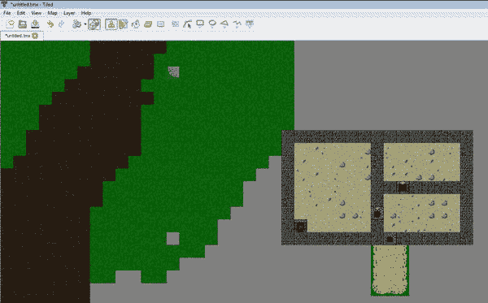
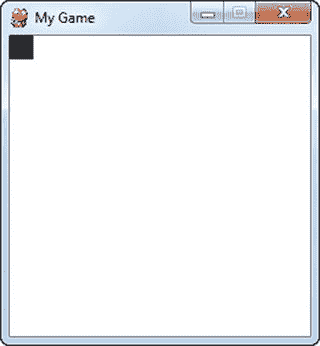
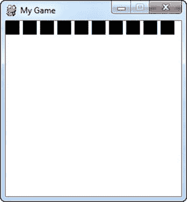
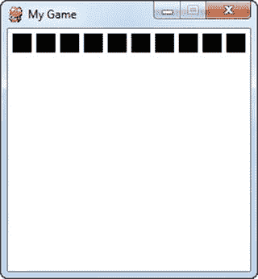
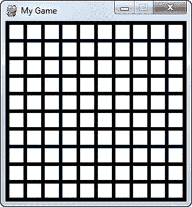
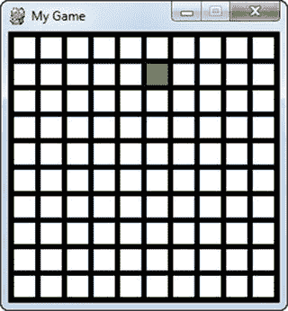
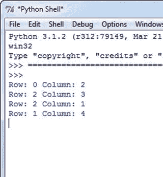
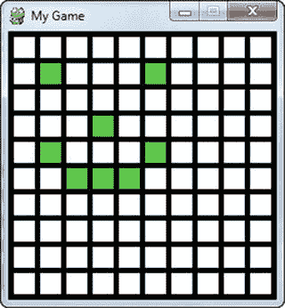

# 十七、数组支持的网格

像扫雷、井字游戏和许多类型的冒险游戏都将游戏数据保存在数字网格中。例如，井字游戏棋盘:

<colgroup><col> <col> <col></colgroup> 
|   | O | O |
|   | X |   |
| X |   |   |

…可以使用数字网格来表示空白点、O 和 X，如下所示:

<colgroup><col> <col> <col></colgroup> 
| Zero | Two | Two |
| Zero | one | Zero |
| one | Zero | Zero |

这个数字网格也可以称为二维数组或矩阵。(最后，我们开始学习矩阵。)表格中的数字值代表每个电路板位置应显示的内容。在前面的例子中，0 代表一个没有人打球的位置，1 代表一个 X，2 代表一个 o。

扫雷游戏，显示支持网格的数字

上图是经典扫雷游戏中的一个例子。这个例子被修改为在左边显示经典显示，在右边显示棋盘上的数字网格。

数字`10`代表一个地雷，数字`0`代表一个没有被点击的空间，数字`9`代表一个被清除的空间。数字 1 到 8 代表周围 8 个方块内有多少个地雷，只有当用户点击方块时才会填充。

扫雷实际上可以有两个网格:一个用于常规显示，一个完全独立的数字网格将跟踪用户是否在板上放置了标记地雷位置的旗帜。

经典冒险游戏地图是使用平铺地图编辑器创建的。这些是巨大的网格，每个位置只是一个代表那里地形类型的数字。地形可以是泥土、道路、小径、绿草、棕草等等。下图所示的类似于 [Tiled Qt](http://www.mapeditor.org/) 的程序允许开发人员轻松地制作这些地图并将网格写入磁盘。

使用 Qt 图块创建冒险地图

冒险游戏也使用多个数字网格，就像扫雷有一个地雷网格和一个单独的旗帜网格。冒险游戏中的一个格子或层代表你可以行走的地形；另一个是你不能在上面行走的东西，比如墙和树；一层是可以瞬间杀死你的东西，比如熔岩或无底洞；一个是可以拿起来到处移动的物体；还有一层是用来放置怪物的。

像这样的地图可以加载到 Python 程序中，但不幸的是，如何管理的完整描述超出了本书的范围。像 [`https://github.com/bitcraft/PyTMX`](https://github.com/bitcraft/PyTMX) 这样的项目提供了加载这些地图所需的一些代码。

## 应用

说够了，我们来写点代码吧。这个例子将创建一个网格，如果我们显示一个白色或绿色块，这个网格将被触发。我们可以通过点击来改变网格值并使其变成绿色。这是像扫雷，战舰，连接四等基于网格的游戏的第一步。

转到示例代码页，下载基本模板文件:`ProgramArcadeGames.com/python_examples/f.php?file=pygame_base_template.py`。

从空白模板文件开始，尝试按照这里的说明重新创建这个程序。最后的程序在这一章的末尾，但是不要跳到前面去复制它！如果你那样做，你将什么也学不到。任何人都可以复制和粘贴代码，但如果你能重新创建这个程序，你就拥有了人们愿意为之付费的技能。如果你只会复制粘贴，那你就在这里浪费时间了。

### 绘制网格

Adjust the program’s window size to 255×255 pixels.   Create variables named `width`, `height`, and `margin`. Set the width and height to 20\. This will represent how large each grid location is. Set the margin to 5\. This represents the margin between each grid location and the edges of the screen. Create these variables before the main program loop.   Draw a white box in the upper left corner. Draw the box drawn using the height and width variables created earlier. (Feel free to adjust the colors.) When you get done your program’s window should look like the next figure.

Step 3   Use a `for` loop to draw 10 boxes in a row. Use `column` for the variable name in the `for` loop. The output will look like one long box until we add in the margin between boxes. See the next figure.

Step 4   Adjust the drawing of the rectangle to add in the `margin` variable. Now there should be gaps between the rectangles. See the next figure.

Step 5   Add the margin before drawing the rectangles, in addition to between each rectangle. This should keep the box from appearing right next to the window edge. See the next figure.

Step 6   Add another `for` loop that also will loop for each row. Call the variable in this `for` loop `row`. Now we should have a full grid of boxes. See the next figure.

Step 7  

### 普及网格

现在我们需要创建一个二维数组。不幸的是，在 Python 中创建二维数组不像在其他一些计算机语言中那么容易。有一些可以为 Python 下载的库使它变得容易，但是对于这个例子，它们将不会被使用。

To create a two-dimensional array and set an example, use the code below: `# --- Create grid of numbers` `# Create an empty list` `grid = []` `# Loop for each row` `for row in range(10):`     `# For each row, create a list that will`     `# represent an entire row`     `grid.append([])`     `# Loop for each column`     `for column in range(10):`         `# Add a the number zero to the current row`         `grid[row].append(0)` A much shorter example is below, but this example uses some odd parts of Python that I don’t bother to explain in this book: `grid = [[0 for x in range(10)] for y in range(10)]` Use one of these two examples and place the code to create our array ahead of your main program loop.   Set an example location in the array to 1. Two-dimensional arrays are usually represented addressed by first their row and then the column. This is called a row-major storage. Most languages use row-major storage, with the exception of Fortran and MATLAB. Fortran and MATLAB use column-major storage. `# Set row 1, column 5 to one` `grid[1][5] = 1` Place this code somewhere ahead of your main program loop.   Select the color of the rectangle based on the value of a variable named `color`. Do this by first finding the line of code where the rectangle is drawn. Ahead of it, create a variable named `color` and set it equal to white. Then replace the white color in the rectangle declaration with the `color`variable.   Select the color based on the value in the grid. After setting `color` to white, place an `if` statement that looks at the value in `grid[row][column]` and changes the color to green if the grid value is equal to 1\. There should now be one green square. See the following figure.

Step 11   Print “click” to the screen if the user clicks the mouse button. See `bitmapped_graphics.py` for example code of how to detect a mouse click.   Print the mouse coordinates when the user clicks the mouse. See `move_mouse.py` for an example on getting the position of the mouse. See the next figure.

Step 13   Convert the mouse coordinates into grid coordinates. Print those instead. Remember to use the width and height of each grid location combined with the margin. It will be necessary to convert the final value to an integer. This can be done by using `int` or by using the integer division operator `//` instead of the normal division operator `/`. See the next figure.

Step 14   Set the grid location at the row/column clicked to 1\. See the next figure.

Step 15  

### 最终计划

`"""`

`Example program to show using an array to back a grid on-``s`T2】

`Sample Python/Pygame Programs`

[T2`http://programarcadegames.com/`](http://programarcadegames.com/)

`Explanation video:`[`http://youtu.be/mdTeqiWyFnc`T3】](http://youtu.be/mdTeqiWyFnc)

`"""`

`import pygame`

`# Define some colors`

`BLACK = (0, 0, 0)`

`WHITE = (255, 255, 255)`

`GREEN = (0, 255, 0)`

`RED = (255, 0, 0)`

`# This sets the WIDTH and HEIGHT of each grid location`

`WIDTH = 20`

`HEIGHT = 20`

`# This sets the margin between each cell`

`MARGIN = 5`

`# Create a 2 dimensional array. A two dimensional`

`# array is simply a list of lists.`

`grid = []`

`for row in range(10):`

`# Add an empty array that will hold each cell`

`# in this row`

`grid.append([])`

`for column in range(10):`

`grid[row].append(0)  # Append a cell`

`# Set row 1, cell 5 to one. (Remember rows and`

`# column numbers start at zero.)`

`grid[1][5] = 1`

`# Initialize pygame`

`pygame.init()`

`# Set the HEIGHT and WIDTH of the screen`

`WINDOW_SIZE = [255, 255]`

`screen = pygame.display.set_mode(WINDOW_SIZE)`

`# Set title of screen`

`pygame.display.set_caption("Array Backed Grid")`

`# Loop until the user clicks the close button.`

`done = False`

`# Used to manage how fast the screen``upd`T2】

`clock = pygame.time.Clock()`

`# -------- Main Program Loop -----------`

`while not done:`

`for event in pygame.event.get():  # User did something`

`if event.type == pygame.QUIT:  # If user clicked close`

`done = True  # Flag that we are done so we exit this loop`

`elif event.type == pygame.MOUSEBUTTONDOWN:`

`# User clicks the mouse. Get the position`

`pos = pygame.mouse.get_pos()`

`# Change the x/y screen coordinates to grid coordinates`

`column = pos[0] // (WIDTH + MARGIN)`

`row = pos[1] // (HEIGHT + MARGIN)`

`# Set that location to zero`

`grid[row][column] = 1`

`print("Click ", pos, "Grid coordinates: ", row, column)`

`# Set the screen background`

`screen.fill(BLACK)`

`# Draw the grid`

`for row in range(10):`

`for column in range(10):`

`color = WHITE`

`if grid[row][column] == 1:`

`color = GREEN`

`pygame.draw.rect(screen,`

`color,`

`[(MARGIN + WIDTH) * column + MARGIN,`

`(MARGIN + HEIGHT) * row + MARGIN,`

`WIDTH,`

`HEIGHT])`

`# Limit to 60 frames per``secon`T2】

`clock.tick(60)`

`# Go ahead and update the screen with what we’ve drawn.`

`pygame.display.flip()`

`# Be IDLE friendly. If you forget this line, the program will ’hang’`

`# on exit.`

`pygame.quit()`

开始做你自己的视频游戏吧！

## 回顾

### 多项选择测验

In computer science, a grid of numbers is called a: Two-dimensional array   Bingo board   One-dimensional array   Two-dimensional board     To print the value of the top left corner of a 10x10 two-dimensional array, the current code would be: `print(my_array[0][0])`   `print(my_array[1][1])`   `print(my_array[0,0])`   `print(my_array[1,1])`     To store a 10 into an x, y position on the grid of (0, 5), what is the correct code? `my_array[5][0] = 10`   `my_array[0][5] = 10`   `[0][5] = 10`   `my_array = 10`   `my_array[10] = (0,5)`   `print( my_arrayp[1,1] )`     To process an entire two-dimensional array, a program needs: Two nested `for` loops: one for each row, one for each element in the row.   Two sequential `for` loops: one for each row, one for each element in the row.   One `for` loop to process every element.   A function for each element in the grid.   Two nested classes: one for each row, one for each element.     In the chapter example, how does the program find which grid location was clicked on with the mouse? Divide coordinates by the size of each grid location (including the margin).   Subtract the margin, divide by grid size.   Subtract the grid size.   Divide the grid size by the x and y coordinates.    

### 简答工作表

Start with the final program. Modify it so that rather than just changing the block the user clicks on, it also changes the blocks of the squares next to the user’s click. If the user clicks on an edge, make sure the program doesn’t crash and still handles the click appropriately.   Write a celebrity-finding function. Start with a function `check_celebrity` that takes an n by n matrix named `grid` as a parameter. The grid location `grid[i][j] = 1` if person i knows person j and `grid[i][j] = 0` otherwise. (Assume that `grid[i][i]` = 1 for every i, since every person knows him/herself.) A celebrity is a person who is known by everyone and does not know anyone besides him/herself. Write a function that given the matrix `grid`, prints all the celebrities. For example, in the following grid person 2 is a celebrity:      `0  1  2  3`   `--------------` `0 |  1  1  1  0` `1 |  0  1  1  0` `2 |  0  0  1  0` `3 |  1  0  1  1` In the next example, no one is a celebrity:      `0  1  2  3  4`   `----------------` `0 |  1  1  1  0  1` `1 |  0  1  1  0  1` `2 |  0  0  1  0  0` `3 |  1  0  1  1  1` `4 |  1  0  0  1  1` Remember: A matrix can be represented as a list of lists, where each sublist is a row of the matrix. For example, the first matrix can be represented as: `grid = [ [1, 1, 1, 0], [0, 1, 1, 0], [0, 0, 1, 0], [1, 0, 1, 1] ]` Or you can use multiple lines to define the grid: `grid = [ [1, 1, 1, 0],`          `[0, 1, 1, 0],`          `[0, 0, 1, 0],`          `[1, 0, 1, 1] ]` You can test your function with code like the following test cases: `print("Test 1, Should show #2 is a celebrity.")` `grid = [ [1, 1, 1, 0],`          `[0, 1, 1, 0],`          `[0, 0, 1, 0],`          `[1, 0, 1, 1] ]` `check_celebrity(grid)` `print("Test 2, Should show no one is a celebrity.")` `grid = [ [1, 1, 1, 0, 1],`          `[0, 1, 1, 0, 1],`          `[0, 0, 1, 0, 0],`          `[1, 0, 0, 1, 1],`          `[1, 0, 0, 1, 1] ]` `check_celebrity(grid)` `print("Test 3, Should show #2 is a celebrity.")` `grid = [ [1, 1, 1, 0, 1],`          `[0, 1, 1, 0, 1],`          `[0, 0, 1, 0, 0],`          `[0, 0, 1, 0, 1],`          `[1, 0, 1, 1, 1] ]` `check_celebrity(grid)` `print("Test 4, Should show no one is a celebrity.")` `grid = [ [1, 1, 1, 0, 1],`          `[0, 1, 1, 0, 1],`          `[1, 0, 1, 0, 0],`          `[0, 0, 1, 0, 1],`          `[1, 0, 1, 1, 1] ]` `check_celebrity(grid)`