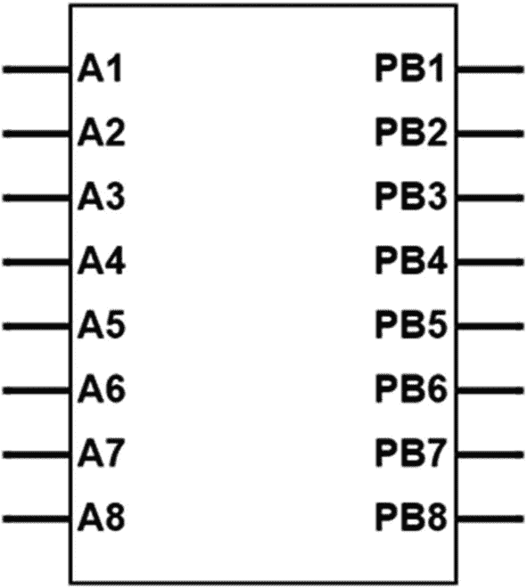
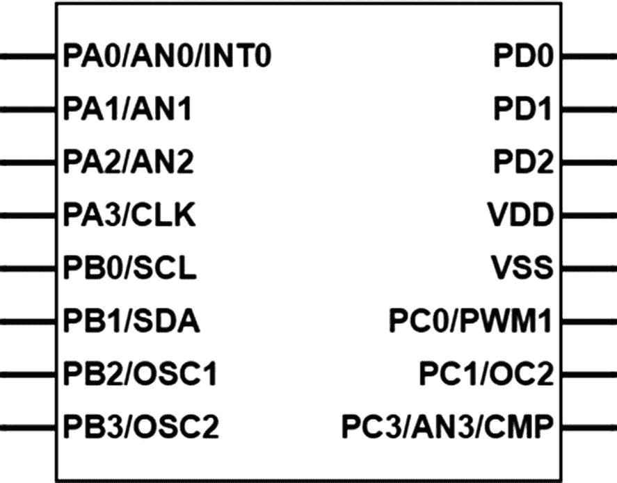
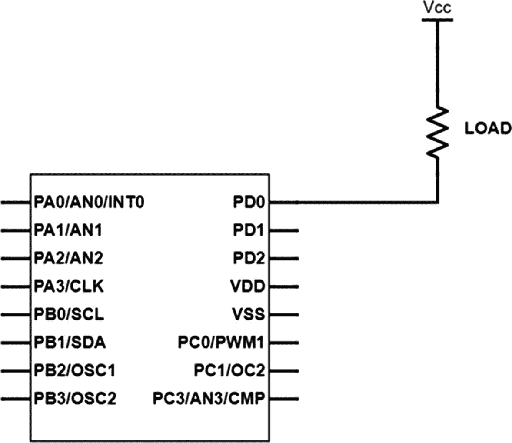
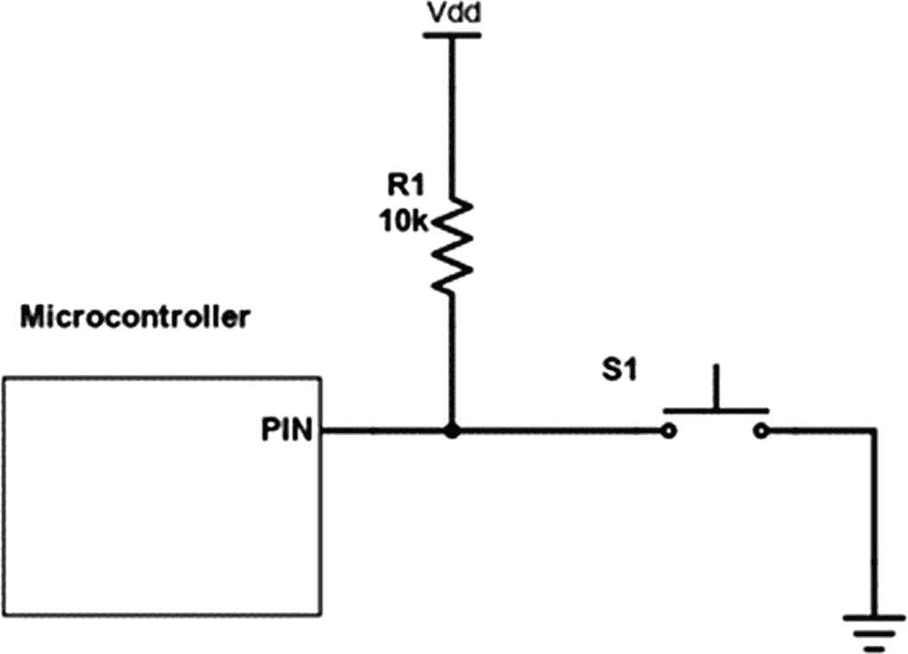
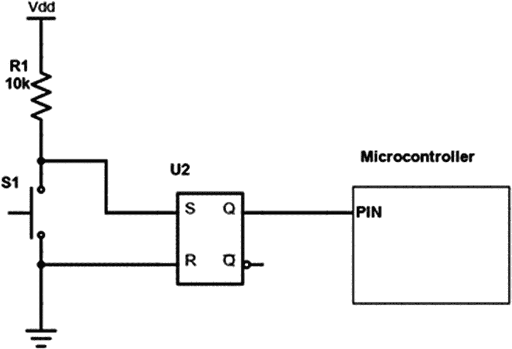
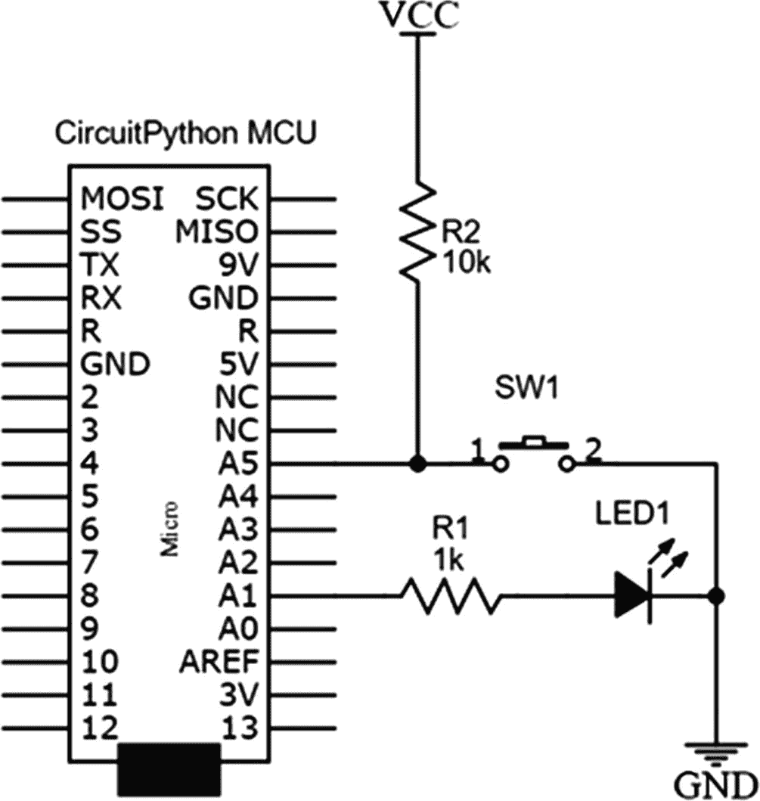
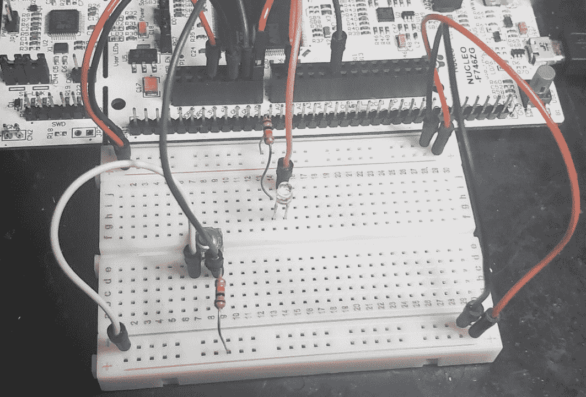
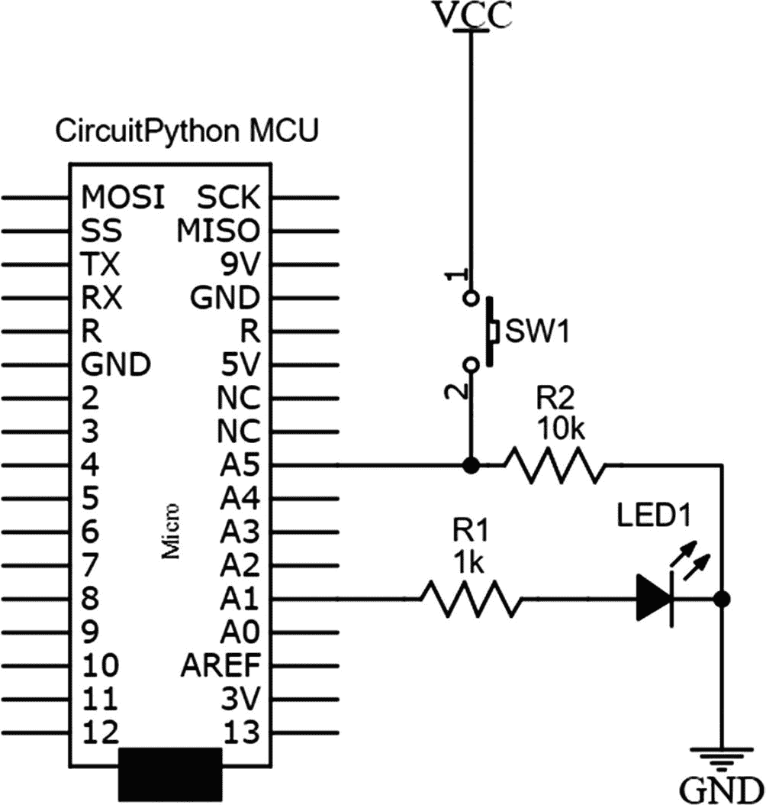

# 五、数字控制

至此，我们已经了解了足够多的电子学、嵌入式系统架构和编程知识，可以开始使用物理微控制器器件了。现在，我们将学习毫无疑问的最重要的操作的基础:输入和输出。在每一个微控制器系统的核心，你至少会有一个输出被执行，许多系统也接受输入。

在本章中，您将开始了解如何控制和操作物理传感器和执行器。操纵物理 I/O 设备有一种满足感，这是在屏幕上推动像素无法比拟的。我希望这一章将向你介绍使用硬件的乐趣，并激起你进一步尝试微控制器开发的欲望。

## I/O 引脚

微控制器设备附有物理引脚。这些引脚有一个有价值的用途:它们允许微控制器设备与外界接口。正如我们之前所讨论的，微控制器系统通常接受某种输入，执行某种处理，然后提供一个输出来操作某种外部外设或设备。这是输入输出控制的前提。

一般来说，你可以从一个微控制器控制的输入和输出引脚的数量上了解它。微控制器上更多的引脚意味着设备通常会包含更多的外设和强大的 CPU 内核。微控制器通常至少有六个 I/O 引脚。有时，他们可以有数百个。

过去，微控制器通常采用 DIP 封装。在使用它之前，你需要将它连接到一个编程器上，并设置好正确的连接和电源配置。虽然这在专业环境中可能是好的，但对于制造商和刚刚开始使用微控制器的人来说，这太复杂了。开发板的出现简化了爱好者的过程。该板带有一个处于已知工作状态的微控制器，允许用户立即专注于构建电路和连接外部设备，并专注于编写软件。

## 微控制器硬件上的输出和输入

在底层硬件上，微控制器通常使用所谓的端口来执行输出。在其最简单的形式中，端口可以被认为是允许微控制器与外界接口的一组引脚。

端口通常排列成引脚组；典型地，大约 8 或 16 个引脚构成一个端口，并且这可以高达 32 个引脚。您可能想知道为什么我们首先需要在端口中分组微控制器引脚。你必须知道，在微控制器架构中，端口只不过是寄存器。因此，端口中的引脚数量与微控制器的架构之间存在一定的相关性。因此，8 位微控制器的端口通常有 8 个引脚，16 位微控制器的端口有 16 个引脚。然而，这并不是一成不变的；例如，您可能有一个 32 位微控制器，它的端口为 16 位宽(有 16 个引脚)，甚至一个端口只有 4 个引脚。作为微控制器设备的用户，您可以简单地将此视为制造商的设计决策。您还应该知道，由于端口是一个寄存器，该端口上的每个引脚都是寄存器中的一个位。端口有一个名称，如 PORTA 或 PORTB，每个端口内的引脚都有编号。假设我们有一个假设的微控制器，它有两个端口，PORTA 和 PORTB，如图 [5-1](#Fig1) 所示。



图 5-1

一个假想的有两个端口的微控制器

PORTA 上的所有引脚都被命名为“AX”，其中“X”是与该端口相关的一个位。例如，A1 引脚指 PORTA 的第一位。像“A1”这样的缩写名称便于识别和标记，当您为微控制器编写代码时，如果需要访问某个特定的引脚，它们也会有所帮助。

图 [5-1](#Fig1) 中 PORTB 上的引脚遵循与 PORTA 不同的命名惯例:“PBX”而非“BX”不同的制造商遵循不同的端口引脚命名惯例。有些人会用“A1”和“D1”这样的名字，而有些人会用“PA1”和“PD1”这样的名字只有命名约定发生了变化。针本身的工作方式是一样的。实际上，微控制器的管脚号从 0 开始是很常见的。因此，PORTA 中的第一个引脚通常被称为 A0 或 PA0。

为简单起见，微控制器上的每个引脚最好都有一个专用功能。例如，我们可以想象我们假设的设备上的 PORTA 是一个输出端口，这意味着端口上的引脚只能将数据带出微控制器。类似地，我们可以想象 PORTB 是一个仅输入端口，只能接受来自外部世界的数据和进入微控制器的数据。

然而，如果我们有一个微控制器必须与许多输出设备接口的应用，比如控制 15 盏灯，会发生什么呢？或者我们可以让微控制器控制一个有 12 个输入的键盘？在这两种情况下，如果引脚仅用于一个目的，我们可用于输入或输出的引脚数量将会受到限制。因此，通常根据电路设计者的判断将微控制器上的引脚配置为输入或输出。

为此，微控制器内部必须有某种机制，允许端口上的引脚用作输入或输出。因此，在许多微控制器中，通常有一个寄存器可以控制数据进出引脚的方向。该寄存器通过软件编程，并由微控制器编程器控制。

当以这种方式使用时，端口可以简单地配置为输入或输出，端口引脚处于数字状态。当处于数字状态时，引脚可以多种方式配置；通常，我们说它有三种状态。作为输出，它可以配置为输出高电平，此时引脚为输出，向负载提供电流。该引脚也可以是输出低电平，此时该引脚仍配置为输出引脚，但不向负载提供电流。该引脚也可以配置为输入。

不仅可以控制引脚方向的内部电路很常见，而且很多时候微控制器还有其他内部外设和模块也依赖这些引脚来执行输入和输出功能。这些包括像串行接口，使用内部定时器或模拟功能。这些被称为引脚的替代功能，因制造商而异。

这是必要的，因为虽然大多数微控制器包括许多功能和板载外设，但大多数应用在任何时候都只需要使用其中的一两个外设。因此，为了确保微控制器上的每个外设都不需要引脚，这种内部电路将确保板载功能可以在有限的 I/O 引脚之间共享(还记得我们之前谈到的多路复用器吗？这是微控制器内设备的应用)。因此，通常会看到微控制器更像图 [5-2](#Fig2) 中的图。



图 5-2

更现实的微控制器

图 [5-2](#Fig2) 中的微控制器更准确地描述了微控制器的样子，考虑到大多数引脚都包含替代功能。如您所见，有多个端口:PORTA、PORTB、PORTC 和 PORTD。这些端口中的每一个都有各种功能的引脚。所有微控制器上的 VDD 引脚和 VSS 引脚都不与任何 I/O 端口相关联，因为它们为器件供电。一个有经验的设计师将能够看到一个类似的图表，并意识到哪些引脚用于何种目的。例如，我们知道引脚 PA0 最有可能用于数字输入和输出。然而，标签 AN0 也贴在销上。这意味着该引脚也可以用于模拟输入功能。第三个标签 INT0 表示我们也可以将该引脚用于外部中断功能。

随着您获得更多设计经验并更加熟悉不同的微控制器系列，您将能够查看电路图上的端口，并知道哪些引脚具有哪些替代功能。即使有这样的经验，你也不能总是说出一枚别针的用途。例如，看看针 PC3。得益于替代的 AN3 标签，你可能认为它可以用于数字和模拟功能，但 CMP 标签是什么意思呢？这些问题最好通过您所用器件的数据手册来回答。例如，数据手册可能会显示此引脚仅用于输入，不能用于任何数字输出功能。请务必准备一份器件数据手册，以回答此类问题。

## 深入了解微控制器 I/O

您可能想知道微控制器如何使用引脚执行输入和输出。虽然其工作原理背后的数字电子器件可能会变得非常复杂，但我们可以通过一些基本的电路结构来了解最底层发生了什么。

对于输出引脚，参见图 [5-3](#Fig3) 中的电路图。


图 5-3

MCU 输出电路

在这种情况下，我们有一个触发器或其他受 CPU 控制的锁存电路。你还记得我们谈过人字拖吗？这是触发器在微控制器中的一个应用。记得我们说过触发器一次只能存储一位数据。嗯，当我们的引脚设置为输出时，我们可以输出高值(逻辑 1)或输出低值(逻辑 0)。触发器用于存储我们想要的位(高或低)。锁存电路的输出通过缓冲器。该缓冲电路允许更大的驱动强度，并为微控制器内部器件提供更好的保护，防止器件外部的电气干扰。这里也没有显示保护二极管，它们与缓冲器一起保护微控制器。然后，缓冲电路的输出连接到微控制器上的物理引脚。

同样，我们可以通过查看图 [5-4](#Fig4) 中的电路图来了解微控制器上的输入是如何工作的。


图 5-4

MCU 输入电路

这种情况下，该引脚连接到具有使能功能的缓冲器。当 CPU 操纵缓冲器的使能引脚时(当然，这是基于程序代码中的指令)，可以读取引脚的电压电平，然后 CPU 可以将该信息用于任何目的。

当然，在真实的 MCU 中，电路可能会比这更复杂，因为微控制器上的引脚必须同时充当输入和输出。这称为双向控制，它允许微控制器使用单个引脚进行输入和输出。

当使用微控制器 I/O 引脚时，我们对输入和输出电路的观察使我们想到了另一个考虑因素:微控制器端口的吸电流或源电流能力。源电流是指微控制器向负载提供电流的能力。也就是说，电流将从微控制器引脚流过负载，然后流向地。图 [5-5](#Fig5) 描绘了源电流的样子。


图 5-5

MCU 源电流

微控制器 I/O 引脚也可以吸收电流。这种情况下，电流从电源流出，经过负载，流入 I/O 引脚。图 [5-6](#Fig6) 显示了吸电流的样子。



图 5-6

MCU 吸电流

## 使用输出:点亮 LED

现在我们对微控制器端口有了一些了解，我们可以看看如何使用输出来执行功能:在本例中，点亮 LED。很像打印“你好，世界！”是学习新编码语言的传统第一步，操作 LED 是使用新微控制器的传统第一步。它允许您验证您有一个工作程序，并且您的所有连接都是准确的。在本节中，我们将探讨如何构建一个物理电路来连接微控制器和 LED。然后我们将介绍如何使用 CircuitPython 来控制微控制器的输出并使 LED 亮起。

### LED 控制

回想一下第 [2](02.html) 章，led 是一种特殊的二极管，当电流通过时会发光。为了驱动 LED，你需要电压流入 LED。虽然微控制器可以向 LED 提供稳定的电压，但也必须调节电流以避免损坏它，因为 LED 具有最大额定电流，您不得超过该电流。要调节流经 LED 的电流，可以使用一个电阻。

使用 LED 还会产生电压降。例如，典型的红色 LED 将下降大约 2 伏。然而，不同的 LED 颜色会降低不同的电压，并且电压降也会因制造商而异。最好查阅所用器件的数据手册，了解 LED 的具体规格。

知道了电压降，就可以计算出流经 LED 的输出电流。如果微控制器输出 5 伏电压，那么 LED 产生 2 伏电压降，串联电阻上的电压将为 3 伏。如果您希望流经 LED 的最大电流为 10 mA(您可以在数据手册中找到实际数字)，那么您可以使用欧姆定律来计算所需的电阻。

用欧姆定律，电压除以电流。这将是 3 V / 0.01 A，产生 300 欧姆，这是保护 LED 所需的最小电阻。在这种情况下，470 欧姆的电阻是一个不错的选择。请记住，每个电阻都有一个容差水平，可以使实际电阻值小于预期值，因此使用您计算的精确电阻值是有风险的。如果你想接近最大亮度，那么 330 欧姆的电阻就足够了。

### 构建电路

完成计算后，您就可以设计一个电路，让微控制器控制一个 LED。该电路将类似于图 [5-7](#Fig7) 所示的原理图。


图 5-7

MCU 电路 LED

我们还使用一个 1k 电阻来限制从器件流出的电流量；请记住，使用较高阻值的电阻没有问题，如果您想要更高的电源效率，这是可取的，因为较高的电阻会消耗较少的电流。

您可以按照以下步骤来设置这个简单的电路。确保在给设备加电之前连接好电路。

1.  将微控制器连接到电源，确保微控制器正常供电；如果您使用的是开发板，那么您的 USB 连接将足以为设备供电。如果您希望连接外部电源，请将电源的 Vout 连接到主板的 Vin 输入端(电源输出电压的值通常为 7.5 至 12；这取决于您使用的电路板，因此请务必查阅电路板的用户手册以了解输入电压范围)，并将地连接到微控制器电路板的接地引脚。

2.  将一根跳线从微控制器上的 A1 引脚连接到试验板原型制作区域的一个插座上。

3.  将电阻的一根引线连接到步骤 2 中使用的试验板同一行中的另一个插座。

4.  将电阻的另一端连接到试验板另一排的插座上。

5.  将 LED 的长引线连接到步骤 4 中使用的试验板同一行中的另一个插座。

6.  将 LED 的短引线连接到试验板另一排的插座上。

7.  将跳线连接到步骤 6 中使用的试验板同一行中的不同插座。

8.  将跨接导线的另一端接地。

当你完成连接电路时，它看起来应该类似于图 [5-8](#Fig8) 。


图 5-8

试验板上的 MCU LED 电路

### 用 CircuitPython 点亮 LED

既然我们已经介绍了构建物理 LED 电路，我们可以看看如何使用 CircuitPython 来控制 LED。我们将要编写的程序将打开 LED。打开 Mu 编辑器，将程序输入到您的“code.py”文件中，如清单 [5-1](#PC1) 所示。

```py
# import pin constants for board we are using
1 import board

# import pin control
2 import digitalio

# create object for pin we are using
3 led = digitalio.DigitalInOut(board.A1)

# set the pin to output
4 led.direction = digitalio.Direction.OUTPUT

# turn the LED on
5 while True:
    led.value = True

Listing 5-1Controlling the LED

```

在这段代码中，我们做的第一件事是导入控制电路板所需的 CircuitPython 库。CircuitPython 提供了许多库来执行数字 I/O。在 **1** ，我们导入了`board`模块，该模块包含所用电路板的引脚常数。导入该模块后，我们可以通过名称来引用管脚，例如，`A1`。在 **2** ，我们导入`digitalio`模块。它包含了所有的类，这些类提供了对我们将要使用的输入和输出函数的访问。此外，该模块允许我们设置引脚方向，以确定我们是将数据读入引脚还是将数据写入引脚。

导入必要的库后，在 **3** 我们创建一个正在使用的 pin 对象的实例。这个实例在内存中有自己的位置，这样做允许我们访问我们导入的“digitalio”模块中存在的所有方法。这是普通的 Python 语法，向我们展示了我们常规的 Python 能力可以在 CircuitPython 程序中使用。然后，我们使用该实例来设置 LED 在 **4** 处的方向。在这种情况下，我们将方向设置为输出。

至此，一切都设置好了，所以我们现在可以打开 LED 了。在 **5** ，我们创建了一个在嵌入式系统世界中通常被称为超级循环的东西。任何属于`while True`语句的指令都将被反复执行，直到程序被告知停止。在这种情况下，我们将`led`对象的`value`设置为`True`，这意味着 LED 将会亮起。

我们使用超级循环是因为没有操作系统为我们做任何控制。`while True`线确保我们一遍又一遍地执行我们的 LED on 行动。如果你省略了这一行，那么 LED 将在短时间内点亮一次(短到我们看不见)。几乎所有你为你的微控制器编写的程序都会包含这样一个超级循环。

点击管理部门编辑器中的**保存**按钮；这应该会将更改保存到“code.py”文件中，您将会看到连接到引脚 A1 的 LED 已经亮起。既然您已经成功控制了数字输出，请随意尝试一下。你能让 LED 受 A0 脚控制吗？还是 pin A2？要做到这一点，您只需将您的电路重新连接到不同的引脚，并在我们创建引脚对象时更改引脚号。

如果你的电路不工作，确保并测试你的连接；我的意思是确保你的电线被正确地插入指定的孔中。检查，检查，再检查。

## LED 闪烁

打开 LED 灯很有趣，但有点无聊。如果我们使用电阻将 LED 直接连接到电源，我们会有相同的效果。智能控制的妙处在于我们可以智能地做事。

例如，您可以对您的微控制器进行编程，使其不仅开启 LED，还能以您选择的时间间隔开启 LED。这个程序可以让你验证你的时钟设置是否正确，因为你可以看到 LED 闪烁的频率。如果 LED 以不正确的频率闪烁，您需要确保选择了正确的主板，或者可能需要检查您的 USB 和电路连接。您已经建立了物理电路。您所需要做的就是用几行代码更新您的代码。您可以使用清单 [5-2](#PC2) 中给出的程序。

```py
# import pin constants for board we are using
import board

# import pin control
import digitalio

1 # import time library
import time

# create object for pin we are using
led = digitalio.DigitalInOut(board.A1)

# set the pin to output
led.direction = digitalio.Direction.OUTPUT

# super loop
while True:
    # turn the LED on
  2 led.value = True

    # sleep for a second
  3 time.sleep(1)

    # turn the LED off
  4 led.value = False

    # sleep for a second
  5 time.sleep(1)

Listing 5-2Blinking the LED

```

在这个程序中，除了导入`board`和`digitalio`模块，正如我们在清单 [5-1](#PC1) 中所做的，我们还在 **1** 导入了`time`库。该库包含允许微控制器遵循时间相关指令的函数。特别是，我们将使用`time`库的`sleep`方法。它告诉微控制器等待一定的时间，以秒为单位。

在启动了清单 [5-1](#PC1) 中的`led` pin 对象后，我们进入一个带有`while True`语句的超级循环，就像之前一样。这一次，循环包含了更多的指令。在 **2** ，我们打开 LED，就像清单 [5-1](#PC1) 中一样。在 **3** ，我们通过在`sleep`方法中传递 1 秒的值来告诉微控制器等待。在 **4** ，我们通过将`led`对象的`value`设置为`False`来关闭 LED。然后我们在 **5** 再次使用`sleep`再延迟一秒钟，然后重新开始循环。

点击 Mu 编辑器中的“Save”按钮，您将观察到连接到引脚 A1 的 LED 每秒闪烁一次。如果您想让 LED 闪烁得更快，您可以向`sleep`方法传递一个更小的值，比如 0.5 秒。如果您希望 LED 运行得更慢，您可以使用更长的值，如 2 秒。

## 使用输入:添加按钮

下次我们与我们的评估板合作时，我们将关注数字输入。为此，我们将在电路中添加一个按钮。在微控制器上，输入是输出的补充，它们共同构成了两个最基本的微控制器操作。如果使用 LED 就像嵌入式开发中的“Hello World”允许你在屏幕上打印一些东西，那么阅读按钮就相当于学习从键盘上阅读输入。我们的输入项目将读取一个引脚上按钮的状态，然后根据读取的状态，我们将切换连接到另一个 I/O 引脚的 LED。

### 上拉电阻与下拉电阻

在我们开始构建电路之前，需要注意的是，按钮与微控制器引脚有不同的连接方式。可以使用上拉或下拉电路配置来实现。上拉配置的原理图如图 [5-9](#Fig9) 所示。



图 5-9

上拉配置

在上拉配置中，我们使用一个高阻值电阻(通常在 4.7 到 10k 之间)将按钮的一端拉至 VDD(也就是说，通过电阻将 I/O 引脚连接至 VDD)。该电阻器确保当按钮被按下时，电路中几乎没有电流流出。

图 [5-10](#Fig10) 显示了下拉配置中按钮的示意图。


图 5-10

下拉配置

上拉电阻将引脚上拉至高值，而下拉电阻将引脚下拉至逻辑低值，也就是说，我们通过该电阻将 I/O 引脚接地。要在下拉配置中连接开关，开关必须置于电源电压和微控制器引脚之间。

使用上拉配置时，电路将为低电平有效，而使用下拉配置时，电路将为高电平有效。一般来说，您将使用带有上拉电阻的按钮，大多数微控制器在其引脚上提供上拉电阻。然而，这两种配置都可以工作。根据您的电路应用，这种或那种方法可能更好。

在这一部分的后面，我们将讨论如何使用具有上拉和下拉电路配置的微控制器。不过，对于本书中的其它电路，我将只使用上拉配置。如果您愿意，可以按照如下所示的下拉模型修改本书中的任何电路，以使用下拉配置，而不会对电路工作产生任何不利影响。

### 开关去抖

使用一种开关时，处理微控制器输入时需要考虑的另一个方面是开关去抖。没有一个设备是完美的，一个设备的活动部件越多，与之相关的问题就越多。当机械按钮开关必须连接到微控制器电路时，也是如此。

由于其结构，当您按下按钮开关时，微控制器可能会记录开关的多次按下。这种效果类似于你丢球时发生的情况。球不会立即停下来，而是弹起一段时间。同样，当你按下一个开关时，它没有一个固定的闭合。当开关闭合时，会发生一系列的打开和闭合。

由于这种反弹效应，微控制器有可能会在开关应该闭合时将其记录为断开。为了解决这个问题，您可以实施一种称为开关去抖的技术。这可以使用硬件或软件来完成。

对于硬件去抖，我们可以使用触发器(latch)，如图 [5-11](#Fig11) 所示。触发器的作用相当于一个去抖开关，因为一旦 Q 被输入设置为高电平状态，Q 的输出端将不再发生变化，只要状态发生变化，触发器就会锁存输入值。还有其他硬件去抖方法，例如使用施密特触发器；然而，触发器方法简单而有效。



图 5-11

触发器去反跳

除了添加硬件，您还可以在代码中构建一个去抖动效果。有几种软件去抖方法，包括使用计数器和软件移位寄存器。在本节的后面，我们将使用一个简单的软件延迟来使按钮开关去抖。

### 带 MCU 原理图的输入(上拉)

我们可以通过构建如图 [5-12](#Fig12) 所示的程序来构建一个简单的按钮电路。在本电路中，我们使用上拉配置的开关。



图 5-12

带上拉开关的 MCU

## 按钮上拉电路连接提示

这个电路很简单，很难搞砸。如果您的电路不工作，请确保并测试您的连接。检查，检查，再检查。确保在给设备加电之前连接好电路。

以下是连接电路的推荐步骤:

1.  按照示意图，按照我们在上一节中所做的那样连接 LED。为方便起见，您可能需要将一根跳线从开发板上的 3.3v 电压输出插座连接到正极供电轨，另一根跳线从接地连接连接到接地供电轨。为了简化布局并更好地利用电路板，可以将两个正供电轨和两个负供电轨连接在一起。

2.  将开关放置在电路板中央的凹槽上，确保开关两侧的两个引脚都插入到试验板原型制作区域的插孔中。

3.  将开关的一端连接到同一插座中电阻的一端，将电阻的另一端连接到正极供电轨。不需要使用跳线，因为电阻器可以直接连接到 LED。

4.  使用跨接导线将开关的另一端接地。

5.  从开关和电阻器之间的交叉点连接一根跳线，连接到 MCU 上的 A5 引脚。为此，确保开关引线、电阻器引线和跨接导线都在同一插孔内。

当你完成连接电路时，它应该看起来如图 [5-13](#Fig13) 所示。



图 5-13

试验板上的 MCU 上拉电路

### 用 CircuitPython 程序上拉按钮

连接好电路后，我们可以编写一个程序，让 MCU 在上拉电路配置中使用按钮。编辑 code.py 文件，使其类似于清单 [5-3](#PC3) 。

```py
# import pin constants for board we are using
import board

# import pin control
import digitalio

# import time library
import time

# create object for LED we are using
1 led = digitalio.DigitalInOut(board.A1)

# create object for the switch we are using
            switch = digitalio.DigitalInOut(board.A5)

# set the LED to output
led.direction = digitalio.Direction.OUTPUT

# set the switch to input
            switch.direction = digitalio.Direction.INPUT

# super loop
2 while True:
       # if our pin goes low
         if switch.value == False:
       # wait 100 ms to see if switch is still on
               3 time.sleep(0.1)

        # if the switch is still on
          4 if switch.value == False:
            # turn the LED on 5
             led.value = True

    else:
        # turn the LED off 6
        led.value = False

Listing 5-3Reading a Pushbutton with MCU Pull-Up

```

保存文件，观察会发生什么。当您按下按钮时，LED 将亮起，当您松开按钮时，LED 将停止亮起。

你知道这里发生了什么吗？让我们看一下这个程序。我们做我们通常的导入，并为我们在 **1** 使用的 LED 和开关设置对象。一旦我们有了这些设置，在 **1** 之后，我们将 LED 的方向设置为输出，将开关的方向设置为输入。我们的超级循环就是一切发生的地方。

在 **2** 的超级循环中，我们使用条件 if/else 语句来测试我们的程序，看看按钮是否被按下。如果按钮被按下，那么我们在 **3** 等待 100 毫秒。如果 100 毫秒过去后，按钮在 **4** 仍被按下，那么我们在 **5** 打开 LED。为了完成这个任务，我们使用一个嵌套的 if 语句。检查按钮，等待，然后再次检查按钮，这就是我们所说的开关去抖。在 **6** ，我们关闭 LED，这是程序的默认状态。

当我们看条件，我们看到，如果按钮是低，然后我们打开 LED。如果您对此感到困惑，请记住，上拉电阻会将引脚设置为默认高电平状态，因此我们的 MCU 会不断读取引脚上的高电平状态。本质上，由于我们有一个连接到引脚的上拉电阻，因此引脚将保持高电平，直到 3.3 伏的 VCC。当我们按下按钮时，针脚会被拉低至地面。我们也可以在下拉状态下使用按钮，我们将在下一节学习。

### 带 MCU 原理图的输入(下拉)

我们可以通过构建如图 [5-14](#Fig14) 所示的程序来构建一个简单的按钮电路。在本电路中，我们使用下拉配置的开关。



图 5-14

带下拉开关的 MCU

### 按钮下拉电路连接提示

如果您的电路不工作，请确保并测试您的连接。检查，检查，再检查。确保在给设备加电之前连接好电路。

以下是连接电路的推荐步骤:

1.  按照我们在上一节中所做的那样连接 LED。为方便起见，您可能需要将一根跳线从开发板上的 3.3v 电压输出插座连接到正极供电轨，另一根跳线从接地连接连接到接地供电轨。为了简化布局并更好地利用电路板，可以将两个正供电轨和两个负供电轨连接在一起。

2.  将开关放置在电路板中央的凹槽上，确保开关两侧的两个引脚都插入到试验板原型制作区域的插孔中。

3.  将开关的一端连接到电阻器的一端，确保它们在试验板上的同一个插座中，并将电阻器的另一端连接到接地轨；这里不需要使用跳线，因为电阻足够长。

4.  使用跨接线将开关的另一端连接到正极供电轨。

5.  从开关和电阻器之间的交叉点连接一根跳线，连接到 MCU 上的 A5 引脚。

当你完成连接电路时，它应该看起来如图 [5-15](#Fig15) 所示。


图 5-15

试验板上的 MCU 下拉电路

### 用 CircuitPython 程序进行按钮下拉

连接好电路后，我们可以编写一个程序，让 MCU 在上拉电路配置中使用按钮。一旦你完成了你的电路，你就可以连接你的电路板并编辑 code.py 文件，使其类似于清单 [5-4](#PC4) 。

```py
# import pin constants for board we are using
import board

# import pin control
import digitalio

# import time library
import time

# create object for LED we are using
led = digitalio.DigitalInOut(board.A1)

# create object for the switch we are using
switch = digitalio.DigitalInOut(board.A5)

# set the LED to output
led.direction = digitalio.Direction.OUTPUT

# set the switch to input
switch.direction = digitalio.Direction.INPUT

# super loop
while True:
    # if our pin goes high
   1 if switch.value == True:
        # wait 100 ms to see if switch is still on
   2    time.sleep(0.1)

        # if the switch is still on
   3if switch.value == True:
            # turn the LED on
            4led.value = True

    else:
        # turn the LED off
        led.value = False

Listing 5-4Reading a Pushbutton with MCU Pull-Down

```

保存文件，观察会发生什么。您将获得与使用连接有按钮的 MCU 作为上拉电阻时相同的效果。当您按下按钮时，LED 将亮起，当您松开按钮时，LED 将停止亮起。

您将看到的唯一变化是检查按钮的条件语句。当我们在 **1** 处查看条件时，我们看到如果按钮为高，我们在 **2** 处等待 100 毫秒，然后在 **3** 处，一旦开关仍被按下，然后在 **4** 处，我们打开 LED。我们必须记住，由于我们有一个下拉电阻连接到引脚，因此引脚将保持低电平至地。当我们按下按钮时，插脚将从电源获得电流。

您可以尝试使用不同的引脚来连接按钮。不要害怕实验，不断尝试新事物。记住这是你学习的唯一途径；尝试交换引脚，尝试将您的“真”条件更改为假，并观察它将产生的效果(LED 将一直亮着，直到您按下按钮，然后它将熄灭)。这就是你学习如何使用你的微控制器所需要做的。

## 结论

在本章中，我们讨论了许多与微控制器的输入和输出相关的信息。我们学习了微控制器端口以及如何将它们用作输入和输出。我们讨论了如何使用输出来控制 led，以及如何使用输入来控制上拉和下拉状态下的按钮。下一章，我们将扩展到数字信号之外，看看如何执行模拟输入和输出，并利用它与模拟器件接口。