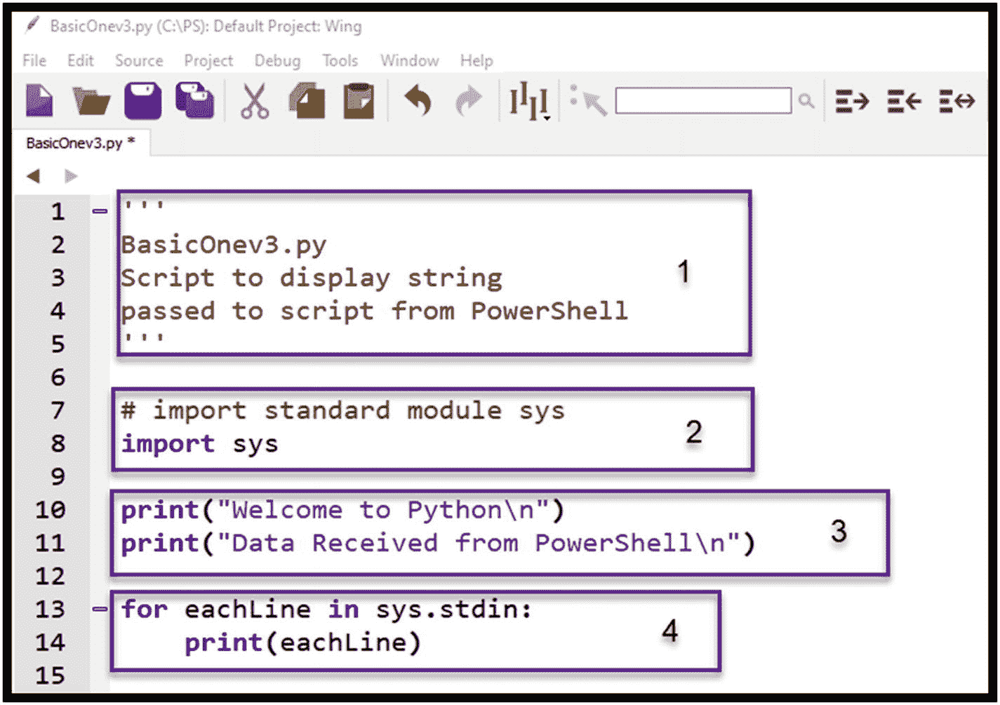
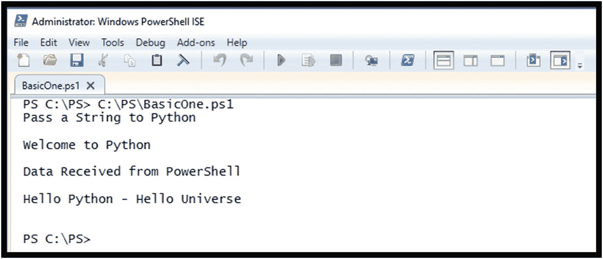
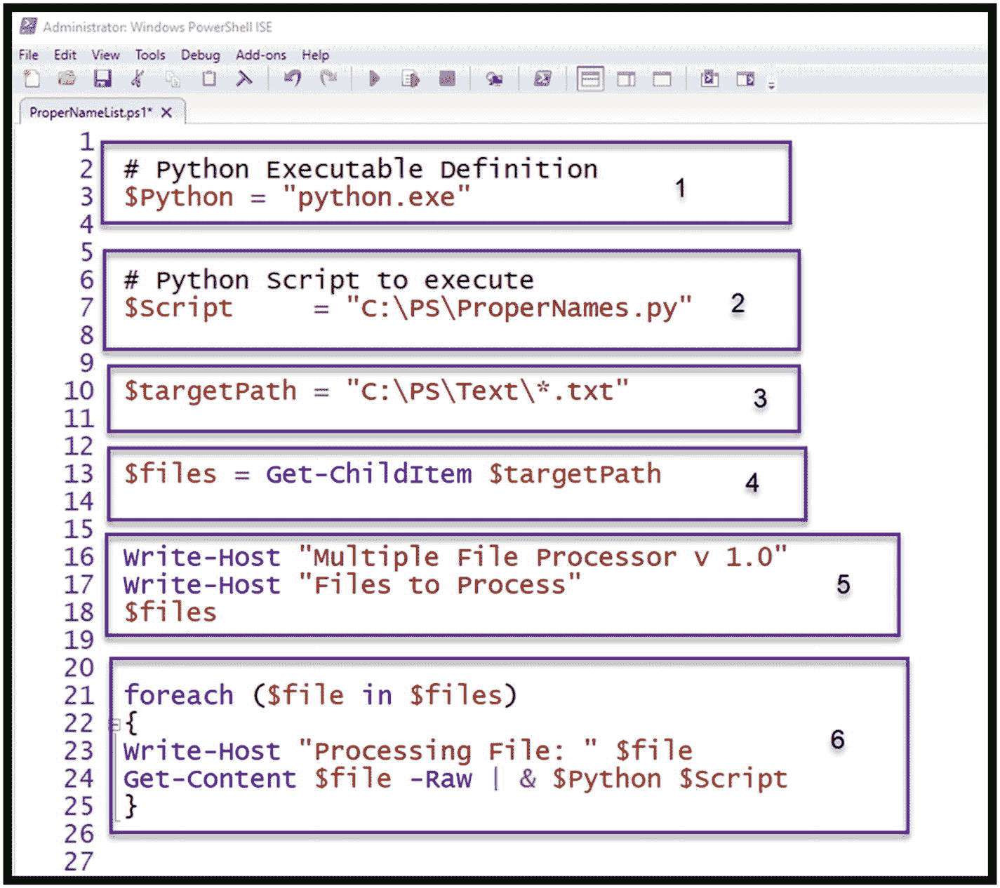
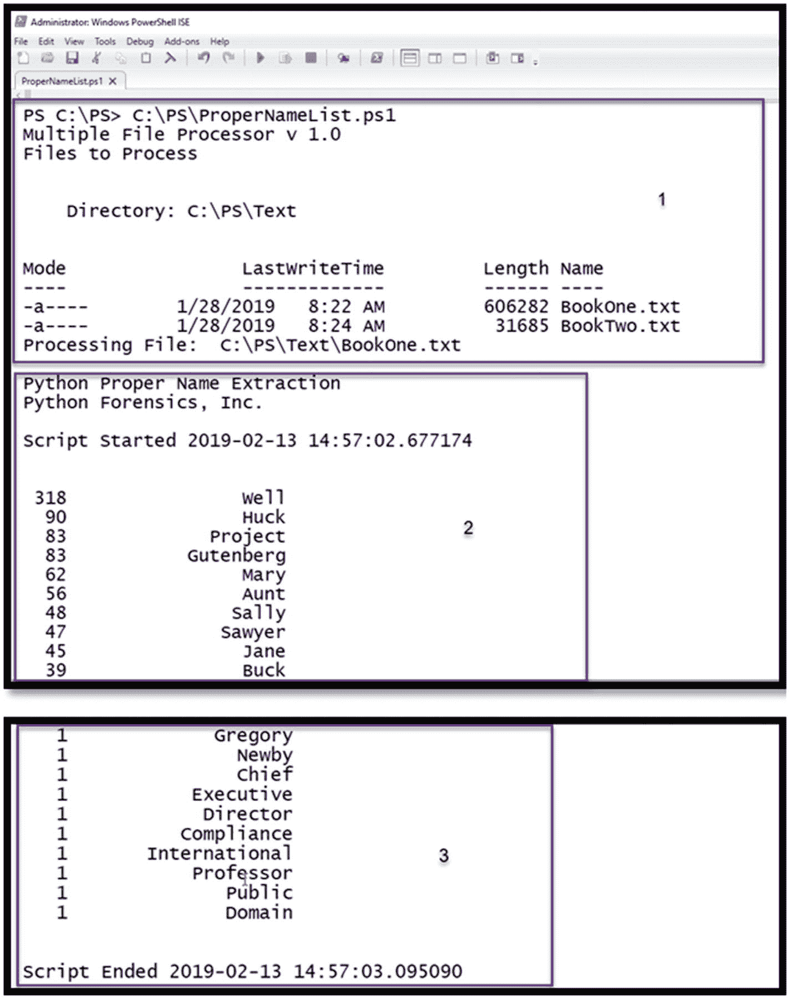
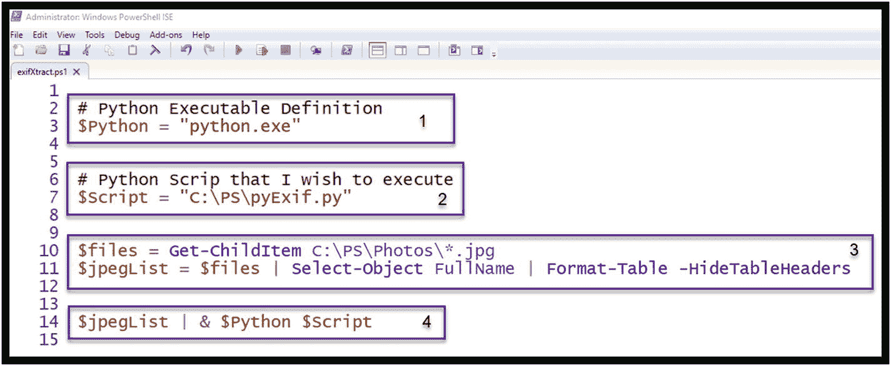
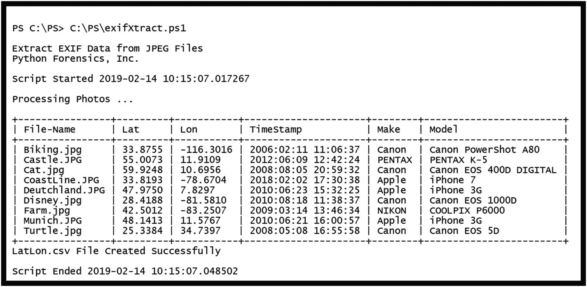

# 六、从 PowerShell 启动 Python

到目前为止，集成 Python 和 PowerShell 的方法一直是将 PowerShell 脚本作为子流程从 Python 中启动。在本章中，角色将被颠倒，PowerShell 将向 Python 脚本提供数据。PowerShell 的关键元素之一是将一个 CmdLet 的结果传输到下一个 CmdLet 的过程流水线化。考虑到这一点，为什么不把 Python 当作另一个管道元素，并执行由 PowerShell 获取的数据驱动的 Python 脚本呢？

## 从 PowerShell 到 Python 的角色互换

PowerShell 脚本和 Python 脚本都是演示这种方法所必需的。我们将从一个简单的 PowerShell 脚本开始，通过管道传递一串数据，并显示来自 Python 脚本的数据。

### 检查 PowerShell 脚本

让我们检查一下图 [6-1](#Fig1) 中显示的 PowerShell 脚本的细节。该脚本分为四个简单的步骤:

1.  使用您选择的 Python 可执行文件的完整路径定义一个局部变量$Python。对于这个例子，将再次使用 Python 3.x。

2.  定义一个局部变量$Script，该变量定义将要执行的 Python 脚本的完整路径。

3.  定义一个局部变量$Message，该变量将通过管道传递给 Python 脚本。

4.  这一行将变量消息的内容传递给 Python 脚本。这里的关键元素是指示 PowerShell 启动外部程序的&符号。


图 6-1

BasicOne.ps1 PowerShell 脚本

### 检查相应的 Python 脚本

检查图 [6-2](#Fig2) 中显示的相应 Python 脚本，我们看到它也被分成四个部分:

1.  定义脚本将执行的内容的注释块。

2.  Python 标准库 sys 的导入。这是处理通过管道传递的数据所需要的。

3.  打印 Python 发送的消息，以证明 Python 脚本正在执行。

4.  处理通过管道传递给脚本的每一行，并打印每一行的内容。请注意，在这个示例中，只传递了一行。



图 6-2

BasicOne.py Python 脚本

### 执行 PowerShell 到 Python 的组合脚本

图 [6-3](#Fig3) 描绘了 PowerShell 脚本驱动 Python 脚本所生成的结果输出。您会注意到 PowerShell 脚本(write-host CmdLet)和 Python (print)语句的输出都出现在 PowerShell 输出中。



图 6-3

执行 BasicOne.ps1 驱动 BasicOne.py

使用这种方法，现在让我们检查一下这里显示的 BasicOne 方法的一个更有趣的用法。

## 从文本文档中提取可能的专有名词

在此示例中，PowerShell 脚本将利用 Get-ChildItem CmdLet 和 Get-Content CmdLet 来获取文本文件的内容，并将全部内容传递给 Python 脚本。Python 脚本将处理传递的内容，再次使用 BasicOne 方法并尝试提取可能的专有名称。

当在法庭调查期间检查简单的文本数据时，按照出现次数最多来提取和排列专有名称通常是有用的。Python 语言具有内置的功能，可以快速轻松地执行这种提取。

### 但是首先，什么是合适的名字？

语言学将专有名词定义为代表一个人、一个地方、一个团体、一个组织或一件事物的单词，通常以大写字母开头。例如，单个单词中的专有名称(如 David、Smith、Carol、Washington、Canada、Pentagon、Congress 或 Apple)可以为调查提供上下文和价值。在正常的文本中，这些专有名词*很可能是*大写，并且很容易剥离、识别、计数和排序。应该注意的是，不是每个人都会习惯性地大写专有名词；然而，智能手机、短信应用程序、电子邮件程序、文字处理软件，甚至 Skype 聊天窗口都会自动为我们利用这些信息。因此，对它们进行提取和排序可以提供快速浏览，并为调查提供视角。

### 检查 PowerShell 脚本

图 [6-4](#Fig4) 显示了 PowerShell 脚本，该脚本将这些文件的内容交付给更复杂的 Python 脚本，该脚本将执行可能的专有名称的提取和排序。注意，对于这个例子，已经添加了一个新元素来允许处理多个文件。



图 6-4

PowerShell 属性名脚本

这个剧本被分成了六个步骤。这里定义了每个步骤:

1.  使用您选择的 Python 可执行文件的完整路径定义一个局部变量$Python。

2.  定义一个局部变量$Script，它标识将要执行的 Python 脚本的完整路径。

3.  定义一个局部变量$targetPath，它标识要处理的目标路径和文件类型。

4.  利用 Get-ChildItem CmdLet 获取与提供的扩展名匹配的文件名。

5.  将包含 Get-ChildItem CmdLet 发现的文件列表的信息写入主机。

6.  使用 ForEach 循环，处理局部变量$files 中列出的每个文件。在循环中，脚本打印出每个文件的名称，然后提取文件的原始内容，并将结果内容传输到 Python 脚本。

### 检查相应的 Python 属性名脚本

清单 [6-1](#PC1) 中显示的 Python 脚本被分成六个主要部分，如下所述:

1.  库导入

2.  停用字词列表定义

3.  定义伪常数

4.  提取专有名称

5.  主程序入口

6.  打印可能的专有名称

**库导入**:顾名思义，这是加载所需 Python 库的地方。它们包括:

*   sys:如 BasicOne 所示，这个库允许我们处理 PowerShell 提供的命令行输入。

*   关于:Python 正则表达式库在这个脚本中用于从文本中去除无关字符，以简化对专有名称的搜索。

*   datetime:顾名思义，这个库提供了显示和计算时间和日期细节的方法。

**停用词列表定义:**此部分创建停用词列表，用于在脚本中删除在评估专有名称时不提供证明价值的词。事实上，它们是通常以大写字母开头的单词。因此，从结果中消除这些单词会产生更好的结果。

**定义伪常量:**传统的常量在 Python 语言中并不存在，然而，通过将这些变量大写来提醒读者这些变量不应该被改变。在这种情况下，变量 MIN_SIZE 和 MAX_SIZE 定义了可能的专有名称的限制。通过更改这些值，您可以扩大或缩小可能的专有名称的范围。

**提取专有名称函数:**这是脚本的核心函数，用于处理从 PowerShell 脚本传输的内容。从标准输入处理的每一行都将调用该函数。该函数从字符串输入中提取可能的专有名称，并将它们添加到字典中。如果该名称已经存在于字典中，则该函数更新字典值，该字典值包含该特定的可能专有名称的出现。

**主程序入口** **:** 主程序首先打印几条标题信息。然后创建一个空的 properNamesDictionary。然后，与 BasicOne.py 示例一样，该脚本处理 PowerShell 脚本提供的系统标准输入中的每一行。然后使用正则表达式转换每一行，以消除任何非字母字符。每个转换后的字符串都被传递给 ExtractProperNames 函数和当前的 properNamesDictionary。然后对提供给脚本的每一行重复这个过程。

**打印结果可能的专有名称:**最后一部分按照出现次数对结果字典进行排序(最高的第一个)，然后打印出每个专有名称和相关的计数。

```py
'''
Copyright (c) 2019 Python Forensics and Chet Hosmer

Permission is hereby granted, free of charge, to any person obtaining a copy of this softwareand associated documentation files (the "Software"), to deal in the Software without restriction, including without limitation the rights to use, copy, modify, merge, publish, distribute, sublicense, and/or sell copies of the Software, and to permit persons to whom the Software is furnished to do so, subject to the following conditions:

The above copyright notice and this permission notice shall be included in all copies or substantial
portions of the Software.

 ProperNames Demonstration
 Version 1.3
 January 2019

 Requirement: Python 3.x

 usage:
 stdin | python properNames.py

 Script will process the piped data

'''

''' LIBRARY IMPORT SECTION '''

# import standard module sys
import sys

# import the regular expression library
# in order to filter out unwanted characters
import re

# import datetime method from Standard Library
from datetime import datetime

''' STOP WORDS LIST DEFINITION SECTION '''

# COMMON STOP WORDS LIST

# What are stop_words: Words which are
# typically filtered
# out when processing natural language data (text)
# feel free to add additional words

to the list

STOP_WORDS = [
"able","about","above","accordance","according",
"accordingly","across","actually","added","affected",
"affecting","affects","after","afterwards","again",
"against","almost","alone","along","already","also",
"although","always","among","amongst","announce",
"another","anybody","anyhow","anymore","anyone",
"anything","anyway","anyways","anywhere","apparently",
"approximately","arent","arise","around","aside",
"asking","auth","available","away","awfully","back",
"became","because","become","becomes","becoming",
"been","before","beforehand","begin","beginning",
"beginnings","begins","behind","being",
"believe","below","beside","besides","between",
"beyond","both","brief","briefly","came","cannot",
"cause","causes","certain","certainly","come",
"comes","contain","containing","contains","could",
"couldnt","date","different","does","doing","done",
"down","downwards","during","each","effect","eight",
"eighty","either","else","elsewhere","end",
"ending","enough","especially","even","ever",
"every","everybody","everyone","everything",
"everywhere","except","fifth","first","five",
"followed","following","follows","former","formerly",
"forth","found","four","from","further",
"furthermore","gave","gets","getting",
"give","given","gives","giving","goes",
"gone","gotten","happens","hardly","has","have",
"having","hence","here","hereafter","hereby",
"herein","heres","hereupon","hers","herself",
"himself","hither","home","howbeit","however",
"hundred","immediate","immediately","importance",

"important","indeed","index","information",
"instead","into","invention","inward","itself",
"just","keep","keeps","kept","know","known",
"knows","largely","last","lately","later","latter",
"latterly","least","less","lest","lets","like",
"liked","likely","line","little","look","looking",
"looks","made","mainly","make","makes","many",
"maybe","mean","means","meantime","meanwhile",
"merely","might","million","miss","more","moreover",
"most","mostly","much","must","myself","name",
"namely","near","nearly","necessarily","necessary",
"need","needs","neither","never","nevertheless",
"next","nine","ninety","nobody","none","nonetheless",
"noone","normally","noted","nothing","nowhere",
"obtain","obtained","obviously","often","okay",
"omitted","once","ones","only","onto","other",
"others","otherwise","ought","ours","ourselves",
"outside","over","overall","owing","page","pages",
"part","particular","particularly","past","perhaps",
"placed","please","plus","poorly","possible","possibly",
"potentially","predominantly","present","previously",
"primarily","probably","promptly","proud","provides",
"quickly","quite","rather","readily","really","recent",
"recently","refs","regarding","regardless",
"regards","related","relatively","research",
"respectively","resulted","resulting","results","right",
"run","said","same","saying","says","section","see",
"seeing","seem","seemed","seeming","seems","seen",
"self","selves","sent","seven","several","shall",
"shed","shes","should","show","showed","shown",
"showns","shows","significant","significantly",
"similar","similarly","since","slightly","some",
"somebody","somehow","someone","somethan",
"something","sometime","sometimes","somewhat",
"somewhere","soon","sorry","specifically","specified",
"specify","specifying","still","stop","strongly",
"substantially","successfully","such","sufficiently",
"suggest","sure","take","taken","taking","tell",
"tends","than","thank","thanks","thanx","that",
"thats","their","theirs","them","themselves","then",
"thence","there","thereafter","thereby","thered",

"therefore","therein","thereof","therere",
"theres","thereto","thereupon","there've","these",
"they","think","this","those","thou","though","thought",
"thousand","through","throughout","thru","thus",
"together","took","toward","towards","tried","tries",
"truly","trying","twice","under","unfortunately",
"unless","unlike","unlikely","until","unto","upon",
"used","useful","usefully","usefulness","uses","using",
"usually","value","various","very","want","wants",
"was","wasnt","welcome","went","were","what","whatever",
"when","whence","whenever","where","whereafter","whereas",
"whereby","wherein","wheres","whereupon","wherever",
"whether","which","while","whim","whither","whod",
"whoever","whole","whom","whomever","whos","whose",
"widely","will","willing","wish","with","within","without",
"wont","words","world","would","wouldnt",
"your","youre","yours","yourself","yourselves"]

''' DEFINING PSEUDO CONSTANTS SECTION '''

# PSEUDO CONSTANTS,
# Feel Free to change the minimum and
# maximum name length
MIN_SIZE = 3      # Minimum length of a proper name
MAX_SIZE = 20     # Maximum length of a proper name

''' EXTRACT PROPER NAMES SECTION '''

def ExtractProperNames(theString, dictionary):
    ''' Input String to search,
        Output Dictionary of Proper Names
    '''

    # Extract each continuous string of characters

    wordList = theString.split()

    # Now, let's determine which words

are possible
    # proper names and create a list of them.

    '''
    For this example words are considered possible
    proper names if they are:
    1) Title case
    2) Meet the minimum and maximum length criteria
    3) The word is NOT in the stop word list

    The Python built in string method string.istitle()
    is used to identify title case
    '''

    for eachWord in wordList:

        if eachWord.istitle() and len(eachWord) >=
              MIN_SIZE and len(eachWord) <= MAX_SIZE and
              eachWord.lower() not in STOP_WORDS:

            '''
            if the word meets the specified conditions
              it is added to the properNamesDictionary
            '''
            try:
                # if the word exists in the dictionary
                  # then add 1 to the occurances
                cnt = properNamesDictionary[eachWord]
                properNamesDictionary[eachWord] =
                   cnt + 1
            except:
                # If the word is not yet in the
                  # dictionary
                # add it and set the number of
                # occurances to 1
                properNamesDictionary[eachWord] = 1
        else:
            # otherwise loop to the next possible word
            continue

    # the function returns the created
    #   properNamesDictionary

    return properNamesDictionary

# End Extract Proper Names Function

''' MAIN PROGRAM ENTRY SECTION '''

'''
Main program for Extract Proper Names
'''
if __name__ == "__main__":

    ''' Main Program Entry Point '''

    print("\nPython Proper Name Extraction ")
    print("Python Forensics, Inc. \n")
    print("Script Started", str(datetime.now()))
    print()

    # Create empty dictionary
    properNamesDictionary = {}

    for eachLine in sys.stdin:

        txt = re.sub("[^A-Za-z']", ' ', eachLine)

        '''
        Call the ExtractProperNames function
        which returns a Python dictionary of possible
        proper names along with the number of occurances
        of that name.

        This function performs all the heavy lifting
        of extracting out each possible proper name
        '''
        properNamesDictionary =
           ExtractProperNames(txt,
           properNamesDictionary)

    # Once all the standard input lines are read
    # the value is the number of occurrences of the
    # proper name

    # This approach will print out the possible
    # proper names with
    # the highest occurrence first

    '''
    PRINT RESULTING POSSIBLE PROPER NAMES

    SECTION '''

    print()

    for eachName in sorted(properNamesDictionary,
        key=properNamesDictionary.get, reverse=True):

        print('%4d'  %
             properNamesDictionary[eachName],end="")

        print( '%20s' % eachName)

    print("\n\nScript Ended", str(datetime.now()))
    print()

# End Main Function

Listing 6-1
Python ProperNames.py Script

```

### 执行 PowerShell 到 Python ProperNames 的组合脚本

PowerShell 脚本随后针对一个小的文本文件目录执行。为了便于查阅，这些文件储存在 C:\PS\Text 文件夹中。您可以更改目标文件夹变量 targetPath 来修改目标文件夹。见图 [6-5](#Fig5) 。



图 6-5

PowerShell/Python 组合的结果输出(为简洁起见，减少了输出)

输出分为三个部分:

*   第 1 部分:这是由 PowerShell 脚本中的 Write-Host CmdLet 生成的输出。

*   第 2–3 部分:这些是 Python 脚本处理 BookOne.txt 生成的结果。当 PowerShell 遍历指定目录中的所有文本文件时，会对 BookTwo.txt 重复输出。

在检查了 PowerShell/Python 组合脚本的输出(甚至是缩写输出)之后，您将能够确定这些可能的专有名称是从哪个文本中提取的。这只是处理 PowerShell 获取的文件内容，然后将输出提交给 Python 进行后处理的一种可能性。

这种组合提供了一个基线模型，可以复制以获得更多的结果。此外，通过在 PowerShell 脚本中插入调用命令序列，您可以收集整个企业中的文件和文件内容。现在让我们看看另一种方法，它将文件名列表传递给 Python 脚本，而不是文件本身的内容。

## 从照片中提取 EXIF 数据

对于此示例，PowerShell 脚本将保持较小，而繁重的工作将由 Python 脚本来完成，在 Python 脚本中，我们将利用密钥库来提取 EXIF 数据，包括 JPEG 图像的 EXIF 标题中包含的地理位置信息。

### PowerShell 脚本

图 [6-6](#Fig6) 中的 PowerShell 脚本被分解成四个共同的元素，并稍作改动。

1.  使用您选择的 Python 可执行文件的完整路径定义一个局部变量$Python。

2.  定义一个局部变量$Script，该变量定义将要执行的 Python 脚本的完整路径。

3.  定义一个本地变量$files，用于存储符合搜索条件*.jpg 的文件集。$jpegList 本地变量提取每个文件的完整路径，并删除文件头，只留下我们要处理的文件列表。

4.  这一行将局部变量$jpegList 的内容传递给 Python 脚本。这里的关键元素是指示 PowerShell 启动外部程序的&符号。Python 脚本将接收 PowerShell 脚本获取的每个完整路径名，通过 stdin 传递一行一个。



图 6-6

PowerShell PhotoMap.ps1 脚本

### pyGeo.py Python 脚本

清单 [6-2](#PC2) 中描述的 Python 脚本分为八个主要部分，如下所述:

1.  库导入

2.  定义伪常数

3.  提取 GPS 字典

4.  提取纬度和经度

5.  将 gps 坐标转换为度数

6.  主程序入口

7.  生成结果表

8.  生成 CSV 文件

**库导入**:顾名思义，这是加载所需 Python 库的地方。它们包括:

*   os**:**Python 标准 OS 库用于访问操作系统方法，例如验证文件或目录的存在。

*   sys **:** 如 BasicOne 所示，这个库允许我们处理 PowerShell 提供的命令行输入。

*   datetime **:** 顾名思义，这个库提供了显示和计算时间和日期细节的方法。

*   PIL **:** 第三方 Python 图像库提供了访问和提取包括地理位置信息在内的 EXIF 数据的方法。

*   prettytable **:** 第三方 Python 库提供了在一个简单的基于文本的表结构中制表的能力。

**EXTRACT GPS DICTIONARY:** 这个函数被传递一个要处理的文件名，并验证该文件是一个有效的图像，并且包含地理位置信息。如果是，则收集地理位置信息，并返回 GPS 字典和基本 EXIF 数据。

**提取纬度和经度:**这个函数从提供的 GPS 字典中提取 GPS 纬度和 GPS 经度以及相关的引用。这些值并不像大多数绘图程序要求的那样存储为度数。因此，使用 ConvertToDegress 函数将它们转换为度数。然后相应地设置方向。例如，如果纬度参考是南方，那么纬度(以度为单位)必须设置为负值。

**转换为度数:**该功能将存储在 EXIF 数据中的 GPS 坐标转换为度数。

**主程序进入:**主程序首先打印几条标题信息。然后创建一个空的图片列表。然后，与 BasicOne.py 示例一样，该脚本处理 PowerShell 脚本提供的系统标准输入中的每一行。每行包含由关联的 PowerShell 脚本标识的文件的完整路径。然后将每个文件名追加到图片列表中。

接下来，创建一个空的 latLonList 来保存从每个图片中提取 GPS 的结果。验证每个文件是否存在，然后调用提取 GPS 字典。如果生成的 GPS 字典包含数据，则调用提取纬度经度函数。如果找到了有效的纬度/经度数据，文件的基本名称、纬度和经度数据将被附加到 latLonList 中。

**生成结果表:**生成结果表部分从列表中生成一个漂亮的结果表。一旦创建了表，就会打印出来，这样提取的结果就可以显示在 PowerShell 中。

**生成 CSV 文件:**最后，脚本生成一个逗号分隔值(CSV)文件 LatLon.csv。该文件经过格式化，可以导入到基于 Web 的制图工具中。

```py
'''
EXIF Data Acquistion
January 2019
Version 1.1
'''

'''
Copyright (c) 2019 Chet Hosmer, Python Forensics

Permission is hereby granted, free of charge, to any person obtaining a copy of this software and associated documentation files (the "Software"), to deal in the Software without restriction, including without limitation the rights to use, copy, modify, merge, publish, distribute, sublicense, and/or sell copies of the Software, and to permit persons to whom the Software is furnished to do so, subject to the following conditions:

The above copyright notice and this permission notice shall be included in all copies or substantial
portions of the Software.

'''
# Usage Example:
# fileList | python pyExif.py
#
# Requirement: Python 3.x
#
# Requirement: 3rd Party Library that is
#              utilized is: PILLOW
#              to install PILLOW utilize the follow CMD
#              from the command line
#
#              pip install PILLOW
#
# The Script will extract the EXIF/GEO data from jpeg
# files piped into the script and generate tabular list # of the extracted EXIF and geo location data along with # the creation of a CSV file with LAT/LON Data
#

''' LIBRARY IMPORT SECTION '''
# Python Standard: Operating System Methods
import os

# Python Standard : System Methods
import sys

# Python Standard  datetime method from Standard Library
from datetime import datetime

# import the Python Image Library
# along with TAGS and GPS related TAGS
# Note you must install the PILLOW Module
# pip install PILLOW

from PIL import Image
from PIL.ExifTags import TAGS, GPSTAGS

# Import the PrettyTable Library to produce
# tabular results

from prettytable import PrettyTable

''' EXTRACT GPS DICTIONARY SECTION '''

#
# Extract EXIF Data
#
# Input: Full Pathname of the target image
#
# Return: gps Dictionary and selected exifData list
#
def ExtractGPSDictionary(fileName):

    try:
        pilImage = Image.open(fileName)
        exifData = pilImage._getexif()

    except Exception:
        # If exception occurs from PIL processing
        # Report the
        return None, None

    # Interate through the exifData
    # Searching for GPS Tags

    imageTimeStamp = "NA"
    cameraModel = "NA"
    cameraMake = "NA"
    gpsData = False

    gpsDictionary = {}

    if exifData:

        for tag, theValue in exifData.items():

            # obtain the tag
            tagValue = TAGS.get(tag, tag)

            # Collect basic image data if available

            if tagValue == 'DateTimeOriginal':
                imageTimeStamp =
                              exifData.get(tag).strip()

            if tagValue == "Make":
                cameraMake = exifData.get(tag).strip()

            if tagValue == 'Model':
                cameraModel = exifData.get(tag).strip()

            # check the tag for GPS
            if tagValue == "GPSInfo":

                gpsData = True;

                # Found it !
                # Use a Dictionary to hold the GPS Data

                # Loop through the GPS Information
                for curTag in theValue:
                    gpsTag = GPSTAGS.get(curTag, curTag)
                    gpsDictionary[gpsTag] =
                                     theValue[curTag]

        basicExifData = [imageTimeStamp,
                         cameraMake, cameraModel]

        return gpsDictionary, basicExifData

    else:
        return None, None

# End ExtractGPSDictionary ============================

''' EXTRACT LATTITUDE AND LONGITUDE SECTION '''

#
# Extract the Lattitude and Longitude Values
# From the gpsDictionary
#

def ExtractLatLon(gps):

    # to perform the calcuation we need at least
    # lat, lon, latRef and lonRef

    try:
        latitude     = gps["GPSLatitude"]
        latitudeRef  = gps["GPSLatitudeRef"]
        longitude    = gps["GPSLongitude"]
        longitudeRef = gps["GPSLongitudeRef"]

        lat = ConvertToDegrees(latitude)
        lon = ConvertToDegrees(longitude)

        # Check Latitude Reference
        # If South of the Equator then
             lat value is negative

        if latitudeRef == "S":
            lat = 0 - lat

        # Check Longitude Reference
        # If West of the Prime Meridian in
        # Greenwich then the Longitude value is negative

        if longitudeRef == "W":
            lon = 0- lon

        gpsCoor = {"Lat": lat,
                   "LatRef":latitudeRef,
                   "Lon": lon,
                   "LonRef": longitudeRef}

        return gpsCoor

    except:
        return None

# End Extract Lat Lon =======================================

''' CONVERT GPS COORDINATES TO DEGRESS '''

#
# Convert GPSCoordinates to Degrees
#
# Input gpsCoordinates value from in EXIF Format
#

def ConvertToDegrees(gpsCoordinate):

    d0 = gpsCoordinate[0][0]
    d1 = gpsCoordinate[0][1]
    try:
        degrees = float(d0) / float(d1)
    except:
        degrees = 0.0

    m0 = gpsCoordinate[1][0]
    m1 = gpsCoordinate[1][1]
    try:
        minutes = float(m0) / float(m1)
    except:
        minutes=0.0

    s0 = gpsCoordinate[2][0]
    s1 = gpsCoordinate[2][1]
    try:
        seconds = float(s0) / float(s1)
    except:
        seconds = 0.0

    floatCoordinate = float (degrees + (minutes / 60.0) + (seconds / 3600.0))

    return floatCoordinate

''' MAIN PROGRAM ENTRY SECTION '''

if __name__ == "__main__":
    '''
    pyExif Main Entry Point
    '''
    print("\nExtract EXIF Data from JPEG Files")
    print("Python Forensics, Inc. \n")

    print("Script Started", str(datetime.now()))
    print()

    ''' PROCESS PIPED DATA FROM POWERSHELL SECTION '''

    pictureList = []

    # Process data from standard input as a file list

    for eachLine in sys.stdin:
        entry = eachLine.strip()
        if entry:
            pictureList.append(entry)

    print("Processing Photos ...")
    print()

    # CDH
    # Created a mapping object

    ''' PROCESS EACH JPEG FILE SECTION '''

    latLonList = []

    for targetFile in pictureList:

        if os.path.isfile(targetFile):

            gpsDictionary, exifList =
                    ExtractGPSDictionary(targetFile)

            if exifList:
                TS = exifList[0]
                MAKE = exifList[1]
                MODEL = exifList[2]
            else:
                TS = 'NA'
                MAKE = 'NA'
                MODEL = 'NA'

            if (gpsDictionary != None):

                # Obtain the Lat Lon values from
                # the gpsDictionary
                #   Converted to degrees
                # The return value is a dictionary
                #   key value pairs

                dCoor = ExtractLatLon(gpsDictionary)

                if dCoor:
                    lat = dCoor.get("Lat")
                    latRef = dCoor.get("LatRef")
                    lon = dCoor.get("Lon")
                    lonRef = dCoor.get("LonRef")

                    if ( lat and lon and
                         latRef and lonRef):

                        latLonList.append(
                          [os.path.basename(targetFile),
                          '{:4.4f}'.format(lat),
                          '{:4.4f}'.format(lon),
                          TS, MAKE, MODEL])

                    else:
                        print("WARNING",
                              "No GPS EXIF Data for ",
                              targetFile)
                else:
                    continue
            else:
                continue
        else:
            print("WARNING", " not a valid file", targetFile)

    # Create Result Table Display using PrettyTable

    ''' GENERATE RESULTS TABLE SECTION '''

    ''' Result Table Heading '''
    resultTable = PrettyTable(['File-Name',
                      'Lat','Lon',
                      'TimeStamp',
                      'Make', 'Model'])

    for loc in latLonList:
        resultTable.add_row( [loc[0], loc[1],
                              loc[2], loc[3],
                              loc[4], loc[5] ])

    resultTable.align = "l"
    print(resultTable.get_string(sortby="File-Name"))

    ''' GENERATE CSV FILE SECTION '''

    # Create Simple CSV File Result
    with open("LatLon.csv", "w") as outFile:
        # Write Heading
        outFile.write("Name, Lat, Long\n")

        # Process All entries and write
        # each line comma separated

        for loc in latLonList:
            outFile.write(loc[0]+","+
                          loc[1]+","+
                          loc[2]+"\n")

    print("LatLon.csv File Created Successfully")

    print("\nScript Ended", str(datetime.now()))
    print()

Listing 6-2pyGeo.py Python Script

```

### 执行 PowerShell 到 Python exifxtract 的组合脚本

最后一步是执行 PowerShell 脚本，它会将识别出的文件名传递给 Python 脚本。文件夹 C:\PS\Photos 包含一组要检查的 JPEG 照片。通过更改 PowerShell 脚本中的$files 变量，您可以指定要检查的备用目录。见图 [6-7](#Fig7) 。



图 6-7

执行 photoMap.ps1

该脚本处理了一个包含九个 JPEG 图像文件的样本目录。结果包括与提取的纬度/经度值相关联的文件名的表格。还创建了 LatLon.csv 文件。由此产生的纬度/经度结果可以导入到 web 资源中，如 Google Maps，以提供结果的可视化映射。

## 摘要

本章重点介绍了从 PowerShell 执行 Python 脚本的模型的开发。该模型使用标准 PowerShell 管道模型来获取特定数据，并使用 PowerShell 管道方法将输出提供给指定的 Python 脚本。

这些示例主要关注执行离散采集的小型 PowerShell 脚本，然后最终使用 Python 丰富的功能来执行处理结果的繁重工作。

这个模型为 PowerShell 和 Python 的实验、获取和结合提供了丰富的基础。在某些方面，该模型似乎比用于从 Python 执行 PowerShell 脚本的子流程方法更精简。当然，无论是控制和自动化现有的 PowerShell 脚本，还是将输出从 PowerShell 驱动到 Python，二者都有各自的位置。