# 一、基本 Python 命令和函数

在本章中，您将学习制作本书所示插图所需的基本 Python 命令和函数。您将学习如何使用 Python 的基本绘图功能，设置绘图区域，创建一组二维坐标轴，以及使用基本绘图原语(点、线和箭头)，这些是您将在本书中用来构建图像的构建块。在第 [2](02.html) 章中，你将学习如何使用这些图元来构建二维图像，然后对其进行平移和旋转。在第三章[中，你将把这些概念扩展到三维空间。在本章中，你还将学习颜色，如何将文本应用到你的绘图中，包括 Latex 命令的使用，以及列表和数组的使用。到最后一章，你将能够创建如图](03.html) [1-1](#Fig1) 的图像。


图 1-1

Saturn

## 1.1 编程风格

首先，请注意本书中使用的编程风格。谈到风格，我们都有自己的偏好。我喜欢清晰、自上而下、开放的风格。许多程序员试图将他们的代码减少到尽可能少的行。这在实践中可能没问题，但在教学文本中，比如我们这里的，我认为最好是以小而简单的步骤慢慢进行。目的是让一切都清晰易懂。因为我不知道读者的技能水平，也因为我想让尽可能多的读者能够接触到这本书，所以我通常从初级水平开始每个主题，尽管我假设对 Python 语言有些熟悉。如果你刚刚开始学习 Python，你会从第一章的材料中受益。如果你是一个精通 Pythoner 的人，你可能会跳过它，继续阅读第 2 章。

一些 Python 开发人员提倡对变量使用长的描述性名称，比如“temperature”而不是“t”。我发现过长的变量名会使代码难以阅读。这是个人喜好的问题。对于像本书中这样相对较短的程序，没有必要进行复杂的编程。尝试采用稳健而非优雅但脆弱的风格。

我的程序通常有相同的结构。前几条语句一般是 import numpy 作为 np，import matplotlib.pyplot 作为 plt，等等。有时我会从数学库导入正弦，余弦，弧度，平方。这些是图形编程中常用的函数。以这种方式分别导入它们消除了在 np.sin()中使用前缀的需要；用 sin()就可以了。然后我最常用 plt.axis([0，150，100，0])定义绘图区域。如第 1.2 节所述，这些值(其中 x 轴比 y 轴宽 50%)会产生一个圆形和一个方形，而不会减小绘图区域的大小。此时，如果需要，可以给轴加标签，给图加标题。接下来，我通常定义参数(比如直径、时间常数等等)和列表。然后我定义函数。最后，在冗长的程序中，我在底部放了一个控制部分，以正确的顺序调用函数。

包括 plt.axis('on ')绘制轴；plt.grid(True)绘制网格。在开发图形时，它们是非常方便的选择。但是，如果我不想在最终输出中显示轴或网格，我会用 plt.axis('off ')和 plt.grid(False)替换这些命令。语法必须如下所示。如果对 Python 的默认设置不满意，请参见 1.10 节了解如何创建自己的网格线。

我经常通过使用 scatter()函数开始开发图形，这个函数产生我称之为散点的东西。它们快速易用，在开发阶段非常有用。如果保持足够小并且间隔紧密，点可以产生可接受的直线和曲线。然而，它们有时会显得有点模糊，因此，当我一切正常后，我会经常使用箭头通过 plt.arrow()或线条通过 plt.plot()返回并用短线段替换点。选择点或线还有另一个方面:哪一个画得多。你不会想用点来创造一些东西，然后用线来覆盖它。这将在 1.14 节中讨论。

Python 的一些变体需要在结尾处使用 plt.show()语句来绘制图形。我的设置 Anaconda with Spyder and Python 3.5(安装说明见附录 A)不需要这个，但是我还是把它包括进来了，因为它是程序结束的标志。最后，按 F5 键或单击顶部的 Run 按钮，看看您创建了什么。满意后，可以通过右键单击并指定位置来保存该图。

关于列表、元组和数组的使用，它们会有很大的帮助，尤其是在进行涉及大量数据点的图形编程时。第 1.19.5 节对此进行了解释。对它们的理解，以及本章中介绍的一些基本的图形命令和技术，是你创作本书中的插图和图像所需要的。

## 1.2 标绘区域

图 [1-2](#Fig2) 所示为二维坐标系的计算机显示。在本例中，x，y 坐标轴的原点(x=0，y=0)位于屏幕的中心。正 x 轴从原点向右运行；y 轴从原点垂直向下延伸。很快您就会看到，原点的位置可以改变，x 轴和 y 轴的方向也可以改变。还示出了坐标(x，y)处的点 p，其与 x 和 y 轴相关。

图 [1-2](#Fig2) 中 y 轴指向下方的方向可能有点不寻常。在绘制 y=cos(x)或 y=exp(x)等数据或函数时，我们通常认为 y 是指向上的。但是在做技术图形的时候，尤其是三维的时候，你后面会看到，y 轴指向下更直观。这也与旧版本的 BASIC 一致，在旧版本中，x 轴沿屏幕顶部从左到右延伸，y 轴沿左侧延伸。正如您将看到的，您可以将 y 定义为向上或向下，无论哪一个最适合您正在绘制的内容。

## 1.3 确定绘图区域的大小

绘图区域包含图形图像。在 Spyder 输出窗格中显示时，它总是显示相同的物理大小。Spyder 是编程环境(参见附录 A)。但是，绘图区域的数值大小以及绘图区域内点、线和箭头定义的值可以指定为任意值。在进行任何绘图之前，您必须首先确定该区域的数值大小。还必须指定坐标系原点的位置和坐标轴的方向。举例来说，清单 [1-1](#Par12) 在第 8 行使用 plt.axis([x1，x2，y1，y2])函数设置一个从 x=-10 到+10 的区域；y = 10 至+10。稍后将解释脚本的其余部分。

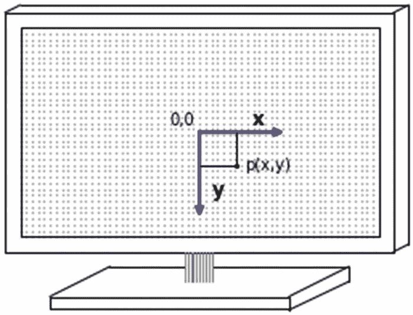

图 1-2

A two-dimensional x,y coordinate system with its origin (0,0) centered in the screen. A point p is shown at coordinates (x,y) relative to x,y.

```py
1  import numpy as np
2  import matplotlib.pyplot as plt
3
4  x1=-10
5  x2=10
6  y1=-10
7  y2=10
8  plt.axis([x1,x2,y1,y2])
9
10 plt.axis('on')
11 plt.grid(True)
12
13 plt.show()
Listing 1-1Program PLOTTING_AREA

```

列表 [1-1](#Par12) 产生如图 [1-3](#Fig3) 所示的绘图区域。它的水平宽度为 20，垂直高度为 20。我可以将这些数字设为 200 和 200，该区域将在输出窗格中显示为相同的物理大小，但在轴上有不同的数值。第 13 行包含命令 plt.show()。这样做的目的是在输出窗格中显示程序的结果。对于现代版本的 Python，这是不需要的，因为程序运行时会自动显示绘图。对于旧版本，可能会显示，也可能不会显示。plt.show()也可以放在程序中，以便显示执行过程中创建的图。尽管可能没有必要，但在脚本末尾包含这个命令是个好主意，因为它可以作为程序结束的方便标记。清单 [1-1](#Par12) 中的第 1、2、10 和 11 行将在以下章节中解释。这些命令，或者它们的变体，将会出现在我们所有的程序中。

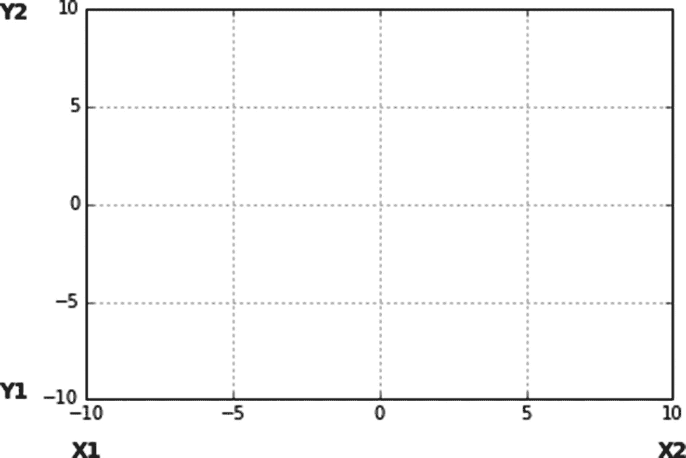

图 1-3

Plotting area produced by Listing [1-1](#Par12) with (0,0) located in the center of the area

## 1.4 导入打印命令

虽然 Python 有许多可用的内置命令和函数，但一些数学和图形命令必须导入。清单 [1-1](#Par12) 中的第 1 行和第 2 行就是这样做的。第 1 行的 import numpy as np 语句导入数学函数，如 sin(ϕ)、e <sup>α</sup> 等等。此语句中的 np 是一个缩写，在提到 numpy 函数时可以使用。当在程序中使用时，这些函数必须被识别为来自 numpy。例如，如果你要编写 v=e <sup>α</sup> ，程序语句将是 v=np.exp(α),其中α已经预先定义好了。您不必写出完整长度的 numpy.exp(α),因为您已经在第 1 行定义了 numpy 的简写 np。图形命令的处理方式类似。当 plt 导入包含图形命令的 pyplot 库时，语句 import matplotlib.pyplot。plt 是 pyplot 的缩写。例如，如果你想在 x，y 上画一个点，你可以写 plt.scatter(x，y)。我很快会谈到 plt.scatter()。

函数也可以直接从 numpy 导入。numpy import sin，cos，radians 中的语句导入 sin()、cos()和 radians()函数。当以这种方式导入时，它们可以不带 np 前缀使用。还有一个数学库也以类似的方式运行。例如，从 math 导入 sin，cos，radians 等效于从 numpy 导入。您将在接下来的程序中使用所有这些变体。

还有一个名为 glib 的图形库，包含图形命令。glib 使用与 pyplot 不同的语法。由于 pyplot 的使用更加广泛，您将在这里的工作中使用它。

清单 [1-1](#Par12) ，plt.axis([x1，x2，y1，y2])中的第 8 行是设置绘图区域的标准命令形式。这来自 pyplot 库，前面是 plt。前缀。这个命令有一些属性，也有其他定义绘图区域的方法，特别是 linspace()命令，但是第 8 行中的形式对于大多数目的来说已经足够了，也是您将使用的形式。x1 和 x2 分别定义绘图区域左侧和右侧的值；y1 和 y2 分别定义底部和顶部。通过第 8-11 行的数值，你可以得到如图 [1-3](#Fig3) 所示的绘图区域。x1、x2、y1 和 y2 的位置始终如图 [1-3](#Fig3) 所示。也就是说，x1 和 y1 总是指左下角，y2 指 y 轴的另一端，x2 指 x 轴的另一端。它们的值可以改变，但它们总是指这些位置。它们可能是负的，如图 [1-4](#Fig4) 所示。


图 1-4

Plotting area with (0,0) located in the center, positive y direction pointing down

因为第 4-7 行中指定的 x 和 y 值在 x 和 y 方向上都是对称的(即 10，+10)，所以该绘图区域的中点位于(x=0，y=0)之间。在这种情况下，该区域的中心将作为坐标绘制的参考原点。从 x1 < x2, the positive direction of the x axis will run horizontally from left to right. Similarly, since y1 < y2, the positive direction of the y axis will go vertically up. But earlier I said we want the positive y direction to go vertically down. You can do that by reversing the y values to y1=10, y2=−10\. In this case, you get the area shown in Figure [1-4](#Fig4) 开始，其中正 x 轴仍然从左向右，但正 y 轴现在指向下。中心仍然在绘图区域的中间。

通过操纵 x1、x2、y1 和 y2，可以将坐标系的原点移离中心。例如，要将 x=0 点一直移动到左侧，可以指定 x1=0，x2=20。要将(x=0，y=0)点移动到左下角，可以指定 x1=0，x2=20，y1=0，y2=20。但这会使 y 轴的正方向朝上。你希望它指向下，这可以通过使 y2=0，y1=20 来实现。这将使原点出现在左上角。您可以自由地将(0，0)点定位在任何位置，更改正 x 和 y 的方向，并缩放坐标轴的数值以适合您将尝试创建的图像。这里使用的数值可以是任何值。Python 制作的剧情物理尺寸会是一样的；只有图像坐标的值会改变。

## 1.5 显示绘图区域

在清单 [1-1](#Par12) 的第 10 行，语句 plt.axis('on ')显示绘图区域及其框架和数值。如果省略此命令，框架仍将显示数值。那么为什么要包含这个命令呢？因为，当创建一个情节时，有时需要关闭框架。为此，请将 plt.axis('on ')替换为 plt.axis('off ')。提前使用该命令可以很容易地在“on”上键入“off ”,反之亦然，从而在显示和不显示帧之间进行切换。此外，完成绘图后，您可能希望在文档中使用它，在这种情况下，您可能不需要框架。请注意,“on”和“off”必须用单引号或双引号引起来。

## 1.6 标绘网格

清单 [1-1](#Par12) 的第 11 行 plt.grid(True)打开了网格虚线，这在构建一个图时是有帮助的，尤其是在定位文本信息的时候。如果不包含此命令，将不会显示网格线。要关闭网格线，请将 True 更改为 False。注意 True 和 False 中的第一个字母大写。真与假不会出现在引号中。与 plt.axis()一样，使用 plt.grid(True)和 plt.grid(False)命令可以很容易地来回切换。再次注意，True 和 False 的第一个字母都必须大写，并且不能出现在引号中。

## 1.7 保存地块

保存出现在输出窗格中的图的最简单方法是将光标放在它上面并右键单击。将出现一个窗口，允许您为其命名并指定保存位置。它将被保存。png 格式。如果您计划在诸如 Photoshop 之类的程序中使用它。png 格式的作品。一些文字处理和文档程序可能需要。eps(封装的 Postscript)格式。如果是这样，请将其保存在。png 格式，在 Photoshop 中打开它，然后在。eps 格式。有点繁琐但是很管用。

## 1.8 网格颜色

plt.grid()命令有一些选项。您可以使用 color='color '属性更改网格线的颜色。例如，plt.grid(True，color="b ")绘制蓝色网格。更多颜色选项将很快定义。

## 1.9 刻度线

plt.grid(True)命令将使用 Python 自己选择的间距创建格网，这可能不太方便。可以使用 plt.xticks(xmin，xmax，dx)和 plt.yticks(ymin，ymax，dy)命令改变间距。最小值和最大值是刻度的范围；dx 和 dy 是间距。虽然通常您希望刻度线出现在 x 和 y 的整个范围内，但如果您愿意，也可以让它们出现在较小的范围内。这些命令出现在清单 [1-2](#Par25) 的第 23 行和第 24 行。

```py
1  import numpy as np
2  import matplotlib.pyplot as plt
3
4  #————————————————plotting area
5  x1=-10
6  x2=140
7  y1=90
8  y2=-10
9  plt.axis([x1,x2,y1,y2])
10 plt.axis('on')
11
12 #——————————————————grid
13 plt.grid(True,color='b')
14 plt.title('Tick Mark Sample')
15
16 #————————————————tick marks
17 xmin=x1
18 xmax=x2
19 dx=10
20 ymin=y1
21 ymax=y2
22 dy=-5
23 plt.xticks(np.arange(xmin, xmax, dx))
24 plt.yticks(np.arange(ymin, ymax, dy))
25
26 plt.show()
Listing 1-2Program TICK_MARKS

```

输出如图 [1-5](#Fig5) 所示。在第 23 行中，xmin 和 xmax 是沿 x 轴的刻度范围的开始和结束，类似于控制 y 轴刻度的第 24 行。第 19 行中的 dx 将标记从 x1=-10(第 5 行)到 x2=140(第 6 行)间隔 10 个单位。第 22 行中 dy 是-5。它是负的，因为 y2 = 10(第 8 行)，而 y1=+90(第 7 行)。因此，随着程序从 y1 进行到 y2，y 的值减小；因此 dy 必须是负的。

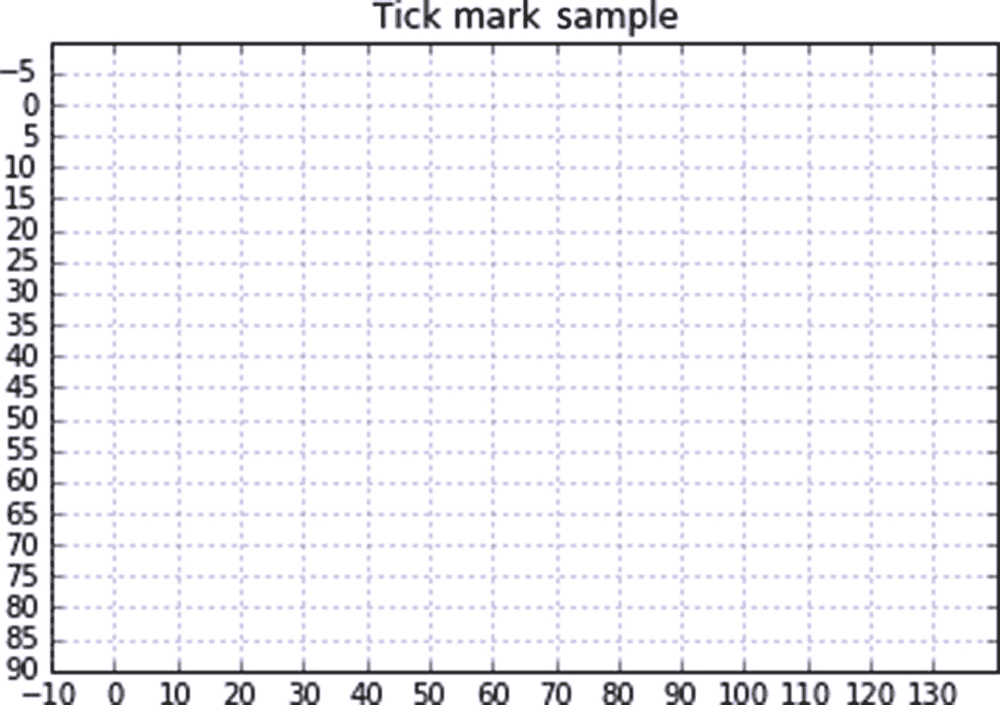

图 1-5

User-defined tick mark

## 1.10 自定义网格线

由 plt.grid(True)命令生成的自动生成的网格并不总是令人满意，尤其是当您想要在绘图中包含文本时。准确放置文本元素通常不够精细。但是如果使用 xtick()和 ytick()命令来减小间距，沿轴的数字会变得混乱。数字可以被删除，但这样你就不能使用它们来定位文本信息，例如在标记图上的项目时。如果增量更小，图 [1-3](#Fig3) 所示的网格会更有帮助。您可以生成自己的网格线，并以任何方式控制它们。清单 [1-3](#Par28) 中的代码产生图 [1-6](#Fig6) ，一个网格线间距更细的绘图区域。


图 1-6

Plotting area with custom grid

```py
1  import numpy as np
2  import matplotlib.pyplot as plt
3
4  x1=-5
5  x2=15
6  y1=-15
7  y2=5
8  plt.axis([x1,x2,y1,y2])
9
10 plt.axis('on')
11
12 dx=.5                                     #x spacing
13 dy=.5                                     #y spacing
14 for x in np.arange(x1,x2,dx):             #x locations
15      for y in np.arange(y1,y2,dy):        #y locations
16      plt.scatter(x,y,s=1,color='grey')    #plot a grey point at x,y
17
18 plt.show()
Listing 1-3Program CUSTOM_GRID

```

清单 [1-3](#Par28) 的第 16 行中的 scatter()函数在每个 x，y 位置绘制一个灰点。我将在后面更深入地讨论 scatter()。注意，这个程序中没有使用 plt.grid(True)。第 1-10 行像以前一样产生带有轴的绘图区域。这一次，您没有使用 plt.grid(True)命令，而是在第 12-16 行生成了您自己的定制网格。第 12 行和第 13 行指定了间距。从第 14 行开始的循环在步骤 dx 中从左向右水平前进。从第 15 行开始的循环在垂直方向上也是如此。第 16 行的 s=1 属性将点的大小指定为 1。这可以改变:s=.5 将给出一个更小的点；s=5 将给出更大的值。color='grey '属性将点颜色设置为灰色。您可以尝试不同大小的点、颜色和间距。有时，将 Grid(True)生成的网格与自定义网格一起使用会很有好处。

## 1.11 轴的标签

轴可以用 plt.xlabel('label ')和 plt.ylabel('label ')函数来标记。作为一个例子，这些线

```py
plt.xlabel('this is the x axis')

plt.ylabel('this is the y axis')

```

当添加到清单 [1-3](#Par28) 的第 10 行后，产生图 [1-7](#Fig7) ，其中通过使用 plt.scatter()函数中的属性 color='lightgrey '将自定义网格点更改为浅灰色。


图 1-7

Plotting area with axis labels and custom grid

在图 [1-8](#Fig8) 中，你可以看到 matplotlib 网格。Python 网格和自定义网格的组合为定位元素提供了一个方便的工作表面。

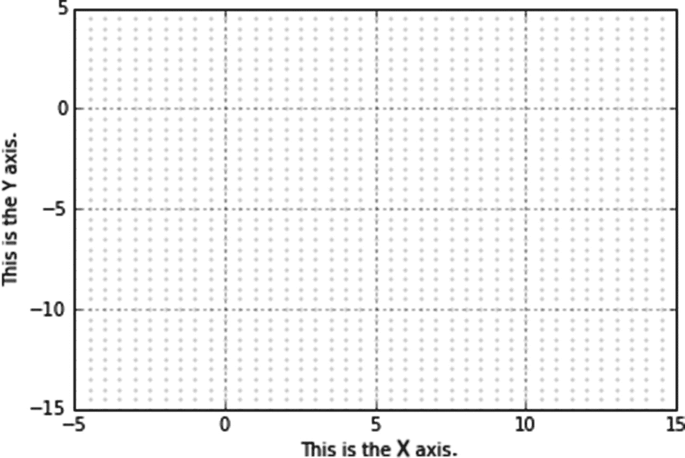

图 1-8

Plotting area with axis labels, the Python grid, and a custom grid

## 1.12 情节标题

用 plt.title('title ')语句可以很容易地给你的图加标题。插入下面一行产生图 [1-9](#Fig9) :

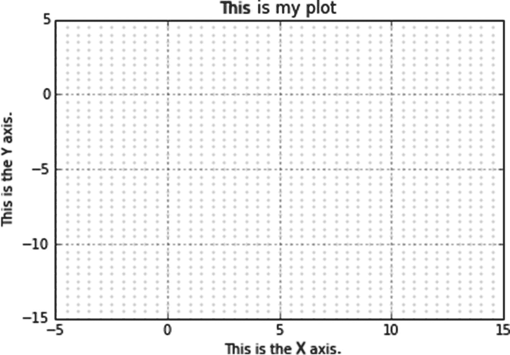

图 1-9

Plotting area with axis labels, Python grid, custom grid, and title

```py
plt.title('this is my plot')

```

## 1.13 颜色

随着本书的深入，您将充分利用 Python 的彩色绘图能力。一些可用的颜色有

*   k 代表黑色
*   ' b '代表蓝色
*   “c”代表青色
*   g 代表绿色
*   “m”代表洋红色
*   r 代表红色
*   y 代表黄色
*   “灰色”或“灰色”
*   " lightgray "或" lightgrey "

例如，以下语句将在坐标 x，y 处绘制一个绿点:

```py
plt.scatter(x,y,color='g')

```

更多颜色的样本可以在

[T0](https://matplotlib.org/examples/color/named_colors.html)T1】

颜色属性可以与其他属性一起用在散点()、绘图()和箭头()函数中。

### 颜色混合

您可以使用规范 color=(r，g，b)从红(r)、绿(g)和蓝(b)原色中混合自己的色调，其中 r、g、b 是混合中红、绿和蓝的值，每个值的范围为 0 到 1。例如，color=(1，0，0)给出纯红色；color=(1，0，1)给出品红色，一种红色和蓝色的略带紫色的混合物；color=(0，1，0)给出绿色；颜色(. 5，0.1)在洋红色中给出更多的红色和更少的蓝色；color(0，0，0)给出黑色；颜色(1，1，1)给出白色。保持 r、g、b 值不变，随着这些值的增加，会产生从黑到白的灰度。也就是说，color=(.1，. 1，.. 1)产生深灰色，color(.7，. 7，.. 7)产生浅灰色，color(.5，. 9，.. 5)产生浅绿色。请注意，当指定“grey”时，它也可以拼写为“gray”。

清单 [1-4](#Par53) 展示了如何在程序中混合颜色。第 7-9 行确定了每种颜色在 0-1 范围内的分数。第 7 行中的红色分量依赖于 x，范围从 1-100。在该混合中，绿色和蓝色分量的值均为 0。第 10 行在 x 处从上到下画了一条垂直线，颜色混合由属性 color=(r，g，b)指定。结果如图 [1-10](#Fig10) 所示。左边的色调几乎是黑色的。这是因为混合中每种颜色的数量为 0 或接近于 0(r = . 01，g=0，b=0)。右边的色调是纯红色，因为在那一侧 r=1，g=0，b = 0；也就是说，红色是完整的强度，没有被绿色或蓝色污染。

```py
1  import numpy as np
2  import matplotlib.pyplot as plt
3
4  plt.axis([0,100,0,10])
5
6  for x in np.arange(1,100,1):
7       r=x/100
8       g=0
9       b=0
10      plt.plot([x,x],[0,10],linewidth=5,color=(r,g,b))
11
12 plt.show()
Listing 1-4Program COLORS

```


图 1-10

Red color band produced by Listing [1-4](#Par53) with r=x/100, g=0, b=0

图 [1-11](#Fig11) 显示了将蓝色添加到混合中的结果。图 [1-12](#Fig12) 显示了红色加上绿色的结果。将三原色均匀混合会产生从黑色到白色的灰色阴影，如图 [1-13](#Fig13) 所示。

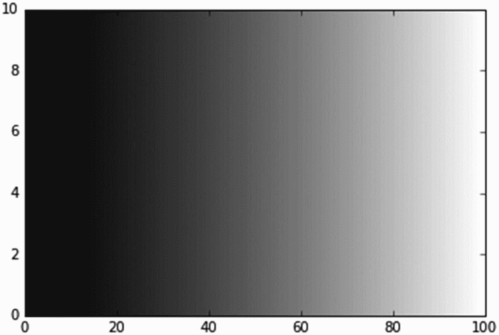

图 1-13

Grey color band with r=x/100, g=x/100, b=x/100

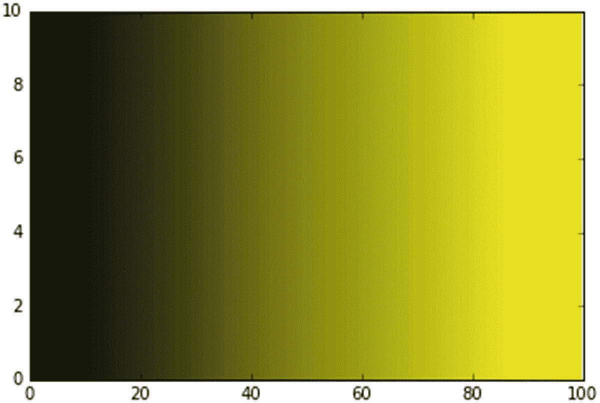

图 1-12

Yellow color band with r=x/100, g=x/100, b=0


图 1-11

Purple color band with r=x/100, g=0, b=x/100

每种原色有 256 个可用值。像我在这里做的那样，将它们混合，得到 256 种 <sup>3</sup> ，差不多有 1700 万种不同的色调。

### 颜色强度

颜色的强度可以用 alpha 属性来控制，如清单 [1-5](#Par57) 中的第 6-8 行所示，这产生了图 [1-14](#Fig14) 。alpha 可以在 0 到 1 之间变化，1 表示色调最强，0 表示色调最弱。


图 1-14

Color intensity controlled by the attribute alpha shown in Listing [1-5](#Par57)

```py
1  import numpy as np
2  import matplotlib.pyplot as plt
3
4  plt.axis([0,100,0,10])
5
6  plt.scatter(60,50,s=1000,color='b',alpha=1)
7  plt.scatter(80,50,s=1000,color='b',alpha=.5)
8  plt.scatter(100,50,s=1000,color='b',alpha=.1)
9
10 plt.show()
Listing 1-5Program COLOR_INTENSITY

```

## 1.14 过度绘制

您通常使用函数 plt.scatter()创建点，plt.plot()创建线，plt.arrow()创建箭头和线(无头箭头)。重要的是要知道哪一个会超过哪一个。你不想创建一个精心制作的图像，却发现它被其他东西过度渲染了。图 [1-15](#Fig15) 显示了一些例子。在(A)中，先有一条红线(1)，然后是一条绿线(2)。请注意，第二行覆盖了第一行。在(B)中，首先绘制一个蓝点(1)，然后绘制一条红线(2)。这条线画多了点。然后绘制另一个蓝点(3)。它没有过分渲染。在(C)中，首先绘制红点(1)，然后是蓝点(2)，然后是黄点(3)。他们互相吹捧。总之，

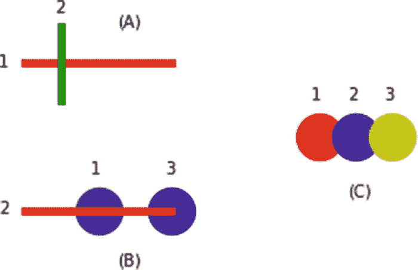

图 1-15

Overplotting with lines and dots

*   新线覆盖旧线。
*   线条覆盖圆点。
*   新点覆盖旧点。

这些示例是由以下代码创建的:

```py
#————————————————————(A)
plt.text(45,10,'(A)')
plt.plot([20,60],[20,20],linewidth=5,color='r')
plt.text(13,21,'1')
plt.plot([30,30],[10,30],linewidth=5,color='g')
plt.text(28,6,'2')

#————————————————————(B)
plt.text(45,75,'(B)')
plt.scatter(40,60,s=800,color='midnightblue')
plt.text(38,50,'1')
plt.plot([20,60],[60,60],linewidth=5,color='r')
plt.text(13,61,'2')
plt.scatter(60,60,s=800,color='b')
plt.text(58,50,'3')

#————————————————————(C)
plt.text(108,56,'(C)')
plt.scatter(100,40,s=800,color='r')
plt.text(98,30,'1')
plt.scatter(110,40,s=800,color='b')
plt.text(108,30,'2')
plt.scatter(120,40,s=800,color='y')
plt.text(118,30,'3')

```

图 [1-16](#Fig16) 为箭头。在(A)中，先放下一条红线，然后放下一个绿色箭头。箭没有超过线。然后画一个蓝色的箭头。红线仍然优先并覆盖蓝色箭头。在(B)中，首先画出深蓝色的点，然后画出红色的箭头。箭头遮住了深蓝色的点。然后画一个蓝点。箭头仍然优先并覆盖蓝点。在(C)中，先画一个红色箭头，然后画一个蓝色箭头。新的蓝色箭头覆盖旧的红色箭头。因此，我们可以得出结论

*   线条覆盖箭头。
*   箭头覆盖圆点。
*   新箭盖旧箭。

一般来说，我们可以说线条过度描绘了一切，甚至是更古老的线条；圆点不会过度绘制任何东西，除了较老的圆点；和箭头过度绘制点和旧的箭头，而不是线。

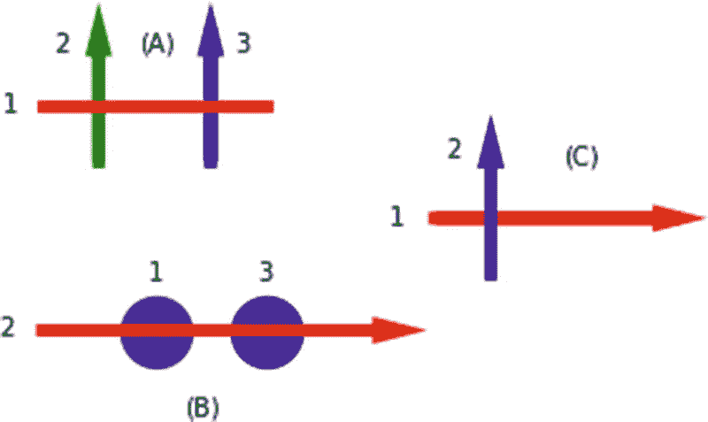

图 1-16

Overplotting with lines, arrows, and dots

产生图 [1-16](#Fig16) 的代码是

```py
#——————————————————————(A)
plt.plot([20,60],[20,20],linewidth=5,color='r')
plt.text(13,21,'1')
plt.arrow(30,30,0,-20,linewidth=5,head_length=4,head_width=2,color='g')
plt.text(22,10,'2')
plt.arrow(50,30,0,-20,linewidth=5,head_length=4,head_width=2,color='b')
plt.text(54,10,'3')
#——————————————————————(B)
plt.scatter(40,60,s=800,color='midnightblue')
plt.text(39,51,'1')
plt.arrow(20,60,60,0,linewidth=5,head_length=4,head_width=2,color='r')

plt.text(12,61,'2')
plt.scatter(60,60,s=800,color='b') plt.text(58,51,'3')
#——————————————————————(C)
plt.arrow(90,40,40,0,linewidth=5,head_length=4,head_width=2,color='r')
plt.text(82,41,'1')
plt.arrow(100,50,0,-20,linewidth=5,head_length=4,head_width=2,color='b')
plt.text(92,29,'2')

```

## 1.15 背景颜色

前面的部分提供了绘制背景的含义。通常，图像是在白色背景下用彩色绘制在计算机屏幕上的。在黑色或深蓝色背景下绘图有时会很有用。图 [1-17](#Fig17) 显示了取自章节 [6](06.html) 的示例。通过首先用黑线覆盖绘图区域来获得黑色背景。然后用绿线绘制球体，绿线覆盖黑线。你也可以用散点()来画背景，但是线条需要更少的计算机处理时间。如果你选择用点来画球体，背景线会把它们盖住。如果你真的用点绘制了球体，你可以先用点绘制背景，新的球体点会覆盖它们。

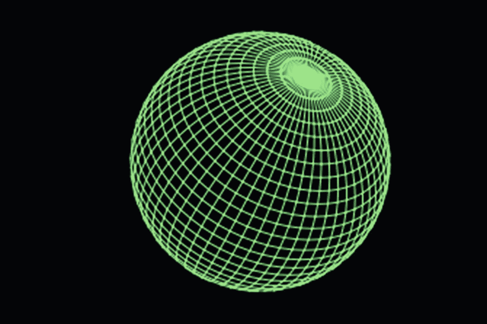

图 1-17

Sphere plotted against a black background

## 1.16 绘图区形状

当使用 plt.axis()命令设置绘图区时，它通常在输出窗格中显示为矩形而不是正方形，即使 x 和 y 轴尺寸指示它应该是正方形。这显示在图 [1-18](#Fig18) 中，它是通过列出 [1-6](#Par73) 创建的，其中第 7 行中的值指示面积应该是正方形。这种扭曲有时可能会有问题，因为它会扭曲对象。例如，一个数学上正确的圆可能显示为椭圆形，或者一个数学上正确的正方形可能显示为矩形，如图 [1-18](#Fig18) 所示。

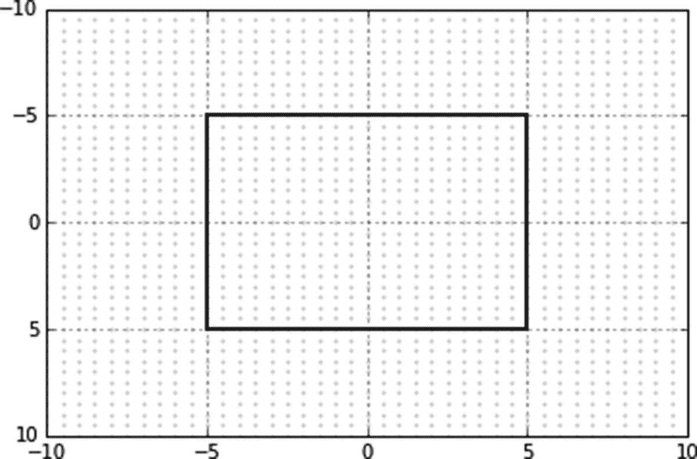

图 1-18

Distortion of a mathematically correct square

```py
1  import numpy as np
2  import matplotlib.pyplot as plt
3
4  plt.grid(True)
5  plt.axis('on')
6
7  plt.axis([-10,10,10,-10])
8
9  #————————————————custom grid
10 x1=-10
11 x2=10
12 y1=10
13 y2=-10
14
15 dx=.5
16 dy=-.5
17 for x in np.arange(x1,x2,dx):
18      for y in np.arange(y1,y2,dy):
19           plt.scatter(x,y,s=1,color='lightgray')
20
21 #————————————————square box
22 plt.plot([-5,5],[-5,-5],linewidth=2,color='k')
23 plt.plot([5,5],[-5,5],linewidth=2,color='k')
24 plt.plot([5,-5],[5,5],linewidth=2,color='k')
25 plt.plot([-5,-5],[5,-5],linewidth=2,color='k')
26
27 plt.show()

Listing 1-6Program SQUARE

```

如图 [1-19](#Fig19) 所示，您可以通过包含该命令来纠正这种失真

```py
plt.axes().set_aspect('equal')

```

在第 7 行之后的清单 [1-6](#Par73) 中。这将通过对绘图区域求平方来对方框求平方。不幸的是，它也缩小了绘图区的宽度。对于某些图像来说，这可能不太方便，因为在这些图像中，您可能希望绘制区域的整个宽度没有伴随的扭曲。

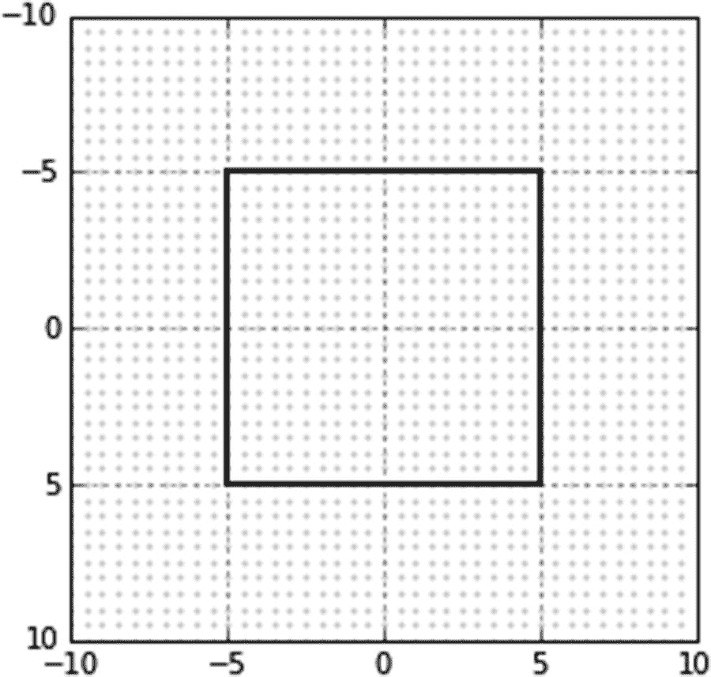

图 1-19

Distortion corrected by equalizing axes

## 1.17 如何纠正形状扭曲

图 [1-20](#Fig20) 再次说明了这个问题，这一次当你试图画一个圆的时候。您有一个 x 和 y 尺寸数值相等的绘图区域，每个尺寸的范围为 100 个单位。当你画一个数学上正确的圆时，你会得到图 [1-20](#Fig20) ，一个椭圆。清单 [1-7](#Par78) 制作图 [1-20](#Fig20) 。

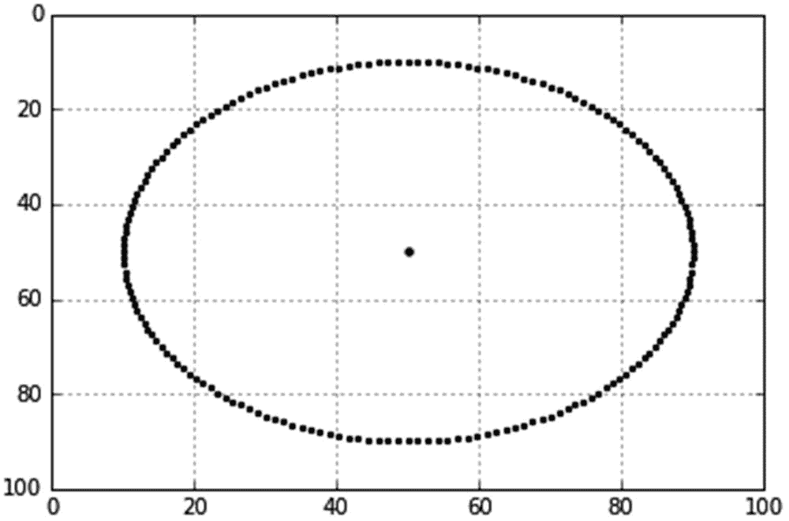

图 1-20

Distortions of a mathematically correct circle

```py
1  plt.axis([0,100,100,0])
2
3  r=40
4  alpha1=radians(0)
5  alpha2=radians(360)
6  dalpha=radians(2)
7  xc=50
8  yc=50
9  plt.scatter(xc,yc,s=10,color='k')
10 for alpha in np.arange(alpha1,alpha2,dalpha):
11      x=xc+r*cos(alpha)
12      y=yc+r*sin(alpha)
13      plt.scatter(x,y,s=5,color='k')
Listing 1-7Program DISTORTED_CIRCLE

```

显然，这是行不通的。你必须想办法得到一个真正的圆，而不是椭圆。

### 1.17.1 绘图时应用比例因子

图 [1-20](#Fig20) 中的圆圈由散点()构成。您可以尝试在绘制时对每个点的 x 坐标应用一个校正因子，即 sfx 的比例因子。你如何得到 sfx？使用尺子，在显示器屏幕上测量 x 和 y，这是椭圆圆的 x 和 y 显示范围。由于显示器的水平和垂直像素间距不同，因此您需要使用一把尺子。假设 x = 7.5cm 厘米，y = 5 厘米。应用于每个点的 x 坐标的比例因子是 sfx =∏y/∏x = 5/7.5≊。将清单 [1-6](#Par73) 中的第 11 行替换为

x=xc+sfx*r*cos(alpha)

其中 sfx=.67，你得到图 [1-21](#Fig21) 。这种方法的问题是，要绘制的每个 x 坐标都必须乘以 sfx。

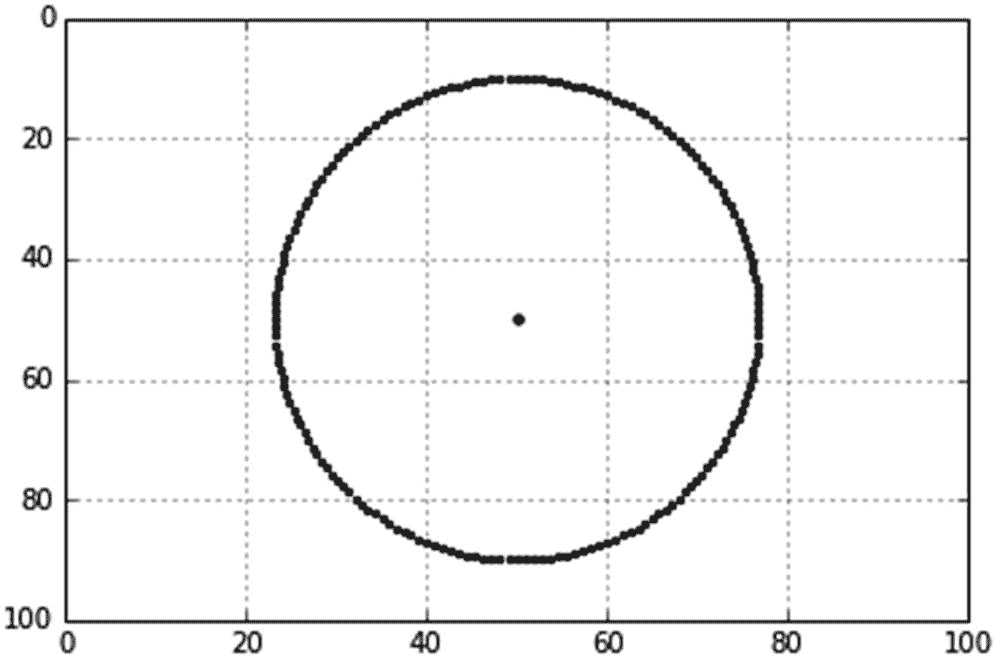

图 1-21

Distortion corrected by applying a scale factor to each point as it is plotted

### 1.17.2 最佳方法:在 plt.axis()中缩放轴

校正失真的最佳方法是通过 plt.axis()函数将比例因子应用于 x 轴。以上面的圆为例，应用于 x 轴的比例因子为 x/y = 7.5/5 = 1.5。在 plt.axis()函数中使用它，它变成

```py
plt.axis([0,150,100,0])

```

产生图 [1-22](#Fig22) 的圆代码，现在变成清单 [1-8](#Par87) 。


图 1-22

Distortion corrected by applying a scale factor to the x axis

```py
1  plt.axis([0,150,100,0])
2
3  r=40
4  alpha1=radians(0)
5  alpha2=radians(360)
6  dalpha=radians(2)
7  xc=75
8  yc=50
9  plt.scatter(xc,yc,s=10,color='k')
10 for alpha in np.arange(alpha1,alpha2,dalpha):
11      x=xc+r*cos(alpha)
12      y=yc+r*sin(alpha)
13      plt.scatter(x,y,s=5,color='k')
14
15 plt.show()
Listing 1-8THE_BEST_WAY_TO_CORRECT_DISTORTIONS

```

这给了你图 [1-22](#Fig22) ，一个真正的圆。清单 [1-8](#Par87) 中的第 1 行确保 x 轴的数值长度是 y 轴的 1.5 倍。y 轴可以具有任何数值长度。按照 plt.axis()函数的定义，只要 x 轴是 y 轴的 1.5 倍，您仍然会得到一个真正的圆或正方形。比如 plt.axis([0，1800，1200，0])就可以。在本书的大多数示例程序中，您将使用由 plt.axis([0，150，100，0])定义的标准绘图区域。1.5 的缩放因子可能需要针对您的显示器进行微调。

## 1.18 坐标轴

正如您所看到的，为了构建图形图像，点、线和箭头被放置在绘图区域的坐标上，这些坐标具有相对于 x=0，y=0 处的原点的数值。虽然没有必要显示坐标轴或其原点，但它们通常有助于创建图像，因为它们指示(0，0)点的位置以及正 x 和 y 值的方向。图 [1-23](#Fig23) 显示了使用列表 [1-9](#Par90) 第 23 和 24 行中的 plt.arrow()函数绘制的轴。

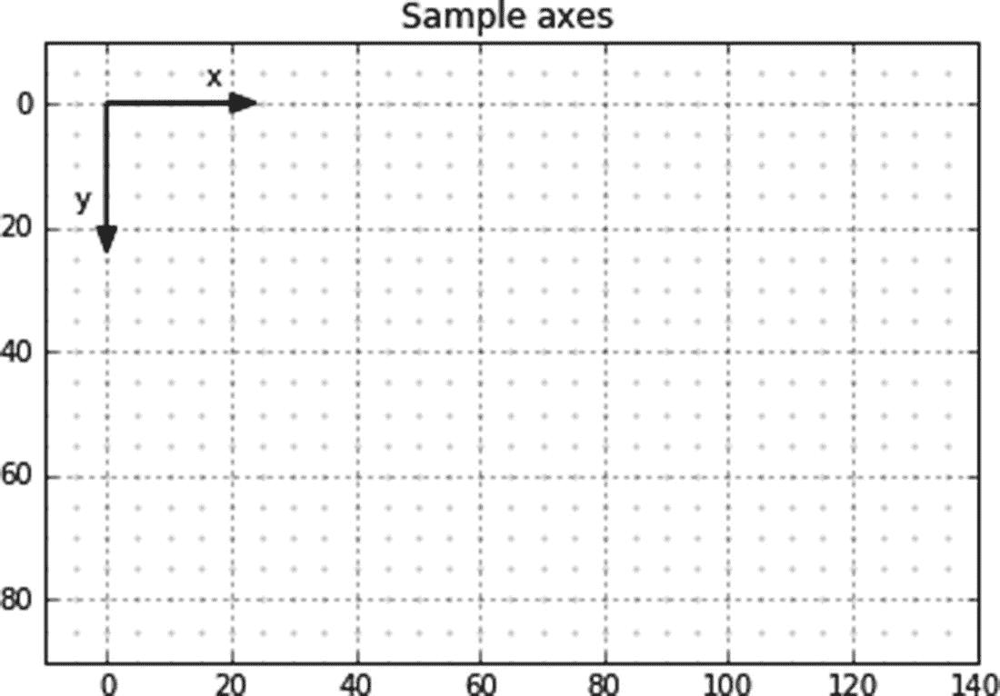

图 1-23

A convenient working surface: 100x150 plotting area, Python grid, custom grid, frame out of the way

```py
1  import numpy as np
2  import matplotlib.pyplot as plt
3
4  x1=-10 #——Δx=150
5  x2=140
6  y1=90 #—-Δy=100
7  y2=-10
8  plt.axis([x1,x2,y1,y2])
9
10 plt.axis('on')
11 plt.grid(True)
12
13 plt.title('Sample Axes')
14
15 #—————————————————grid
16 dx=5
17 dy=-5
18 for x in np.arange(x1,x2,dx):
19      for y in np.arange(y1,y2,dy):
20           plt.scatter(x,y,s=1,color='lightgray')
21
22 #—————————————-coordinate axes
23 plt.arrow(0,0,20,0,head_length=4,head_width=3,color='k')
24 plt.arrow(0,0,0,20,head_length=4,head_width=3,color='k')
25
26 plt.show()

Listing 1-9Program COORDINATE_AXES

```

## 1.19 常用的绘图命令和功能

在前面几节中，您已经看到了几个绘图命令和函数的使用。在接下来的几节中，您将更深入地研究这些命令以及其他命令。您还将了解这些函数的一些可选属性。请注意，我不会列出所有可用的属性，因为它们中的大多数通常都不会用到；我在这里只包括了创建本书插图所需的最重要的属性。

### 1.19.1 使用散点图的点和圆点( )

```py
plt.scatter(x,y,s=size,color='color ')

```

scatter()在坐标 x，y 处绘制实心点。size 是点的大小:s=.5 表示一个小点；s=10 则更大。我们用点这个术语来描述一个小点。点相对于绘图的物理大小将取决于绘图区域的比例。确定一个点的最合适大小的最好方法是通过放大或缩小来进行实验，直到你得到你想要的。颜色是点的颜色。scatter()还有其他属性，但我们不会在本书中使用它们。

我在前面关于颜色的部分讨论了颜色；对于大多数正常的应用程序，这些颜色应该是令人满意的。例如，color='r '给出一个红点，color='k '给出一个黑点。如前所述，您还可以使用语句 color=(r，g，b)混合 rgb 颜色，其中 r=红色，g =绿色，b =蓝色。

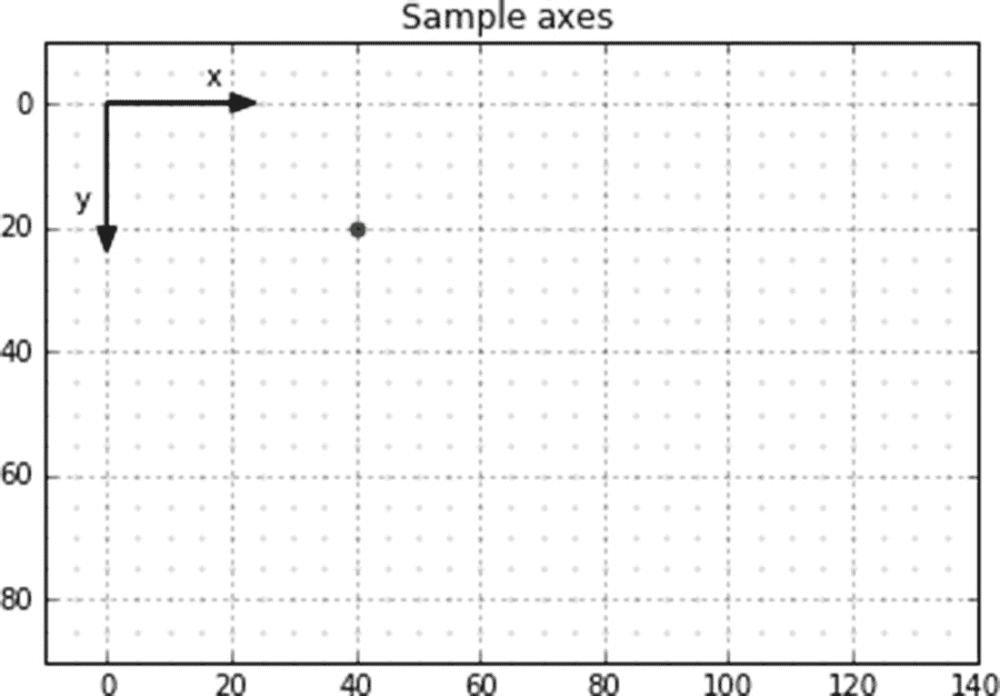

图 1-24

Green scatter() dot at x=40,y=20

这三个参数的值可以从 0 到 1。虽然颜色有时很有用，但用“k”(黑色)、“灰色”和“浅灰色”可以做很多事情。一般来说，给一幅画添加色彩对传达信息有很大的帮助。然而，过多的颜色会造成混乱。以 scatter()为例，

```py
plt.scatter(40,20,s=2,color='g')

```

在 x=40，y=20 处绘制一个大小为 2 的绿点，如图 [1-24](#Fig24) 所示。注意，这些 x，y 坐标是相对于坐标轴的原点的。

### 1.19.2 使用 plot()的线条

```py
plt.plot([x1,x2],[y1,y2],linewidth=linewidth,
                       color='color ',linestyle='linestyle')

```

该命令绘制一条从 x1，y1 到 x2，y2 的直线。它的宽度由 linewidth 指定，颜色由 color 指定，样式由 linestyle 指定。关于线宽，线条宽度的外观将取决于绘图的比例，因此最好通过实验来确定。关于线型，图 [1-25](#Fig25) 所示的通常就足够了。

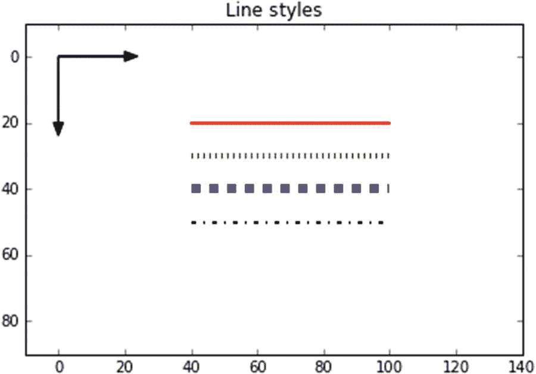

图 1-25

Line styles

图 [1-25](#Fig25) 中的线条由以下代码创建:

```py
plt.plot([40,100],[20,20],linewidth=2,color='r')
plt.plot([40,100],[30,30],linewidth=4,color='g',linestyle=':')
plt.plot([40,100],[40,40],linewidth=6,color='b',linestyle='–')
plt.plot([40,100],[50,50],linewidth=2,color='k',linestyle='-.')

```

还有其他可用的线条样式，可以通过互联网搜索找到。

### 箭头

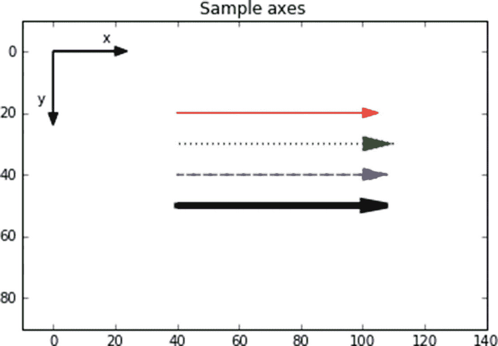

图 1-26

Arrows

```py
plt.arrow(x,y,∆x,∆y,line_width='linewidth',
                    head_length='headlength',
                    head_width='headwidth',
                    color='color ')

```

图 [1-26](#Fig26) 中所示的箭头是用以下命令绘制的:

```py
plt.arrow(40,20,60,0,linewidth=1,color='r',head_length=5,
     head_width=3)

plt.arrow(40,30,60,0,linewidth=1,color='g',linestyle=':',
     head_length=10,head_width=5)

plt.arrow(40,40,60,0,linewidth=1,color='b',linestyle='–',
     head_length=8,head_width=4)

plt.arrow(40,50,60,0,linewidth=4,color='k',linestyle='-',
     head_length=8,head_width=3)

```

∏x 和∏y 是 x 和 y 从箭杆开始到结束的变化；线宽决定了箭杆的粗细。head_width 指定头部的宽度；head_length 指定了它的长度。箭头的长度增加了箭头的总长度。将箭杆长度与箭头长度相加得到箭的总长度，这对于垂直和水平箭来说不是什么大问题。例如，要绘制总长为 13 的水平箭头，需要指定 x 为 7，head_length=3。但是，当构造必须符合特定长度的斜箭头时，这可能会很棘手。在这种情况下，最好的办法是使用试错法调整 x、y 和 head_length，直到结果正确。通常你会希望 head_length 和 head_width 保持固定，所以通常改变的是 x 和 y。

箭头也可以用来画线。数据输入的形式有时比 plt.plot([x1，x2]，[y1，y2])函数更方便。要获得没有箭头的行，只需省略 head_length 和 head_width 属性。也就是说，编写以下内容:

plt.arrow(x，y，x，y，line_width='linewidth '，color='color ')

### 文本

Python 将文本视为图形元素。在 Python 绘图中放置文本的方法是使用 plt.text()函数。图 [1-27](#Fig27) 中显示的文本样本是由清单 [1-10](#Par111) 中的代码生成的。第 30 行和第 31 行显示了如何旋转文本:

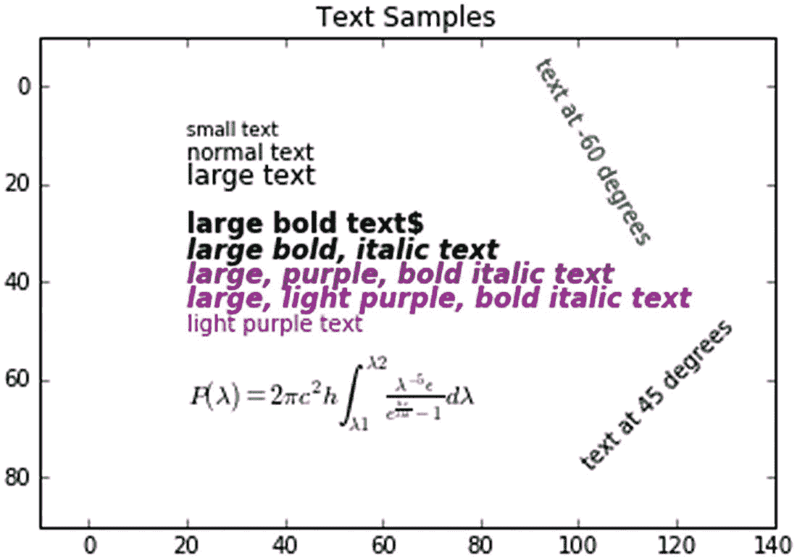

图 1-27

Text samples

```py
plt.text(x,y,'text',color='color ',size='size',fontweight='fontweight ',
     fontstyle='fontstyle',rotation=degrees)

```

```py
1  import numpy as np
2  import matplotlib.pyplot as plt
3
4  x1=-10
5  x2=140
6  y1=90
7  y2=-10
8  plt.axis([x1,x2,y1,y2])
9
10 plt.axis('on')
11 plt.grid(False)
12
13 plt.title('Text Samples')
14
15
16 #—————————————————text samples
17 plt.text(20,10,'small text',size='small')
18 plt.text(20,15,'normal text')
19 plt.text(20,20,'large text',size='large')
20
21 plt.text(20,30,'large bold text',size='large',fontweight='bold')
22 plt.text(20,35,'large bold,italic
23 text',size='large',fontweight='bold',fontstyle='italic')
24 plt.text(20,40,'large, pure, bold italic
25 text',size='large',fontweight='bold',fontstyle='italic',color=(.5,0,.5))

26 plt.text(20,45,'large, light purple, bold italic
27 text',size='large',fontweight='bold',fontstyle='italic',color=(.8,0,.8))
28 plt.text(20,50,'light purple text',color=(.8,0,.8))
29
30 plt.text(100,50,'text at 45 degrees',rotation=45,color='k')
31 plt.text(90,-3,'text at -60 degrees',rotation=-60,color='g')
32
33 plt.text(20,65,r'$P(\lambda)=2 \pi c^{2} h
       \int_{\lambda1}^{\lambda2}\frac{\lambda^{-5}\epsilon}
       {e^{\frac{hc}{\lambda k t}}-1}d\lambda$',size='large')
34
35 plt.show()
Listing 1-10Program TEXT_SAMPLES

```

图 [1-27](#Fig27) 底部的方程是马克斯·普朗克黑体辐射方程，它给出了波长从λ1 → λ2 的黑体辐射功率。清单 [1-9](#Par90) 中的第 33 行绘制了该等式的文本。Python 显示这个等式的能力说明了 Python 的一些图形能力。Python 可以将 Latex 可以完成的大部分工作绘制成文本。注意，在第 33 行，单引号之间的 Latex 文本前面是小写的 r。前面的 r 告诉 Python 将该字符串视为原始字符串，从而保留 Latex 所需的反斜杠。因为美元符号，matplotlib 知道它是 Latex。Latex 代码放在美元符号之间。显然，可以显示更多的 Latex 文本。事实上，这整本书都是用 Latex 编写和格式化的。里面所有的插图都是用 Python 创作的。

### 列表、元组和数组

用单独的线条绘制一个对象(如一个盒子)通常需要大量的输入。例如，要绘制一个方形框，您可以用

```py
plt.plot([-20,20],[-20,-20],linewidth=2,linestyle='–',color='r')
plt.plot([20,20],[-20,20],linewidth=2,linestyle='–',color='r')
plt.plot([20,-20],[20,20],linewidth=2,linestyle='–',color='r')
plt.plot([-20,-20],[20,-20],linewidth=2,linestyle='–',color='r')

```

更有效的方法是使用列表:

```py
x=[-20,20,20,-20,-20]
y=[-20,-20,20,20,-20]
plt.plot(x,y,linewidth=2,linestyle='–',color='g')

```

这些列表中的每个 x[i]，y[i]对代表一个点的坐标。plt.plot(x，y…)函数自动连接点 x[i]，y[i]与 x[i+1]，y[i+1]。这些列表中的第 5 个元素与元素 0 具有相同的坐标。这就关闭了盒子。

方括号中的有限数字序列，如 x=[x1，x2，x3，x4，x5]和 y=[y1，y2，y3，y4，y5]称为列表。列表非常有用，尤其是在计算机图形学中。x，y 对(x1，y1)，(x2，y2)，(x3，y3)....在这些列表中，替换各个 plt.plot 函数中的语法([x1，x2]，[y1，y2])。你可以用它们画出几乎任何形状；这些线将按顺序连接。

列表元素可以如上单独定义，也可以按以下结构指定:

```py
1  x=[ ]
2  for i in range(10):
3        x.append(i*i)
4
5  print(x)
6
7  [0,1,4,9,16,25,36,49,64,81]

```

第 1 行定义了一个空列表 x，它不包含任何元素。没有规定列表的长度。从第 2 行开始的循环将 I 从 0 递增到 9 (10 个元素)。第 3 行将 i*i 作为从元素 0 开始的循环中的一个附加元素添加到列表中。第 7 行显示了结果。

另一种方法是预定义列表元素，如下面的第 1 行所示。列表中的数字可以是任何数字；它们只是用来定义列表的长度。在从第 3 行开始的循环中，第 4 行将每个元素的值更改为 i*i。

```py
1  x=[0,1,2,3,4,5,6,7,8,9]
2
3  for i in range(10):
4       x[i]=(i*i)
5
6  print(x)
7
8  [0,1,4,9,16,25,36,49,64,81]

```

列表的长度也可以定义为

```py
g=[0]*10

```

其中列表 g 被定义为具有 10 个元素，每个元素的值为 0。要获取列表的长度，请使用函数

```py
len(x)

```

它返回列表 x 的长度，长度是列表中元素的数量。例如，在下面的脚本中，循环将处理列表 x 中从元素 0 到 x 的最后一个元素的所有元素，每个元素加 3:

```py
x=[4,0,7,1]

for i in range(len(x)):
     x[i]=x[i]+3

print(x)

[7,3,10,4]

```

您将在接下来的程序中使用所有这些方法。

元组是一个数字序列，例如 x=(x0，x1，x2，x3，x4)，类似于列表。区别在于，除了括号的样式，元组中的元素是不可变的，这意味着它们不能被改变(变异)。另一方面，列表中的元素是可以改变的。元组可以不带括号使用。例如，v=7，12 等价于 v=(7，12)，它定义了一个具有两个元素的元组；第一个值为 7，第二个值为 12。

使用列表和元组肯定是一种更有效的编码方法，而不是走很长的路；也就是说，对图形的每条边使用单独的 np.plot()行。另一方面，他们有时会有问题。例如，如果您有很长的 x 和 y 列表或元组，并且您的绘图结果不正确，那么找到违规元素可能是一个冗长的过程。使用复制和粘贴可以加快长时间的速度。复制第一行并将其作为第二行粘贴到代码中，然后更改 x 和 y 坐标值以生成第二条线段，对其余的行依此类推。显然，如果您有很多点要处理，您不会想要一遍又一遍地复制和粘贴 plt.plot()函数，在这种情况下，列表或元组可能会成为更可行的选项。是使用列表和元组，还是用长方法，这是个人的偏好。

如果您只想绘制一条线段，可以使用以下语法

```py
x=[x1,x2]
y=[y1,y2]
plt.plot(x,y)

```

或者

```py
plt.plot([x1,x2],[y1,y2])

```

要绘制两条线段，您可以使用

```py
x=[x1,x2,x3]
y=[y1,y2,y3]
plt.plot(x,y)

```

或者

```py
plt.plot([x1,x2],[y1,y2])
plt.plot([x2,x3],[y2,y3])

```

等等。每种方法都有其优点。在这篇课文中你会用到这两个词。

事实上，清单 [1-11](#Par143) 使用了这两种方法。它首先使用单独的 np.plot 命令为每一边绘制一个红色方块，然后使用列表绘制一个绿色方块。输出如图 [1-28](#Fig28) 所示。


图 1-28

Green box plotted using lists; red box plotted without lists

```py
1  import numpy as np
2  import matplotlib.pyplot as plt
3
4  plt.axis([-75,75,50,-50])
5
6  plt.axis('on')
7  plt.grid(True)
8
9  plt.arrow(0,0,20,0,head_length=4,head_width=3,color='k')
10 plt.arrow(0,0,0,20,head_length=4,head_width=3,color='k')
11
12 plt.text(22,-3,'x')
13 plt.text(-5,25,'y')
14
15 #—————————————————red box
16 plt.plot([-20,20],[-20,-20],linewidth=2,color='r')
17 plt.plot([20,20],[-20,20],linewidth=2,color='r')
18 plt.plot([20,-20],[20,20],linewidth=2,color='r')
19 plt.plot([-20,-20],[-20,20],linewidth=2,color='r')
20
21 #——————————————green list box
22 x=[-30,30,30,-30,-30]
23 y=[-30,-30,30,30,-30]
24 plt.plot(x,y,linewidth=2,color='g')
25
26 plt.show()
Listing 1-11Program LISTS

```

很明显，用长方法(第 16-19 行)比使用列表(第 22-24 行)需要更多的输入。虽然列表和元组有一些节省时间的特性，但使用起来可能会很棘手。一个常见的陷阱是忘记在这两个元素中，第一个元素不是元素 1，而是元素 0。例如，有一个列表

x = [1，2，3，4，5] (1.1)

如果你用 print('x[4])= '，x[4])语句将它包含在一个程序中，你将得到一个 5 的答案。如果你要求 x[1]，你会得到 2。元组具有相同的特质。这种特殊的特性非常容易出错，在使用列表和元组时必须牢记在心。顺便说一句，当请求列表或元组中元素的值时，必须使用方括号，而不是圆括号。例如，要得到上面 x 中的第三个元素，你需要 x[2]。

### 阵列

以下是一个典型的数组:

a = NP . array[[x0，y0，z0]，[x1，y1，z1]，[x2，y2，z2]，…………………。[xn、yn、zn] ]

array 是一个 numpy 函数，前面必须有 np 前缀。如你所见，上面的数组 A 有 n+1 个元素，每个元素都是一个包含三项的列表。每个元素可以代表三维空间中一个点的 x，y，z 坐标。假设您有一个包含三个点的数组，如

A=np.array([ [7，3，9]，[34，21，65]，[19，21，3] ])

其中的每个元素代表一个点。例如，要打印第二个点(点 1)的 x、y、z 坐标，

```py
print(A[1])

34,21,65

```

结果当然不是 7，3，9，因为那是 0 点。要打印点 1 的 z 坐标，

```py
print(A[1,2])

65

```

1 是点 1 (0，1，2)；2 是 z 坐标(x，y，z)。对数组的其他操作类似于对列表的操作。做三维图形的时候用数组非常方便。你将在后面的章节中用到它们。

### 1.19.7 阿兰格( )

arange()是一个 numpy 函数。这对于在极限之间增加浮点变量很有用。它必须与 np 一起使用。前缀，除非它是用 from Numpy 导入范围显式导入的。语法是

```py
for x in np.arange(start,stop,step):

```

这将从起点到终点以步长增量产生 x 值。所有值都是浮点数。冒号必须包含在末尾。举个例子，

```py
for x in np.arange(1,5,2):
     print(x)
1
3

```

5 号怎么了？你不是应该得到 1，1+2=3，3+2=5 吗？5 由于计算机内的小舍入误差而丢失。也就是说，当你的电脑加 3+2 时，它可能会得到比 5 稍微大一点或小一点的东西，这意味着你可能会得到也可能不会得到 5。这说明了 arange()的一个缺点。解决方法是使止损值比你想要的稍大(或者如果是负向的话，比你想要的稍小)。

```py
for x in np.arange(1,5.1,2):
     print(x)
1
3
5

```

如果您通过从 0 到 360 度递增一个角度来绘制一个圆，并且您发现该圆没有闭合，而是留下了一个小间隙，则 np.arange 函数中的舍入误差可能是问题所在。

开始、停止和步进可以有正值也可以有负值。如果停止小于开始，步长应为负值。

### 1.19.8 范围( )

range()非常有用，尤其是在循环中，用于在一个范围内递增整数变量。这是一个标准的 Python 函数，不需要前缀。语法是

```py
for x in range(start,stop,step):

```

其中所有值都是整数。举个例子，

```py
for x in range(1,5,1):
     print(x)

1
2
3
4

```

再说一遍，5 号怎么了？有悖常理的是，Python 选择让 range()返回值只比 stop 少一步。要得到 5，你必须将 stop 延长一步。

```py
for x in range(1,6,1):
     print(x)
1
2
3
4
5

```

与 range()一样，start、stop 和 step 可能有负值。如果停止小于开始，步长应为负值。

## 1.20 摘要

在这一章中，你回顾了 Python 的基本命令，这些命令是 Python 的基础，也是图形编程的专用命令。现在你已经拥有了理解以下章节和制作本书插图所需的所有编程工具。所有的图形都是通过恰当地使用三个基本组成部分创造出来的:点、线和箭头。一旦您理解了如何在 Python 程序中使用它们，主要的困难就变成了二维和三维向量数学和几何的使用，这将在接下来的工作中无处不在。