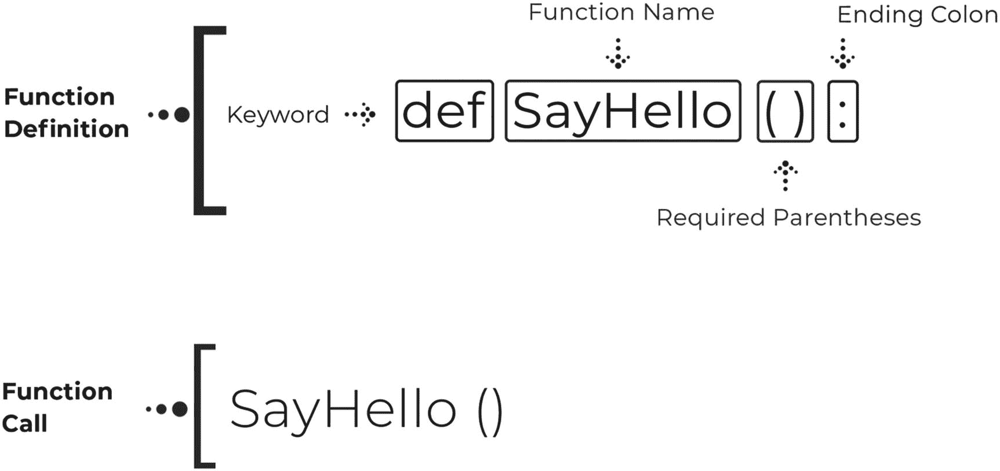
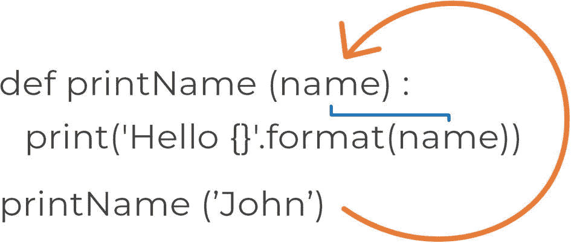
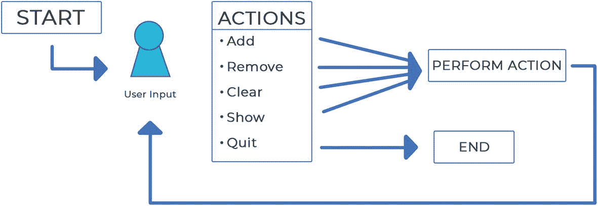

# 五、函数

本周开始**函数**的话题。除了循环，函数可能是最难理解的主题之一。出于这个原因，这一整周都致力于只涵盖函数。这也是编程中比较重要的课题之一。知道如何使用函数将极大地提高你的编程技能。

函数给了我们能力，使我们的程序更加强大和干净，同时也节省了我们的时间。我们将在第一天回顾它们是如何工作的，但是我们使用函数的原因是因为它具有编写一次并重复调用的能力。

我们已经构建的许多程序都可以从函数的使用中受益，尤其是像 Hangman 这样的游戏。在周末，我们将构建一个类似购物车列表的程序。我们将了解为什么将添加、删除和显示等任务分离到不同的函数中很重要。

**概述**

*   如何使用函数以及它们是什么

*   使用参数传递数据

*   从函数返回数据

*   理解范围及其重要性

*   创建购物车程序

### 挑战问题

请记住，算法只不过是一组循序渐进的指令。如果我们要写一个换灯泡的算法，会是什么样子？有哪些需要考虑的问题？需要几个步骤？最有效的方法是什么？使用下面的算法，可能会出现什么问题？

1.  取出备用灯泡。

2.  关闭给当前灯泡供电的开关。

3.  拧下电流灯泡。

4.  拧入备用灯泡。

5.  打开给新灯泡供电的开关。

6.  如果备用灯泡没有打开，重复步骤 1 至 5。

## 星期一:创建和调用函数

今天的课程是关于理解什么是函数，函数的阶段，以及如何编写函数。我们将发现为什么它们在程序中如此重要，以及它们将如何使我们的生活变得更容易。

为了继续今天的内容，让我们从“ *python_bootcamp* ”文件夹中打开 Jupyter 笔记本。一旦它打开，创建一个新文件，并将其重命名为“*周 _05。*"接下来，制作第一个标题为:"**的单元格 markdown，创建&调用函数。**“我们将开始在那个牢房下面工作。

### 什么是函数？

编程最好的参考资料之一是 **w3schools。** <sup>[1](#Fn1)</sup> 他们甚至还有 Python 教程。他们的官方文档对函数的描述如下:

> 函数是一段代码，只有在被调用时才会运行。

> 您可以将数据(称为参数)传递到函数中。

> *函数可以返回数据结果。* <sup>[2](#Fn2)</sup>

程序经常需要重复运行相同的代码，尽管循环在这方面有所帮助，但我们不希望在整个程序中多次编写相同的循环。这个问题的解决方案是使用一个函数。它们本质上存储了只在被调用时才运行的代码。

所有函数通常都与单一任务或程序相关联。这使得我们更容易将程序分解成函数。如果您构建一个需要重复打印五行信息的程序，并且您需要在五个不同的地方输出它，您将需要编写 25 行代码。使用函数时，您可以将这五行存储在一个块中，并在需要时调用该函数，结果是五行输出信息，五行调用函数，总共十行。这导致了一个更有效的程序。

### 函数语法

像循环一样，函数遵循一个精确的模式来创建每一个函数。它们都是以关键字“ **def** ”开头，后面是函数的**名**。该名称是任意的，可以是除 Python 关键字和先前定义的函数之外的任何名称。名字后面紧跟着的是**括号**，括号内是**参数**。我们明天才讨论参数，所以要知道参数是可选的，但是括号是必需的。最后，像任何其他 Python 语句一样，我们需要一个结尾冒号。示例见图 [5-1](#Fig1) 。


图 5-1

函数语法

### 编写您的第一个函数

现在我们知道了语法结构的样子，让我们继续写我们自己的:

```py
# writing your first function
def printInfo( ):               # defines what the function does when called
      print("Name: John Smith")
      print("Age: 45")
printInfo( )                    # calls the function to run
printInfo( )                    # calls the function again

```

去查查手机。我们定义了一个名为 printInfo 的函数，它在每次被调用时打印两行信息。下面我们调用函数两次，输出信息两次。这似乎不是一个更有效的程序，但是想象一下你需要在一个程序中输出 20 次同样的信息。简洁高效。

### 函数阶段

在 Python 中，每个函数有两个阶段。第一阶段是*函数定义*。您可以在这里定义函数的名称、它应该接受的任何参数，以及它应该在与之相关的代码块中做什么。见图 [5-2](#Fig2) 。



图 5-2

函数生命周期的两个步骤(定义和调用)

第二阶段被称为*函数调用*。函数在被调用之前是不会运行的，所以你可以定义尽可能多的函数，但是如果你从来不调用其中的一个，那么什么都不会发生。当您调用一个函数时，它将运行定义中的代码块。

### UDF 与内置

在不知不觉中，你一直在使用函数。范围、打印、镜头等函数。，都被称为“**内置**函数。它们被包含在 Python 中，因为它们有特定的用途来帮助构建我们的应用程序。既然我们正在学习函数，我们可以开始创建我们自己的所谓的**UDF**或**用户定义函数**

### 执行计算

让我们再看一个基本函数的例子，但是这次不仅仅是打印代码块内部:

```py
# performing a calculation in a function
def calc( ):
      x, y = 5, 10
      print(x + y)
calc( )              # will run the block of code within calc and output 15

```

去查查手机。每次调用 calc 函数时，我们都会得到一个输出值 **15** 。

### 周一练习

1.  **打印名字**:定义一个名为 *myName* 的函数，让它在被调用时打印出你的名字。

2.  **Pizza Toppings** :定义一个函数，打印出所有你喜欢的 Pizza Toppings。调用该函数三次。

虽然今天没有太多的编码，但是理解函数的价值是很重要的。现在我们可以将代码分成块，这将使程序更容易阅读和运行。

## 星期二:参数

我们使用函数的主要原因之一是为了使我们的代码模块化。今天的主题是了解如何在函数中使用参数以及它们是什么。

为了继续本课，让我们从之前的笔记本文件“ *Week_05* ”继续，并在底部添加一个标有“**参数”的降价单元格。**

### 什么是参数？

参数是在函数定义中声明的临时变量。虽然我们到目前为止编写的函数执行特定的任务，但是它们不是模块化的，因为它们总是为每个调用输出相同的响应。当要调用不同值的函数时，需要使用**参数**。在函数定义的括号内是您要声明参数名称的地方。这是一个任意变量名，用于引用函数块中的值；但是，您通常希望它与您正在处理的数据相关。当调用函数时，您将传入运行代码块所需的值。取图 [5-3](#Fig3) 。



图 5-3

接受函数的参数

### 注意

参数是传递给函数调用的值。在上图中，第 3 行将参数“John”传递给 printName 函数，该值将被传递给参数名

该函数由括号内的参数“ *name* 定义。同样，它可以被称为任何东西，但是我们期望传入一个人的名字。该代码块在执行时将使用格式化打印语句中该参数的值。第 3 行的调用是我们将值传递给函数的地方，称为参数。在这个例子中，我们将得到“**你好约翰**”的输出。我们现在可以调用这个函数，传入任何我们想要的字符串值，它会打印出来。这个函数现在是模块化的。

### 传递单个参数

让我们使用图 [5-3](#Fig3) 中的例子来创建我们的第一个接受参数的函数:

```py
# passing a single parameter into a function
def printName(full_name):
      print( "Your name is: { }".format(full_name) )
printName("John Smith")
printName("Amanda")

```

去查查手机。我们会得到两个不同的输出，它们使用相同的函数。参数允许我们为每个调用传递不同的信息。

### 多参数

前面的示例将字符串数据类型传递给函数，因此让我们看看如何传递数字并创建一个格式良好的打印语句:

```py
# passing multiple parameters into a function
def addNums(num1, num2):
      result = num1 + num2
      print( "{ } + { } = { }".format(num1, num2, result) )
addNums(5, 8)      # will output 13
addNums(3.5, 5.5)    # will output 9.0

```

去查查那个手机。我们的函数定义期望两个数字被传入参数 *num1* 和 *num2* 。在函数块中，我们通过参数名来引用这些值。

### 传递列表

当大量数据存储在列表中时，传递它们通常是最容易的。因此，函数非常擅长在列表上执行重复的任务。让我们看一个例子:

```py
# using a function to square all information
numbers1 = [ 2, 4, 5, 10 ]
numbers2 = [ 1, 3, 6 ]
def squares(nums):
      for num in nums:
              print(num**2)
squares(numbers1)
squares(numbers2)

```

去查查手机。你可以看到它会输出所有的平方数。这比为每个列表编写两次 for 循环要高效得多。这就是函数和传入参数的美妙之处。

### 注意

记住 *nums* 是一个任意的名字，是我们在函数块中引用的变量。

### 默认参数

在许多情况下，参数可以与默认值相关联。以 *pi* 的值为例；它将始终是 3.14，因此我们可以将一个名为 *pi* 的参数设置为该精确值。这允许我们调用已经为 *pi* 定义了值的函数。如果你想让 *pi* 有一个更简洁的值，你可以，但是一般来说 **3.14** 就足够了:

```py
# setting default parameter values
def calcArea(r, pi=3.14):
      area = pi * (r**2)
      print( "Area: { }".format(area) )
calcArea(2)     # assuming radius is the value of 2

```

去查查手机。现在我们可以运行这个函数，而不需要为 *pi* 传递一个值。默认参数**必须**始终跟随非默认参数。在这个例子中，半径必须首先声明，然后是 *pi* 。

### 使参数可选

有时，您需要创建带有可选参数的函数。最好的例子总是中间名；有些人有，有些人没有。如果我们想写一个在两种情况下都能正确输出的函数，我们需要把中间的名字作为可选参数。我们通过将空字符串值指定为默认值来实现这一点:

```py
# setting default parameter values
def printName(first, last, middle=""):
      if middle:
              print( "{ } { } { }".format(first, middle, last) )
      else:
              print( "{ } { }".format(first, last) )
printName("John", "Smith")
printName("John", "Smith", "Paul")     # will output with middle name

```

去查查手机。无论您是否传入中间名，该函数都将高效运行。请记住我们参数的顺序！根据函数定义，参数必须从左到右排列。如果在第二次调用中*【保罗】*被作为第二个值放在*【约翰】*之后，那么我们的函数会将*【保罗】*赋给参数*【最后一个*】

### 命名参数赋值

在函数调用期间，您可以显式地将值赋给参数名。当您不想混淆传入值的顺序时，这很有用，因为默认情况下它们是从左到右工作的。如果您愿意，可以使用参数名为每个参数赋值，但大多数情况下这是不必要的。让我们来看一个例子:

```py
# explicity assigning values to parameters by referencing the name
def addNums(num1, num2):
      print(num2)
      print(num1)
addNums(5, num2 = 2.5)

```

去查查手机。这里，我们使用一个关键字参数在调用中显式地分配了 *num2* 的值。

### *参数

使用* **args** 允许您向函数传递可变数量的参数。这允许您使函数更加模块化。神奇的不是这里的关键字“*args*；实际上是一元运算符(*)允许我们执行这个特性。理论上，你可以用任何人替换 args 这个词，比如“* *数据*，它仍然可以工作。然而，args 是整个行业的默认和通用标准。让我们看看如何在函数调用中使用参数:

```py
# using args parameter to take in a tuple of arbitrary values
def outputData(name, *args):
      print( type(args) )
      for arg in args:
              print(arg)
outputData("John Smith", 5, True, "Jess")

```

去查查手机。您会注意到 args 参数将调用中未赋值的所有值作为一个元组，作为第一个 print 语句的输出。然后，我们输出元组中的每个参数。当访问块中的 args 参数时，不需要包含一元运算符。注意"**约翰·史密斯**"没有被打印出来。那是因为我们在函数定义中有两个参数， *name* 和* *args* 。函数调用中的第一个参数被映射到 name 参数，其余的被插入到 args 元组中。当您不确定会有多少个参数时，这是一个有用的机制。

### **夸格斯

像 args 一样， **kwargs** 允许我们在函数中接受任意数量的值；然而，它作为一个带有关键字参数的字典。**关键字参数**是通过键传递的值，这使得我们可以在函数块中轻松地访问它们。同样，这里的神奇之处在于两个一元操作符(**)而不是 kwargs 的关键字。让我们来看看:

```py
# using kwargs parameter to take in a dictionary of arbitrary values
def outputData(**kwargs):
      print( type(kwargs) )
      print( kwargs[ "name" ] )
      print( kwargs[ "num" ] )
outputData(name = "John Smith", num = 5, b = True)

```

去查查手机。这一次，我们可以看到该类型是一个字典，我们能够像处理任何其他字典一样输出 kwargs 参数中的每个键值对。这个单元格中的关键字参数在函数调用中，在这里我们专门声明了一个要传递给函数的键和值。

### 星期二练习

1.  **用户输入**:要求用户输入一个单词，并将该单词传递给一个函数，该函数检查该单词是否以大写字母开头。如果确实输出“**真**，否则“**假**”。

2.  **没有名字**:定义一个函数，它接受两个参数*，名字*和*姓氏*，并且这两个参数都是可选的。如果没有值传入参数，它应该输出“**没有名字传入**”；否则，它应该打印出名称。

今天讲的都是函数参数以及如何使用它们。参数的使用使我们的函数在程序中模块化，这样我们就可以成功地减少编写的代码行。

## 周三:返回声明

到目前为止，我们已经打印出了函数所改变的数据，但是如果以后需要访问这些信息，该怎么办呢？这就是使用 **return** 语句的地方。函数可以操作数据，然后将数据发送回函数调用发生的地方，以保存信息供以后使用。今天我们将学习如何做到这一点，以及它为什么有用。

为了跟上这一课，让我们从笔记本文件“ *Week_05* ”继续，只需在底部添加一个标有“**退货单**”的降价单元格

### 它是如何工作的

图 [5-4](#Fig4) 描绘了如何先计算传入函数的两个参数，然后返回到调用的原始位置存储到变量中。这个变量现在可以在程序的后面与那个值一起使用。


图 5-4

返回信息并存储到变量中

您可以返回任何数据类型，但只能返回一个变量。当您需要返回多条数据时，您将返回一组数据:

```py
>>> def returnMultiple():
>>>           a = 5
>>>           b = 10
>>>           return [a, b]     # one data type holding multiple items

```

### 使用返回

return 语句用于将信息发送回函数调用发生的地方。到目前为止，我们已经使用了 print 语句来输出信息，但是如果我们需要在程序的后面访问该值，这就行不通了。相反，我们可以返回值并保存到一个变量中，以便以后使用。让我们来看几个例子:

```py
# using return keyword to return the sum of two numbers
def addNums(num1, num2):
      return num1 + num2
num = addNums(5.5, 4.5)    # saves returned value into num
print(num)
print( addNums(10, 10) )     # doesn't save returned value

```

去查查手机。我们将得到 **10** 和 **20** 作为输出。当我们第一次调用 *addNums* 时，它用 **5.5** 和 **4.5** 运行函数并返回总和。然后，它将返回值存储在 *num* 中。第二次调用该函数时，我们简单地就地打印它。从这里开始，我们可以重用存储在 num 中的值，但不能重用第二次调用返回的值。

### 三元运算符

三元运算符是一种简化的 Python 分支语句。这些运算符可用于将值赋给变量，或者在这种情况下，决定从函数返回什么:

```py
# shorthand syntax using a ternary operator
def searchList(aList, el):
      return True if el in aList else False
result = searchList( [ "one", 2, "three" ], 2)    # result = True
print(result)

```

去查查手机。三元运算符返回 True，因为满足给定的条件。通常写出的相同代码如下所示:

```py
>>> if el in aList:
>>>         return True
>>> else:
>>>         return False

```

如果可以的话，尽量少写是一个好习惯，但这不是必须的。

### 周三练习

1.  **全名**:创建一个函数，接受名和姓，并返回两个名字的组合。

2.  **用户输入**:在一个函数中，请求用户输入。让这个函数返回要存储在函数外部变量中的输入。然后打印出输入内容。

今天我们学习了如何从函数中获取信息。这将允许我们保存它处理的数据以备后用。

## 星期四:范围

今天我们要讨论一个叫做范围的重要概念。这个概念处理程序中声明的变量的可访问性。我们将讨论不同类型的作用域以及如何处理它们。

为了跟上这一课，让我们从之前的笔记本文件“ *Week_05* ”继续，并简单地在底部添加一个标有“ **Scope** ”的单元格

### 范围的类型

在 Python 中，作用域有三种类型:**全局、函数、类**。我们还没有复习类，所以我们将在下一章讨论类的范围。在不知道的情况下，我们使用了另外两种类型的作用域。**全局作用域**是指你声明一个变量可以被整个文件或应用程序访问。到目前为止，我们声明的大多数变量都是全局变量；然而，在你编写的大多数程序中，你会想要避免全局变量。不过目前在 Jupyter 笔记本上还可以。**函数作用域**是指被声明的变量，只能在函数内部访问。在函数内部声明的变量不能在函数外部访问，因为一旦函数终止，在函数内部声明的变量也会终止。

### 全局范围访问

定义了全局属性后，文件的其余部分就可以访问它们了。但是，我们必须记住函数作用域是如何工作的。即使您声明了一个整个文件都可以访问的变量，它在函数中也是不可访问的。让我们看一个例子:

```py
# where global variables can be accessed
number = 5
def scopeTest( ):
       number += 1      # not accessible due to function level scope
scopeTest( )

```

去查查手机。我们最终会收到一个错误，因为该函数仅限于在其中声明或传入的变量。

### 注意

传入时，它只传递值，不传递变量。

### 处理函数范围

当处理函数中声明的变量时，通常不需要在函数外部访问它。但是，为了访问该值，最佳做法是返回它:

```py
# accessing variables defined in a function
def scopeTest( ):
      word = "function"
      return word
value = scopeTest( )
print(value)

```

去查查手机。现在我们可以访问函数中定义的单词，我们只需将返回值赋给另一个变量就可以了。

### 原地算法

当传递变量到一个函数中时，你只是传递那个变量的值，而不是变量本身。使得以下内容不会改变变量 *num* :

```py
>>> num = 5
>>> def changeNum(n):
>>>       n += 5
>>>       print(num)

```

但是，当通过索引改变信息时，这是不同的。由于索引的工作方式，通过内存位置而不是引用，通过索引位置改变列表中的元素将改变原始变量。让我们来看一个例子:

```py
# changing list item values by index
sports = [ "baseball", "football", "hockey", "basketball" ]
def change(aList):
      aList[ 0 ] = "soccer"
print("Before Altering: { }".format(sports) )
change(sports)
print( "After Altering: { }".format(sports) )

```

去查查手机。注意当函数被调用时， *sports* 列表中的第一项是如何变化的。这是由于在传入列表时索引本身的值发生了变化。这些被称为**就地算法**，因为无论你在哪里改变信息，它都会直接改变内存位置的值。

### 周四练习

1.  **Names** :创建一个函数，在给定的索引处用 name 参数改变传入的列表。这样，如果我传入*【比尔】*和索引 *1，*，它将把*【富人】*变成*【比尔】*在下面使用列表和函数定义:

    ```py
    >>> names = ['Bob', 'Rich', 'Amanda']
    >>> def changeValue(aList, name, index):

    ```

今天对于理解可变可达性是如何工作的很重要。知道这些信息会保证变量的安全。

## 星期五:创建购物车

对于今天的项目，我们将构建一个在列表中存储产品的应用程序。我们将能够添加、删除、清除和显示购物车中的产品。将使用过去几周教授的所有概念。

为了继续本课，让我们从之前的笔记本文件“ *Week_05* ”继续，并在底部添加一个 markdown 单元格，内容为“**星期五项目:创建购物车**”

### 完工图纸

正如我们本周介绍的函数一样，最终的设计将基于我们程序动作的逻辑。函数执行特定的任务，通常是一个动作。对于我们的购物车程序，我们需要考虑的操作是添加、删除、清除和显示购物车中的商品。逻辑设计将如图 [5-5](#Fig5) 所示。



图 5-5

购物车程序逻辑

我们将确保有一个包含循环和处理用户输入的主函数。

### 初始设置

像上周的项目一样，我们将在单个单元格中创建程序，所以请确保您熟悉我们在该项目中使用的概念。首先，让我们从 Jupyter Notebook 导入清算函数*，并声明一个要使用的全局变量:*

```py
1| # import necessary functions
2| from IPython.display import clear_output
4| # global list variable
5| cart = [ ]

```

我们想要声明一个全局变量 *cart* ，以便在整个程序中使用。我们将使用一个列表，因为我们需要存储几个条目。使用列表还允许我们直接编辑变量，而不必因为项目分配的工作方式而传递变量。

### 添加项目

正如初始设计中所述，我们首先要创建我们的函数。我们将从向我们的*购物车*变量添加商品的函数开始:

```py
 7| # create function to add items to cart
 8| def addItem(item):
 9|          clear_output( )
10|          cart.append(item)
11|          print( "{ } has been added.".format(item) )

```

我们在创建主循环之前不会调用这个函数。当被调用时，该函数将清除输出，追加传入参数的*项*，并输出给用户。

### 移除项目

接下来，我们将创建从我们的*购物车*变量中移除商品的函数:

```py
13| # create function to remove items from cart
14| def removeItem(item):
15|           clear_output( )
16|           try:
17|           cart.remove(item)
18|           print( "{ } has been removed.".format(item) )
19|           except:
20|           print("Sorry we could not remove that item.")

```

我们希望确保在 remove 语句周围包含一个 **try 和 except** 子句，因为当删除一个不存在的项目时，程序会崩溃。这可以防止这种情况发生，并且可以正确地删除该项目，或者向用户输出该项目不起作用。

### 展示购物车

我们希望用户能够随时查看购物车，这使用了一个简单的循环:

```py
22| # create a function to show items in cart
23| def showCart( ):
24|           clear_output( )
25|            if cart:
26|            print("Here is your cart:")
27|            for item in cart:
28|                           print( "- { }".format(item) )
29|            else:
30|            print("Your cart is empty.")

```

在该函数中，我们首先清除输出，然后检查购物车中是否有商品。如果它是空的，我们让用户知道；否则，我们将循环遍历这些项目，每行输出一个。

### 清理购物车

我们需要的最后一个函数是清理购物车的能力:

```py
32| # create function to clear items from cart
33| def clearCart( ):
34|           clear_output( )
35|           cart.clear( )
36|           print("Your cart is empty.")

```

使用内置的 clear 方法，我们清除购物车中的所有商品，并让用户知道。

### 创建主循环

到目前为止，我们已经创建了处理用户动作的函数。现在我们需要设置程序的主函数，它将包含主循环和结束函数:

```py
38| # create main function that loops until the user quits
39| def main( ):
40|           done = False
42|           while not done:
43|           ans = input("quit/add/remove/show/clear: ").lower( )
45|           # base case
46|           if ans == "quit":
47|                           print("Thanks for using our program.")
48|                           showCart( )
49|                           done = True
51| main( )    # run the program

```

去查查手机。你现在应该可以输入**“quit”**并退出程序；否则，它将继续运行。除了退出，我们还没有设置要做什么；然而，我们已经确保我们的基本情况设置正确，以免产生无限循环。我们还使用布尔变量 *done* 来跟踪主循环是否完成。

### 处理用户输入

这个程序的最后一步是添加我们之前创建的处理用户输入的函数:

```py
49|              done = True   ◽◽◽
50|      elif ans == "add":
51|                      item = input("What would you like to add? ").title( )
52|                      addItem(item)
53|      elif ans == "remove":
54|                      showCart( )
55|                      item = input("What item would you like to remove? ").title( )
56|                      removeItem(item)
57|      elif ans == "show":
58|                      showCart( )
59|      elif ans == "clear":
60|                      clearCart( )
61|      else:
62|                      print("Sorry that was not an option.")
64| main( )    # run the program

```

去查查手机。我们已经包含了几个 *elif 语句*来处理用户的输入。现在，根据他们的选择，我们将能够调用必要的函数。在第 **51** 和 **55** 行，我们接受用户的第二次输入，键入他们想要添加或删除的项目，但为了区分大小写，我们确保将其更改为标题大小写。如果他们没有选择合适的任务来执行，我们确保通过 *else 子句*让他们知道。

### 最终输出

祝贺您完成这个项目！由于项目的规模，你可以在 *Github* 上找到完整版本的代码。要找到这个项目的具体代码，只需打开或下载“ **Week_05.ipynb** ”文件。如果您在这个过程中遇到了错误，请确保将您的代码与该文件中的代码进行交叉引用，看看您可能在哪里出错了。

今天，我们能够使用函数构建一个完整的购物车程序。我们可以看到，我们的主循环是干净的，易于阅读。即使是这个小程序，也能看出函数的威力。

## 每周总结

本周是我们提高编程技能的一大步。我们了解到函数在减少代码行数方面非常有用。它们有助于使我们的程序更高效、更易读。它们可以使用参数变得模块化，甚至可以使用 *return* 关键字返回特定的数据。我们讨论的最后一个概念是如何处理项目中的范围，以及它如何处理变量的可访问性。在周末，我们一起构建了购物车程序，以展示在程序中使用函数的能力。下周我们将继续学习称为数据集合的高级变量类型的知识。

## 挑战问题解决方案

这个挑战的目的是让你开始思考所安排的步骤中可能出现的错误。在你开始编程算法之前，你需要理解你设计的步骤可能会出错，因为计算机只有在你编程后才会变得聪明。这个算法有几个问题。最明显的是在第二步和第三步之间，我们试图更换灯泡。你检查过灯泡是否太热而不能触摸了吗？在这种情况下，我们没有，所以任何人直接遵循这个算法可能会烧伤。作为人类，基本本能占据了主导地位，我们会停止触摸它，但计算机会继续执行它们被告知的任务。其他突出的问题包括检查替换灯泡的类型是否正确，以及如何处理我们刚刚替换的灯泡。算法没有指定一个步骤来适当地处理它，那么我们就永远把它留在我们手中吗？这些是我们在更换灯泡时需要考虑的步骤。当你开始构建自己的算法时，你不仅需要确保算法有效，还需要考虑如何处理容易出错的情况。

## 每周挑战

要测试你的技能，请尝试以下挑战:

1.  **重构 Hangman** :这是一个很大的任务，所以要轻装上阵，但是要尝试重构上周的 Hangman 项目来使用函数。想想 Hangman 需要什么动作，把那些任务变成函数。

2.  **通过索引移除**:在购物车程序中，设置移除函数，这样你也可以通过索引移除。设置列表，使其以编号列表的形式打印出来，当被要求删除一个项目时，用户也可以在列表项目旁边键入一个数字。例如，使用下面的代码，你可以输入 *"1"* 来删除 *"Grapes"* :

    ```py
    >>> 1) Grapes
    >>> What would you like to remove? 1

    ```

<aside class="FootnoteSection" epub:type="footnotes">Footnotes [1](#Fn1_source)

[T2`www.w3schools.com/python/`](https://www.w3schools.com/python/)

  [2](#Fn2_source)

[T2`www.w3schools.com/python/python_functions.asp`](https://www.w3schools.com/python/python_functions.asp)

 </aside>