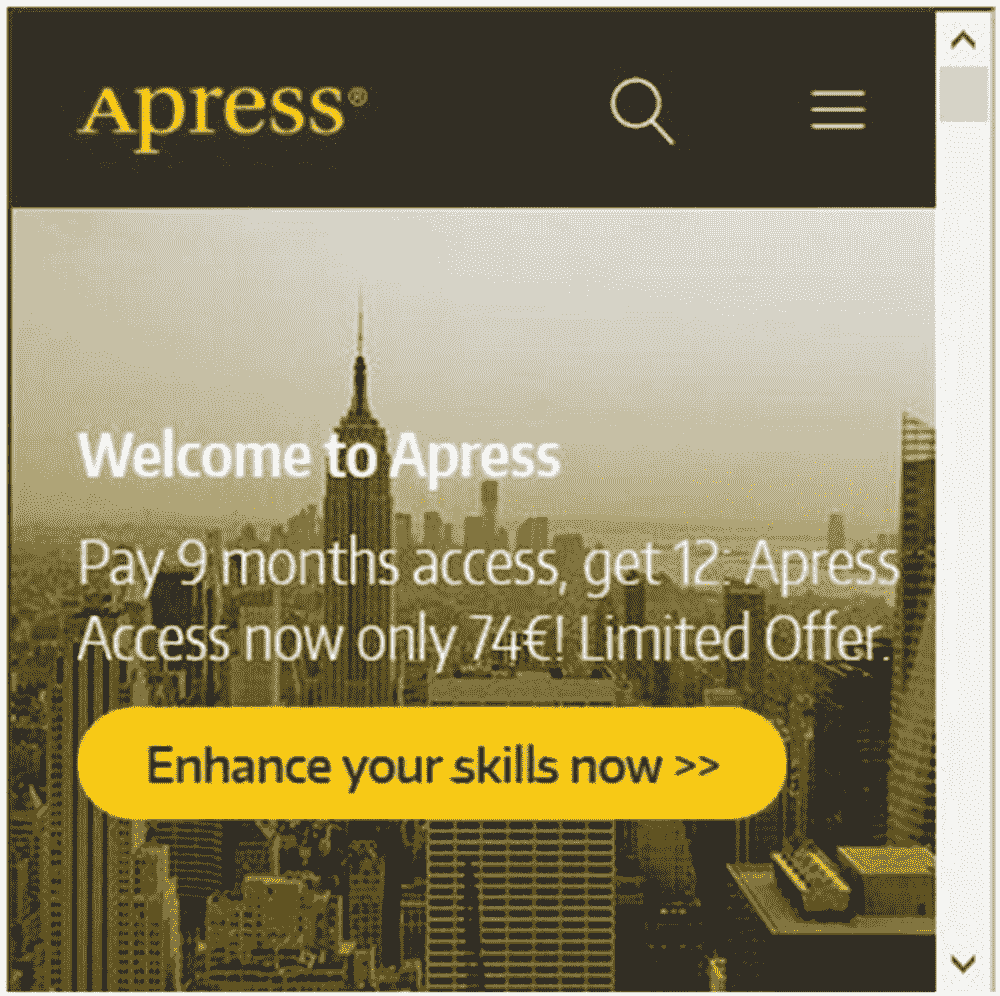

# 七、框架和文本框

前一章解释了如何定位默认、单选、复选框和选择列表等按钮。每个按钮都有与之关联的功能，如提交、选择或取消选择。按钮功能通过鼠标点击来实现(参见第 [3](03.html) 章)。本章讨论如何定位框架和文本框等 web 元素。它还解释了如何处理网页上的单个和多个框架。

本章还介绍了文本框类型、相关的 Selenium WebDriver 命令以及值插入。

## 内联框架

iframe 是 HTML 中另一种可用的 web 元素。它广泛用于嵌入与媒体相关的 web 元素(视频、图像等)。)在网页上。YouTube 视频和广告是网页嵌入视频和图像的两个最流行的例子。

框架可以嵌入任何 HTML web 元素。框架可以相互嵌套。Iframes 在开始时使用`<iframe>`标记，在结束时使用`</iframe>`标记。

Note

Iframes 的测试很重要，因为它们通常包含从其他网站或来源嵌入的 web 元素。

为了测试 iframe 中的 web 元素，您需要切换到那个特定的框架。很难定位 iframe，因为它是类似 DOM 的结构。当堆栈结构中有多个 iframe 元素时，切换到相关的 iframe 可以访问其中的 web 元素。

Note

一个*内嵌框架*是另一个用来描述 iframe 的术语。

在以前的 HTML 版本中，frameset 标签包含 frame 标签，但是 iframe 不需要这些标签。一个主要的区别是 iframe 中可以有嵌套的 iframe，这在框架中是不允许的。在 Selenium 中，框架和 iframes 被同等对待；因此，本章只测试 iframes。

HTML 中 iframe 的一个简单例子如图 [7-1](#Fig1) 所示。



图 7-1

单个 iframe

```py
<iframe id="new_frame" name="apress" src="https://www.apress.com" height="300" width="300"></iframe>

```

前面的代码在 iframe 中显示了一个网站。您可以看到 iframe 包含到站点的链接。source ( `src`)属性可以具有在网页之内或之外的 web 元素。高度和宽度可以是像素或百分比；这里使用了像素。

Note

HTML5 中不赞成使用 Frame 和 frameset 标记。而是使用 Iframes。

## 切换到 Iframe

与定位 web 元素类似，可以使用 switch 函数定位 iframes。当一个定义的 iframe 被切换时，那么只有测试可以在 iframe 中的任何 web 元素上执行。许多网页使用 iframe，因为在与 iframe 交互后不需要重新加载或刷新页面。以下部分描述了使用 Selenium 在 Python 中切换到 iframe 的方法。

### 使用 ID 切换

可以使用 ID 属性来定位 iframe，这是使用 switch 函数来完成的。Selenium 中的 Python 应用于前面的代码。ID 属性的值是`new_frame`。

```py
# Switch to the frame with id attribute
driver.switch_to_frame("new_frame")

```

### 使用名称切换

name 属性也可以用来定位网页上的 iframe。

```py
# Switch to frame with name attribute
driver.switch_to_frame("apress")

```

### 使用索引切换

如果网页包含一个以上的 iframe(见图 [7-2](#Fig2) )，使用索引值切换到已定义的 iframe。这个指数值是由 Selenium 提供的。以下是多个框架的 HTML 代码。


图 7-2

多重 iframe

```py
<center>
<div><h5>Frame0</h5>
<iframe id="new_frame0" name="apress" src="https://www.apress.com" height="150" width="400"></iframe>
</div>
<div><h5>Frame1</h5>
<iframe id="new_frame1" name="bing" src="https://www.bing.com" height="150" width="400"></iframe>
</div>
<div><h5>Frame2</h5>
<iframe id="new_frame2" name="wiki" src="https://www.wikipedia.org" height="150" width="400"></iframe>
</div>

```

下面是 Python 代码。

```py
# Switch to frame 1
driver.switch_to_frame(0)

# Switch to frame 2
driver.switch_to_frame(1)

# Switch to frame 3
driver.switch_to_frame(2)

```

不建议使用此方法，因为在网页中添加或删除其他框架时，框架的位置可能会发生变化。

Note

Selenium 从 0(零)开始初始化网页上 iframe 的索引值。

### 作为一个元素切换

当网页上的多个 iframe 具有相同的 id 和名称时，切换到特定的框架是很困难的。在这些情况下，iframes 可以通过 web 元素来标识。ID 和 name 等 Web 元素用于切换到已定义的 iframes。

XPath、CSS 选择器或 classname 等 Web 元素定位器用于定位 iframes。其他 web 定位器，如 linkText 或 partialLinkText，不能用于定位 iframes。当一个网页上有多个 iframess 时，标签名 web locator 不是优选的，因为很难选择一个唯一的 iframe。

```py
# Switch  to Iframes as Web Elements (Xpath)
# Switch to frame 1
driver.switch_to_frame("//iframe[@src='https://www.apress.com']")

# Switch to frame 2
driver.switch_to_frame("//iframe[@src='https://www.bing.com']")

# Switch to frame 3
driver.switch_to_frame("//iframe[@src='https://www.wikipedia.org']")

```

使用 XPath 定位 iframe，这对于每个框架都是不同的。

Note

由于锚标记不可用，链接或部分链接文本不用于切换 iframe。

## 切换到主 Iframe

有两种方法可以切换到主框架，这将在下面讨论。

### 默认内容

对于默认内容，所有可用的 iframes 都被终止，并且控件被切换回网页。当控件返回到页面时，不会与 iframe 中的 web 元素进行交互。

```py
driver.switch_to.default_content()

```

### 父框架

对于父框架，当前的 iframe 被终止，并且控制被切换到它的父 iframe。如果没有对应于所选或当前 iframe 的父 iframe，则当前 iframe 被终止，并且控制被切换回网页。

```py
driver.switch_to.parent_frame()

```

## 有等待的帧

当处理 iframes 时，您可以使用等待来切换到任何帧，因为这些帧由于外部源或链接而需要更多的时间来加载。下面是几个等待的例子。

*   `Frame ID :`

*   `Frame Name :`

```py
iframe=WebDriverWait(driver, 5).until(EC.frame_to_be_available_and_switch_to_it(By.ID,"iframe_id"))

```

*   `Frame XPath :`

```py
iframe2 =WebDriverWait(driver, 5).until(EC.frame_to_be_available_and_switch_to_it(By.NAME,"iframe_name"))

```

*   `Frame CSS :`

```py
iframe3 =WebDriverWait(driver, 5).until(EC.frame_to_be_available_and_switch_to_it(By.XPATH,"iframe_xpath"))

```

```py
iframe4 =WebDriverWait(driver, 5).until(EC.frame_to_be_available_and_switch_to_it(By.CSS_SELECTOR,"iframe_css_selectors"))

```

现在让我们继续讨论文本框。

## 文本框

文本框接受文本形式的用户输入。该文本存储在数据库中或由网页使用。有两种类型的文本框:单行和多行。

### 单行文本框

单行文本框通常被视为登录选项，其中登录名和密码都需要单行文本。文本框是单行的矩形形状；它有各种尺寸。HTML 中的输入标签定义了一个单行的文本框。下面是一个单行文本框的 HTML 示例。如图 [7-3](#Fig3) 所示。


图 7-3

单行文本框

```py
<h1>Single Line Textbox</h1>

<label for="book">Book Name:</label>
<input type="text" id="book1" name="book">

```

单行文本框通常用在表单中或用作网页上的搜索框。谷歌搜索引擎是最常用的单行文本框。

### 多行文本框

当文本使用多行时，就需要多行文本框。多行文本框通常用于电子商务网站上的评论框或脸书上的帖子。大小可以根据行和列(高度和宽度)而变化。为了定义一个多行文本框，使用了`<textarea>`标签。图 [7-4](#Fig4) 显示文本区域和其中的文本值。下面是它的 HTML 代码。


图 7-4

多行文本框

```py
<h1>Textarea</h1>

<label for="book">Book Name:</label><br>

<textarea id="book2" cols="50" rows="5">
Python Selenium Sujay.
</textarea>

```

可以拖动右下角的文本区域来增加其大小。可以通过指定相应的参数来限制 textarea 的大小。

Note

不可编辑的文本框仅用于显示与其关联的值。

### 插入值

textbox 和 textarea 用于从用户处获取值。这些值存储在数据库中，或者对照数据库中的值进行验证，以相应地授权或应用限制。要测试 textbox 或 textarea 是否可以接收输入，您需要向它发送值。这是通过在带有 Selenium 的 Python 中使用`send_keys`函数来完成的。

```py
#Import libraries
from selenium import webdriver

#Open Firefox browser
driver=webdriver.Firefox()

#Navigate to URL
driver.get("http://www.apress.com")

#Find Search box (Single Line Textbox)
text_box=driver.find_element_by_name("query")

#String Value to be Inserted i.e. query in search box
text_box.send_keys("Python Testing with Selenium")

#Insert Value
text_box.submit()

# Quit Firefox
driver.quit()

```

Note

在 textbox 和 textarea 中插入值在很大程度上是相同的；唯一的区别是包含它们的行。

### 从 Textbox 和 Textarea 获取值

一个测试用例可以检索文本框或文本区域的输入值。在出现错误的情况下，检索与这些框相关的任何值，以便与预期值进行比较。以下是 textbox 和 textarea 的 Python 代码。

```py
#For Textbox
text_box=driver.find_element_by_id('book1').get_property('value')
print(text_box)

#ForTextarea
text_area=driver.find_element_by_id('book2').get_property('value')
print(text_area)

```

## 摘要

本章简要介绍了 iframe 和 iframe 的定位方法。存在多个 iframes 出现在一个网页上的情况。通过一个例子解释了切换到特定 iframe 的过程。

文本框大致分为两种类型——单行和多行。多行文本框也称为 textarea。您学习了使用定位器识别这两种类型的文本框。您还了解了在两种文本框类型中插入值以及检索与指定文本框相关联的值。

下一章是关于验证 web 元素的。