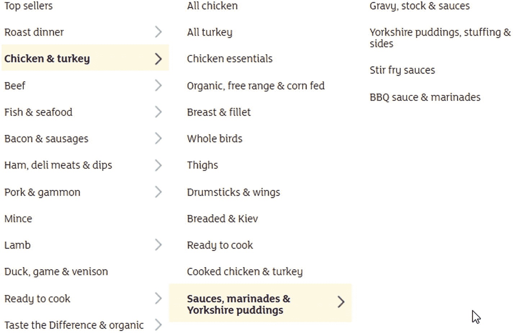
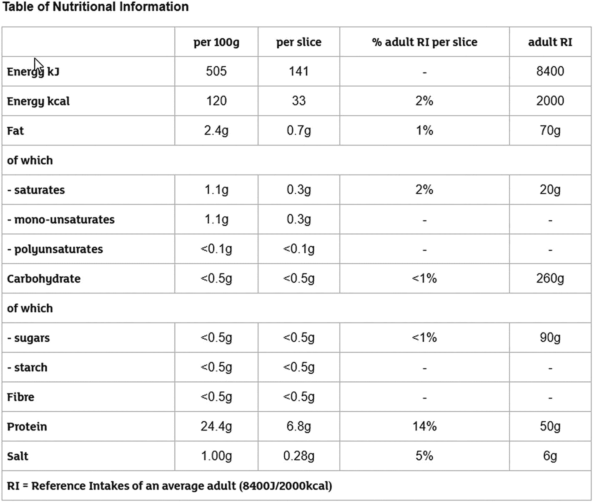
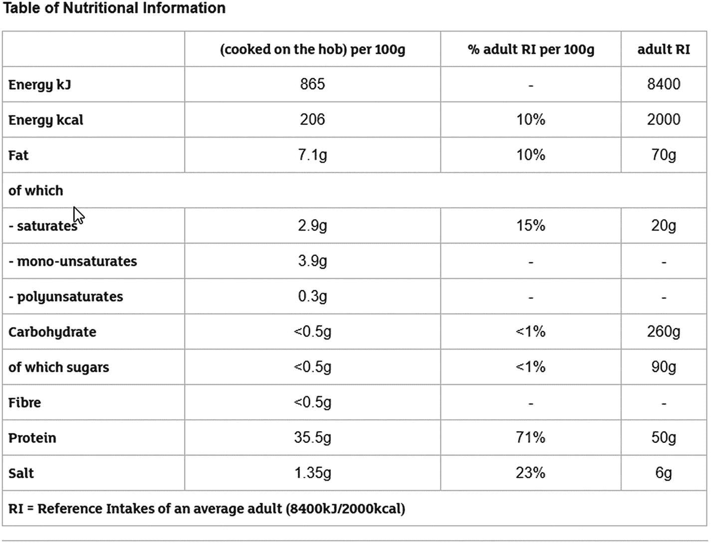

# 3.使用美味的汤

在本章中，你将学习如何使用 Beautiful Soup，一个轻量级的 Python 库，轻松地提取和导航 HTML 内容，忘记过于复杂的正则表达式和文本解析。

在我让您直接进入编码之前，我将告诉您一些关于这个工具的事情，以便您熟悉它。

如果您没有心情阅读枯燥的介绍性文本或基础教程，请随意跳到下一节；如果你不理解我后面的方法或者代码，回到这里。

我发现`Beautiful Soup`很容易使用，它是处理 HTML DOM 元素的完美工具:你可以用这个工具导航、搜索，甚至修改文档。它有极好的用户体验，你会在本章的第一节看到。

## 安装`Beautiful Soup`

尽管我们都知道可以在 Python 环境中安装模块，但为了完整起见，让我(像本书中一样)为这个琐碎但必须完成的任务添加一个小节。

```py
pip install beautifulsoup4

```

数字 4 至关重要，因为我用 4.6.0 版本开发并测试了本书中的例子。

## 简单的例子

经过冗长的介绍，现在是时候开始编码了，用简单的例子让自己熟悉`Beautiful Soup`并尝试一些基本特性，而不用创建复杂的刮刀。

这些例子将展示`Beautiful Soup`的构建模块以及需要时如何使用它们。

您不会抓取现有的站点，而是使用为每个用例准备的 HTML 文本。

对于这些例子，我假设您已经在 Python 脚本或交互式命令行中输入了`from bs4 import BeautifulSoup`,所以您已经准备好使用`Beautiful Soup`。

### 解析 HTML 文本

`Beautiful Soup`的最基本用法是从 HTML 字符串中解析和提取信息，这在每一篇教程中都可以看到。

这是最基本的一步，因为当你下载一个网站时，你把它的内容发送给`Beautiful Soup`解析，但是如果你把一个变量传递给解析器，就没有什么可看的了。

大多数情况下，您将使用以下多行字符串:

```py
example_html = """
<html>
<head>
<title>Your Title Here</title>
</head>
<body bgcolor="#ffffff">
<center>

</center>
<hr/>
<a href="http://somegreatsite.com">Link Name</a> is a link to another nifty site
<h1>This is a Header</h1>
<h2>This is a Medium Header</h2>
Send me mail at <a href="mailto:support@yourcompany.com">support@yourcompany.com</a>.
<p>This is a paragraph!</p>
<p>
<b>This is a new paragraph!</b><br/>
<b><i>This is a new sentence without a paragraph break, in bold italics.</i></b>
<a>This is an empty anchor</a>
</p>
<hr/>
</body>
</html>
"""

```

要用`Beautiful Soup`创建解析树，只需编写以下代码:

```py
soup = BeautifulSoup(example_html, 'html.parser')

```

函数调用的第二个参数定义了使用哪个解析器。如果您不提供任何解析器，您将得到如下错误消息:

```py
UserWarning: No parser was explicitly specified, so I'm using the best available HTML parser for this system ("html.parser"). This usually isn't a problem, but if you run this code on another system, or in a different virtual environment, it may use a different parser and behave differently.

The code that caused this warning is on line 1 of the file <stdin>. To get rid of this warning, change code that looks like this:

 BeautifulSoup(YOUR_MARKUP)

to this:

 BeautifulSoup(YOUR_MARKUP, "html.parser")

```

这个警告被很好的定义，告诉你你需要知道的一切。因为您可以对 Beautiful Soup 使用不同的解析器(见本章后面)，所以您不能假设它将总是使用同一个解析器；如果安装了更好的版本，它将使用该版本。此外，这可能会导致意想不到的行为，例如，您的脚本变慢。

现在您可以使用`soup`变量在 HTML 中导航。

### 解析远程 HTML

`Beautiful Soup`不是 HTTP 客户端，因此您不能向它发送 URL 来进行提取。你可以尝试一下。

```py
soup = BeautifulSoup('http://hajba.hu', 'html.parser')

```

前面的代码会产生如下警告消息:

```py
UserWarning: "http://hajba.hu" looks like a URL. Beautiful Soup is not an HTTP client. You should probably use an HTTP client like requests to get the document behind the URL, and feed that document to Beautiful Soup.

```

要将远程 HTML 页面转换成 soup，应该使用`requests`库。

```py
soup = BeautifulSoup(requests.get('http://hajba.hu').text, 'html.parser')

```

### 解析文件

解析内容的第三个选项是读取文件。你不必阅读整个文件；对于`Beautiful Soup`来说，如果您向它的构造函数提供一个打开的文件句柄，它会完成剩下的工作，这就足够了。

```py
with open('example.html') as infile:
    soup = BeautifulSoup(infile , 'html.parser')

```

### `find`和`find_all`的区别

你会和`Beautiful Soup` : `find`和`find_all`过度使用两种方法。

这两者的区别在于其函数和返回类型:`find`返回**只有一个** `—`如果有多个节点符合条件，则返回第一个；`None,`如果什么也没有发现。`find_all`以列表形式返回与所提供的参数匹配的所有结果；该列表可以为空。

这意味着，每次搜索带有某个`id`的标签时，您都可以使用`find`，因为您可以假设一个`id`在一个页面中只使用一次。或者，如果您正在寻找一个标签的第一次出现，那么您也可以使用`find`。如果你不确定，使用`find_all`，迭代结果。

### 提取所有链接

刮刀的核心作用是从网站中提取链接，这些链接指向其他页面或其他网站。

链接在锚标记(`<a>`)中，它们指向的地方在这些锚的`href`属性中。要查找所有具有`href`属性的锚标记，可以使用下面的代码:

```py
links = soup.find_all('a', href=True)
for link in links:
    print(link['href'])

```

对前面介绍的 HTML 运行这段代码，您会得到以下结果:

```py
http://somegreatsite.com
mailto:support@yourcompany.com

```

`find_all`方法调用包括`href=True`参数。这告诉`Beautiful Soup`只返回那些具有`href`属性的锚标签。这使您可以自由地访问结果链接上的该属性，而无需检查它们是否存在。

要验证这一点，请尝试运行前面的代码，但是要从函数调用中删除参数`href=True`。这会导致一个异常，因为空锚没有一个`href`属性。

您可以将任何属性添加到`find_all`方法中，也可以搜索属性不存在的标签。

### 提取所有图像

抓取工具的第二大使用案例是从网站上提取图像并下载它们，或者只是存储它们的信息，比如它们的位置、显示大小、可选文本等等。

像链接提取器一样，这里可以使用 soup 的`find_all`方法，并指定过滤器标签。

```py
images = soup.find_all('img', src=True)

```

寻找一个 present `src`属性有助于找到有东西要显示的图像。当然，有时 source 属性是通过 JavaScript 添加的，你必须做一些逆向工程`—`，但这不是本章的主题。

### 通过标签的属性查找标签

有时，您必须根据标签的属性来查找标签。例如，我们通过它们的 class 属性来识别上一章需求的 HTML 块。

前面几节已经向您展示了如何在有属性的地方找到标记。现在是时候找到属性有特定值的标签了。

两个用例主导了这个主题:通过`id`或`class`属性进行搜索。

```py
soup.find('p', id="first")
soup.find_all('p', class_="paragraph")

```

您可以在`find`和`find_all`方法中使用任何属性。唯一的例外是`class`，因为它是 Python 中的一个关键字。但是，如你所见，你可以用`class_`来代替。

这意味着您可以搜索来源为`clouds.jpg`的图像。

```py
soup.find('img', src='clouds.jpg')

```

您也可以使用正则表达式来查找特定类型的标记，它们的属性通过某种条件来限定它们。例如，显示 GIF 文件的所有图像标签。

```py
soup.find('img', src=re.compile('\.gif$'))

```

此外，标签的文本也是它的属性之一。这意味着您可以搜索包含特定文本(或文本片段)的标签。

```py
soup.find_all('p', text="paragraph")
soup.find_all('p', text=re.compile('paragraph'))

```

前面两个例子的不同之处在于它们的结果。因为在示例 HTML 中没有仅包含文本“`paragraph`”的段落，所以返回一个空列表。第二个方法调用返回包含单词“`paragraph`”的段落标签列表

### 基于属性查找多个标签

之前，您已经看到了如何根据标签的属性找到一种标签(`<p>`、``)。

然而，`Beautiful Soup`也为您提供了其他选项:例如，您可以找到共享相同标准的多个标签。看下一个例子:

```py
for tag in soup.find_all(re.compile('h')):
    print(tag.name)

```

在这里，您搜索所有以`h`开头的标签。结果会是这样的。

```py
html
head
hr
h1
h2
hr

```

另一个例子是查找包含文本“段落”的所有标签

```py
soup.find_all(True, text=re.compile('paragraph'))

```

这里使用 True 关键字匹配所有标签。如果不提供属性来缩小搜索范围，将会得到 HTML 文档中所有标签的列表。

### 改变内容

我很少使用`Beautiful Soup`的这个函数，但是有效的用例是存在的。因此，我认为你应该学会如何改变汤的内容。而且因为我不怎么用这个功能，这部分比较骨感，就不深究了。

#### 添加标签和属性

向 HTML 添加标签很容易，尽管很少使用。如果你添加了一个标签，你必须注意在哪里以及如何添加。可以用两种方法:`insert`和`append`。两人都在做汤的标签。

`insert`需要插入新标签的位置，以及新标签本身。

`append`仅要求新标签将新标签附加到调用该方法的父标签的末端。

因为汤本身就是一个标签，所以你也可以对它使用这些方法，但是你必须小心。例如，尝试以下代码:

```py
h2 = soup.new_tag('h2')
h2.string = 'This is a second-level header'
soup.insert(0, h2)

```

在这里，首先要将新的标签`h2`插入到汤里。这会产生以下代码(我省略了大部分 HTML):

```py
<h2>This is a second-level header</h2><html>

```

或者，您可以将 0 更改为 1，以便在第二个位置插入新标签。在这种情况下，您的标签被插入到 HTML 的末尾，在`</html>`标签之后。

```py
soup.insert(1, h2)

```

这导致

```py
</html><h2>This is a second-level header</h2>

```

对于刚刚展示的两种方法，也有方便的方法:`insert_before`、`insert_after`。

`append`方法将新标签附加在标签的末尾。这意味着它的行为类似于`insert_after`方法。

```py
soup.append(soup.new_tag('p'))

```

上述代码会产生以下结果:

```py
</html><p></p>

```

唯一不同的是，`insert_after`方法不是在 soup 对象上实现的，而是在标签上实现的。

无论如何，使用这些方法，您必须注意在文档中插入或追加新标签的位置。

向标签添加属性很容易。因为标签的行为类似于字典，所以您可以像向字典添加键和值一样添加新属性。

```py
soup.head['style'] = 'bold'

```

尽管前面的代码不影响呈现的输出，但它向`head`标签添加了新的属性。

```py
<head style="bold">

```

#### 更改标签和属性

有时你不想添加新的标签，但想改变现有的内容。例如，您想将段落内容更改为粗体。

```py
for p in soup.find_all('p', text=True):
    p.string.wrap(soup.new_tag('b'))

```

如果您想更改包含某些格式的标签的内容(如粗体或斜体标签)，但又想保留内容，可以使用 unwrap 功能。

```py
soup = BeautifulSoup('<p> This is a <b>new</b> paragraph!</p>')
p = soup.p.b.unwrap()
print(soup.p)

```

另一个例子是改变标签的 id 或类别。这与添加新属性的工作方式相同:您可以从 soup 中获取标记，并更改字典值。

```py
for t in soup.findAll(True, id=True):
    t['class'] = 'withid'
    print(t)

```

前面的示例将`class withid`更改(或添加)到所有具有 id 属性的标签。

#### 删除标签和属性

如果你想删除一个标签，你可以在标签上使用`extract()`或者`decompose()`。

从树中移除标签并将其返回，这样您可以在将来使用它或将其添加到 HTML 内容的不同位置。

`decompose()`永久删除选中的标签。没有返回值，没有以后的用法；它永远消失了。

```py
print(soup.title.extract())
print(soup.head)

```

使用本节的示例 HTML 运行前面的代码示例会产生以下几行:

```py
<title>Your Title Here</title>
<head>

</head>

```

或者，您可以将`extract()`更改为`decompose()`。

```py
print(soup.title.decompose())

print(soup.head)

```

在这里，结果只在第一行发生了变化，但没有得到任何结果。

```py
None
<head>

</head>

```

删除不仅仅对标签有效；您也可以删除标签的属性。

想象一下，您的标签有一个名为 display 的属性，您想从每个标签中删除这个显示属性。您可以通过以下方式完成:

```py
for tag in soup.find_all(True, display=True):
    del tag['display']

```

如果现在计算具有显示属性的标记的出现次数，将得到 0。

```py
print(len(soup.find_all(True, display=True)))

```

### 查找评论

有时您需要在 HTML 代码中找到注释来对 JavaScript 调用进行逆向工程，因为有时网站的内容是在注释中传递的，JavaScript 会正确地呈现它。

```py
for comment in soup.find_all(text=lambda text:isinstance(text, Comment)):
    print(comment)

```

前面的代码查找并打印所有评论的**内容**。为了让它工作，你也需要从`bs4`包中导入`Comments`。

### 皈依者

这是对`Beautiful Soup`来说最简单的部分之一，因为正如你从 Python 学习中所知，在 Python 中一切都是对象，对象有一个方法`__str__`返回这个对象的字符串表示。

不是每次都写类似于`soup.__str__()`的东西，而是在每次将对象转换成字符串`—`时调用这个方法，例如当您将它打印到控制台:`print(soup)`时。

但是，这将产生与您在 HTML 内容中提供的相同的字符串表示。而且，你知道，你可以做得更好，提供一个格式化的字符串。

这就是为什么`Beautiful Soup`有`prettify`方法的原因。默认情况下，该方法打印所选标记树的漂亮的格式化版本。是的，这意味着你可以美化你的整个汤或者只是 HTML 内容的一个选择子集。

```py
print(soup.find('p').prettify())

```

这个调用的结果是(`soup`是从本节开始使用 HTML 创建的)

```py
<p>
 This is a new paragraph!
</p>

```

## 提取所需信息

现在是时候准备你的手指和键盘了，因为你即将创建你的第一个专用刮刀，它将从 Sainsbury 的网站上提取所需的信息，如第 [2](2.html) 章所述。

本章展示的所有源代码都可以在本书源代码中的`bs_scraper.py`文件中找到。

但是，我建议，您可以从尝试使用从本书中学到的工具和知识来实现每个功能开始。我保证，这并不难，如果你的解决方案与我的略有不同，不要担心。这是编码；我们每个人都有自己的风格和方法。重要的是最后的结果。

### 识别、提取和调用目标 URL

创建 scraper 的第一步是识别将我们引向产品页面的链接。在第 [2](2.html) 章中，我们使用 Chrome 的 DevTools 来查找相应的链接及其位置。

这些链接在一个无序列表`(<ul>`中，该列表有一个类`categories departments`。您可以使用以下代码从页面中提取它们:

```py
links = []
ul = soup.find('ul', class_='categories departments')
if ul:
    for li in ul.find_all('li'):
        a = li.find('a', href=True)
        if a:
            links.append(a['href'])

```

现在，您已经有了指向列出产品的页面的链接，每个页面最多显示 36 个产品。

然而，其中一些链接会导致其他分组，这可能会在您到达产品页面之前导致第三层分组，正如您在图 [3-1](#Fig1) 中看到的那样。



图 3-1

三层导航

导航从“鸡肉&火鸡”到“酱汁，腌泡汁&约克郡布丁”，这导致第三层链接。

因此，您的脚本也应该能够导航这样的链，并获得产品列表。

```py
product_pages = []
visited = set()
queue = deque()
queue.extend(department_links)
while queue:
    link = queue.popleft()
    if link in visited:
        continue
    visited.add(link)
    soup = get_page(link)
    ul = soup.find('ul', class_='productLister gridView')
    if ul:
        product_pages.append(link)
    else:
        ul = soup.find('ul', class_='categories shelf')
        if not ul:
            ul = soup.find('ul', class_='categories aisles')
        if not ul:
            continue
        for li in ul.find_all('li'):
            a = li.find('a', href=True)
            if a:
                queue.append(a['href'])

```

前面的代码使用前一章中简单的广度优先搜索(BFS)来浏览所有的 URL，直到找到产品列表。可以把算法改成深度优先搜索(DFS)；这将产生一个逻辑上更清晰的解决方案，因为如果您的代码找到一个指向导航层的 URL，它会深入挖掘，直到找到所有页面。

代码首先查找货架(`categories shelf`)，这是提取`categories aisles`之前的最后一层导航。这是因为如果它首先提取过道，并且因为所有这些 URL 都已经被访问过，货架和它们的内容将会丢失。

### 浏览产品页面

在第 [2](2.html) 章中，您已经看到产品可以在多个页面上列出。要收集每个产品的信息，您需要在这些页面之间导航。

如果你像我一样懒惰，你可能会想到使用过滤器，并将每页的产品计数设置为 **108** ，就像图 [3-2](#Fig2) 中一样。


图 3-2

过滤器设置为显示 108 个结果

尽管这是一个好主意，但一个类别可能至少包含 **109** 产品`—`，在这种情况下，您需要浏览您的脚本。

```py
products = []
visited = set()
queue = deque()
queue.extend(product_pages)
while queue:
    product_page = queue.popleft()
    if product_page in visited:
        continue
    visited.add(product_page)
    soup = get_page(product_page)
    if soup:
        ul = soup.find('ul', class_='productLister gridView')
        if ul:
            for li in ul.find_all('li', class_="gridItem"):
                a = li.find('a', href=True)
                if a:
                    products.append(a['href'])
    next_page = soup.find('li', class_="next")
    if next_page:
        a = next_page.find('a', href=True)
        if a:
            queue.append(a['href'])

```

前面的代码块浏览所有产品列表，并将产品站点的 URL 添加到产品列表中。

我又用了 BFS，DFS 也可以。有趣的是下一页的处理:你不搜索导航的编号，而是连续搜索指向下一页的链接。这对于拥有成千上万页面的大型网站非常有用。它们不会列在第一个站点上。 <sup>[1](#Fn1)</sup>

### 提取信息

您到达了产品页面。现在是时候提取所有需要的信息了。

因为您已经在第 [2](2.html) 章中确定并记录了位置，所以将所有东西连接在一起将是一项简单的任务。

根据您的喜好，您可以使用字典、命名元组或类来存储产品信息。在这里，您将使用字典和类创建代码。

#### 使用字典

您创建的第一个解决方案将把提取的产品信息存储在字典中。

字典中的键将是字段的名称(例如，稍后将用作 CSV[逗号分隔值]中的标题)、提取信息的值。

因为您提取的每个产品都有一个 URL，所以您可以按如下方式初始化产品的字典:

```py
product = {'url': url}

```

我可以在这里列出如何提取所有需要的信息，但我将只列出棘手的部分。作为练习，其他的积木你应该自己弄清楚。

可以休息一下，放下书，尝试实现提取器。如果你对营养信息或产品来源感到困惑，你可以在下面找到帮助。

如果您很懒，您可以在本节的后面找到我的整个解决方案，或者查看本书提供的源代码。

对我来说，最有趣最懒的部分就是营养信息表的提取。这是一个懒惰的解决方案，因为我使用表的行标题作为字典中的键来存储值。它们符合要求，因此不需要添加自定义代码来读取表头并决定使用哪个值。

```py
table = soup.find('table', class_="nutritionTable")
    if table:
        rows = table.findAll('tr')
        for tr in rows[1:]:
            th = tr.find('th', class_="rowHeader")
            td = tr.find('td')
            if not th:
                product['Energy kcal'] = td.text
            else:
                product[th.text] = td.text

```

提取产品的来源是最复杂的部分，至少在我看来是这样。在这里，您需要找到一个包含特定文本及其兄弟文本的标题(`<h3>`)。这个兄弟保存所有的文本，但是以一种纯粹的格式，你需要使其可读。

```py
product_origin_header = soup.find('h3', class_="productDataItemHeader", text='Country of Origin')
    if product_origin_header:
        product_text = product_origin_header.find_next_sibling('div', class_="productText")
        if product_text:
            origin_info = []
            for p in product_text.find_all('p'):
                origin_info.append(p.text.strip())
            product['Country of Origin'] = '; '.join(origin_info)

```

在实现了一个解决方案之后，我希望您已经得到了类似于以下代码的东西:

```py
Extracting product information into dictionaries
product_information = []
visited = set()
for url in product_urls:
    if url in visited:
        continue
    visited.add(url)
    product = {'url': url}
    soup = get_page(url)
    if not soup:
        continue  # something went wrong with the download
    h1 = soup.find('h1')
    if h1:
        product['name'] = h1.text.strip()

    pricing = soup.find('div', class_="pricing")
    if pricing:
        p = pricing.find('p', class_="pricePerUnit")
        unit = pricing.find('span', class_="pricePerUnitUnit")
        if p:
            product['price'] = p.text.strip()
        if unit:
            product['unit'] = unit.text.strip()

    label = soup.find('label', class_="numberOfReviews")
    if label:
        img = label.find('img', alt=True)
        if img:
            product['rating'] = img['alt'].strip()
        reviews = reviews_pattern.findall(label.text.strip())
        if reviews:
            product['reviews'] = reviews[0]

    item_code = soup.find('p', class_="itemCode")
    if item_code:
        item_codes = item_code_pattern.findall(item_code.text.strip())
        if item_codes:
            product['itemCode'] = item_codes[0]

    table = soup.find('table', class_="nutritionTable")

    if table:
        rows = table.findAll('tr')
        for tr in rows[1:]:
            th = tr.find('th', class_="rowHeader")
            td = tr.find('td')
            if not th:
                product['Energy kcal'] = td.text
            else:
                product[th.text] = td.text

    product_origin_header = soup.find('h3', class_="productDataItemHeader", text='Country of Origin')
    if product_origin_header:
        product_text = product_origin_header.find_next_sibling('div', class_="productText")
        if product_text:
            origin_info = []
            for p in product_text.find_all('p'):
                origin_info.append(p.text.strip())
            product['Country of Origin'] = '; '.join(origin_info)

    product_information.append(product)

```

正如您在前面的代码中看到的，这是 scraper 的最大部分。但是嘿！你完成了你的第一个 scraper，它从一个真实的网站中提取有意义的信息。

您可能已经注意到了代码中实现的警告:每个 HTML 标签都要经过验证。如果不存在，则不进行任何处理；这将是一场灾难，应用程序会崩溃。

提取商品代码和检查数量的正则表达式也是一种懒惰的方式。尽管我不是正则表达式专家，但我可以创建一些简单的模式，并把它们用于我的目的。

```py
reviews_pattern = re.compile("Reviews \((\d+)\)")
item_code_pattern = re.compile("Item code: (\d+)")

```

#### 使用类

您可以像实现基于字典的解决方案一样实现基于类的解决方案。唯一的区别是在计划阶段:当使用字典时，你不需要提前计划太多，但是对于类，你需要定义类模型。

对于我的解决方案，我使用了一种简单、实用的方法并创建了两个类:一个保存基本信息；第二个是营养细节的键值对。

我不打算深入 OOP <sup>[2](#Fn2)</sup> 概念。如果想了解更多，可以参考不同的 Python 书籍。

正如你已经知道的，填充这些对象也是不同的。对于如何解决这样的问题有不同的选择， <sup>[3](#Fn3)</sup> 但是我使用了一个懒惰的版本，在那里我直接访问和设置每个字段。

### 无法预料的变化

在自己实现源代码的同时，你可能发现了一些问题，需要做出反应。

其中一个变化可能是营养表。即使我们抓取了一个网站，所有页面的渲染也是不一样的。有时他们展示不同的元素或不同的风格。此外，有时营养表中包含的数值与要求中的数值不同，如图 [3-3](#Fig3) 和 [3-4](#Fig4) 所示。



图 3-4

第三种营养表



图 3-3

一种不同的营养餐桌

在这种情况下该怎么办？首先，向你的顾客(如果你有的话)提及你已经找到了包含营养信息的表格，但是细节和格式不同。然后想出一个对结果有利的解决方案，你不必在代码中创建额外的差事让它发生。

在我的例子中，我使用了最简单的解决方案，并从那些表中导出了我所能导出的所有内容。这意味着我的结果有不在需求中的字段，有些可能会丢失，比如*总糖*。此外，因为脂肪和碳水化合物的子列表在每个条目前都有笨拙的破折号，或者有些行只包含文本“of which”，所以我稍微调整了一下前面的代码来处理这些情况。

```py
table = soup.find('table', class_="nutritionTable")
if table:
    rows = table.findAll('tr')
    for tr in rows[1:]:
        th = tr.find('th', class_="rowHeader")
        td = tr.find('td')
        if not td:
            continue
        if not th:
            product['Energy kcal'] = td.text
        else:
            product[th.text.replace('-', ").strip()] = td.text

```

前面代码中*能量*和*能量千卡* ( `if not th`)的例外情况自动固定在表格中，表格为每一行提供标签。

这样的变化是不可避免的。即使您获得了需求并准备了抓取过程，页面中还是会出现异常。因此，始终做好准备，编写可以处理意外情况的代码，您不必重做所有工作。你可以在这一章的后面读到更多关于我如何处理这些事情的内容。

## 导出数据

现在，所有信息都已收集完毕，我们希望将它们存储在某个地方，因为将它们保存在内存中对我们的客户来说没有多大用处。

在本节中，您将看到如何将您的信息保存到一个 *CSV* 或 *JSON* 文件中，或者保存到一个关系数据库(SQLite)中的基本方法。

每个子部分将为以下导出对象创建代码:类和字典。

### 至 CSV

存储数据的好老朋友是 CSV。Python 提供了内置功能来将您的信息导出到这种文件类型中。

因为您在上一节中实现了两个解决方案，所以现在您将为这两个解决方案创建导出。但是不用担心；您将保持两种解决方案的简单性。

常见的部分是 Python 的`csv`模块。它是集成的，有你需要的一切。

#### 快速浏览`csv`模块

在这里，您可以快速了解 Python 标准库的`csv`模块。如果你需要更多的信息或参考，你可以在线阅读。<sup>[4](#Fn4)T4】</sup>

我将在这一节重点写 CSV 文件；在这里，我将介绍一些基础知识，让您顺利地完成将导出的信息写入 CSV 文件的示例。

对于代码示例，我假设您做了`import csv`。

编写 CSV 文件很容易:如果您知道如何编写文件，就差不多完成了。您必须打开一个文件句柄并创建一个 CSV writer。

```py
with open('result.csv', 'w') as outfile:
    spamwriter = csv.writer(outfile)5

```

前面的代码示例是我能想到的最简单的示例。然而，还有很多选项需要配置，这有时对您来说很重要。

*   `dialect`:使用 dialect 参数，您可以指定组合在一起的格式属性，以表示一种通用格式。这样的方言有`excel`(默认方言)`excel_tab`或`unix_dialect`。你也可以定义自己的方言。

*   `delimiter`:如果指定/不指定方言，可以通过此参数自定义分隔符。如果您必须使用一些特殊字符来进行定界，这可能是需要的，因为逗号和转义不能解决问题，或者您的规范是限制性的。

*   `quotechar`:顾名思义，您可以覆盖默认报价。有时您的文本包含引号字符，转义会导致在 MS Excel 中出现不需要的表示形式。

*   `quoting`:如果编写器在字段值中遇到分隔符，则自动引用。您可以覆盖默认行为，并且可以完全禁用引用(尽管我不鼓励您这样做)。

*   `lineterminator`:该设置使您能够改变行尾的字符。它默认为`'\r\n'`，但在 Windows 中你不希望这样，只是`'\n'`。

大多数时候，您不需要更改任何设置(并且依赖于 Excel 配置)就可以了。然而，我鼓励你花些时间尝试不同的设置。如果您的数据集和导出配置有问题，您将从 csv 模块`—`中获得一个异常，如果您的脚本已经抓取了所有信息并在导出时终止，这是很糟糕的。

##### 行尾

如果你像我一样在 Windows 环境下工作，建议你为你的 writer 设置行尾。否则，你会得到不想要的结果。

```py
with open('result.csv', 'w') as outfile:
    spamwriter = csv.writer(outfile)
    spamwriter.writerow([1,2,3,4,5])
    spamwriter.writerow([6,7,8,9,10])

```

前面的代码产生了图 [3-5](#Fig5) 中的 CSV 文件。


图 3-5

空行过多的 CSV 文件

要解决这个问题，请将`lineterminator`参数设置为编写器的创作。

```py
with open('result.csv', 'w') as outfile:
    spamwriter = csv.writer(outfile, lineterminator='\n')
    spamwriter.writerow([1,2,3,4,5])
    spamwriter.writerow([6,7,8,9,10])

```

##### 头球

什么是没有头文件的 CSV 文件？对于那些知道以什么顺序期待什么的人来说是有用的，但是如果顺序或列数改变了，你就不能期待什么好东西了。

编写标题的工作方式与编写行的工作方式相同:您必须手动完成。

```py
with open('result.csv', 'w') as outfile:
    spamwriter = csv.writer(outfile, lineterminator="\n")
    spamwriter.writerow(['average', 'mean', 'median', 'max', 'sum'])
    spamwriter.writerow([1,2,3,4,5])
    spamwriter.writerow([6,7,8,9,10])

```

这产生了图 [3-6](#Fig6) 的 CSV 文件。


图 3-6

带标题的 CSV 文件

#### 保存字典

为了保存字典，Python 有一个定制的 writer 对象来处理这个键值对对象:`DictWriter`。

这个 writer 对象正确地处理字典元素到行的映射，使用键将值写入正确的列。因此，您必须向`DictWriter`的构造函数提供一个额外的元素:字段名列表。此列表决定了列的顺序；如果您想要编写的字典中缺少一个键，Python 就会抛出一个错误。

如果结果的顺序不重要，那么在将结果写入您想要编写的字典的键时，您可以很容易地设置字段名称。但是，这会导致各种问题:顺序没有定义；它在你运行它的每台机器上都是随机的(有时也在同一台机器上)；如果您选择的字典缺少一些键，那么您的整个导出将缺少这些值。

**如何克服这个障碍？**对于动态解决方案，您可以计算所有结果字典上所有键的并集 <sup>[6](#Fn6)</sup> 。这可以确保您不会遇到如下错误:

```py
ValueError: dict contains fields not in fieldnames: 'Monounsaturates', 'Sugars'

```

或者，您可以预先定义要使用的标题集。在这种情况下，您可以控制字段的顺序，但是您必须知道所有可能的字段。如果像处理营养表一样处理动态键值对，这并不容易。

正如您所看到的，对于这两个选项，您必须在编写 CSV 文件之前创建可能的标题列表(集)。您可以通过遍历所有产品信息并将每个产品信息的键放入一个集合中来实现这一点，或者您可以将提取方法中的键添加到一个全局集合中。

导出到 CSV 文件如下所示。

```py
with open('sainsbury.csv', 'w') as outfile:
    spamwriter = csv.DictWriter(outfile, fieldnames=get_field_names(product_information), lineterminator="\n")
    spamwriter.writeheader()
    spamwriter.writerows(product_information)

```

我希望你的代码像这样。如您所见，我使用了一个额外的方法来收集所有的头字段。但是，如前所述，使用更适合你的版本。我的解决方案比较慢，因为我在行上迭代了多次。

#### 保存课程

在处理数据集时使用类的问题是，我们不知道商品最终会是什么样子。这是因为两种产品的营养成分表会有所不同。为了克服这个障碍，您可以编写一个键规范化函数，尝试将产品的不同键映射到一个键，并且您可以使用它来映射到您的类的正确属性。但这是一项艰巨的任务，不在本书的讨论范围之内。因此，我们将坚持使用上一章定义的基本信息，并基于这些信息创建一个类。

```py
class Product:
    def __init__(self, url):
        self.url = url
        self.name = None
        self.item_code = None
        self.product_origin = None
        self.price_per_unit = None
        self.unit = None
        self.reviews = None
        self.rating = None
        self.energy_kcal = None
        self.energy_kj = None
        self.fat = None
        self.saturates = None
        self.carbohydrates = None
        self.total_sugars = None
        self.starc = None
        self.fibre = None
        self.protein = None
        self.salt = None

```

即使使用这种结构，您也需要一个从表到产品类属性的最小键映射。这是因为有些属性需要用不同名称的表中的值来填充，例如`total_sugars`将从字段*总糖*中获取值。

现在类已经准备好了，让我们修改 scraper 来使用`Product` s 而不是字典。为了节省空间，我将只包括被修改的函数的前几行。

```py
def extract_product_information(product_urls):
    product_information = []
    visited = set()
    for url in product_urls:
        if url in visited:
            continue
        visited.add(url)
        product = Product(url)
        soup = get_page(url)
        if not soup:
            continue
        h1 = soup.find('h1')
        if h1:
            product.name = h1.text.strip()

```

如您所见，代码没有太大变化；我突出了不同的部分。您必须以类似的方式修改代码来填充类的字段。

现在是将类保存到 CSV 的时候了。没有太多大惊小怪，这里是我的解决方案。

```py
def write_results_to_csv(filename, rows):
    with open(filename, 'w') as outfile:
        spamwriter = csv.DictWriter(outfile, fieldnames=get_field_names(rows), lineterminator="\n")
        spamwriter.writeheader()
        spamwriter.writerows(map(lambda p: p.__dict__, rows))

```

这里是`get_field_names`函数。

```py
def get_field_names(product_information):
    return set(vars(product_information[0]).keys()))

```

使用`get_field_names`方法似乎有点过度劳累。如果您愿意，您可以添加函数体而不是方法调用，或者在`Product`类中创建一个方法来返回字段名称。

同样，这种方法会导致 CSV 文件中的列顺序不可预测。为了确保运行和计算机之间的顺序，您应该为`fieldnames`定义一个固定列表，并将其用于导出。

另一个有趣的代码部分是使用`Product`类的`__dict__`方法。这是一个方便的内置方法，可以将实例对象的属性转换为字典。`vars`内置函数的工作方式类似于`__dict__`函数，并将给定实例对象的变量作为字典返回。

### 至 JSON

另一种更流行的保存数据的方式是 JSON 文件。因此，您将创建代码块来将字典和类导出到 JSON 文件。

#### 快速浏览`json`模块

这也将是一个快速的介绍。Python 标准库的`json`模块很庞大，你可以在网上找到更多信息。<sup>T2】7T4】</sup>

正如在 CSV 部分中一样，我将着重于编写 JSON 文件，因为应用程序将产品信息写入 JSON 文件。

我假设您对本节中的示例做了`import json`。

将 JSON 对象写入文件与使用 CSV 一样简单，甚至更简单。您可以简单地告诉`json`模块将其内容写入给定的文件句柄。

```py
with open('result.json', 'w') as outfile:
    json.dump([{'average':12, 'median': 11}, {'average': 10, 'median': 10}], outfile)

```

前面的例子将内容(一个列表中的两个字典)写入`result.json`文件。

你可以对结果有更多的控制。因为 Python 中的 JSON 对象通常是字典，所以您不能保证它们在导出文件中出现的键的顺序。如果您关心这个问题(为了在运行之间保持一致的表示)，那么您可以将 dump 方法的参数`sort_keys`设置为`True`。这将在把字典写到输出之前按照它们的关键字对它们进行排序。

```py
with open('result.json', 'w') as outfile:
    json.dump([{'average':12, 'median': 11}, {'average': 10, 'median': 10}],outfile, sort_keys=True)

```

此外，这是您现在需要知道的关于将数据写入 JSON 文件的所有内容。

#### 保存字典

正如您在上一节中读到的，将结果写入 JSON 很容易，甚至比使用 CSV 更容易。不仅仅是因为 JSON 文件是字典(或字典列表)，而且您不必关心字典中的键:如果丢失了什么，也不会影响导出。当然，如果您试图导入文件的内容，那么您必须检查当前的 JSON 对象是否有您想要提取的键。

```py
with open('sainsbury.json', 'w') as outfile:
    json.dump(product_information, outfile)

```

前面的代码将填充了产品信息的列表保存到指定的 JSON 文件中。

#### 保存课程

将一个类保存到 JSON 文件中并不是一项简单的任务，因为类不是保存到 JSON 文件中的典型对象。

让我们直接进入代码，编写将结果导出到 JSON 文件的方法，就像字典解决方案一样。

```py
def write_results_to_json(filename, rows):
    with open(filename, 'w') as outfile:
        json.dump(rows, outfile)

```

现在，如果您运行 scraper 并到达导出方法调用，您将得到类似这样的错误。

```py
TypeError: Object of type 'Product' is not JSON serializable

```

该消息告诉您一切:`Product`类的一个实例是不可序列化的。为了克服这个小障碍，让我们使用在将`Product`实例导出到 CSV 文件时学到的技巧。

```py
def write_results_to_json(filename, products):
    with open(filename, 'w') as outfile:
        json.dump(map(lambda p: p.__dict__, products), outfile)

```

这不是最终的解决方案，因为`map`也是不可序列化的；我们必须把它包装成可迭代的。

```py
def write_results_to_json(filename, rows):
    with open(filename, 'w') as outfile:
        json.dump(list(map(lambda p: p.__dict__, rows)), outfile)

```

### 到关系数据库

现在，您将学习如何连接到数据库并将数据写入其中。为了简单起见，所有代码都将使用 SQLite，因为它不需要任何安装或配置。

您将在本节中编写的代码将是数据库不可知的；您可以移植您的代码来填充任何关系数据库(MySQL、Postgres)。

您在本章中提取的数据(您将在本书中看到)不需要关系数据库，因为它没有定义关系。我不会深入讨论关系数据库的细节，因为我的目的是让您开始搜集，许多客户需要 MySQL 表中的数据。因此，在本节中，您将看到如何将提取的信息保存到 SQLite 3 数据库中。这种方法类似于其他数据库。唯一的区别是，这些数据库需要更多的配置(如用户名、密码、连接信息)，但有大量的资源可用。

第一步是决定数据库模式。一种选择是将所有内容放在一个表中。在这种情况下，您将有一些空列，但您不必处理来自营养表的动态名称。另一种方法是将公共信息(除了营养表之外的所有信息)存储在一个表中，并用键-值对引用第二个表。

第一种方法在以本章的方式使用字典时是很好的，因为你在一个字典中有所有的条目，很难将营养表从其他内容中分离出来。第二种方法适用于类，因为已经有两个类存储了公共信息和动态营养表。

当然，还有第三种方法:把这些列固定下来，然后你就可以跳过那些不需要的/未知的键，这些键来自网站上不同的营养表。这样，您必须注意错误处理和丢失键`—`,但这保持了模式的可维护性。

为了简化示例，我将采用第三种方法。预期字段在第 [2](2.html) 章中定义，您可以基于该列表创建一个模式。

```py
CREATE TABLE IF NOT EXISTS sainsburys (
    item_code INTEGER PRIMARY KEY,
    name TEXT NOT NULL,
    url TEXT NOT NULL,
    energy_kcal TEXT,
    energy_kjoule TEXT,
    fat TEXT,
    saturates TEXT,
    carbohydrates TEXT,
    total_sugars TEXT,
    starch TEXT,
    fibre TEXT,
    protein TEXT,
    salt TEXT,
    country_of_origin TEXT,
    price_per_unit TEXT,
    unit TEXT,
    number_of_reviews INTEGER,
    average_rating REAL
)

```

这个 DDL 是 SQLite 3；您可能需要根据您使用的数据库来更改它。如您所见，只有当表不存在时，我们才创建它。这避免了多次运行应用程序时的错误和错误处理。该表的主键是产品代码。URL 和产品名称不能为空；对于其他属性，您可以允许 null。

当您向数据库添加条目时，有趣的代码就出现了。可能有两种情况:您*插入*一个新值，或者产品已经在表中，您想*更新*它。

当您*插入*一个新值时，您必须确保信息包含每一列的名称，否则，您必须避免异常。对于本章的产品，您可以创建一个映射器，在保存之前将键映射到它们的数据库表示。我不会这样做，但是您可以随意扩展示例。

当*更新*时，数据库中已经有一个条目。因此，您必须找到条目并更新相关(或所有)字段。自然地，如果您使用历史数据集，那么您不需要任何更新，只需要插入。

使用 SQLite，您可以在一个查询中获得两种解决方案。

```py
INSERT OR REPLACE INTO sainsburys
    values (?, ?, ?, ?, ?, ?, ?, ?, ?, ?, ?, ?, ?, ?, ?, ?, ?, ?)

```

插入或替换解决了识别数据库中已经存在的条目并分别更新它们的问题。当然，这种解决方案只适用于从存储在数据库中的信息中获得固定 ID 的项目。如果您使用动态创建的技术 id，那么您需要想办法在数据库中找到相应的条目并更新它，除非您希望历史数据存储在您的数据库中。

```py
def save_to_sqlite(database_path, rows):
    global connection
    connection = __connect(database_path)
    __ensure_table()
    for row in rows:
        __save_row(row)
    __close_connection()

def __connect(database):
    return sqlite3.connect(database)

def __close_connection():
    if connection:
        connection.close()

def __ensure_table():
    connection.execute(table_ddl)

def __save_row(row):
    connection.execute(sqlite_insert, (
        row.get('item_code'), row.get('name'), row.get('url'), row.get('Energy kcal'), row.get('Energy'),
        row.get('Fat'), row.get('Saturates'), row.get('Carbohydrates'), row.get('Total Sugars'), row.get('Starch'),
        row.get('Fibre'), row.get('Protein'), row.get('Salt'), row.get('Country of Origin'), row.get('price'),
        row.get('unit'), row.get('reviews'), row.get('rating')))

```

前面的代码是在数据库中保存条目的示例。

主要入口点是`save_to_sqlite`函数。`database_path`变量保存目标 SQLite 数据库的路径。如果它不存在，代码将为您创建它。`rows`变量包含列表中的数据字典。

有趣的部分是`__save_row`函数。它保存了一行，如您所见，它需要关于您想要保存的对象的大量信息。如果给定的键不在要持久化的行中，我使用`dict`类的`get`方法来避免`Key Error`。

如果你正在使用类，我建议你看看`peewee`、<sup>、 [8](#Fn8) 、</sup>一个 ORM <sup>、 [9](#Fn9) 、</sup>工具，它可以帮助你将对象映射到关系数据库模式。它内置了对 MySQL、PostgreSQL 和 SQLite 的支持。在示例中，我也将使用 peewee，因为我喜欢这个工具。 <sup>[10](#Fn10)</sup>

在这里您可以找到 peewee 的快速入门，我们将把收集到的数据保存到与前面相同的 SQLite 数据库模式中。

要入门，你得改编`Product`类；它必须扩展`peewee.Model`类，并且字段必须是`peewee`字段类型。

```py
from peewee import Model, TextField, IntegerField, DecimalField

class ProductOrm(Model):
    url = TextField()
    name = TextField()
    item_code = IntegerField
    product_origin = TextField()
    price_per_unit = TextField()
    unit = TextField()
    reviews = IntegerField()
    rating = DecimalField
    energy_kcal = TextField()
    energy_kj = TextField()
    fat = TextField()
    saturates = TextField()
    carbohydrates = TextField()
    total_sugars = TextField()
    starch = TextField()
    fibre = TextField()
    protein = TextField()
    salt = TextField()

```

这种结构使您能够在以后用`peewee`使用该类，并使用 ORM 存储信息，而无需任何转换。我将这个类命名为`ProductOrm`,以显示它与之前使用的`Product`类的区别。

要保存该类的一个实例，只需修改前一节中的函数。

我们仍然必须确保数据库连接是打开的，并且目标表存在。为了做到这一点，我们利用我们知道的函数，以及`peewee`必须提供的函数。

```py
import peewee
from product import ProductOrm

def save_to_sqlite(database_path, rows):
    """
    This function saves all entries into the database
    :param database_path: the path to the SQLite file. If not exists, it will be created.
    :param rows: the list of ProductOrm objects elements to save to the database
    """
    __connect(database_path)
    __ensure_table()
    for row in rows:
        row.save()

def __connect(database):
    ProductOrm._meta.database = peewee.SqliteDatabase(database)

def __ensure_table():
    ProductOrm.create_table(True)

```

在这里你可以看到使用 peewee 提供了一个巧妙的节省版本。必须向我们使用的`Model`提供数据库连接，为了动态地修改它，在连接到数据库时，您必须访问一个受保护的字段。或者，如果您不想动态提供目标数据库，您也可以在`ProductOrm`类中定义它。

```py
import peewee

class ProductOrm(Model):
    url = TextField()
    name = TextField()
    item_code = IntegerField
    product_origin = TextField()
    price_per_unit = TextField()
    unit = TextField()
    reviews = IntegerField()
    rating = DecimalField
    energy_kcal = TextField()
    energy_kj = TextField()
    fat = TextField()
    saturates = TextField()
    carbohydrates = TextField()
    total_sugars = TextField()
    starch = TextField()
    fibre = TextField()
    protein = TextField()
    salt = TextField()

    class Meta:
        database = peewee.SqliteDatabase('sainsburys.db')

```

无论如何，您都可以使用`peewee`来接管所有持久化数据的操作:创建表和保存数据。

要创建表，必须调用`ProductOrm`类上的`create_table`方法。有了提供的`True`参数，这个方法调用将确保您的目标数据库有这个表，如果这个表不存在，它将被创建。将如何创建该表？这是基于你这个开发者提供的 ORM 模型。`peewee`基于`ProductOrm`类创建 DDL 信息:文本字段将成为`TEXT`数据库列，而`IntegerField`字段将生成`INTEGER`列。

并且要保存实体本身，必须对实例化的对象本身调用`save`方法。这消除了您对目标表的名称、哪个参数保存在哪个列、如何构造`INSERT`语句的所有了解…如果您问我，我会说这很棒。

### NoSQL 的数据库

忘记现代数据库是一种耻辱，现代数据库是最先进的。因此，在本节中，您将把收集的信息导出到 MongoDB 中。

如果您熟悉这个数据库，并且跟随我在本书中的例子，您已经知道我将如何处理这个解决方案:我将使用以前的构建块。在本例中，JSON 导出。

NoSQL 数据库是一个很好的选择，因为大多数时候它们被设计用来存储与数据库中的其他条目很少或没有关系的文档，至少它们不应该做得过多。

#### 安装 MongoDB

与 SQLite 不同，您必须在计算机上安装 MongoDB 才能运行它。

在这一节中，我不会详细介绍如何安装和配置 MongoDB 这取决于你，他们的主页有非常好的文档， <sup>[11](#Fn11)</sup> 尤其是对 Python 开发者来说。

我假设您已经安装了 MongoDB 和 Python 库:`PyMongo`。没有这一点，您将很难理解代码示例。

#### 写入 MongoDB

如前所述，我将只关注写入目标数据库，因为 scraper 存储信息，但不会从数据库中读取任何条目。

编写像 MongoDB 这样的 NoSQL 数据库更容易，因为它不需要真正的结构，您可以随心所欲地将所有内容放入其中。当然，做这样的事情是荒谬的；我们需要结构来避免混乱。然而，从理论上讲，你可以把所有东西都塞进你的数据库。

将“基本”字典保存到 MongoDB 数据库中可以直接使用。因为数据库按原样存储对象，所以您不必进行任何转换。并且您可以重用代码来保存到 JSON 文件中。是的，即使是上课。

```py
import pymongo

connection = None
db = None

def save_to_database(database_name, products):
    global connection
    __connect(database_name)
    for product in products:
        __save(product)
    __close_connection()

def __save(product):
    db['sainsburys'].insert_one(product.__dict__)

def __connect(database):
    global connection, db
    connection = pymongo.MongoClient()
    db = connection[database]

def __close_connection():
    if connection:
        connection.close()

```

我的版本就像 SQL 版本。我打开到所提供的数据库的连接，并将每个产品插入 MongoDB 数据库。为了获得产品的 JSON 表示，我使用了`__dict__`变量。

如果您想将一个集合插入数据库，请使用`insert_many`而不是`insert_one`。

如果你有兴趣使用一个类似于`peewee`的库，仅仅用于 MongoDB 和 ODM(对象-文档映射)，你可以看看`MongoEngine`。

## 性能改进

如果你把这一章的代码放在一起运行提取器，你会发现它有多慢。

串行操作总是很慢，并且取决于您的网络连接，它可能比慢速还要慢。`Beautiful Soup`背后的解析器是另一个可以提高性能的地方，但这并不是一个很大的提升。此外，如果您在完成应用程序之前遇到错误，会发生什么？你会丢失所有数据吗？

在本节中，我将尝试为您提供如何处理这种情况的选项，但是实现它们取决于您。

您可以在本节中创建不同解决方案的基准，但是正如我在本书前面提到的，这没有意义，因为环境总是在变化，并且您无法确保您的脚本在完全相同的条件下运行。

### 更改解析器

改进`Beautiful Soup`的一个方法是改变解析器，它使用解析器从 HTML 内容中创建对象模型。

`Beautiful Soup`可以使用以下解析器:

*   `html.parser`

*   `lxml`(用`pip install lxml`安装)

*   `html5lib`(用`pip install html5lib`安装)

正如您在本书中已经看到的，默认的解析器是`html.parser—`，它已经随 Python 标准库一起安装了。

改变解析器并没有带来速度上的提升，你很快就能看到不同，只是一些小的改进。然而，为了查看一些有缺陷的基准测试，我添加了一个计时器，它从脚本的开头开始，打印提取所有 3，005 个产品所需的时间，而不将它们写入任何存储。

表 [3-1](#Tab1) 显示了`Beautiful Soup`在抓取“肉&鱼”部门的 3005 种产品时可用的不同解析器之间的比较。

表 3-1

一些执行速度比较

<colgroup><col class="tcol1 align-left"> <col class="tcol2 align-left"> <col class="tcol3 align-left"></colgroup> 
| 

句法分析程序

 | 

进入

 | 

花费的时间(秒)

 |
| --- | --- | --- |
| `html.parser` | Three thousand and five | 2,347.9281 |
| `lxml` | Three thousand and five | 2167.9156 |
| `lxml-xml` | Three thousand and five | 2457.7533 |
| `html5lib` | Three thousand and five | 2,544.8480 |

如您所见，差异非常显著。因为它是一个用 C 语言编写的定义良好的解析器，所以它可以非常快地处理结构良好的文档。

`html5lib`很慢；它唯一的优点是可以从任何输入创建有效的 HTML5 代码。

### 选择解析器

有取舍。如果需要速度，建议你安装`lxml`。如果你不能依赖于给 Python 安装任何外部模块，那么你应该使用内置的`html.parser`。

无论您如何决定，您都必须记住:如果您更改了解析器，那么 soup 的解析树也会更改。这意味着你必须重新审视并修改你的代码。

### 只解析需要的内容

即使使用优化的解析器，创建 HTML 文本的文档模型也需要时间。页面越大，这个模型创建得越慢。

稍微调整性能的一个选择是告诉`Beautiful Soup`你需要整个页面的哪一部分，它将从相关部分创建对象模型。为此，您可以使用一个`SoupStrainer`对象。

A `SoupStrainer`告诉`Beautiful Soup`提取哪些部分，解析树将只包含这些元素。如果您能够将所需的信息缩小到 HTML 的一小部分，那么这个过程会加快一点。

```py
strainer = SoupStrainer(name='ul', attrs={'class': 'productLister gridView'})
soup = BeautifulSoup(content, 'html.parser', parse_only=strainer)

```

前面的代码创建了一个简单的`SoupStrainer`,它将解析树限制为具有 class 属性`'productLister gridView'—`的无序列表，这有助于将站点减少到所需的部分`—`,并且它使用这个过滤器来创建 soup。

因为你已经有了一个工作刮刀，你可以用一个滤网来代替汤的调用来加快速度。

以下信息在网上很难找到:可以在过滤器中使用多个属性来解析网站。例如，如果提取产品页面的链接，根据当前部门链接的级别，您有三个选项:

*   该链接指向产品页面。

*   该链接指向一级子列表。

*   该链接从第一级子列表指向第二级子列表。

在这种情况下，您有三个不同的类，但是如果它们中的任何一个存在的话，您想要创建这个汤。你可以这样做:

```py
BeautifulSoup(content, 'html.parser', name="ul",
                attrs={'class': ['productLister gridView', 'categories shelf', 'categories aisles']})

```

在这里，您已经列出了可能发生的所有三个版本的列表，并且这个汤包含了所有相关的信息。

使用硬缓存的(有缺陷的)基准测试: <sup>[12](#Fn12)</sup> 我的脚本使用过滤器获得了 100%的加速(从 158.907 秒到 79.109 秒)。

### 工作时保存

如果您的应用程序在运行时遇到异常，当前版本会当场崩溃，您收集的所有信息都会丢失。

一种方法是使用 DFS。使用这种方法，您可以直接沿着目标图，以最短的方式提取产品。此外，当您遇到一个产品时，您将它保存到您的目标介质(CSV、JSON、关系或 NoSQL 数据库)。

另一种方法是保留 BFS，并在提取产品时保存产品。这与使用 DFS 算法的方法相同。唯一的区别是当你接触到产品时。

这两种方法都需要一种重新开始工作的机制，或者至少通过跳过已经编写好的产品来节省一些时间。为此，您创建一个函数来加载目标文件的内容，将提取的 URL 存储在内存中，并跳过已经提取的产品的下载。

按照本章的 BFS 解决方案，当准备好时，您必须将`extract_product_information`函数修改为`yield`每条产品信息。然后，将该方法的调用封装到一个循环中，并将结果保存到目标中。

当然，这产生了一些开销:每次保存一个片段时都要打开一个文件句柄，必须注意将条目保存到 JSON 数组中，每次写操作都要打开和关闭数据库连接……或者，在提取过程中打开和关闭(文件句柄或数据库连接)。在这些情况下，您必须注意刷新/提交结果；如果发生了什么，你提取的数据会被保存。

### 试试怎么样-除了？

嗯，将整个提取代码包装在一个`try-except`块中也是一种解决方案，但是您必须确保不会忘记发生的异常，并且您可以在以后获得丢失的数据。但是这种异常可能发生在你在主页面上的时候，主页面会引导你进入细节页面——从我的经验来看，我知道一旦你将代码封装到一个异常处理块中，你将会忘记在将来重新访问这些问题。

## 长期发展

有时你为更大的项目开发 scrapers，你不能在每次修改后都启动你的脚本，因为这需要太多的时间。

尽管您实现的这个 scraper 很短，可以提取大约 3000 个产品，但完成`—`需要一些时间，如果您在数据提取中出现错误，修复错误并重新开始总是很耗时。

在这种情况下，我利用中间步骤结果的缓存；有时我会缓存 HTML 代码本身。这部分是关于我的方法和我的观点。

因为您已经掌握了很深的 Python 知识，所以这一节也是可选的:如果您知道如何利用这些方法，请随意。

### 缓存中间步骤结果

当我开始使用一个基本的、自己编写的爬行器(就像本例中的这个)时，我总是做的第一件事就是缓存中间步骤的结果。

将这种方法应用到本章的代码中，将每一步后得到的 URL 导出到一个文件中，并更改应用程序，以便它在启动时读回上一步的文件，并跳过抓取，直到下一步。

在这种情况下，您面临的挑战是编写代码，以便在出现问题的地方继续工作。对于中间结果，这可能意味着您必须再次抓取网站的最大部分，因为您的脚本在保存产品的所有信息之前就已经死亡`—`,或者在将要保存提取的信息时死亡。

这一步并不坏，因为你有一个检查点，如果你踩错了，你可以继续。但是老实说，这需要很多额外的工作，比如保存中间步骤**和**并为每个阶段加载它们。因为我很懒，而且在我的开发旅程中学到了很多，所以我使用 next 解决方案作为我所有抓取任务的基础。

### 缓存整个网站

更好的方法是在本地缓存整个网站。从长远来看，每次重新运行脚本都会带来更好的性能。

在实现这种方法时，我扩展了网站收集方法的功能，以通过缓存进行路由:如果请求的 URL 在缓存中，则返回缓存的版本；如果不存在，收集站点并将结果存储在缓存中。

在开发过程中，您可以使用基于文件的缓存或数据库缓存来存储网站。在本节中，您将学习这两种方法。

缓存的基本思想是创建一个标识网站的键。关键字是唯一的标识符，网页的 URL 也是唯一的。所以，我们就以此为关键，页面的内容就是值。

但是我们有一些限制(表 [3-2](#Tab2) ):这些 URL 可能会很长，一些解决方案对关键字有限制，比如长度或包含的字符。

表 3-2

操作系统的限制

<colgroup><col class="tcol1 align-left"> <col class="tcol2 align-left"> <col class="tcol3 align-left"> <col class="tcol4 align-left"></colgroup> 
| 

操作系统

 | 

文件系统

 | 

无效的文件名字符

 | 

最大文件名长度

 |
| --- | --- | --- | --- |
| Linux 操作系统 | Ext3/Ext4 | `/`和`\0` | 255 字节 |
| x 是什么 | HFS 加 | `:`和`\0` | 255 个 UTF-16 编码单位 |
| Windows 操作系统 | Windows NT 文件系统(NT File System) | `\`、`/`、`?`、`:`、`*`、`"`、`>`、`<`和`&#124;` | 255 个字符 |

因此，我建议一个简单的解决方案:基于 URL 创建一个散列。

哈希很短，如果你选择一个好的算法，你可以避免大量页面的冲突。我将使用`hashlib.blake2b`散列函数，因为它比通常使用的散列函数(例如 MD5)更快，并且和 SHA-3 <sup>[13](#Fn13)</sup> 一样安全。此外，该算法生成 128 个字符，这对于所有三种主流操作系统来说都足够短。

#### 基于文件的缓存

老派开发人员(比如我)想到的第一个方法是将页面保存到文件中。这是最简单的解决方案，因为写文件不需要数据库，只需要写权限。大多数情况下，这是因为您在本地开发了自己的刮刀。对于生产运行，如果运行一次，就不需要缓存网站。如果您执行多次运行，那么您必须处理缓存失效(请看后面一节)。

您只需要实现三个功能:初始化缓存、从缓存中检索请求的 URL 内容，以及将 URL 内容保存到文件系统。因为功能可以很好地封装，所以我决定将我的缓存实现为一个类。你不需要遵循我的方法；使用最适合你的需求和技能(喜欢)的编程风格。 <sup>[14](#Fn14)</sup>

#### 数据库缓存

另一种解决方案是将网站保存到数据库中。还有两种选择:使用关系数据库或 NoSQL 数据库。因为网站是文档，我建议你尝试使用 NoSQL 数据库。但是为了完整起见，我将在本节中向您展示这两种方法。

至于产品细节，在这一节中，我将使用 SQLite 3 作为关系数据库。缓存和文件缓存一样简单:类必须从数据库加载缓存，并将新内容保存到数据库。唯一不同的是，后台的系统是数据库。

我的方法与基于文件的版本相同:将数据库的内容加载到内存中，并使用这个缓存返回内容。那是因为它让脚本快多了！

我不想在这里建立基准。您必须自己决定如何利用内存使用和磁盘读取。对于许多网站来说，将内容保存在内存中的成本很低。

我使用从 URL 生成的相同 ID，因为它足够好，也是一个很好的主键。有些人依赖技术 ID(自动生成的数字标识符)，但对于这个网站来说，生成的 ID 或简单地使用 URL 就很合适。

#### 节省空间

将目标网站保存在本地会占用很多空间。用这种方法保存 Sainsbury 的网站需要 253 MB 的空间。对于现在的电脑来说，这并不是什么大事，但这只是一个网页，是整个网站的一小部分。也许你有多个网站，随着时间的推移，占用的空间越来越大，你想节省空间。如果你不想，那就跳过这一节。

使用文件或数据库时，可以通过压缩页面内容来节省空间。这只需要修改你的保护程序和加载程序的方法，以及`zlib`的用法。当保存时，你应该压缩内容，当你读回文件时，你应该解压。

因为您使用的是 Python 3，而`zlib`需要一个类似字节的对象来压缩，所以您必须对字符串进行编码和解码。

为了比较区别，我的基于文件的缓存需要 253 MB 的空间；在我切换到压缩后，它只需要 49 MB。差别真大！

但是每朵玫瑰都有它的刺:节省空间需要更多的计算时间来解压缩内容。在我的电脑上用当前保存的数据集，解压时刮刀运行慢了 31 秒。这听起来可能不坏，但按比例来说，这多了 17%的时间。但是如果您将这个结果与不同解析器的运行时间进行比较，那么您在处理脚本的细节时节省了 90%以上的运行时间。你不会让网站超负荷，因为你每天要运行 100 次你的脚本。

#### 更新缓存

开发缓存时要考虑的另一个因素是失效时间。当缓存中的条目无效时，解析器应该何时再次下载它？

这个问题没有确切的答案。你应该考虑你抓取的网站，然后设置一个超时值。

对于一个网上商店，我会用一个星期，但至少一天，因为唯一可以改变的是产品的价格和评论。其他信息不会那么经常变化。

如果你看看本章的示例代码和目标网站，你会想到在缓存中只存储产品页面的想法。为什么？如果您存储了所有的页面，那么在包含产品详细信息的页面因为过时而被丢弃之前，您不会得到关于新添加产品的信息。但是你不会离开产品页面，所以它们是一个很好的目标，每次都要缓存，如果评论不那么重要的话，每周刷新一次。

缓存的方法并不复杂。对于基于文件的缓存，您必须查看文件的修改日期，如果修改日期超过了宽限期，您可以将其从缓存中移除(并删除文件)。对于数据库，您应该将修改时间戳添加到正在保存的实体中。然后协议是相同的:如果条目太旧，删除它，然后刮刀做它的工作，重新下载网站。

## 本章的源代码

您可以在源代码的 chapter_03 文件夹中找到为本章创建的所有代码，作为完整的解析器。

*   `basic_scraper.py`包含基本的刮刀，将信息提取到字典中。它没有任何性能调整，但是您可以更改`Beautiful Soup`使用的解析器来获得一些小的改进。

*   包含基本 scraper 的扩展版本:它使用类来存储提取的信息，并将这些类保存到 SQLite 和 MongoDB 数据源。

*   `file_cache.py`包含基于文件的缓存，用于在文件系统中存储下载的页面。最终的解决方案是用`zlib`进行压缩，并在启动时丢弃旧的条目。

*   `downloader.py`包含一个下载器，对你的刮刀隐藏缓存和下载过程。您可以透明地切换缓存，或许还可以在缓存上进行一些组合，以实现从一个缓存到另一个缓存的迁移。请随意尝试！

## 摘要

在这一章中，你学到了很多，比如如何一起使用`Beautiful Soup`和`requests`，并且你创建了你的第一个完整的 scraper 应用程序，它收集了第 [2](2.html) 章中的需求。

scraper 将收集的结果导出到不同的存储中，比如 CSV、JSON 和数据库。

但是每朵玫瑰都有它的刺:您了解了这个更简单的解决方案的瓶颈，并应用了一些技术来使它性能更好。有了这个，你就知道了编写自己的 scraper 有多复杂。

即使有这么长的一章，仍有一些要点没有触及，例如，尊重`robots.txt`文件。你可以扩展这一章的代码来兑现网站的 robots.txt 文件；你有这样做的基础。

在下一章，你将学习`Scrapy`，Python 的网站抓取工具，它利用了你肩上的这些优化。您必须做的唯一事情是创建提取器代码并正确配置`Scrapy`。

<aside class="FootnoteSection" epub:type="footnotes">Footnotes [1](#Fn1_source)

除非你运气好。有一次，我遇到了一个网站，所有链接都在 HTML 代码中，但是用 JS-magic 隐藏起来了。

  [2](#Fn2_source)

OOP:面向对象编程

  [3](#Fn3_source)

例如，构建器或工厂模式，一个带有所有参数的构造函数。

  [4](#Fn4_source)

[T2`https://docs.python.org/3/library/csv.html`](https://docs.python.org/3/library/csv.html)

  [5](#Fn5_source)

我必须承认，每次我写 CSV 文件时，我都使用 spamwriter 作为变量的名称。我想这让我对正在发生的事情有了一个全面的了解。

  [6](#Fn6_source)

集合论: [`https://en.wikipedia.org/wiki/Union_(set_theory)`](https://en.wikipedia.org/wiki/Union_(set_theory))

  [7](#Fn7_source)

[T2`https://docs.python.org/3/library/json.html`](https://docs.python.org/3/library/json.html)

  [8](#Fn8_source)

[T2`https://github.com/coleifer/peewee`](https://github.com/coleifer/peewee)

  [9](#Fn9_source)

对象关系映射

  [10](#Fn10_source)

我从 2007 年开始使用 ORM 工具，我喜欢这个想法，但是有些查询会变得非常复杂。

  [11](#Fn11_source)

[T2`https://docs.mongodb.com/getting-started/python/`](https://docs.mongodb.com/getting-started/python/)

  [12](#Fn12_source)

硬缓存:从缓存中获取所有信息，如果有人试图从互联网上收集任何信息，请拒绝。这使得刮擦在运行之间有点一致。

  [13](#Fn13_source)

更多信息，请访问: [`https://blake2.net/`](https://blake2.net/)

  [14](#Fn14_source)

或者，为了更加一致，您可以创建一个下载器，对代码的用户隐藏缓存。

 </aside>