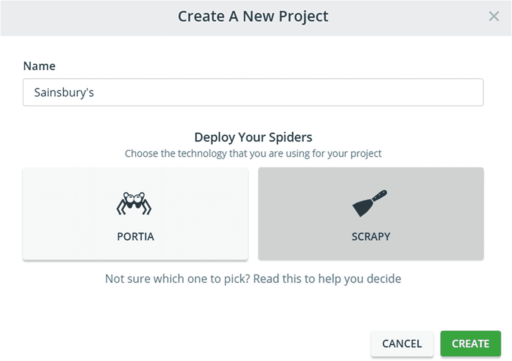
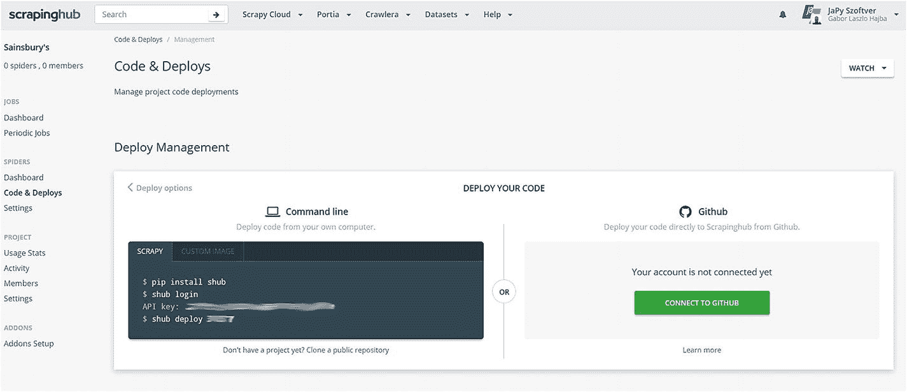
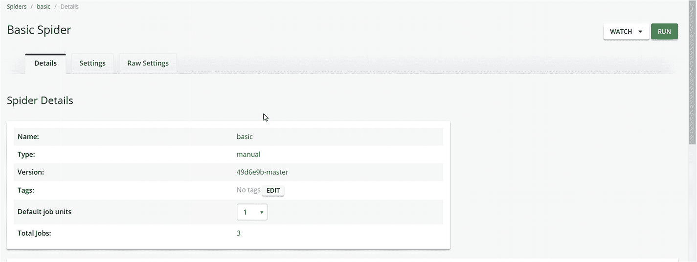
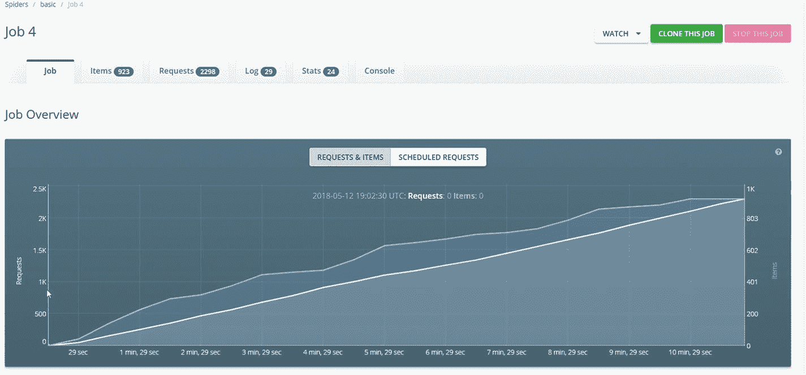
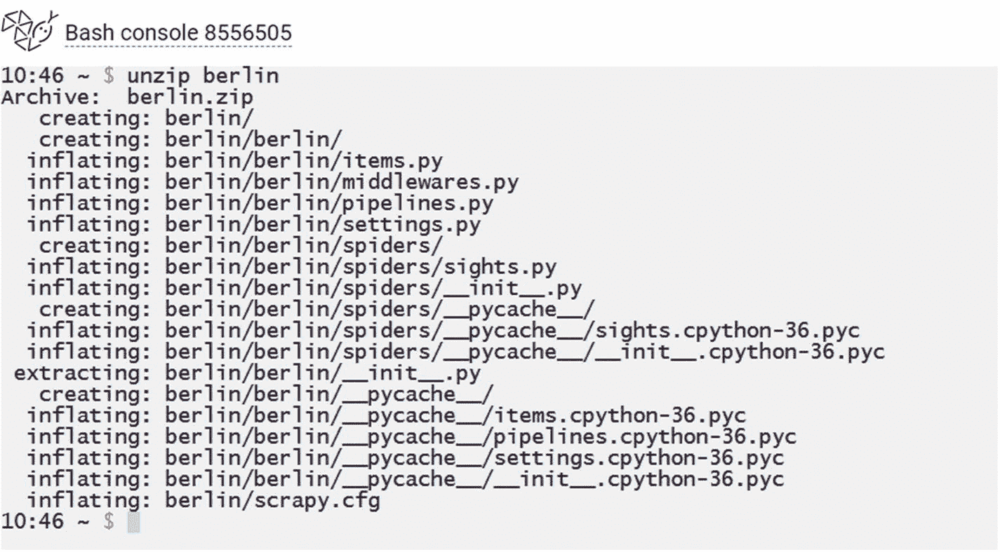
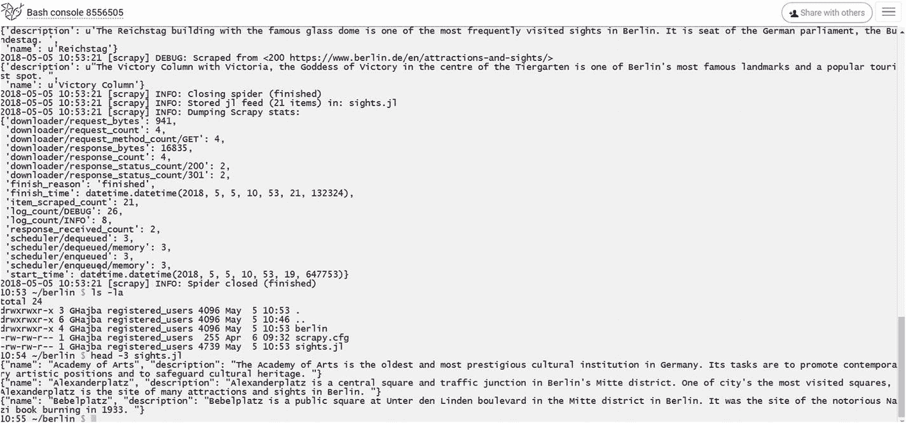
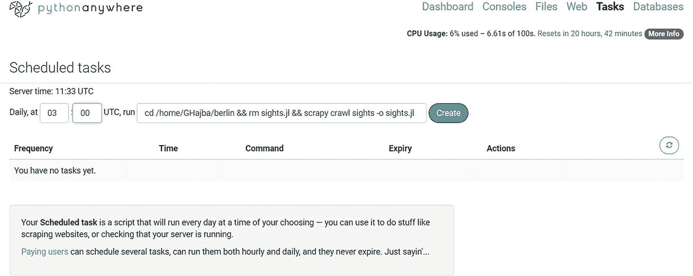
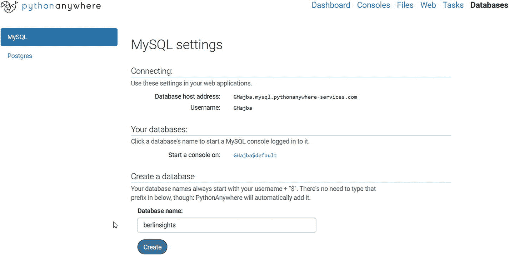
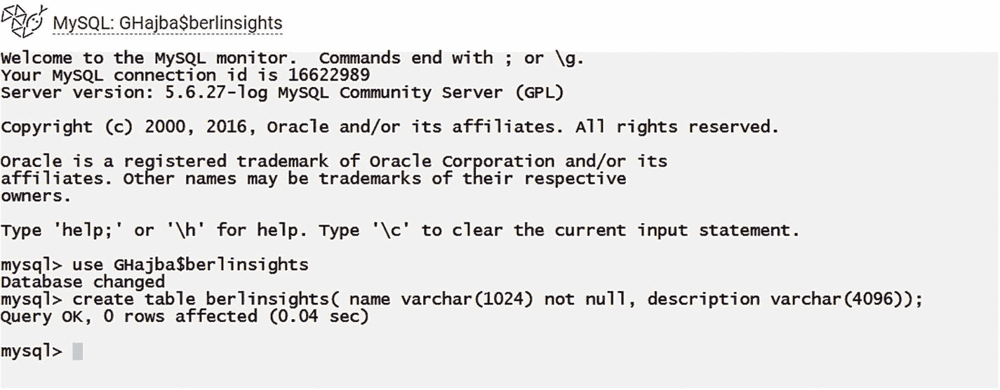

# 6.云中的网站抓取

在本地运行网站抓取对于一次性任务和少量数据是很好的，在这种情况下你可以很容易地手动触发抓取。

然而，如果您想要重复任务和自动调度，您应该考虑其他解决方案，比如将您的蜘蛛部署到云中的某个地方或购买的服务器插槽中。

在这一章中，我们将看看虚拟服务器网络、云，以及如果你想在云中使用网站抓取，你有哪些选择。我将重点放在`Scrapy`上，因为它是网站抓取的工具，并且提供了与`Scrapy`配合使用的服务。

## 杂乱的云

名字告诉你一切:刺痒云 <sup>[1](#Fn1)</sup> 是一个云解决方案，你可以在那里部署你的刺痒蜘蛛。正如该网站所说:“把它想象成一个网页抓取的英雄。”

### 创建项目

当你到达 ScrapingHub 时，你会想要创建一个项目，因为你得到的页面是空的，如图 [6-1](#Fig1) 所示。


图 6-1

我公司的空报废网站概述

幸运的是，它很直观:我们必须点击右上角的绿色按钮。

我们将使用 Scrapy spiders，所以选择这个选项，如图 [6-2](#Fig2) 所示。



图 6-2

创建新项目

既然项目已经创建，我们必须将我们的蜘蛛上传到云中。有两种选择:通过命令行或克隆 GitHub 库，如图 [6-3](#Fig3) 所示。我们将使用命令行解决方案，因为我是一个书呆子，并且因为大多数时候我使用一些内部 Git 系统而不是 GitHub 来存储我的代码。



图 6-3

新项目和上传选项

如果您决定使用命令行，您有两个选择:直接部署或 Docker 映像。目前，我将继续使用简单部署版本。

### 部署您的蜘蛛

因为我使用基本的命令行部署，所以我转到蜘蛛的基本文件夹(`scrapy.cfg`文件所在的位置)并执行以下命令:

```py
pip install shub
shub login
shub deploy

```

第一次运行`shub deploy`命令后，您会看到以下信息:

```py
Saved to scrapinghub\sainsburys\scrapinghub.yml.

```

这个文件很重要，因为如果部署 Python 3 spider，就必须编辑这个文件。因为我关注的是 Python 3，所以我们将使用这种配置。让我们现在就这样做，并将下面一行添加到您的`scrapinghub.yml`中:

```py
stack: scrapy:1.5-py3

```

这告诉 ScrapingHub 您想要使用运行在 Python 3 环境中的 Scrapy 版本`1.5`。

更改之后，再次运行`shub deploy`来更新服务器上的蜘蛛。部署信息类似于图 [6-4](#Fig4) 所示。


图 6-4

部署信息和历史

### 开始并等待

展开后，在左上角你会看到你有一个蜘蛛，如图 [6-5](#Fig5) 所示。点击此链接(或蜘蛛部分的`Dashboard`菜单项)将导航到您的蜘蛛。


图 6-5

项目中的蜘蛛

点击`basic`蜘蛛(对我来说是唯一部署的蜘蛛)将会把你带到蜘蛛的页面，如图 [6-6](#Fig6) 所示。在这里你可以改变一些项目的具体设置，你可以运行蜘蛛。



图 6-6

蜘蛛细节

运行塞恩斯伯里的蜘蛛需要一些时间。但是你可以做，然后等待它的完成。运行完蜘蛛后，你会看到所有关于运行`—`的信息，即使你在运行蜘蛛时有错误，如图 [6-7](#Fig7) 所示。


图 6-7

已完成的作业

正如您所看到的，您可以获得关于已加载项目、已发送请求和一些统计信息的信息。如果您单击作业编号，您将获得一些详细的统计数据，并且您可以查看运行提取的项目，如图 [6-8](#Fig8) 所示。



图 6-8

跑步的一些基本统计数据

### 访问数据

您可以通过某些方式访问提取的信息。最常见的访问是以某种格式下载你的结果，就像你从命令行运行`Scrapy`时导出它一样，如图 [6-9](#Fig9) 所示。


图 6-9

导出选项

正如你所看到的，你得到了一些选择，其中一个将适合你的项目需求。

另一种选择是发布数据集。这使得人们即使不知道你是如何收集数据的，也可以使用它。出版有三种风格:

*   *Public* :每个人都可以访问数据，不需要 ScrapingHub 账号，搜索引擎可以索引。

*   *受保护的*:只有拥有 ScrapingHub 账户的用户才能访问这些数据。

*   *Private* :只有你的报废网络组织的成员才能访问这些数据。

如果你有自信的信息，那就用 private。ScrapingHub 对公开可用的数据集有一些问题，如果没有 ScrapingHub 帐户，你无法访问它们。

无论如何，如果您想要发布一个数据集，您必须为它提供一个描述和一个徽标以供公众使用。我同意这个描述，但是一个标志在我眼里太多了。当然，如果你看一下目录， <sup>[2](#Fn2)</sup> 你就会明白为什么需要一个标志，如图 [6-10](#Fig10) 所示。


图 6-10

公共数据集目录

从这些数据集中，您可以像通过作业页面一样下载项目。请注意，您必须登录才能看到可用的数据集。

### 应用程序接口

ScrapingHub 提供了一个 API，您可以使用它以编程方式访问您的数据。让我们也检查一下这个选项。

我建议您使用`scrapinghub` Python 库，因为直接访问 API(例如使用`curl`)并不像文档中描述的那样工作。

```py
pip install scrapinghub[msgpack]

```

现在，我们准备从一个简单的 Python 代码中访问我们的数据。我将使用交互式解释器，这样您就可以跟着做了。

```py
>>> from scrapinghub import ScrapinghubClient
>>> apikey = 'YOUR-API-KEY'
>>> client = ScrapinghubClient(apikey)
>>>
>>> client.projects.list()
[310577]

```

登录后，第一步是获取我们项目的 ID。因为我只有一个项目，所以我只能得到一个 ID。你会得到一个不同的，所以相应地更换。

```py
>>> project = client.get_project(310577)
>>> [j['key'] for j in project.jobs.list()]
['310577/1/4']

```

上面我们列出了与项目相关的所有工作。访问数据需要此作业密钥。如果您有长时间运行的作业，您可以使用作业的`metadata`信息的`state`标志:

```py
>>> job = project.jobs.get('310577/1/4')
>>> job.metadata.get('state')
'finished'

```

现在我们有了感兴趣的作业，让我们检索所有项目。

```py
>>> job.items.iter()
<generator object mpdecode at 0x000001DAC5092D58>
>>> for item in job.items.iter(count=1):
...    print(item)
...
{'url': 'https://www.sainsburys.co.uk/shop/ProductDisplay?storeId=10151&productId=1219376&urlRequestType=Base&categoryId=275324&catalogId=10100&langId=44', 'product_name': "Sainsbury's British Pork Mince 20% Fat 500g", 'product_image': 'https://www.sainsburys.co.uk/wcsstore7.27.110/ExtendedSitesCatalogAssetStoimg/productImages/93/0000000327893/0000000327893_L.jpeg', 'image_urls': ['https://www.sainsburys.co.uk/wcsstore7.27.110/ExtendedSitesCatalogAssetStoimg/productImages/93/0000000327893/0000000327893_L.jpeg'], 'price_per_unit': '£1.65', 'rating': '0.0', 'product_reviews': '0', 'item_code': '7916164', 'nutritions': {'Energy kJ': '1104', 'Energy kcal': '265', 'Fat': '18.9g', 'of which saturates': '6.5g', '- mono-unsaturates': '8.0g', '- polyunsaturates': '3.5g', 'Carbohydrate': '1.0g', 'of which sugars': '<0.5g', 'Fibre': '0.6g', 'Protein': '22.5g', 'Salt': '0.50g'}, 'product_origin': ", '_type': 'SainsburysItem'}

```

正如您在前面的代码中看到的，您可以在与作业相关的项目上获得一个生成器；我打印出了列表的第一个结果。如果您对提取了多少项感兴趣，您可以再次使用作业的`metadata`。

```py
>>> job.metadata.get('scrapystats')['item_scraped_count']
923

```

正如你所看到的，API 对于从网站上分离数据提取并在以后用脚本自动处理它们非常有用。

### 限制

免费账户有一些限制。让我们看看它们，即使你能很好地接受这些限制。

首先，**有一个并发抓取**的限制，这意味着你一次只能运行一个蜘蛛。对于初学者来说，这不是问题，因为您很少想要并行运行蜘蛛。如果您的客户数量在增长，那么您可能会遇到需要并行运行来更快地收集数据的情况。

第二个限制是**没有周期性的作业**，如果您有需要经常运行的作业，这个限制可能会很烦人。你可以配置它们，但是它们不会运行，除非你订阅一个付费计划，目前开始每月 9 美元。

第三大限制是**数据存储**。您的刮擦结果仅存储七天。过了这段时间，你的抓取结果就成为历史了。如果您订阅了付费计划，您可以将此期限延长至 120 天。但是如果有自动数据处理(通过 API)，或者将数据存储在数据库中，就可以克服这个问题。

### 摘要

在我看来，如果你有更大的 Scrapy 项目，ScrapingHub 是理想的解决方案，因为它提供了一个易于使用的平台来建立和评估你的项目。Python 库的存在可以访问抓取的数据(也可以与蜘蛛进行交互),这使得自动化数据提取和处理这些数据变得非常方便。免费计划给了你很多，帮助你开始。

## 皮顿 Anywhere

好吧，当然除了报废 Hub 还有其他选择。一个是 PythonAnywhere， <sup>[3](#Fn3)</sup> 一个平台解决方案，使你能够在云中运行 Python。它有一个免费的“初学者”帐户，对出站互联网访问、CPU 和内存使用有限制，但它将符合我们的目的。

在这一节中，我们将创建一个用 Scrapy 编写的简单的 scraper，并将它上传到云中。

### 示例脚本

我们将使用不同的 Scrapy 脚本，因为免费帐户在网站上有限制，你可以从你的脚本和 Sainsbury 的没有列出。

因此，我选择了一个网站，并创建了一个简单的刮刀，将提取柏林的景点和景点的名称和描述。

### PythonAnywhere 配置

现在是时候配置我们的 PythonAnywhere 帐户并在云中获取脚本了。我将在这里为您一步步描述当前版本的 PythonAnywhere 解决方案`—`，因为它是在 2018 年 4 月 3 日**。**

 **使用以下命令安装 Scrapy:

```py
pip install --user scrapy

```

`--user`标志是必需的，因为不允许修改全局 Python 包的安装，也不能将`Scrapy`添加到其中。

现在我们已经为我们的铲运机设置好了一切。要验证这一点，您可以执行以下命令:

```py
~ $ scrapy version
Scrapy 1.5.0

```

嗯，安装 Scrapy 及其所有依赖项会消耗每天分配的 CPU 容量。如果你想继续这一章的例子，你可以，但是在一个免费的 PythonAnywhere 帐户上它会变得很慢。

### 上传脚本

有一些方法可以让你的脚本升级到 PythonAnywhere:

*   从 Github / BitBucket 克隆

*   作为 ZIP 文件上传(实际上，你可以一个文件一个文件上传，但是 ZIP 更方便)

*   SFTP 和 Rsync 支付帐户

我使用 ZIP 方法:压缩 Scrapy 项目；从 PythonAnywhere 的“文件”菜单上传；然后使用`unzip`命令将其解压缩，如图 [6-11](#Fig11) 和 [6-12](#Fig12) 所示。



图 6-12

解压软件包


图 6-11

`berlin.zip`文件被上传到我的个人文件夹

现在该文件夹在仪表盘的*文件*部分下，如图 [6-13](#Fig13) 所示。


图 6-13

包含`berlin`文件夹的文件

### 运行脚本

现在我们可以像在本地一样从 Bash 控制台运行脚本，如图 [6-14](#Fig14) 所示。因为我们有一个文件系统，我们也可以将结果导出为文件。例如，要获取 JSON-lines 文件中的景点，我们可以执行以下命令:


图 6-14

运行蜘蛛

```py
scrapy crawl sights -o sights.jl

```

当脚本完成时，如图 [6-15](#Fig15) 所示，一个新文件被写入项目的文件夹中。如果已经有一个文件，Scrapy 会把新的信息附加到它上面，而不是从头开始重新创建文件。记住这个！



图 6-15

蜘蛛完成了文件的前三行

您可以通过*文件*页面访问该文件。您可以在这里下载文件，但也可以在您的浏览器中进行编辑，如图 [6-16](#Fig16) 所示。


图 6-16

下载导出的文件

### 这只是手动工作…

目前，我们只手动运行了脚本。但这不是我们在云中部署 scraper 时所寻求的方式。

解决方案是添加一个调度程序，它在定义的时间自动启动 scraper。

### 纪念

如果你正在使用一个调度程序，确保你删除了已经存在的导出文件，因为 Scrapy 不会覆盖它。如果您使用的是自定义项目导出器，那么您可能已经重写了文件的内容。

一种选择是在 Python Anywhere 上设置一个任务。在这里，您必须配置要执行的命令。因为我们知道我们的命令，我们可以将它添加到调度器中，如图 [6-17](#Fig17) 所示。



图 6-17

使用三段脚本创建任务

在预定时间结束后，您可以访问包含控制台输出的任务日志，可能还有一些错误，如图 [6-18](#Fig18) 所示。


图 6-18

访问任务的日志

第二种方法是前一种方法的扩展版本:我们创建一个脚本来执行前面定义的命令序列，并将调度程序指向这个脚本。

第一步是创建一个脚本，该脚本更改到项目的文件夹并执行蜘蛛(确保您指向您的主文件夹！).

```py
#!/bin/bash
cd /home/GHajba/berlin
rm sights.jl
scrapy crawl sights -o sights.jl

```

前面的脚本与我们之前提供给任务的脚本相同，但是我们将每个命令放在自己的行上，这使得它可读。

我使用 PythonAnywhere 的编辑器在我的浏览器中创建了这个文件，如图 [6-19](#Fig19) 所示。


图 6-19

创建新文件

### 警告

如果你使用的是 Windows 电脑，文件编辑器会给你的文件添加 Windows 行尾。要解决这个问题(并能够在 Bash shell 中运行脚本)，请从控制台执行以下命令:`sed -i -e 's/\r$//' berlin_scheduler.sh`

由于免费账户对计划任务的数量有限制(你只能有一个)，我们将删除之前创建的账户，创建一个新账户，新账户将只执行之前创建的`berlin_scheduler.sh`，如图 [6-20](#Fig20) 所示。


图 6-20

创建新的调度程序

任务可用后，您可以访问任务日志，其中包含与之前相同的信息。

### 在数据库中存储数据？

将提取的结果存储在数据库中是一个可行的选择。因为我们现在在云中使用 PythonAnywhere，所以最好有云存储`—`比如 mLab，这是一个基于云的 MongoDB。

问题是，一个免费帐户只允许 HTTP 和 HTTPS 连接到服务器。这意味着，即使您用 mLab 设置了一个 Mongo 数据库，您也不能创建一个连接来存储数据。

然而，Python Anywhere 为免费用户提供 MySQL。这意味着，您可以存储提取的信息，而不必将所有内容都存储在一个文件中。

让我们看看如何配置 MySQL 并将提取的数据存储在数据库中。

首先，让我们创建一个数据库。你可以在*数据库*上这样做。我给矿取名`berlinsights`，如图 [6-21](#Fig21) 。



图 6-21

创建新的数据库很容易

现在，我们必须配置我们的 Scrapy 项目，以便能够连接到数据库并将信息写入给定的表中。

我们将使用一个简单的项目管道，将景点插入到数据库中。

我们需要数据库表。我使用以下脚本通过数据库控制台创建了它:



图 6-22

使用控制台创建表

```py
create table berlinsights( name varchar(1024) not null, description varchar(4096));

```

如图 [6-22](#Fig22) 所示:确保你使用的是正确的数据库！如果你不确定你在哪个数据库上运行，输入`status`，它会告诉你你在哪个数据库上运行。

如果您忘记了数据库密码，只需在数据库仪表板上设置一个新密码。

现在我们可以创建我们的中间件了。我们将使用`pymysql`库。

```py
# -*- coding: utf-8 -*-

import pymysql.cursors

insert_template = """INSERT INTO berlinsights (name, description) VALUES (%s, %s)"""

class BerlinMySQLPipeline(object):

    def process_item(self, item, spider):
        connection = pymysql.connect(host='GHajba.mysql.pythonanywhere-services.com',
                                     user='GHajba',
                                     password='YourDbPassHere',
                                     db='GHajba$berlinsights',
                                     charset='utf8mb4',
                                     cursorclass=pymysql.cursors.DictCursor)
        try:
            with connection.cursor() as cursor:
                cursor.execute(insert_template, (item['name'], item['description']))
                connection.commit()
        finally:
            connection.close()

        return item

```

过程示例使用我的数据库，所以请确保您正在填写您的数据！因为这个 MySQL 数据库是一个 PythonAnywhere 服务，所以只有在部署了 scraper 之后才能测试连接。

**同样是**，这个脚本不验证数据库中是否已经有条目。如果您运行它两次，您将得到每个条目的副本。随意修改脚本来过滤或更新已经存在的条目。

运行蜘蛛后，我们可以验证信息是否在数据库中，如图 [6-23](#Fig23) 所示。


图 6-23

验证控制台中的数据

如果还没有安装`pymysql`，你可以用下面的命令来完成:

```py
pip install --user pymysq

```

### 摘要

Python Anywhere 免费为您提供云托管和调度；但是，它对免费计划的传出连接有限制。这使得它只对练习有价值。另一方面，如果你每月支付 5 美元，你就可以获得一个升级账户，在那里你不必将你的垃圾限制在白名单中。 <sup>[4](#Fn4)</sup>

## 那`Beautiful Soup`呢？

PythonAnywhere 是 Python 的云平台。这意味着你不仅可以在那里运行刺痒的蜘蛛，还可以运行刮刀。这就是我们要简单看的。

方法和以前一样:我们将提取相同的景点，但使用美丽的汤。

幸运的是，`requests`和`beautifulsoup4`库已经安装在主机上，所以您不需要安装任何东西。

第一步是编写和上传脚本。事实上，我已经写了代码，但这并不意味着你不能自己做。一如既往:我的代码示例只是**一个解决方案**，并且有许多通向最终目标的路径。

```py
import requests
from bs4 import BeautifulSoup

bs_parser = 'html.parser'

def get_page(url):
    try:
        r = requests.get(url)
        if r.status_code == 200:
            return BeautifulSoup(r.content, bs_parser)
    except Exception as e:
        pass
    return None

def get_sights():
    soup = get_page('https://www.berlin.de/en/attractions-and-sights/')
    if not soup:
        return

    for sight in soup.select('div[class*="teaser"]'):
        h3 = sight.find('h3')
        if not h3:
            continue

        a = h3.find('a')
        if not a:
            continue
        name = a.text
        if not name:
            continue

        description = "
        div = sight.find('div', class_="inner")
        if div:
            p = div.find('p')
            if p:
                description = p.text
        if not description:
            continue
        yield (name, description)

if __name__ == '__main__':
    with open('berlin_sights.jl', 'w') as outfile:
        for sight in get_sights():
            outfile.write('{' + '"name": "{}", "description": "{}"'.format(sight[0], sight[1]) + '}\n')

```

上传后，我们可以运行脚本。运行脚本就像在普通的终端窗口中一样。

```py
python3 berlin.py

```

过程完成后，您可以访问`berlin_sights.jl`文件中的结果。第一个条目如下所示:

```py
{"name": "Academy of Arts", "description": "The Academy of Arts is the oldest and most prestigious cultural institution in Germany. Its tasks are to promote contemporary artistic positions

and to safeguard cultural heritage. more »"}

```

调度脚本的工作方式与 Scrapy 脚本的工作方式相同，所以我不会详细介绍。如果您使用的是`Beautiful Soup`，请将 PythonAnywhere 视为您的远程 Python 终端。

## 摘要

在本章中，我们讨论了如何在云中运行服务器的选项。这是解决方案，如果你不想每次都手动运行你的提取器，或者你不想让他们在你的电脑上运行，因为他们吃了很多资源，你的电脑变得缓慢了很长一段时间。

我们关注了 Scraping Hub，它提供了针对`Scrapy`的服务，这使它变得独一无二。除此之外，他们也是 Splash 的开发者，他们有一个如何在云中运行基于 Splash 的蜘蛛的解决方案。

作为替代方案，我们研究了 PythonAnywhere，在那里可以上传 Python 脚本并执行它们。这不仅对`Scrapy`有用，对使用漂亮汤的脚本也有用，这也将你的简单抓取器移到了云中。

<aside class="FootnoteSection" epub:type="footnotes">Footnotes [1](#Fn1_source)

[T2`https://scrapinghub.com/scrapy-cloud`](https://scrapinghub.com/scrapy-cloud)

  [2](#Fn2_source)

[T2`https://app.scrapinghub.com/datasets`](https://app.scrapinghub.com/datasets)

  [3](#Fn3_source)

[T2`https://www.pythonanywhere.com/`](https://www.pythonanywhere.com/)

  [4](#Fn4_source)

[T2`https://www.pythonanywhere.com/whitelist/`](https://www.pythonanywhere.com/whitelist/)

 </aside>**