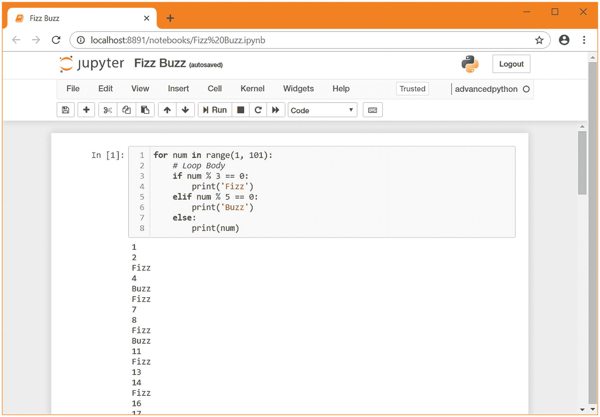
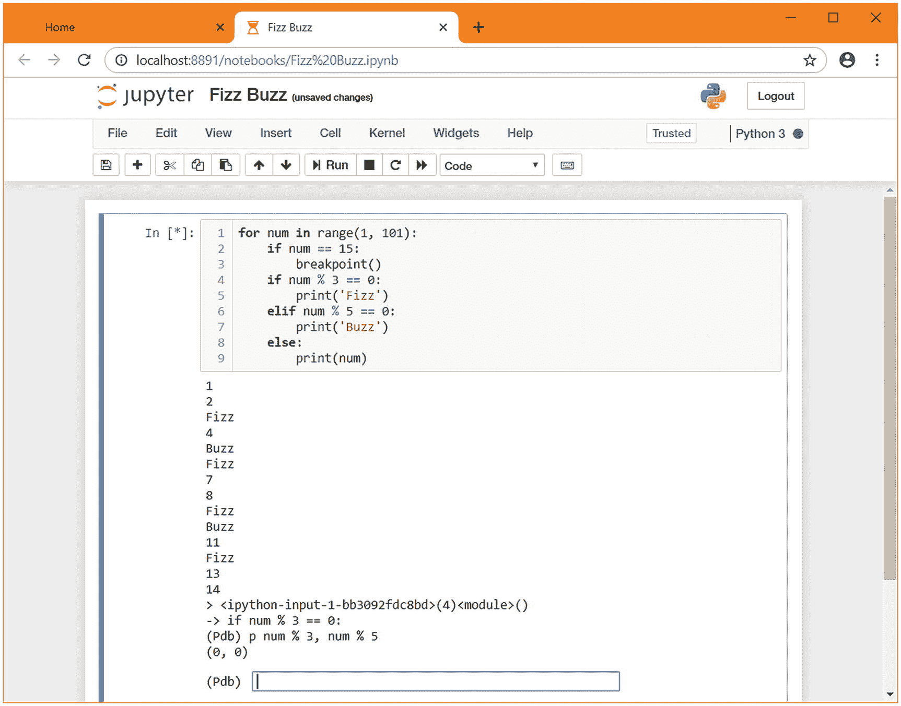
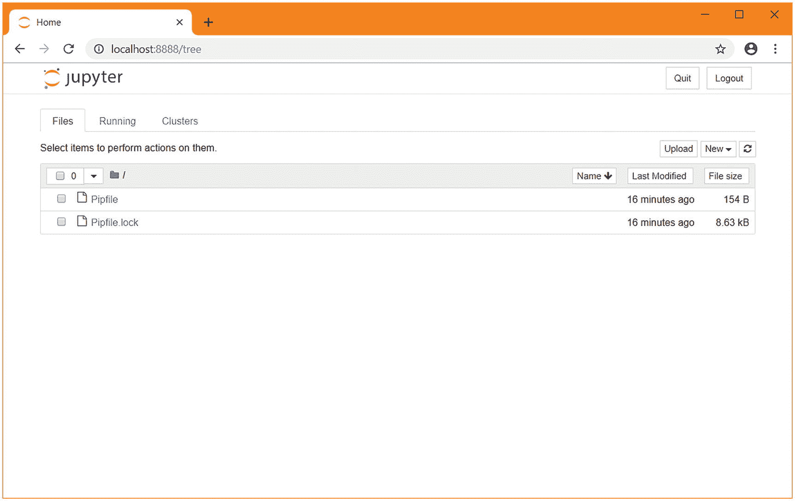
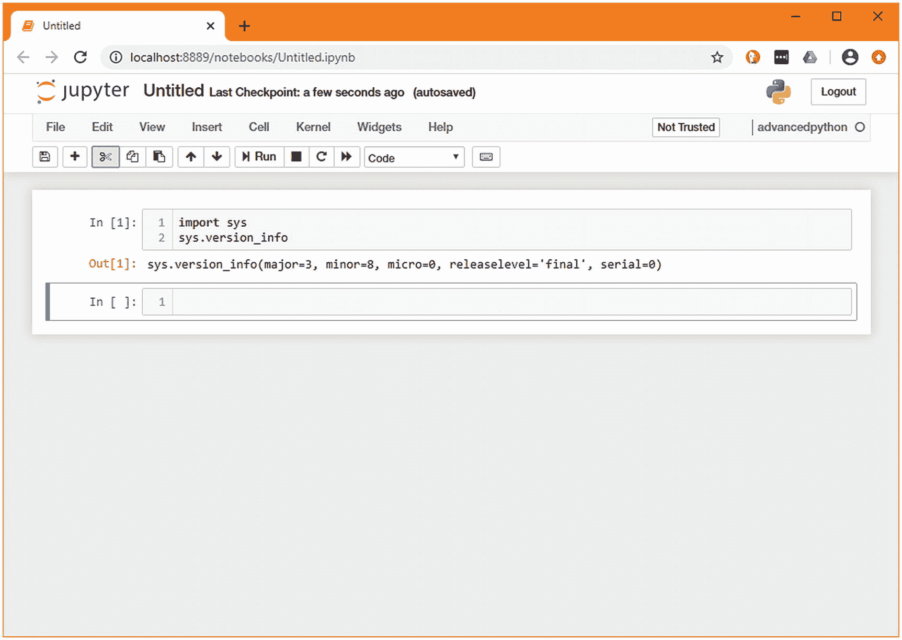
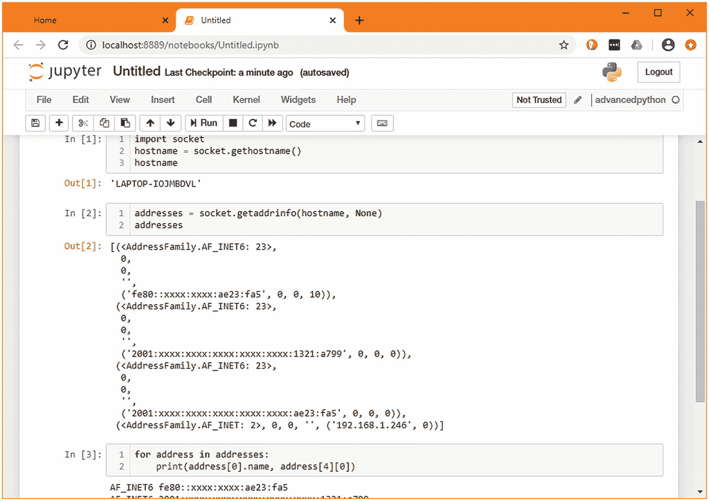
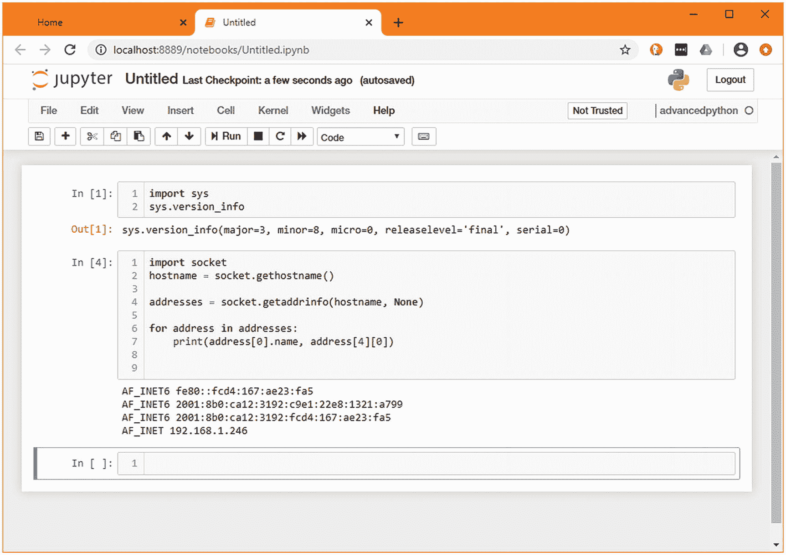
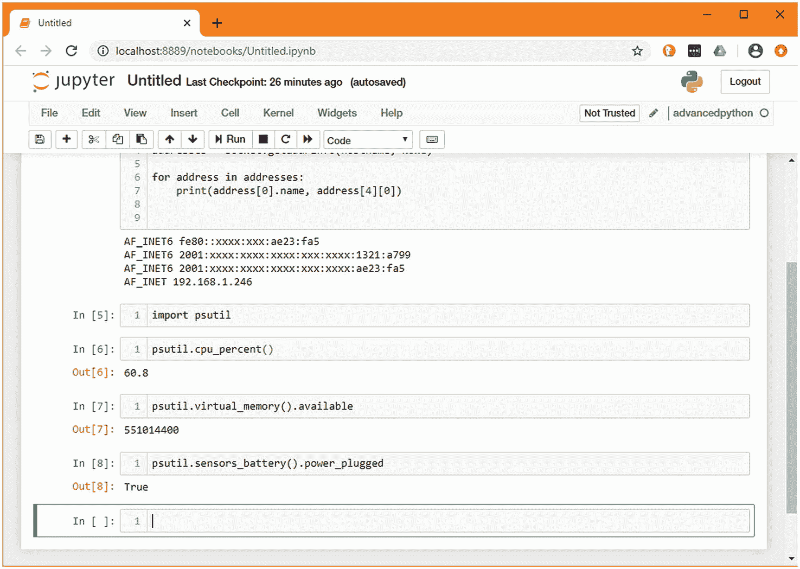
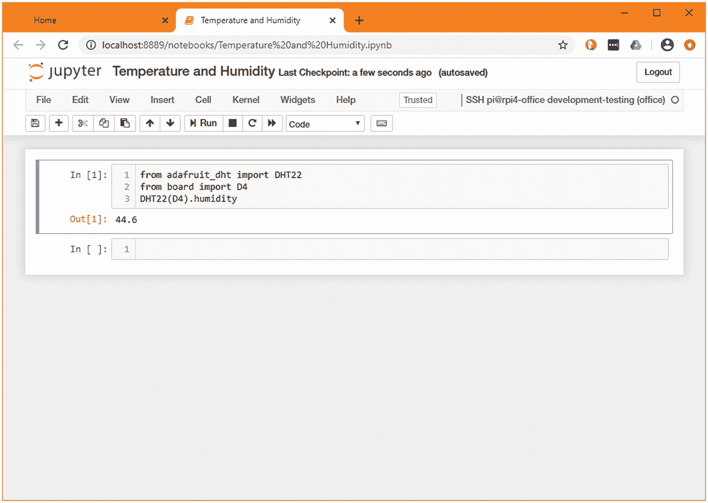

# 一、原型和环境

在这一章中，我们将探索不同的方法来试验不同的 Python 函数做什么，以及什么时候是使用这些不同选项的合适时机。使用其中一种方法，我们将构建一些简单的函数来提取我们将要聚集的第一批数据，并看看如何将它们构建到一个简单的命令行工具中。

## Python 中的原型

在任何 Python 项目中，从花几个小时开发的东西到运行几年的项目，都需要原型化函数。这可能是你做的第一件事，或者它可能在项目中期悄悄出现，但迟早你会发现自己在 Python shell 中尝试代码。

有两种广泛的方法来实现原型:要么运行一段代码并查看结果，要么一次执行一条语句并查看中间结果。一般来说，一个接一个地执行语句更有效率，但是有时如果有你已经确信的代码块，恢复运行代码块似乎更容易。

Python shell(也称为 REPL，表示 **R** ead、 **E** val、 **P** rint、 **L** oop)是大多数人对使用 Python 的第一次介绍。能够启动解释器并实时输入命令是直接进入编码的一种强有力的方式。它允许您运行命令并立即看到它们的结果，然后调整您的输入而不删除任何变量的值。与编译语言相比，编译语言的开发流程是围绕编译文件然后运行可执行文件来构建的。对于像 Python 这样的解释型语言中的简单程序来说，等待时间要短得多。

### 用 REPL 制作原型

REPL 的优势很大程度上在于尝试简单的代码并获得对函数如何工作的直观理解。它不太适合有大量流控制的情况，因为它不太容忍错误。如果您在键入循环体的一部分时出错，您将不得不重新开始，而不仅仅是编辑错误的行。用一行 Python 代码修改一个变量并查看输出，这非常适合将 REPL 用于原型制作。

例如，我经常发现很难记住内置函数`filter(...)`是如何工作的。有几种方法可以提醒自己:我可以在 Python 网站上或者使用我的代码编辑器/IDE 查看这个函数的文档。或者，我可以尝试在我的代码中使用它，然后检查我得到的值是否是我所期望的，或者我可以使用 REPL 来查找对文档的引用或者只是尝试该函数。

在实践中，我通常发现自己在尝试一些东西。下面是一个典型的例子，我第一次尝试反转了参数，第二次尝试提醒我 filter 返回一个自定义对象，而不是一个元组或列表，第三次尝试提醒我 filter 只包含匹配条件的元素，而不是排除匹配条件的元素。

```py
>>> filter(range(10), lambda x: x == 5)
Traceback (most recent call last):
  File "<stdin>", line 1, in <module>
TypeError: 'function' object is not iterable
>>> filter(lambda x: x == 5, range(10))
<filter object at 0x033854F0>
>>> tuple(filter(lambda x: x == 5, range(10)))
(5,)

```

Note

内置函数帮助(...)在试图理解函数如何工作时是非常宝贵的。由于 filter 有一个清晰的 docstring，调用`help(filter)`并读取信息可能会更简单。然而，当将多个函数调用链接在一起时，尤其是当试图理解现有代码时，能够试验样本数据并查看交互是如何进行的是非常有帮助的。

如果我们尝试将 REPL 用于涉及更多流量控制的任务，比如著名的面试编码测试问题 FizzBuzz(清单 [1-1](#PC2) ),我们可以看到它不可饶恕的本质。

```py
for num in range(1, 101):
    val = ''
    if num % 3 == 0:
        val += 'Fizz'
    if num % 5 == 0:
        val += 'Buzz'
    if not val:
        val = str(num)
    print(val)

Listing 1-1fizzbuzz.py – a typical implementation

```

如果我们要一步一步地构建它，我们可以从创建一个输出不变数字的循环开始:

```py
>>> for num in range(1, 101):
...     print(num)
...
1
.
.
.
98
99
100

```

此时，我们将在新行中看到数字 1 到 100，因此我们将开始添加逻辑:

```py
>>> for num in range(1, 101):
...     if num % 3 == 0:
...         print('Fizz')
...     else:
...         print(num)
...
1
.
.
.
98
Fizz
100

```

每次我们这样做的时候，我们都不得不重新输入我们之前输入的代码，有时有小的改动，有时一字不差。这些行一旦输入就不可编辑，所以任何打字错误都意味着整个循环需要重新输入。

您可以决定原型化循环体而不是整个循环，以便更容易地跟踪条件的动作。在这个例子中，从 1 到 14 的 n 值是用三路 if 语句正确生成的，其中`n=15`是第一个被错误渲染的。虽然这是在循环体的中间，但是很难检查条件交互的方式。

在这里你会发现 REPL 和剧本对缩进的解释之间的第一个区别。Python 解释器对在 REPL 模式下如何缩进的解释比执行脚本时更严格，*要求*在任何返回到缩进级别 0 的取消缩进后面有一个空行。

```py
>>> num = 15
>>> if num % 3 == 0:
...     print('Fizz')
... if num % 5 == 0:
  File "<stdin>", line 3
    if num % 5 == 0:
     ^
SyntaxError: invalid syntax

```

此外，当返回到缩进级别 0 时，REPL 只允许一个空行，而在 Python 文件中，它被视为最后一个缩进级别的隐式延续。清单 [1-2](#PC6) (与清单 [1-1](#PC2) 的区别仅在于增加了空行)作为`python fizzbuzz_blank_lines.py`调用时有效。

```py
for num in range(1, 101):
    val = ''
    if num % 3 == 0:
        val += 'Fizz'
    if num % 5 == 0:
        val += 'Buzz'

    if not val:
        val = str(num)

    print(val)

Listing 1-2fizzbuzz_blank_lines.py

```

然而，由于缩进解析规则的差异，将清单 [1-2](#PC6) 的内容输入 Python 解释器会导致以下错误:

```py
>>> for num in range(1, 101):
...     val = ''
...     if num % 3 == 0:
...         val += 'Fizz'
...     if num % 5 == 0:
...         val += 'Buzz'
...
>>>     if not val:
  File "<stdin>", line 1
    if not val:
    ^
IndentationError: unexpected indent
>>>         val = str(num)
  File "<stdin>", line 1
    val = str(num)
    ^
IndentationError: unexpected indent
>>>
>>>     print(val)
  File "<stdin>", line 1
    print(val)
    ^
IndentationError: unexpected indent

```

当您习惯于在文件中编写 Python 时，使用 REPL 来构建循环或条件的原型很容易出错。犯错误和不得不重新输入代码的挫败感足以抵消使用这种方法比使用简单脚本节省的时间。虽然可以使用箭头键滚动回先前输入的行，但多行构造(如循环)不会组合在一起，因此很难重新运行循环体。在整个会话中使用`>>>`和`...`提示也使得复制和粘贴先前的行变得困难，无论是重新运行它们还是将它们集成到一个文件中。

### 使用 Python 脚本构建原型

很有可能通过编写一个简单的 Python 脚本并运行它直到它返回正确的结果来构建代码原型。与使用 REPL 不同，这可以确保在出错时很容易重新运行代码，并且代码存储在文件中，而不是存储在终端的回滚缓冲区中。不幸的是，这确实意味着不能在代码运行时与代码进行交互，这导致它被戏称为“printf 调试”，以 C 打印变量的功能命名。

顾名思义，从脚本执行中获取信息的唯一可行的方法是使用`print(...)`函数将数据记录到控制台窗口。在我们的示例中，通常会在循环体中添加一个打印，以查看每次迭代发生了什么:

Tip

f-string 对于 printf 调试很有用，因为它们允许您将变量插入到一个字符串中，而不需要额外的字符串格式化操作。

```py
for num in range(1,101):
    print(f"n: {num} n%3: {num%3} n%5: {num%5}")

```

以下是结果:

```py
n: 1 n%3: 1 n%5: 1
.
.
.
n: 98 n%3: 2 n%5: 3
n: 99 n%3: 0 n%5: 4
n: 100 n%3: 1 n%5: 0

```

这提供了一个容易理解的视图，显示脚本正在做什么，但是它确实需要重复一些逻辑。这种重复使错误更容易被遗漏，从而导致大量的时间损失。与 REPL 相比，代码被永久存储是其最大的优势，但是它为程序员提供了较差的用户体验。打字错误和简单的错误会变得令人沮丧，因为从编辑文件到在终端中运行它需要进行上下文切换。看一眼你需要的信息也可能更困难，这取决于你如何组织你的打印报表。尽管有这些缺陷，但它的简单性使得向现有系统添加调试语句非常容易，因此这是最常用的调试方法之一，尤其是在试图对问题有一个广泛的理解时。

### 使用脚本和 pdb 构建原型

内置的 Python 调试器 pdb 是任何 Python 开发人员的武器库中最有用的工具。这是调试复杂代码的最有效方法，也是检查 Python 脚本在多级表达式(如列表理解)中做什么的唯一方法。 <sup>[3](#Fn3)</sup>

在许多方面，原型代码是调试的一种特殊形式。我们知道我们写的代码是不完整的，并且包含错误，但是我们没有试图找到一个缺陷，而是试图分阶段建立复杂性。pdb 的许多有助于调试的特性使这变得更加容易。

当您启动 pdb 会话时，您会看到一个`(Pdb)`提示，允许您控制调试器。在我看来，最重要的命令是**s**T1、 **n** `ext`、**b**T3、 **c** `ontinue`、 **p** `retty` **p** `rint`和 **d** `ebug`。 <sup>[4](#Fn4)</sup>

`step`和`next`都执行当前语句并移动到下一条语句。他们对“下一个”语句的看法不同。Step 移动到下一条语句，不管它在哪里，所以如果当前行包含一个函数调用，下一行就是该函数的第一行。Next 不会将执行移到该函数中；它认为下一条语句是当前函数中的下一条语句。如果你想检查一个函数调用在做什么，那么就进入它。如果您相信函数正在做正确的事情，使用 next 来掩饰它的实现并获得结果。

`break`和`continue`允许代码的更长部分在没有直接检查的情况下运行。`break`用于指定要返回到 pdb 提示符的行号，并带有在该范围内评估的可选条件，例如`break 20 x==1`。`continue`命令返回到正常的执行流程；除非遇到另一个断点，否则不会返回到 pdb 提示符。

Tip

如果您发现可视化状态显示更加自然，您可能会发现很难跟踪您在调试会话中的位置。我建议您安装 pdb++调试器，它会显示一个代码清单，并突出显示当前行。ide，比如 PyCharm，更进一步，它允许你在一个正在运行的程序中设置断点，并直接从你的编辑器窗口控制步进。

最后，`debug`允许您指定任意 python 表达式来单步执行。这让您可以从 pdb 提示符中调用包含任何数据的任何函数，如果您在意识到错误所在之前已经使用了`next`或`continue`来传递一个点，这将非常有用。它作为`debug somefunction()`被调用，并修改`(Pdb)`提示，通过添加额外的一对括号让您知道您在嵌套的 pdb 会话中，使提示成为`((Pdb))`。 <sup>[5](#Fn5)</sup>

#### 事后调试

有两种调用 pdb 的常见方法，要么在代码中显式调用，要么直接调用所谓的“事后调试”事后调试在 pdb 中启动一个脚本，如果出现异常，将触发 pdb。它是通过使用`python -m pdb yourscript.py`而不是`python yourscript.py`运行的。脚本不会自动启动；您将看到一个 pdb 提示，允许您设置断点。要开始执行脚本，您应该使用`continue`命令。当您设置的断点被触发或程序终止时，您将返回到 pdb 提示符。如果程序因错误而终止，它允许您查看错误发生时设置的变量。

或者，您可以使用 step 命令逐个运行文件中的语句；然而，对于除了最简单的脚本之外的所有脚本，最好在您希望开始调试的地方设置一个断点，并从那里开始调试。

以下是在 pdb 中运行清单 [1-1](#PC2) 并设置条件断点(输出略)的结果:

```py
> python -m pdb fizzbuzz.py
> c:\fizzbuzz_pdb.py(1)<module>()
-> def fizzbuzz(num):
(Pdb) break 2, num==15
Breakpoint 1 at c:\fizzbuzz.py:2
(Pdb) continue
1
.
.
.
13
14
> c:\fizzbuzz.py(2)fizzbuzz()
-> val = ''
(Pdb) p num
15

```

当与前面的基于脚本的方法结合使用时，这种风格效果很好。它允许您在代码执行的各个阶段设置任意断点，并在您的代码触发异常时自动提供 pdb 提示，而无需您事先知道发生了什么错误以及错误发生在哪里。

##### 断点功能

内置的`breakpoint()`<sup>[6](#Fn6)</sup>允许你精确地指定 pdb 在程序中控制的位置。当调用这个函数时，执行立即停止，并显示一个 pdb 提示符。它的行为就像先前已经在当前位置设置了 pdb 断点一样。通常在 if 语句或异常处理程序中使用`breakpoint()`,以模拟调用 pdb 提示的条件断点和事后调试风格。尽管这意味着要修改源代码(因此不适合调试生产问题)，但它消除了每次运行程序时设置断点的需要。

在计算值 15 时调试 fizzbuzz 脚本可以通过添加一个新条件来查找`num == 15`并将`breakpoint()`放入主体中来完成，如清单 [1-3](#PC22) 所示。

```py
for num in range(1, 101):
    val = ''
    if num == 15:
        breakpoint()
    if num % 3 == 0:
        val += 'Fizz'
    if num % 5 == 0:
        val += 'Buzz'
    if not val:
        val = str(num)
    print(val)

Listing 1-3fizzbuzz_with_breakpoint.py

```

要在构建原型时使用这种风格，创建一个简单的 Python 文件，其中包含您认为可能需要的导入和您知道自己拥有的任何测试数据。然后，在文件底部添加一个`breakpoint()`调用。无论何时执行该文件，您都会发现自己处于一个交互式环境中，拥有您需要的所有功能和数据。

Tip

我强烈推荐使用库`remote-pdb`来调试复杂的多线程应用程序。要使用它，安装`remote-pdb`包并用环境变量`PYTHONBREAKPOINT =remote_pdb.set_trace python yourscript.py`启动你的应用程序。当您在代码中调用`breakpoint()`时，连接信息被记录到控制台。更多选项参见`remote-pdb`文档。

### 用 Jupyter 制作原型

Jupyter 是一套工具，用于以更加用户友好的方式与支持 REPL 的语言进行交互。它提供了广泛的支持，使得与代码的交互更加容易，比如显示绑定到函数输入或输出的小部件，这使得非技术人员与复杂函数的交互更加容易。在这个阶段对我们有用的功能是，它允许将代码分解成逻辑块并独立运行它们，还能够保存这些块并在以后返回。

Jupyter 是用 Python 编写的，但它是 Julia、Python 和 R 编程语言的通用前端。它旨在作为一种工具，用于共享提供简单用户界面的自包含程序，例如，用于数据分析。许多 Python 程序员创建 Jupyter 笔记本而不是控制台脚本，尤其是那些从事科学工作的人。在这一章中，我们没有以那种方式使用 Jupyter 我们使用它是因为它的特性恰好与原型任务相吻合。

支持多种语言的设计目标意味着它也支持 Haskell、Lua、Perl、PHP、Rust、Node.js 以及许多其他语言。每种语言都有 ide、REPLs、文档网站等等。使用 Jupyter 进行这种类型的原型开发的一个最显著的优点是，它允许您开发一个工作流，该工作流也可以在不熟悉的环境和语言中工作。例如，全栈 web 程序员经常必须同时处理 Python 和 JavaScript 代码。相比之下，科学家可能需要方便地访问 Python 和 r。拥有单一接口意味着语言之间的一些差异被消除了。

由于 Jupyter 不是特定于 Python 的，并且有内置的支持来选择使用什么样的后端来运行当前代码，所以我建议以这样一种方式安装它，以便在整个系统中都可以方便地使用它。如果您通常将 Python 实用程序安装到虚拟环境中，这没问题。 <sup>[7](#Fn7)</sup> 然而，我已经将 Jupyter 安装到我的用户环境中:

```py
> python -m pip install --user jupyter

```

Note

由于 Jupyter 是以用户模式安装的，您需要确保二进制文件目录包含在您的系统路径中。安装到全局 python 环境中或通过您的包管理器安装是一个可接受的替代方案；与使用多种方法相比，保持工具安装方式的一致性更为重要。

当使用 Jupyter 进行原型开发时，您可以将我们的代码分成逻辑块，这些逻辑块既可以单独运行，也可以顺序运行。这些块是可编辑的和持久的，就像我们在使用脚本一样，但是我们可以控制哪些块运行和编写新代码，而不会丢弃变量的内容。在这种情况下，这类似于使用 REPL，因为我们可以在不中断代码流的情况下尝试运行脚本。

访问 Jupyter 工具有两种主要方式，要么通过 Web 使用 Jupyter 的笔记本服务器，要么作为标准 Python REPL 的替代品。每一个都基于单元的思想，单元是独立的执行单元，可以随时重新运行。笔记本和 REPL 都使用相同的 Python 底层接口，称为 IPython。IPython 在理解标准 REPL 的缩进方面没有任何困难，并且支持在会话早期轻松地重新运行代码。

该笔记本比 shell 更加用户友好，但缺点是只能通过 web 浏览器访问，而不能通过通常的文本编辑器或 IDE 访问。 <sup>[8](#Fn8)</sup> 我强烈推荐使用笔记本界面，因为在能够重新运行单元格和编辑多行单元格时，它通过更直观的界面大大提高了您的工作效率。

#### 笔记本电脑

要开始原型制作，启动 Jupyter 笔记本服务器，然后使用 web 界面创建一个新的笔记本。

```py
> jupyter notebook

```

笔记本加载后，在第一个单元格中输入代码，然后单击 run 按钮。代码编辑器中有许多常见的键盘快捷键，当一个新的块开始时会自动缩进(图 [1-1](#Fig1) )。



图 1-1

Jupyter 笔记本里的 fizzbuzz

Pdb 通过 web 界面与 Jupyter 笔记本协同工作，中断执行并显示一个新的输入提示(图 [1-2](#Fig2) )，其方式与在命令行中相同。所有标准的 pdb 功能都通过这个接口公开，所以本章 pdb 部分的提示也可以在 Jupyter 环境中使用。



图 1-2

Jupyter 笔记本中的 pdb

### 本章中的原型制作

我们探索的所有方法都有优点和缺点，但每种方法都有其独特之处。对于非常简单的一行程序，比如列表理解，我经常使用 REPL，因为它启动速度最快，而且没有难以调试的复杂控制流。

对于更复杂的任务，比如将外部库的函数放在一起，用它们做多种事情，一个更有特色的方法通常更有效。我鼓励你在设计原型时尝试不同的方法，以了解在便利性和个人偏好方面的最佳点在哪里。

不同方法的各种特性应该有助于明确哪种方法最适合您的特定用例。作为一般规则，我建议使用表 [1-1](#Tab1) 中最左边的条目，该条目满足您对想要的可用特性的要求。使用更靠右的东西可能不太方便；使用太偏左的工具可能意味着你在尝试执行其他工具更容易完成的任务时会感到沮丧。

表 1-1

原型开发环境的比较

<colgroup><col class="tcol1 align-left"> <col class="tcol2 align-left"> <col class="tcol3 align-left"> <col class="tcol4 align-left"> <col class="tcol5 align-left"> <col class="tcol6 align-left"></colgroup> 
| 

特征

 | 

取代

 | 

脚本

 | 

脚本+ pdb

 | 

朱皮特

 | 

Jupyter + pdb

 |
| --- | --- | --- | --- | --- | --- |
| 缩进代码 | 严格的规则 | 正常规则 | 正常规则 | 正常规则 | 正常规则 |
| 重新运行以前的命令 | 单一类型行 | 仅整个脚本 | 整个脚本或跳到上一行 | 逻辑块 | 逻辑块 |
| 步进 | 缩进的块作为一个整体运行 | 整个脚本作为一个整体运行 | 逐句通过语句 | 逻辑块作为一个整体运行 | 逐句通过语句 |
| 反省 | 可以在逻辑块之间自省 | 没有反省 | 可以在语句之间自省 | 可以在逻辑块之间自省 | 可以在语句之间自省 |
| 坚持 | 什么都没有保存 | 命令被保存 | 命令被保存，但 pdb 提示符下的交互没有被保存 | 命令和输出被保存 | 命令和输出被保存 |
| 编辑 | 必须重新输入命令 | 任何命令都可以编辑，但是整个脚本必须重新运行 | 任何命令都可以编辑，但是整个脚本必须重新运行 | 任何命令都可以编辑，但逻辑块必须重新运行 | 任何命令都可以编辑，但逻辑块必须重新运行 |

在这一章中，我们将原型化几个不同的函数，这些函数返回关于它们正在运行的系统的数据。它们将依赖于一些外部库，我们可能需要使用一些简单的循环，但不是广泛地使用。

由于我们不太可能有复杂的控制结构，缩进代码特性不是一个问题。当我们处理多个不同的数据源时，重新运行前面的命令会很有用。这些数据源中的一些可能会很慢，所以我们不希望在处理其中一个数据源时被迫总是重新运行每个数据源命令。这降低了 REPL，并且比基于脚本的过程更适合 Jupyter。

我们希望能够内省每个数据源的结果，但是我们不太可能需要内省单个数据源的内部变量，这表明基于 pdb 的方法是不必要的(并且，如果情况发生变化，我们总是可以添加一个`breakpoint()`调用)。我们会希望存储我们正在编写的代码，但这只会对已经贴现的 REPL 进行贴现。最后，我们希望能够编辑代码，并看到它带来的不同。

如果我们将这些需求与表 [1-1](#Tab1) 进行比较，我们可以创建表 [1-2](#Tab2) ，这表明 Jupyter 方法很好地覆盖了我们需要的所有特性，而脚本方法足够好，但在重新运行之前的命令的能力方面不是很理想。

因此，在本章中，我们将使用 Jupyter 笔记本来进行原型制作。在本章的其余部分，我们将介绍 Jupyter 给我们带来的一些其他优势，以及一些在 Python 开发过程中有效使用它的技术，而不是创建作为笔记本分发的独立软件。

表 1-2

各种方法的特征是否符合我们要求的矩阵 <sup>[9](#Fn9)</sup>

<colgroup><col class="tcol1 align-left"> <col class="tcol2 align-left"> <col class="tcol3 align-left"> <col class="tcol4 align-left"> <col class="tcol5 align-left"> <col class="tcol6 align-left"></colgroup> 
| 

特征

 | 

取代

 | 

脚本

 | 

脚本+ pdb

 | 

朱皮特

 | 

Jupyter + pdb

 |
| --- | --- | --- | --- | --- | --- |
| 缩进代码 | ✔ | ✔ | ✔ | ✔ | ✔ |
| 重新运行以前的命令 | -好的 | ⚠ | ⚠ | ✔ | ✔ |
| 步进 | -好的 | -好的 | ⚠ | ✔ | ⚠ |
| 反省 | ✔ | ✔ | ✔ | ✔ | ✔ |
| 坚持 | -好的 | ✔ | ✔ | ✔ | ✔ |
| 编辑 | -好的 | ✔ | ✔ | ✔ | ✔ |

## 环境设置

也就是说，我们需要为这个项目安装库和管理依赖项，这意味着我们需要一个虚拟环境。我们使用 pipenv 来指定我们的依赖关系，pipenv 是一个工具，既可以创建隔离的虚拟环境，又可以进行出色的依赖关系管理。

```py
> python -m pip install --user pipenv

```

Why Pipenv

用 Python 创建隔离环境的系统已经有很长的历史了。你之前最有可能用过的一个叫做 virtualenv。您也可能使用过 venv、conda、buildout、virtualenvwrapper 或 pyenv。您甚至可以通过在 Python 的内部目录中操作`sys.path`或创建`lnk`文件来创建自己的文件。

每种方法都有优点和缺点(除了手动方法，我只能想到缺点)，但是 pipenv 对管理直接依赖关系有很好的支持，同时跟踪已知可以正确工作的一整套依赖关系版本，并确保您的环境保持最新。这使得它非常适合现代纯 Python 项目。如果您的工作流涉及构建二进制文件或使用过时的包，那么坚持使用现有的工作流可能比将其迁移到 pipenv 更适合您。特别是，如果您因为做科学计算而使用 Anaconda，就没有必要切换到 pipenv。如果您愿意，您可以使用`pipenv --site-packages`让 pipenv 包含通过 conda 管理的包以及它自己的包。

与其他 Python 工具相比，Pipenv 的开发周期相当长。它几个月或几年没有发布并不罕见。总的来说，我发现 pipenv 稳定可靠，这就是我推荐它的原因。发布频率更高的包管理器有时会不受欢迎，迫使您定期响应重大变更。

为了让 pipenv 有效地工作，它确实需要您声明依赖的包的维护者正确地声明它们的依赖。有些包没有很好地做到这一点，例如，当存在限制时，只指定一个依赖包，而没有任何版本限制。这个问题可能发生，例如，因为最近发布了一个新的子依赖关系的主要版本。在这些情况下，您可以添加自己的限制，限制您接受的版本(称为*版本 pin* )。

如果您发现自己的软件包缺少一个必需的版本 pin，请考虑联系软件包维护者来提醒他们。开源维护者通常非常忙，可能还没有注意到这个问题——不要因为他们有经验就认为他们不需要你的帮助。大多数 Python 包在 GitHub 上都有带有问题跟踪器的存储库。您可以从问题跟踪器中看到是否有其他人已经报告了这个问题，如果没有，这是一个简单的方法来为减轻您的开发任务的包做贡献。

## 设置新项目

首先，为这个项目创建一个新目录，并切换到它。我们希望将`ipykernel`声明为开发依赖项。这个包包含管理 Python 和 Jupyter 之间的接口的代码，我们希望确保它和它的库代码在我们新的、隔离的环境中可用。

```py
> mkdir advancedpython
> cd advancedpython
> pipenv install ipykernel --dev
> pipenv run ipython kernel install --user --name=advancedpython

```

这里的最后一行指令隔离环境中的 IPython 副本将自身安装为当前用户帐户的可用内核，名称为 advancedpython。这允许我们选择内核，而不必每次都手动激活这个隔离的环境。安装的内核可以用`jupyter kernelspec list`列出，用`jupyter kernelspec remove`删除。

现在我们可以启动 Jupyter，查看针对我们的系统 Python 或我们的隔离环境运行代码的选项。我建议为此打开一个新的命令行窗口，因为 Jupyter 在前台运行，我们不久将需要再次使用命令行。如果你在本章前面已经打开了一个 Jupyter 服务器，我建议你在打开新的服务器之前先关闭它。我们想使用我们之前创建的工作目录，所以如果新窗口不在那里，就切换到那个目录。

```py
> cd advancedpython
> jupyter notebook

```

web 浏览器会自动打开并显示 Jupyter 界面，其中列出了我们创建的目录。这将类似于图 [1-3](#Fig3) 。随着项目的建立，是时候开始构建原型了。选择“新建”，然后选择“高级 python”。

我们现在看到了笔记本的主编辑界面。我们有一个“细胞”不包含任何东西，还没有被执行。我们在单元格中键入的任何代码都可以通过单击上面的“运行”按钮来运行。Jupyter 显示下面单元格的输出，以及一个新的空单元格用于进一步的代码。你应该把一个细胞想象成一个功能体。它们通常包含您希望作为一个逻辑组运行的多个相关语句。



图 1-3

新 pipenv 目录中的 jupiter 主屏幕

### 原型化我们的脚本

合乎逻辑的第一步是创建一个 Python 程序，该程序返回关于运行它的系统的各种信息。稍后，这些信息将成为汇总数据的一部分，但目前一些简单的数据是合适的首要目标。

本着从小处着手的精神，我们将使用第一个单元来查找我们正在运行的 Python 版本，如图 [1-4](#Fig4) 所示。因为这是由 Python 标准库公开的，并且可以在所有平台上工作，所以它是更有趣的东西的一个很好的占位符。



图 1-4

显示 sys.version_info 的简单 Jupyter 笔记本

Jupyter 显示单元格最后一行的值，以及任何显式打印的内容。由于我们单元格的最后一行是`sys.version_info`，这就是输出中显示的内容。 <sup>[10](#Fn10)</sup>

另一个有用的信息是当前机器的 IP 地址。这不是在单个变量中公开的；这是一些 API 调用和信息处理的结果。因为这需要的不仅仅是简单的导入，所以在新的单元格中逐步构建变量是有意义的。当这样做时，您可以一眼看到您从上一个调用中获得了什么，并且您在下一个单元格中有那些可用的变量。这个循序渐进的过程允许你专注于你正在编写的代码的新部分，忽略你已经完成的部分。

在这个过程结束时，您将得到类似于图 [1-5](#Fig5) 中的代码，显示与当前计算机相关的各种 IP 地址。在第二阶段，很明显 IPv4 和 IPv6 地址都可用。这使得第三阶段稍微复杂一些，因为我决定提取地址类型和实际值。通过单独执行这些步骤，我们可以在编写下一个步骤时适应我们在一个步骤中学到的东西。能够在不改变窗口的情况下单独重新运行循环体是 Jupyter 在原型开发方面优势所在的一个很好的例子。



图 1-5

在多个单元格中原型化一个复杂的函数 <sup>[11](#Fn11)</sup>

此时，我们有三个单元来查找 IP 地址，这意味着单元和逻辑组件之间没有一对一的映射。要整理它，请选择顶部的单元格，然后从编辑菜单中选择“合并下面的单元格”。这样做两次，合并两个附加单元，完整的实现现在存储为一个逻辑块(图 [1-6](#Fig6) )。该操作现在可以作为一个整体运行，而不是需要运行所有三个单元来产生输出。整理这个单元格的内容也是一个好主意:因为我们不再想打印中间值，我们可以删除重复的`addresses`行。



图 1-6

图 [1-5](#Fig5) 中单元格合并的结果

### 安装依赖项

更有用的是了解系统正在经历多少负载。在 Linux 中，这可以通过读取存储在`/proc/loadavg`中的值来找到。在 macOS 中这是`sysctl -n vm.loadavg`。这两个系统也将它包含在其他程序的输出中，比如 uptime，但这是一个如此常见的任务，毫无疑问有一个库可以帮助我们。如果可以避免，我们不想增加任何复杂性。

我们将安装我们的第一个依赖项，`psutil`。由于这是我们代码的一个实际依赖项，而不是我们碰巧希望可用的开发工具，我们应该省略前面安装依赖项时使用的`--dev`标志:

```py
> pipenv install psutil

```

Note

我们对需要哪个版本的`psutil`没有偏好，所以我们没有指定版本。install 命令将依赖项添加到`Pipfile`中，并将特定版本添加到`Pipfile.lock`中。扩展名为`.lock`的文件通常被添加到版本控制中的忽略集中。您应该为`Pipfile.lock`破例，因为它有助于重建旧环境和执行可重复的部署。

当我们返回笔记本时，我们需要重启内核以确保新的依赖项可用。单击内核菜单，然后重新启动。如果你喜欢键盘快捷键，你可以按`<ESCAPE>`退出编辑模式(当前单元格的绿色高亮显示将变成蓝色以示确认)并按 0(零)两次。

完成后，我们可以开始探索 psutils 模块了。在第二个单元格中，导入 psutil:

```py
import psutil

```

并点击运行(或从键盘点击`<SHIFT+ENTER>`运行单元格)。在新的单元格中，键入`psutil.cpu<TAB>`。您将看到 psutil 的成员，jupyter 可以为您自动完成。在这种情况下，`cpu_stats`似乎是一个很好的选择，所以输入它。此时，您可以按下`<SHIFT+TAB>`来查看关于`cpu_stats`的最小文档，这告诉我们它不需要任何参数。

完成该行，因此单元格现在显示为:

```py
import psutil

psutil.cpu_stats()

```

当我们运行第二个单元时，我们看到`cpu_stats`给出了操作系统内部使用 CPU 的不透明信息。我们试试`cpu_percent`吧。在这个函数上使用`<SHIFT+TAB>`,我们看到它有两个可选参数。interval 参数决定函数返回前需要多长时间，如果非零，效果最好。因此，我们将修改代码如下，并获得一个介于 0 和 100 之间的简单浮点数:

```py
import psutil
psutil.cpu_percent(interval=0.1)

```

Exercise 1-1: Explore the Library

psutil 库中的许多其他函数是很好的数据源，所以让我们为每个看起来有趣的函数创建一个单元格。在不同的操作系统上有不同的函数可用，所以请注意，如果您在 Windows 上学习本教程，您的函数选择会稍微有限一些。

尝试 Jupyter 的自动完成和帮助功能，感受一下哪些信息对您有用，并创建至少一个返回数据的单元格。

在每个单元格中包含`psutil`的导入会是重复的，对于 Python 文件来说不是好的做法，但是我们确实想确保单独运行一个函数是容易的。为了解决这个问题，我们将把导入移动到一个新的顶部单元格，这相当于标准 Python 文件中的模块范围。

一旦你为你的数据源创建了额外的单元格，你的笔记本将看起来如图 [1-7](#Fig7) 所示。



图 1-7

练习后完整笔记本的示例

当你这样做的时候，单元格旁边的方括号中的数字一直在增加。这个数字是已经运行的操作序列。第一个单元格旁边的数字保持不变，这意味着在我们用较低的单元格进行实验时，这个单元格没有运行过。

在单元格菜单中，有一个运行全部的选项，它将像标准 Python 文件一样按顺序运行每个单元格。虽然能够运行所有单元来测试整个笔记本很有用，但是能够单独运行每个单元可以让您从正在处理的内容中分离出复杂而缓慢的逻辑，而不必每次都重新运行它。

为了演示这是如何有用的，我们将修改对`cpu_percent`函数的使用。我们选择 0.1 的间隔，因为它足以获得准确的数据。更大的间隔虽然不太现实，但有助于我们了解 Jupyter 如何允许我们编写昂贵的设置代码，同时仍然允许我们重新运行更快的部分，而不必等待速度慢的部分。

```py
import psutil
psutil.cpu_percent(interval=5)

```

## 导出到. py 文件

尽管 Jupyter 作为原型工具为我们提供了很好的服务，但它并不适合我们项目的主体。我们想要一个传统的 Python 应用程序，而 Jupyter 强大的表示功能现在并没有用。Jupyter 内置了从幻灯片到 HTML 等多种格式的笔记本导出支持，但我们感兴趣的是 Python 脚本。

执行转换的脚本是 Jupyter 命令的一部分，使用 nbconvert(笔记本转换)子命令。 <sup>[十三](#Fn13)</sup>

```py
> jupyter nbconvert --to script Untitled.ipynb

```

我们创建的无标题笔记本保持不变，生成了一个新的`Untitled.py`文件(列表 [1-4](#PC23) )。如果您重命名了笔记本，则这些名称与您指定的名称相匹配。如果您没有，并且想现在重命名它，因为您没有注意到它以前只被称为`Untitled.ipynb`，请单击笔记本视图顶部的“无标题”并输入新标题。

```py
#!/usr/bin/env python
# coding: utf-8

# In[1]:

import sys
sys.version_info

# In[4]:

import socket
hostname = socket.gethostname()

addresses = socket.getaddrinfo(hostname, None)

for address in addresses:
    print(address[0].name, address[4][0])

# In[5]:

import psutil

# In[6]:

psutil.cpu_percent()

# In[7]:

psutil.virtual_memory().available

# In[8]:

psutil.sensors_battery().power_plugged

# In[ ]:

Listing 1-4Untitled.py, generated from the preceding notebook

```

正如您所看到的，每个单元格都用注释与其他单元格分隔开，围绕文本编码和 shebang 的标准样板文件出现在文件的顶部。在 Jupyter 中而不是直接在 Python 脚本或 REPR 中开始原型制作，在灵活性或时间方面我们没有任何损失；相反，在我们探索的时候，它给了我们更多的控制权来控制我们如何执行单独的代码块。

我们现在可以把它整理成一个实用程序脚本，而不是简单的语句，方法是把导入移到文件的顶部，然后把每个单元格转换成一个命名函数。显示单元格开始位置的`# In`注释是关于函数应该从哪里开始的有用提示。我们还必须转换代码以返回值，而不仅仅是把它留在函数的末尾(或者在 IP 地址的情况下打印出来)。结果是清单 [1-5](#PC24) 。

```py
# coding: utf-8
import sys
import socket

import psutil

def python_version():
    return sys.version_info

def ip_addresses():
    hostname = socket.gethostname()

    addresses = socket.getaddrinfo(hostname, None)
    address_info = []
    for address in addresses:
        address_info.append(address[0].name, address[4][0])
    return address_info

def cpu_load():
    return psutil.cpu_percent()

def ram_available():
    return psutil.virtual_memory().available

def ac_connected():
    return psutil.sensors_battery().power_plugged

Listing 1-5serverstatus.py

```

## 建筑物

这些函数本身并不是特别有用，大多数只是包装了一个现有的 Python 函数。显而易见，我们想做的事情是打印他们的数据，所以你可能想知道为什么我们要不厌其烦地创建单行包装函数。随着我们创建更复杂的数据源和消费它们的多种方式，这一点将变得更加明显，因为我们将受益于不将最简单的数据源作为特例。现在，为了让这些有用，我们可以给用户一个简单的命令行应用程序来显示这些数据。

因为我们使用的是一个裸 Python 脚本，而不是可安装的东西，所以我们使用一个通常称为“ifmain”的习惯用法。这是内置在许多编码文本编辑器和 ide 中的一个片段，因为它很难记住并且非常不直观。看起来是这样的:

```py
def do_something():
    print("Do something")

if __name__ == '__main__':
    do_something()

```

这真的很可怕。`__name__` <sup>[14](#Fn14)</sup> 变量是对一个模块的全限定名的引用。如果您导入一个模块，`__name__`属性将是它可以被导入的位置。

```py
>>> from json import encoder
>>> type(encoder)
<class 'module'>
>>> encoder.__name__
'json.encoder'

```

但是，如果您通过交互式会话或者通过提供脚本运行路径来加载代码，那么它就不一定会被导入。因此，这种模块有一个特殊的名字`"__main__"`。ifmain 技巧用于检测情况是否如此。也就是说，如果模块已经在命令行上被指定为要运行的文件，那么块的内容将会执行。当模块被其他代码导入时，这个块中的代码将*而不是*执行，因为变量`__name__`将被设置为模块的名称。如果没有这种保护，命令行处理程序将在该模块被导入时执行，从而接管任何使用这些实用函数的程序。

Caution

因为 ifmain 块的内容只有在模块是应用程序的入口点时才能运行，所以应该注意使它尽可能短。一般来说，将它限制在调用一个实用函数的单个语句是一个好主意。这使得函数调用是可测试的，并且对于我们在下一章中将要看到的一些技术是必需的。

### sys 模块和 argv

大多数编程语言都公开了一个名为`argv,`的变量，它代表程序名和用户在调用时传递的参数。在 Python 中，这是一个字符串列表，其中第一个条目是 Python 脚本的名称(但不是 Python 解释器的位置)以及其后列出的任何参数。

不检查`argv`变量，我们只能产生非常基本的脚本。用户期望命令行标志提供关于该工具的帮助信息。此外，除了最简单的程序之外，所有程序都需要允许用户从命令行传递配置变量。

最简单的方法是检查出现在`sys.argv`中的值，并在条件中处理它们。实现一个帮助标志可能看起来像清单 [1-6](#PC27) 。

```py
#!/usr/bin/env python
# coding: utf-8

import socket
import sys

import psutil

HELP_TEXT = """usage: python {program_name:s}

Displays the values of the sensors

Options and arguments:
--help:    Display this message"""

def python_version():
    return sys.version_info

def ip_addresses():
    hostname = socket.gethostname()
    addresses = socket.getaddrinfo(socket.gethostname(), None)

    address_info = []
    for address in addresses:
        address_info.append((address[0].name, address[4][0]))
    return address_info

def cpu_load():
    return psutil.cpu_percent(interval=0.1)

def ram_available():
    return psutil.virtual_memory().available

def ac_connected():
    return psutil.sensors_battery().power_plugged

def show_sensors():
    print("Python version: {0.major}.{0.minor}".format(python_version()))
    for address in ip_addresses():
        print("IP addresses: {0[1]} ({0[0]})".format(address))
    print("CPU Load: {:.1f}".format(cpu_load()))
    print("RAM Available: {} MiB".format(ram_available() / 1024**2))
    print("AC Connected: {}".format(ac_connected()))

def command_line(argv):
    program_name, *arguments = argv
    if not arguments:
        show_sensors()
    elif arguments and arguments[0] == '--help':
        print(HELP_TEXT.format(program_name=program_name))
        return
    else:
        raise ValueError("Unknown arguments {}".format(arguments))

if __name__ == '__main__':
    command_line(sys.argv)

Listing 1-6sensors_argv.py – cli using manual checking of argv

```

`command_line(...)`函数并不复杂，但这是一个非常简单的程序。您可以很容易地想象这样的情况，其中允许以任何顺序使用多个标志，并且可配置的变量要复杂得多。这实际上是可行的，因为不涉及值的排序或解析。标准库中提供了一些助手功能，使得创建更复杂的命令行实用程序变得更加容易。

### 抱怨吗

argparse 模块是解析命令行参数的标准方法，不依赖于外部库。它使得处理前面提到的复杂情况变得不那么复杂；然而，与许多为开发人员提供选择的库一样，它的接口很难记住。除非您经常编写命令行实用程序，否则每次需要使用它时，您都需要阅读文档。

argparse 遵循的模型是，程序员通过用程序的一些基本信息实例化`argparse.ArgumentParser`来创建一个显式解析器，然后调用该解析器上的函数来添加新选项。这些函数指定了选项的名称、帮助文本、默认值以及解析器应该如何处理它。例如，一些参数是简单的标志，如`--dry-run`；其他的是加性的，像`-v`、`-vv`、`-vvv`；还有一些采用显式值，如`--config config.ini`。

我们还没有在程序中使用任何参数，所以我们跳过添加这些选项，让解析器解析来自`sys.argv`的参数。该函数调用的结果是它从用户那里收集的信息。一些基本的处理也在这个阶段完成，比如处理`--help`，它根据添加的选项显示一个自动生成的帮助屏幕。

当使用 argparse 编写时，我们的命令行程序看起来如清单 [1-7](#PC28) 所示。

```py
#!/usr/bin/env python
# coding: utf-8

import argparse
import socket
import sys

import psutil

def python_version():
    return sys.version_info

def ip_addresses():
    hostname = socket.gethostname()
    addresses = socket.getaddrinfo(socket.gethostname(), None)

    address_info = []
    for address in addresses:
        address_info.append((address[0].name, address[4][0]))
    return address_info

def cpu_load():
    return psutil.cpu_percent(interval=0.1)

def ram_available():
    return psutil.virtual_memory().available

def ac_connected():
    return psutil.sensors_battery().power_plugged

def show_sensors():
    print("Python version: {0.major}.{0.minor}".format(python_version()))
    for address in ip_addresses():
        print("IP addresses: {0[1]} ({0[0]})".format(address))
    print("CPU Load: {:.1f}".format(cpu_load()))
    print("RAM Available: {} MiB".format(ram_available() / 1024**2))
    print("AC Connected: {}".format(ac_connected()))

def command_line(argv):
    parser = argparse.ArgumentParser(
        description='Displays the values of the sensors',
        add_help=True,
    )
    arguments = parser.parse_args()

    show_sensors()

if __name__ == '__main__':
    command_line(sys.argv)

Listing 1-7sensors_argparse.py – cli using the standard library module argparse

```

### 点击

Click 是一个附加模块，它简化了创建命令行界面的过程，假设您的界面与人们期望的标准大体相似。当创建命令行界面时，它有助于更加自然的流程，并鼓励您使用直观的界面。

argparse 要求程序员在构造解析器时指定可用的选项，而 click 在方法上使用 decorators 来推断参数应该是什么。这种方法不太灵活，但是可以轻松处理 80%的典型用例。如果你正在编写一个命令行界面，你通常希望跟随其他工具的引导，这样对最终用户来说是直观的。

由于 click 不在标准库中，我们需要将它安装到我们的环境中。像 psutil 一样，click 是一个代码依赖，而不是一个开发工具，所以我们安装如下:

```py
> pipenv install click

```

由于我们只有一个主要命令，没有选项，click 只需要添加两行代码，一个导入和`@click.command(...)`装饰。`print(...)`调用应该全部替换为`click.echo(...)`，但这不是严格要求的。结果如清单 [1-8](#PC30) 所示。`click.echo`是一个助手函数，其行为类似于 print，但也处理字符编码不匹配的情况，并根据调用程序的终端的功能以及输出是否被传送到其他地方，智能地去除或保留颜色和格式标记。

```py
#!/usr/bin/env python
# coding: utf-8
import socket
import sys

import click
import psutil

def python_version():
    return sys.version_info

def ip_addresses():
    hostname = socket.gethostname()
    addresses = socket.getaddrinfo(socket.gethostname(), None)

    address_info = []
    for address in addresses:
        address_info.append((address[0].name, address[4][0]))
    return address_info

def cpu_load():
    return psutil.cpu_percent(interval=0.1)

def ram_available():
    return psutil.virtual_memory().available

def ac_connected():
    return psutil.sensors_battery().power_plugged

@click.command(help="Displays the values of the sensors")
def show_sensors():
    click.echo("Python version: {0.major}.{0.minor}".format(python_version()))
    for address in ip_addresses():
        click.echo("IP addresses: {0[1]} ({0[0]})".format(address))
    click.echo("CPU Load: {:.1f}".format(cpu_load()))
    click.echo("RAM Available: {} MiB".format(ram_available() / 1024**2))
    click.echo("AC Connected: {}".format(ac_connected()))

if __name__ == '__main__':
    show_sensors()

Listing 1-8sensors_click.py – cli using the contributed library click

```

它还有许多实用功能，使创建更复杂的界面变得更容易，并补偿了最终用户系统上的非标准终端环境。例如，如果我们决定在`show_sensors`命令中将标题加粗，在 click 中我们可以使用`secho (...)`命令，将样式信息回显到终端。一个样式化标题的版本如清单 [1-9](#PC31) 所示。

```py
@click.command(help="Displays the values of the sensors")
def show_sensors():
    click.secho("Python version: ", bold=True, nl=False)
    click.echo("{0.major}.{0.minor}".format(python_version()))
    for address in ip_addresses():
        click.secho("IP addresses: ", bold=True, nl=False)
        click.echo("{0[1]} ({0[0]})".format(address))
    click.secho("CPU Load: ", bold=True, nl=False)
    click.echo("{:.1f}".format(cpu_load()))
    click.secho("RAM Available: ", bold=True, nl=False)
    click.echo("{} MiB".format(ram_available() / 1024**2))
    click.secho("AC Connected: ", bold=True, nl=False)
    click.echo("{}".format(ac_connected()))

Listing 1-9Extract from sensors_click_bold.py

```

`secho(` `...` `)`功能 *n* *以指定的格式* *将一些信息打印到屏幕上。*Th*e*T3`l=`T13】参数允许 u *s 指定* i *fy 是否应该打印新的一行。*如果您不使用 click，最简单的方法是

```py
BOLD = '\033[1m'
END = '\033[0m'
def show_sensors():
    print(BOLD + "Python version:" + END + " ({0.major}.{0.minor})".format(python_version()))
    for address in ip_addresses():
        print(BOLD  + "IP addresses: " + END + "{0[1]} ({0[0]})".format(address))
    print(BOLD + "CPU Load:" + END + " {:.1f}".format(cpu_load()))
    print(BOLD + "RAM Available:" + END + "{} MiB".format(ram_available() / 1024**2))
    print(BOLD + "AC Connected:" + END + " {}".format(ac_connected()))

```

Click 还为终端中的自动完成和许多其他有用的功能提供了透明的支持。我们将在本书后面扩展这个接口时重新讨论这些。

## 挑战极限

我们已经研究了使用 Jupyter 和 IPython 进行原型开发，但是有时我们需要在特定的计算机上运行原型代码，而不是我们用于日常开发工作的计算机。例如，这可能是因为计算机有我们需要的外围设备或某些软件。

这主要是舒适的问题；在远程机器上编辑和运行代码可能有些不方便，也可能非常困难，尤其是当操作系统存在差异时。

在前面的例子中，我们已经在本地运行了所有代码。然而，我们计划在 Raspberry Pi 上运行最终代码，因为那是我们附加专用传感器的地方。作为一个嵌入式系统，无论是性能还是外设，它都有显著的硬件差异。

### 远程内核

测试这段代码需要在 Raspberry Pi 上运行 Jupyter 环境，并通过 HTTP 连接到该环境，或者通过 SSH 连接并手动与 Python 解释器交互。这是次优的，因为它需要确保 Raspberry Pi 有开放的端口供 Jupyter 绑定，并且需要使用 scp 之类的工具在本地和远程主机之间手动同步笔记本的内容。这对于真实世界的例子来说更是一个问题。很难想象在服务器上打开一个端口，在那里连接 Jupyter 来测试日志分析代码。

相反，可以使用 Jupyter 和 IPython 的可插拔内核基础设施将本地运行的 Jupyter 笔记本连接到许多远程计算机中的一台。这允许在多台机器上透明地测试相同的代码，并且只需要最少的手工工作。

当 Jupyter 显示其潜在执行目标列表时，它列出了其已知的*内核规范*。当选择了一个内核规范后，该内核的一个*实例*被创建并链接到笔记本。可以连接到远程机器，并为本地 Jupyter 实例手动启动一个单独的内核。然而，这很少是对时间的有效利用。当我们在本章开始时运行`pipenv run ipython kernel install`时，我们正在为当前环境创建一个新的内核规范，并将其安装到已知内核规范的列表中。

要添加使用远程主机的内核规范，我们可以使用助手实用程序`remote_ikernel`。我们应该将它安装到与 Jupyter 相同的位置，因为它是 Jupyter 的助手，而不是该环境的特定开发工具。

```py
> pip install --user remote_ikernel

```

然后，我们需要在远程主机上设置环境和内核助手程序。连接到 Raspberry Pi(或另一台我们希望向其发送代码的机器),并像我们前面所做的那样在该计算机上创建一个 pipenv:

```py
rpi> python -m pip install --user pipenv
rpi> mkdir development-testing
rpi> cd development-testing
rpi> pipenv install ipykernel

```

Tip

一些低性能主机，如 Raspberry Pis，可能会使安装 ipython_kernel 慢得令人沮丧。在这种情况下，您可以考虑使用软件包管理器的 ipython_kernel 版本。ipython 内核确实需要许多支持库，这些库可能需要一些时间才能安装到低性能计算机上。在这种情况下，您可以将环境设置为

```py
rpi> sudo apt install python3-ipykernel
rpi> pipenv --three --site-packages

```

或者，如果您使用的是 Raspberry Pi，在 [`https://www.piwheels.org`](https://www.piwheels.org) 有一个预编译轮子的存储库，除了现有的之外，还可以通过向您的 Pipfile 添加以下新的源来启用它:

```py
[[source]]
url = "https://www.piwheels.org/simple"
name = "piwheels"
verify_ssl = true

```

然后使用`pipenv install`像平常一样安装 ipython_kernel 包。如果您使用的是运行 raspbuin 的 Raspberry Pi，您应该总是将 piwheels 添加到您的 Pipfile 中，因为 raspbuin 预先配置为全局使用 PiWheels。不在 Pipfile 中列出它会导致安装失败。

这将在 Raspberry Pi 机器上安装 IPython 内核程序；然而，我们仍然需要在我们的主机上安装它。首先，我们将安装一个指向我们创建的 pipenv 环境的内核。在此之后，Raspberry Pi 将有两个可用的内核，一个用于系统 Python 安装，另一个用于我们环境的开发测试。安装内核后，我们可以查看规范的配置文件:

```py
rpi> pipenv run ipython kernel install --user --name=development-testing
Installed kernelspec development-testing in /home/pi/.local/share/jupyter/kernels/development-testing
> cat /home/pi/.local/share/jupyter/kernels/development-testing/kernel.json
 {
 "argv": [
  "/home/pi/.local/share/virtualenvs/development-testing-nbi70cWI/bin/python",
  "-m",
  "ipykernel_launcher",
  "-f",
  "{connection_file}"
 ],
 "display_name": "development-testing",
 "language": "python"
}

```

这个输出向我们展示了如果 Jupyter 安装在那台计算机上，它将如何运行内核。我们可以使用这个规范中的信息在我们的开发机器上创建一个新的 remote_ikernel 规范，它指向与 Raspberry Pi 上的开发测试内核相同的环境。

前面的内核规范列出了如何在 Raspberry Pi 上启动内核。我们可以通过测试 SSH 到 Raspberry Pi 的命令来验证这一点，例如，将`-f {connection_file}`改为`--help`来显示帮助文本。

```py
rpi> /home/pi/.local/share/virtualenvs/development-testing-nbi70cWI/bin/python -m ipykernel –help

```

我们现在可以返回开发计算机，创建远程内核规范，如下所示:

```py
> remote_ikernel manage --add --kernel_cmd="/home/pi/.local/share/virtualenvs/development-testing-nbi70cWI/bin/python
-m ipykernel_launcher -f {connection_file}"
--name="development-testing" --interface=ssh --host=pi@raspberrypi --workdir="/home/pi/developmenttesting" --language=python

```

它看起来有点吓人，跨越五行文本，但它可以被分解:

*   `--kernel_cmd`参数是内核规范文件中`argv`部分的内容。每行都用空格分隔，没有单独的引号。这是启动内核本身的命令。

*   `--name`参数相当于原始内核规范中的`display_name`。当您选择这个内核时，这将显示在 Jupyter 中，旁边是 SSH 信息。它不必与您复制的远程内核的名称相匹配，这只是供您参考。

*   `--interface`和`--host`参数定义了如何连接到远程机器。你应该确保无密码的 <sup>[15](#Fn15)</sup> SSH 可以连接到这台机器，以便 Jupyter 可以建立连接。

*   `--workdir`参数是环境应该使用的默认工作目录。我建议将这个目录设置为包含您的远程 Pipfile 的目录。

*   `--language`参数是来自原始内核规范的语言值，用于区分不同的编程语言。

Tip

如果连接远程内核有困难，可以尝试在命令行上使用 Jupyter 打开一个 shell。这通常会显示有用的错误消息。使用`jupyter kernelspec list`找到内核的名称，然后使用`jupyter console`:

```py
> jupyter kernelspec list
Available kernels:
  advancedpython       C:\Users\micro\AppData\Roaming\jupyter\kernels\advancedpython

  rik_ssh_pi_raspberrypi_developmenttesting        C:\Users\micro\AppData\Roaming\jupyter\kernels\rik_ssh_pi_raspberrypi_developmenttesting

> jupyter console --kernel= rik_ssh_pi_raspberrypi_developmenttesting
In [1]:

```

此时，当我们重新进入 Jupyter 环境时，我们看到一个新的内核与我们提供的连接信息相匹配。然后，我们可以选择该内核并执行需要该环境的命令， <sup>[16](#Fn16)</sup> ，Jupyter 内核系统负责连接到 Raspberry Pi 并激活`~/development-testing`中的环境。

### 开发不能在本地运行的代码

树莓 Pi 上有一些有用的传感器；这些提供了我们有兴趣收集的实际数据。在其他用例中，这可能是通过调用自定义命令行实用程序、自省数据库或进行本地 API 调用收集的信息。

这不是一本关于如何充分利用 Raspberry Pi 的书，所以我们将忽略它是如何工作的许多细节，但可以说有大量的文档和支持使用 Python 做令人兴奋的事情。在这种情况下，我们希望使用一个库，该库提供从可以添加到电路板上的传感器中检索温度和相对湿度的功能。像许多其他任务一样，这相对较慢(可能需要一秒钟的时间来测量)，并且需要特定的环境(安装外部传感器)来执行。这样，它类似于通过管理端口进行通信来监控 web 服务器上的活动进程。

首先，我们将 Adafruit DHT <sup>[17](#Fn17)</sup> 库添加到我们的环境中。我们目前在 Raspberry Pi 和本地都有 pipfile 的副本。远程副本只包含对 ipykernel 的依赖，而 ipykernel 已经在本地副本中，所以用我们在本地创建的文件覆盖远程文件是安全的。正如我们所知，DHT 库只在 Raspberry Pis 上有用，我们可以使用条件依赖语法: <sup>[18](#Fn18)</sup> 对它进行限制，使它只安装在带有 ARM 处理器的 Linux 机器上

```py
> pipenv install "Adafruit-CircuitPython-DHT ; 'arm' in platform_machine"

```

这导致`Pipfile`和`Pipfile.lock`文件被更新以包含该依赖关系。我们希望在远程主机上利用这些依赖关系，因此我们必须使用 Pipenv 复制这些文件并安装它们。在两种环境下运行这个命令都是可能的，但是这样会有出错的风险。Pipenv 假设您使用相同版本的 Python 进行开发和部署，这符合其避免部署期间出现问题的理念。因此，如果您计划部署一套 Python 版本，您应该在本地使用它进行开发。

但是，如果您不想在本地环境中安装不寻常的 Python 版本，或者如果您的目标是多台不同的机器，则可以取消此检查。为此，从 Pipfile 的末尾删除`python_version`行。这允许您的环境部署到任何 Python 版本。然而，您应该确保您知道您需要支持什么版本，并相应地进行测试。

使用`scp`(或者您选择的工具)将`Pipfile`和`Pipfile.lock`文件复制到远程主机，然后在远程机器上运行带有`--deploy`标志的`pipenv install`。`--deploy`指示 pipenv 仅在版本完全匹配的情况下继续，这对于将已知良好的环境从一台机器部署到另一台机器非常有用。

```py
rpi> cd /home/pi/development-testing
rpi> pipenv install --deploy

```

但是，请注意，如果您已经在不同的操作系统或不同的 CPU 架构上创建了您的`Pipfile`(例如在标准笔记本电脑上创建并安装在 Raspberry Pi 上的文件)，那么在将它们部署到另一台机器上时，固定的包可能不适合。在这种情况下，可以通过运行`pipenv lock --keep-outdated`在不触发版本升级的情况下重新锁定依赖关系。

现在，您在远程环境中拥有了指定的依赖项。如果您已经重新锁定了文件，您应该将已更改的锁定文件转移回来并存储它，这样您就可以在将来重新部署而不必重新生成该文件。在这一阶段，您可以通过 Jupyter 客户机连接到远程服务器，并开始构建原型。我们希望添加湿度传感器，所以我们将使用我们刚刚添加的库，现在可以接收有效的湿度百分比。

我复制这些文件的树莓 Pi 有一个 DHT22 传感器连接到引脚 D4，如图 [1-8](#Fig8) 所示。这种传感器很容易从 Raspberry Pi 或通用电子供应商处获得。如果您手头没有这样的命令，那么尝试一个替代命令来演示代码正在 Pi 上运行，比如`platform.uname()`。



图 1-8

Jupyter 连接到一个远程树莓码头

该笔记本存储在您的开发机器上，而不是远程服务器上。可以使用`nbconvert`将它移植到 Python 脚本中，方法和以前一样。然而，在我们这样做之前，我们也可以将内核改回我们的本地实例，以检查代码在那里的行为是否正确。目标是创建在两种环境下都能工作的代码，返回湿度或占位符值。


图 1-9

演示在本地机器上运行的相同代码

图 [1-9](#Fig9) 表明该规范并不适用于所有环境。我们非常希望至少能够在本地运行一些代码，这样我们就可以调整我们的代码来考虑其他平台的限制。当它被转换成更一般的函数形式时，看起来会像这样

```py
def get_relative_humidity():
    try:
        # Connect to a DHT22 sensor on GPIO pin 4
        from adafruit_dht import DHT22
        from board import D4
    except (ImportError, NotImplementedError):
        # No DHT library results in an ImportError.
        # Running on an unknown platform results in a NotImplementedError
        # when getting the pin
        return None
    return DHT22(D4).humidity

```

这允许在任何机器上调用该函数，除非它有一个温度和湿度传感器连接到引脚`D4`并在任何其他地方返回一个`None`。

## 完整的脚本

清单 1-10 显示了完整的脚本。要确保这是一个有用的库，仍然有一些障碍需要克服，最值得注意的是,`show_sensors`函数正在对值进行格式化。此时，我们不想将格式集成到数据源中，因为我们想确保原始值对其他接口可用。这是我们将在下一章中讨论的内容。

```py
#!/usr/bin/env python
# coding: utf-8
import socket
import sys

import click
import psutil

def python_version():
    return sys.version_info

def ip_addresses():
    hostname = socket.gethostname()
    addresses = socket.getaddrinfo(socket.gethostname(), None)

    address_info = []
    for address in addresses:
        address_info.append((address[0].name, address[4][0]))
    return address_info

def cpu_load():
    return psutil.cpu_percent(interval=0.1) / 100.0

def ram_available():
    return psutil.virtual_memory().available

def ac_connected():
    return psutil.sensors_battery().power_plugged

def get_relative_humidity():
    try:
        # Connect to a DHT22 sensor on GPIO pin 4
        from adafruit_dht import DHT22
        from board import D4
    except (ImportError, NotImplementedError):
        # No DHT library results in an ImportError.
        # Running on an unknown platform results in a NotImplementedError
        # when getting the pin
        return None
    return DHT22(D4).humidity

@click.command(help="Displays the values of the sensors")

def show_sensors():
    click.echo("Python version: {0.major}.{0.minor}".format(python_version()))
    for address in ip_addresses():
        click.echo("IP addresses: {0[1]} ({0[0]})".format(address))
    click.echo("CPU Load: {:.1%}".format(cpu_load()))
    click.echo("RAM Available: {:.0f} MiB".format(ram_available() / 1024**2))
    click.echo("AC Connected: {!r}".format(ac_connected()))
    click.echo("Humidity: {!r}".format(get_relative_humidity()))

if __name__ == '__main__':
    show_sensors()

Listing 1-10The final version of our script from this chapter

```

## 摘要

关于原型的章节到此结束；在接下来的章节中，我们将基于我们在这里创建的数据提取函数来创建遵循 Python 最佳实践的库和工具。我们遵循的道路是从摆弄一个库到拥有一个真正有用的工作 shell 脚本。随着我们的继续，它将发展到更好地适应我们的分布式数据聚合的最终目标。

我们在这里讨论的技巧在软件开发生命周期的很多时候都是有用的，但是重要的是不要僵化，只遵循一个过程。虽然这些方法很有效，但有时打开 REPL 或使用 pdb(甚至简单的`print(...)`调用)会比设置远程内核更直接。除非你知道有哪些选择，否则不可能找到解决问题的最佳方法。

概括一下:

1.  Jupyter 是一个很好的工具，可以用来探索库并对它们的使用进行初步的原型设计。

2.  Python 有一些特殊用途的调试器，可以使用`breakpoint()`函数和环境变量轻松集成到您的工作流中。

3.  Pipenv 帮助您定义保持最新的版本需求，包含最少的规范，并促进可重复的构建。

4.  库点击允许以惯用的 Python 风格实现简单的命令行界面。

5.  Jupyter 的内核系统允许将本地和其他计算机上运行的多种编程语言无缝集成到一个开发流程中。

### 额外资源

我们在这一章中使用的每一个工具都有很深的内涵，而我们只是浏览了表面来达到我们的目的。

*   在 [`https://pipenv.pypa.io/en/latest/`](https://pipenv.pypa.io/en/latest/) 的 pipenv 文档中有很多关于定制 Pipenv 以使其按照您的意愿工作的有用解释，特别是关于定制虚拟环境创建和集成到现有流程中。如果您是 pipenv 的新手，但是已经使用了很多虚拟环境，那么这里有很好的文档来帮助您弥合差距。

*   如果你对用 Jupyter 开发其他编程语言的原型感兴趣，我建议你通读位于 [`https://jupyter.readthedocs.io/en/latest/`](https://jupyter.readthedocs.io/en/latest/) 的 Jupyter 文档——尤其是内核部分。

*   关于树莓 Pi 和兼容传感器的信息，我推荐 CircuitPython 项目关于树莓 Pi 的文档: [`https://learn.adafruit.com/circuitpython-on-raspberrypi-linux`](https://learn.adafruit.com/circuitpython-on-raspberrypi-linux) 。

<aside aria-label="Footnotes" class="FootnoteSection" epub:type="footnotes">Footnotes [1](#Fn1_source)

当你第一次不小心关闭了窗口，丢失了正在编写的代码时，你会很高兴的。

  [2](#Fn2_source)

一些文本编辑器精确地集成了一个终端来减少这种上下文切换。

  [3](#Fn3_source)

Pdb 允许你遍历列表理解的每一次迭代，就像你处理循环一样。当您有试图诊断问题的现有代码时，这是有用的，但是当列表理解是调试的附带任务时，这是令人沮丧的。

  [4](#Fn4_source)

这些都可以缩写，如粗体所示。`step`变成了`s` , `prettyprint`变成了`pp`等等。

  [5](#Fn5_source)

我曾经严重误解了一个 bug，以至于过度使用了`debug`，直到 pdb 提示符看起来像`((((((Pdb))))))`。这是一个反模式，因为很容易不小心丢失位置；如果您发现自己处于类似的情况，请尝试使用条件断点。

  [6](#Fn6_source)

您可能会找到推荐`import pdb; pdb.set_trace()`的文档。这是一种较老的风格，仍然很常见，但做同样的事情，尽管没有一些可配置性和可读性。

  [7](#Fn7_source)

事实上，许多人更喜欢为 Jupyter 创建一个虚拟环境，并将其添加到系统路径中，以避免在他们的全局名称空间中出现版本冲突的风险。

  [8](#Fn8_source)

一些编辑器，比如专业版的 PyCharm IDE 和微软的 VSCode editor，已经开始在 IDE 中提供部分等同于笔记本的界面。他们没有所有可用的功能，但它出奇的好。

  [9](#Fn9_source)

✔表示满足了我们的要求，❌表示没有满足，⚠表示满足了我们的要求，但是用户体验很差。

  [10](#Fn10_source)

这意味着如果您的单元格以赋值结束，它将不会显示被赋值的值。这是因为 Python 中的赋值不计算变量。用`version = sys.version_info`明确显示这一点是很常见的

`version`

虽然您也可以使用 Python 3.8 的“walrus”操作符`(version := sys.version_info)`，因为它确实会计算被赋值的值，但它看起来相当奇怪，所以我建议不要将它用于独立的赋值。这个操作符最适合用在循环和 if 语句中，因为在这种情况下不需要括号，所以看起来更自然。

  [11](#Fn11_source)

在这些截图中，全球可路由 IPv6 地址的一部分已经被删除。

  [12](#Fn12_source)

只有当变量对内核可用时，这个快捷方式才起作用，所以您可能会发现在使用自动完成功能之前，您必须运行定义它的单元格。如果你用不同的数据覆盖同一个变量名，那么你可能会看到错误的信息，但是我建议尽可能不要这样做，因为这可能会造成混乱。

  [13](#Fn13_source)

提供笔记本兼容性的 ide 和编辑器通常也有一个在编辑器窗口中完成这项工作的特性。

  [14](#Fn14_source)

“双下划线”通常读作“dunder main ”,因为说“下划线”四次会增加 12 个音节，感觉很傻。

  [15](#Fn15_source)

使用`ssh-copy-id user@host`自动设置，而不是手动编辑`authorized_hosts`文件。

  [16](#Fn16_source)

如果您更喜欢控制台环境而不是 Jupyter 笔记本的 web 环境，您可以使用`jupyter kernelspec list`查看可用内核的列表，并使用`jupyter console --kernel kernelname`打开一个连接到您选择的规范的 IPython shell。

  [17](#Fn17_source)

这是 Adafruit 优秀的 CircuitPython 生态系统的一部分。在 [`https://learn.adafruit.com/dht`](https://learn.adafruit.com/dht) ，他们有更多关于这些传感器以及如何在各种项目中使用它们的信息

  [18](#Fn18_source)

这是由 PEP508 在 [`www.python.org/dev/peps/pep-0508/`](http://www.python.org/dev/peps/pep-0508/) 定义的。该页面上有一个表格列出了有效的过滤器，尽管将来可能会添加更多过滤器。

 </aside>