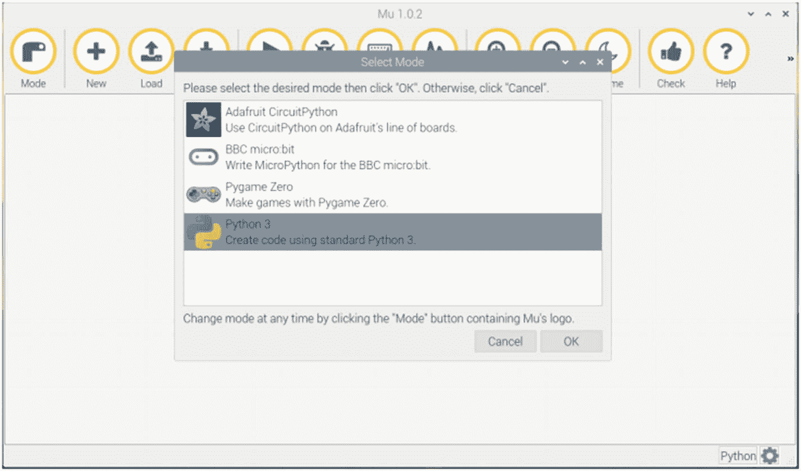

# 1.创作电脑游戏

编写电脑游戏是让编程变得有趣的一个好方法，但它也有缺点。主要的缺点是，要制作一个可用的游戏，你需要写很多代码，这需要很多时间。一个完整的工作游戏对于一本初学编程的书来说通常是太多了。不要担心，因为这本书使用了有效的例子，并利用 Python 和 Pygame Zero 的简单性使它尽可能地简单。在本书中，你将创建几个不同的游戏来说明不同的编程技术。

创造一个游戏不仅仅是写代码。这本书涵盖了创建一个电脑游戏以及编程的一些其他方面。

首先你需要一个想法。然后需要发展这个想法，提出一套规则和控制。它可能需要额外的资源，如图像和声音。然后，您需要编写代码来实现它。接下来(现在是有趣的部分)，你需要测试它，找出什么有效，如何改进。然后你回到起点重新定义这个想法，并重复编程周期。

在这一章中，你还将了解 Python 和 Pygame Zero，以及使其适合游戏编程的一些原因。

## 灵感而不是模仿

第一步是想出一个主意。为此，你可以从你玩过的游戏中获得灵感，这些游戏可以是现有的电脑游戏、纸牌游戏、棋盘游戏或游乐场游戏。或者你可以想出一个全新的游戏，也许从现实世界的活动中获得灵感。如果你想基于以前已经做过的东西来创造一个游戏，那么你必须小心不要侵犯他人的知识产权，包括版权、专利和商标。

像许多法律一样，保护游戏和计算机程序的规则很复杂，并且因国家不同而不同。不可能对错综复杂的法律提供真正的指导，但是有一些你应该遵循的一般规则。

**版权**可以保护文字、图形、代码、音乐等作品的各个方面。然而，版权并不包括游戏的理念或游戏的玩法。作品一旦创作出来就自动享有版权，通常不需要具体的版权声明或注册，尽管这可以提供额外的保护。

专利要复杂得多，可以涵盖想法和概念。专利是为了发明，在游戏编程的情况下，它们可以被授予游戏的特定技术方面。例如，有些专利涉及赛车游戏中显示方向的方式，以及足球游戏中如何识别球员。要知道你正在开发的游戏可能涉及哪些专利是非常困难的。如果你正在创建一个商业游戏，那么你可能需要寻求专利方面的专业建议。

商标是保护名字和标志的一种方式，在电脑游戏中，它们可以包括角色的外貌。这可能会阻止您使用受商标保护的可识别字符。如果你想使用任何受商标保护的角色，那么你需要从商标所有人那里获得许可。

## 玩游戏

了解什么是好游戏的最好方法就是玩游戏。不要只玩一个游戏，玩很多不同的游戏。玩好游戏和坏游戏，想想是什么让游戏变得好和坏。

你是厌倦了玩这个游戏，还是它让你着迷，以至于你不能把自己从屏幕上拉走？哪些游戏让你想继续玩下去，为什么？

如前所述，你不仅仅需要从电脑游戏中获得灵感。也玩一些棋盘游戏。想想什么效果好，什么不好。想想用实物玩游戏和在电脑屏幕上玩游戏的区别；两者都可能有利有弊。

## 创造资源

在查看其他资源时，您可能会想到图形和声音效果。您可能还需要其他资源，包括介绍性视频、教程和背景音乐。

对于大多数游戏来说，你会想要包含图形。这些图形的外观和大小可以决定编程。例如，如果你有一个角色需要在屏幕上移动，那么你需要知道这个角色如何移动(它的脚是否移动)以及这个角色移动所需的空间大小。因此，在开始编程之前，至少创建任何图形的轮廓是有意义的。

声音效果有时可以留到项目的后期，尽管它们通常仍然是创建一个完整游戏的重要部分。如果把它们留到以后再添加，那么在设计游戏的时候，想想它们什么时候会被使用，会有什么影响，仍然是一个好主意。

## 开发周期

与编程相关的主要术语是敏捷。敏捷编程是一种开发软件的方式，它以小增量创建代码，一次实现一个功能，然后返回添加更多的代码。术语敏捷编程通常指的是一种通过定期评审和团队会议(称为 scrums)在团队中开发软件的编程技术，但是当你自己编程时也可以使用类似的技术。

关于使用敏捷风格方法开发代码的一些要点:

1.  收集需求。与最终用户会面，或者像自己是客户一样与自己一起回顾自己的想法。

2.  规划发展。将工作分成小块，每次可以执行一点。

3.  设计代码以完成当前功能。

4.  写代码。

5.  测试代码。除了测试独立代码，还要测试它如何与其他部分交互。

6.  评估代码是否仍然符合需求。

7.  回到 1。考虑已经创建的代码。这与它试图实现的目标相一致吗？

对你开发的代码的每一部分重复这个循环。一旦实现了所有需要的部分，您就可以得到一个发布版本。当添加更多特性或改进代码时，遵循相同的周期。

使用敏捷编程时一些有用的东西:

*   在代码的不同部分如何交互之间设计接口。

*   用增量发布在短代码冲刺中工作。

*   对上一步已经完成的内容和下一步将要创建的内容进行定期的简短回顾。评审通常在工作环境中每天进行，但如果您在业余时间工作，则有所不同。

*   通过代码需要通过的特定测试来执行测试驱动的开发。自动化测试在敏捷编程中很流行，但是您也可以手动测试。

*   定期重构代码；审查代码以提高清晰度/性能。

*   定期与用户(或者你自己，如果是个人项目)一起检查设计是否符合预期。

*   使用橡皮鸭调试(参见第 [11 章](11.html))。

本书中的游戏是基于敏捷编程而创建的。书中不会特别列出任何代码评审，但是您会看到代码是如何一次启动一个特性来构建的。

## 让编程变得有趣

无论你的全职工作是编写电脑游戏，还是你在业余时间做的事情，编程都应该是你喜欢的事情。我从创作自己喜欢玩的东西中找到了极大的满足感。

虽然你可以试着提前想好这些概念，但是你可能不知道你是否喜欢这个游戏，直到你开始玩它。然后，当你开始调整游戏，以确保它是正确的难度，或者是否有你想要添加的功能。这将在第 4 章中详细讨论，届时你将会看到一些用于改进初始游戏设计的技术。

## Python 和 Pygame Zero

Python 是一种流行的编程语言，在教育界和工业界都有使用。它适用于许多不同的计算机操作系统，包括苹果 Mac OS X、微软 Windows 和 Linux。学习 Python 的一些好处是它容易学习，使用的代码更少(与其他一些语言相比)，并且可以帮助教授好的编程技术。

Pygame 是一个可以在 Python 中使用的库，可以使图形游戏编程变得更容易。Pygame Zero 是一个使用 Pygame 的库，但通过减少所需的代码量，使图形游戏编程比 Pygame 更容易。使用这些，有可能在屏幕上创建角色，并非常容易地移动它们。

这本书使用了运行在 Linux 上的 Python 版本，这是 Raspberry Pi 上的当前版本。这些游戏应该可以在不同的计算机系统和安装了 Pygame Zero 的最新版本的 Python 上运行。

Python 中有不同的编程风格。在本书中，最初的几个程序主要是使用函数式编程技术编写的，但随后的程序将基于面向对象编程。当开始编程时，函数式编程风格通常被认为更容易学习，但是一旦你开始创建更长的程序，那么当使用面向对象编程时，编写和理解代码通常更容易。

## 编译与解释

不同的计算机和操作系统以不同的方式工作。如果您正在创建一个为手机或平板电脑设计的游戏(使用触摸屏)，那么您可能需要设计不同于为带有游戏控制器的游戏机设计游戏的界面。此外，计算机内部不同的处理器和操作系统不同的工作方式意味着很难编写能在多台计算机上运行的游戏。

编写计算机代码时，通常会使用一种基于文本的编程语言。计算机不能直接运行那个，代码需要转换成计算机能理解的机器码。当使用 C 之类的计算机语言时，必须先将代码转换成机器代码，然后才能运行程序。这就是所谓的编译语言，程序需要被编译成与运行它的计算机体系结构相匹配的机器代码。

Python 的做法不同，它使用解释器将代码转换成机器语言。这是在程序运行时完成的。这样做的好处是，只要您想要运行代码的计算机有解释器，您通常不需要做任何额外的事情来在该计算机上运行它。缺点是解释型语言运行速度较慢，因为它需要在运行时转换这些代码。这种性能对于本书中的任何游戏来说都不是问题，但是如果你在编写一个图形密集型游戏的话，你应该意识到这一点。

还有一种混合形式，代码被编译成中间形式，但仍然需要解释器(或类似的东西)才能在每个特定的计算机体系结构上运行。这就是 Java 如何使用 Java 虚拟机将 Java 字节码转换成计算机可以理解的机器语言。

按照 Python 的解释，它应该能够在各种不同的计算机上运行，而不需要任何改变。不幸的是，在某些平台上安装 Python 解释器和 Pygame Zero 库有时会有点棘手。幸运的是，有一个更简单的解决方案，使用 Mu 编辑器，这是 Pygame Zero 编程初学者的首选编辑器。

## 选择编程环境

在本书中，游戏是为 Raspberry Pi 设计的，Raspberry Pi 是一种小型、廉价的计算机，专门为学习计算和计算机编程的人设计。树莓 Pi 有不同的变体，包括小巧的树莓 Pi Zero 和功能齐全的树莓 Pi 4。你可以在本书的游戏中使用任何型号的 Raspberry Pi，尽管出于性能原因，我建议使用 Raspberry Pi 2 或更好的版本。如果你也使用 Raspberry Pi 为游戏设计图像(如第 [5](05.html) 章所述)，那么 Raspberry Pi 4 可能更好，但这不是必需的。

Raspberry Pi 是学习 Python 的理想选择，因为你需要的大部分软件都已经预装了。这些程序仍然可以在其他计算机上运行，如果你愿意，你可以在另一个平台上自由开发代码，但是在其他系统上需要一些额外的步骤。

Python 程序是文本文件，因此，您可以在任何文本编辑器中创建它们。如果你以前没有用 Python 编程，那么我建议你从 Mu 编辑器开始。Mu 编辑器不是最强大的编辑器，但是它的简单性使它成为入门的理想选择。它还处理包括 Pygame Zero 在内的大部分设置。

如果使用的是 Raspberry Pi，那么 Raspbian 的最新版本包含 Mu，但是如果它还没有安装，那么您可以从命令 shell 安装 Mu。通过单击屏幕顶部的黑色终端图标启动命令 shell。

然后输入以下命令:

```py
sudo apt update
sudo apt install mu-editor

```

然后，您可以从 Raspbian 菜单系统运行 Mu。从开始菜单中选择编程菜单，然后点击 Mu，它看起来应该如图 [1-1](#Fig1) 所示。



图 1-1

管理部门编辑器的屏幕截图

如果您想在其他操作系统上安装 Mu，那么您可以从 [`https://codewith.mu/`](https://codewith.mu/) 下载 Mu 编辑器。在 Windows 下安装时，Mu 网站上的建议是“只为该用户安装”。这将使添加以后可能需要的任何模块变得更加容易。

管理部门编辑器有不同的模式，适用于不同的编程环境。这本书使用了 Python 3 和 Pygame Zero 模式。

当你有了更多的经验，你可能会想换一个更强大的编辑器。如果使用 Raspberry Pi，那么你有一个数字可以选择，你可以直接从命令行运行程序。如果您使用不同的环境，那么您可能需要用 Pygame Zero 设置一个本地 Python 环境。

## 摘要

本章已经讨论了在你开始编程之前应该考虑的一些事情。它给出了一些建议，告诉你可以从哪里获得灵感，并警告你应该避免围绕他人知识产权的一些陷阱。

它解释了 Python 是什么，以及为什么 Pygame Zero 是游戏编程初学者的好选择。

在下一章，你将开始编写代码，并使用 Python 创建一个命令行游戏。