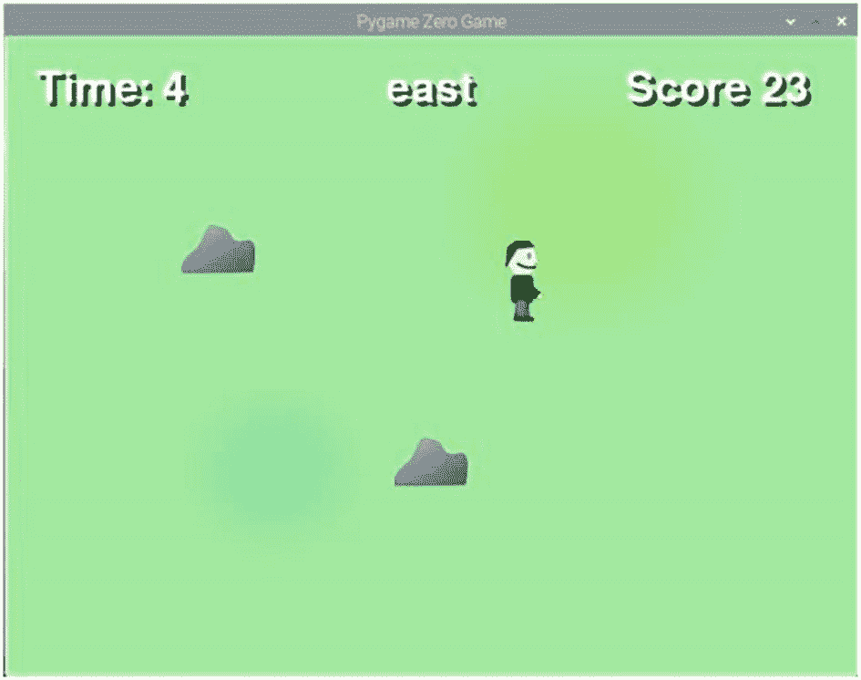
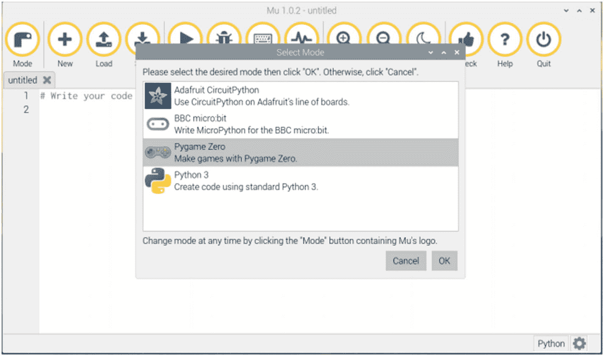
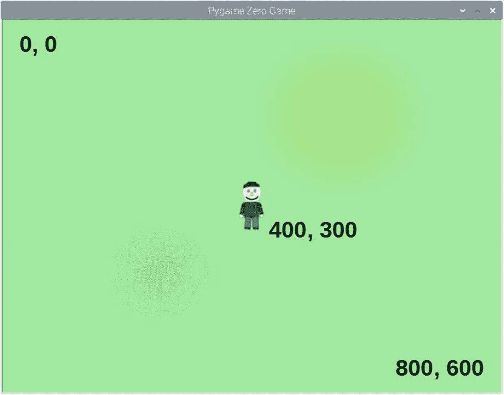
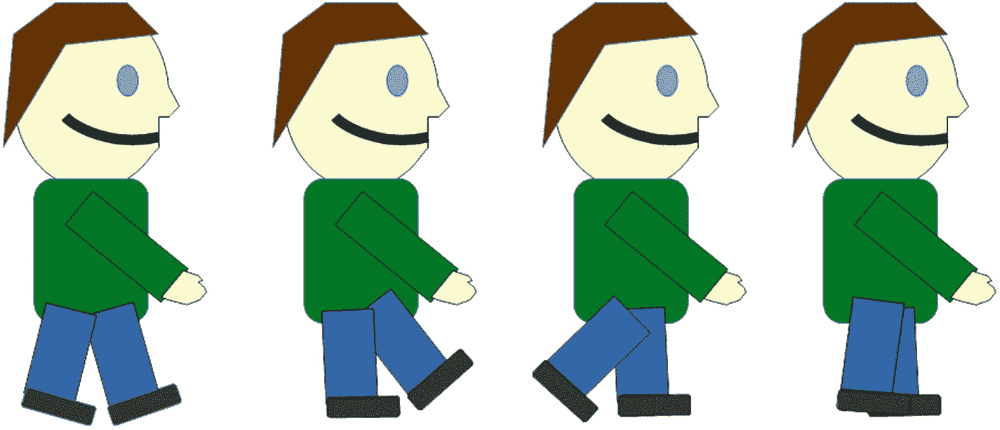
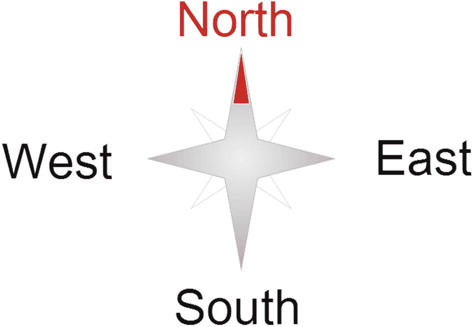
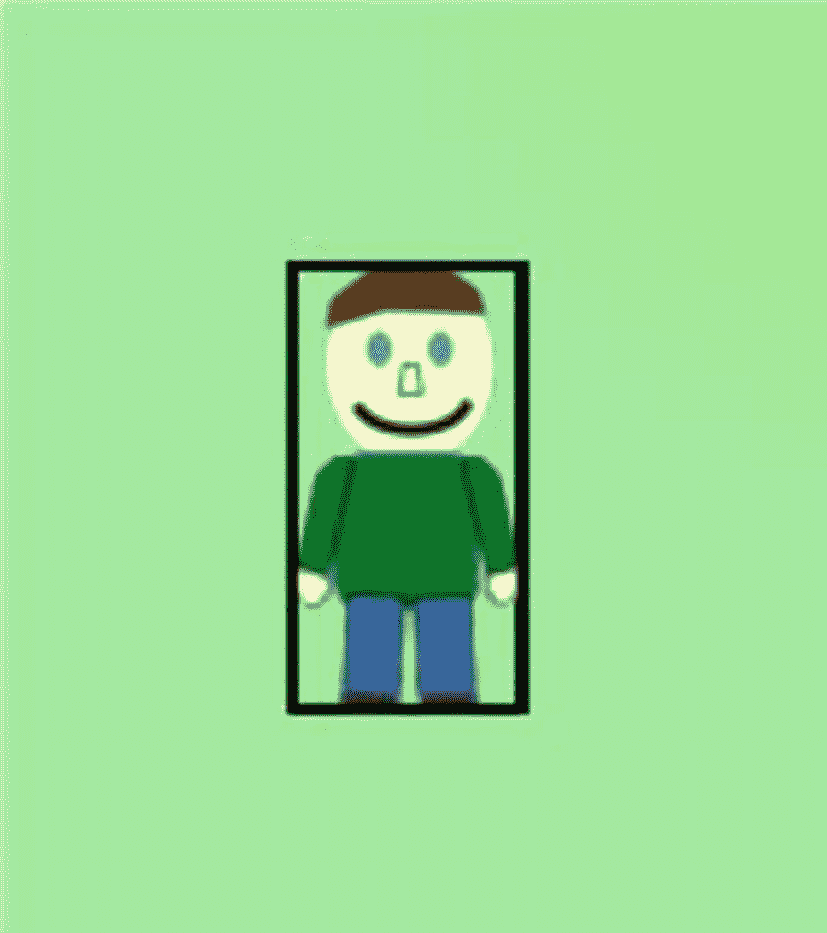
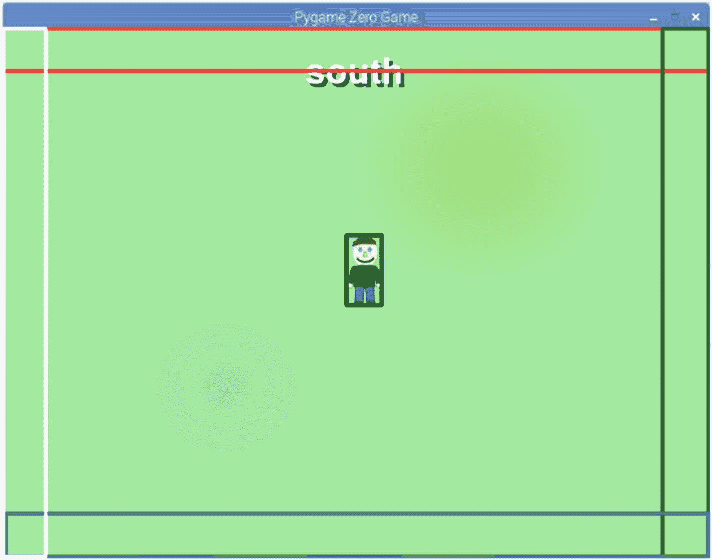

# 3.游戏零点

到目前为止，这些程序都是基于文本的，但如果我们仅仅停留在基于文本的游戏上，它们就不会像图形游戏那样有吸引力。这本书的其余部分是关于图形游戏，将使用 Pygame Zero 创建。

要了解 Pygame Zero 是什么，首先需要了解 Pygame 是什么。Pygame 是一个 Python 的编程库。它是为更容易地创建多媒体应用程序(如游戏)而设计的。它还可以在多个平台上运行，使得与其他电脑共享你制作的游戏变得更加容易。

虽然 pygame 使用 Python 创建游戏变得容易多了，但在开始之前，它仍然需要相当数量的标准代码，即样板代码。

Pygame Zero 是一个较新的编程库，它使用 Pygame，但是去掉了许多样板代码，使得创建游戏更加容易。设计用于教育，以帮助教学编程，这是一个伟大的方式开始创造电脑游戏。

## Pygame 零开发

在撰写本文时，Pygame Zero 是一个正在进行的项目，定期进行改进。幸运的是，大多数变化都保持了向后兼容性，但一些新功能不会在 Pygame Zero 的所有安装上工作。如果您确信您编写的游戏只能在当前或更高版本上运行，那么您可以将它们包含到您的游戏设计中，但是如果您的游戏能够在更广泛的计算机上运行更重要，那么您可能希望将自己限制在与 Pygame Zero 库的旧版本兼容的功能上。

一个例子是，你现在可以在资源(如图像文件)上包括文件路径和文件扩展名，但这在 Pygame Zero 的旧版本(2018 年夏季之前)上不起作用。本书中的代码已经在 Pygame Zero 的最新版本上进行了测试，但是在我意识到向后兼容性问题的地方，我已经尝试编写代码以便在旧版本中也能工作。

## 指南针游戏

第一个图形游戏将被称为指南针游戏。指南针游戏的灵感来自于我志愿加入的童子军玩的一个游戏；这又是一个游戏的变种，叫做“船长来了”。该游戏用于帮助教授四个基本方向(指南针的点)。在真实(非电脑)游戏中，童子军大厅的每面墙上都贴有一个标签。幼仔被给予一个方向，他们必须跑向合适的墙。还可以给出额外的指令，比如队长来了，幼崽必须站着不动，敬礼。

在这一章中，你将创建一个电脑版本的游戏，玩家得到一个必须遵守的指令。玩家必须按照指定的方向移动他们的角色。游戏如图 [3-1](#Fig1) 所示。



图 3-1

指南针游戏截图

这将提供一个学习 Pygame Zero 的机会，以及如何让一个角色在屏幕上走动。这将使用敏捷方法创建，一次添加一个功能来创建游戏。

### 必需的文件

这个项目需要几个图像文件。这些需要放在游戏源代码正下方的图像目录中。

您将需要第 3 章目录中源代码的文件，然后是子目录 images。如果您正在使用管理部门编辑器，那么它们应该被复制到目录`/home/pi/mu_code/images`中。

如果您在提供的源代码的第三章目录中查找，您会看到许多以 compassgame 为前缀的 Python 文件。游戏要经历多次迭代，在游戏开发的不同阶段都会用到这些文件。如果你是按照电脑上的说明来做的，那么你只需要使用一个名为 compassgame.py 的文件来创建游戏，这个文件将贯穿本章。如果您想直接跳到每个阶段的代码，而不是自己键入代码，可以使用源代码中提供的文件。

## 在 Pygame Zero 模式下运行 Mu

游戏应该在 Mu 中创建为一个新文件。你需要把游戏模式调到零。这可以通过单击编辑器左上角的模式图标来实现。如图 [3-2](#Fig2) 所示。



图 3-2

在管理部门编辑器中更改为 Pygame Zero 模式

首先将下面两行添加到文件中，然后将其保存为 compassgame.py。

```py
WIDTH = 800
HEIGHT = 600

```

然后点击 Mu 中的 Play 按钮，你应该会看到一个黑屏，800 像素宽，600 像素高。第一个例子很好地展示了为什么 Pygame Zero 如此易于使用。仅仅定义屏幕的尺寸就足以创建一个游戏窗口。事实上，这可能是使用一个空文件启动的，因为这些是默认值。这比使用 Pygame 的等价代码要少，也更容易理解。

您可以通过单击右上角的 x 或按管理部门菜单栏中的停止来关闭程序。

如果您没有使用 Mu，那么可以在任何其他编辑器中创建该文件，但是应该使用以下命令从命令行运行:

```py
pgzrun compassgame.py

```

这段代码可以在 compassgame-layout1.py 文件的源代码中找到。

Tip

记住，如果菜单中有 run 菜单项而不是 play，那么你需要切换到 Pygame Zero 模式。单击左上角的模式按钮选择您的模式。

## 添加背景图像

既然您已经知道了如何创建一个基本的 Pygame Zero 应用程序，那么是时候添加一些更有趣的东西了。你可以从用一些更有趣的东西替换普通的黑色背景开始。

用清单 [3-1](#PC3) 中的代码替换当前代码。

```py
WIDTH = 800
HEIGHT = 600

BACKGROUND_IMG = "compassgame_background_01"

def draw():
    screen.blit(BACKGROUND_IMG, (0,0))

Listing 3-1Simple Pygame Zero program with image background

```

该代码在提供的源代码中以 compassgame-layout2.py 的形式提供。

单击 Play 按钮，您现在应该会看到和以前一样的屏幕，但是它现在会有一个绿色的背景图像。如果不起作用，请确保您已经将图像复制到正确的目录中。mu_code/images 目录下应该有一个文件 compassgame_background_01.png。

该代码通过创建一个变量 BACKGROUND_IMG 来工作，该变量包含要显示的文件的名称。图像作为文件名输入，没有任何路径信息或。png 后缀。在最新版本的 Pygame Zero 上，如果您愿意，可以使用完整的文件名，但是为了保持与旧版本 Pygame Zero 的兼容性，文件必须位于 image 文件夹中，并且不包含后缀。这对于任何用作演员和背景的图像文件都是一样的。

第`def draw()` `:`行定义了绘图功能。这是一个 Python 函数，Pygame Zero 每秒大约调用 60 次。它应该用来告诉 Pygame Zero 屏幕上应该显示什么。

该函数调用`screen.blit`，它在适当的位置显示位图图像(在本例中，从屏幕的左上角开始显示 0，0)。

Note

使用这么长文件名的原因是因为默认情况下，Mu 将所有代码放在同一个目录中。如果创建多个 Python 程序，它们都共享同一个图像目录。像这样命名它们使得哪个文件用于哪个程序变得很明显。

如果你正在使用一个不同的编辑器或者已经将你的游戏组织到一个专用的目录中，那么你可能想要从文件名的开头删除 compassgame_ 前缀。

图像文件名也包括一个数字，这将允许我们改变背景或人的外观。

## 添加演员

在计算机图形学中，角色和其他物体被称为精灵。在 Pygame Zero 的例子中，它用一个更“友好”的名字来称呼精灵演员。我经常称这些为精灵，因为这是正确的计算术语，但是请记住在 Pygame Zero 中定义它们时要将它们添加为 Actor 对象。

精灵是计算机游戏中使用的图像，通常由位图图像创建。这些通常以人物(人、动物、外星人等)的形式出现。)，但它们也可以用于玩家需要与之交互的对象，如障碍物、球或武器发射的子弹。

在这种情况下，您可以从代表玩家角色的单个精灵开始。稍后你可以添加更多精灵作为障碍来增加挑战。

玩家角色的精灵需要几个图像，这样你就可以显示它面向不同的方向，让它看起来在移动。最少需要的是一个人物面向以下每个方向的图像:前、右、左、后。为了使运动更加真实，可以使用额外的图像，使腿在图像之间移动。在第 5 章中，你将会看到如何设计你自己的精灵角色，但是现在你可以使用源代码中包含的精灵。最简单的方法是从 mu_code 的 image 子目录中的源代码的 image 目录中复制文件。这个游戏的精灵是一个人，但是它可以被一个动物或者一个完全不同的角色代替，比如一辆汽车。

要创建 sprite，请使用带有图像文件的 Actor 对象。

```py
player = Actor('imagefile')

```

与前面提到的背景图像相同的规则也适用于图像。如果您想要最大程度的兼容性，请使用位于映像目录中的不带扩展名的映像名称。如果使用 Pygame Zero 的最新版本，可以包含扩展名和文件位置的路径。

要将 sprite 定位在屏幕的特定位置，您可以随后将该位置添加为一个元组。下面将在屏幕中央创建一个精灵:

```py
player = Actor('compassgame_person_down_1', (WIDTH/2,HEIGHT/2))

```

坐标系从屏幕的左上角开始。x 坐标向右增加，y 坐标向下增加。这与图形和地图的工作方式不同。图 [3-3](#Fig3) 中的图像显示的是游戏画面，其中标注了一些关键坐标。



图 3-3

Pygame 零屏幕坐标

除了创建演员，您还需要包含将它绘制到屏幕上的代码。这是通过将以下条目放入 draw 函数来实现的:

```py
player.draw()

```

清单 [3-2](#PC7) 中显示了演示这一点的代码，它作为 compassgame-player.py 包含在源代码中。

```py
WIDTH = 800
HEIGHT = 600

BACKGROUND_IMG = "compassgame_background_01"

#Player character
player = Actor('compassgame_person_down_1', (WIDTH/2,HEIGHT/2))

def draw():
    screen.blit(BACKGROUND_IMG, (0,0))
    player.draw()

Listing 3-2Simple Pygame Zero program with player actor

```

## 在屏幕上移动精灵

现在您已经创建了一个 sprite(演员)，您可以从键盘读取按键，并使播放器向按键的方向移动。

为了更容易测试一个键是否被按下，Pygame Zero 为每个键提供了一个属性。要测试向上箭头键是否被按下，您应该检查“keyboard.up”的值。如果值为真，则按下向上键，如果值为假，则不按下。

你不会用这个方法从玩家那里得到文本输入，因为它不会告诉你按键的顺序。然而，它对于游戏编程是有用的，其中只有少量的键可以被按下，并且可以同时按下多个键(例如向上和向右以对角移动)。

当你知道向哪个方向移动玩家时，你可以改变 x 和 y 属性来移动角色一定的像素。

移动角色的代码如清单 [3-3](#PC8) 所示。用更新后的代码替换当前代码。

```py
WIDTH = 800
HEIGHT = 600

BACKGROUND_IMG = "compassgame_background_01"

#Player character
player = Actor('compassgame_person_down_1', (WIDTH/2,HEIGHT/2))
# Direction that player is facing
direction = 'down'

def draw():
    screen.blit(BACKGROUND_IMG, (0,0))
    player.draw()

def update():
    # Need to be able to update global variable direction
      global direction

    # Check for direction keys pressed
    # Can have multiple pressed in which case we move in all the directions
    # The last one in the order below is set as the direction to determine the
    # image to use
    new_direction = "
    if (keyboard.up):
        new_direction = 'up'
        move_actor(new_direction)
    if (keyboard.down):
        new_direction = 'down'
        move_actor(new_direction)
    if (keyboard.left) :
        new_direction = 'left'
        move_actor(new_direction)
    if (keyboard.right) :
        new_direction = 'right'
        move_actor(new_direction)
    # If new direction is not "" then we have a move button pressed
    # so set appropriate image
    if (new_direction != ") :
        # Set image based on new_direction
        player.image = "compassgame_person_"+new_direction+"_1"
        direction = new_direction

def move_actor(direction, distance = 5):
    if (direction == 'up'):
        player.y -= distance
    if (direction == 'right'):
        player.x += distance
    if (direction == 'down'):
        player.y += distance
    if (direction == 'left'):
        player.x -= distance

    # Check not moved past the edge of the screen

    if (player.y <= 30):
        player.y = 30
    if (player.x <= 12):
        player.x = 12
    if (player.y >= HEIGHT - 30):
        player.y = HEIGHT - 30
    if (player.x >= WIDTH - 12):
        player.x = WIDTH - 12

Listing 3-3Code to allow the character to move around the screen

```

这包含在名为 compassgame-movement1.py 的源代码中。

到目前为止，您应该能够理解大部分代码，但是有一些新的东西可能需要解释。

new_direction 变量是更新函数内部的局部变量。它用来保持它检测到的最后一个键被按下的方向(所以如果你向上和向右按，它会保持向右)。这样做是为了当两个键都被按下时，角色不会在向上和向右之间改变，但在稍后让角色的腿移动时也很有用。由于 new_direction 存储为字符串，因此可以使用以下行将其包含在播放器图像中:

```py
player.image = "compassgame_person_"+new_direction+"_1"

```

如果玩家面向右侧，将显示图像`compassgame_person_right_1.png.`

添加了一个名为 move_actor 的新函数。顾名思义，这会移动演员在屏幕上的位置。第一个参数是移动的方向。该函数的第二个参数被定义为“`distance = 5`”。这意味着如果向函数提供了一个值，那么该值将存储在距离变量中，但是如果参数中没有传递任何内容，那么距离变量将被设置为 5。当您想要包含参数的默认值时，这很有用。

移动演员时，代码会检查位置，以确保角色不会超出屏幕边缘。它使用 30 个像素的 y 偏移值和 12 个像素的 x 偏移值，这样整个演员都保留在屏幕上。

## 使动作更加真实

如果您运行清单 [3-3](#PC8) 中的代码，您将看到角色四处移动并面向他们行走的方向，但这看起来并不特别真实。由于腿不动，玩家看起来像是在滑行而不是在行走。为了使运动看起来更真实一点，我们可以改变图像来显示人的腿在运动。

使用的技术类似于制作卡通的方式，每一帧都是通过轻微的移动单独绘制的。然后这些画面一个接一个地显示出来，形成一幅动态图像。在一幅典型的漫画中，他们每秒钟的运动可能会产生大约 20 幅图像。理论上，在每次运行更新功能时都有可能改变图像，大约每秒 60 次；然而，为了简单起见，代码只在第五次调用更新函数时更新。这将给出每秒 12 帧的帧速率。要实现这一点，需要玩家移动的每个方向都有四幅图像。图 [3-4](#Fig4) 显示了用于右侧方向的四幅图像。



图 3-4

向右走的四个精灵图像

在这个例子中，只有腿在移动，但是你可以让手臂也在移动，这样会更真实一点。

每个方向使用 4 个图像需要 16 个不同的图像。如果你想提高帧速率，那么你可以增加图像的数量。如果你想移动角色的次数增加一倍，你可以将每张图片之间的延迟减半，并将图片的数量增加一倍，达到 32 张。

以前，通过更新 actor 属性来更改图像。为了允许显示不同的图像，可以将此更改为对名为 set_actor_image 的新函数的函数调用，该函数将基于行进方向和序列中的适当图像来确定正确的图像。

要更新前面的代码以显示字符的工作情况，请执行以下步骤。

在代码顶部附近添加一个新的全局变量 player_step_count。它可以放在方向变量的定义之后。

```py
player_step_count = 1

```

更换管路

```py
player.image = "compassgame_person_"+new_direction+"_1"

```

随着

```py
set_actor_image (new_direction)

```

然后将以下代码添加到文件的底部:

```py
# Show image matching new_direction and current step count
def set_actor_image (new_direction):
    global player, player_step_count

    player_step_count += 1
    if player_step_count >= 4:
        player_step_count = 1

    player.image = "compassgame_person_"+new_direction+"_"+str(player_step_count)

```

更新后的代码以 compassgame-movement2.py 的形式包含在源代码中。如果您现在运行代码，那么您会看到腿在移动，但速度会太快。它仍然需要代码通过每隔 5 帧替换图像来减慢运动。

这是通过允许 player_step_count 一直计数到图像数量的五倍，然后将图像数量除以 5 来实现的。然后，代码将丢弃任何余数，然后加 1(从 1 开始图像编号，而不是从 0 开始)。

```py
This is best illustrated by working through some examples.

With player_step_count set to 0
Divide player_step_count (0) by the delay (5) giving 0.0
Discard anything after the decimal place which gives 0
Add 1 to get image number 1

With player_step_count set to 1
Divide player_step_count (1) by the delay (5) giving 0.2
Discard anything after the decimal place which gives 0
Add 1 to get image number 1

With player_step_count set to 5
Divide player_step_count (5) by the delay (5) giving 1.0
Discard anything after the decimal place which gives 1
Add 1 to get image number 2

With player_step_count set to 19
Divide player_step_count (19) by the delay (5) giving 3.8
Discard anything after the decimal place which gives 3
Add 1 to get image number 4

With player_step_count set to 20, the maximum value has been exceeded so set back to 0 and recalculate the value.

```

其中大部分使用基本运算，但是要丢弃小数点后的值，您将需要函数 floor()，它包含在 math 模块中。floor 函数定义为返回小于或等于 x 的最大整数值。

数学模块包括几个数学函数，在创建游戏时会很有用。更多详情可查阅 [`https://docs.python.org/3.5/library/math.html`](https://docs.python.org/3.5/library/math.html) 。

要导入数学模块，请在代码顶部添加以下行:

```py
import math

```

然后更新 set_actor_image 函数(它被添加到代码的底部)以匹配以下内容:

```py
# Show image matching new_direction and current step count
def set_actor_image (new_direction):
    global player, player_step_count

    step_delay = 5
    player_step_count += 1

    if player_step_count >= 4 * step_delay:
        player_step_count = 1

    player_step_position = math.floor(player_step_count / step_delay) +1
    player.image = "compassgame_person_"+new_direction+"_"+str(player_step_position)

```

更新后的文件作为 compassgame-movement3.py 包含在源代码中。

如果您运行更新的代码，您应该会看到腿以更真实的速度移动。

## 保持游戏状态

编程中的一个重要概念是能够跟踪程序所处的状态。这是程序需要跟踪过去发生的事情以及影响它如何处理未来事件的地方。

如果你从棋盘游戏的角度来考虑，那么最初的状态可能是你把游戏从盒子里拿出来，并把适当的指示物放入每个位置。一旦游戏设置好了，那么可能会有另一个状态来决定谁将首先开始游戏(可能基于骰子的滚动)。

然后，当游戏开始时，每个人之间的状态将依次改变，以便他们滚动设备，移动到下一个位置，并执行任何所需的动作。最后，当一个玩家达到目标时，会有一些胜利的状态。

在电脑游戏中，这是需要使用一个或多个变量来跟踪的东西。如果游戏代码正在显示菜单屏幕，而不是游戏已经在进行中，那么游戏代码可以不同地处理按键。变量可以是任何东西，从具有特定会议的单个数字到具有多个属性的完整类。

对于这个游戏，代码需要跟踪两件事。一个是游戏的状态，让它在游戏结束时不会一直在屏幕上移动角色，另一个是玩家需要往哪个方向移动。这些可以合并成一个变量，但是为了更容易理解，这个例子使用了两个独立的变量，一个叫做 game_state，另一个叫做 target_direction。

第一个变量称为 game_state，它跟踪游戏中的不同阶段。当游戏还没有开始时，这是一个空字符串；当游戏正在进行时，这是一个“正在玩”的字符串；当游戏已经结束时，这是一个“结束”的字符串。

总之:

*   "–游戏未开始

*   “玩”——游戏正在进行中

*   “结束”——游戏结束

对于目标方向，变量可以是不同的基本方向(罗盘上的四个主要方向)。这些是“北”、“东”、“南”和“西”，如图 [3-5](#Fig5) 所示。



图 3-5

罗盘上的四个点

代码将被更新以生成随机方向。因此，需要通过在文件顶部添加以下条目来导入随机模块:

```py
import random

```

通过在文件顶部附近添加以下行来添加变量(例如在 BACKGROUND_IMG 条目之后):

```py
game_state = "
target_direction = "

```

在更新函数顶部附近，用以下内容替换`global direction`行:

```py
    global direction, game_state, target_direction

    # If state is not running then we give option to start or quit
    if (game_state == " or game_state == 'end'):
        # Display instructions (in draw() rather than here)
        # If space key then start game
        if (keyboard.space):
            game_state = "playing"
            target_direction = get_new_direction()
        # If escape then quit the game
        if (keyboard.escape):
            quit()
        return

```

在文件的底部，添加以下函数:

```py
def get_new_direction():
    move_choices = ['north', 'east', 'south', 'west']
    return random.choice(move_choices)

```

这段代码将处理游戏开始时的状态。

如果游戏没有进行，那么它等待玩家按下开始键，在这个例子中是空格键。如果按下该按钮，它会将状态设置为正在播放，并分配一个新的目标方向。

get_new_direction 函数有一个不同方向的列表，并使用 random choice 来随机选择一个方向。

这在源代码中以 compassgame_state1.py 的形式提供。

你现在可以再次运行游戏。记住你现在需要按下空格键，玩家才能被移动。

接下来要添加的是告诉玩家走哪条路的方法。这可以通过使用 screen.draw.text()来完成，它将在屏幕上显示文本。用以下代码替换当前的 draw 函数:

```py
def draw():
    screen.blit(BACKGROUND_IMG, (0,0))
    # If game not running then give instruction
    if (game_state == "):
        # Display message on screen
        screen.draw.text("Press space bar to start", center=(WIDTH/2,HEIGHT/2), fontsize=60, shadow=(1,1), color=(255,255,255), scolor="#202020")
    elif (game_state == 'end'):
        screen.draw.text("Game Over\nPress space bar to start again", center=(WIDTH/2,HEIGHT/2), fontsize=60, shadow=(1,1), color=(255,255,255), scolor="#202020")
    else:
        screen.draw.text(target_direction, center=(WIDTH/2,50), fontsize=60, shadow=(1,1), color=(255,255,255), scolor="#202020")
        player.draw()

```

新的 draw 功能根据游戏状态显示三个不同的文本块。第一个方块是当`game_state = "`，这种情况下它指示玩家按空格键开始游戏。第二个块由 elif (else if)控制，它检查游戏是否结束，第三个块是游戏正在进行时。没有必要检查正在玩游戏的状态，因为如果不是前两个状态，那么它一定是在玩状态。

只有在玩游戏的时候才会调用`player.draw`，否则文本会覆盖玩家。现在还不可能到达游戏的终点。这将是以后要实施的事情。

这段代码有趣的地方在于显示文本的部分。以下是第一个条目的详细信息，但其他条目都以类似的方式工作:

```py
screen.draw.text("Press space bar to start", center=(WIDTH/2,HEIGHT/2), fontsize=60, shadow=(1,1), color=(255,255,255), scolor="#202020")

```

text 方法接受一个要显示的字符串和一个位置；其余的参数是可选的。只需将一个元组作为第二个参数，例如(10，10)，就可以输入位置。在这种情况下，文本在屏幕中央看起来更好，因此元组被传递给 center 参数。它使用宽度和高度值的一半来确定位置。

这里使用的其他可选参数有

*   fontsize–用于设置字体的大小；默认值为 24。

*   阴影–给文本添加阴影；这些值是阴影位置的 x 和 y 偏移。

*   颜色–文本的颜色。

*   颜色

如您所见，代码使用不同的方式输入颜色。您可以使用一些不同的颜色格式，例如(r，g，b)，其中(255，255，255)是白色，或者 html 颜色字符串，其中“#202020”是浅灰色。有关如何创建颜色的更多详细信息，请参见第 [6](06.html) 章。

Note

由随机模块创建的随机数是伪随机的。计算机很难创建真正的随机数，因此它们有办法生成对最终用户来说看起来是随机的数字。根据操作系统和硬件的不同，它可能包括不太确定的来源，如时间和鼠标移动，使其不太可预测。这对于游戏来说通常已经足够了，但是如果将它用于加密目的，您可能需要查看其他随机来源。

## 检测碰撞

如果到目前为止你已经遵循了代码(或者运行了 compassgame-movement3.py ),那么你现在应该有一个可以在屏幕上工作的角色了。下一步是检测玩家何时移动到屏幕的正确一侧。在这种情况下，角色靠近那一边就足够了，而不是在最边上，因为这比必须停在那一边更自然一些。实现的方法之一是创建代码来查看字符的位置，并检查它是否达到某个阈值。虽然这是一种有效的方法，但是如果你改变了字符的大小(可能是不同的高宽比)，你可能需要更新代码来处理这个问题，这就有点不灵活了。相反，Pygame Zero 提供了一个很好的功能，允许它检查冲突。

不幸的是，Pygame Zero 文档没有提供太多关于检测碰撞的信息。Pygame Zero 使用标准的 Pygame 方法，这些方法在 Pygame 文档中有很好的记录(参见附录 B 中的链接)。

碰撞检测通常用于检测两个精灵(演员)是否碰撞。要理解这一点，你需要知道 Pygame 中的所有精灵都有一个 Rect 属性。这是当你通过 Pygame Zero 创建一个演员时自动创建的。Rect 是一个你看不见的虚拟矩形。它是完全包含图像大小的最小矩形。如图 [3-6](#Fig6) 所示，在演员周围添加了一个边框。



图 3-6

带边框的演员

collideRect 方法可用于确定一个矩形是否与另一个矩形重叠。例如，考虑一个汽车游戏，其中两辆汽车在游戏区域内移动，您想知道它们是否会相撞。如果您有名为 car1 和 car2 的演员，您可以使用

```py
if car1.collideRect(car2):
    print ("Car 1 and Car 2 have collided")

```

回到游戏，目前在做《罗盘游戏》；对于这个特殊的检测，我们实际上不需要创建一个演员来碰撞，我们只需要知道他们何时接近屏幕的边缘。相反，我们可以创建一个具有适当尺寸的简单 Rect 对象。然后，如果演员与这些矩形中的一个碰撞，我们知道它们在那个区域。图 [3-7](#Fig7) 中的图像显示了游戏的布局，矩形显示在游戏网格上。在这张图片中，矩形被夸大了，以便更容易看到。



图 3-7

检测玩家接近屏幕边缘的碰撞矩形

你会看到矩形重叠。这不是这个游戏的问题，因为我们只是检查玩家是否达到了其中之一，但这是你在创建其他游戏时需要注意的。

以下代码用于创建矩形，可在 draw 函数之前添加:

```py
#Rectangles for compass points for collision detection to ensure player is in correct position
box_size = 50
north_box = Rect((0, 0), (WIDTH, box_size))
east_box = Rect((WIDTH-box_size, 0), (WIDTH, HEIGHT))
south_box = Rect((0, HEIGHT-box_size), (WIDTH, HEIGHT))
west_box = Rect((0, 0), (box_size, HEIGHT))

```

前面的矩形是不可见的，这就是我们想要的。暂时显示矩形是一个好主意，因为它可以帮助显示任何矩形是否在错误的位置。为此，您可以将以下内容添加到 draw 函数中(在 screen.blit 之后)。这还包括一个围绕玩家的盒子，并为每个矩形使用不同的颜色。

```py
    screen.draw.rect(north_box, (255,0,0))
    screen.draw.rect(east_box, (0,255,0))
    screen.draw.rect(south_box, (0,0,255))
    screen.draw.rect(west_box, (255,255,255))
    screen.draw.rect(Rect(player.topleft, player.size), (0,0,0))

```

源代码以 compass game-collidel 1 . py 的形式包含在内。对该版本做一点小小的改动是一个好主意，这样您就可以看到当您在屏幕上移动时演员周围的矩形也在移动。每当玩家周围的方框与其他矩形重叠时，就可以检测到冲突。

要检测冲突，您可以将以下代码添加到更新函数的底部:

```py
    if (player.colliderect(north_box)):
        print ("Collided with North")
    if (player.colliderect(south_box)):
        print ("Collided with South")
    if (player.colliderect(east_box)):
        print ("Collided with East")
    if (player.colliderect(west_box)):
        print ("Collided with West")

```

这作为 compass game-collider 2 . py 包含在源代码中。现在，如果你运行这个程序，如果你在 Mu 的控制台上观看(或者在终端上观看，如果你从那里启动的话)，每当玩家进入一个矩形时，你会看到几条打印消息。

这有利于测试，但是您现在应该在下一阶段之前用 colliderect 和 draw.rect 语句删除代码块。

使用矩形是一种执行碰撞检测的便捷方式，对于这个游戏来说足够好了。如果使用其他游戏，你可能需要考虑精灵如何互动，特别是当他们周围有很多“空白”的时候。如果你有一个没有填满矩形的形状，那么如果一个玩家实际上没有接触到另一个物体，但是矩形重叠了，这可能会让玩家感到沮丧。相反，可以使用碰撞点方法在特定点上进行测试，或者在您自己的代码中实现更精确的碰撞检测。

## 方向的改变

现在你可以添加代码来处理玩家到达目标时的情况。一旦他们到达要求的区域，玩家需要被告知他们下一步需要去哪里。玩家应该在被告知下一个目标之前移动到新的位置，以此类推。

删除打印出冲突通知的代码后，在更新函数底部的位置添加以下内容:

```py
    if (reach_target(target_direction)):
        target_direction = get_new_direction()

```

此外，在更新功能后添加以下内容:

```py
def reach_target(target_direction):
    if (target_direction == 'north'):
        if (player.colliderect(north_box)):
            return True
        else:
            return False
    elif (target_direction == 'south'):
        if (player.colliderect(south_box)):
            return True
        else:
            return False
    elif (target_direction == 'east'):
        if (player.colliderect(east_box)):
            return True
        else:
            return False
    elif (target_direction == 'west'):
        if (player.colliderect(west_box)):
            return True
        else:
            return False

```

更新函数中的额外代码将使用函数 reach_target 检查玩家是否到达了他们的目标目的地。

如果玩家与当前目标方向相关的盒子发生碰撞，则 reach_target 函数返回 true。如果不是，则返回 false。

这段代码可以从 compassgame-collide3.py 获得。

如果你运行这个游戏，你应该在屏幕的顶部看到指令，如果你去指定它们的一边，那么你会得到一个新的指令。

## 记分

要添加评分机制，只需要有一个变量，每次达到目标时都会更新。要实现这一点，需要创建一个新的全局变量来保存当前的分数。

```py
# Current score for this game
score = 0

```

这需要是一个全局变量，所以在 update 函数中，将全局行更新为

```py
global direction, game_state, target_direction, score

```

每次游戏开始都需要重置分数，所以在 game_state 设置为“正在玩”的文本块中添加`score = 0`。

要增加分数，在更新函数的底部，在 if 语句中添加 score += 1，该语句检查是否达到目标。

因此

```py
    if (reach_target(target_direction)):
        target_direction = get_new_direction()

```

成为

```py
    if (reach_target(target_direction)):
        target_direction = get_new_direction()
        score += 1

```

这将记录分数。要在屏幕上显示它，您可以更新 draw 函数来显示分数。首先将它作为一个全局变量添加到抽奖开始处，然后在最后的 else 文本块中添加以下内容，以便在游戏进行过程中显示分数。您可以将它放在调用 player.draw()之前。

```py
        screen.draw.text('Score '+str(score), fontsize=60, center=(WIDTH-130,50), shadow=(1,1), color=(255,255,255), scolor="#202020")

```

你也可以在游戏结束部分添加最终得分。

```py
        screen.draw.text("Game Over score "+str(score)+"\nPress space to start", fontsize=60, center=(WIDTH/2,HEIGHT/2), shadow=(1,1), color=(255,255,255), scolor="#202020")

```

draw 函数将如下所示:

```py
def draw():
    global score
    screen.blit(BACKGROUND_IMG, (0,0))

    # If game not running then give instruction
    if (game_state == "):
        # Display message on screen
        screen.draw.text("Press space bar to start", center=(WIDTH/2,HEIGHT/2), fontsize=60, shadow=(1,1), color=(255,255,255), scolor="#202020")
    elif (game_state == 'end'):
        screen.draw.text("Game Over "+str(score+"\nPress space bar to start again", center=(WIDTH/2,HEIGHT/2), fontsize=60, shadow=(1,1), color=(255,255,255), scolor="#202020")
    else:
        screen.draw.text(target_direction, center=(WIDTH/2,50), fontsize=60, shadow=(1,1), color=(255,255,255), scolor="#202020")
        screen.draw.text('Score '+str(score), fontsize=60, center=(WIDTH-130,50), shadow=(1,1), color=(255,255,255), scolor="#202020")
        player.draw()

```

这作为 compassgame-score.py 包含在源代码中。

如果您运行更新的代码，您将看到分数随着您达到每个目标而增加。

## 添加倒计时器

最后，需要有一些东西使它成为一个挑战。否则，你可以永远在两边之间徘徊。如果没有任何形式的挑战，我敢肯定大多数人会很快厌倦。

为了增加挑战，将会有一个计时器，这样玩家需要在设定的时间内在屏幕上移动。计时器将在固定时间启动，例如 10 秒，给玩家时间到达目标。如果他们成功了，那么计时器将被重置，但会稍微递减，使其变得更难。如果他们不能在规定时间内完成，那么游戏就结束了。

计算时间的一种粗略方法是考虑更新功能的运行频率。在 Pygame Zero 中，更新函数通常每秒被调用 60 次，大约 0.016 秒，所以通过计算函数被调用的次数，你可以计算出玩家完成任务需要多长时间。这样做的问题是循环的频率没有保证；如果计算机很忙，那么它可能需要更长的更新时间，给玩家一个不公平的优势。相反，代码应该跟踪自上次调用更新函数以来已经过了多长时间。这可以通过向 update()方法添加一个参数来确定自上次运行以来有多长时间。为此，用`update(time_interval)`替换 update()。time_interval 变量将设置为自上次运行更新以来的秒数(大约为 0.016)。

要实现这一点，请添加以下全局变量:

```py
# Number of seconds to play when the timer starts
  timer_start = 10.9
# number of seconds to decrement the timer each time we score a point
timer_decrement = 0.2
# This is the actual timer set to the initial start value
timer = timer_start

```

在 update 方法中将 timer 变量添加到全局变量列表中(不需要添加其他新变量，因为我们不需要更改它们)。

在处理游戏开始时按下 keyboard.space 键的代码块中，添加

```py
        timer = timer_start

```

就在方向键被按下之前，减少计时器并检查我们没有低于 0.9。

```py
    # Update timer with difference from previous
    timer -= time_interval
    # Check to see if timer has run out
    if (timer < 0.9):
        game_state = 'end'
        return

```

然后在分数增加之后(每次达到目标)，需要重置计时器(但是包括基于当前分数的递减)。

```py
        # Update timer - subtracting timer decrement for each point scored
        timer = timer_start - (score ∗ timer_decrement)

```

最后，要在屏幕上看到 timer，将 timer 作为全局变量添加到 draw 函数中，并在屏幕上显示分数的同时添加以下内容。

```py
        screen.draw.text('Time: '+str(math.floor(timer)), fontsize=60, center=(100,50), shadow=(1,1), color=(255,255,255), scolor="#202020")

```

你可能想知道为什么 10 秒倒计时的计时器设置为 10.9 秒。

这是因为打印使用 floor 函数来去除任何分数，并以整秒显示计时器。如果我们测试计时器在零以上，玩家将期望计时器显示达到零时游戏立即结束，而不是继续计算下一秒。此外，玩家也希望计时器停留在 10 秒，而不是 9 秒，一旦我们减去第一个时间间隔。从 10.9 秒开始计时，到不到 1 秒结束，几乎正好是 10 秒，用户将看到从 10 到 0 的值。

## 指南针游戏版本 0.1 的最终代码

你现在将有一个完整的游戏可以玩。当你到达终点时，它会告诉你你的分数。然后你可以按空格键来试试这个游戏，看看你是否能打破这个分数。游戏的完整列表，到目前为止，包含在列表 [3-4](#PC41) 中。这也作为 compassgame-v0.1.py 包含在源代码中。

```py
import random
import math

WIDTH = 800
HEIGHT = 600

BACKGROUND_IMG = "compassgame_background_01"

game_state = "
target_direction = "

#Player character
player = Actor('compassgame_person_down_1', (WIDTH/2,HEIGHT/2))
# Which image is being displayed
player_step_count = 1
# Direction that player is facing
direction = 'down'

# Number of seconds to play when the timer starts
timer_start = 10.9
# number of seconds to decrement the timer each time we score a point
timer_decrement = 0.2
# This is the actual timer set to the initial start value
timer = timer_start

#Rectangles for compass points for collision detection to ensure player is in correct position
box_size = 50
north_box = Rect((0, 0), (WIDTH, box_size))
east_box = Rect((WIDTH-box_size, 0), (WIDTH, HEIGHT))
south_box = Rect((0, HEIGHT-box_size), (WIDTH, HEIGHT))
west_box = Rect((0, 0), (box_size, HEIGHT))

# Current score for this game
score = 0

def draw():
    global score, timer
    screen.blit(BACKGROUND_IMG, (0,0))

    # If game not running then give instruction
    if (game_state == "):
        # Display message on screen
        screen.draw.text("Press space bar to start", center=(WIDTH/2,HEIGHT/2), fontsize=60, shadow=(1,1), color=(255,255,255), scolor="#202020")
    elif (game_state == 'end'):
        screen.draw.text("Game Over "+str(score)+"\nPress space bar to start again", center=(WIDTH/2,HEIGHT/2), fontsize=60, shadow=(1,1), color=(255,255,255), scolor="#202020")
    else:
        screen.draw.text(target_direction, center=(WIDTH/2,50), fontsize=60, shadow=(1,1), color=(255,255,255), scolor="#202020")
        screen.draw.text('Score '+str(score), fontsize=60, center=(WIDTH-130,50), shadow=(1,1), color=(255,255,255), scolor="#202020")
        screen.draw.text('Time: '+str(math.floor(timer)), fontsize=60, center=(100,50), shadow=(1,1), color=(255,255,255), scolor="#202020")
        player.draw()

def update(time_interval):
    # Need to be able to update global variable direction
    global direction, game_state, target_direction, score, timer_start, timer_decrement, timer

    # If state is not running then we give option to start or quit
    if (game_state == " or game_state == 'end'):
        # Display instructions (in draw() rather than here)
        # If space key then start game
        if (keyboard.space):
            game_state = "playing"
            timer = timer_start
            target_direction = get_new_direction()
        # If escape then quit the game
        if (keyboard.escape):
            quit()
        return

    # Update timer with difference from previous

    timer -= time_interval
    # Check to see if timer has run out
    if (timer < 0.9):
        game_state = 'end'
        return

    # Check for direction keys pressed

    # Can have multiple pressed in which case we move in all the directions
    # The last one in the order below is set as the direction to determine the
    # image to use
    new_direction = "
    if (keyboard.up):
        new_direction = 'up'
        move_actor(new_direction)
    if (keyboard.down):
        new_direction = 'down'
        move_actor(new_direction)
    if (keyboard.left) :
        new_direction = 'left'
        move_actor(new_direction)
    if (keyboard.right) :
        new_direction = 'right'
        move_actor(new_direction)
    # If new direction is not "" then we have a move button pressed
    # so set appropriate image
    if (new_direction != ") :
        # Set image based on new_direction
        set_actor_image (new_direction)
        direction = new_direction

    if (reach_target(target_direction)):
        target_direction = get_new_direction()
        score += 1
        # Update timer - subtracting timer decrement for each point scored

        timer = timer_start - (score ∗ timer_decrement)

def reach_target(target_direction):
    if (target_direction == 'north'):
        if (player.colliderect(north_box)):
            return True
        else:
            return False
    elif (target_direction == 'south'):
        if (player.colliderect(south_box)):
            return True
        else:
            return False
    elif (target_direction == 'east'):
        if (player.colliderect(east_box)):
            return True
        else:
            return False
    elif (target_direction == 'west'):
        if (player.colliderect(west_box)):
            return True
        else:
            return False

def move_actor(direction, distance = 5):
    if (direction == 'up'):
        player.y -= distance
    if (direction == 'right'):
        player.x += distance
    if (direction == 'down'):
        player.y += distance
    if (direction == 'left'):
        player.x -= distance

    # Check not moved past the edge of the screen

    if (player.y <= 30):
        player.y = 30
    if (player.x <= 12):
        player.x = 12
    if (player.y >= HEIGHT - 30):
        player.y = HEIGHT - 30
    if (player.x >= WIDTH - 12):
        player.x = WIDTH - 12

# Show image matching new_direction and current step count
def set_actor_image (new_direction):
    global player, player_step_count

    step_delay = 5
    player_step_count += 1

    if player_step_count >= 4 ∗ step_delay:
        player_step_count = 1

    player_step_position = math.floor(player_step_count / step_delay) +1
    player.image = "compassgame_person_"+new_direction+"_"+str(player_step_position)

def get_new_direction():
    move_choices = ['north', 'east', 'south', 'west']
    return random.choice(move_choices)

Listing 3-4Compass game. A simple Pygame Zero program with image background

```

完整的游戏大概 170 行代码，包括注释和空行。这听起来可能很多，但比在许多其他编程语言中要少得多。

## 摘要

本章介绍了 Pygame Zero 以及创建第一个图形游戏。代码相当长，这反映了创建一个游戏所付出的努力，但它比许多其他编程语言中所需的同等代码要短得多。

这个游戏目前还很基础，将在下一章游戏设计中进一步开发。