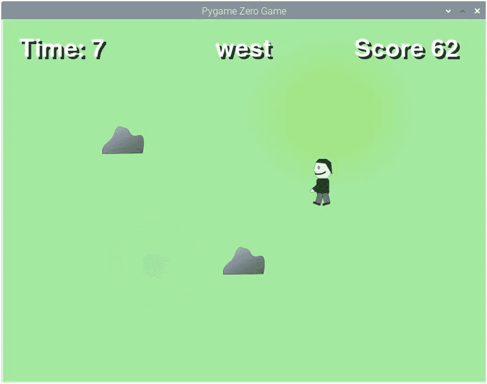

# 四、游戏设计

希望你有机会在进入本章之前玩完第 [3](03.html) 章的游戏。你觉得它怎么样？

如果你的经历和我的一样，那么开始的几次会很有趣，但是之后乐趣会有所下降。有两个原因:一个是一旦你记住了动作，玩起来就很简单，事实上有点太简单了，另一个原因是因为计时器随着每一级的增加而减少，它很快就会达到时间太少的地步，这意味着你在每场比赛中都会得到相似的分数。

在这一章中，我们将看看是什么让游戏变得有趣，以及我们如何做一些改变来改进游戏。这构成了游戏设计的基础。

## 是什么让游戏变得有趣？

在我们考虑添加任何代码之前，想想你玩过的游戏，是什么让它们变得有趣。以下是我想到的一些东西，也许你能想到其他因素:

*   具有挑战性但可以实现

*   选择和后果

*   奖励和进步

*   可爱的角色

*   故事情节/历史相关性

*   教育(有时)

*   玩游戏需要适当的时间

*   包容性

*   适合年龄

这些并不是所有游戏都需要的。把它们想象成指导方针，让你思考游戏设计，但是不要有太多限制。意识到什么时候可以包含这些特性可以让游戏更有趣。这些也可能彼此相关，例如奖励如何帮助克服挑战，或者进展在哪里被用来揭示故事情节的下一部分。

在设计一个新游戏的时候，考虑这些问题并思考如何在游戏中实现它们是一个好主意。如果你认为这对你的游戏不重要，那也没关系。

所有这些特性都没有唯一的答案，这取决于你想创作什么类型的游戏以及你的目标受众是谁。

## 具有挑战性但可以实现

当你在玩游戏的时候，你希望能够感觉到你已经取得了一些成就。这通常是通过在游戏中有一个你需要克服的挑战来实现的。挑战可能是一种技能；它可能是关于快速反应；或者它可能需要使用脑力来解决一个难题。

有一些流行的游戏不提供挑战，但它们通常提供一些别的东西。如果你想一想数字绘画应用，它们不是你通常认为具有挑战性的，而是放松或治疗性的；有些游戏可能是创造性的，而不是竞争性的，如创意模式下的*《我的世界》*。可以说，你可以说缺乏挑战性意味着他们不会被归类为游戏，这是值得思考的事情。

在大多数游戏中，在游戏的简单性和挑战性之间有一个平衡，让你觉得你已经取得了一些成就。把一个游戏做得太简单，玩家可能会感到无聊并在其他地方寻找新的挑战，把它做得太难，他们可能会放弃认为他们不能再进步了。

一般来说，你会希望游戏开始容易，让玩家明白如何玩而不会面临太多的挑战。然后随着他们在游戏中的进步，让游戏变得更有挑战性并给玩家一种成就感会变得更难。

在思考如何让一个游戏具有挑战性的时候，你要思考这个游戏是否会有可预测性，或者是否会有随机的元素。一个可预测的游戏在每次玩的时候都会有完全相同的反应。这意味着每个游戏都有相同的难度，但是通过大量的练习，玩家可以学会这个级别。有了随机元素，游戏就不那么可预测了，玩家需要调整他们的玩法来适应游戏。

## 选择和后果

一些游戏创造了玩家需要做出的选择。有些选择只是改变了游戏的外观或感觉(也许是不同颜色的服装)，但我真正谈论的是决定游戏玩法的选择。这些可能是方向的选择，是战斗还是选择外交的决定，或者是追求什么技术的决定。这是一个特别好的方法，可以让游戏变得有挑战性，让玩家觉得自己控制了游戏。如果提供一个选择，那么玩家所做的选择通常会有一个结果，这个结果决定了他们如何在游戏中前进。

## 奖励和进步

当一个游戏包含一个挑战，那么奖励玩家是有用的，这给他们一种满足感，这是值得努力的。奖励可以只是通过各级进展(级别上升)，或者它可能涉及解锁一个新的角色或权力。这些力量通常可以和挑战一起帮助完成下一关。

## 可爱的角色

许多电脑游戏让你扮演一个特定角色或控制一队角色。你游戏中的一个角色可能是专门为你的游戏而创造的，也可能与电影或电视等现有的特许经营有关。

你可能想尝试创建一个与你最喜欢的电影相关的游戏，也许是一个哈利波特巫师游戏，但是你可能会遇到版权问题。如果是现有的特许经营，那么你需要知道版权和许可限制。一般来说，如果你使用任何基于电影、电视或知名人物的东西，那么你需要得到特许经营者的许可。

如果你创造了自己的角色，那么你可以赋予他们自己的个性和特质，这样玩家就可以和他们交往。在某些情况下，这些角色可以凭借自身的能力成为名人，只要想想萝拉·卡芙特这个角色，他最初是一个视频角色，后来被拍成了电影。

还要记住，人物不一定是人。它们可以是生物或交通工具，或者你甚至可以让无生命的物体变得有生命。

## 故事情节/历史相关性

有一点经常是可选的，那就是游戏是遵循故事情节还是以历史故事为背景。一个故事可以帮助玩家更多地与游戏联系起来，让他们觉得自己是故事的一部分。这可以成为继续玩游戏的强大动力。

历史相关性是指你将游戏建立在一个真实的历史时刻上。一个流行的是有一个游戏是与一场历史性的战斗或历史上的一个重要时刻，如铁路的诞生。

然而，有许多游戏没有任何类型的故事情节，你只是为了好玩而玩。这完全取决于你想创造的游戏类型。

## 教育的

另一个可选的方面是游戏是否有教育意义。这可以包括传统的儿童教育游戏，如加法和乘法游戏，成人“大脑游戏”，帮助教你玩乐器的游戏，或者可能包括参考历史事件的游戏。

这些可以是一个明显的目标，也可以只是游戏的一个微妙特征。这可以与奖励联系起来，但不仅仅是屏幕上的徽章，玩家可以感觉到他们学到了一些东西，他们可以离开计算机使用。他们也可能非常微妙，也许通过故事情节或通过学习如何克服障碍来学习历史。

## 玩游戏需要适当的时间

当考虑玩游戏需要多长时间时，你需要考虑玩家将如何玩游戏。这是一个你希望他们长时间坐下来玩的游戏，还是他们用来打发白天空闲时间的游戏？

你还应该考虑游戏是否可以保存，以及保存之间可以间隔多久。如果你花了很长时间试图完成一个关卡，但是却没有时间去完成它，这是非常令人沮丧的。如果你能保存并恢复到那个水平，就可以避免因需要去其他地方而产生的挫败感。

## 包容性

有几种方法可以让游戏更包容其他人。这可能包括为那些发现传统键盘控制难以使用的残疾人提供的附加/简化控制。或者它可以包括用不同的角色来代表玩游戏的人的性别或肤色的能力。

确保你不使用任何负面的刻板印象也同样重要。在过去，女性角色被用作处于困境中的少女，等待男性骑士来拯救她。令人欣慰的是，随着更多的女性角色在电影和电脑游戏中担任主角，这些现在变得不那么常见了。

在开发游戏时记住这些想法，可能会有一些简单的事情可以实现，使游戏对更多样化的人群更具吸引力。

## 适合年龄

最后，我会提到一个游戏应该是适合年龄的。这本书里的游戏都是为家庭设计的。如果你的目标是年纪较大的玩家，那么你可以少用家人朋友的语言，但这可能会使它不太适合其他人。暴力的程度和造成伤害的现实程度也是如此。游戏的目标年龄也应该反映在所使用的图形类型中，这将在下一章的图形中详细讨论。

## 改进指南针游戏

采纳这些建议，我们可以做一些事情来让指南针游戏变得更好。在本章中不可能实现所有这些想法，但是你可以增加三个新的特性来改善游戏性:

1.  改进计时器，这样即使分数很高也有更多的机会完成。

2.  增加一些随机障碍，让游戏更有挑战性。

3.  添加一个高分，保存最高得分。

这些都是为了使游戏更具挑战性，但也包括在保存高分方面的奖励。

Note

本章使用的代码需要与第 [3 章](03.html)相同的资源。你需要将第 [4](04.html) 章的源代码复制到与第 [3](03.html) 章的源代码相同的目录下。

## 更新的计时器

游戏计时器的问题是它线性递减，每次计时的时间长度相同。这在一开始很有效，但是在得到大约 38 分后，就变得很难了；完成这项任务几乎是不可能的。所需要的是定时器功能，其在开始时非常快速地减少时间(以创建挑战元素)，但是随着时间的推移，它减少得不太快，从而给出仍然能够完成任务的合理机会。

这将涉及到一些数学。在这个阶段，我们将保持简单。要用的公式是 x / (x + h)。这里 x 是分数，h 是偏移量。我们将使用偏移量 10。这个公式开始时增加很快，但是随着 x 变大，它趋向于值 1。为了得到计时器的时间，我们从开始时间中减去它。

为了确定合适的值，使用 Python 绘图模块对此进行了测试。我不会详细介绍代码是如何工作的，但源代码是在一个名为 timedecaygraph.py 的文件中提供的。如果您查看源代码，您应该能够看到它是如何工作的。如果您想尝试运行代码，首先需要安装 plotly 模块。Mu 编辑器的未来版本将包括一种安装模块的方式，但在编写本文时还不可用。要添加模块，请执行以下操作之一:

*   在 Raspberry Pi 上，您可以使用

    ```py
    sudo pip3 install plotly

    ```

    安装模块
*   在其他 Linux 发行版上

    Install either the same as previously or

    ```py
    sudo pip install plotly

    ```

*   在 Windows 上

    你需要告诉 pip Mu 正在使用的 pkg 的位置。

    On my computer, that is achieved using

    ```py
    pip install plotly --target="c:\users\stewart\AppData\Local\Mu\pkgs"

    ```

    你需要用安装 Mu 的用户名替换`stewart`。

*   关于麦克·OS X

    首先创建一个单独的目录来运行程序，并复制到 timedecaygraph.py 文件中。

使用以下内容创建名为 setup.cfg 的文件:

```py
[install]
Prefix=

```

然后使用以下命令安装软件包

```py
pip3 install plotly --upgrade --target /Applications/mu-editor.app/Contents/Resources/app_packages

```

一旦安装了 plotly，就可以在 Mu 中运行 timedecaygraph.py(首先将模式从 Pygame Zero 改为 Python 3)。

根据您的系统，它可能会在 web 浏览器中打开结果，但在其他系统中，您可能需要将输出保存为 html 文件，然后用 web 浏览器手动打开它。

通过调整公式值，我发现下面的公式运行良好:

```py
start_value + 1.5 - (start_value ∗ (i/ (i + 10)))

```

参见图 [4-1](#Fig1) 中的截图，该图显示了新公式与线性衰减的对比。


图 4-1

显示不同衰变公式的图形屏幕截图

从图中可以看出，改进后的公式最初下降的速度比线性衰减快得多，但随着分数的增加，衰减也小得多。

要在代码中实现这一点，加载上一章末尾的当前版本代码(compassgame-v0.1.py)。

移除不再需要的 timer_decrement 变量。

然后在更新函数中，替换以下条目

```py
timer = timer_start - (score ∗ timer_decrement)

```

随着

```py
timer = timer_start + 1.5 - (timer_start ∗ (score/ (score + 10)))

```

值 10 设定衰减速度，1.5 用于增加偏移。如果您希望能够微调这些值，可以将它们更改为变量。

这作为 compassgame-timer2.py 包含在源代码中。

## 添加障碍

我们能做的下一件事是通过增加玩家必须避开的障碍来增加一点挑战。这可以通过添加新的级别来实现。第一级没有任何障碍，第二级增加了一些障碍，第三级增加了一些不同的障碍，以此类推。图 [4-2](#Fig2) 中的截图显示了游戏在避开一些障碍后的样子。



图 4-2

要避开障碍物的指南针游戏

增加障碍需要几个变化。从第 [3](03.html) 章末尾的代码开始(compassgame-v0.1.py)。第一个是在文件顶部附近添加更多的变量和定义:

```py
OBSTACLE_IMG = "compassgame_obstacle_01"
# Current score for this game
score = 0
# Score for each level
score_per_level = 20

# What level are we on
level = 1

#Obstacles - these are actors, but stationary ones - default positions
obstacles = []
# Positions to place obstacles Tuples: (x,y)
obstacle_positions = [(200,200), (400, 400), (500,500), (80,120), (700, 150), (750,540), (200,550), (60,320), (730, 290), (390,170), (420,500) ]

```

要显示障碍，将它添加到 draw 函数中，确保它不在任何 if-else 子句中。

```py
    for i in range (0,len(obstacles)):
        obstacles[i].draw()

```

添加一个新的 set_level 函数来创建障碍演员。这可以朝向瓷砖的末端。

```py
def set_level(level_number):
    global level, obstacles, obstacle_positions

    level = level_number

    # Reset / remove all obstacles
    obstacles = []
    if (level < 1):
        return
    # Add appropriate number of obstacles - up to maximum available positions
    for i in range (0,len(obstacle_positions)):
        # If we have already added more than the obstacle level number then stop adding more
        if (i >= level_number - 1):
            break
        obstacles.append(Actor(OBSTACLE_IMG, obstacle_positions[i]))

```

每当级别增加时，将调用此函数。除了更新级别编号的全局变量之外，它还会产生需要避免的障碍。

障碍列表开始时是空的，所以没有画出障碍。当等级高于 1 级时，就会产生新的障碍。这些是作为演员添加的，但是不像我们的玩家，他们不能在屏幕上移动。

你需要确保障碍图像存在；否则，程序可能会挂起而不显示错误信息，从而很难知道哪里出错了。

更新位于更新函数底部附近的 if(reach _ target(target _ direction)):代码块。

```py
    if (reach_target(target_direction)):
        target_direction = get_new_direction()
        score += 1
        # check if we need to move up a level
        if (score >= level * score_per_level):
            set_level(level + 1)
        # Level score is the number of points scored in this level
        level_score = score - ((level - 1) * score_per_level)
        # Update timer - subtracting timer decrement for each point scored
        timer = timer_start + 1.5 - (timer_start * (level_score/ (level_score + 10)))

```

在这个代码中，级别每增加 20 级。20 分之前不会有障碍，然后增加一个障碍，40 分时增加第二个障碍，以此类推。这给了每个关卡一个合理的难度等级，但是在开发阶段测试游戏的时候会花很多时间。您可能希望将 score_per_level 的值减少到 10，这样您就可以测试障碍物是否创建正确，而不需要玩很长时间。这是开发游戏时经常要做的事情。在一些游戏中，这些是作为特殊的“作弊代码”被编码到游戏中的，这些代码将用于直接跳到某个级别或添加某些能量来帮助测试。

更新后的代码在源代码中以 compassgame-obstacle1.py 的形式提供。你可以测试代码，障碍会在得分 20 分后出现，但玩家能够直接穿过它们。显然，当玩家碰到它们时，需要一些额外的代码来做一些事情。这是通过在更新函数的末尾添加以下代码块来实现的:

```py
    # detect if collision with obstacle (game over)
    for current_obstacle in obstacles:
        if player.colliderect(current_obstacle):
            game_state = "end"
            return

```

这与用于检测玩家何时到达游戏区域的一侧的代码相同，但是使用循环来与列表中的每个障碍进行比较。如果玩家撞上了一个障碍物，那么游戏被设置为“结束”状态，触发游戏的结束。到目前为止，源代码中包含的代码是 compassgame-obstacle2.py。

## 增加高分

接下来的功能是增加一个高分。这告诉玩家先前获得的最高分是多少，并给玩家一些目标。通常，高分将存储多个值以及它们的名字或缩写，但现在您应该从一个最高分的值开始。高分的一个特点是它需要保存在某个地方，这样当电脑关机时它就不会丢失。因此，这将包括如何将数据保存到磁盘上的文件中，以及如何读回数据。在 Raspberry Pi 的例子中，它不是存储在物理硬盘上，而是存储在 SD 卡上，但是使用 Python 可以像在磁盘上一样访问它。

在 Pygame Zero 的最新版本中，有一个存储功能，提供了一种简单的存储信息的方法。在撰写本文时，Pygame Zero 文档中还没有完整记录该函数。虽然传统的 Python 文件操作更难使用，但对于任何 Python 编程来说，它们都是有用的工具。我建议学习这里使用的方法，这对将来的 Python 编程很有用。

在文件顶部附近添加以下新的全局变量:

```py
HIGH_SCORE_FILENAME = "compassgame_score.dat"

```

新增两个函数，一个是从磁盘中检索高分(get_high_score)，另一个是保存最新的高分(set_high_score)。这些可以添加到文件的底部。

```py
# Reads high score from file and returns as a number
def get_high_score():
    file = open(HIGH_SCORE_FILENAME, 'r')
    entry = file.readline()
    file.close()
    high_score = int(entry)
    return high_score

# Writes a high score to the file
def set_high_score(new_score):
    file = open(HIGH_SCORE_FILENAME, 'w')
    file.write(str(high_score))
    file.close()

```

get_high_score 函数从文件中读取一个值。首先，它使用 open 函数打开文件。第一个参数是文件名，第二个参数是一个或多个字符，表示文件应该以何种模式打开。在这种情况下,“r”表示读取，其他常见模式是写入“w”和追加“a”。默认情况下，该文件以默认的文本模式打开，但是您可以使用“b”选项以二进制模式访问该文件。例如，要以只读二进制模式打开文件，可以使用“rb”。

该文件作为 file 对象返回，然后可用于读取该文件。该函数通过 readline 方法使用 file 对象，该方法将从文件中读取一行。对 readline 的后续调用将读入更多的行。在这种情况下，我们只有一个条目，所以只需要调用一次。

由于高分已经存储到一个文本文件中，它将是一个字符串而不是一个数字。因为我们需要能够将它与数字进行比较，所以需要使用 int 函数将它从字符转换为整数。然后返回结果值。

您还会注意到有一行 file.close()，它在函数读取完文件后关闭文件。这是释放文件所必需的，这样以后这个程序或另一个程序就可以打开它。

set_high_score 函数的工作方式与 get_high_score 类似，但它是写入文件而不是从中读取。首先更新全局变量 high_score，然后它以写模式打开文件，并写入转换为字符串的高分值。然后文件被关闭。

在更新函数中，在第`score = 0`行之前添加以下代码:

```py
            high_score = get_high_score()
            if (score > high_score) :
                set_high_score(score)

```

这在代码中的位置意味着新的高分直到下一个游戏开始后才被保存。这样做是为了保持代码简单，更易于阅读。你可能想在游戏结束后检查这个。

最后，游戏结束时需要代码来显示高分。将“游戏结束”的当前打印声明替换为以下两行:

```py
        high_score = get_high_score()
        screen.draw.text("Game Over\nScore "+str(score)+"\nHigh score "+str(high_score)+"\nPress map or duck button to start", fontsize=60, center=(WIDTH/2,HEIGHT/2), shadow=(1,1), color=(255,255,255), scolor="#202020")

```

### 试着除了

如果您现在尝试运行代码，它将不起作用。不幸的是，它没有给出错误消息就失败了，这令人沮丧。这是因为对文件访问没有错误检查。当代码第一次尝试读入高分文件时，那么它就不存在了。您可以添加代码来检查文件是否存在，但是在文件操作过程中还会出现其他问题。例如，文件可能存在，但值已损坏。为了避免必须进行大量不同的检查，我们可以在 try except 代码块中使用 Python 异常处理。

尝试除了有三个步骤。首先“try”块将运行代码；如果有任何错误(异常)，那么可以使用“except”块来处理它们，然后无论异常是否发生，“finally”块都将运行。

清单 [4-1](#PC18) 显示了用于处理异常的代码的一般示例。

```py
try:
    operation_that_may_fail()
except:
    print ("An exception occurred")
finally:
    print ("I run regardless")

Listing 4-1Example of a try except exception handling

```

这里的代码试图运行可能会失败的操作。如果它触发了一个异常，那么 except 代码将运行。不管怎样，finally 块都会运行。

您也可以只捕捉某些异常。以下代码显示了如何只捕捉 IO 错误:

```py
except IOError:

```

对于不同类型的错误，还可以使用多个 except 块。发生异常时，您可以按如下方式访问异常属性:

```py
except Exception as e:

```

这将在变量 e 中提供一个异常值。您可以使用`print (e)`将其显示在控制台屏幕上。异常处理将在第 [11 章](11.html)中进一步解释。

要在访问高分文件时使用 try except 异常处理，可以用以下新代码替换这两个高分函数:

```py
# Reads high score from file and returns as a number
def get_high_score():
    try:
        file = open(HIGH_SCORE_FILENAME, 'r')
        entry = file.readline()
        file.close()
        high_score = int(entry)
    except Exception as e:
        print ("An error occurred reading the high score file :" + str(e))
        high_score = 0
    return high_score

# Writes a high score to the file
def set_high_score(new_score):
    global high_score
    high_score = new_score
    try:
        file = open(HIGH_SCORE_FILENAME, 'w')
        file.write(str(high_score))
        file.close()
    except Exception as e:
        print ("An error occurred writing to the high score file :" + str(e))

```

更新后的代码命名为 compassgame-highscore.py。

代码中处理异常的方式意味着，如果出现异常，程序将继续运行。在读取错误的情况下，high_score 只是被赋予零值。这在这里是可以接受的，因为游戏不保存高分照样可以玩。在某些程序中，未能保存数据可能是一个关键问题，因此会导致其他操作，可能包括终止程序。

像这样简单的高分可以在一段时间内增加额外的游戏性，但最终你会达到一个很难甚至不可能击败分数的地步。许多游戏通过添加不同的元素或在游戏时赚取积分来克服这一点，积分可用于购买物品，从而更容易获得更高的分数。在军事游戏中，这可能是盔甲或更强大的武器。这超出了本书的范围，因为它需要很多额外的代码来包含一个基于奖励的系统，但这是你在设计自己的游戏时可能要考虑的事情。

这个游戏只是实现了一些想法。这足以让游戏变得更加有趣。指南针游戏在目前的形式下永远不会是一个特别好的游戏，因为它有点太简单了。然而，这是一个很好的游戏，展示了如何将图形融入游戏和计算机动画的基础。新的特性应该会让你知道如何实现这些特性，让你自己的游戏更有趣。

## 摘要

你现在已经看到了一些额外的元素是如何改变游戏玩法并使游戏更有趣的。这是通过一次添加一个新特性来实现的，这是敏捷编程的一个特性。

本章还展示了如何将计时元素添加到挑战元素中。然后展示了如何读写文件，以及如何处理访问文件时可能出现的错误。

下一章将着眼于如何在游戏中创建和使用图形。