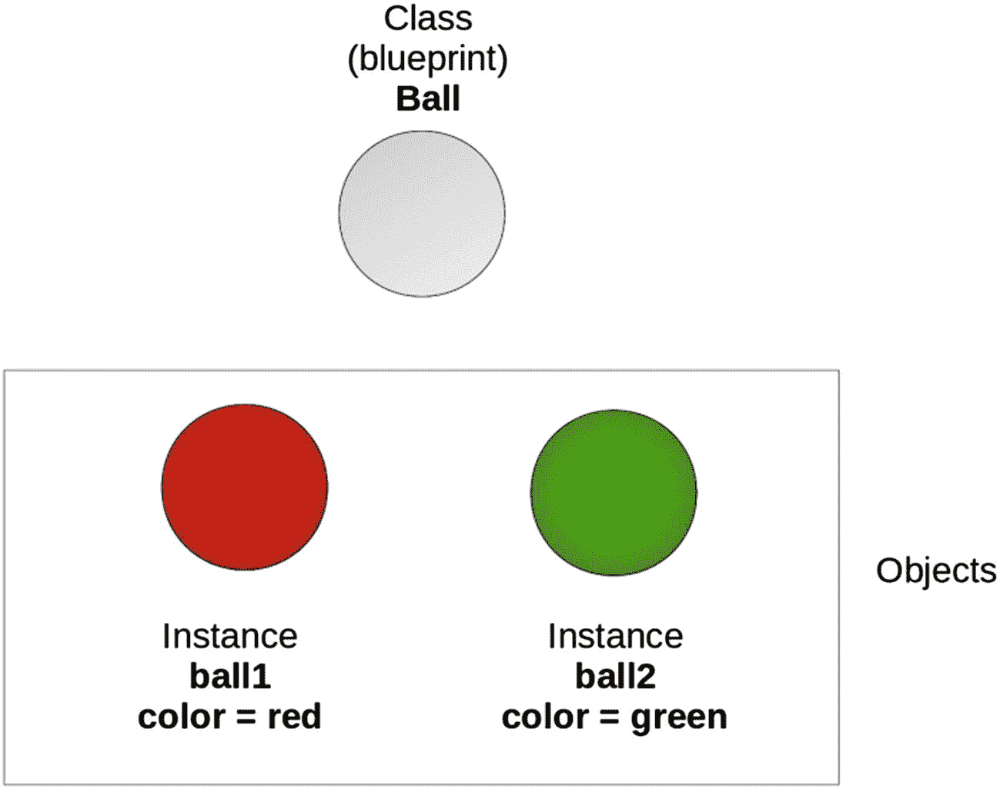
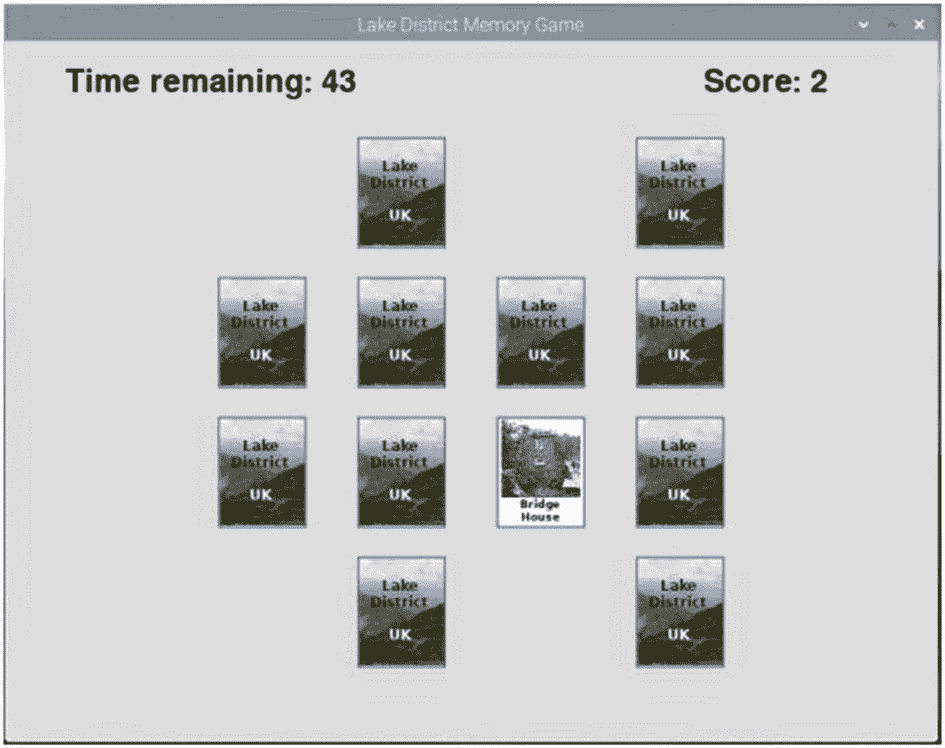

# 9.面向对象编程

到目前为止，这些程序主要使用过程式编程。过程编码风格是学习编程的好方法，但是使用面向对象编程也有好处，这将在接下来讨论。Python 的一个有用之处是它支持许多不同的编码风格，甚至允许在同一个代码中使用多种风格。在使用 Python 模块时，您已经使用了一些面向对象的代码，包括 Pygame Zero。

在解释了面向对象编程的主要概念之后，本章将开始一个新的游戏。这是基于经典游戏“配对”，有时被称为记忆游戏。在这个游戏中，桌子上有几张面朝下的牌。每张卡片都有一张配对的图片。你需要通过每回合翻两张牌来找到对子。如果你成功了，那么你就拿着这些牌，并得到一分。

## 什么是面向对象编程？

面向对象编程(OOP)是一种不同的编程风格，它基于数据和对数据的操作。在与 Pygame Zero 互动时，你已经在整本书中看到了这一点。参与者是一个对象的实例。一个参与者可以通过改变它的属性来操作，比如 pos(改变它在屏幕上的位置)，并且可以对它执行操作，比如 draw 方法(在屏幕上绘制它)。

面向对象编程中的四个主要概念是封装、数据抽象、多态和继承。这些被称为面向对象编程的四大支柱:

*   **封装**是关于保持内部状态私有以保护数据。Python 没有真正的封装，这通常是通过使用私有变量和方法来实现的。然而，Python 确实有在名称前使用 __(双下划线)的惯例，以防止意外使用私有变量或方法。

*   **数据抽象**是封装的扩展，它使得隐藏内部操作的细节变得更加容易。这有助于创建一个简单、更稳定的界面。

*   多态性允许一个孩子像他的父母一样行动。这是通过共享代码实现更好的代码重用的一种方式。它还可以根据输入参数提供不同的方法实现。

*   **继承**允许在相似的对象之间重用部分代码。

这本书将集中在面向对象编程提供的特定方面，这些方面使得游戏的设计和编程变得更加容易。它将展示如何使用封装和抽象来使游戏编程更简单、更容易编写和理解。它还将给出一个例子，说明继承如何通过利用现有代码来帮助减少需要编写的代码量。它还有助于减少全局变量的数量，这些变量会使代码在出错时难以理解和调试。

### OOP 类和对象

面向对象编程是基于对象的。在现实世界中，我们认为物体是物理的东西，如笔记本电脑、电话或书籍。在编程中，对象可以是任何存储数据或与你交互的东西。内置对象包括屏幕、演员或声音，您可以为任何东西创建自己的对象。对象将数据保存为对象的内部变量，可以通过对象属性读取和操作这些变量。大多数对象也有可以在对象上执行的操作(方法)。

### 创建类、属性和方法

要创建对象，需要有一个蓝图来告诉计算机如何处理对象。蓝图被称为类。每个对象都被称为该类的一个实例。通常一个类是在一个单独的文件中创建的，这个文件的名字和这个类一样，以. py 结尾。这个类的名字叫 Ball，它遵循了类名首字母大写的惯例。如果类中有多个单词，那么任何单词的首字母也要大写，比如 MyClass。文件名通常与类名相同，但都是小写的。在这个例子中，类名是 Ball，所以文件叫做 ball.py。您可以将它们放在现有文件中，或者放在包含多个类的文件中，但是通常每个类有一个文件是个好主意。

```py
class Ball():
    shape = "sphere"

    def __init__(self, position, radius, color):
        self.position = position
        self.radius = radius
        self.color = color

    def draw(self, screen):
          screen.draw.filled_circle(self.position, self.radius, self.color)

Listing 9-1Example of a OOP class

```

该文件以一个类定义开始，说明这是一个面向对象的类。这是创建球对象的蓝图。

列出的第一个变量称为`shape`，其值为“球体”。这是一个类变量。该变量只有一个实例跨越该类的所有实例。它最常用于不变的值，尽管在下一章，你会看到一个由多个对象编辑的类变量的例子。

更常见的是拥有实例变量，它们对于类的每个实例都是唯一的。实例变量在方法中创建，并以关键字`self`为前缀。以 self 为前缀创建的实例变量可用于该类中定义的所有方法。也可以在没有 self 关键字的情况下创建局部变量，它们的行为方式与过程式编程中的局部变量相同。

在这个类中有两种方法。方法与函数本质上是一样的，只是它们对对象执行操作，并且可以访问对象中的数据。它们是使用 def 关键字创建的，类似于函数的定义方式。

第一种方法叫做`__init__`。这称为构造函数，每当创建类的实例时都会调用它。有一种方法叫`draw`，会在屏幕上画球。你可以看到这两种方法都把`self`作为第一个参数。`self`关键字用于表示类的实例，并被方法用来访问类实例中的数据。调用方法时，不需要在参数上提供任何内容；相反，`self`被自动传递给方法，用于访问实例变量。

第一次创建对象时，运行构造函数方法(`__init__`)。它通常用于设置任何变量。在这种情况下，位置、大小和颜色需要三个值。方法中的参数总是作为局部变量保存，所以它们被复制到`self.position`、`self.radius`和`self.color`中。它们存储在对象中，可以根据需要通过任何其他方法读取和写入。没有必要将这些标记为全局的；通过 self 关键字，所有方法都可以自动使用它们。

下一个方法是`draw`，它在屏幕上把球画成一个实心圆。它可以访问先前通过构造函数设置的所有变量，即`self.position`、`self.radius`和`self.color`。这种方法有一个异常之处。以前在调用`screen.draw`操作时，它使用内置的屏幕对象。这在 Pygame Zero 使用的顶级函数中的 draw 函数内工作，但是当使用单独的对象时，需要将对 screen 对象的引用作为参数提供。

### 创建类(对象)的实例

创建类后，可以创建类的实例。这就像使用类作为蓝图来创建物理对象一样。如清单 [9-2](#PC2) 所示，它创建了一个可执行程序 balldemo.py。

```py
from ball import Ball

WIDTH = 800
HEIGHT = 600

ball1 = Ball((400,300),10,"red")

def draw():
    ball1.draw(screen)

Listing 9-2Creating instances of a class

```

这是一个基本程序，运行时会在屏幕中央显示球。第一行导入该类。它从文件 ball.py(与主程序文件在同一个目录中)中读取它，并从中导入类 ball。导入后，您可以使用该类。

创建了一个名为 ball1 的新对象，它是类的一个实例。为了创建实例，它使用类的名称，后跟构造函数中列出的参数。这将创建新的实例并运行 __init__ 方法。

在 draw 函数中，在绘制球的实例 ball1 上调用 draw 方法。内置屏幕需要传递给 ball1 的 draw 方法，以便它能够绘制到屏幕上。

这将创建球的一个实例，但是您可以使用

```py
ball2 = Ball((100,100),20,"green")

```

然后使用添加到 draw 方法中

```py
    ball2.draw(screen)

```

它在屏幕的左上角绘制了一个大的绿色球。

### 访问对象的属性

对象中的变量称为属性。正如您所看到的，类定义中的变量以 self 为前缀，这是指该类的实例。

如果您在类之外，那么您可以用实例名替换 self。对于实例 ball1，您可以使用

```py
ball1.color

```

如果您想检查这个值，那么您可以使用

```py
if ball1.color == "red":
...

```

或者如果你想改变这个值，那么你可以使用

```py
ball1.color = "orange"

```

这适用于在 __init__ 方法或任何其他方法中创建的所有变量，只要这些变量以 self 为前缀。

### 术语

面向对象编程的一个特点是它使用了所有的新术语。这里是对一些术语的回顾，以使其更加清晰。图 9-1 显示了类和实例之间的关系。



图 9-1

类到实例的关系

图顶部显示的类是创建对象的蓝图。它定义了如何创建类，它们有什么属性，以及可以对它们执行的操作。您通常不能直接使用该类，而是需要创建称为实例的特定对象。在本例中，我们创建了两个实例，称为 ball1 和 ball2。它们都是从同一个蓝图中创建的，所以将以相似的方式运行，但是它们有自己的属性集(存储为实例变量)。使用此球 1 颜色设置为红色，而球 2 颜色设置为绿色。

## 封装和数据抽象

如前所述，面向对象编程的两个好处是封装和数据抽象。这对程序员的好处是，它将类的内部结构与使用该结构的代码分离开来。当不同的程序员在同一个项目上工作时，这可以使它变得更容易，并且它可以使将来的更改变得更容易。

这可能有用的一个场景是当多人在同一个项目上工作时。如果程序员事先就类的接口达成一致，那么他们就可以独立工作。这超出了单个项目的影响；它还有助于创建可供他人使用的代码库。

另一种情况是您希望将来对代码进行更改。如果你想增加一个新的特性或者改进现有的代码，那么它会把这个类和其他类分开。如果保持接口不变，可以更改 ball 类中的任何内部代码，以完全不同的方式绘制球。

Python 不像其他一些编程语言那样严格地执行数据抽象。从类外部更改任何实例变量都是可能的，这会导致数据抽象的丢失。如果您想在类外隐藏一些变量，那么您可以通过在它们前面加上 __(两个下划线字符)来隐藏它们。即使使用这个，也不是完全的数据抽象。Python 对于面向对象的编程是有用的，但是依赖于程序员来创建稳定的接口和使用良好的编程最佳实践。

## 遗产

继承允许创建子类，该子类从父类继承它的一些属性和操作。这是避免代码重复的一种方式。这样做的好处是节省了程序员的输入，但更重要的是有助于减少 bug 的数量。

为了演示这一点，您可以想象一个飞行游戏，其中有一个飞机类来表示飞机。如果一个游戏有不同种类的位面，那么这些位面可以做不同的事情。图 9-2 显示了三种不同类型的飞机:客机、货机和战斗机。


图 9-2

使用父类和子类的继承

这些都是不同类型的飞机，所以会有一些共同点。其他事情可能只适用于某些类型的飞机。所有飞机都有许多引擎以及起飞和降落的能力，所以这些都可以在飞机(父)类中配置。还有一些其他的属性和操作是某些类型的球所独有的。例如，客机有许多乘客，但这对战斗机来说没有意义。战斗机可以装载和发射导弹，但是客机和货机都不需要这种能力。

继承的工作方式是在父类中定义公共属性和方法，然后将任何独特的特性添加到子类中。使用子类的代码可以使用从父类继承的或在子类中的操作。清单 [9-3](#PC8) 中的代码演示了子类如何引用其父类。

```py
from airplane import Airplane

class PassengerPlane(Airplane):

    def __init__(self):
        Airplane.__init__(self)
        self.number_passengers = 0

    def load_passengers (number_passengers):
        self.number_passengers = number_passengers

    def unload_passengers ():
        self.number_passengers = 0

Listing 9-3Inheritance demonstration showing a child class

```

这段代码继承自飞机类，添加了一个名为`number_passengers`的新属性和两个名为`load_passengers`和`unload_passengers`的新方法。可以使用以下方法创建客机的实例

```py
plane1 = PassengerPlane()

```

这将访问它自己的方法，例如

```py
plane1.load_passengers(20)

```

以及父方法，如

```py
plane1.take_off()

```

## 面向对象程序设计

当我第一次开始使用面向对象编程时，我发现的一个挑战是决定定义什么对象。在代表现实世界中的物体的情况下，这是显而易见的。在平面的例子中，很明显，它会被认为是一个物体，但不那么有形的东西呢？玩家的分数是一个对象，还是一个属性？如果是属性，那么分数属于什么对象呢？

在某些情况下，某个东西是否应该是一个对象并没有确定的答案。这取决于游戏的类型，它如何与其他对象交互，以及程序员的个人偏好。我将展示我所使用的技术，当你设计你自己的游戏时，这些技术可能会对你有所帮助。这不是强制性的，根据经验，您可能不需要这样做，但这是我在创建新程序时经常使用的一种技术。

这种技术有助于显示要创建什么类以及它们的属性和操作应该是什么。首先，用一两段文字写下这个游戏是做什么的，以及它将如何运作。你应该把它写下来(或者输入电脑),用完整的句子而不是要点来写。不要试图凭记忆做这件事，因为你需要看到下一步要用的单词。现在浏览你写的描述，找出所有的名词。将名词作为可能的类名写下来。接下来看看所有的形容词，然后适用于那些名词，并把它们写在相关的名词下面。这些将是属性(变量)。然后寻找主动动词以及它们与名词的关系。将这些列在它们相关的名词下；这些将成为操作(方法)。

这里有一个简短的总结:

*   名词(名称)-类别

*   形容词(描述性词语)-属性(变量)

*   主动动词(动作词)-操作(方法)

然后，这些单词为类、属性和操作提供了建议。请注意，这些只是建议；然后你应该运用你自己的判断来判断这些是否都是必要的。可能是一些条目彼此相似，或者是一些名词没有足够的意义来拥有它们自己的类别。然而，它确实给了你一个设计类结构的起点。当你开发游戏的时候，你总是可以重新审视这个结构。

## 配对记忆游戏

既然您已经熟悉了面向对象编程的一些方面，那么是时候在另一个游戏中将它付诸实践了。这是一个传统的基于卡片的记忆游戏的数字版本。该游戏通常使用图片卡进行，每张卡片是一对匹配的卡片中的一张。牌面朝下，玩家轮流翻开两张牌，试图找到匹配的牌对。游戏截图如图 [9-3](#Fig3) 。



图 9-3

配对记忆游戏截图

在传统游戏中，通常有两个或更多的人轮流试图赢得最多的分数，但在这个版本中，只有一个玩家将与时间赛跑。为了使用面向对象编程来创建它，我首先遵循前面解释的设计方法。我已经写下了这个游戏的如下解释。

这是一个记忆游戏。游戏从许多面朝下的牌开始。每张卡片上都有一张与另一张卡片相匹配的图片。玩家翻开两张牌，看它们是否匹配。如果它们匹配，那么玩家的分数增加。如果它们不匹配，那么卡被重置，玩家有另一次机会。有一个计时器随着时间倒计时，如果计时器值为零，那么游戏结束。如果玩家在一个级别上匹配所有对，那么玩家被奖励奖励点数，并且卡被再次分发。

然后我确定了标有()的名词，它们将成为类。形容词用[]；它们将成为属性。主动动词用{}标记；它们将成为操作。

*这是一个(记忆游戏)。游戏从一些[面朝下]的(牌)开始。每张(卡片)上都有一张与另一张卡片相匹配的[图片]。(玩家){翻}两张牌，看它们是否{匹配}。如果它们匹配，则玩家的(分数)会{增加}。如果它们不匹配，则卡被{重置}，玩家有另一次机会。有一个(计时器)随着时间倒计时，如果[计时器值]为零，那么游戏结束。如果玩家在 a(级别)上匹配所有对子，那么玩家将获得[奖励点数]并再次发牌。*

请记住，这些是指导方针，而不是固定的规则。你可以在识别合适的单词和短语时运用你自己的判断力，或者你可以在以后的某个阶段这样做。这只是让程序员更容易决定如何创建不同的类的一种方式。然后，我将它们制作成以下内容:

*   **记忆游戏**

*   属性:不适用

*   操作:复位；交易

*   **玩家**

*   属性:分数；奖励积分

*   操作:不适用

*   **卡**

*   属性:面朝下；画

*   操作:火柴(另一张牌)；重置

*   **小时**

*   属性:剩余时间

*   操作:倒计时；达到零

*   **级别**

*   属性:不适用

*   操作:不适用

这只能被认为是一个起点。您现在应该回顾一下，看看是否有您现在想要更改的内容。您可以在实现代码时重新审视这一点，因为它可能需要更改。

有些事情立即改变是有意义的。有一点是记忆游戏定义了整体游戏。我们可以创建它，而不需要将它定义为一个单独的类，这将允许它使用 Pygame Zero draw 和 update 函数；它还需要一个变量来跟踪游戏的状态。

另一个值得考虑的是，奖励点数不需要成为属性，而是可以添加到正常分数中；把加分作为一个操作而不是一个属性是有意义的。此外，级别可能不需要成为一个类，但可以合并到记忆游戏或玩家类中。

完成这个练习后，您应该对需要什么类以及一些属性和操作有所了解。在编写代码时，您可能会认为还需要其他的类、属性或操作。您可以在创建代码时添加任何附加的属性或操作。

提供的源代码中有两个版本的代码，一个是初始版本，另一个是更新版本。为了测试代码，你需要一些卡片图片。这本书的源代码包括一些我在英国湖区拍摄的照片。这些是用来制作卡片的，但是你也可以用你自己的照片或图片来个性化这个游戏。

### 创建类

创建代码没有固定的顺序。在创建主程序之前，我通常先创建一些类。这意味着我可以在编写主程序之前对这些类进行一些测试。这里解释了我创建的类。

#### 计时器类

第一个类是定时器类。timer 类用于跟踪已经过去了多长时间，以便游戏必须在分配的时间内完成。这是一个非常简单的类，但是对于演示如何创建这个类非常有用。代码如清单 [9-4](#PC12) 所示，保存在一个名为 timer.py 的文件中。

```py
import math
import time

class Timer():

    def __init__(self, start_count):
        self.start_count = start_count
        self.start_time = time.time()

    # start count down, with optional parameter to replace the start_count value
    # -1 is used as a "magic number", this method should only be called with positive number
    # if it isn't given a number then -1 indicates no new time give
    def start_count_down(self, new_time = -1):
        if (new_time >= 0):
            self.start_count = new_time
        self.start_time = time.time()

    def get_time_remaining(self):
        current_time = self.start_count + self.start_time - time.time()
        if (current_time <= 0):
            return 0
        return math.ceil(current_time)

Listing 9-4Timer class

```

该文件首先导入两个模块，数学和时间。顾名思义，这些提供了数学和时间函数。

类别由条目定义

```py
class Timer():

```

这为常规类创建了类定义。类名为 Timer。构造函数被定义为 __init__ 方法。它的第一个参数是 self，它总是包含在类构造函数中。然后，它接受一个参数，即 start_count 值。这是一个倒计时定时器，start_count 值是倒计时的秒数。

```py
def __init__(self, start_count):
        self.start_count = start_count
        self.start_time = time.time()

```

构造函数还创建了一个变量`self.start_time`,它被传递了从 epoch 开始的秒数。在 Linux 系统上，纪元是 00:00:00 1970-01-01 UTC(1970 年 1 月 1 日)。实际时间对于这个游戏来说并不重要，但是它可以作为一个参考点来衡量已经过去的时间。

`start_count_down`方法用于启动定时器。它包括通常的自我论证。然后它有一个参数`new_time = -1`。通过设置`new_time`在参数中有一个值，它使参数可选。如果一个参数被传递，那么它将被放入`new_time`变量中；如果没有传递参数，那么变量将取值-1。

```py
def start_count_down(self, new_time = -1):

```

如果`new_time`被改变，那么它被放入`self.new_time`变量中。然后，该方法通过在`self.start_time`变量中存储当前时间(以秒为单位)来重启计时器。

`get_time_remaining`方法返回计数器到达零之前剩余的秒数，或者如果已经超过了倒计时时间，则返回零。`math.ceil`功能用于将时间四舍五入到最接近的整秒。这使得倒计时总是显示一个完整的秒数，只有当整整一秒过去时才递减。

#### 卡片类别

下一个类是向玩家显示卡片的卡片类。这显示在清单 [9-5](#PC16) 中，应该保存为 card.py。这个类还演示了继承是如何扩展 Actor 类的。

```py
from pgzero.actor import Actor

# Card is based on an Actor (uses inheritance)
class Card(Actor):

    def __init__(self, name, back_image, card_image):
        Actor.__init__(self, back_image, (0,0))
        self.name = name
        self.back_image = back_image
        self.card_image = card_image
        # Status can be 'back' (turned over) 'front' (turned up) or 'hidden' (already used)
        self.status = 'back'

    # Override Actor.draw
    def draw(self):
        if (self.status == 'hidden'):
            return
        Actor.draw(self)

    def turn_over(self):
        if (self.status == 'back'):
            self.status = 'front'
            self.image = self.card_image
        elif (self.status == 'front'):
            self.status = 'back'
            self.image = self.back_image
        # Attempt to turn over a hidden card - ignore
        else:
            return

    def hide(self):
        self.status = 'hidden'

    # When unhide set it to back image
    def unhide (self):
        self.status = 'back'
        self.image = self.back_image

    def is_hidden (self):
        if self.status == 'hidden':
            return True
        return False

    # Is it turned to face forward
    def is_faceup (self):
        if self.status == 'front':
            return True
        return False

    def reset (self):
        self.unhide()

    def set_position(self, x, y):
        self.x = x
        self.y = y

    def equals (self, othercard):
        if self.name == othercard.name:
            return True
        return False

Listing 9-5Card class with inheritance

```

该文件的第一个条目是导入 pgzero.actor 中的 Actor 类。

```py
from pgzero.actor import Actor

```

这是 Pygame Zero 通常自动加载的，但是因为这是在一个单独的类文件中，所以需要显式导入。

然后，它定义了一个名为 Card 的新类:

```py
class Card(Actor):

```

括号中的单词“Actor”表示这将是 Actor 类的子类。

新类从父类导入方法，然后父类可以被覆盖。包含了覆盖构造函数方法的`__init__`方法。它包括对自我的引用和三个变量。name 变量是用于检查匹配对的标签；其他参数用于将图像文件名传递给 Card 类。

```py
     def __init__(self, name, back_image, card_image):
        Actor.__init__(self, back_image, (0,0))
        self.name = name
        self.back_image = back_image
        self.card_image = card_image
        self.status = 'back'

```

有一个名为 status 的变量，它将跟踪卡是面朝上(正面)还是面朝下(背面)，或者它是否已经被使用(隐藏)。

您还将看到，在该代码块中，`Actor.__init__`方法被调用。这与创建不属于子类的 Actor 的方法相同。在这种情况下，通过在父类的名称前加上前缀，直接调用父类的`__init__`方法。如果没有`__init__`方法，那么将调用父方法的`__init__`。

Card 类中的下一个方法是 draw 方法，它也覆盖了父类中的方法。这样做是为了仅在状态不等于隐藏时显示卡片。如果卡片没有隐藏，那么它通过调用`Actor.draw(self)`来调用父级的 draw 方法。

然后有一些方法在卡对象上执行操作。父类中不存在这些方法。它们是专门针对卡片的方法，在大多数情况下，对于不是卡片的其他参与者没有意义。

这张卡片有两幅不同的图像。该卡以显示`back_image`开始，但是当调用`turn_over`方法时，它变成了`card_image`。这是通过改变`self.image`属性来实现的，这是 Actor 类的一个特性。其他一些方法主要是获取和设置变量值。例如，`hide`和`unhide`方法用于改变隐藏变量的值，`is_hidden`方法返回隐藏变量的值。实际上并不需要这些方法，因为可以直接改变隐藏变量。无论是直接更新和读取变量，还是使用方法更新和读取变量，都各有利弊。Python 的口头禅通常是采用更简单的直接更新变量的选项，而对于其他一些编程语言，每当需要访问对象中的变量时，都鼓励使用 getter 和 setter 方法。

我通常更喜欢使用方法来访问变量。主要优点是它支持数据抽象的概念。假设在未来的某一天，您决定添加一个选项来部分隐藏一张卡片。比如你可能加了一个特性，一张牌只有上一轮没翻过才能翻；如果一张牌在上一轮中被使用过，那么它应该变灰以表示它不能被使用。为了实现这一点，您可以更改隐藏变量，使其不再是只能保存两种状态(真或假)的布尔值，而是使用一个数字来表示透明度的大小。如果您只使用方法来访问值，那么您可以将它作为一个新特性添加进来，而不会破坏库的使用方式。当您在不同的程序之间重用相同的代码时，这尤其有用。

equals 方法将当前卡片的名称与另一张卡片的名称进行比较。参数`othercard`将被传递给一个对象，从这个对象中它可以检查另一张卡的名称。

#### 游戏类

在这一点上，我决定不创建一个单独的球员类，因为它只会为分数保存一个变量。通常不值得为一个变量创建一个类。

最初，我将所有的分数和状态跟踪合并到主程序文件中。当我做程序文件时，它变得很长，很难理解它是如何工作的。这就是所谓的臭味。为了避免这种情况，我创建了一个名为 GamePlay 的新类。这就是所谓的代码重构，也就是代码被更新，但通常不会添加任何额外的功能。通常是重新组织和修改代码，使其更容易阅读，或者更有效。

Note

臭味是一个编程术语，表示糟糕的代码设计。这通常不是一个错误，但可能会减慢开发速度，使代码难以理解，或者增加将来出现错误的风险。

创建 GamePlay 类的另一个好处是，它将用户分数从主代码中分离出来，应该会使它更容易在后期制作成双人游戏。

游戏类如清单 [9-6](#PC20) 所示，并保存为 gameplay.py。

```py
# State is tracked as a number, but to make the code readable constants are used
STATE_NEW = 0               # Game ready to start, but not running
STATE_PLAYER1_START = 1    # Player 1 to turn over card
STATE_PLAYER1_CARDS_1 = 2  # Card 1 turned over
STATE_PLAYER1_CARDS_2 = 30 # Card 2 turned over
STATE_END = 50

# Number of seconds to display high score before allowing click to continue
TIME_DISPLAY_SCORE = 3

class GamePlay:

    def __init__ (self):
        # These are what we need to track
        self.score = 0
        self.state = STATE_NEW
        # These are the cards that have been turned up.
        self.cards_selected = [None, None]

    # If game has not yet started
    def is_new_game(self):
        if self.state == STATE_NEW:
            return True
        return False

    def is_game_over(self):
        if self.state == STATE_END:
            return True
        return False

    def set_game_over(self):
        # player gets to see high score
        self.state = STATE_END

    def is_game_running(self):
        if (self.state >= STATE_PLAYER1_START and self.state < STATE_END):
            return True
        return False

    def start_game(self):
        self.score = 0
        self.state = STATE_PLAYER1_START

    def set_new_game(self):
        self.state = STATE_NEW

    def is_pair_turned_over(self):
        if (self.state == STATE_PLAYER1_CARDS_2):
            return True
        return False

    # Return the index position of the specified card
    def get_card(self, card_number):
        return self.cards_selected[card_number]

    # Point scored, so add score and update state
    def score_point(self):
        self.score += 1
        self.state = STATE_PLAYER1_START

    # Not a pair - just update state
    def not_pair(self):
        self.state = STATE_PLAYER1_START

    # If a card is clicked then update the state accordingly
    def card_clicked(self, card_index):
        if (self.state == STATE_PLAYER1_START):
            self.cards_selected[0] = card_index
            self.state = STATE_PLAYER1_CARDS_1
        elif (self.state == STATE_PLAYER1_CARDS_1):
            self.cards_selected[1] = card_index
            self.state = STATE_PLAYER1_CARDS_2

Listing 9-6GamePlay class

```

GamePlay 类提供的主要功能是跟踪游戏状态和记录分数。该文件首先创建一些用于表示不同状态的常量。这些都不是必须的，但是`state == STATE_PLAYER1_START`比`state == 1`可读性更好。常量都是大写的，以表明它们是常量，不应该被更改，但就 Python 而言，这些只是变量。变量的值并不重要，只要它们总是被常量引用。

`__init__`方法用于创建分数和状态变量。下一个变量`cards_selected`是一个列表，它跟踪哪张牌被翻了出来。它以每个值作为`None`开始。None 是一种特殊的变量类型，表示没有设置任何值。需要这两个条目，以便可以将卡号存储在其中。

包含的方法主要是关于提供游戏的状态。例如，如果游戏即将开始，方法`is_new_game`将返回值 True 否则，它将返回 False。提供这些代码是因为与对照状态代码进行检查相比，这样更容易理解代码在做什么。

稍微复杂一点的方法是`card_clicked`方法。该方法查看当前状态以确定被点击的卡片是第一张还是第二张，并更新`cards_selected`中的相应条目。

### 程序文件

创建了类文件之后，程序文件就简单多了。它仍然很长，但比所有代码都在一个文件中要短。代码如清单 [9-7](#PC21) 所示。

```py
# Memory Card Game - PyGame Zero
import random

from card import Card
from timer import Timer
from gameplay import GamePlay

# These constants are used to simplify the game
# For more flexibility these could be replaced with configurable variables
# (eg. different number of cards for different difficulty levels)
NUM_CARDS_PER_ROW = 4
X_DISTANCE_BETWEEN_CARDS = 120
Y_DISTANCE_BETWEEN_CARDS = 120
CARD_START_X = 220
CARD_START_Y = 130
TIME_LIMIT = 60

TITLE = "Lake District Memory Game"
WIDTH = 800
HEIGHT = 600

cards_available = {
    'airafalls' : 'memorycard_airafalls',
    'ambleside' : 'memorycard_ambleside',
    'bridgehouse' : 'memorycard_bridgehouse',
    'derwentwater' : 'memorycard_derwentwater',
    'ravenglassrailway' : 'memorycard_ravenglassrailway',
    'ullswater' : 'memorycard_ullswater',
    'weatherstone' : 'memorycard_weatherstone',
    'windermere' : 'memorycard_windermere'
    }

card_back = "memorycard_back"

## Setup instance variables
count_down = Timer(TIME_LIMIT)
game_state = GamePlay()
all_cards = []
# Create individual card objects, two per image
for key in cards_available.keys():
    # Add to list of cards
    all_cards.append(Card(key, card_back, cards_available[key]))
    # Add again (to have 2 cards for each img)
    all_cards.append(Card(key, card_back, cards_available[key]))

## Functions are defined here - the rest of the initialization
## is at the bottom of the file

# Shuffle the cards and update their positions
# Do not draw as this is called before the screen is properly setup
def deal_cards():
    # Create a temporary list of card indexes that is then shuffled
    keys = []
    for i in range (len(all_cards)):
        keys.append(i)
    random.shuffle(keys)

    # Setup card positions
    xpos = CARD_START_X
    ypos = CARD_START_Y
    cards_on_row = 0
    for key in keys:
        # Reset (ie. unhide if hidden and display back)
        all_cards[key].reset()
        all_cards[key].set_position(xpos,ypos)
        xpos += X_DISTANCE_BETWEEN_CARDS

        cards_on_row += 1
        # If reached end of row - move to next
        if (cards_on_row >= NUM_CARDS_PER_ROW):
            cards_on_row = 0
            xpos = CARD_START_X
            ypos += Y_DISTANCE_BETWEEN_CARDS

def update():
    if (game_state.is_new_game()):
        pass
    elif (game_state.is_game_over()):
        pass
    else:
        if (count_down.get_time_remaining()<=0):
            game_state.set_game_over()

# Mouse clicked
def on_mouse_down(pos, button):
    # Only interested in the left button
    if (not button == mouse.LEFT):
        return
    # If new game then this click is to start the game
    if (game_state.is_new_game()):
        game_state.start_game()
        # start the timer
        count_down.start_count_down(TIME_LIMIT)
        deal_cards()
        return
    # If game over then this click is to get to new game screen
    if (game_state.is_game_over()):
        # Make sure the timer has reached zero (short delay to see state)
        if (count_down.get_time_remaining()<=0):
            game_state.set_new_game()
        return

    ## Reach here then we are in game play
    # First check for both already clicked and this is a click to test
    if (game_state.is_pair_turned_over()):
        if (all_cards[game_state.get_card(0)].equals(all_cards[game_state.get_card(1)])):
            # Add points and hide the cards
            game_state.score_point()
            all_cards[game_state.get_card(0)].hide()
            all_cards[game_state.get_card(1)].hide()
            # Check if we are at the end of this level (all cards done)
            if (end_level_reached()):
                deal_cards()
        # If not match then turn both around
        else:
            all_cards[game_state.get_card(0)].turn_over()
            all_cards[game_state.get_card(1)].turn_over()
            game_state.not_pair()
        return

    ## Otherwise we just turn over the next card if clicked
    for i in range (len(all_cards)):
        if (all_cards[i].collidepoint(pos)):
            # Ignore if card hidden, or has already been turned up
            if (all_cards[i].is_hidden() or all_cards[i].is_faceup()):
                return
            all_cards[i].turn_over()
            # Update state
            game_state.card_clicked(i)

# If reach end of level ?
def end_level_reached():
    for card in all_cards:
        if (not card.is_hidden()):
            return False
    return True

def draw():
    screen.fill((220, 220, 220))
    if (game_state.is_new_game()):
        screen.draw.text("Click mouse to start", fontsize=60, center=(WIDTH/2,HEIGHT/2), shadow=(1,1), color=(255,255,255), scolor="#202020")
    if (game_state.is_game_over()):
        screen.draw.text("Game Over\nScore: "+str(game_state.score), fontsize=60, center=(WIDTH/2,HEIGHT/2), shadow=(1,1), color=(255,255,255), scolor="#202020")
    if (game_state.is_game_running()):
        for card in all_cards:
            card.draw()
        screen.draw.text("Time remaining: "+str(count_down.get_time_remaining()), fontsize=40, bottomleft=(50,50), color=(0,0,0))
        screen.draw.text("Score: "+str(game_state.score), fontsize=40, bottomleft=(600,50), color=(0,0,0))

### End of functions - start of initialization code
deal_cards()

Listing 9-7Memory game main program file

```

与其他文件不同，主程序文件不是作为单独的类创建的。这不同于其他一些要求一切都面向对象的编程语言。在 Python 的情况下，这是可选的，而在 Pygame Zero 的情况下，在程序的主要部分不使用单独的类更容易。相反，程序使用 Pygame Zero 挂钩，比如`draw`和`update`函数。

为了理解这个程序，看一下整个文件是很有用的。导入和变量，以及类实例的初始化都是在文件的顶部定义的。函数在中间，在程序初始化过程中运行的附加代码在这一行之后的底部

```py
### End of functions - start of initialization code

```

该程序首先导入随机模块，然后导入之前创建的三个类:卡片、计时器和游戏性。定义了几个常量，用于纸牌的间距和游戏设置，如计时器的持续时间。还有一个卡片背面图像文件名的变量，以及一个不同卡片图像文件名的字典。这些设置通常存储在单独的配置文件中，但是为了简单起见，它们被包含在 memory.py 文件中。然后创建一个名为`all_cards`的空列表，它将保存 Card 类的实例。

接下来处理类的实例的创建。`Timer`和`GamePlay`类只需要一个普通赋值创建的实例。

```py
count_down = Timer(TIME_LIMIT)
game_state = GamePlay()

```

对于 Cards 类，每个将要显示的卡片都需要有一个实例。一个 for 循环用于创建这些并将它们添加到`all_cards`列表中。这是卡片对象的列表。为每张卡创建两个实例，以便在列表中有匹配对。

```py
all_cards = []
# Create individual card objects, two per image
for key in cards_available.keys():
    # Add to list of cards
    all_cards.append(Card(key, card_back, cards_available[key]))
    # Add again (to have 2 cards for each img)
    all_cards.append(Card(key, card_back, cards_available[key]))

```

这些函数列在后面，后面是对文件底部的`deal_cards`的调用。这需要放在定义了`deal_cards`函数之后；否则，会导致错误。把它放在最后可以让代码更容易理解。

`deal_cards`函数的工作原理是从卡片中创建一个所有钥匙的列表。然后它调用`random.shuffle`函数，这个函数将卡片混合成一个随机的顺序。然后，它根据卡片之间的间距，用它们的坐标更新每张卡片。可以通过使用列表中的索引来访问这些卡，如以下示例条目所示:

```py
all_cards[key].set_position(xpos,ypos)

```

接下来是更新功能。它首先检查游戏是新的还是已完成的。如果是这种情况，它不做任何由关键字`pass`指示的事情。使用 pass 没有任何作用，但是如果您计划在将来添加额外的代码，它可以作为一个占位符。如果游戏正在进行中，那么它调用计时器上的`get_time_remaining`方法，并在游戏结束时改变游戏状态。

```py
if (count_down.get_time_remaining()<=0):
            game_state.set_game_over()

```

更新游戏的大部分代码是由鼠标动作驱动的，所以是在`on_mouse_down`而不是`update`函数中。on_mouse_down 函数根据用户是否在玩游戏而被不同地处理。如果游戏没有在进行中，那么点击改变游戏的状态，例如开始游戏。如果游戏正在进行中，那么它将首先测试两张已经翻过的牌。如果是，那么它测试两张卡片是否匹配，或者隐藏卡片(如果匹配)或者将卡片重新设置为面朝下。如果两张卡都还没有翻过来，那么它使用`collidepoint`方法检查一张卡是否已经被点击，如果是，就翻过来并更新游戏状态。还有一个针对`end_level_reached`功能的检查，该功能检查是否所有的牌都已被翻过，如果是，则洗牌以备玩家重新开始。

draw 函数将一些消息放在屏幕上，如果合适的话，调用 draw 方法在屏幕上显示每张卡片。

您可能已经注意到，在任何函数中都没有更新的全局变量。类实例的行为确实像全局变量，但是因为它们是使用类的方法更新的，这意味着与直接更新全局变量相比，它不太可能产生难以理解的错误。

这就完成了游戏。这项运动还有很大的改进空间。您可以通过提供不同的卡图案来改善游戏的外观，或者通过改变卡的数量或玩游戏的时间长度来改变难度。你也可以把游戏改成双人游戏，或者让玩家和电脑比赛，而不是和时间赛跑。使用面向对象技术可能比使用过程化编码风格更容易。

## 摘要

面向对象编程是过程编程的一种替代方法，它将数据和处理数据的方法紧密地联系在一起。这对于代码重用和随着代码量的增加帮助组织程序结构特别有用。本章解释了面向对象编程的一些关键概念，以及如何在 Python 中实现它们。它包括一个游戏，演示了如何实现这些概念。

下一章将着眼于在游戏中加入人工智能来创造一个基于计算机的竞争者。