# 2.微型通话模块:XBee 无线模块简介

传感器网络的应用通常排除了有线传感器的使用。虽然可以使用安装在支持电缆设备的受控环境中的有线传感器，但你很少有这种奢侈。有时，您可以将传感器网络的某些部分连接到有线网络，但传感器位于无法使用有线网络的区域。因此，大多数传感器网络需要使用无线技术将数据从传感器传输到网络中的其他节点。

无线通信有多种形式。这本书使用了最简单的一个:Digi 的 XBee 无线模块。在本章中，您将探索使用 XBee 模块的基础知识，从选择模块到将其配置为与微控制器一起使用，最后创建一个简单的网络。

## 什么是 XBee？

XBee 是一个独立的、模块化的、经济高效的组件，它使用射频(RF)在 XBee 模块之间交换数据。XBee 模块在 2.4 GHz 或远程 900 MHz 上传输，并有自己的网络协议。

XBee 模块本身非常小，大约只有一个大邮票的大小，这使得它很容易集成到传感器节点这样的小项目中。这些模块也是低功耗的，并且可以使用特殊的睡眠模式来进一步降低功耗。

虽然 XBee 不是一个微控制器，但它的处理能力有限，可以用来控制模块。其中一个功能，睡眠模式，可以帮助延长电池供电(或太阳能供电)传感器节点的电池寿命。您还可以指示 XBee 模块监控其数据引脚，并将读取的数据传输到另一个 XBee 模块。啊哈！因此，您可以使用 XBee 模块将传感器节点链接到数据聚合器节点。

虽然 XBee 可以用来读取传感器数据，但其有限的处理能力可能意味着它并不适合所有的传感器节点。例如，需要算法来解释或推断有意义的数据的传感器可能不适合单独使用 XBee。您可能需要使用微控制器或计算机来执行额外的计算。

更好的是，最新型号的 XBee(版本 3)可以使用 MicroPython 在芯片上编程。您甚至可以与该模块交互(对话)并交互式地执行您的 MicroPython 代码(就像您在 PC 上使用 Python 一样)。我们将在本章的后面看到更多关于这个令人兴奋的新特性的内容。

Note

要配置 XBee 模块，您必须使用 Digi 配置工具 XCTU，它(现在)可以在 Windows、macOS 和 Linux 上使用。旧版本仅限于 Windows。

下面几节探讨如何开始使用 XBee 模块，从如何选择 XBee 模块开始。我鼓励你在着手这个项目之前通读这一章。我在章节总结之前列出了完成本章项目所需的材料。

## XBee 第一个

本节描述了可用的 XBee 模块的类型，如何为您的项目选择模块，以及如何配置它们。我让这一节保持简短，同时提供了足够的信息来解释您将使用什么 XBee 模块以及为什么使用。

但是有一件事让 XBee 世界的大多数新手感到困惑:如何配置模块。所以，让我们先澄清一下。XBee 模块有许多控制和设置，允许您为您的项目配置它。有两种方法可以更改这些设置:(1)使用 Digi 提供的 XCTU 桌面应用程序，以及(2)使用带有 XBee USB explorer 板的终端应用程序来手动更改设置。这是在一个特定的模式下(称为 AT 模式)使用一组命令(称为 AT 命令)来完成的。

您将了解不同的连接方法以及两种操作模式。您还将看到配置 XBee 模块的两种方法的演示。现在，让我们从选择 XBee 模块开始，深入我们的 XBee 教程。

### 选择 XBee 模块

如果你访问 Digi XBee 网站( [`www.digi.com/products/embedded-systems/digi-xbee/rf-modules`](http://www.digi.com/products/embedded-systems/digi-xbee/rf-modules) ，你会看到一个最新模块的列表可供选择。有支持专有(Digi)协议、WiFi (UART 或 SPI 到 802.11 b/g/n)、ZigBee <sup>[1](#Fn1)</sup> 和 802.15.4 协议的模块。那你怎么知道选哪个呢？

一些最流行的 XBee 模块支持 ZigBee 协议。你将在本书的项目中使用这些模块。如果您单击 ZigBee 模块的链接( [`www.digi.com/products/embedded-systems/digi-xbee/rf-modules/2-4-ghz-modules/xbee3-zigbee-3`](http://www.digi.com/products/embedded-systems/digi-xbee/rf-modules/2-4-ghz-modules/xbee3-zigbee-3) ，您会发现有三种外形规格可供选择，以满足您的硬件要求，并且这些模块支持多种协议，包括 ZigBee 功能集、Digi Mesh、蓝牙低能耗(BLE)和 802.15.4 <sup>[2](#Fn2)</sup> 协议。本书使用支持 ZigBee Pro 特性集的模块。

有许多 XBee 模块提供三种外形规格中的一种，包括通孔和两种表面贴装选项。如果您点击`Part Numbers & Accessories`链接，您将看到一长串按外形分组的模块。图 [2-1](#Fig1) 显示了左侧通孔格式的两种可用格式。两者在大多数零售商处都有售。

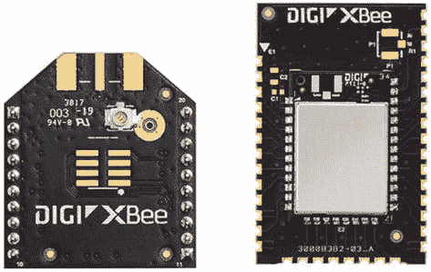

图 2-1

XBee 3 外形规格

Ok, What’s a Zigbee?

ZigBee 是基于 IEEE 802.15.4 标准的网络通信开放标准。该协议支持网状网络的形成，该网状网络可以自动配置(通过协调器和路由器角色)，修复断开的链路，并允许使用中间节点在更长的范围内传输数据(数据通过网格从一个节点传递到另一个节点)。尽管名字如此，ZigBee 并不归 Digi 所有，也不局限于类似命名的 XBee 模块。

对于这本书，我们将使用通孔格式。Digi 提供这些选项以允许更大的设计自由度，因此 XBee 模块可以用于几乎任何需要低成本无线选项的应用。

此外，您会注意到每种外形都有两个版本:标准型号和专业型号。两种型号具有相同的引脚排列，您可以在同一网络中混合搭配使用。pro 型号可能稍大(更长)，耗电更多，成本稍高，但提供的范围比标准(也称为“常规模块”)模块更大。但是，如果不将 XBee 3 pro 和常规模块连接到电脑，您可能无法区分它们。例如，PCB 选项 XBee 3 pro 和常规模块看起来完全相同，但在电路板顶部用黑色墨水印刷有细微的差异。常规模块(我正在使用的批次)标有“109 202”，而专业模块标有“941 201”如果您使用 XBee 3 模块，您可能想要在 pro 模块上做一个小标记，以便于识别。

虽然你不会在 Digi 网站上找到它们，但 XBee-ZB 模块有几个迭代(称为系列或版本)。系列 1 模块使用支持点对点通信的旧芯片组。<sup>[3](#Fn3)</sup>2 系列和 2.5 系列拥有更新的芯片组，支持多种通信形式，包括网状网络。Series 3 拥有最新的芯片组和片上 MicroPython，可实现更快、更轻松的开发。在本书中，您将使用系列 2 和系列 3 模块。

Which Series Should I Use?

有这么多系列的 XBee 模块可用，您可能想知道应该选择使用哪个。答案取决于你想如何使用它们以及你自己的经验水平。对于一些人来说，使用系列 2 和 2.5 将满足他们的所有需求。对于其他人来说，series 3 的易用性可能更适合。

另一个方面可能是模块的成本。随着系列 3 模块的发布，旧系列模块可能会更便宜。

那么，你应该使用哪一个呢？如果你已经有了一些模块，那也没关系，因为 series 3 是向后兼容 series 2 模块的。因此，您可以使用现有的模块，并在需要时添加新的系列 3 模块。如果您没有任何模块，使用系列 3 可能是让您的传感器网络运行的最简单的途径。

但是你还没有完成。你还必须选择你想要使用的天线类型。普通或专业模块有三种天线可供选择。 <sup>[4](#Fn4)</sup> 图 [2-2](#Fig2) 描绘了 XBee-ZB 模块可用的每种类型。下面的列表更详细地描述了每一项:

*   *U.FL* :该选项有一个非常小的连接器，需要一根适配器电缆(称为尾纤)来连接外部天线。这些天线的优点是 XBee 模块可以封装在外壳(甚至是金属)中，并且天线安装在外壳的外部。这些模块往往要多花几美元，并且需要购买尾纤和天线。

*   *RPSMA* :和 U.FL 选项一样，这款提供了外置天线；但是它使用更大的 RPSMA 连接器。您可以将旋转天线直接安装到连接器上，但天线承受压力的风险太大。因此，您应该使用延长线并将天线安装在外部。像 U.FL 选项一样，这些模块的成本稍高，并且需要购买天线。

*   *PCB*: The antenna is printed or embedded as a wire trace onto the module itself. This type of module is similar to the chip antenna and may be a bit less expensive to manufacture. Currently, only the PRO modules are available with this antenna option.

    

    图 2-2

    XBee 模块天线选项(SparkFun 提供)

Where’s The Whip?

如果你在过去遇到过 XBee 模块，你可能会熟悉一个天线选项，其中一根小电线安装在模块上，称为“鞭”或线天线。这些在系列 2.5 和更早版本中可用。它们稍微便宜一点，并提供全方位信号，使它们在某些应用中更容易使用。如果你能找到这些模块，你也许能在你的项目上节省几美元。

然而，线状天线不耐用，如果弯曲得太频繁，很容易损坏。幸运的是，你可以用一些相同规格和长度的绞合线焊接一个替换天线。通过剥离一点绝缘材料将旧天线焊接回原位是另一种选择，但这确实会稍微改变它的辐射特性。

现在你知道有许多类型的 XBee 模块，并且这本书的项目仅限于 XBee-ZB 系列 2 和 3 模块，让我们讨论如何与模块通信。

### 与 XBee-ZB 模块交互

当您检查 XBee 模块时，首先注意到的是引脚布局比设计用于试验板的典型分立元件小得多。此外，您不能将电脑直接连接到 XBee。您需要一个 USB 适配器来安装 XBee，以便与模块进行通信。幸运的是，有几种变体可供选择。您使用 USB 适配器来配置模块。

您可以使用 USB 加密狗，如 spark fun Electronics([`www.sparkfun.com/products/11697`](http://www.sparkfun.com/products/11697))的 XBee Explorer 加密狗。此选项允许您将 XBee 模块安装在 PCB 上的接头(两排十针连接器)中，并将整个装置插入 USB 端口。由于它只比 XBee 模块本身大一点点，并且不需要电缆，所以它可能是在远程位置使用 XBee 的最佳选择。

图 [2-3](#Fig3) 显示了不带 XBee 模块的 XBee Explorer 加密狗。它接受系列 1、2、2.5 和 3 标准或专业型号。

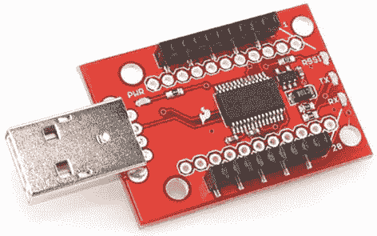

图 2-3

XBee Explorer 加密狗(SparkFun 提供)

注意 PCB 右侧 XBee 模块的白色轮廓。这表示模块在电路板上的正确方向。在将其插入 USB 端口之前，请务必检查针脚是否对齐。

一个类似的选项是 XBee Explorer USB，也来自 SparkFun ( [`www.sparkfun.com/products/11812`](http://www.sparkfun.com/products/11812) )。它不是一个加密狗，而是一个带迷你 USB 连接器的独立 PCB 基座单元。它还支持系列 1、2、2.5 和 3 标准或专业模块。它需要一根 USB 转迷你 USB 线。图 [2-4](#Fig4) 显示 XBee Explorer USB 设备。


图 2-4

XBee Explorer USB(由 SparkFun 提供)

SparkFun 的两个选项都包括可以与试验板一起使用的接头安装孔，让您可以接触到 XBee 模块的所有引脚。虽然它们不带有焊接到位的引脚，但如果您愿意，也可以轻松添加引脚。在后面的章节中你会看到这将会有所帮助。

SparkFun 还搭载了其他几个 XBee Explorer 板，包括一个可调节的分线板( [`www.sparkfun.com/products/11373`](http://www.sparkfun.com/products/11373) )和一个 Arduino 盾( [`www.sparkfun.com/products/12847`](http://www.sparkfun.com/products/12847) )。如果你打算用 Arduino 来托管 XBee，SparkFun 盾是必须的。图 [2-5](#Fig5) 为火花防护罩。

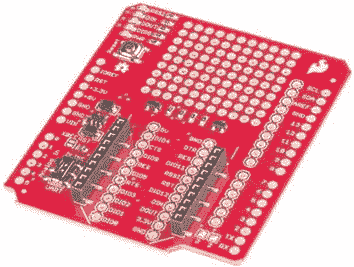

图 2-5

XBee Arduino shield(spark fun 提供)

在他们的“SparkFun Thing”系列主板中也有几款支持 XBee 模块的主板，如 SparkFun Thing Plus ( [`www.sparkfun.com/products/15454`](http://www.sparkfun.com/products/15454) )。

What is a Shield?

屏蔽是一种 PCB，通过连接到 Arduino 上的接头，安装在 Arduino 的顶部。屏蔽用于扩展 Arduino 的硬件功能。有用于控制 LCD、以太网、XBees 等等的屏蔽。

Digi 还生产 XBee 3 开发套件，其中包含三个带天线的 XBee 标准表面贴装模块和三个 USB 接口板。它还包括所有你需要开始使用的线缆，包括一个方便的储物盒。虽然价格相当吓人(建议零售价 110.95 美元)，但它确实为那些寻求最大实用性和无组装(除了将模块插入接口板之外)的人提供了一站式购买选择。图 [2-6](#Fig6) 展示了 SparkFun ( [`www.sparkfun.com/products/15216`](http://www.sparkfun.com/products/15216) )出售的 Digi ZigBee 开发套件。


图 2-6

Digi ZigBee 开发套件

该套件的一个很好的特性是 explorer 板支持即插即用的 Grove 接口(也称为 Grove 系统)，这使得将模块连接到支持 Grove 的传感器就像将它们插在一起一样简单。有关 Grove 接口的更多信息，请参见 [`http://wiki.seeedstudio.com/Grove_System/`](http://wiki.seeedstudio.com/Grove_System/) 。

虽然许多供应商提供了其他选项，包括旧的串行接口模块，但这些是我发现的使用 XBee 模块的最佳和最容易使用的选项。当您看到我们将 XBee 模块与 Arduino 一起使用时，您会看到一个 XBee 屏蔽示例，它支持 XBee 与 Arduino 引脚的直接连接。

### 引脚布局

如果您查看 XBee 模块，您会看到总共有 20 个引脚。如果从顶部(带天线的一侧)查看模块，从左上角开始，引脚标记为 1–10，从右下角开始，标记为 11–20。因此，插针 1 在左上角，插针 20 在右上角。但是所有这些东西都有什么作用呢？

你将在后面的章节中更详细地探索这些引脚，但是现在(如果你好奇的话)，表 [2-1](#Tab1) 描述了典型 XBee 模块的引脚布局。在本例中，我展示的是 XBee-ZB 系列 2 模块的引脚布局。系列 3 模块在引脚上有一个区别；3 系列模块不支持针脚 14，因此不应与这些模块一起使用。

表 2-1

XBee 引脚布局

<colgroup><col class="tcol1 align-left"> <col class="tcol2 align-left"> <col class="tcol3 align-left"> <col class="tcol4 align-left"> <col class="tcol5 align-left"></colgroup> 
| 

别针

 | 

名字

 | 

描述

 | 

方向

 | 

默认

 |
| --- | --- | --- | --- | --- |
| one | VCC | 电源 | 不适用的 | 不适用的 |
| Two | 熄 | UART 数据输出 | 在外 | 在外 |
| three | DIN/CONFIG | UART 数据输入 | 在…里 | 在…里 |
| four | DIO12 | 数字输入/输出 12 | 两者 | 有缺陷的 |
| five | 重置 | 模块复位 | 两者 | 带上拉电阻的集电极开路 |
| six | RSSI PWM/二极管 10 | RX 信号强度，数字 I/O 10 | 两者 | 在外 |
| seven | DIO11 | 数字输入/输出 11 | 两者 | 在…里 |
| eight | 内向的; 寡言少语的; 矜持的 | 不连接 | 钠 | 有缺陷的 |
| nine | DTR/sleep _ rq/神 08 | 睡眠控制，数字 I/O 8 | 两者 | 在…里 |
| Ten | 地线 | 地面 | 不适用的 | 不适用的 |
| Eleven | DIO4 | 数字输入/输出 4 | 两者 | 有缺陷的 |
| Twelve | CTS/DIO7 | 允许发送，数字 I/O 7 | 两者 | 在外 |
| Thirteen | 开启/睡眠 | 状态，数字输入/输出 9 | 在外 | 在外 |
| Fourteen | 参考电压（VoltageReference） | 不连接 | 在…里 | 不适用的 |
| Fifteen | 助理/DIO5 | 相关指示器，数字输入/输出 5 | 两者 | 在外 |
| Sixteen | RTS/DIO6 | 请求发送，数字输入/输出 6 | 两者 | 在…里 |
| Seventeen | a3/上帝 3 | 模拟输入/输出 3，数字输入/输出 3 | 两者 | 有缺陷的 |
| Eighteen | a2/神 2 | 模拟输入/输出 2，数字输入/输出 2 | 两者 | 有缺陷的 |
| Nineteen | a1/神 1 | 模拟 I/O 1、数字 I/O 1 | 两者 | 有缺陷的 |
| Twenty | ado/神 0 | 模拟输入输出 0，数字输入输出 0 | 两者 | 有缺陷的 |

要了解 XBee 3 模块硬件的更多信息，请参见 Digi at [`www.digi.com/resources/documentation/digidocs/pdfs/90001543.pdf`](http://www.digi.com/resources/documentation/digidocs/pdfs/90001543.pdf) 的硬件参考文档。

在下一节中，您将看到如何开始配置在您的项目中使用的模块。

### 配置模块

配置 XBee 模块并不十分困难。因为您使用的是 ZigBee 模块，所以需要为每个模块设置地址，选择要在网络中执行的角色，并将您的模块配置为与您用来处理传感器数据的任何传感器或微控制器接口。让我们从讨论 ZigBee 寻址开始。

Can Sensors Be Connected Directly To The XBee?

XBee 模块可以通过其 I/O 端口读取传感器数据。然而，并非所有传感器都可以直接连接到 XBee 模块。如果传感器需要使用特殊通信协议的直接 I/O，您需要一个微控制器来读取传感器数据，然后将其发送到 XBee 进行传输。在下一章中，当您探索如何使用 DHT-22 温度传感器时，您将会看到这一点。

#### 地址

XBee 模块标有特定的序列号或地址，位于模块底部。这有点不方便，因为当模块安装好后，你通常看不到它的背面。不过，您可以使用 Digi 配置应用程序或简单的串行终端应用程序来查找地址。

图 [2-7](#Fig7) 显示了 XBee 3 模块的底面(放大以便更好地观察)。请注意型号下面打印的数字。您一起使用它们来形成一个对每个 XBee 模块唯一的 64 位地址。许多出版物称之为无线电地址，分为两部分:高位和低位地址(或值)。例如，图中所示的地址，`0013A200,`是“高”地址，`4192DA30`是“低”地址。在接下来的例子中，我们将需要这些。


图 2-7

XBee 地址印在模块背面

Tip

经常看到 XBee 被称为模块或收音机。这些术语经常互换。当提到无线电本身的发射和接收能力时，我一般用模块和无线电来指代 XBee。

电台的地址用于确定要发送的消息的目标。在许多方面，它类似于 IP 地址，但在这种情况下，它是一个特定的无线电地址。

除了特定的 64 位无线电地址之外，ZigBee 网络在每个网络内使用分配给每个无线电的 16 位地址。此外，您可以指定一个简短的文本字符串来标识每个收音机。除此之外，还有一个个人区域网络(PAN)地址，可用于对网络中的无线电进行逻辑分组。最后，所有无线电必须在相同的信道(频率)上发射和接收。概括地说，当 XBee 无线电想要向另一个无线电发送消息时，它必须使用相同的频道，并设置目的地 PAN 和特定的 16 位无线电地址。在接下来的章节中，您将看到这些选项的作用。

#### ZigBee 网络

像以太网一样，ZigBee 网络基于预定义的网络堆栈，其中堆栈中的每一层负责数据消息的特定转换。与其他网络一样，ZigBee 网络支持消息路由、自组织网络创建和自愈网状拓扑。因此，需要无线电地址和 PAN 地址来支持这些特征。

通过增加每个节点(无线电)可以在网络中执行的不同角色，对网状拓扑的支持成为可能。以下列表从最复杂的角色开始，更详细地描述了每个角色:

*   *协调器*:每个网络需要一个协调器。该节点负责管理地址，形成和管理网络。所有其他节点在启动时搜索协调器并交换握手信息。

*   *路由器*:被配置为路由器的节点被设计为将信息传递(路由)到其他无线电。路由器通过加入网络和交换来自其他节点的消息来实现网状网络的修复。路由器通常由可靠的电源供电，因为它们必须是可靠的。因此，数据聚合节点将是路由器无线电模式的一个好选择。

*   *终端设备*:终端设备是向路由器节点和协调器发送或接收信息的节点。它的一个优点是正在进行的处理更少，因此功耗更低。终端设备支持睡眠模式，以进一步降低功耗要求。大多数传感器节点将被配置为终端设备。

只要网络中至少有一个协调器，就可以用任何方式配置 XBee 模块。要形成网状网络，只需使用几个路由器，其中一个或多个终端设备交换消息，路由器与协调器交换消息。图 [2-8](#Fig8) 显示了一个典型的网状网络。

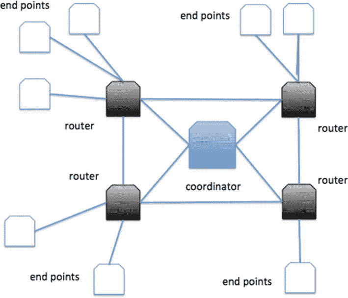

图 2-8

ZigBee 网状网络

配置 XBee 模块有时会出错。发生这种情况时，诊断和纠正该问题会非常困难。我在这一章的结尾包括了一个故障排除部分，它将帮助你解决许多常见的问题。如果您遇到问题，请查看故障排除部分。

#### 更新固件

开始配置 XBee 模块时，您应该做的第一件事是加载最新版本的固件并设置角色。在这种情况下，固件是指 XBee 的嵌入式微控制器的程序。如果您的系列 2 或 2.5 模块使用的是旧版本，或者您想尝试不同的配置，您只需更改固件。同样，如果您想将系列 3 模块与旧模块一起使用，您必须在系列 3 模块上加载不同的固件。例如，如果您想通过 802.15.14 协议同时使用系列 2 和系列 3，您应该在每个模块上安装相同的固件。

Digi 通过提供一个名为 XCTU 的优秀配置应用程序使这变得简单。只能使用 XCTU 应用程序加载固件。图 [2-9](#Fig9) 显示 XCTU 在没有连接任何模块的情况下运行。

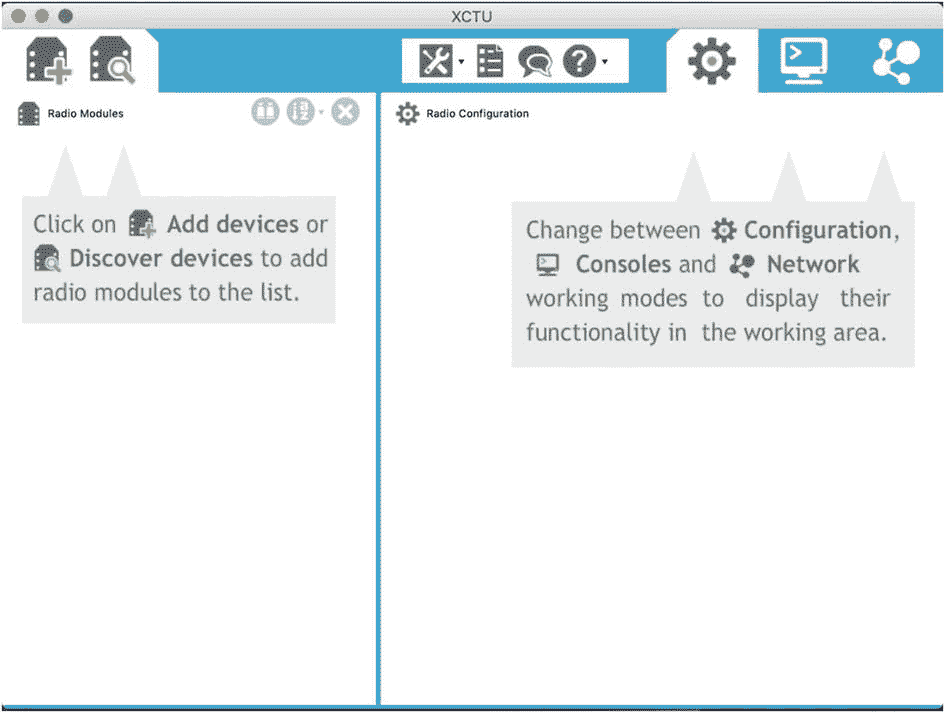

图 2-9

XCTU 主窗口

正如你所看到的，XCTU 软件会给你友好的提醒和如何做事的提示。在下面的段落中，我们将看到如何联系和配置模块。您可以从以下 URL 下载最新版本的 XCTU 软件:

```py
www.digi.com/products/embedded-systems/digi-xbee/digi-xbee-tools/xctu#productsupport-utilities

```

您将找到大多数平台的安装程序，包括 macOS、Windows 和 Linux，以及发行说明和许可文档的链接。只需下载适合您平台的安装程序，并使用该平台通用的方法进行安装。例如，在 Windows 上，您将运行并执行安装程序，而在 macOS 上，您必须首先从压缩文件中提取安装程序，然后执行安装程序。

一旦安装了软件并且启动了 XCTU 软件，就需要连接到 XBee 模块。要连接到 XBee，只需将 XBee 模块插入适配器，并将其连接到您的电脑。例如，如果您使用 SparkFun Explorer USB 加密狗，您只需首先将 XBee 模块插入加密狗。将加密狗插入 USB 插槽后，您应该会看到电源指示灯亮起。

一旦浏览器连接到您的计算机，您可以使用窗口左上角的任一按钮添加模块，如图 [2-10](#Fig10) 所示。左边的一个允许您通过指定模块的串行连接参数来添加模块，右边的一个扫描模块的所有串行连接。让我们使用*添加模块*按钮。

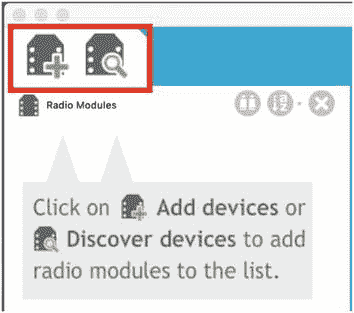

图 2-10

添加和扫描模块按钮

准备就绪后，点击*添加无线电*按钮。您应该看到一个对话框打开，允许您选择串行连接并设置连接参数。默认串行连接参数为 9600 波特、无流量控制、8 位、无奇偶校验、1 个停止位(也可写成 96008N1)。如果您发现您的 XBee 无法通信，那么它可能是以不同的波特率运行的。如果您更改波特率，您应该更改所有模块的波特率。图 [2-11](#Fig11) 显示添加模块对话框。如果您选择使用发现选项，则可以选择多个串行配置进行搜索。

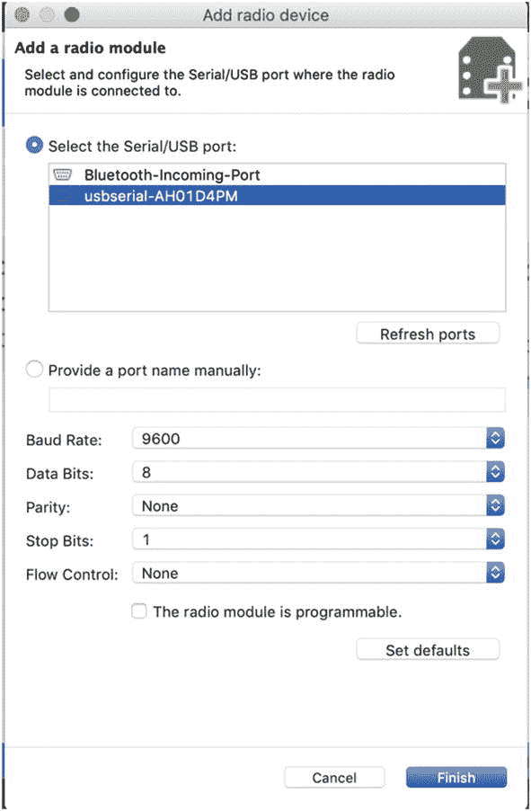

图 2-11

添加模块对话框

只需选择串行连接，验证连接参数，然后单击 Finish。XCTU 需要几秒钟来建立连接，一旦建立连接，您将会看到模块出现在主窗口的左栏，如图 [2-12](#Fig12) 所示。较新的系列 3 模块将以黑色背景出现，较旧的系列模块将以蓝色背景出现。这允许您查看列表并快速识别您的旧模块。


图 2-12

添加了无线电模块

无线电列表还显示了分配给模块的角色。例如，路由器将出现一个“R ”,协调器将出现一个“C”图标在模块图像上。您还会看到协议图标根据加载的固件而变化。每个模块右侧的图标允许您关闭无线电连接，运行发现操作来查找同一网络上的其他模块，以及隐藏模块详细信息。图 [2-13](#Fig13) 显示了系列 3 模块的示例。


图 2-13

收音机入口—概述

请注意，在中间有附加数据，包括模块名称(您可以更改名称)、功能(加载的固件)、串行连接和媒体访问控制(MAC)地址。 <sup>[5](#Fn5)</sup> 回想一下，每个模块都有一个唯一的 MAC 地址，印在模块底部。请注意，还有一个带“R”的菱形。这表示模块当前被编程执行的角色。在这种情况下，它是一个路由器。协调器显示为“C ”,终端设备显示为“E”。这只是 XCTU 应用程序使 XBee 模块工作变得容易的一个非常好的方面。

接下来，我们可以单击左侧列中的模块，查看该模块的详细信息。图 [2-14](#Fig14) 显示了之前显示的系列 3 模块的无线电模块细节。

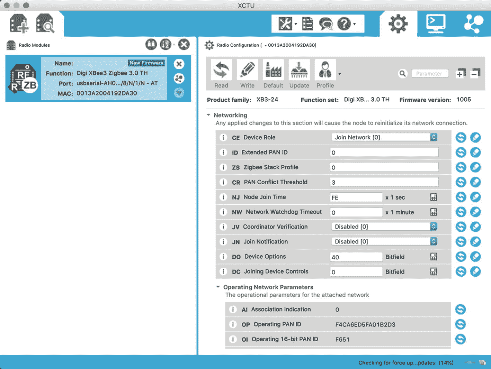

图 2-14

XCTU 无线电模块设置

收音机模块设置包括一长串您可以更改的内容。虽然大多数是您通常不会更改的，但有些是您在配置模块时需要更改的。例如，您可能需要设置在 ZigBee 网络中使用的角色和其他参数。幸运的是，这些设置被分组到类别中，您可以折叠或展开这些类别，以便更容易地找到您想要的设置。只需单击每个类别的三角形即可折叠或打开它。还有一个搜索框，可让您搜索设置。这是一个很好的接触。

让我们来看看如何做一个小小的改变。请注意，图中所示的系列 3 模块没有名称。每当对任何设置进行更改时，首先要找到设置，进行更改，然后将更改写入模块。在这种情况下，我们希望名称的参数是节点标识符或 NI。要在设置中找到它，只需在搜索框中键入 NI。然后您可以更改名称，如图 [2-15](#Fig15) 所示。


图 2-15

更改模块的名称标识符

请注意，我更改了节点标识符。要将更改写入模块，我单击设置旁边的铅笔图标。您也可以对其他参数进行更改，依次应用每一个参数，或者等待并更新所有更改，方法是点击*写入*按钮将所有更改写入模块。图 [2-16](#Fig16) 显示了应用了更改的无线电。


图 2-16

无线电模块名称已更改

命名模块也有助于在无线电模块列表中识别它们。事实上，XCTU 允许您以多种方式对模块进行排序，包括按名称排序。设置其他参数也同样简单。例如，您可能想要设置 PAN 地址、目的地址和节点标识符。

关于 XBee 模块，您还应该了解另一个方面——管理固件。如果您有较旧的模块，系统可能会提示您是否要下载旧固件。可能会出现如图 [2-17](#Fig17) 所示的对话框。您有三个下载选项:

*   *寻找并安装新固件*:仅下载 XCTU 和“已知”模块的更新。

*   *安装旧固件*:下载所有旧固件—如果您想使用任何旧系列模块，请选择此项。

*   *从文件*安装固件:从文件加载固件——如果您已经下载了自定义固件(很少使用)，请使用此选项。

第一次使用 XCTU 或第一次使用旧系列模块时，您应该选择第二个选项并安装旧固件包。否则，第一个选项是默认的，事实上，XCTU 会自动检查更新(但是您可以在首选项中关闭它)。


图 2-17

下载固件

根据您的互联网连接速度，可能需要一段时间来下载旧固件，但您应该这样做，以保持您的模块是最新的。拥有较旧的固件还允许您在较新的系列 3 模块上加载正确的固件，以便它们在协议和功能上匹配。

XBee 模块有两种通信模式:AT 或 API。AT 表示模块通过其本地串行连接接受 AT 命令，并使用 Hayes 调制解调器命令集的衍生物以人类可读的格式显示信息。API 意味着模块被配置为通过其协议栈发送和接收数据。因此，当您想要使用控制台连接与模块通信以对其进行配置时，可以使用 AT 方法。API 方法将在本书的其余部分使用。所有模块必须使用相同的通信固件(AT 或 API)和版本用于其角色。

在本章中，我们将使用 AT 模式。为了确保您加载了正确的固件，您应该将您的模块插入浏览器，将浏览器插入您的计算机，然后在 XCTU 中添加无线电模块。然后点击*更新*按钮，如图 [2-18](#Fig18) 所示。


图 2-18

选择更新固件

您将看到一个对话框，允许您选择要下载(更新)到模块上的固件。图 [2-19](#Fig19) 显示了在 AT 模式下选择 ZigBee 协议固件的示例，以及 2.5 系列和旧模块的最新版本。XBee 系列 3 模块的固件以不同方式列出。


图 2-19

选择固件(2.5 系列及更旧版本)

图 [2-20](#Fig20) 显示了 XBee 系列 3 模块的固件选择。

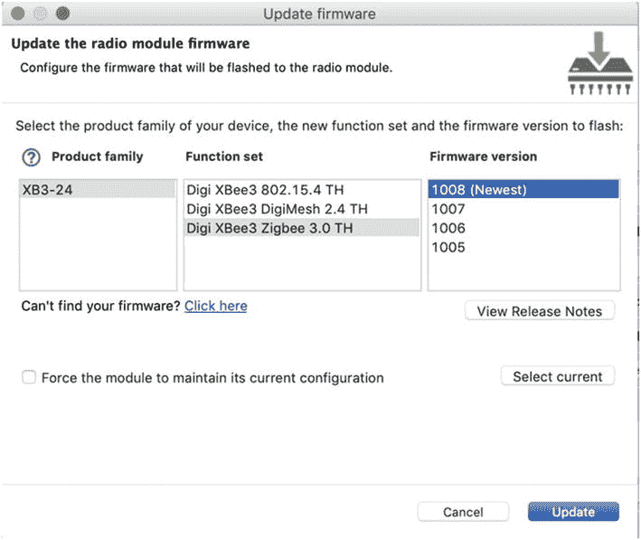

图 2-20

选择固件(系列 3)

选择所需固件后，点击*更新*按钮。你可能需要回答一个或多个“你确定吗？”查询。这是因为更新固件会抹掉您所做的任何设置，包括任何编程。显然，只有在你确定不需要先保存任何东西的情况下，才说“OK”。一旦固件更新，你会得到一个“确定”对话框。关闭后，XCTU 会将收音机重新加载到您的收音机列表中。

现在您已经看到了如何管理 XBee 模块的固件和设置，让我们来看看一种更简单的方法来设置用户定义的值。

#### 使用终端应用程序更改设置

XBee 模块的大多数设置都可以使用终端应用程序来更改(AT 模式)。在过去，我们必须使用控制台应用程序，但 XCTU 现在提供了一个控制台模式，效果非常好。该控制台具有使用 XBee 模块所需的所有功能。您可以连接、断开连接，甚至记录您的会话。您也可以发送命令或形成数据包，并将它们发送到模块。在本节中，我们将发送命令。该界面还允许我们看到十六进制的命令，这有助于诊断连接或解密数据。

XBee 模块有两种模式:命令和透明。命令模式由特殊命令`+++`启动，其中模块通过串行连接发回响应。透明模式是默认模式:模块向指定的无线电目的地发送数据。换句话说，当您想要与模块对话时，请使用命令模式；当您想要通过模块与另一个模块对话时，请使用透明模式。例如，通过 XBee 向另一个 XBee 发送数据使用透明模式。

因此，要在加载正确的固件后配置 XBee 模块，您需要打开一个终端应用程序并发出适当的命令。表 [2-2](#Tab2) 显示了一些用于配置 XBee 模块的常见 AT 命令。

表 2-2

常见 XBee AT 命令

<colgroup><col class="tcol1 align-left"> <col class="tcol2 align-left"> <col class="tcol3 align-left"> <col class="tcol4 align-left"></colgroup> 
| 

命令

 | 

描述

 | 

使用

 | 

反应

 |
| --- | --- | --- | --- |
| `+++` | 进入命令模式 | 将模块置于命令模式 | 好 |
| `ATCN` | 退出命令模式 | 返回透明模式 | 好 |
| `AT` | 注意力 | 查看该模块是否可用 | 好 |
| `ATWR` | 救援 | 将设置写入固件 | 好 |
| `ATID` | 平移 ID | 显示平移 ID | 平移 ID |
| `ATID nnnn` | 平移 ID | 更改平移 ID | 好 |
| `ATSH` | 64 位串行高电平 | 显示 64 位序列号的高部分 | 地址 |
| `ATSL` | 64 位串行低电平 | 显示 64 位序列号的低位部分 | 地址 |
| `ATDH` | 64 位目标高电平 | 显示 64 位目的地址的高位部分 | 地址 |
| `ATDH nnnn` | 64 位目标高电平 | 设置 64 位目标地址的高部分 | 好 |
| `ATDL` | 64 位目标低电平 | 显示 64 位目的地址的低位部分 | 地址 |
| `ATDL nnnn` | 64 位目标低电平 | 设置 64 位目的地址的低位部分 | 好 |
| `ATMY` | 16 位地址 | 显示协调员分配的 16 位地址 | 地址 |
| `ATNI` | 节点 ID | 显示文本字符串节点标识符 | 编号 |
| `ATNI text` | 节点 ID | 设置文本字符串节点标识符 | 好 |
| `ATRE` | 重置 | 将 XBee 重置为出厂默认值 | 好 |

Tip

有关 AT 命令的更多信息，请参见 XBee 3 手册 at [`www.digi.com/resources/documentation/digidocs/pdfs/90001539.pdf`](http://www.digi.com/resources/documentation/digidocs/pdfs/90001539.pdf) 。

一些命令需要一个值来设置变量。省略变量会导致显示当前值。除了`+++`以外的所有命令都需要你按下`Enter`才能执行。如果你按下`+++`命令而没有反应，再试一次，在每次尝试之间等待一两秒钟。您也可以尝试键入得快一点(或慢一点)，直到命令模式切换生效。

Tip

所有数值都以十六进制值的形式输入。

为了演示这些命令是如何工作的，让我们使用 XCTU 的控制台对话框连接到一个已经加载了 ZigBee 路由器固件的模块。首先在左侧列表中选择你的收音机，然后点击*控制台*选项卡，如图 [2-21](#Fig21) 所示。


图 2-21

选择控制台模式

控制台窗格允许您使用左侧的三个图标执行三项操作。您可以打开一个连接(连接到一个模块)、记录会话(仅在连接后可选择)和分离，这允许您将控制台分离到它自己的窗口中。如果你正在跟随，现在继续断开控制台，然后点击*打开*按钮。图 [2-22](#Fig22) 显示了一个典型的配置会话，从连接到模块并显示其值开始，然后退出命令模式。

Note

第一次不带参数运行 ATDH、ATDL 或 ATMY 命令时，可能会看到结果为 0。这表明该值尚未设置。


图 2-22

在控制台中获取有关模块(AT 模式)的信息

Tip

在命令模式下，在模块返回透明模式之前，您只有 10 秒钟的时间输入命令。如果发生这种情况，当输入命令时，您将看不到任何响应。只需再次发出++命令，然后重新发出该命令。

接下来，图 [2-23](#Fig23) 显示了使用 XCTU 控制台设置目的地址(您想要连接的 XBee)及其 PAN ID 的会话。


图 2-23

在控制台中配置模块(AT 模式)

虽然 XCTU 应用程序有一个非常好的串行终端，运行得非常好(当在 at 模式下使用 XBee 模块时，我更喜欢使用它)，但是您可以使用任何您想要的终端应用程序，比如 CoolTerm。你只需要设置串行连接来匹配你的 XBee(波特率等。)并连接到 XBee 所连接的串行端口。图 [2-24](#Fig24) 显示了在 macOS 上使用 CoolTerm 的示例。

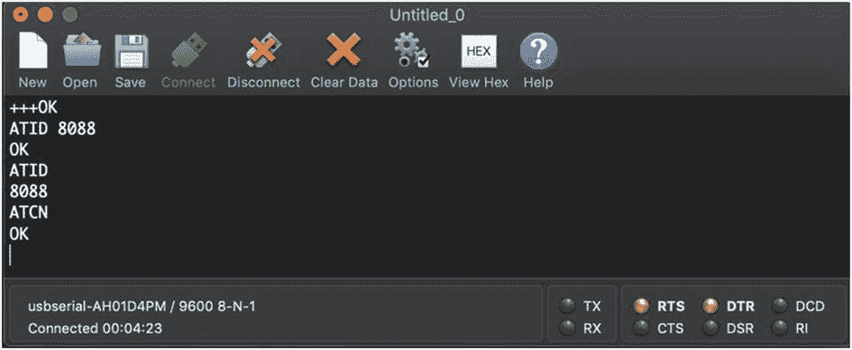

图 2-24

使用 CoolTerm 配置模块(AT 模式)

现在，您已经知道了使用 ZigBee 协议组建无线网络所需的模块类型以及如何配置它们，您可以开始构建无线网络了。下一节将解释如何创建最基本的 XBee 项目:“Hello，World！”XBee 等价物。

#### 更多信息

如果你想了解更多关于 XBee 模块以及它们如何通信的信息，Digi 网站( [`www.digi.com`](http://www.digi.com) )是一个很好的资源。你也可以在谷歌上搜索“XBee”和“ZigBee ”,找到一些博客、操作页面等，这些都有助于展示使用 XBee-ZB 模块解决的不同项目和解决方案。

如果您正在使用较旧的系列模块，也有一些优秀的书籍可供您参考，以获得更多信息、项目想法等。我在这里列出了两个较好的标题:

*   *构建无线传感器网络:使用 ZigBee、XBee、Arduino 和处理*，作者 Robert Faludi (O'Reilly，2010 年)，ISBN 978-0596807733

*   《XBEE 实验室实践手册:教你 XBEE 无线通信的实验》，作者乔纳森·泰特斯(纽尼斯，2012 年)，ISBN 978-0123914040

但是，Digi 提供了一些优秀的资源，您应该考虑研究一下，包括 XCTU 文档、XBee 模块硬件手册和 ZigBee 手册。您可以在以下站点找到所有这些文档:

```py
www.digi.com/support/productdetail?pid=5637&type=documentation

```

在我们开始使用 XBee 模块的第一个示例应用程序之前，让我们讨论一下 series 3 模块最强大的选项之一:MicroPython。

## 介绍 MicroPython

使用 Python 语言控制硬件已经有一段时间了。Raspberry Pi、pcDuino 和其他低成本计算机以及类似主板的用户已经拥有了使用 Python 控制硬件的优势。在这种情况下，他们在基于 Linux 的本地操作系统上使用了完整版本的 Python 编程语言。

然而，这需要构建特殊的库来与硬件通信。这些库旨在与通用输入输出(GPIO)引脚接口。GPIO 引脚通常出现在板上的一排或多排公引脚中。一些电路板使用母头引脚。

虽然这些电路板使那些想要开发电子项目的人成为可能，但它要求用户购买电路板以及键盘、鼠标和显示器等外围设备。不仅如此，用户还必须学习操作系统。对于那些不习惯 Linux 的人来说，这本身就是一个挑战。

MicroPython 的愿景是将学习 Python 的简单性与微控制器板的低成本和易用性结合起来，这将允许更多的人在艺术和科学项目中使用电子产品。初学者不必学习新的操作系统或学习更复杂的编程语言。答案是 MicroPython。

MicroPython <sup>[6](#Fn6)</sup> 由 Damien P. George、Paul Sokolovsky 和其他贡献者创建和维护。它被设计成 Python 3 语言的精简、高效版本，并安装在一个小型微控制器上。由于 Python 是一种解释语言，因此(一般来说)比编译语言慢，所以 MicroPython 被设计得尽可能高效，以便它可以在通常比典型的个人计算机慢得多且内存少得多的微控制器上运行。

另一方面，Arduino 等微控制器板需要一个编译步骤，您必须在计算机上执行该步骤，并首先将二进制可执行文件加载到板上。相比之下，由于 MicroPython 的解释器直接在硬件上运行，我们不需要中间步骤来准备代码；我们可以直接在硬件上运行解释语言！

这使得硬件制造商可以制造小型、廉价的主板，在与微处理器相同的芯片上包含 MicroPython(通常情况下)。这使您能够连接到电路板，编写代码，并执行它，而无需任何额外的工作。

您可能会想，将 Python 3 缩减到适合内存有限的小芯片的大小，这种语言被剥离了，缺少了一些特性。这不可能比事实更进一步。事实上，MicroPython 是 Python 3 核心特性的完整实现，包括紧凑的运行时和交互式解释器。它支持读写文件、加载模块、与 GPIO 引脚等硬件交互、错误处理等等。最重要的是，Python 3 代码的优化允许它被编译成需要大约 256K 内存来存储二进制文件的二进制文件，并且运行时只需要 16K 的 RAM。

MicroPython 因此允许 Digi 在 XBee series 3 模块本身上放置函数式编程语言和解释器！是的，这意味着我们可以连接到我们的 XBee 系列 3 板，编写代码，并执行它。这为使用 XBee 模块和传感器网络打开了一个全新的世界。

Note

MicroPython 仅适用于 series 3 模块。

XCTU 有一个 MicroPython 控制台，可以用来连接到 series 3 模块。要使用 MicroPython，我们必须对模块进行一些修改。回想一下，在更改设置后，我们使用右侧的更新图标(铅笔)来设置更改。其中包括更改波特率(更快)，启用 API + MicroPython 模式。图 [2-25](#Fig25) 显示了 XCTU 中的设置。

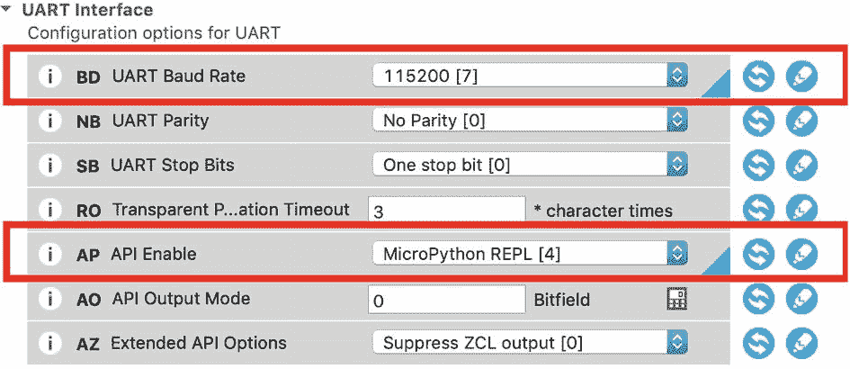

图 2-25

MicroPython 的安装模块

一旦这些设置被写入模块，只需将 XBee series 3 模块连接到 USB XBee Explorer，将其插入您的计算机，并将无线电添加到 XCTU。在那里，您可以单击工具图标并选择 *MicroPython 终端*。图 [2-26](#Fig26) 显示了选择。

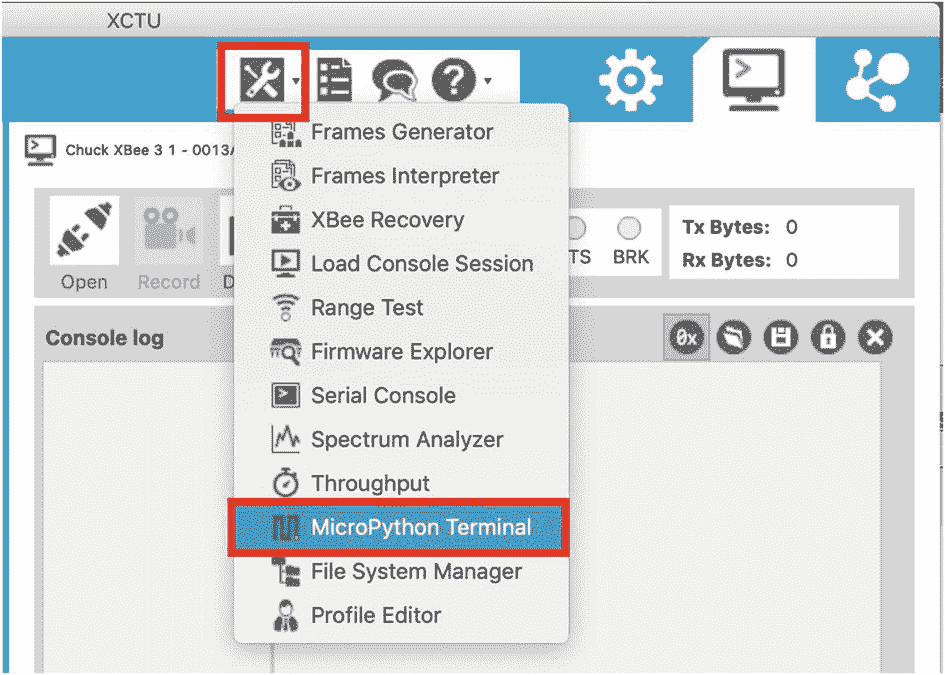

图 2-26

打开 MicroPython 控制台

这将打开 MicroPython 控制台，您可以在其中发出 Python 命令。图 [2-27](#Fig27) 以无处不在的“你好，世界！”的形式展示了一个简单的例子程序。

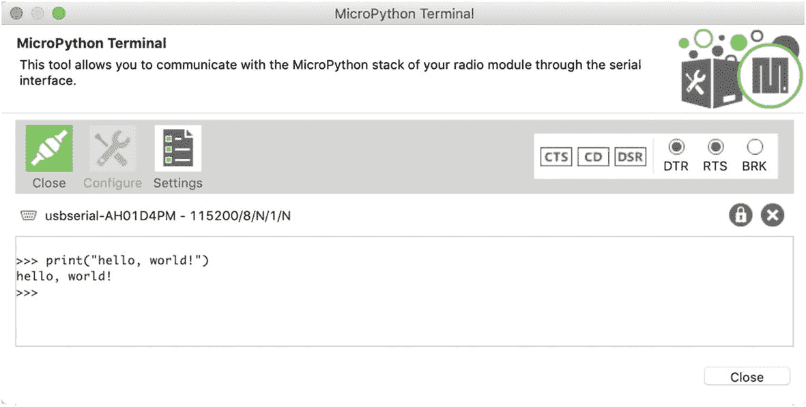

图 2-27

示例 MicroPythonsession

这个例子是使用 ZigBee 系列 3 模块显示的。根据您使用的模块，MicroPython 的特性可能略有不同。表 [2-3](#Tab3) 显示了某些 3 系列模块的主要特性及其可用性。

表 2-3

XBee Series 3 按型号划分的 MicroPython 功能

<colgroup><col class="tcol1 align-left"> <col class="tcol2 align-left"> <col class="tcol3 align-left"></colgroup> 
| 

特征

 | 

XBee 3 蜂窝电话

 | 

XBee 3 ZigBee、DigiMesh 和 802.15.4

 |
| --- | --- | --- |
| 数字输入输出 | 是 | 是 |
| I2C | 是 | 是 |
| 动力管理 | 是 | 是 |
| Digi 远程管理器 | 是 <sup>1</sup> | 不 |
| 辅助 UART | 是 | 不 |
| 实时时钟 | 是 | 不 |
| 文件系统 | 是 | 是 |
| 文件系统—并发文件写入 | 是 | 不 |
| 文件系统—重命名 | 是 | 不 |
| 文件系统—创建后编辑文件 | 是 | 不 |
| 文件系统—删除 | 是 | 否 <sup>2</sup> |
| 文件系统—安全文件 | 是 | 不 |
| 跨更新保留文件系统 | 是 | 不 |

我们将在下一章看到更多关于 MicroPython 的内容。但是首先，让我们通过一个简短的演示项目来看看 XBee 模块的运行情况，在这个项目中，我们使用 AT 模式通过终端连接进行设置和配置。

## XBee 无线聊天室

对于这个示例，您需要两个 XBee 模块、两个 USB 适配器和所需的电缆，以及一台或两台计算机。您可以将一台电脑的每个模块连接到不同的 USB 串行端口。

此示例使用一个 series 2 和一个 series 3 XBee 模块来演示如何使用每个系列。如果只有一个系列，可以跳过演示其他系列的部分。最大的区别在于你如何加载固件。在 AT 模式下对模块编程是相同的。

这个项目有点像“你好，世界！”在硬件级别测试 XBee。您将使用两个 XBee 模块，配置为一个简单的点对点网络，带有一个协调器和一个路由器，而不是编写一个简单的程序来打印消息。在示例中，我包括了一个系列 2 和一个系列 3 模块，但是如果您愿意，也可以使用两个相同的系列。只需遵循以下章节中特定系列的说明。

您将把这两个模块都设置为使用 AT 固件，这样您就可以演示透明模式，并看到您以明文形式传递的消息。这是聊天成功的关键。在一个模块上键入的内容或输入的信息会出现在另一个模块上。酷吧。

### 加载模块的固件

你需要做的第一件事是为每个模块加载固件。回想一下，您使用 XCTU 应用程序来加载固件。我们将回顾为 2.5 系列和更早版本以及 3 系列模块加载固件的细节。

#### 2.5 系列及更早版本

较旧的 2.5 系列和更早的模块具有针对三种角色之一预配置的固件。这由版本号表示。对于我在编写本章时使用的 XBee 模块，协调器的版本号是 20A7。前两位是角色，后两位是版本。如果你的模块有不同于 A7 的版本，这并不重要，只要它们有相同的版本。以下是一些主要角色及其价值:

*   20xx，协调器，AT/透明操作

*   21xx，API 操作协调员

*   22xx，路由器，AT/透明操作

*   23xx，路由器，API 操作

*   28xx，终端设备，AT/透明操作

*   29xx，终端设备，API 操作

#### 系列 3

系列 3 模块的配置略有不同。这些模块对于 ZigBee 固件只有如下三种选择。要将 3 系列模块与旧的 ZigBee 模块一起使用，请确保加载 ZigBee 固件:

*   *Digi XBee3 802.15.4 TH* :当与使用较旧的 802.15.4 协议的其他模块一起工作时，使用此固件。

*   *Digi XBee3 DigiMesh 2.4 TH* :与使用 DigiMesh 协议的其他模块一起工作时，使用此固件。

*   *Digi XBee3 ZigBee 3.0 TH* :与使用 ZigBee 协议的其他模块一起工作时，使用此固件。

由于我们在本书中使用 ZigBee 协议，如果您使用任何 3 系列模块，您将需要加载 ZigBee 固件。目前最新版本是 1008。同样，拥有最新的并不重要，但保持最新也无妨。

您可能想知道如何为三个角色之一配置 series 3 模块。这是通过选择两种设置的组合来完成的。首先，我们选择*设备角色* (CE)并将其设置为*形成网络* (1)或*加入网络* (0)。其次，我们选择*睡眠模式* (SM)并将其设置为 0(对于路由器)或> 0(用作终端设备)。表 [2-4](#Tab4) 显示了帮助您选择正确设置的矩阵。

表 2-4

设置系列 3 角色

<colgroup><col class="tcol1 align-left"> <col class="tcol2 align-left"> <col class="tcol3 align-left"></colgroup> 
|   | 

掌握

 |
| --- | --- |
| 

ZigBee 角色

 | 

设备角色(ce)

 | 

睡眠模式(SM

 |
| --- | --- | --- |
| 协调者 | one | Zero |
| 路由器 | Zero | Zero |
| 终端设备 | Zero | > 0 |

例如，要使用 AT 模式将 series 3 模块设置为协调器，我们发出`ATCE`和`ATSM`命令。或者，更好的方法是，我们可以使用 XCTU 应用程序并在那里设置参数。

但是还有一个特定于系列 3 模块的设置。请注意，没有 AT 或 API 固件选项。这通过使用 *API 使能* (AP)设置来控制。对于 AT 模式，将其设置为 0；对于 API 模式，将其设置为 1。您可以使用 ATAP 命令或使用应用程序来实现这一点。

Tip

更改设置时记得点击设置旁边的*写入*按钮，或者如果您已经更改了两个或更多设置，点击工具栏上的*写入*按钮。

#### 为协调器加载固件

使用 XCTU 应用程序将第一个 XBee 模块配置为功能集的协调器。在这种情况下，我们将使用系列 3 模块。

连接模块并点击*添加*或*发现*按钮(在 XCTU 窗口的左上角)。按照对话框操作，一旦添加了模块并读取了其配置，就可以更新固件了。

点击*更新*图标，在对话框中选择 ZigBee 固件。图 [2-28](#Fig28) 显示了加载 ZigBee 3.0 固件的正确选择。一旦选定，点击对话框中的*更新*按钮。


图 2-28

为协调器加载固件(系列 3)

写过程完成后，必须设置*设备角色*和*睡眠模式*，如表 [2-4](#Tab4) 所示。您还需要确保将 *API 模式*设置为 0。下面的代码显示了如何使用终端连接来实现这一点。回想一下，我们可以点击 XCTU 界面右上角的*终端*图标，然后点击*打开*按钮开始一个会话。记住键入`+++`命令(在控制台日志的左侧),并在输入命令前等待几秒钟的响应。

```py
+++
ATCE 1
ATSM 0
ATAP 0
ATWR
ATCN

```

如果您想使用 XCTU 应用程序设置参数，记得点击*配置*图标切换到配置模式(或使用菜单)。

#### 为路由器加载固件

现在，让我们将第二个 XBee 模块配置为路由器 AT 功能集。在这种情况下，我们将使用系列 2 模块。

连接模块并点击*添加*或*发现*按钮(在 XCTU 窗口的左上角)。按照对话框操作，一旦添加了模块并读取了其配置，就可以更新固件了。

点击*更新*图标，在对话框中选择 ZigBee 路由器 AT 固件。图 [2-29](#Fig29) 显示了在固件中加载 ZigBee 路由器的正确选择。一旦选定，点击对话框中的*更新*按钮。

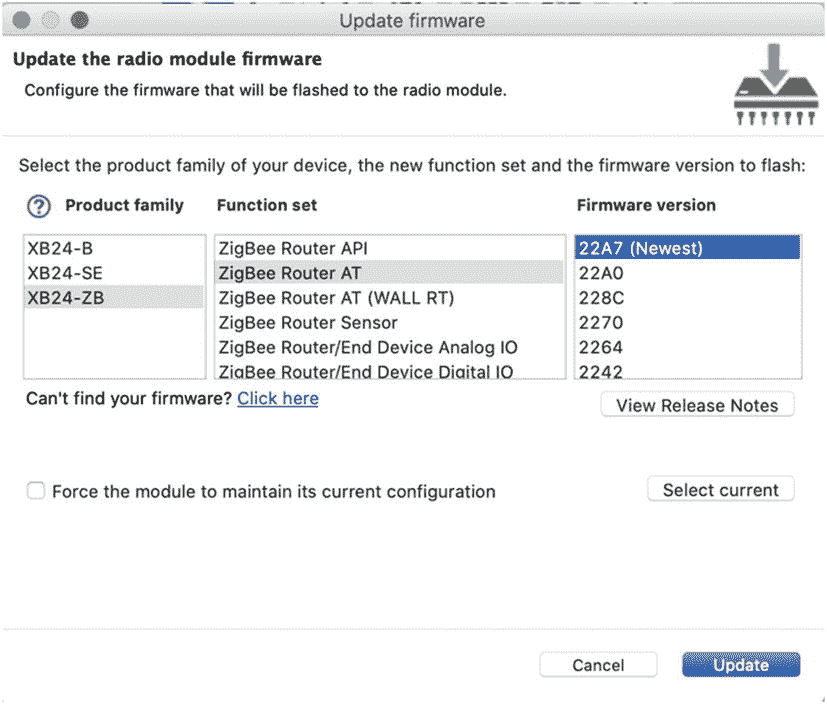

图 2-29

为路由器加载固件(2.5 系列及更早版本)

接下来，我们需要为每个模块设置目的地址，使它们相互指向对方。因此，点对点的命名。

### 捕获序列号

回想一下，XBee 无线电需要目标无线电的 64 位地址(序列号，也称为 MAC 地址)来发送数据。您需要在开始项目之前记录这些内容。花点时间记录下每个 XBee 模块的 64 位序列号。

如果您已经将 XBee 模块插入到它们的适配器中，那么使用 XCTU 应用程序就可以很容易地看到地址。图 [2-30](#Fig30) 显示了连接的系列 3 和系列 2 模块。注意显示的地址。我们将把每个模块的目的地设置为另一个模块的地址。


图 2-30

使用 XCTU 识别 64 位地址

如果您喜欢或需要该操作模式，您也可以使用终端应用程序，使用`ATSH`和`ATSL`命令向模块查询地址。

确定地址后，将信息写在表 [2-5](#Tab5) 中。 <sup>[7](#Fn7)</sup> 这里有您将使用的附加信息的空间，因此在您继续项目时请参考此表。

表 2-5

XBee 配置数据

<colgroup><col class="tcol1 align-left"> <col class="tcol2 align-left"> <col class="tcol3 align-left"> <col class="tcol4 align-left"> <col class="tcol5 align-left"></colgroup> 
| 

作用

 | 

串行高电平

 | 

串行低电平

 | 

平移 ID

 | 

节点 ID

 |
| --- | --- | --- | --- | --- |
| 协调员在 |   |   |   |   |
| 路由器在 |   |   |   |   |

现在，让我们从协调器开始配置 AT 模式参数。

### 配置协调器

要配置协调器，您需要将此无线电的目的地址设置为另一个无线电(路由器)的序列号。因此，您将协调器上的目的地址设置为路由器的地址。我们还需要为网络设置 PAN ID。

我们将使用 XCTU 应用程序来更改设置，但是如果您愿意，也可以使用终端并发出`ATDH`、`ATDL`和`ATID`命令。

您还必须选择要在网络上使用的 PAN ID。还是用标志性的 8088 吧。 <sup>[8](#Fn8)</sup> 在这种情况下，只要网络上的所有模块具有相同的 PAN ID，并且该值在 0000-FFFF(十六进制)范围内，您使用什么都没关系。还要将节点 ID 设置为 COORDINATOR，以便于识别。图 [2-31](#Fig31) 显示了协调器的配置会话。

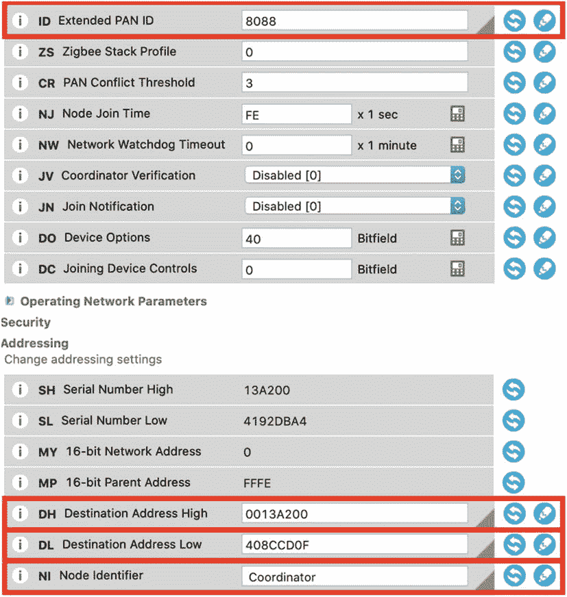

图 2-31

配置协调器

### 配置路由器

要配置路由器，您需要将此无线电(路由器)的目的地址设置为另一个无线电(协调器)的序列号。与协调器一样，您将 PAN ID 设置为 8088。还要将节点 ID 设置为 ROUTER，以便于识别。图 [2-32](#Fig32) 显示了路由器的配置会话。

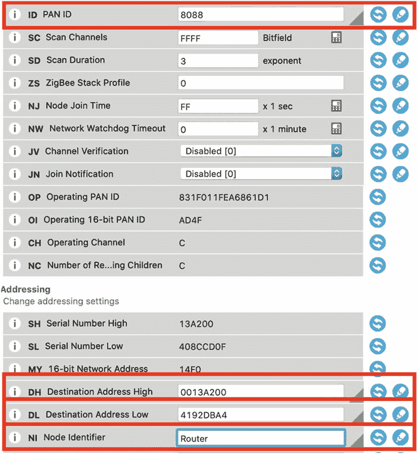

图 2-32

配置路由器

### 让聊天开始

就这样:您已经准备好开始聊天会话了。如果您一直在使用终端进行更改，那么您现在需要做的就是通过使用`ATCN`命令或者简单地等待 10 秒钟，将模块返回到透明模式。

一旦你为模块设置了目的地地址，它们就会“找到”彼此并开始聊天。要查看聊天的运行情况，只需单击其中一个模块并打开一个终端连接。您应该点击*分离*按钮，这样您就可以点击另一个模块并为该模块打开一个终端。

接下来，在每个终端点击*打开*按钮。此时您可能看不到任何事情发生，因为模块正在等待来自另一个模块的数据。我们可以自己点击控制台输出的左侧。继续在那里键入一些东西。

如果您的配置有效，您应该会看到文本从一个终端出现在另一个终端，反之亦然。如果你这样做了，那么恭喜你——你已经建立了你的第一个 XBee 网络(尽管是一个非常简单的点对点网络)。图 [2-33](#Fig33) 显示了我使用 XCTU 从电脑上运行的测试结果。这个终端功能很好，因为它对消息进行了颜色编码。如果您自己运行它，您应该看到红色文本是文本接收，蓝色是文本发送。

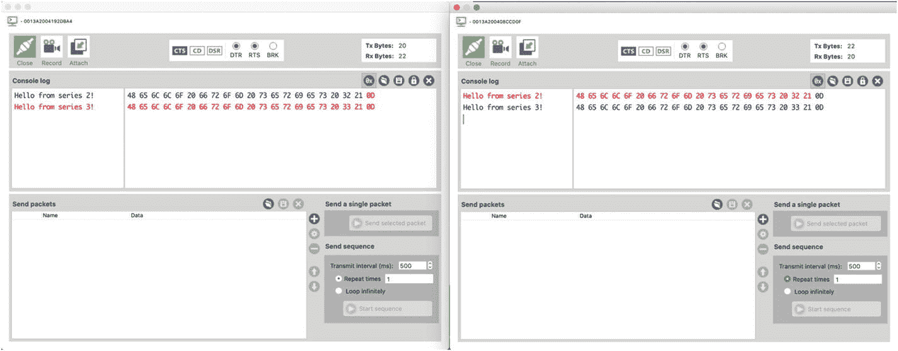

图 2-33

成功聊天

为了加分，拔掉你的 USB 适配器，把它们从一台电脑切换到另一台电脑；然后重启你的终端程序。注意到什么特别的吗？这是一个棘手的问题，因为您应该看到聊天示例像以前一样工作。在这种情况下，谁是协调者并不重要；因为您将值写入 XBee 非易失性存储器，所以即使拔掉电源，模块也会“记住”它们的设置。很好，是吧？

Is Point-to-Point Good Enough?

您可能想知道是否可以在传感器网络中使用点对点网络。简短的回答是，在某些情况下你可以。例如，如果您有少量不太可能脱机的节点，您也许能够形成一个具有点对点网络的网络。在这种情况下，您将形成一个星型拓扑网络。

但是，也有一些限制，例如，如果中间的一个节点发生故障，它会将该节点一侧的所有节点从另一侧孤立出来。您也不能形成多点连接，广播可能需要额外的编程才能完成。由于这些原因以及更多原因，复杂的传感器网络可以从使用网状拓扑中受益。

### 为了更多乐趣

如果您想使用 chat 示例更多地尝试点对点网络和 AT 固件，请尝试向网络添加第三个 XBee。将其连接到您的路由器节点，并键入一些数据。它出现在哪里:协调器还是路由器？再次尝试，将新模块连接到协调器。文本是否出现在您期望的位置？提示:使新模块也成为路由器，并将其目的地址设置为第一个路由器。

Got Hub?

如果你想测试你的 XBee 网络，但你的电脑没有足够的 USB 端口，端口过于接近， <sup>[9](#Fn9)</sup> 或者你不想使用第二台(或第三台)电脑，USB XBee 探索者将使用一个有电源的集线器，甚至一些更好的无电源集线器，如下所示。

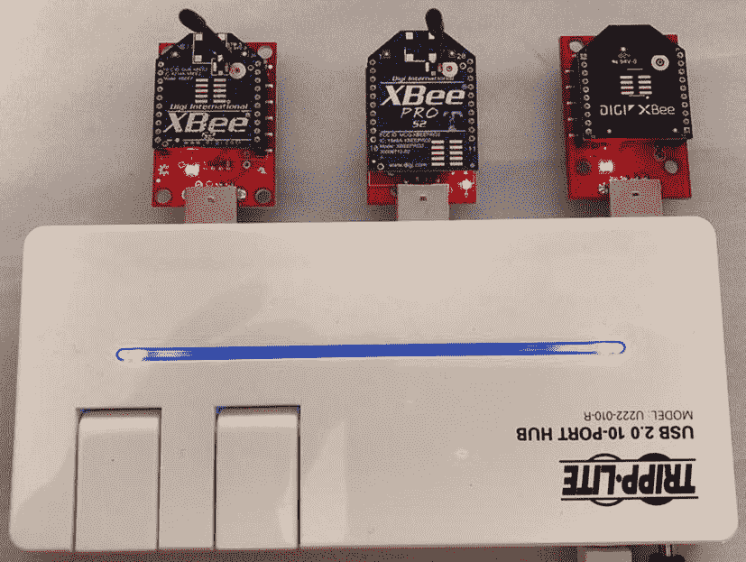

然而，我发现有些集线器不起作用。我有一个非常好(也非常贵)的 USB 3 集线器，除了我的 XBee Explorer 板之外，它对任何东西都很好。因此，您的里程可能会有所不同。奇怪的是，我的老式 USB 2.0 集线器工作良好，并有足够的空间来放置 XBee Explorer 板。

## 构建 XBee-ZB 网状网络

现在，您已经知道了什么是 XBee 模块，如何选择项目中使用的模型，以及如何配置它们以在点对点网络中发送和接收数据，让我们来看看更复杂、更适合传感器网络的一些内容。

在这个项目中，您将配置三个 XBee 模块:一个作为协调器，另一个作为路由器，最后一个作为终端设备。我将为协调者使用一个系列 3 模块，但是像以前一样，它不是必需的，并且该项目将与早期的模块一起工作。

但是，您可以使用形成网状网络所需的 API 固件，而不是 AT 固件。目标不是深入探究 API 固件；相反，它是为了看看如何使用 XBee 模块通过网络传输数据。

回想一下，API 固件被设计为实现完整的 ZigBee 协议，这意味着数据消息被封装在具有报头层的分组中。换句话说，信息是以二进制数据的形式传输的，而不是像您在 AT 固件中看到的文本。

API 固件和 ZigBee 协议有很多内容。幸运的是，您不必为了使用它而深入了解细节。但是，知道数据包是如何形成的确实有助于您诊断和调试数据消息。在您阅读本书的过程中，我将介绍一些经常遇到的包。

如果您想了解有关 ZigBee 协议及其多种数据包格式(称为帧类型)的更多信息，请参阅以下资源之一:

*   *构建无线传感器网络:使用 ZigBee、XBee、Arduino 和处理*，作者 Robert Faludi (O'Reilly，2010)，ISBN 978-0596807733<sup>T3】10T5】</sup>

*   *ZigBee 射频模块，“Digi 国际”，2018， [`www.digi.com/resources/documentation/digidocs/pdfs/90000976.pdf`](http://www.digi.com/resources/documentation/digidocs/pdfs/90000976.pdf)*

 *### 加载模块的固件

您需要做的第一件事是使用 XCTU 应用程序加载每个模块的固件。在本例中，我们将为协调器使用一个系列 3 模块，为路由器和终端设备使用两个系列 2 模块。

由于我们使用的是 series 3 模块，回想一下，我们只需将 API 模式(AP)设置为 1 即可打开 API 模式。对于早期的模块，我们必须加载正确的固件。更具体地说，我们在一个模块上加载终端设备 API 函数集，在另一个模块上加载路由器 API 函数集，如果我们没有 series 3 模块，我们将需要在第三个模块上加载协调器 API 函数集。

### 配置 XBee 模块

建议在开始新项目时，将 XBee 模块重置为出厂默认值。您可以在配置页面上使用 XCTU 应用程序来完成此操作。点击*默认*按钮设置出厂默认，然后点击*是*确认。这就是你需要做的！您也可以在 AT 命令模式下从终端使用`ATRE`命令。

但是那些地址和身份证什么的呢？简单来说，你不需要他们。模块将自动连接到协调器(或路由器)，协调器将为每个模块分配 16 位地址。显然，这比点对点模式更容易配置。

虽然这是真的，但使用 API 固件进行实验也更加困难。回想一下，API 固件以二进制形式发送和接收数据消息。为了观察这个网络的运行，您需要形成称为传输请求包的特殊包。

### 形成测试消息

测试消息是一个简单的数值，嵌入在一个称为传输请求包的包中。(在某些文档中，它被称为传输请求帧。)数据包需要非常特殊的格式。

如果您曾经使用过以太网中遇到的低级数据包(TCP 数据包)或 MySQL 客户端协议等其他通信协议，那么您应该已经熟悉了这些基本概念。然而，如果你没有，数据的布局可能看起来很奇怪。表 [2-6](#Tab6) 显示了示例传输请求包的布局。后面会有更详细的描述。

表 2-6

传输请求包

<colgroup><col class="tcol1 align-left"> <col class="tcol2 align-left"> <col class="tcol3 align-left"> <col class="tcol4 align-left"></colgroup> 
| 

田

 | 

抵消

 | 

例子

 | 

描述

 |
| --- | --- | --- | --- |
| 定界符 | Zero | `7E` | 数据包开始定界符 |
| 长度 | one | `00 10` | 长度和校验和之间的字节数 |
| 框架类型 | three | `10` | 请求传输 |
| 框架 ID | four | `01` | UART 数据帧 |
| 64 位目标地址 | five | `00 00 00 00 00 00 00 00 FF FF` | 协调器的 64 位地址 |
| 目的地址 16 位 | Thirteen | `00 00` | 16 位目的地址 |
| 广播半径 | Fifteen | `00` | 最大跳数 |
| 选择 | Sixteen | `00` | 选择 |
| 射频数据 | Seventeen | `99 99` | 数据有效载荷 |
| 校验和 | Nineteen | `BC` | 0xff 减去包中字节的总和 |

该数据包的重要部分是长度、地址和数据有效载荷。这些是你最想改变的部分。在这种情况下，64 位地址是协调器的默认地址。协调器使用默认设置获取该地址。16 位地址也是如此。该示例生成十六进制的有效负载 99 99(十进制的 39321)。因为您对此仅使用了 2 个字节，所以长度(长度部分之后的数据包所有部分的字节长度，直到但不包括校验和部分)为 16 (1+1+8+2+1+1+2)。校验和的计算方法是 0xff 减去长度和校验和之间的字节数的 8 位和。

听起来很复杂？可以的。幸运的是，您不需要经常手动这样做。事实上，当您使用 XBee 发送数据时，您在与 XBee 本身通信时使用的编程库会为您构建这些包。您用来从 Arduino 和 Raspberry Pi 与 XBee 对话的库也将使您的生活变得更加轻松。

那么，你为这个项目做什么？你自己创建包吗？如果你担心计算字节和计算校验和，不用担心。Digi 已经用一个叫做帧生成器工具的漂亮的包创建对话框构建了 XCTU 应用程序。你也可以用它来创建任何你想要的 ZigBee 包。

当您打开终端并连接到要发送数据包的模块时，您可以使用此功能。只需点击界面发送帧部分的*添加新帧*按钮。图 [2-34](#Fig34) 显示了一个终端会话的例子。

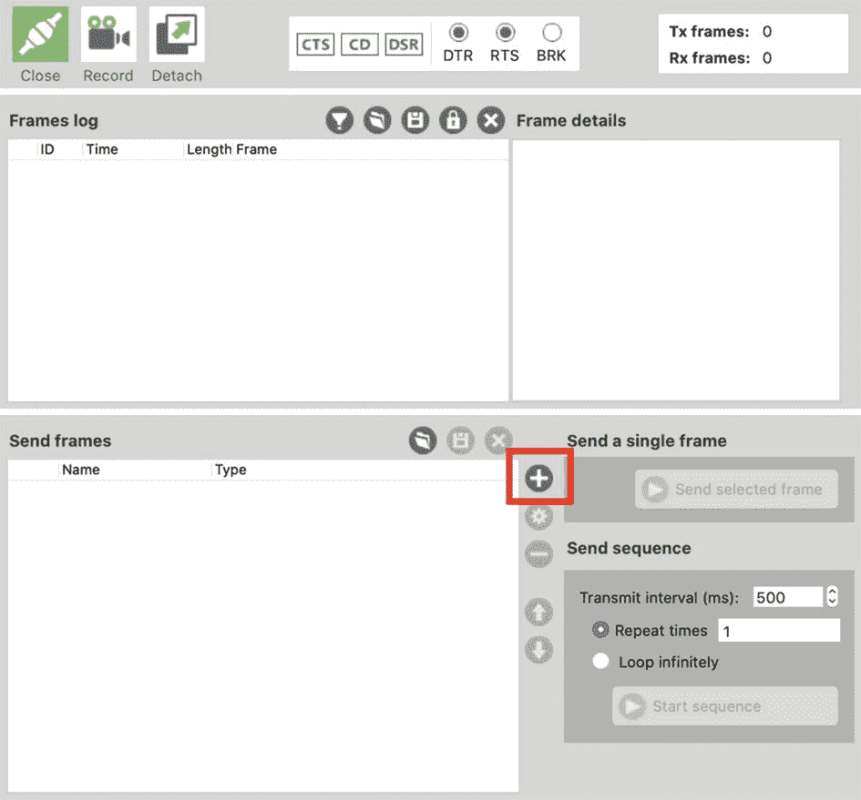

图 2-34

添加新的帧数据包

点击*添加帧*按钮后，您将看到一个对话框，允许您使用帧生成器工具编辑现有数据包或添加新数据包。如图 [2-35](#Fig35) 所示，要添加新的数据包，点击*使用‘帧生成器’工具*创建帧按钮。

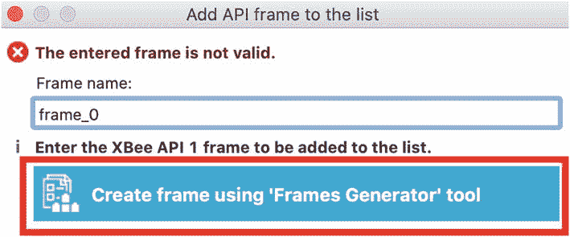

图 2-35

打开框架生成器工具

接下来，您将看到一个允许您填充数据包的对话框，但是首先您必须选择数据包类型。对于这个项目，我们希望选择发送请求包(0x10)。该对话框将自动刷新，显示该数据包类型的正确字段。图 [2-36](#Fig36) 显示了发送请求包的对话框。回想一下，该数据包用于向另一个模块发送数据。


图 2-36

创建发送请求包

注意这里我用`00 00 00 00 00 00 FF FF`设置了目的地址。这是广播地址，它将数据包发送到所有模块。如果您想将数据包发送到一个特定的模块，您需要填写该模块的 64 位 MAC 地址。因为我们使用的是广播，所以我们会看到网络中的所有模块都收到了这个数据包。

请注意，我还在 RF 数据框中添加了一条消息。我只是简单地输入了“你好”这个词。因此，这是一个你好，世界！打字练习。

花点时间打开一个终端，自己创建这个框架。新 XCTU 接口的一个非常好的地方是它会保存你创建的数据包帧，这样你就可以一次创建并测试几个。现在，让我们看看如何设置网络。

### 测试网络

现在是时候启动 XBee 模块了。从协调器开始，然后是第一台路由器，最后是终端设备。然后，您可以将终端应用程序连接到所有模块。

Wait, What About the Baud Rate?

如果您一直在阅读，并且想知道为什么我没有演示如何设置您的模块的串行选项(比如波特率),以及您是否需要设置它们，答案就在 XCTU 应用程序如何工作。它允许你以任何你想要的参数使用模块。另一方面，如果您想使用不同的终端应用程序，您可能需要更改参数。幸运的是，这在 XCTU 应用程序中很容易做到。只需进入每个模块的配置，查找如下所示的串行参数。

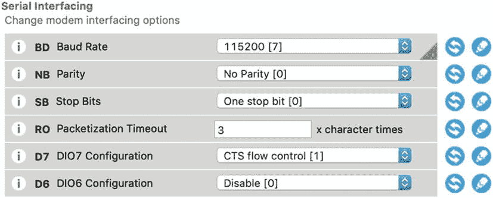

更改所需的设置，然后将更改写入模块。但是同样，您不需要这样做，也不需要让所有的模块使用 XCTU 应用程序的相同连接参数。酷吧。

对于这个例子，我使用了一台带有 XCTU 的计算机，使用终端模式连接到所有三个模块。将所有模块连接到终端应用程序后，应该给模块五到十分钟的时间进行自我配置，然后再继续。

那么，你怎么知道一切都正常呢？嗯，其实挺简单的。XCTU 有一个你可以使用的网络模式。通过阅读所有正在创建网络图的模块，您将看到网络的布局。*网络*按钮位于 XCTU 窗口的右上角。接下来，点击*扫描*按钮。一旦你点击那个按钮，可能需要一点时间来发现网络，但是它应该向你显示一个类似于图 [2-37](#Fig37) 的布局。

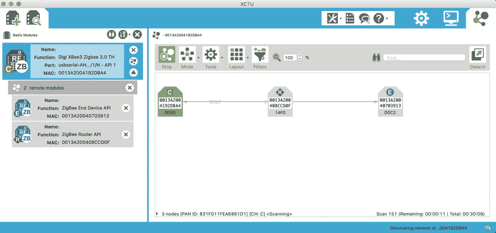

图 2-37

XCTU 的网络模式

请注意，该图显示了每个模块的 64 位地址(MAC 地址),以及显示为实线的通信路径。很好。

好了，你已经等了，一切都应该正常了。我们来看看。在任一模块连接上，点击*添加帧*按钮，创建一个传输请求包，其广播地址如图 [2-36](#Fig36) 所示，包括“Hello”的有效载荷。务必点击*添加帧*按钮保存数据包。

要发送数据包，在左侧选择它并点击*发送所选帧*按钮。如果您正在观察其他模块中的终端，您可能会看到一些数据包经过。这是因为默认情况下会显示所有数据包，但是您可以使用过滤器来减少混乱。我把它作为一个练习——只需点击*过滤器*按钮，并选择您想要查看(或不查看)的数据包类型。所有模块收到数据包后，您可以单击数据包并查看数据。图 [2-38](#Fig38) 显示了输入命令的结果。

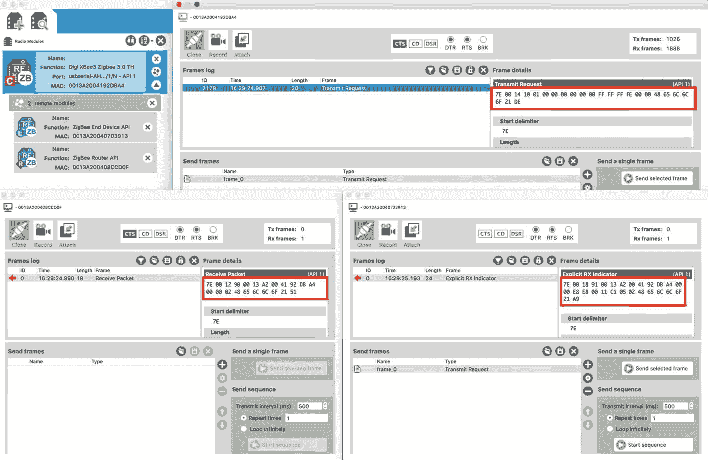

图 2-38

所有模块接收到的广播数据包

请注意每个模块上数据包周围的方框。在这里，我们看到数据包是从协调器发出的，并在其他模块上被接收。但是，数据有效载荷在哪里呢？它就在那里，就嵌在信息里。在这种情况下，它是十六进制形式，十六进制的 Hello 是`48 65 6C 6C 6F`。看看你能否在图像中找到它。

广播消息可以方便地向所有传感器节点发送断电或睡眠模式命令，或者向所有数据聚合节点发送命令，以将其数据保存到正在使用的介质中。

接下来，让我们创建一个新的传输请求消息，并为其他模块之一指定 64 位地址。为数据添加您想要的任何内容，然后发送帧。例如，我将目的地址设置为我的示例网络中的路由器(`0013A200408CCD0F`)。我还在射频数据字段中输入了一个随机数(`90125` <sup>[11](#Fn11)</sup> )。图 [2-39](#Fig39) 显示了我创建并添加的框架。

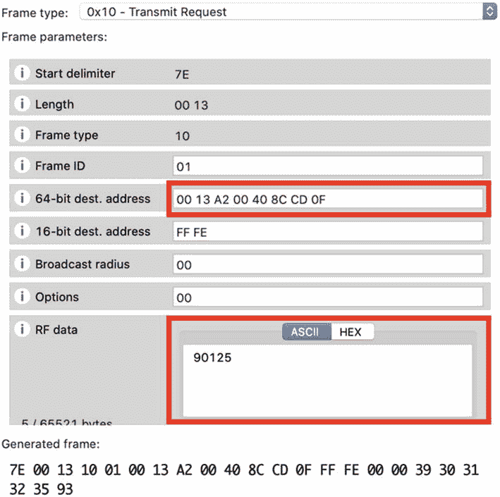

图 2-39

传输带有目的地的请求帧

当我发送数据包时，它显示在路由器上，但没有显示在其它模块上。这是因为这是发送到特定模块的消息；其他人忽略了这条信息。图 [2-40](#Fig40) 显示了“发送”模块在上方而“接收”模块在下方的结果。

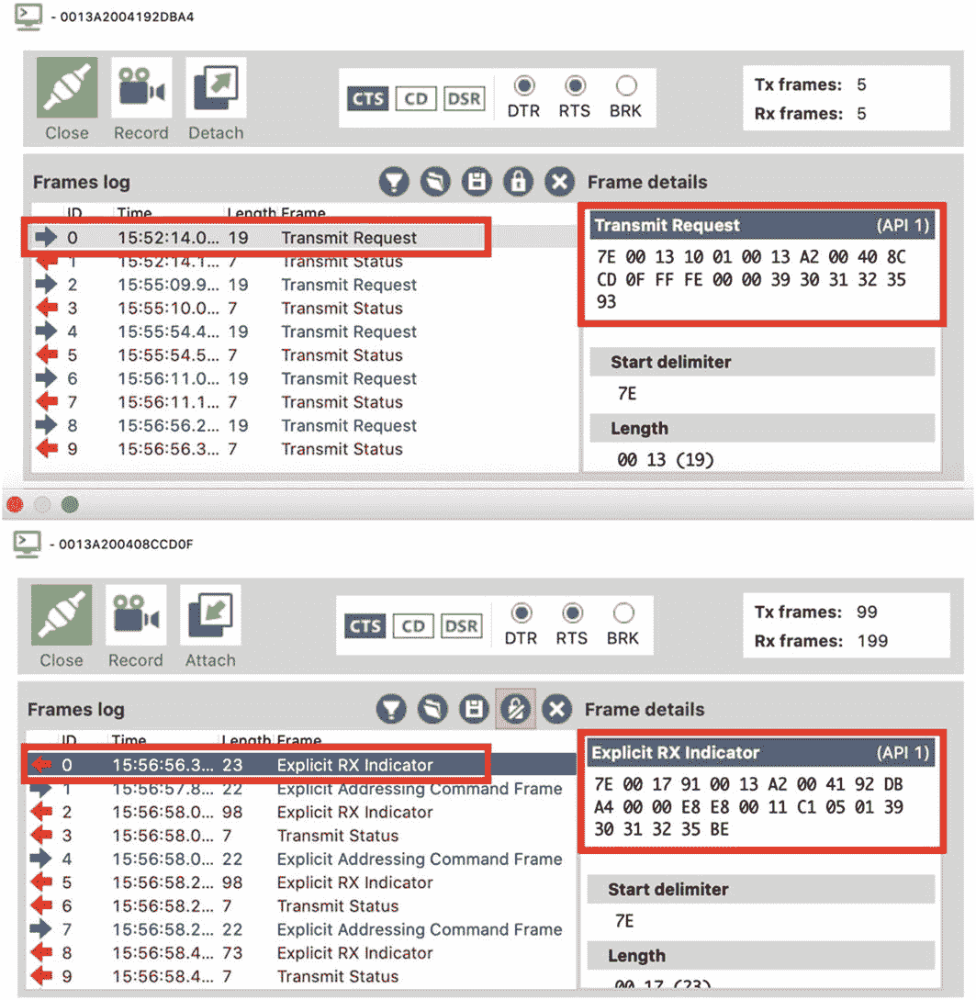

图 2-40

发送和接收的帧

请注意帧日志左侧的小箭头。指向右边的箭头是发送事件，指向左边的箭头是接收事件。不错吧。

Tip

您只看到了 XCTU 应用程序的一小部分功能。您应该花些时间阅读手册，了解更多关于它的功能。例如，精明的用户可能想了解 XBee 模块的无线功能。

至此，您已经看到了如何将消息从一个模块直接发送到协调器，以及如何将广播消息发送到所有模块。如果您能够在自己的 XBee 模块上复制或执行类似的操作，那么恭喜您！你现在有一个非常简单的无线网状网络。

虽然该项目不包含任何传感器节点，但如果您将终端设备视为传感器节点，将键盘视为发送数据的传感器，您就可以看到典型传感器网络的运行情况。在这种情况下，默认情况下，终端设备将其数据包发送到协调器，如果需要，可以广播数据。将所有数据发送到协调器也是关于如何用 XBee 模块配置数据聚集节点的线索。在接下来的章节中，你将建立在这个前提之上。

### 为了更多乐趣

如果您想更多地练习创建测试包，请尝试从路由器发送网络节点检测命令，看看您会得到什么。提示:您需要一个`ATND`命令。

## 部件购物清单

你需要一些组件来完成本章中的项目。表 [2-7](#Tab7) 列出了它们。

表 2-7

所需组件

<colgroup><col class="tcol1 align-left"> <col class="tcol2 align-left"> <col class="tcol3 align-left"> <col class="tcol4 align-left"></colgroup> 
| 

项目

 | 

供应商

 | 

是吗？成本美元

 | 

所需数量

 |
| --- | --- | --- | --- |
| XBee-ZB (ZB)系列 2、2.5 或 3 | [T2`www.sparkfun.com`](http://www.sparkfun.com) | $25.00–48.00 | three |
|   | [T2`www.adafruit.com`](http://www.adafruit.com) |   |   |
|   | [T2`www.makershed.com`](http://www.makershed.com) |   |   |
| XBee 浏览器加密狗 | [T2`www.sparkfun.com/products/11697`](http://www.sparkfun.com/products/11697) | $24.95 | 1 |
| xbee 浏览器 | [T2`www.sparkfun.com/products/11812`](http://www.sparkfun.com/products/11812) | $29.95 | 1 |
| USB 转迷你 USB 电缆，用于 XBee Explorer USB | [T2`www.sparkfun.com/products/11301`](http://www.sparkfun.com/products/11301) | $3.95 | 1□□□□□□□□□□□□□□□□□□ |
| usb 适配器 | [T2`www.adafruit.com/product/247`](http://www.adafruit.com/product/247) | $29.95 | 1 |

你只需要三个 USB 适配器。

每个 XBee USB 适配器需要一个-加密狗不需要。

确保获得正确的电缆。还记得你需要三个匹配的 XBee-ZB 模块。适配器板不必相同，但您应该有三个。

Cable Trouble Solution

如果你像我一样，有许多 USB 项目，你可能会遇到的第一个挫折是 USB 连接器选择的随机性。好像每次我买一个新的组件都需要一根不同的 USB 线！我没有随身携带一套电缆，而是从 SparkFun 找到了一个解决方案，让我的生活变得更加轻松。USB Cerberus 电缆( [`www.sparkfun.com/products/12016`](http://www.sparkfun.com/products/12016) )的一端包括一个标准的 USB A 型插头连接器，另一端包括一组三个通用连接器(B、mini-B 和 micro-B)。我建议为您的每个电子设备套件购买一个。

另一个令人沮丧的问题是用 USB 集线器之类的东西给设备供电。再说一次，我过去常常带着一堆电源线来给我所有的组件供电。在这种情况下，SparkFun 凭借其 Hydra 电源线( [`sparkfun.com/products/11579`](http://sparkfun.com/products/11579) )再次出手相救。该电缆的一端有一个标准的 USB A 型连接器，另一端有一组三个连接器(用于 Arduino、JST 和鳄鱼夹的筒形插头)。非常酷。

## 故障排除提示和常见问题

如果你在运行这两个项目时遇到问题，不要难过，也不要放弃！尽管它们体积小巧，功能强大，但如果配置不正确，这些小害虫会给你带来很多麻烦。本节探讨了解决一些更常见问题的一些最佳实践。

### 要检查的内容

以下是帮助您确定问题所在以及如何解决问题的提示列表:

*   *布线*:这听起来可能有点傻，但是请检查以确保您的所有模块都正确供电——无论是通过主机微控制器还是 USB 适配器(或 USB 集线器！).您会惊讶地发现，告诉您的操作系统弹出 USB 加密狗是多么容易。如果发生这种情况，很可能您的适配器的所有电源指示灯都亮起，但终端无法连接。尝试拔下电缆，然后重新插入。还要检查串行端口，因为如果从一个端口移动到另一个端口，一些操作系统可能会重新分配串行端口。

*   插上电源了吗？您还应该检查模块是否以正确的方向插入其插座，并且没有针脚被跳过(错位)。

*   *串行设置*:如果您使用的终端与 XCTU 中的不同，请检查您的波特率。如果您在 XBee 上更改了它，您的终端应用程序可能没有存储该设置。如果您想要更改设置，请确保为所有 XBee 模块以及终端应用程序设置相同的设置。

*   *AT 地址*:如果您正在使用 AT 固件构建点对点系统，请务必检查您的地址！请记住，目的地址需要指向您希望发送数据的模块的地址(`ATDH` / `ATDL`)。确保使用`ATWR`命令保存数值。

*   *版本*:最好确保你使用的固件版本在所有模块上都是一样的。有些版本与其他版本不兼容。最好总是使用相同的版本。

*   *XBee 死了吗？*如果你的 XBee 模块不能被你的终端应用程序读取，或者它停止响应 XCTU，你可能遇到了一些人所说的阻塞，这使得该模块除了作为门挡或砖块之外毫无价值。如果发生这种情况，请尝试重置模块。如果您的适配器没有*重置*按钮(只有少数有)，您可以连接适配器，然后轻轻地(非常轻轻地)移除模块并重新插入。当模块开始响应时，重新加载固件。极端情况见 [`www.instructables.com/id/Restoring-your-broken-XBee/`](http://www.instructables.com/id/Restoring-your-broken-XBee/) 。

*   *旧值持续恢复*:如果您在 AT 固件中更改了您的设置，但即使在您使用`ATWR`后旧值仍持续恢复，请使用重置命令(`ATRE`)将所有值恢复至出厂默认值。

### 常见问题

以下是您可能会遇到的一些更常见的情况以及如何应对:

*   *AT 命令不起作用*:如果`+++`命令不能唤醒模块，确保模块加载了 AT 固件。我忙乱了将近 15 分钟，我以为这是一个死模块，才发现它加载了 API 固件。不要被那个自我诱导的恶作剧所欺骗！

*   *AT 模式的奇怪错误*:确保你的模块配置了相同版本的 AT 固件。您可以使用`ATVR`命令来检查每个模块。

*   *设置丢失或恢复*:最常见的错误之一是做了所有的设置却没有用`ATWR`写值。您需要使用此命令来保存这些值。在您完成此操作并返回透明模式之前，XBee 模块可能无法工作。

*   *无法使用退格键*:尝试使用 AT 固件输入带有值的命令可能会非常令人沮丧，因为退格键在大多数终端应用程序中不起作用。出现错误时，请按 Enter 键，然后再次尝试该命令。始终使用命令的显示选项(没有值的命令)检查设置。

*   *API 固件不工作*:如果您确定您的所有模块都配置了相同版本的 API 固件，请尝试拔下所有模块，首先插入协调器，然后插入路由器，最后插入终端设备。协调器可能需要长达 10 分钟的时间将所有节点加入网络。

你也可以访问罗伯特·法卢迪的网页了解 XBee 的常见错误( [`www.faludi.com/projects/common-xbee-mistakes/`](http://www.faludi.com/projects/common-xbee-mistakes/) )。他列举了很多你对 XBees 不熟悉时会出错的地方，以及如何配置。正如他所说，它们并不像看起来那样不可靠或古怪。大多数怪癖是用户错误的结果。可悲的是，事实并非总是如此。

最后，使用 Digi 网站及其知识库( [`www.digi.com/support/kbase/`](http://www.digi.com/support/kbase/) )。外面有大量的信息。可能有人遇到过类似的问题，简单搜索知识库和论坛就能找到解决方案。

## 摘要

哇，这一章我们讲了很多内容。向您介绍了 XBee-ZB 模块和 ZigBee 协议，并尝试了 AT 和 API 固件。您还了解了大量关于 XBee 的知识，它的许多特性包括 series 3 模块的一些 MicroPython 特性。虽然看起来我已经讨论了很多，但事实是您才刚刚开始了解 XBee 以及如何在您的传感器网络中使用它。

在本书的剩余部分，我将回到 XBee 主题。第 [4](04.html) 章探讨如何用 XBee 模块托管传感器，第 [5](05.html) 章探讨如何用 Raspberry Pi 托管传感器，第 [6](06.html) 章探讨如何用 Arduino 微控制器托管传感器。如果你喜欢本章的项目，下一章的项目可能会更有趣，因为你可以看到一个真正的传感器在工作。

但是首先，让我们了解更多关于编程 MicroPython 的知识。下一章将介绍 MicroPython 以及一个简短的教程。让我们开始编码吧！

<aside aria-label="Footnotes" class="FootnoteSection" epub:type="footnotes">Footnotes [1](#Fn1_source)

ZigBee 基于 802.15.4 协议，提供电源管理、寻址和错误控制以及网络功能。

  [2](#Fn2_source)

更多信息请参见 [`http://en.wikipedia.org/wiki/IEEE_802.15.4`](http://en.wikipedia.org/wiki/IEEE_802.15.4) 。

  [3](#Fn3_source)

有时称为电缆替换，因为它无需电缆就能有效地将两台设备连接在一起。

  [4](#Fn4_source)

系列 2 模块有五个用于专业模块的天线选项和四个用于标准模块的天线选项。

  [5](#Fn5_source)

[T2`https://en.wikipedia.org/wiki/MAC_address`](https://en.wikipedia.org/wiki/MAC_address)

  [6](#Fn6_source)

版权所有 2014-2017，达米安·p·乔治，保罗·索科洛夫斯基，以及贡献者。最后更新于 2017 年 3 月 05 日。

  [7](#Fn7_source)

如果你不想写在你的书上，拿一张纸做一个类似于表 [2-5](#Tab5) 的图表来储存信息。如果纸很薄，你可以把它折叠起来当书签用。

  [8](#Fn8_source)

这个数字对你有什么意义吗？提示:IBM PC。

  [9](#Fn9_source)

或者，它们在地板上，你不想倒立着把它们插上。

  [10](#Fn10_source)

不包括系列 3 模块。

  [11](#Fn11_source)

一些经典摇滚粉丝可能会声称《随机数》有更大的故事。给你一个提示:是的，确实如此。

 </aside>*