# 4.基于 XBee 的传感器节点

到目前为止，在我们的传感器网络之旅中，我们已经发现了传感器网络是如何形成的，节点的类型以及它们在传感器网络中的作用，并且我们已经花了一些时间了解 XBee 模块以及如何使用 MicroPython 对它们进行编程。

现在是时候看看我们如何使用 XBee 模块读取传感器数据了。正如您将看到的，这可以通过两种方式之一来实现:使用 XBee 丰富的本机功能来读取传感器并将数据广播到几个甚至单个节点，使用编写的 MicroPython 来读取和管理传感器数据，并将数据传递到其他节点。我们将集中讨论第一种方法，但我们将看到两种方法的简短示例。

让我们首先简要概述一下我们可以用 XBee 模块做什么。

## 如何用 XBee 托管传感器

用 XBee 模块托管传感器有两种基本方法 <sup>[1](#Fn1)</sup> 。您可以配置 XBee 模块对传感器进行采样，并按时间表发送其数据(XBee 硬件选项)，或者您可以编写一个 MicroPython 脚本(MicroPython 选项)来执行相同的操作。有一个主要的区别。使用 MicroPython 选项意味着您可以在传输传感器数据之前对其进行一些额外的处理。这可以包括基本的错误处理、数据转换等等。如果您需要在传输传感器数据之前对其进行任何处理，或者如果您想要控制连接到 XBee 模块的其他设备，MicroPython 是一个明显的优势。

例如，您可以将一个 LED 连接到 XBee，每当从传感器读取数据时就打开它。这可能有助于射频识别(RFID)阅读器等解决方案，在传感器上刷卡可以打开门。在这种情况下，您可以使用 MicroPython 触发发光二极管(LED ),让用户知道锁何时被解除(或被接合)。

相反，硬件选项允许您将 XBee 配置为以原始形式捕获传感器数据，并且没有修改它的规定(很容易)。因此，发送的数据是传感器生成的原始数据。虽然这是最佳实践之一—以原始形式存储数据—但有时您可能希望在传输之前处理数据。我们将看到如何用 MicroPython 选项做到这一点。

在这两种情况下，传感器都通过输入/输出引脚直接连接到 XBee。更具体地说，您将传感器连接到 XBee，读取数据，并将其发送到网络上的一个或多个 XBee 模块。您可以通过地址将数据发送到特定的模块，也可以通过广播将数据发送到网络上的所有模块。

在下一节中，我们将看到两种方法的示例，使用相同的硬件设置来实现简单的环境传感器。

## 构建 XBee 环境传感器

本例中的 XBee 环境传感器节点是一个 XBee 模块，带有一个简单的模拟温度传感器(TMP36 ),连接到一个模拟输入引脚，该引脚使用模数转换器(ADC)将电压转换为 0–1024 范围内的数字。对于这个项目，您告诉 XBee 使用短时间周期发送数据；但是对于一个实际的项目，你可能会考虑使用一个较慢的采样速率，或者使用睡眠模式，在这种模式下 XBee 会休眠一段时间，然后发送数据，并重复执行。我们将在本章稍后配置 XBee 模块时设置采样率。现在，让 XBee 更频繁地发送样本，这样您就可以看到发生了什么。

XBee 还有一个非常棒的功能，可以监控电池电量。您可以告诉 XBee 将当前电源作为数据包的一部分发送。在这种情况下，它发送提供给 XBee 的任何电压。这很有帮助，因为它允许您在解决方案中构建一个触发器来提醒您更换传感器节点中的电池。

如果你有一个装有烟雾探测器的家或公寓，你可能已经经历过类似的电路，当电池电压下降时，它会发出音调或警报。对于那些家里有多个烟雾探测器的人来说，这有点像“沃尔多在哪里？”游戏寻找探测器是啁啾！这就是为什么每当第一个探测器开始鸣叫时，我就更换所有探测器的电池。

### 硬件设置

为了使项目易于构建，您将使用传感器节点的试验板。使用试验板可以更容易地试验元件，一旦完善电路，就可以将它们移到印刷电路板(PCB)试验板上进行半永久安装，或者为传感器节点设计和构建自己的定制 PCB。

XBee 传感器节点的硬件包括一个试验板、一个试验板电源、一个 TMP36 温度传感器和一个 0.10mF 电容。您还需要一个 XBee Explorer 板和一组插头(面包板的间距为 0.1 英寸)，就像 Adafruit 或 SparkFun 提供的那样。图 [4-1](#Fig1) 显示了 SparkFun regulated explorer 板。稳压板稍微贵一点，但是它内置了功率调节，所以如果你不小心接了 5V，它不会把你的 XBee 炸了。作为一个现在完全无用的 XBee(它甚至不够大，不能用作杯垫)的所有者，我可以告诉你，它值得额外的成本。


图 4-1

SparkFun 监管的 XBee Explorer(由 SparkFun 提供)

Note

大多数分线板没有安装试验板接头。你必须自己焊接，找个人来帮你焊接。

组装好元件后，如图 [4-2](#Fig2) 所示，将它们插入试验板。请注意，图中没有安装 XBee 模块，因此您可以清楚地看到连接。确保将试验板电源设置为 3.3V。

Caution

在给传感器节点通电之前，请务必仔细检查您的布线。

现在还不需要安装 XBee 模块，因为在电路中使用它之前，您需要配置它的设置。您将在下一节中执行该操作。

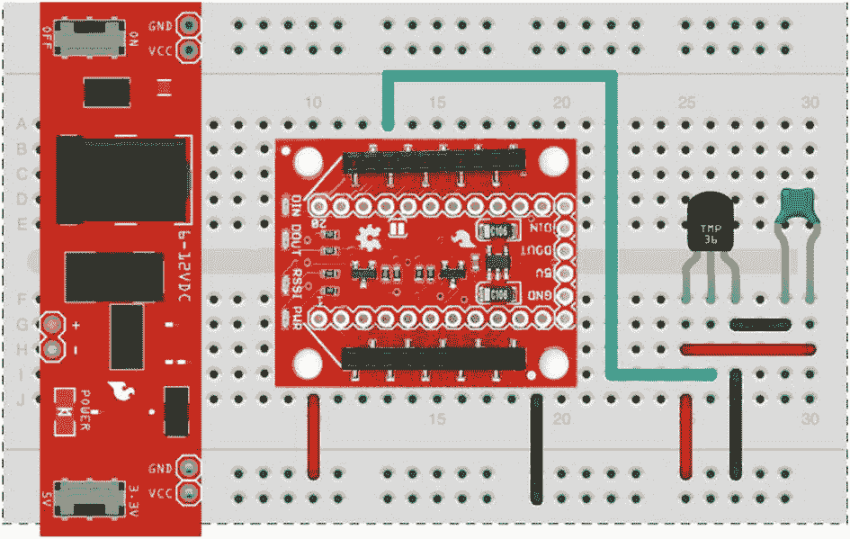

图 4-2

XBee 温度传感器节点

值得注意的是，该图显示正电源流向 XBee 的引脚 1。请务必检查分线板上的针脚，以确定您连接到了正确的针脚。例如，SparkFun regulated explorer 输入电压不在引脚 1 上。

Note

试验板电源可以是 6V 到 12V 的任何电源。大多数人用来给他们 Arduino 供电的 9V 壁式电源适配器将会很好。

请注意，您还将 TMP36 的数据线连接到引脚 XBee 上的模拟 3 或浏览器板上的 DIO3)，并将地连接到分线板(或浏览器)上的地引脚。确保 TMP36 的平面朝向如图所示。也就是说，平的一面朝向你，引脚 1 在左边，连接到输入电源，中间的引脚是数据，引脚 3 连接到地。您可以在任一方向放置电容，但要确保它连接到 TMP36 的引脚 1 和 3。

Caution

确保分线板电源设置为 3.3V

Alternative to a Breadboard Power Supply

如果您计划制作几个 XBee 传感器节点用于半永久安装，您可能不想使用试验板。相反，您可能希望使用 PCB 试验板，并将 XBee 分线板、传感器和支持电子设备焊接到位。在这种情况下，试验板电源可能不太方便。同样，如果你想降低成本，你可以用几个部件构建一个基本的电源，它可以接受高达 12V 的电压，同时仍然可以将 XBee 的电源调节到 3.3V。

你所需要的只是一个 7833-电压调节器、一个 1mF 电容器、一个 10mF 和一个双端接线板(或类似的电源连接器)。总的来说，即使在电子产品零售店，你也应该可以花几美元买到这些组件，而在电子产品网上商店就更便宜了。布置电路很容易。下图显示了连接到试验板上的组件。

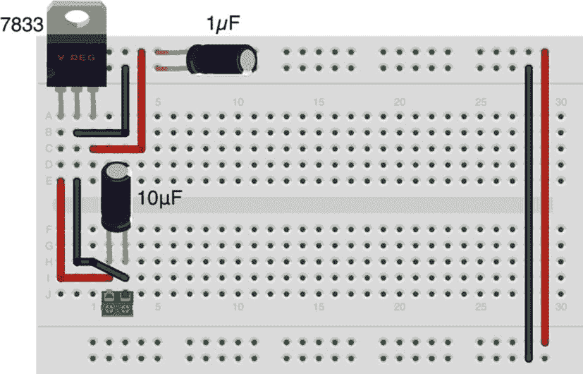

你只需要一点想象力和一些电线来转移电路到 PCB 试验板。注意电容的方向——让白条在负极一侧！

现在我们已经设置了硬件部分，让我们看看如何使用前面描述的每种方法在 XBee 上启用传感器。

对于每个选项，我们将使用 XCTU 应用程序测试传感器节点，以观察数据。这将允许我们在不建立完整的传感器网络的情况下测试读取传感器。事实上，建议您以类似的方式测试每个传感器节点。一旦所有节点都使用一个连接，您就可以开始在一个更大的网络中将它们连接在一起。这将为你节省无数的时间和挫折。 <sup>[2](#Fn2)</sup>

我们将从 XBee 硬件选项开始。

### XBee 硬件选项

在本节中，我们将使用 XBee 模块的硬件配置选项从 TMP36 传感器读取温度数据，并将其传递给网络上的另一个 XBee 模块。我们将使用 ZigBee 网络来简化事情。更具体地说，我们将不使用目的地址(DH 和 DL 代码)来设置目标节点。这将允许 XBee 作为传感器节点使用数据样本包来广播数据。

我们需要一个 XBee 模块读取传感器，另一个模块接收数据。为了使这个例子简单和易于设置，我们将在这个例子中使用 XBee series 2 模块。如果不使用协调器，并且清除了目的地址(DH 和 DL ),您可以将第 [2](02.html) 章中使用的模块之一用于传感器节点。您将使用配置为协调器的 XBee 模块来测试 XBee 传感器节点。以下部分详细介绍了您需要进行的所有设置。

#### 配置 XBee 传感器节点

用作 XBee 传感器节点的 XBee 模块可以是终端设备，也可以是带有 API 固件的路由器。您使用 XCTU 应用程序通过 USB 适配器连接到 XBee。回想一下，我们必须使用 USB 加密狗连接 XBee，然后打开 XCTU，并添加模块(或搜索所有模块)。一旦找到模块，打开*配置模式*选项卡。从那里，我们将设置几个设置，使 XBee 能够读取传感器。如果您尚未上传路由器或终端设备固件，您应该先上传。

在这种情况下，您希望 XBee 模块每 15 秒(15，000 毫秒)发送一次数据，读取模拟线路 3(数字 I/O 3 或 DIO3)上的数据，并包括参考电压。因此，在 XCTU 应用程序中，您想要更改相应的设置。表 [4-1](#Tab1) 显示了您需要更改的设置。使用搜索框中显示的代码快速查找每个设置。回想一下，所有值都是以十六进制输入的，您可以通过搜索代码来更改 XCTU 中的值，然后选择一个值或将其键入该设置的文本框中。如图所示更改设置，然后点击*写入*将设置保存到 XBee 模块。

表 4-1

XBee 传感器节点选项和值

<colgroup><col class="tcol1 align-left"> <col class="tcol2 align-left"> <col class="tcol3 align-left"> <col class="tcol4 align-left"></colgroup> 
| 

密码

 | 

设置名称

 | 

描述

 | 

价值

 |
| --- | --- | --- | --- |
| D3 | a3/上帝 3 | 触发模拟或数字数据记录 | 2—ADC |
| 身份 | 平移 ID | 网络的 Id | Eight thousand and eighty-eight |
| 红外的 | 输入输出采样率 | 等待发送数据的时间 | 3a 98—15000 毫秒 |
| 镍 | 节点标识符 | 节点的名称 | 传感器节点 |
| V+ | 电源电压阈值 | 电源电压 | FFFF(总是发送) |

#### 设置协调员

接下来，移除 XBee 传感器节点，并将其插入试验板上的 explorer。确保已加载协调器固件，并使用表 [4-2](#Tab2) 中的设置。

表 4-2

XBee 协调器选项和值

<colgroup><col class="tcol1 align-left"> <col class="tcol2 align-left"> <col class="tcol3 align-left"> <col class="tcol4 align-left"></colgroup> 
| 

密码

 | 

设置名称

 | 

描述

 | 

价值

 |
| --- | --- | --- | --- |
| 身份 | 平移 ID | 网络的 Id | Eight thousand and eighty-eight |
| 镍 | 节点标识符 | 节点的名称 | 协调者 |

现在我们准备测试我们的传感器节点。

#### 测试 XBee 传感器节点

要测试 XBee 传感器节点，您需要使用 XBee 协调器，API 固件安装在连接到 PC 的 USB 适配器上。首先这样做，以便协调器可以在您启动 XBee 传感器节点时启动并运行。将其插入您的电脑，并打开 XCTU 应用程序。使用 XCTU 发现 XBee 模块，然后打开一个终端。参见第 [2](02.html) 章了解如何操作的说明。

接下来，将电源连接到 XBee 传感器节点。XBee 需要一些时间来连接到协调器并加入网络。一旦完成，您就会看到协调器正在接收数据，如图 [4-3](#Fig3) 所示。

Tip

网络的形成需要一些时间。如果在协调器上没有看到数据样本，请关闭传感器节点的电源，然后再打开。如果您仍然看不到任何数据，请仔细检查您的设置，以确保两个节点都在同一个网络 PAN ID 上。

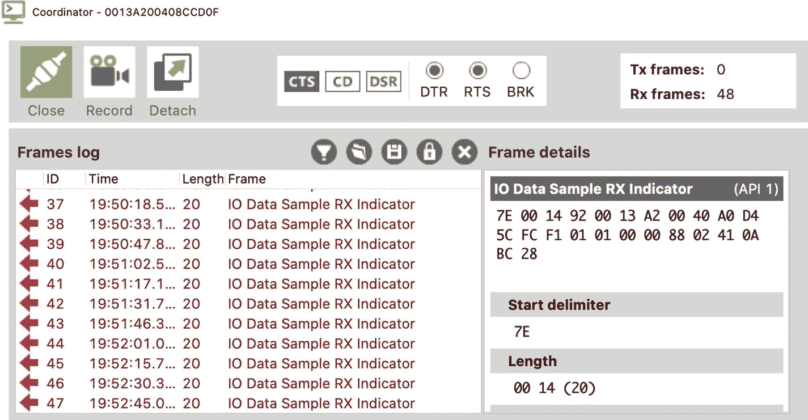

图 4-3

串行监视器输出

您应该看到一个或多个 *IO 数据样本接收 RX 指示符*数据包。请注意，图像中的第一行以 7E(十六进制)开始。这是包的起始定界符。您应该看到如下所示的正确数据。这是一系列十六进制值。

```py
7E 00 14 92 00 13 A2 00 40 A0 D4 5C FC F1 01 01 00 00 88 02 41 0A BC 28

```

所有 ZigBee 分组都有特定的格式或布局。表 [4-3](#Tab3) 显示了 *IO 数据采样接收指示器*包的布局。

表 4-3

IO 数据采样接收指示器包

<colgroup><col class="tcol1 align-left"> <col class="tcol2 align-left"> <col class="tcol3 align-left"></colgroup> 
| 

价值

 | 

字段名

 | 

笔记

 |
| --- | --- | --- |
| `7E` | 开始分隔符 |   |
| `00 14` | 包长度 | 20 字节校验和 |
| `92` | 框架类型 | I/O 数据采样接收指示器 |
| `00 13 A2 00 40 A0 D4 5C` | 64 位地址 | XBee 传感器节点的地址 |
| `FC F1` | 16 位地址 |   |
| `01` | 选择 |   |
| `01` | 样本数目 | 1 个数据样本 |
| `00 00` | 数字掩模 | 有数据的数字引脚 |
| `88` | 模拟掩模 | 有数据的模拟引脚 |
| `02 41` | 样品 | 来自传感器的温度 |
| `0A BC` | 电源电压 |   |
| `28` | 校验和 |   |

该数据包代表从 XBee 传感器节点发送的数据。在这种情况下，您设置 XBee 每 15 秒从模拟引脚 3(数字 IO 3)发送一次任何值。您还可以设置发送电源电压值的选项。注意模拟掩码的值:十六进制的值 88 被转换成二进制的值`1000 1000`。字节的第一部分表示电源电压也包含在数据包中。该字节的第二部分表示 AD3/DIO3(引脚 3)是样本源。如果对多个传感器进行采样，掩码将包含数据引脚设置的位，或引脚 0 的`0001`、引脚 1 的`0010`和引脚 2 的`0100`。

从表中可以看到，确实有一个数据样本的值为`02 41`(十六进制，十进制 577)。该值为 577，因为这是从传感器读取的毫伏电压。要计算温度，必须使用以下公式:

```py
temp =  ((sample * 1200/1024) - 500)/10

```

因此，你有`((577 * 1200/1024)-500)/10 = 17.61`摄氏度。电源电压的公式类似:

```py
voltage = (sample * 1200/1024)/1000

```

这里，您将读取的数据转换为伏特而不是毫伏。因此，数据包包含`0A BC`(十六进制，2748)，电压读数为 3.22 伏。如果使用电池为 XBee 传感器供电，您可以使用该值来确定何时需要更换电池或给电池充电。

花一些时间研究示例中的其他样本，并检查温度读数的数据样本。如果您非常小心，可以将手指放在 TMP36 上，观察温度变化(再进行一两次采样后，温度应该会开始升高)。一旦您确信 XBee 传感器节点正在发送类似的数据，您就可以断定传感器节点工作正常。

接下来，让我们看看 MicroPython 选项。

### MicroPython 选项

在本节中，我们将在 XBee 模块上使用 MicroPython 脚本从 TMP36 传感器读取温度数据，并将其传递给网络上的另一个 XBee 模块。我们将使用 ZigBee 网络来简化事情。更具体地说，我们将提供目的地址(DH 和 DL 代码)来将数据发送到特定的节点。

我们需要一个 XBee 模块读取传感器，另一个模块接收数据。在这个例子中，我们必须为传感器节点使用 XBee series 3 模块，但是我们可以使用前面例子中的同一个协调器。如果不使用协调器，并且清除了目的地址(DH 和 DL ),您可以将第 [2](02.html) 章中使用的模块之一用于传感器节点。您将使用配置为协调器的 XBee 模块来测试 XBee 传感器节点。以下部分详细介绍了您需要进行的所有设置。

#### 配置 XBee 传感器节点

用作 XBee 传感器节点的 XBee 模块可以是终端设备，也可以是路由器，其 API 固件配置为运行 MicroPython。同样，您使用 XCTU 应用程序通过 USB 适配器连接到 XBee。

回想一下，我们将把 XBee 模块置于 MicroPython 模式。虽然我们仍将使用 ZigBee 网络，但我们将设置模块来连接(加入)网络。因此，我们需要一名协调员。幸运的是，我们可以使用与上一节相同的协调器。

表 [4-4](#Tab4) 显示了您需要更改的设置。回想一下，所有值都是以十六进制输入的，您可以通过搜索代码来更改 XCTU 中的值，然后选择一个值或将其键入该设置的文本框中。如图所示更改设置，然后点击*写入*将设置保存到 XBee 模块。

表 4-4

XBee 传感器节点选项和值

<colgroup><col class="tcol1 align-left"> <col class="tcol2 align-left"> <col class="tcol3 align-left"> <col class="tcol4 align-left"></colgroup> 
| 

密码

 | 

设置名称

 | 

描述

 | 

价值

 |
| --- | --- | --- | --- |
| 美国联合通讯社(Associated Press) | API 已启用 | 设置 API 模式 | 4—MicroPython |
| 神学士 | UART 波特率 | 串行连接的速度 | One hundred and fifteen thousand two hundred |
| 这一个 | 设备角色 | ZigBee 网络中的角色 | 0-加入网络 |
| D3 | a3/上帝 3 | 触发模拟或数字数据记录 | 2—ADC |
| 身份 | PAN ID | 网络的 Id | Eight thousand and eighty-eight |
| 镍 | 节点标识符 | 节点的名称 | Python TMP36 |
| 附言（同 postscript）；警官（police sergeant） | MicroPython 自动启动 | 自动启动 REPL | 1—启用 |

#### 传感器节点编程

继续对传感器节点进行配置更改，然后将其写入(保存)到模块中。回想一下第 2 章中的内容，我们可以交互地编写我们的 MicroPython 脚本，然后将其保存到一个文件中，或者将其写入一个文件，然后上传到模块中。在本例中，我们将看到交互模式。

接下来，我们将如图 [4-4](#Fig4) 所示，通过从菜单中选择它来打开 MicroPython 终端。

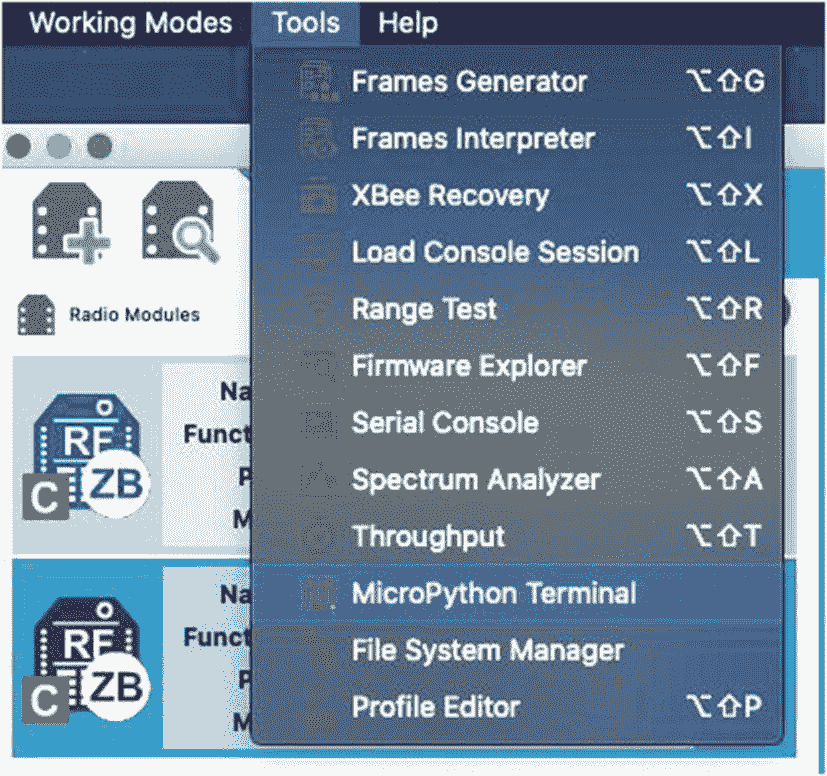

图 4-4

开放式 MicroPython 终端

一旦 *MicroPython 终端*打开，按*回车*几次得到响应。你应该看到提示 *> > >* 。如果您正在重用以前项目中的 XBee 模块，该项目加载了一个 MicroPython 脚本，其中通过复制文件或使用 REPL 控制台的交互模式覆盖了`main.py`脚本，您可能需要按 *Ctrl+C* 来停止 main.py 脚本。

接下来，我们将输入清单 [4-1](#PC4) 中所示的代码。您可以下载这本书的源代码，打开名为`listing4-1.py`的示例文件，在交互式文件模式下复制并粘贴一次代码。如果你愿意，可以省略注释行。还记得您必须按下 *Ctrl+C* 来中断您之前加载的 MicroPython 脚本。然后，您可以使用 *Ctrl+F* 将终端置于文件模式。

```py
#
# Beginning Sensor Networks 2nd Edition
#
# XBee Sensor Node Example: Reading a TMP36 temperature sensor.
#
# Dr. Charles Bell
#
from machine import ADC
from time import sleep
import xbee

# Target address to send data
TARGET_64BIT_ADDR = b'\x00\x13\xA2\x00\x40\x8C\xCD\x0F'
wait_time = 15 # seconds between measurements
cycles = 10 # number of repeats

for x in range(cycles):
    # Read temperature value & print to debug
    temp_pin = ADC("D3")
    temp_raw = temp_pin.read()
    print("Raw pin reading: %d" % temp_raw)

    # Convert temperature to proper units
    temp_c = ((float(temp_raw) * (1200.0/4096.0)) - 500.0) / 10.0
    print("Temperature: %.2f Celsius" % temp_c)
    temp_f = (temp_c * 9.0 / 5.0) + 32.0
    print("Temperature: %.2f Fahrenheit" % temp_f)

    # Send data to coordinator

    message = "raw: %d, C: %.2f, F: %.2f" % (temp_raw, temp_c, temp_f)
    print("Sending: %s" % message)
    try:
        xbee.transmit(TARGET_64BIT_ADDR, message)
        print("Data sent successfully")
    except Exception as e:
        print("Transmit failure: %s" % str(e))

    # Wait between cycles
    sleep(wait_time)

Listing 4-1Reading a TMP36 Sensor

```

清单 [4-2](#PC5) 显示了复制和粘贴前面代码的交互会话(没有注释)。注意在最后，我们用 *Ctrl+D* 将文件保存到 main.py，按 *Y* 确认。

Tip

如果在复制和粘贴整个文件时遇到问题，请尝试一次复制和粘贴一行。如果忽略空行，就会发生这种情况，空行会触发 REPL 控制台关闭代码块并执行代码。

```py
flash compile mode; Ctrl-C to cancel, Ctrl-D to finish
   1^^^ from machine import ADC
   2^^^ from time import sleep
   3^^^ import xbee
   4^^^
   5^^^ # Target address to send data
   6^^^ TARGET_64BIT_ADDR = b'\x00\x13\xA2\x00\x40\x8C\xCD\x0F'
   7^^^ wait_time = 15 # seconds between measurements
   8^^^ cycles = 10 # number of repeats
   9^^^
  10^^^ for x in range(cycles):
  11^^^     # Read temperature value & print to debug
  12^^^     temp_pin = ADC("D3")
  13^^^     temp_raw = temp_pin.read()
  14^^^     print("Raw pin reading: %d" % temp_raw)
  15^^^
  16^^^     # Convert temperature to proper units
  17^^^     temp_c = ((float(temp_raw) * (1200.0/4096.0)) - 500.0) / 10.0
  18^^^     print("Temperature: %.2f Celsius" % temp_c)
  19^^^     temp_f = (temp_c * 9.0 / 5.0) + 32.0
  20^^^     print("Temperature: %.2f Fahrenheit" % temp_f)
  21^^^
  22^^^     # Send data to coordinator
  23^^^     message = "raw: %d, C: %.2f, F: %.2f" % (temp_raw, temp_c, temp_f)
  24^^^     print("Sending: %s" % message)
  25^^^     try:
  26^^^         xbee.transmit(TARGET_64BIT_ADDR, message)
  27^^^         print("Data sent successfully")
  28^^^     except Exception as e:
  29^^^         print("Transmit failure: %s" % str(e))
  30^^^
  31^^^     # Wait between cycles

  32^^^     sleep(wait_time)
  33^^^
Erasing /flash/main.mpy...
Compiling 1008 bytes of code...
Saved compiled code to /flash/main.mpy (619 bytes).
Automatically run this code at startup [Y/n]? Y
Stored code will run at startup.

Listing 4-2Interactive File Mode for TMP36 Sensor Example

```

一旦你保存了文件，我们可以通过按下 *Ctrl+R* 来运行文件，如清单 [4-3](#PC6) 所示。但是，请记住，我们使用的是 REPL 控制台，它将以交互方式执行代码。因为我们还没有连接 TMP36 传感器，所以当代码执行时，您可能会看到虚假值。让它运行几次迭代，然后按下 *Ctrl+C* 停止执行。

```py
MicroPython v1.11-1290-g9da1b0c on 2019-11-14; XBee3 Zigbee with EFR32MG
Type "help()" for more information.
Press CTRL-R in the REPL to run the code at any time.

Try running it with CTRL+R. Interrupt with CTRL+C.

Loading /flash/main.mpy...
Running bytecode...
Raw pin reading: 4095
Temperature: 69.97 Celsius
Temperature: 157.95 Fahrenheit
Sending: raw: 4095, C: 69.97, F: 157.95
Data sent successfully
Raw pin reading: 4095
Temperature: 69.97 Celsius
Temperature: 157.95 Fahrenheit
Sending: raw: 4095, C: 69.97, F: 157.95
Data sent successfully
Raw pin reading: 4095
Temperature: 69.97 Celsius
Temperature: 157.95 Fahrenheit
Sending: raw: 4095, C: 69.97, F: 157.95
Data sent successfully
Traceback (most recent call last):
  File "<stdin>", line 32, in <module>
KeyboardInterrupt:

>>>

Listing 4-3Interactive Execution of TMP36 Example

```

现在，让我们回到代码上，注意从原始输入计算摄氏温度值的公式，为了清楚起见，如下所示。您可能会注意到，公式使用了不同的最大读取值(4096 而不是 1024)。这是因为 MicroPython 从 ADC 返回 0–4095 的范围，因此我们必须在公式中考虑这一点。

```py
    temp_raw = temp_pin.read()
    print("Raw pin reading: %d" % temp_raw)

    # Convert temperature to proper units
    temp_c = ((float(temp_raw) * (1200.0/4096.0)) - 500.0) / 10.0

```

一旦你确信这个公式是正确的，你可以关闭 *MicroPython 终端*，断开 XBee 与 XCTU 的连接，并移除 USB explorer。接下来，将 XBee 模块移至之前设置的试验板。

您不需要接通电路电源，但是如果您已经配置了协调器或者正在使用上一个示例中的，您可以跳过以下部分接通电路电源。

#### 设置协调员

接下来，移除 XBee 传感器节点，并将其插入试验板上的 explorer。如果您正在重用上一节中的协调器，那么您不需要进行更改。如果您正在使用新的 XBee 模块或来自另一个项目的模块，请确保您已经加载了协调器固件，并使用表 [4-5](#Tab5) 中的设置。

表 4-5

XBee 协调器选项和值

<colgroup><col class="tcol1 align-left"> <col class="tcol2 align-left"> <col class="tcol3 align-left"> <col class="tcol4 align-left"></colgroup> 
| 

密码

 | 

设置名称

 | 

描述

 | 

价值

 |
| --- | --- | --- | --- |
| 身份 | 平移 ID | 网络的 Id | Eight thousand and eighty-eight |
| 镍 | 节点标识符 | 节点的名称 | 协调者 |

一旦写入设置并且传感器节点通电，请查看网络以确保您的模块正在连接。图 [4-5](#Fig5) 显示了您应该看到的示例。回想一下，你可以选择协调人，从主窗口打开网络视图，然后点击*扫描*。

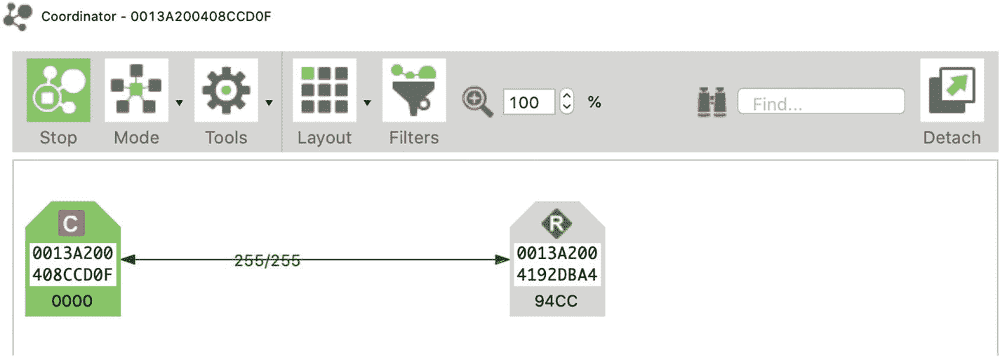

图 4-5

检查网络

Tip

检查您的 ZigBee 网络以确保模块连接正确总是一个好主意。如果您没有看到预期的模块，请仔细检查所有设置并重新扫描网络。

现在我们准备测试我们的传感器节点。

#### 测试 XBee 传感器节点

要测试 XBee 传感器节点，您需要使用 XBee 协调器，API 固件安装在连接到 PC 的 USB 适配器上。首先这样做，以便协调器可以在您启动 XBee 传感器节点时启动并运行。将其插入您的电脑，并打开 XCTU 应用程序。使用 XCTU 发现 XBee 模块，然后打开一个终端。参见第 [2](02.html) 章了解如何操作的说明。

接下来，将电源连接到 XBee 传感器节点。XBee 需要一些时间来连接到协调器并加入网络。一旦完成，您就会看到协调器正在接收数据，如图 [4-6](#Fig6) 所示。


图 4-6

串行监视器输出

您应该会看到一个或多个*显式接收指示器*数据包。我们得到这个包而不是广播，因为我们通过地址将包直接传输给协调器。注意图像中第一行以`7E`(十六进制)开始。这是包的起始定界符。您应该看到如下所示的正确数据。这是一系列十六进制值。

```py
7E 00 2F 91 00 13 A2 00 41 92 DB A4 94 CC E8 E8 00 11 C1 05 01 72 61 77 3A 20 32 32 37 30 2C 20 43 3A 20 31 36 2E 35 30 2C 20 46 3A 20 36 31 2E 37 31 24

```

你可能想知道我们把信息传送到了哪里。它就在那里，但是很难在十六进制输出中看到。它出现在邮件的末尾。下面显示了示例中的消息。

```py
72 61 77 3A 20 32 32 37 30 2C 20 43 3A 20 31 36 2E 35 30 2C 20 46 3A 20 36 31 2E 37 31

```

如果您将十六进制值转换为美国信息交换标准码(ASCII)， <sup>[3](#Fn3)</sup> 您将看到消息。使用 ASCII 图表进行的有些繁琐的查找将揭示以下 29 个十六进制值以 ASCII 表示，如下所示。很漂亮，是吗？

```py
raw: 2270, C: 16.50, F: 61.71

```

现在，让我们仔细看看这个包。所有 ZigBee 分组都有特定的格式或布局。表 [4-6](#Tab6) 显示了*显式接收指示器*数据包的布局。

表 4-6

显式 Rx 指示符包

<colgroup><col class="tcol1 align-left"> <col class="tcol2 align-left"> <col class="tcol3 align-left"></colgroup> 
| 

价值

 | 

字段名

 | 

笔记

 |
| --- | --- | --- |
| `7E` | 开始分隔符 |   |
| `00 2F` | 包长度 | 47 字节校验和 |
| `91` | 框架类型 | 显式 Rx 指示器 |
| `00 13 A2 00 41 92 DB A4` | 64 位地址 | XBee 传感器节点的地址 |
| `94 CC` | 16 位地址 |   |
| `E8` | 源端点 |   |
| `E8` | 目的端点 |   |
| `00 11` | 集群 Id |   |
| `C1 05` | 个人资料 Id |   |
| `01` | 接收选项 | 0x 01—数据包已确认 |
| `0A BC` | 电源电压 |   |
| `N bytes` | 接收日期 | 示例:29 |
| `N+1 byte` | 校验和 | 例如:0x24 |

该数据包代表从 XBee 传感器节点发送的数据。在这种情况下，您设置 XBee 在 10 个周期内每隔 15 秒从模拟引脚 3(数字 IO 3)发送任何值。 <sup>[4](#Fn4)</sup>

花一些时间研究示例中的其他样本，并检查温度读数的数据样本。如果您非常小心，可以将手指放在 TMP36 上，观察温度变化(再进行一两次采样后，温度应该会开始升高)。一旦您确信 XBee 传感器节点正在发送类似的数据，您就可以断定传感器节点工作正常。

接下来，我们将看看这个项目的一个例子，它使用了一种不同形式的传感器，简单一些。

## 示例:使用 XBee 模块收集数据

在这个例子中，我们将通过切换到一个更简单(但稍微贵一点)的选项来将传感器连接到 XBee 模块，从而稍微提升一下配置。我们还将看到与不同接口通信的不同形式的传感器。

我们将使用 XBee Grove 开发板来托管我们的 XBee 模块，如图 [4-7](#Fig7) 所示。XBee Grove 开发板有几个连接器以及六个 Grove 连接器、用户*可控*按钮和 LED 等等。有关主板的完整信息，请参见 [`www.digi.com/resources/documentation/Digidocs/90001457-13/`](http://www.digi.com/resources/documentation/Digidocs/90001457-13/) 中的指南。

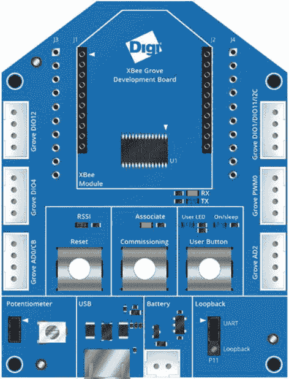

图 4-7

XBee Grove 开发委员会

Grove 是 Seeed Studio(seeedstudio.com)制定的硬件原型标准，旨在使用简单的四线连接简化设备连接。您可以找到各种传感器和输出组件来快速创建您的项目。参见 Seeed Studio wiki 关于格罗夫系统了解更多( [`http://wiki.seeedstudio.com/Grove_System/`](http://wiki.seeedstudio.com/Grove_System/) )。

我们将使用的传感器是 BMP280 温度/湿度传感器。你可以在 Adafruit ( `adafruit.com`)或者 SparkFun ( `sparkfun.com`)找到这个传感器。图 [4-8](#Fig8) 显示了 Adafruit 的 BMP280 模块。你可以在 [`www.adafruit.com/product/2651`](http://www.adafruit.com/product/2651) 这里得到一个。BMP280 有一个 Grove 模块( [`http://wiki.seeedstudio.com/Grove-Barometer_Sensor-BMP280/`](http://wiki.seeedstudio.com/Grove-Barometer_Sensor-BMP280/) )，但是因为是比较老的模块，所以比较难找。

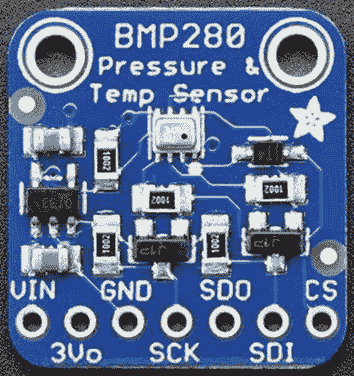

图 4-8

BMP280 分线板

该传感器使用集成电路间(I2C)接口 <sup>[5](#Fn5)</sup> ，7 位寻址。这需要四个连接:电源、地、时钟(SCL)和数据(SDA)。因为您可以将多个传感器连接到同一个 I2C 总线，所以每个传感器都有自己的地址，这样您就可以与您想要的传感器“交谈”。不幸的是，每个 I2C 传感器(设备)都有自己的通信协议，因此与模块通信以获取数据需要一个特殊的库(称为驱动程序)来使用传感器。幸运的是，BMP280 有一个 MicroPython I2C 驱动程序。我们将下载它并复制到我们的 XBee 模块。然而，由于它是针对与 XBee MicroPython 稍有不同的 MicroPython 版本编写的，我们需要做一些小的改动。

虽然这个例子很简洁，并且显示了使它工作所需的最低限度，但是我们将在接下来的两章中学习更多关于 I2C 接口的内容。

让我们从配置 XBee 传感器节点的硬件开始。

### 硬件设置

为这个项目设置硬件比前面的例子更容易。您所需要的只是一根 Grove 到母跳线电缆或(4)母到母跳线、XBee Grove 开发板和 BMP280 模块。如果您的 BMP280 模块没有焊接接头，您可能需要自己焊接或找人为您焊接。

为了将传感器连接到电路板，我们将只使用 BMP280 上的四个连接。Adafruit 的模块支持 I2C 和 x (SPI)接口，所以我们只需要那些用于 I2C 的接口。这些在板上标记如下:3V0 (3V 电源)、GND(地)、SDK(开发板上的 SCL)和 SDI(开发板上的 SDA)。我们可以将 Grove PWM 连接器用于电源和接地，但必须将 Grove D10 连接器用于 I2C 接口。进行连接的几种选择如下所示。现在就开始连接吧。此时不要插入 XBee 模块或将主板连接到您的 PC。

#### 带跳线的 BMP280

如果您想使用单独的跳线，您应该使用两个 Grove 连接器:第一个用于 SCL 和 SDA 连接，另一个用于电源。这是因为跳线略大于 Grove 连接器中的引脚。

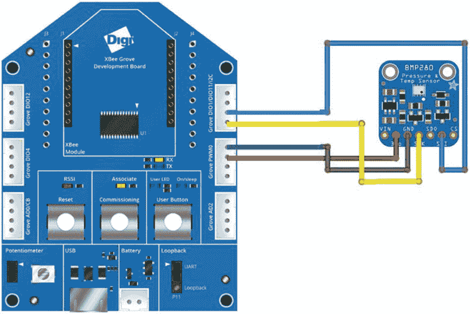

图 4-9

使用跳线连接 BMP280 分线板

#### 带 Grove 分支电缆的 BMP280

Seeed Studio 的 Grove 分支电缆是跳线的绝佳替代品。它们的一端有一个 Grove 连接器，另一端有每根电线的母连接器，非常适合连接到分线板，如本例中的 BMP280。详见 [`www.seeedstudio.com/Grove-4-pin-Female-Jumper-to-Grove-4-pin-Conversion-Cable-5-PCs-per-Pack.html`](http://www.seeedstudio.com/Grove-4-pin-Female-Jumper-to-Grove-4-pin-Conversion-Cable-5-PCs-per-Pack.html) 。像 Grove BMP280 模块一样，这些电缆更难找到。他们还搞了一个小树林给公电缆。`www.seeedstudio.com/Grove-4-pin-Male-Jumper-to-Grove-4-pin-Conversion-Cable-5-PCs-per-Pack.html`见。

图 [4-10](#Fig10) 显示了如何使用凹槽连接跳线电缆。

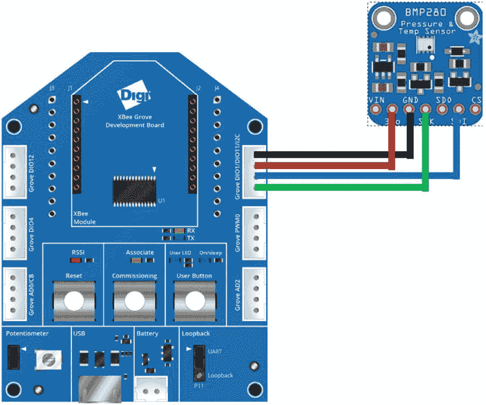

图 4-10

使用 Grove 连接 BMP280 分线板至跳线电缆

#### Grove BMP280 模块连接

如果您购买了 BMP280 Grove 模块，您只需使用 Grove 电缆将模块连接到电路板，如图 [4-11](#Fig11) 所示。

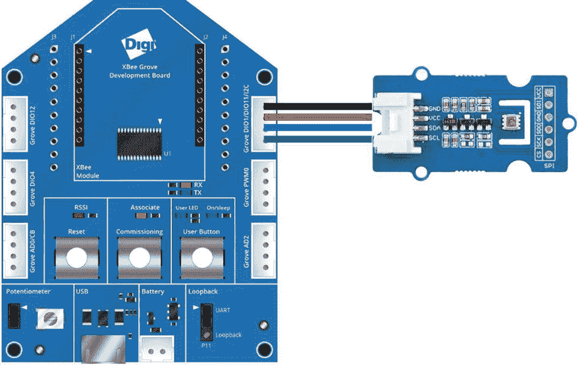

图 4-11

连接 BMP280 Grove 模块

接下来，让我们配置 XBee 传感器节点。

### 配置 XBee 传感器节点

用作 XBee 传感器节点的 XBee 模块可以是终端设备，也可以是路由器，其 API 固件配置为运行 MicroPython。再次使用 XCTU 应用程序连接到 XBee。在这种情况下，我们将使用 XBee Grove 开发板。

只需将 XBee 模块连接到主板，然后使用随附的 micro-USB 电缆将主板连接到 PC。这就像我们在其他项目中使用的 USB explorer 一样。如果您正在重用我们之前用作传感器节点的 XBee 模块，除了数字 IO 引脚设置(`D1`)之外，许多设置将保持不变。

表 [4-7](#Tab7) 显示了您需要更改的设置。回想一下，所有值都是以十六进制输入的，您可以通过搜索代码来更改 XCTU 中的值，然后选择一个值或将其键入该设置的文本框中。如图所示更改设置，然后点击*写入*将设置保存到 XBee 模块。

表 4-7

XBee 传感器节点选项和值

<colgroup><col class="tcol1 align-left"> <col class="tcol2 align-left"> <col class="tcol3 align-left"> <col class="tcol4 align-left"></colgroup> 
| 

密码

 | 

设置名称

 | 

描述

 | 

价值

 |
| --- | --- | --- | --- |
| 美国联合通讯社(Associated Press) | API 已启用 | 设置 API 模式 | 4—MicroPython |
| 神学士 | UART 波特率 | 串行连接的速度 | One hundred and fifteen thousand two hundred |
| 这一个 | 设备角色 | ZigBee 网络中的角色 | 0-加入网络 |
| D1 | DIO1 | 数字数据读/写 | 6–I2C SCL |
| 身份 | 平移 ID | 网络的 Id | Eight thousand and eighty-eight |
| 镍 | 节点标识符 | 节点的名称 | Python BMP280 |
| 附言（同 postscript）；警官（police sergeant） | MicroPython 自动启动 | 自动启动 REPL | 1—启用 |

### 传感器节点编程

继续对传感器节点进行配置更改，然后将其写入(保存)到模块中。回想一下第 2 章中的内容，我们可以交互地编写我们的 MicroPython 脚本，然后将其保存到一个文件中，或者将其写入一个文件，然后上传到模块中。在本例中，我们将看到文件拷贝模式。

在这种情况下，我们需要将 BMP280 I2C 库复制到 XBee 模块上的`lib`文件夹中，并将我们的 MicroPython 脚本复制到 XBee 模块中，并将其重命名为`main.py`。与其盲目地复制文件来进入项目，不如让我们学习如何使用 BMP280 库来使用定制的 MicroPython 库。

当您想使用 I2C 传感器或设备时，您需要有一个 MicroPython 驱动程序库。回想一下，这是因为每个器件都有自己的协议，要求将某些值写入特定的一个或多个字节，以触发或设置某些选项，然后使用另一个地址读取数据。听起来很复杂？可以的。幸运的是，有人替我们做了所有的工作。

使用浏览器并导航至 [`https://github.com/dafvid/micropython-bmp280/`](https://github.com/dafvid/micropython-bmp280/) 。这个库是由 David Wahlund 编写的，是如何用 MicroPython 编写 I2C 驱动程序的一个很好的例子。如果您想为另一个 I2C 设备编写自己的驱动程序，这段代码是一个很好的模板。

要下载驱动程序，请单击*克隆或下载*按钮，并将 Zip 文件保存到您的 PC。下载完成后，打开 Zip 库并解压文件。你需要找到`bmp280.py`文件。在我们修改这个文件之后，我们将把它复制到我们的 XBee 模块中。

Tip

该模块的修改版本可以从 Apress 网站上的该书的源代码下载中获得。

简而言之，我们必须添加一个新的导入，并在构造函数中注释掉几行。这些修改将允许代码在 XBee 模块上工作。我们还需要删除模块中的一些方法，因为代码对于 XBee 来说有点太大了。

Caution

如果您发现想要在 XBee 上使用的其他模块并遇到内存错误，您可能需要减小该模块的大小。您可以通过移除不需要的方法、常量和类似的特性来实现这一点。注意只移除你不需要的东西(也是剩下的方法不需要的)。

打开下载的文件，在文件顶部添加这一行:

```py
from micropython import const

```

接下来，找到下面的行，并对它们进行注释(在行首放置一个`#`)。你可以在构造函数中找到这两者。如果忘记删除这些行，您可能会遇到诸如无效 I2C 操作或内存错误之类的错误:

```py
self._bmp_i2c.start()
self.use_case(BMP280_CASE_HANDHELD_DYN)

```

最后，为了减小模块的大小，删除 pressure()方法之后的所有方法，然后保存文件。清单 [4-4](#PC13) 显示了结果代码。您的编辑应该非常相似(考虑到模块作者的微小改进)。

Tip

这本书的源代码中还包括一个差异文件(`bmp280.diff`)，如果你熟悉*差异*和*补丁*，你可以用它来应用代码。

```py
from micropython import const
from ustruct import unpack as unp

# Author David Stenwall Wahlund (david at dafnet.se)

# Power Modes
BMP280_POWER_FORCED = const(1)
BMP280_POWER_NORMAL = const(3)

BMP280_SPI3W_ON = const(1)
BMP280_SPI3W_OFF = const(0)

BMP280_TEMP_OS_SKIP = const(0)
BMP280_TEMP_OS_1 = const(1)
BMP280_TEMP_OS_2 = const(2)
BMP280_TEMP_OS_4 = const(3)
BMP280_TEMP_OS_8 = const(4)
BMP280_TEMP_OS_16 = const(5)

BMP280_PRES_OS_SKIP = const(0)
BMP280_PRES_OS_1 = const(1)
BMP280_PRES_OS_2 = const(2)
BMP280_PRES_OS_4 = const(3)
BMP280_PRES_OS_8 = const(4)
BMP280_PRES_OS_16 = const(5)

# Standby settings in ms
BMP280_STANDBY_0_5 = const(0)
BMP280_STANDBY_62_5 = const(1)
BMP280_STANDBY_125 = const(2)
BMP280_STANDBY_250 = const(3)
BMP280_STANDBY_500 = const(4)

BMP280_STANDBY_1000 = const(5)
BMP280_STANDBY_2000 = const(6)
BMP280_STANDBY_4000 = const(7)

# IIR Filter setting
BMP280_IIR_FILTER_OFF = const(0)
BMP280_IIR_FILTER_2 = const(1)
BMP280_IIR_FILTER_4 = const(2)
BMP280_IIR_FILTER_8 = const(3)
BMP280_IIR_FILTER_16 = const(4)

# Oversampling setting
BMP280_OS_ULTRALOW = const(0)
BMP280_OS_LOW = const(1)
BMP280_OS_STANDARD = const(2)
BMP280_OS_HIGH = const(3)
BMP280_OS_ULTRAHIGH = const(4)

# Oversampling matrix

# (PRESS_OS, TEMP_OS, sample time in ms)
_BMP280_OS_MATRIX = [
    [BMP280_PRES_OS_1, BMP280_TEMP_OS_1, 7],
    [BMP280_PRES_OS_2, BMP280_TEMP_OS_1, 9],
    [BMP280_PRES_OS_4, BMP280_TEMP_OS_1, 14],
    [BMP280_PRES_OS_8, BMP280_TEMP_OS_1, 23],
    [BMP280_PRES_OS_16, BMP280_TEMP_OS_2, 44]
]

# Use cases
BMP280_CASE_HANDHELD_LOW = const(0)
BMP280_CASE_HANDHELD_DYN = const(1)
BMP280_CASE_WEATHER = const(2)
BMP280_CASE_FLOOR = const(3)
BMP280_CASE_DROP = const(4)
BMP280_CASE_INDOOR = const(5)

_BMP280_CASE_MATRIX = [
    [BMP280_POWER_NORMAL, BMP280_OS_ULTRAHIGH, BMP280_IIR_FILTER_4, BMP280_STANDBY_62_5],
    [BMP280_POWER_NORMAL, BMP280_OS_STANDARD, BMP280_IIR_FILTER_16, BMP280_STANDBY_0_5],
    [BMP280_POWER_FORCED, BMP280_OS_ULTRALOW, BMP280_IIR_FILTER_OFF, BMP280_STANDBY_0_5],
    [BMP280_POWER_NORMAL, BMP280_OS_STANDARD, BMP280_IIR_FILTER_4, BMP280_STANDBY_125],
    [BMP280_POWER_NORMAL, BMP280_OS_LOW, BMP280_IIR_FILTER_OFF, BMP280_STANDBY_0_5],
    [BMP280_POWER_NORMAL, BMP280_OS_ULTRAHIGH, BMP280_IIR_FILTER_16, BMP280_STANDBY_0_5]
]

_BMP280_REGISTER_ID = const(0xD0)
_BMP280_REGISTER_RESET = const(0xE0)
_BMP280_REGISTER_STATUS = const(0xF3)
_BMP280_REGISTER_CONTROL = const(0xF4)
_BMP280_REGISTER_CONFIG = const(0xF5)  # IIR filter config

_BMP280_REGISTER_DATA = const(0xF7)

class BMP280:
    def __init__(self, i2c_bus, addr=0x76):
        self._bmp_i2c = i2c_bus
        self._i2c_addr = addr

        self.chip_id = self._read(_BMP280_REGISTER_ID, 2)

        # read calibration data
        # < little-endian
        # H unsigned short
        # h signed short
        self._T1 = unp('<H', self._read(0x88, 2))[0]
        self._T2 = unp('<h', self._read(0x8A, 2))[0]
        self._T3 = unp('<h', self._read(0x8C, 2))[0]
        self._P1 = unp('<H', self._read(0x8E, 2))[0]
        self._P2 = unp('<h', self._read(0x90, 2))[0]
        self._P3 = unp('<h', self._read(0x92, 2))[0]
        self._P4 = unp('<h', self._read(0x94, 2))[0]
        self._P5 = unp('<h', self._read(0x96, 2))[0]
        self._P6 = unp('<h', self._read(0x98, 2))[0]
        self._P7 = unp('<h', self._read(0x9A, 2))[0]
        self._P8 = unp('<h', self._read(0x9C, 2))[0]
        self._P9 = unp('<h', self._read(0x9E, 2))[0]

        # output raw
        self._t_raw = 0
        self._t_fine = 0
        self._t = 0

        self._p_raw = 0
        self._p = 0

        self.read_wait_ms = 0  # interval between forced measure

and readout
        self._new_read_ms = 200  # interval between
        self._last_read_ts = 0

    def _read(self, addr, size=1):
        return self._bmp_i2c.readfrom_mem(self._i2c_addr, addr, size)

    def _write(self, addr, b_arr):
        if not type(b_arr) is bytearray:
            b_arr = bytearray([b_arr])
        return self._bmp_i2c.writeto_mem(self._i2c_addr, addr, b_arr)

    def _gauge(self):
        # TODO limit new reads
        # read all data at once (as by spec)
        d = self._read(_BMP280_REGISTER_DATA, 6)

        self._p_raw = (d[0] << 12) + (d[1] << 4) + (d[2] >> 4)
        self._t_raw = (d[3] << 12) + (d[4] << 4) + (d[5] >> 4)

        self._t_fine = 0
        self._t = 0
        self._p = 0

    def reset(self):
        self._write(_BMP280_REGISTER_RESET, 0xB6)

    def load_test_calibration(self):
        self._T1 = 27504
        self._T2 = 26435
        self._T3 = -1000
        self._P1 = 36477
        self._P2 = -10685
        self._P3 = 3024
        self._P4 = 2855
        self._P5 = 140
        self._P6 = -7
        self._P7 = 15500
        self._P8 = -14600

        self._P9 = 6000

    def load_test_data(self):
        self._t_raw = 519888
        self._p_raw = 415148

    def print_calibration(self):
        print("T1: {} {}".format(self._T1, type(self._T1)))
        print("T2: {} {}".format(self._T2, type(self._T2)))
        print("T3: {} {}".format(self._T3, type(self._T3)))
        print("P1: {} {}".format(self._P1, type(self._P1)))
        print("P2: {} {}".format(self._P2, type(self._P2)))
        print("P3: {} {}".format(self._P3, type(self._P3)))
        print("P4: {} {}".format(self._P4, type(self._P4)))
        print("P5: {} {}".format(self._P5, type(self._P5)))
        print("P6: {} {}".format(self._P6, type(self._P6)))
        print("P7: {} {}".format(self._P7, type(self._P7)))
        print("P8: {} {}".format(self._P8, type(self._P8)))
        print("P9: {} {}".format(self._P9, type(self._P9)))

    def _calc_t_fine(self):
        # From datasheet page 22
        self._gauge()
        if self._t_fine == 0:
            var1 = (((self._t_raw >> 3) - (self._T1 << 1)) * self._T2) >> 11
            var2 = (((((self._t_raw >> 4) - self._T1)
                      * ((self._t_raw >> 4)
                         - self._T1)) >> 12)
                    * self._T3) >> 14
            self._t_fine = var1 + var2

    @property
    def temperature(self):
        self._calc_t_fine()
        if self._t == 0:
            self._t = ((self._t_fine * 5 + 128) >> 8) / 100.
        return self._t

    @property
    def pressure(self):
        # From datasheet page 22

        self._calc_t_fine()
        if self._p == 0:
            var1 = self._t_fine - 128000
            var2 = var1 * var1 * self._P6
            var2 = var2 + ((var1 * self._P5) << 17)
            var2 = var2 + (self._P4 << 35)
            var1 = ((var1 * var1 * self._P3) >> 8) + ((var1 * self._P2) << 12)
            var1 = (((1 << 47) + var1) * self._P1) >> 33

            if var1 == 0:
                return 0

            p = 1048576 - self._p_raw
            p = int((((p << 31) - var2) * 3125) / var1)
            var1 = (self._P9 * (p >> 13) * (p >> 13)) >> 25
            var2 = (self._P8 * p) >> 19

            p = ((p + var1 + var2) >> 8) + (self._P7 << 4)
            self._p = p / 256.0
        return self._p

Listing 4-4Modified bmp280.py Module

```

要将修改后的文件复制到我们的 XBee 模块，使用 Grove 开发板将您的 XBee 连接到您的 PC，然后使用*工具*菜单打开*文件系统管理器*，如图 [4-12](#Fig12) 所示。


图 4-12

打开文件系统管理器

一旦*文件系统管理器*打开，您将需要连接到 XBee。如果您在打开*文件系统管理器*之前选择了 XCTU 中的 XBee 模块，您可以点击*打开*按钮，管理器将连接到您的模块。否则，您可以使用*设置*按钮为 XBee 选择 UART(串行)参数，然后连接到它。

使用管理器在界面左侧找到`bmp280.py`文件，在界面右侧导航到 XBee 上的`lib`文件夹。然后，点击`bmp280.py`并将其拖至右侧并放下。这将把文件复制到您的 XBee 模块。结果应该类似于图 [4-13](#Fig13) 。

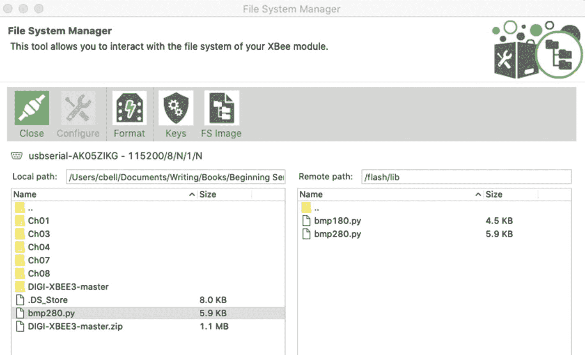

图 4-13

使用文件系统管理器复制 BMP 驱动程序

现在，让我们使用一个简单的脚本来测试这个库。我们将在交互模式下使用 MicroPython 终端来实现这一点。但是首先点击左上角的*关闭*按钮，然后点击右下角的*关闭*按钮关闭管理器。

接下来，从*工具*菜单打开 *MicroPython 终端*，然后连接到你的 XBee 模块。回想一下，你可能需要按*回车*或者 *Ctrl+C* 才能得到`>>>`提示。在那里，输入以下代码行:

```py
from machine import I2C
from bmp280 import BMP280
bmp280 = BMP280(I2C(1, freq=100000), 0x77)
print(bmp280.temperature)
print(bmp280.pressure)

```

此代码显示了如何使用 I2C BMP280 驱动程序，告诉驱动程序传感器位于 DIO 1 上，并使用采样频率 100，000 和 I2C 地址 0x77(十六进制)。然后，我们读取温度，打印出来，并重复气压。以下代码显示了您应该看到的结果(值可能会有所不同):

```py
>>> from machine import I2C
>>> from bmp280 import BMP280
>>> bmp280 = BMP280(I2C(1, freq=100000), 0x77)
>>> print(bmp280.temperature)
21.71
>>> print(bmp280.pressure)
102357.4
>>>

```

如果您遇到诸如地址或`NOENV`错误之类的错误，请仔细检查您的接线。有时候跳线会有点松。将它们压接在开发板侧，连接应该会改善。

现在我们已经复制并测试了 BMP 驱动程序，我们可以编写读取传感器的脚本了。清单 [4-5](#PC16) 显示了完整的代码。它应该看起来非常熟悉，因为它遵循与前面的示例相同的模板。花点时间检查一下代码，看看它是如何工作的。

```py
#
# Beginning Sensor Networks 2nd Edition
#
# XBee Sensor Node Example: Reading a BMP280 sensor.
# This demonstrates how to use an I2C driver.
#
# Dr. Charles Bell
#
from machine import I2C
from bmp280 import BMP280

import xbee

# BMP280 address
BMP_ADDR = 0x77
# Target address to send data
TARGET_64BIT_ADDR = b'\x00\x13\xA2\x00\x40\x8C\xCD\x0F'
wait_time = 15 # seconds between measurements
cycles = 10 # number of repeats
bmp280 = BMP280(I2C(1, freq=100000), BMP_ADDR)

for x in range(cycles):
    # Read temperature & barometric pressure
    temp_c = bmp280.temperature
    pressure = bmp280.pressure

    # Convert temperature to proper units

    print("Temperature: %.2f Celsius" % temp_c)
    temp_f = (temp_c * 9.0 / 5.0) + 32.0
    print("Temperature: %.2f Fahrenheit" % temp_f)
    print("Barometric Pressure: %.4f" % pressure)

    # Send data to coordinator
    message = "C: %.2f, F: %.2f, B: %.4f" % (temp_c, temp_f, pressure)
    print("Sending: %s" % message)
    try:
        xbee.transmit(TARGET_64BIT_ADDR, message)
        print("Data sent successfully")
    except Exception as e:
        print("Transmit failure: %s" % str(e))

    # Wait between cycles
    sleep(wait_time)

Listing 4-5Reading a BMP280 Sensor

```

如果您已经从 Apress book 网站下载了示例代码，您可以提取该文件并将其复制到您的 PC 上。将其重命名为 main.py，然后像前面一样使用*文件系统管理器*将其复制到 XBee 中。务必将其复制到 XBee 上的根文件夹中，如图 [4-14](#Fig14) 所示。

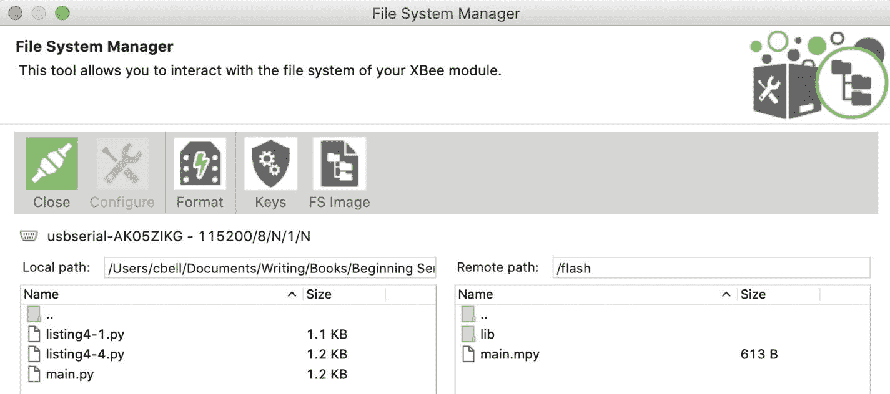

图 4-14

使用文件系统管理器复制 main.py

现在我们准备测试我们的传感器节点。

### 测试 XBee 传感器节点

要测试 XBee 传感器节点，您需要使用 XBee 协调器，API 固件安装在连接到 PC 的 USB 适配器上。首先这样做，以便协调器可以在您启动 XBee 传感器节点时启动并运行。将其插入您的电脑，并打开 XCTU 应用程序。使用 XCTU 发现 XBee 模块，然后打开一个终端。参见第 [2](02.html) 章了解如何操作的说明。

接下来，将电源连接到 XBee 传感器节点。XBee 需要一些时间来连接到协调器并加入网络。一旦完成，您就会看到协调器正在接收数据，如图 [4-15](#Fig15) 所示。


图 4-15

串行监视器输出

您应该看到一个或多个*接收包*包。我们得到这个包而不是广播，因为我们通过地址将包直接传输给协调器。注意图像中第一行以`7E`(十六进制)开始。这是包的起始定界符。您应该看到如下所示的正确数据。这是一系列十六进制值。

```py
7E 00 2E 90 00 13 A2 00 41 92 DB A4 94 CC 01 43 3A 20 31 39 2E 36 39 2C 20 46 3A 20 36 37 2E 34 34 2C 20 42 3A 20 31 30 32 33 37 38 2E 32 34 39 32 58

```

你可能想知道我们把信息传送到了哪里。它就在那里，但是很难在十六进制输出中看到。它出现在邮件的末尾。下面显示了示例中的消息:

```py
43 3A 20 31 39 2E 36 39 2C 20 46 3A 20 36 37 2E 34 34 2C 20 42 3A 20 31 30 32 33 37 38 2E 32 34 39 32

```

如果您将十六进制值转换为 ASCII，您将看到如下消息:

```py
C: 19.69, F: 61.44, B: 102378.2492

```

现在，让我们仔细看看这个包。所有 ZigBee 分组都有特定的格式或布局。表 [4-8](#Tab8) 显示了*接收包*的布局。

表 4-8

接收数据包数据包

<colgroup><col class="tcol1 align-left"> <col class="tcol2 align-left"> <col class="tcol3 align-left"></colgroup> 
| 

价值

 | 

字段名

 | 

笔记

 |
| --- | --- | --- |
| `7E` | 开始分隔符 |   |
| `00 2E` | 包长度 | 47 字节校验和 |
| `90` | 框架类型 | 接收数据包指示器 |
| `00 13 A2 00 41 92 DB A4` | 64 位地址 | XBee 传感器节点的地址 |
| `94 CC` | 内向的; 寡言少语的; 矜持的 |   |
| `01` | 选择 | 0x01 =数据包是广播数据包 |
| `N bytes` | 接收日期 | 示例:34 |
| `N+1 byte` | 校验和 | 例如:0x58 |

花一些时间研究示例中的其他样本，并检查温度读数的数据样本。如果你真的很小心，你可以把你的手指放在 BMP280 上，观察温度变化(它应该在一两个样本后开始增加)。一旦您确信 XBee 传感器节点正在发送类似的数据，您就可以断定传感器节点工作正常。

## 部件购物清单

你需要一些组件来完成本章中的项目。表 [4-9](#Tab9) 列出了它们。请注意，如果您不打算实现最后一个示例，可以考虑 Grove 组件。

表 4-9

所需组件

<colgroup><col class="tcol1 align-left"> <col class="tcol2 align-left"> <col class="tcol3 align-left"> <col class="tcol4 align-left"></colgroup> 
| 

项目

 | 

供应商

 | 

是吗？成本美元

 | 

所需数量

 |
| --- | --- | --- | --- |
| XBee-ZB (ZB)系列 2、2.5 或 3 | [T2`www.sparkfun.com`](http://www.sparkfun.com) | $25.00–48.00 | Two |
| [T2`www.adafruit.com`](http://www.adafruit.com) |
| BMP280 分线板 | [T2`www.adafruit.com/product/2651`](http://www.adafruit.com/product/2651) | $9.95–14.95 | one |
| [T2`www.sparkfun.com/products/15440`](http://www.sparkfun.com/products/15440) |
| BMP280 Grove 传感器(可选) | [T2`www.seeedstudio.com/catalogsearch/result/?q=bmp280`](http://www.seeedstudio.com/catalogsearch/result/%253Fq%253Dbmp280) | $8.95 | one |
| Grove 至母跳线(可选) | [T2`www.seeedstudio.com/Grove-4-pin-Female-Jumper-to-Grove-4-pin-Conversion-Cable-5-PCs-per-PAck.html`](http://www.seeedstudio.com/Grove-4-pin-Female-Jumper-to-Grove-4-pin-Conversion-Cable-5-PCs-per-PAck.html) | $3.90 | one |
| XBee Grove 开发板(可选) | [T2`www.digikey.com/products/en?mpart=76000956&v=602`](http://www.digikey.com/products/en%253Fmpart%253D76000956%2526v%253D602) | $25.00 | one |
| 试验板(非迷你) | [T2`www.sparkfun.com/products/9567`](http://www.sparkfun.com/products/9567) | $4.95 | one |
| 试验板跳线 | [T2`www.sparkfun.com/products/8431`](http://www.sparkfun.com/products/8431) | $3.95 | one |
| XBee Explorer 由集管调节 | [T2`www.sparkfun.com/products/11373`](http://www.sparkfun.com/products/11373) | $10.95 | one |
| TMP36 传感器 | [T2`www.sparkfun.com/products/10988`](http://www.sparkfun.com/products/10988) | $1.50 | one |
| [T2`www.adafruit.com/products/165`](http://www.adafruit.com/products/165) |
| 0.10uF 电容 | [T2`www.sparkfun.com/products/8375`](http://www.sparkfun.com/products/8375) | $0.25 | one |

## 摘要

XBee 模块是一种将数据从一个设备无线传输到另一个设备的廉价方式。它们还可以以托管(连接)一个或多个传感器的形式用于收集数据。

我们可以配置 XBee 从传感器收集原始数据，并将其传输(广播)到网络中的其他节点，而无需编程。或者，我们可以使用健壮的 MicroPython 编程语言编写一个脚本来读取数据并对其进行格式化，或者在将数据发送到另一个节点之前执行计算。

在本章中，我们看到了两种形式的托管传感器的示例。我们学习了如何使用模拟温度传感器(TMP36)和 I2C 数字传感器(BMP280)将传感器连接到 XBee 模块。

我们还看到了 Seeed Studio 提供的 Grove 原型开发平台。Grove 消除了在试验板上构建电路的需要，使连接传感器变得更加容易。我们将在后面的章节中看到更多关于 Grove 传感器的内容。

在下一章中，我们将探索 Raspberry Pi，包括如何使用 Raspberry Pi 的简短教程以及如何托管传感器的示例项目。

<aside aria-label="Footnotes" class="FootnoteSection" epub:type="footnotes">Footnotes [1](#Fn1_source)

这些是基本方法。其他方法，包括使用 XBee 模块来控制其他设备也是可能的，但更先进，超出了本工作的范围。

  [2](#Fn2_source)

这是一个常见的新手错误:在没有测试单个组件的情况下，构建包括数据收集在内的整个传感器网络。最好的方法是在单独测试每个节点后分阶段构建网络(或者在尽可能小的配置中)。调试包含许多节点的网络比构建分阶段组装的网络要困难得多。

  [3](#Fn3_source)

[T2`https://en.wikipedia.org/wiki/ASCII`](https://en.wikipedia.org/wiki/ASCII)

  [4](#Fn4_source)

我们将它作为一个练习，对脚本进行模块化，以便不间断地(例如，连续地)发送读数。

  [5](#Fn5_source)

[T2`https://en.wikipedia.org/wiki/I%C2%B2C`](https://en.wikipedia.org/wiki/I%25C2%25B2C)

 </aside>