# 7.存储传感器数据的方法

如果你已经成功完成了本书中的项目，那么你已经有了几种形式的传感器和数据聚合节点。本质上，您已经具备了构建传感器网络来监控和记录温度数据的基本构建模块。为湿度或气压等其他环境传感器添加节点并不需要太多工作。事实上，您构建的基本传感器节点可以托管各种传感器。

如果您已经运行了示例项目并尝试了这些挑战，毫无疑问，您已经注意到生成了大量数据。你用这些数据做什么？它是仅在生成时有意义，还是您认为更有可能希望存储数据并在以后检查它？例如，如果你想知道你的车间全年每月的温度范围，逻辑上你需要一整年的数据 <sup>[1](#Fn1)</sup> 来制表和平均。

Arduino 主板一般没有内置存储设备(但一些专门的变体有)。Raspberry Pi 板配有一个安全数字(SD)驱动器，可以接受基于 USB 的存储设备来存储数据，但如何处理来自基于 Arduino 的节点的数据呢？

本章分析了可用的存储方法，并举例说明了如何使用这些方法存储数据。提供了示例项目来说明机制和代码，但是为了简洁起见，我省略了特定于传感器的代码。

## 存储方法

传感器数据可以有几种形式。传感器可以产生由浮点数或整数组成的数字数据。一些传感器产生更复杂的信息，这些信息被组合在一起，可能包含多种形式的数据。知道如何解释读取的值通常是使用传感器最困难的部分。事实上，您可以在许多传感器节点示例中看到这一点。例如，温度传感器产生的值必须转换成刻度才有意义。

虽然可以将所有数据存储为文本，但如果您希望在另一个应用程序中使用数据，或者在电子表格或统计应用程序中使用数据，您可能需要考虑以二进制形式或易于转换的文本形式存储数据。例如，大多数电子表格应用程序可以轻松地将文本字符串(如"`123.45`)转换为浮点型，但它们可能无法将"`12E236`"转换为浮点型。另一方面，如果您计划为 Arduino 草图或 Raspberry Pi Python 脚本编写额外的代码来处理数据，您可能希望以二进制形式存储数据，以避免必须编写成本高昂(并且可能很慢)的转换例程。

但这只是问题的一部分。你在哪里存储数据是一个更大的问题。您希望以您需要的形式存储数据，但也希望将数据存储在一个位置(在设备上)，您可以从该位置检索数据，并且在主机重新启动时不会被擦除。例如，将数据存储在 Arduino 的主内存中并不是一个好主意。它不仅消耗了宝贵的程序空间，而且是易失性的，并且在 Arduino 断电时会丢失。

树莓派提供了更好的选择。您可以轻松地创建一个文件，并将数据存储在根分区或 SD 卡上的主目录中。这是非易失性的，不会影响 Raspberry Pi 操作系统的运行。唯一的缺点是，如果数据显著增长，它可能会导致磁盘空间过少。但是在威胁到操作系统的稳定性之前，数据必须增长到近 2GB(对于 2GB 的 SD 卡而言)(尽管这是可能发生的)。

那么，你有哪些用 Arduino 存储数据的选择呢？树莓派还有其他的可能性吗？有两种类型的存储需要考虑:本地和远程。本地存储包括导致数据与节点一起存储的任何方法，例如，将数据存储在 Raspberry Pi 上的 SD 卡上。远程存储包括将数据存储在不直接连接到节点的设备或介质上的任何方法，例如，将数据存储在不同的节点上，甚至存储在连接到互联网的服务器上。

Storing Date And Time With Samples

Arduino 和 Raspberry Pi 都没有内置实时时钟(RTC)。如果您想在本地存储传感器数据，您必须存储带有大致日期和时间戳的数据，或者使用 RTC 模块读取准确的日期/时间值。

幸运的是，有 RTC 模块可以与 Arduino 或 Raspberry Pi 一起使用。如果您的 Raspberry Pi 连接到互联网，并且您已启用网络时间同步功能，则不需要 RTC 模块。但是，如果您的 Raspberry Pi 没有连接到互联网，并且您希望存储准确的时间数据，您应该考虑使用 RTC 模块。

以下部分介绍了 Arduino 和 Raspberry Pi 可用的各种本地和远程存储选项。

## Arduino 的本地存储选项

虽然 Arduino 确实没有板载存储设备，但有两种方法可以在本地为 Arduino 存储数据。您可以将数据存储在一种特殊形式的非易失性存储器中，或者通过特殊的 SD 卡盾或以太网盾(大多数以太网盾都有内置的 SD 卡驱动器)托管在 SD 卡上。

如果你真的很有创造力(或者无法抗拒挑战)，你可以使用一些通信协议向其他设备发送数据。例如，您可以使用串行接口将数据写入串行设备。

以下部分将更详细地讨论每个选项。后面的小节介绍了一些小项目，您可以用它们来学习如何使用这些设备来存储数据。

### 非易失存储器

Arduino 最常见的非易失性存储器是电可擦除可编程只读存储器(EEPROM，读作“e-e-prom”或“double-e prom”)。EEPROMs 被封装成芯片(集成电路)。顾名思义，数据可以写入芯片，即使上电后也是可读的，但可以被擦除或覆盖。

大多数 Arduino 板都有一个小 EEPROM，用于存储草图，并在上电时读取。如果你曾经想知道 Arduino 是如何做到这一点的，现在你知道了。如果愿意，您可以写入该内存中未使用的部分，但是可用的内存量很小(某些主板为 512KB)。您也可以使用 EEPROM，并通过 I2C 协议将其直接连接到 Arduino，以克服这一限制。

Arduino IDE 中包含一个特殊的库，支持对 EEPROM 的读写。由于可用存储器的数量有限，将数据存储在 EEPROM 存储器中对于大多数传感器节点来说并不理想。如果存储的数据很大或者每个样本有许多数据项，则可能会超出可用的内存。

您还会遇到从 EEPROM 获取数据以用于其它应用的问题。在这种情况下，您不仅要构建写入数据的方法，还要构建读取数据并将其导出到其他介质(本地或远程)的方法。

这并不是说你不应该使用 EEPROM 来存储数据。几个可能的原因证明了在 EEPROM 中存储数据的合理性。例如，如果您的传感器节点可能被隔离，或者与其他节点的连接受到限制，您可能希望在节点离线时使用 EEPROM 临时存储数据。事实上，您可以构建草图来检测节点何时离线，并在那时切换到 EEPROM。这样，基于 Arduino 的传感器节点可以继续记录传感器数据。一旦节点重新联机，您可以编写草图将 EEPROM 的内容转储到另一个节点(远程存储)。

### sdcard

您还可以在 SD 卡上存储(和检索)数据。Arduino IDE 有一个用于与 SD 驱动器交互的库。在这种情况下，您可以使用库通过 SD shield 或以太网 shield 访问 SD 驱动器。

在 SD 卡上存储数据是通过文件完成的。您打开一个文件，以最适合下一阶段数据分析的格式将数据写入其中。Arduino IDE 和其他地方的示例演示了如何为 Arduino 创建 web 服务器界面，以显示 SD 卡上可用文件的列表。

与 EEPROMs 相比，SD 卡存储的数据要多很多倍。可以购买超过 128GB 存储空间的高密度 SD 卡。这是大量的传感器数据！

在传感器节点被设计为不与其他节点连接的远程传感器的情况下，您可以选择将数据存储到 SD 卡，或者在传感器节点断开连接或数据聚合器节点关闭的情况下，您可以将它用作备份日志记录设备。由于该卡可在其他设备上移动和读取，当您想要使用数据时，可以在另一个设备上读取它。

使用 SD 卡意味着您可以将数据从传感器节点移动到计算机，只需从 Arduino 中拔出 SD 卡，然后将其插入计算机中的 SD 读卡器即可。

### 项目:在非易失性存储器中保存数据

回想一下，您可以使用 Arduino 上的本地 EEPROM 来存储数据。Arduino IDE 中有一些优秀的例子，我鼓励您在闲暇时尝试一下。它们位于 EEPROM 子菜单下的*示例*菜单下。您只需要一台 Arduino 和一台笔记本电脑，就可以在 Arduino 上尝试读写 EEPROM。

本节不再重复使用内置 EEPROM 的示例草图，而是概述一个使用外部 EEPROM 存储数据的项目。与使用专用库进行交互的本地 EEPROM 不同，外部 EEPROM 使用 I2C 通信协议。

#### 硬件设置

这个项目的硬件包括一个 24LC256 或 24LC512 EEPROM 芯片，如 SparkFun ( [`www.sparkfun.com/products/525`](http://www.sparkfun.com/products/525) )、一个按钮、跳线和一个 Arduino。图 [7-1](#Fig1) 显示了一个典型的 24LC256 引脚安装 EEPROM 芯片。

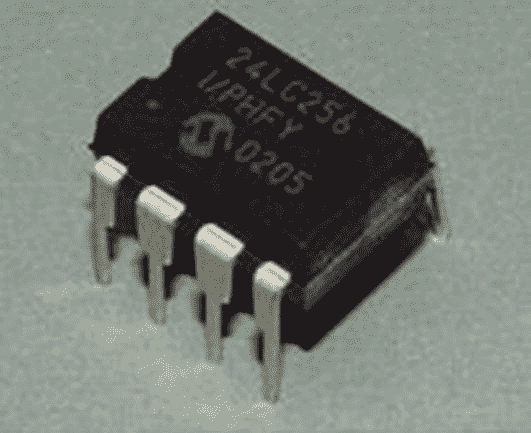

图 7-1

I2C EEPROM 芯片(SparkFun 提供)

该按钮将允许您重置芯片上的存储器。这样做会擦除存储的数据值，重新设置内存配置以备再次使用。当第一次使用草图、调试问题以及在存储器被读取并存储在另一个介质上后重用芯片时，您会发现该功能特别方便。

该芯片通过 I2C 总线进行通信。如图 [7-2](#Fig2) 所示，您可以通过将接地或电源连接到引脚 A0–A2 来设置芯片的地址。您可以将此视为一个二进制数，其中将地连接到所有三个引脚是可用的最低地址(0x50)，将电源连接到所有三个引脚是可用的最高地址(0x57)。表 [7-1](#Tab1) 显示了所需的可能地址和连接。通过将地连接到所有三个引脚，可以使用最低地址(0x50)。

表 7-1

设置 I2C EEPROM 的地址

<colgroup><col class="tcol1 align-left"> <col class="tcol2 align-left"> <col class="tcol3 align-left"> <col class="tcol4 align-left"></colgroup> 
| 

地址

 | 

A0

 | 

一流的

 | 

主动脉第二声

 |
| --- | --- | --- | --- |
| 0x50 | 地面 | 地面 | 地面 |
| 0x51 | 地面 | 地面 | +5V |
| 0x52 | 地面 | +5V | 地面 |
| 0x53 | 地面 | +5V | +5V |
| 0x54 | +5V | 地面 | 地面 |
| 0x55 | +5V | 地面 | +5V |
| 0x56 | +5V | +5V | 地面 |
| 0x57 | +5V | +5V | +5V |

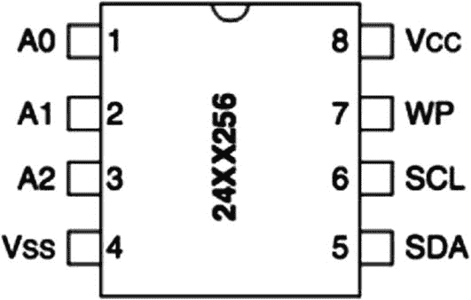

图 7-2

I2C EEPROM 的引脚排列

现在您已经了解了如何寻址芯片，让我们将它连接到您的 Arduino。首先将芯片放在试验板上，半圆指向左侧。这将引脚 1 设置为右上引脚。将接地线连接到芯片顶部的所有四个引脚。这些是引脚 1–4，如图 [7-2](#Fig2) 所示。

接下来，将引脚 5 (SDA)连接到 Arduino 上的引脚 4，将引脚 6 (SCL)连接到 Arduino 上的引脚 5。将接地线连接到针脚 7。然后将正电压(+5V)连接到针脚 8。我们还在 I2C 线上使用 4.7K 欧姆的电阻来降低噪声。最后，将按钮一端连接到引脚 2，另一端接通电源。使用 10K 欧姆电阻器将按钮*拉高*(将其连接到正电压)，就像您在之前的项目中所做的那样。详细接线图见图 [7-3](#Fig3) 。一定要仔细检查你的连接。


图 7-3

将 EEPROM 连接到 Arduino

Tip

如果您使用的是莱昂纳多板，您需要使用 USB 端口附近的 SDC 和 SCL 引脚。对于 Uno 板，它们位于 A4 和 A5，在 Mega 2560 上，它们位于 20 号和 21 号引脚。检查主板的硬件引脚排列，确保使用正确的 I2C 接口连接。

#### 软件设置

布线就绪后，您就可以开始写草图来读写数据了。在本例中，您不是编写一个脚本来简单地存储数据，而是编写一个草图来允许您将数据写入芯片和从芯片中读取数据。您还包括一个复位操作，允许您覆盖任何内存。

添加读取方法，以便您可以创建额外的草图来读取数据，如果您希望查看数据，将芯片(数据)移动到另一个 Arduino，或者使用另一个草图来处理数据。

我们开始吧。您使用 I2C 库(称为`Wire`)与 EEPROM 交互。打开新草图，并输入以下内容:

```py
#include <Wire.h>

#define FIRST_SAMPLE 0x02  // First position of first sample
#define MEM_ADDR 0x50      // EEPROM address
#define BUTTON_PIN 0x02    // Button pin
#define EEPROM_SIZE 32768  // Size of 24LC256
#define SAMPLE_BYTES 2     // Size of sample in bytes

int next_index = 0;        // Address of first sample

```

这些语句包括导线库，并定义了一些在草图中使用的常数。请注意，您有第一个样本的地址(芯片内存中的位置)、芯片地址、按钮引脚、最大尺寸(256 芯片)以及每个样本的字节数。

你需要很多方法。您需要将单个字节写入内存、存储样本、读取字节和读取样本的能力。让我们看看这些方法的最简单的形式——读字节方法。在下面的代码中，address 指的是 EEPROM 芯片的地址，index 指的是要访问的内存位置:

```py
byte read_byte(int address, unsigned int index)  {
  byte data = 0xFF;

  Wire.beginTransmission(address);
  Wire.write((int)(index >> 8));   // MSB
  Wire.write((int)(index & 0xFF)); // LSB
  Wire.endTransmission();

  Wire.requestFrom(address,1);

  if (Wire.available()) {
    data = Wire.read();
  }
  return data;
}

```

请注意与芯片通信的过程。首先，你用芯片开始一次传输，发送你想要读取的地址，然后结束传输。地址是一个两字节的值，这些语句向您展示了如何操作这些字节来形成一个字(两个字节)。下一个方法`requestFrom()`，告诉芯片你想读取一个字节。如果芯片准备好了，你就可以读取数据。最后，将值返回给调用者。

您可以对芯片的每个操作使用相同的格式。让我们看看将单个字节写入芯片的写入方法:

```py
void write_byte(int address, unsigned int index, byte data) {
  Wire.beginTransmission(address);
  Wire.write((int)(index >> 8));   // MSB
  Wire.write((int)(index & 0xFF)); // LSB
  Wire.write(data);
  Wire.endTransmission();

  delay(5);
}

```

请注意，您有相同的设置—您开始传输并在指定的索引处设置值。不同的是，您在结束传输之前发送数据(写入数据)。

但是你怎么知道什么被写到哪个地址(或者索引)？让我们使用索引 0 处的第一个字节来存储数据样本(或行)的数量，使用第二个字节来存储每个样本消耗的字节(或列)的数量，而不是随意地或以某种不合逻辑的顺序写入数据。这样，您可以使数据更容易阅读，因为它是统一的，并且在重新启动时更容易管理。

实际上，让我们添加一个名为`sample_data()`的新方法来写入一些数据，并在启动时显示 EEPROM 中数据的内容。回想一下 Arduino，如果您想在启动时执行一次方法，您可以将它放在`setup()`方法中。下面显示了如何使用现有的读取方法从 EEPROM 读取数据，并在串行监视器中显示信息:

```py
void sample_data(void) {
  int bytes_per_sample = SAMPLE_BYTES;
  byte buffer[SAMPLE_BYTES];

  next_index = read_byte(MEM_ADDR, 0);
  bytes_per_sample = read_byte(MEM_ADDR, 1);
  Serial.print("Byte pointer: ");
  Serial.println(next_index, DEC);
  Serial.print("Bytes per sample: ");
  Serial.println(bytes_per_sample, DEC);
  Serial.print("Number of samples:");
  Serial.println((next_index/bytes_per_sample)-1, DEC);

  // Add some sample data
  record_sample(MEM_ADDR, 6011);
  record_sample(MEM_ADDR, 8088);

  // Example of how to read sample data - read last 2 values
  read_sample(MEM_ADDR, next_index-(SAMPLE_BYTES * 2), buffer);
  Serial.print("First value: ");
  Serial.println((int)(buffer[0] << 8) + (int)buffer[1]);
  read_sample(MEM_ADDR, next_index-SAMPLE_BYTES, buffer);
  Serial.print("Second value: ");
  Serial.println((int)(buffer[0] << 8) + (int)buffer[1]);
}

```

这种技术使得通过在启动时运行 dump 方法来验证代码正在工作变得容易，如下所示。本质上，您创建了一个简单的自我诊断机制，可以用来检查数据的状态。如果您在启动时看到有效数据之外的任何东西，您就知道出了问题:

```py
void setup(void) {
  Serial.begin(115200);
  while (!Serial);
  Wire.begin();
  Serial.println("Welcome to the Arduino external EEPROM project.");
  initialize(MEM_ADDR);
  sample_data();
}

```

但是等等！如果遇到未初始化的 EEPROM，这段代码会做什么？在这种情况下，您可以创建一种特殊的方法来初始化 EEPROM。下面的代码显示了`initialize()`方法:

```py
void initialize(int address) {
  // Clear memory
  // NOTE: replace '10' with EEPROM_SIZE to erase all data
  for (int i = 0; i < 10; i++) {
    write_byte(address, i, 0xFF);
  }
  write_byte(address, 0, FIRST_SAMPLE);
  write_byte(address, 1, SAMPLE_BYTES);
  Serial.print("EEPROM at address 0x");
  Serial.print(address, HEX);
  Serial.println(" has been initialized.");
}

```

使用`write_byte()`方法为字节数写 0，为每个样本的字节数写前面定义的常数。该方法首先将 0xff 写入前 10 个字节，以确保没有存储任何数据；然后将字节数写入索引 0，将每个样本的字节数写入索引 1。您添加了一些反馈的打印报表。

但是这个方法是如何被调用的呢？一种方法是将它放在 setup()方法中，作为初始化 Wire 库的调用之后的第一个调用，但这意味着您必须注释掉其他方法，加载草图，执行它，删除该方法，然后重新加载。那似乎是许多额外的工作。一个更好的方法是用按钮触发这个方法。完成这项工作的代码放在`loop()`方法中，如下所示:

```py
if (digitalRead(BUTTON_PIN) == LOW) {
  initialize(MEM_ADDR);
  delay(500); // debounce
}

```

现在，您可以读写一个字节并初始化芯片，您还需要能够读取一个样本，以防您想在另一个草图中使用芯片来处理数据。以下代码显示了读取样本的方法:

```py
void read_sample(int address, unsigned int index, byte *buffer) {
  Wire.beginTransmission(address);
  Wire.write((int)(index >> 8));   // MSB
  Wire.write((int)(index & 0xFF)); // LSB
  Wire.endTransmission();
  Wire.requestFrom(address, SAMPLE_BYTES);
  for (int i = 0; i < SAMPLE_BYTES; i++) {
    if (Wire.available()) {
      buffer[i] = Wire.read();
    }
  }
}

```

请注意，您形成了一个类似于`read_byte()`的事件序列。但是，不是读取一个字节，而是使用一个循环来读取样本的字节数。您还需要一种将样本存储(写入)到芯片的方法:

```py
void write_sample(int address, unsigned int index, byte *data) {
  Wire.beginTransmission(address);
  Wire.write((int)(index >> 8));   // MSB
  Wire.write((int)(index & 0xFF)); // LSB
  Serial.print("START: ");
  Serial.println(index);
  for (int i = 0; i < SAMPLE_BYTES; i++) {
    Wire.write(data[i]);
  }
  Wire.endTransmission();
  delay(5); // wait for chip to write data
}

```

同样，该方法类似于`write_byte()`方法，但是您使用一个循环来写入样本的字节。请注意，您包含了一个 debug 语句来显示所使用的起始索引。这样做是为了在多次运行草图时可以看到值的增加。

Note

您可能已经注意到，我在`*_` byte()和`*_sample()`方法中复制了代码。我这样做是为了代码的清晰，但这并不是绝对必要的。例如，如果您更改了`*_sample()`方法，使用一个额外的参数来指示读/写多少字节，那么您可以合并代码。我把这个优化留给你作为练习。

还有一个方法可以考虑。回想一下，您使用存储在索引 0 中的计数器来记录写入的样本数。`write_sample()`方法只是在特定的索引处写一个样本。您需要的是一个管理样本计数器和存储样本的方法。因此，您创建了一个`record_sample()`方法来处理更高级别的操作:

```py
void record_sample(int address, int data) {
  byte sample[SAMPLE_BYTES];
  sample[0] = data >> 8;
  sample[1] = (byte)data;
  write_sample(address, next_index, sample);
  next_index += SAMPLE_BYTES;
  write_byte(address, 0, next_index);
}

```

请注意您是如何跟踪样本数量和下一个样本的下一个索引的。您使用之前创建的变量，并按照示例中的字节数对其进行递增。这样，您总是知道下一个地址是什么，而无需先读取样本数并计算索引。最后一个方法更新样本数值。

现在你已经有了所有的构建模块，清单 [7-1](#PC11) 显示了这个草图的完整代码。将草图另存为`external_eeprom.ino`。请注意，在草图中，您没有包括任何要从传感器读取的代码。为了简洁起见，我省略了这一点，而是在`setup()`方法中包含了一些调试语句(以粗体显示),以展示如何记录样本。在修改草图以供传感器使用时，请务必删除这些陈述。

```py
/**
  Beginning Sensor Networks Second Edition
  Sensor Networks Example Arduino External EEPROM data store

  This project demonstrates how to save and retrieve sensor data
  to/from an external EEPROM chip.
*/

#include <Wire.h>

#define FIRST_SAMPLE 0x02 // First position of fist sample
#define MEM_ADDR 0x50     // EEPROM address
#define BUTTON_PIN 0x02   // Button pin
#define EEPROM_SIZE 32768 // Size of 24LC256
#define SAMPLE_BYTES 2    // Size of sample in bytes

int next_index = 0;       // Address of first sample

/* Initialize the chip erasing data */
void initialize(int address) {
  // Clear memory
  // NOTE: replace '100' with EEPROM_SIZE to erase all data
  for (int i = 0; i < 100; i++) {
    write_byte(address, i, 0x00);
  }
  write_byte(address, 0, FIRST_SAMPLE);
  write_byte(address, 1, SAMPLE_BYTES);
  Serial.print("EEPROM at address 0x");
  Serial.print(address, HEX);
  Serial.println(" has been initialized.");
}

/* Write a sample to the chip. */
void write_sample(int address, unsigned int index, byte *data) {
  Wire.beginTransmission(address);
  Wire.write((int)(index >> 8));   // MSB
  Wire.write((int)(index & 0xFF)); // LSB
  Serial.print("START: ");
  Serial.println(index);
  for (int i = 0; i < SAMPLE_BYTES; i++) {
    Wire.write(data[i]);
  }
  Wire.endTransmission();

  delay(5); // wait for chip to write data
}

/* Write a byte to the chip at specific index (offset). */
void write_byte(int address, unsigned int index, byte data) {
  Wire.beginTransmission(address);
  Wire.write((int)(index >> 8));   // MSB
  Wire.write((int)(index & 0xFF)); // LSB
  Wire.write(data);
  Wire.endTransmission();

  delay(5);
}

/* Read a sample from an index (offset). */
void read_sample(int address, unsigned int index, byte *buffer) {
  Wire.beginTransmission(address);
  Wire.write((int)(index >> 8));   // MSB
  Wire.write((int)(index & 0xFF)); // LSB
  Wire.endTransmission();

  Wire.requestFrom(address, SAMPLE_BYTES);
  for (int i = 0; i < SAMPLE_BYTES; i++) {
    if (Wire.available()) {
      buffer[i] = Wire.read();
    }
  }
}

/* Read a byte from an index (offset). */
byte read_byte(int address, unsigned int index)  {
  byte data = 0xFF;

  Wire.beginTransmission(address);
  Wire.write((int)(index >> 8));   // MSB
  Wire.write((int)(index & 0xFF)); // LSB
  Wire.endTransmission();

  Wire.requestFrom(address,1);

  if (Wire.available()) {
    data = Wire.read();
  }
  return data;
}

/* Save a sample to the data chip and increment next address counter. */
void record_sample(int address, int data) {
  byte sample[SAMPLE_BYTES];

  sample[0] = data >> 8;
  sample[1] = (byte)data;
  write_sample(address, next_index, sample);
  next_index += SAMPLE_BYTES;
  write_byte(address, 0, next_index);
}

/* Example write data sample */
void sample_data(void) {
  int bytes_per_sample = SAMPLE_BYTES;
  byte buffer[SAMPLE_BYTES];

  next_index = read_byte(MEM_ADDR, 0);
  bytes_per_sample = read_byte(MEM_ADDR, 1);
  Serial.print("Byte pointer: ");
  Serial.println(next_index, DEC);
  Serial.print("Bytes per sample: ");
  Serial.println(bytes_per_sample, DEC);
  Serial.print("Number of samples:");
  Serial.println((next_index/bytes_per_sample)-1, DEC);

  // Add some sample data
  record_sample(MEM_ADDR, 6011);
  record_sample(MEM_ADDR, 8088);

  // Example of how to read sample data - read last 2 values
  read_sample(MEM_ADDR, next_index-(SAMPLE_BYTES * 2), buffer);
  Serial.print("First value: ");
  Serial.println((int)(buffer[0] << 8) + (int)buffer[1]);
  read_sample(MEM_ADDR, next_index-SAMPLE_BYTES, buffer);
  Serial.print("Second value: ");
  Serial.println((int)(buffer[0] << 8) + (int)buffer[1]);
}

void setup(void) {
  Serial.begin(115200);
  while (!Serial);
  Wire.begin();
  Serial.println("Welcome to the Arduino external EEPROM project.");
  initialize(MEM_ADDR);
  sample_data();
}

void loop() {
  delay(2000);
  if (digitalRead(BUTTON_PIN) == LOW) {
    initialize(MEM_ADDR);
    delay(500); // debounce
  }
  //
  // Read sensor data and record sample here
  //
  sample_data();
}

Listing 7-1Storing and Retrieving Data on an External EEPROM

```

请注意，您包括了一些通过串行监视器传达草图进度的附加语句。花一些时间来检查这些，这样你就可以熟悉草图运行时会发生什么。

Tip

如果你想写保护芯片，断开 WP 引脚。这样做使芯片成为只读的。

#### 测试草图

要测试草图，请确保代码可以编译，并且您的硬件设置正确。当你有了一个可以编译的草图，把它上传到你的 Arduino 上，然后启动一个串口监视器。

第一次加载草图时，需要按下按钮来初始化 EEPROM。这是因为芯片上的值对于新芯片来说是未初始化的。您只需在第一次运行草图时执行此操作。完成后，您应该会看到类似于清单 [7-2](#PC12) 中的输出。

```py
Welcome to the Arduino external EEPROM project.
EEPROM at address 0x50 has been initialized.
Byte pointer: 2
Bytes per sample: 2
Number of samples: 0
START: 2
START: 4
First value: 6011
Second value: 8088
Byte pointer: 6
Bytes per sample: 2
Number of samples: 2
START: 6
START: 8
First value: 6011
Second value: 8088
Byte pointer: 10
Bytes per sample: 2
Number of samples: 4
START: 10
START: 12
First value: 6011
Second value: 8088
EEPROM at address 0x50 has been initialized.
Byte pointer: 2
Bytes per sample: 2
Number of samples: 0
START: 2
START: 4
First value: 6011
Second value: 8088
Byte pointer: 6
Bytes per sample: 2
Number of samples: 2
START: 6
START: 8
First value: 6011
Second value: 8088

Listing 7-2Serial Monitor Output for EEPROM Example

```

你看到类似的东西了吗？如果再次运行草图(例如，按下*重置*按钮)，您应该看到开始索引值(从`write_sample()`方法)增加。去试一试吧。

当你在非易失性存储器中保存数据几次后，按下按钮，注意会发生什么。正如您在清单 [7-2](#PC12) 中看到的，开始索引被重置，接下来的样本被存储在内存的开始处。

#### 为了更多乐趣

这个项目的草图很有前途。毫无疑问，您可以用这段代码做很多事情。以下是改进代码和尝试使用外部 EEPROM 的一些建议:

*   添加一些在嵌入式项目中使用的视觉帮助(没有串行监视器功能的情况)。您可以添加一个 LED，当芯片上有数据时它就会发光。您还可以添加一组七段 led 来显示存储的数据样本数。

*   改进代码以便重用。首先删除前面在 read 和 write 方法中描述的冗余，然后将代码移到一个类中，以便更容易在其他草图中使用 EEPROM。

*   添加第二个 EEPROM 芯片以扩展可用存储量。提示:您需要将每个芯片设置为不同的地址，但使用的方法是相同的。

*   也许更简单、更符合 Arduino 硬件入侵原理的方法是将 EEPROM 转移到另一个 Arduino 并读取所有存储的值。这证明了 EEPROM 芯片的非易失性。

Caution

使用适当的接地来避免静电放电(ESD)对芯片的损坏。

### 项目:将数据写入 SD 卡

除了 EEPROM 芯片，您还可以通过将数据写入 SD 驱动器，在 Arduino 上本地存储数据。SD 驱动器是存储数据的好选择，因为数据存储在文件中，其他设备可以读取(和写入)。

例如，虽然将数据写入 EEPROM 芯片并不困难，但在个人电脑上读取该芯片需要为 Arduino 编写一个草图来传输数据。但是，SD 卡可以从 Arduino 中取出(一旦文件关闭)，并插入连接到个人电脑的 SD 驱动器中，这样您就可以直接读取文件。因此，SD 卡是传感器网络的更好选择，在传感器网络中，传感器节点不通过网络或其他无线连接进行连接。

为 Arduino 添加 SD 读卡器有多种选择。最受欢迎的两个是来自 SparkFun ( [`www.sparkfun.com/categories/240`](http://www.sparkfun.com/categories/240) )的 Arduino Ethernet shield 和 microSD shield。如果您使用 Arduino Ethernet shield，您可以同时使用网络功能和 SD 卡。许多类似的设备可以从不同的供应商处获得。

Adafruit 还为 Arduino 提供了一个数据记录屏蔽，内置 SD 驱动器( [`www.adafruit.com/product/1141`](http://www.adafruit.com/product/1141) )。数据记录屏蔽还包括一个 RTC，可以存储样品的日期和时间。我将讨论在下一个项目中使用 RTC。

Tip

microSD shield 和 Data Logging shield 都提供了一个原型制作区域，您可以使用它来安装传感器组件甚至 XBee 模块。

SD 驱动器允许您创建一个混合节点，在本地存储数据，并将其传输到网络中的另一个节点。这种冗余是您可以在传感器网络中构建耐用性的方法之一。例如，如果一个节点失去了通过网络与另一个节点的连接，它仍然可以在本地记录其数据。尽管这是一个手动恢复数据的过程(您必须去拿 SD 卡)，但数据完全可以恢复的事实意味着网络可以在网络故障中生存而不会丢失数据。

可以使用 EEPROM 作为本地存储备份选项，但 EEPROM 更难使用，不如 SD 卡耐用，不具有相同的存储容量，也不容易在其他设备中使用。

关于构建耐用的传感器节点，还有一件非常重要的事情需要考虑。如果您不知道数据是何时存储的，拥有数据的本地备份可能没有帮助。除了有限的精确周期时间，Arduino 没有任何计时功能。因此，如果您在本地存储数据，而没有可以与其他数据关联的任何类型的时间戳，则所获取的样本可能没有超出序列本身(值的顺序)的意义。

为了减轻这种情况，您可以向 Arduino 添加一个 RTC 模块。RTC 允许您存储取样的日期和时间。如果您试图绘制一段时间内的值，或者想知道虚假或有趣的事件何时发生，此信息可能非常重要。

#### 硬件设置

这个项目的硬件使用 Arduino Ethernet shield、SparkFun 的 microSD shield(安装了 SD 卡)或 Adafruit 的数据记录 shield。为了简单起见，我使用了 Arduino 以太网屏蔽，并展示了使用 microSD 屏蔽或数据记录屏蔽所需的代码更改(通过`#define`语句)。

您还需要 RTC 模块。Adafruit 有一款出色的产品，性能非常好，包括一个板载电池，即使在 Arduino 断电时也能为时钟供电。Adafruit 的 DS1307 实时时钟分线板套件( [`www.adafruit.com/product/3296`](http://www.adafruit.com/product/3296) )是添加到您的项目中的优秀模块。图 [7-4](#Fig4) 显示了 Adafruit RTC 模块。


图 7-4

DS1307 实时时钟分线板(Adafruit 提供)

SparkFun 还有一个名为实时时钟模块( [`www.sparkfun.com/products/99`](http://www.sparkfun.com/products/99) )的产品，它使用与 Adafruit 产品相同的 DS1307 芯片和接口。你可以在这个项目中使用任何一个。

Note

Adafruit RTC 模块需要装配。SparkFun 的 RTC 模块没有。

RTC 模块使用易于连接到 Arduino 的 I2C 接口。只需将 5V 电源连接到 5V 引脚，将地连接到 GND 引脚，将 SDA 引脚连接到 Arduino 的引脚 4，将 SCL 引脚连接到 Arduino 的引脚 5。图 [7-5](#Fig5) 显示了连接 RTC 模块的接线图。

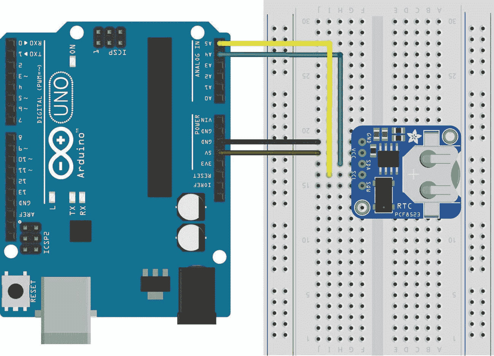

图 7-5

带以太网屏蔽和 RTC 模块的 Arduino

请注意，以太网屏蔽安装在 Arduino 上。如果您使用的是 SparkFun microSD shield，接线也是一样的。

对于这个项目，我们将使用 Adafruit 数据记录屏蔽和 Arduino Uno Wi-Fi，以尽量减少布线。事实上，你所需要做的就是把盾牌插到你的 Uno 上，然后你就可以出发了！图 [7-6](#Fig6) 显示了数据记录屏蔽的样子。


图 7-6

Adafruit 数据记录屏蔽(Adafruit 提供)

Note

如果您没有数据记录屏蔽，您可以使用前面描述的 RTC 模块。

#### 软件设置

有了数据记录屏蔽，您就可以开始写草图，将数据写入 SD 卡。打开主板电源之前，请务必插入已格式化的 SD 卡。但是首先，你必须从 Adafruit ( [`https://github.com/adafruit/RTClib`](https://github.com/adafruit/RTClib) )下载并安装 RTC 库。

回想一下，要安装一个库，我们打开*草图* ➤ *包含库* ➤ *库管理器*，一旦它加载了所有的头文件，键入 RTCLib 并从 Adafruit 中选择库，然后单击*安装*来安装它。图 [7-7](#Fig7) 显示了用于本项目的库。


图 7-7

在库管理器中安装 Adafruit RTCLib

一旦下载并安装了这个库(并且重启了 Arduino IDE)，就可以开始一个名为`sd_file_example.ino`的新草图了。输入以下代码，指定您需要在草图中使用的模块。您需要 Wire、RTC、SD 和 String 库:

```py
#include <Wire.h>
#include "RTClib.h"
#include <SD.h>
#include <String.h>

```

接下来，您需要定义用于与 SD 驱动器通信的 pin。以下是前面描述的所有三个 SD 驱动器选项的定义。我在这个例子中使用了以太网屏蔽；但是如果您没有使用以太网屏蔽，您可以注释掉该行，并取消注释掉与您正在使用的屏蔽相对应的行。还包括用于存储样本的文件名的定义。请注意，在使用 FAT 格式的 microSD 时，我们必须使用 8.3 文件名格式。 <sup>[2](#Fn2)</sup>

```py
// Pin assignment for Arduino Ethernet shield
// #define SD_PIN 4
// Pin assignment for SparkFun microSD shield
//#define SD_PIN 8
// Pin assignment for Adafruit Data Logging shield
#define SD_PIN 10
// Sensor data file - require 8.3 file name
#define SENSOR_DATA "sensdata.txt"

```

现在你声明一些变量。您需要一个用于 RTC 模块，一个用于您在 SD 驱动器上使用的文件。请注意，我使用了 RTC_PCF8523 模块，因为数据记录屏蔽具有该 RTC 模块。确保使用与您的 RTC 芯片匹配的 RTC 模块。

```py
RTC_PCF8523 rtc;
File sensor_data;

```

准备工作完成后，您需要一种将传感器样本保存到 SD 卡的方法。该方法必须从 RTC 模块读取日期和时间，接受样本作为参数，并存储数据。在本例中，首先放置日期和时间，然后放置样本值。将此方法命名为`record_sample()`。

使用 RTC 库可以轻松读取 RTC 模块。您只需使用这个库，通过 now()方法获取当前日期和时间。从那里，您可以调用方法来获取月、日、年、小时等等。可以通过多种方式形成要写入文件的字符串。我使用 string 类来构造字符串。请随意使用您喜欢的任何其他方法:

```py
// Capture the date and time
DateTime now = rtc.now();

```

写入文件非常容易。您只需以写模式(`FILE_WRITE`)打开文件，这将自动允许任何写操作被写到文件的末尾(追加)。这很好，因为您不必担心寻找或找出文件指针在文件中的位置。打开文件会返回一个 file 对象实例，您可以使用它来写入数据。写入文件(一旦打开)只需要一次方法调用。以下代码显示了使用 SD 库打开文件和写入数据的一组简化调用。我把 record_sample()方法的细节留给您在清单 [7-2](#PC12) 中探索:

```py
// Open the file
sensor_data = SD.open(SENSOR_DATA, FILE_WRITE);
// Save the data
sensor_data.write(1234);
sensor_data.write("\n");
// Close the file
sensor_data.close();

```

当然，您需要一些东西来正确地设置组件和库。`setup()`方法至少应包含串行、有线和 RTC 库的初始化(通过调用它们的`begin()`方法)以及对 SD 库的调用，以启动与 SD 驱动器的通信。以下是这些步骤所需代码的摘录。请注意，您还可以根据草图的最后编译日期和时间(实际上是上传的日期和时间)来初始化 RTC 的日期和时间:

```py
void setup () {
  Serial.begin(115200);
  while(!Serial);
  Wire.begin();
  rtc.begin();

  if (!rtc.initialized()) {
    Serial.println("RTC is NOT running!");
    // Set time to date and time of compilation
    rtc.adjust(DateTime(__DATE__, __TIME__));
  }

  // disable w5100 SPI (if needed)
  // pinMode(10,OUTPUT);
  // digitalWrite(10,HIGH);

  // Initialize the SD card.
  Serial.print("Initializing SD card...");
  if (!SD.begin(SD_PIN)) {
    Serial.println("initialization failed!");
    return;
  }
  Serial.println("initialization done.");
...
}

```

请注意，您还有关闭以太网 W5100 SPI 接口的代码。这仅在以太网屏蔽时需要，并且仅在您不打算使用网络功能时才需要。

还有一件事你可能想补充。你可能需要检查一下是否能读取 SD 卡上的文件。仅仅初始化 SD 库是不够的。SD 驱动器可能会正常通信，但您无法在卡上打开或创建文件。将以下代码添加到 setup()方法中，作为额外的检查。在这种情况下，您检查文件是否存在，如果不存在，则尝试创建该文件。如果在打开呼叫时出现错误，您将打印一条消息:

```py
// Check for file. Create if not present
if (!SD.exists(SENSOR_DATA)) {
  Serial.print("Sensor data file does not exit. Creating file...");
  sensor_data = SD.open(SENSOR_DATA, FILE_WRITE);
  if (!sensor_data) {
    Serial.println("ERROR: Cannot create file.");
  }
  else {
    sensor_data.close();
    Serial.println("done.");
  }
}

```

`loop()`方法是调用`record_sample()`方法的地方。在这种情况下，为了简洁起见，将`loop()`方法留空。您可以在这里随意添加自己的代码来读取传感器，并为每个传感器调用`record_sample()`方法。

清单 7-3 显示了这个项目的完整代码。虽然到目前为止的解释都是关于草图的关键部分，但是请注意，清单中添加了额外的错误处理代码，以确保 SD 驱动器正确初始化，并且文件存在并且可以写入。

```py
/**
  Beginning Sensor Networks Second Edition
  Sensor Networks Example Arduino SD card data store

  This project demonstrates how to save sensor data to a
  microSD card.
*/

#include <Wire.h>
#include "RTClib.h"
#include <SD.h>
#include <String.h>

// Pin assignment for Arduino Ethernet shield
//#define SD_PIN 4
// Pin assignment for SparkFun microSD shield
//#define SD_PIN 8
// Pin assignment for Adafruit Data Logging shield
#define SD_PIN 10

// Sensor data file - require 8.3 file name
#define SENSOR_DATA "sensdata.txt"

RTC_PCF8523 rtc;
File sensor_data;

void record_sample(int data) {
  // Open the file
  sensor_data = SD.open(SENSOR_DATA, FILE_WRITE);
  if (!sensor_data) {
    Serial.println("ERROR: Cannot open file. Data not saved!");
    return;
  }

  // Capture the date and time

  DateTime now = rtc.now();

  String timestamp(now.month(), DEC);
  timestamp += ("/");
  timestamp += now.day();
  timestamp += ("/");
  timestamp += now.year();
  timestamp += (" ");
  timestamp += now.hour();
  timestamp += (":");
  timestamp += now.minute();
  timestamp += (":");
  timestamp += now.second();
  timestamp += (" ");

  // Save the sensor data
  sensor_data.write(&timestamp[0]);

  String sample(data, DEC);
  sensor_data.write(&sample[0]);
  sensor_data.write("\n");

  // Echo the data
  Serial.print("Sample: ");
  Serial.print(timestamp);
  Serial.print(data, DEC);
  Serial.println();

  // Close the file

  sensor_data.close();
}

void setup () {
  Serial.begin(115200);
  while(!Serial);
  Wire.begin();
  rtc.begin();

  if (!rtc.initialized()) {
    Serial.println("RTC is NOT running!");
    // Set time to date and time of compilation
    rtc.adjust(DateTime(__DATE__, __TIME__));
  }

  // disable w5100 SPI
  // pinMode(10,OUTPUT);
  // digitalWrite(10,HIGH);

  // Initialize the SD card.
  Serial.print("Initializing SD card...");
  if (!SD.begin(SD_PIN)) {
    Serial.println("initialization failed!");
    return;
  }
  Serial.println("initialization done.");

  // Check for file. Create if not present
  if (!SD.exists(SENSOR_DATA)) {
    Serial.print("Sensor data file does not exit. Creating file...");
    sensor_data = SD.open(SENSOR_DATA, FILE_WRITE);
    if (!sensor_data) {
      Serial.println("ERROR: Cannot create file.");
    }
    else {
      sensor_data.close();
      Serial.println("done.");
    }
  }

  // Record some test samples

.
  record_sample(1);
  record_sample(2);
  record_sample(3);
}

void loop () {
  // Read sensor data here and record with record_sample()
}

Listing 7-3Storing Data on an SD Card

```

出于演示的目的，我在`setup()`方法中添加了调试语句，以确保草图正常工作。在`setup()`方法中放置这些调用允许您加载草图(或重启 Arduino)并检查 SD 卡的内容，看看代码是否工作。如果您将语句放在`loop()`方法中，那么根据您关闭 Arduino 的时间(拔掉插头)，您可能不知道添加了多少行，甚至不知道文件是否正确关闭。将`record_sample()`语句放在`setup()`方法中意味着您希望检查输出。

Tip

如果您收到 SD 驱动器初始化错误，请检查定义部分中使用的 pin 分配，以确保您对 SD 驱动器/屏蔽使用了正确的 pin。

如果遇到文件写入或打开错误，请确保 SD 卡被格式化为 FAT 分区，SD 卡没有写保护，并且您可以使用个人电脑在驱动器上创建和读取文件。

#### 测试草图

要测试草图，请确保代码可以编译，并且您的硬件设置正确。一旦你有了一个可以编译的草图，把它上传到你的 Arduino 并启动一个串行监视器。以下代码显示了串行监视器中的预期输出:

```py
Initializing SD card...initialization done.
Sample: 2/29/2020 16:34:27 1
Sample: 2/29/2020 16:34:27 2
Sample: 2/29/2020 16:34:28 3

```

Note

第一次运行草图时，您可能会看到一条关于初始化 SD 卡和创建文件的消息。这很正常。后续运行(Arduino 重新启动)可能不会显示消息。

如果在写入草图时多次运行草图，那么每次初始化草图时，都会在文件末尾插入三行。这是因为出于调试目的，您在`setup()`方法中放置了对`record_sample()`的示例调用。在您读取传感器之后，这些调用自然会放在 loop()方法中。以下代码显示了运行草图(启动 Arduino)四次后的文件内容示例:

```py
2/29/2020 16:31:8 1
2/29/2020 16:31:8 2
2/29/2020 16:31:8 3
2/29/2020 16:34:27 1
2/29/2020 16:34:27 2
2/29/2020 16:34:28 3

```

如果您检查文件并发现比预期更多的条目集，请尝试从文件中删除数据，启动 Arduino，然后按两次*重置*按钮。当您查看内容时，您应该正好看到三组条目(一组用于初始启动，因为草图一开始就在内存中，另一组用于每次重新启动 Arduino)。

如果您只看到部分集合(每个集合少于三行)，请检查以确保您在关闭 Arduino 之前允许它启动。最好在关闭 Arduino 之前，使用串行监视器，并等待所有三个语句都在监视器上出现。

如果您的草图编译成功，串行监视器中没有显示错误，但数据文件为空，请检查以确保卡可用且未损坏。尝试用 FAT 文件格式重新格式化该卡。

Handle With Care

MicroSD 卡非常易碎。如果处理不当或受到 ESD 或磁场的影响，它们很容易损坏。如果您的卡不能正常工作，并且您不能重新格式化它，它可能已经损坏而无法使用。您可以尝试使用 [`sdcard.org`](http://sdcard.org) 的格式化程序，但如果失败，您的卡将不再有效。到目前为止，这种情况只在我身上发生过一次。

既然您已经研究了在 Arduino 上本地存储数据的两种主要方法，那么让我们看看 Raspberry Pi 的可用选项。

## 树莓酱的本地存储选项

因为 Raspberry Pi 是一台个人电脑，它具有创建、读取和写入文件的能力。虽然可以使用通过 GPIO 头连接的 EEPROM，但为什么要这样做呢？鉴于编程的简易性和使用文件的便利性，很少需要另一种形式的存储。

你也知道 Raspberry Pi 可以用多种方式编程，并且是用最流行的语言之一 Python。 <sup>[3](#Fn3)</sup> 在 Python 中处理文件非常容易，并且是默认库的原生功能。这意味着您不需要添加任何东西来使用文件。

以下项目演示了使用 Python 处理文件的简易性。在线 Python 文档详细解释了读写文件( [`https://docs.python.org/2/tutorial/inputoutput.html#reading-and-writing-files`](https://docs.python.org/2/tutorial/inputoutput.html%2523reading-and-writing-files) )。

你会注意到，文件放在哪里并不重要——是放在 SD 卡上还是连接的 USB 驱动器上。您只需要知道您想要存储数据的位置(文件夹)的路径，并将其传递给 open()方法。

精明的 Python 程序员 <sup>[4](#Fn4)</sup> 知道 Python 库包含了额外的库和类，用于操作文件夹、导航路径等等。有关更多信息，请查看 OS 和 Sys 库的 Python 文档。比如找`normpath()`和`Path` <sup>[5](#Fn5)</sup> 类。

### 项目:将数据写入文件

这个项目展示了使用 Python 在 Raspberry Pi 上使用文件是多么容易。因为不需要额外的硬件或软件库，所以我可以跳过这些部分，直接进入代码。

启动您的 Raspberry Pi，并登录。使用以下命令(或类似命令)打开一个新文件:

```py
nano file_io_example.py

```

使用. py 扩展名命名该文件，以表明它是一个 Python 脚本。在文件中输入以下代码:

```py
import datetime
with open("/home/pi/sample_data.txt", "a+") as my_file:
    my_file.write("{0} {1}\n".format(datetime.datetime.now(), 101))

```

在本例中，首先导入`datetime`库。您使用`datetime`来获取当前的日期和时间。接下来，使用较新的`with`子句打开文件(注意，您使用的是 Pi 用户的主目录),并向文件中写入一行(您不需要关闭文件——当 execute 离开`with`子句的范围时，已经为您完成了)。如果你觉得使用显式打开和关闭更好，请随意这样做。

注意`open()`方法。它需要两个参数——文件路径和名称以及打开文件的模式。您使用“`a+`”添加到文件中(`a`)，如果文件不存在(`+`)，则创建该文件。其他值包括 r 表示读取，w 表示写入。其中一些可以结合起来:例如，“`rw+`”创建一个不存在的文件，并允许读写数据。

Note

使用写入模式会截断文件。对于大多数需要存储传感器样本的情况，可以使用追加模式。

对于每次执行，您应该会看到一行时间值略有不同，对应于脚本运行的时间。要执行该文件，请使用以下命令:

```py
python ./file_io_example.py

```

继续并尝试运行脚本。如果出现错误，请检查代码并更正任何语法错误。如果打开文件时遇到问题(运行脚本时出现 I/O 错误)，请尝试检查您正在使用的文件夹的权限。尝试多次运行该脚本，然后显示文件的内容。以下代码显示了该项目的完整命令序列:

```py
$ nano file_io_example.py
$ python ./file_io_example.py
$ python ./file_io_example.py
$ python ./file_io_example.py
$ python ./file_io_example.py
$ python ./file_io_example.py
$ python ./file_io_example.py
$ python ./file_io_example.py
$ more sample_data.txt
2020-02-29 16:50:34.076657 101
2020-02-29 16:53:23.252384 101
2020-02-29 16:53:24.078429 101
2020-02-29 16:53:24.680599 101
2020-02-29 16:53:25.676225 101
2020-02-29 16:53:26.324482 101

```

有没有得到类似的结果？如果没有，请更正任何错误，然后重试，直到成功为止。从这个简单的例子中可以看出，在 Raspberry Pi 上使用 Python 将数据写入文件非常容易。

## 远程存储选项

远程存储意味着数据被发送到另一个节点或系统进行记录。这通常需要与远程系统进行某种形式的通信或网络连接。传感器网络本质上是相互连接的，因此可以利用远程存储。

为了让您了解我正在讨论的内容，请考虑一个 Arduino 传感器节点，它带有一个连接到基于 Raspberry Pi 的节点的 XBee 模块。假设您想将样本数据写入文件。您可以将数据发送到基于 Raspberry Pi 的节点并将数据存储在那里的文件中，而不是在 Arduino 节点上使用 SD 卡来存储数据。主要动机是在 Raspberry Pi 上通过 Python 使用文件要容易得多。如果您还考虑到使用 XBee 模块的多个 Arduino 传感器节点的可能性，您可以使用基于 Raspberry Pi 的节点作为数据集合，将所有数据存储在一个文件中。

Single File or Multiple Files?

在讨论存储聚合数据时，我有时会遇到这个问题。如果您的数据相似(例如温度)，您可以考虑将来自相似传感器的数据存储到同一个文件中。但是，如果数据不同(例如一个节点的温度和另一个节点的湿度)，您应该考虑使用不同的文件。这使得读取文件更容易，因为您不必编写代码(或使用工具)来分离数据。

但是，您真的只是在谈论将数据存储在文件中吗？答案是否定的。有许多远程存储数据的机制。虽然将数据存储在文件中是最简单的形式，但是您也可以将数据存储在云中，甚至存储在远程数据库服务器上。

如果您有使用数据库存储和检索数据的经验，这种方法会对您有吸引力——特别是如果您计划以后使用其他工具来处理数据。例如，您可能希望执行统计分析或创建图表来跟踪一段时间内的样本。因为使用数据库是一个复杂的主题，所以我将在接下来的几章中研究这种形式的远程存储。

您已经看到了使用文件是多么容易，但是如何在云中存储数据呢？这是怎么回事？简而言之，在云中存储数据涉及使用基于云的数据存储服务来接收数据并以某种方式托管数据。最流行的形式是将数据呈现给互联网上的其他人，供他们自己查看或消费。

下一节讨论如何使用 MathWorks 提供的一种流行的、易于使用的、基于云的物联网数据托管服务 ThingSpeak ( [`www.thingspeak.com`](http://www.thingspeak.com) )将样本数据存储在云中。您将看到在 Arduino 和 Raspberry Pi 上使用 ThingSpeak 的示例项目。

### 在云中存储数据

除非你住在一个非常偏僻的地方，否则你很可能已经被关于云和物联网的讨论轰炸了。也许你在杂志和电视上看到过广告，或者在其他书上读到过，或者参加过研讨会或会议。除非你花时间了解云的含义，否则你可能会想知道这一切有什么大惊小怪的。

简单来说， <sup>[6](#Fn6)</sup> 云是一个通过互联网提供的服务的名称。这些可以是您可以访问的服务器(在更大的服务器上作为虚拟机运行)，提供对特定软件或环境的访问的系统，或者是您可以附加到其他资源的资源，如磁盘或 IP 地址。云背后的技术包括网格计算(分布式处理)、虚拟化和网络。正确的科学术语是云计算。虽然对云计算的深入探讨超出了本书的范围，但是理解您可以使用云计算服务来存储您的传感器数据就足够了。

有许多物联网云供应商提供各种各样的产品、容量和功能，以满足您对物联网项目的任何需求。有这么多供应商提供物联网解决方案，很难选择一个。以下是云行业顶级供应商提供的更受欢迎的物联网产品的简短列表:

*   *Oracle IoT* : [`www.oracle.com/internet-of-things/`](http://www.oracle.com/internet-of-things/)

*   *Microsoft azure IOT hub*:[`https://azure.microsoft.com/en-us/product-categories/iot/`](https://azure.microsoft.com/en-us/product-categories/iot/)

*   *谷歌物联网核心* : [`https://cloud.google.com/iot-core`](https://cloud.google.com/iot-core)

*   *IBM 物联网* : [`www.ibm.com/internet-of-things`](http://www.ibm.com/internet-of-things)

*   *【arduino IOT cloud】*:[`www.arduino.cc/en/IoT/HomePage`](http://www.arduino.cc/en/IoT/HomePage)

*   *math works things gspeak*`:`[`https://thingspeak.com/`](https://thingspeak.com/)

大多数供应商提供商业产品，但少数如谷歌，Azure，Arduino 和 ThingSpeak 提供有限的免费帐户。正如你所猜测的，有些产品是复杂的解决方案，需要很高的学习曲线，但是 Arduino 和 ThingSpeak 产品简单易用。因为我们想要一个支持 Arduino 和 Raspberry Pi(以及其他平台)的解决方案，所以我们将在本章中使用 ThingSpeak 作为在云中存储数据的例子。

Tip

如果您想要或需要使用其他供应商的产品，请确保在开始编写代码之前通读所有教程。

ThingSpeak 为每年产生少于 300 万条消息(或数据元素)或每天大约 8000 条消息的非商业项目提供免费账户。免费账户也限定为 7 个通道(一个通道相当于一个项目，最多可以保存 8 个数据项)。如果您需要存储或处理更多的数据，您可以购买四个类别之一的商业许可证，每个类别都有特定的产品、功能和限制:标准、学术、学生和家庭。请参见 [`https://thingspeak.com/prices`](https://thingspeak.com/prices) 并单击每个许可选项，了解有关功能和定价的更多信息。

Note

除非你使用工作或学校账户，否则你可能需要付费使用一些产品，如 MatLab。

ThingSpeak 的工作原理是从包含您想要保存或绘制的数据的设备接收消息。有一些库可以用于某些平台或编程语言，如 Arduino 或 Python。这是迄今为止连接到 ThingSpeak 和传输数据最简单的方式。

但是，您也可以使用机器对机器(M2M)连接协议(称为 MQTT <sup>[7](#Fn7)</sup> )或表述性状态传输(REST <sup>[8](#Fn8)</sup> ) API，该 API 被设计为通过 HTTP 进行通信的请求-响应模型，用于向 ThingSpeak 发送数据或从中读取数据。是的，你甚至可以从其他设备读取数据。

Tip

参见 [`www.mathworks.com/help/thingspeak/channels-and-charts-api.html`](http://www.mathworks.com/help/thingspeak/channels-and-charts-api.html) 了解更多关于 ThingSpeak MQTT 和 REST API 的细节。

当您想要读取或编写 ThingSpeak 通道时，您可以发布 MQTT 消息，通过 HTTP 向 REST API 发送请求，或者使用一个特定于平台的库来为您封装这些机制。一个通道最多可以有八个表示为字符串或数字数据的数据字段。您还可以使用一些复杂的过程来处理数字数据，如求和、平均、舍入等。

我们不会深入讨论这些协议的细节；相反，我们将看到如何使用 ThingSpeak 作为快速入门指南。MathWorks 提供了一整套教程、文档和示例。因此，如果你需要更多关于 ThingSpeak 如何工作的信息，请查看位于 [`www.mathworks.com/help/thingspeak/`](http://www.mathworks.com/help/thingspeak/) 的文档。

The Cloud: Isn’t That Just Marketing Hype?

不要相信任何名称中包含“云”的产品的宣传或销售。云计算服务和资源应该可以通过互联网从任何地方访问，通过订阅(收费或免费)提供给你，并允许你消费或生产和分享所涉及的数据。此外，请考虑这样一个事实，即您必须能够访问云才能访问您的数据。因此，如果服务不可达(或关闭)，您别无选择。

#### 开始使用 ThingSpeak

要使用 ThingSpeak，您必须先注册一个帐户。幸运的是，他们提供了免费账户的选择。事实上，您可以先获得一个免费帐户，然后再添加(购买)许可证。要创建一个免费帐户，请访问 [`https://thingspeak.com/users/sign_up`](https://thingspeak.com/users/sign_up) ，填写您的电子邮件地址、位置(通用地理信息)以及姓名，然后点击*继续*。然后，您将收到一封确认电子邮件。打开并按照说明验证您的电子邮件，并通过选择密码和完成一个简短的问卷来完成您的免费帐户。

#### 创建频道

登录 ThingSpeak 后，您可以创建一个通道来保存您的数据。回想一下，每个通道最多可以有八个数据项(字段)。在你的登录首页，点击*新频道*，如图 [7-8](#Fig8) 所示。


图 7-8

在 ThingSpeak 中创建频道

你会看到一个很长的表格，里面有很多你可以填写的字段。图 [7-9](#Fig9) 显示了表格的示例。

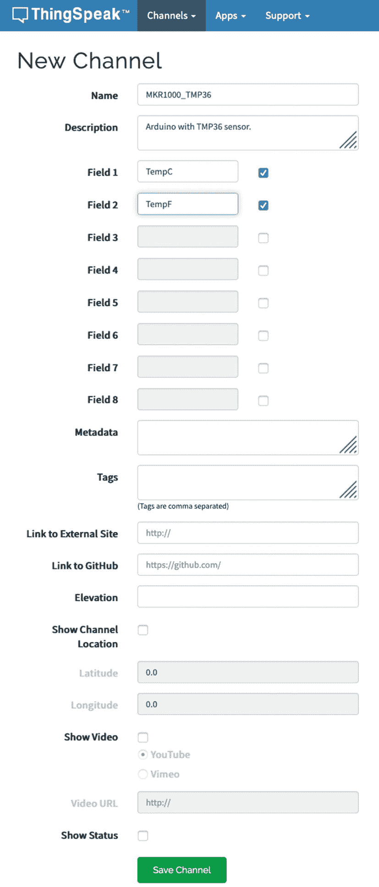

图 7-9

新渠道形式

至少，您只需要命名频道，输入描述(不严格要求，但建议如此)，然后选择(打勾)一个或多个字段来命名每个频道。就这样。点击*保存频道*完成该过程。

那么，这些频道设置是什么？下面给出了每种方法的简要概述。当您使用 ThingSpeak 时，您可能想要开始使用以下一些字段:

*   *完成百分比*:根据频道中名称、描述、位置、URL、视频和标签的完成情况计算的字段。

*   *通道名称*:通道的唯一名称。

*   *描述*:通道的描述。

*   *字段#* :勾选各框，启用该字段。

*   *元数据*:JSON、XML 或 CSV 格式的频道附加数据。

*   *标签*:逗号分隔的搜索关键字列表。

*   *链接到外部网站*:如果你有一个关于你的项目的网站，你可以在这里提供网址，在频道上发布。

*   *显示频道位置*:勾选此框，包括以下字段:
    *   *纬度*:项目或数据源传感器的纬度

    *   *经度*:项目或数据源传感器的经度

    *   *标高*:标高，以米为单位，用于受标高影响的项目

*   *视频 URL* :如果您有一个与您的项目相关的视频，您可以在此处提供 URL 以在频道上发布。

*   *链接到 GitHub* :如果你的项目托管在 GitHub，你可以提供要在频道上发布的 URL。

哇，这么多东西都是免费的！正如你将看到的，这不是一个简单的玩具或严重受限的产品。有了这些设置，你可以完成很多事情。请注意，有些地方可以放置视频、网站和 GitHub 的链接。这是因为通道可以是私有的(只有你的登录名或 API 密匙可以访问)，也可以是公共的。公开频道允许您与任何人共享数据，因此这些 URL 字段可以方便地记录您的项目。酷毙了。

一旦你创建了你的通道，是时候写一些数据了。对于大多数项目来说，有两条信息是您需要的:通道的 API 键和一些库的通道号(显示在通道页面上的整数值)。许多平台都有可用的库，在某些平台上，可能有几种方法(库或技术)将数据写入 ThingSpeak 通道。

您可以通过点击 *API 密钥*选项卡在渠道页面上找到 API 密钥。当您创建一个新通道时，您将拥有一个 write 和一个 read API 密钥。如果需要，您可以添加更多密钥，以便每个设备、位置、客户等可以使用一个密钥。图 [7-10](#Fig10) 显示了之前在图 [7-9](#Fig9) 中创建的通道的 *API 键*选项卡。

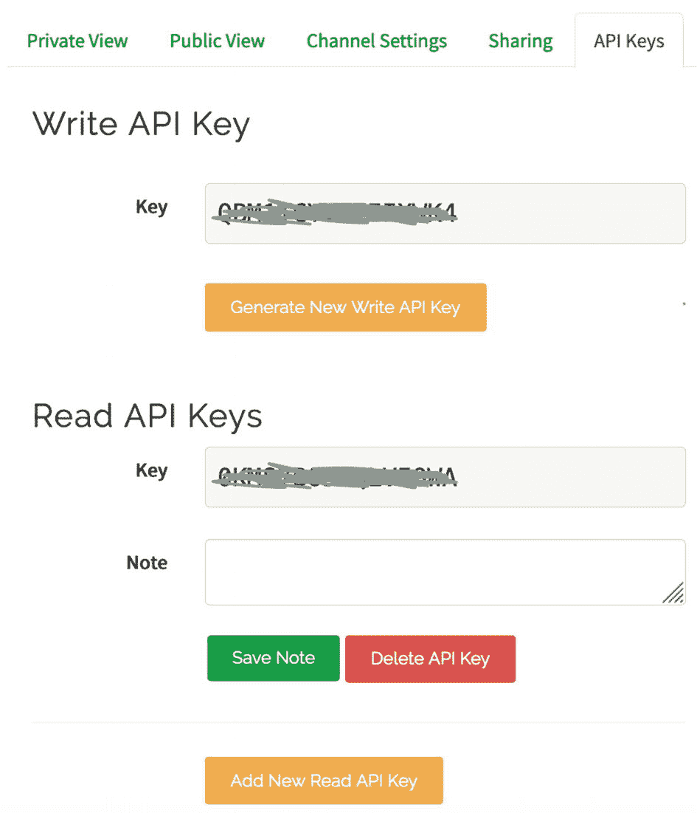

图 7-10

ThingSpeak 通道的 API 键

注意，我遮住了钥匙。如果您公开您的频道，请不要与您不想允许写入您的频道的任何人共享写入密钥。您可以通过点击*生成新的写 API 密钥*或*添加新的读 API 密钥*按钮来创建新的密钥。点击*删除 API 键*按钮可以删除读取的键。

我们在代码中使用密钥来允许设备连接到通道并向通道写入数据。因此，我们通常从频道页面复制这个字符串，并将其作为字符串粘贴到我们的代码中。回想一下，我们可能使用封装了 HTTP 或 MQTT 机制的库，或者在 Raspberry Pi Python 库的情况下，我们使用 Python 库和 HTTP 协议。我们将在即将到来的 Arduino 和 Raspberry Pi 示例项目中看到这两者。

既然你已经理解了向 ThingSpeak 写入数据的基础，那么让我们来看看如何为 Arduino 更详细地做这件事。接下来是树莓派的例子。

### 项目:用 Arduino 向 ThingSpeak 写入数据

这个项目演示了如何将传感器数据写入 ThingSpeak 通道。与本章前面的项目不同，您将使用一个传感器并生成一些样本数据。在这种情况下，您在 Arduino MKR1000 上监控温度，并将摄氏和华氏温度值保存到您的 ThingSpeak 中。如果您还没有为 Arduino 创建 ThingSpeak 通道，现在就创建，并记录通道 ID 和生成的 API 密钥。使用以下通道数据，并将其命名为`MKR1000_TMP36`，如图 [7-11](#Fig11) 所示。

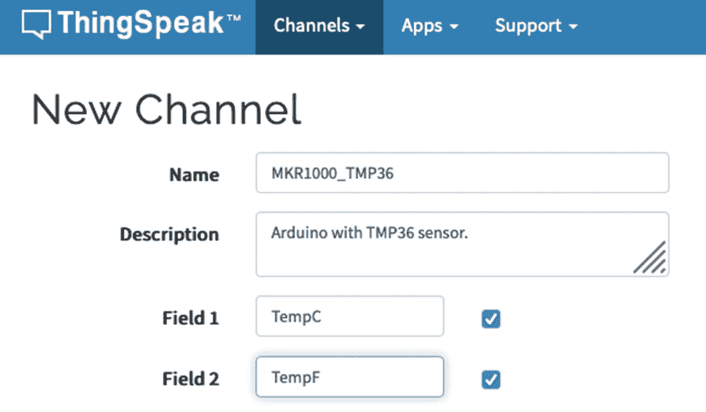

图 7-11

为 MKR1000 和 TMP36 传感器设置通道

点击*保存频道*按钮创建频道。然后，在 *API Key* 选项卡上，复制 write key 并粘贴到一个新文件中以备后用。

现在我们已经创建了一个通道，让我们设置硬件。

#### 硬件设置

本项目的硬件是 Arduino MKR1000、试验板、试验板电线、TMP36 温度传感器和 0.10uF 电容。如图 [7-12](#Fig12) 所示连接传感器和电容器。将传感器的第 1 针连接到 Arduino 上的 5V 针，将传感器的第 2 针连接到 MKR1000 上的 A1 针，将第 3 针连接到 MKR1000 上的地。电容器也连接到传感器的引脚 1 和 3(方向无关紧要)。

Tip

你可以使用较新的 MKR 型号，只要它们是 Wi-Fi 类型的。


图 7-12

Arduino 的 ThingSpeak 温度馈送的布线设置

若要使用“连接到互联网”,您还需要 Wi-Fi 接入点或路由器来连接。您将需要连接的 SSID 和密码。

现在，让我们看看如何设置软件和项目草图。

#### 配置 Arduino IDE

为了创建草图，我们需要在 Arduino IDE 中设置一些东西。我们需要确保 MKR 板得到支持，ThingSpeak 和 Wi-Fi 101 库得到安装。让我们从 MKR 董事会的支持开始。

在 Arduino IDE 中，打开一个新草图，点击*工具* ➤ *板卡 XXXX* ➤ *板卡管理器……*(其中 *XXXX* 代表你最后使用的板卡)。当表单加载时，在搜索框中键入 Arduino & MKR1000，并安装 Arduino SAMD 支持，如图 [7-13](#Fig13) 所示。

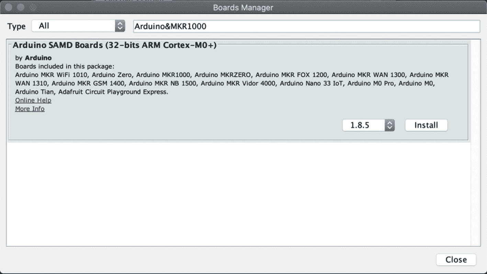

图 7-13

安装 SAMD 板支架

点击*安装*按钮，安装板卡支撑模块。在某些 PC 平台上，当您第一次使用连接到 PC 的主板启动 IDE 时，Arduino IDE 可能会提示您安装主板支持。

现在，让我们安装我们需要的两个库。你可以按任何顺序做。在 Arduino IDE 中，选择*草图* ➤ *包含库……*➤*管理库*。在搜索框中输入 ThingSpeak，然后点击*安装*按钮，如图 [7-14](#Fig14) 所示。再次点击*安装*安装库。

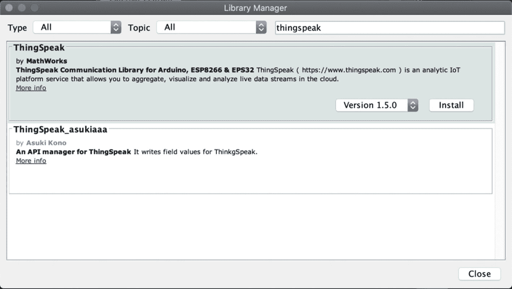

图 7-14

安装 ThingSpeak 库

我们还需要 Wi-Fi 101 图书馆，以允许使用互联网通信。在 Arduino IDE 中，选择*草图* ➤ *包含库……*➤*管理库*。在搜索框中输入 Wi-Fi 101，然后点击*安装*按钮，如图 [7-15](#Fig15) 所示。再次点击*安装*安装库。

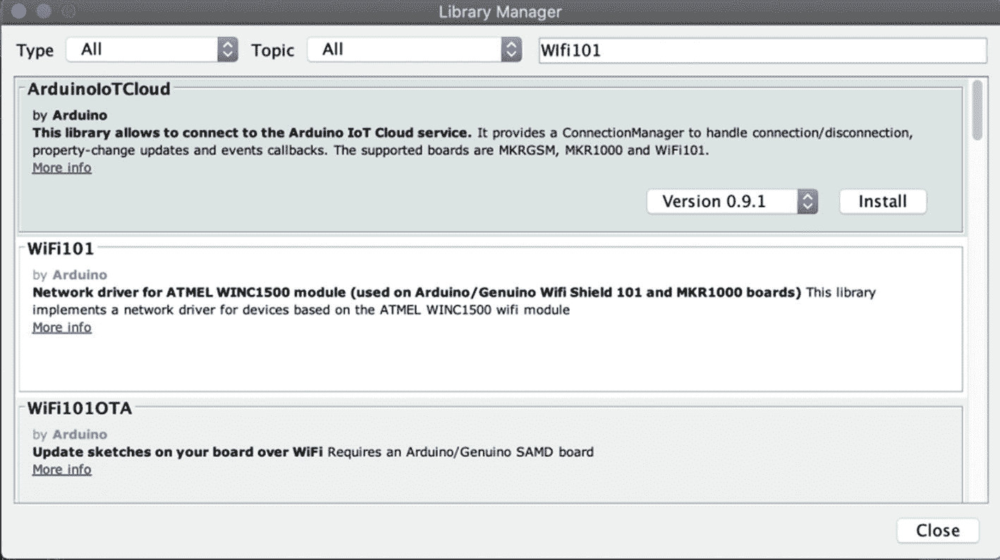

图 7-15

安装 WiFi 101 库

#### 写草图

现在您已经安装了必要的库和板模块，打开一个新的 Arduino 项目并将其命名为`arduino_thingspeak.ino`。回想一下，我们将使用 TMP36 并从 MKR1000 上的引脚 A1 读取值。我们已经在第 6 章中看到了读取 TMP36 的代码，所以我们将跳过解释，直接进入如何与 ThingSpeak 交互。

在这个例子中，我们将看到如何在一个单独的头文件(`.h`)中存储我们的 API 密钥和其他关键数据，该文件将是草图的一部分，并保存在同一个文件夹中。要添加一个头文件，点击草图右侧的*小向下箭头*按钮，选择*新建标签*，如图 [7-16](#Fig16) 所示。在提示中，输入`secrets.h`并按*键输入*。这将打开一个新的*标签。单击该选项卡打开文件。*


图 7-22

树莓派的示例 ThingSpeak 饲料

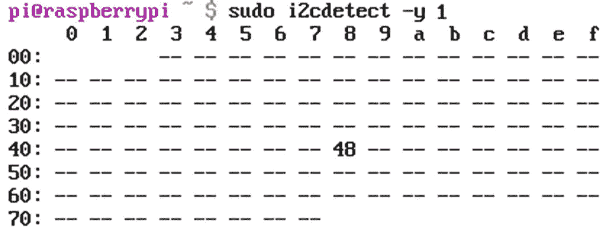

图 7-21

验证 ADC 模块

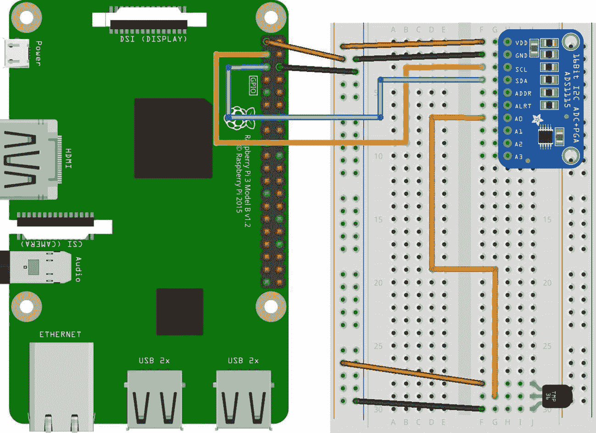

图 7-20

将 TMP36 和 ADC 连接到 Raspberry Pi

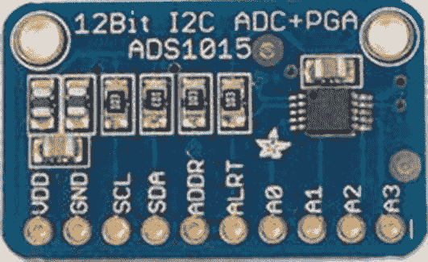

图 7-19

12 位 ADC 模块(Adafruit 提供)

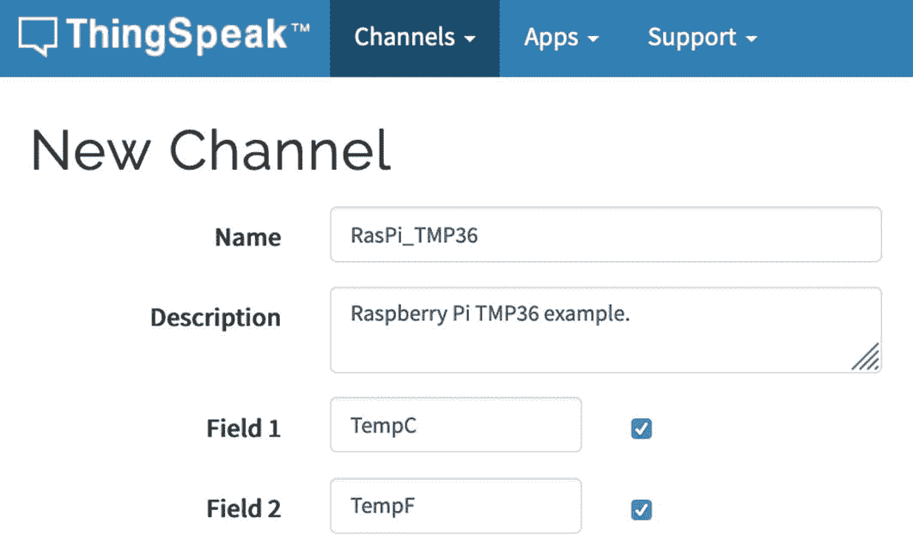

图 7-18

为 Raspberry Pi 和 TMP36 传感器设置通道


图 7-17

通道数据示例(MKR1000_TMP36)


图 7-16

添加新选项卡

我们将把 Wi-Fi 和我们的 ThingSpeak 频道数据放在这个文件中。使用`#define`指令创建我们将在主草图中使用的新字符串。以下代码显示了文件所需的行和数据。输入这些并保存文件。

```py
#define SECRET_SSID "YOUR_SSID"                 // SSID
#define SECRET_PASS "SSID_PASS"                 // WiFi Password
#define SECRET_CH_ID 0000000000                 // Channel number
#define SECRET_WRITE_APIKEY "ABCDEFGHIJKLMNOP"  // Write API Key

```

现在，返回到*主草图*选项卡。从以下内容开始草图。您需要我们刚刚创建的`ThingSpeak.h`、`WiFi101.h`和`secrets.h`文件。

```py
#include "ThingSpeak.h"
#include <WiFi101.h>
#include "secrets.h"

```

接下来，我们需要声明几个变量，并实例化 Wi-Fi 客户机，如下面的代码所示。我们还添加了一个变量来存储传感器的 pin 号。注意，我们使用存储在`secrets.h`文件中的那些`#defines`。

```py
char ssid[] = SECRET_SSID;   // your network SSID (name)
char pass[] = SECRET_PASS;   // your network password
WiFiClient  client;

unsigned long myChannelNumber = SECRET_CH_ID;
const char * myWriteAPIKey = SECRET_WRITE_APIKEY;

int SENSOR_PIN = 1;

```

要使用以太网屏蔽，您还必须声明一个 MAC 地址。以太网屏蔽的 IP 地址是通过 DHCP 请求的。您将 MAC 地址定义为数组。这可以是一组随机值，只要它们在 0x 00–0x ff 范围内。您可以使用此处显示的内容:

```py
byte mac_addr[] = { 0xDE, 0xAD, 0xBE, 0xEF, 0xFE, 0xED };

```

接下来，定义 ThingSpeak API 键和提要 ID。您还可以定义 TMP36 传感器的引脚编号。本例使用引脚 0。您可以选择想要使用的 pin——只需更改这个定义，剩下的代码就会指向正确的 pin:

```py
char ThingSpeakKey[] = "<YOUR_KEY_HERE>";
#define FEED_NUMBER <YOUR_FEED_HERE>
#define SENSOR_PIN 0

```

现在我们准备编写`setup()`方法。您必须初始化串行类(这样您就可以使用串行监视器)并初始化 Wi-Fi 和 ThingSpeak 客户端。您对这些操作中的每一个都使用了`begin()`方法。对于 Wi-Fi 类，您传入前面定义的 SSID 和密码。完整的`setup()`方法如下:

```py
void setup() {
  Serial.begin(115200);      // Initialize serial
  while (!Serial);
  // Connect to WiFi
  Serial.println("Welcome to the MKR1000 + TMP36 ThingSpeak Example!");
  while(WiFi.status() != WL_CONNECTED){
    WiFi.begin(ssid, pass);
    delay(5000);
  }
  Serial.println(" Connected.");
  ThingSpeak.begin(client);  // Initialize ThingSpeak
}

```

最后，`loop()`方法包含读取传感器的代码，计算摄氏和华氏温度，并将这些数据发送到我们的 ThingSpeak 通道。为此，我们首先调用 ThingSpeak 库的`setField()`方法来设置我们想要更新的每个字段(字段编号从 1 开始)。然后我们使用`writeFields()`方法将数据发送给 ThingSpeak。我们可以检查该调用的结果，以确保返回的代码是`200`，这意味着成功(`OK`)。这里显示了`loop()`方法的简化版本:

```py
void loop() {
  // Read TMP36 here

  // Set the fields with the values
  ThingSpeak.setField(1, temperatureC);
  ThingSpeak.setField(2, temperatureF);

  // Write to the ThingSpeak channel
  int res = ThingSpeak.writeFields(myChannelNumber, myWriteAPIKey);
  if (res == 200) {
    Serial.println("Channel update successful.");
  } else {
    Serial.print("Problem updating channel. HTTP error code ");
    Serial.println(res);
  }
  Serial.println("sleeping...");
  delay(20000); // Wait 20 seconds to update the channel again
}

```

请注意，如果没有返回代码 200，我们将显示实际结果。还要注意，我们在末尾添加了一个 sleep ( `delay()`)来休眠 20 秒。我们这样做是因为 ThingSpeak 免费帐户仅限于每 15 秒更新一次。

现在您已经理解了草图的流程和内容，您可以完成缺失的部分并开始测试。清单 [7-4](#PC34) 显示了该项目的完整草图。

```py
/**
  Beginning Sensor Networks Second Edition
  Sensor Networks Arduino ThingSpeak Write Example

  This project demonstrates how to write data to a ThingSpeak channel.
*/

#include "ThingSpeak.h"
#include <WiFi101.h>
#include "secrets.h"

char ssid[] = SECRET_SSID;   // your network SSID (name)
char pass[] = SECRET_PASS;   // your network password
WiFiClient  client;

unsigned long myChannelNumber = SECRET_CH_ID;
const char * myWriteAPIKey = SECRET_WRITE_APIKEY;

int SENSOR_PIN = 1;

void setup() {
  Serial.begin(115200);      // Initialize serial
  while (!Serial);
  // Connect to WiFi
  Serial.println("Welcome to the MKR1000 + TMP36 ThingSpeak Example!");
  Serial.print("Attempting to connect to SSID: ");
  Serial.print(SECRET_SSID);
  Serial.print(" ");
  while(WiFi.status() != WL_CONNECTED){
    WiFi.begin(ssid, pass);
    Serial.print(".");
    delay(5000);
  }
  Serial.println(" Connected.");
  ThingSpeak.begin(client);  // Initialize ThingSpeak

}

void loop() {
  // Read TMP36
  float adc_data = analogRead(A1);
  float voltage = adc_data *  (3.3 / 1024.0);
  Serial.print("Temperature is ");
  float temperatureC = (voltage - 0.525) / 0.01;
  Serial.print(temperatureC);
  Serial.print("C, ");
  float temperatureF = ((temperatureC * 9.0)/5.0) + 32.0;
  Serial.print(temperatureF);
  Serial.println("F");

  // Set the fields with the values
  ThingSpeak.setField(1, temperatureC);
  ThingSpeak.setField(2, temperatureF);

  // Write to the ThingSpeak channel
  int res = ThingSpeak.writeFields(myChannelNumber, myWriteAPIKey);
  if (res == 200) {
    Serial.println("Channel update successful.");
  } else {
    Serial.print("Problem updating channel. HTTP error code ");
    Serial.println(res);
  }
  Serial.println("sleeping...");
  delay(20000); // Wait 20 seconds to update the channel again
}

Listing 7-4Arduino-Based ThingSpeak Channel Write

```

Note

确保在`secrets.h`文件中替换您的 API 密钥和通道号。否则会导致编译错误。

花一些时间来确保所有的代码都输入正确，并且草图编译无误。一旦到了这个阶段，就可以上传草图，进行试用了。

#### 测试草图

要测试草图，请确保代码可以编译，并且您的硬件设置正确。一旦你有了一个可以编译的草图，把它上传到你的 Arduino MKR1000 并启动一个串行监视器。以下代码显示了您应该看到的输出示例:

```py
Attempting to connect to SSID: ATT-WiFi-0059 . Connected.
Temperature is 15.50C, 59.90F
Channel update successful.
sleeping...
Temperature is 16.14C, 61.06F
Channel update successful.
sleeping...
Temperature is 15.82C, 60.48F
Channel update successful.
sleeping...
Temperature is 16.14C, 61.06F
Channel update successful.
sleeping...
Temperature is 16.46C, 61.64F
Channel update successful.
sleeping...

```

你看到类似的输出了吗？如果没有，请检查串行监视器中显示的返回代码。您应该会看到返回代码 200(表示成功)。如果返回代码是一位数(1、2、3 等等)，您可能会遇到连接到 ThingSpeak 的问题。如果出现这种情况，请将您的笔记本电脑连接到同一根网线，并尝试访问 ThingSpeak。

如果连接速度非常慢，您可能会遇到每隔一次或每 N 次尝试都得到 200 以外的错误代码的情况。如果是这种情况，您可以在`loop()`方法中增加超时来进一步延迟处理。这可能有助于一些非常慢的连接，但它不是一个坏的或间歇性的连接治愈。

在访问 ThingSpeak 之前，让草图运行大约 3 分钟。草图运行一段时间后，导航到 ThingSpeak，登录并点击您的渠道页面。您应该会看到类似于图 [7-17](#Fig17) 所示的结果。

请注意图表开头和结尾附近的峰值。我通过在 TMP36(我的手指)上按压一个温暖的物体设备来模拟数据中的尖峰。如果你尝试这样做，小心不要碰到任何电线！

#### 为了更多乐趣

您可以从这个脚本中获得很多乐趣。尝试连接其他传感器，并在 ThingSpeak 中创建其他通道。你也可以尝试阅读你保存在 ThingSpeak 中的数据。

既然您已经知道如何在 Arduino 上将数据保存到 ThingSpeak，那么让我们来探索如何在 Raspberry Pi 上做同样的事情。

### 项目:用 Raspberry Pi 向 ThingSpeak 写入数据

这个项目演示了在 Raspberry Pi 上通过 HTTP 使用 ThingSpeak REST API 将传感器数据写入 ThingSpeak 通道的简单性。回想一下，要读取模拟温度传感器(TMP36)，您需要使用一个提供 12 位读数精度的 I2C 模块。

Tip

这个例子演示了如何使用 HTTP 接口向 ThingSpeak 写数据。然而，这也是一个 ThingSpeak Python 库，如果你愿意，你可以使用它。你可以用`pip3 install thingspeak`命令安装它。ThingSpeak Python 库的文档可以在 [`https://thingspeak.readthedocs.io/en/latest/`](https://thingspeak.readthedocs.io/en/latest/) 找到。

如果您还没有为 Raspberry Pi 创建 ThingSpeak 通道，现在就创建，并记录通道 ID 和生成的 API 键。使用以下通道数据并命名为`RASPI_TMP36`，如图 [7-18](#Fig18) 所示。

点击*保存频道*按钮创建频道。然后，在 *API Key* 选项卡上，复制 write key 并粘贴到一个新文件中以备后用。

现在我们已经创建了一个通道，让我们设置硬件。

#### 硬件设置

本项目的硬件包括一个 Raspberry Pi、一个 Raspberry Pi Cobbler+(可选)、一个试验板、TMP36 传感器、跳线和一个 ADC 模块。

我提到过，Raspberry Pi 不包含任何 ADC，因此不能使用模拟传感器。在本项目中，您将探索如何将多通道 ADC 与 Raspberry Pi 配合使用，以便使用 TMP36 模拟温度传感器。图 [7-19](#Fig19) 显示了 Adafruit ( [`www.adafruit.com/products/1083`](http://www.adafruit.com/products/1083) )的 12 位 ADC。该模块最多支持四个传感器(通道)。在图中，您可以看到引脚 A0–A3；这些是用于支持的每个通道的引脚。

Tip

您正在探索将 ADC 模块与 Raspberry Pi 一起使用，因为它支持 I2C 协议，但是您也可以将该模块与 Arduino 一起使用。详见 [`http://learn.adafruit.com/adafruit-4-channel-adc-breakouts`](http://learn.adafruit.com/adafruit-4-channel-adc-breakouts) 。

您还需要通过 Raspberry Pi 上的网络连接连接到互联网。互联网连接可以通过有线以太网连接或无线连接。像 Arduino 一样，对连接没有具体要求。

图 [7-20](#Fig20) 显示了您需要进行的连接。如果你已经完成了前几章中的项目，这些对你来说应该很熟悉。对于 TMP36，将引脚 1 连接到与 ADC 模块相同的 5V 连接，将引脚 3 连接到 ADC 模块的 GND 连接。传感器上的引脚 2 连接到 ADC 模块上的 A0 引脚。

按如下方式连接 TMP36 传感器(再次参见图 [7-20](#Fig20) )。

Caution

务必仔细检查您的连接，并将其与图 [7-20](#Fig20) 进行比较。树莓派上的东西连接不当会导致电路板损坏。

完成这些连接后，打开 Raspberry Pi 并发出以下命令:

```py
$ sudo i2cdetect –y 1

```

您应该会看到 ADC 模块在输出中显示为地址 0x48，如图 [7-21](#Fig21) 所示。

#### 写代码

现在您已经有了所需的库，是时候编写一个脚本来从 TMP36 传感器读取样本(通过 ADC 模块)并将数据保存到您的 ThingSpeak 通道了。由于我们已经编写了读取 TMP36 传感器的代码，因此我们将专注于向 ThingSpeak 写入数据的代码。

首先在树莓 Pi 上打开一个名为`raspi_tmp36.py`的新文件。您可以使用 Thonny IDE 或文本编辑器或终端中的`nano`来创建文件。

让我们从进口开始。我们需要为 ADC 模块导入 http.client、time、urllib、board、busio 和 Adafruit 库，如下所示:

```py
import http.client
import time
import urllib

# import the Raspberry Pi libraries
import board
import busio

# Import the ADC Adafruit libraries
import adafruit_ads1x15.ads1115 as ADS
from adafruit_ads1x15.analog_in import AnalogIn

```

接下来，我们需要为 API 键声明一个变量，并实例化 I2C 接口，如下所示:

```py
# API KEY
THINGSPEAK_APIKEY = 'YOUR_API_KEY'

# Instantiate (start/configure the I2C protocol)
i2c = busio.I2C(board.SCL, board.SDA)
# Instantiate the ADS1115 ADC board
ads = ADS.ADS1115(i2c)
# Setup the channel from Pin 0 on the ADS1115
channel0 = AnalogIn(ads, ADS.P0)

```

接下来是脚本的核心代码。我们将使用一个`try…except`块来捕获键盘中断( *Ctrl+C* )。在其中，我们准备了一个特殊的 URL 来编码我们通道的字段数据，然后打开这个 URL。

更具体地说，我们使用`urllib.parse`类`urlencode()`方法以包含字段数据的字典的形式对数据进行编码。这确保了创建的字符串在 URL 中有效使用。接下来，我们创建一个标题字典，并将其传递给`http.client`类`HttpConnection()`方法，以打开到 ThingSpeak 的连接。最后，我们以对 update REST API 端点的`POST`命令的形式将数据发送给 ThingSpeak。哇哦！下面的代码显示了这些步骤。花点时间通读它们。它们应该容易理解。记住，你可以。

```py
params = urllib.parse.urlencode(
    {
        'field1': temp_c,
        'field2': temp_f,
        'key': THINGSPEAK_APIKEY,
    }
)
# Create the header
headers = {
    "Content-type": "application/x-www-form-urlencoded",
    'Accept': "text/plain"
}
# Create a connection over HTTP
conn = http.client.HTTPConnection("api.thingspeak.com:80")
# Execute the post (or update) request to upload the data
conn.request("POST", "/update", params, headers)

```

清单 [7-5](#PC40) 显示了该项目的完整代码。你会注意到我们跳过了`print()`语句和错误处理代码，但是这些都是我们在之前的项目中看到的。在运行代码之前，请务必通读一遍，这样您就可以看到它是如何工作的。此外，您可以从图书网站下载这些代码，而不是键入所有代码。

```py
#
# Beginning Sensor Networks Second Edition
#
# IoT Example - Publish temperature data from a Raspberry Pi
# with TMP36 and ADC.
#
# Dr. Charles A. Bell
# March 2020
#
from __future__ import print_function

# Python imports
import http.client
import time
import urllib

# import the Raspberry Pi libraries
import board
import busio

# Import the ADC Adafruit libraries
import adafruit_ads1x15.ads1115 as ADS
from adafruit_ads1x15.analog_in import AnalogIn

# API KEY
THINGSPEAK_APIKEY = 'YOUR_API_KEY'

# Instantiate (start/configure the I2C protocol)
i2c = busio.I2C(board.SCL, board.SDA)
# Instantiate the ADS1115 ADC board
ads = ADS.ADS1115(i2c)
# Setup the channel from Pin 0 on the ADS1115
channel0 = AnalogIn(ads, ADS.P0)

# Run the program to upload temperature data to ThingSpeak

print("Welcome to the ThingSpeak Raspberry Pi temperature sensor! Press CTRL+C to stop.")
try:
    while 1:
        # Get temperature in Celsius
        temp_c = ((channel0.voltage * 3.30) - 0.5) * 10
        # Calculate temperature in Fahrenheit
        temp_f = (temp_c * 9.0 / 5.0) + 32.0
        # Display the results for diagnostics
        print("Uploading {0:.2f} C, {1:.2f} F"
              "".format(temp_c, temp_f), end=' ... ')
        # Setup the data to send in a JSON (dictionary)
        params = urllib.parse.urlencode(
            {
                'field1': temp_c,
                'field2': temp_f,
                'key': THINGSPEAK_APIKEY,
            }
        )
        # Create the header
        headers = {
            "Content-type": "application/x-www-form-urlencoded",
            'Accept': "text/plain"
        }
        # Create a connection over HTTP
        conn = http.client.HTTPConnection("api.thingspeak.com:80")
        try:
            # Execute the post (or update) request to upload the data
            conn.request("POST", "/update", params, headers)
            # Check response from server (200 is success)
            response = conn.getresponse()
            # Display response (should be 200)
            print("Response: {0} {1}".format(response.status,
                                             response.reason))
            # Read the data for diagnostics
            data = response.read()
            conn.close()
        except Exception as err:
            print("WARNING: ThingSpeak connection failed: {0}, "
                  "data: {1}".format(err, data))

        # Sleep for 20 seconds

        time.sleep(20)
except KeyboardInterrupt:
    print("Thanks, bye!")
exit(0)

Listing 7-5Complete Code for the raspi_thingspeak.py Script

```

Note

确保在标记的位置替换您的 API 密钥。否则将导致运行时错误。

现在您已经输入了所有的代码，让我们测试脚本，看看它是否工作。

#### 测试脚本

Python 脚本是解释程序。尽管在脚本开始时有大量的语法检查，但是直到执行语句时才发现逻辑错误。因此，如果没有正确输入脚本，您可能会遇到错误或异常(例如，如果您拼错了方法或变量名称)。如果您未能替换 API 键和提要编号的占位符，也可能会发生这种情况。

要运行该脚本，请输入以下命令。在使用 *Ctrl+C* 中断主循环之前，让脚本运行几次迭代。

```py
$ python3 ./raspi_thingspeak.py

```

以下代码显示了您应该看到的输出示例:

```py
Welcome to the ThingSpeak Raspberry Pi temperature sensor! Press CTRL+C to stop.
Uploading 18.46 C, 65.23 F ... Response: 200 OK
Uploading 18.49 C, 65.28 F ... Response: 200 OK
Uploading 19.20 C, 66.56 F ... Response: 200 OK
Uploading 18.41 C, 65.13 F ... Response: 200 OK
Uploading 18.24 C, 64.83 F ... Response: 200 OK
Uploading 18.25 C, 64.85 F ... Response: 200 OK
Uploading 18.31 C, 64.96 F ... Response: 200 OK
Uploading 18.32 C, 64.97 F ... Response: 200 OK
Uploading 18.29 C, 64.93 F ... Response: 200 OK
Uploading 18.35 C, 65.03 F ... Response: 200 OK
Uploading 18.24 C, 64.83 F ... Response: 200 OK
Uploading 18.39 C, 65.09 F ... Response: 200 OK
Uploading 18.25 C, 64.84 F ... Response: 200 OK
Thanks, bye!

```

让脚本运行 3 分钟左右，然后在 ThingSpeak 上导航到你的 Raspberry Pi 频道。您应该会看到您的传感器数据显示出来，类似于图 [7-22](#Fig22) 所示。

如果您没有看到类似的数据，请返回并检查上一个项目中讨论的返回代码。您应该会看到返回代码 200(成功)。检查并更正网络连接中的任何错误或脚本中的语法或逻辑错误，直到它成功运行几次(存储的所有样本都返回代码 200)。

如果你看到类似的数据，恭喜你！您现在知道了如何使用两个不同的平台生成数据并将其保存到云中。

#### 为了更多乐趣

您可以从这个脚本中获得很多乐趣。尝试连接其他传感器，并在 ThingSpeak 中为它们创建其他通道。你也可以尝试阅读你保存在 ThingSpeak 中的数据。

### 将传感器数据存储在数据库中

正如您可能已经猜到的，可以将传感器数据存储到 Raspberry Pi 上的数据库中。您可以使用 MySQL 作为您的数据库服务器，并使用 Connector/Python 库来编写 Python 脚本，该脚本读取传感器数据并将数据存储在表中以供以后处理。因为涉及的内容比几十行代码要多得多(比如在 Raspberry Pi 上设置 MySQL)，所以您将在第 [8](08.html) 和 [9](09.html) 章中更详细地探讨这个主题。

## 部件购物清单

完成本章中的项目需要一些组件，如表 [7-2](#Tab2) 中所列。其中一些，如 XBee 模块和支持硬件，也包含在其他章节的购物清单中。这些如表 [7-3](#Tab3) 所示。

表 7-3

以前章节中重复使用的组件

<colgroup><col class="tcol1 align-left"> <col class="tcol2 align-left"> <col class="tcol3 align-left"> <col class="tcol4 align-left"></colgroup> 
| 

项目

 | 

供应商

 | 

是吗？成本美元

 | 

所需数量

 |
| --- | --- | --- | --- |
| 按钮 | [T2`www.sparkfun.com/products/97`](http://www.sparkfun.com/products/97) | $0.35 | one |
| 试验板(非迷你) | [T2`www.sparkfun.com/products/9567`](http://www.sparkfun.com/products/9567) | $4.95 | one |
| 试验板跳线 | [T2`www.sparkfun.com/products/8431`](http://www.sparkfun.com/products/8431) | $3.95 | one |
| TMP36 传感器 | [T2`www.sparkfun.com/products/10988`](http://www.sparkfun.com/products/10988) | $1.50 | one |
| [T2`www.adafruit.com/products/165`](http://www.adafruit.com/products/165) |
| 0.10uF 电容 | [T2`www.sparkfun.com/products/8375`](http://www.sparkfun.com/products/8375) | $0.25 | one |
| 树莓派 3B，3B+或 4B | 大多数在线和零售商店 | 35 美元及以上 | one |
| HDMI 或 HDMI 转 DVI 电缆 | 大多数在线和零售商店 | 变化 | one |
| HDMI 或 DVI 监视器 | 大多数在线和零售商店 | 变化 | one |
| USB 键盘 | 大多数在线和零售商店 | 变化 | one |
| USB 电源 | 大多数在线和零售商店 | 变化 | one |
| USB A 型至 USB 微型插头 | 大多数在线和零售商店 | 变化 | one |
| SD 卡，2GB 或更大 | 大多数在线和零售商店 | 变化 | one |
| 鞋匠+ | [T2`www.adafruit.com/products/914`](http://www.adafruit.com/products/914) | $7.95 | one |
| 10K 欧姆电阻器 | 大多数在线和零售商店 | 变化 | one |
| 4.7K 欧姆电阻器 | 大多数在线和零售商店 | 变化 | Two |

表 7-2

所需组件

<colgroup><col class="tcol1 align-left"> <col class="tcol2 align-left"> <col class="tcol3 align-left"> <col class="tcol4 align-left"></colgroup> 
| 

项目

 | 

供应商

 | 

是吗？成本美元

 | 

所需数量

 |
| --- | --- | --- | --- |
| I2C EEPROM | [T2`www.sparkfun.com/products/525`](http://www.sparkfun.com/products/525) | $1.95 | one |
| Arduino 以太网盾 | [T2`www.sparkfun.com/products/9026`](http://www.sparkfun.com/products/9026) | $24.95 | 1 <sup>*</sup> |
| 微型防护罩 | [T2`www.sparkfun.com/products/9802`](http://www.sparkfun.com/products/9802) | $14.95 | <sup>*</sup> |
| Arduino 的数据记录屏蔽 | [T2`www.adafruit.com/products/1141`](http://www.adafruit.com/products/1141) | $19.95 | <sup>*</sup> |
| DS1307 实时时钟分线板 | [T2`www.adafruit.com/product/3296`](http://www.adafruit.com/product/3296) | $7.50 | 1 <sup>**</sup> |
| 实时时钟模块 | [T2`www.sparkfun.com/products/99`](http://www.sparkfun.com/products/99) | $14.95 | <sup>**</sup> |
| 12 位 ADC 模块 | [T2`www.adafruit.com/products/1083`](http://www.adafruit.com/products/1083) | $9.95 | one |

<sup>*</sup> *你只需要这些选项中的一个。*

这两种方法都可以。

## 摘要

本章探讨了 Arduino 和 Raspberry Pi 的本地存储选项。您完成了许多小型项目，展示了每种可能的储物方案。我还讨论了使用 MathWorks 的 ThingSpeak 物联网网站将传感器数据存储在云中。在那里，我们学习了如何创建通道和向通道发送数据。

在接下来的两章中，我将暂停对传感器项目的探索，开始讨论另一种形式的远程存储:数据库服务器。第 [8](08.html) 章着重于设置 MySQL 服务器，第 [9](09.html) 章着重于通过为 Arduino 编写的特殊数据库连接器(库)将 MySQL 服务器与 Arduino 一起使用。

<aside aria-label="Footnotes" class="FootnoteSection" epub:type="footnotes">Footnotes [1](#Fn1_source)

或者至少是所述时间段的数据。

  [2](#Fn2_source)

这是指旧的 FAT 文件系统对文件命名的要求，其中文件名最多可以有八个字符，扩展名最多可以有三个字符( [`http://en.wikipedia.org/wiki/8.3_filename`](http://en.wikipedia.org/wiki/8.3_filename) )。你还记得那些日子吗？

  [3](#Fn3_source)

倪！(向巨蟒小组道歉。)

  [4](#Fn4_source)

叫做皮托尼斯塔斯。

  [5](#Fn5_source)

一条路！一条路！(更多对巨蟒的歉意。)

  [6](#Fn6_source)

经验丰富的云研究人员会告诉你，关于云还有很多东西需要学习。

  [7](#Fn7_source)

[T2`http://mqtt.org/`](http://mqtt.org/)

  [8](#Fn8_source)

[T2`https://en.wikipedia.org/wiki/Representational_state_transfer`](https://en.wikipedia.org/wiki/Representational_state_transfer)

 </aside>