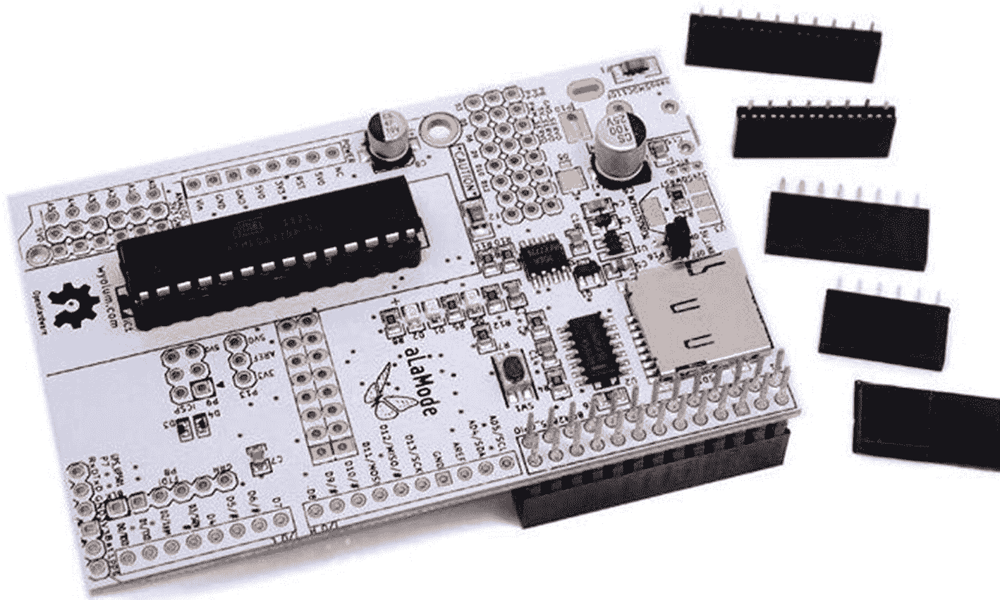
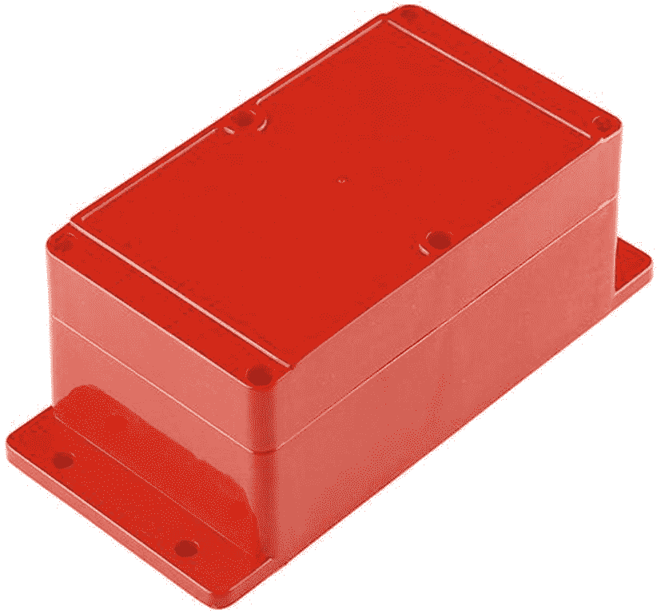

# 11.把这一切放在一起

现在，您已经了解了使用 Arduino 和 Raspberry Pi 构建无线传感器网络的基本构建模块，您可以将注意力转向设计和实现传感器网络的一些更复杂的细节。本章探讨了规划传感器网络的注意事项，讨论了一些高级传感器网络主题，并提供了设计数据库的技巧。

## 传感器网络最佳实践

让我们从讨论一些最佳实践开始 <sup>[1](#Fn1)</sup> 你可以利用它们来使你的传感器网络项目更加成功。在本节中，我将讨论规划数据聚合节点、设计数据库的实践，以及构建传感器网络的一些技巧和技术。

### 数据聚合节点的注意事项

本节分析了规划数据聚合节点的一些重要注意事项。我讨论了网络中节点的放置以及数据存储的设计考虑。

#### 网络类型和节点放置

一个重要的考虑因素是数据聚合节点可用的网络连接类型。这可能由节点的用途或物理位置决定。

如果您计划拥有一个希望通过您的计算机访问的数据聚合节点，您必须考虑将该节点放置在可以将其连接到以太网的位置。这可以通过无线以太网(WiFi)连接或电缆连接来实现。

另一方面，如果您的数据聚合节点通过 XBee 模块与传感器节点通信，模块的范围可能会决定您将数据聚合节点放在哪里。例如，如果您的传感器节点位于外屋或池塘中或池塘附近，离有网络连接的建筑物有一段距离，甚至离 WiFi 太远，您可能无法用计算机连接到该节点，因此必须定期实际访问该节点以检索数据。

这并不意味着你必须跳上你的 ATV 或高尔夫球车，每天晚上跑到老鸡舍去获取数据！事实上，你可以也应该考虑其他选择。首先，您可以使用串联放置的中间 XBee 路由器节点，直到您到达可以放置数据聚合节点的具有网络连接的位置。

这是如何工作的？这是 ZigBee 协议的优势之一——动态创建网络，并将信息从一个路由器转发到另一个路由器，以扩大最大范围。这是使用 API 模式的结果，但您也可以使用 AT 模式轻松控制这一点，并将您的数据发送到特定的路由器，然后该路由器将数据发送到另一个(和另一个)路由器，直到您到达数据聚合节点。

另一种可能性是使用定向 WiFi 连接，该连接使用视线、点对点连接来聚焦 WiFi 信号。你不必花一大笔钱去做这件事！事实上，如果你或你认识的人喜欢品客薯片，你可以使用品客薯片罐来创建一个定向 WiFi 天线( [`www.makeuseof.com/tag/how-to-make-a-wifi-antenna-out-of-a-pringles-can-nb/`](http://www.makeuseof.com/tag/how-to-make-a-wifi-antenna-out-of-a-pringles-can-nb/) )。

更极端的解决方案是在数据聚合节点上使用蜂窝调制解调器，通过互联网将数据发送到另一个节点。大多数手机运营商不赞成建立可从互联网访问的网络或数据库服务器(有些禁止)。因此，您只能将数据从家庭网络外的数据聚合节点发送到 web 或数据库服务器。此选项会产生连接的经常性费用(您需要一张 SIM 卡和您选择的运营商的数据计划)。

Note

虽然 Raspberry Pi 没有可插拔的蜂窝解决方案，但是您可以使用它的蜂窝模块。这样做需要更多的工作，也许还要构建更复杂的软件，但这应该是可能的。

例如，如果您选择将 Arduino 用于您的数据聚合节点，您可以使用 LTE CAT M1/n b-IoT Shield—spark fun([`www.sparkfun.com/products/14997`](http://www.sparkfun.com/products/14997))的萨拉-R4 shield 以及 SIM 卡将您的节点连接到互联网。 <sup>[2](#Fn2)</sup> 图 [11-1](#Fig1) 显示的是盾牌。SparkFun 产品页面上有一个使用调制解调器的草图样本。如果您使用命令 <sup>[3](#Fn3)</sup> 拨号调制解调器，您将会认出在线文档中显示的许多命令。


图 11-1

LTE CAT M1/NB-IoT Shield(由 SparkFun 提供)

如果您发现这些解决方案都不起作用，因为您的传感器节点和数据聚合节点距离任何实用(且经济实惠)的网络替代方案都太远，您可能必须考虑将这些数据聚合节点作为本地存储节点，并定期收集数据以用于您的分析。

#### 存储数据

设计数据聚合节点的一个主要考虑因素是它将存储的数据类型:也就是说，节点将支持哪些传感器。通常最好使用数据聚集节点来存储相同传感器的数据或生成相同类型数据的传感器节点的数据。

例如，如果您从几个位置收集温度数据，并从几个池塘收集水位数据，则这两个事件产生的数据是不同的。温度通常是浮点值；水位通常是一个布尔值(1 =水位正常，0 =水位低)，它对应于测量水位的最常见形式:浮子和开关。 <sup>[4](#Fn4)</sup>

显然，将这两组传感器数据存储在一起需要更多的工作，因为您将混合不同的数据类型。这可能需要做出选择，例如将数据存储在不同的文件中，甚至存储在不同的数据库中。此外，消费数据和检测数据代表什么(传感器的类型)需要更多的逻辑，因为您需要某种方法来检测什么传感器节点具有什么数据类型。

虽然存储水位和温度的问题可能很容易解决，但请考虑存储来自两个传感器的样本，这两个传感器产生相同的数据类型，但被不同地解释。回忆一下读取大气压力的例子。它也表示为浮点数。例如，您如何知道哪个传感器产生了值`65.71929`——气压传感器还是温度传感器？也许可以编写特定于传感器本身的代码，但如果传感器数据被转发到另一个节点，该怎么办呢？那么你怎么知道如何解释数据呢？

这个问题的一个解决方案是为每组相似的传感器节点使用不同的数据聚集节点。在使用温度和水位传感器节点的示例中，一个数据聚合器用于温度传感器节点，另一个用于水位传感器。

数据聚合节点上本地存储的另一种可能性是存储一个特殊字段，该字段指示数据是从哪个传感器读取的。您可以像在一些示例项目中看到的那样，包括附加信息，如日期和时间以及表示您为传感器指定的名称的文本字符串。清单 [11-1](#PC1) 展示了一个使用类似方案的文件格式的例子。第一行是为了文档的目的而提供的，通常不包含在文件中(但是精明的程序员通常会为了文档的目的而包含这样的内容)。

```py
# sensor_number, datetime, value, comment
3, 2020-02-09 14:25:21, 1, Water level Ok pond 1
1, 2020-02-09 14:30:01, 65.90013, Water temp pond 1
3, 2020-02-09 14:37:04, 1, Water level Ok pond 2
2, 2020-02-09 14:38:31, 65.81723, Water temp pond 2
1, 2020-02-09 14:45:23, 66.00123, Water temp pond 1
3, 2020-02-09 14:45:36, 0, Water level LOW! pond 2
3, 2020-02-09 14:54:17, 1, Water level Ok pond 1
2, 2020-02-09 14:59:54, 66.00011, Water temp pond 2
3, 2020-02-09 15:08:41, 1, Water level Ok pond 1
1, 2020-02-09 15:10:22, 65.99913, Water temp pond 1

Listing 11-1Storing Additional Data with the Sample

```

注意清单中的数据被格式化为逗号分隔值(CSV)文件。这是一种实现选择(您可以选择使用制表符、分号等)，使在计算机上阅读文件变得更容易。如果使用 Python，只需几次库调用就可以读取文件。

如果您检查数据，您会发现您必须了解一些关于传感器编号的信息，以便能够解释数据。如果传感器号是 1 或 2，你就知道是温度；但如果是 3 或 4，那就是水位。同样，这可能不是一个大问题，但如果您有一个数据聚合节点从几十个传感器(或者更糟，从为数据聚合节点编写代码后添加到网络中的传感器)接收样本，您可能会以传感器编号中的未知值结束，也就是说，您不知道如何解释这些值，因为您不知道哪种传感器生成了它们。您可以通过为每种类型的样本(传感器)设置单独的数据聚合节点来解决这个问题。

还要注意数据是如何排列的。你看到任何暗示一致性的东西了吗？如果您有数据库方面的知识和经验，毫无疑问您已经意识到了这一点，但是请考虑一下数据库中的表是由什么组成的:行和列，其中列是字段，行是数据。在这种情况下，您可以定义两个表，每个表有四列。水温数据可以在一个表中，因为它的值是一个整数(或者可能是布尔值)，而水温数据是一个浮点数。

显然，将这些数据存储在数据库中是有意义的。这就是数据库的用途——为单个行存储逻辑上相关的数据组(在本例中，是一个事件或样本)。记住这一点，让我们看看使用数据库存储传感器数据的注意事项。

### 传感器网络数据库的注意事项

对数据库设计主题的深入、全面的讨论超出了本书的范围。事实上，关于数据库设计已经有了整本整本的书，甚至好几卷。与其深入研究所有的理论，然后将其与实践联系起来，不如让我们从一个稍微不同的角度来看这个主题:如何最好地设计数据库以便于存储和检索。

Note

我假设没有数据库设计的先验知识。如果您有数据库设计经验，您可能希望浏览这一部分。

正如您在第 8 章[中看到的，您使用 MySQL 数据库系统作为数据库服务器。它不仅是开源的(它是免费的，就像免费啤酒一样)，而且也是开发人员最受欢迎的选择，因为它以轻量级的形式提供了大型数据库系统的特性，可以在几乎任何消费类计算机硬件上运行。MySQL 也非常容易使用，它的流行已经产生了许多学习和使用该系统的在线和印刷资源。尽管如此，下面的示例和建议可以用于任何关系数据库服务器(但可能需要对一些服务器的语法稍作修改)。](08.html)

#### 数据是如何组织的

让我们从讨论数据如何在数据库服务器中分组开始。如您所知，服务器允许您创建任意数量的数据库来存储数据。通常，您希望为每个传感器网络创建一个单独的数据库。这使得处理数据成为一个逻辑整体，因此一个传感器网络的数据不会与另一个传感器网络的数据混杂在一起。

数据库本身是许多对象的容器。在第 8 章中，你已经看到了表格甚至触发器的例子。在这里，你把注意力放在桌子上。表是一个容器，专门用于保存按其布局(列数及其数据类型)描述(或分类)的数据实例。例如，对于清单 [11-1](#PC1) 中显示的数据，您可以为温度传感器生成如下表格:

```py
CREATE TABLE `pond_monitor`.`pond_water_temp` (
  `sensor_number` int DEFAULT NULL,
  `sample_collected_on` timestamp DEFAULT CURRENT_TIMESTAMP,
  `temperature` float DEFAULT NULL
) ENGINE=InnoDB DEFAULT CHARSET=latin1;

```

注意`sample_collected_on field`。您将它定义为 timestamp，当在表中插入一行时，MySQL 将用日期和时间填充它。除非您需要绝对的准确性，否则在采集样本后立即设置该值就足以记录采集样本的日期和时间。

如前所述，清单 [11-1](#PC1) 中的例子有交错的数据。您希望分离这些数据，因此生成一个表来存储其他样本，如下所示:

```py
CREATE TABLE `pond_monitor`.`pond_water_level` (
  `sensor_number` int DEFAULT NULL,
  `sample_collected_on` timestamp DEFAULT CURRENT_TIMESTAMP,
  `water_level` tinyint DEFAULT '1'
) ENGINE=InnoDB DEFAULT CHARSET=latin1;

```

你可能想知道评论发生了什么。comments 字段(列)并不是真正需要的。回想一下在第 [8](08.html) 章中关于存储友好名称的讨论。这里，您创建一个查找表来存储数据。例如，查找表允许您将传感器编号 3 等同于水位池 1 的友好名称:

```py
CREATE TABLE `pond_monitor`.`sensor_names` (
  `sensor_number` int(11) DEFAULT NULL,
  `sensor_name` char(64) DEFAULT NULL
) ENGINE=InnoDB DEFAULT CHARSET=latin1;

```

你在这里做了什么？首先，您设计了两个表来存储来自两种不同类型的传感器的数据(根据收集的数据类型来定义)，并添加了一个查找表来帮助消除重复数据(反复存储水温池 1 会浪费空间)。

但是这对数据聚合节点意味着什么呢？如果您再次考虑清单 [11-1](#PC1) ，您会看到节点必须写入传感器编号，计算并写入时间戳(可能来自板载 RTC 或 RTC 模块)，写入来自传感器的值，并(基于查找代码)存储一个注释字符串(以便于人们阅读)。

但是，如果实现前面的表，数据聚合节点只需将传感器号和样本值发送到数据库服务器。听起来熟悉吗？这正是你在第 10 章的项目中所做的。

#### 表格设计说明

让我们回到设计表格。当你设计你的桌子时，你应该记住一些事情。首先，考虑存储样本需要什么数据类型。您不仅要考虑每个样本包含多少个值，还要考虑它们的格式(数据类型)。可用的基本数据类型包括整数、浮点、双精度、字符和布尔。还有许多其他的，包括用于日期和时间的几个，以及用于存储大数据块(如图像)的二进制大对象(blob)，大文本(与 blob 相同，但不解释为二进制)等等。有关所有数据类型( [`https://dev.mysql.com/doc/refman/8.0/en/data-types.html`](https://dev.mysql.com/doc/refman/8.0/en/data-types.html) )的完整列表和讨论，请参见在线 MySQL 参考手册。

您还可以考虑添加额外的列，比如时间戳字段、传感器节点的地址、参考电压等等。写下所有这些，并考虑每个的数据类型。

一旦决定了表中的列，接下来要考虑的是表中是否允许重复，即包含相同数据的两行或更多行。为了避免这种情况，可以通过指定一个或多个列作为键来定义主键(特殊索引)。您希望选择一列(或多列),以确保该列中没有两行具有相同的数据。

例如，如果您选择前面示例中的`sensor_number`作为主键，那么您肯定有问题。事实上，当您试图为每个传感器保存第二个值时，数据库服务器会抱怨。为什么呢？因为要成为主键，`sensor_number`列必须包含表中每一行的唯一值！

但是表的布局不包含任何保证唯一的列。您可能认为时间戳字段可以是唯一的，但尽管这可能是真的，您通常不会对主键使用时间戳字段。那么，在这种情况下你会怎么做？

您可以使用自动生成的列作为主键。它在 MySQL 中被称为自动递增字段属性。您可以将它添加到任何表中，如下所示使用`ALTER TABLE`命令:

```py
ALTER TABLE `pond_monitor`.`pond_water_temp`
    ADD COLUMN id INT AUTO_INCREMENT PRIMARY KEY FIRST;

```

这里添加一个名为`id`的新列，它是一个自动递增的字段，也是主键。添加第一个修饰符是因为主键列应该是表中的第一列(通常顺序并不重要，但在这里很重要)。

您可以对两个表执行相同的操作。一旦这样做了，当插入一个新行时，就像对时间戳字段那样指定`NULL`, MySQL 会为您填充数据。清单 [11-2](#PC6) 显示了这一原则的作用。

```py
> INSERT INTO `pond_monitor`.`pond_water_temp` (sensor_number, temperature) VALUES (3, 72.56);
Query OK, 1 row affected (0.00 sec)

> SELECT * FROM `pond_monitor`.`pond_water_temp`;
+----+---------------+---------------------+-------------+
| id | sensor_number | sample_collected_on | temperature |
+----+---------------+---------------------+-------------+
|  1 |             3 | 2020-02-10 11:39:51 |       72.56 |
+----+---------------+---------------------+-------------+
1 row in set (0.0004 sec)

> INSERT INTO `pond_monitor`.`pond_water_temp` (sensor_number, temperature) VALUES (3, 82.01);
Query OK, 1 row affected (0.00 sec)

> SELECT * FROM `pond_monitor`.`pond_water_temp`;
+----+---------------+---------------------+-------------+
| id | sensor_number | sample_collected_on | temperature |
+----+---------------+---------------------+-------------+
|  1 |             3 | 2020-02-10 11:39:51 |       72.56 |
|  2 |             3 | 2020-02-10 11:40:53 |       82.01 |
+----+---------------+---------------------+-------------+
2 rows in set (0.0005 sec)

Listing 11-2Auto-Increment Fields

```

Does that Really do Anything?

您可能会认为这个新字段向表中添加了一个人工主键，实际上并没有做任何事情。在很大程度上，你是正确的。

这个例子是为了说明的目的，因此教导了使用主键的概念，这是您在设计表时应该考虑的一个实践。实际上，自动递增键不用于引用另一个表，或者它与行本身相关，这一点在实践中被忽略了。

让我们回到查找表。虽然这个表不太可能有很多行(这取决于传感器的数量)，但是这个表中的一行与一个且仅一个传感器匹配也是事实。因此，您可以在这里使用`sensor_number`列作为主键。我将`ALTER TABLE`语句留给您考虑。

Note

数据库设计者有时放弃在只有几行的表上使用主键，理由是维护索引需要额外的开销等等。事实上，这两种方式都无关紧要，因为查找表很少被修改(更改或添加数据)，如果频繁使用，可能会导致整个表被缓存。也就是说，添加一个主键没有坏处。

#### 添加索引以提高查询效率

主键是一种特殊类型的索引。它是一个索引，但是当与自动递增字段一起使用时，它是一种识别给定行并允许重复行(在其他列中)的好方法。然而，索引的另一个方面可以使您的数据访问更容易(也可能更快)。

现在考虑一个有几千行的表。 <sup>[5](#Fn5)</sup> 假设您想查看 2 号传感器的所有传感器样本。数据库服务器如何使用您之前定义的表找到所有这些行？您发出下面的查询，但是服务器内部发生了什么呢？

```py
SELECT * FROM `pond_monitor`.`pond_water_temp` WHERE sensor_number = 2;

```

因为该表有一个索引(您添加的列`id`上的主键)，所以它使用这个索引系统地按顺序读取每一行，选择(返回)那些匹配`WHERE`子句的行(在本例中是 sensor_ `number = 2`)。这很糟糕，因为服务器不知道这些行是否出现在前 N 行，甚至不知道`sensor_number = 2`是否在表的最后一行。因此，它必须读取每一行。这称为表扫描，最好在处理包含许多行的表时避免。

你是怎么做到的？通过添加另一个称为二级索引的索引！如果在`sensor_number`列上有一个索引，服务器可以使用该索引以不同的顺序检查每一行。它会从 r 1 开始浏览表格，然后是 2，依此类推。它知道在读到最后一行`sensor_number`为 2 时停止。事实上，MySQL 包含了一些额外的技巧，允许服务器(称为优化器的部分)进一步加速查询并跳到第一行`sensor_number` = 2。这是你怎么做的。您可以使用创建索引命令:

```py
CREATE INDEX s_num ON `pond_monitor`.`pond_water_temp` (sensor_number);

```

`CREATE INDEX`命令允许您命名索引(`s_num`)并在括号中指定您想要索引的表(`ON pond_water_temp`)和列(`sensor_number`)。你可以在在线 MySQL 参考手册中看到这个命令和 MySQL 支持的所有其他命令的完整语法解释。

现在，当您发出前面的`SELECT`时，服务器使用新的索引以不同的顺序读取行。请注意，这些行在磁盘上没有被重新排序；相反，索引会创建一个备用的映射或访问方法，以特定的顺序查找行。

您可能会想，“但是等等:我不能一次完成所有这些表格设计步骤吗？”答案是肯定的，可以！让我们把`pond_water_temp`表看作一个单独的`CREATE`语句:

```py
CREATE TABLE `pond_monitor`.`pond_water_temp` (
  `id` int NOT NULL AUTO_INCREMENT,
  `sensor_number` int DEFAULT NULL,
  `sample_collected_on` timestamp NULL DEFAULT CURRENT_TIMESTAMP,
  `temperature` float DEFAULT NULL,
  PRIMARY KEY (`id`),
  KEY `s_num` (`sensor_number`)
) ENGINE=InnoDB AUTO_INCREMENT=3 DEFAULT CHARSET=latin1

;

```

请注意，首先定义的是自动递增列，然后是您的传感器编号、收集样本时的时间戳、值(温度)以及主键和辅助索引定义。这条语句取代了您刚才使用的三条语句——CREATE TABLE、`ALTER TABLE`和`CREATE INDEX`。酷吧。

正如您所看到的，一旦您理解了语法(并且知道您想要做什么)，在 MySQL 中创建表是很容易的。你可以在在线 MySQL 参考手册( [`https://dev.mysql.com/doc/refman/8.0/en/sql-statements.html`](https://dev.mysql.com/doc/refman/8.0/en/sql-statements.html) )中找到所有的语法和每个语法的许多例子。

同样，在设计表时要考虑的事情要多得多，但是这些至少是您需要知道的事情，以便充分利用您的数据库系统并有效地存储和检索您的数据。

### 其他考虑因素

本节探讨一些额外的最佳实践，这些实践有助于让您更愉快地使用传感器网络。

#### 保持在 XBee 模块的范围内

XBee 模块具有令人印象深刻的范围，掩盖了其微小的尺寸。您在本书中使用的 XBee 系列 2 模块的规格如下

*   *室内/市区*:最高 133 英尺

*   *室外视线*:最远 400 英尺

然而，这些最大值在很大程度上受相似频率设备的干扰和您所在建筑的组成的影响。例如，假设你的房子很旧，有灰泥墙和铁皮屋顶。您家中的任何无线设备在低于指定范围的情况下都能正常工作。您需要在自己的位置测试您的 XBee 范围，以找到您的最大范围。如果这不切实际，我建议您在规划网络时将规格值减半，以确保不会将基于 XBee 的传感器节点置于范围之外。

在开发传感器网络之前，您可以测试 XBee 模块的最大范围。一种方法是创建 XBee 温度传感器节点项目，并在通过 XCTU 应用程序连接的笔记本电脑上使用 USB XBee 适配器。接下来，我将介绍一种不科学的方法来确定最大可靠范围。为此，您的传感器节点应该设置为每隔几秒钟(比如每 10 秒钟)发送一次数据，并运行 API 固件:

1.  将协调器节点连接到笔记本电脑。

2.  通过 XCTU 连接到协调员。

3.  将传感器节点放在预定位置。

4.  将您的笔记本电脑放在传感器节点附近(几英尺之内)，并打开传感器节点的电源。

5.  等到 XBee 网络形成，你开始接收数据。

6.  慢慢走开，观察协调员收到的数据。

7.  当协调器开始呈现错误包或停止接收数据时，您已经做得太过分了。

这种方法并不科学，但它可以给你一个粗略的标准，判断你的传感器节点是否离你的数据聚集节点足够近(在范围内)。

#### 保存工程日志

许多开发人员、工程师和科学家使用 Evernote ( [`http://evernote.com/`](http://evernote.com/) )这样的应用程序在纸质笔记本或数字笔记本上记录他们的项目。当你没有时间或者使用纸笔太危险时，录音机也可以方便地捕捉那些即兴的想法。有些人比其他人更详细，但大多数人会在会议和电话交谈中做笔记，从而提供口头交流的书面记录。

最好的笔记者会在他们的想法出现时写下来。有时候，当你在执行琐碎的任务时，头脑工作得最好，想法会突然出现。当这种情况发生时，优秀的工程师知道记下这些想法——即使它们后来变得一文不值——因为最好的想法往往始于一个简单的概念。没有写下这些小细节往往会导致更多的实验，甚至浪费时间去寻找替代品。

如果你没有记录工程日志的习惯，你应该考虑这样做。我发现日志是我工作中的一个重要工具。是的，写东西确实需要更多的努力，如果你试图包含所有你认为重要的各种图纸和电子邮件，日志可能会变得混乱(我的笔记本经常塞满了从重要文件中剪下的剪报，就像某种工程师的剪贴簿)。然而，回报可能是巨大的。

在设计传感器网络以及相关的无数传感器和电子电路时尤其如此。你可能在一个贸易展(或制造商博览会)上看到一些真正激发灵感的东西。或者你在杂志上看到一个电路，或者发现一个非常酷的传感器，但需要设计一个电路来容纳它。写下这些想法可以让你实现目标。

它还可以帮助您记住概念和关键信息，如传感器的接线方式，以避免返工(或猜测)，这可能会导致组件故障和挫折。我非常感谢我保留了一个日志，当我仔细检查我的布线时，只发现一个放错地方的跳线或布线。它节省了我的时间和金钱(不必更换油炸组件)。

当然，你可以使用任何类型的笔记本电脑；但是如果你想让你的笔记更高级一点，你可以买一个专门用来保存工程笔记的笔记本。这些通常有柔和的网格线，有时还有记录关键信息的文本区域，如项目名称和页码。我最喜欢的笔记本之一是来自创客小屋( [`www.makershed.com/products/makers-notebook-hard-bound`](http://www.makershed.com/products/makers-notebook-hard-bound) )的创客笔记本。

这个笔记本有 150 页标有数字的图纸，每一页都有一个特殊的标题，用来标注项目名称、日期和页面参考指针。它还包括一些很好的附加功能，如一个目录空间，一个口袋，用于存放那些你写给自己但后来因为自己的笔迹而无法阅读的小纸条， <sup>[8](#Fn8)</sup> ，以及带有电子元件的贴纸，用于制作电路。这款笔记本比一般的线条或网格填充笔记本贵一点，但如果你想要一个好工具来帮助管理多个项目的笔记，它是值得一看的。

How to Manage Pages for Multiple Projects

为正在进行的多个项目保存一个笔记本的挑战之一是如何管理页面。也就是说，如果你正在进行项目 X，并在进行项目 Y 的过程中写下一些非常酷的想法，你如何跟踪每个项目的页面呢？

制作者的笔记本解决了这个问题，它允许你在每一页的底部留出空间来记录下一页的页码。当你的项目笔记开始交错时，这真的很有帮助。可以把它想象成一种手动链表。

另一个解决办法是在你的笔记本前面保留一个活索引，列出每个项目的页码。这没有 Maker Shed 解决方案好，但很有效。

#### 综合考虑:测试和部署您的传感器网络

本书中的项目旨在教你如何通过将任务分解成可以组合的更小的组件来构建传感器网络。除了第 [10](10.html) 章中的项目(它们是完整的传感器网络示例)，您可以在与其他项目相对隔离的情况下实施每个项目。有些是替代实现，比如展示相同项目首先使用 Arduino，然后使用 Raspberry Pi 的例子。

在某些情况下，尤其是在“为了更多的乐趣”一节中，我已经建议了一些修改和替代解决方案供您试验。实验是一种很好的学习方式，但在准备自己的传感器网络时，您应该考虑对解决方案进行更正式的评估。

换句话说，在部署网络之前先对其进行测试。我无法告诉你有多少次一个精心设计的硬件设计由于一些与设计无关的意外结果而失败。例如，您可能会发现在规划网络时不存在或没有考虑到的物理障碍；或者该区域可用的电缆或电源可能有故障；或者，您可能会发现您的无线电在目标环境中的实际范围比预期的要短。无论是哪种情况，通常在部署解决方案之前对其进行基准测试有助于消除节点本身的问题，让您能够专注于不同之处—物理环境。

我所说的基准测试是指在一个位置组装组件，并启动所有组件，就像在现场部署一样。这不仅允许您确保传感器网络正常工作，还允许您监控节点本身的异常情况。例如，错误地连接一个组件可能会损坏它，但有时您可以通过快速切断电源来挽救该组件。

让我们考虑第 [10](10.html) 章的最后一个项目——一个传感器网络，包括一个数据库节点、一个数据聚合节点和几个传感器节点。有几种很好的方法来测试这样的网络，但是下面的方法可以帮助您诊断在部署自己的传感器网络时可能遇到的问题。在这种情况下，我假设每个节点的软件都正确安装并运行(即 XBee 节点配置正确，草图和脚本运行正常):

1.  从数据库节点开始，启动它并测试网络的连接性。确保您可以作为计划使用的用户帐户连接到 MySQL(并从需要访问它的机器-IP 地址-连接到 MySQL ),并且该用户具有更新您设计的数据库的权限。有关向用户授予权限的更多信息，请参见在线 MySQL 参考手册。

2.  移动到数据聚合节点，并修改草图以将虚拟数据插入到数据库中。回到数据库，确保数据已经插入。

3.  关闭数据聚合节点的电源，并将协调器 XBee 模块移至 USB XBee 适配器。将其连接到您的笔记本电脑，打开终端应用程序，并使用 XBee 模块连接到 USB 端口。

4.  打开每个传感器节点的电源，一次一个，并观察终端窗口。确保每个传感器节点发送数据，并且数据被接收(在终端中回显)。关闭所有 XBee 节点的电源，并从笔记本电脑上移除协调器节点。

5.  将数据聚合节点返回到其运行状态(包括运行最终草图或脚本)，并给它加电。等待大约 5 分钟，然后打开传感器节点的电源。连接到数据库服务器，并确保数据被插入到表中。

一旦您的传感器网络组装完毕并正常运行，您就可以开始考虑部署了。我更喜欢先部署传感器节点，并且(如果可能的话)将我的数据聚合节点和数据库服务器移动到离传感器节点更近的地方。然后，我打开所有的电源，从数据库服务器开始，然后是数据聚集节点；然后，我等待 5 分钟，打开传感器节点的电源。

将数据聚集节点移动到靠近传感器节点的实际位置有助于最小化范围或障碍物的任何问题。当我看到网络运行正常时，我关闭所有设备，将我的数据聚合节点部署到正确的位置，然后重新开始这个过程。一旦这个阶段成功了，我就部署数据库服务器并再次测试网络。当一切正常工作时，我再次关闭所有电源，擦除数据(使用`DELETE SQL`语句)样本数据，并打开所有电源。至此，我的部署已经完成，我可以进入下一个阶段:使用积累的数据进行分析。

考虑到这些最佳实践和注意事项，让我们来看一个有时会导致即兴修补的主题。 <sup>[9](#Fn9)</sup>

Note

本章中的项目用于演示目的，因此不包括构建每个项目的所有步骤。然而，鉴于您目前的知识水平，您可以轻松地填补缺失的部分。

## 选择传感器节点

当您考虑如何安装传感器时，您需要做出一些选择。有时这个决定是基于传感器的类型和它产生的数据。例如，您可以使用 Arduino 托管几乎任何传感器。通过一些额外的硬件，你可以用 Raspberry Pi 做到这一点；您还可以使用 XBee 模块托管某些传感器(参见第 [2](02.html) 章)。

但是其他因素可以决定传感器节点和数据聚合节点的配置。其中包括要使用的网络类型，以及传感器节点是使用以太网还是 XBee (ZigBee)进行通信。到目前为止，您还没有研究过传感器节点的许多替代配置。在本节中，我将更详细地讨论这些方面。

### 有线还是无线？

我在第 [10](10.html) 章中提到，我认为有线以太网连接是数据聚合节点的一个要求。但那只是最典型的情况。可能是你有 WiFi 以太网代替。

主要原因是数据聚集节点通常比传感器节点被更频繁地访问。您可以包括拥有 web 服务器的数据聚合节点，正如您在第 [10](10.html) 章中看到的，或者您可以决定让数据聚合节点将数据发送到另一个节点(如数据库)进行存储。在这些情况下，拥有一个快速可靠的网络是必须的。

通常，您使用 XBee 模块和 ZigBee 协议将数据聚合节点连接到传感器节点。但是，您可以使用 ZigBee 中的 API 协议与您的数据聚合节点进行通信。挑战在于构建一组例程来匹配您打算如何与数据聚集节点进行交互。这不是不可能的(我已经看到了设计这种网络的人的证明)，但是这需要更多的工作，并且消除了数据访问的许多可能性。

主要考虑的是将数据聚合节点放在最可靠的网络介质上。有线以太网是最强大的，其次是 WiFi 和 ZigBee。如果数据将存储在本地并手动检索，那么网络介质的选择可能并不重要。但是，如果您需要远程访问数据或者将数据存储在远程节点上(比如数据库服务器)，那么有线以太网绝对是正确的选择。

### Arduino 还是树莓 Pi？

选择 Arduino 还是 Raspberry Pi 应该基于很多因素。这些因素包括成本、安全性、功能性、可扩展性和连接性。您的选择可能基于其中的一个或多个，并可能决定(或限制)您的传感器或数据聚合节点的实施。

#### 费用

如果您正在规划一个大型网络或预算有限，成本可能是首要考虑的问题。这可能会在每个节点的成本中看到。传感器是典型的商品，不同供应商的价格通常相差不大。但是主机本身的价格可能会有所不同。让我们从成本的角度来看每块板。

树莓派 3B(在美国)目前的平均价格约为 40 美元。这比这些主板的建议零售价高出了 5 美元，但是考虑到高需求和有限的供应，供应商要价更高也就不足为奇了。

Arduino 的价格有点难以确定。因为 Raspberry Pi 是闭源的，而 Arduino 是开源的，所以你可以发现很多不同的供应商在销售各种 Arduino 兼容的主板。虽然你可以从不同的供应商那里买到一个树莓派，但是没有树莓派的克隆版本。因此，你可以找到任何种类的 Arduino 兼容板，起价低至 15 美元。目前，一个 Uno 或 Leonardo 复制品的平均价格(在易贝和亚马逊上)约为 20 美元。

如果您计划部署 20 个传感器节点(没有一个是基于 XBee 的)，那么通过选择 Arduino 而不是 Raspberry Pi，您可以节省大量成本。例如，如果您发现 Raspberry Pi 板的价格为每块 40.00 美元，Arduino 兼容板的价格为每块 20.00 美元，那么使用 Raspberry Pi 板将比 Arduino 板多花费 400.00 美元。

然而，如果你必须用屏蔽来增加你的 Arduino 板，屏蔽的成本可能会使你的总支出更接近 Raspberry Pi 的成本(除非你购买 Uno WiFi 版本)。在某些情况下，买一个 Arduino 和一个 shield 甚至比买一个 Raspberry Pi 还要贵。总的来说，如果成本是一个问题，Arduino 通常是更便宜的选择。

#### 安全

在本书中，我没有过多地讨论安全或保护您的传感器和数据聚合节点。让我们花点时间来简单考虑一下这个话题。

我们通常都认为数据库节点应该是安全的，只有少量的密码安全和访问限制， <sup>[10](#Fn10)</sup> 传感器节点本身呢？盗窃可能不太令人担心，但您至少应该考虑保护您的传感器节点免遭盗窃。寻找机会目标的普通窃贼不太可能窃取您的传感器节点。 <sup>[11](#Fn11)</sup>

但是，对节点的物理访问是一个问题。虽然如果有人可以直接访问 Arduino 节点，他就有可能利用 Arduino 节点，但是使用 Arduino 比使用 Raspberry Pi 要困难得多。主要原因是 Arduino 是电子加载的；有人可以对微控制器重新编程，但如果不知道草图是怎么写的，他们也无能为力。但是利用 Raspberry Pi 节点所需要的只是一张加载了新操作系统的 SD 卡。因此，你应该考虑让某人尽可能难以物理访问你的 Raspberry Pi 节点——尤其是当他们连接到你的本地网络或互联网时。

可悲的是，还有另一个问题——电子入侵。因为 Arduino 是一个微控制器，所以不太可能有人试图连接到它来进行邪恶的活动。有人试图利用 Raspberry Pi 节点的可能性要大得多。这意味着您在部署基于 Raspberry Pi 的节点时必须更加小心。基本的安全实践有很长的路要走，但是如果您不注意防范入侵，您的 Raspberry Pi 节点可能会很容易受到攻击。

如果你关心你的节点的安全，你应该考虑阅读更多关于传感器网络安全的知识。然而，这里的底线是 Raspberry Pi 节点比 Arduino 节点更容易被利用。

#### 功能

主机提供的功能是您可能希望关注的另一个方面。如果您希望添加功能，例如 web 服务器、本地数据库服务器、通过 SSH 的远程访问，或者连接到硬盘、键盘、显示器等外围设备，那么您别无选择。Raspberry Pi 是一台功能齐全的个人电脑(和迷你服务器)。

另一方面，Arduino 非常容易编程，并且具有更广泛的硬件支持基础，因此可以支持更广泛的传感器选项，甚至电子电路。这是因为 Arduino 拥有比 Raspberry Pi 的 GPIO 更强大的硬件接口。

例如，假设 Raspberry Pi 需要一个 ADC 来与模拟传感器接口。因此，如果您计划仅使用模拟传感器，但仍需要 Raspberry Pi 的功能，传感器的成本会稍高(ADC 模块的价格)。

这取决于您是需要类似计算机的功能还是更好的硬件支持选项。如果您的节点需要个人计算机或服务器功能，您应该选择 Raspberry Pi。如果您需要支持更多样化的传感器和相关硬件，您应该选择 Arduino。

#### 膨胀性

可扩展性(也可称为可伸缩性)与功能性密切相关。我把它作为一个单独的考虑因素，因为它与传感器网络有关。您应该考虑可扩展性的两个方面:可插拔模块的可用性和向节点添加更多功能的能力。

Arduino 是可插拔模块可用性的明显赢家。有几十种屏蔽支持各种硬件特性。从简单的传感器板到 XBee 主机，再到先进的电机控制和机器人技术，您可以为传感器网络做任何事情。

这并不意味着你应该把覆盆子酱排除在外。如果您需要在一个节点上存储大量数据，您不太可能选择 Arduino，因为将本地硬盘添加到 Raspberry Pi 非常容易。同样，如果您需要复杂的显示功能，Raspberry Pi 不需要额外的硬件(只需使用显示器)。

Note

您确实可以在 Arduino 上使用中小型液晶面板。Arduino IDE 中有很多例子，包括示例草图。然而，编写一个 Python 脚本来产生屏幕输出要比试图在一个小 LCD 上塞满大量信息容易得多。

因此，如果您从电子角度需要可扩展性，您应该选择 Arduino。如果您需要更多的可扩展性来连接存储设备或显示大量数据，您应该选择 Raspberry Pi。

#### 连通性

最后要考虑的领域是连接性。还是那句话，这取决于你的视角。如果您想通过 XBee 模块将您的节点连接到其他节点，这些平台同样能够胜任。

如果您计划将您的节点连接到以太网，您必须考虑这样一个事实，即 Raspberry Pi 3B、3B+和 4B 带有 lan 端口(以太网)和 WiFi，而 Arduino(不包括 Yun 和 Arduino Uno 以太网变体)需要以太网或 WiFi 屏蔽；所以成本可能会近很多。例如，你可以花大约 30.00 美元购买一个基本的 Arduino 以太网克隆屏蔽。鉴于 Arduino 的旧克隆板价格约为 20 美元，您的成本已经超过了 Raspberry Pi。

然而，Arduino 目前在连接方面比 Raspberry Pi 有一个优势:它更容易连接专门的硬件。回想一下前面关于使用蜂窝调制解调器将节点连接到互联网以收集数据的讨论。因为 Raspberry Pi 没有可插拔的解决方案，所以在这种情况下 Arduino 是更好的选择。这也适用于通过使用专用屏蔽提供的其他形式的连接。

因此，考虑到以太网和蓝牙的连接性，Raspberry Pi 具有优势，而蜂窝调制解调器等专用通信则使 Arduino 具有优势。

Tip

有些情况下，您可能希望拥有 Raspberry Pi 的强大功能，但又希望拥有 Arduino 的灵活性和可扩展性。我将在下一节揭示一个这样的解决方案。

现在，您已经了解了选择要使用的主机的一些注意事项，让我们看看您可能想要考虑的几个备选解决方案——从专门构建的传感器节点开始。

### 替代主机

本节考虑了两种基于传感器和数据聚合节点的备选方案。您会看到一个专为传感器网络和户外操作设计的 Arduino 兼容板，以及一个子板，旨在创建一个结合了 Raspberry Pi 和 Arduino 的混合节点。

#### Seeed Studio 无线传感器套件

最好的 Arduino 兼容套件之一是 Seeed Studio 无线传感器套件——也称为 Stalker 防水太阳能套件( [`http://wiki.seeedstudio.com/Seeeduino_Stalker_V3-Waterproof_Solar_Kit/`](http://wiki.seeedstudio.com/Seeeduino_Stalker_V3-Waterproof_Solar_Kit/) )。该套件由 Seeed Studio Stalker 板、太阳能电池板、电池组、外壳(一个玻璃罐！)、XBee 适配器、硬件和附件。图 [11-2](#Fig2) 显示了套件中包含的内容。


图 11-2

Seeed Studio Stalker 无线传感器节点(Seeed Studio 提供)

Seeed Studio Stalker 板是一个 Seeeduino (Arduino 兼容)板，是该套件中真正的瑰宝。它不仅与 Arduino 完全兼容(因为它具有相同的处理器)，而且还具有板载 RTC、XBee 头、microSD 卡驱动器、实时时钟(用于记录样本日期时间)、Grove 连接器等。完整规格可在 [`http://wiki.seeedstudio.com/Seeeduino-Stalker_v3/`](http://wiki.seeedstudio.com/Seeeduino-Stalker_v3/) 找到。图 [11-3](#Fig3) 更详细地展示了跟踪板的照片。


图 11-3

Seeeduino Stalker Arduino 兼容板(由 Seeed Studio 提供)

Stalker 基于其板载 XBee 支持作为无线传感器节点进行营销。你可能想知道为什么我把对这个板的讨论留到了书的结尾。简而言之，Stalker 是一个专门的电路板，需要用非常特定的硬件和软件来构建您的传感器节点。虽然它确实可以通过消除大量连接模块和与模块接口的困难工作来简化传感器网络的构建，但这种性质使得它对于了解传感器节点是如何构建的价值不大。

最好学习组装传感器节点的基本构建模块，这样当您开始使用更高级的传感器网络或将高级传感器集成到传感器节点中时，您就有了使用它们的适当经验和知识。此外，从头开始构建东西要有趣得多。 <sup>[十三](#Fn13)</sup>

然而，如果主板的特性是你所需要的，那么你应该考虑尽可能多地使用这些特性。成本有点高，可以想象。该套件的成本约为 59.50 美元，主板本身为 39.00 美元。如果你认为该板有一个 RTC 和 XBee 接头，39.00 美元的成本低于购买一个 Arduino，单独的 XBee 屏蔽和 RTC 模块相结合。

所有的机载功能都可以在你的草图中使用。例如，您可以只使用一个方法调用从板载 RTC(ds 3231 芯片有一个温度传感器)读取温度。要获得此功能，您必须从 [`https://jeelabs.org/pub/docs/rtclib/`](https://jeelabs.org/pub/docs/rtclib/) 下载并安装 DS3231 库。

DS3231 库和 Stalker 使构建和部署温度传感器节点变得非常容易。你所需要做的就是添加你在以前的项目中探索过的 XBee 代码，你就可以快速构建一个太阳能供电的无线温度传感器节点。酷。

Tip

你可以在公司的维基上找到更多关于编程 Seeed Studio Stalker 的信息( [`http://wiki.seeedstudio.com/Seeeduino_Stalker_V3.1/`](http://wiki.seeedstudio.com/Seeeduino_Stalker_V3.1/) )。

回到套件的太阳能部分，Stalker 有一个锂聚合物(LiPo)电池充电电路，专门设计用于连接太阳能电池板和 LiPo 电池。太阳能电池板在白天为电池充电，为节点提供足够的电力运行一整夜(假设您的 XBee 正在使用睡眠模式，并且您没有太多消耗电力的电路)。这意味着您可以构建这一套件，并在户外使用它来将传感器数据传输到您的传感器网络，而不必担心供电或网络连接。如果你有一个没有电的附属建筑(或池塘)，这个工具包有你需要安装一个远程传感器的功能。

我最喜欢 Seeed Studio Stalker 的一点是，它是一个完全兼容的 Arduino 克隆。如果您不使用防水外壳中的 Stalker，您可以使用它来代替您的一个 Arduino 节点(因为它是 Arduino)。借助板载 RTC、XBee 接头和 microSD 卡驱动器，您甚至可以将该板用于所有传感器节点，包括数据聚合器。

如果您正在规划一个家庭温度监控传感器网络，您至少应该考虑将此板用于您的远程传感器。然而，考虑到您在无线传感器套件中获得的所有好东西，这是一个很好的价值。

#### 树莓派阿拉姆德

你可以考虑的另一种变体是树莓派阿拉莫代。该板是一个非常特殊的硬件，旨在弥合 Arduino 和 Raspberry Pi 之间的差距。虽然最初是为早期版本的 Raspberry Pi 开发的，但 Alamode 是 Raspberry Pi 的子板，可插入 GPIO 头，并具有完全兼容的 Arduino 克隆。

Seeed Studio 也提供这种板，具有许多相同的功能。详见 [`www.seeedstudio.com/Alamode-Arduino-Compatible-Raspberry-Pi-Plate-p-1285.html`](http://www.seeedstudio.com/Alamode-Arduino-Compatible-Raspberry-Pi-Plate-p-1285.html) 。图 [11-4](#Fig4) 显示了板子的照片。



图 11-4

raspberry Pi Alamode(Seeed Studio 提供)

更具体地说，Alamode 是一个 Arduino 兼容板，可以连接到您的 Raspberry Pi 你可以写草图，通过树莓 Pi 上的另一个程序与之互动。像 Seeed Studio Stalker 一样，它也支持 Arduino shields，因此您可以利用这些 shields 编写草图，并通过 Alamode 上的草图将功能传递给 Raspberry Pi。您还可以在 Raspberry Pi 上运行 Arduino IDE，以便在 Alamode 上加载草图。Alamode 的一些最佳特性包括:

*   兼容 Arduino

*   通过 GPIO 头连接到 Raspberry Pi

*   自动控制 GPIO 接头上的电压，在 GPIO 上提供 3.3V 安全电压，但为 Alamode 供电 5V

*   有一个单独的微型 USB 端口为 Alamode 供电

*   支持用于控制伺服系统的接头

*   微型驱动器

*   可由 Raspberry Pi 使用的板载 RTC

*   支持 FTDI、ICSP 和 GPS 模块的附加标题

Alamode 代表了传感器节点的独特硬件解决方案。它允许您在单个节点上同时使用两个平台的优点。假设您需要使用仅适用于 Arduino 的特殊组件或功能，但您还需要计算机资源，如功能全面的 web 服务器和大量存储空间来存储数据聚合节点。要解决这个问题，你必须找到一种方法将 Arduino 连接到你的 Raspberry Pi。阿拉莫德就是那座桥。你可以为 Alamode 写草图(甚至直接从 Raspberry Pi！)提供来自任何屏蔽、传感器或其他连接到 Alamode Arduino 接头的硬件的数据。

例如，您可以从 Raspberry Pi 访问 Alamode 上的 RTC。为此，您必须在 Raspberry Pi 上安装 I2C 驱动程序。幸运的是，您在本书的前面部分实现了这一点。设置并不太复杂，只需要向 Raspberry Pi 添加一个新模块，这样它就可以通过 I2C 接口从 Alamode 上的 RTC 获取日期和时间。事实上，您可以像访问任何 I2C RTC 模块一样访问它。Adafruit ( [`http://learn.adafruit.com/adding-a-real-time-clock-to-raspberry-pi`](http://learn.adafruit.com/adding-a-real-time-clock-to-raspberry-pi) )提供了通过 I2C 访问 RTC 的完整步骤。

由于其独特性和实现方式，存在一些限制。首先，虽然您确实可以从 Raspberry Pi 使用 Arduino IDE，但这样做需要为 IDE 安装一个特殊的补丁，该补丁会稍微更改 IDE 以识别 Alamode。您可以下载该修补程序，并在 Raspberry Pi 上使用以下命令应用它:

```py
$ wget www.wyolum.com/downloads/alamode-setup.tar.gz
$ tar -xvzf alamode-setup.tar.gz
$ cd alamode-setup
$ sudo ./setup

```

完成这些步骤并重启 IDE 后，您会看到 Alamode 列在 Board 子菜单下。要设置 Alamode，请从该菜单中选择它，然后选择/dev/ttyS0 串行端口。

Tip

可以在 [`http://wyolum.com/projects/alamode/alamode-getting-started/`](http://wyolum.com/projects/alamode/alamode-getting-started/) 找到 Alamode 的完整入门指南。

Alamode 和 Raspberry Pi 之间的通信可以使用内置于 Arduino IDE 中的 Firmata 库来完成。幸运的是，您可以在 Arduino IDE 中探索许多例子。Alamode wiki 上也有演练( [`http://wyolum.com/projects/alamode/`](http://wyolum.com/projects/alamode/) )。

Raspberry Pi Alamode 仍然是一个非常新的产品，还没有被充分利用(至少没有报道或记录)来实现其全部潜力。然而，我相信，如果你需要一个可用于 Arduino 的特殊硬件，但你需要直接在 Raspberry Pi 上使用它(如蜂窝盾)，该产品可能会提供一个出色的解决方案。

## 项目:家庭温度监控网络

如果我没有一个项目要讨论，这一章看起来是不完整的。不过，到目前为止，您已经掌握了使用 Arduino 板、Raspberry Pi 计算机甚至专用 XBee 传感器节点构建传感器网络所需的所有知识。因此，本节不是提供另一个分步示例，而是介绍创建家庭温度监控网络的规划阶段。

这个项目看起来很像第 10 章的项目。那是故意的。构建这个网络所需的一切都在那个项目中得到了演示。我在这里讨论的是实际设计和部署这样一个传感器网络的考虑因素。该项目的目的是为如何开始规划和实施传感器网络提供一个可行的实例。

### 规划考虑

规划传感器网络时，你需要问的第一个问题是“为什么？”第二个问题是“我期望从数据中得到什么？”创建家庭温度网络的原因多种多样，但一般来说，您希望能够跟踪家庭的环境温度，以便您可以计划对加热和冷却系统进行更改，或者验证它们是否正常工作(恒温器设置与实际测量的温度相匹配)。

至于为什么要创建网络，请考虑这样的情况:房子很大，有几个供暖和空调系统(HVAC ),或者随着时间的推移进行了扩展，以包括由不同 HVAC 系统隔离或支撑较差的房间。或者你可能有更多的个人原因，比如家庭成员对冷热的不同看法，或者需要保护敏感的医疗设备。不管是什么原因，它们都应该被视为一个设计元素。

对于此示例，假设原因是您的家有多个 HVAC 系统，并且多年来一直在扩建，以至于一些房间在一年中的不同季节会明显变暖或变冷。在这种情况下，您希望能够预测室外气候(温度)对室内的影响。

### 规划节点

接下来，您应该评估传感器网络的可用资源。假设家里有两层楼，只有一楼和二楼的一个房间有线连接以太网，但有一个无线以太网路由器(无线接入端口)，可以从家里的任何地方访问。有四个卧室，一个书房，一个厨房，一个正式的餐厅，三个浴室，和一个阳光房(封闭的门廊)。该住宅的结构将无线电信号限制在不超过 30-40 英尺的范围内。

这些标准意味着您必须按照特定的模型来设计传感器网络。也就是说，您需要随着时间的推移从多个传感器收集数据。您可以使用多达 12 个(11 个室内，1 个室外)，但假设您确定了家中的 5 个区域，代表温度可能与家中其他区域不同的关键区域。

如果每 24 小时采集 6 次传感器样本，每天将存储 36 个样本(每个传感器 6 个)，每周将存储 256 个以上，每年将存储 91，000 个以上。如果您正在测量温度，这可能会导致每年多达几兆字节的数据。虽然在 SD 卡上存储的数据并不多，但是如果您想要计算与外部变量(外部气候)相比的一段时间内的平均值，您必须读取数据并在某个时间点(可能一个月几次)计算比较结果。因此，您更适合使用数据库服务器来存储数据。此外，因为您想知道每个样本是何时采集的，所以需要设计数据库表来存储每个样本的时间戳。

如果您考虑到家庭的无线电限制以及它有多个楼层和多个房间的事实，您可以预期需要至少一个位于家庭中心的数据聚合节点。然而，你可能需要更多，这取决于传感器的位置和有限范围的影响。

对于这个项目，假设一个位于中心的数据聚集节点就足够了。此外，您决定数据聚合节点将通过以太网连接到数据库节点，但是传感器节点将使用 XBee 模块与数据聚合节点通信。

您将使用 XBee 模块(可以将 TMP36 直接连接到该模块)实现五个内部传感器节点，但对于外部节点，您将使用前面讨论过的 Seeed Studio 无线传感器套件。

至于为节点供电，您可以为所有传感器节点使用普通的 5V–9V 壁式电源。还假设 Raspberry Pi 数据库节点的外围设备是从现有的剩余组件中收集的。

### 成本考虑

最后，您希望尽可能地限制网络的成本。您还希望保持样本在比例上的相对性。最好的方法是对每个节点使用相同的温度传感器。最具成本效益的解决方案是使用 TMP36 之类的传感器。

总结一下您的节点需求，您需要六个传感器节点(包括一个可以安装在外面的节点)、一个数据库节点和一个数据聚合节点。考虑到所有这些因素，一个可能的硬件采购清单如表 [11-1](#Tab1) 所示。

表 11-1

家用温度传感器网络购物清单示例

<colgroup><col class="tcol1 align-left"> <col class="tcol2 align-left"> <col class="tcol3 align-left"> <col class="tcol4 align-left"></colgroup> 
| 

描述

 | 

数量

 | 

成本美元

 | 

延伸文件系统成本美元

 |
| --- | --- | --- | --- |
| Raspberry Pi(数据库服务器) | one | $35.00 | $35.00 |
| 带电阻的 TMP36 传感器 | six | $1.50 | $9.00 |
| Seeed Studio 无线传感器套件 | one | $59.50 | $59.50 |
| XBee-ZB (ZB)系列 2 或 2.5 | seven | $25.00 | $175.00 |
| Arduino 兼容板 | one | $21.00 | $21.00 |
| 电源适配器(每个节点一个) | eight | $6.95 | $55.60 |
| 以太网屏蔽 | one | $45.00 | $45.00 |
| Arduino XBee 神盾局 | one | $24.95 | $24.95 |
|   |   | **总计** | **$425.10** |

为了简洁起见，我省略了一些更好的细节，但是列出了更昂贵的项目。也就是说，我省略了传感器节点的试验板、外壳等成本，因为这些只是实现电路的一种方式。你可以很容易地在预先打印好的电路原型板上构建一个电路，并将每个电路放置在一个小外壳中(像这样的小块被称为 3D 打印世界中的维生素——我认为这是一个恰当的描述)。

Adafruit ( [`www.adafruit.com/category/466`](http://www.adafruit.com/category/466) )的 Perma-Proto 试验电路板是最新的原型制作板之一。它们有各种尺寸和多种包装，可以节省一些费用，可以像试验板一样使用，但在这种情况下，你需要焊接组件，而不是插上电源。因此，Perma-Proto 试验板 PCB 使得将项目从试验板转移到可以安装的永久性电路板上变得更加容易。图 [11-5](#Fig5) 显示了 Adafruit ( [`www.adafruit.com/product/1609`](http://www.adafruit.com/product/1609) )的半尺寸 Perma-Proto 试验板 PCB。


图 11-5

原型电路板(SparkFun 提供)

至于附件，有许多例子可供您使用。有些是防水的(大部分不是)，有些是塑料的，有些是金属的。我甚至发现一些是由激光切割的胶合板和丙烯酸板制成的。如果你想要一个足够大的简单外壳来容纳一个 Arduino 板，甚至一个小 PCB，看看 SparkFun ( [`www.sparkfun.com/products/11366`](http://www.sparkfun.com/products/11366) )的红色大盒子外壳，如图 [11-6](#Fig6) 所示。



图 11-6

大红色盒子外壳(SparkFun 提供)

### 实施呢？

回想一下，在这个项目开始的时候，我说过你拥有实现这个项目所需的所有知识。如果您考虑了您需要的节点，您可以在前面的章节中找到如何构建每个节点的示例。数据库节点在第 [8](08.html) 章中，Arduino 数据聚合节点也在第 [10](10.html) 章中，XBee 传感器节点在第 [3](03.html) 和 [4](04.html) 章中，并且在本章中包括了一个室外传感器节点的示例(Seeed Studio 无线传感器套件)。

因此，我把实现的任务交给你了；您可以研究这些示例并实现它们。幸运的是，几乎不需要修改。除了用原型电路板代替试验板，用坚固的外壳代替所有节点之外，您的实现应该与示例相同。

### 结论

一旦您购买了所有组件并将传感器节点组装成最终形式，您就可以对整个网络进行基准测试，然后部署传感器节点，测试传感器节点和数据聚合节点之间的可靠连接。一旦所有这些都检查完毕，您就可以将传感器节点固定在它们的位置，将数据聚合节点安装在中央位置，并将数据库节点安装在安全的区域。

回到您期望从网络获得的信息，在网络运行一段时间(可能一周)后，如果没有错误或问题，您可以开始对数据库发出查询，以检查外部传感器值和室内传感器值之间观察到的差异。一旦有了几个月的数据，就可以开始考虑按季节对数据进行分组(通过选择时间戳列)。

我希望这个例子强化了书中的内容，以此来验证你在构建所有项目和试验它们时所做的努力。我完全相信，这样做将意味着，如果你以此为榜样，形成一个类似的网络，你会轻而易举地成功。

### 为了更多乐趣

这些组件的总成本约为 425.00 美元，不包括各种维生素和运费。这听起来可能很多，但可以考虑用其他组件来替代，例如使用更少的 XBee 传感器节点和更多的带 WiFi 屏蔽的 Arduino 传感器节点，或者使用 Raspberry Pi 作为数据聚合节点。

## 可选组件购物清单

本章中的示例不需要必需的组件。相反，本章列出的组件和附件是可选的，如果需要，您可以考虑购买。表 [11-2](#Tab2) 显示了本章中提到的组件列表。

表 11-2

可选组件

<colgroup><col class="tcol1 align-left"> <col class="tcol2 align-left"> <col class="tcol3 align-left"></colgroup> 
| 

项目

 | 

供应商

 | 

是吗？成本美元

 |
| --- | --- | --- |
| Seeed Studio Stalker 无线传感器套件 | [T2`http://wiki.seeedstudio.com/Seeeduino_Stalker_V3-Waterproof_Solar_Kit/`](http://wiki.seeedstudio.com/Seeeduino_Stalker_V3-Waterproof_Solar_Kit/) | $59.50 |
| seeed 工作室跟踪板 | [T2`http://wiki.seeedstudio.com/Seeeduino_Stalker_V3.1/`](http://wiki.seeedstudio.com/Seeeduino_Stalker_V3.1/) | $39.00 |
| 树莓派阿拉姆德 | [T2`www.seeedstudio.com/Alamode-Arduino-Compatible-Raspberry-Pi-Plate-p-1285.html`](http://www.seeedstudio.com/Alamode-Arduino-Compatible-Raspberry-Pi-Plate-p-1285.html) | $35.00 |
| LTE 卡特彼勒 M1/NB-IoT 屏蔽 | [T2`www.sparkfun.com/products/14997`](http://www.sparkfun.com/products/14997) | $79.95 |
| 永久原板 | [T2`www.adafruit.com/category/466`](http://www.adafruit.com/category/466) | 2.50 美元及以上 |
| 附件 | [T2`www.sparkfun.com/products/11366`](http://www.sparkfun.com/products/11366) | $8.95 |

## 摘要

本章探讨了设计和实现无线传感器网络的一些细微差别。我讨论了一些比较流行的传感器网络最佳实践，规划数据库以存储传感器数据的注意事项，如何最好地检索和使用数据库中的数据，以及如何为每个传感器节点选择使用哪种类型的主机。您还探讨了整个家庭温度监控系统的设计，以及为传感器选择硬件的特殊考虑。

现在，您已经对无线传感器网络有了基本的(和一些更高级的)了解，您可以放下这本书，开始思考一些真正酷的方法来实现您所学到的东西。也许你想监控你的房子、车间或车库的温度。或者，您可能希望设计一个更复杂的网络来监控声音、运动和环境温度变化(比如家庭安全系统)。

一个更加雄心勃勃的项目是用离散组件构建自己的气象站，每个数据样本(风速、温度、气体读数、雨量计等)都有一个传感器节点。你在这本书中学到的一切甚至更多都是可能的。祝你好运，传感器网络快乐！

<aside aria-label="Footnotes" class="FootnoteSection" epub:type="footnotes">Footnotes [1](#Fn1_source)

对专业和学术文章的粗略检查表明还没有一个标准。然而，我包括一些更常见的重复实践以及我自己的一些实践。

  [2](#Fn2_source)

甚至有一个 XBee3 蜂窝调制解调器，它想制造一个蜂窝网关节点。详见 [`www.digi.com/products/embedded-systems/digi-xbee/cellular-modems/xbee3-cellular-lte-m-nb-iot`](https://www.digi.com/products/embedded-systems/digi-xbee/cellular-modems/xbee3-cellular-lte-m-nb-iot) 。

  [3](#Fn3_source)

啊，那些日子，嗯？ATDT…尖叫，嘎嘎叫，哔，哔，哔，叮，叮，叮！

  [4](#Fn4_source)

有更复杂的传感器可以感应一定范围内的水位，并提供计算水量的方法。这些传感器通常产生代表水位的整数或浮点数。

  [5](#Fn5_source)

您可能需要几十万行才能看到这一点。

  [6](#Fn6_source)

您应该避免将 XBee 模块放置在大型金属物体附近或混凝土井底部。

  [7](#Fn7_source)

比如开车的时候。可悲的是，我见过司机这样做。在发短信、发邮件、发推特等等之后，个人打扮似乎是人们开车时最不应该做的活动。

  [8](#Fn8_source)

除非你的书法远远优于大多数人，否则这最终会发生在你身上。在乘坐颠簸的火车时写下一个想法经常会导致文字难以辨认。有时在写笔记的环境中阅读这些笔记会有所帮助。

  [9](#Fn9_source)

换句话说，对失败的实现进行紧急重新设计——这是对糟糕的设计选择的一个华丽的说法。

  [10](#Fn10_source)

不要把它安装在你的房子外面，贴上一个巨大的标签，上面写着“数据库服务器”

  [11](#Fn11_source)

不管怎样，希望不会。

  [12](#Fn12_source)

最令人不安，不是吗？

  [13](#Fn13_source)

通过这种方法，你可以学到很多关于硬件的知识。直到你犯了几个错误，你才真正推动自己去学习。如果你采取适当的照顾和预防措施，小错误的最终结果只不过是一个或两个油炸组件。

 </aside>