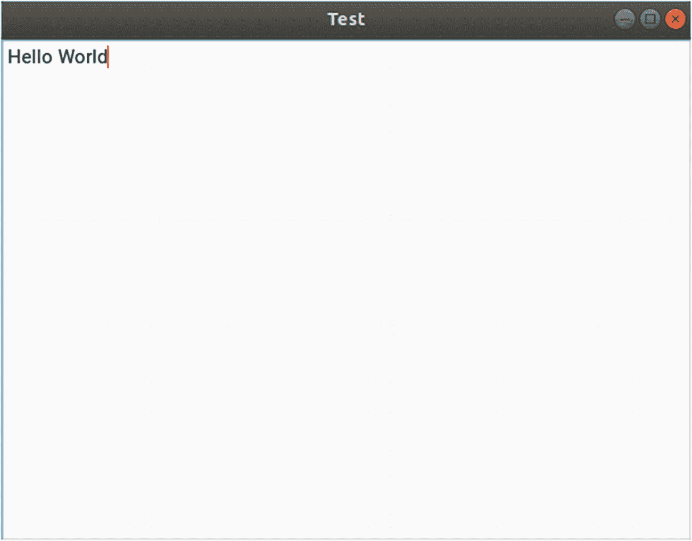
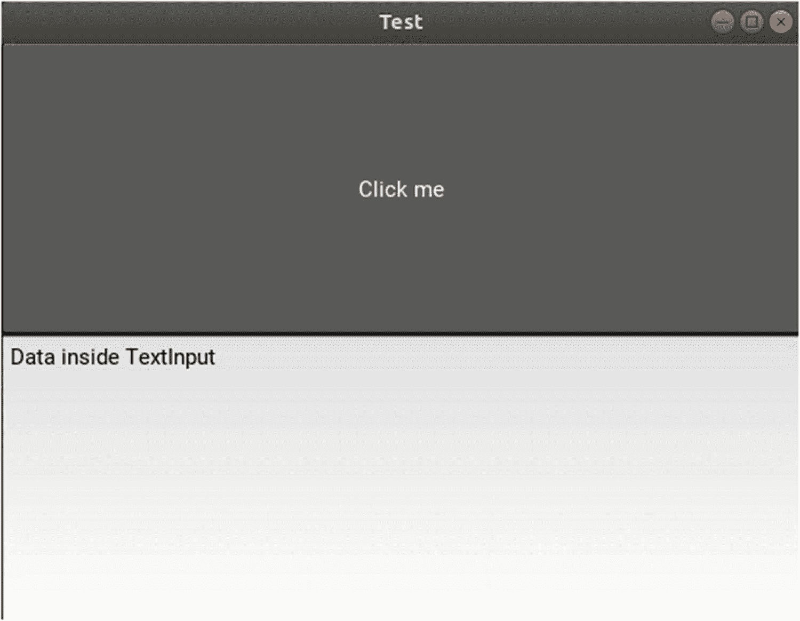
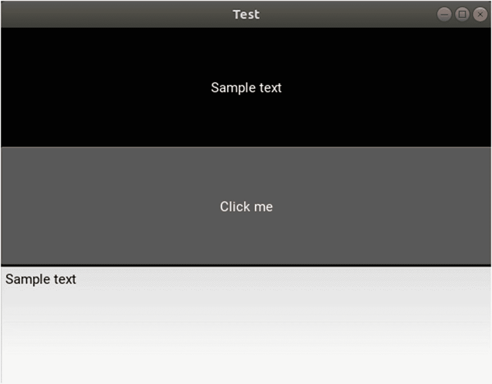
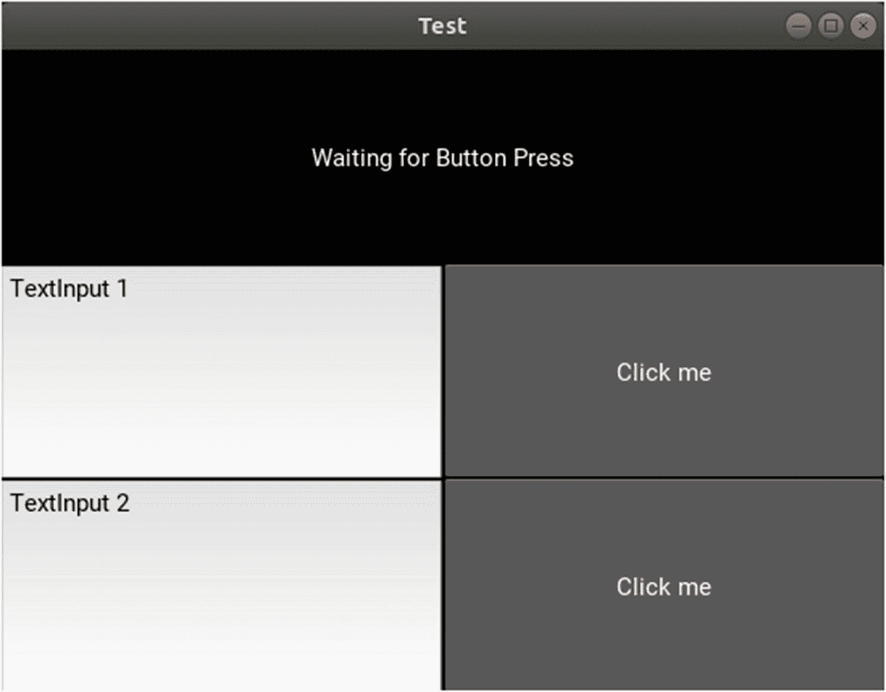

# 二、使用 KV 语言实现逻辑和图形界面的分离

在前一章中，我们准备了 Kivy 开发环境并创建了一个非常简单的桌面应用。然后我们安装了 Buildozer 来构建移动应用。正如我们之前讨论的，成功构建的工具和需求可以使用 Buildozer 自动安装，也可以离线下载并链接。通过准备 Android SDK、NDK 和所需的 Python 库，我们可以成功地构建一个使用与桌面应用相同的 Python 代码的 Android 应用。这是因为 Kivy 是一个跨平台库。

在这一章中，我们将通过在 GUI 上放置更多的小部件来丰富我们的应用，并添加受益于这些小部件接收的数据的逻辑。开始时，GUI 部件将使用 Python 代码添加到`kivy.app.App`类的`build()`函数中。我们将创建一个具有三个小部件(按钮、文本输入和标签)的应用。一旦按下按钮，文本输入的数据将显示在文本标签上。随着我们添加更多的小部件，Python 代码将变得复杂，从而更难调试。出于这个原因，我们将使用 KV 语言将 GUI 与 Python 逻辑分开。这样，Python 代码将专用于逻辑。我们开始吧。

## 将 TextInput 小部件添加到 GUI

在前一章中，我们创建了一个只有一个静态标签部件的应用。在本章中，我们首先添加一个名为`TextInput`的新部件。从它的名字可以很容易地推断出这个小部件允许用户输入文本。通过实例化`kivy.uix.textinput.TextInput`类来创建`TextInput`小部件。这个类的构造函数接收一个名为`text`的属性，它是小部件中的默认文本。清单 [2-1](#PC1) 用这个小部件创建了一个完整的应用。

```py
import kivy.app
import kivy.uix.textinput

class TestApp(kivy.app.App):

    def build(self):
        return kivy.uix.textinput.TextInput(text="Hello World")

app = TestApp()
app.run()

Listing 2-1Adding a TextInput Widget to the GUI

```

如果运行这个 Python 脚本，将会显示如图 [2-1](#Fig1) 所示的窗口。整个窗口只是文本输入。您可以编辑输入的文本。



图 2-1

在清单 [2-1](#PC1) 中创建的应用的窗口

我们可以在 GUI 中添加一个按钮小部件。点击按钮，文本输入的数据将被接收并打印在`print`语句中。现在有一个问题。在`build()`函数中，只返回一个小部件。现在我们需要返回两个小部件(按钮和文本输入)。我们如何做到这一点？解决方案是将这些小部件添加到一个容器中，然后返回这个容器。Kivy 中的容器是布局。

Kivy 中有不同类型的布局，比如框、相对、网格、堆栈等等。每种布局都有其排列内部子部件的方式。例如，box 布局垂直或水平排列子元素。网格布局将窗口分割成由行和列组成的矩阵，然后在矩阵单元中插入小部件。默认情况下，窗口平均分配给所有小部件。

## 通过在 Python 中添加更多小部件来丰富 GUI 应用

清单 [2-2](#PC2) 中的代码创建了一个应用，其中按钮和文本输入被插入到一个框布局中。应用的 GUI 是在`build()`函数中创建的。首先，按钮被创建为来自`kivy.uix.button.Button`类的一个实例。它接受参数`text`，该参数接受显示在按钮上的文本。按钮和文本输入都保存在变量中以备后用。按钮部件保存在`my_button`变量中，而文本输入保存在`text_input`变量中。

盒子布局是作为来自`kivy.uix.boxlayout.BoxLayout`类的实例创建的。它保存在`box_layout`变量中。为了指定小部件是垂直还是水平添加到布局中，在类构造函数中指定了`orientation`参数。其默认值为`horizontal` **，**表示小部件将从左向右水平插入。在这个例子中，方向被设置为垂直，所以小部件将从上到下插入，其中插入的第一个元素将被放置在窗口的顶部，插入的最后一个元素将被放置在窗口的底部。通过指定要添加的微件的名称，使用`add_widget`功能将微件插入布局。最后，布局返回。

```py
import kivy.app
import kivy.uix.textinput
import kivy.uix.button
import kivy.uix.boxlayout

class TestApp(kivy.app.App):

    def build(self):
        my_button = kivy.uix.button.Button(text="Click me")
        text_input = kivy.uix.textinput.TextInput(text="Data inside TextInput")

        box_layout = kivy.uix.boxlayout.BoxLayout(orientation="vertical")
        box_layout.add_widget(widget=button)
        box_layout.add_widget(widget=textInput)

        return box_layout

app = TestApp()
app.run()

Listing 2-2Adding More Than One Widget to the Application

```

运行应用后，将出现如图 [2-2](#Fig2) 所示的窗口。它被垂直分为两个大小相等的部分，并根据布局中的放置顺序进行放置。



图 2-2

在清单 [2-2](#PC2) 中创建的应用窗口

到目前为止，单击该按钮不会导致任何操作。使用`bind()`功能来处理按钮动作。它接受反映动作的参数。要处理按钮按下动作，使用`on_press`参数。该参数被分配给一个函数，该函数在动作被触发时被调用。

### 处理按钮按压

清单 [2-3](#PC3) 中的代码创建了一个名为`button_press()`的函数，当按钮被按下时该函数被调用。它接受触发动作的小部件作为参数。该功能附加在按钮上，以便在按下按钮时执行。该函数在每次按下按钮时打印一条消息，根据`press_count`变量显示按钮被按下的次数。它在函数调用结束时递增。

```py
import kivy.app
import kivy.uix.textinput
import kivy.uix.button
import kivy.uix.boxlayout

class TestApp(kivy.app.App):

    press_count = 1
    def button_press(self, button_pressed):
        print("Button Pressed", TestApp.press_count, "Times")
        TestApp.press_count = TestApp.press_count + 1

    def build(self):
        my_button = kivy.uix.button.Button(text="Click me")
        my_button.bind(on_press=TestApp.button_press)
        text_input = kivy.uix.textinput.TextInput(text="Data inside TextInput")

        box_layout = kivy.uix.boxlayout.BoxLayout(orientation="vertical")
        box_layout.add_widget(widget=my_button)
        box_layout.add_widget(widget=text_input)

        return box_layout

app = TestApp()
app.run()

Listing 2-3Handling a Button Press

```

按下按钮四次后打印的信息如图 [2-3](#Fig3) 所示。


图 2-3

每次按下按钮时都会打印一条消息

### 从文本输入接收数据

可以修改应用，以便打印插入到`TextInput`小部件中的文本。如前所述，当按钮被按下时，它的回调函数`button_press()`将被调用。在这个函数中，可以返回并打印`TextInput`小部件中的文本。为了能够访问该函数中的`TextInput`小部件，该小部件存储在关键字`self`引用的当前对象中。新应用的代码如清单 [2-4](#PC4) 所示。

```py
import kivy.app
import kivy.uix.textinput
import kivy.uix.button
import kivy.uix.boxlayout

class TestApp(kivy.app.App):

    def button_press(self, button_pressed):
        input_data = self.text_input.text
        print(input_data)

    def build(self):
        my_button = kivy.uix.button.Button(text="Click me")
        my_button.bind(on_press=self.button_press)
        self.text_input = kivy.uix.textinput.TextInput(text="Data inside TextInput")

        box_layout = kivy.uix.boxlayout.BoxLayout(orientation="vertical")
        box_layout.add_widget(widget=my_button)
        box_layout.add_widget(widget=self.text_input)

        return box_layout

app = TestApp()
app.run()

Listing 2-4Receiving Text from the TextInput upon a Button Press

```

按下按钮后，将使用`text`属性获取`TextInput`小部件中的当前文本，并打印到终端。

### 在文本标签上显示文本

在当前状态下，我们必须打开窗口，按下按钮，然后到终端上查看打印出来的消息。如果再次按下按钮，我们必须到终端查看输出，等等。我们可以通过在窗口内部的标签部件上打印消息来使生活变得更容易。因此，我们根本不需要打开终端。与上一个应用相比，所做的更改包括使用`kivy.uix.label.Label`类创建一个新的标签小部件，将其添加到框布局中，将其附加到当前对象(self)以便在`button_press()`函数中访问它，并根据从`TextInput`小部件接收的输入更改其文本。新的应用如清单 [2-5](#PC5) 所示。

```py
import kivy.app
import kivy.uix.label
import kivy.uix.textinput
import kivy.uix.button
import kivy.uix.boxlayout

class TestApp(kivy.app.App):

    def button_press(self, button_pressed):
        self.text_label.text = self.text_input.text

    def build(self):
        self.text_input = kivy.uix.textinput.TextInput(text="Data inside TextInput")
        my_button = kivy.uix.button.Button(text="Click me")
        my_button.bind(on_press=self.button_press)
        self.text_label = kivy.uix.label.Label(text="Waiting for Button Press")

        box_layout = kivy.uix.boxlayout.BoxLayout(orientation="vertical")
        box_layout.add_widget(widget=self.text_label)
        box_layout.add_widget(widget=my_button)
        box_layout.add_widget(widget=self.text_input)

        return box_layout

app = TestApp()
app.run()

Listing 2-5Adding a Label Widget to the Application

```

应用窗口如图 [2-4](#Fig4) 所示。当按下按钮时，`TextInput`小工具内的文本显示在标签上。



图 2-4

按下按钮后，在标签小部件中显示 TextInput 中的文本

## 嵌套小部件

对于最后一个应用，在 box 布局中只添加了三个小部件作为子部件。因为此布局的方向设置为垂直，所以窗口高度将在三个子窗口中平均分配，但每个子窗口将占据窗口的整个宽度。换句话说，每个孩子将占用窗口高度的三分之一，但会扩展窗口的整个宽度。调试清单 [2-5](#PC5) 中的代码非常容易，因为只有几个小部件。通过添加更多的小部件，代码变得更加复杂，难以调试。我们可以在清单 [2-6](#PC6) 中的下一个应用中添加更多的小部件。在前面的应用中，每个小部件占据了整个窗口的宽度。在这个应用中，窗口的宽度分为两个小部件。

在清单 [2-6](#PC6) 的应用代码中，窗口将有一个名为`box_layout`的垂直方向的根框布局。这个布局将有三个子布局。这个布局的顶层子元素是一个名为`text_label`的标签。剩下的两个子节点是名为`box_layout1`和`box_layout2`的盒子布局(子节点本身就是布局)。每个子框布局的方向都是水平的(也就是说，子框是从左向右插入的)。每个子布局将有两个子部件(按钮和文本输入)。当每个子布局的按钮被按下时，同级`TextInput`小部件内的文本将显示在标签上。

```py
import kivy.app
import kivy.uix.label
import kivy.uix.textinput
import kivy.uix.button
import kivy.uix.boxlayout

class TestApp(kivy.app.App):
    def button1_press(self, button_pressed):
        self.text_label.text = self.text_input1.text

    def button2_press(self, button_pressed):
        self.text_label.text = self.text_input2.text

    def build(self):
        self.text_label = kivy.uix.label.Label(text="Waiting for Button Press")

        self.text_input1 = kivy.uix.textinput.TextInput(text="TextInput 1")
        my_button1 = kivy.uix.button.Button(text="Click me")
        my_button1.bind(on_press=self.button1_press)

        self.text_input2 = kivy.uix.textinput.TextInput(text="TextInput 2")
        my_button2 = kivy.uix.button.Button(text="Click me")
        my_button2.bind(on_press=self.button2_press)

        box_layout = kivy.uix.boxlayout.BoxLayout(orientation="vertical")

        box_layout1 = kivy.uix.boxlayout.BoxLayout(orientation="horizontal")
        box_layout1.add_widget(widget=self.text_input1)
        box_layout1.add_widget(widget=my_button1)

        box_layout2 = kivy.uix.boxlayout.BoxLayout(orientation="horizontal")
        box_layout2.add_widget(widget=self.text_input2)
        box_layout2.add_widget(widget=my_button2)

        box_layout.add_widget(self.text_label)
        box_layout.add_widget(box_layout1)
        box_layout.add_widget(box_layout2)

        return box_layout

app = TestApp()
app.run()

Listing 2-6Creating Nested Widgets

```

图 [2-5](#Fig5) 显示了运行清单 [2-6](#PC6) 中的应用后的窗口。每个按钮都有一个回调函数。例如，`button1_press()`与第一个按钮(`my_button1`)关联。当按下给定盒子布局中的一个按钮时，来自同一个盒子布局中的`TextInput`小部件的文本显示在标签上。



图 2-5

嵌套小部件

在添加了更多的 widget 之后，显然很难推导出应用的 widget 树。例如，确定给定父母的子女并不容易。因此，接下来我们将使用 KV 语言，它以结构化的方式构建 GUI 的小部件树。

## 使用 KV 语言

KV 语言(kvlang 或 Kivy 语言)以可读的方式创建了一个小部件树，帮助我们调试应用的 GUI。它使用缩进来标记给定父级的子级。它还使用缩进来标记给定小部件的属性。使用 KV 语言的另一个好处是 Python 逻辑与 GUI 的分离。微件树创建在扩展名为`.kv`的文件中。因此，我们可以独立于 Python 代码来修改小部件树。注意，我们不必将模块导入 KV 文件来使用小部件。比如为了用一个盒子布局，我们就写`BoxLayout`。

在 KV 文件中，总是有一个没有任何缩进的小部件。这是根小部件，它对应于清单 [2-6](#PC6) 中代码所示的`box_layout`小部件。这个小部件的属性和子部件缩进四个空格。清单 [2-7](#PC7) 显示了清单 [2-6](#PC6) 中先前应用的 KV 文件的内容。

```py
BoxLayout:
    orientation: "vertical"
    Label:
        text: "Waiting for Button Press"
        id: text_label
    BoxLayout:
        orientation: "horizontal"
        TextInput:
            text: "TextInput 1"
            id: text_input1
        Button:
            text: "Click me"
            on_press: app.button1_press()
    BoxLayout:
        orientation: "horizontal"
        TextInput:
            text: "TextInput 2"
            id: text_input2
        Button:
            text: "Click me"
            on_press: app.button2_press()

Listing 2-7Using the KV Language to Separate the Python Logic from the GUI

```

根据所需的顺序将小部件添加到树中，以产生与上一个应用相同的结果。值得一提的是，Python 代码中需要引用的字段都被赋予了 id。它们是`TextInput`和`Label`小部件。此外，使用`on_press`属性将`on_press`动作附加到按钮上，该属性被分配给一个使用关键字`app`调用的函数。kvlang 中的这个关键字指的是使用这个 KV 文件的 Python 文件。因此，`app.button1_press()`意味着调用链接到这个 KV 文件的 Python 文件内部名为`button1_press`的函数。这里的问题是如何将 Python 文件链接到 KV 文件。这很容易。

在 Python 文件中创建的类被命名为`TestApp`。Kivy 提取单词`App`之前的文本，即`Test`。在将文本转换成小写(`Test`变成了`test`)之后，Kivy 在 Python 文件的同一个文件夹中搜索一个名为`test.kv`的 KV 文件。如果找到这样的文件，Kivy 会将它隐式链接到 Python 文件。如果没有找到，应用将启动，但会有一个空白窗口。请注意，`build()`功能被删除。如果 Python 代码中存在这个函数，而 Kivy 没有找到 KV 文件，那么应用将不会运行。

在 KV 文件中创建小部件树之后，Python 代码如清单 [2-8](#PC8) 所示。现在 Python 代码调试起来非常简单。无论小部件树是使用 Python 还是 KV 语言创建的，应用的工作方式都是一样的。

需要注意的是如何在 Python 代码中访问 KV 文件中创建的小部件。一旦小部件被赋予一个 ID，您就可以使用`root.ids`字典来引用它。关键字`root`指的是 KV 文件中的根框布局小部件。通过按所需小部件的 ID 索引字典，它将被返回，因此我们能够访问它的属性并覆盖它。

```py
import kivy.app

class TestApp(kivy.app.App):

    def button1_press(self):
        self.root.ids['text_label'].text = self.root.ids['text_input1'].text

    def button2_press(self):
        self.root.ids['text_label'].text = self.root.ids['text_input2'].text

app = TestApp()
app.run()

Listing 2-8Python Code for the Application in Listing 2-6 After Defining the GUI in a KV File

```

### 使用 load_file()调用 KV

假设 KV 文件的名称不是`test.kv`而是`test1.kv`，Kivy 将无法隐式定位 KV 文件。在这种情况下，我们必须显式指定来自`kivy.lang.Builder`类的`load_file()`函数内的文件路径，如清单 [2-9](#PC9) 所示。这个函数的结果由`build()`函数返回。

```py
import kivy.app
import kivy.lang

class TestApp(kivy.app.App):

    def button1_press(self):
        self.root.ids['text_label'].text = self.root.ids['text_input1'].text

    def button2_press(self):
        self.root.ids['text_label'].text = self.root.ids['text_input2'].text

    def build(self):
        return kivy.lang.Builder.load_file("test1.kv")

app = TestApp()
app.run()

Listing 2-9Explicitly Specifying the Path of the KV File

```

### 使用 load_string()调用 KV

还可以使用`kivy.lang.Builder`类中的`load_string()`函数在 Python 文件中编写 KV 语言代码。代码用三重引号括起来，如清单 [2-10](#PC10) 所示。请注意，不建议使用这种方式，因为它没有将逻辑与可视化分开。

```py
import kivy.app
import kivy.lang

class TestApp(kivy.app.App):

    def button1_press(self):
        self.root.ids['text_label'].text = self.root.ids['text_input1'].text

    def button2_press(self):
        self.root.ids['text_label'].text = self.root.ids['text_input2'].text

    def build(self):
        return kivy.lang.Builder.load_string(

"""

BoxLayout:

    orientation: "vertical"
    Label:
        text: "Waiting for Button Press"
        id: text_label
    BoxLayout:
        orientation: "horizontal"
        TextInput:
            text: "TextInput 1"
            id: text_input1
        Button:
            text: "Click me"
            on_press: app.button1_press()
    BoxLayout:
        orientation: "horizontal"
        TextInput:
            text: "TextInput 2"
            id: text_input2
        Button:
            text: "Click me"
            on_press: app.button2_press()
""")

app = TestApp()
app.run()

Listing 2-10Adding the KV Language Code Within the Python File

```

注意，本章并没有创建 Android 应用；重点是添加更多的小部件和构建应用。不要担心根据本章讨论的内容构建 Android 应用，因为它非常简单。准备好`buildozer.spec`文件后，按照第 [1 章](1.html)中讨论的步骤使用 Buildozer 构建 APK 文件。

## 摘要

既然我们已经到了本章的末尾，让我们快速回顾一下前两章讨论的内容。在前一章中，我们为开发桌面应用准备了 Kivy 环境。然后我们安装了 Buildozer 来开发 Android 应用。我们简单地从创建一个单标签小部件显示文本的例子开始。之后，使用布局将更多的小部件添加到应用中。使用`on_press`处理按钮按压动作。由于我们在小部件树中嵌套了更多的小部件，调试应用变得更加困难。出于这个原因，引入了 KV 语言，这样我们就可以构建小部件树，并将 GUI 从 Python 逻辑中分离出来。

在下一章中，我们将介绍相机小部件，这样我们就可以非常容易地访问相机。在确保成功创建桌面应用之后，我们将转到构建相应的 Android 应用，并看看如何使用 Kivy 非常直观地访问 Android 相机小部件。因为访问 Android 摄像头需要权限，下一章讨论在`buildozer.spec`文件内部添加权限。这些权限将反映在 Google Play 中，供任何用户在安装应用之前查看。下一章还讨论了 Kivy 的一个比较重要的特性，就是 Canvas。Canvas 用于在小部件上绘图和进行转换。