# 五、在 Kivy 建立你的第一个多关卡游戏

前一章介绍了 Kivy，这样我们就可以开始构建跨平台的应用。作为应用概念的一种方式，我们创建了一个 Android 应用，它可以捕获图像并不断地将它们发送到 Flask 服务器。

本章通过创建一个多关卡跨平台游戏来应用这些相同的概念，玩家在每个级别都有一个任务，就是收集随机分布在屏幕上的硬币。怪物试图杀死收集硬币的玩家。这款游戏可以在不同的平台上成功运行，而无需我们修改任何一行代码。在你学习如何构建游戏之前，我们将介绍一些新概念，包括`FloatLayout`和动画。

## 浮动布局

在前面的章节中，`BoxLayout`小部件用于对多个小部件进行分组。小部件以有序的方式添加到该布局中，根据方向可以是水平的或垂直的。小部件的大小是由布局计算的，对它的控制很小。在本章我们将要创建的游戏中，一些小部件不会遵循预先定义的顺序。我们需要定制它们的尺寸，并自由地将它们移动到任何位置。比如根据触摸位置放置主角。出于这个原因，我们将使用`FloatLayout`小部件。它根据每个小部件中指定的 x 和 y 坐标放置小部件。

清单 [5-1](#PC1) 显示了用于构建 Kivy 应用的通用代码，其中的子类被命名为`TestApp`。

```py
import kivy.app

class TestApp(kivy.app.App):
    pass

app = TestApp()
app.run()

Listing 5-1Generic Python Code to Build a Kivy Application

```

基于类名，KV 文件必须被命名为`test.kv`，以便隐式地检测它。`test.kv`文件内容如清单 [5-2](#PC2) 所示。正好有一个`FloatLayout`小部件带着一个子，叫`Button`。注意在`Button`小部件中有两个重要的字段— `size_hint`和`pos_hint`。与`BoxLayout`相比，使用`FloatLayout`添加的小部件可能不会扩展整个屏幕的宽度或高度。

```py
FloatLayout:
    Button:
        size_hint: (1/4, 1/4)
        pos_hint: {'x': 0.5,'y': 0.5}
        text: "Hello"

Listing 5-2KV File with FloatLayout as the Root Widget

```

如果您运行该应用，您将会看到图 [5-1](#Fig1) 中的窗口。

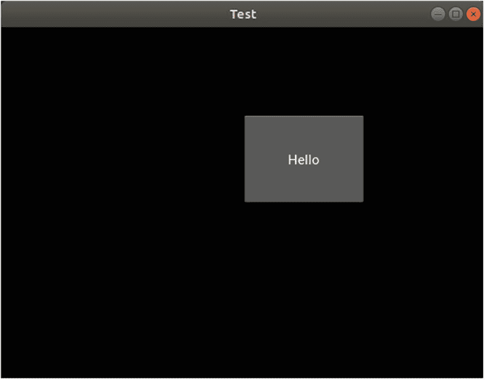

图 5-1

在浮动布局中添加了一个按钮

默认情况下，小部件被添加到父窗口的(0，0)位置，该位置对应于窗口的左下角。因此，我们需要移动小部件，以避免将它们放置在彼此之上。`pos_hint`字段接受一个字典，其中有两个字段指定小部件左下角和窗口左下角之间的距离。该距离相对于父尺寸。

x 的值为 0.5 意味着按钮将离开窗口的左侧 50%的父宽度。y 值为 0.5 意味着按钮将远离窗口底部父高度的 50%。这样，`Button`小部件的左下角从布局的中心开始。请注意，相对定位是处理不同尺寸屏幕的有效方式。

`size_hint`字段指定小部件相对于其父尺寸的尺寸。它接受一个保存小部件相对宽度和高度的元组。在此示例中，按钮的宽度和高度被设置为 1/4，这意味着按钮大小是父大小的 40%(即，四分之一)。

注意`pos_hint`和`size_hint`字段不能保证改变小部件的大小或位置。小部件只是给父部件一个提示，它希望根据指定的值来设置它的位置和大小。有些布局听从它的请求，至于哪些布局忽略了它。在前面的例子中，如果根据清单 [5-3](#PC3) 中的代码将`FloatLayout`替换为`BoxLayout`，那么根据图 [5-2](#Fig2) 的布局将不会应用一些提示。请注意，默认方向是水平的。

```py
BoxLayout:
    Button:
        size_hint: (1/4, 1/4)
        pos_hint: {'x': 0.5,'y': 0.5}
        text: "Hello"

Listing 5-3Horizontal BoxLayout Orientation Does Not Listen to the Width Hint

```

因为按钮是其水平`BoxLayout`父级中的唯一子级，所以它的左下角应该从(0，0)位置开始。根据图 [5-2](#Fig2) ，按钮不是从(0，0)位置开始。它的 x 坐标如预期的那样从 0 开始，但是它的 y 坐标从父代高度的一半开始。结果家长只是听了关于 Y 位置的暗示。

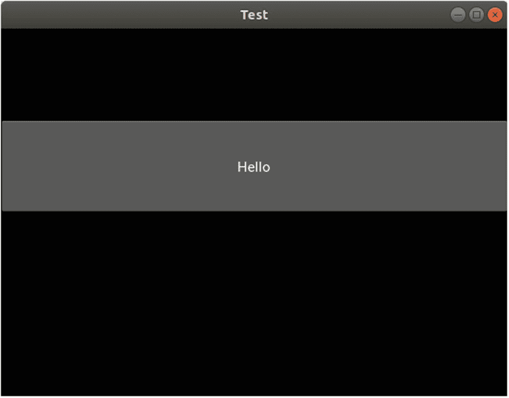

图 5-2

即使宽度提示设置为 1/4，该按钮也会扩展整个屏幕宽度

关于按钮大小，它应该覆盖整个窗口，因为它是父窗口中的唯一子窗口。这在前面的例子中没有发生。高度是父项高度的 1/4，但宽度扩展到父项的整个宽度。

总结一下，当`pos_hint`和`size_hint`字段与`BoxLayout`一起使用时，只有高度和 Y 位置发生了变化，而宽度和 X 位置没有变化。原因是水平方向的`BoxLayout`只听取与 Y 轴相关的提示(例如，高度和 Y 位置)。如果根据清单 [5-4](#PC4) 使用垂直方向，宽度和 X 位置会改变，但是高度和 Y 位置不会根据图 [5-3](#Fig3) 改变。这就是为什么`FloatLayout`被用来动态定位和调整窗口小部件的大小。

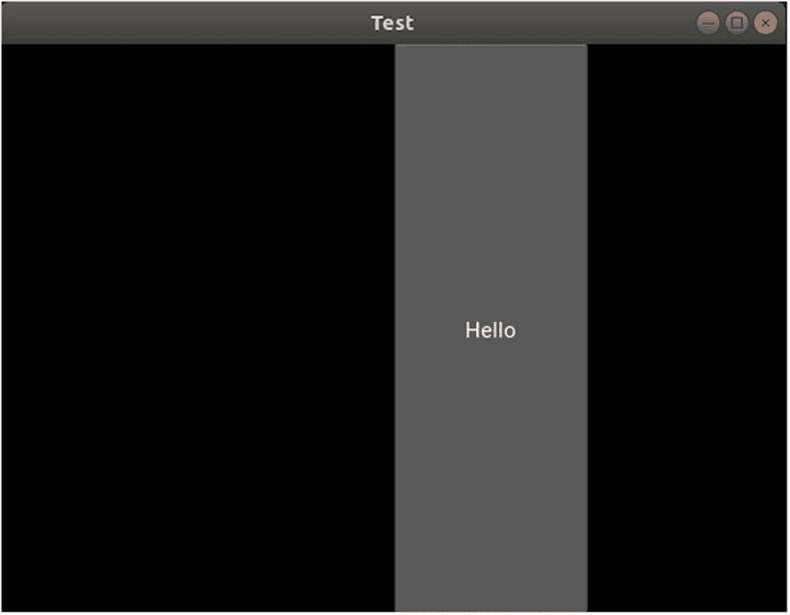

图 5-3

即使高度提示设置为 1/4，该按钮也会扩展屏幕的整个高度

```py
BoxLayout:
    orientation: 'vertical'
    Button:
        size_hint: (1/4, 1/4)
        pos_hint: {'x': 0.5,'y': 0.5}
        text: "Hello"

Listing 5-4Vertical Orientation for BoxLayout Does Not Listen to the Height Hint

```

注意,`pos_hint`域改变了 X 和 Y 坐标。如果我们只对改变一个而不是两个感兴趣，我们可以在字典中指定。请注意，字典中还有其他需要指定的项目，如`top`、`right`、`center_x`和`center_y`。

此外，`size_hint`字段指定了宽度和高度。我们可以使用`size_hint_x`来指定宽度，或者使用`size_hint_y`来指定高度。因为水平方向的`BoxLayout`不会改变小部件的 X 位置和宽度，所以我们可以避免指定它们。清单 [5-5](#PC5) 使用较少的提示产生了相同的结果。

```py
BoxLayout:
    Button:
        size_hint_y: 1/4
        pos_hint: {'y': 0.5}
        text: "Hello"

Listing 5-5Just Specifying the Height Hint Using size_hint_y

```

假设我们想向`FloatLayout`添加两个小部件，其中第一个小部件从(0，0)位置开始，延伸到布局的中心，第二个小部件从父窗口宽度和高度的 75%开始，延伸到它的右上角。清单 [5-6](#PC6) 显示了构建这样一个小部件树所需的 KV 文件。结果如图 [5-4](#Fig4) 所示。

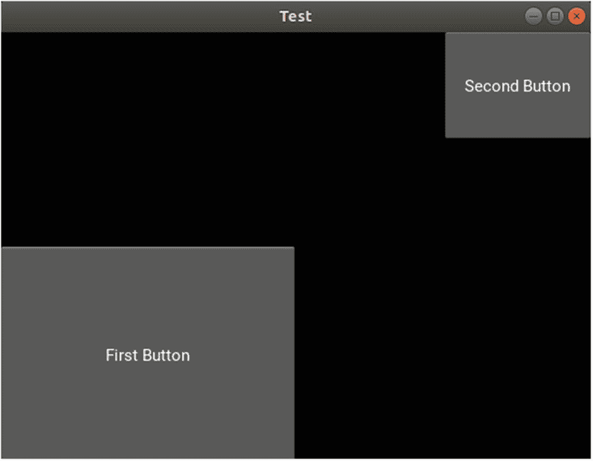

图 5-4

在 FloatLayout 中添加两个按钮

```py
FloatLayout:
    Button:
        size_hint: (0.5, 0.5)
        text: "First Button"
    Button:
        size_hint: (0.25, 0.25)
        pos_hint: {'x': 0.75, 'y': 0.75}
        text: "Second Button"

Listing 5-6Adding Two Buttons Inside FloatLayout

```

第一个按钮大小的`size_hint`字段的宽度和高度都设置为 0.5，使其大小为窗口大小的 50%。它的`pos_hint`被省略，因为小部件默认从(0，0)位置开始。

第二个按钮的`pos_hint`对于 x 和 y 都设置为 0.75，使其从距离父按钮的宽度和高度 75%的位置开始。其`size_hint`设置为 0.25，使按钮延伸到右上角。

## 动画

为了在 Kivy 中创建一个游戏，动画是必不可少的。它使事情进展顺利。例如，我们可能对制作一个沿着特定路径移动的怪物的动画感兴趣。在 Kivy 中，只需使用`kivy.animation.Animation`类就可以创建动画。让我们创建一个带有图像小部件的应用，并通过改变它的位置来制作动画。

清单 [5-7](#PC7) 显示了应用的 KV 文件。根小部件是`FloatLayout`，它包含两个子小部件。第一个子小部件是一个 ID 为`character_image`的`Image`小部件，它显示由源字段指定的图像。当设置为`True`时，`allow_stretch`属性拉伸图像以覆盖`Image`小工具的整个区域。

有一个`Button`小部件，当它被按下时会启动动画。因此，Python 文件中一个名为`start_char_animation()`的函数与`on_press`事件相关联。

```py
FloatLayout:
    Image:
        id: character_image
        size_hint: (0.15, 0.15)
        pos_hint: {'x': 0.2, 'y': 0.6}
        allow_stretch: True
        source: "character.png"
    Button:
        size_hint: (0.3, 0.3)
        text: "Start Animation"
        on_press: app.start_char_animation()

Listing 5-7Adding an Image to the Widget Tree Using the Image Widget

```

Python 文件的实现如清单 [5-8](#PC8) 所示。在`TestApp`类内部，实现了`start_char_animation()`函数。在`char_animation`变量中创建了一个`kivy.animation.Animation`类的实例。该类接受要动画显示的目标小部件的属性。因为我们对改变`Image`小部件的位置感兴趣，所以`pos_hint`属性作为输入参数被提供给`Animation`类构造函数。

请注意，不可能将小部件中未定义的属性制作成动画。例如，我们不能动画显示`width`属性，因为它没有在小部件中定义。

```py
import kivy.app
import kivy.animation

class TestApp(kivy.app.App):

    def start_char_animation(self):
        character_image = self.root.ids['character_image']
        char_animation = kivy.animation.Animation(pos_hint={'x':0.8, 'y':0.6})
        char_animation.start(character_image)

app = TestApp()
app.run()

Listing 5-8Building and Starting the Animation Over an Image

```

为了让小部件中的属性具有动画效果，我们必须提供属性名及其新值。动画从属性的前一个值开始，在本例中是 KV 文件中的`pos_hint`字段指定的值，即`{'x': 0.2, 'y': 0.6}`，并在`Animation`类的构造函数中指定的值`{'x': 0.8, 'y': 0.6}`处结束。因为只是 x 位置有变化，所以图像会水平移动。

调用`Animation`类的`start()`方法来启动动画。这个方法接受目标小部件的 ID，在这个小部件中，我们希望动画显示在`Animation`类构造函数中指定的属性。

当我们单击`Button`小部件时，`start_char_animation()`功能被执行，动画开始。图 [5-5](#Fig5) 显示了按下按钮之前和之后窗口的显示。默认情况下，动画需要一秒钟才能完成。这个时间可以使用`duration`参数来改变。

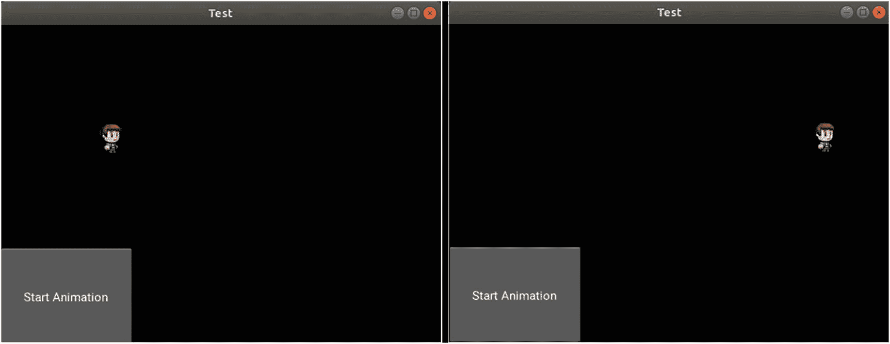

图 5-5

动画开始前后。左图显示原始图像，右图显示动画结束后的结果

请注意，我们可以在同一个动画实例中制作多个属性的动画。这是通过用逗号分隔不同的属性来实现的。清单 [5-9](#PC9) 动画显示图像的大小和位置。通过将其从(0.15，0.15)更改为(0.2，0.2)，大小加倍。

```py
import kivy.app
import kivy.animation

class TestApp(kivy.app.App):

    def start_char_animation(self):
        character_image = self.root.ids['character_image']
        char_animation = kivy.animation.Animation(pos_hint={'x': 0.8, 'y': 0.6}, size_hint=(0.2, 0.2), duration=1.5)
        char_animation.start(character_image)

app = TestApp()
app.run()

Listing 5-9Animating Multiple Properties Within the Same Animation Instance

```

运行应用并按下按钮后，动画结束后的结果如图 [5-6](#Fig6) 所示。请注意，持续时间变为 1.5 秒。

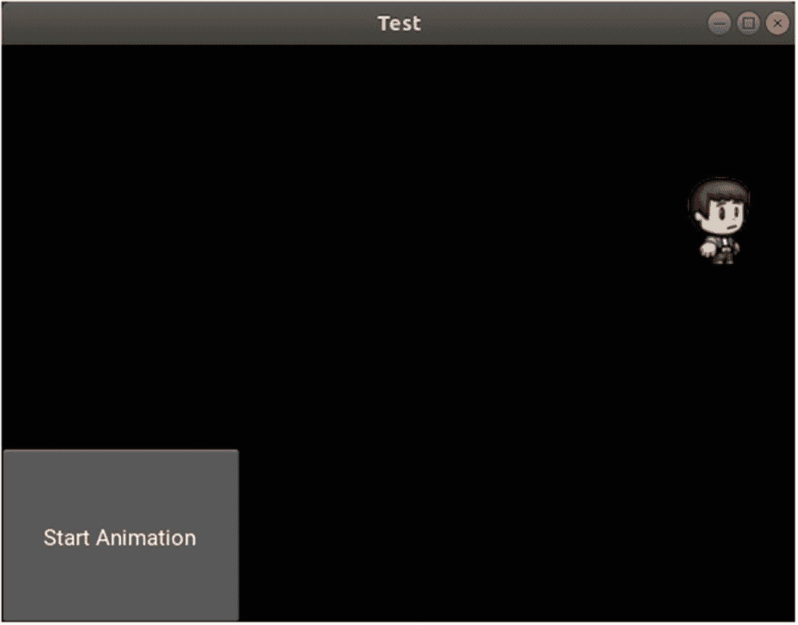

图 5-6

动画显示图像的 pos_hint 和 size_hint 属性后的结果

即使动画仍然工作，单击“更多”按钮也不会移动或更改图像的大小。事实上，每次按下按钮后都会执行`start_char_animation()`功能。对于每一次按压，根据附加的小部件创建并启动一个`Animation`实例。第一次谈论`pos_hint`属性时，在 KV 文件中指定的`pos_hint`属性的旧值和在`Animation`类构造函数中指定的新值是不同的。这就是图像从 x=0.2 移动到 x=0.8 的原因。动画化图像后，其`pos_hint`属性将为`{'x': 0.8, 'y': 0.6}`。

再次制作图像动画时，开始值和结束值将等于`{'x': 0.8, 'y': 0.6}`。这就是为什么图像小部件的位置没有变化。Kivy 支持循环动画，但是循环前一个动画是没有意义的。属性中必须至少有一个其他值，这样小部件才能从一个值转到另一个值。在循环动画之前，我们需要向`pos_hint`属性添加另一个值。

单个动画接受给定属性的单个值，但是我们可以在另一个动画中添加另一个值，并将这些动画连接在一起。

### 加入动画

加入动画有两种方式—顺序和并行。在连续动画中，当一个动画结束时，下一个动画开始，并持续到最后一个动画。在这种情况下，使用`+`操作符将它们连接起来。在并行动画中，所有动画同时开始。使用`&`操作符将它们连接起来。

清单 [5-10](#PC10) 显示了两个动画顺序连接的例子。第一个动画实例名为`char_anim1` **，**通过将`pos_hint`属性更改为`{'x': 0.8, 'y': 0.6}`，将图像水平向右移动，就像前面所做的一样。第二个动画实例名为`char_anim2`，将小部件垂直移动到底部的新位置`{'x': 0.8, 'y': 0.2}`。使用`+`操作符连接两个动画，结果存储在`all_anim1`变量中。加入的动画通过调用`start()`方法开始。

```py
import kivy.app
import kivy.animation

class TestApp(kivy.app.App):

    def start_char_animation(self):
        character_image = self.root.ids['character_image']
        char_anim1 = kivy.animation.Animation(pos_hint={'x': 0.8, 'y': 0.6})
        char_anim2 = kivy.animation.Animation(pos_hint={'x': 0.8, 'y': 0.2})
        all_anim = char_anim1 + char_anim2
        all_anim.start(character_image)

app = TestApp()
app.run()

Listing 5-10Joining Animations Sequentially

```

按下按钮后，运行所有动画后的结果如图 [5-7](#Fig7) 所示。

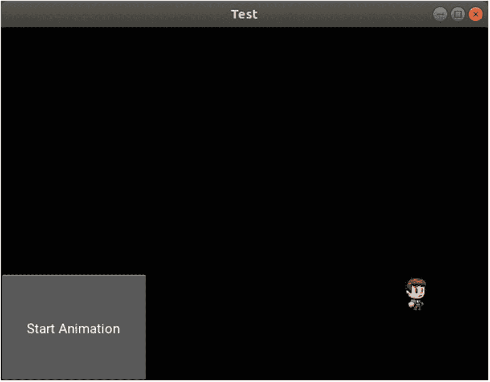

图 5-7

将多个要应用于图像小工具的动画按顺序连接起来

图 [5-8](#Fig8) 中显示了`pos_hint`属性改变的路径概要。图像从 KV 文件中指定的`{'x': 0.2, 'y': 0.6}`开始。运行第一个动画后，它移动到新的位置`{'x': 0.8, 'y': 0.6}`。最后，它在运行第二个动画后移动到`{'x': 0.8, 'y': 0.2}`。该位置保持图像的当前位置。


图 5-8

根据清单 [5-10](#PC10) 中定义的两个动画的图像小部件的路径

动画完成后，如果再次按下按钮会发生什么？加入的动画将再次开始。在第一个动画中，它将图像的位置从当前位置更改为其参数`pos_hint`中指定的新位置，该参数为`{'x': 0.8, 'y': 0.6}`。因为当前位置`{'x': 0.8, 'y': 0.2}`与新位置`{'x': 0.8, 'y': 0.6}`不同，所以图像会移动。图像的当前位置将是`{'x': 0.8, 'y': 0.6}`。

运行第一个动画后，第二个动画开始，它将图像从当前位置`{'x': 0.8, 'y': 0.6}`移动到其`pos_hint`参数中指定的新位置，即`{'x': 0.8, 'y': 0.2}`。因为位置不同，图像会移动。每次按下按钮都重复这个过程。请注意，如果没有备份，KV 文件中属性的初始值会在动画结束后丢失。

每个动画需要一秒钟才能完成，因此合并动画的总时间为两秒钟。您可以使用`duration`参数控制每个动画的持续时间。

因为`pos_hint`属性改变的值不止一个，所以我们可以循环前面的动画。根据清单 [5-11](#PC11) ，我们通过将动画实例的`repeat`属性设置为`True`来做到这一点。这在两个动画之间创建了一个无限循环。

```py
import kivy.app
import kivy.animation

class TestApp(kivy.app.App):

    def start_char_animation(self):
        character_image = self.root.ids['character_image']
        char_anim1 = kivy.animation.Animation(pos_hint={'x': 0.8, 'y': 0.6})
        char_anim2 = kivy.animation.Animation(pos_hint={'x': 0.8, 'y': 0.2})
        all_anim = char_anim1 + char_anim2
        all_anim.repeat = True
        all_anim.start(character_image)

app = TestApp()
app.run()

Listing 5-11Repeating Animations by Setting the repeat Property to True

```

可以使用`Animation`类构造函数中的`t`参数来改变动画过渡。默认是`linear`。有不同类型的过渡，如`in_back`、`in_quad`、`out_cubic`以及许多其他类型。您也可以使用`transition`属性返回它。清单 [5-12](#PC12) 显示了第一个动画的过渡设置为`out_cubic`的例子。

```py
import kivy.app
import kivy.animation

class TestApp(kivy.app.App):

    def start_char_animation(self):
        character_image = self.root.ids['character_image']
        char_anim1 = kivy.animation.Animation(pos_hint={'x': 0.8, 'y': 0.6}, t='out_cubic')
        char_anim2 = kivy.animation.Animation(pos_hint={'x': 0.8, 'y': 0.2})
        all_anim = char_anim1 + char_anim2
        all_anim.repeat = True
        all_anim.start(character_image)

app = TestApp()
app.run()

Listing 5-12Setting the Transition Property to out_cubic

```

### 取消动画

为了停止分配给给定小部件中所有属性的所有动画，我们调用了`cancel_all()`函数。它停止所有被调用的动画。

我们可以在窗口小部件树中添加另一个按钮，当我们单击它时，它会停止所有动画。新的 KV 文件如清单 [5-13](#PC13) 所示。当按下该按钮时，执行`stop_animation()`功能。请注意，此按钮的位置已经改变，以避免将其放在前面的按钮上。

```py
FloatLayout:
    Image:
        id: character_image
        size_hint: (0.15, 0.15)
        pos_hint: {'x': 0.2, 'y': 0.6}
        allow_stretch: True
        source: "character.png"
    Button:
        size_hint: (0.3, 0.3)
        text: "Start Animation"
        on_press: app.start_char_animation()
    Button:
        size_hint: (0.3, 0.3)
        text: "Stop Animation"
        pos_hint: {'x': 0.3}
        on_press: app.stop_animation()

Listing 5-13Adding a Button Widget to Stop Running Animations

```

Python 文件如清单 [5-14](#PC14) 所示。在`stop_animation()`函数中，调用`cancel_all()`函数来停止所有与 ID 为`character_image`的小部件相关联的动画。当动画被取消时，动画属性的当前值被保存。当动画再次开始时，这些值用作开始值。

```py
import kivy.app
import kivy.animation

class TestApp(kivy.app.App):

    def start_char_animation(self):
        character_image = self.root.ids['character_image']
        char_anim1 = kivy.animation.Animation(pos_hint={'x': 0.8, 'y': 0.6})
        char_anim2 = kivy.animation.Animation(pos_hint={'x': 0.8, 'y': 0.2})
        all_anim = char_anim1 + char_anim2
        all_anim.repeat = True
        all_anim.start(character_image)

    def stop_animation(self):
        character_image = self.root.ids['character_image']
        kivy.animation.Animation.cancel_all(character_image)

app = TestApp()
app.run()

Listing 5-14Stopping Running Animations Upon Press of the Button Widget

```

这样，我们能够开始和停止与给定小部件相关的所有属性的动画。我们还可以使用`cancel_all()`指定选定的属性来停止其动画，同时保持其他属性。我们不只是提供小部件引用，而是添加一个需要停止的属性列表，用逗号分隔。

### 图像小工具的动画源属性

在先前的应用中，当其位置改变时，显示相同的静态图像。如果我们想让角色行走，最好是随着其位置的变化而改变图像，以给人一种行走角色的印象。例如，我们通过改变它的腿和手的位置来做到这一点。图 [5-9](#Fig9) 显示了角色在不同位置的一些图像。当角色移动时，我们也可以改变显示的图像。这使得游戏更加真实。因为图像是使用`Image`小部件中的`source`属性指定的，所以我们需要激活这个属性来改变显示的图像。问题是我们如何制作`source`属性的动画？


图 5-9

不同的图像来反映角色的运动

在前面的例子中，`pos_hint`和`size_hint`属性是动态的，它们接受数值。但是`source`属性接受一个指定图像名称的字符串。有可能将字符串属性动画化吗？不幸的是，动画只改变数值。我们可以要求`Animation`类将一个属性从一个数值(如 **1.3** )更改为另一个数值(如 **5.8** )。但是我们不能要求它将一个属性从一个字符串值(如`character1.png`)更改为另一个字符串值(如`character2.png`)。那么，我们如何制作这个动画呢？

一个懒惰的解决方案包括四个步骤。我们向`Image`小部件添加一个新的属性，假设它被命名为`im_num`，它将被分配一个引用图像索引的数字。然后我们激活这个属性来生成当前的图像编号。第三步是返回动画生成的每个值。最后一步是使用生成的数字创建图像名称，方法是创建一个由图像扩展名前面的数字组成的字符串，并将`Image`小部件的`source`属性设置为返回的图像名称。该过程的总结如图 [5-10](#Fig10) 所示。让我们应用这些步骤。

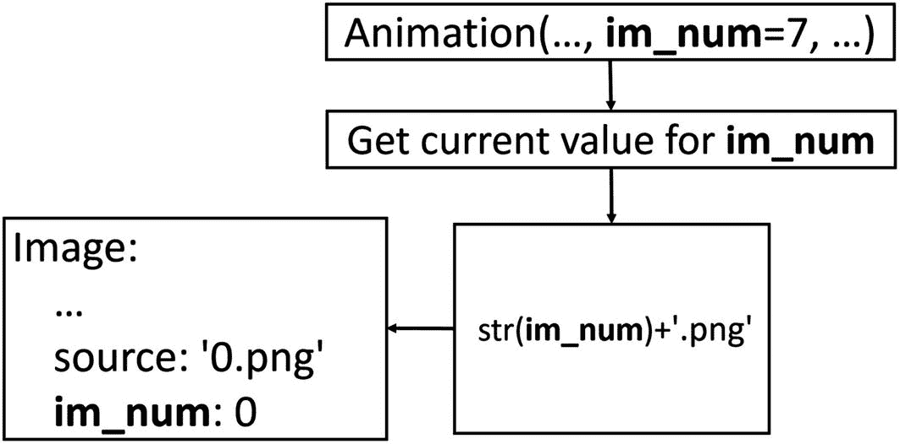

图 5-10

制作 Image 小部件的 source 属性动画的步骤

第一步，清单 [5-15](#PC15) 显示了添加`im_num`属性后的 KV 文件。注意 Python 允许我们向已经存在的类添加新的属性。新属性的值为 0，表示角色的第一个图像。

```py
FloatLayout:
    Image:
        id: character_image
        size_hint: (0.15, 0.15)
        pos_hint: {'x': 0.2, 'y': 0.6}
        source: "0.png"
        im_num: 0
        allow_stretch: True
    Button:
        size_hint: (0.3, 0.3)
        text: "Start Animation"
        on_press: app.start_char_animation()

Listing 5-15Adding the im_num Property to Change the Image Using Animation

```

第二步很简单。我们只是将一个名为`im_num`的参数添加到`Animation`类的构造函数中。该参数被分配给最后一个要使用的索引。如果有八个图像的索引从 0 到 7，则该参数被指定为 7。清单 [5-16](#PC16) 显示了 Python 代码。

```py
import kivy.app
import kivy.animation

class TestApp(kivy.app.App):

    def start_char_animation(self):
        character_image = self.root.ids['character_image']
        char_anim = kivy.animation.Animation(pos_hint={'x': 0.8, 'y': 0.6}, im_num=7)
        char_anim.start(character_image)

app = TestApp()
app.run()

Listing 5-16Adding the im_num Argument to the Animation

```

第三步，我们要回答这个问题，“我们如何返回动画生成的当前值？”答案很简单。为了在给定小部件的名为 **X** 的属性值发生变化时得到通知，我们在该小部件中添加了一个名为`on_X`的事件。此事件被分配给一个 Python 函数，每次属性值更改时都会调用该函数。因为我们的目标字段被命名为`im_num`，所以该事件将被称为`on_im_num`。

清单 [5-17](#PC17) 显示了添加该事件后修改后的 KV 文件。每次`im_num`字段的值改变时，Python 文件内的函数`change_char_im()`将被调用。

```py
FloatLayout:
    Image:
        id: character_image
        size_hint: (0.15, 0.15)
        pos_hint: {'x': 0.2, 'y': 0.6}
        source: "0.png"
        im_num: 0
        allow_stretch: True
        on_im_num: app.change_char_im()
    Button:
        size_hint: (0.3, 0.3)
        text: "Start Animation"
        on_press: app.start_char_animation()

Listing 5-17Adding the on_im_num Event to the Image Widget to Be Notified When the Image Changes

```

清单 [5-18](#PC18) 显示了添加这个函数后修改后的 Python 代码。每次改变时，打印`im_num`的值。

```py
import kivy.app
import kivy.animation

class TestApp(kivy.app.App):

    def change_char_im(self):
        character_image = self.root.ids['character_image']
        print(character_image.im_num)

    def start_char_animation(self):
        character_image = self.root.ids['character_image']
        char_anim = kivy.animation.Animation(pos_hint={'x': 0.8, 'y': 0.6}, im_num=7)
        char_anim.start(character_image)

app = TestApp()
app.run()

Listing 5-18Handling the on_im_num Event to Print the im_num When Changed

```

在第四步中，将返回的数字连接到图像扩展名，以返回表示图像名称的字符串。这个字符串被分配给图像模块的`source`属性。根据清单 [5-19](#PC19) ，这项工作是在修改后的`change_char_im()`函数内部完成的。

```py
import kivy.app
import kivy.animation

class TestApp(kivy.app.App):

    def change_char_im(self):
        character_image = self.root.ids['character_image']
        character_image.source = str(int(character_image.im_num)) + ".png"

    def start_char_animation(self):
        character_image = self.root.ids['character_image']
        char_anim = kivy.animation.Animation(pos_hint={'x': 0.8, 'y': 0.6}, im_num=7)
        char_anim.start(character_image)

app = TestApp()
app.run()

Listing 5-19Changing the Source Image of the Image Widget when im_num Changes

```

请注意，动画会在动画属性的起始值和结束值之间插入浮点数。所以，会有 0.1，2.6，4.3 等值。因为图像名称中有整数，所以`im_num`属性中的浮点值应该改为整数。

在将其转换为整数后，可以将其与图像扩展名连接起来，以返回表示图像名称的字符串。这个字符串被分配给图像模块的`source`属性。记住将图像设置在 Python 文件的当前目录下。否则，在图像名称前添加路径。

使用最新的 Python 和 KV 文件运行应用并按下按钮后，图像应该会随着时间的推移而改变。图 [5-11](#Fig11) 显示了角色在使用动画改变其图像时的四张截图。

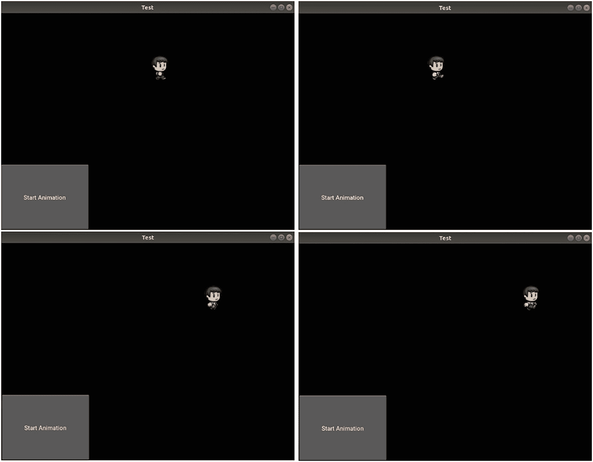

图 5-11

当角色移动时，角色图像改变

## 屏幕触摸事件

到目前为止，当点击按钮时，角色会移动。移动路径仅限于输入到动画类构造函数中的路径。我们需要改变这一点，以便根据整个屏幕上的触摸位置自由移动角色。请注意，Kivy 中的触摸指的是鼠标按压或触摸屏幕。为了做到这一点，我们需要获得屏幕上的触摸位置，然后动画角色移动到那个位置。

为了返回屏幕上的触摸位置，需要使用三个触摸事件，分别是`on_touch_up`、`on_touch_down`和`on_touch_move`。我们只是对触摸按下时获取触摸位置感兴趣，所以使用了`on_touch_down`事件。

根据清单 [5-20](#PC20) 中修改的 KV 文件，该事件被添加到根小部件(即`FloatLayout`)。请注意，将触摸事件与布局本身或其一个子布局绑定并不重要，因为它们不检测冲突，因此无法检测触摸位置的边界。它们总是返回整个窗口上的触摸位置。

```py
FloatLayout:
    on_touch_down: app.touch_down_handler(*args)

    Image:
        id: character_image
        size_hint: (0.15, 0.15)
        pos_hint: {'x': 0.2, 'y': 0.6}
        source: "0.png"
        im_num: 0
        allow_stretch: True
        on_im_num: app.change_char_im()
    Button:
        size_hint: (0.3, 0.3)
        text: "Start Animation"
        on_press: app.start_char_animation()

Listing 5-20Using the on_touch_down Event to Return the Screen Touch Position

```

该事件接受一个功能，该功能将在每次触摸屏幕时执行。Python 文件内的`touch_down_handler()`函数将响应触摸而执行。事件生成的所有参数都可以使用`args`变量传递给处理程序。这有助于访问 Python 函数内部的触摸位置。

清单 [5-21](#PC21) 展示了实现`touch_down_handler()`函数的修改后的 Python 文件。该函数只是在 args 中打印从事件接收的参数。

```py
import kivy.app
import kivy.animation

class TestApp(kivy.app.App):

    def touch_down_handler(self, *args):
        print(args)

    def change_char_im(self):
        character_image = self.root.ids['character_image']
        character_image.source = str(int(character_image.im_num)) + ".png"

    def start_char_animation(self):
        character_image = self.root.ids['character_image']
        char_anim = kivy.animation.Animation(pos_hint={'x': 0.8, 'y': 0.6}, im_num=7)
        char_anim.start(character_image)

app = TestApp()
app.run()

Listing 5-21Handling the touch_down_handler() to Get the Screen Touch Position

```

根据给定的输出，传递给函数的`args`是一个具有两个元素的元组。第一个元素指示哪个小部件与事件相关联。第二个元素给出了关于触摸和触发它的设备的信息。例如，通过单击鼠标左键触发触摸事件。

```py
(<kivy.uix.floatlayout.FloatLayout object at 0x7fcb70cf4250>, <MouseMotionEvent button="left" device="mouse" double_tap_time="0" dpos="(0.0, 0.0)" dsx="0.0" dsy="0.0" dsz="0.0" dx="0.0" dy="0.0" dz="0.0" grab_current="None" grab_exclusive_class="None" grab_list="[]" grab_state="False" id="mouse1" is_double_tap="False" is_mouse_scrolling="False" is_touch="True" is_triple_tap="False" opos="(335.0, 206.99999999999997)" osx="0.45702592087312416" osy="0.37981651376146786" osz="0.0" ox="335.0" oy="206.99999999999997" oz="0.0" pos="(335.0, 206.99999999999997)" ppos="(335.0, 206.99999999999997)" profile="['pos', 'button']" psx="0.45702592087312416" psy="0.37981651376146786" psz="0.0" push_attrs="('x', 'y', 'z', 'dx', 'dy', 'dz', 'ox', 'oy', 'oz', 'px', 'py', 'pz', 'pos')" push_attrs_stack="[]" px="335.0" py="206.99999999999997" pz="0.0" shape="None" spos="(0.45702592087312416, 0.37981651376146786)" sx="0.45702592087312416" sy="0.37981651376146786" sz="0.0" time_end="-1" time_start="1563021796.776788" time_update="1563021796.776788" triple_tap_time="0" ud="{}" uid="1" x="335.0" y="206.99999999999997" z="0.0">)

```

事件指定触摸位置有不同的方式。例如，`pos`属性根据窗口以像素为单位指定位置，而`spos`返回相对于窗口大小的位置。因为我们游戏中的所有位置都是相对于窗口大小的，spos 用来指定角色移动到的位置。

以前，移动角色的动画是在 Python 文件内的`start_char_animation()`函数中创建和启动的。该函数使用角色移动到的静态位置。使用触摸事件后，角色将移动到`touch_down_handler()`函数中触摸事件的`spos`属性返回的位置。因此，`start_char_animation()`功能的标题将改变以接收触摸位置。清单 [5-22](#PC23) 显示了修改后的 Python 文件。

请注意`spos`属性是如何从`args`返回的。因为它位于 args 的第二个元素(即 index 1)中，所以使用了`args[1]`。

```py
import kivy.app
import kivy.animation

class TestApp(kivy.app.App):

    def touch_down_handler(self, args):
        self.start_char_animation(args[1].spos)

    def change_char_im(self):
        character_image = self.root.ids['character_image']
        character_image.source = str(int(character_image.im_num)) + ".png"

    def start_char_animation(self, touch_pos):
        character_image = self.root.ids['character_image']
        char_anim = kivy.animation.Animation(pos_hint={'x': touch_pos[0], 'y': touch_pos[1]}, im_num=7)
        char_anim.start(character_image)

app = TestApp()
app.run()

Listing 5-22Moving the Character According to the Touch Position

```

因为现在动画是通过触摸屏幕开始的，所以 KV 文件中不需要按钮。清单 [5-23](#PC24) 给出了移除该按钮后修改后的 KV 文件。

```py
FloatLayout:
    on_touch_down: app.touch_down_handler(args)

    Image:
        id: character_image
        size_hint: (0.15, 0.15)
        pos_hint: {'x': 0.2, 'y': 0.6}
        source: "0.png"
        im_num: 0
        allow_stretch: True
        on_im_num: app.change_char_im()

Listing 5-23Removing the Button That Starts the Animation

```

运行应用并触摸窗口后，角色将移动到被触摸的位置。因为小部件的位置反映了左下角将要放置的位置，所以将该位置直接提供给图像小部件的`pos_hint`属性会使其左下角从触摸位置开始，并根据在`size_hint`属性中指定的大小进行扩展。如图 [5-12](#Fig12) 所示。将小工具居中在触摸位置更方便。我们如何做到这一点？

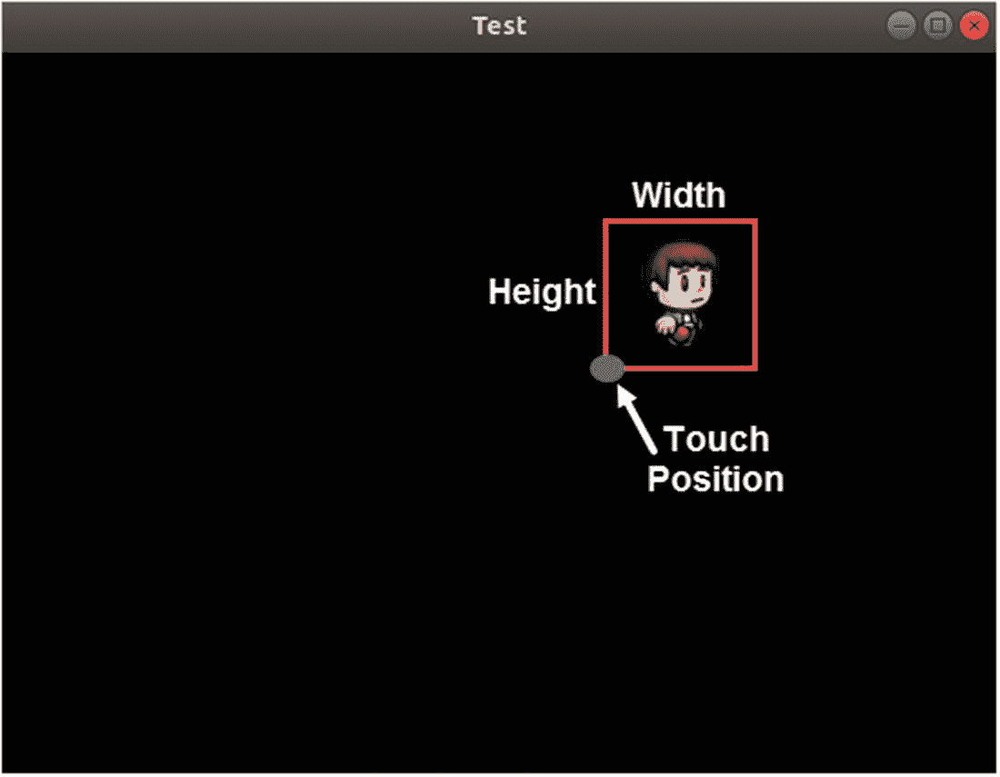

图 5-12

图像小工具的左下角放置在触摸位置

目前，小部件的中心比触摸位置大，水平方向大其宽度的一半，垂直方向大其高度的一半。根据以下等式计算中心坐标:

```py
widgetCenterX = touchPosX + widgetWidth/2
widgetCenterY = touchPosY + widgetHeight/2

```

为了根据触摸位置使小部件居中，我们可以从`touchPosX`中减去`widgetWidth/2`，从`touchPosY`中减去`widgetHeight/2`。结果将如下所示:

```py
widgetCenterX = (touchPosX - widgetWidth/2) + widgetWidth/2 = touchPosX
widgetCenterY = (touchPosY + widgetHeight/2) + widgetWidth/2 = touchPosY

```

这样，小工具将在触摸位置居中。清单 [5-24](#PC27) 显示了在`start_char_animation()`函数中修改动画位置后的 Python 代码。注意，`widgetWidth`等于`size_hint[0]`，`widgetHeight`等于`size_hint[1]`。

```py
import kivy.app
import kivy.animation

class TestApp(kivy.app.App):
    def touch_down_handler(self, args):
        self.start_char_animation(args[1].spos)

    def change_char_im(self):
        character_image = self.root.ids['character_image']
        character_image.source = str(int(character_image.im_num)) + ".png"

    def start_char_animation(self, touch_pos):
        character_image = self.root.ids['character_image']
        char_anim = kivy.animation.Animation(pos_hint={'x': touch_pos[0]-character_image.size_hint[0]/2,'y': touch_pos[1]-character_image.size_hint[1]/2},im_num=7)
        char_anim.start(character_image)

app = TestApp()
app.run()

Listing 5-24Moving the Center of the Image Widget to the Touch Position

```

图 [5-13](#Fig13) 显示触摸屏幕后的结果。角色的中心位于触摸位置。

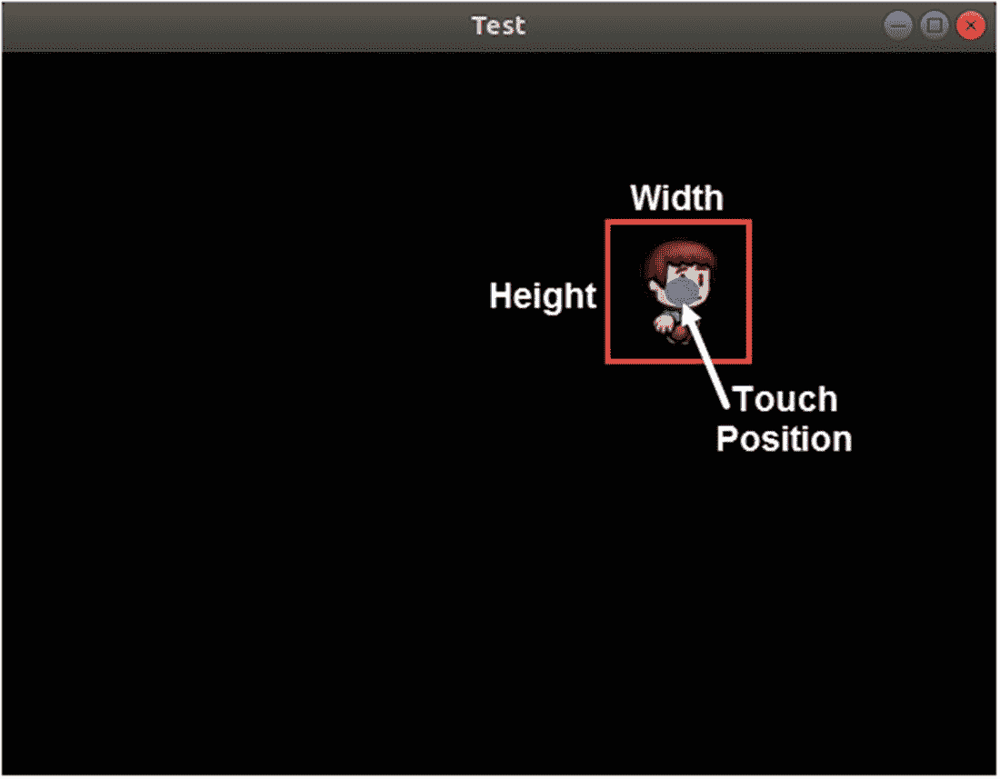

图 5-13

图像小工具的中心放置在触摸位置上

### on _ 完成

每次触摸屏幕时，都会创建一个动画实例。它动画显示了`Image`小部件的`pos_hint`和`im_num`属性。对于第一次屏幕触摸，这两个属性随着角色的移动和图像的改变而被激活。更多地触摸屏幕只会移动角色，但不幸的是，`im_num`属性不会改变。因此，在第一次触摸屏幕后，将有一个静态图像显示在小工具上。为什么会这样？

KV 文件中`im_num`的初始值为 0。第一次触摸屏幕时，动画开始播放，因此`im_num`从 0 到 7 播放动画。动画完成后，存储在`im_num`中的当前值将是 7。

再次触摸屏幕，`im_num`将从当前值 7 变为新值，也是 7。结果，显示的图像没有变化。解决方法是在启动`start_char_animation()`函数内的动画之前，将`im_num`的值重置为 0。

动画完成后，角色预计处于稳定状态，因此将显示带有`im_num=0`的第一个图像。但是完成动画后存储在`im_num`中的值是 7，而不是 0。最好在动画完成后将`im_num`重置为 0。

幸运的是，`Animation`类有一个名为`on_complete`的事件，在动画完成时被触发。我们可以将我们的动画绑定到这个事件，这样每次完成时都会执行一个回调函数。回调函数被命名为`char_animation_completed()`。在这个函数中，我们可以强制`im_num`返回 0。将`on_complete`事件绑定到角色动画后，修改后的 Python 文件在清单 [5-25](#PC28) 中列出。这个`on_complete`事件向回调函数发送参数，这些参数是触发事件的动画和与之关联的小部件。这就是回调函数接受它们进入`args`的原因。

```py
import kivy.app
import kivy.animation

class TestApp(kivy.app.App):

    def char_animation_completed(self, *args):
        character_image = self.root.ids['character_image']
        character_image.im_num = 0

    def touch_down_handler(self, args):
        self.start_char_animation(args[1].spos)

    def change_char_im(self):
        character_image = self.root.ids['character_image']
        character_image.source = str(int(character_image.im_num))+".png"

    def start_char_animation(self, touch_pos):
        character_image = self.root.ids['character_image']
        character_image.im_num = 0
        char_anim = kivy.animation.Animation(pos_hint={'x': touch_pos[0]-character_image.size_hint[0]/2, 'y': touch_pos[1]-character_image.size_hint[1]/2}, im_num=7)
        char_anim.bind(on_complete=self.char_animation_completed)
        char_anim.start(character_image)

app = TestApp()
app.run()

Listing 5-25Resetting the im_num Property to 0 After the Animation Completes

```

在回调函数中，`Image`小部件的`im_num`被改回 0。因此，每次动画完成时，小部件上显示的图像将被重置。

将角色动画制作正确后，我们就可以开始给游戏添加怪物了。玩家/角色在与怪物相撞时死亡。

## 向游戏中添加怪物

怪物将被添加到 KV 文件中，就像添加角色一样。我们只是在 KV 文件中为怪物创建了一个`Image`小部件。新的 KV 文件如清单 [5-26](#PC29) 所示。

```py
FloatLayout:
    on_touch_down: app.touch_down_handler(args)

    Image:
        id: monster_image
        size_hint: (0.15, 0.15)
        pos_hint: {'x': 0.8, 'y': 0.8}
        source: "10.png"
        im_num: 10
        allow_stretch: True
        on_im_num: app.change_monst_im()

    Image:
        id: character_image
        size_hint: (0.15, 0.15)
        pos_hint: {'x': 0.2, 'y': 0.6}
        source: "0.png"
        im_num: 0
        allow_stretch: True
        on_im_num: app.change_char_im()

Listing 5-26Adding an Image Widget for the Monster

```

怪物的`Image`部件将具有角色中定义的属性。这些属性是用于引用 Python 文件中的小部件的 ID，`size_hint`用于设置相对于屏幕大小的小部件大小，`pos_hint`用于相对于屏幕放置小部件，`source`用于将图像名称保存为字符串，`allow_stretch`用于拉伸图像以覆盖图像的整个区域，`im_num`用于保存小部件上显示的图像编号。为了使角色和怪物的图像编号不同，怪物图像编号将从 10 开始。图 [5-14](#Fig14) 显示了怪物的图像。


图 5-14

怪物的图像序列

`on_im_num`事件将通过一个名为`change_monst_im()`的回调函数与`im_num`属性相关联，以在每次发生变化时访问 Python 文件中的值。

在我们准备好 KV 文件后，我们将看到的应用窗口如图 [5-15](#Fig15) 所示。

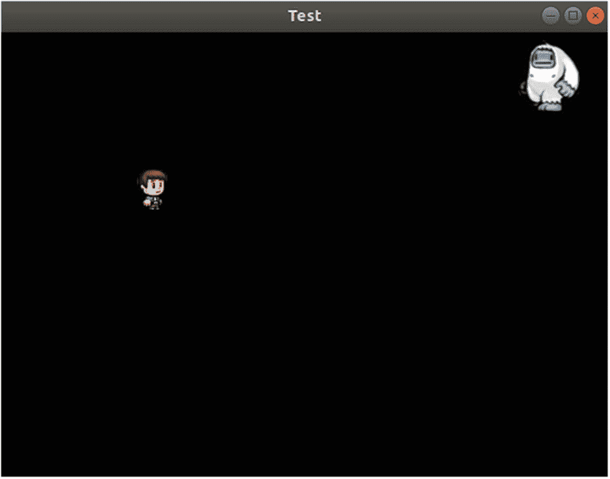

图 5-15

角色和怪物图像部件出现在屏幕上

请注意，怪物`Image`小部件位于 KV 文件中的字符小部件之前(即，在小部件树中)。这使得角色的 Z 指数低于怪物的 Z 指数，从而画在它的上面，如图 [5-16](#Fig16) 所示。

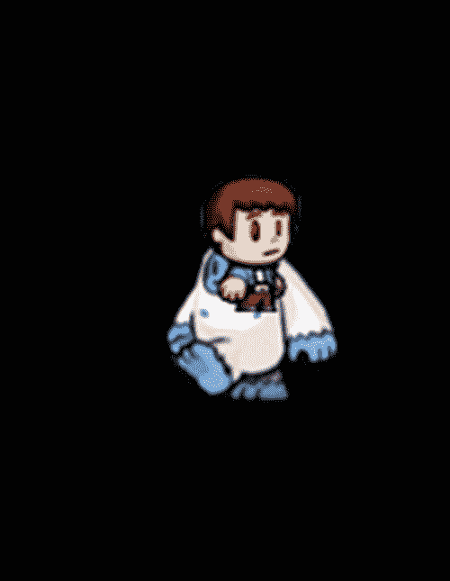

图 5-16

角色图像小部件出现在怪物图像小部件的上方

### 开启 _ 启动

角色的动画在每次触摸屏幕时开始，但是怪物的动画必须在应用启动后开始。那么，我们可以在 Python 文件的什么地方启动这个怪物呢？根据 Kivy 应用生命周期，一旦应用启动，就会执行名为`on_start()`的方法。这是开始怪物动画的好地方。

在我们添加了`change_monst_im()`和`on_start()`函数来处理怪物的动画之后，Python 文件如清单 [5-27](#PC30) 所示。除了改变怪物`Image`控件的`source`属性外，`change_monst_im()`功能与`change_char_im(),`类似。

```py
import kivy.app
import kivy.animation

class TestApp(kivy.app.App):

    def char_animation_completed(self, *args):
        character_image = self.root.ids['character_image']
        character_image.im_num = 0

    def touch_down_handler(self, args):
        self.start_char_animation(args[1].spos)

    def change_char_im(self):
        character_image = self.root.ids['character_image']
        character_image.source = str(int(character_image.im_num))+".png"

    def change_monst_im(self):
        monster_image = self.root.ids['monster_image']
        monster_image.source = str(int(monster_image.im_num))+".png"

    def start_char_animation(self, touch_pos):
        character_image = self.root.ids['character_image']
        character_image.im_num = 0
        char_anim = kivy.animation.Animation(pos_hint={'x': touch_pos[0]-character_image.size_hint[0]/2, 'y': touch_pos[1]-character_image.size_hint[1]/2}, im_num=7)
        char_anim.bind(on_complete=self.char_animation_completed)
        char_anim.start(character_image)

    def on_start(self):
        monster_image = self.root.ids['monster_image']
        monst_anim = kivy.animation.Animation(pos_hint={'x': 0.8, 'y': 0.0}, im_num=17, duration=2.0)+kivy.animation.Animation(pos_hint={'x': 0.8, 'y': 0.8}, im_num=10, duration=2.0)
        monst_anim.repeat = True

        monst_anim.start(monster_image)

app = TestApp()
app.run()

Listing 5-27Adding the Functions to Handle the Monster Animation

```

在`on_start()`函数中，创建了两个顺序连接的动画来制作怪物`Image`小部件的`pos_hint`和`im_num`属性的动画。

根据 KV 文件怪物的初始位置是`{'x':0.8, 'y':0.8}`。第一个动画将该位置更改为`{'x':0.8, 'y':0.0}`，第二个动画将其更改回`{'x':0.8, 'y':0.8}`。这个动画循环发生，因为动画实例`monst_anim`的`repeat`属性被设置为`True`。为了简单起见，怪物在固定的路径上移动。在接下来的部分，我们将改变它的运动是随机的。

因为 KV 文件中怪物的`im_num`属性的初始值设置为 10，所以第一个动画的`im_num`设置为 17。因此，第一个动画将图像编号从 10 更改为 17。第二个动画将该属性设置为 10，以便将图像编号从 17 改回 10。每个动画持续两秒钟。

动画与 monster Image 小部件相关联，该小部件使用其在`monster_image`变量中的 ID 返回。

## 冲突

到目前为止，角色和怪物的`pos_hint`和`im_num`属性的动画工作正常。我们需要修改游戏，使角色在与怪物相撞时被杀死。

Kivy 中碰撞的工作方式是，它检查两个小部件的边界框之间的交集。内置的 Kivy 函数就是这样做的。例如，该命令检测两个图像小部件之间的冲突:

```py
character_image.collide_widget(monster_image)

```

我们必须不断检查两个小部件之间的冲突。因此，需要将上述命令添加到定期执行的内容中。

每当小部件使用`pos_hint`属性改变其位置时，就会触发`on_pos_hint`事件。该事件将在每次触发时执行一个回调函数。因为怪物图像小部件不断改变它的位置，所以我们可以将事件绑定到那个小部件。

请注意，如果你打算稍后杀死怪物，怪物将不会改变它的位置，因此`on_pos_hint`将永远不会被发射，因此没有碰撞检查。如果有其他可能杀死角色的物体，并且你完全依赖与被杀死的怪物相关联的事件进行碰撞检测，则角色不会被杀死。你得找别的东西来检查碰撞。一种解决方案是将`on_pos_hint`事件与每个可能杀死角色的对象绑定。

首先，将`on_pos_hint`事件添加到 KV 文件中，如清单 [5-28](#PC32) 所示。它与一个叫做`monst_pos_hint()`的回调函数相关联。

```py
FloatLayout:
    on_touch_down: app.touch_down_handler(args)

    Image:
        id: monster_image
        size_hint: (0.15, 0.15)
        pos_hint: {'x': 0.8, 'y': 0.8}
        source: "10.png"
        im_num: 10
        allow_stretch: True
        on_im_num: app.change_monst_im()
        on_pos_hint: app.monst_pos_hint()

    Image:
        id: character_image
        size_hint: (0.15, 0.15)
        pos_hint: {'x': 0.2, 'y': 0.6}
        source: "0.png"
        im_num: 0
        allow_stretch: True
        on_im_num: app.change_char_im()

Listing 5-28Using the on_pos_hint Event to Return the Monster Position

```

在清单 [5-29](#PC33) 所示的 Python 文件的末尾实现了`monst_pos_hint()`函数。它在`character_image`和`monster_image`属性中返回角色和怪物部件，然后调用`collide_widget()`函数。到目前为止，如果根据`if`声明发生了碰撞，将会打印一条消息。

```py
import kivy.app
import kivy.animation

class TestApp(kivy.app.App):

    def char_animation_completed(self, *args):
        character_image = self.root.ids['character_image']
        character_image.im_num = 0

    def touch_down_handler(self, args):
        self.start_char_animation(args[1].spos)

    def change_char_im(self):
        character_image = self.root.ids['character_image']
        character_image.source = str(int(character_image.im_num))+".png"

    def change_monst_im(self):
        monster_image = self.root.ids['monster_image']
        monster_image.source = str(int(monster_image.im_num))+".png"

    def start_char_animation(self, touch_pos):
        character_image = self.root.ids['character_image']
        character_image.im_num = 0
        char_anim = kivy.animation.Animation(pos_hint={'x': touch_pos[0]-character_image.size_hint[0]/2, 'y': touch_pos[1]-character_image.size_hint[1]/2}, im_num=7)
        char_anim.bind(on_complete=self.char_animation_completed)
        char_anim.start(character_image)

    def on_start(self):
        monster_image = self.root.ids['monster_image']
        monst_anim = kivy.animation.Animation(pos_hint={'x': 0.8, 'y': 0.0}, im_num=17, duration=2.0)+kivy.animation.Animation(pos_hint={'x': 0.8, 'y': 0.8}, im_num=10, duration=2.0)
        monst_anim.repeat = True

        monst_anim.start(monster_image)

    def monst_pos_hint(self):
        character_image = self.root.ids['character_image']
        monster_image = self.root.ids['monster_image']
        if character_image.collide_widget(monster_image):
            print("Character Killed")

app = TestApp()
app.run()

Listing 5-29Handling the monst_pos_hint() Callback Function

```

### 调整 collide_widget()

`collide_widget()`函数过于严格，因为如果两个小部件之间至少有一行或一列交集，它将返回`True`。实际上，这种情况并不经常发生。根据图 [5-17](#Fig17) ，这样一个函数返回`True`，因为两个窗口小部件的边界框有交集。结果就是，这个角色即使没碰过怪物也会被杀死。

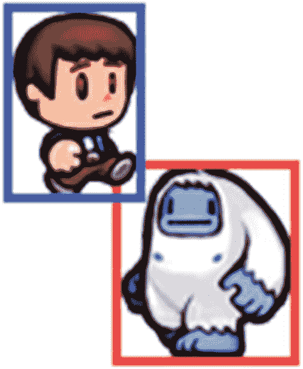

图 5-17

当小部件框的外部边界发生冲突时，即使图像没有接触，collide_widget()也会返回 True

我们可以通过添加另一个条件来调整`collide_widget()`函数，该条件检查碰撞区域是否超过字符大小的预定义百分比。这让我们在说有碰撞的时候更加自信。`monst_pos_hint()`功能修改如清单 [5-30](#PC34) 所示。

```py
def monst_pos_hint(self):
    character_image = self.root.ids['character_image']
    monster_image = self.root.ids['monster_image']

    character_center = character_image.center
    monster_center = monster_image.center

    gab_x = character_image.width / 2
    gab_y = character_image.height / 2
    if character_image.collide_widget(monster_image) and abs(character_center[0] - monster_center[0]) <= gab_x and abs(character_center[1] - monster_center[1]) <= gab_y:
        print("Character Killed")

Listing 5-30Tuning the collide_widget() Function to Return True Only When the Character and Monster Touch Each Other

```

新条件的结论是，如果两个窗口小部件的当前中心之间的差异至少是字符大小的一半，则发生碰撞。这是通过确保两个中心的 X 和 Y 坐标之差分别小于字符宽度和高度的一半来实现的。

调节`collide_widget()`功能后，对于图 [5-18](#Fig18) 和 [5-19](#Fig19) 所示的情况，条件返回`False`。因此，结果更加真实。


图 5-18

没有发生碰撞，因为没有超过列表 [5-30](#PC34) 中定义的怪物和角色图像中心之间的最大间隙。完整的 Python 代码如清单 [5-31](#PC35) 所示

```py
import kivy.app
import kivy.animation

class TestApp(kivy.app.App):

    def char_animation_completed(self, *args):
        character_image = self.root.ids['character_image']
        character_image.im_num = 0

    def touch_down_handler(self, args):
        self.start_char_animation(args[1].spos)

    def change_char_im(self):
        character_image = self.root.ids['character_image']
        character_image.source = str(int(character_image.im_num))+".png"

    def change_monst_im(self):
        monster_image = self.root.ids['monster_image']
        monster_image.source = str(int(monster_image.im_num))+".png"

    def start_char_animation(self, touch_pos):
        character_image = self.root.ids['character_image']
        character_image.im_num = 0
        char_anim = kivy.animation.Animation(pos_hint={'x': touch_pos[0]-character_image.size_hint[0]/2, 'y': touch_pos[1]-character_image.size_hint[1]/2}, im_num=7)
        char_anim.bind(on_complete=self.char_animation_completed)
        char_anim.start(character_image)

    def on_start(self):
        monster_image = self.root.ids['monster_image']
        monst_anim = kivy.animation.Animation(pos_hint={'x': 0.8, 'y': 0.0}, im_num=17, duration=2.0)+kivy.animation.Animation(pos_hint={'x': 0.8, 'y': 0.8}, im_num=10, duration=2.0)
        monst_anim.repeat = True
        monst_anim.start(monster_image)

    def monst_pos_hint(self):
        character_image = self.root.ids['character_image']
        monster_image = self.root.ids['monster_image']

        character_center = character_image.center
        monster_center = monster_image.center

        gab_x = character_image.width/2
        gab_y = character_image.height/2
        if character_image.collide_widget(monster_image) and abs(character_center[0]-monster_center[0])<=gab_x and abs(character_center[1]-monster_center[1])<=gab_y:
            print("Character Killed")

app = TestApp()
app.run()

Listing 5-31Complete Code for the Game in Which the Work for the Animation and Collision Is Completed Successfully

```

## 随机怪物运动

在清单 [5-31](#PC35) 中的前一个应用中，我们做了很好的工作，成功地制作了角色和怪物的动画。但是怪物在固定的路径上移动。在本节中，我们将修改它的运动，使它看起来是随机的。这个想法非常类似于角色`Image`部件的动画。

使用一个名为`start_char_animation()`的函数激活角色，该函数接受角色移动到的新位置。因为只创建了一个动画，所以可以重复。为了在完成后重复动画，将`on_complete`事件附加到角色的动画中。名为`char_animation_completed()`的回调函数与该事件相关联。当动画完成时，这个回调函数被执行，它为新的动画准备角色。我们想让怪物的动作也像这样。这适用于清单 [5-32](#PC36) 中所示的修改后的 Python 文件。

创建了两个新函数，分别是`start_char_animation()`和`char_animation_completed()`。`start_char_animation()`函数接受怪物移动到的新位置，作为名为`new_pos`的参数。然后它创建一个动画实例，根据新的位置改变`pos_hint`属性。它还将 KV 文件中的`im_num`属性从初始值 10 更改为 17。

```py
import kivy.app
import kivy.animation
import random

class TestApp(kivy.app.App):

    def char_animation_completed(self, *args):
        character_image = self.root.ids['character_image']
        character_image.im_num = 0

    def monst_animation_completed(self, *args):
        monster_image = self.root.ids['monster_image']
        monster_image.im_num = 10

        new_pos = (random.uniform(), random.uniform())
        self.start_monst_animation(new_pos=new_pos)

    def touch_down_handler(self, args):
        self.start_char_animation(args[1].spos)

    def change_char_im(self):
        character_image = self.root.ids['character_image']
        character_image.source = str(int(character_image.im_num)) + ".png"

    def change_monst_im(self):
        monster_image = self.root.ids['monster_image']
        monster_image.source = str(int(monster_image.im_num)) + ".png"

    def start_char_animation(self, touch_pos):
        character_image = self.root.ids['character_image']
        character_image.im_num = 0
        char_anim = kivy.animation.Animation(pos_hint={'x': touch_pos[0] - character_image.size_hint[0] / 2, 'y': touch_pos[1] - character_image.size_hint[1] / 2}, im_num=7)
        char_anim.bind(on_complete=self.char_animation_completed)
        char_anim.start(character_image)

    def start_monst_animation(self, new_pos, anim_duration):
        monster_image = self.root.ids['monster_image']
        monst_anim = kivy.animation.Animation(pos_hint={'x': new_pos[0], 'y': new_pos[1]}, im_num=17, duration=anim_duration)
        monst_anim.bind(on_complete=self.monst_animation_completed)
        monst_anim.start(monster_image)

    def on_start(self):
        monster_image = self.root.ids['monster_image']
        new_pos = (random.uniform(0.0, 1 - monster_image.size_hint[0]), random.uniform(0.0, 1 - monster_image.size_hint[1]))
        self.start_monst_animation(new_pos=new_pos, anim_duration=random.uniform(1.5, 3.5))

    def monst_pos_hint(self):
        character_image = self.root.ids['character_image']
        monster_image = self.root.ids['monster_image']

        character_center = character_image.center
        monster_center = monster_image.center

        gab_x = character_image.width / 2

        gab_y = character_image.height / 2
        if character_image.collide_widget(monster_image) and abs(character_center[0] - monster_center[0]) <= gab_x and abs(character_center[1] - monster_center[1]) <= gab_y:
            print("Character Killed")

app = TestApp()
app.run()

Listing 5-32Repeating the Monster Animation by Handling the on_complete Event of the Animation

```

在`on_start()`函数中，`start_monst_animation()`被调用，输入参数被指定为一个随机值。因为只有一个动画，所以动画不能通过将 repeat 属性设置为`True`来重复自身。因此，`on_complete`事件被附加到动画上，以便在动画完成后执行回调函数`monst_animation_completed()`。这给了我们再次开始动画的机会。

在回调函数内部，怪物的`im_num`属性再次被重置为 10。使用 random 模块中的`uniform()`函数，为新位置的 X 和 Y 坐标生成一个随机值。返回值是介于 0.0 和 1.0 之间的浮点数。新位置被用作 monster 小部件的左下角。

假设随机返回的位置是(0.0，1.0)，这使得角色的底线从屏幕的末端开始。这样一来，怪物就会被隐藏起来。这也适用于位置(1.0，0.0)和(1.0，1.0)。

为了确保怪物在屏幕上始终可见，我们必须考虑它的宽度和高度。将怪物的左下角定位在新的随机位置后，怪物必须有一个适合其宽度和高度的空间。因此，X 的最大可能值是`1-monster_width`，Y 的最大可能值是`1-monster_height`。这为怪物在窗口中任何生成的位置完全可见腾出了空间。

修改后的 Python 代码如清单 [5-33](#PC37) 所示。在之前的应用中，所有怪物移动的持续时间是 2.0 秒。在新代码中，使用`random.uniform()`随机返回持续时间。结果，怪物在随机时间内移动到随机生成的位置。

```py
import kivy.app
import kivy.animation
import random

class TestApp(kivy.app.App):

    def char_animation_completed(self, *args):
        character_image = self.root.ids['character_image']
        character_image.im_num = 0

    def monst_animation_completed(self, *args):
        monster_image = self.root.ids['monster_image']
        monster_image.im_num = 10

        new_pos = (random.uniform(0.0, 1 - monster_image.size_hint[0]), random.uniform(0.0, 1 - monster_image.size_hint[1]))
        self.start_monst_animation(new_pos= new_pos,anim_duration=random.uniform(1.5, 3.5))

    def touch_down_handler(self, args):
        self.start_char_animation(args[1].spos)

    def change_char_im(self):
        character_image = self.root.ids['character_image']
        character_image.source = str(int(character_image.im_num)) + ".png"

    def change_monst_im(self):
        monster_image = self.root.ids['monster_image']
        monster_image.source = str(int(monster_image.im_num)) + ".png"

    def start_char_animation(self, touch_pos):
        character_image = self.root.ids['character_image']
        character_image.im_num = 0

        char_anim = kivy.animation.Animation(pos_hint={'x': touch_pos[0] - character_image.size_hint[0] / 2, 'y': touch_pos[1] - character_image.size_hint[1] / 2}, im_num=7)
        char_anim.bind(on_complete=self.char_animation_completed)
        char_anim.start(character_image)

    def start_monst_animation(self, new_pos, anim_duration):
        monster_image = self.root.ids['monster_image']
        monst_anim = kivy.animation.Animation(pos_hint={'x': new_pos[0], 'y': new_pos[1]}, im_num=17, duration=anim_duration)
        monst_anim.bind(on_complete=self.monst_animation_completed)
        monst_anim.start(monster_image)

    def on_start(self):
        monster_image = self.root.ids['monster_image']
        new_pos = (random.uniform(0.0, 1 - monster_image.size_hint[0]), random.uniform(0.0, 1 - monster_image.size_hint[1]))
        self.start_monst_animation(new_pos=new_pos, anim_duration=random.uniform(1.5, 3.5))

    def monst_pos_hint(self):
        character_image = self.root.ids['character_image']
        monster_image = self.root.ids['monster_image']

        character_center = character_image.center
        monster_center = monster_image.center

        gab_x = character_image.width / 2

        gab_y = character_image.height / 2
        if character_image.collide_widget(monster_image) and abs(character_center[0] - monster_center[0]) <= gab_x and abs(character_center[1] - monster_center[1]) <= gab_y:
            print("Character Killed")

app = TestApp()
app.run()

Listing 5-33Randomly Changing the Position and Duration of the Monster Animation

```

## 杀死角色

在清单 [5-33](#PC37) 中的上一个游戏中，即使怪物与角色发生碰撞，一切仍然正常。我们需要修改应用，使角色在被杀死时停止移动。我们这样做是为了确保它的动画不会再次开始。

在`touch_down_handler()`功能中，角色总是朝着屏幕上被触摸的位置移动，即使在碰撞之后。在清单 [5-34](#PC38) 中列出的修改后的 Python 代码中，通过使用一个名为`character_killed`的标志变量来指示角色是否被杀死，这个问题得到了解决。这样的变量默认设置为`False`，意味着游戏还在运行，角色还活着。`touch_down_handler()`函数中的`if`语句确保角色动画仅在标志设置为`False`时工作。因为标志与类相关联，所以可以通过在类名前面加上(`TestApp.character_killed`)来访问它。

当在`mons_pos_hint()`函数中检测到碰撞时，采取两个动作，将`character_killed`标志的值改为`True`，并取消所有正在运行的动画(即角色和怪物)。

```py
import kivy.app
import kivy.animation
import random

class TestApp(kivy.app.App):
    character_killed = False

    def char_animation_completed(self, *args):
        character_image = self.root.ids['character_image']
        character_image.im_num = 0

    def monst_animation_completed(self, *args):
        monster_image = self.root.ids['monster_image']
        monster_image.im_num = 10

        new_pos = (random.uniform(0.0, 1 - monster_image.size_hint[0]), random.uniform(0.0, 1 - monster_image.size_hint[1]))
        self.start_monst_animation(new_pos= new_pos,anim_duration=random.uniform(1.5, 3.5))

    def touch_down_handler(self, args):
        if TestApp.character_killed == False:
            self.start_char_animation(args[1].spos)

    def change_char_im(self):
        character_image = self.root.ids['character_image']
        character_image.source = str(int(character_image.im_num)) + ".png"

    def change_monst_im(self):
        monster_image = self.root.ids['monster_image']
        monster_image.source = str(int(monster_image.im_num)) + ".png"

    def start_char_animation(self, touch_pos):
        character_image = self.root.ids['character_image']
        character_image.im_num = 0

        char_anim = kivy.animation.Animation(pos_hint={'x': touch_pos[0] - character_image.size_hint[0] / 2, 'y': touch_pos[1] - character_image.size_hint[1] / 2}, im_num=7)
        char_anim.bind(on_complete=self.char_animation_completed)
        char_anim.start(character_image)

    def start_monst_animation(self, new_pos, anim_duration):
        monster_image = self.root.ids['monster_image']
        monst_anim = kivy.animation.Animation(pos_hint={'x': new_pos[0], 'y': new_pos[1]}, im_num=17, duration=anim_duration)
        monst_anim.bind(on_complete=self.monst_animation_completed)
        monst_anim.start(monster_image)

    def on_start(self):
        monster_image = self.root.ids['monster_image']
        new_pos = (random.uniform(0.0, 1 - monster_image.size_hint[0]), random.uniform(0.0, 1 - monster_image.size_hint[1]))
        self.start_monst_animation(new_pos=new_pos, anim_duration=random.uniform(1.5, 3.5))

    def monst_pos_hint(self):
        character_image = self.root.ids['character_image']
        monster_image = self.root.ids['monster_image']

        character_center = character_image.center
        monster_center = monster_image.center

        gab_x = character_image.width / 2

        gab_y = character_image.height / 2
        if character_image.collide_widget(monster_image) and abs(character_center[0] - monster_center[0]) <= gab_x and abs(character_center[1] - monster_center[1]) <= gab_y:

            kivy.animation.Animation.cancel_all(character_image)
            kivy.animation.Animation.cancel_all(monster_image)

app = TestApp()
app.run()

Listing 5-34Adding the character_killed Flag to Determine Whether the Character Animation Could Start Again

```

当`monst_pos_hint()`功能内的标志变为`True`时，角色动画无法停止。请注意，在标志值变为`True`后，仍有一个运行的动画响应先前触摸的位置。这意味着角色将继续移动，直到动画完成，然后停止移动。为了在碰撞发生时停止移动动画，我们可以使用`cancel_all()`功能取消动画。因此，一旦碰撞发生，取消动画将停止它。更改标志值会阻止动画再次开始。

因为怪物动画一旦被取消，用户就没有办法启动了，取消这样的动画就足够了。

### 角色杀戮动画

根据图 [5-19](#Fig19) ，当角色在之前的应用中被杀死时，它会保留由`im_num`属性指定的图像编号。图像没有反映人物的死亡。

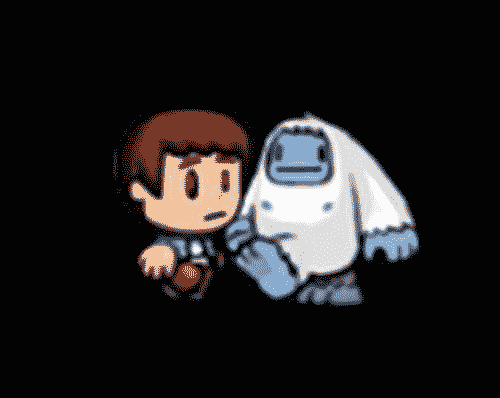

图 5-19

当与怪物发生碰撞时，角色图像停止在其最新状态

我们可以改变形象，给人更好的印象。为此，将使用图 [5-20](#Fig20) 中显示的图像。


图 5-20

当角色被杀死时显示的图像序列

一旦发生碰撞，只有在根据这些图像制作图像动画的`monst_pos_hint()`函数内部创建动画后，才会开始。如果这些图像的编号从 91 到 95，修改后的 Python 代码如清单 [5-35](#PC39) 所示。新动画只是将`im_num`属性更改为 95。

需要记住的是，角色动画被取消后，`im_num`数字会保持在 0 到 7 之间。例如，如果它的值是 5，那么运行新的动画将从 5 到 95。因为我们对从 91 开始感兴趣，所以在动画开始之前，`im_num`属性值被设置为 91。

```py
import kivy.app
import kivy.animation
import random

class TestApp(kivy.app.App):
    character_killed = False

    def char_animation_completed(self, *args):
        character_image = self.root.ids['character_image']
        character_image.im_num = 0

    def monst_animation_completed(self, *args):
        monster_image = self.root.ids['monster_image']
        monster_image.im_num = 10

        new_pos = (random.uniform(0.0, 1 - monster_image.size_hint[0]), random.uniform(0.0, 1 - monster_image.size_hint[1]))
        self.start_monst_animation(new_pos= new_pos,anim_duration=random.uniform(1.5, 3.5))

    def touch_down_handler(self, args):
        if TestApp.character_killed == False:
            self.start_char_animation(args[1].spos)

    def change_char_im(self):
        character_image = self.root.ids['character_image']
        character_image.source = str(int(character_image.im_num)) + ".png"

    def change_monst_im(self):
        monster_image = self.root.ids['monster_image']
        monster_image.source = str(int(monster_image.im_num)) + ".png"

    def start_char_animation(self, touch_pos):
        character_image = self.root.ids['character_image']
        character_image.im_num = 0

        char_anim = kivy.animation.Animation(pos_hint={'x': touch_pos[0] - character_image.size_hint[0] / 2, 'y': touch_pos[1] - character_image.size_hint[1] / 2}, im_num=7)
        char_anim.bind(on_complete=self.char_animation_completed)
        char_anim.start(character_image)

    def start_monst_animation(self, new_pos, anim_duration):
        monster_image = self.root.ids['monster_image']
        monst_anim = kivy.animation.Animation(pos_hint={'x': new_pos[0], 'y': new_pos[1]}, im_num=17, duration=anim_duration)
        monst_anim.bind(on_complete=self.monst_animation_completed)
        monst_anim.start(monster_image)

    def on_start(self):
        monster_image = self.root.ids['monster_image']
        new_pos = (random.uniform(0.0, 1 - monster_image.size_hint[0]), random.uniform(0.0, 1 - monster_image.size_hint[1]))
        self.start_monst_animation(new_pos=new_pos, anim_duration=random.uniform(1.5, 3.5))

    def monst_pos_hint(self):
        character_image = self.root.ids['character_image']
        monster_image = self.root.ids['monster_image']

        character_center = character_image.center
        monster_center = monster_image.center

        gab_x = character_image.width / 2
        gab_y = character_image.height / 2
        if character_image.collide_widget(monster_image) and abs(character_center[0] - monster_center[0]) <= gab_x and abs(character_center[1] - monster_center[1]) <= gab_y:
            TestApp.character_killed = True

            kivy.animation.Animation.cancel_all(character_image)
            kivy.animation.Animation.cancel_all(monster_image)

            character_image.im_num = 91
            char_anim = kivy.animation.Animation(im_num=95)
            char_anim.start(character_image)

app = TestApp()
app.run()

Listing 5-35Running an Animation When the Character Is Killed

```

根据清单 [5-35](#PC39) 中的代码，发生碰撞时结果如图 [5-21](#Fig21) 所示。

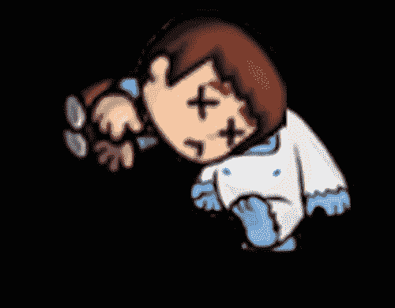

图 5-21

人物形象在与怪物碰撞时会发生变化

## 添加硬币

玩家的任务是收集分布在屏幕上的大量硬币。一旦收集到正确数量的硬币，游戏的当前级别就完成了，另一个级别开始了。因此，应用的下一步是在小部件树中添加表示硬币的图像小部件。让我们从添加一个代表一枚硬币的图片部件开始。

根据 Kivy 应用的生命周期，`build()`方法可用于准备小部件树。因此，这是向应用添加新部件的好方法。清单 [5-36](#PC40) 中所示的 Python 代码实现了`build()`方法来添加单个图像小部件。记住导入`kivy.uix.image`模块，以便访问`Image`类。

```py
import kivy.app
import kivy.animation
import kivy.uix.image
import random

class TestApp(kivy.app.App):
    character_killed = False

    def char_animation_completed(self, *args):
        character_image = self.root.ids['character_image']
        character_image.im_num = 0

    def monst_animation_completed(self, *args):
        monster_image = self.root.ids['monster_image']
        monster_image.im_num = 10

        new_pos = (random.uniform(0.0, 1 - monster_image.size_hint[0]), random.uniform(0.0, 1 - monster_image.size_hint[1]))
        self.start_monst_animation(new_pos= new_pos,anim_duration=random.uniform(1.5, 3.5))

    def touch_down_handler(self, args):
        if TestApp.character_killed == False:
            self.start_char_animation(args[1].spos)

    def change_char_im(self):
        character_image = self.root.ids['character_image']
        character_image.source = str(int(character_image.im_num)) + ".png"

    def change_monst_im(self):
        monster_image = self.root.ids['monster_image']
        monster_image.source = str(int(monster_image.im_num)) + ".png"

    def start_char_animation(self, touch_pos):
        character_image = self.root.ids['character_image']
        character_image.im_num = 0
        char_anim = kivy.animation.Animation(pos_hint={'x': touch_pos[0] - character_image.size_hint[0] / 2, 'y': touch_pos[1] - character_image.size_hint[1] / 2}, im_num=7)
        char_anim.bind(on_complete=self.char_animation_completed)
        char_anim.start(character_image)

    def start_monst_animation(self, new_pos, anim_duration):
        monster_image = self.root.ids['monster_image']
        monst_anim = kivy.animation.Animation(pos_hint={'x': new_pos[0], 'y': new_pos[1]}, im_num=17, duration=anim_duration)
        monst_anim.bind(on_complete=self.monst_animation_completed)
        monst_anim.start(monster_image)

    def build(self):
        coin = kivy.uix.image.Image(source="coin.png", size_hint=(0.05, 0.05), pos_hint={'x': 0.5, 'y': 0.5}, allow_stretch=True)
        self.root.add_widget(coin, index=-1)

    def on_start(self):
        monster_image = self.root.ids['monster_image']
        new_pos = (random.uniform(0.0, 1 - monster_image.size_hint[0]), random.uniform(0.0, 1 - monster_image.size_hint[1]))
        self.start_monst_animation(new_pos=new_pos, anim_duration=random.uniform(1.5, 3.5))

    def monst_pos_hint(self):
        character_image = self.root.ids['character_image']
        monster_image = self.root.ids['monster_image']

        character_center = character_image.center
        monster_center = monster_image.center

        gab_x = character_image.width / 2
        gab_y = character_image.height / 2
        if character_image.collide_widget(monster_image) and abs(character_center[0] - monster_center[0]) <= gab_x and abs(character_center[1] - monster_center[1]) <= gab_y:
            TestApp.character_killed = True

            kivy.animation.Animation.cancel_all(character_image)
            kivy.animation.Animation.cancel_all(monster_image)

            character_image.im_num = 91
            char_anim = kivy.animation.Animation(im_num=95)
            char_anim.start(character_image)

            print("Character Killed")

app = TestApp()
app.run()

Listing 5-36Adding an Image Widget to the Widget Tree Representing the Coin Before the Application Starts

```

新的小部件使用了`source`、`size_hint`、`pos_hint`和`allow_stretch`属性。硬币图像来源如图 [5-22](#Fig22) 所示。

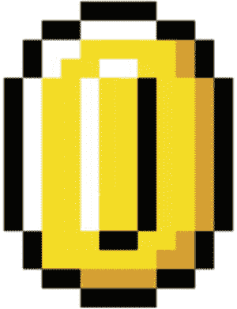

图 5-22

图像角点

新的小部件被返回到`coin`变量。之后，使用`add_widget()`方法将它添加到小部件树中。因为窗口小部件树中的最后一个窗口小部件出现在前面窗口小部件的顶部，所以`index`参数用于改变硬币的 Z 索引。微件的默认 Z 索引是 0。硬币 Z 指数设置为-1，出现在角色和怪物的后面。

运行应用后，我们会看到如图 [5-23](#Fig23) 所示的窗口。我们可以在窗户上放更多的硬币。

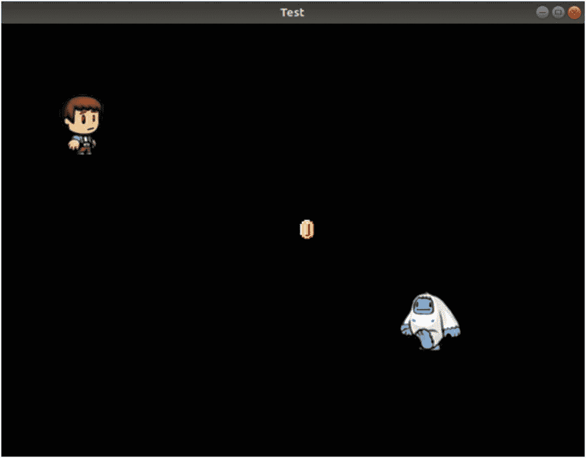

图 5-23

将硬币添加到角色和怪物图像小部件旁边

添加硬币的一种方法是固定它们在屏幕上的位置。在这个游戏中，位置是随机的。修改后的`build()`函数如清单 [5-37](#PC41) 所示，其中一个`for`循环向窗口小部件树添加了五个硬币图像窗口小部件。注意，在类头中定义了一个名为`num_coins`的变量，它保存硬币部件的数量。

`uniform()`函数用于返回每枚硬币的 x 和 y 坐标，并考虑硬币在屏幕上的显示位置。我们这样做是通过从返回的随机数中减去宽度和高度。怪物的随机位置也是这样产生的。

```py
import kivy.app
import kivy.animation
import kivy.uix.image
import random

class TestApp(kivy.app.App):
    character_killed = False
    num_coins = 5

    def char_animation_completed(self, *args):
        character_image = self.root.ids['character_image']
        character_image.im_num = 0

    def monst_animation_completed(self, *args):
        monster_image = self.root.ids['monster_image']
        monster_image.im_num = 10

        new_pos = (random.uniform(0.0, 1 - monster_image.size_hint[0]), random.uniform(0.0, 1 - monster_image.size_hint[1]))
        self.start_monst_animation(new_pos= new_pos,anim_duration=random.uniform(1.5, 3.5))

    def touch_down_handler(self, args):
        if TestApp.character_killed == False:
            self.start_char_animation(args[1].spos)

    def change_char_im(self):
        character_image = self.root.ids['character_image']
        character_image.source = str(int(character_image.im_num)) + ".png"

    def change_monst_im(self):
        monster_image = self.root.ids['monster_image']
        monster_image.source = str(int(monster_image.im_num)) + ".png"

    def start_char_animation(self, touch_pos):
        character_image = self.root.ids['character_image']
        character_image.im_num = 0
        char_anim = kivy.animation.Animation(pos_hint={'x': touch_pos[0] - character_image.size_hint[0] / 2, 'y': touch_pos[1] - character_image.size_hint[1] / 2}, im_num=7)
        char_anim.bind(on_complete=self.char_animation_completed)
        char_anim.start(character_image)

    def start_monst_animation(self, new_pos, anim_duration):
        monster_image = self.root.ids['monster_image']
        monst_anim = kivy.animation.Animation(pos_hint={'x': new_pos[0], 'y': new_pos[1]}, im_num=17, duration=anim_duration)
        monst_anim.bind(on_complete=self.monst_animation_completed)
        monst_anim.start(monster_image)

    def build(self):
        coin_width = 0.05

        coin_height = 0.05

        for k in range(TestApp.num_coins):
            x = random.uniform(0, 1 - coin_width)
            y = random.uniform(0, 1 - coin_height)
            coin = kivy.uix.image.Image(source="coin.png", size_hint=(coin_width, coin_height), pos_hint={'x': x, 'y': y},allow_stretch=True)
            self.root.add_widget(coin, index=-1)

    def on_start(self):
        monster_image = self.root.ids['monster_image']
        new_pos = (random.uniform(0.0, 1 - monster_image.size_hint[0]), random.uniform(0.0, 1 - monster_image.size_hint[1]))
        self.start_monst_animation(new_pos=new_pos, anim_duration=random.uniform(1.5, 3.5))

    def monst_pos_hint(self):
        character_image = self.root.ids['character_image']
        monster_image = self.root.ids['monster_image']

        character_center = character_image.center
        monster_center = monster_image.center

        gab_x = character_image.width / 2
        gab_y = character_image.height / 2
        if character_image.collide_widget(monster_image) and abs(character_center[0] - monster_center[0]) <= gab_x and abs(character_center[1] - monster_center[1]) <= gab_y:
            TestApp.character_killed = True

            kivy.animation.Animation.cancel_all(character_image)
            kivy.animation.Animation.cancel_all(monster_image)

            character_image.im_num = 91
            char_anim = kivy.animation.Animation(im_num=95)
            char_anim.start(character_image)

app = TestApp()
app.run()

Listing 5-37Adding Multiple Image Widgets Representing the Coins on the Screen

```

因为硬币的定位是随机的，所以在使用修改后的`build()`函数运行应用后，有可能大部分甚至全部硬币都在一个小区域内，如图 [5-24](#Fig24) 所示。我们需要保证每个硬币与下一个硬币之间的距离最小。该距离可以是水平的或垂直的。

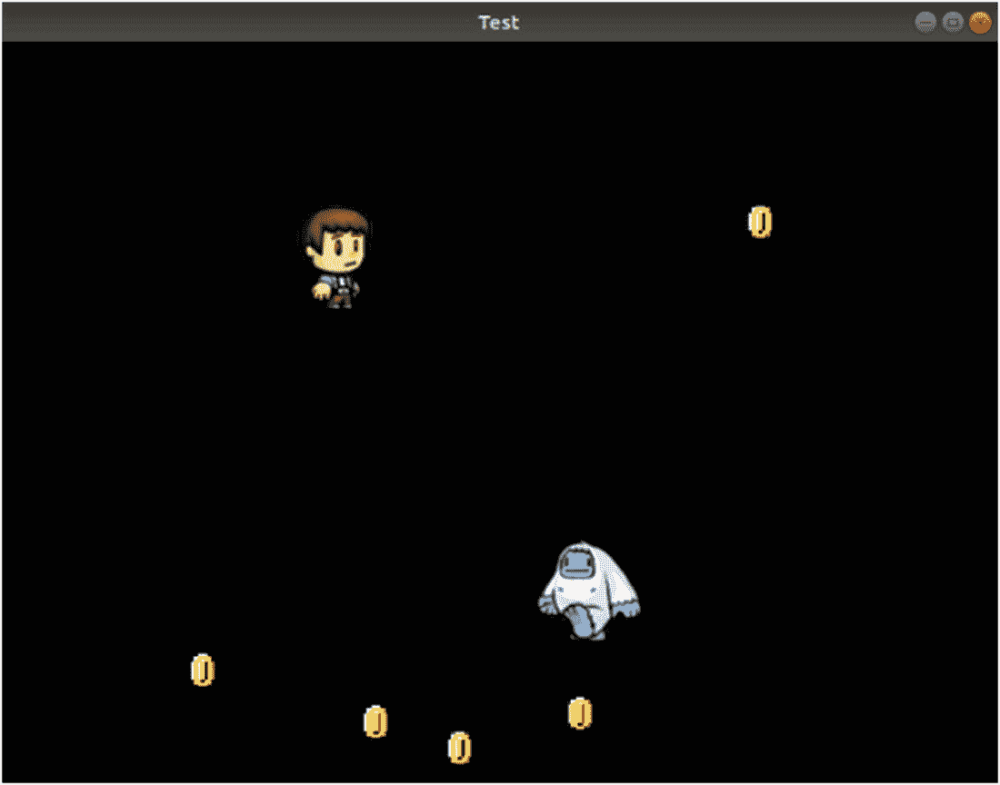

图 5-24

硬币可能彼此非常接近

放置硬币的方法是将屏幕分成与要添加的硬币数量相等的多个垂直部分。如图 [5-25](#Fig25) 所示。一枚硬币随机放在一个区域的任意位置。

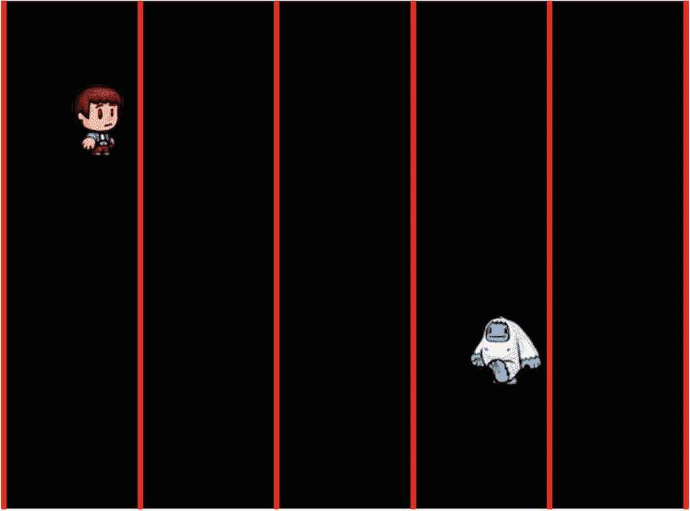

图 5-25

平分屏幕宽度以放置硬币

修改后的`build()`功能如清单 [5-38](#PC42) 所示。因为屏幕是垂直分割的，每个部分将覆盖窗口的整个高度，但其宽度受到所用硬币数量的限制。因此，截面宽度在`section_width`变量中计算。

```py
import kivy.app
import kivy.animation
import kivy.uix.image
import random

class TestApp(kivy.app.App):
    character_killed = False
    num_coins = 5
    coins_ids = {}

    def char_animation_completed(self, *args):
        character_image = self.root.ids['character_image']
        character_image.im_num = 0

    def monst_animation_completed(self, *args):
        monster_image = self.root.ids['monster_image']
        monster_image.im_num = 10

        new_pos = (random.uniform(0.0, 1 - monster_image.size_hint[0]), random.uniform(0.0, 1 - monster_image.size_hint[1]))
        self.start_monst_animation(new_pos= new_pos,anim_duration=random.uniform(1.5, 3.5))

    def touch_down_handler(self, args):
        if TestApp.character_killed == False:
            self.start_char_animation(args[1].spos)

    def change_char_im(self):
        character_image = self.root.ids['character_image']
        character_image.source = str(int(character_image.im_num)) + ".png"

    def change_monst_im(self):
        monster_image = self.root.ids['monster_image']
        monster_image.source = str(int(monster_image.im_num)) + ".png"

    def start_char_animation(self, touch_pos):
        character_image = self.root.ids['character_image']
        character_image.im_num = 0

        char_anim = kivy.animation.Animation(pos_hint={'x': touch_pos[0] - character_image.size_hint[0] / 2, 'y': touch_pos[1] - character_image.size_hint[1] / 2}, im_num=7)
        char_anim.bind(on_complete=self.char_animation_completed)
        char_anim.start(character_image)

    def start_monst_animation(self, new_pos, anim_duration):
        monster_image = self.root.ids['monster_image']
        monst_anim = kivy.animation.Animation(pos_hint={'x': new_pos[0], 'y': new_pos[1]}, im_num=17, duration=anim_duration)
        monst_anim.bind(on_complete=self.monst_animation_completed)
        monst_anim.start(monster_image)

    def build(self):
        coin_width = 0.05
        coin_height = 0.05

        section_width = 1.0/TestApp.num_coins
        for k in range(TestApp.num_coins):
            x = random.uniform(section_width*k, section_width*(k+1)-coin_width)
            y = random.uniform(0, 1-coin_height)
            coin = kivy.uix.image.Image(source="coin.png", size_hint=(coin_width, coin_height), pos_hint={'x': x, 'y': y}, allow_stretch=True, id="coin"+str(k))
            self.root.add_widget(coin, index=-1)
            TestApp.coins_ids['coin'+str(k)] = coin

    def on_start(self):
        monster_image = self.root.ids['monster_image']
        new_pos = (random.uniform(0.0, 1 - monster_image.size_hint[0]), random.uniform(0.0, 1 - monster_image.size_hint[1]))
        self.start_monst_animation(new_pos=new_pos, anim_duration=random.uniform(1.5, 3.5))

    def monst_pos_hint(self):
        character_image = self.root.ids['character_image']
        monster_image = self.root.ids['monster_image']

        character_center = character_image.center
        monster_center = monster_image.center

        gab_x = character_image.width / 2
        gab_y = character_image.height / 2
        if character_image.collide_widget(monster_image) and abs(character_center[0] - monster_center[0]) <= gab_x and abs(character_center[1] - monster_center[1]) <= gab_y:
            TestApp.character_killed = True

            kivy.animation.Animation.cancel_all(character_image)
            kivy.animation.Animation.cancel_all(monster_image)

            character_image.im_num = 91

            char_anim = kivy.animation.Animation(im_num=95)
            char_anim.start(character_image)

app = TestApp()
app.run()

Listing 5-38Splitting the Screen Width Uniformly to Add Multiple Image Widgets Representing the Coins

```

每枚硬币都可以放在该区域的边界内。因为对截面高度没有限制，硬币 y 坐标的计算如前所示。为了将硬币放置在该部分指定的宽度内，选择 x 坐标的范围被限制在它的开始和结束列。起始值由`section_width*k`定义，而结束值由`section_width*(k+1)-coin_width`定义。请注意，`coin_width`被减去，以确保硬币在截面边界内。

对于第一枚硬币，循环变量 k 值为 0，因此起始值为 0.0，但结束值为`section_width-coin_width`。给定`section_width`等于 0.2，`coin_width`等于 0.05，第一段的范围为 **0.0:0.15** 。对于第二枚硬币，k 将是 1，因此起始值是`section_width`，而结束值是`section_width*2-coin_width`。因此，第二段的范围是 **0.2:0.35** 。同样，其余部分的范围为 **0.4:0.55** 、 **0.6:0.75** 和 **0.8:0.95** 。

我们曾经使用根部件的`ids`字典来引用 Python 文件中的子部件。不幸的是，`ids`字典不包含对 Python 文件中动态添加的小部件的引用。为了以后能够引用这些小部件，它们的引用保存在类头中定义的`coins_ids`字典中。在字典中，每枚硬币都有一个字符串键，由从 0 开始的硬币编号后的单词`coin`组成。因此，这些键是`coin0`、`coin1`、`coin2`、`coin3`和`coin4`。

图 [5-26](#Fig26) 显示了运行应用后的结果。硬币分布得更好。放置硬币后，下一步是允许玩家收集它们。

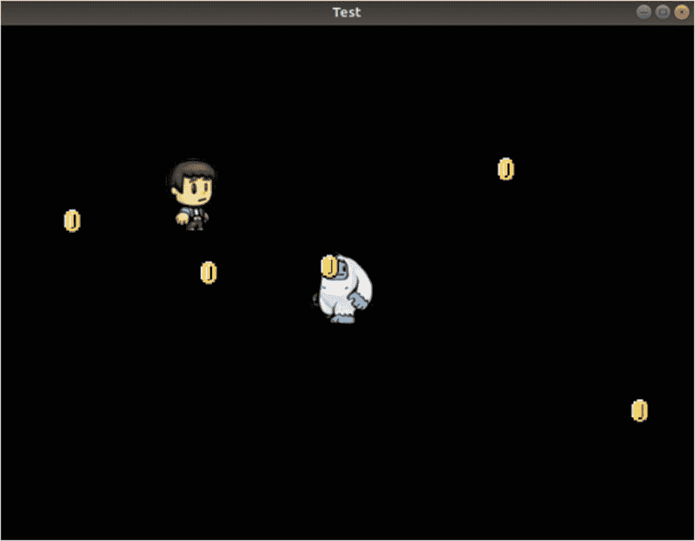

图 5-26

将硬币均匀地分布在屏幕上

根据以下输出打印硬币位置:

```py
{'coin0': <kivy.uix.image.Image object at 0x7f0c56ff4388>, 'coin1': <kivy.uix.image.Image object at 0x7f0c56ff44c0>, 'coin2': <kivy.uix.image.Image object at 0x7f0c56ff4590>, 'coin3': <kivy.uix.image.Image object at 0x7f0c56ff4660>, 'coin4': <kivy.uix.image.Image object at 0x7f0c56ff4730>}

```

### 收集硬币

为了收集硬币，我们需要检测角色和所有尚未收集的硬币之间的碰撞。为了在每次改变时访问字符位置，`on_pos_hint`事件被绑定到 KV 文件中的字符图像小部件。因此，修改后的 KV 文件列在清单 [5-39](#PC44) 中。事件被赋予回调函数`char_pos_hint()`。

```py
FloatLayout:
    on_touch_down: app.touch_down_handler(args)

    Image:
        id: monster_image
        size_hint: (0.15, 0.15)
        pos_hint: {'x': 0.8, 'y': 0.8}
        source: "10.png"
        im_num: 10
        allow_stretch: True
        on_im_num: app.change_monst_im()
        on_pos_hint: app.monst_pos_hint()

    Image:
        id: character_image
        size_hint: (0.15, 0.15)
        pos_hint: {'x': 0.2, 'y': 0.6}
        source: "0.png"
        im_num: 0
        allow_stretch: True
        on_im_num: app.change_char_im()
        on_pos_hint: app.char_pos_hint()

Listing 5-39Adding the on_pos_hint Event to Return the Character Position

```

根据清单 [5-40](#PC45) 中列出的 Python 文件中该函数的实现，它遍历字典中的条目(即硬币)并返回循环头中定义的`coin_key`和`curr_coin`变量中每个条目(即硬币)的键值。检测碰撞的方式与检测角色和怪物之间的碰撞的方式相同。

如果两个小部件的边界有交集，即使是在一行或一列中,`collide_widget()`也会返回`True`。为了对其进行调优，需要比较两个小部件的中心。如果中心之间的差异超过预定阈值，则表明发生了碰撞。

一旦角色和硬币发生碰撞，通过调用`remove_widget()`方法，硬币`Image`小部件将从小部件树中移除。这确保了小部件在被收集后变得隐藏。角色与硬币碰撞的检测类似于用怪物计算，除了在处理硬币时减少`gab_x`和`gab_y`变量，因为它们的尺寸小于怪物的尺寸。

```py
import kivy.app
import kivy.animation
import kivy.uix.image
import random

class TestApp(kivy.app.App):
    character_killed = False
    num_coins = 5
    coins_ids = {}

    def char_animation_completed(self, *args):
        character_image = self.root.ids['character_image']
        character_image.im_num = 0

    def monst_animation_completed(self, *args):
        monster_image = self.root.ids['monster_image']
        monster_image.im_num = 10

        new_pos = (random.uniform(0.0, 1 - monster_image.size_hint[0]), random.uniform(0.0, 1 - monster_image.size_hint[1]))
        self.start_monst_animation(new_pos= new_pos, anim_duration=random.uniform(1.5, 3.5))

    def touch_down_handler(self, args):
        if TestApp.character_killed == False:
            self.start_char_animation(args[1].spos)

    def change_char_im(self):
        character_image = self.root.ids['character_image']
        character_image.source = str(int(character_image.im_num)) + ".png"

    def change_monst_im(self):
        monster_image = self.root.ids['monster_image']
        monster_image.source = str(int(monster_image.im_num)) + ".png"

    def start_char_animation(self, touch_pos):
        character_image = self.root.ids['character_image']
        character_image.im_num = 0
        char_anim = kivy.animation.Animation(pos_hint={'x': touch_pos[0] - character_image.size_hint[0] / 2, 'y': touch_pos[1] - character_image.size_hint[1] / 2}, im_num=7)
        char_anim.bind(on_complete=self.char_animation_completed)
        char_anim.start(character_image)

    def start_monst_animation(self, new_pos, anim_duration):
        monster_image = self.root.ids['monster_image']
        monst_anim = kivy.animation.Animation(pos_hint={'x': new_pos[0], 'y': new_pos[1]}, im_num=17, duration=anim_duration)
        monst_anim.bind(on_complete=self.monst_animation_completed)
        monst_anim.start(monster_image)

    def build(self):
        coin_width = 0.05
        coin_height = 0.05

        section_width = 1.0/TestApp.num_coins
        for k in range(TestApp.num_coins):
            x = random.uniform(section_width*k, section_width*(k+1)-coin_width)
            y = random.uniform(0, 1-coin_height)
            coin = kivy.uix.image.Image(source="coin.png", size_hint=(coin_width, coin_height), pos_hint={'x': x, 'y': y}, allow_stretch=True)
            self.root.add_widget(coin, index=-1)
            TestApp.coins_ids['coin'+str(k)] = coin

    def on_start(self):
        monster_image = self.root.ids['monster_image']
        new_pos = (random.uniform(0.0, 1 - monster_image.size_hint[0]), random.uniform(0.0, 1 - monster_image.size_hint[1]))
        self.start_monst_animation(new_pos=new_pos, anim_duration=random.uniform(1.5, 3.5))

    def monst_pos_hint(self):
        character_image = self.root.ids['character_image']
        monster_image = self.root.ids['monster_image']

        character_center = character_image.center
        monster_center = monster_image.center

        gab_x = character_image.width / 2
        gab_y = character_image.height / 2
        if character_image.collide_widget(monster_image) and abs(character_center[0] - monster_center[0]) <= gab_x and abs(character_center[1] - monster_center[1]) <= gab_y:
            TestApp.character_killed = True

            kivy.animation.Animation.cancel_all(character_image)
            kivy.animation.Animation.cancel_all(monster_image)

            character_image.im_num = 91
            char_anim = kivy.animation.Animation(im_num=95)
            char_anim.start(character_image)

    def char_pos_hint(self):
        character_image = self.root.ids['character_image']
        character_center = character_image.center

        gab_x = character_image.width / 3
        gab_y = character_image.height / 3

        for coin_key, curr_coin in TestApp.coins_ids.items():
            curr_coin_center = curr_coin.center
            if character_image.collide_widget(curr_coin) and abs(character_center[0] - curr_coin_center[0]) <= gab_x and abs(character_center[1] - curr_coin_center[1]) <= gab_y:
                print("Coin Collected", coin_key)
                self.root.remove_widget(curr_coin)

app = TestApp()
app.run()

Listing 5-40Handling the char_pos_hint() Function to Detect Collision with the Coins

```

以前的应用存在问题。即使在硬币从部件树中删除后，字典中仍然有一个条目。因此，即使收集了所有项目，循环也要经历五次迭代，并且表现得好像没有硬币没有被收集一样。

为了确保从字典中检测到小部件，我们可以跟踪在一个名为`coins_to_delete`的空列表中收集的硬币，该列表在`char_pos_hint()`函数中定义，如清单 [5-41](#PC46) 所示。对于收集到的每枚硬币，使用`append()`函数将其在`coins_ids`字典中的关键字添加到列表中。

```py
def char_pos_hint(self):
    character_image = self.root.ids['character_image']
    character_center = character_image.center

    gab_x = character_image.width / 3
    gab_y = character_image.height / 3
    coins_to_delete = []

    for coin_key, curr_coin in TestApp.coins_ids.items():
        curr_coin_center = curr_coin.center
        if character_image.collide_widget(curr_coin) and abs(character_center[0] - curr_coin_center[0]) <= gab_x and abs(character_center[1] - curr_coin_center[1]) <= gab_y:
            print("Coin Collected", coin_key)
            coins_to_delete.append(coin_key)
            self.root.remove_widget(curr_coin)

    if len(coins_to_delete) > 0:
        for coin_key in coins_to_delete:
            del TestApp.coins_ids[coin_key]

Listing 5-41Removing the Coins Once They Are Collected

```

循环结束后，`if`语句根据列表的长度确定列表是否为空。如果其长度小于 1，则在前一个循环中没有收集到硬币，因此没有要从字典中删除的项目(即硬币)。如果列表的长度大于或等于 1(即大于 0)，这意味着有一些来自前一循环的硬币。

为了从字典中删除硬币，一个`for`循环遍历列表中的元素。注意列表元素代表每枚硬币的钥匙，比如`coin0`。因此，存储在列表中的关键字将被用作字典的索引，以返回相关的硬币图像小部件。使用 Python 中的`del`命令，可以从字典中删除该条目。通过这样做，我们已经从部件树和字典中完全删除了硬币。收集完所有硬币后，字典中的条目数将为零，循环将无用。

## 完整级别

在之前的申请中，没有关于收集的硬币数量的指示。根据清单 [5-42](#PC47) 所示的修改后的 KV 文件，在屏幕的左上角增加了一个小的`Label`控件来显示收集到的硬币数量。标签被赋予一个 ID`num_coins_collected`,以便在 Python 代码中更改它的文本。

```py
FloatLayout:
    on_touch_down: app.touch_down_handler(args)

    Label:
        id: num_coins_collected
        size_hint: (0.1, 0.02)
        pos_hint: {'x': 0.0, 'y': 0.97}
        text: "Coins 0"
        font_size: 20

    Image:
        id: monster_image
        size_hint: (0.15, 0.15)
        pos_hint: {'x': 0.8, 'y': 0.8}
        source: "10.png"
        im_num: 10
        allow_stretch: True
        on_im_num: app.change_monst_im()
        on_pos_hint: app.monst_pos_hint()

    Image:
        id: character_image
        size_hint: (0.15, 0.15)
        pos_hint: {'x': 0.2, 'y': 0.6}
        source: "0.png"
        im_num: 0
        allow_stretch: True
        on_im_num: app.change_char_im()
        on_pos_hint: app.char_pos_hint()

Listing 5-42Displaying the Number of Collected Coins in a Label Widget Placed at the Top of the Screen

```

Python 文件内部的`char_pos_hint()`函数修改为根据当前收集的硬币数量更新添加的标签文本字段。文件如清单 [5-43](#PC48) 所示。首先，在类中定义一个名为`num_coins_collected`的变量，并赋予其初始值 0。如果角色和任何硬币之间发生冲突，那么该变量增加 1，然后`Label`小部件更新。

因为完成收集所有硬币的任务就意味着当前关卡的结束，不如做点什么来表示关卡的结束。如果`num_coins_collected`变量中收集的硬币数量等于`num_coins`变量中的硬币数量，一个标签将被动态添加到小部件树中，并显示`"Level Completed"`消息。除了创建这个小部件，角色和怪物动画被取消。注意，通过取消怪物动画，它的位置不会改变，因此`monst_pos_hint()`回调函数不会被执行。

```py
import kivy.app
import kivy.animation
import kivy.uix.image
import kivy.uix.label
import random

class TestApp(kivy.app.App):
    character_killed = False
    num_coins = 5
    num_coins_collected = 0
    coins_ids = {}

    def char_animation_completed(self, *args):
        character_image = self.root.ids['character_image']
        character_image.im_num = 0

    def monst_animation_completed(self, *args):
        monster_image = self.root.ids['monster_image']
        monster_image.im_num = 10

        new_pos = (random.uniform(0.0, 1 - monster_image.size_hint[0]), random.uniform(0.0, 1 - monster_image.size_hint[1]))
        self.start_monst_animation(new_pos= new_pos,anim_duration=random.uniform(1.5, 3.5))

    def touch_down_handler(self, args):
        if TestApp.character_killed == False:
            self.start_char_animation(args[1].spos)

    def change_char_im(self):
        character_image = self.root.ids['character_image']
        character_image.source = str(int(character_image.im_num)) + ".png"

    def change_monst_im(self):
        monster_image = self.root.ids['monster_image']
        monster_image.source = str(int(monster_image.im_num)) + ".png"

    def start_char_animation(self, touch_pos):
        character_image = self.root.ids['character_image']
        character_image.im_num = 0

        char_anim = kivy.animation.Animation(pos_hint={'x': touch_pos[0] - character_image.size_hint[0] / 2, ‘y’: touch_pos[1] - character_image.size_hint[1] / 2}, im_num=7)
        char_anim.bind(on_complete=self.char_animation_completed)
        char_anim.start(character_image)

    def start_monst_animation(self, new_pos, anim_duration):
        monster_image = self.root.ids['monster_image']
        monst_anim = kivy.animation.Animation(pos_hint={'x': new_pos[0], 'y': new_pos[1]}, im_num=17, duration=anim_duration)
        monst_anim.bind(on_complete=self.monst_animation_completed)
        monst_anim.start(monster_image)

    def build(self):
        coin_width = 0.05
        coin_height = 0.05

        section_width = 1.0/TestApp.num_coins
        for k in range(TestApp.num_coins):
            x = random.uniform(section_width*k, section_width*(k+1)-coin_width)
            y = random.uniform(0, 1-coin_height)
            coin = kivy.uix.image.Image(source="coin.png", size_hint=(coin_width, coin_height), pos_hint={'x': x, 'y': y}, allow_stretch=True)
            self.root.add_widget(coin, index=-1)
            TestApp.coins_ids['coin'+str(k)] = coin

    def on_start(self):
        monster_image = self.root.ids['monster_image']
        new_pos = (random.uniform(0.0, 1 - monster_image.size_hint[0]), random.uniform(0.0, 1 - monster_image.size_hint[1]))
        self.start_monst_animation(new_pos=new_pos, anim_duration=random.uniform(1.5, 3.5))

    def monst_pos_hint(self):
        character_image = self.root.ids['character_image']
        monster_image = self.root.ids['monster_image']

        character_center = character_image.center
        monster_center = monster_image.center

        gab_x = character_image.width / 2
        gab_y = character_image.height / 2

        if character_image.collide_widget(monster_image) and abs(character_center[0] - monster_center[0]) <= gab_x and abs(character_center[1] - monster_center[1]) <= gab_y:
            TestApp.character_killed = True

            kivy.animation.Animation.cancel_all(character_image)
            kivy.animation.Animation.cancel_all(monster_image)

            character_image.im_num = 91
            char_anim = kivy.animation.Animation(im_num=95)
            char_anim.start(character_image)

    def char_pos_hint(self):
        character_image = self.root.ids['character_image']
        character_center = character_image.center

        gab_x = character_image.width / 3
        gab_y = character_image.height / 3
        coins_to_delete = []

        for coin_key, curr_coin in TestApp.coins_ids.items():
            curr_coin_center = curr_coin.center
            if character_image.collide_widget(curr_coin) and abs(character_center[0] - curr_coin_center[0]) <= gab_x and abs(character_center[1] - curr_coin_center[1]) <= gab_y:
                coins_to_delete.append(coin_key)
                self.root.remove_widget(curr_coin)
                TestApp.num_coins_collected = TestApp.num_coins_collected + 1

                self.root.ids['num_coins_collected'].text = "Coins "+str(TestApp.num_coins_collected)
                if TestApp.num_coins_collected == TestApp.num_coins:
                    kivy.animation.Animation.cancel_all(character_image)
                    kivy.animation.Animation.cancel_all(self.root.ids['monster_image'])
                    self.root.add_widget(kivy.uix.label.Label(pos_hint={'x': 0.1, 'y': 0.1}, size_hint=(0.8, 0.8), font_size=90, text="Level Completed"))

        if len(coins_to_delete) > 0:
            for coin_key in coins_to_delete:
                del TestApp.coins_ids[coin_key]

app = TestApp()
app.run()

Listing 5-43Updating the Label Displaying the Number of Collected Coins and Displaying a Message When the Level Completes

```

图 [5-27](#Fig27) 显示关卡完成后的结果。

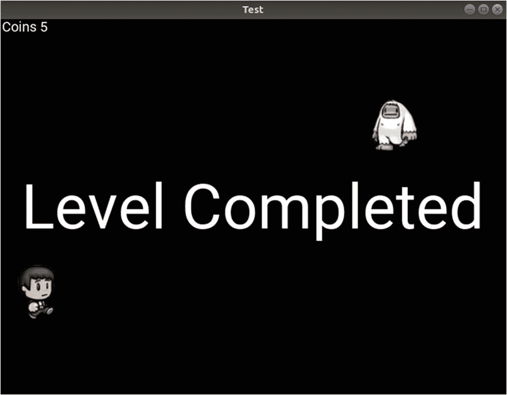

图 5-27

当关卡完成时，会显示一条消息

## 音效

一个没有音效的游戏不是一个很好的游戏。声音是用户体验的一个重要因素。你可以给游戏中发生的每一个动作添加音效。对于我们的游戏，我们会在角色死亡时、完成一关时以及收集硬币时添加音效。这是对背景音乐的补充，有助于玩家参与游戏。

Kivy 提供了一个非常简单的接口，使用`kivy.core.audio`模块中的`SoundLoader`类来播放声音。清单 [5-44](#PC49) 中显示了修改后的 Python 文件，声音在该文件中被加载和播放。

```py
import kivy.app
import kivy.animation
import kivy.uix.image
import kivy.uix.label
import random
import kivy.core.audio
import os

class TestApp(kivy.app.App):
    character_killed = False
    num_coins = 5
    num_coins_collected = 0
    coins_ids = {}

    def char_animation_completed(self, *args):
        character_image = self.root.ids['character_image']
        character_image.im_num = 0

    def monst_animation_completed(self, *args):
        monster_image = self.root.ids['monster_image']
        monster_image.im_num = 10

        new_pos = (random.uniform(0.0, 1 - monster_image.size_hint[0]), random.uniform(0.0, 1 - monster_image.size_hint[1]))
        self.start_monst_animation(new_pos= new_pos,anim_duration=random.uniform(1.5, 3.5))

    def touch_down_handler(self, args):
        if TestApp.character_killed == False:
            self.start_char_animation(args[1].spos)

    def change_char_im(self):
        character_image = self.root.ids['character_image']
        character_image.source = str(int(character_image.im_num)) + ".png"

    def change_monst_im(self):
        monster_image = self.root.ids['monster_image']
        monster_image.source = str(int(monster_image.im_num)) + ".png"

    def start_char_animation(self, touch_pos):
        character_image = self.root.ids['character_image']
        character_image.im_num = 0
        char_anim = kivy.animation.Animation(pos_hint={'x': touch_pos[0] - character_image.size_hint[0] / 2,'y': touch_pos[1] - character_image.size_hint[1] / 2}, im_num=7)
        char_anim.bind(on_complete=self.char_animation_completed)
        char_anim.start(character_image)

    def start_monst_animation(self, new_pos, anim_duration):
        monster_image = self.root.ids['monster_image']
        monst_anim = kivy.animation.Animation(pos_hint={'x': new_pos[0], 'y': new_pos[1]}, im_num=17,duration=anim_duration)
        monst_anim.bind(on_complete=self.monst_animation_completed)
        monst_anim.start(monster_image)

    def build(self):
        coin_width = 0.05
        coin_height = 0.05

        section_width = 1.0/TestApp.num_coins
        for k in range(TestApp.num_coins):
            x = random.uniform(section_width*k, section_width*(k+1)-coin_width)
            y = random.uniform(0, 1-coin_height)
            coin = kivy.uix.image.Image(source="coin.png", size_hint=(coin_width, coin_height), pos_hint={'x': x, 'y': y}, allow_stretch=True)
            self.root.add_widget(coin, index=-1)
            TestApp.coins_ids['coin'+str(k)] = coin

    def on_start(self):
        music_dir = os.getcwd()+"/music/"
        self.bg_music = kivy.core.audio.SoundLoader.load(music_dir+"bg_music_piano.wav")
        self.bg_music.loop = True

        self.coin_sound = kivy.core.audio.SoundLoader.load(music_dir+"coin.wav")
        self.level_completed_sound = kivy.core.audio.SoundLoader.load(music_dir+"level_completed_flaute.wav")
        self.char_death_sound = kivy.core.audio.SoundLoader.load(music_dir+"char_death_flaute.wav")

        self.bg_music.play()

        monster_image = self.root.ids['monster_image']
        new_pos = (random.uniform(0.0, 1 - monster_image.size_hint[0]), random.uniform(0.0, 1 - monster_image.size_hint[1]))
        self.start_monst_animation(new_pos=new_pos, anim_duration=random.uniform(1.5, 3.5))

    def monst_pos_hint(self):
        character_image = self.root.ids['character_image']
        monster_image = self.root.ids['monster_image']

        character_center = character_image.center

        monster_center = monster_image.center

        gab_x = character_image.width / 2
        gab_y = character_image.height / 2
        if character_image.collide_widget(monster_image) and abs(character_center[0] - monster_center[0]) <= gab_x and abs(character_center[1] - monster_center[1]) <= gab_y:
            self.bg_music.stop()
            self.char_death_sound.play()
            TestApp.character_killed = True

            kivy.animation.Animation.cancel_all(character_image)
            kivy.animation.Animation.cancel_all(monster_image)

            character_image.im_num = 91
            char_anim = kivy.animation.Animation(im_num=95)
            char_anim.start(character_image)

    def char_pos_hint(self):
        character_image = self.root.ids['character_image']
        character_center = character_image.center

        gab_x = character_image.width / 3
        gab_y = character_image.height / 3
        coins_to_delete = []

        for coin_key, curr_coin in TestApp.coins_ids.items():
            curr_coin_center = curr_coin.center
            if character_image.collide_widget(curr_coin) and abs(character_center[0] - curr_coin_center[0]) <= gab_x and abs(character_center[1] - curr_coin_center[1]) <= gab_y:
                self.coin_sound.play()
                coins_to_delete.append(coin_key)
                self.root.remove_widget(curr_coin)
                TestApp.num_coins_collected = TestApp.num_coins_collected + 1
                self.root.ids['num_coins_collected'].text = "Coins "+str(TestApp.num_coins_collected)
                if TestApp.num_coins_collected == TestApp.num_coins:
                    self.bg_music.stop()
                    self.level_completed_sound.play()
                    kivy.animation.Animation.cancel_all(character_image)
                    kivy.animation.Animation.cancel_all(self.root.ids['monster_image'])
                    self.root.add_widget(kivy.uix.label.Label(pos_hint={'x': 0.1, 'y': 0.1}, size_hint=(0.8, 0.8), font_size=90, text="Level Completed"))

        if len(coins_to_delete) > 0:
            for coin_key in coins_to_delete:
                del TestApp.coins_ids[coin_key]

app = TestApp()
app.run()

Listing 5-44Adding Sound Effects to the Game

```

播放声音文件有两个步骤。我们必须首先使用`SoundLoader`类的`load()`方法加载声音文件。这个方法接受在`music_dir`变量中指定的声音文件路径。该变量使用`os`模块通过`os.getcwd()`函数返回当前目录。假设声音文件存储在当前目录下名为`music`的文件夹中，文件的完整路径是`os.getcwd()`和名为`music`的文件之间的连接。

所有声音文件都是在应用的`TestApp`类的`on_start()`方法中准备的。背景声音文件被加载到`bg_music`变量中。收集硬币、角色死亡和关卡完成的声音文件分别存储在变量`coin_sound`、`char_death_sound`和`level_completed_sound`中。注意，这些变量中的每一个都与引用当前对象的`self`相关联。这有助于在`on_start()`方法之外控制声音文件。当引用该方法之外的声音文件时，记得使用`self`。

第二步是使用`play()`方法播放文件。对于背景音乐，在`on_start()`方法内播放。在`char_pos_hint()`回调函数中与硬币发生碰撞后，会发出硬币声音。

收集完所有硬币后会播放关卡完成声音。因为关卡已经完成，不再需要背景音乐，因此通过调用`stop()`方法来停止。

最后与怪物发生碰撞后在`monst_pos_hint()`回调函数内部播放角色死亡音。加入音效后玩游戏比以前更有趣。

## 游戏背景

我们可以改变游戏的背景，使之更吸引人，而不是默认的黑色背景。您可以使用纹理、动画图像或静态图像作为背景。

根据清单 [5-45](#PC50) 中所示的 KV 文件，游戏背景采用静态图像。使用`canvas.before`在`FloatLayout`内绘制。这保证了图像将覆盖整个窗口。

```py
FloatLayout:
    on_touch_down: app.touch_down_handler(args)
    canvas.before:
        Rectangle:
            size: self.size
            pos: self.pos
            source: 'bg.jpg'

    Label:
        id: num_coins_collected
        size_hint: (0.1, 0.02)
        pos_hint: {'x': 0.0, 'y': 0.97}
        text: "Coins 0"
        font_size: 20

    Image:
        id: monster_image
        size_hint: (0.15, 0.15)
        pos_hint: {'x': 0.8, 'y': 0.8}
        source: "10.png"
        im_num: 10
        allow_stretch: True
        on_im_num: app.change_monst_im()
        on_pos_hint: app.monst_pos_hint()

    Image:
        id: character_image
        size_hint: (0.15, 0.15)
        pos_hint: {'x': 0.2, 'y': 0.6}
        source: "0.png"
        im_num: 0
        allow_stretch: True
        on_im_num: app.change_char_im()
        on_pos_hint: app.char_pos_hint()

Listing 5-45Adding a Background Image to the Game

```

图 [5-28](#Fig28) 添加背景后的游戏。


图 5-28

向屏幕添加背景图像

## 游戏开发概述

这个游戏目前只有一个关卡，我们需要增加更多的关卡。在添加更多的关卡之前，对游戏开发到目前为止的进展有一个总体的了解是很重要的。

图 [5-29](#Fig29) 显示了游戏执行的流程。因为我们的 Kivy 应用实现了`build()`和`on_start()`方法，根据 Kivy 应用的生命周期，它们将在我们的任何自定义函数之前执行。这从`build()`功能开始，直到游戏结束，因为角色被杀死或者所有的硬币被收集，关卡完成。每个功能都按执行顺序列出，直到游戏结束，其任务列在右边。


图 5-29

游戏执行的流程

图 [5-30](#Fig30) 列出了处理服务于角色和怪物动画的事件的回调函数。它还列出了前一个应用中使用的五个类变量。

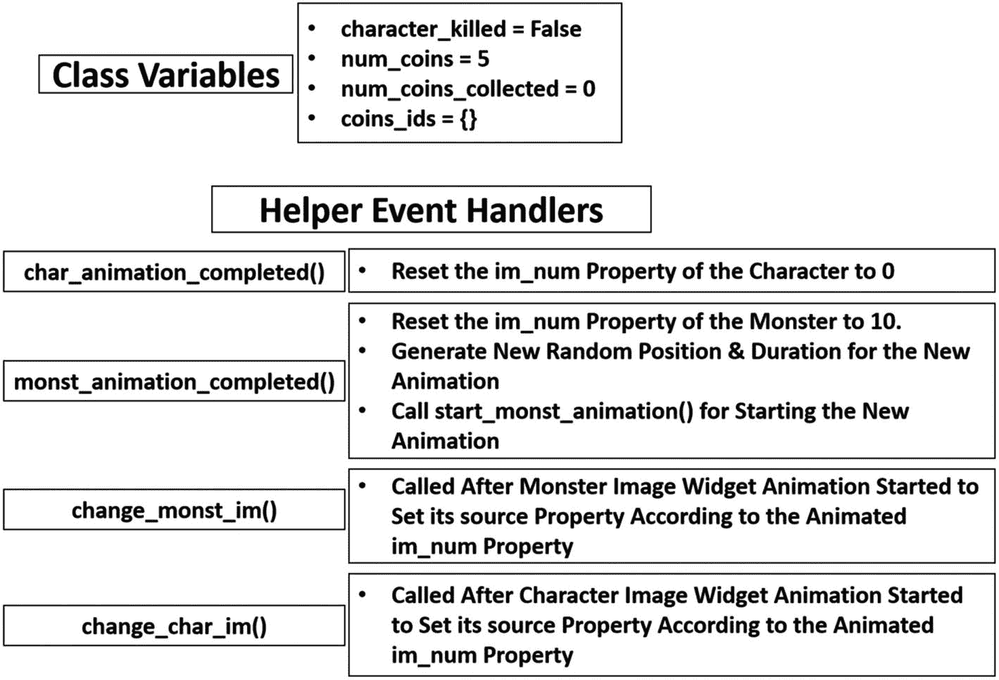

图 5-30

处理角色和怪物动画的类变量和回调函数的概要

从图 [5-30](#Fig30) 中，你可以看到怪物的运行需要下面列出的四个函数。请注意，该角色使用的函数与这些函数类似，但名称有所不同。

*   `start_monst_animation()`

*   `change_monst_im()`

*   `monst_pos_hint()`

*   `monst_animation_completed()`

## 摘要

该游戏现在有一个角色，使用动画，根据触摸位置移动。一个怪物随机移动，也使用动画。角色在与怪物相撞时被杀死。当它被杀死时，会启动一个一次性动画，改变角色的图像以反映死亡。一些硬币均匀地分布在屏幕上，玩家的任务是收集所有的硬币。屏幕上方的标签显示收集的硬币数量。当角色和硬币发生碰撞时，硬币消失，标签更新。当所有的硬币被收集，水平是完整的。