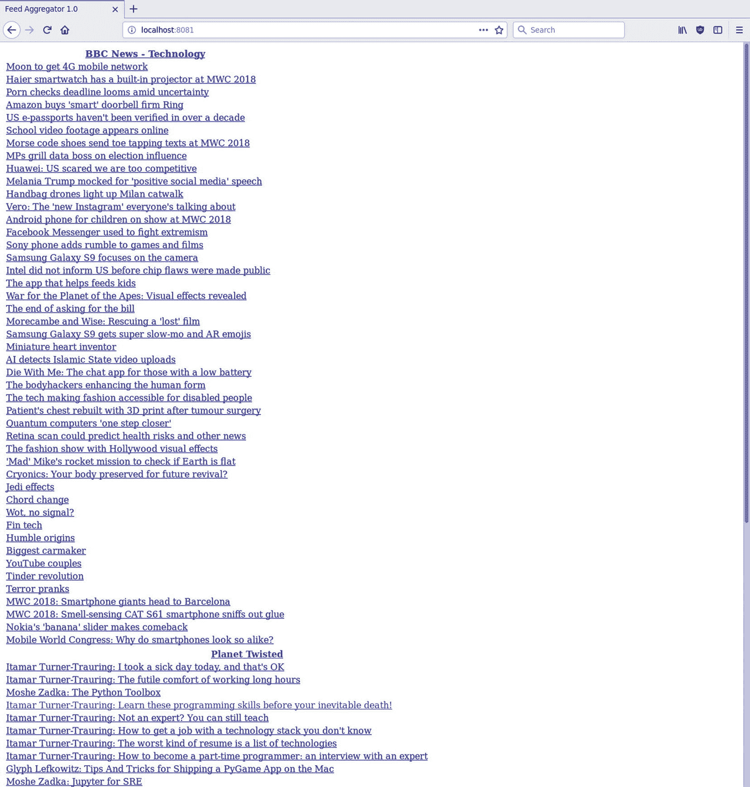
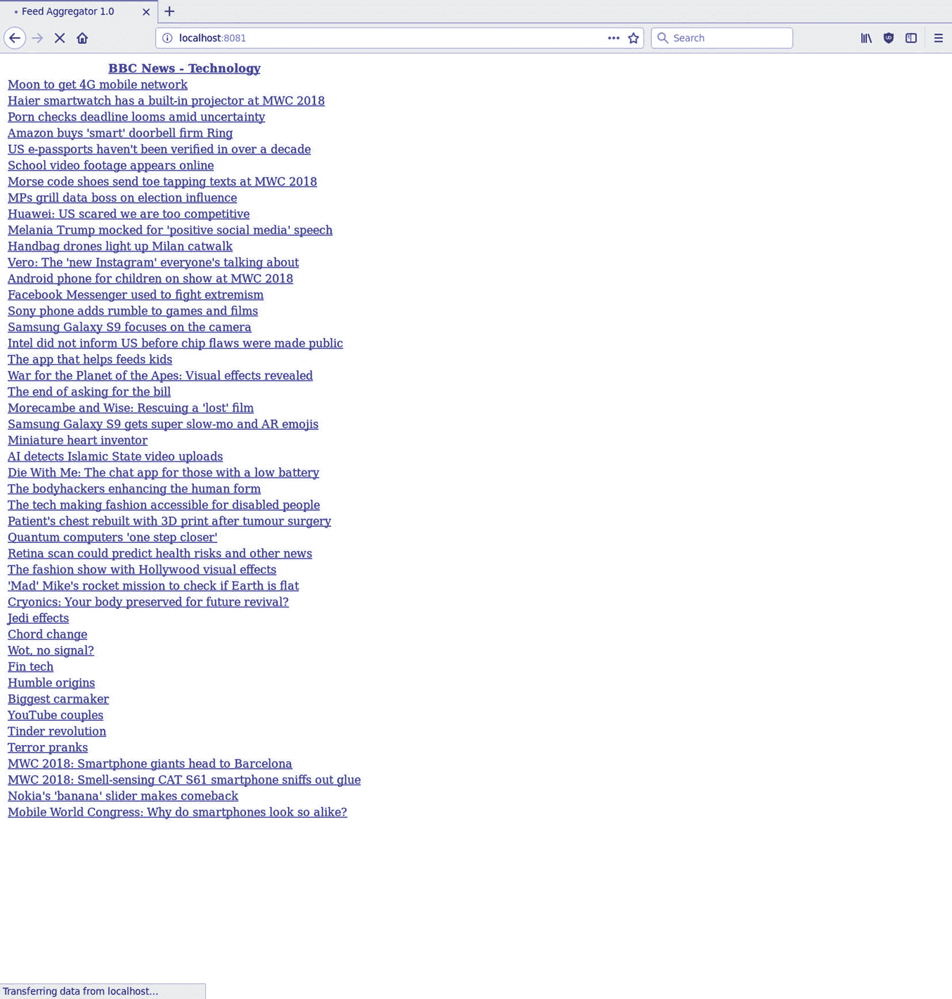
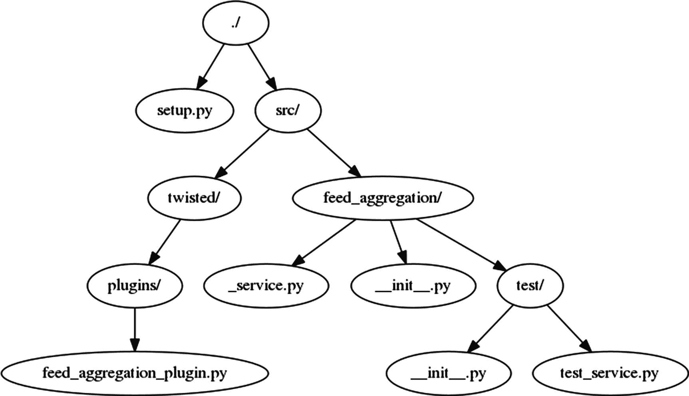

# 3.使用`treq`和 Klein 的应用

前面几章深入解释了 Twisted 的基本原理。熟悉这些核心概念是必要的，但不足以编写真正的应用。在这一章中，我们将通过使用两个强大的 Twisted web 库:`treq`和 Klein 构建一个提要聚合器来探索现代的高级 API 和整个程序设计。

*treq* ( [`https://treq.readthedocs.io`](https://treq.readthedocs.io) )用受流行的同步 HTTP 库`requests`启发的 API 包装`twisted.web.client.Agent`。其方便安全的默认值使得发送异步 HTTP 请求变得很容易，而`treq.testing`提供的 fakes 简化并标准化了编写测试。

*Klein* ( [`https://klein.readthedocs.io`](https://klein.readthedocs.io) )是一个用户友好的包装器，围绕着 Twisted 的古老的`twisted.web.server` web 框架。它允许使用从 Werkzeug ( [`https://werkzeug.readthedocs.io/`](https://werkzeug.readthedocs.io/) )借来的熟悉的路由范例来开发动态、异步的 web 应用。

## 为什么是图书馆？

Twisted 本身提供了 Klein 和`treq`的核心功能。那为什么不直接用 Twisted 的那些部分呢？这两个库的界面都与 Twisted 的有很大不同；例如，`twisted.web`使用*对象遍历*而不是*路由*将 URL 路径与 Python 代码关联起来。一个`twisted.web.server.Site`不匹配一个请求的路径和查询字符串对一个字符串模板，如“/some/”；相反，它将路径段匹配到嵌套的`Resource`对象。在设计`twisted.web`的时候，这是 Python web 应用框架中流行的范例。Klein 的作者没有给 Twisted 本身增加一个新的路由抽象，而是选择在一个单独的代码库中试验一种不同的方法。他们的结果是成功的，Klein 的独立存在允许它在不破坏依赖于`twisted.web.server`的应用的情况下成长和适应。

同样，`treq`在高级 API 中封装了常见的`twisted.web.client.Agent`使用模式；例如，`Agent`要求将所有请求体表示为`IBodyProducer`对象，包括短到可以用字节串表示的有效载荷，而`treq`的请求方法直接接受字节串体。使用`treq`并不妨碍你使用`Agent`，它的全部力量在 Twisted 中仍然存在。

用于安装第三方 Python 包的工具`pip`目前运行得非常好，额外的要求不会给开发者带来不必要的负担。我们还将在后面的章节中看到如何使用 Docker 来开发和部署使用第三方库的 Twisted 应用，使之健壮并可重复。最后，Klein 和`treq`都属于 Twisted GitHub 组织，由 Twisted 的核心贡献者开发和使用。它们是图书馆中风险最低的。

## 饲料聚集

追溯到互联网历史上一个不同的、更加开放的时代。在其全盛时期，网站通过 HTTP 提供 *feed* 文件，这些文件以结构化的方式组织其内容，因此其他网站可以出于各种目的使用它们。像 *RSS* (真正简单的联合或丰富文档格式站点摘要)和 *Atom* 这样的开放标准描述了这些结构，并允许任何人编写这些提要的消费者。将许多网站的信息聚合在一个地方的服务成为用户获取最新新闻和博客的流行方式。这些格式的扩展，比如 RSS 的附件，允许 feeds 引用外部媒体，使得播客之类的东西得以兴起。

2013 年谷歌阅读器的消亡恰逢订阅源的受欢迎程度下降。网站删除了他们的提要，一些消费软件失去了消费它们的能力。尽管有所下降，但基于 feed 的网络聚合还没有单一的替代品，它仍然是组织来自许多不同在线来源的内容的有效方式。

许多标准定义了 RSS 的变体。如果需要直接使用提要格式，我们将只支持由哈佛大学伯克曼中心( [`http://cyber.harvard.edu/rss/rss.html`](http://cyber.harvard.edu/rss/rss.html) )定义的 RSS 2.0 的以下子集:

1.  A `<channel>`是 RSS 2.0 提要文件的根元素，由它的`<title>`和`<link>`元素描述；

2.  一个`<channel>`中的网页由`<item>`描述，每个网页都有自己的`<title>`和`<link>`元素。

我们将使用测试驱动开发用 Klein 和`treq`编写一个提要聚合器。然而，在此之前，我们将通过编写探索性程序来了解它们以及定义提要聚合的问题空间。然后，我们将使用我们学到的知识来设计、实现和迭代地改进我们的应用。因为不先下载提要就无法显示它们，所以我们将从探索如何用`treq`发送 HTTP 请求开始。

## 介绍`treq`

提要聚合器必须先下载提要，然后才能显示它们，所以我们将从探索`treq`开始。请注意，下面的例子应该适用于 Python 2 和 3。

使用您喜欢的工具创建一个新的虚拟环境，并将 PyPI 中的`treq`安装到其中。有许多工具可以实现这一点；出于通用性的考虑，我们建议像这样使用`virtualenv` ( [`https://virtualenv.pypa.io/en/stable/`](https://virtualenv.pypa.io/en/stable/) )和`pip` ( [`https://pip.pypa.io/en/stable/`](https://pip.pypa.io/en/stable/) ):

```py
$ virtualenv treq-experiment-env
...
$ ./treq-experiment-env/bin/pip install treq
...
$ ./treq-experiment-env/bin/python experiment.py

```

其中`experiment.py`包含以下代码:

```py
from argparse import ArgumentParser
from twisted.internet import defer, task
from twisted.web import http
import treq

@defer.inlineCallbacks
def download(reactor):
    parser = ArgumentParser()
    parser.add_argument("url")
    arguments = parser.parse_args()
    response = yield treq.get(
        arguments.url, timeout=30.0, reactor=reactor)
    if response.code != http.OK:
        reason = http.RESPONSES[response.code]
    raise RuntimeError("Failed:{}{}".format(response.code,
                                            reason))
    content = yield response.content()
    print(content)

task.react(download)

```

`download`函数用标准库的`argparse`模块提取一个 URL 命令行参数，然后使用`treq.get`来`GET`它。`treq`的客户端 API 接受`bytes`或`unicode`URL，根据定义文本 URL 的复杂规则对后者进行编码。这使得我们的程序更容易编写，因为`ArgumentParser.parse_args`返回代表 Python 2 和 3 上命令行参数的`str`对象；在 Python 2 中，它们是字节字符串，而在 Python 3 中，它们是 unicode 字符串。我们不必担心将 URL `str`编码或解码成适合特定 Python 版本的类型，因为`treq`会为我们正确地完成这项工作。

`treq`的客户端 API 接受一个`timeout`参数，该参数终止未能在指定超时内*开始*的请求。`reactor`参数指定哪个反应器对象用于网络和内部簿记。这是一个*依赖注入* : `treq` *依赖*于反应器，但是`treq`可以提供这个依赖而不是导入`twisted.internet.reactor`本身。我们将在后面看到依赖注入如何使测试和分解代码变得更容易。

`treq.get`返回一个解析为`treq.response._Response`对象的`Deferred`(其名称中的下划线暗示我们不应该自己构造实例，而不是说我们不应该与它交互)。这实现了`twisted.web.iweb.IRequest`接口，所以它在`code`属性中包含了响应的状态代码。我们的示例程序检查这个值，以确保服务器的响应表明我们的请求是成功的；如果不是，它将使用响应的状态代码及其对应的状态短语引发一个`RuntimeError`，这是由`twisted.web.http.RESPONSES`字典提供的，它将二者相互映射。

`Deferred`也可以解析为`Failure`。例如，如果在`Response`对象可以被构造之前，经过了由`timeout`参数指定的时间量，`Deferred`将失败，出现`CancelledError`。

`treq`的回复也有额外的方法，使得与他们的互动更加方便。其中之一是`content`，它返回一个`Deferred`，将请求的整个主体解析为一个单独的`bytes`对象。`treq`在幕后为我们处理收集响应的所有细节。

最后，我们的例子从不直接调用`reactor.run`或`reactor.stop`。相反，它使用了一个我们从未见过的Twisted的库函数:`twisted.internet.task.react`。`react`为我们处理反应堆的启动和停止。它接受一个 callable 作为它唯一需要的参数，这个 callable 是它在运行的反应器中调用的；可调用函数本身必须返回一个`Deferred`，当它解析到一个值或`Failure`时，该函数会导致反应器停止。由于其`twisted.internet.defer.inlineCallback` s 装饰器的缘故，`download`函数返回了这样一个`Deferred`。因为`react`本身接受一个 callable 作为它的第一个参数，所以它也可以用作装饰器。我们可以这样写我们的例子:

```py
..
from twisted.internet import defer, task
...

@task.react
@defer.inlineCallbacks
def main(reactor):
    ...

```

这实际上是用 Twisted 编写简短脚本的一种流行方式。今后，当我们使用`react`时，我们将把它用作装饰器。

针对 web 提要的 URL 运行这个`treq`示例程序可以检索提要的内容。我们可以修改我们的程序，使用 Python `feedparser`库来打印提要的摘要。首先，用`pip`将`feedparser`安装到您的虚拟环境中:

```py
$ ./treq-experiment-env/bin/pip install feedparser

```

然后，将下面的程序保存到`feedparser_experiment.py`并根据 RSS URL 运行它:

```py
$ ./treq-experiment-env/bin/python feedparser_experiment.py http://planet.twistedmatrix.com

from __future__ import print_function
from argparse import ArgumentParser
import feedparser
from twisted.internet import defer, task
from twisted.web import http
import treq

@task.react
@defer.inlineCallbacks
def download(reactor):
    parser = ArgumentParser()
    parser.add_argument("url")
    arguments = parser.parse_args()
    response = yield treq.get(arguments.url, reactor=reactor)
    if response.code != http.OK:
        reason = http.RESPONSES[response.code]
        raise RuntimeError("Failed:{}{}".format(response.code,
                                                reason))
    content = yield response.content()
    parsed = feedparser.parse(content)
    print(parsed['feed']['title'])
    print(parsed['feed']['description'])
    print("*** ENTRIES ***")
    for entry in parsed['entries']:
        print(entry['title'])

```

运行此命令应该会产生如下输出:

```py
Planet Twisted
Planet Twisted - http://planet.twistedmatrix.com/
*** ENTRIES ***
Moshe Zadka: Exploration Driven Development
Hynek Schlawack: Python Application Deployment with Native Packages
Hynek Schlawack: Python Hashes and Equality
...

```

## 介绍克莱因

既然我们已经知道了如何使用`treq`来检索和解析提要，我们需要学习足够多的关于 Klein 的知识来在网站中呈现它们。

为了保持我们的实验有条理，为 Klein 创建一个新的虚拟环境，并用`pip install Klein`安装它。然后，运行以下示例:

```py
import klein

application = klein.Klein()

@application.route('/')
def hello(request):
    return b'Hello!'

application.run("localhost",8080)

```

现在，在您最喜欢的网络浏览器中访问`http://localhost:8080/`。(如果已经有一个程序绑定到了另一个端口，您可能需要将`8080`改为另一个端口。)你会看到从我们程序的`hello`路由处理器返回的字符串`Hello!`。

Klein 应用从一个`Klein`类的实例开始。通过使用`Klein.route`方法作为装饰器，可调用程序与路由相关联。`route`的第一个参数是 Werkzeug 风格的 URL 模式；可能的格式指令与 Werkzeug 的路由文档中的相匹配，可以在这里找到: [`http://werkzeug.readthedocs.io/en/latest/routing/`](http://werkzeug.readthedocs.io/en/latest/routing/) 。让我们修改我们的程序，使用这样一个指令从路径中提取一个整数:

```py
import klein

application = klein.Klein()

@application.route('/<int:amount>')
def increment(request, amount):
    newAmount = amount + 1
    message = 'Hello! Your new amount is:{} '.format(newAmount)
    return message.encode('ascii')

application.run("localhost",8080)

```

运行这个程序并访问`http://localhost:8080/1`会得到一个类似图 [3-1](#Fig1) 的网页。


图 3-1

增加.png

URL 模式指定一个路径组件，Klein 提取该路径组件，将其转换为指定的 Python 类型，并作为位置参数传递给处理函数。*金额*参数是第一个路径元素，必须是整数；否则，请求将失败，并显示 404。Werkzeug 文档中提供了一份*转换器*的列表。

还要注意，处理程序不能返回 unicode 字符串；在 Python 3 上；这意味着本地字符串必须在从 Klein 路由的处理程序返回之前被编码成字节字符串。因此，在执行了字符串格式化之后，我们将变量`message`编码为`ascii`。在 Python 3.5 和更高版本中，我们可以使用字节字符串格式，但是在撰写本文时，Python 3.4 仍然被广泛使用。同样，这段代码在 Python 2 上隐式地将 `message`解码为`ascii`。当使用除了`ascii`编码之外的任何编码时，这种不幸的行为会导致一个奇怪的错误消息，但是在处理只包含 ASCII 并且必须在 Python 2 和 3 上都工作的原生字符串的Twisted代码中，这是一种常见的模式。

### 克莱因和德弗雷德

Klein 是一个Twisted的项目，自然对`Deferreds`有特殊的支持。返回`Deferreds`的处理函数会产生一个响应，等待延迟解析为一个值或`Failure`。我们可以通过修改我们的程序来模拟一个缓慢的网络操作来看到这一点，方法是返回一个在接收到请求后至少一秒钟触发的`Deferred`:

```py
from twisted.internet import task
from twisted.internet import reactor
import klein

application = klein.Klein()

@application.route('/<int:amount>')
def slowIncrement(request, amount):
    newAmount = amount + 1
    message = 'Hello! Your new amount is:{} '.format(newAmount)
    return task.deferLater(reactor,1.0, str.encode, message, 'ascii')

application.run("localhost",8080)

```

正如所料，这个程序只在一秒钟后才响应`http://localhost:8080/1`。它通过使用接受一个`twisted.internet.interfaces.IReactorTime`提供者、一个延迟、一个函数以及延迟过后将应用于该函数的参数的`twisted.internet.task.deferLater`来实现这一点。注意，我们对函数和参数的选择利用了实例方法存储在它们的类中的事实，并且它们的第一个参数必须是它们所绑定的实例；因此，`str.encode(message,` `'ascii'` `)`，其中`message`是一个`str`，相当于`message.encode('` `ascii'` `)`。这是Twisted代码中出现的另一种模式。

最后一个例子演示了使用 decorators 作为注册路由的方式所固有的局限性:被修饰函数的参数必须完全由路由框架提供。这使得编写引用某个状态或依赖于某个现有对象的处理函数变得困难。在我们的例子中，我们的代码依赖于反应器来满足`deferLater`的 API，但是我们不能将反应器传递给我们的处理程序，因为只有 Klein 可以调用它。在解决这个问题的许多方法中，Klein 特别支持一种方法:特定于实例的 Klein 应用。我们将再次重写我们的`slowIncrement`例子来利用这个特性。

```py
from twisted.internet import task
from twisted.internet import reactor
import klein

class SlowIncrementWebService(object):
    application = klein.Klein()
    def init (self, reactor):
        self._reactor = reactor
    @application.route('/<int:amount>')
    def slowIncrement(self, request, amount):
        newAmount = amount + 1
        message = 'Hello! Your new amount is:{} '.format(newAmount)
        return task.deferLater(self._reactor,1.0, str.encode, message, 'ascii')

webService = SlowIncrementWebService(reactor) webService.application.run("localhost",8080)

```

`SlowIncrementWebService`类有一个分配给它的`application`类级变量的`Klein`应用。我们可以用那个变量的`route`方法来修饰这个类的方法，就像我们用模块级`Klein`对象的`route`方法来修饰模块级`slowIncrement`函数一样。因为我们现在正在修饰实例方法，所以我们可以访问实例变量，比如`reactor`。这允许我们在不依赖模块级对象的情况下参数化我们的 web 应用。

对象本身通过实现描述符协议来定位它们的内部状态。`webService.application`返回一个特定于请求的`Klein`实例，该实例包含我们向`SlowIncrementWebService`的`application`注册的所有路由及其处理程序。因此，Klein 保持了健壮的封装，并最小化了共享的可变状态。

### 电镀克莱因模板

在准备构建提要聚合器的简单版本之前，我们需要的最后一件事是一个 web 页面模板系统。我们可以使用 Jinja2，或者樱井真子，或者任何其他用于生成网页的 Python 模板系统，但是 Klein 自带了自己的模板工具，叫做 *Plating。*让我们修改`SlowIncrementWebService`示例，使用`klein.Plating`来生成可读性更好的响应:

```py
from twisted.internet import task, reactor
from twisted.web.template import tags, slot
from klein import Klein, Plating

class SlowIncrementWebService(object):
    application = Klein()
    commonPage = Plating(
        tags=tags.html( tags.head(
            tags.title(slot("title")),
            tags.style("#amount { font-weight: bold; }"
                       "#message { font-style: italic; }")),
            tags.body(
                tags.div(slot(Plating.CONTENT)))))
    def __init__ (self, reactor):
        self._reactor = reactor

    @commonPage.routed(
        application.route('/<int:amount>'),
        tags.div(
            tags.span("Hello! Your new amount is: ", id="message"),
            tags.span(slot("newAmount"), id="amount")),
    )
    def slowIncrement(self, request, amount):
        slots = {
            "title":"Slow Increment",
            "newAmount": amount + 1,
    }
    return task.deferLater(self._reactor,1.0, lambda: slots)

webService=SlowIncrementWebService(reactor) webService.application.run("localhost",8080)

```

新的`commonPage Plating`对象代表了对我们的`SlowIncrementWebService`的根本改变。因为`Plating`是建立在 Twisted 自己古老的`twisted.web.template`系统之上的，所以我们必须在继续之前了解它的基本原理。

`twisted.templates`由`twisted.web.template.Tag`和`twisted.web.template.slot`实例构成。`Tags`表示 html、`body`和`div`等 HTML 标签。它们是通过访问它们的名称作为标签工厂实例上的方法来创建的，标签工厂实例可作为`twisted.web.template.tags`获得。例如，这叫:

```py
tags.div()

```

表示一个`div`标签，将被呈现如下:

```py
<div></div>

```

这些实例方法的位置参数代表了它们标签的子标签，所以我们可以通过嵌套它们的方法调用向我们的`div`添加一个`span`:

```py
tags.div(tags.span("A span."))

```

这个简单的标记树将呈现如下:

```py
<div><span>A span.</span></div>

```

请注意，标记的文本内容也表示为子标记。

这些方法的关键字参数表示它们的属性，因此我们可以在 div 树中包含一个图像:

```py
tags.div(tags.img(src="picture.png"), tags.span("A span."))

```

渲染时，这棵树看起来像这样:

```py
<div><span>A span.</span></div>

```

`twisted.web.template`保留一个关键字参数供内部使用:`render`。这是一个命名特殊的*呈现方法*的字符串，该方法将用于将标签呈现为 HTML。一会儿我们将看到一个特定于 Klein 的渲染方法的例子。

有时将标签的属性写在其子标签之前更容易阅读，但是关键字参数必须总是在位置参数之前。为了在不违反 Python 语法的情况下提高可读性，`tags`可以和它们的子节点一起被*称为*。我们可以重写我们的标记树，这样就可以添加它的子树了:

```py
tags.div()(tags.img(src="picture.png"), tags.span("A span."))

```

是占位符，在模板渲染过程中可以用名字来填充，我们将在后面看到。它们允许我们参数化标签内容和属性。给定这个标记树，然后:

```py
tags.div(tags.img(src=slot('imageURL')), tags.span(slot("spanText")))

```

我们可以提供“`anotherimage.png`”作为 imageURL 槽的值，并提供“`Different text`”对于`spanText`槽，导致如下结果:

```py
<div><span>Different text.</span></div>

```

当用包含 HTML 文字的字符串填充槽时，`twisted.web`。`template`转义它们以避免将用户数据误解为模板指令。这反过来减少了常见的 web 应用错误，如跨站点脚本(XSS)攻击。然而，槽*可以用其他`tags`填充*，从而实现复杂的模板重用模式。这些规则意味着这棵树:

```py
tags.div(slot("child")).fillSlots(child="<div>")

```

渲染到:

```py
<div>&lt;div&gt;</div>

```

而这棵树:

```py
tags.div(slot("child")).fillSlots(child=tags.div())

```

渲染到:

```py
<div><div></div></div>

```

## 饲料聚集的初稿

既然我们已经熟悉了`twisted.web.template`的基本原理，我们可以回到我们的示例应用的`klein.Plating`对象:

```py
commonPage = Plating(
    tags=tags.html(
        tags.head(
            tags.title(slot("title")),
            tags.style("#amount { font-weight: bold; }"
                       "#message { font-style: italic; }")),
            tags.body(
                tags.div(slot(Plating.CONTENT)))))

```

作为`tags`参数传递的标记树描述了这个`Plating`实例将呈现的所有 HTML 页面的结构。它包括两个插槽:`title`和`Plating.CONTENT`。`title`插槽和其他插槽一样；每当我们想要呈现一个属于这个标签树的页面时，我们都必须为这个槽提供一个值。然而，`Plating.CONTENT`槽代表标签树中的位置，在这个位置上`Plating`将插入特定于页面的内容。我们的示例应用只呈现了一个来自`commonPage`的页面:

```py
@commonPage.routed(
    application.route('/<int:amount>'),
    tags.div(
        tags.span("Hello!    Your new amount is: ", id="message"),
        tags.span(slot("newAmount"), id="amount")),
)
def slowIncrement(self, request, amount):
    slots={
        "title":"Slow Increment",
        "newAmount": amount+1,
    }
    return task.deferLater(self._reactor,1.0, lambda: slots)

```

我们通过用基本页面的`routed`装饰器包装 Klein `route`来表示派生页面。`routed`装饰器的第二个位置参数表示将填充基页的`Klein.CONTENT`槽的标记树。这个`slowIncrement`页面包装了我们之前定义的相同路由，并指定一个标签树作为其内容，该标签树包括一个用于递增量的槽。

在 Klein 中，槽是通过返回一个字典来填充的，该字典将它们的名称映射到来自页面处理程序的值，或者返回一个解析为 1 的`Deferred`。这个处理程序通过使用`deferLater`来延迟返回插槽字典，直到一秒钟过去。

结果是一个更有个性的网页，如图 [3-2](#Fig2) 所示。

Klein 的电镀提供了一个独特的特性:您可以通过指定`json`查询参数来请求将 slots 字典作为序列化的 JSON 返回。在图 [3-3](#Fig3) 中，我们可以看到当提供这个参数时，我们的“慢增量”页面是什么样子。

这使得`Plating`用户可以编写处理程序来呈现 HTML 和 JSON，作为简单的页面，或者为复杂的单页面应用(SPA)或本地移动应用提供后端。我们的提要聚合器的 HTML 前端不会成为一个 SPA，因为这是一本关于 Twisted 而不是 JavaScript 的书，但是我们将在开发应用时继续支持和探索 JSON 序列化。

我们现在可以编写一个简单的提要聚合器来探索它的设计。我们将编写一个`SimpleFeedAggregation`类，它接受提要 URL，并在用户访问根 URL 时使用`treq`来检索它们。我们将把每个提要呈现为一个表格，表格的标题链接到提要，表格的行链接到每个提要条目。

首先将 feedparser 和 treq 安装到 Klein 虚拟环境中，就像在 treq 虚拟环境中一样。

```py
import feedparser

```


图 3-3

作为 JSON 递增


图 3-2

风格的增加

```py
from twisted.internet import defer, reactor
from twisted.web.template import tags, slot
from twisted.web import http
from klein import Klein, Plating
import treq

class SimpleFeedAggregation(object):
    application = Klein()
    commonPage = Plating(
        tags=tags.html(
            tags.head(
                tags.title("Feed Aggregator 1.0")),
            tags.body(
                tags.div(slot(Plating.CONTENT)))))

    def __init__ (self, reactor, feedURLs):
        self._reactor = reactor
        self._feedURLs = feedURLs

    @defer.inlineCallbacks

    def retrieveFeed(self, url):
        response = yield treq.get(url, timeout=30.0, reactor=self._reactor)
        if response.code != http.OK:
            reason = http.RESPONSES[response.code]
            raise RuntimeError("Failed:{}{}".format(response.code,
                                                    reason))
        content = yield response.content()
        defer.returnValue(feedparser.parse(content))

@commonPage.routed(
    application.route('/'),
    tags.div(render="feeds:list")(slot("item")))
def feeds(self, request):

    def renderFeed(feed):
        feedTitle = feed[u"feed"][u"title"]
        feedLink = feed[u"feed"][u"link"]
        return tags.table(
            tags.tr(tags.th(tags.a(feedTitle, href=feedLink)))
        )([
            tags.tr(tags.td(tags.a(entry[u'title'], href=entry[u'link'])))
            for entry in feed[u'entries']
        ])

    return {
            u"feeds": [
                self.retrieveFeed(url).addCallback(renderFeed)
                for url in self._feedURLs

            ]
        }

webService = SimpleFeedAggregation(reactor,
                              ["http://feeds.bbci.co.uk/news/technology/rss.xml",
                               "http://planet.twistedmatrix.com/rss20.xml"])
webService.application.run("localhost",8080)

```

`retrieveFeed`方法类似于我们第一个`treq`程序的下载函数，而`feeds`方法以一个电镀装饰器开始，类似于我们的 slowIncrement Klein 应用。然而，在提要的情况下，特定于路由的模板由一个带有特殊的*呈现方法*的`div`标签组成。Klein 将`feeds:list`解释为为列表中的每个项目复制`div`标签并将其放入项目槽的方向。例如，如果我们的`feeds`方法返回下面的字典:

```py
{"feeds": ["first","second","third"]}

```

Klein 将为`feeds`路线呈现以下 HTML:

```py
<div>first</div><div>second</div>third</div>

```

我们的`feeds`方法不仅返回一个槽字典，它的`feeds`键返回一个列表，而且还返回一个包含*延迟的列表。*这利用了`twisted.web.template's`的独特能力来呈现`Deferred`的结果:当遇到一个结果时，呈现暂停，直到它解析为一个值，然后被呈现，或者失败发生。

我们的`feeds`列表中的每一个`Deferred`都源于一个`retrieveURL`调用，这个调用通过`treq`和`feedparser`为一个 URL 创建一个解析的提要。`renderFeed`回调将经过解析的提要转换成标签树，标签树将提要呈现为一个链接表。这利用了`twisted.web.template`在插槽中嵌入`tag`元素的能力。

在浏览器中访问该页面时，首先呈现的是 BBC 提要，然后是更大更慢的Twisted矩阵提要，如图 [3-4](#Fig4) 和 [3-5](#Fig5) 所示。

我们的`SimpleFeedAggregation`类成功地检索并呈现了提要。它的基本设计反映了服务中的数据流:给定一个可迭代的提要 URL，通过对每个请求应用`treq.get`来同时检索它们。数据流通常会影响Twisted程序的设计。

然而，我们的执行不力:

1.  它有虫子。用户实际上不能请求 JSON，因为代表每个提要的标记树不是 JSON 可序列化的。



图 3-5

一个包含 BBC 和 Twisted Matrix 的完整页面



图 3-4

只有英国广播公司信息的不完整页面

1.  它的错误报告很差。虽然由`SimpleFeedAggregation.retrieveFeed`引发的`RuntimeError`是信息性的，但它是以不可操作的方式呈现给用户的，尤其是那些请求了 JSON 的用户。

在我们解决这些和其他问题之前，我们需要一个测试套件。我们将通过使用测试驱动的开发来指导我们，确保我们的提要聚合器的下一个实现符合我们的期望。

## 用 Klein 和`treq`进行测试驱动开发

编写测试需要时间和精力。测试驱动开发通过将测试作为开发过程的一部分来简化这一点。我们从某个代码单元应该实现的*接口*开始。接下来，我们编写一个空的实现，比如一个具有空方法体的类，然后进行测试，在给定已知输入的情况下验证该实现的期望输出。运行这些测试一开始应该会失败，开发变成了填充实现的过程，这样测试才能通过。结果，我们在早期发现实现的一部分是否与其他部分冲突，并且最终我们有一个完整的测试套件。

编写测试需要时间，所以从最有价值的接口开始很重要。对于一个 web 应用，这是客户机将使用的 HTTP 接口，所以我们的第一次测试将涉及对我们的`FeedAggregation` Klein 应用使用一个内存中的 HTTP 客户机。

### 在可安装项目上运行测试

测试驱动开发需要重复运行项目的测试，因此在我们开始编写任何测试之前，我们需要做好准备，以便 Twisted 的测试运行器`trial`能够找到它们。

`trial`命令接受包含或表示可运行测试用例的完全限定路径名*作为它唯一的强制参数。`trial`的设计遵循与 Python 的`unittest`相同的受 xUnit 影响的模式，所以它的测试用例是`twisted.trial.unittest.TestCase`或`twisted.trial.unittest.SynchronousTestCase`的子类。这些名称本身是完全限定的路径名，或 FQPNs。从最顶层的包开始，它们指定了向下到特定函数、类或方法的属性访问路径。例如，下面的命令行运行位于 Twisted 自己的异步消息协议(AMP)测试套件中的`ParsingTests`测试用例的`test_sillyEmptyThing`方法:*

```py
trial twisted.test.test_amp.ParsingTests.test_sillyEmptyThing

```

给定一个更短因而更通用的 FQPN，`trial`递归进入模块和包树寻找测试，就像`python -m unittest discover`一样。例如，你可以用`trial twisted`运行 Twisted 自己的所有测试。

因为测试是用 FQPNs 指定的，所以它们必须是可导入的。`trial`超越了这一点，要求它们也驻留在 Python 运行时的*模块搜索路径*下。这符合 Twisted 的惯例，即在特殊的`test`子包下的库代码中包含测试。

Python 允许程序员以几种方式影响它的搜索路径。设置`PYTHONPATH`环境变量或者直接操作`sys.path`都允许它从特定于项目的位置导入代码。然而，告诉 Python 可以找到代码的新位置是不可靠的，因为它依赖于定制的配置和特定的运行时入口点。更好的方法是依靠虚拟环境将 Python 的搜索路径定位到特定于项目的目录树，然后将项目及其依赖项安装到其中。通过利用相同的工具和模式，以管理其依赖关系的相同方式管理我们自己的应用给了我们更大的一致性。

对虚拟环境和 Python 打包的全面讨论超出了本书的范围。相反，我们将概述一个最小的项目布局和配置，展示如何将我们的项目链接到一个虚拟环境中，然后为一个空的测试套件提供一个示例`trial`调用。

该项目的目录结构如下:



图 3-6

提要聚合项目目录结构

也就是说，在作为当前工作目录的某个目录下，存在一个`setup.py`和`src/`目录。`src/`目录又包含顶层`feed_aggregation`包和一个`_service`子模块。`feed_aggregation.test.test_service`将存放`_service`中代码的测试用例。

将包含一个Twisted的应用插件，这将使运行我们的 Klein 应用更容易。

我们将把我们的`FeedAggregation`类放在`feed_aggregation._service`中:

```py
class FeedAggregation(object):
    pass

```

这是一个私有模块，所以我们将通过在`feed_aggregation/__init__.py`中导出它来公开访问我们的类:

```py
from feed_aggregation._service import FeedAggregation
__all__ =["FeedAggregation"]

```

将实现放在私有子模块中，然后在顶层包的 __ `init__ .py`中公开它，这是 Twisted 代码中的常见模式。它确保文档工具、linters 和 ide 将公共 API 的来源视为公共包，从而限制了私有实现细节的暴露。

我们将让`feedaggregation/test/ __init__ .py`为空，但将`SynchronousTestCase`的一个小子类放入`feed_aggregation/test/test_service.py`中，这样`trial`在我们完成设置后就可以运行了:

```py
from twisted.trial.unittest import SynchronousTestCase

class FeedAggregationTests(SynchronousTestCase):
    def test_nothing(self):
        pass

```

让`twisted/plugins/feed_aggregation_plugin.py`也为空，我们准备考虑`setup.py`:

```py
from setuptools import setup, find_packages

setup(
    name="feed_aggregation",
    install_requires=["feedparser", "Klein", "Twisted", "treq"],
    package_dir={"": "src"},
    packages=find_packages("src") + ["twisted.plugins"],
)

```

这将我们的项目名称声明为`feed_aggregation`，其依赖项为`feedparser`(用于解析提要)、Klein(用于我们的 web 应用)、Twisted(用于`trial`)和`treq`(用于检索提要)。它还指示 setuptools 在`src`下查找包，并在`twisted/plugins`下包含`feed_aggregation_plugin.py`。

假设我们为我们的项目激活了一个新的虚拟环境，并且我们在项目根中，我们现在可以运行这个:

```py
pip install -e .

```

`-e`标志指示`pip install`执行我们项目的*可编辑安装*，这将把一个指针从虚拟环境放回我们项目根目录。因此，一旦我们保存编辑内容，它们就会出现在虚拟环境中。

最后，`trial feed_aggregation`应该显示以下内容:

```py
feed_aggregation.test.test_service
  FeedAggregationTests
    test_nothing ...[OK]

---------------------------------------------------------------------------
Ran 1 tests in 0.001s

PASSED (successes=1)

```

证明我们实际上已经通过我们的虚拟环境对我们的项目进行了测试。

### 用 StubTreq 测试 Klein

现在我们可以运行测试，我们可以用测试某些东西的方法来代替`FeedAggregationTests.test_nothing`。如上所述，这应该是我们的 Klein 应用将呈现给客户端的 HTTP 接口。

测试 HTTP 服务的一种方法是运行一个 web 服务器，就像运行一个实时服务一样，可能绑定到一个可预测的端口上的`localhost`,并使用一个 HTTP 客户端库来连接它。这可能会很慢，更糟糕的是，端口是一种操作系统资源，它的稀缺会导致获取它们的测试不稳定。

幸运的是，Twisted 的传输和协议允许我们在测试中运行内存中的 HTTP 客户端和服务器对。特别是，`treq`在`treq.testing.StubTreq`中提供了一个强大的测试工具。`StubTreq`的实例暴露了与`treq`模块相同的接口，因此通过依赖注入获得`treq`的代码可以在测试中使用这个存根实现。由`treq`项目来验证`StubTreq`是否符合与`treq`模块相同的 API 我们不需要在测试中这样做。

`StubTreq`将一个`twisted.web.resource.Resource`作为它的第一个参数，它的响应决定了各种 treq 调用的结果。因为 Klein 实例公开了一个生成`twisted.web.resource.Resource`的`resource()`方法，所以我们可以将一个`StubTreq`绑定到我们的 web 应用，以获得一个适合我们测试的内存中 HTTP 客户端。

让我们用一个使用`StubTreq`请求我们服务的根 URL 的方法来替换`test_nothing`:

```py
# src/feed_aggregation/tests/test_service.py

from twisted.trial.unittest import SynchronousTestCase
from twisted.internet import defer
from treq.testing import StubTreq
from .. import FeedAggregation

class FeedAggregationTests(SynchronousTestCase):
    def setUp(self):
        self.client = StubTreq(FeedAggregation().resource())
    @defer.inlineCallbacks
    def test_requestRoot(self):
        response = yield self.client.get(u'http://test.invalid/')
        self.assertEqual(response.code,200)

```

`setUp`方法为我们的`FeedAggregation`的 Klein 应用创建一个绑定到`twisted.web.resource.Resource`的`StubTreq`实例。`test_requestRoot`使用这个客户端向 Klein 资源发出一个`GET`请求，验证它收到了一个成功的响应。

注意，只有传递给`self.client.get`的 URL 的路径部分对我们的测试有影响。treq 和 StubTreq 只能对一个完整的 web URL 发出带有 scheme 和 netloc 的请求，所以我们使用一个.`invalid`域来满足这个需求。那个。`invalid`顶级域名被定义为永远不会解析到实际的互联网地址，这是我们测试的最佳选择。

用`trial feed_aggregation`运行这个新版本的`FeedAggregationTests`会因为一个`AttributeError`而失败，因为我们的`FeedAggregation`类的实例没有一个`resource`方法。然而，添加正确的实现不会使测试通过；我们还需要构建一个 Klein 应用来响应对`/`的请求。我们将修改`_service`模块来满足这两个需求。

```py
# src/feed_aggregation/_service.py

from klein import Klein

class FeedAggregation(object):
    _app=Klein()
    def resource(self):
        return self._app.resource()
    @_app.route("/")
    def root(self, request):
        return b""

```

新的`resource`实例方法将其调用委托给与该类相关联的 Klein 应用。这是 Demeter 的**法则的一个例子，这是软件开发中的一个原则，反对在实例属性上调用方法；相反，像`FeedAggregation.resource`这样的委托方法包装了这些属性的方法，所以使用`FeedAggregation`的代码仍然不知道它的内部实现。我们将我们的 Klein 应用命名为`_app`，以表明它是`FeedAggregation`内部私有 API 的一部分。**

 *根方法充当根 URL path /的普通处理程序，并与`FeedAggregation.resource`一起使`FeedAggregation.test_requestRoot`通过。

我们现在已经完成了一个测试驱动的开发周期。我们从编写一个最小的失败测试开始，然后用最少的应用代码让它通过。

让我们跳过这一步，用一个更完整的测试套件来替换`FeedAggregationTests`,这个测试套件可以测试 HTML 和 JSON feed 渲染。

```py
# src/feed_aggregation/test/test_service.py

import json
from lxml import html
from twisted.internet import defer
from twisted.trial.unittest import SynchronousTestCase
from treq.testing import StubTreq
from .. import FeedAggregation

class FeedAggregationTests(SynchronousTestCase):
    def setUp(self):
        self.client = StubTreq(FeedAggregation().resource())
    @defer.inlineCallbacks
    def get(self, url):
        response = yield self.client.get(url)
        self.assertEqual(response.code,200)
        content = yield response.content()
        defer.returnValue(content)
    def test_renderHTML(self):
        content = self.successResultOf(self.get(u"http://test.invalid/"))
        parsed = html.fromstring(content)
        self.assertEqual(parsed.xpath(u'/html/body/div/table/tr/th/a/text()'),
                        [u"First feed",u"Second feed"])
        self.assertEqual(parsed.xpath('/html/body/div/table/tr/th/a/@href'),
                        [u"http://feed-1/",u"http://feed-2/"])
        self.assertEqual(parsed.xpath('/html/body/div/table/tr/td/a/text()'),
                        [u"First item",u"Second item"])
        self.assertEqual(parsed.xpath('/html/body/div/table/tr/td/a/@href'),
                        [u"#first",u"#second"])
    def test_renderJSON(self):
        content = self.successResultOf(self.get(u"http://test.invalid/?json=true"))
        parsed = json.loads(content)
        self.assertEqual(
            parsed,
            {u"feeds": [{u"title": u"First feed", u"link": u"http://feed-1/",
             u"items": [{u"title": u"First item",u"link": u"#first"}]},
            {u"title": u"Second feed", u"link": u"http://feed-2/",
             u"items": [{u"title": u"Second item", u"link": u"#second"}]}]})

```

在这个测试案例中有很多事情要做。有两个测试，`test_renderHTML`和`test_renderJSON`，它们验证我们期望我们的`FeedAggregation` web 服务返回的 HTML 和 JSON 的结构和内容。`test_requestRoot`已经被一个`get`方法所取代，这个方法可以被`test_renderHTML`和`test_renderJSON`用来为我们的 Klein 应用检索一个特定的 URL。`test_renderHTML`和`test_renderJSON`都使用`SynchronousTestCase.successResultOf`来断言`get`返回的`Deferred`已经触发并提取了值。

`test_renderHTML`使用`lxml`库( [`https://lxml.de/`](https://lxml.de/) )来解析和检查我们的 Klein 应用返回的 HTML。因此，我们必须在我们的`setup.py`中将`lxml`添加到`install_requires`列表中。请注意，您可以通过再次运行`pip install -e .`将虚拟环境与项目的依赖项同步。

XPaths 定位并提取 DOM 中特定元素的内容和属性。隐含的表结构与我们在原型中开发的相匹配:提要驻留在`table`中，其标题链接到提要的主页，其行链接到每个提要的项目。

`test_renderJSON`请求呈现为 JSON 的提要，将其解析成一个字典，然后断言它等于预期的输出。

这些新测试自然会失败，因为现有的`FeedAggregation`仅仅返回一个空的响应体。让我们通过用最少的必要实现替换`FeedAggregation`来让它们通过。

```py
# src/feed_aggregation/_service.py

from klein import Klein, Plating
from twisted.web.template import tags as t, slot

class FeedAggregation(object):
    _app = Klein()
    _plating = Plating(
        tags=t.html(
            t.head(t.title("Feed Aggregator 2.0")),
            t.body(slot(Plating.CONTENT))))
    def resource(self):
        return self._app.resource()
    @_plating.routed(
        _app.route("/"),
        t.div(render="feeds:list")(slot("item")),
    )
    def root(self, request):
        return {u"feeds": [
    t.table(t.tr(t.th(t.a(href=u"http://feed-1/")(u"First feed"))),
            t.tr(t.td(t.a(href=u"#first")(u"First item")))),
    t.table(t.tr(t.th(t.a(href=u"http://feed-2/")(u"Second feed"))),
            t.tr(t.td(t.a(href=u"#second")(u"Second item"))))

]}

```

因为我们还没有编写提要检索的测试，所以这个实现还不能检索 RSS 提要。相反，它通过返回与我们的断言相匹配的硬编码数据来满足我们的测试。除此之外，它类似于我们的原型:一个`root`方法处理根 URL 路径，该路径使用 Klein 的`:list`渲染器将一系列`twisted.web.template.tag`转换成 HTML。

这个版本的`FeedAggregation`通过了`test_renderHTML`但是在`test_renderJSON`上失败:

```py
(feed_aggregation) $ trial feed_aggregation
feed_aggregation.test.test_service
  FeedAggregationTests
    test_renderHTML ...                                           [OK]
    test_renderJSON ...                                        [ERROR]
                                                               [ERROR]

======================================================================= [ERROR]
Traceback (most recent call last):
...
exceptions.TypeError: Tag('table', ...) not JSON serializable

feed_aggregation.test.test_service.FeedAggregationTests.test_renderJSON
======================================================================= [ERROR]
Traceback (most recent call last):
...
twisted.trial.unittest.FailTest: 500 != 200

feed_aggregation.test.test_service.FeedAggregationTests.test_renderJSON
-----------------------------------------------------------------------
Ran 2 tests in 0.029s

FAILED (failures=1, errors=1, successes=1)

```

第二个错误对应于`FeedAggregationTests.get`中的`self.assertEqual(response.code, 200)`，而第一个错误指出了真正的问题:Klein 无法序列化`FeedAggregation.root`返回给 JSON 的`tag`。

最简单的解决方案是检测请求何时应该序列化为 JSON，并返回一个可序列化的字典。当前的设计需要复制必要的数据来满足测试，所以在我们解决 bug 的同时，我们还要添加存储提要数据的容器类，以及存储提要来源并控制其表示的顶级类。这些将允许我们定义一次数据，但同时呈现给 HTML 和 JSON。事实上，我们可以安排`FeedAggregation`在其初始化器中接受顶级 feed 容器类的实例，这样测试就可以使用它们自己的 fixture 数据。让我们按照这种方法重写`_service.py`。我们将使用 Hynek Schlawack 的`attrs` ( [`https://attrs.readthedocs.io`](https://attrs.readthedocs.io) )库来保持代码简洁明了；一定要把它加到你的`setup.py`的`install_requires`里。

```py
# src/feed_aggregation/_service.py

import attr
from klein import Klein, Plating
from twisted.web.template import tags as t, slot

@attr.s(frozen=True)
class Channel(object):
    title = attr.ib()
    link = attr.ib()
    items = attr.ib()

@attr.s(frozen=True)
class Item(object):
    title = attr.ib()
    link = attr.ib()

@attr.s(frozen=True)

class Feed(object):
    _source = attr.ib()
    _channel = attr.ib()

    def asJSON(self):
        return attr.asdict(self._channel)

    def asHTML(self):
        header = t.th(t.a(href=self._channel.link)
                    (self._channel.title))
        return t.table(t.tr(header))(
                [t.tr(t.td(t.a(href=item.link)(item.title)))
                 for item in self._channel.items])

@attr.s
class FeedAggregation(object):
    _feeds = attr.ib()
    _app = Klein()
    _plating = Plating(
        tags=t.html(
        t.head(t.title("Feed Aggregator 2.0")),
        t.body(slot(Plating.CONTENT))))
def resource(self):
    return self._app.resource()
@_plating.routed(
    _app.route("/"),t.div(render="feeds:list")(slot("item")),
)
def root(self, request):
    jsonRequested = request.args.get(b"json")
    def convert(feed):
        return feed.asJSON() if jsonRequested else feed.asHTML()
    return {"feeds": [convert(feed) for feed in self._feeds]}

```

使用`attrs`可以很容易地定义像`Channel`和`Item`这样的容器类。在其最基本的操作中，`attr.s`类装饰器生成一个`init`方法，该方法设置对应于类的`attr.ib`变量的实例变量。

`attrs`也使得通过 decorator 的`frozen`参数定义实例为*不可变*的类变得容易。不变性很适合我们的容器类，因为它们表示外部数据；在我们收到它之后改变它肯定会是一个错误。`attrs`、`lxml`，必须添加到`setup.py`里面的`install_requires`列表中。

`Feed`类包装了提要的源 URL 和表示其内容的`Channel`实例，并公开了两种表示方法。`asJSON`使用`attrs.asdict`递归地将 channel 实例转换成 JSON 可序列化的字典，而`asHTML`返回一个`twisted.web.template.tags`树，由 Klein 的电镀系统渲染。

`FeedAggregation.root`现在检查请求的`json`查询参数，可以在`args`字典中找到，以确定响应是否应该呈现为 JSON 或 HTML，并适当地调用`asJSON`或`asHTML`。

最后，`FeedAggregation`现在本身是一个`attrs`修饰类，它的初始化器接受一个要呈现的`Feed`对象的 iterable。

因此，`FeedAggregationTests.setUp`必须被重构，以将`Feed`对象的 iterable 传递给它的`FeedAggregation`实例:

```py
# src/feed_aggregation/test/test_service.py

...
from .._service import Feed, Channel, Item

FEEDS = (
    Feed("http://feed-1.invalid/rss.xml",
         Channel(title="First feed", link="http://feed-1/",
                 items=(Item(title="First item", link="#first"),))),
    Feed("http://feed-2.invald/rss.xml",
         Channel(title="Second feed", link="http://feed-2/",
                 items=(Item(title="Second item", link="#second"),))),
)

class FeedAggregationTests(SynchronousTestCase):
    def setUp(self):
        self.client = StubTreq(FeedAggregation(FEEDS).resource())

...

```

这个最新版本有它的好处:最明显的是,`test_renderJSON`现在通过了，但是另外 fixture 的数据现在和测试驻留在同一个地方，这样就更容易和它们的断言保持同步。

它也有不利的一面。如果没有检索 RSS 提要的能力，`FeedAggregation`不仅作为提要聚合服务毫无用处，而且测试现在导入并依赖于我们的容器类。像这样依赖于内部实现细节的测试是脆弱的，难以重构。

我们将通过编写提要检索逻辑来解决这两个缺点。

### 用 Klein 测试 treq

在前一节中，我们使用了`StubTreq`来测试我们的 Klein 应用。颠倒关系允许我们简洁地测试`treq`代码。

同样，我们将从编写测试开始。我们将把它们添加到`test_service`模块中，新的导入显示在顶部，我们的新测试用例显示在底部。

```py
# src/feed_aggregation/test/test_service.py

import attr
...
from hyperlink import URL
from klein import Klein
from lxml.builder import E
from lxml.etree import tostring
...
from .. import FeedRetrieval

@attr.s
class StubFeed(object):
    _feeds = attr.ib()
    _app = Klein()
    def resource(self):
        return self._app.resource()

    @_app.route("/rss.xml")
    def returnXML(self, request):
        host = request.getHeader(b    'host')
        try:
            return self._feeds[host]
        except KeyError:
            request.setResponseCode(404)
            return b'Unknown host: ' +host
def makeXML(feed):
    channel = feed._channel
    return tostring(
    E.rss(E.channel(E.title(channel.title), E.link(channel.link),
                    *[E.item(E.title(item.title), E.link(item.link))
                      for item in channel.items],
          version = u"2.0")))

class FeedRetrievalTests(SynchronousTestCase):
    def setUp(self):
        service = StubFeed(
            {URL.from_text(feed._source).host.encode('ascii'): makeXML(feed)
             for feed in FEEDS})
        treq = StubTreq(service.resource())
        self.retriever = FeedRetrieval(treq=treq)
    def test_retrieve(self):
        for feed in FEEDS:
            parsed = self.successResultOf(
                self.retriever.retrieve(feed._source))
            self.assertEqual(parsed, feed)

```

与之前的`FeedAggregationTests`一样，`FeedRetrievalTests`类依赖于一些新概念。`StubFeed`是一个 Klein 应用，其`/rss.xml` route 返回一个特定于请求主机的 XML 文档。这允许它为 [`http://feed-1.invalid`](http://feed-1.invalid) 和 [`http://feed-2.invalid`](http://feed-2.invalid) 返回不同的响应。作为预防措施，对未知主机的请求会导致信息性的 404“未找到”响应。

`makeXML`函数将一个`Feed`及其关联的`Item`转换成一个符合 RSS 2.0 的 XML 文档。我们使用`lxml.builder`的`E`标签工厂，其 API 类似于`twisted.web.template.tags`，作为 XML 模板系统，并用`lxml.etree.tostring`将其标签树序列化为字节(尽管其名称如此，它*确实在 Python 3 上*返回字节)。

`FeedRetrievalTests.setUp` fixture 方法创建一个`Feeds`列表，并将它们传递给一个`StubFeed`实例，然后将它们与一个`StubTreq`实例相关联。这又被传递给一个`FeedRetrieval`实例，该实例将包含我们的提要检索代码。在`treq`实现上参数化这个类是一个依赖注入的例子，它简化了编写测试的过程。

注意，我们通过使用`hyperlink.URL`从其`link`元素中的 URL 派生出每个提要的主机。超链接( [`https://hyperlink.readthedocs.io`](https://hyperlink.readthedocs.io) ) `URL`是不可变的对象，表示解析后的 URL。超链接库是从 Twisted 自己的`twisted.python.url`模块中抽象出来的，提供了原始 API 的超集。因此，Twisted 现在依赖于它，所以它可以隐式地用于任何依赖 Twisted 的项目。然而，任何依赖的最佳实践是使其显式，所以我们必须将`hyperlink`包添加到我们的`setup.py`的`install_requires`列表中。我们的`setup.py`现在应该是这样的:

```py
# setup.py

from setuptools import setup, find_packages

setup(
    name="feed_aggregation",
    install_requires=["attrs","feedparser","hyperlink","Klein",
                      "lxml","Twisted","treq"],
    package_dir={"":"src"},
    packages=find_packages("src")+["twisted.plugins"],
)

```

(记得我们我们在上面加了`attrs`和 lxml。)

我们的`FeedAggregationTests`测试用例中的一个测试`test_retrieve`断言`FeedRetrieval.retrieve`将从其`_source` URL 检索到的提要解析为与其 XML 表示匹配的`Feed`对象。

现在我们已经有了一个提要检索器的测试，我们可以实现一个。首先，我们将把`FeedRetrieval`添加到`src/feed_aggregation/__init__.py`中，这样就可以在不与私有 API 交互的情况下导入它:

```py
# src/feed_aggregation/ init .py

from ._service import FeedAggregation, FeedRetrieval

__all__ = ["FeedAggregation","FeedRetrieval"]

```

现在，我们可以实现通过测试所需的最少代码:

```py
# src/feed_aggregation/_service.py

...
import treq
import feedparser

@attr.s
class FeedRetrieval(object):
    _treq = attr.ib()
    def retrieve(self, url):
        feedDeferred = self._treq.get(url)
        feedDeferred.addCallback(treq.content)
        feedDeferred.addCallback(feedparser.parse)
    def toFeed(parsed):
        feed = parsed[u'feed']
        entries = parsed[u'entries']
        channel = Channel(feed[u'title'], feed[u'link'],
                          tuple(Item(e[u'title'], e[u'link'])
                              for e in entries))
        return Feed(url, channel)

        feedDeferred.addCallback(toFeed)
        return feedDeferred

```

正如所料，`FeedRetrieval`通过`attr.s`类装饰器和一个`_treq attr.ib`接受一个`treq`实现作为它的唯一参数。它的`retrieve`方法遵循与我们的探索性程序相同的模式:首先，它使用`treq`检索提供的 URL 并收集其主体，然后使用`feedparser`将收集的 XML 解析到 Python 字典中。

接下来，`toFeed`提取提要的标题、链接及其条目的标题和链接，然后将它们组装成一个`Channel`、`Item`和一个`Feed`。

这个版本的`FeedRetrieval`通过了我们的测试，但是它缺少错误处理。如果一个提要已经被删除或者返回的 XML 无效怎么办？照目前的情况来看，`FeedRetrieval.retrieve`返回的`Deferred`将会异常失败，这将是`FeedAggregation`的问题。

网站和 JSON 服务都不应该显示回溯。同时，应该记录任何回溯以帮助调试。幸运的是，Twisted 有一个复杂的日志系统，我们可以用它来跟踪应用的行为。

### 用`twisted.logger`记录

Twisted 为许多版本提供了自己的日志系统。从 Twisted 15.2.0 开始，`twisted.logger`已经成为 Twisted 程序中记录事件的首选方法。

像标准库的`logging`模块一样，应用通过调用一个`twisted.logger.Logger`实例上的适当方法，在不同的*级别*发出日志消息。下面的代码在`info`级别发出一条消息。

```py
from twisted.logger import Logger
Logger().info("A message with{key}", key="value")

```

像`logging`一样，`Logger.info`这样的发射方法接受一个格式字符串和值进行插值；与`logging`不同，这是一个*新样式的*格式化字符串，它是在底层日志事件中发送的。也不同于 Python 的标准`logging`系统，`twisted.logger.Logger`没有等级，而是通过*观察者*来路由它们的消息。格式字符串被保留的事实启用了`twisted.logger`最强大的特性之一:它可以以传统的格式发出日志消息供人们使用，并且可以将它们作为 JSON 序列化的对象发出。后者允许在像 Kibana 这样的系统中进行复杂的过滤和收集。当我们为提要聚合应用编写 Twisted 应用插件时，我们将看到如何在这些格式之间切换。

我们还使用描述符协议来捕获相关类的信息，所以我们将为我们的`FeedRetrieval`类创建一个`Logger`。然后，我们将安排在请求提要之前以及在成功解析或者因异常而失败时发出消息。然而，在我们这样做之前，我们必须决定当异常发生时`FeedRetrieval.retrieve`的`Deferred`应该解决什么问题。它不能是一个`Feed`实例，因为没有任何 XML 可以解析到一个`Channel`实例中；但是`FeedAggregation`期望一个提供`asJSON`和`asHTML`方法的对象，它们的唯一实现存在于`Feed`上。

我们可以用多态来解决这个问题。我们可以定义一个新的类`FailedFeed`，它表示`FeedRetrieval`检索提要失败。它将通过实现自己的`asJSON`和`asHTML`方法来满足与`Feed`相同的接口，以适当的格式呈现错误。

像往常一样，我们将从编写测试开始。`FeedRetrieval.retrieve`可能遇到的异常情况可以分为两类:状态代码不是 200 的响应，以及任何其他异常。我们将用一个定制的异常类型`ResponseNotOK`对第一个进行建模，retrieve 将在内部引发并处理这个异常，我们可以通过从一个`StubFeed`不知道的主机请求一个提要来请求这个异常。后者可以通过向`StubFeed`提供一个返回空字符串的主机来请求，`feedparser`将无法解析空字符串。让我们给我们的`FeedRetrievalTests`类添加一些测试。

```py
# src/feed_aggregation/test/test_service.py

from .. import FeedRetrieval
from .._service import Feed, Channel, Item, ResponseNotOK
from xml.sax import SAXParseException

...

class FeedRetrievalTests(SynchronousTestCase):
    ...
    def assertTag(self, tag, name, attributes, text):
        self.assertEqual(tag.tagName, name)
        self.assertEqual(tag.attributes, attributes)
        self.assertEqual(tag.children, [text])
    def test_responseNotOK(self):
        noFeed = StubFeed({})
        retriever = FeedRetrieval(StubTreq(noFeed.resource()))
        failedFeed = self.successResultOf(
            retriever.retrieve("http://missing.invalid/rss.xml"))
        self.assertEqual(
            failedFeed.asJSON(),
            {"error":"Failed to load http://missing.invalid/rss.xml: 404"}
        )
        self.assertTag(failedFeed.asHTML(),
            "a", {"href":"http://missing.invalid/rss.xml"},
            "Failed to load feed: 404")
    def test_unexpectedFailure(self):
        empty = StubFeed({b"empty.invalid": b""})
        retriever = FeedRetrieval(StubTreq(empty.resource()))
        failedFeed = self.successResultOf(
             retriever.retrieve("http://empty.invalid/rss.xml"))
        msg = "SAXParseException('no element found',)"
        self.assertEqual(
            failedFeed.asJSON(),
            {"error":"Failed to load http://empty.invalid/rss.xml: " + msg}
        )
        self.assertTag(failedFeed.asHTML(),
           "a", {"href": "http://empty.invalid/rss.xml"},
           "Failed to load feed: " + msg)
        self.assertTrue(self.flushLoggedErrors(SAXParseException))

```

`assertTag`方法确保深度为 1 的`twisted.web.template`标记树具有给定的名称、属性和子元素，简化了`test_responseNotOK`和`test_unexpectedFailure`方法。

`test_responseNotOK`方法创建了一个空的`StubFeed`应用，它将使用 404 来响应测试发出的任何请求。然后，它断言检索一个 URL 会导致一个被触发的`Deferred`，并将结果`FailedFeed`呈现给 JSON 和一个标记树。JSON 应该包含 URL 和 HTTP 状态代码，而 HTML 应该链接到失败的提要并包含状态代码。

`test_unexpectedFailure`方法创建一个`StubFeed`，用一个空字符串响应对`empty.invalid`的请求。结果`FailedFeed`实例的 HTML 和 JSON 呈现检查源 URL 以及导致失败的异常的`repr`。我们选择`repr`是因为许多异常的消息，像`KeyError`一样，没有它们的类名是无法理解的。

`test_unexpectedFailure`最后一行值得特别关注。与 Python 的`unittest`不同的是，`trial`不能通过任何测试，因为它不能恢复由它调用的代码记录的异常。请注意，这不包括测试本身引起的错误。

synchronoustestcase . flushloggederrors 返回到该时间点为止已记录的 twisted . python . failure . failure 列表；如果异常类型作为参数传递，则只返回与这些类型匹配的`Failure`。`flushLoggedErrors`中的“flush”意味着这是一个破坏性调用，因此给定的`Failure`不会出现在两个连续调用返回的列表中。当测试完成时，如果记录的错误列表为非空，则测试失败。我们的测试断言至少有一个`SAXParseException`是由`feedparser`引发的，这有清除记录的错误列表的副作用，这应该允许测试通过。

让我们编写通过这些新测试所需的代码。我们将完整地展示新版本的`FeedRetrieval`,这样就可以在上下文中看到它的错误处理。

```py
# src/feed_aggregation/_service.py

...
import treq import feedparser
from twisted.logger import Logger
from functools import partial
...

@attr.s(frozen=True)
class FailedFeed(object):
    _source = attr.ib()
    _reason = attr.ib()

    def asJSON(self):
        return {"error":"Failed to load{}:{}".format(
            self._source,self._reason)}

    def asHTML(self):
        return t.a(href=self._source)(
            "Failed to load feed:{}.".format(self._reason))

class ResponseNotOK(Exception):
    """A response returned a non-200 status code."""

@attr.s
class FeedRetrieval(object):
    _treq = attr.ib()
    _logger = Logger()
    def retrieve(self, url):
        self._logger.info("Downloading feed{url}", url=url)
        feedDeferred = self._treq.get(url)

        def checkCode(response):
            if response.code != 200:
                raise ResponseNotOK(response.code)
            return response

        feedDeferred.addCallback(checkCode)
        feedDeferred.addCallback(treq.content)
        feedDeferred.addCallback(feedparser.parse)

        def toFeed(parsed):
            if parsed[u'bozo']:
                raise parsed[u'bozo_exception']
            feed=parsed[u'feed']
            entries = parsed[u'entries']

            channel = Channel(feed[u'title'], feed[u'link'],
                            tuple(Item(e[u'title'], e[u'link'])
                                  for e in entries))
            return Feed(url, channel)

        feedDeferred.addCallback(toFeed)

        def failedFeedWhenNotOK(reason):
            reason.trap(ResponseNotOK)
            self._logger.error("Could not download feed{url}:{code}",
                               url=url, code=str(reason.value))
            return FailedFeed(url, str(reason.value))

        def failedFeedOnUnknown(failure):
            self._logger.failure("Unexpected failure downloading{url}",
                                 failure=failure, url=url)
            return FailedFeed(url, repr(failure.value))

        feedDeferred.addErrback(failedFeedWhenNotOK)
        feedDeferred.addErrback(failedFeedOnUnknown)
        return feedDeferred

```

`FailedFeed`类根据`Feed`的接口实现`asJSON`和`asHTML`。因为初始化器是私有的，所以我们可以定义一个新的`reason`参数来解释提要下载失败的原因。

`ResponseNotOK`异常表示由非 200 状态代码引起的错误类别。这也是对`retrieve`本身的第一个更改:当`treq.get`返回的响应的状态代码指示失败时，checkCode 回调会引发`ResponseNotOK`，将代码传递给异常。

`toFeed`也做了改变，以适应`feedparser`笨拙的错误报告 API。`feedparser's`宽松解析的方法意味着`feedparser.parse`从不直接引发异常；相反，它将返回的字典中的`bozo`键设置为`True`，将`bozo_exception`键设置为实际的异常。

第二次加薪属于第二类意外错误。当然，还有许多可能的意外错误，确保我们的代码也能处理这些错误是很重要的。

`failedFeedWhenNotOK` errback 通过捕获`ResponseNotOK`并记录一条带有提要的 URL 和失败响应代码的`error`消息来处理第一类，而`failedFeedOnUnknown` errback 通过记录一条`critical`消息来处理第二类，该消息通过`Logger.failure` helper 方法包含失败的回溯。两者都返回了一个`FailedFeed`实例，该实例根据我们添加的测试的预期来呈现它们各自的失败。

当我们将错误添加到`feedDeferred`时以及添加的顺序都很重要。回想一下，当回调引发异常时，下一个注册的 errback 会处理它。通过在所有回调之后添加 errbacks，我们可以清楚地看到它们处理任何引发的异常。此外，由于一个 errback 会有效地引发自己的异常，并将其传递给下一个注册的 errback，因此我们在“T4”和“T2”之前添加了更具体的“T1”和“T3”。这些错误的净效果相当于以下同步代码:

```py
try:
...
except ResponseNotOK:
    self._logger.error(...)
    return FailedFeed(...)
except:
    self._logger.failure(...)
    return FailedFeed(...)

```

### 使用`twist`运行 Twisted 应用

我们将项目分成两个独立的功能部分:`FeedAggregation`，它处理传入的 web 请求；和`FeedRetrieval`，它检索和解析 RSS 提要。`Feed`和`FailedFeed`通过一个公共接口将两者绑定在一起，但是如果没有最后的修改，将应用组合成一个工作整体是不可能的。

就像我们的探索性`SimpleFeedAggregation`程序一样，当一个传入的 HTTP 请求到达时，`FeedAggregation`应该驱动`FeedRetrieval`。这个控制流意味着一个`FeedAggregation`实例应该包装一个`FeedRetrieval`实例，这可以通过依赖注入来实现；我们可以传递一个`FeedRetrieval`实例的`retrieve`方法和一个 feed URLs 列表来请求，而不是传递一个`Feed`条目列表给`FeedAggregation`。让我们修改`FeedAggregationTests to`那样做:

```py
# src/feed_aggregation/test/test_service.py

...
class FeedAggregationTests(SynchronousTestCase):
    def setUp(self):
        service = StubFeed(
            {URL.from_text(feed._source).host.encode('ascii'): makeXML(feed)
             for feed in FEEDS})
        treq = StubTreq(service.resource())
        urls = [feed._source for feed in FEEDS]
        retriever = FeedRetrieval(treq)
        self.client = StubTreq(
            FeedAggregation(retriever.retrieve, urls).resource())
        ...

```

现在我们可以让`FeedAggregation`遵循这个新的 API:

```py
# src/feed_aggregation/_service.py

@attr.s
class FeedAggregation(object):
    _retrieve = attr.ib()
    _urls = attr.ib()
    _app = Klein()
    _plating = Plating(
        tags=t.html(
            t.head(t.title("Feed Aggregator 2.0")),
            t.body(slot(Plating.CONTENT))))
    def resource(self):
        return self._app.resource()
    @_plating.routed(
        _app.route("/"),
        t.div(render="feeds:list")(slot("item")),
    )
    def root(self, request):
        def convert(feed):
            return feed.asJSON() if request.args.get(b"json") else feed.asHTML()
        return {"feeds": [self._retrieve(url).addCallback(convert)
                          for url in self._urls]}

```

`FeedAggregation`初始化器接受两个新参数:一个接受 URL 并返回解析为`Feed`或`FailedFeed`实例的`Deferred`的`retrieve` callable，和一个表示要检索的 RSS 提要 URL 的`urls` iterable。`root`处理程序通过将`_retrieve` callable 应用到每个提供的`_urls`来组合这两者，然后安排通过`convert`回调来呈现结果。

既然我们可以将应用的服务部分与检索部分组合在一起，那么我们可以在文件`src/twisted/plugins/feed_aggregation_plugin.py`中编写一个 Twisted application 插件来加载和运行我们的提要聚合服务。

Twisted 的`twist`命令行程序允许用户运行各种开箱即用的 Twisted 服务，就像带有`twist web --path=/path/to/serve`的静态 web 服务器一样。它还可以通过 Twisted 的插件机制进行扩展。让我们编写一个运行提要聚合 web 服务的插件。

```py
# src/twisted/plugins/feed_aggregation_plugin.py

from twisted import plugin
from twisted.application import service, strports
from twisted.python.usage import Options
from twisted.web.server import Site
import treq
from feed_aggregation import FeedAggregation, FeedRetrieval
from zope.interface import implementer

class FeedAggregationOptions(Options):
    optParameters = [["listen", "l", "tcp:8080", "How to listen for requests"]]

@implementer(plugin.IPlugin, service.IServiceMaker)
class FeedAggregationServiceMaker(service.Service):
    tapname = "feed"
    description = "Aggregate RSS feeds."
    options = FeedAggregationOptions
    def makeService(self, config):
        urls = ["http://feeds.bbci.co.uk/news/technology/rss.xml",
                "http://planet.twistedmatrix.com/rss20.xml"]
        aggregator = FeedAggregation(FeedRetrieval(treq).retrieve, urls)
        factory = Site(aggregator.resource())
        return strports.service(config['listen'], factory)

makeFeedService = FeedAggregationServiceMaker()

```

A `twisted.application.service.IService`是由`twist`运行的代码单元，而 a `twisted.application.service.IServiceMaker`允许 twist 发现`IService`提供者，a `twisted.plugin.IPlugin`允许`twisted.plugin`发现插件。`FeedAggregationServiceMaker`类实现了这两个接口，所以它在`twisted/plugins`中的实例被`twist`选中。

`tapname`属性表示`twist`子命令的名称，我们的服务将在该子命令下可用，而`description`属性是`twist`将呈现给命令用户的文档。`options`属性包含一个`twisted.python.usage.Options`实例，它将命令行选项解析成一个传递给`makeService`方法的字典。我们的`FeedAggregationOptions`子类包含一个命令行选项`--listen`或`-l`，它代表一个默认为`tcp:8080`的*端点字符串描述*。我们稍后将解释这些是什么以及它们是如何工作的。

`FeedAggregationServiceMaker.makeService`接受我们的 Options 类返回的解析配置，并返回一个运行我们的`FeedAggregation` web 服务的`IService`提供者。我们在这里以与测试中相同的方式构造了一个`FeedAggregation`实例，除了这一次，我们向`FeedRetrieval`提供了实际的`treq`实现。

`twisted.web.server.Site`类实际上是一个知道如何响应 HTTP 请求的工厂。它接受一个`twisted.web.resource.Resource`作为它的第一个参数，这个参数将响应传入的请求，就像`StubTreq`在我们的测试中所做的一样，所以我们再次使用`FeedAggregation.resource`从底层的 Klein 应用中创建一个。

`strports.service`函数将端点字符串描述解析成管理指定端口的`IService`提供者。端点字符串描述为 Twisted 应用提供了极大的灵活性，使它们可以利用协议和传输来监听客户端。

默认的`tcp:8080`使 Twisted 在所有可用的接口上绑定 TCP 端口 8080，并将 TCP 传输与由`Site`工厂创建的协议实例相关联。然而，它可以被切换到`ssl:port=8443;privateKey=server.pem`，后者在端口 8443 上设置一个 TLS 监听器，使用`server.pem`证书建立连接。然后，由站点工厂创建的协议将被绑定到 TLS 包装的传输，该传输自动加密和解密与客户端的连接。`strports`解析器也可以通过第三方插件扩展；例如，`txtorcon` ( [`https://txtorcon.readthedocs.io/en/latest/`](https://txtorcon.readthedocs.io/en/latest/) )允许通过`onion`:端点字符串描述启动 TOR 服务器。

现在，我们可以在虚拟环境中使用`twist`程序调用提要聚合服务:

```py
$ twist feed
2018-02-01T12:12:12-0800 [-] Site starting on 8080
2018-02-01T12:12:12-0800 [twisted.web.server.Site#info] Starting factory <twisted.web.serve
2018-02-01T12:12:12-0800 [twisted.application.runner._runner.Runner#info] Starting reactor.
2018-02-01T12:13:13-0800 [feed_aggregation._service.FeedRetrieval#info] Downloading feed
2018-02-01T12:13:13-0800 [feed_aggregation._service.FeedRetrieval#info] Downloading feed
...

```

`twist`设置`twisted.logger`将日志信息格式化并打印到标准输出。`FeedRetrieval`消息对应于在`FeedRetrieval.retrieve`中发出的`info`消息，并暗示客户端访问了我们的应用。

`twist`也可以用`--log-format=json`将日志消息作为 JSON 对象发出

```py
command line option:

$ twist --log-format=json feed
...
{"log_namespace": "...FeedRetrieval", "url": "http://feeds.bbci.co.uk/news/technology/rss.x
{"log_namespace": "...FeedRetrieval", "url": "http://planet.twistedmatrix.com/rss20.xml", .
...

```

为了使输出更具可读性，我们省略了许多细节。但是，请注意，`FeedRetrieval._retrieve`的`info`调用的`url`参数是返回的 JSON 对象的一个属性。这允许日志聚合服务从日志消息中提取数据，而不需要像正则表达式那样的试探。像`strports`一样，这种行为上的改变根本不需要我们修改应用代码。

## 摘要

本章介绍了克莱因和`treq`。这两个库围绕 Twisted 的 web APIs 提供了高级包装器，简化了常见的开发模式。

我们使用古老的`feedparser`库编写了一个 RSS 2.0 feed 聚合服务，从一个简单的原型开始，然后使用测试驱动开发来构建一个可以用`twist`命令行程序运行的全功能 Twisted 应用。我们使用`treq.testing.StubTreq`在没有任何实际网络请求的情况下测试我们的 web 服务，使用`SynchronousTestCase`验证我们的并发操作在给定各种输入的情况下确定性地完成。在这个过程中，我们看到了 Klein 的 Plating 特性如何使我们能够构建可以用 JSON 和 HTML 响应的 web 服务，以及我们如何用`twisted.logger`记录结构化数据。

对并发性没有任何假设的第三方库的使用，如`feedparser`、`lxml`和`attrs`，展示了 Twisted 程序如何与现代 Python 生态系统集成。同时，我们的程序使用了经典的Twisted概念，如`Deferred`s；我们的提要聚合服务展示了将 Python 庞大的库与 Twisted 自己的概念和代码相结合的力量。*