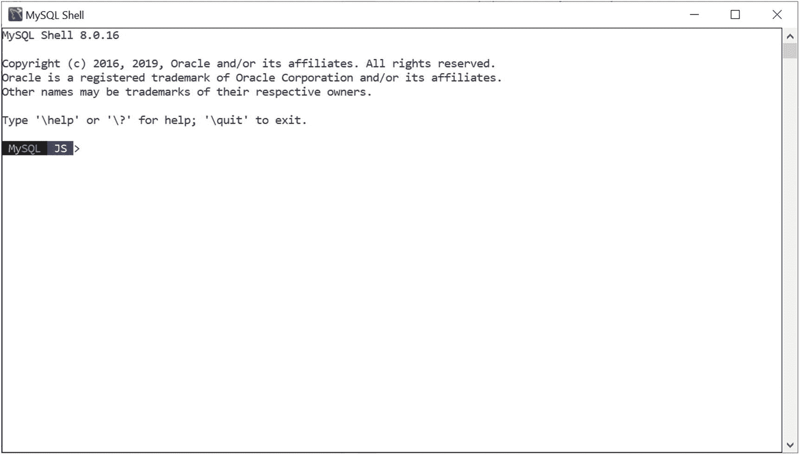
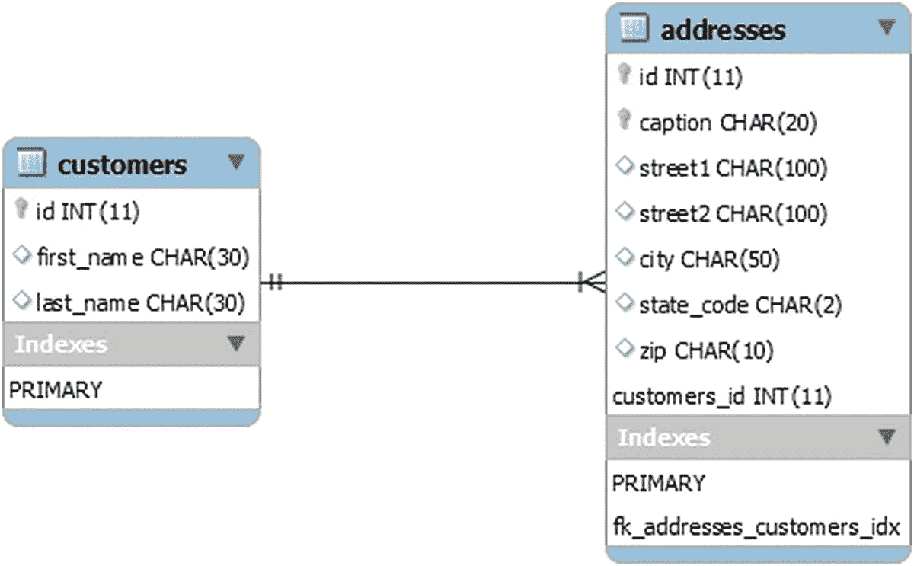
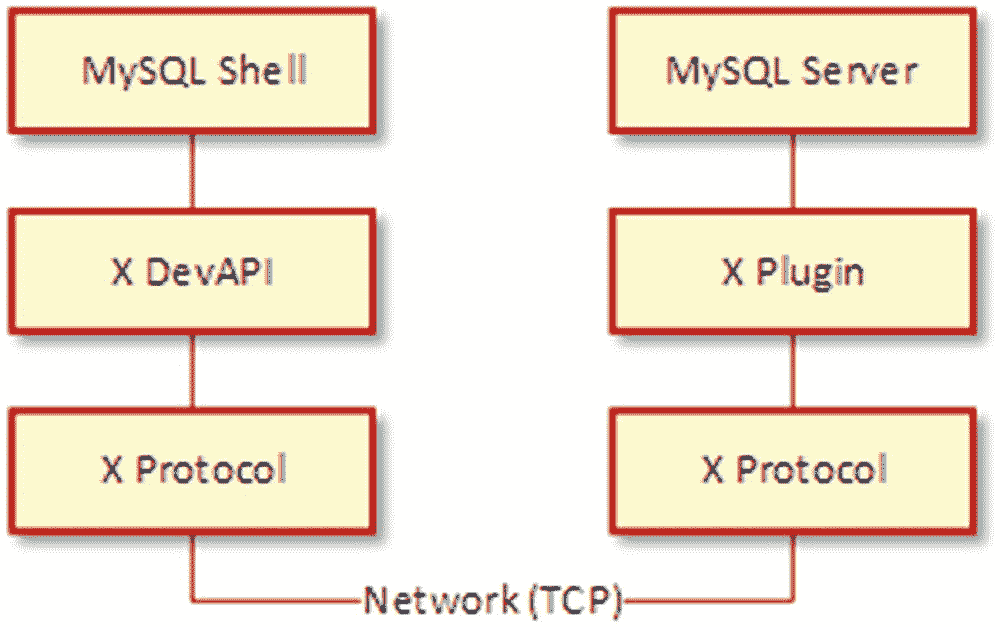

# 一、MySQL Shell 简介

甲骨文继续履行其承诺，让 MySQL 变得更好。这使得 MySQL 工程部门能够在每个新版本中达到更高和更远的目标。最新版本 MySQL 8 包含了比其他版本更多的新特性和增强功能。因此，MySQL 仍然是世界上最受欢迎的开源数据库系统。

为了充分理解 MySQL 8 版本的重要性，让我们考虑一下，虽然 MySQL 过去的版本一直在不断改进产品，但这些版本往往包含一些新功能，重点是改进更受欢迎的功能。因此，以前的版本在很大程度上是渐进的，而不是革命性的。

MySQL 8 在几个方面打破了这一传统。最值得注意的可能是版本号本身。以前的版本是 5。x 范围的数字，但 Oracle 选择使用 8。x 系列标志着技术复杂性的革命性飞跃，并最终脱离了 5 的持续发展。持续了超过 14 年的 x 代码库。

MySQL 8.0 的革命性变化包括致力于高可用性、更高可靠性和复杂性的功能，以及全新的用户体验和革命性的数据处理方式。这本书研究了实现新用户体验的最重要的附加功能之一 MySQL Shell。在这一章中，我们将简要介绍 MySQL 8 的最新特性。但是首先，让我们更好地了解一下 MySQL Shell。

## 了解 MySQL Shell

许多 MySQL 用户的一个痛点是缺省客户机实用程序的局限性。几十年来，客户机的选择(因为没有其他选择)一直是名为`mysql`的 MySQL 客户机实用程序，它包含在服务器版本中。

也许旧的 mysql 客户端(MySQL)最大的缺失就是没有任何形式的脚本功能。有人可能会说，用旧客户机来处理一批 SQL 命令，编写 SQL 命令脚本是可能的。其他人可能会指出，MySQL 支持的 SQL 语言对编写存储例程(过程和函数)的支持有限。然而，对于那些想要创建和使用脚本语言来管理他们的数据库(和服务器)的人来说，已经有了外部工具选项，包括 MySQL Workbench 和 MySQL Utilities(现在已经退休了)，但是没有专门用于合并脚本语言的工具。

### 注意

MySQL Workbench 是一个 GUI 工具，设计为基于工作站的工具，具有许多功能，包括设计和建模、开发、数据库迁移等等。参见 [`http://dev.mysql.com/doc/workbench/en/`](http://dev.mysql.com/doc/workbench/en/) 了解更多关于 MySQL Workbench 的信息。

除了这些产品之外，向 MySQL 客户端添加脚本语言的请求还没有得到回应。也就是说，直到现在。

### 注意

我使用术语“shell”来指代 MySQL Shell 支持的特性或对象。我用“MySQL Shell”来指代产品本身。

### 概观

MySQL Shell 是 MySQL 的下一代命令行客户端。您不仅可以执行传统的 SQL 命令，还可以使用包括 Python 和 JavaScript 在内的几种编程语言之一与服务器进行交互。此外，如果您还安装了 X 插件，那么您可以使用 MySQL Shell 来处理传统的关系数据以及 JavaScript Object Notation (JSON)文档。这有多酷？

如果你在想，“是时候了！”Oracle 开发了新的 MySQL 客户端，你并不孤单。MySQL Shell 代表了一种大胆的与 MySQL 交互的新方式。有许多选项，甚至有不同的方式来配置和使用 shell。虽然我们将在接下来的章节中看到更多关于 shell 的内容，但是让我们快速地看一下 shell。图 [1-1](#Fig1) 显示了新 MySQL Shell 的快照。请注意，它提供了一个非常熟悉的界面，尽管更加现代，功能也更加强大。还要注意新的提示。它不仅更加丰富多彩，还提供了一个快速检查，看看你在什么模式。这里显示的是 JS，是 JavaScript 模式(默认模式 <sup>[1](#Fn1)</sup> )。您也可以根据自己的喜好修改提示。



图 1-1

MySQL Shell

### 小费

如果你想密切关注 MySQL Shell 版本，请加入书签 [`https://dev.mysql.com/downloads/shell/`](https://dev.mysql.com/downloads/shell/) ，它包含了流行平台的文档和下载链接。

如果您已经了解到 MySQL Shell 使用全新的机制来访问数据，并且您必须学习所有新的命令，那么您可能已经被引入歧途。虽然 MySQL Shell 确实支持使用脚本语言访问数据的新的应用编程接口(API ),从这个意义上说，还需要学习新的命令(方法),但是 MySQL Shell 继续支持对数据的 SQL 接口。事实上，您所知道的所有 SQL 命令都是完全受支持的。事实上，MySQL Shell 旨在成为您使用离散 SQL 命令的主要工具。

让我们看一个使用 MySQL Shell 和 SQL 命令的例子。图 [1-2](#Fig2) 显示了一组典型的 SQL 命令，用于创建数据库、插入数据以及选择一些数据进行查看。


图 1-2

*使用 MySQL Shell 与* *SQL 命令*

在这里，我们看到几件事正在发生。首先，我们使用`\sql`命令将 shell 的模式从 JavaScript 更改为 SQL。然后，我们使用`\connect`命令连接到服务器。请注意，该命令请求用户密码，如果这是第一次使用该连接，您可以让 shell 为您保存密码(一个很好的安全特性)。从这里，我们可以看到几个运行 SQL 命令的普通例子。清单 [1-1](#PC1) 显示了本例中使用的命令。

```py
\sql
\connect root@localhost:3306
CREATE DATABASE testdb;
CREATE TABLE testdb.t1 (a int auto_increment not null primary key, b timestamp, c char(20));
INSERT INTO testdb.t1 (c) VALUES ('one'), ('two'), ('three');
SELECT * FROM testdb.t1 WHERE c = 'two';

Listing 1-1Sample Commands (Getting Started with MySQL Shell)

```

现在我们已经了解了 MySQL Shell，让我们看看它令人印象深刻的特性列表。你可能会发现有几个可以让你的 MySQL 体验更好。

### 特征

MySQL Shell 有许多特性，包括支持传统的 SQL 命令处理、脚本原型，甚至支持定制 Shell。下面列出了 shell 的一些主要特性。大多数功能都可以通过命令行选项或特殊的 shell 命令来控制。这个列表是为了让您对 shell 中的特性有一个大致的了解，并且没有给出示例。在后面的章节中，我们将深入探讨一些更重要的特性。

### 小费

这里的一些术语可能看起来很陌生。在这一点上理解这些并不重要，但是我们将在后面的章节中发现每一个。

*   *自动完成*:shell 允许自动完成 SQL 模式下的关键字以及 JavaScript 或 Python 中的所有主要类和方法。只需键入几个字符，然后按`TAB`键自动完成关键字。当学习新的 API 并试图回忆一个很少使用的 SQL 关键字或 MySQL 函数的拼写时，这可能是一个非常方便的工具。

*   *API*:Shell 支持 JavaScript 和 Python，与以下应用编程接口交互:
    *   X DevAPI :这个 API 允许您使用关系数据或文档存储(JSON)与 MySQL 服务器进行交互。

    *   *AdminAPI* :这个 API 允许您与 MySQL InnoDB 集群进行交互，以设置、配置和维护高可用性集群。

*   *批处理代码执行*:如果您想在没有交互会话的情况下运行您的脚本，您可以使用 shell 以批处理模式运行脚本——就像旧客户端一样。

*   *命令历史*:shell 保存您输入的命令，允许您使用上下箭头键调用它们。

*   *定制提示*:您也可以通过使用特殊格式更新名为`~/.mysqlsh/prompt.json`的配置文件或定义名为`MYSQLSH_PROMPT_THEME`的环境变量来更改默认提示。

*   *全局变量*:shell 提供了一些全局变量，您可以在使用交互模式时访问这些变量。其中包括以下内容。我们将在第三章[中学习更多关于会话和变量的知识。](03.html)
    *   `session`:全局会话对象(如果已建立)

    *   `db`:通过连接建立的模式

    *   `dba`:用于使用 InnoDB 集群的 AdminAPI 对象

    *   `shell`:使用 Shell 的通用功能

    *   `util`:与服务器一起工作的实用功能

*   *JSON 导入*:键入 JavaScript 对象符号(JSON)可能会有点繁琐。shell 允许用户将 JSON 文档导入到 shell 中，这使得使用 JSON 变得更加容易。交互式命令和 API 函数中都启用了导入功能。

*   *交互式代码执行*:使用 shell 的默认模式是交互式模式，它的工作方式类似于旧的 MySQL 客户端，在这里输入命令并获得响应。

*   *日志*:你可以为你的会话创建一个日志，用于以后的分析或者保存消息的记录。您可以使用`--log-level`选项设置详细程度，范围从 1(无记录)到 8(最大调试)。

*   *多行支持*:shell 允许你输入命令，并将它们缓存起来作为单个命令执行。

*   *输出格式*:Shell 支持三种格式选项；table ( `--table`)，这是您在旧客户端中习惯使用的传统网格格式，tab(`--tabbed`)，它使用制表符分隔显示信息并用于批处理执行，以及 JSON ( `--json`)，它以更易于阅读的方式格式化 JSON 文档。这些是您在启动 shell 时指定的命令行选项。

*   *脚本语言*:shell 支持 JavaScript 和 Python，尽管你一次只能使用一种。

### 注意

在本书中，我们将重点介绍 Python，但使用 JavaScript 的 API 是相同的。唯一的区别是类和方法是如何拼写的。这是因为 JavaScript 对大写和多字标识符使用了不同的约定。精明的 JavaScript 开发人员翻译本书中的例子不会有问题。

*   *会话*:会话本质上是到服务器的连接。shell 允许您处理会话，包括在需要时存储和检索会话。

*   *启动脚本*:您可以定义一个脚本在 shell 启动时执行。您可以用 JavaScript 或 Python 编写脚本。

*   升级检查器(Upgrade Checker): shell 还包括一个方便的升级检查工具，可以让你检查给定的服务器，看看它是否可以升级到 MySQL 8。对于那些将现有 MySQL 服务器迁移到 MySQL 8 的人来说，这是一个真正的时间节省器。

*   *用户凭证“秘密”存储*:也许最节省时间的特性是能够将用户密码保存到平台或特定平台存储中常见的“秘密存储”或加密凭证存储机制中。shell 支持 MySQL 登录路径、MacOS keychain 和 Windows API。默认情况下，此功能是打开的，但可以根据用户凭据禁用(如果不想存储密码，可以不存储)。如果您使用单个系统或跨多个系统的受保护帐户，这将通过从 secret store 中取回该用户的密码来节省您的时间。我们将在第三章[中看到更多关于这个特性的内容。](03.html)

MySQL Shell 的最新版本(8.0.16)包括许多错误修复和一些新功能，肯定会受到欢迎并经常使用。其中包括以下内容。

*   *用户自定义报告*:您现在可以设置报告来显示来自服务器的实时信息，如状态和性能数据。如果您想监控您的服务器元数据和状态变量，请参见 [`https://dev.mysql.com/doc/mysql-shell/8.0/en/mysql-shell-reporting.html`](https://dev.mysql.com/doc/mysql-shell/8.0/en/mysql-shell-reporting.html) 了解关于此新功能的更多信息。

*   *SQL 模式执行*:如果你正在使用 JavaScript 模式的 Python 中的 shell，并且想要运行 SQL 命令，那么`\sql` shell 命令现在允许你指定一个要运行的 SQL 命令。例如，您可以执行`\sql SHOW DATABASES`,而不必切换到 SQL 模式(或者反过来)。

*   *AdminAPI* :现在在`status()`、`describe()`和`rescan()`方法中报告关于服务器版本的信息。

MySQL Shell 并不是 MySQL 8 中唯一的新特性。事实上，MySQL 的最新版本中有很多值得喜欢和探索的地方。事实上，有一些已经改进的特性，像 MySQL Shell 这样引入的新特性，以及一些将改变您使用 MySQL 方式的非常独特的特性。其中一些特性将 MySQL Shell 作为一个关键组件。因为我们计划探索如何在 shell 中使用这些特性，所以让我们花点时间了解一下 MySQL 8 中的新特性。

## 旧功能再创新

这个类别包括那些在 MySQL 早期版本中作为独立下载或插件引入的特性。有些被认为是实验性的，即使它们可能是在正式发布(g a)期间引入的(该特性可能不是正式发布的)。虽然将来可能会以这种方式引入一些功能，但目前所有这些功能都是 MySQL 8 GA 的一部分，而且形式更加精炼。其中包括以下内容。这里没有列出的是该版本中包含的数百个小到中等的增强和缺陷修复。

*   JSON 数据类型:对数据最具革命性的改变包括加入了 JSON 数据类型，它允许使用 MySQL 作为真正的 NoSQL 数据库系统。

*   X Plugin、X Protocol 和 X DevAPI :服务器现在支持新的客户端协议，所有新的 API 都建立在该协议之上。

*   *InnoDB 改进*:除了作为默认的存储引擎，InnoDB 已经成为一个更加健壮的企业级原子性、一致性、隔离性和持久性(ACID)兼容的存储引擎。

### JSON 数据类型

从 MySQL 版本 5.7.8 开始，MySQL 支持 JSON 数据类型。JSON 数据类型可用于在关系表中存储 JSON 文档。因此，您的表中可以有 JSON 列！在一个表中可以有多个 JSON 列(字段)。

JSON 数据类型也是将 MySQL 用作文档存储的一个关键组件。简而言之，JSON 是一种用于交换数据的标记语言。它不仅可读，还可以直接在应用中使用，在其他应用、服务器甚至 MySQL 之间存储和检索数据。

### 注意

下面是对 JSON 数据类型和 JSON 文档的简要概述。我们将在第 [6](06.html) 章看到对 JSON 的深入研究。

事实上，程序员对 JSON 很熟悉，因为它类似于其他标记方案。JSON 也非常简单，因为它只支持两种类型的结构:(1)包含(name，value)对的集合，(2)有序列表(或数组)。当然，您也可以混合和匹配一个对象中的结构。当我们创建一个 JSON 对象时，我们称之为 JSON 文档。 <sup>[2](#Fn2)</sup>

与 MySQL 中的普通数据类型不同，JSON 数据类型允许您将 JSON 格式的对象(文档)存储在一行的一列中。虽然您可以对文本或 BLOB 字段这样做(很多人都这样做)，但是 MySQL 中没有内置与文本和 BLOB 字段中的数据进行交互的功能。因此，数据的操作在很大程度上取决于应用。此外，数据的结构通常是每行都有相同的列“格式”。在文本和 BLOB 字段中存储数据并不新鲜，很多人已经这样做了很多年。

使用 JSON 数据类型，我们不必编写任何专门的代码来存储和检索数据。这是因为 JSON 文档很好理解，并且许多编程环境和脚本语言本身就支持它。JSON 允许你存储当时的数据。与典型的数据库表不同，我们不必担心默认值(它们是不允许的)，也不必担心我们是否有足够的列，甚至是主/从关系来将所有数据规范化并存储在一个漂亮、整洁、结构化的包中。

让我们先来看看 JSON 数据类型。假设您想在数据库中存储地址，但是您不能保证您存储的所有项目都有一个地址，有些可能有多个地址。更糟糕的可能是你掌握的地址信息不一致。也就是说，地址的形式和所提供的数据各不相同。例如，您可能有一行、两行甚至三行“街道”地址，但其他地址可能只有一行带有邮政信箱号码。或者，有些地址包含五位数字的邮政编码，而有些地址包含九位数字的邮政编码，甚至有些地址可能包含邮政编码(如加拿大邮政)。

在这种情况下，您可以将地址字段添加到现有的表中(但这并不能解决行可能有多个地址的情况)，或者更好的方法是创建一个关系表来存储地址并将数据硬塞进字段中。对于不符合的地址，您可能会被迫使用缺省值，甚至为缺失的项目存储 NULL。尽管所有这些都是可能的，但它会在关系数据库中增加一层复杂性，这可能意味着需要额外的代码来处理丢失的数据。

图 [1-3](#Fig3) 显示了一个典型的关系数据库的模式，它包含了作为一个单独的表存储的地址。这段摘录虽然非常简洁和不完整，但展示了数据库设计人员在处理数据(如地址)时采用的典型方法，这些数据可能因项目而异。



图 1-3

示例关系数据库摘录

这种方法没有错，但是为了理解 JSON 数据类型给我们带来的优势，让我们看一组典型的 SQL 语句来创建示例并插入一些数据。清单 [1-2](#PC2) 显示了用于创建表格的示例 SQL 语句。我包含了切换到 SQL 模式并连接到服务器的特定于 shell 的命令。

```py
DROP DATABASE IF EXISTS my dB;
CREATE DATABASE mydb;
CREATE TABLE mydb.customers (id int auto_increment NOT NULL PRIMARY KEY, first_name char(30), last_name char(30));
CREATE TABLE mydb.addresses (id int NOT NULL, caption char(20) NOT NULL, street1 char(100), street2 char(100), city char(50), state_code char(2), zip char(10), PRIMARY KEY(id, caption));
INSERT INTO mydb.customers VALUES (NULL, 'Sam', 'Blastone');
SELECT LAST_INSERT_ID() INTO @last_id;
INSERT INTO mydb.addresses VALUES (@last_id, 'HOME', '9001 Oak Row Road', Null, 'LaPlata', 'MD', '33532');
INSERT INTO mydb.addresses VALUES (@last_id, 'WORK', '123 Main Street', Null, 'White Plains', 'MD', '33560');
SELECT first_name, last_name, addresses.∗ FROM mydb.customers JOIN mydb.addresses ON customers.id = addresses.id \G

Listing 1-2Sample Relational Database SQL (no JSON)

```

到目前为止，添加的地址有些正常。但是考虑到我们想要添加另一个地址但是这个地址不完整的可能性。例如，我们只知道这个客户的仓库位置所在的城市和州，我们了解到客户在那里花费了一些时间。我们希望存储这些信息，这样我们就可以知道客户在该地区的存在，但我们可能不知道任何更多的细节。如果我们继续使用这个关系示例，我们将添加几个空字段(这是可以的)。当我们在插入不完整的地址后运行`SELECT`查询时，我们得到了这个信息。

```py
> SELECT first_name, last_name, addresses.∗ FROM mydb.customers JOIN mydb.addresses ON customers.id = addresses.id \G
...
∗∗∗∗∗∗∗∗∗∗∗∗∗∗∗∗∗∗∗∗∗∗∗∗∗∗∗ 2\. row ∗∗∗∗∗∗∗∗∗∗∗∗∗∗∗∗∗∗∗∗∗∗∗∗∗∗∗
first_name: Sam
 last_name: Blastone
        id: 1
   caption: WAREHOUSE
   street1: NULL
   street2: NULL
      city: Carson Creek
state_code: CO
       zip: NULL

```

我们最终在一个表(customers)中得到一行，在另一个表(addresses)中得到三行，但是有几个空字段。现在，让我们看看这个例子，只是这次我们将使用 JSON 数据类型来存储地址。

在下一个示例中，我们用 customers 表中分配了 JSON 数据类型的一个列替换了第二个表(address detail 表)。除了明显地删除第二个表和查询数据必须遍历的关系之外，我们还获得了只存储我们需要的内容的能力。清单 [1-3](#PC4) 显示了构建这个版本的修改后的 SQL 语句。

```py
DROP DATABASE IF EXISTS mydb_json;
CREATE DATABASE mydb_json;
CREATE TABLE mydb_json.customers (id int auto_increment NOT NULL PRIMARY KEY, first_name char(30), last_name char(30), addresses JSON);
INSERT INTO mydb_json.customers VALUES (NULL, 'Sam', 'Blastone', '{"addresses":[
    {"caption":"HOME","street1":"9001 Oak Row Road","city":"LaPlata","state_code":"MD","zip":"33532"},
    {"caption":"WORK","street1":"123 Main Street","city":"White Plains","state_code":"MD","zip":"33560"},
    {"caption":"WAREHOUSE","city":"Carson Creek","state_code":"CO"}
]}');
SELECT first_name, last_name, JSON_PRETTY(addresses) FROM mydb_json.customers \G

Listing 1-3Sample Relational Database SQL (JSON)

```

在这里，我们看到定义表的 SQL 缩短了很多。要使用 JSON 数据类型，我们只需指定`JSON`,在这里我们可以使用任何其他数据类型。然而，输入带有 JSON 值的数据需要更多的输入，但是正如您所看到的，它允许我们使用表达式，用一种容易理解的语言描述代码。查询这些数据会将 JSON 字符串作为单个字符串返回，但是我们可以使用 MySQL JSON 函数之一来帮助提高输出的可读性。为此，我们使用清单 [1-4](#PC5) 中所示的`JSON_PRETTY()`函数，它在从服务器返回的字符串中放置换行符和空格。

```py
> SELECT first_name, last_name, JSON_PRETTY(addresses) FROM mydb_json.customers \G
∗∗∗∗∗∗∗∗∗∗∗∗∗∗∗∗∗∗∗∗∗∗∗∗∗∗∗ 1\. row ∗∗∗∗∗∗∗∗∗∗∗∗∗∗∗∗∗∗∗∗∗∗∗∗∗∗∗
            first_name: Sam
             last_name: Blastone
JSON_PRETTY(addresses): {
  "addresses": [
    {
      "zip": "33532",
      "city": "LaPlata",
      "caption": "HOME",
      "street1": "9001 Oak Row Road",
      "state_code": "MD"
    },
    {
      "zip": "33560",
      "city": "White Plains",
      "caption": "WORK",
      "street1": "123 Main Street",
      "state_code": "MD"
    },
    {
      "city": "Carson Creek",
      "caption": "WAREHOUSE",
      "state_code": "CO"
    }
  ]
}
1 row in set (0.0036 sec)

Listing 1-4Querying Rows with JSON Data

```

注意，我们现在只有一个表，地址已经“折叠”到 JSON 列中，每一行都存储地址数组。并且，只存储已知的数据。因此，对于仓库地址，我们只存储城市和州。虽然在 shell 输出中不容易阅读(稍后我们将看到一些提高输出格式可读性的方法)，但我们仍然可以很容易地看到数据。而且，在我们的应用中使用时，接收 JSON 将比检查每一列的数据容易得多。我们将在第 [6](06.html) 章中了解更多。

正如我们所发现的，JSON 数据类型使得我们的数据存储更加灵活。正如我们将在第 [6](06.html) 章中发现的那样，我们可以通过 X 插件、X 协议和 X DevAPI，借助内置于 MySQL 和 MySQL Shell 中的支持，使用文档存储将我们所有的数据存储为 JSON 文档，从而进一步发展这个概念。事实上，现在让我们通过研究新的 X 插件和 X 协议来发现是什么让 shell 变得强大。

### X 插件、X 协议和 X DevAPI

MySQL 引入了新的协议和 API 来处理 JSON 文档。除了支持 JSON 数据类型，我们还有三种以简单名称“X”为前缀的技术:X 插件、X 协议和 X DevAPI。X 插件是一个启用 X 协议的插件。X 协议被设计成使用 X DevAPI 与服务器通信。X DevAPI 是一个应用编程接口，它允许您为 MySQL 开发 NoSQL 解决方案，并将 MySQL 用作文档存储。我们将在后面的小节中了解更多关于文档存储的内容。

您可能想知道 shell 和插件是如何与服务器交互的。图 [1-4](#Fig4) 显示了组件是如何“堆叠”的。



图 1-4

x 协议栈

注意，我们有一个允许使用 X DevAPI 的 shell，它通过 X 插件与服务器进行通信。因此，X 插件是一种使能技术，真正的力量是 X 协议和 X DevAPI。

现在我们已经了解了将 MySQL 用作文档存储的技术，让我们看看 InnoDB 存储引擎在最近的版本中有什么变化。

### InnoDB 改进

自 MySQL 5.6 以来，InnoDB 一直是 MySQL 的旗舰存储引擎(也是默认引擎)。Oracle 已经慢慢脱离了多存储引擎模型，专注于现代数据库服务器应该做的事情—支持事务存储机制。InnoDB 是满足这一需求的答案。

### 什么是存储引擎？

存储引擎是一种以各种方式存储数据的机制。例如，有一种存储引擎允许您与逗号分隔值(文本)文件(CSV)进行交互，另一种为写日志文件(归档)进行了优化，一种只在内存中存储数据(内存)，甚至还有一种根本不存储任何东西(黑洞)。您可以通过使用 ENGINE = table 选项将它们用于您的表。除了 InnoDB，MySQL 服务器还附带了 Archive、Blackhole、CSV、Memory 和 MyISAM 存储引擎。InnoDB 存储引擎是唯一支持事务的引擎。有关其他存储引擎的更多信息，包括每个引擎的功能及其使用方法，请参见在线参考手册中的“备用存储引擎”一节。

在早期，InnoDB 是一家独立的公司，因此它是一款独立的产品，既不是 MySQL 的一部分，也不属于 MySQL AB(MySQL 的最初所有者，现在完全归 Oracle 所有)。最终，Oracle 同时拥有了 InnoDB 和 MySQL，因此将两者结合起来是有意义的，因为它们具有相互包容的目标。虽然仍然存在一个独立的 InnoDB 工程团队，但他们已经与核心服务器开发团队完全集成。

这种紧密的集成带来了 InnoDB 的许多改进，包括许多性能增强，甚至支持微调等等。这一点在 InnoDB 不断改进的过程中显而易见，尤其是 MySQL 8 中的 InnoDB。

虽然大多数改进都相当微妙，从某种意义上说，你不会注意到它们(除了通过更好的性能和可靠性，这是不可轻视的)，但大多数都显示出致力于使 InnoDB 成为最佳的事务存储机制，并通过扩展 MySQL 成为强大的事务数据库系统。

最显著的改进包括性能和稳定性。同样，对于较小的数据库，您可能看不到太多的差异，但是较大的数据库和企业级系统将会看到显著的改进。例如，崩溃恢复和日志记录得到了相当大的改进，使得恢复更快，正常关机和启动也更快。

类似地，死锁检测、临时表、自动增量甚至 Memcached 支持方面的改进表明了 Oracle 想尽一切办法纠正缺陷和改进 InnoDB 的愿望。虽然这个列表似乎集中在小的改进上，但是其中一些对于寻求帮助调优和规划数据库服务器安装的系统管理员来说非常重要。

### 小费

如果您想了解更多关于这些改进的信息或查看所有最新变化的列表，请参见在线 MySQL 8 参考手册( [`http://downloads.mysql.com/docs/refman-8.0-en.pdf`](http://downloads.mysql.com/docs/refman-8.0-en.pdf) )。

下一节将描述 MySQL 8 新增的和独有的特性。

## 新功能

除了那些在 5.7 服务器版本中开发的特性之外，还有一些 MySQL 8 独有的特性。它们目前还没有(甚至不可能被合并到)旧版本中。这部分是因为服务器代码库为了适应新特性而做了大量的修改。MySQL 8.0 中的新特性包括:

*   *数据字典*:系统中所有对象的事务性元数据存储机制

*   *账户管理*:用户、密码、权限管理的重大改进

*   *删除的选项、变量和特性*:希望从旧版本升级的用户应该查看新版本中有所变化的较小细节，例如删除的选项、变量和特性

除了那些在 5.7 服务器版本中开发的特性之外，还有一些 MySQL 8 独有的特性。事实上，它们目前还没有(甚至不可能被合并到)旧版本中。这部分是因为服务器代码库为了适应新特性而做了大量的修改。MySQL 8.0 中的新特性包括新的数据字典和新的账户管理系统。

### 数据字典

如果您曾经使用 MySQL 试图获取数据库中包含的对象的信息，或者发现那里有什么对象，搜索具有特定名称前缀的对象，或者试图发现存在什么索引，那么您很可能必须访问`INFORMATION_SCHEMA`中的表和视图，或者必须导航的特殊的`mysql`数据库。也许最糟糕的是一些表格的定义被存储在一个特殊的结构化文件中，叫做`.frm` <sup>[3](#Fn3)</sup> (表单)文件。例如，`database1`中一个名为`table1`的表格有一个名为`/data/database1/table1.frm`的`.frm`文件。

### 注意

`INFORMATION_SCHEMA`和`mysql`数据库仍然可见，这些视图和表格中的信息仍然可以在数据字典之前以类似的方式使用，但是缺少数据字典中的附加信息。

这种组合要求数据库管理员通过了解数据所在的位置来学习如何查找数据。根据您要查找的内容，您可能需要查询某个数据库，或者在可怕的情况下，破译`.frm`文件。更重要的是，由于数据是在非事务性的表(和元数据文件)中，所以这些机制不是事务性的，并且，通过扩展，不是崩溃安全的。

新的数据字典改变了这一切，使我们可以创建一个单一的事务性(与 InnoDB 相同的 ACID 支持)存储库来存储系统中对象的所有元数据。所有基于文件的元数据已经被移动到数据字典中，包括`.frm`文件、分区、触发器和其他选项文件(例如`.par`、`.trn`、`.trg`、`.isl`和`.opt`)。

但是，您不会在数据库列表中看到数据字典(例如，`SHOW DATABASES`)。数据字典表是不可见的，不能直接访问。您不会很容易找到数据字典表(尽管如果您足够努力的话是有可能的)。

这样做主要是为了使数据字典崩溃安全，并且您不必进行管理。幸运的是，您可以通过`INFORMATION_SCHEMA`数据库甚至是`SHOW`命令来访问存储在数据字典中的信息。mysql 数据库仍然存在，但它主要包含额外的信息，如时区、帮助和类似的非重要信息。事实上，`INFORMATION_SCHEMA`和`SHOW`命令使用数据字典来表示信息。

那么，看不到数据字典怎么用呢？简单地说，`INFORMATION_SCHEMA`视图从数据字典中获取信息。因此，您可以继续使用您习惯使用的相同查询，但是在这种情况下，数据更加可靠和具有事务性。酷！

有关数据字典的更多信息，包括存储了什么以及它如何与`INFORMATION_SCHEMA`视图交互的细节，请参见在线 MySQL 参考手册( [`https://dev.mysql.com/doc/refman/8.0/en/`](https://dev.mysql.com/doc/refman/8.0/en/) )中的“MySQL 数据字典”一节。

添加数据字典最终使得许多人一段时间以来一直想实现的几个特性成为可能。最新的一项是对账户管理的重大改革。

### 账户管理

MySQL 数据库管理员(尤其是那些使用企业级系统的管理员)的另一个棘手问题是需要为一组用户分配相同的权限并管理密码。MySQL 8 在帐户管理和 MySQL 中的特权系统方面提供了许多改进。下面列出了最重要的改进。

*   *角色*:管理员可以将授权语句分配给一个角色，该角色可以分配给多个用户。

*   *用户帐户限制*:管理员可以设置资源限制，帮助限制对关键数据的访问。

*   *密码管理*:管理员可以设置密码形成和失效的条件。

*   *用户账户锁定*:管理员可以暂时锁定用户账户，禁止其访问数据。

### 注意

MySQL 8 禁止使用`GRANT`语句创建用户帐户。您必须首先使用`CREATE USER`语句显式创建用户。

#### 角色

一个非常常见的场景是必须创建一组具有相同权限的用户。过去，您必须保存或存档`GRANT`语句，并为每个用户重复这些语句。也就是说，您可以为两个或更多用户重用`GRANT`语句。幸运的是，随着数据字典的出现，MySQL 中的支持角色在 MySQL 8 中已经成为现实！

可以创建、删除角色，授予或撤销权限。我们还可以向用户授予角色或从用户处撤销角色。角色最终使得管理 MySQL 上的用户账户变得更加简单。

#### 用户帐户限制

企业系统的另一个管理问题包括需要在特定时间段内进一步限制对用户帐户的访问，或者甚至限制帐户发出特定数量的语句。

在 MySQL 8 中，管理员可以为用户帐户设置每小时查询数、每小时事务数、每小时连接数，甚至每小时同时连接数的限制。这允许管理员为安全目标、工作效率限制等设置限制。

#### 密码管理

帐户管理功能中最受欢迎的变化之一是设置密码限制和标准的能力。在当今充满挑战的安全环境中，我们必须确保我们的密码不会被轻易破解，为此，我们需要控制密码的长度以及包含多少小写或大写字符或特殊字符。

幸运的是，MySQL 8 有这些功能，你可以设置密码有效期，旧密码限制的重用，密码的验证，当然还有密码强度。这些功能和前面提到的两个功能帮助推动 MySQL 8 在更好的安全性方面向前迈出了一大步。

#### 用户帐户锁定

有时，您必须暂时限制对一个或多个用户帐户的访问。这可能是由于维护计划、诊断，甚至是员工的临时休假。不管是什么原因，MySQL 在过去要么需要更改密码(并且不告诉用户——但这并不阻止帐户被使用),要么删除帐户并在以后重新创建它。如果您的用户帐户被授予了复杂的权限(或几个角色)，这是有问题的。

MySQL 8 包含一个特性，支持使用`ACCOUNT LOCK`子句锁定帐户和使用`ACCOUNT UNLOCK`子句解锁帐户来锁定和解锁用户帐户。您可以在`CREATE USER`语句或`ALTER USER`语句中使用这些子句。

帐户管理功能还有许多小的改进。要了解更多有关变更的信息，请参阅在线参考手册中的“用户帐户管理”一节( [`https://dev.mysql.com/doc/refman/8.0/en/`](https://dev.mysql.com/doc/refman/8.0/en/) )。

### 删除了选项、变量和功能

如果您阅读了 MySQL 8 的发行说明，您可能会注意到 MySQL 8 对启动选项、变量等进行了许多小的更改。可以在 [`https://dev.mysql.com/doc/relnotes/mysql/8.0/en/`](https://dev.mysql.com/doc/relnotes/mysql/8.0/en/) 找到 MySQL 8 每个版本所有变更的完整列表。

幸运的是，大多数变化都与支持最新功能和删除旧的和过时的设置有关。所以，大多数不会对那些想开始使用 MySQL 的人有太大影响。但是，从旧版本升级时，有几个问题可能不太重要。

请记住，在 MySQL 5.7(及更早版本)中，许多选项、变量和特性都被标记为不推荐使用。它们现在在 MySQL 8 中被正式移除。如果您使用 MySQL 已经有一段时间了，那么您很可能已经为这些变化做好了准备。

然而，有一些变化可能会影响一些想升级到 MySQL 8 的人。其中包括以下内容。

*   删除了`--bootstrap`选项。它用于控制服务器如何启动，通常用于创建 MySQL 特权表，而无需启动完整的 MySQL 服务器。

*   `--innodb_file_format_∗`选项已更改。这些用于配置 InnoDB 存储引擎的文件格式。

*   删除了`--partition`和`--skip`分区选项。它们用于控制 MySQL 服务器中用户定义的分区支持。

*   作为数据字典功能的一部分，`.frm`和相关元数据文件被删除。

*   一些 SSL 选项已经改变，并且引入了新的认证插件(`caching_sha2_password`)来提高安全连接。

*   在最新版本中，许多错误代码都进行了更改，包括删除了几十个鲜为人知的错误代码。如果您的应用使用 MySQL 服务器错误代码，您应该检查文档以确保错误代码没有被更改或删除。

像这样的变化是主要版本的典型特征。在任何情况下，您都应该在计划任何升级时考虑发行说明。像这样的更改可能会导致问题的地方是在您的定制和配置中。例如，如果您已经定义了使用选项和变量或与之交互的调优过程、存储过程、DevOps 或其他机制，您应该仔细检查 MySQL 8 文档中的条目，以确保您可以相应地修改您的工具。

### 小费

参见 [`http://dev.mysql.com/doc/refman/8.0/en/added-deprecated-removed.html`](http://dev.mysql.com/doc/refman/8.0/en/added-deprecated-removed.html) 获取 MySQL 8 中要删除的特性的完整列表。

## 范式转变特征

MySQL 8 中的一些特性对于 MySQL 生态系统来说确实是开创性的。事实上，它们可能会改变人们使用 MySQL 的方式，并扩展 MySQL 日益增长的用例列表。这些包括以下范式转变特征。

*   *文档存储*:一种新的结构化存储机制，它将改变您可以存储的内容，以及您与 MySQL 交互的方式，从而为数据可能发生变化的应用存储数据，使您的应用无需重新构建存储层即可适应变化

*   *组复制*:一种新的、强大的自我修复高可用性选项

*   *InnoDB Cluster* :一种新的管理高可用性的方法，建立在组复制的基础上，结合了新的 shell 和 MySQL 路由器，实现了易于设置和维护的高可用性安装

### 文档存储

在讨论 JSON 数据类型时，我们已经了解了一些关于文档存储的知识。MySQL 文档存储将 JSON 存储概念带到了一个新的高度。虽然 JSON 数据类型允许在我们的关系数据库中引入非结构化数据，但是文档存储是真正的 NoSQL 数据存储。

更具体地说，文档存储允许在 MySQL 中以 JSON 文档的形式存储非结构化数据。也就是说，MySQL 现在支持 SQL 和 NoSQL 选项。NoSQL 选项使用我们之前发现的 X 技术，包括 X 协议和 X DevAPI。这些允许您编写直接与 MySQL 接口的应用，而不使用任何 SQL 或关系结构。多酷啊。

### 我知道 SQL，但是 NoSQL 是什么？

如果您曾经使用过关系数据库系统，那么您无疑非常熟悉结构化查询语言(SQL ),在 SQL 中，我们使用特殊的语句(命令)来与数据进行交互。事实上，大多数数据库系统都有自己的 SQL 版本，包括操作数据的命令(DML)以及定义存储数据的对象的命令(DDL ),甚至包括管理服务器的管理命令。

也就是说，您获得结果集，并且必须使用命令来搜索数据，然后将结果转换为内部编程结构，使数据看起来像是一个辅助组件，而不是解决方案的一个组成部分。NoSQL 接口打破了这种模式，它允许您使用 API 来处理数据。更具体地说，您使用编程接口，而不是基于命令的接口。

遗憾的是，NoSQL 可能意味着几件事，这取决于你的观点，包括“非 SQL”，“不仅仅是 SQL”，或者“非关系”。但是它们都是指这样一个事实，即你所使用的机制并没有使用基于命令的接口，而且这个术语的大多数用法都表明你使用的是编程接口。对于 MySQL 8，可以通过 SQL 或 NoSQL 使用 X 协议访问 JSON 文档，通过 X 插件访问 X DevAPI。

MySQL 文档存储库的起源在于几种技术，它们被结合在一起形成了文档存储库。具体来说，Oracle 将键、值机制与新的数据类型、新的编程库和新的访问机制结合起来，创建了现在的文档存储。这不仅允许我们使用带有 NoSQL 接口的 MySQL，还允许我们构建混合解决方案，利用关系数据的稳定性和结构，同时增加 JSON 文档的灵活性。

我们将在第 [6](06.html) 章中了解更多关于文档存储的信息。

### 组复制

如果您使用过 MySQL 复制，那么您无疑非常熟悉如何在构建高可用性解决方案时利用它。事实上，您很可能已经发现了许多使用 MySQL 复制来提高应用可用性的方法。

此外，显而易见的是，您的高可用性需求越多，您的解决方案越扩展(越复杂)，您就越需要采用更好的方法来管理节点丢失、数据完整性和集群的一般维护(复制数据的服务器组，有时称为副本集)。事实上，大多数高可用性解决方案已经超越了基本的主从拓扑结构，演变成由服务器集群组成的层，一些服务器复制一部分数据以获得更快的吞吐量，甚至用于分区存储。所有这些导致许多人发现他们需要更多的 MySQL 复制。Oracle 通过组复制满足了这些需求以及更多需求。

通过组复制，您可以建立一组要在组中使用的服务器，这不仅可以减少服务器之间的事务，还可以实现自动故障转移和容错。此外，组复制还可以与 MySQL 路由器一起使用，以允许您的应用拥有一个与集群隔离的层。当我们研究 InnoDB 集群时，我们将会对路由器有所了解。

组复制和标准复制的一个重要区别是，组中的所有服务器都可以参与更新数据，并自动解决冲突。是的，您不再需要精心设计您的应用来发送写入(更新)到特定的服务器！但是，您可以将组复制配置为只允许一台服务器(称为主服务器)进行更新，其他服务器充当辅助服务器或备份服务器(用于故障转移)。

我们将在第 [8](08.html) 章中了解更多关于组复制的信息。

### InnoDB 集群

另一个新出现的特性叫做 InnoDB 集群。它旨在使高可用性更易于设置、使用和维护。InnoDB Cluster 通过 MySQL Shell 和 AdminAPI、组复制和 MySQL 路由器与 X AdminAPI 协同工作，将高可用性和读取可伸缩性提升到一个新的水平。也就是说，它将 InnoDB 中用于克隆数据的新功能与组复制、MySQL Shell 和 MySQL 路由器相结合，提供了一种设置和管理高可用性的新方法。

### 注意

AdminAPI 是一个特殊的 API，可通过 MySQL Shell 进行配置并与 InnoDB 集群交互。因此，AdminAPI 具有旨在简化 InnoDB 集群工作的特性。

在此使用案例中，群集设置有一个主节点(在标准复制术语中称为主节点)，它是所有写入(更新)的目标。多个辅助服务器(从属服务器)维护数据的副本，这些副本可以被读取，因此能够在不给主服务器增加负担的情况下读取数据，从而实现读取可伸缩性(但是所有服务器都参与协商和协调)。组复制的引入意味着集群是容错的，并且组成员是自动管理的。MySQL 路由器缓存 InnoDB 集群的元数据，并执行到 MySQL 服务器实例的高可用性路由，从而更容易编写应用来与集群进行交互。

您可能想知道这与使用标准复制的读出可伸缩性设置有何不同。从高层次来看，这些解决方案似乎正在解决同一个用例。但是，使用 InnoDB Cluster，您可以从 MySQL shell 创建、部署和配置集群中的服务器，从而提供一个易于管理的完整的高可用性解决方案。也就是说，您可以通过 shell 使用 InnoDB Cluster AdminAPI，使用 JavaScript 或 Python 以编程方式创建和管理 InnoDB 集群。

我们将在第 [10 章](10.html)中了解更多关于 InnoDB 集群的信息。

## 摘要

MySQL 8 有很多新特性。在许多方面，它代表了包括高可用性和 NoSQL 在内的几个领域的重大飞跃。然而，一个宣传较少但非常重要的新特性是新的 MySQL Shell。正如您将在接下来的章节中看到的，新的 Shell 是使所有新特性以无缝方式一起工作的粘合剂。

例如，如果没有 shell，使用 MySQL 文档存储将需要使用第三方编程环境来与 X DevAPI 交互。shell 使得使用新的 API 变得更加容易，因为它不仅提供了一个熟悉的环境(想想旧的客户机)，而且对用户更加友好。

类似地，如果没有实现 AdminAPI 的 shell，使用 InnoDB Cluster 不会比 MySQL 复制所需的手动管理更好。虽然您仍然可以手动配置 MySQL 中的任何高可用性特性，但现在我们有了 shell 来使这一切变得更加容易，除非在某些特定的情况下，否则没有必要这样做。

然而，要真正理解 shell 对 MySQL 8 的重要性和重大贡献，我们必须看到它在每个新特性中的表现。本书的其余部分将介绍使用 MySQL 8 中每个主要特性的简短教程，以及如何使用 shell 实现该特性的示例。其中包括以下内容:

*   对 SQL 数据库使用 shell

*   将 Shell 与文档存储一起使用

*   将 shell 用于组复制

*   将 shell 与 InnoDB 集群一起使用

但是首先，我们将在下一章看到如何安装 MySQL Shell。

<aside class="FootnoteSection" epub:type="footnotes">Footnotes [1](#Fn1_source)

这可能是关于 shell 不支持 SQL 的谣言的来源——默认模式是 JavaScript，但是正如你所看到的，SQL 也是受支持的。我们将在下一章看到如何设置启动模式。

  [2](#Fn2_source)

可以把 JSON 看作是 XML 文档的派生或扩展。也就是说，它们提供了一种灵活的方式来存储可能因条目而异的数据。

  [3](#Fn3_source)

那个。当文件丢失或损坏时，frm 文件已经成为可怕困难的来源。

 </aside>