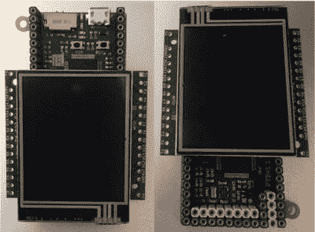
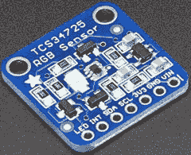
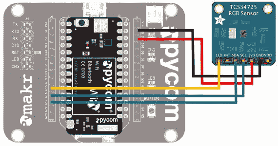
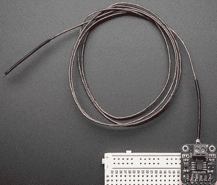
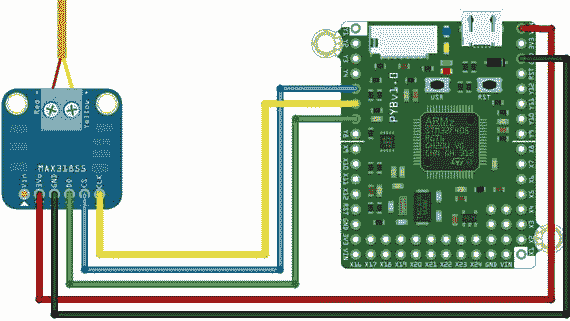

# 6.低级硬件支持

对于所有支持的通用 Python 语言和许多内置函数，MicroPython 固件在最基本的功能上是相同的。然而，MicroPython 固件中的一些库在不同的主板上有一些细微的差别。在某些情况下，可用的库或类比其他的多，或者类的组织方式不同，但大多数都以某种形式实现了相同的核心库。在较低级别的硬件抽象层，情况就不一样了。这仅仅是因为一个主板供应商可能实现不同的硬件。在某些情况下，该板具有其它板上不存在的特性。例如，WiPy 有 WiFi 和蓝牙，而 Pyboard 两者都没有。

在这一章中，我们将看几个 MicroPython 中低级硬件支持的例子。我们将了解特定于主板的库以及一些低级别的专用库，如蓝牙、SPI、I2C 等库。我们还将看到一些简短的代码示例来说明特定于主板的库的功能。其中一些将是简短的代码片段，而不是您可以自己实现的实际项目。

但是，有几个是完整的项目，您可能想探索一下，但是大多数都没有深入的解释，只是作为例子，而不是详细的演练。此外，请记住，它们可能需要特定的分线板和 MicroPython 板以及其他附件来实现。同样，这些只是为了演示的目的。我们将在后面的章节中看到更完整的、循序渐进的例子，包括如何组装硬件。

为了保持简洁，我们将探索 Pyboard 和 WiPy 上不同的板专用库。其他电路板可能会有进一步的不同，但您需要查看供应商文档，以了解它们之间的差异。本章将为你提供发现这些差异的洞察力。我们还将重温使用分线板来演示前几章中讨论的一些库和硬件协议和技术。

让我们先来看一下 Pyboard 和 WiPy 的板专用库。

## 特定于主板的库

我们已经看到 Pyboard 和 WiPy 的机器库中存在差异。但是还有其他的不同:特定于每块板的库，因此只能用于同一块板的另一块板上。这些包括具有用于低级硬件的函数和类的库、特定于电路板的函数和常数等。

第一次使用新的 MicroPython 板时，您应该记住的一件事是，硬件级别的固件很可能与您使用的上一个 MicroPython 板不同。当您查看 BBC micro:bit、Circuit Playground、ESP8266 等板的固件端口时，情况尤其如此。

Tip

请务必查阅您的主板文档，以获得主板专用库的完整功能、用途和更多示例。

### Pyboard

特定于 Pyboard 的库是独一无二的，因为它们包含对特定于供应商的皮肤的支持。正如我们在第 [3](03.html) 章中了解到的，Pyboard 有几种皮肤可供使用。幸运的是，固件中的 Pyboard 特定类直接支持所有的皮肤。这包括音频皮肤、LCD 等。

还有一些特定于 Pyboard 本身的库，如`pyb`库，它支持一些特定于电路板的功能，包括时间、电源、中断等。我们还将简单地浏览一下这个库，然后看看 LCD 皮肤的一个库:`lcd160cr`类。

下面几节将更详细地介绍这些库，并包括一些常见的功能示例。有关每个库的内容和功能的完整详细信息，请参见指定的文档。

#### 标准型

`pyb`库是 Pyboard 相关函数和类的总括库。如果您正在寻找与 Pyboard 或其任何板载硬件相关的函数或库，这个库是您应该首先寻找的地方。下面列出了可用的函数组和类。

*   时间:与时间相关的函数，以毫秒或微秒为单位延迟，并计算事件发生后的毫秒或微秒数(保存的变量)
*   重置:允许您打开调试、启动引导加载程序模式或重置主板的功能
*   中断:启用或禁用中断
*   电源:使主板进入睡眠或深度睡眠模式并改变性能特征的功能(轻踩)
*   杂项:信息、控制 UART、USB 和安装块设备的各种功能

现在让我们看几个简短的例子。前两个展示了复位函数的例子，后两个是杂项函数，最后一个展示了如何使用其中一个类与板上的硬件进行交互。

您可以使用`pyb.hard_reset()`功能执行硬复位，如下所示。如果您在 REPL 控制台中输入此语句，板将以与您按下重置按钮相同的方式重置。如果您需要从严重错误或硬件故障中中止，这可能很方便。

```py
MicroPython v1.9.1-154-g4d55d880 on 2017-07-11; PYBv1.1 with STM32F405RG
Type "help()" for more information.
>>> import pyb
>>> pyb.hard_reset()

```

Note

`hard_reset()`功能可能会导致您的电脑抱怨 SD 卡在没有停止文件系统的情况下被弹出，因此请谨慎使用该功能。

`pyb.bootloader()`功能将板卡置于引导加载模式。回想一下第 3 章[中的](03.html)，要安装固件，必须先关闭主板电源，安装跳线，然后打开主板电源，才能加载固件。通过此功能，您可以从 REPL 控制台执行此操作。也就是说，如果你能拿到 REPL 控制台的话。如果您的主板损坏或固件损坏，您仍然可以执行跳线过程，将主板置于引导加载程序模式以加载新固件。

`pyb.info()`函数被用作信息转储。它打印出大量关于电路板的底层信息，包括硬件地址等等。除非您正在编写低级驱动程序或类似的东西，否则大多数都没有用，但是您可以将 True 传递给该函数，并以 GC 内存布局转储的形式获得更多信息，如下面的摘录所示。如果您对这些数据感到好奇，请参阅在线参考手册中的 Pyboard 硬件规格部分或`forum.micropython.org`论坛。

```py
>>> pyb.info(True)
...
LFS free: 52224 bytes
GC memory layout; from 20003e40:
00000: h=hhhhhBShh==Sh=hhhh==h==Bh=hBh=hBhThShh=h==hh=BhhhBhBh=hh=hBh=h
00400: =hTh==Shhhh==B........h=....................................h===
00800: ====h===========================================================
00c00: ==============..................................................
       (92 lines all free)
18000: ............................

```

`pyb.main(filename)`函数是最有用的函数之一。它设置 boot.py 完成后运行的主脚本的文件名。您可以将该功能与几个可选的`main.py`代码模块结合使用。如果您想实现一些自动启动和运行的项目，这可能是一个有用的工具。您可以使用这个函数告诉 Pyboard 从一个替代文件开始，而不是手动进入`boot.py`并改变它。这样，你就可以有“配置文件”来改变董事会的行为。酷。只需用有效的代码模块路径和名称(作为字符串)调用函数。在您更改之前，此设置一直有效。

Note

您应该只从`boot.py`内部调用该函数。

`pyb`库也为支持的硬件主机提供了低级硬件类。注意，我们在机器库中看到了 WiPy 的一组类似的类。在 Pyboard 上，它们在`pyb`库中。表 [6-1](#Tab1) 显示了可用硬件类别的列表。如您所见，它支持 led、LCD(我们将在后面的章节中看到)、GPIO 引脚等等。记住类名是区分大小写的。

表 6-1。

Pyboard Low-Level Hardware Classes (pyb library)

<colgroup><col> <col></colgroup> 
| 班级 | 描述 |
| --- | --- |
| 加速的 | 加速度计控制 |
| 物理输出核心 | 模数转换 |
| 能 | 控制器局域网通信总线 |
| 数（字）－模（拟）转换器 | 数模转换 |
| 灭绝 | 将 I/O 引脚配置为外部事件中断 |
| I2C | 双线串行协议 |
| 液晶显示 | LCD 触摸传感器 pyskin 的 LCD 控制 |
| 发光二极管 | 发光二极管物体 |
| 别针 | 控制 I/O 引脚 |
| 皮纳夫 | 引脚替代功能 |
| 雷达跟踪中心（Radar Tracking Centre 的缩写） | 实时时钟 |
| 伺服系统 | 三线业余伺服驱动器 |
| 精力 | 主机驱动的串行协议 |
| 转换 | 切换对象 |
| 计时器 | 控制内部定时器 |
| 时间通道 | 为计时器设置通道 |
| 通用非同步收发传输器(Universal Asynchronous Receiver/Transmitter) | 双工串行通信总线 |
| USB_HID | USB 人机接口设备(HID) |
| USB_VCP | USB 虚拟通信端口 |

现在，让我们来看看其中的一个。我们将使用加速度计对电路板进行简单测试。也就是说，我们将编写一些代码，您可以使用这些代码来运行和检测 Pyboard 何时在三个方向上发生了物理移动。下面显示了可用于`Accel`类的方法。

*   `Accel.filtered_xyz()`:获取一个过滤后的 x、y 和 z 值的三元组
*   `Accel.tilt()`:获取倾斜寄存器
*   `Accel.x()`:获取 x 轴数值
*   `Accel.y()`:获取 y 轴值
*   `Accel.z()`:获取 z 轴值

加速度计是一种用于测量速度随时间变化的设备:换句话说，就是物体移动的方式和速度。虽然 Pyboard 上的加速度计不是一种能够超精细检测微小运动的精密仪器，但您可以使用它来检测电路板何时移动，甚至是有限程度的移动方向(移动轴)。因此，如果您想知道项目何时因安全原因移动，或者想检测或更改基于方向的行为，可以将加速度计集成到项目中。有很多很酷的方式可以使用加速度计！

现在，让我们看一些代码！下面显示了如何使用加速度计获得 X、Y 和 Z 轴的原始值。值的范围从-32 到 32。只要稍加观察，我们就可以推断出哪些值表示棋盘在每个方向上移动了多远。尝试下面的代码，轻轻地拿起棋盘，通过向不同的方向旋转，在三维空间内移动它。慢慢地做，然后稍微快一点，注意数值是如何变化的。然后，将板放回原来的位置并观察。您可以按`CTRL-C`停止循环。

```py
import pyb
from pyb import Accel
acc = Accel()
print("Press CTRL-C to stop.")
while True:
    pyb.delay(500)    # Short delay before sampling
    print("X = {0:03} Y = {1:03} Z = {2:03}".format(acc.x(), acc.y(), acc.z()))

```

Use Soft Reset to Refresh Import

如果您像我一样，喜欢在 PC 上编写 MicroPython 代码并在那里进行测试，然后将其移动到板上进行更多的开发和测试，那么您可能会感到困惑，因为每次您复制想要包含和测试的代码模块或库的新版本时，都必须重置板。当连接到 REPL 控制台时，您可以使用`CTRL+D`键进行软复位，而不是关闭电路板电源或进行硬复位。这将执行软重启，允许您再次运行导入。事实上，您必须再次发出`import`——它刚刚重启了！最好的部分是，你将不必重新连接你的董事会或 REPL 控制台！试试看。

下面显示了在 REPL 控制台中运行时的输出摘录。

```py
X = 002 Y = 000 Z = 021
X = 000 Y = -01 Z = 023
X = 005 Y = 020 Z = 000
X = -05 Y = 016 Z = -11
X = -11 Y = -13 Z = 014
X = 022 Y = -04 Z = -05
X = -03 Y = 019 Z = 012
...

```

如果你喜欢挑战，你可以试着写一个脚本来使用加速度计检测电路板何时被颠倒。提示:在实验和编写代码时观察 X、Y 和 Z 的原始值，以寻找特定的范围。

Caution

在 Pyboard 上，加速度计使用 I2C(1)，因此您不能同时使用加速度计和 I2C(1)。I2C 必须使用不同的引脚才能同时使用加速度计和 I2C 设备。

这些例子只是这个库中可用内容的一小部分。如果您正在使用 Pyboard，您应该首先查看这个库，以满足您所有的低级硬件和特定于电路板的控制需求。我们将在后面的章节中看到一些可用类的例子以及它们的用法。

Tip

参见 [`http://docs.micropython.org/en/latest/pyboard/library/pyb.html`](http://docs.micropython.org/en/latest/pyboard/library/pyb.html) 获取 pyb 库中可用函数和类的完整列表。

#### 液晶显示器 160cr

Pyboard 的制造商制作了一个有趣的皮肤，到目前为止，在提供 MicroPython 板的供应商中是独一无二的。这种皮肤称为 lcd160cr 因此，LCD 是一个触摸感应 LCD 屏幕，您可以直接将其连接到 Pyboard，为您提供一个非常漂亮的触摸屏，您可以用它来制作一个现代化的用户界面。想想看——你可以制作一个 MicroPython 手表，天气传感器，或者任何需要用户界面的东西。

Pyboard 固件中内置的库(名为`lcd160cr`)允许你感知屏幕被触摸的时间(和位置)，你可以发送文本或绘制形状。这意味着，只要稍加想象，您就可以构建简单的图形用户界面。非常好。

LCD 可以安装在两个位置之一，称为位置 X 和 y。然后在构造函数中使用这些值。图 [6-1](#Fig1) 显示了在 X 和 Y 位置(从左到右显示)连接 LCD 和 Pyboard 的位置。



图 6-1。

Positions for Mounting the LCD (Pyboard)

位置差异指的是液晶屏在主板上的方向。在 X 位置，LCD 安装在 X 范围的 GPIO 引脚上，在 Y 位置，它安装在 Y 范围的 GPIO 引脚上。请注意，在 Y 位置，LCD 必须旋转 180 度，如图所示。

现在，让我们来看一个使用 LCD 的例子。在这个例子中，我们将创建一个简单的用户界面来检测屏幕四角的触摸。为了让它更有趣，我们还会在每次触摸时打开不同的 LED。这将给你一个视觉反馈，告诉你已经触摸了屏幕。

这个例子是本书中较长的例子之一，但不难理解。让我们从代码的高级演练开始。

我们应该做的第一件事是编写`import`语句，这样我们就可以检测代码何时在 Pyboard(或另一个板)上运行。如果它不是 Pyboard，我们应该中止，因为其他板没有我们需要的库(lcd160cr)。如果您在自己的代码中采用这种技术，您可以避免奇怪的导入异常和其他可能不清楚程序失败原因的问题。另外，这是很好的编程。下面显示了用于检测所需库是否存在的代码，以及如何在其中一个库无法导入时退出程序。

```py
# First, make sure this is running on a Pyboard
try:
    import pyb
except ImportError:
    print("ERROR: not on a Pyboard!")
    sys.exit(-1)

# Next, make sure the LCD skin library in the firmware

try:
    import lcd160cr
except ImportError:
    print("ERROR: LCD160CR library missing!")
    sys.exit(-1)

```

接下来，我们将编写一个函数来打开 LED。这是一个如何编写可重用代码的例子。也就是说，我们不想重复的重复同样的代码。在这种情况下，我们可以按颜色打开特定的 LED。为了帮助我们做到这一点，我们可以编写一个函数来检索基于颜色的 LED(1 =红色，2 =绿色，等等)。).下面显示了 helper 函数。

```py
def led_color(num):
    if num == 1: return "red"
    elif num == 2: return "green"
    elif num == 3: return "orange"
    else: return "blue"

```

以下显示了打开 LED 的可重复使用的功能。如您所见，我们首先关闭旧的 LED，然后打开新的(选定的)LED。

```py
def turn_on_led(num, led_last):
    # turn last LED off
    led = pyb.LED(led_last)
    led.off()
    led = pyb.LED(num)
    led.on()
    sys.stdout.write("Turning off ")
    sys.stdout.write(led_color(led_last))
    sys.stdout.write(" - Turning on ")
    sys.stdout.write(led_color(num))
    sys.stdout.write("\n")

```

接下来，我们可以编写代码来读取 LCD 上被触摸的位置，并根据触摸发生的位置，打开该角的 LED。我们将用红色表示左上角，绿色表示右上角，橙色表示右下角，蓝色表示右下角。

由于`pyb.LED()`用数字指代发光二极管，因此使用数字来简化代码。精明的读者可能会发现一种通过枚举甚至使用常量来改进代码的方法。如果你看到这些潜在的改进，请随意把这些改进作为练习。清单 [6-1](#Par58) 展示了这个例子的完整代码。

```py
# MicroPython for the IOT - Chapter 6
# Example module for the LCD skin on a Pyboard
#
# Note: The LCD is positioned in the "X" position.
#
import sys

# First, make sure this is running on a Pyboard
try:
    import pyb
except ImportError:
    print("ERROR: not on a Pyboard!")
    sys.exit(-1)

# Next, make sure the LCD skin library in the firmware
try:
    import lcd160cr
except ImportError:
    print("ERROR: LCD160CR library missing!")
    sys.exit(-1)

# Return color of LED
def led_color(num):
    if num == 1: return "red"
    elif num == 2: return "green"
    elif num == 3: return "orange"
    else: return "blue"

# Use a method to turn off last LED and the next one on
def turn_on_led(num, led_last):
    # turn last LED off
    led = pyb.LED(led_last)
    led.off()
    led = pyb.LED(num)
    led.on()
    sys.stdout.write("Turning off ")
    sys.stdout.write(led_color(led_last))
    sys.stdout.write(" - Turning on ")
    sys.stdout.write(led_color(num))
    sys.stdout.write("\n")

# Setup the LCD in the "X" position
lcd = lcd160cr.LCD160CR('X')

for j in range(1, 4):   # Turn off all of the LEDs
    led = pyb.LED(j)    # Get the LED
    led.off()           # Turn the LED off

# Now, let's play a game. Let's change the LEDs to
# different colors depending on where the user touches
# the screen.
print("Welcome to the touch screen demo!")
print("Touch the screen in the corners to change the LED lit.")
print("Touch the center to exit.")
center = False
last_led = 1
while not center:
    pyb.delay(50)
    if lcd.is_touched:
        touch = lcd.get_touch()
        if (touch[0] == 0):
            continue
        # Upper-left corner
        if ((touch[1] <= 60) and (touch[2] <= 60)):
            turn_on_led(1, last_led)
            last_led = 1
        # Upper-right corner
        elif ((touch[1] >= 100) and (touch[2] <= 60)):
            turn_on_led(2, last_led)
            last_led = 2
        # Lower-right corner
        elif ((touch[1] >= 100) and (touch[2] >= 100)):
            turn_on_led(3, last_led)
            last_led = 3
        # Lower-left corner
        elif ((touch[1] <= 60) and (touch[2] >= 100)):
            turn_on_led(4, last_led)
            last_led = 4
        # Center
        elif ((touch[1] > 60) and (touch[1] < 100) and (touch[2] > 60) and (touch[2] < 100)):
            led = pyb.LED(last_led)
            led.off()
            center = True

print("Thanks for playing!")
sys.exit(0)

Listing 6-1.Using the Pyboard LCD (lcd160cr)

```

如果你有液晶显示器，继续尝试这个例子。一旦你这样做，你应该看到发光二极管灯，因为你触摸每个角落，你会看到在你的 REPL 控制台输出如下。

```py
>>> import pyboard_lcd
Welcome to the touch screen demo!
Touch the screen in the corners to change the LED lit.
Touch the center to exit.
Turning off red - Turning on green
Turning off green - Turning on red
Turning off red - Turning on red
Turning off red - Turning on orange
Turning off orange - Turning on green
Turning off green - Turning on green
Turning off green - Turning on orange
Turning off orange - Turning on blue
Turning off blue - Turning on red
Thanks for playing!

```

Tip

液晶屏上有一层薄薄的保护膜。您需要删除它，并使用手写笔或类似的软指针来测试脚本。如果你的手指很大，触摸指定的小区域可能会有一些困难。

如果你决定自己尝试这个例子，你会发现它给了你一些实现一个有趣的目标的满足感。如果你喜欢这个例子，并且想为你自己的项目得到一个 LCD，请到 MicroPython 商店订购一个( [`https://store.micropython.org/store/#/products/LCD160CRv1_0H`](https://store.micropython.org/store/#/products/LCD160CRv1_0H) )。你会发现你可以买一个有标题或没有。如果你决定购买漂亮的(可选)铝制外壳，你可以选择不带外壳的，这需要安装不同的、有角度的头部(你必须自己订购和焊接)。但是，您可以使用带有标题的 LCD，如下例所示。

Tip

参见 [`http://micropython.org/resources/LCD160CRv10-refmanual.pdf`](http://micropython.org/resources/LCD160CRv10-refmanual.pdf) 了解 lcd160cr 的参考手册，其中包括使用皮肤的低级规范。

### WiPy

特定于 WiPy 的库是独一无二的，因为它们支持完整的 Pycom 板，包括扩展板、PySense 和 PyTrack shields。

还有一些特定于 Pyboard 本身的库，以`pycom`库的形式出现，其中包括支持更改心跳 LED，包括更改颜色。`AES`库包含一个保护数据的有趣特性——AES 加密。我们将更详细地探索这个库。此外，回想一下，WiPy 固件包含 I2C、SPI 等底层硬件。与 Pyboard 相反，py board 在`pyb`库中有这些。

下面几节将更详细地介绍这些库，包括一些常见的功能示例。有关每个库的内容和功能的完整详细信息，请参见指定的文档。

#### 派克姆

`pycom`库具有控制 Pycom 设备特定功能的功能，例如心跳 RGB LED。事实上，您可以改变 LED 的颜色，打开或关闭它，并获得 LED 的当前状态。虽然这看起来非常初级，但您可以使用心跳 LED 来传达状态信息。例如，您可以更改颜色来指示不同的操作(或状态)，如从传感器读取、保存数据、传达错误等。

让我们看一个使用心跳 LED 设置状态的简短示例。请注意，LED 颜色由代表红、绿、蓝(RGB)的 24 位值定义，其中红色由最高的 8 位表示，绿色接下来是 8 位，蓝色是最低的 8 位。我们通常用十六进制表示这些值。 [<sup>1</sup>](#Fn1) 比如亮白色是 0xFFFFFF，0xFFFF00 是黄色，0x00FFFF 是海绿色。

在本例中，我们将使用一组辅助函数和一个测试循环来处理心跳 LED。注意，要打开(使用)心跳 LED，必须先用`heartbeat(False)`关闭心跳内部功能。清单 [6-2](#Par71) 展示了使用心跳 LED 显示状态的示例代码。

```py
# MicroPython for the IOT - Chapter 6
# Example for working with the hearbeat LED as a
# status/state indicator
#
import utime

# First, make sure this is running on a Pyboard
try:
    import pycom
except ImportError:
    print("ERROR: not on a WiPy (or Pycom) board!")
    sys.exit(-1)

# State/status enumeration
_STATES = {
    'ERROR'   : 0xFF0000, # Bright red
    'READING' : 0x00FF00, # Green
    'WRITING' : 0x0000FF, # Blue
    'OK'      : 0xFF33FF, # Pinkish
}

# Clear the state (return to normal operation)
def clear_status():
    pycom.heartbeat(True)

# Show state/status with the heatbeat LED
def show_status(state):
    pycom.heartbeat(False)
    pycom.rgbled(state)

# Now, demonstrate the state changes
for state in _STATES.keys():
    show_status(_STATES[state])
    utime.sleep(3)

# Return heartbeat to normal
clear_status()

Listing 6-2.Using the Heartbeat LED for Status/State (WiPy)

```

如果您运行这段代码，您会注意到 LED 会呈现一些非常明亮的颜色。所以，不要直接盯着领导！你可以尝试使用一些更微妙的颜色值来降低亮度。

Tip

参见在线计算器 [`http://www.rapidtables.com/web/color/RGB_Color.htm`](http://www.rapidtables.com/web/color/RGB_Color.htm) 确定所需颜色。

#### 俄歇电子能谱

WiPy 有一个名为`crypto`的特殊库，它有支持 AES(高级加密标准)的`AES`库，AES 是由 NIST 标准化的对称分组密码。虽然您可能不需要这个特性，但是对于我们这些关心保护敏感数据的人来说，这可能是一个值得考虑的漂亮特性。

例如，您可能希望通过互联网将数据传输到另一个系统。如果您没有用加密来保护数据，那么如果数据以某种方式被利用，解密数据并不太困难。如果您加密数据(并保护密钥！)，你可以让人们更难看到数据。

Note

加密是一项高级功能，大多数初学者不会使用。因此，这一节很简短。如果你想了解更多关于这个库的信息，请看 [`https://docs.pycom.io/chapter/firmwareapi/pycom/aes.html`](https://docs.pycom.io/chapter/firmwareapi/pycom/aes.html) 。

AES 库提供了几个常量来控制加密模式和两个函数:一个用来加密，另一个用来解密。您需要提供一个密钥，用于由常量`AES.MODE_ECB`定义的最简单加密形式的加密算法，该常量表示电子代码簿。其他表单可能需要附加参数。

有一个警告。您加密的数据必须是 16 字节块的倍数。注意我们是如何使用空格使字符串变成 16 字节的。因此，如果您要加密从传感器或网络上的其他节点创建或读取的数据，需要确保使用 16 字节倍数的块进行加密。

让我们看一个例子。在本例中，我们将创建一个包含加密数据的文件，以展示如何保护您的数据，以便保存或发送到另一个节点(计算机)。然后，我们将打开文件并读取解密数据，这样我们就可以展示如何解密加密数据。我们将使用字符串使它更容易，但你也可以加密二进制数据。清单 [6-3](#Par80) 显示了使用 AES 加密保护数据的示例代码。

```py
# MicroPython for the IOT - Chapter 6
# Simple example for working with encrypting data
#
import sys

# First, make sure this is running on a WiPy (pycom)
try:
    import pycom
    from crypto import AES
except ImportError:
    print("ERROR: not on a WiPy (or Pycom) board!")
    sys.exit(-1)

# Setup encryption using simple, basic encryption
# NOTICE: you normally would protect this key!
my_key = b'monkeybreadyummy' # 128 bit (16 bytes) key
cipher = AES(my_key, AES.MODE_ECB)

# Create the file and encrypt the data
new_file = open("secret_log.txt", "w")    # use "write" mode
new_file.write(cipher.encrypt("1,apples,2.5   \n"))   # write some data
new_file.write(cipher.encrypt("2,oranges,1    \n"))   # write some data
new_file.write(cipher.encrypt("3,peaches,3    \n"))   # write some data
new_file.write(cipher.encrypt("4,grapes,21    \n"))   # write some data
new_file.close()  # close the file

# Step 2: Open the file and read data
old_file = open("secret_log.txt", "r")  # use "read" mode
# Use a loop to read all rows in the file
for row in old_file.readlines():
    data = cipher.decrypt(row).decode('ascii')
    columns = data.strip("\n").split(",") # split row by commas
    print(" : ".join(columns))  # print the row with colon separator

old_file.close()

Listing 6-3.Using Encryption to Protect Data (WiPy)

```

代码很简单，你应该没有问题。但是，请注意，我们结合了 write 方法和 encrypt 调用，使事情变得更简短。如果你愿意，你可以用两个语句加上一个中间变量。

当这个程序运行时，它会在 WiPy 的闪存驱动器上创建一个名为 secret_log.txt 的文件。如果我们用十六进制转储实用程序检查这个文件，我们可以看到它确实被加密了(我们无法读取数据，因为它被打乱了)。下面显示了文件在十六进制转储中的样子。

```py
$ hexdump -C secret_log.txt
00000000  c1 02 97 87 74 28 4f 4e  de 83 8d 8d 49 4a f8 93  |....t(ON....IJ..|
00000010  c9 e7 f8 00 f3 ba e2 f8  7c 6e ca 41 13 0c 09 35  |........|n.A...5|
00000020  a6 83 f6 fc 2c de ba eb  f6 3a af fe c0 b5 c6 ee  |....,....:......|
00000030  7a 3b 3a 36 90 da dc 36  3d 61 7e 31 75 a3 ca 96  |z;:6...6=a∼1u...|
00000040

```

该代码还打印出从文件中读取的字符串，以确认其工作正常。如果您通过 REPL 控制台运行该程序，您应该会看到以下输出。

```py
>>> import wipy_encryption
1 : apples : 2.5
2 : oranges : 1
3 : peaches : 3
4 : grapes : 21

```

既然我们已经看到了几个板专用库的例子，让我们来看看几个直接使用硬件特性的例子。我们在前面的例子中已经看到了一些，但是没有详细解释。下面几节将深入探讨一些使用 Pyboard 和 WiPy 的更常见的低级硬件访问。

## 低级示例

使用底层硬件(有些人会说是“硬件”或“设备”)是使用 MicroPython 的所有动作和焦点(以及相对难度)发生的地方。MicroPython 和分线板供应商在让事情变得更容易方面做得非常出色，但是在解释方面还有改进的空间。

也就是说，当提供使用低级硬件的例子时，在线文档有点简洁。部分原因是这些例子通常需要额外的特定硬件。例如，要使用 I2C 接口，您需要一个支持 I2C 的分线板。因此，在线示例仅提供了最基本的示例和解释。

然而，这并不意味着缺少底层硬件的其他文档。事实上，该文档提供了您可以使用的所有类和函数的极好概述。接下来的挑战是利用这个概述并应用它来解决你的编程需求，这也是本书的目的之一！

除了可能存在的车载传感器或其他组件，如 led、RTC、按钮等。大多数低级通信将通过 I2C、单线、模拟或数字引脚，甚至 SPI 接口。I2C 和 SPI 接口是您在使用硬件时可能会遇到最大困难的接口。这是因为您使用的每个设备(分线板)都需要一个非常具体的协议。也就是说，该设备可能需要特殊的序列来触发该设备的不同于其他分支板的传感器或特征。因此，使用 I2C 或 SPI(以及其他一些)类型的设备可能是一个挑战，要弄清楚究竟如何与它们“交谈”。

### 司机和图书馆来救援！

幸运的是，有一小部分人正在制作帮助我们使用这些设备的类和函数集，但是人数在不断增加。这些称为库或更常见的驱动程序，以一个或多个代码模块的形式出现，您可以下载、复制到您的主板，并将功能导入到您的程序中。驱动程序的开发者已经为你做了所有繁重的工作，让你很容易使用这个设备。

因此，对于大多数刚开始使用 MicroPython 的人来说，他们希望使用某些传感器、设备、分线板等。，您应该将您计划使用的内容限制在那些您可以找到与之一起工作的驱动程序的范围内。那么，如何为你的设备找到一个驱动程序呢？有几个地方可以看看。

首先，您应该查看 MicroPython 上的论坛和文档。在这种情况下，不要只局限于那些迎合你的选择的论坛。相反，看看他们所有人！很有可能，您可以找到一个只需稍加修改就能适应的库。除了下载并复制到板上，大多数都可以轻松使用。下面列出了在寻找驱动程序时应该经常访问的论坛和文档。

*   MicroPython 论坛: [`https://forum.micropython.org/`](https://forum.micropython.org/)
*   MicroPython 文档: [`https://docs.micropython.org/en/latest/pyboard/`](https://docs.micropython.org/en/latest/pyboard/)
*   Pycom (WiPy)论坛: [`https://forum.pycom.io/`](https://forum.pycom.io/)
*   Pycom (WiPy)文件: [`https://docs.pycom.io/`](https://docs.pycom.io/)
*   BBC 微:bit MicroPython 论坛: [`https://forum.micropython.org/viewtopic.php?t=1042`](https://forum.micropython.org/viewtopic.php?t=1042)
*   BBC micro:bit MicroPython 文档: [`https://microbit-micropython.readthedocs.io/en/latest/`](https://microbit-micropython.readthedocs.io/en/latest/)
*   MicroPython Wiki(外部文档): [`http://wiki.micropython.org/Home`](http://wiki.micropython.org/Home)
*   阿达果学习: [`https://learn.adafruit.com/`](https://learn.adafruit.com/)

注意最后一项。如果您搜索 MicroPython，您会发现许多精彩的(完整的)教程，包括越来越多的硬件主题。

第二，使用你最喜欢的互联网搜索引擎，搜索硬件的例子。在搜索中使用硬件设备的名称和“MicroPython”。如果设备是新的，你可能找不到任何搜索条件。一定要探索其他搜索词。

一旦你找到了司机，乐趣就开始了！您应该下载驱动程序，并将其复制到您的主板上进行测试。请务必遵循驱动程序附带的示例，以避免以意外的方式使用驱动程序。

这让我想起了在决定是否使用这个驱动程序时应该考虑的一件重要事情。如果驱动程序有很好的文档记录，并且有例子，特别是如果例子包括您的主板，您应该可以放心使用它。但是，如果驱动程序根本没有文档，或者没有或只有很少的示例代码，就不要使用它！很有可能它是半生不熟的、陈旧的、正在进行的工作，或者只是糟糕的编码。不是所有分享的人都能很好的分享和交流。

让我们看两个低级的例子:使用实时时钟和通过中断回调。我们将从实时时钟(RTC)开始。这些只是可用的一小部分样本，代表了你在本书和大多数小型 IOT 项目中需要用到的最常见的东西。

### 实时时钟(RTC)

大多数电路板都有实时时钟(RTC)。RTC 是一种特殊的计时电路(有时是集成电路或芯片)。这是因为大多数处理器(微控制器、微处理器等。)与保持处理器以某一速度(例如，Mhz)运行的晶体或时钟芯片同步操作。遗憾的是，这通常不容易划分为一个时间变量(值)。RTC 是用来记录时间的，这样我们就可以用时间来记录事件。

要使用 RTC，我们首先用当前的日期和时间初始化起始值(就像设置一个新的桌面时钟一样),我们可以随时读取当前的日期和时间。然而，当板断电时，没有备用电池的 RTC 将丢失其值。因此，我们必须在每次启动电路板时设置它。幸运的是，互联网上有一个时间服务，我们可以用它来获取当前的日期和时间。它被称为网络时间协议(NTP)。 [<sup>2</sup>](#Fn2)

让我们看一个如何使用这个服务的例子。我们将在 WiPy 上创建一个程序，将评估板连接到我们的本地 WiFi，WiFi 已连接到互联网。一旦连接上，我们将使用 NTP 来设置当前时间，然后执行一个测试来查看当前的日期和时间。我们应该在运行代码时看到确切的日期和时间！清单 [6-4](#Par111) 展示了完整的例子。

```py
# MicroPython for the IOT - Chapter 6
# Example module for using the ntptime server to set the datetime
# Note: only works on WiPy!

from network import WLAN
from machine import RTC
import machine
import sys
import utime

wlan = WLAN(mode=WLAN.STA)

def connect():
    wifi_networks = wlan.scan()
    for wifi in wifi_networks:
        if wifi.ssid == "YOUR_SSID":
            wlan.connect(wifi.ssid, auth=(wifi.sec, "YOUR_SSID_PASSWORD"), timeout=5000)
            while not wlan.isconnected():
                machine.idle() # save power while waiting
            print("Connected!")
            return True
    if not wlan.isconnected():
        print("ERROR: Cannot connect! Exiting...")
        return False

if not connect():
    sys.exit(-1)

# Now, setup the RTC with the NTP service.
rtc = RTC()
print("Time before sync:", rtc.now())
rtc.ntp_sync("pool.ntp.org")
while not rtc.synced():
    utime.sleep(1)
    print("waiting for NTP server...")
print("Time after sync:", rtc.now())

Listing 6-4.Using an NTP Time Server to set the RTC (WiPy)

```

这些代码的大部分应该是熟悉的，因为我们在前一章已经看到了 WiFi 连接。在这个例子中，我们将代码放在一个方法中，使它更容易使用。 [<sup>3</sup>](#Fn3) 但是，`RTC()`类的用法是新的。注意，一旦建立了网络连接，我们需要做的就是调用`ntp_sync()`方法，以 NTP 服务的名义传递。是的，它内置在图书馆里！酷。之后，我们只需要等到 RTC 与 NTP 同步，就可以开始了。

Note

Pyboard 在机器库中提供了`RTC()`类，但它与 WiPy 固件中的略有不同。您可以修改这个示例，作为在 Pyboard 上使用的练习。

当您在 WiPy 上运行它时，您将看到如下输出。注意，我们打印时间值——这是开始时间——然后在 RTC 与 NTP 同步后再次打印时间。

```py
>>> import wipy_ntp
Connected!
Time before sync: (1970, 1, 1, 0, 0, 36, 560190, None)
waiting for NTP server...
waiting for NTP server...
waiting for NTP server...
Time after sync: (2017, 7, 13, 16, 19, 51, 402976, None)

```

这个例子非常有帮助，在某些情况下，在读取数据以进行后续分析时是必须的。知道数据何时保存或传感器何时被读取通常是至关重要的。您可能希望将此代码标记为以后在您的 IOT 项目中使用。

Note

我们可以使用具有板载时钟的专用 RTC 模块，以便在离线操作或板断电期间保持时钟同步。我们将在第 8 章中看到如何做到这一点。

现在，让我们来看看回调，这是一种可以用来处理硬件中断的编程机制。

### 回收

如果你想执行一些代码来响应传感器或用户输入，你会怎么做？利用我们到目前为止所学的知识，我们可以编写一个循环程序来轮询传感器或用户可操作的设备(如按钮)，并在被触发时执行代码。这种轮询技术是可行的，但是有一种更好的结构叫做回调。

回调是我们定义的函数，当某个事件发生时，它与固件相关联来执行。如果硬件抽象允许使用回调，我们就可以使用它。好在 Pyboard 固件(`pyb.Switch`)中的 Switch 类就有这样的机制。我们也可以用同样的方式使用硬件中断。然而，硬件中断是一个高级话题。让我们使用`Switch`类来使事情变得更简单。

回调的使用允许我们继续执行代码来完成诸如读取传感器、显示数据等工作。，当事件(中断)发生时，MicroPython 将执行回调函数，然后返回执行我们的代码。这是通过将回调函数绑定到中断上来实现的。开关类有一个为按钮按压定义的中断。也就是说，当按钮被按下时，回调被触发(执行)。

使用开关回调有一些注意事项。首先，switch 回调函数不能带参数，因此您不能定义回调函数并向它传递任何数据。事实上，回调函数不允许创建数据。例如，您不能创建字典、元组等。，在函数内部。虽然回调函数可以访问全局变量，但如果使用状态变量，它们可能会引发异常。最后，您可以关闭(断开)回拨。例如，您可以用`switch.callback(none)`断开交换机的回拨。

现在，让我们看一个例子。在本例中，我们希望创建一个回调函数来循环显示板上的 led。每按一次按钮，另一个 LED 就会亮起，直到我们循环所有的 LED，然后重新开始。这意味着我们需要保存最后点亮的 LED 或 LED 的状态。为此，我们可以使用一个具有局部变量的类，我们可以在回调函数中访问这个局部变量。

设置回调很容易。我们只是调用开关的回调函数，并传入函数名。我们通过类的构造函数来实现这一点。也就是说，当我们创建一个类的新实例时，我们传入`pyb.Switch`对象，然后调用该对象上的回调函数，传入类函数的名称。

让我们看看代码，你会看到这是如何工作的。清单 [6-5](#Par127) 显示了 Pyboard 回调示例的完整代码。

```py
# MicroPython for the IOT - Chapter 6
# Simple example for working with interrupts using a class
# to store state.
#
import sys

# First, make sure this is running on a Pyboard
try:
    import pyb
except ImportError:
    print("ERROR: not on a Pyboard!")
    sys.exit(-1)

# Initiate the switch class
switch = pyb.Switch()

class Cycle_LED(object):
    # Constructor
    def __init__(self, sw):
        self.cur_led = 0
        sw.callback(self.do_switch_press)

    # Switch callback function
    def do_switch_press(self):#
        # Turn off the last led unless this is the first time through the cycle
        if self.cur_led > 0:
            pyb.LED(self.cur_led).off()
        if self.cur_led < 4:
            self.cur_led = self.cur_led + 1
        else:
            self.cur_led = 1
        # Turn on the next led
        pyb.LED(self.cur_led).on()

# Initiate the Cycle_LED class and setup the callback
cycle = Cycle_LED(switch)

# Now, simulate doing something else
print("Testing the switch callback. Press CTRL-C to quit.")
while True:
    sys.stdout.write(".")  # Print something to show we're still in the loop
    pyb.delay(1000)        # Wait a second...

Listing 6-5.Callback Example (Pyboard)

```

注意我们创建的类，以及它如何为交换机设置回调函数。还要注意我们是如何实例化 switch 实例中传递的类的。之后，我们设置了一个简单的循环来打印出点，直到用 CTRL-C 停止程序。这演示了即使按钮被按下，程序仍继续运行。

如果您正在使用 Pyboard，请对这个示例进行测试。正如您将看到的，使用回调是非常强大的。

Tip

如果你想学习如何编写自己的中断处理程序，请参见 [`https://docs.micropython.org/en/latest/pyboard/reference/isr_rules.html`](https://docs.micropython.org/en/latest/pyboard/reference/isr_rules.html) 。

Communication Via Bluetooth Low Energy (BLE)

WiPy 的另一个有趣的特性是它带有蓝牙低能耗(BLE ),固件支持它作为一个网络类。虽然您可以通过 UART(串行通信)将 ble 模块与其他电路板一起使用，但要了解更高级、更完整的示例，请参见 [`https://github.com/dmazzella/uble`](https://github.com/dmazzella/uble) ，WiPy 的 BLE 功能使您可以创建读/写服务，用于传输小数据包:例如，对传感器进行采样并通过 BLE 发送数据。

可悲的是，固件中的蓝牙支持仍然非常新，对于那些刚刚接触 MicroPython(和 BLE)的人来说还不够完整。因此，对于一本入门书来说，它太超前了。事实上，文档目前非常简洁，示例很难理解。随着越来越多的人使用它并找到创造性的方法来应用它，随着新功能和现有功能的增加，您可能会看到文档得到增强。查看 Pycom 在线文档，了解蓝牙支持(`https` `://docs.pycom.io/chapter/firmwareapi/pycom/network/bluetooth/).`)的更新

现在，让我们看看如何使用 I2C 和 SPI 协议与分线板通信。

## 使用分线板

我们在第 [3](03.html) 章简要介绍了分线板，其中我们看到了一个使用 Arduino 屏蔽将 Pyboard 连接到无线网络的有趣示例。这只是分线板的一个例子。您还可以找到承载传感器和其他设备的分线板，从而简化您的 IOT 项目。使用这些分线板的诀窍是找到正确的、有效的驱动程序。

回想一下，使用分线板有两种方法:找到您可以使用的驱动程序，或者构建您自己的驱动程序。对于不熟悉 MicroPython 和 I2C 或 SPI 的人，不建议构建自己的驱动程序。花时间去寻找一个你能使用(或适应)的驱动程序比自己写一个要容易得多。这是因为您必须能够获得、阅读和理解分线板如何通信(理解其协议)。根据支持的传感器或设备，每个板的通信方式会有所不同。也就是说，BMP180 传感器的驱动程序与 BME280 传感器的驱动程序看起来或工作起来不一样。在查找和使用驱动程序时，您必须非常具体。

搜索一个驱动程序可能是一项单调乏味的工作，这需要一些耐心，并且可能需要在论坛上使用不同的搜索词进行多次搜索，例如“micropython BME280”一旦你找到一个驱动程序，你可以通过查看包含的例子快速判断它是否是一个可行的选择。如前所述，如果没有例子或者例子与你在本书或在线文档中看到的不相似，就不要使用它。

Tip

要查找驱动程序，请访问 [`https://forum.micropython.org/viewforum.php?f=14`](https://forum.micropython.org/viewforum.php?f=14) 并搜索您的主板。例如，如果你有一个 BME280 分线板，用它作为搜索词。使用“供应商 XYZ 型号#40113”这样的精确术语可能过于具体。首先尝试使用传感器/设备的通用名称。

让我们来看两个分线板示例:一个使用 I2C 协议，另一个使用 SPI 协议。

Online Examples

如果你想在你的 IOT 项目中使用一个分组讨论板，一定要花些时间不仅在论坛上，也看看各种博客和教程，比如那些在`hackaday.com`、`learn.sparkfun.com`或`learn.adafruit.com`上的。最好的博客和教程不仅解释了如何编写代码，还解释了分组讨论板的作用和使用方法。这些网上参考资料很少，但这三个网站的都是最好的。另外，也可以看看一些关于这个话题的视频。其中一些值得一看——尤其是如果它们来自 Adafruit 或 Sparkfun 的好人们。 [<sup>4</sup>](#Fn4)

### 内部集成电路(I2C)

I2C 协议可能是你在分组讨论板上看到的最常见的协议。我们在前面的章节中遇到过这个术语几次，因此我们只知道它是一个通信协议。I2C 是一种快速数字协议，使用两条线(加上电源和地)从电路(或设备)读取数据。该协议旨在允许多个设备(从设备)与一个主设备(MicroPython 板)一起使用。因此，每个 I2C 分线板都有自己的地址或标识，您将在驱动程序中使用这些地址或标识来连接设备并与之通信。

让我们看一个如何使用 I2C 分线板的例子。在这个例子中，我们想要使用 Adafruit ( [`https://www.adafruit.com/product/1334`](https://www.adafruit.com/product/1334) )的 RGB 传感器来读取对象的颜色。是的，你可以让你的 MicroPython 板看到彩色！我们将使用这个分线板和 WiPy。

如果您没有或不想购买 Adafruit RGB 传感器分线板(虽然不贵)，也不用担心。此示例作为使用 I2C 分线板的教程提供。我们将在本书后面的一个示例项目中使用另一个 I2C 分线板。图 [6-2](#Fig2) 显示了 Adafruit RGB 传感器。



图 6-2。

Adafruit RGB Sensor (courtesy of adafruit.com)

配线分线板也非常容易，因为我们只需要电源、接地、SCL 和 SDA 连接。SCL 是时钟信号，SDA 是数据信号。这些引脚在您的 MicroPython 板上(或在文档中)以及分线板上有标签。当您连接分线板时，请确保电源要求匹配。也就是说，一些分线板可以采用 5V，但许多限于 3 或 3.3V。如果您有任何疑问，请查看供应商的网站。

我们只需要连接 3V、地、SDA、SCL 和 LED 引脚。LED 引脚用于打开分线板上的明亮 LED，以表示可以读取了。我们将让它保持 10 秒钟，以便有时间读取颜色值，然后显示它。然后，我们将再等待 5 秒钟来读取下一个读数。

要连接电线，您可以使用五根公母跳线插入 WiPy(或扩展板)和分线板。图 [6-3](#Fig3) 显示了您需要进行的连接。请注意，电线被插入标有“GXX”而不是“PinXX”的引脚中在使用电路板时，这可能会引起混淆。最好参考引脚排列图，以确保使用正确的引脚。在这种情况下，我们需要 P9 和 P10 用于 I2C 连接，我们将使用 P8 用于 LED。



图 6-3。

Wiring the RBG Sensor (WiPy) Tip

参见 [`https://docs.pycom.io/chapter/datasheets/development/wipy2.html`](https://docs.pycom.io/chapter/datasheets/development/wipy2.html) 了解 WiPy 板的引脚排列，参见 [`https://docs.pycom.io/chapter/datasheets/boards/expansion.html`](https://docs.pycom.io/chapter/datasheets/boards/expansion.html) 了解扩展板的引脚排列。请注意，扩展板“镜像”WiPy，但其标签完全不同。

一旦连接好硬件，就把它放在一边。我们需要下载驱动程序并将其复制到主板上，然后才能进行进一步的实验。你可以在 [`https://github.com/adafruit/micropython-adafruit-tcs34725`](https://github.com/adafruit/micropython-adafruit-tcs34725) 找到司机。这是一个完全工作的，经过测试的驱动程序，演示了使用 I2C 分线板是多么容易。不要担心库的内部。我所指的代码如下所示。请注意，默认地址是 0x29，但由于地址是一个参数，如果同一 RGB 传感器在不同的地址有另一个分线板，您可以覆盖它。这意味着您可以使用多个相同的驱动程序。

```py
class TCS34725:
    def __init__(self, i2c, address=0x29):

        self.i2c = i2c
        self.address = address
        self._active = False
        self.integration_time(2.4)
        sensor_id = self.sensor_id()
        if sensor_id not in (0x44, 0x10):
raise RuntimeError("wrong sensor id 0x{:x}".format(sensor_id))
...

```

要下载驱动程序，首先导航到 [`https://github.com/adafruit/micropython-adafruit-tcs34725`](https://github.com/adafruit/micropython-adafruit-tcs34725) `and`，然后单击下载按钮，再单击下载 Zip 按钮。文件下载完成后，解压。在生成的文件夹中，您应该会找到名为`tcs34725.py`的文件。这是驱动程序代码模块。准备好后，我们将使用 FTP 将其复制到我们的 WiPy，如下所示。请确保首先连接到您的 WiPy Wi-Fi 网络，并在与文件相同的目录中打开一个终端。

```py
$ ftp 192.168.4.1
Connected to 192.168.4.1.
220 Micropython FTP Server
Name (192.168.4.1:cbell): micro
Password:
Remote system type is UNIX.
Using binary mode to transfer files.
ftp> cd flash
ftp> put tcs34725.py
local: tcs34725.py remote: tcs34725.py
227 (192,168,4,1,7,232)
100% |***********************************|  5222      23.05 MiB/s    00:00 ETA
5222 bytes sent in 00:00 (6.57 KiB/s)
ftp> quit

```

既然驱动程序已经复制到我们的板上，我们就可以写代码了。在本例中，我们将建立到分线板的 I2C 连接，并运行一个循环来从传感器读取值。听起来很简单，但是有一点技巧。我们将放弃对代码的冗长讨论，而是提供一些关键方面，让您自己阅读代码，看看它是如何工作的。

关键组件是设置 I2C、传感器、用于控制 LED 的引脚以及从传感器读取数据。通过将引脚设为高电平(开)或低电平(关)，可以打开和关闭板上的 LED。首先，I2C 电码如下。这里，我们初始化一个对象，然后调用`init()`函数将总线设置为主机模式。`scan()`功能打印出总线上的设备。如果你看到一个空的设置显示，你的 I2C 接线是不正确的。请检查并再次尝试该代码。注意，完成导入后，您可以手动运行这段代码。

```py
i2c = I2C(0, I2C.MASTER)             # create and init as a master
i2c.init(I2C.MASTER, baudrate=20000) # init as a master
i2c.scan()

```

接下来是传感器本身。司机使这变得容易。我们需要做的就是传递 I2C 构造函数，如图所示。

```py
# Setup the sensor
sensor = tcs34725.TCS34725(i2c)

```

设置 LED 引脚也很容易。我们需要做的就是调用`Pin()`类构造函数，传入引脚名称(P8)并将其设置为输出模式，如下所示。

```py
# Setup the LED pin
led_pin = Pin("P8", Pin.OUT)
led_pin.value(0)

```

最后，我们用传入 True 的`sensor.read()`函数从传感器读取数据，它告诉驱动程序返回 RGBC 值。然后我们会按顺序把这些打印出来。清单 6-6 显示了完整的代码。花一些时间通读它，这样你就能理解它是如何工作的。

```py
# MicroPython for the IOT - Chapter 6
# Example of using the I2C interface via a driver
# for the Adafruit RGB Sensor tcs34725
#
# Requires library:
# https://github.com/adafruit/micropython-adafruit-tcs34725
#
from machine import I2C, Pin
import sys
import tcs34725
import utime

# Method to read sensor and display results
def read_sensor(rgb_sense, led):
    sys.stdout.write("Place object in front of sensor now...")
    led.value(1)                # Turn on the LED
    utime.sleep(5)              # Wait 5 seconds
    data = rgb_sense.read(True) # Get the RGBC values
    print("color detected: {")
    print("    Red: {0:03}".format(data[0]))
    print("  Green: {0:03}".format(data[1]))
    print("   Blue: {0:03}".format(data[2]))
    print("  Clear: {0:03}".format(data[3]))
    print("}")
    led.value(0)

# Setup the I2C - easy, yes?
i2c = I2C(0, I2C.MASTER)             # create and init as a master
i2c.init(I2C.MASTER, baudrate=20000) # init as a master
i2c.scan()

# Setup the sensor
sensor = tcs34725.TCS34725(i2c)

# Setup the LED pin
led_pin = Pin("P8", Pin.OUT)
led_pin.value(0)

print("Reading Colors every 10 seconds. When LED is on, place object in front of sensor.")
print("Press CTRL-C to quit. (wait for it)")
while True:
    utime.sleep(10)               # Sleep for 10 seconds
    read_sensor(sensor, led_pin)  # Read sensor and display values

Listing 6-6.Using the Adafruit RGB Sensor (WiPy)

```

一旦你有了代码，你可以把它复制到你的主板上，就像我们用 ftp 工具复制驱动程序一样，如下所示。

```py
$ ftp 192.168.4.1
Connected to 192.168.4.1.
220 Micropython FTP Server
Name (192.168.4.1:cbell): micro
Password:
Remote system type is UNIX.
Using binary mode to transfer files.
ftp> cd flash
ftp> put wipy_RGB.py
local: wipy_RGB.py remote: wipy_RGB.py
227 (192,168,4,1,7,232)
100% |***********************************|  1202        4.51 MiB/s    00:00 ETA
1202 bytes sent in 00:00 (2.17 KiB/s)
ftp> quit

```

剩下的工作就是运行示例并测试它。清单 [6-7](#Par165) 展示了如何在 WiPy 上运行这个例子以及一个输出示例。如果您在 WiPy 上运行此示例，您可以将任何想要的对象放在传感器前面，它将读取颜色，并将其作为表示 RGB 值加上透明值的元组返回，如图所示。

```py
>>> import wipy_RGB
Reading Colors every 10 seconds. When LED is on, place object in front of sensor.
Press CTRL-C to quit. (wait for it)
Place object in front of sensor now...color detected: {
    Red: 057
  Green: 034
   Blue: 032
  Clear: 123
}
Place object in front of sensor now...color detected: {
    Red: 054
  Green: 069
   Blue: 064
  Clear: 195
}
Place object in front of sensor now...color detected: {
    Red: 012
  Green: 013
   Blue: 011
  Clear: 036
}
...
Listing 6-7.Output from using the Adafruit RGB Sensor (WiPy)

```

如果你想再做一次练习，你可以从传感器获取这些值，并将它们映射到一个 RGB LED。是的，你可以这样做！来吧，试试看。见 [`https://github.com/JanBednarik/micropython-ws2812`](https://github.com/JanBednarik/micropython-ws2812) 获取灵感。在您阅读了 SPI 的下一部分之后，再着手解决这个问题。

Tip

关于 I2C 的深入讨论见 [`https://learn.sparkfun.com/tutorials/i2c`](https://learn.sparkfun.com/tutorials/i2c) 。

### 串行外设接口(SPI)

串行外设接口(SPI)设计用于在两个器件之间通过专用线路双向发送和接收数据。也就是说，它使用两条数据线、一个时钟和一个从机选择引脚。因此，它需要六个连接进行双向通信，或者只需要五个连接进行读写。一些 SPI 器件可能需要第七个引脚，称为复位线。

让我们看一个如何使用 SPI 分线板的例子。本例中，我们希望使用 Adafruit 热电偶放大器 MAX31855 分线板( [`https://www.adafruit.com/product/269`](https://www.adafruit.com/product/269) )和一个 K 型热电偶传感器`(` [`https://www.adafruit.com/product/270`](https://www.adafruit.com/product/270) )来读取高温。我们将使用这个分线板和一个 Pyboard。

如果您没有或不想购买 Adafruit 热电偶放大器 MAX31855 分线板(虽然不贵)，也不用担心。此示例作为使用 SPI 分线板的教程提供。我们将在本书后面的一个示例项目中使用另一个 I2C 分线板。图 [6-4](#Fig4) 显示了 Adafruit 的 Adafruit 热电偶放大器和 H 型传感器。



图 6-4。

Adafruit Thermocouple Breakout Board and Type-K Sensor (courtesy of adafruit.com)

该传感器可用于通过接近或触摸来测量高温。该传感器可以以 0.25 度的增量读取-200°C 至+1350°C 范围内的温度输出。这种传感器的一个可能用途是读取 3D 打印机上喷嘴的温度或任何类似的高热输出。应该注意的是，分线板是未组装的，因此您需要焊接接头和接线柱。

现在，让我们看看如何将分线板连接到我们的 Pyboard。我们将只使用五根电线，因为我们只从分线板上的传感器读取数据。这需要连接到电源(地(GND)、主输入(MOSI)、时钟(CLK)和从选择(SS)。图 [6-5](#Fig5) 显示了连接。



图 6-5。

Wiring the Adafruit Thermocouple Module (Pyboard)

表 [6-2](#Tab2) 中显示了 Pyboard 上使用的正确引脚。你可以在 [`https://docs.micropython.org/en/latest/pyboard/pyboard/quickref.html`](https://docs.micropython.org/en/latest/pyboard/pyboard/quickref.html) 找到的 Pyboard 引脚上找到这些引脚。参见图 [6-5](#Fig5) 进行确认。

表 6-2。

Connecting the Thermocouple Breakout Board (Pyboard )

<colgroup><col> <col> <col></colgroup> 
| Pyboard | Pyboard 上的位置 | 分线板 |
| --- | --- | --- |
| 车辆识别号码 | 最右上引脚 | 3V0 |
| 地线 | 在右侧，从上往下数第三个销 | 地线 |
| Y5 | 在电路板的左侧，从顶部数第五个引脚 | CS(从机选择) |
| Y6 | 在电路板的左侧，从顶部数第六个引脚 | 时钟信号 |
| Y7 | 在电路板的左侧，从顶部数第七个引脚 | D0 |

现在，让我们看看代码！在这个例子中，我们不打算使用驱动程序；相反，我们将了解如何使用 SPI 直接从分线板读取数据。为此，我们首先设置 SPI 接口的对象实例，然后选择一个引脚用于从机选择(也称为芯片或代码选择)。从那里，我们需要做的就是读取数据并解释它。我们将循环读取传感器，并编写一个函数来转换数据。

这是棘手的部分。这个例子向您展示了驱动程序作者必须做些什么来使设备的使用更容易。在这种情况下，我们必须从分线板中读取数据并对其进行解释。我们可以只读取原始数据，但这没有任何意义，因为它是二进制形式的。因此，我们可以从 Adafruit 借用一些代码来读取原始数据并理解它。

该函数名为`normalize_data()`，它执行一些位移和算术运算，将原始数据转换为摄氏度值。这些信息来自分线板的数据手册，但是 Adafruit 的友好人员让我们很容易就知道了。

设置 SPI 类很容易。我们使用 SPI 选项中传递的类构造函数来初始化 SPI 对象。这对于 Pyboard 是唯一的，可以是值 1-使用 X 位置，或值 2-使用 Y 位置。请注意，在上面的连接中，我们使用 Y 引脚，因此我们将使用值 2 作为第一个参数。其他参数告诉 SPI 类设置为主机，设置波特率、极性和相位(可在数据手册中找到)。接下来，我们只需选择用于读取数据的引脚，然后将引脚设为高电平。下面显示了激活 SPI 接口所需的代码。

```py
spi = SPI(2, SPI.MASTER, baudrate=5000000, polarity=0, phase=0)
cs = machine.Pin("Y5", machine.Pin.OUT)
cs.high()

```

现在，让我们看看完整的代码。清单 [6-8](#Par180) 显示了使用 Adafruit 热电偶放大器分线板的完整代码。

```py
# MicroPython for the IOT - Chapter 6
# Simple example for working with the SPI interface
# using the Adafruit Thermocouple Amplifier. See
# https://www.adafruit.com/product/269.
#
# Note: this only runs on the Pyboard
#
import machine
import ubinascii

# First, make sure this is running on a Pyboard
try:
    import pyb
    from pyb import SPI
except ImportError:
    print("ERROR: not on a Pyboard!")
    sys.exit(-1)

# Create a method to normalize the data into degrees Celsius
def normalize_data(data):
    temp = data[0] << 8 | data[1]
    if temp & 0x0001:
        return float('NaN')
    temp >>= 2
    if temp & 0x2000:
        temp -= 16384
    return (temp * 0.25)

# Setup the SPI interfaceon the "Y" interface
spi = SPI(2, SPI.MASTER, baudrate=5000000, polarity=0, phase=0)
cs = machine.Pin("Y5", machine.Pin.OUT)
cs.high()

# read from the chip
print("Reading temperature every second.")
print("Press CTRL-C to stop.")
while True:
    pyb.delay(1000)
    cs.low()
    print("Temperature is {0} Celsius.".format(normalize_data(spi.recv(4))))
    cs.high()

Listing 6-8.The Adafruit Thermocouple Module Example (Pyboard)

```

此时，您可以连接硬件并接通 Pyboard 的电源。然后，您可以将该文件复制到您的 Pyboard 并执行它，如下所示。

```py
>>> import pyboard_SPI
Reading temperature every second.
Press CTRL-C to stop.
Temperature is 32.0 Celsius.
Temperature is 31.75 Celsius.
Temperature is 32.0 Celsius.
Temperature is 32.5 Celsius.
Temperature is 33.5 Celsius.
Temperature is 34.0 Celsius.
Temperature is 34.25 Celsius.
Temperature is 34.5 Celsius.
Temperature is 34.5 Celsius.
...

```

运行该示例后，您应该会看到它产生以摄氏度为单位的值。如果您看到 0.00，您可能没有正确连接 SPI 接口。对照上图检查您的接线。如果您看到数值，但当您将热电偶暴露在高温下时，数值下降，您需要反转导线。确保先关闭主板电源，以免损坏传感器、分线板或您的 Pyboard！

如果你想用 WiPy 运行这个例子，你可以！只需修改代码，使用 WiPy SPI 类及其初始化序列，如 [`https://docs.pycom.io/chapter/firmwareapi/pycom/machine/SPI.html`](https://docs.pycom.io/chapter/firmwareapi/pycom/machine/SPI.html) 所示。您还必须对 includes 做一些修改，但是这对于示例项目章节来说是一个很好的实践。

Tip

参见 [`https://learn.sparkfun.com/tutorials/serial-peripheral-interface-spi`](https://learn.sparkfun.com/tutorials/serial-peripheral-interface-spi) 对 SPI 的深入讨论。

## 摘要

通过固件访问底层硬件是使用 MicroPython 的真正优雅之处，在某些情况下也是复杂性的开始。鉴于可用的主板不同，固件中的低级支持也不同也就不足为奇了。因此，在规划 MicroPython IOT 项目时，我们必须考虑我们想要做什么，以及我们的主板(和固件)是否支持它。我们还需要知道我们想要连接到什么分线板和设备，以及是否有我们可以用来访问它们的驱动程序或其他库。在这种情况下，大多数带 I2C 或 SPI 接口的分线板都需要某种形式的驱动器。

在本章中，我们探讨了固件中的一些低级支持以及对 Pyboard 和 WiPy 的专门支持。正如我们所发现的，这是代码变得非常专门化的地方。正如我们所看到的，有时需要选择不同的库来导入，但是有时类、函数、甚至如何使用函数在不同的板上是不同的。

我们在这一章中也看到了很多代码——比之前的任何一章都多。本章中的例子旨在让你看到事情是如何完成的，而不是你自己去实现的项目(尽管我们欢迎并鼓励你这样做)。在后面的章节中，我们将会看到更多更详细的实践项目。

在下一章中，我们将以电子学的简短教程的形式进行一次简短的探讨。如果你以前从未接触过电子学，下一章将为你提供完成本书中的项目所需的信息，并让你为一个令人兴奋的新爱好做好准备——构建 MicroPython IOT 项目！

Footnotes [1](#Fn1_source)

[T2`https://en.wikipedia.org/wiki/Hexadecimal`](https://en.wikipedia.org/wiki/Hexadecimal)

  [2](#Fn2_source)

[T2`https://en.wikipedia.org/wiki/Network_Time_Protocol`](https://en.wikipedia.org/wiki/Network_Time_Protocol)

  [3](#Fn3_source)

每当你发现自己在为常用代码编写函数时，是时候考虑将它添加到你最喜欢的函数库中，以使这些代码对你所有的程序都可用，正如我们在第 [5](05.html) 章中所讨论的。

  [4](#Fn4_source)

不，我与这两者都没有关系——我只是一个忠实的粉丝和常客。看看他们！

  [5](#Fn5_source)

但是如果你好奇的话，请随意。如果您这样做了，您将会看到一段有趣的代码，它展示了 I2C 设备的寻址能力。