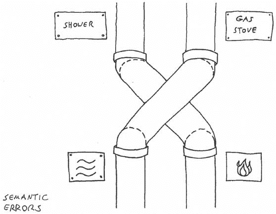
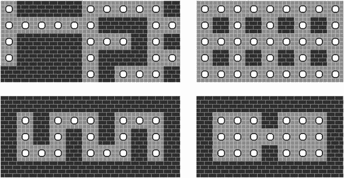

# 三、Python 中的语义错误

你试过关机再开机吗？—IT 人群，电话答录机上的帮助台消息

为了让迷宫游戏变得有趣，我们需要迷宫。玩家角色将在这些迷宫中移动，吃点，并被怪物追逐。在这一章中，我们将编写一个程序来产生这样的迷宫。当实现那个程序时，我们将到达一个程序几乎工作的点。您可能对这种现象很熟悉:您已经处理了第一次测试运行中出现的所有异常。然而，程序仍然没有做它应该做的事情。可能还是满满的语义错误。

当程序运行时没有引发异常，但给出了与预期不同的结果时，就会发生语义错误。潜在的缺陷通常比导致错误消息的缺陷更难消除。Python 异常提供的信息可能不太好，但至少给了你一个起点。由于语义错误，我们经常从较少的信息开始。尽管如此，语义错误的原因有时非常简单:错别字、省略的行、语句顺序错误等等(另见图 [3-1](#Fig1) )。



图 3-1。

Semantic errors can be hard to spot at first glance but have severe consequences

在这一章中，我们将研究 Python 中的语义错误。为此，我们将故意在代码中引入缺陷，看看会发生什么。通过这样做，我们将试图理解是什么导致了语义错误，以及它们是如何表现的。任何列出所有可能的语义错误的尝试都是徒劳的。不存在像例外那样的分类。相反，我们将从重复出现的缺陷中抽象出来，看看我们能在这个过程中学到什么。

## 比较预期产出和实际产出

在前一章中，我们很容易判断一个程序是否产生错误:要么有错误信息，要么没有。Python 解释器告诉我们有一个错误。语义错误的情况不太明显。我们察觉到了一个错误，因为程序做了一些与我们预期不同的事情，但是 Python 认为一切正常。问题可能首先从我们的期望开始:它们可能不够清晰。有时候，期望是显而易见的:如果我们写一个程序来增加两个数字，并输入`1`和`1`，我们期望看到结果是`2`。没有多少讨论的余地。让我们考虑一个更具挑战性的例子。

我们生成迷宫的程序到底要做什么？它将生成一个由墙砖(#)和用圆点填充的走廊组成的矩形网格。)构成迷宫。现在你可能已经有了迷宫应该是什么样子的清晰图像。根据这个描述，一个软件开发团队可能会想出如图 [3-2](#Fig2) 所示的迷宫。



图 3-2。

Four possible outputs of an imprecisely described maze generator

这些迷宫中哪些符合你的预期，哪些不符合？你以前都没想到的是什么？对于不同的程序员来说，对一个编程问题的相同描述会导致非常不同的结果，这是很常见的。可以理解的是，他们都会相信自己的解决方案是正确的。而且都是，因为前面的描述不严谨！

为了区分什么是语义错误，什么不是，我们需要精确地描述对于给定的输入，我们期望什么样的输出。计算机需要精确性，但我们也需要精确性，因为如果我们过于频繁地改变我们对程序应该做什么的看法，就不可能完成它。

让我们的期望更精确的一个简单方法是预先写下一个样本输入和预期输出。这可以在列出输入/输出值的表格中完成。让我们在程序中确定这两者:

*   输入:两个整数值 x 和 y，指定网格块中迷宫的大小。
*   Output: A random maze consisting of a grid of `x * y` tiles. The maze is surrounded by a frame of wall tiles (`#`). It contains an interconnected network of connected corridors separated by walls and filled up with dots (`.`). No room should be wasted by filling it up with walls. A 12 x 7 maze could look like the one in Figure [3-3](#Fig3).

    

    图 3-3。

    Example output of a more precisely described maze. Although small, this is what we really need.

在开始编程之前，写下输入和预期输出通常是个好主意。有更复杂的方法来规划更大的软件，但是从一张纸上的简单表格开始就足够了。

Warning

可能会发生这样的情况，您的项目没有足够精确地被指定来写下输入和预期的输出。这是一个非常严重的障碍，因为很可能你的任何程序都将解决错误的问题。当这种情况发生在你身上时，你有两个选择:第一，立即停止编程，找出你到底应该做什么(更彻底的计划)。第二，用最少的努力找到一个最小的解决方案，把它暴露给现实，并准备好抛弃一切(原型)。Python 对两者都有好处。

### 缺点

识别输入和预期输出使我们能够通过比较预期和实际输出来识别语义错误。发现错误是寻找错误或缺陷原因的起点。寻找缺陷是调试的主要内容。通过演绎发现缺陷通常是困难的。为了了解缺陷和语义错误的本质，我们将从另一端着手处理这个问题:我们将在代码中引入典型的缺陷，看看会发生什么。Python 中有哪些典型的缺陷？我们观察到的相应误差是什么？缺陷是如何导致错误的？

## 变量赋值中的缺陷

我们从产生最终迷宫的函数开始考虑。作为输入，这个`create_grid_string()`函数使用一个 Python 集合，其中包含点的位置和网格的 x，y 大小。作为输出，它以字符串的形式返回迷宫。通过使用集合，我们可以确保每个位置只出现一次。当我们用一组样本点位置调用函数时:

```py
dots = set(((1,1), (1,2), (1,3), (2,2), (3,1), (3,2), (3,3)))
create_grid_string(dots, 5, 5)

```

我们期望以下网格:

```py
#####
#.#.#
#...#
#.#.#
#####

```

下面是`create_grid_string()`函数的一个可能实现:

```py
def create_grid_string(dots, xsize, ysize):
    grid = ""
    for y in range(ysize):
        for x in range(xsize):
            grid += "." if (x, y) in dots else "#"
        grid += "\n"
    return grid

```

如您所见，函数中有三个变量赋值(第 2、5 和 6 行)。让我们考虑当这些变量赋值包含一个缺陷时会发生什么。

### 多重初始化

第一个变量赋值将`grid`设置为空字符串。有几种方法做错了。如果我们完全省略这一行，我们将得到一个`UnboundLocalError`,因为仅仅几行之后就有一个未定义的变量。但是我们也可以，例如，在`for`循环中的一行之后初始化`grid`:

```py
for y in range(ysize):
    grid = ""
...

```

我们得到的不是预期的输出，而是

```py
#####

```

当我们在循环中初始化变量时发生了什么？变量被多次初始化，在循环的每一轮中初始化一次。初始化意味着我们覆盖先前包含的任何内容。因此，我们看到的五个散列实际上是网格的最后一行。多重初始化是一个非常常见的语义错误，它通常与`for`或`while`循环一起出现。

### 意外分配

如果我们不小心创建了一个变量赋值，就会出现类似的语义错误。假设我们用=替换+=操作符中的一个。让我们首先考虑+=的第二种情况:

```py
grid = "\n"

```

最有可能的是，这一行是一个打字错误的结果。结果是我们的输出是一个换行符，结果我们看到一个空输出。这是一种比前一种更令人不安的错误，因为当程序员看到一个空的输出时，他们开始想象错误的可怕可能性。幸运的是，这一行的简短使得这个缺陷更容易被发现。

让我们考虑一下，如果我们也在三元表达式中用=替换+=会发生什么:

```py
grid = "." if (x, y) in dots else "#"

```

同样，`grid`变量在循环的每次迭代中被重新初始化。这个缺陷的结果是输出字符串只包含一个散列(`#`)。这种缺陷的原因很可能是一个打字错误(程序员脑子里有+=但没有到达手指)，或者是思考问题时的逻辑遗漏(程序员脑子里一开始就没有浮现+=这一点)。

根据经验，你是否容易发现这种缺陷有很大的不同。这就是为什么一些初学者更喜欢冗长的加法运算符:

```py
grid = grid + "." if (x, y) in dots else "#"

```

直到他们更容易以同样的精度确定 a +=为止。

### 偶然比较

一个不太常见的缺陷是无意中引入了比较运算符:

```py
grid == "\n"

```

由于==和+=的相似性，这个缺陷更难发现。这也很有可能是打字错误的结果。这一行令人讨厌的地方(也是我们在这里拒绝这个缺陷的原因)是它是一个有效的 Python 表达式，尽管它什么也不做。作为缺陷的结果，我们的输出将不包含任何换行符。

```py
######.#.##...##.#.######

```

看到这个输出，我们需要分两步推断缺陷。首先，我们需要认识到缺少换行符。其次，我们需要检查为什么换行符会丢失。与之前的缺陷相比，这种两步推导在概念上是新的。幸运的是，一旦我们发现了由 rogue ==引起的缺陷，就很容易修复它。

### 表达式中的错误变量

每当我们使用一个变量时，都有可能不小心用错了。这种缺陷可能也很难推断。假设我们在下面的三元表达式中使用网格大小(`xsize, ysize`)代替网格位置(`x, y`):

```py
grid += "." if (xsize, ysize) in dots else "#"

```

我们用网格大小而不是循环索引(`x, y`)在集合中搜索元组。因此，`if`条件永远不会计算为`True`，表达式永远不会返回“.”当我们执行这段代码时，我们看到一堵没有任何地砖的实心砖墙:

```py
#####
#####
#####
#####
#####

```

网格大小和换行符是否正确；只有点不见了。推断这个语义错误的关键问题是:在哪一行没有正确引入点字符？

为了弄清楚发生了什么，我们需要在检查三元表达式时知道(`xsize, ysize`)是什么意思。否则这条线看起来很好。这个缺陷很难被发现。假设我们将函数的参数命名为 xs 和 ys。区分(`xs, ys`)和(`x, y`)比区分(`xsize, ysize`)要难得多。参数被命名为`xsize`和`ysize`的一个原因是，它们与函数中使用的其他变量有很大的心理距离(参见史蒂夫·麦康奈尔所著的《代码全集》(第二版)。，微软出版社，2004 年])。

### 表达式中的交换文字

我们将在`create_grid_string()`函数中探测的最后一个缺陷是交换三元表达式中的两个字符串。我们写的不是正确的答案

```py
grid += "#" if (x, y) in dots else "."

```

我们获得反相输出并不奇怪。这个输出看起来更像直升机着陆点，而不是迷宫:

```py
.....
.#.#.
.###.
.#.#.
.....

```

涉及交换、交换和价值倒置的缺陷非常普遍。我们可以在三元表达式、条件块或简单的布尔运算符中得到类似的效果。请注意，这种缺陷很容易与其他缺陷重叠。在一个简单的场景中，我们也可以通过添加一个额外的`not`操作符来反转 if 条件:

```py
grid += "#" if not (xsize, ysize) in dots else "."

```

之后输出再次正确。当我们有两个以上的值可以交换时，或者我们在代码中做出一个以上的决定时，这种缺陷就变成了一个真正的挑战。

我们在前面的变量赋值中发现的所有缺陷都会影响函数返回的数据。这同时也是我们节目的主要产出。从缺陷到输出的路径相当短。在一些缺陷中，缺陷可以被直接发现，但是在另一些缺陷中，需要一点推理。在所有情况下，我们通过将实际输出与预期输出进行匹配，直接观察到了错误。

## 索引中的缺陷

列表、元组、集合和字典的索引为索引错误之外的缺陷提供了大量的机会。这里，我们只看两个有代表性的例子。要创建一个迷宫，我们需要生成所有可能出现点的位置，除了网格的边界。当用这些位置划分出一个 5 × 5 的网格时，预期的输出是以下网格:

```py
#####
#...#
#...#
#...#
#####

```

这可以使用列表理解来实现。我们定义相应的函数来生成位置:

```py
def get_all_dot_positions(xsize, ysize):
    return [(x,y) for x in range(1, xsize-1) for y in range(1, ysize-1)]

```

我们使用结果列表作为`create_grid_string()`函数的输入，该函数生成正确的预期输出:

```py
positions = get_all_dot_positions(5, 5) print(create_grid_string(positions, 5, 5))

```

### 创建错误的索引

有数不清的可能性，我们可以把列表的索引打乱一个位置。在我们的例子中，这归结为为`range()`函数设置正确的参数。我们可以将开始和结束索引都设置得过高或过低。表 [3-1](#Tab1) 包含四个缺陷和产生的网格。

表 3-1。

Wrong Start and End Indices for Range

<colgroup><col> <col> <col> <col></colgroup> 
| `range(0, xsize)` | `range(1, xsize)` | `range(0, xsize-1)` | `range(2, xsize+2)` |
| `.....` | `#####` | `....#` | `#####` |
| `.....` | `#....` | `....#` | `#####` |
| `.....` | `#....` | `....#` | `##.##` |
| `.....` | `#....` | `....#` | `#####` |
| `.....` | `#....` | `#####` | `#####` |

Python 计算索引的方式与人类不同。这就是为什么指数通常是违反直觉的。当我们用数字索引创建或分割列表时，所有这四种可能性——甚至更多——都会出现。我们并不总是拥有数据的可视化表示。其实值得指出的是，我们这里观察到的误差就是`create_grid_string()`产生的网格。然而缺陷在`get_all_dot_positions()`中。

两者是如何联系的？当然，错误一定出在我们用来创建网格的变量`positions`中——集合包含了错误的索引。这意味着，错误首先是由`range`中的缺陷引起的，然后在程序中不可见地传播，最后导致输出错误。我们可以说错误已经通过我们的程序传播了。在我们的例子中，错误从`get_all_dot_positions()`函数传播到主程序，再从那里传播到`create_grid_string()`函数。

### 使用错误的指数

要创建一个路径相连的迷宫，我们需要识别网格中的相邻位置。在 2D 网格中，每个位置正好有八个相邻位置。对于一个给定的位置`x, y`，我们可以定义一个函数`get_neighbors()`，返回一个包含八个相邻位置的列表:

```py
def get_neighbors(x, y):
    return [
        (x, y-1), (x, y+1), (x-1, y), (x+1, y),
        (x-1, y-1), (x+1, y-1), (x-1, y+1), (x+1, y+1)
        ]

```

这个函数返回一个可以被`create_grid_string()`使用的索引的`list`。我们可以使用该函数的输出来生成网格:

```py
neighbors = get_neighbors(2, 2)
print(create_grid_string(neighbors, 5, 5))

```

位置`2, 2`的邻居的预期输出是一个类似甜甜圈的形状:

```py
#####
#...#
#.#.#
#...#
#####

```

这个代码示例说服你了吗？在前面的代码中，有一些严重的设计缺陷。让我们考虑一下可能出错的地方:

首先，一个缺陷可能会增加或减少`get_neighbors()`中的任何一个索引，就像前面的例子一样。这不可避免地破坏了甜甜圈的形状。我们已经知道这个缺陷，并且可以用类似的方法推导出来。

第二种缺陷是元组中的`x`和`y`可以交换，这样我们将得到`(y, x+1)`而不是`(x, y+1)`。然而，当我们引入这个缺陷时，我们看不到任何影响。甜甜圈还是完整的。但是让我们试着计算不同位置的邻居，例如`3, 2`:

```py
neighbors = get_neighbors(3, 2)

```

我们得到了一艘罗慕伦战舰的中微子信号，而不是甜甜圈:

```py
#####
##...
##.#.
##.#.
##.##

```

这是非常非常坏的消息！通过用一个`x`替换一个`y,`，我们引入了一个缺陷，这个缺陷有时会导致错误，有时不会。当然，我们检查的代码示例本身设计得很糟糕:当我们将一个正方形放置在另一个正方形的中心时，我们不应该对插入`x`或`y`无关紧要感到太惊讶。然而，我们需要记住这个错误的性质:我们将会看到更多的缺陷，这些缺陷有时会传播成错误，有时不会。为了排除错误，先验地识别程序的所有可能的参数组合是非常困难的。

此外，代码本身也容易出现这种错误。`get_neighbors()`函数非常难读；列表元素的含义不清楚，很难看出是否所有的逗号、减号和括号都在正确的位置，以及列表元素的顺序是否正确。例如，以下版本的列表甚至没有包含一个正确的条目:

```py
def get_neighbors(x, y):
    return [
        (x, -1), (y, x+1), (x-(1), y), (x+1), y,
        (x,(-1, y)), (x+1, y, 1), (x-1, y+1, x+1, y+1)
        ]

```

代码仍然会执行。当然，结果是一场灾难:

```py
#####
#####
##.##
#####
##.##

```

这是设计缺陷的一个例子。即使代码工作正常，缺陷也很容易出现。因此，除了调试之外，我们还需要考虑如何使代码更加健壮(和可读)，以便更容易发现缺陷。

## 控制流语句中的缺陷

如果我们写错了控制流语句会怎么样？在像`if, for,`和`while,`这样的控制流语句中，我们会遇到各种有趣的缺陷。我们将在迷宫生成算法中研究它们。迷宫生成的简单算法如下:

1.  创建网格中所有职位的列表。
2.  从列表中随机选择一个位置。
3.  如果该位置有多达四个相邻的点作为邻居，则将该位置标记为一个点。
4.  否则，将该位置标记为墙。
5.  重复步骤 1-4，直到位置列表为空。

值为 5 时，该算法将构建包含很少开放区域的平衡迷宫，并且所有走廊都相互连接。此外，它在外墙留下了一个圆形的路径，这对于逃离鬼魂来说是非常好的。

实现可能如下所示:

```py
def generate_dot_positions(xsize, ysize):
    positions = get_all_dot_positions(xsize, ysize)
    dots = set()
    while positions != []:
        x, y = random.choice(positions)
        neighbors = get_neighbors(x, y)
        free = [nb in dots for nb in neighbors]
        if free.count(True) < 5:
            dots.add((x, y))
        positions.remove((x, y))
    return dots

```

Tip

算法并不完美。如果您自己尝试该算法，您可能会注意到它偶尔会产生无法访问的区域。这是另一种设计弱点，因为它不规则地发生。对于我们的目的来说，这个过程已经足够好了，但是如果你想开发一个更健壮的迷宫生成器，试试吧。这也是一个很好的调试练习。

### 布尔表达式中的缺陷

`if`和`while`都包含布尔表达式。在这两种情况下，表达式中的缺陷会改变接下来执行的命令。例如，在比较相邻点的数量时，我们可能会意外地使用大于号(>)而不是小于号(<):

```py
if free.count(True) > 5:

```

布尔表达式永远不会计算为`True`。随着错误的传播，没有位置被标记为点，结果我们获得了一个只有墙的网格。

同样结局的一个缺陷是省略了`free.count`中的函数调用。不幸的是，对于许多编程学徒来说，下面是 Python 2.7 中的一个合法表达式:

```py
if free.count < 5:

```

尽管前面的表达式在 Python 3.5 中引发了一个异常，但那里也存在类似的缺陷。例如

```py
if "ABC".lower == 5:

```

在设计类似于`while`语句中的显式条件时，需要多加小心:

```py
while positions != []:

```

这与前面语句的简化版本不同:

```py
while positions:

```

两种表达都可以。然而，前者容易改变`positions`的类型(例如，到一个集合或字典)。通常，控制流语句中布尔表达式的各种缺陷会改变执行顺序，并可能创建不可达的代码。

### 压痕缺陷

在 Python 中，缩进改变了代码的含义。因此，我们可以通过错误的缩进产生语义错误。在`while`循环中发现了一个非常常见的情况。考虑我们将调用`positions.remove`的行分隔四个空格，这样它就与`return`语句在同一层:

```py
    ...
    if free.count(True) < 5:
        dots.add((x, y))
positions.remove((x, y))
return dots

```

作为缺陷的结果，列表`positions`永远不会空运行，并且`while`循环永远不会结束。我们通过删除四个空格创建了一个死循环。这是一种新的语义错误，因为程序永远不会到达输出阶段。误差无限传播。这就引出了一系列有趣的理论问题(我们能证明程序真的包含缺陷吗？)和实际问题(我们需要等多久才能知道出了问题？).在本例中，我们通过按下`Ctrl+C`来终止这些问题和程序。

你也可以用`for`构建无限循环。如果我们遍历一个列表并在循环中追加到那个列表，就会发生这种情况。一个更常见的缺陷是一行被删除，即使它应该在一个`for`循环中，反之亦然。这样的`for`循环通常会结束，但会产生错误的结果。这种缺陷的影响通常更加微妙。

## 使用函数的缺陷

在本章的最后一节，我们将看看与函数相关的三个缺陷。对于高级程序员来说，这些都是微不足道的缺陷，但是我已经看到了如此多的初学者与它们作斗争(特别是如果他们只从微积分中知道函数的话)，所以我觉得有必要简要地说明它们。为了完成我们的程序，我们编写了一个简短的函数`create_maze`,它使用到目前为止编写的代码来生成一个迷宫:

```py
def create_maze(xsize, ysize):
    """Returns a xsize*ysize maze as a string"""
    dots = generate_dot_positions(xsize, ysize)
    maze = create_grid_string(dots, xsize, ysize)
    return maze

maze = create_maze(12, 7)
print(maze)

```

让我们看看如何破解这个代码！

### 省略函数调用

首先，我们可以写下函数的名称，但由于省略了括号而忘记调用它:

```py
maze = create_maze

```

当使用不带参数的函数时，例如`str.upper()`，这种情况更容易发生。结果是，我们最终在结果变量中找到了函数本身。在`maze`中，我们以这样的方式结束:

```py
<function create_maze at 0x7efdf7427598>

```

### 缺少返回语句

第二，返回语句`return maze`可能会丢失。由于这个缺陷，这个函数没有把它的结果传递给主程序。相反，它返回`None`，这也是我们在输出中看到的:

```py
None

```

忘记一个`return`是一个不一定会产生异常的缺陷。通常，默认返回值`None`会让程序优雅地结束(例如，当您将结果解释为布尔值时)。结果，错误继续传播。

### 不存储返回值

第三，我们可以调用函数，但不对结果做任何事情(例如，将结果存储在变量中)。该调用如下所示:

```py
create_maze(12, 7)

```

在这一点上，初学者通常会感到困惑。如果他们看不到输出，并且认为应该打印一些东西，那么第一次尝试可能是

```py
create_maze(12, 7)
print(maze)

```

这当然引出了一个`NameError`。如果变量`maze`同时出现在函数和主程序中，问题会变得更糟。一旦函数终止，函数中的`maze`就会失效。这是一个很好的例子，说明为什么在不同的地方使用相同的变量名是一个坏主意。我认为处理这种缺陷的正确方法是亲自体验一个像这样的简单代码示例，看看让代码工作的不同方法。我希望在你自己的键盘上尝试了这些例子后，你会少一个需要处理的问题。

这个例子说明了初学者在熟悉函数时面临的三个常见问题。除此之外，前面几节中列举的所有问题也可能出现在函数中。特别是，缩进和名称空间缺陷更容易被发现。即使你写得很好，函数产生了正确的结果，更大的问题仍然是如何设计好函数。这确实是一个很好的问题，因此我们将把它留到第 15 章。

## 错误传播

在梳理常见的语义错误时，我们做了一些观察。首先，语义错误和潜在的缺陷是明显的。它们可能在同一位置，也可能不在同一位置。这与我们在第 [2](02.html) 章中查看异常时发现的缺陷是一致的。

第二，缺陷在程序中传播。这是什么意思？在图 [3-4](#Fig4) 中，我们可以看到错误传播中的事件链。代码中的缺陷会导致部分数据出错，或者调用错误的函数。该程序将继续运行。然而，缺陷引入的错误会在程序中传播。根据缺陷的不同，它最终会扩散或完全消失。当且仅当缺陷导致的东西到达输出时，我们才有机会将其视为语义错误。错误传播也会导致异常。在这种情况下，事件链不需要到达输出。


图 3-4。

Error propagation. A defect causes a chain of events that travels through the program execution. If the chain manifests in the output, we can observe the error. Note that multiple propagation paths can exist, including such that never lead to an observable error. The figure was inspired by the work of Andreas Zeller . Image covered by the CC-BY-SA License 4.0.

Andreas Zeller 对缺陷和错误传播进行了非常清晰和准确的描述，远远超出了本章的范围。你可以在 Udacity `(` `https://www.udacity.com/course/softwaredebugging–cs259`上的软件调试课程中找到解释，在他的书《为什么程序失败:系统调试指南》(Dpunkt Verlag，2006)中也有描述。

当我们发现一个缺陷时，我们能得出什么结论？理想情况下，缺陷是简单地以错误的方式编写的单行代码。然后我们修改那行代码，程序就工作了。但是还有很多其他的可能性:

*   我们必须编写更大部分的代码来修复缺陷。
*   我们知道错在哪里，但是解决方案与程序编写的方式不兼容。我们需要首先重组代码。
*   不同地方的几个缺陷重叠，我们只观察其中一个。修复一个缺陷只会把我们引向下一个错误。下一个。
*   该缺陷是由两条线路引起的，这两条线路结合起来传播成一个错误。他们中的任何一个都可能被修复。
*   两个缺陷相互部分补偿。修复其中一个似乎会让问题变得更糟。
*   输入是我们之前没有想到的特例。我们需要决定这个特殊情况是否需要包含在这个项目中。

有许多不同种类的语义错误，从容易发现和容易修复的到可能需要几个小时或几天调试的真正的脑筋急转弯。还有一些真正不好的缺陷，指出了我们的算法方法、数据结构或程序架构中的一个主要弱点。最糟糕的是那些暴露出我们没有正确理解我们正在解决的问题的缺陷。在后一种情况下，我们可以想怎么编码就怎么编码，这一点帮助都没有。

缺陷离输出越远(在执行时间、处理的操作或代码行方面)，就越难发现。我们大部分的调试工作旨在将图 3-4 中的空间分割成更小的块。我们可以通过尝试较小的输入来分割数据。这就是为什么我们从一个 5 × 5 的迷宫开始，而不是更大的。或者我们可以通过检查程序的较小部分来分割操作。决定先尝试什么的方法是下一章的主题。

## 最佳实践

*   没有导致错误消息的缺陷被称为语义错误。
*   为了首先确定是否存在语义错误，首先写下给定输入的预期输出会有所帮助。
*   一些导致语义错误的缺陷可以通过查看输出，然后查看代码直接识别出来。
*   一些缺陷需要演绎来找出是什么导致了语义错误。
*   有些缺陷不会直接导致输出错误。它们在程序中传播，直到在输出中导致错误。
*   除了缺陷之外，代码还可能包含设计缺陷，这使得代码更容易添加错误或更难发现现有的错误。