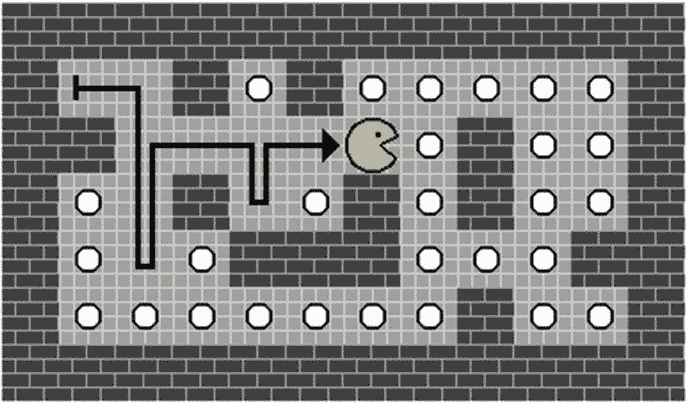
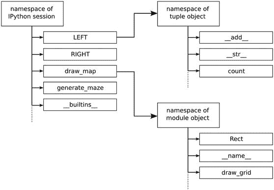
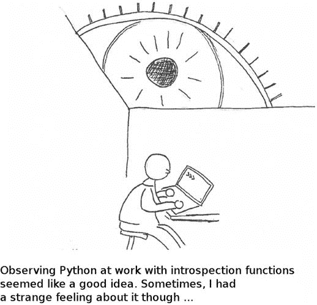

# 6.使用自省功能进行调试

不充分的事实总是招致危险。——伦纳德·尼莫伊饰演《星际迷航》第一季第 24 集的斯波克

在前几章中，我们已经写了很多函数，现在可以开始组装了。当使用 Python 函数或模块时，我们经常会面临这样的问题:“我把函数放在哪里了..?"，“那个函数返回什么？”，或者“这个模块里有什么？”这些问题都可以用自省来回答。Python 中的自省指的是一组强大的函数，允许您详细检查对象。所提供的详细信息使自检成为调试和编写代码的强大诊断工具。

在本章中，我们将使用几个内省函数来查看 Python 对象的内部。作为一个例子，我们将使玩家的形象四处移动。图形会被墙挡住，并在途中吃点。我们需要的只是一个使用二维迷宫的函数`move` ( `grid`，`direction`)，以及一个离开(`LEFT, RIGHT, UP, DOWN`)的方向。让我们将运动实现为随机行走(这样我们还不需要插入事件循环):

```py
if __name__ == '__main__':
    tile_img, tiles = load_tiles()
    maze = create_maze(12, 7)
    maze = parse_grid(maze)
    maze[1][1] = '*'
    for i in range(100):
        direction = random.choice([LEFT, RIGHT, UP, DOWN])
        move(maze, direction)
    img = draw_grid(maze, tile_img, tiles)
    image.save(img, 'moved.png')

```

程序的结果应该是类似于图 [6-1](#Fig1) 中的路径。我们将一步一步地为`move`函数构建代码，而不是扔给你另一个有问题的程序。我们从使用 IPython shell 中的自省函数开始我们的旅程。在这个过程中，我们会在程序中遇到名称空间、文档字符串和类型。



图 6-1。

Result of the random walk of the player figure. The arrow has been added to the figure for clarity.

## IPython 中的探索性编码

您可能已经熟悉 IPython，这是改进的 Python shell。IPython 是探索性编码的一个很好的工具。探索性编码意味着在沙盒中尝试命令或者使用现有 Python 程序的一部分。它在编写和调试程序时很有用。有许多 IPython 函数支持探索性编码(例如，执行代码，使用运行 shell 命令的`Tab` `,`自动完成，以及浏览名称空间)。因此，使用 IPython 而不是常规的 Python shell 是大多数有经验的 Python 开发人员推荐的最佳实践，无论是作为独立的控制台还是内置到开发环境中，如 Anaconda `(` [`https://www.continuum.io/`](https://www.continuum.io/) `)`或 entthought Canopy`(`[`https://www.enthought.com/products/canopy`](https://www.enthought.com/products/canopy)/)。所有这三种类型的 IPython 都以相同的方式工作，这就是为什么我们将在这里对 IPython 命令进行一个简短的介绍。

我们首先在 IPython 中交互式地编写几行代码来定义一组运动向量(作为(`x, y`)元组):

```py
In [1]: LEFT = (-1, 0)

In [2]: RIGHT = (1, 0)

```

```py
In [3]: UP = (0, -1)

In [4]: DOWN  =  (0, 1)

```

这些命令会像在标准 Python 提示符(`>>>`)中一样立即执行。新的是，IPython 为我们提供了许多所谓的神奇功能，使我们的生活更加轻松。例如，我们可以通过编写`%hist`来获得到目前为止我们已经编写的所有命令的列表:

```py
In [5]: %hist
LEFT = (-1, 0)
RIGHT = (1, 0)
UP  =  (0, -1)
DOWN = (0, 1)

```

`%hist`命令允许我们将探索性代码复制粘贴到常规的 Python 文件中。这是一个增量编写程序的好策略，每次我们找到一段工作代码时都会保存我们的进度。我们也可以颠倒这种方法。如果我们在 Python 脚本中已经有了这四行，我们可以在 IPython 中通过复制这些行并使用神奇的函数`%paste`插入它们来执行它们。通过这种方式，我们可以检查代码片段，而无需执行整个模块或使用复制的代码片段创建脚本。`%paste`功能优于常规的`Ctrl+V`，因为它更智能地处理缩进。

我们可以使用`%paste`通过执行小部分代码来检查我们的程序。拥有一个交互式的环境使得一个接一个地测试函数变得容易，当代码改变时替换它们，检查变量的内容。或者，我们可以使用神奇的函数`%run <module name>.`来执行一个 Python 模块，其结果与我们使用来自操作系统的`python <program name>`来执行程序是一样的。从 IPython 运行一个程序的好处是，程序创建的所有变量和函数都被保留下来，使得在程序完成后检查它们变得更加容易。

### 浏览文件和目录

我们可以在 IPython 内部直接使用 Unix 命令如`ls, cd,`和 pwd。这样我们就可以在不离开 Python 的情况下探索文件和目录(或者使用来自`os`模块的更详细的函数)。使用 shell 命令极大地方便了识别错误的文件名和路径。它还帮助我们找出可以导入哪些 Python 模块。这里，我们使用`ls`来列出前面章节中创建的 Python 文件。

```py
In [6]: ls *.py
load_tiles.py
generate_maze.py
event_loop.py
draw_maze.py
util.py

```

从这个列表中，我们将需要从第 [2](02.html) 章导入模块`load_tiles`，从第 [3](03.html) 章导入模块`generate_maze`，从第 [5](05.html) 章导入模块`draw_maze`，以便在迷宫中执行移动并显示结果。在编写相应的`import`语句之前，我们需要找出需要从这些模块中导入哪些对象。

Hint

如果您定义了一个名为`ls`的 Python 变量，前面列出 Python 文件的命令将会失败。在这种情况下，您需要编写`!ls`来表明您指的是 Unix 命令。事实上，您可以通过在前面添加感叹号来运行任何 Unix 命令:

```py
In [7]: !echo "Hello World"
Hello World

```

使用 IPython，我们有效地将两个交互环境合二为一:Python shell 和 Unix 终端。如果你还在学习这两者，那么专注于 IPython 可能比编程时切换终端(以及记住在哪个窗口写哪个命令)更容易混淆。

### IPython 命令概述

像 Python 一样，IPython 是一个灵活的工具，可以用来试验 Python 代码、执行小程序和运行 shell 命令。它结合了 Python shell 和常规 Unix 终端的优点。这种组合也使 IPython 成为调试的强大基础。

IPython 的功能超出了前面的例子。表 [6-1](#Tab1) 给出了最重要的 IPython 命令的概述。在 Wes McKinney 的著作《Python for Data Analysis》(O ' Reilly，2013)和 [`http://ipython.readthedocs.io/en/stable/interactive/magics.html`](http://ipython.readthedocs.io/en/stable/interactive/magics.html) 中可以找到一个优秀的全面的 IPython 教程。如果你喜欢用 IPython 解决小问题或者记录你的努力，你也可以考虑 Jupyter 笔记本`(` [`http://jupyter.org`](http://jupyter.org) /)。笔记本使用 IPython 从 web 浏览器执行 Python 代码，允许您使用格式化文本补充代码，并且可能包含动态生成的绘图、图像，甚至旋转的 3D 分子(参见 [`http://github.com/arose/nglview`](http://github.com/arose/nglview) )。除了调试，IPython 无论有没有笔记本都广泛用于交互式数据分析。

表 6-1。

Useful IPython Commands That Supplement Introspection

<colgroup><col> <col></colgroup> 
| 命令 | 描述 |
| --- | --- |
| `?name` | 显示关于`name`的基本信息 |
| `?nam*` | 列出以`nam`开头的所有对象 |
| `Tab` | 自动完成 |
| `pwd` | 打印工作目录(与 Unix 命令相同) |
| `cd name` | 更改工作目录(与 Unix 命令相同) |
| `ls` | 列出工作目录(与 Unix 命令相同) |
| `%run name.py` | 执行 Python 模块 |
| `%paste` | 执行剪贴板中的代码 |
| `%debug name.py` | 在 Python 模块上运行调试器 |
| `%reset` | 清除 IPython 会话的命名空间 |
| `%env` | 列出环境变量 |

## 探索命名空间

我们现在已经知道有哪些模块需要导入。这些模块中定义了什么函数或变量？回想一下，在 Python 中，一切都是对象，我们可以将这个问题从模块推广到所有对象。在这一节中，我们将使用内省来查看 Python 对象的内部。找出给定对象内部的内容是调试过程中的一个常见问题。与其在 IPython 会话中浏览源代码或无休止地向上滚动，不如使用 Python 自己的自省功能。“对象内部是什么”这个问题与名称空间的概念密切相关。什么是名称空间？在 Python 中，对象被绑定到名称，例如，通过定义变量:

```py
In [8]: LEFT = (-1, 0)

```

该命令创建一个对象(包含`–1`和`0`的元组)，并将其绑定到名称`LEFT`。每当我们使用`LEFT`时，这个名称就被用作 Python 内部用来查找元组的字典的键。这个字典称为名称空间。因为 Python 根本不区分存储的对象的类型，所以不客气地说，名称空间是一大袋与对象相关的名称。

Python 程序中有许多名称空间。例如，如果我们在另一个模块中使用名称`LEFT`，那个模块不知道我们是如何在 IPython 会话中定义`LEFT`的，要么会以错误消息停止，要么会找到一个不同的对象(如果`LEFT`也被分配到那里)。我们也可以说这个模块有一个不同的名称空间。名称空间只是一个附加在 Python 对象上的名称包。每个模块、每个函数和每个 Python 对象都有自己的名称空间。IPython 也有自己的名称空间。名称空间的组件被称为属性。通过前面的赋值，`LEFT`成为了 IPython 名称空间的一个属性。让我们看看如何检查名称空间和属性。

### 用 dir()探索名称空间

我们如何查看名称空间内部并了解它包含哪些名称？使用`dir`函数可以很容易地探索名称空间。通过使用不带参数的`dir`,我们可以看到 Ipython 的主名称空间的内容:

```py
In [9]: dir()
['DOWN', 'In', 'LEFT', 'Out', 'RIGHT', 'UP', '_', '__',
'___', '__builtin__', '__builtins__', '__doc__',
'__loader__', '__name__', '__package__', '__spec__', '_dh',
'_i', '_i1', '_i2', '_i3', '_i4', '_i5', '_i6', '_i7',
'_i8', '_ih', '_ii', '_iii', '_oh', '_sh', 'exit',
'get_ipython', 'quit']

```

如果您以前没有看过 Python，可能需要对它进行一些解释。`dir()`按字母顺序返回命名空间中对象的名称列表:首先是以大写字母开头的名称；接下来，以下划线开头的名字；最后，以小写字母开头的名字。让我们一项一项地检查一下:

*   `LEFT, RIGHT, UP,`和`DOWN`是我们之前进一步定义的元组。
*   `In`是由 IPython 自动创建的。它包含了到目前为止我们在 IPython 中输入的所有命令的列表。
*   `Out`也是由 IPython 创建的。它是 IPython 发送到标准输出的所有输出的字典。
*   `__builtin__`和`__builtins__`是指具有标准 Python 函数的模块，如`print`。每当您启动 Python 时，它会自动导入。
*   `__doc__`是当前名称空间的文档字符串。
*   `__name__`是当前名称空间的名称。
*   `exit`和`quit`是终止 IPython 的函数。
*   剩下的是 IPython 使用的其他内部快捷键。

我们可以在 IPython 提示符下键入这些名称，看看相应的对象包含什么。让我们检查一下当我们导入自己的模块时，用`dir`获得的名称空间是如何变化的。

```py
In [10]: import draw_maze

In [11]: import generate_maze

In [12]: import load_tiles

In [13]: dir()
['DOWN', 'In', 'LEFT', 'Out', 'RIGHT', 'UP', '_', '_9', '__',
'___', '__builtin__', '__builtins__', '__doc__',
'__loader__', '__name__', '__package__', '__spec__', '_dh',
'_i', '_i1', '_i2', '_i3', '_i4', '_i5', '_i6', '_i7',
'_i8', '_ih', '_ii', '_iii', '_oh', '_sh', 'draw_maze',
'exit', 'generate_maze', 'get_ipython', 'load_tiles', 'quit']

```

当我们再次调用`dir()`时，我们会看到与之前相同的名称，外加三个导入的模块。所有三个模块的名称都已成为名称空间的一部分。在调试期间，使用`dir`来找出在给定时刻定义了哪些模块、函数和变量是非常实用的。这样很容易发现一些错别字。从某种意义上说，使用`dir`就像打开汽车引擎盖看发动机。`dir`向我们展示了完整的零件列表。

### 探索对象的命名空间

使用内省，我们找到了自己的模块，导入了它们，并在 IPython 名称空间中看到了它们。尽管如此，我们不知道每个模块包含什么。我们可以在一个模块上使用`dir`,看看这些模块的名称空间，以及它们自己的部件列表:

```py
In [14]: dir(draw_maze)

```

这导致:

```py
['Rect', 'SIZE', 'TILE_POSITIONS', 'Surface', '__builtins__',
'__cached__', '__doc__', '__file__', '__loader__',
'__name__', '__package__', '__spec__', 'create_maze',
'debug_print', 'draw_grid', 'get_tile_rect', 'image',
'load_tiles', 'parse_grid']

```

现在我们看到了我们在`draw_maze`模块中定义的函数和变量。我们还看到了`draw_maze`导入到它的名称空间中的对象(例如`Rect`和`debug_print)`)。此外，我们看到 Python 内部使用的一些以下划线开头的名字。我们可以在任何 Python 对象上使用`dir`，而不仅仅是在模块上。例如，我们可以检查`TILE POSITIONS`对象的属性(一个 Python 列表):

```py
In [15]: dir(draw_maze.TILE_POSITIONS)

```

结果，我们看到了一个很长的条目列表，在列表的最后，我们找到了您可能很熟悉的列表方法，比如`pop`和`sort`。

当自省 Python 对象时，`dir`的输出有时很难阅读，因为带下划线前缀的属性似乎无处不在。很多时候，我们可以忽略它们。我发现有三个以下划线开头的属性非常有用:

*   `_file_`–包含模块的物理位置。如果我们怀疑我们从错误的位置导入了一个模块，`__file_`包含了挽救这一天的信息。
*   `__name__`–帮助我们找出函数、类和模块的名称，如果我们一直在使用它们(例如，使用`import ..`作为或使用函数作为另一个函数的参数)。
*   像`__add__`和`__len__`这样的神奇方法映射到 Python 中的操作符或标准函数。例如，如果我们看到名称空间中的`__add__`属性，我们就知道+操作符应该与该对象一起工作。如果我们在名称空间中看到`__getitem__`属性，我们知道可以使用方括号对其进行索引。记住所有这些神奇方法的名字并不容易。幸运的是，它们上面的 Python 引用非常准确。`https://docs.python.org/3/reference/datamodel.html`见`.`

使用`dir`我们可以检查每个 Python 对象的名称空间。在调试会话中，这有助于我们发现是否导入了正确的模块，以及是否正确拼写了对象的名称及其属性。我们还看到 Python 名称空间是嵌套的:名称空间中的每个 Python 对象都有自己的名称空间。图 [6-2](#Fig2) 展示了名称空间中名称空间的一个例子。`dir`是导航这个名称空间网络的强大工具。



图 6-2。

Namespaces in Python. The namespace of the IPython session contains names of Python objects we created directly, of modules we imported, and of IPython’s own objects. Each of these objects has a namespace of its own. Two of these namespaces are indicated, each depicted with a small fraction of the names contained.

### 探索 Python 程序中的属性

名称空间的内容也称为属性。只给了我们这些属性的名字作为一个字符串列表。如果我们想访问真实的对象，我们可以使用点(。)运算符。例如，我们用`draw_maze.SIZE`访问`draw_maze`模块的`SIZE`属性。在运行时，我们并不总是预先知道属性名。那么使用另外两个内省函数`hasattr()`和`getattr().`会更方便，假设我们想在程序中访问对象`draw_maze.SIZE`。在`draw_maze`函数上使用`getattr`返回相应的 Python 对象:

```py
In [16]: size = getattr(draw_maze, 'SIZE')

```

使用`hasattr(x, name)`，我们可以检查给定的对象是否存在(像`dir`，但是它返回一个布尔值)。一个典型的例子是，我们从配置文件中读取模块或函数的列表，并在程序中动态地访问它们。`getattr`和`hasattr`有时在调试过程中很有用，但大多数时候我们会在一个动态添加模块和功能的程序中发现它们(例如，Django 经常这么做)。

### IPython 中 dir 的替代方案

`dir()`不是我们列出 Python 对象各部分的唯一选项。在 IPython 中，我们可以快速浏览名称空间，因为变量、函数和模块的名称是通过按下`Tab.`自动完成的。我们还可以使用通配符`(*)`搜索名称空间，例如通过键入

```py
In [17]: ?dra*

```

您应该会看到`draw_maze`出现在结果中。如果您不介意将名称空间视为 Python 列表，这种方法可能比`dir`更有效。

由`dir`产生的信息帮助我们找到要导入的内容。除了我们自己的函数，我们还需要标准库中的`pygame.image`和两个模块`random`和`sys`。完整的`import`街区是

```py
from load_tiles import load_tiles
from generate_maze import create_maze
from draw_maze import draw_grid, parse_grid
from pygame import image
import random
import sys

```

## 名称空间机制

通过检查名称空间，我们可以了解很多关于 Python 如何工作的知识。在这一节中，我们看一下与名称空间 s 相关的三个特殊方面。

### Python 为自己的函数使用名称空间

名称空间无处不在。甚至常规的 Python 函数也是以同样的方式组织的。一个很好的例子是`__builtins__`模块:

```py
In [18]: dir(__builtins__)

```

我们看到一个很长的列表，其中包含了所有的标准 Python 函数(其中一些您可能想了解一下)。默认情况下，`__builtins_`模块中的每个函数都可以在每个名称空间中使用，就好像它是该名称空间的一部分一样。将标准函数分组到它们自己的模块中的一个很好的原因是没有参数的`dir()`的输出变得更短。

### 修改名称空间

名称空间在程序中是如何变化的？实际上只有几个 Python 命令可以直接改变名称空间。这些措施如下:

*   带有=的变量赋值向命名空间添加新名称或替换现有名称。
*   指令从名称空间中删除一个名字。
*   带有`def`的函数定义，它将函数添加到名称空间。函数本身是一个 Python 对象，有自己的命名空间；当执行该函数时，会创建一个附加的本地名称空间或范围。
*   一个`class`定义将类添加到名称空间中。创建类和该类的每个实例时，它们也有自己的命名空间。
*   every `import`将一个模块或它的一些组件添加到一个名称空间。
*   `for`和`with`语句创建类似=的新变量。
*   理解创造了临时变量，一旦理解结束，这些变量就消失了。

专门寻找修改名称空间的命令有助于识别导致`NameError`的缺陷。让我们来看看在一个寻找迷宫中玩家位置的函数中，名称空间是如何变化的。让我们考虑下面这段代码(如果你觉得在 IPython 中一行一行地输入很繁琐，就用`%paste`)。

```py
def get_player_pos(level, player_char='*'):
    """Returns a (x, y) tuple of player char on the level"""
    for y, row in enumerate(level):
        for x, char in enumerate(row):
            if char == player_char:
                return x, y

```

当我们进入函数后调用`dir()`时，会看到`get_player_pos`出现在命名空间中。然而，我们看不到函数内部定义的任何变量(`level, y, row,`等)。).当检查带有`dir(get_player_pos)`的函数的名称空间时，我们也看不到它们中的任何一个。这些变量仅在执行函数时动态创建。一旦我们调用`get_player_pos`并且函数中的代码被执行，参数`level, player_char`就被添加到名称空间中。当进入相应的`for`循环时，相应的变量`y, row`、`x,`和`char`也会出现。当函数终止时，添加到函数内部命名空间的所有名称都将消失。原因是名称空间有一个本地范围。在下一节中，我们将看看局部作用域的一些有趣的效果。

### 命名空间和本地范围

拥有多个名称空间和作用域的一个实际后果是，两个变量不一定相同，即使它们有相同的名称。下面的例子让许多初学者陷入绝望:

```py
def f():
    a = 2

a = 1
f()
print(a)

```

如果您正在自己发现名称空间，您可能会奇怪为什么这个程序的输出是 1。当然，有两个独立的名称空间在工作:一个用于函数，一个用于主程序。在其中执行上下文代码的命名空间也称为范围。两个名称空间都定义了变量`a`。如果 Python 在局部范围内找不到名字，它就开始向上一级查找(即，首先在函数内，然后在主程序中)。这被称为从局部向更大的全球范围转移。这解释了为什么下面的例子也可以工作:

```py
a = 1

def f():
    print(a)

f()

```

这段代码的结果是 1。但是，当在局部范围内定义名称时，局部名称优先于全局名称:

```py
a = 1

def f():
    a = 2
    print(a)

f()

```

这个例子的结果当然是 2。下面的例子以一个`UnboundLocalError,`结束，因为 Python 在解析函数时决定`a`属于本地名称空间:

```py
a = 1

def f():
    print(a)
    a = 2

f()

```

希望这个例子说明了保持名字的清晰分离(例如，不要在函数内部和外部使用相同的名字)是一个最佳实践。

### 名称空间是 Python 的核心特性

名称空间是 Python 的一个核心特性。我们已经看到所有的 Python 对象都有一个名称空间。我们在这些名称空间中看到的所有东西也是一个 Python 对象，它也有自己的名称空间。简而言之，Python 由名称空间中的名称空间中的名称空间组成(见图 [6-2](#Fig2) )。我们还看到，当程序运行时，名称空间经常改变。

这对调试有几个更深层次的重要影响。首先，函数、类的方法和包含数据的对象之间没有真正的区别。Python 并不阻止我们混合这些类别。第二，名称空间可以被创造性地修改和重组(函数装饰器就是一个很好的例子；元类是更糟糕的一种)。第三，Python 中没有严格的封装，这意味着程序的每个部分都可以修改其他部分的名称空间。虽然这很方便，但也意味着很难将事物严格分开；我们不能阻止其他代码修改特定的名称空间。封装的缺乏使得编写简短的 Python 程序变得更加容易，但是在编写大型软件时却容易出错。

因此，保持名称空间组织良好是必须的。组织名称空间取决于程序员，因为 Python 并不关心我们在名称空间中放了什么。这就是为什么命名约定、描述性变量和函数名在 Python 中比在其他语言中更重要。我们是否决定使用函数、类、模块、包或标准字典来组织名称空间取决于我们自己。从某种意义上说，所有这些语言特性都是对同一个抽象问题的解决方案:如何组织名称空间。知道了它们的优点和缺点，我们可以选择在给定的时刻哪个特性有助于我们最好地组织:如果我们想要组织代码单元，函数是组织我们的名称空间的一个好工具。如果我们想组织一些数据对象，一个简单的列表就足够了。如果我们两者都需要，上课可能是正确的选择。函数、类和模块使管理名称空间更加方便。在这一点上，Python 与其他编程语言在内部有很大的不同，尽管实际代码可能看起来相似。

## 使用自我记录的对象

当我们使用`dir,`时，我们可以看到有哪些部分(功能、模块、其他属性),但看不到它们是如何工作的。我们将使用文档字符串来找出答案，而不是阅读源代码。我们经常可以在本地找到更快的答案，而不是浏览互联网。

### 使用帮助()访问文档字符串

最佳实践是使用自省函数`help()`简单地检查一个 Python 对象。`help()`函数显示 Python 对象的文档字符串，如果我们想检查一个给定函数做什么，这非常有用:

```py
In [19]: help(draw_maze.draw_grid)

```

此命令会显示一个单独的屏幕页面，其中包含帮助文本:

```py
Help on function draw_grid in module draw_maze:

draw_grid(data, tile_img, tiles)
    Returns an image of a tile-based grid

```

按下`q'`，我们可以再次离开帮助页面。使用`help`有助于获得使用函数或模块的快速提示(例如，我们可以很容易地用它检查参数的顺序)。为了获得更深入的理解，`help`不太合适，所以它作为我们编程时唯一的文档来源是不够的。但是`help`在支持我们对以前做过的事情的记忆方面做得不错。

Hint

有时候帮助显示的信息一点帮助都没有。如果您发现文档过于晦涩，或者(更糟糕的是)它是空的，请立即离开帮助屏幕，到其他地方看看。

帮助还列出了包的内容。有时`dir`不能很好地处理一个包(例如，如果`__init__.py`文件是空的)。在这种情况下，`help()`出手相救:

```py
In [20]: import pygame
In [21]: help(pygame)

```

文档包含一个自动生成的部分，称为包内容，其中列出了包中的所有模块。在 P `ygame`的情况下，我们也可以看到带`dir`的内容；如果你想看一个`dir`没多大帮助的包，试试`import xml`。

### IPython 中的对象摘要

IPython 命令？带有对象名称的符号为我们提供了对象类型、内容和描述的概要(有点像函数`type, print,`和`help`的组合):

```py
In [3]: ?maze
Type:        list
String form: [['#', '#', '#', '#', '#', '#', '#'],
              ['#', '.', '.', '.', '.', '.', '#'],
              ['#', '.', '.', '.', ' <...> ', '.', '.', '.', '#'],
              ['#', '.', '.', '.', '.', 'x', '#'],
              ['#', '#', '#', '#', '#', '#', '#']]
Length:      7
Docstring:
list() -> new empty list
list(iterable) -> new list initialized from iterable's items

```

## 分析对象类型

有了四个方向向量(`LEFT, RIGHT, UP, DOWN`)和`get_player_pos`函数，我们就可以实现移动播放器的功能(或者用`%paste`复制到 IPython)。我们只需将运动向量添加到玩家的位置，并相应地修改地图:

```py
def move(level, direction):
    """Handles moves on the level"""
    oldx, oldy = get_player_pos(level)
    newx = oldx + direction[0]
    newy = oldy + direction[1]
    if level[newy][newx] == 'x':
        sys.exit(0)
    if level[newy][newx] != '#':
        level[oldy][oldx] = ' '
        level[newy][newx] = '*'

```

在调用 move 之前，我们需要设置玩家的起始位置。让我们从迷宫的左上角开始，使用星号(*)作为玩家符号:

```py
In [22]: maze = create_maze(12, 7)

In [23]: maze[1][1] = '*'

```

唉，我们得到另一个错误消息:

```py
TypeError

Traceback

(most recent call last)
<ipython-input-5-b9a7a1b90faf> in <module>()
----> 1 maze[1][1] = "*"

TypeError: 'str' object does not support item assignment

```

我们可能需要仔细看看这个`maze`物体。我们将使用另一个内省功能`type()`来检查它，而不是有些粗糙的`print`:

```py
In [24]: type(maze)
str

```

`type`函数返回对象类型(派生出`maze`的类)。它适用于任何内置或用户定义的类型。原来我们的迷宫是一个不可修改的单串。要修改字符串，我们需要将其转换为二维列表。我们已经在前面的`draw_maze.parse_grid()`函数中为其编写了代码:

```py
In [25]: maze = draw_maze.parse_grid(maze)

```

迷宫的类型是一个列表，当然是可变的:

```py
In [26]: type(maze)
list

```

解决了这个问题，我们终于可以将前面的命令组合成一个程序，沿着迷宫随机行走:

```py
If __name__ == ' __main__':
    tile_img, tiles = load_tiles()
    maze = create_maze(12, 7)

    maze = parse_grid(maze)
    maze[1][1]  =  '*'
    for i in range(100):
        direction = random.choice([LEFT, RIGHT, UP, DOWN])
        move(maze, direction)
    img = draw_grid(maze, tile_img, tiles)
    image.save(img, 'moved.png')

```

### 检查对象标识

还有一些内省函数可以详细检查对象:有时检查两个对象是否真的相同，而不仅仅是包含相同的数据是很重要的。这可以用`is`操作符来完成，而`==`只比较内容。以下示例说明了两者的区别:

```py
In [17]: a = [1, 2, 3]

In [18]: b = [1, 2, 3]

In [19]: a == b
Out[19]: True

In [20]: a is b
Out[20]: False

```

这里，`a`和`b`是不同的对象，因为修改一个列表不会影响另一个列表。对于字典、集合以及有趣的元组也是如此。对于不可变的基本类型，如字符串和整数，`is`和`==`的结果是相同的。

### 检查实例和子类

使用`isinstance`，我们可以检查给定对象是否是给定类的实例:

```py
isinstance("abc", str)
True

```

使用`issubclass`，我们可以检查一个给定的类是否是另一个类的后代:

```py
issubclass(str, object)
True

```

这是因为每个 Python 对象都是`object`的后代。对于调试使用复杂类层次结构的代码来说，`isinstance`和`issubclass`都是必不可少的。

## 内省的实际应用

为了成功调试 Python 程序，我们需要知道如何导航和检查程序中的名称空间。自省是分析 Python 程序中名称空间的强大工具。我们有一组分析函数，如`dir, help,`和`type`，它们提供了关于任何给定 Python 对象的内容、文档和类型的丰富信息。你可以在表 [6-2](#Tab2) 中找到自检功能的总结。

表 6-2。

Introspection Functions in Python

<colgroup><col> <col></colgroup> 
| 功能 | 描述 |
| --- | --- |
| `l (list)` | 在下一个执行的代码周围列出几行代码 |
| `dir()` | 返回当前命名空间中的名称列表 |
| `dir(x)` | 列出 x 中名称空间的内容 |
| `help(x)` | 显示了 Python 对象的文档字符串 |
| `x is y` | 检查两个对象的标识(相对于==) |
| `type(x)` | 返回对象的类型 |
| `hasattr(x, s)` | 如果`x`的名称空间包含名称`s`，则返回`True` |
| `getattr(x, s)` | 从名称空间`x`返回名为`s`的属性 |
| `issubclass(x, y)` | 如果`x`是`y`的子类，则返回`True` |
| `isinstance(x, y)` | 如果`x`是类`y`的实例，则返回`True` |
| `callable(x)` | 如果可以调用`x`，则返回`True` |
| `globals(x)` | 返回全局范围内的对象字典 |
| `locals(x)` | 返回局部范围内(例如，在函数内部)的对象字典 |

结合 IPython 中的快捷方式(例如，用于检查文件名或用通配符列出名称)，我们可以找到很多关于我们程序的信息。自省有用的情况包括

*   在 IPython 中运行程序后检查对象
*   识别重叠的名称空间

*   探索图书馆
*   试验代码片段
*   使用`print()`从程序中输出关于名称空间或类型的信息
*   在调试期间探索对象的类型

最常见的是，它被用在调试中，帮助我们找到甚至是简单的缺陷，比如错别字。

### 内省查找错别字

使用内省来分析名称空间的内容有时有助于识别拼写错误。请考虑以下说明:

```py
In [16]: player_pos = 7
In [17]: playr_pos = player_pos + 1

```

代码中有一个容易被忽略的缺陷。然而，在运行`dir`之后，我们会立即发现有问题:

```py
..
'player_pos',
'playr_pos',
..

```

深入研究名称空间会发现一个缺陷，否则这个缺陷可能会在代码中隐藏很长时间。

### 组合自省功能

为了展示自省函数的分析能力，我们将再看一个例子。在第 [2](02.html) 章中，我们用指令识别了所有 Python 错误

```py
 [x for x in dir(__builtin__) if 'Error' in x]

```

该命令有效，但不精确。我们不能确定所有内置异常的名字中都有`Error`。更正确的方法是从`__builtins__`模块中找到基类`Exception`的后代的所有对象:

```py
for name for name in dir(__builtins__):
    obj = getattr(__builtin__, name)
    if obj.__class__ == type \
       and issubclass(obj, Exception):
       print(obj)

```

我们首先遍历`__builtins__`模块中的所有对象。我们使用`getattr`通过名称检索对象。第一个条件检查对象是否是一个类(使用一个名为元类的属性，在本例中是`type`)。第二个条件检查对象是否是`Exception.`的子类

这不是你日常使用自省函数的方式。特别是，在我看来，元类属于《专业 Python:黑魔法》(如果要写的话)这本书。像大多数危险的功夫技巧一样，了解它们是有益的，但千万不要使用它们。然而，编写类似前面的表达式有助于我们更深入地理解 Python 的内部机制。

### 大程序和小程序中的自省

在编写大型和小型 Python 程序时，花时间在交互式环境中用自省来诊断 Python 对象是一种最佳实践。主要的区别在于，当编写小程序时，自省通常与探索性编码并行发生，一行一行地尝试并保留那些运行良好的代码，而在大程序中，自省更多地出现在旨在解决某个特定问题的调试会话中。自省意味着检查 Python 程序。有时你会发现程序内部使用的自省函数是其功能的一部分。虽然如果一个程序自我检查可能是有用的，但可能会感觉有点尴尬(见图 [6-3](#Fig3) )。我建议在运行时谨慎使用自省，并且只有在您彻底理解名称空间和自省函数的情况下。



图 6-3。

Introspection functions

简而言之，自省是一种工具，它给了我们一个问题的详细答案，在给定的时刻，程序中存在什么对象，它们的属性是什么？自省允许我们分析程序的状态，而不是代码执行的动态。后者是自省的主要限制，因为仅仅依靠自省，我们将永远看不到名称空间或对象先前的状态，也看不到它后来在程序中是如何变化的。我们将在下一章中克服这个限制。除了这个限制，所有自省函数都应该在任何 Python 程序员的工具箱中占有一席之地。

## 最佳实践

*   自省是一套精确的诊断工具，用于检查 Python 对象。
*   IPython 是使用自省函数和神奇函数的绝佳环境。
*   每个 Python 对象都有一个包含属性的名称空间。
*   `dir()`列出名称空间的内容。
*   名称空间是 Python 的核心特性。名称空间可以包含任何内容；因此，保持名称空间组织良好是很重要的。
*   `help()`显示 Python 函数、类或模块的文档字符串。
*   `type()`显示 Python 对象的类型。
*   其他自省函数有助于更精确地分析类型、类和属性。
*   在调试期间，自省允许您诊断程序的状态。