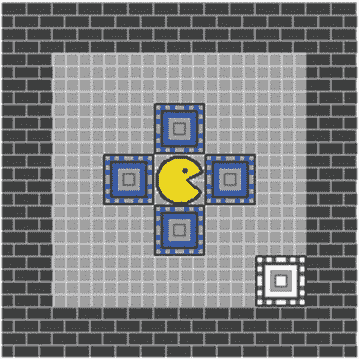
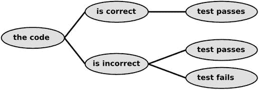

# 八、编写自动化测试

质量工程师走进一家酒吧。点了杯啤酒。点了 0 瓶啤酒。订购 999999999 啤酒。订购一只蜥蜴。订单-1 瓶啤酒。订购 sfdeljknesv。——比尔·塞姆普夫(@塞姆普夫)在推特上

在本书的第二部分，我们将关注一种强大的编程技术:自动化测试。自动化测试被许多 Python 程序员视为基本的最佳实践。为什么会这样？在这一章中，我们将会看到一个关于什么是自动化测试以及它有什么好处的温和介绍。在关于调试的章节中，我们通过简单地执行程序来检查我们的程序是否工作。我们有时直观地将输出与我们自己的期望进行比较，有时使用准备好的输入/输出值表。然而，这种策略并不能很好地适应我们程序的规模:想象一下我们在游戏中加入了更多的元素(方块、关卡、谜题等的类型)。).每次我们添加一些东西，我们都需要从头到尾玩一遍并检查

*   新功能是否有效。
*   程序的其余部分是否仍然有效。

无论我们的游戏有多好，手动测试很快就会变成一项令人生畏的任务。在这里，自动化测试来拯救。测试是一项枯燥、重复的任务，因此我们可以(也应该)将其自动化。什么是自动化测试？基本上，在自动化测试中，我们编写一个程序来测试另一个程序。在某种意义上，我们已经这样做了:在第一章中，我们的每个模块都包含一个`__main__`块，我们用它来执行每个模块，看看它是否在工作。但是自动化测试有一些不同之处。术语自动化测试通常意味着

*   测试代码给了我们一个明确的答案:测试通过或者失败。
*   我们一次测试一小部分代码。
*   我们使用专门的测试框架来简化测试代码。

在本书中，我们将使用测试框架 py.test 来编写自动化测试。自动化测试就像一个脚手架，随着代码的增长，它将代码保持在适当的位置。让我们考虑一个例子:我们想给我们的迷宫添加可移动的板条箱。有些走廊里有板条箱，我们可以推来推去，但不能拉。这意味着如果一个板条箱被扔在角落里，我们就再也拿不出来了。我们一次只能移动一个板条箱。在我们的示例中，我们必须移动板条箱一次才能到达出口(见图 [8-1](#Fig1) )。



图 8-1。

The four blue crates around the player shall be pushed. At least one needs to be moved in order to reach the exit.

## 安装 py.test

我们将使用 py.test 框架测试板条箱移动特性。首先，我们需要安装 py.test:

```py
sudo pip install pytest

```

为了成功运行测试，py.test 需要能够从`maze_run`包中导入模块。为此，我们需要添加一个文件`__init__.py`来导入我们的模块:

```py
from . import load_tiles
from . import moves
from . import draw_maze

```

我们还需要将`PYTHONPATH`变量设置为目录。您可以在 bash 控制台上使用

```py
export PYTHONPATH=.

```

每次启动新的控制台会话时，我们都必须这样做。或者，我们可以在我们的`.bashrc`文件中添加变量

```py
export  PYTHONPATH=$PYTHONPATH:/home/krother/projects/maze_run/maze_run

```

当然，你需要把路径调整到自己的`maze_run`目录。

## 编写测试函数

接下来，我们在一个名为`test_crate.py`的文件中创建测试本身。现在，我们将该文件放在与 MazeRun 代码相同的目录中。首先，我们从前面的章节中导入一些对象并创建一个迷宫，使用“o”作为板条箱的符号:

```py
from draw_maze import parse_grid
from moves import move
from moves import LEFT, RIGHT, UP, DOWN

LEVEL = """
#######
#.....#
#..o..#
#.o*o.#
#..o..#
#.....#
#######"""

```

接下来，我们实现一个名为`test_move_crate_right.py`的小 Python 函数，它检查我们的代码是否正常工作(如果您在家尝试这样做，您可以选择不同的名称，只要函数名称以`test_`开头)。然后我们移动玩家一次:

```py
def test_move_crate_right():
    maze = parse_grid(LEVEL)
    move(maze, RIGHT)
    assert maze[3][4] == '*'

```

最后两行中的`assert`语句检查玩家符号(' * ')是否向右移动了一个位置。如果我们用常规的 Python 解释器运行这个程序，什么都不会发生，因为在任何地方都不会调用`test_move_crate_right`函数。让我们看看 py.test 对函数做了什么。

### 运行测试

我们通过在 Unix 终端中键入来执行测试

```py
py.test

```

并获得以下输出:

```py
============================= test session starts ==============================
platform linux -- Python 3.4.0, pytest-2.9.2, py-1.4.31, pluggy-0.3.1
rootdir: /home/krother/projects/maze_run/maze_run, inifile:
collected 1 items

test_crate.py .

=========================== 1 passed in 0.06 seconds ===========================

```

发生了什么事？py.test 报告它收集了一个测试。它自动在我们的测试模块中找到了我们的测试函数(都由前缀`test_`标识)。然后它执行了`test_crate.py`中的测试。测试通过，意味着`assert`语句中的条件评估为`True`。我们的第一次测试成功了！

### 编写失败的测试

当然，检查玩家是否移动是不够的。我们需要检查板条箱是否也移动了。为了检查板条箱的新位置，我们向测试函数添加了第二个断言:

```py
assert maze[3][5] == ’o’

```

当再次运行`py.test`命令时，它发现了一些要抱怨的东西:

```py
===================================   FAILURES   ===================================
_____________________________________test_crate_____________________________________

     def test_move_crate_right():
         maze = parse_grid(LEVEL)
         move(maze, RIGHT)
         assert maze[3][4] == ’*’

>        assert  maze[3][5]  ==  ’o’

E        assert ’.’ == ’o’
E        - .
E        +  o

test_crate.py:19: AssertionError
=========================== 1 failed in 0.14 seconds ===========================

```

测试失败。在输出中，我们看到第 17 行的`assert`是失败的。如果条件失败，`assert`会引发一个`AssertionError`，老实说，这个异常本身并没有多大帮助。但是，py.test 劫持了异常，并明确告诉我们比较双方的值是什么。我们看到的不是一个箱子(' o ')，而是一个点('.').显然，板条箱没有移动(相反，玩家吃了板条箱)。当然，板条箱没有移动，因为我们还没有实现移动板条箱。如果你想看的话，你可以从测试关卡开始游戏，然后自己啃几个箱子。

### 通过测试

要移动板条箱并通过测试，我们需要编辑`moves.py`中的`move()`功能。我们需要为“o”符号添加一个额外的`if`条件。让我们将板条箱向右移动一格:

```py
def move(level, direction):
    """Handles moves on the level"""

    oldx, oldy = get_player_pos(level)
    newx = oldx + direction[0]
    newy = oldy + direction[1]
    if level[newy][newx] == ’x’:
        sys.exit(0)
    if level[newy][newx] == ’o’:
        level[newy][newx + 1] = ’o’

    if level[newy][newx] != ’#’:
        level[oldy][oldx] = ’˽’
        level[newy][newx] = ’*’

```

当我们重新运行测试时，它再次通过。

```py
=========================== 1 passed in 0.06 seconds ===========================

```

### 通过与失败的测试

最后一个例子应该引起我们的关注，或者至少是思考。前面的代码只负责向右移动。代码充其量是不完整的。我们知道代码还不能工作，但是测试通过了。最后，我们必须注意自动化测试的一个基本事实:测试并不能证明代码是正确的。

那么，测试有什么好处呢？让我们考虑图 [8-2](#Fig2) 中的选择:如果代码是正确的，测试通过。如果代码是不正确的(错误的，错误的，不完整的，设计糟糕的，等等)。)，两种测试结果都有可能。因此，如果我们观察到我们的测试通过了，这给了我们很少的信息。我们不能决定代码是否正确，因为测试可能不完整。反过来效果更好:每当我们观察到一个失败的测试，我们肯定知道有什么地方出错了。我们仍然不知道是代码错了，还是测试不完整，或者两者都有。但是我们有确凿的证据表明这种情况需要进一步的调查。简而言之:自动化测试证明了缺陷的存在，而不是不存在。知道通过测试并不意味着什么，使得自动化测试有点棘手。帮助我们编写有意义的测试的最佳实践:您可能已经注意到，在前面的章节中，我们甚至在编写移动板条箱的代码之前就已经运行了测试。首先编写一个失败的测试有助于我们证明我们编写的代码有所不同。如果测试从失败切换到通过，我们知道我们的代码比以前更加正确。我们将在第 11 章[中重温这个想法。](11.html)



图 8-2。

Possible outcomes when testing code. Testing does not prove that code is correct (with incorrect code, both outcomes are possible), but failing tests prove that something is wrong.

## 编写单独的测试函数

我们能做些什么来把我们的代码更坚定地推向正确的状态呢？答案非常简单:编写更多的测试。您可能会注意到，目前我们只实现了向右移动板条箱。从技术上讲，我们可以用与第一个方向相同的方式实现其他方向。我们将每个方向实现为一个单独的测试函数。四个函数名都以`test_`开头，这样 py.test 会自动发现它们。为了避免代码重复，我们将对`move`的调用和断言放在助手函数`move_crate`中:

```py
def move_crate(direction, plr_pos, crate_pos):
    """Helper function for testing crate moves"""
    maze = parse_grid(LEVEL)
    move(maze, direction)
    assert maze[plr_pos[0]][plr_pos[1]] == ’*’
    assert maze[crate_pos[0]][crate_pos[1]] == ’o’

def test_move_crate_left():
    move_crate(LEFT, (3, 2), (3, 1))

def test_move_crate_right():
    move_crate(RIGHT, (3, 4), (3, 5))

def test_move_crate_up():
    move_crate(UP, (2, 3), (1, 3))

def test_move_crate_down():
    move_crate(DOWN, (4, 3), (5, 3))

```

使用助手函数来保持测试代码简短是一个最佳实践，因为通常要避免代码重复，测试代码也不例外。此外，自动化测试应该比被测试的代码简单(否则我们可能会调试两个复杂的程序，而不是一个)。但是为什么我们要定义四个单行函数，而不是将所有四个调用组合在一个函数中呢？在这个代码上再次调用`py.test`给了我们一个答案:

```py
3 failed, 1 passed in 0.10 seconds

```

只有`test_move_crate_right`通过，因为在实现`move()`函数时，我们假设板条箱会一直向右移动，这当然是无稽之谈。py.test 给出的输出不仅告诉我们四个测试中有三个失败了，还精确地告诉我们是哪一个失败了。这给了我们比一个更大的测试函数更多的信息。显然，编写许多小测试是最佳实践。测试结果为我们提供了在`move()`功能中重写`if`条件处理箱的信息。更新的功能是

```py
def move(level, direction):
    """Handles moves on the level"""

    oldx, oldy = get_player_pos(level)
    newx = oldx + direction[0]
    newy = oldy + direction[1]
    if level[newy][newx] == ’x’:
        sys.exit(0)
    if level[newy][newx] == ’o’:
        cratex = newx + direction[0]

        cratey = newy + direction[1]

        level[cratey][cratex]  =  ’o’

    if level[newy][newx] != ’#’:
        level[oldy][oldx] = ’˽’
        level[newy][newx] = ’*’

```

现在四项测试都通过了:

```py
============================= test session starts ==============================
platform linux -- Python 3.4.0, pytest-2.9.2, py-1.4.31, pluggy-0.3.1
rootdir: /home/krother/projects/maze_run/part1_debugging, inifile:
collected 4 items

test_crate.py ....

=========================== 4 passed in 0.07 seconds ===========================

```

Note

许多程序员认为一个测试函数应该只包含一个断言。这通常是一个好的实践，但是在这一点上，它会不必要地膨胀我们的代码。在第 9 章中，我们将看到一种更优雅的方式来构建我们的测试并简化我们的代码。

## 断言提供了有用的输出

`assert`语句将计算 Python 中任何有效的布尔表达式。这允许我们测试许多不同的情况，其中一些应用于下面的二维列表`maze`:

```py
def test_assert_examples():
    maze = parse_grid(LEVEL)
    assert len(maze) <= 7                            # comparison operator
    assert 1 < len(maze) < 10                        # range check
    assert maze[0][0] == ’#’ and maze[1][1] == ’.’   # logical operators
    assert maze[0].count(’#’) == 7                   # using methods

```

如前所述，py.test 将`assert`的输出从`AssertionError`变为更有意义的输出。这样做的一个实际方面是，我们可以在`assert`语句中比较列表、字典和其他复合类型。例如，我们使用仅由三块瓷砖组成的极简迷宫`’*o#’`编写了另一个测试:

```py
def test_push_crate_to_wall():
    maze = parse_grid("*o#")
    move(maze, RIGHT)
    assert maze[0] == [’*’, ’o’, ’#’]

```

运行 py.test 时测试失败！显然，我们还没有注意到阻碍板条箱移动的墙壁。py.test 报告两个列表之间不匹配的位置(实际上，三个位置都不匹配，但第一个位置足以使测试失败):

```py
E            assert [’ ’, ’*’, ’o’] == [’*’, ’o’, ’#’]
E              At index 0 diff: ’ ’ != ’*’

```

类似地，我们可以编写一个测试来确保板条箱也能阻止运动。这一次，我们比较了`assert`语句中的两个嵌套列表:

```py
def test_push_crate_to_crate():
    maze = parse_grid("*oo")
    move(maze, RIGHT)
    assert maze == [[’*’, ’o’, ’o’]]

```

对于二维列表，我们还会得到关于不匹配项的精确报告:

```py
E        assert [[’ ’, ’*’, ’o’]] == [[’*’, ’o’, ’o’]]
E          At index 0 diff: [’ ’, ’*’, ’o’] != [’*’, ’o’, ’o’]

```

在测试大型列表和类似的复合类型时，这种精确的输出是救命稻草。比较预期输出和实际输出可以在一个断言中完成，我们不需要手动比较列表来寻找不匹配。py.test 使用的 assert 语句非常通用。在测试失败的情况下，py.test 经常设法从表达式中创建一个有意义的输出(使用`-v`选项，它甚至变得更好)。因为我们可以在`assert`中使用任何类型的布尔表达式，所以我们可以构造实践中需要的大多数测试。

## 异常测试

有一种情况下`assert`语句不起作用:如果我们想测试是否出现了异常。让我们考虑一个例子:如果我们调用方向参数设置为`None?`的`move()`函数会发生什么(我们在第 [7 章](07.html)中遇到了这种情况)。)假设我们想要创建一个`TypeError`，并且想要测试`move`是否会引发异常。测试没有异常产生是很容易的:

```py
move(maze, None)
assert True

```

但是反过来就不行了。没有语法上正确的方法来编写一个单独的`assert`语句，用`None`调用`move`并在函数内部引发异常时通过。问题是，如果我们想让`TypeError`在一切正常的情况下发生，那么`assert`总是会因为那个异常而失败。我们可以用一个笨拙的方法来帮助自己:

```py
try:
     move(maze, None)
except TypeError:
     assert True
else:
     assert False

```

现在，如果(且仅当)异常没有发生，测试失败。对于这种情况，py.test 提供了一种快捷方式，这是一种推荐的最佳实践。上下文管理器`pytest.raises`允许我们专门测试异常:

```py
import pytest

def test_move_to_none():
    """direction=None generates an Exception"""

    maze = parse_grid(LEVEL)
    with pytest.raises(TypeError):
        move(maze, None)

```

为什么我们要针对异常进行测试？这样做有几个很好的理由:

*   首先，我们不希望我们的代码表现出任何随机行为。如果代码失败，我们希望以我们之前指定的方式失败。`pytest.raises`函数是一个很好的方法。
*   其次，它有助于我们控制错误——如果我们知道错误输入的行为方式，错误就不太可能在我们的代码中传播。
*   第三，错误的来源变得更容易找到。
*   第四，它帮助我们发现设计缺陷，那些我们以前根本没有想到的东西。

如果测试失败，我们会看到消息`’Failed: DID  NOT  RAISE’`。然而，它很好地通过了。

## 边境案件

到目前为止，我们编写的测试表现如何？在八个测试函数中，六个通过，两个失败。用`py.test -v`我们获得

```py
============================= test session starts ==============================
platform linux -- Python 3.4.0, pytest-2.9.2, py-1.4.31, pluggy-0.3.1
rootdir: /home/krother/projects/maze_run/part1_debugging, inifile:
collected 8 items

test_crate.py::test_move_crate_left PASSED
test_crate.py::test_move_crate_right PASSED
test_crate.py::test_move_crate_up PASSED
test_crate.py::test_move_crate_down PASSED
test_crate.py::test_assert_examples PASSED
test_crate.py::test_push_crate_to_wall FAILED
test_crate.py::test_push_crate_to_crate FAILED
test_crate.py::test_move_to_none PASSED

==================================== FAILURES ==================================
________________________________test_push_crate_to_wall__________________________

    def test_push_crate_to_wall():
        maze = parse_grid("*o#")
        move(maze, RIGHT)
>       assert maze[0] == [’*’, ’o’, ’#’]
E       assert [’ ’, ’*’, ’o’] == [’*’, ’o’, ’#’]
E        At index 0 diff: ’ ’ != ’*’
E        Full  diff:
E        - [’ ’, ’*’, ’o’]
E        + [’*’, ’o’, ’#’]

test_crate.py:51: AssertionError
_______________________________test_push_crate_to_crate_____________________________

    def test_push_crate_to_crate():
        maze = parse_grid("*oo")
        move(maze, RIGHT)
>       assert maze == [[’*’, ’o’, ’o’]]
E       assert [[’ ’, ’*’, ’o’]] == [[’*’, ’o’, ’o’]]
E         At index 0 diff: [’ ’, ’*’, ’o’] != [’*’, ’o’, ’o’]
E         Full  diff:
E         - [[’ ’, ’*’, ’o’]]
E         + [[’*’, ’o’, ’o’]]

test_crate.py:57: AssertionError
=============================== 2 failed, 6 passed in 0.11 seconds =============

```

如果我们检查两个失败测试中的不匹配列表，我们会注意到板条箱很容易被移动。板条箱可以被推过任何东西，包括墙壁和其他板条箱。把它推得更远会使程序崩溃。我们忽略了几种可能出现的情况。这些被称为边界情况或边缘情况。一般来说，边界案例旨在用尽可能少的测试代码覆盖尽可能多的可能输入。好的边界案例涵盖了各种各样的输入。例如，浮点数的典型边界情况包括典型值和极值，如最大值和最小值、空的和错误的数据或错误的数据类型。在我们的案例中，我们没有明确涉及的边界案例包括

*   把板条箱推到墙上。
*   把一个板条箱推进另一个板条箱。
*   把板条箱推进出口。

为了满足我们的边界情况，我们需要再次更新`move()`函数:

```py
def move(level, direction):
    """Handles moves on the level"""
    oldx, oldy = get_player_pos(level)
    newx = oldx + direction[0]
    newy = oldy + direction[1]
    if level[newy][newx] == ’x’:
        sys.exit(0)
    if level[newy][newx] == ’o’:
        cratex = newx + direction[0]
        cratey = newy + direction[1]
        if level[cratey][cratex] in ’. ’:
            level[cratey][cratex] = ’o’

            level[newy][newx] = ’ ’

        elif level[cratey][cratex] == ’x’:

            raise NotImplementedError("Crate pushed to exit")

    if level[newy][newx] in ’. ’:

        level[oldy][oldx] = ’˽’
        level[newy][newx] = ’*’

```

最后一个添加使得我们所有的测试都通过了:

```py
=========================== 7 passed in 0.08 seconds ===========================

```

我们也可以为其他方向测试相同的边界情况。但是由于我们正在测试的代码不是很长或者很复杂，我们决定我们的七个测试现在已经足够好地覆盖了可能的情况(也见图 [8-3](#Fig3) )。


图 8-3。

“I admit the chance of finding a seven-tentacled monster below the house was low, but I found it worth testing anyway.”

### 复杂的边境案件

在前面的例子中，边界情况相对容易识别。我们只是简单地考虑如果某块瓷砖挡住了板条箱会发生什么。通常，边界案例并不容易找到。原因是输入包含很多维度。为了探索这个想法，让我们进行一个思维实验:想象我们将增加使玩家变得超强的能量，这样它就可以移动多个板条箱(见图 [8-4](#Fig4) )。假设每个玩家都有一个实力，用浮点数表示，一个玩家一次可以移动到`strength` crates 的平方根。


图 8-4。

When we add the strength of the player as an extra dimension, the border cases become a lot more complex.

这一小小的增加引发了一系列关于板条箱到底是如何移动的问题:

*   强度值需要多大的数值精度？
*   实际移动的板条箱的最大数量是多少？
*   最小数量是多少？有没有可能是玩家太弱了，什么都推不动？
*   平方根的舍入是如何进行的(向上、向下、数学)？
*   强度可以是负的吗(这里是虚数)？
*   实力可以无限大吗？

如果我们想涵盖前面例子中的所有边界情况，我们必须考虑这六种情况中每一种的至少一个代表性强度值。更重要的是，假设我们想要确保加电功能在所有可能的情况下都能正常工作。然后，我们必须将每个有代表性的力量值与我们之前测试的每个游戏情况结合起来。结果将是几十个额外的测试。如果有更多的维度，比如运动方向、上电强度、可能挡路的瓷砖等等，那么通过测试详尽地涵盖所有情况就变得不可行了。幸运的是，推板条箱游戏在实践中并不复杂，但许多现实世界的应用程序却很复杂。令人讨厌的边界情况的范围从数学计算、读取输入文件到各种模式匹配。在我的不止一个编程项目中，维护一个干净的、有代表性的边界测试用例集合(并迫使程序理解它们)是投入工作的主要部分。一般的策略是挑选能够很好地代表我们输入的边界案例。如果我们把程序的可能输入想象成一个多维空间，通过选择边界情况，我们试图用尽可能少的测试和尽可能多的必要测试来定义那个空间的轮廓。

## 自动化测试的好处

到目前为止，我们已经编写了五个测试，我们有了一个自动化的过程，允许我们(或其他开发人员)检查移动的板条箱是否工作。在程序的未来开发过程中，测试可能失败的原因有几个:

*   我们给游戏增加了更多的功能，却意外地破坏了箱子的功能。
*   我们修复了一个缺陷，却意外地破坏了板条箱特征。
*   我们重命名了`move`函数，这样我们的测试就不会再找到它了。
*   我们改变编码墙砖和地砖的字符，这样我们的助手函数`move_crate`就可以检查无意义的内容。
*   我们尝试在没有安装 P `ygame`的计算机上运行测试。

当然，我们简单的测试无法自动找出到底哪里出了问题。但是自动化测试的显著之处在于，在所有这些情况下，py.test 都会产生失败的测试，这告诉我们:“有些地方出错了，请进一步调查问题。”这难道不是件好事吗？

毫无疑问，编写自动化测试会预先产生额外的工作。这项工作有什么回报？还有三个好处值得一提。首先，自动化测试节省了时间。我们开始这一章的前提是手工测试是不可伸缩的。想象一下，每次修改代码时，您都必须手动检查所有的边界情况。你要么花大量时间手工测试，要么跳过一些测试，花更多时间在你的代码上。有了可重复的自动化测试，在运行几次测试之后，投入的努力就有了回报。第二，自动化测试促进了结构良好的代码。值得指出的是，我们可以在不初始化图形或事件循环的情况下完全测试`move()`函数。代码以易于独立测试的方式编写。如果我们要测试一个单一的大函数，高质量的测试会很复杂，如果不是不可能编写的话。第三，自动化测试是有益的。当你执行你的测试，看到失败的测试变成了通过，这给了程序员一种成就感。通常，这种积极的反馈会让你坚持下去，尤其是在咬穿一段困难的代码时。至少这是我和许多其他 Python 程序员反复遇到的情况。所有这三个好处对于自动化测试的最佳实践都是必不可少的。为了更深入地理解它们，当我们在接下来的章节中看到更多的自动化测试技术时，我们将需要重温它们。

## Python 中的其他测试框架

py.test 的一些替代方法值得一提:

### 单元测试

`unittest`是 Python 安装的默认测试框架。因为`unittest`不需要任何安装，所以知道它是如何工作的就好。实际上，`unittest`提供了 py.test 的一小部分可能性，主要是将测试分组到类中。

### 鼻子

测试框架 nose 通过自动测试发现和一些其他方便的特性扩展了`unittest`。nose 和 py.test 是远亲，py.test 是两者中更强大的。我们将描述限制在一个与鼻子相关的链接上: [`http://nose.readthedocs.io`](http://nose.readthedocs.io) 。

### doctest(测试)

doctest 框架的工作方式完全不同。文档测试是写入 Python 文档字符串的 Python shell 会话。doctests 的伟大之处在于，它使得在文档中包含可测试的代码示例变得很容易。第 [17](17.html) 章描述了如何将 doctests 包含在文档中。

### 编写 __main__ 块

在一些模块中，您可以在`__main__`块中找到测试代码。如果一个程序不需要`__main__`块进行常规执行，我们不妨为模块中的函数编写一些测试。例如，我们可以测试移动的板条箱:

```py
if __name__ == ’ __main__’:
    maze = parse_grid(LEVEL)
    move(maze, direction)
    if maze[3][5] == ’o’:
        print(’OK’)

```

在非常小的程序中，这是一个可以接受的策略，用来测试不直接执行的模块。一方面，我们会在一段时间内避免使用较重的基础设施。另一方面，随着项目的增长，这种测试很快变得很麻烦。举个例子，你不能用这种方式测试多个模块。一旦代码增长超过 100 行，就有必要切换到“真正的”测试框架。

## 最佳实践

*   自动化测试由检查程序是否工作的代码组成。
*   py.test 是一个用 Python 编写自动化测试的框架。
*   要导入被测模块，需要将它们导入到`_init_.py.`文件中
*   断言决定测试是通过还是失败。
*   py.test 提供了断言失败原因的详细信息。
*   功能`pytest.raises`允许明确测试故障。
*   编写许多小的测试函数比一些大的测试能提供更多的信息。
*   失败的测试提供了最有用的信息。测试证明缺陷的存在，而不是不存在。
*   首先编写一个失败的测试，然后让它通过是一个更可靠的方法。
*   测试应涵盖不同的边界情况。
*   收集和维护边界案例的工作可能相当繁重。
*   自动化测试节省了时间，促进了代码的可维护性，并且是有益的。