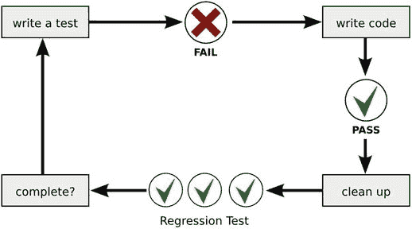
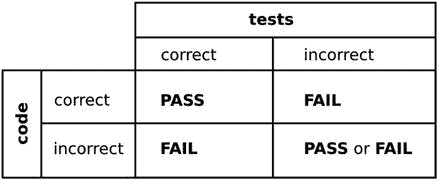

# 十一、测试最佳实践

“没有测试的代码被设计破坏了。”—Jacob Kaplan-Moss，Django 核心开发人员

在过去的几章中，我们已经看到自动化测试是检验 Python 程序是否有效的一种强大的技术。py.test 框架是一个多功能的工具，可以为小代码单元编写测试，使用测试数据集，以及管理带有许多断言和测试函数的测试套件。显然，测试是每个高级 Python 程序员工具箱中非常有用的技术。然而，到目前为止，我们还没有看到全局:自动化测试在开发过程中的什么位置？

“没有测试的代码是被设计破坏的”这句话 Django web 服务器的核心开发人员 Jacob Kaplan-Moss 提出了一个大胆的主张。它说如果没有自动化测试，我们就无法写出正确的代码。我们能推翻这种说法，说“带测试的代码是正确的”吗？在这一章中，我们将研究这两种说法。我们将软件测试视为开发过程的一部分，并将我们的注意力转向如下问题:

*   有哪些不同类型的测试？
*   开发期间什么时候开始测试最好？
*   自动化测试的好处是什么？
*   在什么情况下测试很难写？
*   一般来说，测试的局限性是什么？
*   还有其他选择吗？
*   什么区分好的和坏的测试？

我希望本章涵盖的测试的最佳实践将帮助你编写自动化测试，以最佳方式支持你的编程，这样你就能更快地生产出可工作的软件，并有效地维护它。

## 自动化测试的类型

首先，有几种重复的测试。与使用 py.test 来实现它们相比，它们在编写目的和使用范围上有更大的不同。本节介绍了许多专业开发人员在谈论自动化测试时使用的词汇。表 [11-1](#Tab1) 给出了不同类型测试的概述。

表 11-1。

Types of Automated Tests

<colgroup><col> <col></colgroup> 
| 试验 | 描述 |
| --- | --- |
| 单元测试 | 测试小的、孤立的代码单元。 |
| 整合测试 | 测试两个或更多较大组件的协作。 |
| 接收试验 | 从用户的角度测试功能。 |
| 回归测试 | 重新运行测试以确保先前构建的功能仍然有效。 |
| 特性试验 | 测试执行速度、内存使用或其他性能指标。 |
| 负荷试验 | 测试高工作负载下的性能，尤其是 web 服务器。 |
| 负荷试验 | 在不利条件下(组件故障、攻击等)测试功能。) |

### 单元测试

对单个函数、类或模块的测试称为单元测试。单元测试证明一段代码满足了它的基本需求。单元测试可能会执行非常详细的检查，并包含相当多的吹毛求疵。在编写单元测试时，我们通常希望涵盖许多边界情况，比如空输入、长输入、怪异输入等等。编写单元测试的最佳实践是 Tim Ottinger 和 Jeff Langr 引入的第一个缩写词。单元测试应该是

*   快速—在几秒钟或更短时间内执行
*   隔离—一次只测试一段代码
*   可重复—可以重新运行，但结果相同
*   自我验证——测试套件不需要额外的信息来评估测试
*   适时——测试在代码之前编写(在“测试优先的方法”一节中有更多的介绍)

单元测试中其他常见的最佳实践是每个测试只使用一个`assert`(尽管这是一个经验法则),并使用模拟对象用简单的占位符代替复杂的组件，这样测试只依赖于被测试的代码单元。

### 集成测试

孤立地测试组件是不够的。还需要对组件之间的协作进行测试；它们被称为集成测试。通常，这意味着测试更大组件(如数据库、web 服务器或外部应用程序)之间的协作，而不是测试两个相邻 Python 模块中的两个类。集成测试还可能包括在不同版本的库或 Python 版本上测试软件。在 Python 中，有一些用于集成测试的工具，例如，Tox `(` [`https://tox.readthedocs.io/`](https://tox.readthedocs.io/) `),`，它支持在一系列 Python 版本上运行测试套件。当编写集成测试时，需要使用实际的程序组件(没有模拟对象或其他占位符)。集成测试试图尽可能精确地再现软件的使用环境。

### 验收测试

第三种类型的测试关注用户的观点。验收测试检查一个程序的特性是否“像宣传的那样”工作典型的验收测试将程序作为一个整体运行，并检查输出的一些特性。它们模拟真实用户的行为(例如，从命令行执行程序或通过浏览器发送 HTTP 请求)。验收测试的最佳实践是，我们不需要测试每一种可以想到的情况。这就是单元测试的目的。我们更愿意确保我们的应用程序在假设所有组件都正确的情况下处理输入并交付期望的输出。

如何在实践中实现验收测试很大程度上取决于我们程序的用户界面类型。如果我们正在开发一个程序库，验收测试将看起来像我们以前见过的用 py.test 编写的测试，只是它们将测试我们想要向用户公开的接口部分。使用命令行应用程序，我们可以用`os.system`执行程序并重定向输出。命令行应用程序的原始测试可能如下所示:

```py
def test_commandline_app():
    """Make sure a maze with at least one wall is produced"""

    cmd = "python create_maze.py > output.txt"

    maze = open('output.txt').read()
    assert '#' in maze

```

为图形界面编写验收测试更具挑战性。存在用于 web 接口验收测试的专用工具(例如 Selenium、Cucumber 和 Codecept.js)，但是有时，合理的测试可以通过 web 框架中的常规测试来完成(使用 py.test)。在任何情况下，自动化验收测试都不能代替人工检查程序是否完成了它的工作。在任何情况下，程序员和用户之间的交流都是必要的，以找出软件做的事情是否首先是相关的(例如，它使他们的生活更容易，改善他们的业务，玩起来很有趣)。

### 回归测试

测试的一个重要应用叫做回归测试。回归测试仅仅意味着在程序改变后重新运行测试。这可能包括重新运行单元测试、集成测试、验收测试，或者以上所有的测试。回归测试强调在几种标准情况下重新运行测试是一种最佳实践:

*   添加新功能后
*   修复缺陷后
*   重新组织代码(重构)后
*   在将代码提交到存储库之前(参见第 [12 章](12.html)
*   从存储库中签出代码后

回归测试确保在我们编辑了代码之后，我们到目前为止创建的所有东西仍然工作。如果我们有一个快速测试集，在编程期间每隔几分钟重新运行测试是一个非常强大的技术。回归测试确保我们不会在关注程序其他部分的时候无意中破坏了某个特性。py.test 的命令行选项使我们在回归测试过程中的生活变得更加轻松(例如，只重新运行失败的测试会大大加快我们的工作)。您是否决定重新运行失败的测试、单元测试、集成测试，或者您在回归测试期间可以得到的所有测试，取决于代码的变化有多大，以及您离发布程序有多近。

### 性能测试

到目前为止，所有的测试都是测试一个程序的功能性:这个程序是工作还是不工作？但是其他一些指标也值得测试:程序够快吗？它是否在适当的时间对用户输入做出反应？程序是内存高效的还是消耗了过多的系统资源？所有这些都可以在术语性能测试中找到。在 Python 中，有一些很棒的工具用于手工性能测试。例如，我们可以使用 IPython 中的`%timeit`魔法方法来检查函数的性能:

```py
In [1]: from generate_maze import create_maze
In [2]: create_maze(10, 10)
In [3]: %timeit create_maze(10, 10)
1000 loops, best of 3: 589 s per loop

```

`%timeit`函数智能地计算出它需要运行一段代码的频率，以确定可靠的平均执行时间。较慢的函数通常比快的函数需要的运行次数少。相反，如果我们尝试`range`，一百万次运行是必要的。此外，IPython 警告我们，结果波动很大:

```py
In [4]: %timeit range(100)
The slowest run took 9.16 times longer than the fastest.
This could mean that an intermediate result is being cached.
1000000 loops, best of 3: 392 ns per loop

```

使用`timeit`优于使用外部程序测量执行时间。特别是，不要试图用 Unix 命令行`tool time`来测量单个 Python 函数的性能。通过这种方式，您也将测量大量的开销(例如，启动 Python 解释器)，并且结果将是不精确的。通过导入`timeit`标准模块，我们可以测量常规 Python 程序中任何 Python 命令的执行时间。通过将`timeit.timeit`函数返回的数字与预期的最大时间进行比较，我们可以编写简单的性能测试:

```py
def test_fast_maze_generation():
    """Maze generation is fast"""

    seconds = timeit.timeit("create_maze(10, 10)", number=1000)
    assert seconds <= 1.0

```

### 性能优化

我们如何利用计时信息来提高性能？模块允许我们更详细地检查程序的性能。例如，如果我们使用`create maze()`函数创建一个非常大的迷宫，这个函数会变得很慢。通过`cProfile.run()`,我们获得了一份关于这个项目具体在哪里花费时间的报告:

```py
cProfile.run("create_maze(200, 200)")
         395494 function calls in 19.689 seconds

Ordered by: standard name

ncalls tottime percall cumtime percall filename:lineno(function)
     1   0.003   0.003  19.689  19.689 <string>:1(<module>)
     1   0.000   0.000   0.009   0.009 generate_maze.py:22(get_all_dot_pos)
     1   0.009   0.009   0.009   0.009 generate_maze.py:24(<listcomp>)
 39204   0.078   0.000   0.078   0.000 generate_maze.py:27(get_neighbors)
     1   0.262   0.262  19.670  19.670 generate_maze.py:35(generate_dot_pos)
 39204   0.126   0.000   0.126   0.000 generate_maze.py:42(<listcomp>)
     1   0.000   0.000  19.686  19.686 generate_maze.py:49(create_maze)
     1   0.017   0.017   0.017   0.017 generate_maze.py:9(create_grid_string)
 ...
 39204  18.914   0.000  18.914   0.000 {method 'remove' of 'list' objects

```

`ncalls`列告诉我们这个函数被调用了多少次。`tottime`是 Python 在这个函数中花费的总时间，后面是每次调用的时间(`percall`)。`cumtime`是累计时间，Python 在这个函数和从它调用的其他函数中花费的时间，后面是每个函数花费的时间。在输出中，我们看到函数`get_neighbors`被调用了 39204 次。我们可以试着让`get_neighbors`更快，但是它不会加速我们的程序(在那里花费的总时间只有 78 毫秒)。真正的瓶颈是`list.remove`，几乎占了整个执行时间。此时，值得看一下代码(完整的迷宫生成器在第 [3](03.html) 章中介绍):

```py
def generate_dot_positions(xsize, ysize):
    """Creates positions of dots for a random maze"""

    positions = get_all_dot_positions(xsize, ysize)
    dots = set()
    while positions != []:
        x, y = random.choice(positions)
        neighbors = get_neighbors(x, y)
        free = [nb in dots for nb in neighbors]
        if free.count(True) < 5:
            dots.add((x, y))
        positions.remove((x, y))
    return dots

```

通过检查代码，我们看到每个位置只被使用了一次。使用慢速`list.remove`方法的原因是位置以随机顺序处理。为了让代码运行得更快，我们将列表混洗一次，然后在一个`for`循环中处理列表的每个元素。以下是删除两行并添加了两个突出显示的行后的更新实现:

```py
def generate_dot_positions(xsize, ysize):
    """Creates positions of dots for a random maze"""

    positions = get_all_dot_positions(xsize, ysize)
    dots = set()
    random.shuffle(positions)

    for x, y in positions:

       neighbors = get_neighbors(x, y)
       free = [nb in dots for nb in neighbors]
       if free.count(True) < 5:
           dots.add((x, y))
   return dots

```

但是这种实现真的更快吗？再次运行`%timeit`或`cProfile`，给我们一个答案:

```py
In [13]: %timeit create_maze(200,200)
1 loop, best of 3: 279 ms per loop

```

通过更改几行代码，我们将功能加速了几乎两个数量级！使用`cProfile`对于测量性能和定位瓶颈至关重要。当优化代码时，单元测试是回归测试的一个有价值的工具，以验证我们的程序不仅快速而且正确。性能测试也可能包括许多其他情况。例如:

*   负载测试:程序(例如，web 服务)如何处理大量的并发流量？
*   压力测试:程序如何处理恶意条件(快速变化的条件、组件故障，甚至是试图使程序崩溃的外部攻击)？
*   健壮性:执行时间是稳定的还是波动很大？

因为性能测试往往比单元测试更耗时，所以最好将它们与其他测试分开。一般来说，编写性能测试更具挑战性。幸运的是，很多程序根本不需要它们。

## 测试优先的方法

在第 [8](08.html) 章，我们写了一个测试，尽管我们还没有实现满足测试的代码。在编写程序之前编写测试是测试的一个关键的最佳实践。为什么首先编写测试是一个好主意？让我们首先考虑相反的方法，这是我们大多数人凭直觉想到的方法。我们先写一个程序。然后我们调试程序并修复所有缺陷。只有在那之后，我们编写测试，我们就完成了。然而，这种方法产生了一些严重的问题:

*   测试给我们的额外信息很少，因为程序已经工作了:它们都默认通过。
*   如果测试没有立竿见影的效果，那么编写测试就很无聊。如果没有必要，编写低质量的测试是很容易的。
*   如果在测试过程中，我们发现有些事情可以做得更好，我们需要重复整个过程(编写代码，修复错误，测试，重复)。
*   我们不知道什么时候我们写了足够多的测试。
*   我们不知道我们什么时候能修复完错误。
*   我们不知道什么时候写完程序。

特别是最后一点，除非我们对“完成”的含义有详细而准确的了解，否则会对这种方法产生相当大的怀疑。事实证明，当我们开始编程时，我们的知识往往不够准确，因为编程项目的目标是随着代码本身发展的。在很长一段时间里，软件首先被开发，然后被测试(使用手工和自动化测试)。随着 21 世纪初敏捷运动的开始，在实现满足测试的代码之前编写测试变得越来越流行。简而言之，测试优先方法遵循该程序(也见图 [11-1](#Fig1) ):

1.  写一个测试函数。
2.  运行测试，确保失败。
3.  写代码。
4.  运行测试并确保它通过。
5.  清理代码并运行回归测试。
6.  重复这个过程，直到你完成。



图 11-1。

The test-first approach. We write a failing test first, and then the code to make it pass. After that, Regression Tests check whether everything else is still working. The process is repeated until the program is complete.

测试优先的方法有几个优点:首先，看到测试失败证明了它的正确性。当我们编写一个测试时，我们默认不知道它是否正确。测试是程序代码，因此可能包含缺陷。相应代码尚不存在的测试可能会失败。如果测试通过了，我们就会知道这个测试包含了一个缺陷或者测试了一些已经存在的东西。这样，我们可以确保测试为我们提供了额外的信息。首先看到测试失败对于开发有用的测试是必不可少的。

第二，先写测试，促进写出好用的代码。当编写测试时，我们需要考虑如何使用代码。这更早地暴露了设计弱点。例如，如果我们发现即使编写测试也很复杂，那么界面可能需要重新设计。

第三，先写测试对程序员来说是激励。如果我们看到我们的测试从`FAIL`切换到`PASS`，这比“哦，天哪，我需要为所有代码编写测试吗？”的想法更有价值

测试优先的方法现在被认为是促进软件更高质量的最佳实践。它可以应用于各种情况。下面介绍其中的三种。

### 根据规范编写测试

如果我们有一个书面的规范——一个描述程序应该做的所有事情的文档——我们可以在写代码之前写很多测试。我们甚至可以编写一个完整的测试套件。之后，我们开始实现代码，并看到越来越多的测试通过。这种方法的主要优点是，首先编写测试有助于您为代码开发一个良好的接口，并且看到越来越多的测试通过会极大地激励开发人员。如果我们在一个已经建立了领域知识的领域中工作(也就是说，我们非常详细地理解了软件将要解决的问题)，根据一个规范编写测试是可行的。在许多其他情况下(电脑游戏、创业公司和研究项目)，要么我们没有开始的书面规范，要么规范很可能会改变。在这种情况下，根据完整的规范编写测试是浪费时间。更实用的方法是从规范中挑选一个组件，为该组件编写测试，然后实现它，挑选下一个，等等。这样我们就减少了浪费的精力。

### 针对缺陷编写测试

正如我们在第一章中所看到的，寻找和修复缺陷可能是有压力的、令人厌倦的和令人讨厌的。同一个缺陷修复两次就更糟糕了。测试优先的方法保护我们免受这种影响。针对缺陷进行测试的工作流程是对测试优先过程的一个微小的修改:

1.  识别缺陷或程序失败。
2.  针对缺陷或导致的失败编写一个测试。
3.  确保测试失败。
4.  修复缺陷。
5.  再次运行测试，确保它通过。

每当我们在程序中发现缺陷时，我们可以使用相同的过程。失败的测试作为程序包含特定缺陷的证据。当我们调查缺陷如何在程序中传播时，我们可能会添加更多特定的测试(同样会失败)来更早地捕捉缺陷。一旦我们修复了缺陷，所有新编写的测试都应该通过。这样我们可以确保同样的缺陷不会再次发生。针对 bug 编写测试是使软件更加健壮的一个非常有用的策略。这也是使用测试优先方法最不武断的方式。您会发现大多数程序员都同意这是一个最佳实践。使用编写许多针对 bug 的自动化测试的一个小缺点是，产生的测试套件将是不系统的。然后，不时地重构测试是一个好主意。

### 测试驱动开发

测试驱动开发(TDD)是对测试第一思想最严格的解释。TDD 将测试优先的方法应用到整个开发过程中。在写任何代码之前，我们都要写一个测试。然后我们编写足够的代码使测试通过，编写下一个测试，等等。当我们在编写测试和编写代码之间交替时，我们构建程序。TDD 背后的想法是，它有助于构建程序，因为要编写一个测试，我们首先需要完全理解程序应该做什么。严格地应用，TDD 导致非常短的开发周期(在几分钟的范围内)。TDD 和本章前面描述的其他测试优先方法的主要区别在于，在 TDD 中，编写测试的人和编写代码的人必须是相同的。在前面描述的方法中，测试人员和开发人员可以是独立的个人，甚至是团队。关于使用 TDD 是否是一个好主意的观点是不同的。一方面，它防止编码太多。当所有测试都通过时，我们就完成了。它也促进了写代码前的思考。两者都是编程中公认的优点。另一方面，TDD 不容易做，需要经验和纪律。一个更大的缺点是，当从一个测试工作到下一个测试时，很难关注软件的整体架构。对 TDD 的一个批评是，它促进了难以维护的设计。Emily Bache `(` [`https://archive.org/details/EuroPython_2014_5ZLqAvRe`](https://archive.org/details/EuroPython_2014_5ZLqAvRe) `)`在 EuroPython 2014 主题演讲中对 TDD 进行了平衡的讨论。无论如何，尝试 TDD 是一个很好的学习经历，我强烈推荐你尝试一下。

## 自动化测试的优势

我们已经看到，自动化测试可以应用于大小代码单元，从单个功能到整个软件包。我们已经看到了一些例子，在这些例子中，测试更加困难，但是可以编写。最后，我们已经看到，在编写代码之前编写测试是公认的最佳实践。另一方面，我们也看到了测试并不能证明一个程序是正确的。它只能证明缺陷的存在，而不能证明缺陷的不存在。图 [11-2](#Fig2) 给出了测试只能证明错误的基本原理。



图 11-2。

Possible outcomes if code and tests are correct or wrong

到目前为止，我们还忽略了自动化测试的其他好处或限制吗？

### 测试节省时间

首先，使用测试比手工检查程序特性要快得多。但是花在编写自动化测试上的时间呢？理想情况下，在编写测试上投入的时间会很快得到回报。每当我们改变一个程序时，都有意外破坏之前正常工作的东西的风险。进行测试消除了手动发现和修复这些缺陷的时间。无论我们是添加新特性，修复缺陷，还是重组(重构)代码，都是如此。自动化测试的主要好处是我们永远不会担心同一个问题两次。因此，投入的努力应该在几轮开发后得到回报。

一些程序员跳过自动化测试，声称他们没有时间做这些。对于一个小程序(100 行或更少)，这是毫无疑问的。大多数情况下，运行代码并手动检查会更快。超过 100 行，自动化测试开始变得更加有用。根据项目的不同(如果有一个 bug，会造成多大的损失),有测试和没有测试的程序都可以工作。在 1000 行以上，不编写自动化测试变得非常危险。一般来说，一个有经验的程序员在没有自动测试的情况下所能处理的程序规模比一个混合技能水平的团队要大。随着时间的推移，测试会加速开发，因为现有的特性可以快速地以自动化的方式进行测试。你的程序越大，你维护它的时间越长，自动化测试的好处就越大。

### 测试增加了精确度

在 Python 这样的动态类型语言中，测试是必要的。Python 在运行程序之前很少捕捉错误，而静态类型语言在编译期间会指出许多缺陷。在 Python 中，我们需要测试来达到相当的精确度。我们可以使用测试来精确地定义一个函数、类或模块应该做什么。通过编写测试，我们清楚地声明我们正在期待一个给定的行为，并且观察到的行为不是巧合。

### 测试使协作更容易

测试在许多方面促进了开发人员之间的合作。测试使得快速检查从其他程序员那里收到的代码是否工作变得容易。在开始修改别人的代码之前，这是一个必要的步骤。通过测试，我们可以在不咨询其他程序员的情况下进行这样的检查。当参与一个开源项目，加入一个现有的团队，或者接管一个原始开发人员不再可用的项目时，这一点尤其有价值。在相反的网站上，当你对代码的最新修改不能在别人的计算机上工作时，编写测试可以保护你的安全。询问“测试通过了吗？”将讨论引向一个建设性的、基于事实的方向，而不是仅仅根据假设进行指责。

## 自动化测试的局限性

### 测试需要可测试的代码

为了编写好的测试，代码本身的结构需要是可测试的。想象一下，我们将编写整个游戏(设置关卡、绘制图形、事件循环处理移动等)。)在单个单片函数中。这将导致几个严重的障碍:

*   将我们的测试数据放入程序会非常复杂(例如，用我们自己的测试场景替换随机地图)。
*   图形会一直显示，减慢测试速度。
*   很难劫持键盘来将命令放入事件循环并在之后离开程序。

拥有一个单一的大程序会极大地膨胀我们的测试代码并减慢测试速度。实际上，将代码分割成易于测试的小函数和类已经完成了一半的工作。结构良好的代码和有用的测试之间的关系是相互的。好的测试使你的程序更容易结构化，而结构良好的代码更容易测试。

### 测试不适合快速发展的项目

如果一个编程项目变化非常快，测试可能就不值得了。例如，如果您做探索性的数据分析(例如，从文件和数据库中收集数据并生成大量图表)，编写自动化测试通常是一种浪费。此外，在实现原型时，开发速度通常比正确性更有用。在这两种情况下，编写测试会不必要地减慢开发速度。然而，程序中的一些变化是正常的。如果程序中的所有东西都一直在变化，这可能表明程序不是结构良好的。在这种情况下，测试可以帮助稳定那些不会改变的部分:程序没有错误地完成，它产生一个输出文件，输出文件不是空的，等等。即使这样的测试看起来微不足道，它们也会覆盖大量的代码。

### 测试并不能证明正确性

不可能测试所有的东西。自动化测试必然是不完整的。即使有非常详细的边界案例，仍然有许多不确定性。正如第 10 章所说，100%的测试覆盖率并不意味着我们已经测试了所有的东西。像路径复杂性这样的问题——程序中的多条执行路径——创造了一个程序可以执行的比我们可以测试的更多的可能方式。即使在分支指令数量很少的程序中，可能路径的数量也超过了我们在实践中可以测试的情况的数量。即使我们覆盖了所有可能的路径，我们通常也不能覆盖所有可能的输入。最后，我们的测试总有可能没有准确描述我们希望程序被使用的所有可能的方式。有许多研究证实，一个程序包含未知的缺陷是相当正常的。不幸的是，带有自动化测试的 Python 程序也不例外。结论是，自动化测试并不能证明正确性。

## 难以测试的程序

### 随机数

根据定义，随机数是不可预测的。无论何时涉及到随机数，测试都需要涵盖所有可能的结果。使用随机数测试程序的最佳实践是使用`random.seed()`来控制种子值，这样我们就知道将创建什么样的随机数序列，并且您的测试结果至少是一致的。这里，为每个测试模块单独设置种子值是很重要的，以避免我们的测试相互干扰。

Hint

我了解到 Python `random`模块的实现在所有平台上都是一致的。使用相同的种子值，您应该在任何地方获得相同的结果。我也检查过，发现 Python 2.7 和 3.5 生成的随机数一致，但无论如何测试随机数的时候我都会很谨慎。

### 图形用户界面

如果你的程序有一个文本接口，那么为它编写测试是非常容易的。基本上，我们可以捕捉标准输出(通过`sys.stdin`或在 Unix 上重定向输出)并用我们的测试数据替换用户输入。有了图形界面，事情很快变得繁琐。基本的问题是，很难指导自动测试来检查我们在屏幕上看到的东西对人类是否有意义(作为一个极端的例子，浅灰色背景上的白色字体对自动测试可能是正确的，但对人类用户完全没有用)。此外，还可以模拟用户界面中特定位置的一系列鼠标点击。然而，GUI 元素的位置经常发生变化，导致测试的频繁变化。

一般来说，为动态网页编写测试要简单一些，因为 HTML、CSS 和 Python 的分离有助于将测试集中在功能上。HTML 和后端部分的测试策略包括不同的技术，如 Django 测试框架(与本书中的测试非常相似)和 Selenium(远程控制 web 浏览器的测试脚本)。对于 Django 开发人员来说，Harry j . w . PERC ival(O ' Reilly Media，2014)的《使用 Python 进行测试驱动开发》是一本关于这一主题的专家级书籍。

处理图形用户界面的最佳实践是将可视组件与其他组件完全分离，如下所示:首先，编写一个经过充分测试的库或命令行工具来完成这项工作。使用前几章介绍的技术测试它。其次，在它上面写图形部分。根据您的能力，编写基本的测试或者求助于图形部分的手工测试。无论如何，您都需要对图形界面进行一些手工测试。

### 复杂或大量输出

如果程序的输出非常复杂或者非常大，那么编写好的测试会很有挑战性。这种情况可能包括生成图像、音频、视频或大型文本文件。主要问题是，将程序的输出与样本文件进行比较效果不好。假设您在程序中引入了一个小的变化，导致在一个几 MB 大的文件中出现了一些额外的空间。快速重新检查测试数据会变得很昂贵。

在这种情况下，有两种策略可以解决问题:首先，对于许多文件格式，用 Python 编写的支持库已经存在。例如，如果您使用`PILLOW`库来生成图像，您可以使用相同的库来验证程序的输出。如果您有一个用于读写目标格式的库(并假设它工作正常)，您就不必检查输出的每个细节。检查一些主要特征(例如，图像的数量、大小和一些其他关键属性)通常就足够了。如果这样的支持库不存在，编写一个可能是一个不错的投资。

其次，您可以为非常小的样本数据集编写详细的测试。如果您的常规数据集较大，单独测试一个小文件是不够的。最佳实践是额外测试一个更大的文件，但是将测试限制在几个关键指标上:输出是否非空？文件的大小和条目数量是否正确？图像的像素数量是否正确？音频信号的最小/最大振幅是多少？视频的平均颜色是多少？这样的度量标准覆盖了 80%的情况，甚至使得测试大的输出也是可管理的。

### 并发

测试并行发生的事情是我个人的噩梦。无论您测试的是并发进程、线程、greenlets 还是任何其他类型的并行处理，都没有关系；并发性很难测试。原因在于并发本身的性质:想象我们有一个玩家和一个幽灵在迷宫中移动(就像我们在第 [15](15.html) 章中设计的那样)。如果我们将这个特性作为单线程来实现，我们就可以完全控制事件的顺序。我们可以编写普通的测试来检查 Pygame 事件队列中的内容。如果我们为玩家创建一个线程，为幽灵创建一个线程，我们就放弃了控制权。现在，如果我们编写一个旨在检查两个线程的测试，这个测试很容易干扰这些线程。例如，测试可能会稍微延迟一些事件。因此，作为测试的结果，bug 可能会消失。如果你熟悉海森堡的测不准原理，你可能会发现一个相似之处。因此，在测试时消失的 bug 被称为 Heisenbug。简而言之，在并发环境中，测试和被测系统相互干扰，使得测试更加困难。

如果您必须使用并发，我的建议是更深入地阅读这个主题。选择一个库(asyncio、gevent 或 Twisted)并彻底理解它。在文档中寻找关于测试的具体建议。很可能你将不得不记录大量信息。如果并发编程一定会成为您的日常业务，那么像 Go 和 Scala 这样具有强大并发支持的编程语言也值得一看。

### 自动化测试失败的情况

计算机科学家已经发现了一些非常糟糕的情况，在这些情况下，测试几乎没有意义。思考以下问题:

*   你能测试一个程序是否结束(例如，是否有一个死循环)？
*   你能测试一个程序在内存耗尽时的行为吗？
*   你能在多少不同的环境(操作系统、Python 版本、库版本以及它们的组合)中测试你的程序？
*   您能测试基础设施(网络连接、web 服务、助手脚本)吗？这在什么情况下有用？

## 自动化测试的替代方案

在一家生产安全关键软件的公司，我听到了下面的陈述:“我们通常不依赖自动化测试这样的不安全技术。”考虑到自动化测试只能证明 bug 的存在，我们需要承认这样一个事实，即自动化测试本身并不能使程序变得安全、可靠或正确。但是有什么选择呢？在这里，我们简要地看一下在软件工程师的工具箱中找到的几种验证正确性的方法。

### 样机研究

在经典的软件工程书籍《神话中的人月》(Addison-Wesley，1995)中，Fred Brooks 指出，人们需要准备扔掉自己的第一个实现。这种经验直接指向原型技术。在原型开发中，程序的第一个版本是作为一个概念证明来编写的，并且有一个明确的条件，就是以后不能使用它。工作原型暴露了以前未知的问题。通过创建一个具体的实现，许多没有人想到的概念或架构问题可以被识别出来。为了快速创建一个原型，测试不是必需的。在原型完成后，编写第二个设计得更彻底的程序，以避免原型的缺陷。在那里，自动化测试又有了用武之地。原型对我们来说是一种非常有用的技术，因为 Python 是一种编写原型的优秀语言。写一个原型很快，通常从头开始写一个新程序比试图纠正第一次尝试中引入的缺陷要快得多。

### 代码审查

第 4 章中已经介绍了代码评审作为一种识别缺陷的方法。除了调试之外，代码评审还有很多好处:评审通常有助于提高软件质量。评审有助于开发人员一起工作(如果评审是支持性的，而不是以相互指责告终)。评审促进团队的学习和知识的保留。个人觉得评论很好玩。如果你想让别人看看你的代码，请随时发送给我，我会看看。

### 检查表 s

清单也是维护软件质量的有用工具。清单只是一系列被逐一检查的步骤、问题或提醒。几年来，我一直在用一份清单来打包我的商务旅行行李箱。我单子上的一件东西是牙刷。当然，我会记得带我的牙刷，不是吗？但如果我早上 4 点起床，或者如果我不得不匆忙收拾行李离开，我就不那么确定了。当事情变得棘手时，我不想让我是否带着牙刷碰运气。清单确保了这一点。

在软件项目中，清单上的项目可能如下:

*   您想要排除的典型错误，例如，“所有变量都已经初始化了吗？”
*   软件发布期间的步骤，例如，“创建 zip 文件。上传到项目页面。”
*   显式手动测试，例如，“zip 文件可以下载并解压缩吗？”

通过明确地检查事情，清单将人的因素排除在外。这有好的一面，也有不好的一面。不好的一面是，使用清单是重复的，一段时间后会变得无聊。这就是为什么清单更适合两个人一起工作(例如，在评审期间)。好的一面是清单简化了非常复杂的情况。因此，他们在紧张的条件下工作:做外科手术或操作飞机和直升机的人大量使用清单是有原因的。Atul Gawande 的《清单宣言》( Metropolitan Books，2010 年)提供了更多关于创建和使用清单的背景知识。

### 促进正确性的过程

编写正确的软件与底层开发过程有很大关系。例如，安全是优先考虑的过程需要在一开始就识别安全风险，并明确地解决这些风险。这包括非编程活动，如风险评估和应急计划。在组织层面上，像 CMMI 的 ISO9001 和 ITIL 的质量标准是常见的。他们的目标是在开发过程中控制、记录和提高质量。然而，这些是大团队和组织的方法。质量标准的知识对于一般的 Python 项目来说不是很有用，除非您的组织使用它们。更有用的方法是采用一些基本的改善实践，如 5 个为什么技术和看板。两者都注重改进，并有助于发现组织中的主导价值观。组织价值观(例如质量、客户服务、个人诚信)对代码质量有巨大的影响，通常是以不明显的方式。这就是为什么我认为对于一个对质量感兴趣的有经验的程序员来说，关于过程、领导力和团队动力的基础知识是不可或缺的。

### 结论

所有制造正确软件的方法都是有代价的。与编写未经测试的 Python 程序相比，验证代码或使用提高正确性的流程需要更长的时间。在一个科学 Python 编程项目中，我计算出每个团队成员平均每天编写大约 20 行 Python 代码(大量时间也花在测试、调试、重写代码、阅读和撰写科学文章、参加会议、教学、管理职责等方面。).这个数字与文献相符。对于安全关键环境中的软件开发，这个数字甚至可能下降到程序员每天 10 行代码。因此，编写完全验证的软件是非常昂贵的。在快速原型或启动环境中，一个开发人员可能很容易产生 100 多行代码。当然，快速发展的结果将更加难以维持。但是为了功能正确，一个程序只需要在几个月内回答一个业务假设，而在一个安全关键系统中，软件需要可靠地运行很长时间，通常是几年到几十年。

当思考正确性时，瑞士奶酪模型是有帮助的:想象一下，我们为提高正确性所采取的每一项措施都是一块奶酪。每个切片都有漏洞，因为每个度量都有其局限性。但是，如果我们将许多部分堆叠在一起，比如原型、代码评审，当然还有自动化测试，那么缺陷穿透整个堆栈的漏洞数量将会非常少。知道存在测试的替代方法是很好的，如果仅仅是为了让我们不再妄想自动化测试是编写正确代码的唯一最佳实践。Python 是一种允许快速开发和快速发展项目的语言。自动化测试是一种在不牺牲开发速度的情况下使软件项目更加健壮的技术。Python 和自动化测试非常契合。

## 最佳实践

*   单元测试是对小代码单元的测试。最佳实践是编写快速、独立、可重复、自我验证和及时的单元测试。
*   集成测试测试两个或多个组件是否能正确协作。
*   验收测试测试用户级特性。
*   回归测试是指在重构代码、修复缺陷或进行其他更改后重新运行测试。
*   `timeit`和`cProfile`模块分析 Python 语句的执行时间，并允许编写性能测试。
*   在编写使测试通过的代码之前编写失败的测试证明测试工作正常。
*   在编写代码之前编写测试对于实现新功能或修复错误非常有用。
*   TDD 是对测试优先方法的严格解释，提倡编写测试和代码的周期非常短。
*   自动化测试当然不是创建工作软件的唯一方法。还有很多其他的技术来验证和确认程序，比如手工测试、代码审查和清单。