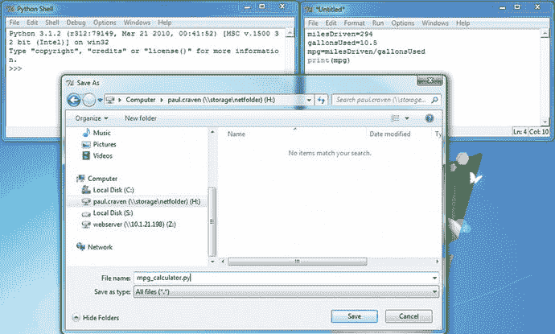
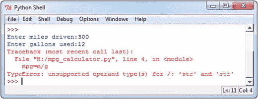
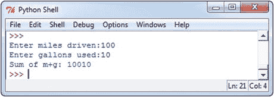

# 二、创建自定义计算器

使用 Python 可以做的最简单的事情之一就是将它用作一个奇特的计算器。等等，计算器不是游戏。为什么我们要谈论计算器？乏味的....

嘿，要计算物体掉落，子弹乱飞，高分，我们需要计算。此外，任何真正的极客都会认为计算器是一个玩具，而不是一个酷刑设备！让我们用计算器开始我们的游戏教育。别担心，我们会在第六章前开始制图。

一个简单的计算器程序可以用来向用户询问信息，然后计算一些无聊的事情，如抵押贷款，或者更令人兴奋的事情，如泥球抛向空中的轨迹。

下图显示了一个计算动能的示例程序，这是我们在游戏物理引擎中可能需要做的事情。

用 Python 计算动能

作为一个程序来做这件事最大的好处是能够隐藏方程式的复杂性。用户需要做的只是提供信息，他或她就能以一种易于理解的格式得到结果。任何类似的定制计算器都可以在智能手机上运行，让人们可以在旅途中轻松完成计算。

## 印刷

### 打印文本

一个程序如何把东西打印到屏幕上？代码很简单。只需要一行代码:

`print("Hello World.")`

这个程序将“Hello World”打印到屏幕上。继续前进，进入空闲提示，看看它是如何工作的。尝试打印其他单词和短语。计算机会很乐意打印出你喜欢的任何东西，不管是真是假。

其他计算机编程语言的“Hello World”程序是什么样子的？查看维基百科。他们保存了一套用多种不同的计算机编程语言编写的“Hello World”程序: [`http://en.wikipedia.org/wiki/Hello_world_program_examples`](http://en.wikipedia.org/wiki/Hello_world_program_examples) 。

看到有多少种不同的计算机语言是很有趣的。你可以通过“Hello World”程序的简单程度来了解一门语言有多复杂。

记住，Python 中的打印命令很简单。用`print`就行了。在`print`命令之后是一组括号()。这些括号内是应该打印到屏幕上的内容。使用括号向函数传递信息是数学和计算机语言中的标准做法。

学数学的学生学习使用圆括号来计算像$ sin(\ theta)= cos(\ frac { \ pi } { 2 }-\ theta)$这样的表达式。$sin$和$cos$是函数。传递给这些函数的数据在括号内。在我们的例子中，不同的是传递的信息是文本。

请注意，要打印的文本周围有双引号。如果打印语句在文本周围有引号，计算机将按原样打印出来。例如，该程序将打印 2+3:

`print("2 + 3")`

### 打印表达式的结果

下一个程序在$2+3$附近没有引号，计算机将把它作为一个数学表达式来计算。它将打印 5 而不是 2+3。

`print(2 + 3)`

下面的代码将生成一个错误，因为计算机将尝试将“Hello World”作为一个数学表达式来计算，但这根本行不通:

`print(Hello World)`

上面的代码会打印出一个错误`SyntaxError: invalid syntax,`，这是计算机的说法，表示不知道“Hello”和“World”是什么意思。

另外，请记住，这是单引号:`’`，这是双引号:`"`。如果我要求一个双引号，这是一个常见的错误，写`"",`实际上是一个双，双引号。

### 打印多个项目

一条`print`语句可以一次输出多项内容，每项内容用逗号分隔。例如，这段代码将打印出`Your new score is 1040`:

`print("Your new score is", 1030 + 10)`

下一行代码将打印出`Your new score is 1030+10`。这些数字没有加在一起，因为它们在引号内。引号内的任何内容，计算机都视为文本。计算机之外的任何东西都认为是数学语句或计算机代码。

`print("Your new score is", "1030 + 10")`

逗号在引号内还是引号外？

下一个代码示例根本不工作。这是因为引号和 1030+10 之间没有逗号分隔文本。起初，可能看起来有一个逗号，但逗号在引号内。分隔要打印的术语的逗号必须在引号之外。如果程序员想要打印一个逗号，那么它必须在引号内:

`print("Your new score is," 1030 + 10)`

下一个例子是可行的，因为有一个逗号分隔两个术语。它打印:

`Your new score is, 1040`

注意，只有一个逗号打印出来。引号外的逗号分隔术语，引号内的逗号打印出来。打印第一个逗号；第二个用于分隔术语。

`print("Your new score is,", 1030 + 10)`

## 转义码

如果用引号来告诉计算机你想打印的文本串的开始和结束，程序如何打印出一组双引号呢？例如:

`print("I want to print a double quote " for some reason.")`

这个代码不起作用。计算机查看字符串中间的引号，并认为这是文本的结尾。然后它不知道如何处理命令`for some reason`，引号和字符串的结尾会让计算机更加困惑。

有必要告诉计算机，我们想把中间的双引号当作文本，而不是字符串结尾的引号。这很简单:只要在引号前加上一个反斜杠，告诉计算机它是字符串的一部分，而不是终止字符串的字符。例如:

`print("I want to print a double quote \" for some reason.")`

这两个字符`\"`的组合称为转义码。几乎每种语言都有。因为反斜杠被用作转义码的一部分，所以反斜杠本身必须被转义。例如，以下代码无法正常工作:

`print("The file is stored in C:\new folder")`

为什么？因为`\n`是转义码。要打印反斜杠，必须像这样对它进行转义:

`print("The file is stored in C:\\new folder")`

还有一些其他重要的转义码需要知道。下面是重要转义码的表格:

<colgroup><col> <col></colgroup> 
| 转义码 | 描述 |
| --- | --- |
| \' | 单引号 |
| \" | 双引号 |
| \t | 标签 |
| \r | 回车(向左移动) |
| \n | 换行(向下移动) |

什么是回车，什么是换行？试试这个例子:

`print("This\nis\nmy\nsample.")`

该命令的输出是:

`This`

`is`

`my`

`sample.`

`\n`是一个换行符号。它将光标移动到计算机将向下打印一行文本的位置。计算机将所有文本存储在一个很长的行中。由于放置了`\n`字符，它知道在不同的行上显示文本。

更复杂的是，不同的操作系统对行尾有不同的标准。

<colgroup><col> <col></colgroup> 
| 转义码 | 描述 |
| --- | --- |
| `\r\n` | CR+LF:微软视窗 |
| `\n` | LF:基于 UNIX 的系统，以及更新的 MAC |
| `\r` | CR:基于 Mac 的旧系统 |

通常你的文本编辑器会帮你处理这个问题。Microsoft Notepad 则不然，在 Notepad 中打开的 UNIX 文件看起来很糟糕，因为行尾根本不显示，或者显示为黑框。每个程序员都应该在他们的电脑上安装一个好的文本编辑器。我推荐 Sublime ( [`www.sublimetext.com/`](http://www.sublimetext.com/) )或者 Notepad++ ( [`http://notepad-plus-plus.org/`](http://notepad-plus-plus.org/) )。

## 评论

评论很重要(即使电脑忽略了)！

有时代码需要向阅读它的人做一些额外的解释。为此，我们向代码中添加注释。注释是给阅读代码的人看的，而不是给计算机看的。

创建评论有两种方法。第一种是使用`#`符号。计算机将忽略 Python 程序中出现在`#`之后的任何文本。例如:

`# This is a comment, it begins with a # sign`

`# and the computer will ignore it.`

`print("This is not a comment, the computer will")`

`print("run this and print it out.")`

如果一个程序在引号之间有一个`#`符号，它不会被当作一个注释。程序员可以通过在一行代码前面放一个`#`符号来禁用它。也可以在行尾添加注释。

`print("A # sign between quotes is not a comment.")`

`# print("This is a comment, even if it is computer code.")`

`print("Hi") # This is an end-of-line comment`

可以在一行中使用三个单引号来分隔注释，从而注释掉多行代码。

`print("Hi")`

`’’’`

`This is`

`a`

`multi`

`line`

`comment. Nothing`

`Will run in between these quotes.`

`print("There")`

`’’’`

`print("Done")`

大多数专业的 Python 程序员只会对叫做 docstrings 的东西使用这种类型的多行注释。Docstrings 允许文档与代码一起编写，然后自动提取到打印文档、网站和集成开发环境(ide)中。对于一般的注释，`#`标签效果最好。

即使你是唯一一个阅读你写的代码的人，注释也可以帮助节省时间。添加“处理外星人炸弹”的注释可以让你快速记住那段代码做了什么，而不必阅读和破译它。

## 赋值运算符

我们如何在游戏中存储分数？或者跟踪敌人的健康状况？我们需要做的是赋值操作符。

运算符是类似于`+`或`-`的符号。赋值运算符是`=`符号。它将一个值存储到一个变量中，供以后使用。下面的代码将把 10 赋给变量`x`，然后打印存储在 x 中的值。

看看下面的例子。

`# Create a variable x`

`# Store the value 10 into it.`

`x = 10`

`# This prints the value stored in x.`

`print(x)`

`# This prints the letter x, but not the value in x`

`print("x")`

`# This prints "x= 10"`

`print("x=", x)`

变量在引号之外，而不是在里面。

Note

上面的清单还展示了打印内部引号`x`和外部引号`x`的区别。如果一个`x`在引号内，那么计算机打印`x`。如果`x`在引号之外，计算机将打印`x`的值。对于学习编程的人来说，对“引号内还是引号外”这个问题感到困惑是很常见的。

赋值语句(使用`=`操作符的一行代码)不同于你在数学中学到的代数等式。不要认为它们是一样的。赋值运算符的左侧必须正好有一个变量。那里可能没有别的东西。

等号/赋值运算符的右边是一个表达式。表达式是计算结果为值的任何东西。检查下面的代码。

`x = x + 1`

上面的代码显然不可能是代数等式。但是它对计算机是有效的，因为它是一个赋值语句。数学方程不同于赋值语句，即使它们有变量、数字和等号。

语句上面的代码获取当前值`x`，加 1，并将结果存储回`x`。

扩展我们的示例，下面的语句将打印数字 6。

`x = 5`

`x = x + 1`

`print(x)`

语句按顺序运行。计算机不会向前看。在下面的代码中，计算机将在第 2 行打印出 5，然后第 4 行打印出 6。这是因为在第 2 行，给 x 加 1 的代码还没有运行。

`x = 5`

`print(x) # Prints 5`

`x = x + 1`

`print(x) # Prints 6`

下一个语句是有效的，将运行，但它是无意义的。计算机会给 x 加 1，但结果不会被存储或打印出来。

`x + 1`

下面的代码将打印 5 而不是 6，因为程序员忘记将`x + 1`的结果存储回变量`x`中。

`x = 5`

`x + 1`

`print(x)`

下面的语句无效，因为等号的左边不仅仅是一个变量:

`x + 1 = x`

Python 还有其他类型的赋值操作符。它们允许程序员很容易地修改变量。例如:

`x += 1`

上面的语句相当于编写下面的代码:

`x = x + 1`

还有用于加法、减法、乘法和除法的赋值运算符。

## 变量

变量以小写字母开头。

变量应该以小写字母开头。变量可以以大写字母或下划线开头，但这是特殊情况，不应该在正常情况下使用。在第一个小写字母之后，变量可以包括大写和小写字母，以及数字和下划线。变量不能包含空格。

变量区分大小写。如果程序员没有预料到，这可能会令人困惑。在下面的代码中，输出将是 6 而不是 5，因为有两个不同的变量，`x`和`X`。

`x = 6`

`X = 5`

`print(x)`

Python 的官方风格指南(是的，程序员真的写了一本关于风格的书)说 Python 中的多字变量名应该用下划线隔开。比如用`hair_style`，不用`hairStyle`。就我个人而言，我并不太关心这个规则，因为我们引入的下一种语言 Java 有完全相反的风格规则。我曾经尝试在这样的章节中教授 Java 风格的规则，但是后来我开始收到 Python 爱好者的恐吓信。这些人来到我的网站，对我糟糕的风格感到震惊。

琼·里弗斯没有这些人，所以我放弃了，现在尝试使用适当的风格指南。

以下是一些可以使用和不可以使用的变量名示例:

<colgroup><col> <col> <col></colgroup> 
| 合法变量名 | 非法变量名 | 合法，但不正当 |
| --- | --- | --- |
| `first_name` | `first name` | `FirstName` |
| `distance` | `9ds` | `firstName` |
| `ds9` | `%correct` | `X` |

只有在变量值永远不会改变的情况下，才允许使用像`MAX_SPEED`这样的大写变量名。不是可变的变量叫做常数。

## 经营者

对于更复杂的数学运算，可以使用常见的数学运算符。还有一些不常见的:

<colgroup><col> <col> <col> <col></colgroup> 
| 操作员 | 操作 | 示例方程 | 示例代码 |
| --- | --- | --- | --- |
| + | 添加 | 3 + 2 | a = 3 + 2 |
| - | 减法 | 3 - 2$ | a = 3 - 2 |
| * | 增加 | 3′2 | a = 3 * 2 |
| / | 分开 |  | a = 10 / 2 |
| // | 楼层划分 | 不适用的 | a = 10 // 3 |
| ** | 力量 | 2 3 | a = 2 ** 3 |
| % | 系数 | 不适用的 | a = 8 % 3 |

地板除法总是将答案四舍五入到最接近的整数。例如，`11//2`将是 5，而不是 5.5，`99//100`将等于 0。

在 Python 中，并置乘法不起作用。下面两行代码将不起作用:

`# These do not work`

`x = 5y`

`x = 5(3/2)`

有必要使用乘法运算符来使这些代码行工作:

`# These do work`

`x = 5 * y`

`x = 5 * (3 / 2)`

### 运算符间距

运算符前后可以有任意数量的空格，计算机可以很好地理解。例如，这三行中的每一行都是等价的:

`x=5*(3/2)`

`x = 5 * (3 / 2)`

`x      =5     *(    3/   2)`

Python 的官方风格指南说每个操作符前后都应该有一个空格。(你一直很想知道，对吧？好了，python 代码的官方风格指南叫做 [PEP-8](http://www.python.org/dev/peps/pep-0008/) ( [`http://www.python.org/dev/peps/pep-0008/`](http://www.python.org/dev/peps/pep-0008/) )。更多精彩请查阅)。在上面的三行代码中，最有风格的是第 2 行。

## 操作顺序

Python 将使用标准数学表达式中预期的相同运算顺序来计算表达式。例如，该等式不能正确计算平均值:

`average = 90 + 86 + 71 + 100 + 98 / 5`

完成的第一个操作是 98/5。计算机计算出:

而不是所期望的:

使用括号可以解决这个问题:

`average = (90 + 86 + 71 + 100 + 98) / 5`

## 触发函数

三角函数用于计算等式中的正弦和余弦。默认情况下，Python 不知道如何计算正弦和余弦，但是一旦导入了适当的库，它就可以了。单位为弧度。

`# Import the math library`

`# This line is done only once, and at the very top`

`# of the program.`

`from math import *`

`# Calculate x using sine and cosine`

`x = sin(0) + cos(0)`

## 自定义公式计算器

一个程序可以用 Python 计算一辆汽车用 10.5 加仑汽油行驶 294 英里的里程。

`m = 294 / 10.5`

`print(m)`

这个程序可以通过使用变量来改进。这允许在不修改等式的情况下在代码中容易地改变值。

`m = 294`

`g = 10.5`

`m2 = m / g # This uses variables instead`

`print(m2)`

好的变量名很重要。

这个节目本身其实很难理解。没有上下文，变量`m`和`g`没有什么意义。通过使用适当命名的变量，可以使程序更容易理解:

`miles_driven = 294`

`gallons_used = 10.5`

`mpg = miles_driven / gallons_used`

`print(mpg)`

现在，即使一个非程序员也可能看着这个程序并对它的功能有一个很好的想法。另一个好的和不好的变量命名的例子:

`# Hard to understand`

`ir = 0.12`

`b = 12123.34`

`i = ir * b`

`# Easy to understand`

`interest_rate = 0.12`

`account_balance = 12123.34`

`interest_amount = interest_rate * account_balance`

在空闲编辑器中，可以编辑先前的行，而无需重新键入。将光标移动到该行并按回车键即可。它将被复制到当前行。

在`>>>`提示符下输入 Python 代码很慢，一次只能输入一行。也不可能保存代码以便其他人可以运行它。谢天谢地，有一种更好的方法来输入 Python 代码。

可以使用脚本输入 Python 代码。脚本是一系列将被一次执行的 Python 代码行。要创建脚本，打开一个新窗口，如下图所示。

输入脚本

您可能希望使用不同的程序来创建您的脚本，如 Wing IDE 或 PyCharm。这些程序比 Python 自带的空闲程序更容易、更强大。

进入计算汽油里程的 Python 程序，然后保存文件。将文件保存到闪存驱动器、网络驱动器或您选择的其他位置。Python 程序应该总是以`.py`结尾。见下图。

保存脚本

点击运行菜单，选择运行模块，运行输入的程序。尝试将程序更新为行驶里程和使用加仑数的不同值。

小心，常见错误！

从这一点开始，几乎所有输入的代码都应该在脚本/模块中。不要在 IDLE `>>>`提示符下输入你的程序。在此键入的代码不会被保存。如果发生这种情况，就需要重新开始。这是新程序员非常容易犯的错误。

如果这个程序能够与用户交互并询问用户行驶的英里数和使用的加仑数，那么它将会更加有用。这可以通过`input`语句来完成。参见下面的代码:

`# This code almost works`

`miles_driven = input("Enter miles driven:")`

`gallons_used = input("Enter gallons used:")`

`mpg = miles_driven / gallons_used`

`print("Miles per gallon:", mpg)`

运行这个程序会向用户询问英里和加仑，但它会产生一个奇怪的错误，如下图所示。

运行 MPG 程序时出错

这个错误的原因可以通过稍微修改程序来说明:

`miles_driven = input("Enter miles driven:")`

`gallons_used = input("Enter gallons used:")`

`x = miles_driven + gallons_used`

`print("Sum of m + g:", x)`

运行上面的程序会产生如下所示的输出。

添加不正确

这个程序不会把这两个数字加在一起:它只是把一个数字放在另一个数字之后。这是因为程序不知道用户将输入数字。用户可以输入 Bob 和 Mary，将这两个变量加在一起就是 BobMary，这样更有意义。

为了告诉计算机这些是数字，有必要用一个`int( )`或一个`float( )`包围`input`函数。前者用于整数，后者用于浮点数。

最终工作程序:

`# Sample Python/Pygame Programs`

`# Simpson College Computer Science`

`#`[`http://programarcadegames.com/`T3】](http://programarcadegames.com/)

`#`[`http://simpson.edu/computer-science/`T3】](http://simpson.edu/computer-science/)

`# Explanation video:`[`http://youtu.be/JK5ht5_m6Mk`T3】](http://youtu.be/JK5ht5_m6Mk)

`# Calculate Miles Per Gallon`

`print("This program calculates mpg.")`

`# Get miles driven from the user`

`miles_driven = input("Enter miles driven:")`

`# Convert text entered to a`

`# floating point number`

`miles_driven = float(miles_driven)`

`# Get gallons used from the user`

`gallons_used = input("Enter gallons used:")`

`# Convert text entered to a`

`# floating point number`

`gallons_used = float(gallons_used)`

`# Calculate and print the answer`

`mpg = miles_driven / gallons_used`

`print("Miles per gallon:", mpg)`

另一个例子，计算物体的动能:

`# Sample Python/Pygame Programs`

`# Simpson College Computer Science`

`#`[`http://programarcadegames.com/`T3】](http://programarcadegames.com/)

`#`[`http://simpson.edu/computer-science/`T3】](http://simpson.edu/computer-science/)

`# Calculate Kinetic Energy`

`print("This program calculates the kinetic energy of a moving object.")`

`m_string = input("Enter the object’s mass in kilograms: ")`

`m = float(m_string)`

`v_string = input("Enter the object’s speed in meters per second: ")`

`v = float(v_string)`

`e = 0.5 * m * v * v`

`print("The object has " + str(e) + " joules of energy.")`

为了缩短程序，可以将`input`语句嵌套到`float`语句中。例如，这几行代码:

`milesDriven = input("Enter miles driven:")`

`milesDriven = float(milesDriven)`

执行与此行相同的操作:

`milesDriven = float(input("Enter miles driven:"))`

在这种情况下，`input`功能的输出被直接输入到`float`功能中。哪一个都行，选择哪个是程序员的喜好问题。然而，能够理解这两种形式是很重要的。

## 回顾

### 多项选择测验

What is the correct code to print out the words ’Hello World’ to the screen? `print (Hello World)`   `print ’Hello World’`   `print {’Hello World’}`   `print Hello World`   `print [’Hello World’]`   `print ("Hello World")`   `print {’Hello World’}`     What does this code output? `a = 1` `b = 3` `print(a + b)` `A+B`   `a+b`   `"a+b"`   `4`   `1+3`   Nothing, the code is invalid.     What does this code output? `a = 1` `b = 3` `print("a+b")` `A+B`   `a+b`   `"a+b"`   The values of a and b added together.   `10`   Nothing, the code is invalid.     What does this code output? `print("The answer to 10+10 is," 10+10)` `The answer to 10+10 is 10+10`   `The answer to 10+10 is 20`   `The answer to 10+10 is10+10`   `The answer to 10+10 is20`   `The answer to 10+10 is,10+10`   `The answer to 10+10 is,20`   Nothing, the code is invalid.     What does this code output? `# print("Hello")` `Hello`   `"Hello"`   Nothing, there is an error in the code.   Nothing, the code is commented out.     What does this code output? `x = 10` `print("x")` `"x"`   `x`   `10`   Nothing     What does this code output? `x = 10` `x + 1` `print(x)` `10`   `11`   `"x"`   `x`   Nothing     What does this code output? `x = 10 + 6 / 2` `x = x + 1` `print(x)` `8`   `9`   `13`   `14`   Nothing     What does this code output? `x = input("Enter a value:")` `print(x / 2)` `10`   `0`   The value the user entered.   The value the user entered divided by two.   An error because the value was not converted to a number.     What does this code output? `print("Have a "great" day!")` `"Have a "great" day!"`   `Have a "great" day!`   `Have a great day!`   Nothing, the double quotes make for a syntax error.     What does this code output? `print("Save in c:\new folder")` `Save in c:\new folder`   `Save in c:` `ew folder`   `Save in c:ew folder`   Nothing, the escape code makes for a syntax error.    

### 简答工作表

Write a line of code that will print your name.   How do you enter a comment in a program?   What do the following lines of code output? ALSO: Why do they give a different answer? `print(2 / 3)` `print(2 // 3)`   Write a line of code that creates a variable called `pi` and sets it to an appropriate value.   Why does this code not work? `A = 22` `print(a)`   All of the variable names below can be used. But which ONE of these is the better variable name to use? `a` `A` `Area` `AREA` `area` `area_of_rectangle` `Area_Of_Rectangle`   Which of these variables names are not allowed in Python? (More than one might be wrong. Also, this question is not asking about improper names, just names that aren’t allowed. Test them if you aren’t sure.) `apple` `Apple` `APPLE` `Apple2` `1Apple` `account number` `account_number` `account.number` `accountNumber` `account#` `pi` `PI` `fred` `Fred` `GreatBigVariable` `greatBigVariable` `great_big_variable` `great.big.variable` `2x` `x2x` `total%` `#left`   Why does this code not work? `print(a)` `a = 45`   Explain the mistake in this code: `pi = float(3.14)`   This program runs, but the code still could be better. Explain what is wrong with the code. `radius = float(input("Radius:"))` `x = 3.14` `pi = x` `area = pi  * radius ** 2` `print(area)`   Explain the mistake in the following code: `x = 4` `y = 5` `a = ((x) * (y))` `print(a)`   Explain the mistake in the following code: `x = 4` `y = 5` `a = 3(x + y)` `print(a)`   Explain the mistake in the following code: `radius = input(float("Enter the radius:"))`   Do all these print the same value? Which one is better to use and why? `print(2/3+4)` `print(2 / 3 + 4)` `print(   2 /    3+    4  )`   What is a constant?   How are variable names for constants different than other variable names?   What is a single quote and what is a double quote? Give and label an example of both.   Write a Python program that will use escape codes to print a double quote and a new line using the Window’s standard. (Note: I’m asking for the Window’s standard here. Look it up out of [Chapter 1](01.html).)   Can a Python program print text to the screen using single quotes instead of double quotes?   Why does this code not calculate the average? `print(3 + 4 + 5 / 3)`   What is an operator in Python?   What does the following program print out? `x = 3` `x + 1` `print(x)`   Correct the following code: `user_name = input("Enter your name: )"`   Correct the following code: `value = int(input(print("Enter your age")))`  

### 锻炼

查看附录中本章附带的练习。