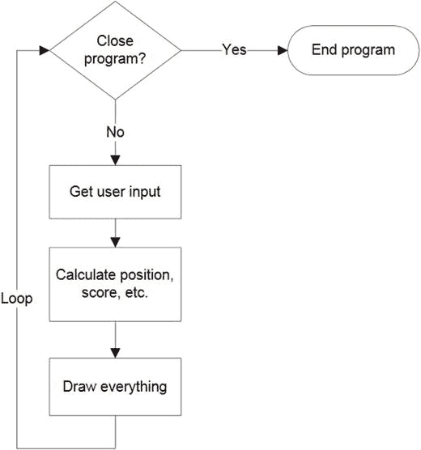
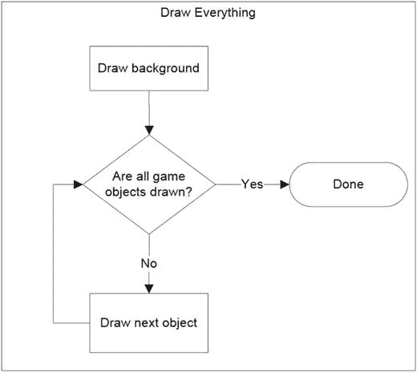

# 五、带有随机数和循环的猜谜游戏

开始学习图形之前的最后一步是学习如何循环一段代码。大多数游戏循环。他们一遍又一遍地重复同样的代码。例如，下面的数字猜谜游戏针对用户的每次猜测进行循环:

`Hi! I’m thinking of a random number between 1 and 100.`

`--- Attempt 1`

`Guess what number I am thinking of: 50`

`Too high.`

`--- Attempt 2`

`Guess what number I am thinking of: 25`

`Too high.`

`--- Attempt 3`

`Guess what number I am thinking of: 17`

`Too high.`

`--- Attempt 4`

`Guess what number I am thinking of: 9`

`Too low.`

`--- Attempt 5`

`Guess what number I am thinking of: 14`

`Too high.`

`--- Attempt 6`

`Guess what number I am thinking of: 12`

`Too high.`

`--- Attempt 7`

`Guess what number I am thinking of: 10`

`Too low.`

`Aw, you ran out of tries. The number was 11.`

等等，这跟图形和视频游戏有什么关系？很多。游戏显示的每一帧都是一次循环。你可能对游戏显示的每秒帧数(FPS)很熟悉。FPS 代表计算机每秒更新屏幕的次数。速率越高，游戏越流畅。(虽然超过 60 的 FPS 比大多数屏幕更新的速度都快，所以没有必要超过这个速度。)下图显示了游戏 Eve Online 和一个显示计算机每秒能够显示多少帧的图表。

视频游戏中的 FPS

这些游戏中的循环就像下图中的流程图一样。尽管现代游戏很复杂，但这个循环的内部类似于我们在第二章所做的计算器程序。获取用户输入。执行计算。输出结果。在电子游戏中，我们试图每秒钟重复 60 次。

游戏循环

甚至可以在其他循环中存在循环。真正的“循环循环”看看下图中的“绘制所有内容”框。这组代码循环遍历并绘制游戏中的每个对象。该循环位于绘制游戏每一帧的更大循环的内部，如下图所示。

绘制所有循环

Python 中有两种主要类型的循环:`for`循环和`while`循环。如果你想重复一定的次数，使用`for`循环。如果你想重复直到发生什么事情(比如用户点击退出按钮)，那么使用一个`while`循环。

例如，一个`for`循环可以用来打印所有的学生记录，因为计算机知道有多少学生。需要使用一个`while`循环来检查用户何时点击鼠标按钮，因为计算机不知道要等待多长时间。

## 对于循环

下面的`for`循环示例运行了五次`print`语句。它可以很容易地运行 100 或 1，000，000 次，只需将 5 改为所需的循环次数。请注意`for`循环与`if`语句的相似之处。两者都以冒号结尾，并且都使用缩进来指定语句影响哪些行。

`for i in range(5):`

`print("I will not chew gum in class.")`

`I will not chew gum in class.`

`I will not chew gum in class.`

`I will not chew gum in class.`

`I will not chew gum in class.`

`I will not chew gum in class.`

第 1 行的`i`是一个变量，记录程序循环了多少次。这是一个新变量，可以用任何合法的变量名命名。程序员经常使用`i`作为变量名，因为 I 是 increment 的缩写。这个变量有助于跟踪循环应该何时结束。

`range`函数控制循环中代码运行的次数。在这种情况下，五次。

下一个示例代码将打印五次“请”，以及“我可以去商场吗？”只有一次。“我能去商场吗？”未缩进，因此它不是`for`循环的一部分，并且在`for`循环完成之前不会打印。

`for i in range(5):`

`print("Please,")`

`print("Can I go to the mall?")`

`Please,`

`Please,`

`Please,`

`Please,`

`Please,`

`Can I go to the mall?`

下一个代码示例采用前面的示例并缩进第 3 行。这一更改将导致程序打印“请”和“我可以去商场吗？”五次。既然语句已经缩进了“我能去商场吗？”现在是`for`循环的一部分，将像单词“Please”一样重复五次。

`for i in range(5):`

`print("Please,")`

`print("Can I go to the mall?")`

`Please,`

`Can I go to the mall?`

`Please,`

`Can I go to the mall?`

`Please,`

`Can I go to the mall?`

`Please,`

`Can I go to the mall?`

`Please,`

`Can I go to the mall?`

下面的代码将打印数字 0 到 9。请注意，循环从 0 开始，不包括数字 10。人们很自然地认为`range(10)`应该包括 10，但是它刚好在 10 之下停止。

`for i in range(10):`

`print(i)`

`0`

`1`

`2`

`3`

`4`

`5`

`6`

`7`

`8`

`9`

一个程序不需要命名变量`i`；它可以被命名为其他名称。例如，如果一个程序员正在处理一个文本文件，她可能会使用`line_number`。

如果一个程序员想从 1 到 10，而不是从 0 到 9，有几种方法可以做到。第一种方法是给`range`函数发送两个数字，而不是一个。第一个数字是起始值；第二个刚好超出结束值。

这确实需要一些练习来适应这个想法，即`for`循环将包括第一个数字，但不包括列出的第二个数字。下面的例子指定了`(1,11)`的范围，数字 1 到 10 被打印出来。包括起始数字 1，但不包括结束数字 11。

`for i in range(1, 11):`

`print(i)`

`1`

`2`

`3`

`4`

`5`

`6`

`7`

`8`

`9`

`10`

另一种打印数字 1 到 10 的方法是仍然使用`range(10)`并让变量`i`从 0 到 9。但是就在打印出变量之前，程序员给它加了一。这也适用于打印数字 1 到 10。两种方法都可以。

`# Print the numbers 1 to 10.`

`for i in range(10):`

`print(i + 1)`

### 用一以外的数字计数

如果程序需要按 2s 计数或使用其他增量，这很容易。就像以前一样有两种方法。最简单的方法是向 range 函数提供第三个数字，告诉它按 2s 计数。第二种方法是从 1 开始计数，但是将变量乘以 2。下面的代码示例显示了这两种方法。

`# Two ways to print the even numbers 2 to 10`

`for i in range(2,12,2):`

`print(i)`

`for i in range(5):`

`print((i + 1) * 2)`

`2`

`4`

`6`

`8`

`10`

`2`

`4`

`6`

`8`

`10`

也可以通过给距离函数一个负的步长来倒计数到零。在下面的例子中，从 10 开始，下降到 0，但不包括 0，并以-1 为增量。创建这些循环最困难的部分是不小心交换了开始和结束的数字。程序从较大的值开始，所以它先运行。正常的`for`循环从`range`函数中首先列出的最小值开始递增计数。

`for i in range(10, 0, -1):`

`print(i)`

`10`

`9`

`8`

`7`

`6`

`5`

`4`

`3`

`2`

`1`

如果程序需要迭代的数字没有形成一个简单的模式，就有可能从列表中取出数字。(对列表的全面讨论包含在第 8 章中。这只是你能做的预览。)

`for i in [2,6,4,2,4,6,7,4]:`

`print(i)`

这将打印:

`2`

`6`

`4`

`2`

`4`

`6`

`7`

`4`

### 嵌套循环

试着预测下面的代码会输出什么。然后输入代码，看是否正确。

`# What does this print? Why?`

`for i in range(3):`

`print("a")`

`for j in range(3):`

`print("b")`

下一个代码块与上面的代码块几乎相同。第二个`for`循环缩进了一个制表位，因此它现在嵌套在第一个`for`循环内。这极大地改变了代码的运行方式。试试看。

`# What does this print? Why?`

`for i in range(3):`

`print("a")`

`for j in range(3):`

`print("b")`

`print("Done")`

我不会告诉你代码是做什么的。去电脑前看看。

### 保持累计总数

处理循环的一个常见操作是保存运行总数。这种“累计”代码模式在本书中被大量使用。保持一个分数的运行总数，合计一个人的帐户交易，使用总数来找到平均值，等等。您可能希望将这个代码清单加入书签，因为我们会多次引用它。在下面的代码中，用户输入五个数字，代码对它们的值求和。

`total = 0`

`for i in range(5):`

`new_number = int(input("Enter a number: " ))`

`total += new_number`

`print("The total is: ", total)`

注意，第 1 行创建了变量`total`,并将其初始数量设置为零。很容易忘记需要创建变量并将其初始化为零。如果没有它，计算机会在碰到第 4 行时报错。它不知道如何将`new_number`加到`total`上，因为还没有给`total`赋值。

一个常见的错误是用`i`到`total`代替`new_number`。请记住，我们保存的是用户输入值的累计，而不是当前循环计数的累计。

说到当前循环计数，我们可以用循环计数值来解决一些数学运算。例如:

如果你不熟悉这种公式，这只是一种奇特的表述方式:

s = 1 + 2 + 3 + 4 + 5...98 + 99 + 100

下面的代码将从 1 到 100 的所有数字相加。它演示了一个常见的模式，其中运行总数保存在一个循环中。这也使用一个单独的变量`sum`来跟踪运行总数。

`# What is the value of sum?`

`sum = 0`

`for i in range(1, 101):`

`sum = sum + i`

`print(sum)`

这里有一个不同的变体。它从用户那里获取五个数字，并计算用户输入零的次数:

`total = 0`

`for i in range(5):`

`new_number = int(input( "Enter a number: "))`

`if new_number == 0:`

`total += 1`

`print("You entered a total of", total, "zeros")`

理解嵌套的`for`循环和运行总数的程序员应该能够预测下面代码的输出。

`# What is the value of a?`

`a = 0`

`for i in range(10):`

`a = a + 1`

`print(a)`

`# What is the value of a?`

`a = 0`

`for i in range(10):`

`a = a + 1`

`for j in range(10):`

`a = a + 1`

`print(a)`

`# What is the value of a?`

`a = 0`

`for i in range(10):`

`a = a + 1`

`for j in range(10):`

`a = a + 1`

`print(a)`

这一部分不要看得太快。试一试，预测上面代码的输出。然后复制到一个 Python 程序里运行一下，看看自己是不是对的。如果你不是，找出原因。

## 循环示例

这个示例代码涵盖了常见的`for`循环，并展示了它们是如何工作的。

`# Sample Python/Pygame Programs`

`#`[`http://programarcadegames.com/`T3】](http://programarcadegames.com/)

`# Print ’Hi’ 10 times`

`for i in range(10):`

`print("Hi")`

`# Print ’Hello’ 5 times and ’There’ once`

`for i in range(5):`

`print("Hello")`

`print("There")`

`# Print ’Hello’ ’There’ 5 times`

`for i in range(5):`

`print("Hello")`

`print("There")`

`# Print the numbers 0 to 9`

`for i in range(10):`

`print(i)`

`# Two ways to print the numbers 1 to 10`

`for i in range(1, 11):`

`print(i)`

`for i in range(10):`

`print(i + 1)`

`# Two ways``to`T2】

`for i in range(2, 12, 2):`

`print(i)`

`for i in range(5):`

`print((i + 1) * 2)`

`# Count down from 10 down to 1 (not zero)`

`for i in range(10, 0, -1):`

`print(i)`

`# Print numbers out of a list`

`for i in [2, 6, 4, 2, 4, 6, 7, 4]:`

`print(i)`

`# What does this print? Why?`

`for i in range(3):`

`print("a")`

`for j in range(3):`

`print("b")`

`# What is the value of a?`

`a = 0`

`for i in range(10):`

`a = a + 1`

`print(a)`

`# What is the value of a?`

`a = 0`

`for i in range(10):`

`a = a + 1`

`for j in range(10):`

`a = a + 1`

`print(a)`

`# What is the value of a?`

`a = 0`

`for i in range(10):`

`a = a + 1`

`for j in range(10):`

`a = a + 1`

`print(a)`

`# What is the value of sum?`

`sum = 0`

`for i``in`T2】

`sum = sum + i`

## while 循环

当一个程序知道它需要重复一段代码一定的次数时，就会使用一个`for`循环。当一个程序需要循环直到一个特定的条件发生时，使用一个`while`循环。

奇怪的是，`while`循环可以用在任何使用`for`循环的地方。它可用于循环，直到增量变量达到某个值。如果一个`while`循环可以做任何事情，为什么还要有一个`for`循环呢？`for`循环更容易使用和编码。一个看起来像这样的`for`循环:

`for i in range(10):`

`print(i)`

…可以通过如下所示的`while`循环来完成:

`i = 0`

`while i < 10:`

`print(i)`

`i = i + 1`

`while`循环的第 1 行设置了一个“sentinel”变量，用于计算循环执行的次数。这在一个`for`循环中自动发生，减少了一行代码。第 2 行包含实际的`while`循环。`while`循环的格式与`if`语句非常相似。如果条件成立，循环中的代码将重复。第 4 行增加了增量值。在一个`for`循环中，这自动发生，消除了另一行代码。从代码中可以看出，`for`循环比`while`循环更紧凑，也更容易阅读。否则，程序会用一个`while`循环做所有的事情。

一个常见的错误是混淆了`for`循环和`while`循环。下面的代码显示了一个无法在`for`循环和`while`循环之间做出决定的程序员。

`while range(10):`

`print(i)`

不要将`range`与`while`循环一起使用！

`range`功能仅适用于`for`循环。不要与`while`回路一起使用！

### 使用增量运算符

增量运算符通常与`while`循环一起使用。可以简化代码:

`i = i + 1`

包含以下内容:

`i += 1`

在`while`循环中，它看起来像是:

`i = 0`

`while i < 10:`

`print(i)`

`i += 1`

这也可以用减法和乘法来完成。例如:

`i *= 2`

与以下内容相同:

`i = i * 2`

看看你能不能想出这个会打印出什么:

`i = 1`

`while i <= 2 ** 32:`

`print(i)`

`i *= 2`

### 循环，直到用户想要退出

一个非常常见的操作是循环，直到用户执行退出请求:

`quit = "n"`

`while quit == "n":`

`quit = input("Do you want to quit? ")`

循环可能有几种退出方式。使用布尔变量来触发事件是一种处理方式。这里有一个例子:

`done = False`

`while not done:`

`quit = input("Do you want to quit? ")`

`if quit == "y":`

`done = True`

`attack = input("Does your elf attack the dragon? ")`

`if attack == "y":`

`print("Bad choice, you died.")`

`done = True`

尽管这并不完美，因为如果用户说她想退出，代码仍然会询问她是否想攻击龙。你怎么解决这个问题？

下面是一个使用`while`循环的例子，其中代码重复，直到值足够接近零:

`value = 0`

`increment = 0.5`

`while value < 0.999:`

`value += increment`

`increment *= 0.5`

`print(value)`

### while 循环的常见问题

程序员想从 10 开始倒数。出了什么问题，如何解决？

`i = 10`

`while i == 0:`

`print(i)`

`i -= 1`

这个试图数到 10 的循环有什么问题？运行时会发生什么？应该怎么修？

`i = 1`

`while i < 10:`

`print(i)`

## while 循环示例

这里有一个程序，涵盖了我们刚刚谈到的`while`循环的不同用法。

`# Sample Python/Pygame Programs`

`#`[`http://programarcadegames.com/`T3】](http://programarcadegames.com/)

`# A while loop can be used anywhere a for loop is used:`

`i = 0`

`while i < 10:`

`print(i)`

`i = i + 1`

`# This is the same as:`

`for i in range(10):`

`print(i)`

`# It is possible to short hand the code:`

`# i = i + 1`

`# With the following:`

`# i += 1`

`# This can be done with subtraction, and multiplication as well.`

`i = 0`

`while i < 10:`

`print(i)`

`i += 1`

`# What would this print?`

`i = 1`

`while i <= 2**32:`

`print(i)`

`i *= 2`

`# A very common operation is to loop until the user performs`

`# a request to quit`

`quit = "n"`

`while quit == "n":`

`quit = input("Do you want to quit? ")`

`# There may be several ways for a loop to quit. Using a boolean`

`# to trigger the event is a way of handling that.`

`done = False`

`while not done:`

`quit = input("Do you want to quit? ")`

`if quit == "y":`

`done = True`

`attack =``input`T2】

`if attack == "y":`

`print("Bad choice, you died.")`

`done = True`

`value = 0`

`increment = 0.5`

`while value < 0.999:`

`value += increment`

`increment *= 0.5`

`print(value)`

`# -- Common problems with while loops --`

`# The programmer wants to count down from 10`

`# What is wrong and how to fix it?`

`i = 10`

`while i == 0:`

`print(i)`

`i -= 1`

`# What is wrong with this loop that tries`

`# to count to 10? What will happen when it is run?`

`i = 1`

`while i < 10:`

`print(i)`

## 随机数

随机数在计算机科学中大量用于涉及游戏或模拟的程序。

### randrange 函数

默认情况下，Python 不知道如何生成随机数。有必要让 Python 导入一个可以创建随机数的代码库。所以要使用随机数，首先应该出现在程序顶部的是一个`import`语句:

`import random`

就像 pygame 一样，重要的是不要创建与导入的文件同名的文件。创建一个名为`random.py`的文件将导致 Python 开始导入那个文件，而不是创建随机数的系统库。

之后，可以用`randrange`函数创建随机数。例如，这段代码创建从 0 到 49 的随机数。默认情况下，下限为 0。

`my_number = random.randrange(50)`

下一个代码示例生成 100 到 200 之间的随机数。就像`range`函数一样，第二个参数指定了一个不包含的上限。因此，如果您想要 200 以内的随机数，请指定 201。

`my_number = random.randrange(100, 201)`

如果你不想要一个数字，而是一个随机的项目呢？这需要一份清单。在第 8 章之前，我们不会详细介绍列表，但是为了给你一个从列表中随机选择一个项目的预览，请看下面:

`my_list = ["rock", "paper", "scissors"]`

`random_index = random.randrange(3)`

`print(my_list[random_index])`

### `random`功能

所有先前的代码都生成整数。如果需要浮点数，程序员可以使用`random`功能。

下面的代码生成一个从 0 到 1 的随机数，例如 0.4355991106620656。

`my_number = random.random()`

通过一些简单的数学运算，这个数字是可以调整的。例如，下面的代码生成一个介于 10 和 15 之间的随机浮点数:

`my_number = random.random() * 5 + 10`

## 回顾

### 多项选择测验

What does this code print? `for x in range(4):`         `print("Hello")` The word Hello 3 times   The word Hello 4 times   The word Hello 5 times   It will print nothing   It will print Hello forever   Nothing, it won’t run     What does this code print? `for y in range(4):`         `print("y")` The numbers 0 to 3   The numbers 0 to 4   The numbers 1 to 3   The numbers 1 to 4   It will print “y” four times   Nothing, it won’t run     What does this code print? `for y in range(4):`         `print(y)` The numbers 0 to 3   The numbers 0 to 4   The numbers 1 to 3   The numbers 1 to 4   It will print “y” four times   Nothing, it won’t run     What does this code print? `for y in range(1, 11):`         `print(y)` The numbers 0 to 11   The numbers 1 to 11   The numbers 1 to 10   The numbers 0 to 10   Nothing, it won’t run     What does this code print? `for y in range(2, 12, 2):`         `print(y + 1)` The even numbers 2 to 12   The even numbers 2 to 10   The odd numbers 3 to 11   The odd numbers 3 to 13   Nothing, it won’t run     What does this code print? `a=0` `for i in range(10):`     `a += 1` `print(a)` 9   10   11   Nothing, it won’t run     What does this code print? `a = 0` `for i in range(10):`     `a += 1` `for j in range(10):`         `a += 1` `print(a)` 10   20   18   100   Nothing, it won’t run     What does this code print? `a = 0` `for i in range(10):`         `for j in range(10):`                 `a += 1` `print(a)` 10   20   110   100   Nothing, it won’t run     What does this code print? `a = 0` `for i in range(10):`         `a += 1`         `for j in range(10):`                 `a += 1` `print(a)` 10   20   110   100   Nothing, it won’t run     When should a programmer use a `for` loop instead of a `while` loop? `for` loops are used to when there is a set number of loops   `for` loops are used to loop until a condition is true   `while` loops should always be used   `for` loops should always be used     What does this do? `x = random.randrange(50)` The number 50   A random integer 0 to 49 (inclusive)   A random integer 1 to 50 (inclusive)   A random integer 1 to 49 (inclusive)   A random integer 0 to 50 (inclusive)   A random integer 1 to 51 (inclusive)     What does this do? `x = random.randrange(1, 50)` A random integer 0 to 49 (inclusive)   A random integer 1 to 50 (inclusive)   A random integer 1 to 49 (inclusive)   A random integer 0 to 50 (inclusive)   A random integer 1 to 51 (inclusive)  

*   数字 50

  What does this do? `x = random.random() * 10` A random floating-point number from 0 to 10   A random integer from 0 to 10   A random integer from 0 to 9   A random integer from 0 to 1    

### 简答工作表

注意:不要创建只循环一次的循环。这说不通。默认情况下，Python 会运行一次代码。避免这样的循环:

`for i in range(1):`

`# Do something.`

Write a Python program that will use a `for` loop to print your name 10 times, and then the word “Done” at the end.   Write a Python program that will use a `for` loop to print “Red” and then “Gold” 20 times. (Red Gold Red Gold Red Gold… all on separate lines. Don’t use `\n`.)   Write a Python program that will use a `for` loop to print the even numbers from 2 to 100, inclusive.   Write a Python program that will use a `while` loop to count from 10 down to, and including, 0\. Then print the words “Blast off!” Remember, use a WHILE loop, don’t use a FOR loop.   There are three things wrong with this program. List each. `print("This program takes three numbers and returns the sum.")` `total = 0` `for i in range(3):`      `x = input("Enter a number: ")`      `total = total + i` `print("The total is:", x)`   Write a program that prints a random integer from 1 to 10 (inclusive).   Write a program that prints a random floating-point number somewhere between 1 and 10 (inclusive). Do not make the mistake of generating a random number from 0 to 10 instead of 1 to 10.   Write a Python program that will:

*   向用户询问七个数字
*   打印这些数字的总和
*   打印正条目的计数、等于零的条目数以及负条目数。使用一个`if`、`elif`、`else`链，而不仅仅是三个`if`语句。

  Coin flip tosser:

*   创建一个打印随机 0 或 1 的程序。
*   打印头部或尾部，而不是 0 或 1。使用`if`语句来实现。不要从列表中选择，如章节所示。
*   添加一个循环，使程序这样做 50 次。
*   创建翻转的正面数量和反面数量的累计。

  Write a program that plays rock, paper, scissors:

*   创建一个随机打印 0、1 或 2 的程序。
*   扩展程序，使其使用`if`语句随机打印石头、布或剪刀。不要从列表中选择，如章节所示。
*   添加到程序中，这样它首先询问用户他们的选择。
*   (如果让他们输入 1、2 或 3，会更容易些。)
*   添加一个条件语句来判断谁赢了。

### 锻炼

查看附录中本章附带的“骆驼”练习。