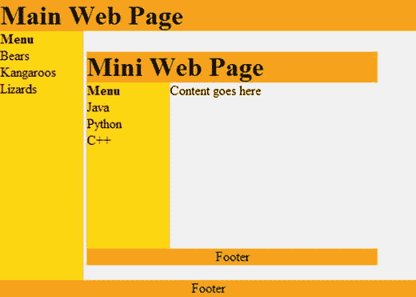
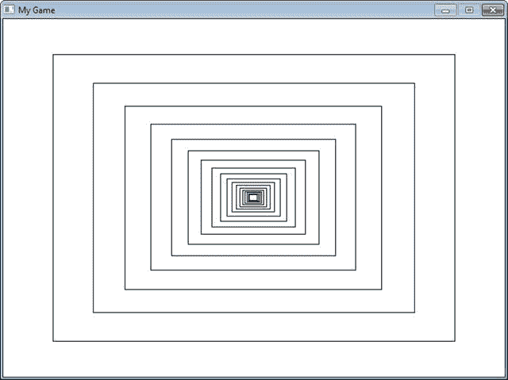
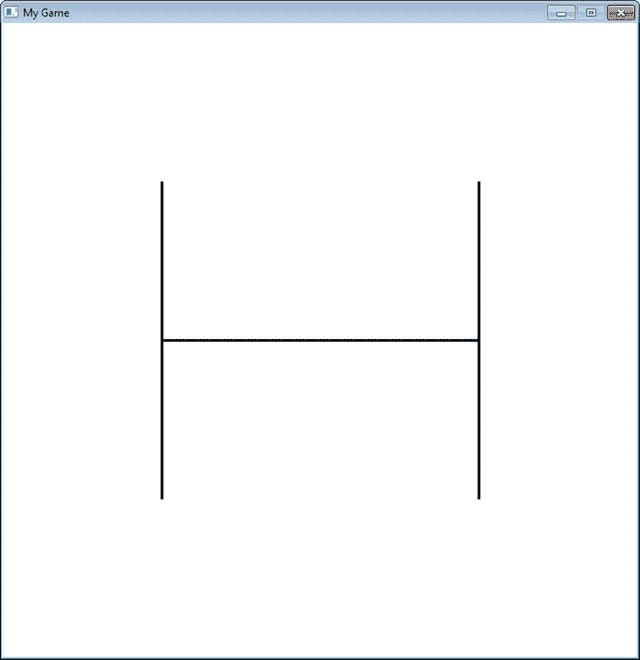
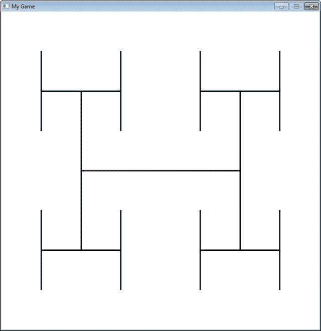
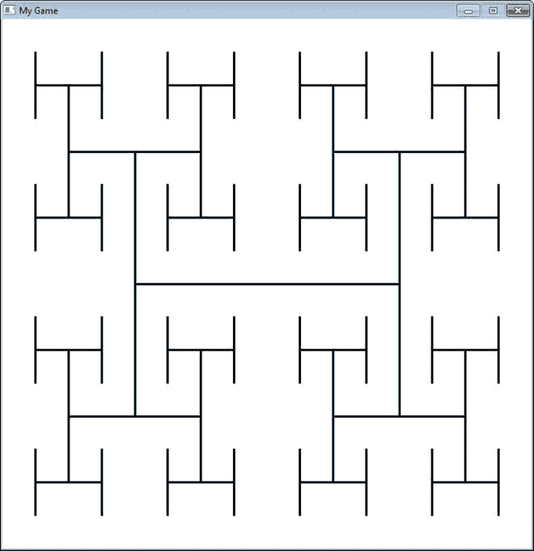
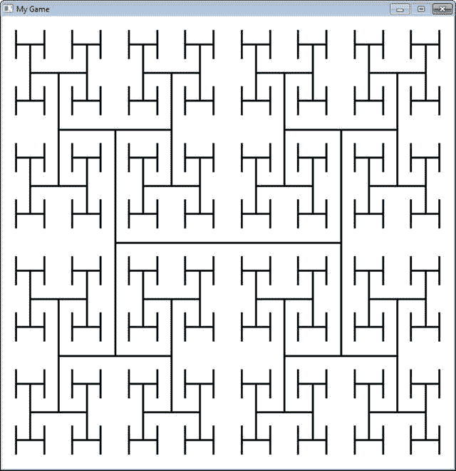

# 20.递归

> A child couldn't sleep. Her mother told her the story of a little frog. The little frog couldn't sleep. The mother frog told her the story of a bear. The bear couldn't sleep. The mother bear told her the story of a little weasel ... The little weasel fell asleep. .... the bear is asleep; ... the little frog is asleep; .... the child is asleep. (Source: [`http://everything2.com/title/recursion`](http://everything2.com/title/recursion) )

递归是根据自身定义的对象或过程。像阶乘和斐波纳契数列这样的数学模式是递归的。可以包含其他文档的文档(这些文档本身可以包含其他文档)是递归的。分形图像甚至某些生物过程在工作方式上都是递归的。

## 递归用在哪里？

文档，比如网页，自然是递归的。例如，下图显示了一个 web 文档。

网页

该 web 文档可以包含在一个框中，这有助于页面布局，如下图所示。

带有表格的网页

这是递归的。每个框可以包含一个网页，网页可以有一个框，框可以包含另一个网页，如图所示。

递归网页

递归函数通常与高级搜索和排序算法一起使用。我们将在这里展示一些，如果你决定学习数据结构，你将会看到更多。

即使一个人没有成为程序员，理解递归系统的概念也是很重要的。如果业务上需要递归表结构、文档或其他东西，知道如何事先向程序员说明这一点是很重要的。

例如，一个人可能指定一个关于食谱的 web 程序需要支持配料和方向的能力。熟悉递归的人可能会说，每种成分本身都可能是其他成分的配方(这可能是配方。)第二个系统要强大得多。

## 递归是如何编码的？

在前面的章节中，我们已经使用了调用其他函数的函数。例如:

`def f():`

`g()`

`print("f")`

`def g():`

`print("g")`

`f()`

函数也有可能调用自己。一个调用自身的函数使用了一个叫做递归的概念。例如:

`def f():`

`print("Hello")`

`f()`

`f()`

上面的例子将打印`Hello`，然后再次调用`f()`函数。这将导致另一个`Hello`被打印出来，并再次调用`f()`函数。这种情况会一直持续下去，直到计算机耗尽所谓的堆栈空间。发生这种情况时，Python 将输出一个很长的错误，以下列内容结束:

`RuntimeError: maximum recursion depth exceeded`

电脑在告诉你，程序员，你在兔子洞里走得太远了。

## 控制递归深度

为了成功地使用递归，需要有一种方法来防止函数无休止地一遍又一遍地调用自己。下面的例子计算了它被调用的次数，并使用一个`if`语句在函数调用自己 10 次后退出。

`def f(level):`

`# Pring the level we are at`

`print("Recursion call, level",level)`

`# If we haven’t reached level ten…`

`if level < 10:`

`# Call this function again`

`# and add one to the level`

`f(level+1)`

`# Start the recursive calls at level 1`

`f(1)`

`Recursion call, level 1`

`Recursion call, level 2`

`Recursion call, level 3`

`Recursion call, level 4`

`Recursion call, level 5`

`Recursion call, level 6`

`Recursion call, level 7`

`Recursion call, level 8`

`Recursion call, level 9`

`Recursion call, level 10`

## 递归阶乘计算

任何可以递归完成的代码都可以不使用递归来完成。一些程序员觉得递归代码更容易理解。

计算一个数的阶乘是使用递归的典型例子。阶乘在概率和统计中很有用。例如:

递归地，这可以描述为:

下面是计算 n 的两个示例函数！。第一个是非递归的；第二个是递归的。

`# This program calculates a factorial`

`# WITHOUT using recursion`

`def factorial_nonrecursive(n):`

`answer = 1`

`for i in range(2, n + 1):`

`answer = answer * i`

`return answer`

`# This program calculates a factorial`

`# WITH recursion`

`def factorial_recursive(n):`

`if n <= 1:`

`return 1`

`else:`

`return n * factorial_recursive(n - 1)`

这些函数本身什么也不做。下面是一个例子，我们把它放在一起。这个例子还在函数中添加了一些`print`语句，这样我们就可以看到发生了什么。

`# This program calculates a factorial`

`# WITHOUT using recursion`

`def factorial_nonrecursive(n):`

`answer = 1`

`for i in range(2, n + 1):`

`print(i, "*", answer, "=", i * answer)`

`answer = answer * i`

`return answer`

`print("I can calculate a factorial!")`

`user_input = input("Enter a number:")`

`n = int(user_input)`

`answer = factorial_nonrecursive(n)`

`print(answer)`

`# This program calculates a factorial`

`# WITH recursion`

`def factorial_recursive(n):`

`if n == 1:`

`return n`

`else:`

`x = factorial_recursive(n - 1)`

`print( n, "*", x, "=", n * x )`

`return n * x`

`print("I can calculate a factorial!")`

`user_input = input("Enter a number:")`

`n = int(user_input)`

`answer = factorial_recursive(n)`

`print(answer)`

`I can calculate a factorial!`

`Enter a number:7`

`2 * 1 = 2`

`3 * 2 = 6`

`4 * 6 = 24`

`5 * 24 = 120`

`6 * 120 = 720`

`7 * 720 = 5040`

`5040`

`I can calculate a factorial!`

`Enter a number:7`

`2 * 1 = 2`

`3 * 2 = 6`

`4 * 6 = 24`

`5 * 24 = 120`

`6 * 120 = 720`

`7 * 720 = 5040`

`5040`

## 递归矩形

递归非常适合处理本身是递归的结构化文档。例如，web 文档可以有一个分成行和列的表格来帮助布局。一行可能是页眉，另一行是正文，最后是页脚。表格单元格内可能是另一个表格。其中还可以存在另一个表。

另一个例子是电子邮件。可以将他人的电子邮件附加到您自己的电子邮件中。但是该电子邮件可能附有另一封电子邮件，以此类推。

我们能在我们的 pygame 程序中直观地看到递归吗？没错。图中显示了一个示例程序，该程序绘制了一个矩形，并递归地保持在矩形内绘制矩形。每个矩形比父矩形小 20%。看代码。密切注意`recursive_draw`函数中的递归调用。

递归矩形

`"""`

`Recursively draw rectangles.`

`Sample Python/Pygame Programs`

[T2`http://programarcadegames.com/`](http://programarcadegames.com/)

`"""`

`import pygame`

`# Colors`

`BLACK = (0, 0, 0)`

`WHITE = (255, 255, 255)`

`def recursive_draw(x, y, width, height):`

`""" Recursive rectangle function. """`

`pygame.draw.rect(screen, BLACK,`

`[x, y, width, height],`

`1)`

`# Is the rectangle wide enough to draw again?`

`if(width > 14):`

`# Scale down`

`x += width * .1`

`y += height * .1`

`width *= .8`

`height *= .8`

`# Recursively draw again`

`recursive_draw(x, y, width, height)`

`pygame.init()`

`# Set the height and width of the screen`

`size = [700, 500]`

`screen = pygame.display.set_mode(size)`

`pygame.display.set_caption("My Game")`

`# Loop until the user clicks the close button.`

`done = False`

`# Used to manage how fast the screen updates`

`clock = pygame.time.Clock()`

`# -------- Main Program Loop -----------`

`while not done:`

`for event in pygame.event.get():`

`if event.type == pygame.QUIT:`

`done = True`

`# Set the screen background`

`screen.fill(WHITE)`

`# ALL CODE TO DRAW SHOULD GO BELOW THIS COMMENT`

`recursive_draw(0, 0, 700, 500)`

`# ALL CODE TO DRAW SHOULD GO ABOVE THIS COMMENT`

`# Go ahead and update the screen with what we’ve drawn.`

`pygame.display.flip()`

`# Limit to 60 frames per second`

`clock.tick(60)`

`# Be IDLE friendly. If you forget this line, the program will ’hang’`

`# on exit.`

`pygame.quit()`

## 分形

分形是递归定义的。这是一个非常简单的分形，展示了它是如何根据递归的深度而变化的。

递归分形等级 0

递归分形级别 1

递归分形层次 2

递归分形等级 3

`"""`

`Sample fractal using` `recursion.`

`Sample Python/Pygame` `Programs`

[T2`http://programarcadegames.com/`](http://programarcadegames.com/)

`"""`

`import pygame`

`# Define some colors`

`black = (0, 0, 0)`

`white = (255, 255, 255)`

`green = (0, 255, 0)`

`red = (255, 0, 0)`

`def recursive_draw(x, y, width, height, count):`

`# Draw the rectangle`

`# pygame.draw.rect(screen,black,[x,y,width,height],1)`

`pygame.draw.line(screen,`

`black,`

`[x + width*.25, height // 2 + y],`

`[x + width*.75, height // 2 + y],`

`3)`

`pygame.draw.line(screen,`

`black,`

`[x + width * .25, (height * .5) // 2 + y],`

`[x + width * .25,  (height * 1.5) // 2 + y],`

`3)`

`pygame.draw.line(screen,`

`black,`

`[x + width * .75, (height * .5) // 2 + y],`

`[x + width * .75, (height * 1.5) // 2 + y],`

`3)`

`if count > 0:`

`count -= 1`

`# Top left`

`recursive_draw(x, y, width // 2, height // 2, count)`

`# Top right`

`recursive_draw(x + width // 2, y, width // 2, height // 2, count)`

`# Bottom left`

`recursive_draw(x, y + width // 2, width // 2, height // 2, count)`

`# Bottom right`

`recursive_draw(x + width // 2, y + width // 2, width // 2, height // 2, count)`

`pygame.init()`

`# Set the height and width of the screen`

`size = [700, 700]`

`screen = pygame.display.set_mode(size)`

`pygame.display.set_caption("My Game")`

`# Loop until the user clicks the close button.`

`done = False`

`# Used to manage how fast the screen updates`

`clock = pygame.time.Clock()`

`# -------- Main Program Loop -----------`

`while not done:`

`for event in pygame.event.get():`

`if event.type == pygame.QUIT:`

`done = True`

`# Set the screen background`

`screen.fill(white)`

`# ALL CODE TO DRAW SHOULD GO BELOW THIS COMMENT`

`fractal_level = 3`

`recursive_draw(0, 0, 700, 700, fractal_level)`

`# ALL CODE TO DRAW SHOULD GO ABOVE THIS COMMENT`

`# Go ahead and update the screen with what we’ve drawn.`

`pygame.display.flip()`

`# Limit to 20 frames per second`

`clock.tick(20)`

`# Be IDLE friendly. If you forget this line, the program will ’hang’`

`# on exit.`

`pygame.quit()`

## 递归二分搜索法

递归也可以用来执行二分搜索法。下面是第十六章中的一个非递归二分搜索法:

`def binary_search_nonrecursive(search_list, key):`

`lower_bound = 0`

`upper_bound = len(search_list) - 1`

`found = False`

`while lower_bound < upper_bound and found == False:`

`middle_pos = (lower_bound + upper_bound) // 2`

`if search_list[middle_pos] < key:`

`lower_bound = middle_pos + 1`

`elif list[middle_pos] > key:`

`upper_bound = middle_pos`

`else:`

`found = True`

`if found:`

`print( "The name is at position",middle_pos)`

`else:`

`print( "The name was not in the list." )`

`binary_search_nonrecursive(name_list,"Morgiana the Shrew")`

同样的二分搜索法以递归的方式写道:

`def binary_search_recursive(search_list, key, lower_bound, upper_bound):`

`middle_pos = (lower_bound + upper_bound) // 2`

`if search_list[middle_pos] < key:`

`binary_search_recursive(search_list,`

`key,`

`middle_pos + 1,`

`upper_bound)`

`elif search_list[middle_pos] > key:`

`binary_search_recursive(search_list,`

`key,`

`lower_bound,`

`middle_pos )`

`else:`

`print("Found at position", middle_pos)`

`lower_bound = 0`

`upper_bound = len(name_list) - 1`

`binary_search_recursive(name_list,`

`"Morgiana the Shrew",`

`lower_bound,`

`upper_bound)`

## 回顾

### 简答工作表

“To understand recursion, one must first understand recursion.” Explain the joke.   Two mirrors face each other. Explain how their reflections demonstrate the property of recursion.   Explain how Multi-Level Marketing uses recursion.   Explain how the sweep function in the classic minesweeper game could be done with recursion.   Explain how finding your way out of a maze could be done with recursion.   Use the Chrome browser and create your own screenshot at: [`http://juliamap.googlelabs.com`](http://juliamap.googlelabs.com) Use your mouse and mouse wheel to zoom into an interesting part of the fractal.   Write a recursive function `f(n)` that takes in a value n and returns the value for `f`, given the definition below.

Then write a `for` loop that prints out the answers for values of n from 1 to 10\. It should look like: `n= 1, a= 6` `n= 2, a= 7.0` `n= 3, a= 7.5` `n= 4, a= 7.75` `n= 5, a= 7.875` `n= 6, a= 7.9375` `n= 7, a= 7.96875` `n= 8, a= 7.984375` `n= 9, a= 7.9921875` `n= 10, a= 7.99609375` The function should not have a `print` statement inside it, nor a loop. The `for` loop that is written should be outside the function and call the function to get the results and print them. Write recursive code that will print out the first 10 terms of the sequence below.

