# 二十二、练习

<colgroup><col></colgroup> 
| 练习 1:自定义计算器 |
| 练习 2:创建一个测验 |
| 练习 3:骆驼 |
| 练习 4:创建一幅图片 |
| 练习 5:多圈实验室 |
| 练习 6:冒险！ |
| 练习 7:动画 |
| 练习 8:函数 |
| 练习 9:功能和用户控制 |
| 练习 10:位图图形、声音效果和音乐 |
| 练习 11:类和图形 |
| 练习 12:收集雪碧 |
| 练习 13:移动精灵 |
| 练习 14:拼写检查 |
| 练习 15:最终练习 |

## 练习 1:自定义计算器

在本练习中，我们将创建三个自定义计算器程序。为了帮助创建这些练习，请查看第 2 章中的代码。特别是，本章末尾的示例程序为本练习所需的代码提供了一个很好的模板。

确保你能写出简单的程序，就像这个练习中布置的那样。既能凭记忆做，也能写在纸上。这些程序遵循一种非常常见的计算模式:

Take in data   Perform calculations   Output data  

程序从数据库、3D 模型、游戏控制器、键盘和互联网等来源获取数据。它们执行计算并输出结果。有时我们甚至每秒钟循环数千次。

将计算与数据输出分开是一个好主意。虽然可以在 print 语句中进行计算，但最好是先进行计算，将其存储在一个变量中，然后再输出。这样计算和输出就不会混在一起。

编写程序时，使用空行来分隔代码的逻辑分组是一个好主意。例如，在输入语句、计算和输出语句之间放置一个空行。此外，在程序中添加注释来标记这些部分。

在本练习中，您将创建三个简短的程序:

### 程序

创建一个程序，要求用户输入华氏温度，然后打印出摄氏温度。在互联网上搜索正确的计算方法。查看第 2 章的每加仑英里数示例，了解应该做些什么。

样品运行:

`Enter temperature in Fahrenheit: 32`

`The temperature in Celsius: 0.0`

样品运行:

`Enter temperature in Fahrenheit: 72`

`The temperature in Celsius: 22.2222222222`

这个程序的数字格式不会很好。没关系。但是如果它困扰着你，向前看第 21 章，看看如何让你的输出看起来很棒！

### 程序

创建一个新的程序，要求用户提供计算梯形面积所需的信息，然后打印出面积。梯形的面积公式为:

样品运行:

`Area of a trapezoid`

`Enter the height of the trapezoid: 5`

`Enter the length of the bottom base: 10`

`Enter the length of the top base: 7`

`The area is: 42.5`

### 程序

创建您自己的原始问题，并让用户插入变量。如果你不想要任何原创的东西，从下面的列表中选择一个等式:

<colgroup><col> <col></colgroup> 
| 圆的面积 |  |
| 椭圆的面积 |  |
| 等边三角形的面积 |  |
| 圆锥体的体积 |  |
| 球体的体积 |  |
| 任意三角形的面积 |  |

完成后，检查以确保变量名以小写字母开头，并且在代码的逻辑分组之间使用空行。(在这种情况下，在输入、计算和输出之间。)

## 练习 2:创建一个测验

现在是你自己写测验的机会了。使用这些测验来筛选求职者，淘汰潜在的伴侣，或者只是有机会坐在桌子的另一边做测验，而不是参加测验。

本练习应用了第 4 章中[关于使用`if`语句的材料。这也需要一点第二章](04.html)的内容，因为程序必须计算一个百分比。

### 描述

这是您的测验需要具备的功能列表:

Create your own quiz with five or more questions. You can ask questions that require:

*   一个数字作为答案(例如，1+1 是什么？)
*   正文(例如哈利波特姓什么？)
*   选择(这些选项中哪些是正确的？a，B，还是 C？)

  If you have the user enter non-numeric answers, think and cover the different ways a user could enter a correct answer. For example, if the answer is “a,” would “A” also be acceptable? See [Chapter 4](04.html) for a reminder on how to do this.   Let the user know if they get the question correct. Print a message depending on the user’s answer.   You need to keep track of how many questions they get correct.   At the end of the program print the percentage of questions the user gets right.  

创建程序时，请记住以下几点:

Variable names should start with a lowercase letter. Uppercase letters work, but it is not considered proper. (Right, you didn’t realize that programming was going to be like English Tea Time, did you?)   To create a running total of the number correct, create a variable to store this score. Set it to zero. With an `if` statement, add one to the variable each time the user gets a correct answer. (How do you know if they got it correct? Remember that if you are printing out “correct” then you have already done that part. Just add a line there to add one to the number correct.) If you don’t remember how to add one to a variable, go back and review [Chapter 2](02.html).   Treat true/false questions like multiple choice questions; just compare to “True” or “False.” Don’t try to do `if a:` we’ll implement `if` statements like that later on in the class, but this isn’t the place.   Calculate the percentage by using a formula at the end of the game. Don’t just add 20% for each question the user gets correct. If you add 20% each time, then you have to change the program 5 places if you add a 6th question. With a formula, you only need 1 change.   To print a blank line so that all the questions don’t run into each other, use the following code: `print()`   Remember the program can print multiple items on one line. This can be useful when printing the user’s score at the end. `print("The value in x is", x)`   Separate out your code by using blank lines to group sections together. For example, put a blank line between the code for each question.   Sometimes it makes sense to reuse variables. Rather than having a different variable to hold the user’s answer for each question, you could reuse the same one.   Use descriptive variable names. `x` is a terrible variable name. Instead use something like `number_correct`.  

### 示例运行

这是我的程序中的一个例子:

`Quiz time!`

`How many books are there in the Harry Potter series? 7`

`Correct!`

`What is 3*(2-1)? 3`

`Correct!`

`What is 3*2-1? 5`

`Correct!`

`Who sings Black Horse and the Cherry Tree?`

`1\. Kelly Clarkson`

`2\. K.T. Tunstall`

`3\. Hillary Duff`

`4\. Bon Jovi`

`? 2`

`Correct!`

`Who is on the front of a one dollar bill`

`1\. George Washington`

`2\. Abraham Lincoln`

`3\. John Adams`

`4\. Thomas Jefferson`

`? 2`

`No.`

`Congratulations, you got 4 answers right.`

`That is a score of 80.0 percent.`

## 练习 3:骆驼

### 骆驼游戏的描述

骆驼的想法最初来自健康用户组，并于 1979 年发表在更基本的电脑游戏中。

这个想法是在被追赶的时候骑着你的骆驼穿越沙漠。你需要管理你的口渴，骆驼有多累，你领先土著多远。

这是我在 Apple //e 上编程的第一批游戏之一，游戏很灵活。我知道有人创造了这个游戏的星球大战主题版本，你需要骑着万帕穿越霍斯。很容易将沙尘暴和其他随机事件添加到游戏中，使其更加有趣。

### 骆驼试跑

这是一个游戏的运行示例:

`Welcome to Camel!`

`You have stolen a camel to make your way across the great Mobi desert.`

`The natives want their camel back and are chasing you down! Survive your`

`desert trek and outrun the natives.`

`A. Drink from your canteen.`

`B. Ahead moderate speed.`

`C. Ahead full speed.`

`D. Stop and rest.`

`E. Status check.`

`Q. Quit.`

`Your choice? C`

`You traveled 12 miles.`

`A. Drink from your canteen.`

`B. Ahead moderate speed.`

`C. Ahead full speed.`

`D. Stop and rest.`

`E. Status check.`

`Q. Quit.`

`Your choice? C`

`You traveled 17 miles.`

`A. Drink from your canteen.`

`B. Ahead moderate speed.`

`C. Ahead full speed.`

`D. Stop and rest.`

`E. Status check.`

`Q. Quit.`

`Your choice? e`

`Miles traveled:  29`

`Drinks in canteen:  3`

`The natives are 31 miles behind you.`

`A. Drink from your canteen.`

`B. Ahead moderate speed.`

`C. Ahead full speed.`

`D. Stop and rest.`

`E. Status check.`

`Q. Quit.`

`Your choice? b`

`You traveled 6 miles.`

`...and so on until...`

`A. Drink from your canteen.`

`B. Ahead moderate speed.`

`C. Ahead full speed.`

`D. Stop and rest.`

`E. Status check.`

`Q. Quit.`

`Your choice? C`

`You traveled 12 miles.`

`The natives are getting close!`

`A. Drink from your canteen.`

`B. Ahead moderate speed.`

`C. Ahead full speed.`

`D. Stop and rest.`

`E. Status check.`

`Q. Quit.`

`Your choice? C`

`You traveled 11 miles.`

`The natives are getting close!`

`You made it across the desert! You won!`

### 节目指南

下面是完成这个练习的步骤。请随意修改和增加练习内容。与朋友和家人一起尝试游戏。

Create a new program and print the instructions to the screen. Do this with multiple `print` statements. Don’t use one `print` statement and multiple `\n` characters to jam everything on one line. `Welcome to Camel!` `You have stolen a camel to make your way across the great Mobi desert.` `The natives want their camel back and are chasing you down! Survive your` `desert trek and out run the natives.`   Create a Boolean variable called `done` and set to `False`.   Create a `while` loop that will keep looping while `done` is False.   Inside the loop, print out the following: `A. Drink from your canteen.` `B. Ahead moderate speed.` `C. Ahead full speed.` `D. Stop for the night.` `E. Status check.` `Q. Quit.`   Ask the user for their choice. Make sure to add a space before the quote so the user input doesn’t run into your text.   If the user’s choice is Q, then set `done` to `True`. By doing something like `user_choice.upper()` instead of just `user_choice` in your `if` statement you can make it case insensitive.   Test and make sure that you can quit out of the game.   Before your main program loop, create variables for miles traveled, thirst, and camel tiredness. Set these to zero.   Create a variable for the distance the natives have traveled and set it to -20\. (Twenty miles back.)   Create and set an initial number of drinks in the canteen.   Add an `elif` in your main program loop and see if the user is asking for status. If so, print out something like this: `Miles traveled:  0` `Drinks in canteen:  3` `The natives are 10 miles behind you.`   Add an `elif` in your main program loop and handle if the user wants to stop for the night. If the user does, reset the camel’s tiredness to zero. Print that the camel is happy, and move the natives up a random amount from 7 to 14 or so.   Add an `elif` in your main program loop and handle if the user wants to go ahead full speed. If the user does, go forward a random amount between 10 and 20 inclusive. Print how many miles the user traveled. Add 1 to thirst. Add a random 1 to 3 to camel tiredness. Move the natives up 7 to 14 miles.   Add an `elif`in your main program loop and handle if the user wants to go ahead moderate speed. If the user does, go forward a random amount between 5 and 12 inclusive. Print how many miles the user traveled. Add 1 to thirst. Add 1 to camel tiredness. Move the natives up 7 to 14 miles.   Add an `elif` in your main program loop and handle if the user wants to go ahead drink from the canteen. If the user does, make sure there are drinks in the canteen. If there are, subtract one drink and set the player’s thirst to zero. Otherwise print an error.   In the loop, print “You are thirsty.” if the user’s thirst is above 4.   Print “You died of thirst!” if the user’s thirst is above 6\. Set `done` to true. Make sure you create your code so that the program doesn’t print both “You are thirsty” and “You died of thirst!” Use `elif` as appropriate.   Print “Your camel is getting tired.” if the camel’s tiredness is above 5.   Print “Your camel is dead.” if the camel’s tiredness is above 8\. Like the prior steps, print one or the other. It is a good idea to include a check with the `done` variable so that you don’t print that your camel is getting tired after you died of thirst.   If the natives have caught up, print that they caught the player and end the game.   Else if the natives are less than 15 miles behind, print “The natives are getting close!”   If the user has traveled 200 miles across the desert, print that they won and end the game. Make sure they aren’t dead before declaring them a winner.   Add a one-in-twenty chance of finding an oasis. Print that the user found it, refill the canteen, reset player thirst, and rest the camel.   Play the game and tune the numbers so it is challenging but not impossible. Fix any bugs you find.  

### 暗示

*   请记住，在程序中的代码逻辑分组之间放置空行是一个好主意。例如，在指令之后和每个用户命令之间有一个空行。
*   使用`while not done:`而不是`while done == False:`被认为是更好的样式
*   以防止错误的消息组合，如打印“你渴死了。”和“你发现了一片绿洲！”在同一个转弯中，使用`and`操作符。如，`if not done and thirst > 4:`

## 练习 4:创建一幅图片

### 描述

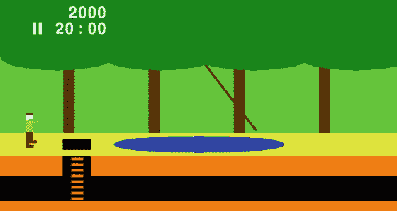

你的任务是:画一幅漂亮的画。这个练习的目标是练习使用函数，使用`for`循环，并介绍计算机图形学。

练习你所有的新技能:

*   拥有多种颜色的图像。
*   做出连贯的画面。不要只做形状随意的抽象艺术。那没有挑战性。
*   尝试几种类型的图形功能(例如，圆形、矩形、线条等。).
*   使用`while`或`for`循环创建重复模式。不要在同一个位置重复画同样的东西 10 次。实际上，使用索引变量作为偏移量来替换您正在绘制的内容。请记住，您可以在一个循环中包含多个绘制命令，因此您可以绘制多个火车车厢。

对于要修改的模板程序，请查看以下示例程序:

[T2`ProgramArcadeGames.com/python_examples/f.php?file=pygame_base_template.py`](http://ProgramArcadeGames.com/python_examples/f.php?file=pygame_base_template.py)

[T2`ProgramArcadeGames.com/python_examples/f.php?file=simple_graphics_demo.py`](http://ProgramArcadeGames.com/python_examples/f.php?file=simple_graphics_demo.py)

参见[第 6 章](06.html)了解模板的说明。有关 draw 模块的官方文档:

[T2`http://www.pygame.org/docs/ref/draw.html`](http://www.pygame.org/docs/ref/draw.html)

要选择新颜色，请使用

[T2`http://www.colorpicker.com/`](http://www.colorpicker.com/)

或者打开 Windows 画图程序，点击“编辑颜色”复制红色、绿色和蓝色的值。不要担心颜色的色调、饱和度或亮度。

请使用注释和空行，以便于跟踪您的计划。如果你有 5 条线画一个机器人，把它们组合在一起，上面和下面用空白的线。然后在顶部添加注释，告诉读者你在画什么。

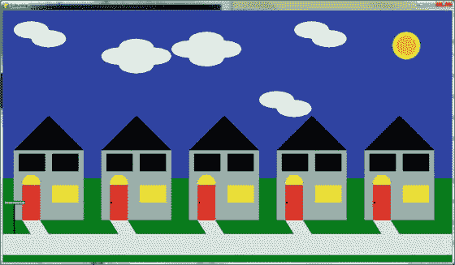

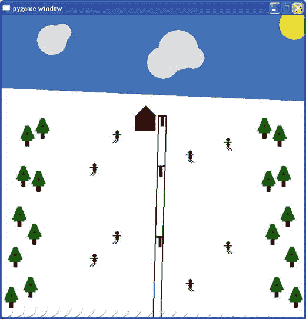

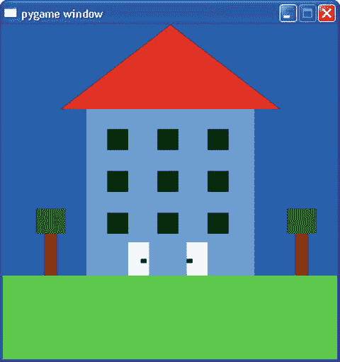

## 练习 5:多圈实验室

### 第一部分

编写一个 Python 程序，它将打印以下内容:

`10`

`11 12`

`13 14 15`

`16 17 18 19`

`20 21 22 23 24`

`25 26 27 28 29 30`

`31 32 33 34 35 36 37`

`38 39 40 41 42 43 44 45`

`46 47 48 49 50 51 52 53 54`

#### 第 1 部分的提示

*   使用两个`for`循环生成第一部分的输出，其中一个是嵌套的。
*   创建一个单独的变量来存储将要打印的数字。不要使用你在`for`循环中创建的变量。这将是第三个变量，从 10 开始，每次增加 1。

### 第二部分

用 n 行小 o 创建一个大盒子，表示任何所需的大小 n。使用`input`语句允许用户输入 n 的值，然后打印大小合适的盒子。

`E.g. n = 3`

`oooooo`

`o    o`

`oooooo`

`E.g. n = 8`

`oooooooooooooooo`

`o              o`

`o              o`

`o              o`

`o              o`

`o              o`

`o              o`

`oooooooooooooooo`

### 第三部分

对于任意正整数 n，打印以下内容。使用`input`语句允许用户输入 n 的值，然后打印适当大小的框。

`E.g. n = 3`

`1 3 5 5 3 1`

`3 5     5 3`

`5         5`

`5         5`

`3 5     5 3`

`1 3 5 5 3 1`

`E.g. n = 5`

`1 3 5 7 9 9 7 5 3 1`

`3 5 7 9     9 7 5 3`

`5 7 9         9 7 5`

`7 9             9 7`

`9                 9`

`9                 9`

`7 9             9 7`

`5 7 9         9 7 5`

`3 5 7 9     9 7 5 3`

`1 3 5 7 9 9 7 5 3 1`

不要担心处理多位数的间距。如果你想向前看，第 21 章会谈到这一点，但这并不是必需的。

这部分练习很难。如果你对挑战不感兴趣，跳到第四部分。

### 第 4 部分

从 pygame 模板代码开始:

[T2`ProgramArcadeGames.com/python_examples/f.php?file=pygame_base_template.py`](http://ProgramArcadeGames.com/python_examples/f.php?file=pygame_base_template.py)

使用嵌套的`for`循环绘制绿色小矩形。使图像看起来像下图。

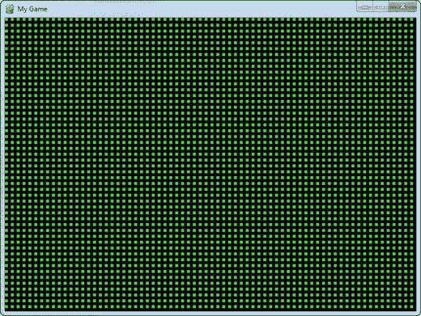

Pygame Grid(游戏网格)

不要通过画线来创建网格；使用由矩形创建的网格。

如果这太无聊，创建一个类似的网格的东西。可以更改所绘制形状的颜色、大小和类型。只需习惯使用嵌套的`for`循环来生成网格。

有时人们觉得需要在这个程序中给偏移量加一个零。提醒自己，在一个数字上加零有点傻。

## 练习 6:冒险！

### 冒险游戏的描述

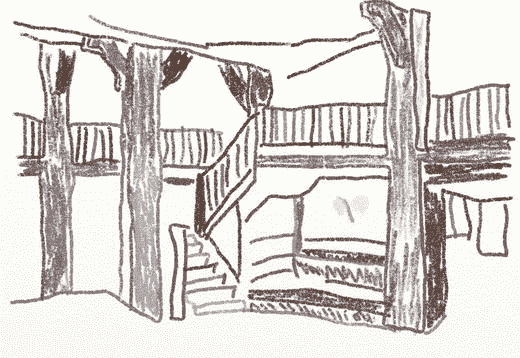

我玩过的第一个游戏是一个叫做巨大洞穴探险的文本冒险。你可以在网上玩这个游戏，了解一下文字冒险游戏是什么样的。可以说这类游戏中最著名的是 Zork 系列。

我自己创建的第一个“大型”程序是文本冒险。开始这样的冒险很容易。这也是练习使用列表的好方法。我们这个练习的游戏将包括一个房间列表，可以通过向北、向东、向南或向西导航。每个房间将是一个房间描述的列表，然后是每个方向的房间。请参见下面的示例运行部分:

### 样品运行

`You are in a dusty castle room.`

`Passages lead to the north and south.`

`What direction? n`

`You are in the armory.`

`There is a room off to the south.`

`What direction? s`

`You are in a dusty castle room.`

`Passages lead to the north and south.`

`What direction? s`

`You are in a torch-lit hallway.`

`There are rooms to the east and west.`

`What direction? e`

`You are in a bedroom. A window overlooks the castle courtyard.`

`A hallway is to the west.`

`What direction? w`

`You are in a torch-lit hallway.`

`There are rooms to the east and west.`

`What direction? w`

`You are in the kitchen. It looks like a roast is being made for supper.`

`A hallway is to the east.`

`What direction? w`

`Can’t go that way.`

`You are in the kitchen. It looks like a roast is being made for supper.`

`A hallway is to the east.`

`What direction?`

### 创建你的地牢

在你开始之前，勾画出你想要创建的地牢。它可能看起来像这样:

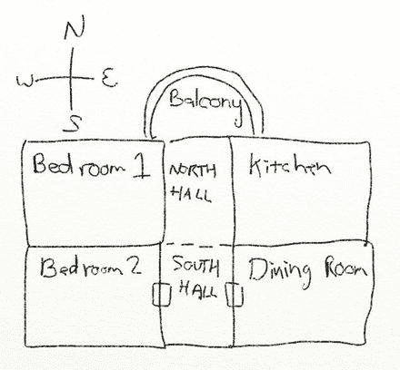

接下来，从零开始给所有房间编号。

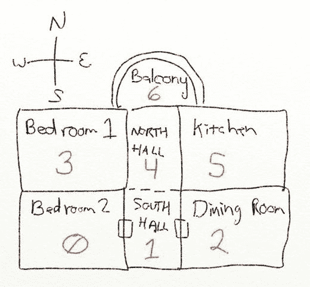

用这张草图来找出所有房间是如何连接的。例如，房间 0 连接到北面的房间 3，房间 1 连接到东面，而南面和西面没有房间。

### 逐步说明

Create an empty array called `room_list`.   Create a variable called `room`. Set it equal to an array with five elements. For the first element, create a string with a description of your first room. The last four elements will be the number of the next room if the user goes north, east, south, or west. Look at your sketch to see what numbers to use. Use `None` if no room hooks up in that direction. (Do not put `None` in quotes. It is a special value that represents no value.)   Append this room to the room list.   Repeat the prior two steps for each room you want to create. Just reuse the `room` variable.   Create a variable called `current_room`. Set it to zero.   Print the `room_list` variable. Run the program. You should see a really long list of every room in your adventure. (If you are using an IDE like Wing, don’t leave it scrolled way off to the right.)   Adjust your print statement to only print the first room (element zero) in the list. Run the program and confirm you get output similar to: `[’You are in a room. There is a passage to the north.’, 1, None, None, None]`   Using `current_room` and `room_list`, print the current room the user is in. Since your first room is zero, the output should be the same as before.   Change the print statement so that you only print the description of the room, and not the rooms that hook up to it. Remember if you are printing a list in a list the index goes after the first index. Don’t do this: `[current_room[0]]`, do `[current_room][0]` `You are in a room. There is a passage to the north.`   Create a variable called `done` and set it to False. Then put the printing of the room description in a `while` loop that repeats until `done` is set to `True`.   Before printing the description, add a code to print a blank line. This will make it visually separate each turn when playing the game.   After printing the room description, add a line of code that asks the user what direction they wish to go.   Add an `if` statement to see if the user wants to go north.   If the user wants to go north, create a variable called `next_room` and get it equal to `room_list[current_room][1]`, which should be the number for what room is to the north.   Add another `if` statement to see if the next room is equal to `None`. If it is, print “You can’t go that way.” Otherwise set `current_room` equal to `next_room`.   Test your program. Can you go north to a new room?   Add `elif` statements to handle east, south, and west. Add an `else` statement to let the user know the program doesn’t understand what she typed.   Add several rooms, at least five. It may be necessary to draw out the rooms and room numbers to keep everything straight. Test out the game. You can use \n or triple quotes if you have a multiline room description.   Optional: Add a quit command. Make sure that the program works for upper and lower case directions. Have the program work if the user types in “north” or “n.”  

花一点时间让这个游戏变得有趣。不要简单地创造一个“东房间”和一个“西房间”。那太无聊了。

还要花一点时间仔细检查拼写和语法。在没有文字处理器检查你的写作的情况下，小心是很重要的。

使用`\n`在你的描述中添加回车符，这样它们就不会在一行中全部打印出来。不要在`\n`周围加空格，否则空格会被打印出来。

我喜欢这个程序是因为它很容易扩展成一个完整的游戏。使用所有八个基本方向(包括“西北”)，连同“上”和“下”是相当容易的。管理可以存在于房间中、被拾取和丢弃的物品的清单也是保存列表的问题。

将这个程序扩展成一个完整的游戏是最后练习的两个选项之一。

## 练习 7:动画

### 要求

修改之前的“创建图片”练习，或者开始一个新的练习。

动画图像。尝试以下一种或多种方法:

*   在屏幕上移动项目。
*   来回移动项目。
*   向上/向下/斜向移动。
*   转圈。
*   让人挥动手臂。
*   创建一个改变颜色的交通信号灯。

记住，天赋越多越好！享受这个练习，花点时间看看你能做什么。

## 练习 8:函数

把这个写成一个程序。整个东西应该可以直接穿过去。

这个程序有几个部分。以下是每个部分的描述:

Write a function called `min3` that will take three numbers as parameters and return the smallest value. If more than one number tied for smallest, still return that smallest number. Use a proper `if`/`elif`/`else` chain. Once you’ve finished writing your function, copy/paste the following code and make sure that it runs against the function you created: `print(min3(4, 7, 5))` `print(min3(4, 5, 5))` `print(min3(4, 4, 4))` `print(min3(-2, -6, -100))` `print(min3("Z", "B", "A"))` You should get this result: `4` `4` `4` `-100` `A` The function should return the value, not print the value. Also, while there is a `min` function built into Python, don’t use it. Please use `if` statements and practice creating it yourself. Leave the testing statements in the program so the instructor can check the program. If you also get `None` to print out, then chances are you are using `print` instead of `return` in your function.   Write a function called `box` that will output boxes given a height and width. Once you’ve finished writing your function, copy and paste the following code after it and make sure it works with the function you wrote: `box(7,5)  # Print a box 7 high, 5 across` `print()   # Blank line` `box(3,2)  # Print a box 3 high, 2 across` `print()   # Blank line` `box(3,10) # Print a box 3 high, 10 across` You should get the following results from the sample code: `*****` `*****` `*****` `*****` `*****` `*****` `*****` `**` `**` `**` `**********` `**********` `**********` Go back and look at [Chapter 7](07.html)if you’ve forgotten how to do this.   Write a function called `find` that will take a list of numbers, `my_list`, along with one other number, `key`. Have it search the list for the value contained in `key`. Each time your function finds the key value, print the array position of the key. You will need to juggle three variables: one for the list, one for the key, and one for the position of where you are in the list. This code will look similar to the [Chapter 8](08.html) code for iterating though a list using the `range` and `len` functions. Start with that code and modify the `print` to show each element and its position. Then instead of just printing each number, add an `if` statement to only print the ones we care about. Copy/paste this code to test it: `my_list = [36, 31, 79, 96, 36, 91, 77, 33, 19, 3, 34, 12, 70, 12, 54, 98, 86, 11, 17, 17]` `find(my_list, 12)` `find(my_list, 91)` `find(my_list, 80)` . . . check for this output: `Found 12 at position 11` `Found 12 at position 13` `Found 91 at position 5` Use a `for` loop with an index variable and a `range`. Inside the loop use an `if` statement. The function can be written in about four lines of code.   Write one program that has the following:

*   功能:
    *   编写一个名为`create_list`的函数，它接受一个列表大小并返回一个从 1 到 6 的随机数列表(即，调用`create_list(5)`应该返回 5 个从 1 到 6 的随机数。(记住，[第 8 章](08.html)有代码展示了如何做类似的事情，用用户输入的五个数字创建一个列表。这里，您需要创建随机数，而不是询问用户。)为了测试，对您编写的函数使用下面的代码:`my_list = create_list(5)` `print(my_list)`，您应该得到五个随机元素的输出，看起来像:`[2,5,1,6,3]`
    *   编写一个名为`count_list`的函数，它接受一个列表和一个数字。让函数返回指定数字在列表中出现的次数。为了测试，对您编写的函数使用下面的代码:`count = count_list([1,2,3,3,3,4,2,1],3)` `print(count)`，您应该得到类似于`3`的输出
    *   编写一个名为`average_list`的函数，返回传递给它的列表的平均值。为了测试，对您编写的函数使用下面的代码:`avg = average_list([1,2,3])` `print(avg)`，您应该得到类似于`2`的输出
*   现在已经创建了这些函数，在一个主程序中使用它们，它将:
    *   创建一个包含 10，000 个从 1 到 6 的随机数的列表。这应该需要一行代码。使用您之前在练习中创建的函数。)
    *   打印从 1 到 6 的计数。(即打印 1 在 10000 次中出现的次数。然后对 2-6 做同样的事情。)
    *   打印所有 10，000 个随机数的平均值。

## 练习 9:用户控制

这个练习给你一个机会练习用一个函数画一个对象，并允许用户控制它。

创建一个包含以下内容的程序:

Create at least two different functions that draw an object to the screen. For example, `draw_bird` and `draw_tree`. Do not draw a stick figure; we did that one already. Create your own unique item. If you created your own object in the create-a-picture exercise feel free to adapt it to this exercise.   In [Chapter 11](11.html), we talked about moving graphics with the keyboard, a game controller, and the mouse. Pick two of those and use them to control two different items on the screen.   In the case of the game controller and the keyboard, make sure to add checks so that your object does not move offscreen and get lost.  

## 练习 10:位图图形和用户控件

创建一个基于图形的程序。你可以开始一个新的程序或继续先前的练习。

这是完成本练习的清单:

*   确保这个程序是在它自己的目录中创建的。使用您已有的空目录，或创建一个新目录。
*   至少包含一个在屏幕上绘制项目的功能。该函数应该获取指定在何处绘制项目的位置数据。(注意:您还需要传递一个对“屏幕”的引用另一个注意:这对于从文件中加载的图像来说是很难做到的。我建议只使用常规的绘图命令。)
*   添加通过鼠标、键盘或游戏控制器控制项目的功能。
*   包括某种位图图形。不要将位图图形作为“用函数绘图”的一部分在我们了解更多一点之前，这不会有什么效果。
*   包括声音。当用户点击鼠标、击键、移动到某个位置等时，你可以发出声音。如果声音有问题，尝试使用 Audacity 程序加载声音，然后将其导出为。ogg 文件。
*   如果您将此程序发送给某人，请确保发送了所有文件。很容易忘记添加图像和声音文件。

示例代码:

[T2`ProgramArcadeGames.com/index.php?chapter=example_code`](http://ProgramArcadeGames.com/index.php?chapter=example_code)

您可以使用的声音和位图:

[T2`opengameart.org`](http://opengameart.org)

可以使用之前练习中的代码，例如练习 5。

## 练习 11:类和图形

图形提供了一个使用类的绝佳机会。每个图形对象可以由一个对象表示。每种类型的图形对象都可以用一个类来表示。对象的位置、速度和颜色可以存储在属性中。

### 说明

Start a new program with: [`ProgramArcadeGames.com/python_examples/f.php?file=pygame_base_template.py`](http://ProgramArcadeGames.com/python_examples/f.php?file=pygame_base_template.py)   Right after the default colors are defined in the example program, create a class called `Rectangle`.

*   添加`x`和`y`属性，用于存储对象的位置。
*   创建一个`draw`方法。让这个方法在`x`和`y`中存储的位置创建一个绿色的 10×10 的矩形。不要忘记在变量前使用`self.`。该方法需要接受对`screen`的引用，以便`pygame.draw.rect`函数可以将矩形绘制到正确的屏幕上。

  Before the program loop, create a variable called `my_object` and set it equal to a new instance of `Rectangle`.   Inside the main program loop, call `my_object`’s `draw()` method.   Checkpoint: Make sure your program works, and the output looks like this figure.

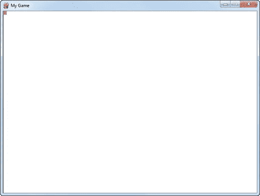

Rectangle in top left corner   Right after the program creates the instance of `Rectangle`, set the x and y values to something new, like 100, 200\. Run the program again to make sure it works and the rectangle moves to the new coordinates.   Add attributes to the class for height and width. Draw the rectangle using these new attributes. Run the program and make sure it works.   Get the object to move:

*   为`change_x`和`change_y`添加属性。
*   创建一个名为`move()`的新方法，根据`change_x`和`change_y`调整 x 和 y。(注意，move 方法不需要 screen 作为参数，因为它不会在屏幕上绘制任何东西。)
*   将`my_object`的`change_x`和`change_y`设置为数值，如 2 和 2。
*   在主程序循环中调用`move()`方法。
*   测试以确保对象移动。

  Randomize the object

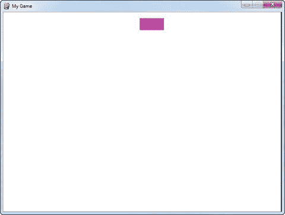

*   导入随机库
*   将 x 位置设置为 0 到 700 之间的一个随机数。您可以在创建对象的循环中这样做，也可以在`__init__`方法中这样做。
*   将 y 位置设置为 0 到 500 之间的随机数。
*   将高度和宽度设置为 20 到 70 之间的任意数字。
*   将`change_x`和`change_y`设置为-3 和 3 之间的随机数。
*   测试并确保它看起来像这个图形。

Rectangle in random spot   Create and display a list of objects

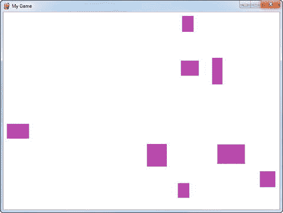

*   在创建`my_object`的代码之前，创建一个空列表，名为`my_list`
*   创建一个循环 10 次的`for`循环。
*   将创建`my_object`的代码放入`for`循环中
*   将`my_object`追加到`my_list`上。
*   在主程序循环内，循环通过`my_list`的每一项。
*   为列表中的每一项调用 draw 和 move 方法。
    *   确保代码调用了`for`循环拉出的元素的 draw 方法，不要只使用`my_object.draw()`。这是最常见的错误之一。
*   测试一下，看看你的程序看起来是否像下图。

Ten rectangles   Use inheritance

*   在`Rectangle`类之后，创建一个名为`Ellipse`的新类。
*   将`Rectangle`设置为`Ellipse`的父类。
*   您不需要创建新的`___init__`；我们将只是继承父类的方法。
*   创建一个绘制椭圆而不是矩形的新绘制方法。
*   创建一个新的`for`循环，除了 10 个矩形之外，还将 10 个`Ellipse`实例添加到`my_list`中。(就用两个独立的`for`循环。)
*   请确保不要创建新列表；只需将它们添加到同一个`my_list`。
*   因为矩形和椭圆都被添加到同一个列表中，所以只需要一个循环就可以遍历列表并绘制两者。不要犯有两个循环的错误，一个用于矩形，一个用于椭圆。事情不是这样的。
*   测试一下，看看你的程序是否像下图这样。

Rectangles and ellipses   Make it more colorful

*   调整程序，让颜色成为`Rectangle`的一个属性。
*   使用新颜色绘制矩形和椭圆。
*   在`for`循环中，将形状设置为随机颜色。记住，颜色是由列表中的三个数字指定的，所以你需要一个由三个随机数组成的列表`(r, g, b)`。
*   测试一下，看看你的程序看起来是否像下图。

Colorful shapes   Try it with more than 10 items of each type. This next figure shows 1,000 shapes.   You are done! Turn in your program.

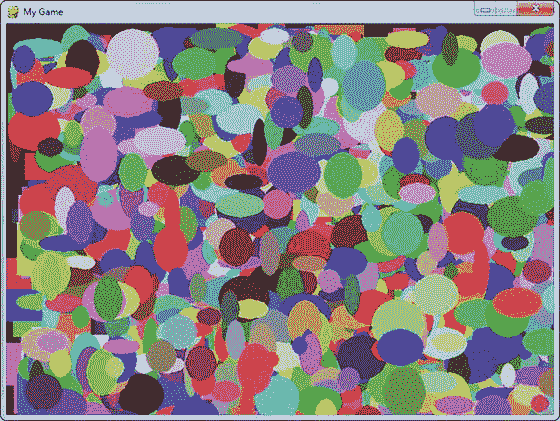

Shapes gone crazy  

## 练习 12:收集雪碧

本练习练习使用 pygame 精灵，如第 14 章所述。

Make sure this program is created in its own directory.   Start with the following program: [`ProgramArcadeGames.com/python_examples/f.php?file=sprite_collect_blocks.py`](http://ProgramArcadeGames.com/python_examples/f.php?file=sprite_collect_blocks.py)   Update the comments at the beginning to reflect that it is now your program, not mine.   Modify it so the player moves with the keyboard rather than the mouse. Take a look at the `move_sprite_keyboard_smooth.py` program also available on the example page: [`ProgramArcadeGames.com/python_examples/f.php?file=move_sprite_keyboard_smooth.py`](http://ProgramArcadeGames.com/python_examples/f.php?file=move_sprite_keyboard_smooth.py)

*   从这个文件中，您需要获取`Player`类，并将其移动到您自己的程序中。不要去掉`Block`类。在你的程序中你将同时拥有`Block`和`Player`两个职业。
*   现在，你的玩家是`Block`的一个实例。您需要对它进行修改，以便创建一个`Player`的实例。注意，`Player`的构造函数与`Block`采用不同的参数。
*   更新您的事件循环，使其像这个新示例一样响应键盘输入。
*   删除用鼠标移动播放器的代码。
*   让玩家变蓝。
*   确保在主程序循环中有一个对`all_sprites_list.update()`的调用。这将调用每个 sprite 中的`update()`方法。
*   测试并确保它现在工作。

  Create both good sprites and bad sprites

*   好雪碧
    *   你现在创建 50 个块，不是把它们添加到一个叫做`block_list`的列表中，而是把它们添加到一个叫做`good_block_list`的列表中。
    *   把积木变成绿色。
    *   在主循环中检查块冲突的地方，更新检查，使其使用`good_block_list`。
*   坏精灵不会在你添加坏方块或玩家之前重新创建列表。
    *   复制这段代码，并将另外 50 个块添加到名为`bad_block_list`的新列表中。
    *   确保你的程序只创建一个`all_sprites_list`。Don’t re-create the list right before you add bad blocks or the player.
    *   把积木涂成红色。
    *   复制代码并对照`bad_block_list`进行检查。降低分数而不是增加分数。
    *   测试并确保它正在工作。
*   使用图形来表示好/坏精灵，如`sprite_collect_graphic.py`示例文件所示。不使用图形只是罚两分。

  Rather than simply use `print` to display the score on the console, display the score on the graphics window. Go back to the end of [Chapter 6](06.html) and look up the section on drawing text.   Add sound effects for when the user hits good blocks, or bad blocks. Here are a couple from [`OpenGameArt.org`](http://opengameart.org) : [`ProgramArcadeGames.com/labs/sprite_collecting/good_block.wav`](http://ProgramArcadeGames.com/labs/sprite_collecting/good_block.wav) [`ProgramArcadeGames.com/labs/sprite_collecting/bad_block.wav`](http://ProgramArcadeGames.com/labs/sprite_collecting/bad_block.wav)   Looking back at how we made a sound to begin with, we triggered the sound with a mouse click event. We won’t be doing that here. Find the code that you already have that detects when a collision occurs. Play the sound when you have a collision. Also, remember that when you load a sound, it needs to be done before the main loop, but after the `pygame.init()` command.   Add a check and make sure the player doesn’t slide off the end of the screen. This check should go in the `update` method of the `Player` class. There should be four `if` statement checks, one for each border. If the player’s x and y get outside the bounds of the screen, reset the player back inside the screen. Do not modify `change_x` or `change_y`. That doesn’t work for player-controlled objects. Don’t forget to check the right and bottom borders; they are easy to get wrong.   Download a wav or ogg file and have it play a sound if the user tries to slide off the screen. Here’s one sound you can use: [`ProgramArcadeGames.com/labs/sprite_collecting/bump.wav`](http://ProgramArcadeGames.com/labs/sprite_collecting/bump.wav)   Check to make sure the bump sound doesn’t continually play when the user is at the edge of the screen. If it does, the program is checking the edge incorrectly.   If you send your program to anyone, remember they will need all the files, not just the Python program.  

## 练习 13:精灵移动

这个练习使用 pygame 精灵，如[第 14 章](14.html)中所述，并且将职业分成不同的文件，如[第 15 章](15.html)中所述。

Make sure this program is created in its own directory.   Start with a copy of the program you wrote for Exercise 12: Sprite Collecting. Copy those files into the directory for this exercise.   Move the `Block` class into a new file. Many people get confused between the name of the library file, the name of the class, and the variable that points to the instance of the object. Library files should be all lowercase. I’d recommend calling your new file that you put the Block class into `block_library.py`.   Make sure your program runs like before. Adjust `import` statements as needed. Remember that you prepend the library name to the class, not the variable that points to the instance of the class. For example: `my_dog = dog_library.Dog()` and NOT `dog_library.my_dog = Dog()` because `Dog` is what is in the library, not `my_dog`.   Define a `GoodBlock` class in a new file, and inherit from your `Block` class. I’d recommend using the file name `goodblock_library.py` to keep with the pattern we set up before. Remember, define the class. Don’t create an instance of it. Your `for` loop that creates the instances does not move.   Add a new `update` method. (You probably don’t need a new `__init__` method.) Make the good block randomly move up, down, left or right each update. (Change `self.rect.x` and `self.rect.y` randomly each time the `update` function is called. Not to a completely new number, but add a random number from -3 to 3 or so. Remember that `random.randrange(-3,3)` does not generate a random number from -3 to 3.)   Change your `for` loop so that it creates instances of the `GoodBlock` class and not your old regular `Block` class.   Call `update` on the list of all the sprites you have. Do this in the main program loop so the blocks keep moving, not just once at the start of the program.   Test and make sure it works.   It is ok if the sprites move off the screen, but a common mistake results in the sprites all moving up and to the left off the screen. If that happens, go back four steps and check your random range.   Double-check, and make sure `GoodBlock` inherits from the `Block` class. If done correctly, `GoodBlock` won’t need an `__init__` method because it will get this method from `Block`.   Create a `BadBlock` class in a new file and inherit from the `Block` class.   Make an `update` function and have the bad block sprites move down the screen, similar to what was done in [Chapter 14](14.html). Extra kudos if you make a bouncing rectangle.   Test, and make sure it works.   Double-check to make sure each class is in its own file.   If you have extra time, you can look at the sprite examples section on the web site and see how to get sprites to bounce or move in circles.  

## 练习 14:拼写检查

本练习展示了如何创建拼写检查器。要准备练习，请访问:

[T2`ProgramArcadeGames.com/index.php?chapter=examples list`](http://ProgramArcadeGames.com/index.php?chapter=examples%20list)

。。。并下载下面列出的文件。这些文件也在“搜索和排序示例”部分。

*   `AliceInWonderLand.txt`——《爱丽丝梦游仙境》正文
*   `AliceInWonderLand200.txt`——《爱丽丝梦游仙境》第一章
*   `dictionary.txt` -一串单词

### 要求

用 Python 写一个检查《爱丽丝梦游仙境》第一章拼写的程序。首先使用线性搜索，然后使用二分搜索法。打印行号和字典中不存在的单词。

请仔细遵循以下步骤。如果你不知道如何完成一个步骤，在进入下一步之前问一下。

### 要完成的步骤:

If you work off the BitBucket template, skip ahead to step 6.   Find or create a directory for your project.   Download the dictionary to the directory.   Download first 200 lines of Alice In Wonderland to your directory.   Start a Python file for your project.   It is necessary to split apart the words in the story so that they may be checked individually. It is also necessary to remove extra punctuation and white space. Unfortunately, there is not any good way of doing this with what the book has covered so far. The code to do this is short, but a full explanation is beyond the scope of this class. Include the following function in your program. Remember, function definitions should go at the top of your program just after the imports. We’ll call this function in a later step. `import re` `# This function takes in a line of text and returns` `# a list of words in the line.` `def split_line(line):`     `return re.findall(’[A-Za-z]+(?:\’[A-Za-z]+)?’,line)` This code uses a regular expression to split the text apart. Regular expressions are very powerful and relatively easy to learn. To learn more about regular expressions, see: [`http://en.wikipedia.org/wiki/Regular_expression`](http://en.wikipedia.org/wiki/Regular_expression)   Read the file `dictionary.txt` into an array. Go back to the chapter on Searching, or see the `searching_example.py` for example code on how to do this. This does not have anything to do with the `import` command, libraries, or modules. Don’t call the dictionary `word_list` or something generic because that will be confusing. Call it `dictionary_list` or something similar.   Close the file.   Print `--- Linear Search ---`   Open the file `AliceInWonderLand200.txt`   We are not going to read the story into a list. Do not create a new list here like you did with the dictionary.   Start a `for` loop to iterate through each line.   Call the `split_line` function to split apart the line of text in the story that was just read in. Store the list that the function returns in a new variable named `words`. Remember, just calling the function won’t do anything useful. You need to assign a variable equal (`words`) to the result. If you’ve forgotten now to capture the return value from a function, flip back to the functions chapter to find it.   Start a nested `for` loop to iterate through each word in the words list. This should be inside the `for` loop that runs through each line in the file. (One loop for each line, another loop for each word in the line.)   Using a linear search, check the current word against the words in the dictionary. Check the chapter on searching or the `searching_example.py` for example code on how to do this. The linear search is just three lines long. When comparing to the word to the other words in the dictionary, convert the word to uppercase. In your `while` loop just use `word.upper()` instead of `word` for the key. This linear search will exist inside the `for` loop created in the prior step. We are looping through each word in the dictionary, looking for the current word in the line that we just read in.   If the word was not found, print the word. Don’t print anything if you do find the word; that would just be annoying.   Close the file.   Make sure the program runs successfully before moving onto the next step.   Create a new variable that will track the line number that you are on. Print this line number along with the misspelled from the prior step.   Make sure the program runs successfully before moving onto the next step.   Print `--- Binary Search ---`   The linear search takes quite a while to run. To temporarily disable it, it may be commented out by using three quotes before and after that block of code. Ask if you are unsure how to do this.   Repeat the same pattern of code as before, but this time use a binary search. Much of the code from the linear search may be copied, and it is only necessary to replace the lines of code that represent the linear search with the binary search.   Note the speed difference between the two searches.   Make sure the linear search is re-enabled, if it was disabled while working on the binary search.   Upload the final program or check in the final program.  

### 示例运行

`--- Linear Search ---`

`Line 3  possible misspelled word: Lewis`

`Line 3  possible misspelled word: Carroll`

`Line 46  possible misspelled word: labelled`

`Line 46  possible misspelled word: MARMALADE`

`Line 58  possible misspelled word: centre`

`Line 59  possible misspelled word: learnt`

`Line 69  possible misspelled word: Antipathies`

`Line 73  possible misspelled word: curtsey`

`Line 73  possible misspelled word: CURTSEYING`

`Line 79  possible misspelled word: Dinah’ll`

`Line 80  possible misspelled word: Dinah`

`Line 81  possible misspelled word: Dinah`

`Line 89  possible misspelled word: Dinah`

`Line 89  possible misspelled word: Dinah`

`Line 149  possible misspelled word: flavour`

`Line 150  possible misspelled word: toffee`

`Line 186  possible misspelled word: croquet`

`--- Binary Search ---`

`Line 3  possible misspelled word: Lewis`

`Line 3  possible misspelled word: Carroll`

`Line 46  possible misspelled word: labelled`

`Line 46  possible misspelled word: MARMALADE`

`Line 58  possible misspelled word: centre`

`Line 59  possible misspelled word: learnt`

`Line 69  possible misspelled word: Antipathies`

`Line 73  possible misspelled word: curtsey`

`Line 73  possible misspelled word: CURTSEYING`

`Line 79  possible misspelled word: Dinah’ll`

`Line 80  possible misspelled word: Dinah`

`Line 81  possible misspelled word:` `Dinah`

`Line 89  possible misspelled word: Dinah`

`Line 89  possible misspelled word: Dinah`

`Line 149  possible misspelled word: flavour`

`Line 150  possible misspelled word: toffee`

`Line 186  possible misspelled word: croquet`

## 练习 15:最终练习

最后的练习有两个选项:“视频游戏选项”和“文本冒险选项”

### 视频游戏选项

就是这里！这是你发挥创造力的机会，真正展示你在自己的游戏中所能创造的东西。

这个最后的练习分为三个部分。每一部分都提高了你的游戏需要具备的能力。

#### 第 1 部分的要求:

*   打开一个屏幕。
*   设置要在屏幕上绘制的项目。
*   通过鼠标、键盘或游戏控制器提供一些基本的玩家动作。

#### 提示:

*   如果你的程序会涉及到互相碰撞的东西，从使用精灵开始。不要从使用绘图命令开始，并期望以后添加精灵。这是行不通的，你需要从头开始。这将是可悲的。
*   如果你正在编写一个类似扫雷或连接四的程序，不要使用精灵。因为不需要碰撞检测，所以没有必要搞乱精灵。
*   在“更长的游戏示例”下，我有两个程序展示了如何创建 pong 或 breakout 风格的游戏。不要只是把这些作为第一部分上交；在它真正合格之前，你需要增加很多。
*   [`OpenGameArt.org`](http://opengameart.org) 有很多图片和声音你可以免费使用。
*   [`Kenney.nl`](http://kenney.nl/) 有许多形象和声音。

#### 第 2 部分的要求:

对于最后的练习第二部分，你的游戏应该是功能性的。一个人应该能够坐下来玩几分钟游戏，让它感觉像一个真正的游戏。以下是您可能想要添加的一些内容:

*   能够碰撞物体。
*   如果发生不好的事情，玩家可能会输掉游戏。
*   屏幕配乐。
*   一些初始音效。
*   屏幕上其他字符的移动。
*   点击地雷或空点的能力。

#### 第 3 部分的要求:

最后，为你的游戏添加最后的润色。以下是您可能想要添加的一些内容:

*   多层次
*   声音
*   多重“生命”
*   标题和说明屏幕
*   背景音乐
*   热追踪导弹
*   隐藏的门
*   扫雷游戏中的“清扫”动作或放置“旗帜”的能力

### 文本冒险选项

对电子游戏不感兴趣？继续你的工作从“冒险！”游戏。

#### 第 1 部分的要求:

Rather than have each room be a list of [description, north, east, south, west], create a `Room` class. The class should have a constructor that takes in (description, north, east, south, west) and sets fields for the description and all of the directions. Get the program working with the new class.   Expand the game so that a person can travel up and down. Also expand it so the person can travel northwest, southwest, northeast, and southeast.   Create another class for `Object`. Give the object fields for name, description, and current room. For example, you might have a name of “key,” a description of “This is a rusty key that looks like it would fit in an old lock. It has not been used in a long time.” The current room number would be 3 if the key was in room 3\. If the player is carrying the key then the current room for the object will be -1.   Create a list for objects, and add several objects to the list. The code for this will be very similar to the list of rooms that you created and added to the list of rooms.   After printing the description of the room, have the program search the entire list of objects, and print if the room of the object matches the room the player is in. For example, if `current_room == current_object.room` then print: “There is a key here.”   Test your game and make sure it works.  

#### 第 2 部分的要求:

Add the ability to pick up an object. If the user types `get key` then: Split the user input so you split out and just have a variable equal to “key.”   Search the list until you find an object that matches what the user is trying to pick up.   If the object isn’t found, or if the object isn’t in the current room, print an error.   If the object is found and it is in the current room, then set the object’s room number to -1.     Add the ability to drop an object.   Add a command for “inventory” that will print every object who’s room number is equal to -1.   Add the ability to use the objects. For example “use key” or “swing sword” or “feed bear.”  

#### 第 3 部分的要求:

将游戏再扩展一些。尝试以下一些想法:

Create a file format that allows you to load the rooms and objects from a file rather than write code for it.   Have monsters with hit points.   Split the code up into multiple files for better organization.   Remove globals using a `main` function as shown at the end of the chapter about functions.   Have objects with limited use. Like a bow that only has so many arrows.   Have creatures with limited health, and weapons that cause random damage and have a random chance to hit.