# 一、做好准备

您已经决定使用 Python 学习微控制器。尽管直接投入到开发很酷的东西是很好的，但是有几个步骤你必须首先做好准备。如果你有软件开发的经验，你可能习惯于打开一个编辑器，然后马上输入代码。然而，微控制器开发比这要复杂一些。毕竟，你将为一台单独的计算机编写程序，所以有更多的东西需要设置。微控制器开发环境不仅包括软件，还包括一个完整的硬件生态系统，必须理解这个生态系统才能释放这些器件的所有魅力。

在这一章中，我们将着眼于建立一个开发环境。本章结束时，您将准备好选择微控制器板，并拥有开始使用 CircuitPython 进行开发所需的软件工具和硬件设备。我们开始吧！

## 微控制器简介

在我们的现代世界，计算机无处不在。它们变得更小，更容易使用，并且更加融入我们的日常生活。几年前，要连接互联网和查看电子邮件，你必须坐在一个大型桌面设备前。今天，你可以用一台手掌大小的电脑做同样的事情，把世界上所有的信息都放在你的指尖。

科技进步给我们带来了智能手机和平板电脑，也让数十亿人拥有了电脑。然而，这些手持设备并不是唯一存在的计算机。如果我告诉你，与静静地围绕在我们周围的另一种计算设备相比，数十亿部正在使用的智能手机相形见绌，会怎么样？事实上，现在在你的房间里可能有半打或更多这样的设备。这些微型计算机被称为*微控制器*，或*MCU*，它们在我们身边随处可见。

微控制器是小型、智能、可编程的计算机，我们用它来执行重复性的任务，或者需要某种程度的智能控制而不需要人工干预的任务。微控制器设备的计算能力只是智能手机或平板电脑等设备的一小部分，但它们有很多很多用途。你周围的任何设备，只要一按下按钮就会做出反应，显示信息，或者在出错时发出声音，都很可能是由微控制器控制的。从计算器到电视到微波炉和洗碗机，你能想到的几乎每一个家用设备都包含一个微控制器。

如果你熟悉计算机，你肯定听说过中央处理器(CPU)或微处理器:计算机背后的大脑。微处理器让计算机执行许多功能。某一天你可能用电脑来打文件，下一天你可能用电脑来播放你最喜欢的电影，等等。微处理器有许多支持电路，包括存储器和输入输出芯片，使它能够执行所有这些任务。这些通常是容纳微处理器的主板的一部分。

微控制器将微处理器工作所需的所有支持芯片放在一个芯片上。这就是为什么微控制器被称为单片计算机。微控制器仍然像微处理器一样工作，但它被设计成只执行一项任务，并且尽可能高效地执行。因此，微控制器芯片包含完成任务所需的最小处理能力。

## 固件、内存和时钟速度

像通用计算机一样，微控制器通过运行程序来工作。因为微控制器执行有限的功能，所以为它们编写的程序不会经常改变。因此，为微控制器编写的程序被称为*固件*。该固件通常存储为二进制文件(具有. bin 文件扩展名)或十六进制文件，后者是文本表示的二进制文件(具有. hex 文件扩展名)；该文件包含写入 flash 的存储器内容，因此可以在微控制器上运行。一种叫做编程器的特殊设备将这个二进制文件加载到微控制器的存储器中。

存储器由两部分组成:主存储器(有时称为程序存储器)和随机存取存储器(ram，有时称为数据存储器)。主存储器是非易失性的，而 RAM 是易失性的。这意味着当微控制器断电时，RAM 中包含的信息将会消失，而主存储器中的信息将会保留。因此，主存储器也被称为只读存储器(ROM)。它的内容被设计成主要被读取，而 RAM 被设计成在运行时由用户改变其内容。

在通用计算机系统中，通常一个程序在执行前被装入 ram。微控制器系统有点不同。在微控制器中，固件直接从 rom 中执行，RAM 用于存储帮助运行固件的临时信息(这些通常是运行时变量，可以包含堆栈或堆，以及特殊的内存结构)。

有些微控制器器件可以在出厂时就将 ROM 内容编程到器件中，一旦装入器件，最终用户就无法更改。这些被称为一次性可编程(OTP)设备，它们更便宜，更容易制造。不过，通常 ROM 是由闪存制成的，这意味着它可以在制造后进行编程和更改。

闪存可让您对设备进行数千次编程，这对于学习和产品原型制作非常有用。如果固件程序中出现错误，flash 还允许您通过更新来修复错误，这一过程称为修补。更新通常采取空中下载(OTA)更新的形式，通过无线连接改变 ROM 的内容。OTA 更新对于物联网(IoT)设备来说很常见。或者，您可以使用电缆将设备连接到电脑来更新固件。

微控制器根据运行设备的时钟速度执行其固件程序中的指令。速度是以赫兹或每秒钟的周期数来衡量的。*时钟速度*越快，设备执行指令就越快。微控制器的时钟速度通常在 1 MHz 左右(尽管对于极低成本、低功耗的应用，时钟速度可以低至 32.768 kHz，对于高速系统，时钟速度最高可达 1 GHz。)

## 8 位与 32 位

我们将在本书中使用的设备非常强大。它们由 32 位微处理器内核组成，这意味着微控制器可以处理的数据位数由 32 个寄存器组成(寄存器是微控制器内数据的小存储单元；我们将在下一章详细讨论这一点)。然而，在很长一段时间里，8 位设备统治着微控制器市场。

历史上，32 位设备价格昂贵且难以编程。由于技术的进步，32 位设备的成本已经下降到可以与 8 位设备竞争的程度，但对成本极其敏感的应用除外。与此同时，由于现在有无数的工具可以使用，32 位设备已经变得非常容易编程和控制。虽然 8 位微控制器仍然存在并具有相关性，但它们的许多市场份额正在被 32 位设备取代。

对于初学者来说，32 位设备是一个特别有用的学习工具，因为它们包含更多的内存和更大的内存寻址能力。这允许更高层次的抽象，意味着在没有完全理解其内部工作原理的情况下，通常更容易对 32 位设备进行编程。相比之下，由于 8 位设备的处理能力和内存较小，因此您需要更深入地了解设备的内部，以便更好地管理内存资源和编写有效的程序。

### 微控制器编程语言

在本节中，我们将了解一些可用于微控制器编程的语言。虽然有几个选项可供选择，但微控制器对构成现代软件开发环境的拥挤不堪的编程语言大多持抵制态度。从历史上看，微控制器领域一直由 C 编程语言主导。这是因为微控制器传统上只有几个字节的内存，并且以几十兆赫的时钟速度运行，而 C 特别适合在内存受限的系统上工作。然而现在，你可以找到拥有运行频率高达千兆赫的多核微控制器设备，并拥有数兆字节的内存，为其他语言的使用开辟了空间。

## 汇编语言

曾经有一段时间，微控制器完全是用汇编语言编程的。今天，汇编语言是为内存有限的设备和程序员需要充分发挥微控制器性能的情况而保留的。汇编语言在这些情况下很有用，因为许多汇编指令在微控制器上直接翻译成机器指令。这意味着指令执行的开销更少，使得用汇编语言编写的代码段更快。虽然汇编语言速度很快，但在设备上执行一个简单的任务需要大量指令。汇编语言的另一个限制因素是，对于你正在编程的每一个设备，你必须学习那个设备的汇编语言。鉴于这些限制，除了小众场合，这种语言的受欢迎程度已经下降。

## C

长期以来，c 语言一直是嵌入式领域的首选语言。它可以在内存受限的设备上运行，比如微控制器。C 给了我们有效控制底层硬件的能力——一条 C 指令翻译成几条汇编语言指令——而且它可以和大多数应用程序的汇编语言速度相匹配。由于 C 语言已经使用了很长时间，所以许多代码都经过了实战测试，并被证明适用于它们的应用程序。c 用户可以访问包含有用信息和代码片段的大型代码库。然而，这种语言需要对硬件有很好的理解，初学者很难掌握。

## C++

随着时间的推移，嵌入式设备变得越来越强大，一些微控制器制造商和软件供应商开始为他们的设备添加 C++支持。C++正在专业嵌入式领域慢慢获得牵引力。然而，在业余爱好者领域，C++在 Arduino 平台上得到了广泛的应用。然而，C++是一门庞大而难学的语言。许多使 C++在通用计算应用中比 C 更有效的特性，有时不能在资源受限的微控制器设备上实现。这是因为虽然 C++在大多数应用程序中的性能可以与 C 相媲美，但 C++倾向于使用更多的内存，这是一种宝贵的资源，通常在微控制器设备上并不丰富。因此，C++是为高端设备保留的。

## 基本的

在 21 世纪初，如果一个初学者开始接触微控制器，并且不喜欢汇编，BASIC 是可以使用的编程语言。BASIC 代表初学者的通用符号指令代码，是一种易于使用的编程语言。微控制器芯片上通常有一个基本的解释程序来运行指令。

BASIC 最终不受欢迎，因为运行它的主板相对于它们的能力来说花费了很多钱。此外，运行 BASIC 解释程序会降低芯片速度，并在已经受限的 8 位设备上占用太多资源。此外，最流行的基本设备的工具和软件都是闭源的，所以人们不能制造他们自己的基本设备。当像 Arduino 这样的开源替代品出现时，像 BASIC Stamp 这样的设备就不再受欢迎了。

## 锈

Rust 编程语言相对于 C(几乎有半个世纪的历史)来说是新的，它被设计用来颠覆 C 和 C++对系统编程的控制，包括嵌入式编程。随着微控制器变得更加强大，并发性(一次执行多个进程的能力)等因素开始变得重要，Rust 相对于 C 的优势开始显现。Rust 更适合并发性，因为它可以处理数据竞争，即两个设备试图同时访问内存中的同一位置。

虽然 Rust 可能会取代 C，但业界没有理由在短期内采用它。嵌入式软件被称为固件是有原因的:它不会经常改变，而且许多已经写好的代码没有理由改变成一种新的语言。c 工作并且有许多已建立的工具链和设备，并且有许多熟练的开发人员熟悉这种语言。然而，已经有工具允许 Rust 用于微控制器，随着时间的推移，Rust 可能会在嵌入式市场获得一些份额。

## 计算机编程语言

Python 相对来说是嵌入式领域的新手，它可能会成为该领域的主要参与者。Python 比 C 语言简单得多，是当今最流行的编程语言之一。虽然对于初学者来说，BASIC 比 C 容易，但是 Python 比 BASIC 有几个优点，这使它更适合作为嵌入式语言使用。值得注意的是，虽然流行的基本微控制器是闭源的，但 Python 是开源的，如果您愿意，可以在您的定制设备上运行 Python。Python 文件也可以被编译成更小的文件，这样你就可以创建紧凑的、节省内存的程序。

很多人说 Python 这样的解释语言不适合微控制器的局限性。这可能曾经是真的，但随着今天更强大的设备，微控制器完全有可能运行解释语言，而不会像旧的基本设备那样遇到速度限制。对于非常省时的计算，也称为实时计算，解释语言仍然不适合。然而，Python 应该可以满足大多数微控制器项目的速度要求。

虽然 Python 在微控制器上运行时没有 C 语言快或高效，但它的易用性使它值得一试，尤其是如果你现在开始接触微控制器的话。此外，您可以用 C 扩展 Python 代码，这意味着您可以利用现有的 C 代码库，这些代码库经过了几十年的考验和改进。

存在于通用计算机上的 Python 解释器不能直接在具有相同可用特征的微控制器上实现。这是因为标准 Python 解释器是一个大型程序，它依赖于操作系统提供的功能，尤其是内存和硬件接口功能，而这在微控制器设备上是不存在的。语言解释器的两种修改形式，MicroPython 和 CircuitPython，在标准 Python 解释器和嵌入式空间之间架起了一座桥梁。其中，MicroPython 更面向专业开发人员，领先于 CircuitPython。由 Adafruit 开发的 CircuitPython 使用起来更简单，使其成为初学者的优秀学习工具以及专业人士的平台。CircuitPython 用户友好的主要特点是，在微控制器上运行程序之前，您不需要编译程序。一旦你保存了一个程序，它就会运行并执行。

CircuitPython 有望在更多资源受限的设备上使用，并有望在可预见的未来保持良好的支持。由于这些原因，我们将在整本书中使用它。

## 选择开发板

为了完成本书中的项目，您需要一个带有微控制器的开发板，可以运行 CircuitPython。开发板包含一个微控制器以及为开发板供电并使其启动和运行所需的连接。开发板允许您对微控制器进行使用、编程和原型制作，而无需担心硬件设置。

在撰写本文时，CircuitPython 支持超过 140 种电路板，并且这个列表还在不断增长。你可以在 CircuitPython 网站这里查看名单: [`https://circuitpython.org/downloads`](https://circuitpython.org/downloads) 。这些兼容的板中的任何一个都可以和这本书一起工作。您也可以选择创建自己的支持 CircuitPython 的定制设备，这个过程我将在本章末尾讨论。然而，对于初学者来说，使用预制的 CircuitPython 兼容板总是更好的选择。它将确保硬件正常工作，并允许您更快地开始为您的设备编写软件。

在本节中，我们将了解一些可以运行 CircuitPython 的预配置设备。尽管许多公司提供能够运行 CircuitPython 的微控制器板，但 Adafruit 设备拥有最好的支持，因为它们首创了 CircuitPython 语言，并拥有一个围绕 circuit python 构建的完整生态系统及其开发环境。我们将看看他们提供的一些电路板，以及其他制造商提供的可以与 CircuitPython 一起使用的流行电路板。这个列表并不详尽，但是这里介绍的板将与本书中讨论的例子兼容。

## 阿达水果 M0 地铁快线

我们要看的第一块广告牌是 Adafruit Metro M0 快车，如图 [1-1](#Fig1) 所示。该板由 SAMD21G18A 微控制器供电，是配合本书示例使用的理想选择。该板还具有 Arduino 外形；这意味着它可以与现有的 Arduino 盾牌一起使用。因此，强大的 Arduino 生态系统可以很容易地用 Python 中的 Arduino shields 进行原型设计。SAMD21G18A 代表运行 CircuitPython 所需的“理想最小值”。它的特性允许它运行解释器没有任何停顿。SAMD21G18A 具有 48 MHz 时钟、256KB 闪存和 32KB RAM。(相比之下，由 ATmega328 微控制器供电的电路板，如 Arduino Uno，其闪存和 RAM 分别减少了 8 倍和 16 倍。)M0 地铁快车还有 2MB 的闪存，可以用来存储程序和其他文件。与 SAMD21G18A 相比，您可以使用更少的内存或更少的处理能力来运行 CircuitPython 解释器，但体验可能并不完美。

SAMD21G18A 微控制器是首批支持 CircuitPython 的器件之一，围绕该器件构建的电路板通常是首批获得最新版本解释器的器件。特别是，M0 地铁快线是第一个使用 CircuitPython 设计的 Adafruit 地铁板。它被认为是运行 CircuitPython 的标准板，它将能够体面地运行本书中的程序。

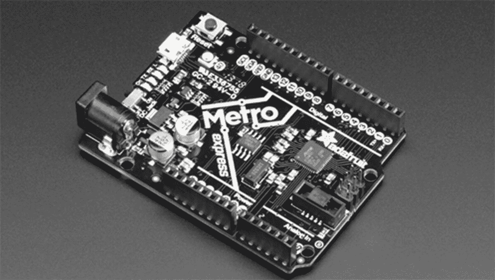

图 1-1

阿达果地铁 M0 快车[信用:阿达果，adafruit.com]

## 阿达果羽毛 M0 快递

如果你想要一个更简约的开发方法，你可以从 Adafruit 获得羽毛 M0 快车，如图 [1-2](#Fig2) 所示。因为它也是围绕 SAMD21G18A 处理器构建的，所以该板具有 Metro M0 Express 的所有功能:相同的 48 MHz 时钟、256KB 闪存和 32KB RAM。它还拥有相同的板载 2MB 闪存。然而，它比 Metro 更紧凑，并且少了 5 个 I/O 引脚——20 个而不是 25 个。

这种板的一个很酷的特点是前面的小原型区域，这是 M0 地铁快车所没有的。当你已经熟悉了 M0 地铁快线，并且你想要一个板嵌入到你自己的项目中，那么你可以使用这个更小、更便宜的板。还有 Adafruit 的 QT Py 板，如果您的项目需要更小的板，它甚至比 M0 Express 板更紧凑。

图 1-2

阿达果羽毛 M0 快递[信用:阿达果，adafruit.com]

## 阿达水果 M4 地铁快线

如果你需要比 M0 地铁快线更多的魅力，那么你可以搭乘 M4 地铁快线，如图 [1-3](#Fig3) 所示。该板由 SAMD51J19 微控制器供电，其性能优于之前讨论的基于 SAMD21G18A 的器件。在 120 MHz 时，它的运行速度是基于 SAMD21G18A 的主板的两倍多，它具有 512KB 的闪存、192KB 的 RAM 和额外的 2MB 板载闪存。

这些增强功能为数字信号处理(DSP)和浮点处理应用提供了更好的支持。如果您希望将您的主板用于音频处理等应用，或者如果您正在寻求更好的安全功能或总体性能改进，那么这是一款不错的主板。然而，性能的提高是有代价的。M4 地铁快线的处理器将比之前讨论的主板消耗更多的能量。不过，根据您的应用，这可能不是一个很大的因素，因为电路板仍然是高能效的。

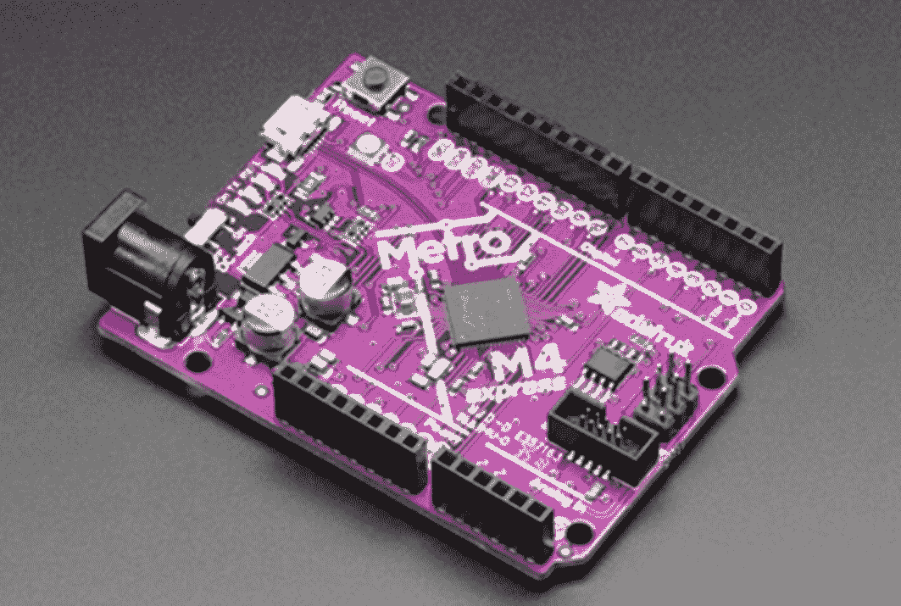

图 1-3

阿达果 M4 地铁快车[信用:阿达果，adafruit.com]

## Adafruit Grand Central M4 高速公路

我们可以用来和这本书一起工作的下一块板是阿达果大中央 M4 快车，如图 [1-4](#Fig4) 所示。与 Metro M0 相比，该板非常强大，因为它具有 ATSAMD51P20 微控制器。它的运行速度快了 2.5 倍，并且该板的 RAM 大小是 Metro M0 的 8 倍。事实上，大中央车站的内存量相当于整个 M0 地铁的闪存量(让它沉下去一点)。Grand Central 还具有 1MB 的闪存，通过 QSPI 芯片的 8MB 板载闪存，以及内置的 SD 卡插座。该板的 I/O 几乎是 M0 地铁上的三倍。当您有一个大型应用程序，并且在一个更基本的主板上耗尽了空间(内存或 I/O)时，这个主板是一个很好的迁移途径。

Grand Central 绝对可以用来运行本书中的所有示例，当您准备好开始自己的更复杂的 CircuitPython 项目时，像这样使用 ATSAMD51 微控制器的电路板是理想的选择。由于其充足的资源，机器学习和视频游戏编程等应用可以通过该板完成。

图 1-4

阿达果大中央 M4 快递[信用:阿达果，adafruit.com]

## Arduino Zero

Arduino Uno 无疑是有史以来最受欢迎的微控制器板之一，至今仍被广泛使用。它向我们展示了 8 位微控制器的强大功能。然而，世界在变，32 位微控制器已经接管了很多曾经由 8 位设备控制的细分市场。Arduino Uno 平台有许多限制，因此 Arduino Zero 的创建是为了将 32 位开发带入 Arduino 世界。图 [1-5](#Fig5) 中的 Arduino Zero 向 Arduino 平台的用户提供 32 位嵌入式计算迈出了一步。

Arduino Zero 由 SAMD21G18A 微控制器供电，该微控制器与 Metro M0 和 Feather M0 电路板中使用的微控制器相同。虽然它缺少 Adafruit Metro 主板上的板载闪存，但 Arduino 仍然可以运行相当大的程序，并将与本书中提供的所有示例一起工作。与前面讨论的其他开发板不同，虽然开源(是的，所有硬件原理图和源代码都是可用的)特定于一个供应商，但 Arduino Zero 有许多开发板的克隆版本，您可以在其上运行 CircuitPython。这些复制品通常比制造商提供的官方主板便宜。

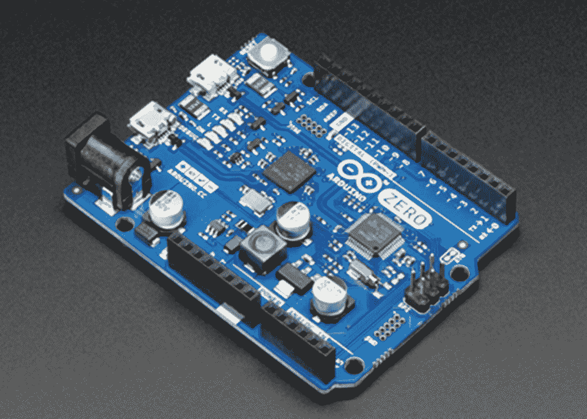

图 1-5

Arduino Zero[鸣谢:adafruit.com 阿达果]

## STM32F746ZG 核子

基于 STM32 的电路板也可以运行本书中讨论的例子。例如，STM32F746ZG Nucleo 已经过本书中所有示例的测试，运行良好。这个板子，如图 [1-6](#Fig6) 所示，绝对是个庞然大物。它采用 STM32F746ZG 微控制器，其处理器的性能优于前面讨论的任何一种板。该板运行在惊人的 216 MHz，有 320KB 的内存和 1MB 的闪存。

STM32F746ZG 主要面向之前有微控制器经验的人。虽然它在 CircuitPython 上运行良好，但它并不像该系列中的其他主板那样开箱即用。尽管如此，该板的速度和性能使其值得用于通过 CircuitPython 执行计算密集型任务，如解码 MP3 文件或使用以太网，或者当您需要大量 I/O 时。

如果你想要更多的果汁，你可以考虑购买 STM32H743 Nucleo，它有一个运行频率高达 400 MHz 的微控制器。凭借 1MB 的内存和 2MB 的闪存，它可以轻松地与 CircuitPython 配合使用。这个板也不像其他一些板那样对初学者友好，而且它带有一些陷阱。例如，如果没有自己的支持，微控制器上的一些外来外设可能无法在 CircuitPython 中使用。其中包括 HDMI、DFSDM 和运算放大器等外设。此外，由于该板的工作频率为 400 MHz，功耗很大，因此不适合电池供电的应用。新的微控制器用户最好先从一块 Metro 板开始，然后再使用这块板。

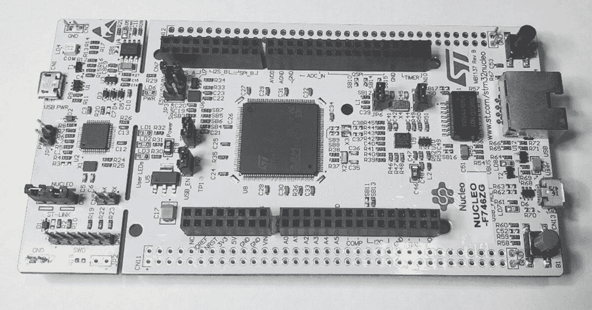

图 1-6

STM32F746ZG Nucleo

## 设备比较

表 [1-1](#Tab1) 比较了可用于跟随本书的电路板的特性。选择合适的微控制器可能是一项艰巨的任务。在我看来，最好的微控制器是 Adafruit Grand Central M4，因为它功能强大，并得到 CircuitPython 的良好支持。然而，前面讨论的任何板都可以满足我们的目的。

表 1-1

设备比较

<colgroup><col class="tcol1 align-left"> <col class="tcol2 align-left"> <col class="tcol3 align-left"> <col class="tcol4 align-left"> <col class="tcol5 align-left"></colgroup> 
| 

设备

 | 

时钟速度

 | 

随机存取存储

 | 

闪光

 | 

板载 SPI

闪存

 |
| --- | --- | --- | --- | --- |
| 米-0 | 48 兆赫 | 32KB | 256 千字节 | 2MB |
| 羽毛 M0 | 48 兆赫 | 32KB | 256KB | 2MB |
| M4 公尺 | 120 兆赫 | 192KB | 512KB | 2MB |
| 大 M4 中心 | 120 兆赫 | 265KB | 1MB | 8MB |
| Arduino 零号 | 48 兆赫 | 32KB | 256KB | 没有人 |
| STM32F746ZG 核子 | 216 兆赫 | 320KB | 1MB | 没有人 |

## 组件列表

微控制器是我们电路的核心。然而，本书中的项目也需要支持组件和设备。表 [1-2](#Tab2) 列出了本书中需要用到的所有设备和组件。不要担心:每一部分都会在出现时详细讨论。为了方便起见，表中为每个商品提供了两个产品编号，一个来自 Amazon，一个来自另一个供应商。但是，欢迎您货比三家，寻找符合商品描述的其他选项。

表 1-2

组件列表

<colgroup><col class="tcol1 align-left"> <col class="tcol2 align-left"> <col class="tcol3 align-left"> <col class="tcol4 align-left"></colgroup> 
| 

项目

 | 

量

 | 

小贩

 | 

产品编号

 |
| --- | --- | --- | --- |
| 各种电阻器套件 | one | 贾梅克亚马逊 ASIN | Two million two hundred and seventeen thousand five hundred and elevenB07L851T3V |
| 10K 试验板微调电位计 | Two | 阿达果亚马逊 ASIN | Three hundred and fifty-sixB07S69443J |
| 220 μF 电容电解的 | one | 阿达果亚马逊 ASIN | Two thousand one hundred and ninety-twob07 sbw 1 和 17 战斗机 |
| 0.1 μF 陶瓷电容 | one | 阿达果亚马逊 ASIN | Seven hundred and fifty-threeB07RB4W4MR |
| 5 毫米红色指示灯 | one | 阿达果亚马逊 ASIN | Two hundred and ninety-nineB077X95F7C |
| 触摸开关按钮 | one | 阿达果亚马逊 ASIN | One thousand one hundred and nineteenB01GN79QF8 战斗机 |
| 10 lux 50–100 kohm 光敏电阻 | 至少 2 个 | 阿达果亚马逊 ASIN | One hundred and sixty-oneB01N7V536K |
| TMP36 温度传感器 | one | 阿达果亚马逊 ASIN | One hundred and sixty-fiveb11 GH 32 突击步枪 |
| MPU6050 加速度计和陀螺仪 | one | 阿达果亚马逊 ASIN | Three thousand eight hundred and eighty-sixB00LP25V1A |
| 4 通道逻辑电平转换器 | Two | 阿达果亚马逊 ASIN | Seven hundred and fifty-sevenB07LG646VS |
| CP2102 或 CP2104 USB-UART 转换器 | one | 阿达果亚马逊 ASIN | Three thousand three hundred and nineB07D6LLX19 战斗机 |
| 诺基亚 5110 GLCD | one | 阿达果亚马逊 ASIN | Three hundred and thirty-eight-= ytet-伊甸园字幕组=-翻译 |
| 固态盘 1306 | one | 阿达果亚马逊 ASIN | Three hundred and twenty-sixb076pdvfqd |
| 6V 爱好 DC 电机尺寸 130 | one | 阿达果亚马逊 ASIN | Seven hundred and elevenB07BHHP2BT |
| 微型伺服电机 MG90S 或 SG92R | one | 阿达果亚马逊 ASIN | One hundred and sixty-nineB07NV476P7 |
| 5V 500mA 步进电机 | one | 贾梅克电子公司亚马逊 ASIN | Two hundred and thirty-seven thousand eight hundred and twenty-fiveB00B88DHQ2 突击步枪 |
| ULN2003 达林顿阵列 | one | 数码电子亚马逊 ASIN | 497-2344-5-NDB07YSS1MQL |
| L293D 四路半 H 驱动器 | one | 阿达果亚马逊 ASIN | Eight hundred and sevenb200 nay 2 欧元 |
| DHT11 温度和湿度传感器 | one | 阿达果亚马逊 ASIN | Three hundred and eighty-sixb11 有 8 个 ZMWK |
| 公共阳极 RGB LED(最好是漫射的) | one | 阿达果亚马逊 ASIN | One hundred and fifty-nineb 0194 和 6 兆瓦 2 |
| HC-SR04 超声波传感器 | one | 阿达果亚马逊 ASIN | Three thousand nine hundred and forty-twoB004U8TOE6 |
| 压电扬声器 | one | 阿达果亚马逊 ASIN | One hundred and sixtyb21 gj 5 bs |
| 1N4001 通用硅二极管 | one | 阿达果亚马逊 ASIN | Seven hundred and fifty-fiveB0087YKE02 战斗机 |
| 400 连接点无焊试验板 | Two | 阿达果亚马逊 ASIN | Sixty-fourb7pcie 9 代 |
| 跳线男性对男性 | 至少 20 个 | 阿达果亚马逊 ASIN | Four thousand four hundred and eighty-twob07 会计年度第 7 季第 1 集 |
| 实验室工作台电源 | one | 亚马逊 ASIN 各种制造商 | B081SFKW2R |

关于电源，一个高质量的 1 安培墙上适配器可以作为通过这本书的最低要求。(避免使用便宜的 1A 适配器，因为很多时候它们很吵，会干扰正常的电路操作。)然而，如果你打算长期使用微控制器，一个更坚固的实验室电源是一个不错的投资。这在使用电机时尤其重要，因为电机在启动时会消耗大量功率。标准是使用 30V 5A 的实验台电源，如表 [1-2](#Tab2) 中建议的电源。这些电源几乎可以处理你扔给它们的任何东西。

## 管理部门编辑器

现在我们已经讨论了硬件，我们可以设置本书中练习所需的软件。使用 CircuitPython 对设备编程的最佳方式是使用 Mu 编辑器，它与 Windows、macOS 和 Linux 机器兼容。你可以从 [`https://codewith.mu/`](https://codewith.mu/) 下载编辑器。

下载并安装了 Mu 编辑器后，用 USB 线把你的 CircuitPython 设备连接到你的电脑上(没错，就是这么简单！)并开辟 Mu。你会看到一个类似图 [1-7](#Fig7) 的窗口。

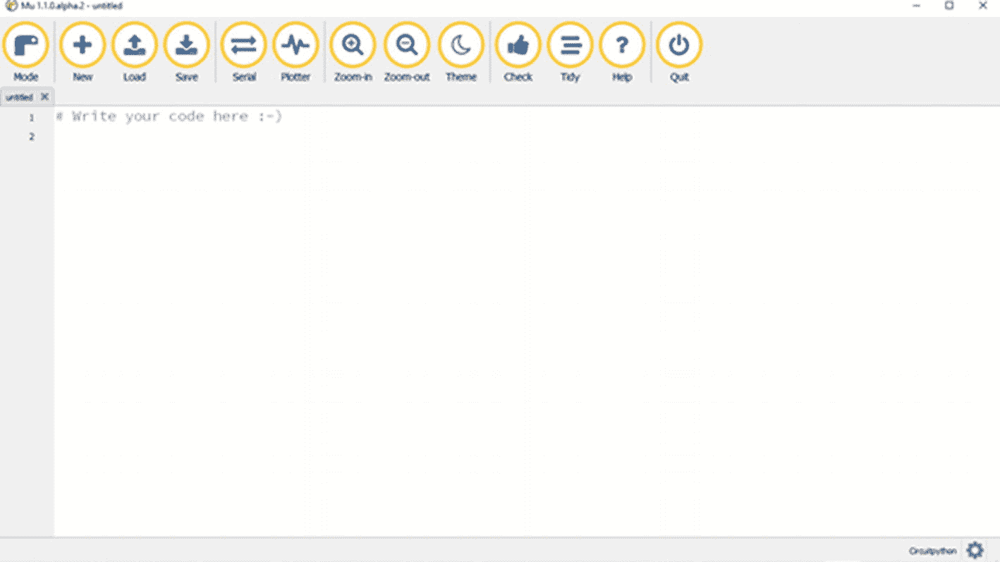

图 1-7

管理部门编辑器

如果您的 CircuitPython 设备已连接，您将能够读取设备上的文件(该文件是核心 CircuitPython 的一部分)。一旦 CircuitPython 出现在连接的设备上，一旦插入设备，code.py 文件就会出现在设备上。如果您选择的电路板不包含 CircuitPython，您可以在 [`https://learn.adafruit.com/installing-circuitpython-on-samd21-boards/overview`](https://learn.adafruit.com/installing-circuitpython-on-samd21-boards/overview) 遵循本指南。点击编辑器上的**加载**按钮，如图 [1-8](#Fig8) 所示。

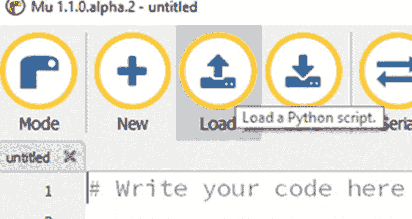

图 1-8

管理部门中的加载按钮

将出现一个对话框。Mu 将默认为文件的目录，但如果没有，则导航到您的 CircuitPython 设备的驱动器(CircuitPython 就像 USB 闪存驱动器一样显示)。你会看到一个 *code.py* 文件，如图 [1-9](#Fig9) 所示。*。py* 扩展名表示这是一个 Python 代码文件。

图 1-9

在管理部门中加载 code.py 文件

打开文件，您会看到它包含一行代码:`print('Hello world!')`。当一台普通的计算机运行`print`命令时，括号中包含的消息显示在终端中，在这个窗口中，您可以输入命令并查看代码的输出。但是，您的微控制器没有显示功能或内置终端窗口。幸运的是，CircuitPython 设备默认允许通过串行通信协议与主机通信。Mu 有一个称为串行监视器的特性，允许您查看微控制器的程序输出。它还会提醒您程序中可能存在的任何错误。

加载完代码文件后，点击 Mu 中的**串口**按钮，打开串口连接，如图 [1-10](#Fig10) 所示。

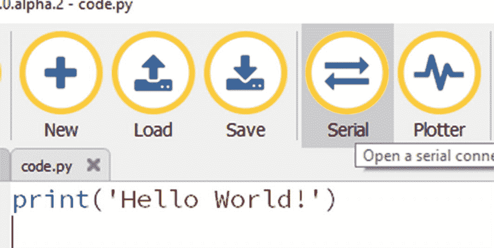

图 1-10

管理部门中的串行按钮

单击该按钮后，编辑器下方会弹出一个小的终端窗口。这将显示微控制器的串行输出。它看起来应该类似于图 [1-11](#Fig11) 。

图 1-11

串行输出窗口

点击编辑器中的**保存**按钮，您将会看到`print`语句已经执行并且正在串行输出窗口中运行。您的输出应该类似于图 [1-12](#Fig12) 。

图 1-12

在串行输出窗口中运行 code.py

串行终端有一些有用的特性。按 ctrl-C(或 Mac 的 command-C)将打开一个读取-评估-打印循环(REPL)，由屏幕上的`>>>`符号指示，如图 [1-13](#Fig13) 底部所示。

图 1-13

在串行终端中打开电路 Python REPL

REPL 允许你逐行输入你的 Python 代码，并让你的微控制器执行它。当你在学习如何用一种新语言编程时，有时你只想快速尝试。REPL 是有用的，因为它为您提供了一种方便测试代码片断的方法，而无需编写整个程序。当您打开 REPL 时，微控制器停止执行它正在运行的程序。要离开 REPL 并让程序重新运行，请按 ctrl-D

### 其他串行通信工具

除了 Mu 的串行终端之外，还有其他工具允许您通过串行连接与开发板通信。如果您使用的是定制板，或者 Mu 在检测板时遇到问题，这些工具将会非常有用。在这些情况下，您有时会看到如图 [1-14](#Fig14) 所示的错误信息。当 Mu 找不到它认为可以与串行端口一起工作的连接板时，就会出现错误。

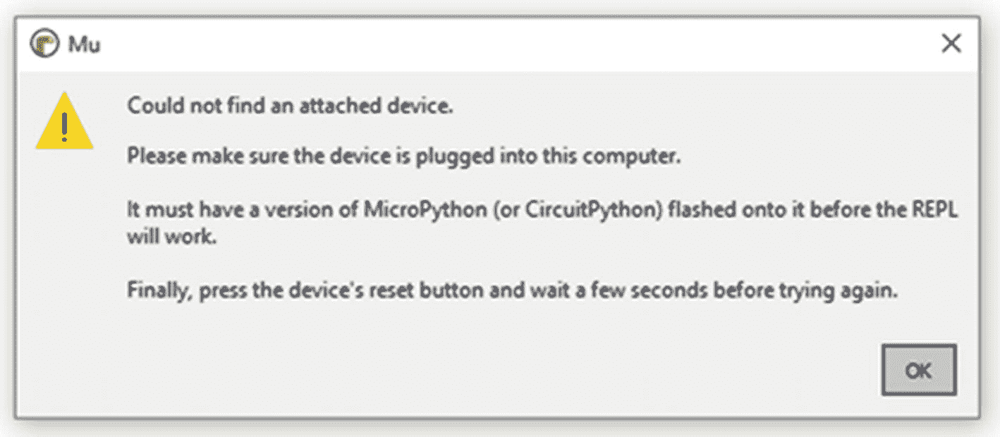

图 1-14

Mu 找不到连接的板时的错误消息

如果你用的是 macOS 或者 Unix 电脑，可以看看 CoolTerm 之类的程序，可以在 [`http://freeware.the-meiers.org/`](http://freeware.the-meiers.org/) 下载。在 [`www.mac-usb-serial.com/docs/tutorials/access-serial-port-on-mac-with-coolterm.html#`](http://www.mac-usb-serial.com/docs/tutorials/access-serial-port-on-mac-with-coolterm.html) 可以找到不错的 macOS 用户 CoolTerm 教程。请注意，在较新版本的 macOS 上，运行该程序可能会出现问题，因为开发者未经验证。为了解决这个问题，打开终端并输入`sudo spctl –master-disable`，这将允许你运行从任何地方下载的应用程序。

如果 Windows 用户在 Mu 内部使用串行终端时遇到问题，他们也可以使用名为 PuTTY 的程序与开发板建立串行连接。可在 [`www.chiark.greenend.org.uk/~sgtatham/putty/`](http://www.chiark.greenend.org.uk/%257Esgtatham/putty/) 下载。PuTTY 允许计算机通过 Telnet 和 SSH 等协议相互通信。PuTTY 还可以与连接到计算机 COM 端口的虚拟设备通信。虽然我们使用 USB 电缆将 CircuitPython 设备连接到计算机，但该设备显示为计算机的串行端口。当 USB 设备被模拟为串行 COM 端口时，我们称之为虚拟 COM 端口(VCP)，PuTTY 等程序允许我们从这个 VCP 读取信息，就像它是一个实际的串行端口一样。

下载并安装 PuTTY 后，在 Windows 计算机上，转到控制面板并打开设备管理器。在“端口”下查找您的设备，如图 [1-15](#Fig15) 所示。记下与您的主板相关的端口号。

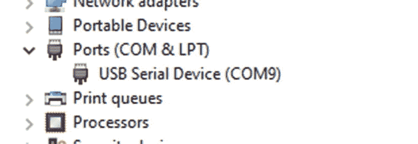

图 1-15

COM 端口设备

现在，您可以使用 PuTTY 来打开与您的板的串行通信。为此，当您打开 PuTTY 时，使用单选按钮将连接类型设置为 **Serial** 。在**串行线**框中输入端口(在本例中为 **COM9** ，将**速度**设置为 **115200** ，然后按**打开**。如图 [1-16](#Fig16) 所示。

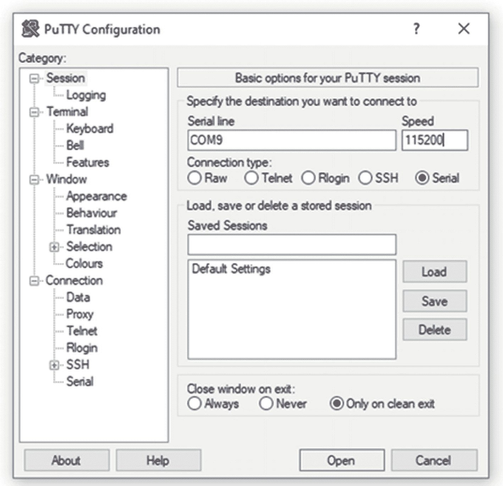

图 1-16

用 PuTTY 打开串行通信

PuTTY 允许您与微控制器交互，就像您从 Mu 中的串行终端与它交互一样。一旦在 PuTTY 和微控制器之间建立了串行连接，您将看到如图 [1-17](#Fig17) 所示的输出。PuTTY 还允许您访问 REPL。

图 1-17

PuTTY 中的成功连接

本节中概述的选项都是在 Mu 无法与您的主板建立串行连接时的替代选项。但是，如果您可以从 Mu 内部连接您的板，我建议您这样做，因为这是一种更方便的方法。

## 建立自己的董事会

Note

这一部分是为已经有使用微控制器经验的读者准备的，比如 Arduino 平台，但是如果你刚刚得到一个 Arduino Zero 并且想继续学习，那么你可以这样做！

开源的一个很好的特点是，你可以构建自己的设备副本，而不用担心任何后果。例如，CircuitPython 项目源于 MicroPython 项目，并拥有非常宽松的 MIT 许可证。这个许可意味着你可以用 CircuitPython 做任何你想做的事情，包括编译源代码和自己运行。也可以自己搭建硬件开发板，用 CircuitPython 编程。

虽然不建议刚接触微控制器的人创建定制板，但这一选项为经验丰富的用户提供了许多好处。建立自己的董事会给你很大的灵活性，尤其是如果你想开发自己的商业产品。制作自己的设备也比购买预制电路板便宜得多。例如，如果你正在设计一个成品，你不会将整个 Arduino Zero 或 Metro M0 板放入设备中。相反，你会有一个围绕标准微控制器设计的印刷电路板(PCB)。

如果您希望设置自己的 CircuitPython 板，最好选择 Microchip Technology 的 SAMD21G18A 微控制器。这个微控制器得到了 CircuitPython 的良好支持，也是最容易上手的。有两种方法可以将 CircuitPython 加载到您自己的板上。第一种是使用 Arduino IDE，第二种是使用 Atmel Studio。我将把重点放在 Arduino IDE 方法上，因为它更简单，更容易设置。此外，Atmel Studio 只能在 Windows 设备上运行，因此 Arduino IDE 方法可能是在 macOS 或 Linux 机器上工作的唯一方法。

你需要做的第一件事是从 Arduino IDE 中加载 Arduino Zero bootloader。最好使用 Atmel-ICE 编程器来完成这项工作。一旦你将你的 ISP 连接到你的目标，打开 Arduino IDE，进入**工具** ➤ **编程器**，选择 **Atmel-ICE** ，如图 [1-18](#Fig18) 所示。确保您有一个 LED 连接到引脚 PA17，并且设置了复位电路。

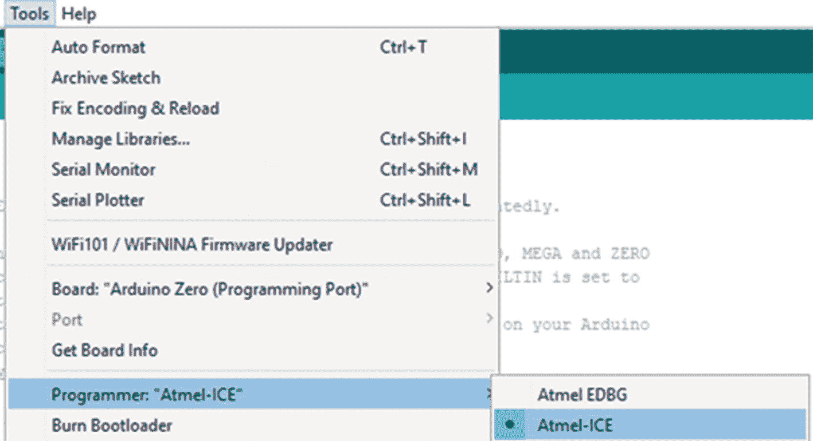

图 1-18

在 Arduino IDE 中选择程序员

选择好编程器后，将**板**设置到 **Arduino Zero(编程端口)**，如图 [1-19](#Fig19) 。

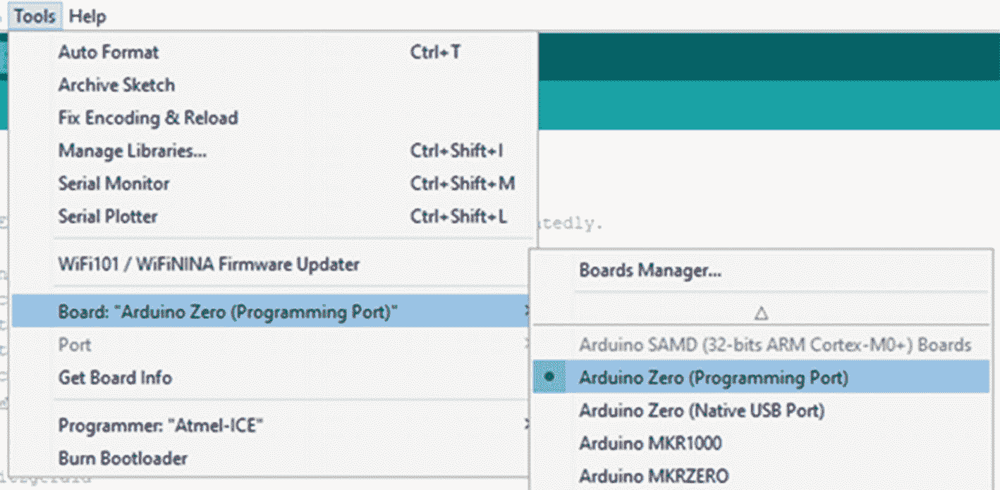

图 1-19

在 Arduino IDE 中选择电路板

然后选择**刻录引导程序**刻录引导程序，如图 [1-20](#Fig20) 所示。

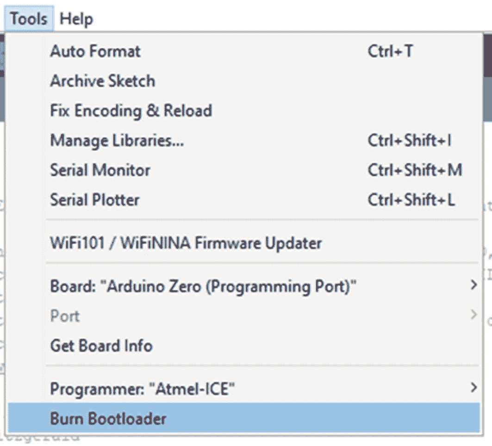

图 1-20

在 Arduino IDE 中刻录引导程序

烧完引导程序后，通过选择**文件** ➤ **示例** ➤ **基础知识** ➤ **闪现**来运行一个示例草图。确保连接到 PA17 的 LED 在闪烁。

下一步是加载 USB 闪存格式(UF2)引导程序。这个引导程序允许微控制器显示为大容量存储设备，因此您可以在板上加载和运行 CircuitPython。

接下来，前往 CircuitPython 网站，在 [`https://circuitpython.org/board/arduino_zero/`](https://circuitpython.org/board/arduino_zero/) 抓取 Arduino Zero 的 UF2 文件。该页面应类似于图 [1-21](#Fig21) 中的页面。点击 **Download .UF2 Now** 按钮，记下你保存文件的位置。

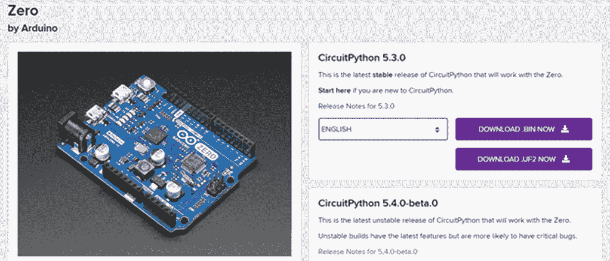

图 1-21

下载 CircuitPython UF2 文件

一旦你下载了这个文件，去 [`https://github.com/adafruit/uf2-samdx1/releases`](https://github.com/adafruit/uf2-samdx1/releases) 下载最新版本的草图来更新 Zero 的引导程序。你会看到类似图 [1-22](#Fig22) 的东西。该文件的名称应该类似于*update-boot loader-zero-v3-10-0 . ino*，尽管版本号可能不同。

图 1-22

下载 Arduino 草图

打开草图并运行它。完成后，将 USB 电缆连接到您的微控制器。引脚 34 为 D+，引脚 33 为 D-。确保同时连接设备上的接地连接。微控制器现在应该在您的计算机上显示为可移动存储设备，内容如图 [1-23](#Fig23) 所示。

图 1-23

UF2 引导成功后的 CircuitPython 设备

将我们之前从 CircuitPython 网站下载的 UF2 文件复制到设备上。复制完成后，设备将显示为 CircuitPython 设备，如图 [1-24](#Fig24) 所示。

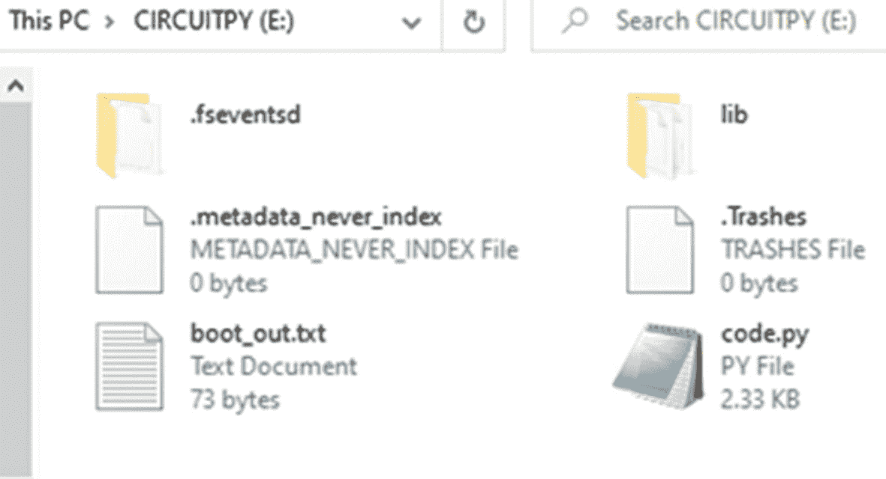

图 1-24

CircuitPython 在设备上运行时应该存在的文件

您的设备现在可以运行 CircuitPython 了。在撰写本文时，Mu 编辑器无法识别以这种方式安装了 CircuitPython 的设备，因此您需要使用 PuTTY 在 Windows 或终端上查看设备的输出，如果您使用的是 macOS 设备，则需要使用 CoolTerm。

作为参考，图 [1-25](#Fig25) 显示了基于 Arduino Zero 的器件的引脚排列，相当于我们刚刚设置的定制 SAMD21G18A 器件。如果你使用的是定制设备，你需要参考这张图片。它显示了所有的数字引脚、模拟引脚、通信和编程接口。

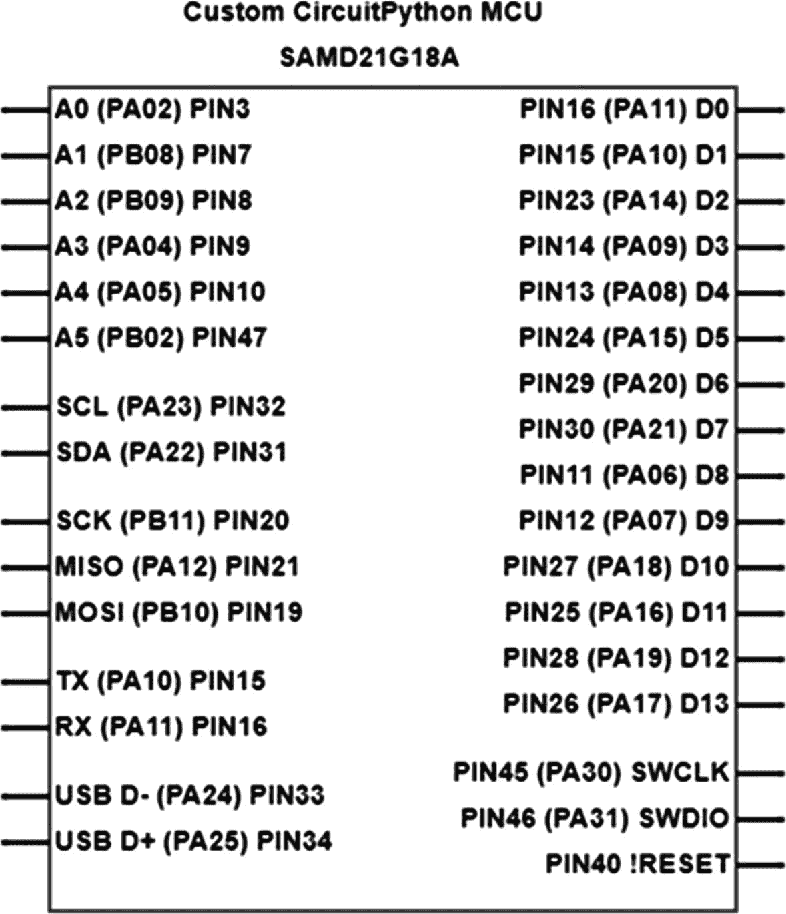

图 1-25

基于 Arduino Zero 的定制设备的引脚排列

## 结论

在这一章中，我们讲述了微控制器的基础知识，并了解了我们需要什么来设置我们的开发环境。一旦你完成了本章中的步骤，你的环境应该已经准备好用 Python 编程你的微控制器了。然而，对电子学有一个基本的了解将帮助你更有效地使用微控制器来构建你自己的设备。我们将在下一章讨论这个话题。