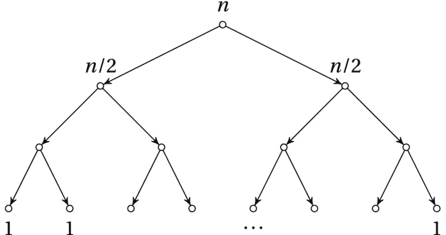
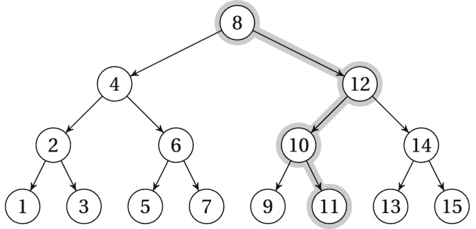
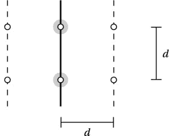
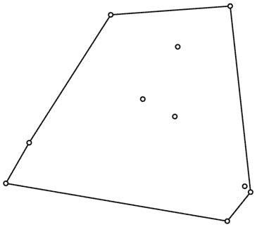
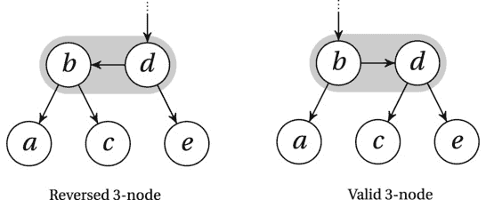
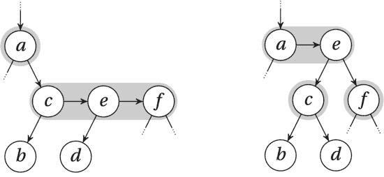

第六章


分裂、结合和征服

*分而治之，一个健全的座右铭；
团结带领，更好的自己。*

——约翰·沃尔夫冈·冯·歌德，*诗*

这一章是三章中的第一章，讲述众所周知的设计策略。本章讨论的策略，*分而治之*(或简称为 D & C)，是基于以一种提高性能的方式分解你的问题。您划分问题实例，递归地解决子问题，组合结果，从而征服问题——这种模式反映在章节标题中。[T5 1T7】](#Fn1)

树形问题:关于平衡的一切

我之前提到过子问题图的概念:我们将子问题视为节点，将依赖关系(或归约)视为边。这种子问题图的最简单结构是一棵树。每个子问题可能依赖于一个或多个其他问题，但是我们可以独立地解决这些其他子问题。(当我们去除这种独立性时，我们最终会遇到第八章中提到的那种重叠和纠缠。)这种直接的结构意味着，只要我们能找到适当的约简，就可以直接实现我们算法的递归公式。

你已经有了理解分治算法所需的所有拼图。我已经讨论过的三个想法涵盖了要点:

*   分治循环，在第 3 章
*   强感应，在第四章
*   递归遍历，在第 5 章

递归告诉您一些关于所涉及的性能的信息，归纳为您提供了理解算法如何工作的工具，递归遍历(树中的 DFS)是算法的原始框架。

直接实现归纳步骤的递归公式并不新鲜。例如，在第 4 章中，我向你展示了一些简单的排序算法是如何实现的。在分而治之的设计方法中，一个重要的增加是*平衡*。这就是强归纳的用武之地:我们不想递归地实现从 *n* -1 到 *n* 的步骤，而是想从 *n* /2 到 *n* 。也就是说，我们采用大小为 *n* /2 的解决方案，并构建大小为 *n* 的解决方案。不是(归纳地)假设我们可以解决尺寸为 *n* -1 的子问题，而是假设我们可以处理尺寸小于 *n* 的所有子问题。

你会问，这和平衡有什么关系？想想弱诱导的例子。我们基本上将问题分成两部分:一部分大小为 *n* -1，另一部分大小为 1。假设归纳步骤的成本是线性的(这种情况很常见)。那么这就给了我们递归*T*(*n*)=*T*(*n*-1)+*T*(1)+*n*。这两个递归调用非常不平衡，我们基本上以握手循环结束，结果运行时间是二次的。如果我们设法在两个递归调用中更均匀地分配工作会怎么样？也就是说，我们能把问题简化成两个大小相似的子问题吗？在这种情况下，递归变为*T*(*n*)= 2*T*(*n*/2)+*n*。这也应该很熟悉:这是典型的分治递归，它产生一个对数线性(θ(*n*LG*n*))运行时间——一个*巨大的*改进。

图 6-1 和 [6-2](#Fig2) 以递归树的形式展示了这两种方法的区别。注意，节点的数量是相同的——主要的影响来自于*工作*在这些节点上的分布。这看起来像是魔术师的把戏；工作去哪了？重要的认识是，对于简单的非平衡逐步方法([图 6-1](#Fig1) ，许多节点被分配了高工作负荷，而对于平衡的分治方法([图 6-2](#Fig2) )，大多数节点只有很少的*工作要做。例如，在非平衡递归中，总会有大约四分之一的调用的成本至少为 *n* /2，而在平衡递归中，无论 n* 的值是多少，都只有三个*。这是一个非常显著的差异。*


[图 6-1](#_Fig1) 。非平衡分解，具有线性除法/组合成本和二次运行时间总计



[图 6-2](#_Fig2) 。分而治之:一种平衡的分解，具有线性的划分/组合成本和总的对数线性运行时间

让我们试着在实际问题中认识这种模式。*天际线问题* [<sup>2</sup>](#Fn2) 就是一个相当简单的例子。给你一个三元组的排序序列( *L* ， *H* ， *R* )，其中 *L* 是建筑物的左侧*x*-坐标， *H* 是其高度， *R* 是其右侧*x*-坐标。换句话说，从一个给定的有利位置看，每一个三元组代表一个建筑的(矩形)轮廓。你的任务是从这些单独的建筑轮廓构建一个天际线。

图 6-3 和 [6-4](#Fig4) 说明了这个问题。在[图 6-4](#Fig4) 中，一座建筑正被添加到现有的天际线上。如果天际线被存储为指示水平线段的三元组列表，则可以通过以下方式在线性时间内添加新建筑物:( 1)在天际线序列中寻找建筑物的左侧坐标,( 2)提升所有低于该建筑物的坐标，直到(3)找到建筑物的右侧坐标。如果新建筑的左右坐标在一些水平线段的中间，那么它们需要被一分为二。为简单起见，我们可以假设从覆盖整个天际线的零高度线段开始。


[图 6-3](#_Fig3) 。一组建筑轮廓和由此产生的天际线


[图 6-4](#_Fig4) 。将建筑物(虚线)添加到天际线(实线)

这种合并的细节在这里并不那么重要。重点是我们可以在线性时间内给天际线增加一个建筑。使用简单(弱)归纳，我们现在有了我们的算法:我们从一个单一的建筑开始，并不断增加新的建筑，直到我们完成。当然，这个算法的运行时间是二次的。为了改善这一点，我们想改用强诱导——分而治之。我们可以通过注意到合并两个天际线并不比合并一个建筑和一个天际线更困难来做到这一点:我们只是以“锁步”的方式遍历两个天际线，只要一个比另一个值高，我们就使用最大值，在需要的地方分割水平线段。利用这种洞察力，我们有了第二个改进的算法:为所有建筑创建天际线，首先(递归地)基于一半的建筑创建*两条*天际线，然后将它们合并。这个算法，我相信你可以看到，有一个对数线性运行时间。练习 6-1 要求你实际实现这个算法。

标准 D&C 算法

上一节提到的递归 skyline 算法举例说明了分治算法的典型工作方式。输入是一组(也许是一个序列)元素；在至多线性时间内，将元素划分成大小大致相等的两组，在每一半上递归运行算法，并且也在至多线性时间内组合结果。当然可以修改这种标准形式(在下一节中您将看到一个重要的变化)，但是这种模式包含了核心思想。

[清单 6-1](#list1) 勾画了一个通用的分治功能。您可能会为每个算法实现一个定制版本，而不是使用这样的通用函数，但是它确实说明了这些算法是如何工作的。我在这里假设在基本情况下简单地返回`S`是可以的；当然，这取决于`combine`函数如何工作。 [<sup>3</sup>](#Fn3)

[***清单 6-1***](#_list1) 。分治方案的一般实现

```py
def divide_and_conquer(S, divide, combine):
    if len(S) == 1: return S
    L, R = divide(S)
    A = divide_and_conquer(L, divide, combine)
    B = divide_and_conquer(R, divide, combine)
    return combine(A, B)
```

[图 6-5](#Fig5) 是同一模式的另一个例子。图的上半部分表示递归调用，而下半部分表示返回值的组合方式。一些算法(如快速排序，在本章后面描述)在*的上半部分*完成大部分工作(除法)，而一些算法在*的下半部分*(组合)更加活跃。关注组合的算法中最著名的例子可能是合并排序(在本章的后面会有描述)，它也是分治算法的一个典型例子。


[图 6-5](#_Fig5) 。分治算法中的划分、递归和组合

对半搜索

在研究更多符合通用模式的例子之前，让我们看一个与*相关的*模式，它丢弃了一个递归调用。你已经在我之前提到的二分搜索法(二分法)中看到了这一点:它将问题分成相等的两半，然后只在这两半的*一个*上重现。这里的核心原则还是平衡。考虑一下在完全不平衡的搜索中会发生什么。如果你还记得《T4》第三章中的“想一个粒子”游戏，不平衡解就相当于问“这*是你的粒子吗？”对于宇宙中的每一个粒子。不同之处仍然包含在图 6-1[和图 6-2](#Fig1)[中，只是每个节点中的工作(对于这个问题)是不变的，我们实际上只是沿着从根到叶的路径执行工作。](#Fig2)*

二分搜索法似乎并不那么有趣。当然，这很有效率，但是搜索一个有序的序列...这难道不是一个有限的应用领域吗？嗯，不，不是真的。首先，该操作本身作为其他算法的一个组成部分可能很重要。其次，也许同样重要的是，二分搜索法可以成为寻找事物的一种更普遍的方法。例如，这种想法可以用于数值优化，如牛顿法，或在调试你的代码。尽管手动进行“二分法调试”可能足够有效(“代码在到达这个`print`语句之前崩溃了吗？”)，在一些修订控制系统(RCS)中也有使用，比如 Mercurial 和 Git。

它是这样工作的:你使用一个 RCS 来跟踪你代码中的变化。它存储了许多不同的版本，可以说你可以“回到过去”，随时检查旧代码。现在，假设你遇到了一个新的 bug，你很想找到它，这是可以理解的。你的 RCS 能帮上什么忙？首先，您为您的测试套件编写一个测试——如果有 bug，它会检测出来。(调试时，这总是一个很好的第一步。)您确保设置了测试，以便 RCS 可以访问它。然后，您要求 RCS 在您的历史记录中查找错误出现的位置。它是怎么做到的？大惊喜:二分搜索法。假设您知道该错误出现在修订版 349 和 574 之间。RCS 将首先将您的代码恢复到修订版 461(在两者之间)并运行您的测试。窃听器在吗？如果是这样，你知道它出现在 349 年到 461 年之间。如果不是，出现在 462 年到 574 年之间。起泡，冲洗，重复。

这不仅仅是二分法用途的一个简单例子；它还很好地说明了其他几点。首先，它表明您不能总是使用已知算法的常规实现，即使您并没有真正修改它们。在这种情况下，RCS 背后的实现者很可能必须自己实现二分搜索法。其次，这是一个很好的例子，说明减少基本操作的数量可能是至关重要的——比高效地实现事情更重要。编译您的代码和运行测试套件无论如何都很慢，所以您希望尽可能少地这样做。

黑盒:平分

二分搜索法可以应用在许多设置中，但是在标准库中的`bisect`模块中有直接的“在排序序列中搜索值”版本。它包含了`bisect`函数，该函数按预期工作:

`>>> from bisect import bisect`
`>>> a = [0, 2, 3, 5, 6, 8, 8, 9]`
`>>> bisect(a, 5)`

嗯，这有点像你所期待的...它不会返回已经存在的 5 的位置。相反，它报告插入新的 5 的位置，确保它被放置在具有相同值的所有现有项目的*之后。事实上，`bisect`是`bisect_right`的别称，还有一个`bisect_left`:*

`>>> from bisect import bisect_left`
`>>> bisect_left(a, 5)`
T2】

为了提高速度，`bisect`模块是用 C 实现的，但在早期版本(Python 2.4 之前)中，它实际上是一个普通的 Python 模块，而`bisect_right`的代码如下(加上我的注释):

`def bisect_right(a, x, lo=0, hi=None):`
`if hi is None:                              # Searching to the end`
`hi = len(a)`
`while lo < hi:                              # More than one possibility`
`mid = (lo+hi)//2                        # Bisect (find midpoint)`
`if x < a[mid]: hi = mid                 # Value < middle? Go left`
`else: lo = mid+1                        # Otherwise: go right`
`return lo`

如您所见，实现是迭代的，但它完全等同于递归版本。

在这个模块中还有另外一对有用的函数:`insort`(T1 的别名)和`insort_left`。这些函数找到正确的位置，就像它们的`bisect`对应函数一样，然后实际插入元素。虽然插入仍然是线性操作，但至少搜索是对数的(并且实际的插入代码实现得相当高效)。

遗憾的是，`bisect`库的各种函数不支持`key`参数，例如在`list.sort`中使用的参数。您可以使用所谓的装饰、排序、取消装饰(或者，在本例中，装饰、搜索、取消装饰)模式，或者简称为 DSU，来实现类似的功能:

`>>> seq = "I aim to misbehave".split()`
`>>> dec = sorted((len(x), x) for x in seq)`
`>>> keys = [k for (k, v) in dec]`
`>>> vals = [v for (k, v) in dec]`
`>>> vals[bisect_left(keys, 3)]`

或者，你可以做得更简洁:

`>>> seq = "I aim to misbehave".split()`
`>>> dec = sorted((len(x), x) for x in seq)`
`>>> dec[bisect_left(dec, (3, ""))][1]`

如您所见，这涉及到创建一个新的修饰列表，这是一个线性操作。显然，如果我们在每次搜索之前都这样做，那么使用`bisect`就没有意义了。但是，如果我们可以在搜索之间保留修饰列表，那么这个模式可能会有用。如果序列一开始就没有排序，我们可以像前面的例子一样，将 DSU 作为排序的一部分。

遍历搜索树...带修剪

二分搜索法是最棒的。这是最简单的算法之一，但它真的很强大。不过，有一个问题:要使用它，必须对值进行排序。现在，如果我们能把它们保存在一个链表中，那就不成问题了。对于我们想要插入的任何对象，我们只需用二分法(对数)找到位置，然后插入它(常数)。问题是——那行不通。二分搜索法需要能够在常数时间内检查中间值，这是我们用链表做不到的。当然，使用数组(比如 Python 的列表)也无济于事。这有助于分割，但会破坏插入。

如果我们想要一个对搜索有效的可修改的结构，我们需要某种中间地带。我们需要一个类似于链表的结构(这样我们就可以在常量时间内插入元素),但仍然允许我们执行二分搜索法。根据这一节的标题，你可能已经想通了整件事，但是请耐心听我说。我们在搜索时首先需要的是在常量时间内访问中间项。所以，假设我们保持一个直接的链接。从那里，我们可以向左或向右，我们需要访问左半部分或右半部分的中间元素。因此...我们可以只保留从第一项到这两项的直接链接，一个“左”引用和一个“右”引用。

换句话说，我们可以将二分搜索法的结构表示为一个显式的树形结构！这样的树很容易修改，我们可以在对数时间内从根到叶遍历它。因此，搜索实际上是我们的老朋友遍历——但是有修剪。我们不想遍历整个树(导致所谓的线性扫描)。除非我们是从有序的值序列中构建树，否则“左半部分的中间元素”这一术语可能并不那么有用。相反，我们可以考虑我们需要什么来实现我们的修剪。当我们查看根时，我们需要能够修剪其中一个子树。(如果我们在一个内部节点中找到了我们想要的值，并且该树不包含重复的值，我们当然不会继续在*或者*子树中继续。)

我们需要的*一样东西*就是所谓的搜索树属性:对于一个根在 *r* 的子树，左边*子树中的所有值都是*小于*(或等于)r* 的值，而右边*子树中的值都是*大于*。换句话说，子树根处的值*将子树*一分为二。具有该属性的示例树如图 6-6 所示，其中节点标签表示我们正在搜索的值。像这样的树结构在实现集合*时会很有用；也就是说，我们可以检查给定的值是否存在。然而，为了实现一个*映射*，每个节点都将包含一个我们所寻找的键和一个我们想要的值。



[图 6-6](#_Fig6) 。一个(完美平衡的)二叉查找树，突出显示了 11 的搜索路径

通常，你不会批量构建一个树(尽管有时这很有用)；使用树的主要动机是它们是动态的，您可以一个接一个地添加节点。要添加一个节点，你需要搜索它应该在哪里，然后在那里添加一个新的叶子。例如，[图 6-6](#Fig6) 中的树可能是通过最初添加 8，然后添加 12、14、4 和 6 而构建的。不同的排序可能会得到不同的树。

清单 6-2 给出了一个二叉查找树的简单实现，以及一个包装器，让它看起来有点像字典。你可以这样使用它，例如:

```py
>>> tree = Tree()
>>> tree["a"] = 42
>>> tree["a"]
42
>>>  "b" in tree
False
```

如您所见，我已经将插入和搜索实现为独立的函数，而不是方法。这样它们也可以在`None`节点上工作。(当然不一定要那样做。)

[***清单 6-2***](#_list2) 。插入并在二叉查找树中搜索

```py
class Node:
    lft = None
    rgt = None
    def __init__(self, key, val):
        self.key = key
        self.val = val

def insert(node, key, val):
    if node is None: return Node(key, val)      # Empty leaf: add node here
    if node.key == key: node.val = val          # Found key: replace val
    elif key < node.key:                        # Less than the key?
        node.lft = insert(node.lft, key, val)   # Go left
    else:                                       # Otherwise...
        node.rgt = insert(node.rgt, key, val)   # Go right
    return node

def search(node, key):
    if node is None: raise KeyError             # Empty leaf: it's not here
    if node.key == key: return node.val         # Found key: return val
    elif key < node.key:                        # Less than the key?
        return search(node.lft, key)            # Go left
    else:                                       # Otherwise...
        return search(node.rgt, key)            # Go right

class Tree:                                     # Simple wrapper
    root = None
    def __setitem__(self, key, val):
        self.root = insert(self.root, key, val)
    def __getitem__(self, key):
        return search(self.root, key)
    def __contains__(self, key):
        try: search(self.root, key)
        except KeyError: return False
        return True
```

 **注意**清单 6-2 中[的实现不允许树包含重复的键。如果使用现有键插入新值，旧值将被覆盖。这很容易改变，因为树结构本身并不排除重复。](#list2)

排序数组、树和字典:选择、选择

二分法(在排序数组上)、二分搜索法树和 dicts(也就是散列表)都实现了相同的基本功能:它们让您可以高效地搜索。尽管如此，还是有一些重要的区别。二分法速度很快，开销很小，但是只适用于排序数组(比如 Python 列表)。并且排序后的数组很难维护；添加元素需要线性时间。搜索树的开销更大，但它是动态的，允许您插入和删除元素。然而，在许多情况下，散列表以`dict`的形式成为了明显的赢家。它的平均渐近运行时间是常数(与二分法和搜索树的对数运行时间相反)，与实际接近，开销很小。

散列要求你能够为你的对象计算一个散列值。在实践中，你几乎总是可以这样做，但在理论上，二分法和搜索树在这里更灵活一些——它们只需要比较对象，并找出哪个更小。 [<sup>4</sup>](#Fn4) 这种对排序的关注也意味着搜索树将允许你以排序的顺序访问你的值——要么全部，要么只是一部分。树也可以扩展到多维工作(搜索超矩形区域内的点)，或者扩展到更奇怪的搜索标准形式，其中散列可能很难实现。还有更常见的情况，散列法不能立即适用。例如，如果您想要最接近您的查找关键字的条目，那么搜索树将是一个不错的选择。

选择

我将用一个你在实践中可能不会经常用到的算法来结束这一节的“对半搜索”,但这将二分法的思想引向了一个有趣的方向。此外，它为快速排序(下一节)设置了阶段，这是经典之一。

问题是在*线性时间*中，找到无序序列中的第 *k* 个最大数。最重要的情况可能是找到中间值——如果序列被排序，那么*将会是位于中间位置的*(即`(n+1)//2`)的元素。有趣的是，作为该算法如何工作的副作用，它还允许我们识别哪些对象比我们寻找的对象小。这意味着我们将能够找到运行时间为θ(*n*)的最小的 *k* (同时也是最大的 *n* - *k* )元素，这意味着 *k* 的值无关紧要！

这可能比乍看起来更奇怪。运行时间限制排除了排序(除非我们可以计数出现次数并使用计数排序，如第 4 章中所讨论的[)。任何其他*明显的*算法寻找 *k* 最小的对象将使用一些数据结构来跟踪它们。例如，您可以使用一种类似于插入排序的方法:在序列的开头或者在一个单独的序列中保留到目前为止找到的最小的对象。](04.html)

如果你跟踪其中哪个最大，检查主序列中的每个*大的*对象会很快(只是一个常量时间检查)。但是，如果你需要添加一个对象，并且你已经有了 *k* ，你就必须删除一个。当然，你会去掉最大的，但是你必须找出哪一个现在是最大的。你可以对它们进行排序(也就是说，接近插入排序)，但是运行时间无论如何都是θ(*NK*)。

从这个(渐进地)上一步将是使用一个*堆*，本质上将我们的“部分插入排序”转换为“部分堆排序”，确保堆中的元素永远不会超过 *k 个*。(有关更多信息，请参见关于二进制堆的“黑盒”侧栏、`heapq`和 heapsort。)这会给你一个运行时间θ(*n*LG*k*)，对于一个相当小的 *k* ，这几乎与θ(*n*)相同，并且它让你迭代主序列而不用在内存中跳跃，所以实际上它可能是选择的解决方案。

 **提示**如果你在 Python 中寻找 iterable 中的 *k* 最小(或最大)的对象，如果你的 *k* 相对于对象总数来说很小，你可能会使用`heapq`模块中的`nsmallest`(或`nlargest`)函数。如果 *k* 很大，你应该对序列进行排序(或者使用`sort`方法或者使用`sorted`函数)并挑选出第 *k* 个对象。对您的结果进行计时，看看什么效果最好——或者只选择能让您的代码尽可能清晰的版本。

那么，我们如何才能采取下一步，渐进地，完全消除对 k 的依赖呢？事实证明，保证线性最坏情况有点棘手，所以让我们把重点放在平均情况上。现在，如果我告诉你尝试应用分而治之的想法，你会怎么做？第一个线索可能是我们的目标是一个线性运行时间；什么样的“除以二”循环会这样做？就是单次递归调用的那种(相当于淘汰赛总和):*T*(*n*)=*T*(*n*/2)+*n*。换句话说，我们通过执行线性工作将问题分成两半(或者，现在，平均分成两半)，就像更规范的分治法一样，但我们设法消除了一半，使我们更接近二分搜索法。为了设计这个算法，我们需要弄清楚的是，如何在线性时间内划分数据，以便我们最终将所有对象分成两半。

和往常一样，系统地浏览我们所掌握的工具，并尽可能清晰地描述问题，会让我们更容易找到解决方案。我们已经到达了这样一个点，我们需要将一个序列分成两半，一个由小的*值*组成，另一个由大的*值*组成。我们不需要保证这一半是相等的——只需要保证它们平均起来是相等的。一个简单的方法是选择其中一个值作为所谓的*枢轴*，并用它来划分其他值:所有比枢轴小的*都在左半部分结束，而那些比枢轴*大的*在右半部分结束。[清单 6-3](#list3) 给出了分区和选择的一种可能实现。注意，这个版本的分区主要是可读的；练习 6-11 让你看看你是否能去掉一些开销。这里写道 select，它返回第 *k* 个最小的元素；如果您想拥有所有的 *k* 最小元素，您可以简单地重写它以返回`lo`而不是`pi`。*

[***清单 6-3***](#_list3) 。分区和选择的简单实现

```py
def partition(seq):
    pi, seq = seq[0], seq[1:]                   # Pick and remove the pivot
    lo = [x for x in seq if x <= pi]            # All the small elements
    hi = [x for x in seq if x > pi]             # All the large ones
    return lo, pi, hi                           # pi is "in the right place"

def select(seq, k):
    lo, pi, hi = partition(seq)                 # [<= pi], pi, [>pi]
    m = len(lo)
    if m == k: return pi                        # We found the kth smallest
    elif m < k:                                 # Too far to the left
        return select(hi, k-m-1)                # Remember to adjust k
    else:                                       # Too far to the right
        return select(lo, k)                    # Just use original k here
```

线性时间选择，保证！

本节实现的选择算法被称为*随机选择*(尽管随机版本通常比这里更随机地选择枢轴；参见练习 6-13)。它允许您在线性的*预期的*时间内进行选择(例如，找到中间值)，但是如果在每一步中枢选择都很糟糕，那么您最终会遇到握手循环(线性工作，但是大小只减少 1)，从而导致二次运行时间。虽然这种极端的结果在实践中不太可能发生(尽管，再次参见练习 6-13)，但你*事实上也可以*在最坏的情况下避免它。

事实证明，保证支点在序列中只占很小的百分比(也就是说，不在任何一端，或者距离它恒定的步数)就足以保证运行时间是线性的。1973 年，一群算法专家(Blum、Floyd、Pratt、Rivest 和 Tarjan)提出了一个版本的算法，给出了这种保证。

算法有点复杂，但核心思想足够简单:首先将序列分成五个一组，或者其他一些小常数。例如，使用简单的排序算法，找出每个中值。到目前为止，我们只使用了线性时间。现在，递归地使用线性选择算法，在这些中间值中找到中间值*。这是可行的，因为中间值的数量小于原始序列的大小——这仍然有点令人费解。得到的值是一个保证足够好以避免退化递归的枢轴—在您的选择中使用它作为枢轴。*

换句话说，该算法以两种方式递归使用:第一，在中间值序列上，找到一个好的枢轴，第二，在原始序列上，使用这个枢轴。

由于理论上的原因，了解这种算法是很重要的，因为它意味着选择可以在有保证的线性时间内完成，但你可能永远不会在实践中使用它。

对半排序

最后，我们到达了与分治策略最相关的主题:排序。我不打算深入研究这个问题，因为 Python 已经有了有史以来最好的排序算法之一(参见本节后面关于 timsort 的“黑盒”侧栏)，并且它的实现非常高效。事实上，`list.sort`是如此的高效，你可能会认为它是替代其他渐近线稍微好一点的算法的第一选择(例如，对于选择)。尽管如此，本节中的排序算法是最著名的算法之一，所以您应该了解它们是如何工作的。此外，它们是分而治之用于设计算法的一个很好的例子。

我们先来考虑算法设计的名人之一:C. A. R. Hoare 的*快速排序*。它与上一节的选择算法密切相关，这也是由于 Hoare(有时也被称为*快速选择*)。扩展很简单:如果 quickselect 表示带有修剪的遍历——在递归树中找到一条向下到第 *k* 个最小元素的路径——那么 quicksort 表示完全遍历，这意味着每 k 找到一个*的解决方案。哪个是最小的元素？第二小？诸如此类。通过将它们都放入它们的位置，序列被排序。[清单 6-4](#list4) 显示了快速排序的一个版本。*

[***清单 6-4***](#_list4) 。快速排序

```py
def quicksort(seq):
    if len(seq) <= 1: return seq                # Base case
    lo, pi, hi = partition(seq)                 # pi is in its place
    return quicksort(lo) + [pi] + quicksort(hi) # Sort lo and hi separately
```

正如你所看到的，算法很简单，只要你有分区。(练习 6-11 和 6-12 要求你重写快速排序和分区，以产生一个就地排序算法。)首先，它将序列分成我们知道必须在`pi`左边的序列和必须在右边的序列。然后这两半被递归排序(通过归纳假设是正确的)。将两部分连接起来，枢轴在中间，保证会产生一个排序的序列。因为我们不能保证分区会适当地平衡递归，我们只知道快速排序在平均 T2 的情况下是对数线性的——在最坏的情况下是二次的。 [<sup>6</sup>](#Fn6)

Quicksort 是分而治之算法的一个例子，它在递归调用的之前的*做它的主要工作，在*中分割*它的数据(使用分区)。组合部分比较琐碎。不过，我们可以反过来做:简单地将我们的数据一分为二，保证一个平衡的递归(和一个不错的最坏情况运行时间)，然后努力合并，或者说*合并*结果。这正是*合并排序*所做的。就像我们从本章开始的天际线算法从插入单个建筑到合并两个天际线，合并排序从在排序序列中插入单个元素(插入排序)到合并两个排序序列。*

你已经在[第 3 章](03.html) ( [清单 3-2](#list2) )中看到了合并排序的代码，但是我在这里再重复一遍，加上一些注释([清单 6-5](#list5) )。

[***清单 6-5***](#_list5) 。合并排序

```py
def mergesort(seq):
    mid = len(seq)//2                           # Midpoint for division
    lft, rgt = seq[:mid], seq[mid:]
    if len(lft) > 1: lft = mergesort(lft)       # Sort by halves
    if len(rgt) > 1: rgt = mergesort(rgt)
    res = []
    while lft and rgt:                          # Neither half is empty
        if lft[-1] >=rgt[-1]:                   # lft has greatest last value
            res.append(lft.pop())               # Append it
        else:                                   # rgt has greatest last value
            res.append(rgt.pop())               # Append it
    res.reverse()                               # Result is backward
    return (lft or rgt) + res                   # Also add the remainder
```

理解这是如何工作的现在应该比在第三章中更容易一点。注意，编写合并部分是为了说明这里发生了什么。如果您在 Python 中实际使用合并排序(或类似的算法)，您可能会使用`heapq.merge`来进行合并。

黑盒:TIMSORT

隐藏在`list.sort`中的算法是由 Tim Peters 发明(并实现)的，他是 Python 社区中的知名人士之一。 [<sup>7</sup>](#Fn7) 该算法被恰当地命名为 *timsort* ，取代了早期的算法，该算法进行了大量调整以处理特殊情况，如升序和降序值段等。在 timsort 中，这些情况由通用机制处理，因此性能仍然存在(在某些情况下，性能有了很大提高)，但算法更干净、更简单。算法还是有点太复杂，这里就不详细解释了；我会试着给你一个快速的概述。更多详情，请看出处。 [<sup>8</sup>](#Fn8)

Timsort 是归并排序的近亲。这是一个*就地*算法，因为它合并段并将结果留在原始数组中(尽管在合并期间它使用了一些辅助内存)。然而，它不是简单地将数组对半排序，然后合并它们，而是从头开始，寻找已经排序的段*(可能相反)，称为*运行*。在随机数组中，不会有很多，但在许多种真实数据中，可能会有很多——这使算法明显优于普通合并排序和最好情况下的*线性*运行时间(这涵盖了除了简单获得已经排序的序列之外的许多情况)。*

 *当 timsort 遍历序列，识别游程并将它们的边界推送到堆栈上时，它使用一些启发式方法来决定何时合并哪些游程。这种想法是为了避免合并不平衡，这种不平衡会给你一个二次运行时间，同时仍然利用数据中的结构(即运行)。首先，任何真正短的游程都被人为地扩展和排序(使用稳定的插入排序)。第二，为栈上最顶端的三个游程维护以下不变量:`A`、`B`和`C`(其中`A`在顶端):`len(A) > len(B) + len(C)`和`len(B) > len(C)`。如果违反了第一个不变量，则将`A`和`C`中较小的一个与`B`合并，结果替换堆栈中合并的游程。第二个不变量可能仍然不成立，并且合并继续，直到两个不变量都成立。

该算法还使用了一些其他技巧，以获得尽可能快的速度。如果你感兴趣的话，我建议你查看一下来源。如果你不想读 C 代码，你也可以看看 timsort 的纯 Python 版本，它是 PyPy 项目的一部分。 [<sup>10</sup>](#Fn10) 他们的实现有极好的注释，写得很清楚。(PyPy 项目在[附录 A](12.html) 中讨论。)

我们排序能有多快？

关于排序的一个重要结果是，合并排序等分治算法是*最优*；对于任意值(我们可以计算出哪个更大)，在最坏的情况下，不可能比ω(*n*LG*n*)做得更好。一个重要的例子是当我们对任意实数进行排序时。 [<sup>11</sup>](#Fn11)

 **注**计数排序及其亲属(在[第四章](04.html)中讨论)似乎打破了这一规则。请注意，我们不能对任意值进行排序——我们需要能够计算出现的次数，这意味着对象必须是可散列的，并且我们需要能够在线性时间内对值范围进行迭代。

我们是怎么知道的？道理其实挺简单的。第一个观点:因为值是任意的，我们假设我们只能计算出其中一个是否大于另一个，所以每个对象的比较都可以归结为是/否的问题。第二个洞见: *n* 元素的排序数为 *n* ！我们要找的正是其中之一。那会给我们带来什么？我们又回到了“想象一个粒子”，或者，在这种情况下，“想象一个排列。”这意味着我们最多只能使用ω(LG*n*！)是/否问题(比较)，以获得正确的排列(即，对数字进行排序)。而且刚好 lg *n* ！渐近等价于 *n* lg *n* 。 [<sup>12</sup>](#Fn12) 换句话说，最坏情况下的运行时间是ω(LG*n*！)=ω(*n*LG*n*)。

你说，我们如何达到这种等价？最简单的方法就是只使用*斯特林近似* ，它表示 *n* ！就是θ(*n*T7*n*T10)。取对数，鲍勃就是你的叔叔。 [<sup>13</sup>](#Fn13) 现在，我们推导出*最坏*情况的界限；使用信息论(我不会在这里深入讨论)，事实上，有可能表明这个界限在平均情况下也成立。换句话说，在一个非常真实的意义上*，*除非我们对数据的取值范围或分布有实质性的了解，否则对数线性是我们能做的最好的事情。

还有三个例子

在用稍微高级(可选)的部分结束本章之前，这里有三个例子。前两个涉及计算几何(分治策略经常有用)，而最后一个是一个相对简单的数列问题(有一些有趣的变化)。我只是勾画了解决方案，因为重点主要是为了说明设计原则。

最接近对

问题:你在平面上有一组点，你想找到彼此最接近的两个点。第一个浮现在脑海中的想法可能是使用蛮力:对于每一个点，检查所有其他的点，或者至少是我们还没有看到的点。当然，根据握手和，这是一个二次算法。通过分而治之，我们可以得到对数线性。

这是一个相当有趣的问题，所以如果你喜欢解谜，在阅读我的解释之前，你可能想试着自己解决它。您应该使用分而治之(并且得到的算法是对数线性的)的事实是一个强烈的暗示，但是解决方案决不是显而易见的。

该算法的结构几乎直接遵循(类似合并排序的)对数线性分治模式:我们将把点分成两个子集，递归地找到每个子集中最近的一对，然后在线性时间内合并结果。借助归纳/递归(和分治模式)的力量，我们现在已经将问题简化为这种合并操作。但是在发挥我们的创造力之前，我们可以再剥离一点:合并的结果必须是(1)左边最近的一对，(2)右边最近的一对，或者(3)两边各有一个点组成的一对。换句话说，我们需要做的是找到“跨越”分割线的最接近的一对。在这样做的时候，我们也有一个涉及到的距离的上限(从左侧和右侧最接近的对的最小值)。

深入问题的本质后，让我们看看事情会变得多糟糕。让我们假设，目前，我们已经按照它们的 *y* 坐标对中间区域(宽度为 2 *d* )中的所有点进行了排序。然后我们想按顺序浏览它们，考虑其他点，看看我们是否能找到比 *d* (目前发现的最小距离)更近的点。对于每一点，我们必须考虑多少其他的“邻居”？

这就是解决方案的关键之处:在中线的任一侧，我们知道所有点至少相距 *d* 的距离。因为我们要寻找的是一对在*相距最*的距离，横跨中线，我们需要考虑的只是在任何时候高度 *d* (和宽度 2 *d* )的垂直切片。这个区域能容纳多少个点？

[图 6-7](#Fig7) 说明了这种情况。我们对左右之间的距离没有下限，所以在最坏的情况下，我们可能在中间线上有重合点(突出显示)。除此之外，很容易证明，在一个 *d* × *d* 正方形内最多可以容纳四个最小距离为 *d* 的点，我们在正方形的两边都有；参见练习 6-15。这意味着在这样的切片中，我们总共最多需要考虑八个点，这意味着我们当前的点最多需要与其下七个邻居进行比较。(其实考虑一下*五*下邻居就够了；参见练习 6-16。)



[图 6-7](#_Fig7) 。最坏的情况:在中间区域的垂直切片中有八个点。切片的大小为 d×2d，两个中间点(高亮显示)代表一对重合点

我们*快*完成了；唯一剩下的问题是按照 *x* -和*y*-坐标排序。我们需要 *x* 排序能够在每一步将问题分成两半，我们需要 *y* 排序在合并时进行线性遍历。我们可以保留两个数组，每个数组对应一个排序顺序。我们将在 *x* 数组上做递归除法，所以这很简单。对 *y* 的处理不是很直接，但仍然很简单:当用 *x* 划分数据集时，我们基于 *x* 坐标划分 *y* 数组。当组合数据时，我们*合并*它们，就像在合并排序中一样，从而在只使用线性时间的同时保持排序。

 **注意**为了让算法工作，我们从每个递归调用中返回*点的整个子集*，排序。必须在副本上过滤离中线太远的点。

你可以把这看作是加强归纳假设的一种方式(正如在第四章第一节中所讨论的),以获得期望的运行时间:我们不仅仅假设我们可以在更小的点集中找到最近的点，我们*还*假设我们可以把点重新排序*。*

 *凸包

这里还有另一个几何问题:想象一下把 n 个钉子钉在一块木板上，然后用橡皮筋捆住它们；橡皮筋的形状是钉子代表的点的所谓凸包。它是包含这些点的最小凸 [<sup>14</sup>](#Fn14) 区域，即在这些点的“最外层”之间有线的凸多边形。参见图 6-8 中的示例。



[图 6-8](#_Fig8) 。点集及其凸包

到目前为止，我肯定你在怀疑我们将如何解决这个问题:沿着 *x* 轴将点集分成相等的两半，并递归地求解它们。唯一剩下的部分是两个解的线性时间组合。[图 6-9](#Fig9) 提示我们需要什么:我们必须找到上下*公切线*。(它们是切线基本上意味着它们与前面和后面的线段形成的角度应该向内弯曲。)


[图 6-9](#_Fig9) 。通过寻找上下公切线来组合两个较小的凸包(虚线)

在不涉及实现细节的情况下，假设您可以检查一条线是否是任一半的上切线。(下半部分的工作方式类似。)然后你可以从*左*半的*最右边的*点和*右*半的*最左边的*点开始。只要您的点之间的线不是左边部分的上切线，您就沿着子壳逆时针移动到下一个点。然后你对右半边做同样的动作。您可能需要多次这样做。顶部固定后，对下部切线重复该过程。最后，删除切线之间的线段，就完成了。

多快能找到一个凸包？

各个击破的方案运行时间为 *O* ( *n* lg *n* )。寻找凸包的算法有很多，有些渐进地更快，运行时间低至 *O* ( *n* lg *h* )，其中 h 是凸包上的点数。最糟糕的情况当然是所有物体都落在船体上，我们又回到θ(*n*LG*n*)。事实上，在最坏的情况下，这可能是最好的时机——但是我们怎么知道呢？

我们可以使用第四章中的想法，通过*减少*来显示硬度。从本章前面的讨论中我们已经知道，在最坏的情况下，对实数进行排序是ω(*n*LG*n*)。这与您使用的算法无关；你简直不能做得更好。这不可能。

现在，观察排序可以简化为凸包问题。如果你想对 n 个实数进行排序，你只需将这些数作为坐标 *x* ，并添加坐标 *y* ，使它们位于一条平缓的曲线上。例如，你可以有 *y* = *x* <sup>2</sup> 。如果你为这个点集找到一个凸包，那么这些值将按照排序的顺序排列在凸包上，你可以通过遍历它的边来找到排序。这种减少本身只需要线性时间。

想象一下，你有一个比对数线性更好的凸包算法。通过使用线性归约，您随后会有一个比对数线性更好的*排序*算法。但那是不可能的！换句话说，因为存在从排序到寻找凸壳的简单(这里是线性)简化，所以后一个问题至少和前一个问题一样困难。因此...对数线性是我们能做的最好的。

最大切片

这里是最后一个例子:你有一个包含实数的序列`A`，你想找到一个片(或段)`A[i:j]`，以便`sum(A[i:j])`被最大化。你不能只选择整个序列，因为其中也可能有负数。 [<sup>15</sup>](#Fn15) 这个问题有时会出现在股票交易的情境中——序列中包含了股票价格的变化，你想找到能给你带来最大利润的区间。当然，这个演示有点缺陷，因为它要求你事先知道股票的所有运动。

一个显而易见的解决方案如下所示(where `n=len(A)`):

```py
result = max((A[i:j] for i in range(n) for j in range(i+1,n+1)), key=sum)
```

生成器表达式中的两个`for`子句简单地遍历每个合法的起点和终点，然后我们取最大值，使用`A[i:j]`的总和作为标准(`key`)。这个解决方案可能因其简洁而获得“聪明”的分数，但它并不真的那么聪明。这是一个很幼稚的蛮力解法，它的运行时间是*立方*(也就是θ(*n*T7】3)！换句话说，是*真的*烂。

我们如何避免这两个显式的`for`循环可能并不明显，但是让我们从避免隐藏在 sum 中的循环开始。一种方法是在一次迭代中考虑所有长度为 *k* 的区间，然后转移到 *k* +1，依此类推。这仍然会给我们一个二次方数量的间隔来检查，但是我们可以使用一个技巧来使扫描成本线性:我们正常地计算第一个间隔的总和，但是每次间隔被向右移动一个位置，我们简单地减去现在落在它之外的元素，并且我们添加新元素:

```py
best = A[0]
for size in range(1,n+1):
    cur = sum(A[:size])
    for i in range(n-size):
        cur += A[i+size] - A[i]
        best = max(best, cur)
```

这也好不了多少，但至少现在我们减少到了运行时间的二次方。尽管如此，我们没有理由放弃这里。

让我们看看分而治之能给我们带来什么。当你知道要寻找什么时，算法——或者至少是一个粗略的轮廓——几乎是自己写出来的:将序列一分为二，在每一半中找到最大的切片(递归地)，然后查看是否有更大的切片横跨中间(如最近点的例子)。换句话说，唯一需要创造性解决问题的是找到跨越中间的最大部分。我们可以进一步减少，该切片将必然包括从中间延伸到左侧的最大切片和从中间延伸到右侧的最大切片。我们可以在线性时间内，通过简单地从中间向任一方向遍历和求和，分别找到这些。

因此，我们有了这个问题的对数线性解。不过，在完全离开之前，我要指出这里的*是*，事实上，也是一个*线性*解；参见练习 6-18。

真正的分工:多重处理

分治设计方法的目的是平衡工作负载，使每个递归调用花费尽可能少的时间。不过，你可以更进一步，将工作分配给*个独立的处理器*(或内核)。如果您有大量的处理器可以使用，那么理论上，您可以做一些漂亮的事情，比如在对数时间内找到一个序列的最大值或和。(你看怎么样？)

在一个更现实的场景中，您可能没有无限的处理器供您使用，但是如果您想利用现有处理器的能力，`multiprocessing`模块可以成为您的朋友。并行编程通常使用并行(操作系统)*线程*来完成。虽然 Python 有线程机制，但它不支持真正的并行执行。不过，你*能*做的是使用并行*进程*，这在现代操作系统中非常有效。`multiprocessing`模块为您提供了一个接口，使处理并行进程看起来有点像线程。

树木平衡...以及平衡 [<sup>16</sup>](#Fn16)

如果我们将随机值插入二分搜索法树，平均来说，它将会非常平衡。然而，如果我们运气不好，我们*可能*最终得到一个完全不平衡的树，基本上是一个链表，就像[图 6-1](#Fig1) 中的那样。搜索树的大多数真实用途包括某种形式的*平衡*，即一组重新组织树的操作，以确保它是平衡的(当然，不破坏它的搜索树属性)。

有大量不同的树结构和平衡方法，但它们通常基于两个基本操作:

*   **节点分裂(和合并)。**节点允许有两个以上的子节点(和一个以上的键)，在某些情况下，一个节点会变成*过满*。然后它被分成两个节点(可能会使它的*父节点*溢出)。
*   **节点旋转。**这里我们还是用二叉树，但是我们交换边。如果 *x* 是 *y* 的父代，我们现在让 *y* 成为 *x* 的父代。为此， *x* 必须接管 *y* 的一个子节点。

这在理论上可能有点令人困惑，但是我会更详细地介绍一下，我相信您会看到它是如何工作的。让我们首先考虑一个叫做 *2-3 树*的结构。在普通二叉树中，每个节点最多可以有两个子节点，并且每个子节点都有一个键。不过，在 2-3 树中，我们允许一个节点有一个*或两个*键，最多有*三个*子节点。左*子树中的任何内容现在都必须小于键中最小的*子树，右*子树中的任何内容都必须大于键中最大的*子树，中间子树中的任何内容都必须介于两者之间。[图 6-10](#Fig10) 显示了一个 2-3 树的两种节点类型的例子。**


[图 6-10](#_Fig10) 。2-3 树中的节点类型

 **注**2-3-树是 B-树的一个特例，B-树构成了几乎所有数据库系统的基础，基于磁盘的树被用于地理信息系统和图像检索等不同的领域。重要的扩展是 B 树可以有成千上万个键(和子树)，每个节点通常作为一个连续的块存储在磁盘上。使用大数据块的主要动机是最大限度地减少磁盘访问次数。

搜索一个 2-3 节点非常简单——只是一个带有修剪的递归遍历，就像普通的二叉查找树一样。但是插入需要一点额外的注意。就像在二叉查找树中一样，您首先搜索可以插入新值的适当叶。但是，在二叉查找树中，这将始终是一个 None 引用(即一个空的子节点)，您可以将新节点“附加”为现有节点的子节点。但是，在 2-3 树中，您总是会尝试将新值添加到一个现有的*叶子*中。(但是，添加到树中的第一个值必然需要创建一个新节点；对任何树来说都一样。)如果节点中有空间(也就是说，它是一个 2 节点)，您只需添加值。如果没有，你有三把钥匙要考虑(已经有两把和你的新钥匙)。

解决方案是*分割*节点，将三个值中间的*移动到父节点。(如果你正在分裂根，你将不得不制造一个新的根。)如果*父*现在已经满了，你就需要拆分*和*，以此类推。这种分裂行为的重要结果是所有的叶子都在同一层，这意味着树是完全平衡的。*

现在，虽然节点分裂的概念相对容易理解，但现在让我们继续使用更简单的二叉树。你看，可以使用 2-3 树的*思想*，而不是真正的*将*实现为 2-3 树。我们可以只用二进制节点来模拟整个事情！这样做有两个好处:第一，结构更简单、更一致；第二，你可以学习旋转(一般来说是一项重要的技术)，而不必担心全新的平衡方案！

我将向你们展示的“模拟”被称为 AA 树，以它的创造者阿恩·安德森命名。在众多基于旋转的平衡方案中，AA 树确实以其简单性脱颖而出(尽管如果你是这类事物的新手，还有很多东西需要你去琢磨)。AA 树是一棵二叉树，所以我们需要看看如何模拟 3 节点来达到平衡。你可以在[图 6-11](#Fig11) 中看到这是如何工作的。



[图 6-11](#_Fig11) 。AA 树中的两个模拟 3 节点(突出显示)。注意，左边的是反的，必须修理

这个图同时向你展示了几件事情。首先，您将了解如何模拟一个 3 节点:您只需将两个节点连接起来，作为一个*伪节点*(如突出显示的)。第二，图中说明了*级*的想法。每个节点被分配一个级别(一个数字)，所有叶子的级别为 1。当我们假设两个节点形成一个 3 节点时，我们简单地给它们相同的级别，如图中的垂直位置所示。第三，3 节点“内部”的边(称为*水平*边)可以*只指向右边*。这意味着最左边的子图说明了一个*非法的*节点，必须使用一个*右旋转*进行修复:使 *c* 成为 *d* 的左子节点， *d* 成为 *b* 的右子节点，最后，使 *d* 的旧父节点成为 *b* 的父节点。转眼间。你得到了最右边的子图(这是有效的)。换句话说，中间子的边缘和水平边缘交换位置。这个操作叫做*歪斜*。

还有另一种形式的非法情况可能发生，并且必须通过循环来解决:过满的伪节点(即 4 节点)。这在[图 6-12](#Fig12) 中显示。这里我们有三个链接在同一层的节点( *c* 、 *e* 和 *f* )。我们想要模拟一个拆分，其中中间的键( *e* )将被向上移动到父键( *a* )，就像在 2-3 树中一样。在这种情况下，只需旋转 *c* 和 *e* ，使用*左旋*即可。这基本上与我们在[图 6-11](#Fig11) 中所做的正好相反。换句话说，我们将 *c* 的子指针从 *e* 下移至 *d* ，并将 *e* 的子指针从 *d* 上移至 *c* 。最后，我们将 *a* 的子指针从 *c* 移动到 *e* 。为了以后记住 *a* 和 *e* 现在形成一个新的 3 节点，我们增加了 *e* 的等级(见[图 6-12](#Fig12) )。这个操作叫做*(自然够了)。*

 *

[图 6-12](#_Fig12) 。一个过满的伪节点，以及修复左旋转的结果(交换边(e，d)和(c，e))，以及使 e 成为一个的新子节点

就像在标准的不平衡二叉树中一样，将一个节点插入到 AA 树中；唯一的区别是您在之后执行一些清理工作(使用`skew`和`split`)。完整的代码可以在[清单 6-6](#list6) 中找到。如您所见，清理(一个对`skew`的调用和一个对`split`的调用)是作为递归中回溯的一部分执行的——因此节点在回溯到根的路径上被修复。这到底是怎么回事？

沿着路径往下的操作实际上只能做一件影响我们的事情:它们可以将另一个节点放到“我们的”当前模拟节点中。在叶级别，每当我们添加一个节点时都会发生这种情况，因为它们都有 1 级。如果当前节点在树中处于更高的位置，我们可以在当前(模拟的)节点中获得另一个节点，如果一个节点在拆分过程中被上移的话。无论哪种方式，现在突然出现在我们级别上的这个节点可以是左*子节点*或右*子节点*。如果是一个*左*的孩子，我们倾斜(做一个右旋转)，我们已经摆脱了这个问题。如果是*右*的孩子，一开始就不是问题。然而，如果它是一个右*孙*，我们有一个过满的节点，所以我们做一个分割(左旋转)并将我们模拟的 4 节点的中间节点提升到父节点的级别。

这很难用语言来描述——我希望代码足够清晰，让你明白发生了什么。(不过，这可能需要一些时间和令人挠头的事情。)

[***清单 6-6***](#_list6) 。二叉查找树，现在有了 AA 树平衡

```py
class Node:
    lft = None
    rgt = None
    lvl = 1                                     # We've added a level...
    def __init__(self, key, val):
        self.key = key
        self.val = val

def skew(node):                                 # Basically a right rotation
    if None in [node, node.lft]: return node    # No need for a skew
    if node.lft.lvl != node.lvl: return node    # Still no need
    lft = node.lft                              # The 3 steps of the rotation
    node.lft = lft.rgt
    lft.rgt = node
    return lft                                  # Switch pointer from parent

def split(node):                                # Left rotation & level incr.
    if None in [node, node.rgt, node.rgt.rgt]: return node
    if node.rgt.rgt.lvl != node.lvl: return node
    rgt = node.rgt
    node.rgt = rgt.lft
    rgt.lft = node
    rgt.lvl += 1                                # This has moved up
    return rgt                                  # This should be pointed to

def insert(node, key, val):
    if node is None: return Node(key, val)
    if node.key == key: node.val = val
    elif key < node.key:
        node.lft = insert(node.lft, key, val)
    else:
        node.rgt = insert(node.rgt, key, val)
    node = skew(node)                           # In case it's backward
    node = split(node)                          # In case it's overfull
    return node
```

我们能确定 AA 树是平衡的吗？事实上我们可以，因为它忠实地模拟了 2-3 树(用 level 属性表示 2-3 树中的实际树级)。在模拟的 3 节点内有一个额外的边的事实不会超过任何搜索路径的两倍，所以渐近搜索时间仍然是对数的。

黑盒:二进制堆、堆质量和堆排序

一个*优先级队列* 是在第 5 章的[中讨论的 LIFO 和 FIFO 队列的概括。不是只根据添加的项目来排序，而是每个项目都有一个*优先级*，并且您总是检索剩余的优先级最低的项目。(您也可以使用最大优先级，但是通常不能在同一个结构中同时使用这两种优先级。)这种功能作为几个算法的组成部分是很重要的，比如 Prim 的，用于寻找最小生成树(](05.html)[第 7 章](07.html))，或者 Dijkstra 的，用于寻找最短路径([第 9 章](09.html))。实现优先级队列的方法有很多，但可能最常用的数据结构是*二进制堆*。(还有其他种类的堆，但是非限定术语*堆*通常指的是二进制堆。)

二进制堆是*完整的*二叉树。这意味着它们尽可能地平衡，树的每一层都被填满，除了(可能)最低的一层，它尽可能从左边填满。不过，可以说它们结构中最重要的方面是所谓的*堆属性*:每个父节点的值都小于两个子节点的值。(这适用于*最小堆*；对于*最大堆*，每个父堆都更大。)因此，根在堆中具有最小的值。该属性类似于搜索树，但又不完全相同，事实证明，在不牺牲树的平衡的情况下，堆属性更容易维护。您永远不会通过拆分或旋转堆中的节点来修改树的结构。您只需要交换父节点和子节点来恢复堆属性。例如，要“修复”一个子树的根(它太大了)，只需将其与其最小的子树交换，然后递归地修复该子树(如果需要的话)。

`heapq`模块包含了一个有效的堆实现，它使用一个通用的“编码”在列表中表示它的堆:如果`a`是一个堆，那么`a[i]`的子代可以在`a[2*i+1]`和`a[2*i+2]`中找到。这意味着根(最小的元素)总是在`a[0]`中找到。您可以使用`heappush`和`heappop`函数从头开始构建一个堆。你也可以从一个包含很多值的列表开始，你想把它做成一个堆。在这种情况下，您可以使用`heapify`功能。 [<sup>18</sup>](#Fn18) 它基本上修复了每一个子树根，从右下方开始，向左上方移动。(事实上，通过跳过叶子，它只需要在数组的左半部分工作。)得到的运行时间是线性的(见练习 6-9)。如果你的列表已经排序，那么它已经是一个有效的堆了，所以你可以不去管它。

下面是一个逐块构建堆的示例:

`>>> from heapq import heappush, heappop`
`>>> from random import randrange`
`>>> Q = []`
`>>> for i in range(10):`
`...         heappush(Q, randrange(100))`
`...`
`>>> Q`
`[15, 20, 56, 21, 62, 87, 67, 74, 50, 74]`
`>>>  [heappop(Q) for i in range(10)]`
`[15, 20, 21, 50, 56, 62, 67, 74, 74, 87]`

就像`bisect`一样，`heapq`模块是用 C 实现的，但是它*用*做了一个普通的 Python 模块。例如，下面是一个函数的代码(来自 Python 2.3)，该函数将一个对象向下移动，直到它比它的两个子对象都小(再次引用我的注释):

`def sift_up(heap, startpos, pos):`
`newitem = heap[pos]                         # The item we're sifting up`
`while pos > startpos:                       # Don't go beyond the root`
`parentpos = (pos - 1) >>1               # The same as (pos - 1) // 2`
`parent = heap[parentpos]                # Who's your daddy?`
`if parent <= newitem: break             # Valid parent found`
`heap[pos] = parent                      # Otherwise: copy parent down`
`pos = parentpos                         # Next candidate position`
`heap[pos] = newitem                         # Place the item in its spot`

注意，原来的函数被称为`_siftdown`，因为它在列表中向下筛选值*。不过，我更愿意把它看作是在堆的隐式树结构中向上筛选*。还要注意，就像`bisect_right`一样，实现使用了循环而不是递归。**

 **除了`heappop`，还有`heapreplace`，它会弹出最小的项，同时插入一个新元素，比一个`heappop`后面跟着一个`heappush`要高效一点。`heappop`操作返回根(第一个元素)。为了保持堆的形状，最后一个项目被移动到根位置，并从那里向下交换(在每个步骤中，与其最小的子级交换)，直到它小于它的两个子级。`heappush`操作正好相反:新元素被添加到列表中，并与其父元素重复交换，直到它大于其父元素。这两个操作都是对数的(也是在最坏的情况下，因为堆保证是平衡的)。

最后，该模块(从 2.6 版开始)有实用函数`merge`、`nlargest`和`nsmallest`，分别用于合并排序后的输入和查找 iterable 中的 *n* 个最大和最小的项。与模块中的其他函数不同，后两个函数采用与`list.sort`相同的`key`参数。您可以用 DSU 模式在其他函数中模拟这一点，如`bisect`侧栏中所述。

尽管在 Python 中您可能永远不会以这种方式使用它们，但是堆操作也可以形成一种简单、高效、渐进最优的排序算法，称为*堆排序* 。它通常使用 max-heap 实现，首先对序列执行`heapify`，然后重复弹出根(如在`heappop`中)，最后将它放入现在为空的最后一个槽。渐渐地，随着堆的缩小，原始数组从右边开始填充最大的元素，第二大的元素，依此类推。换句话说，堆排序基本上是选择排序，其中堆用于实现选择。因为初始化是线性的，并且每个 *n* 选择是对数的，所以运行时间是对数线性的，即最优的。

摘要

分而治之的算法设计策略包括将一个问题分解成大小大致相等的子问题，求解子问题(通常通过递归)，然后组合结果。这很有用的主要原因是工作负载是平衡的，通常从二次到对数线性运行时间。这种行为的重要例子包括合并排序和快速排序，以及寻找最接近的对或点集的凸包的算法。在某些情况下(例如当搜索排序序列或选择中间元素时)，除了一个子问题之外，所有的子问题都可以被修剪，从而在子问题图中产生从根到叶的遍历，产生甚至更有效的算法。

子问题结构也可以显式表示，就像在二分搜索法树中一样。搜索树中的每个节点都大于其左子树中的后代，但小于其右子树中的后代。这意味着二分搜索法可以被实现为从根开始的遍历。平均而言，简单地随意插入随机值将产生足够平衡的树(导致对数搜索时间)，但也有可能使用节点分裂或旋转来平衡树，以保证在最坏情况下的对数运行时间。

如果你好奇的话...

如果你喜欢二分法，你应该查一下*插值搜索*，对于均匀分布的数据，它的平均用例运行时间为 *O* (lg lg *n* )。为了实现除排序序列、搜索树和哈希表之外的集合(即有效的成员检查)，你可以看看 *Bloom filters* 。如果你喜欢搜索树和相关的结构，那里有很多。你可以找到大量不同的平衡机制(*红黑树*、 *AVL 树*、*八字树*)，其中一些是随机的(*树状图*，还有一些只是抽象地表示树(*跳过列表*)。还有专门的树结构的整个家族，用于索引多维坐标(所谓的空间访问方法)和距离(*度量访问方法*)。其他要检查的树结构有*间隔树*、*四叉树*和*八叉树*。

练习

6-1.编写一个 Python 程序，实现天际线问题的解决方案。

6-2.在每个递归步骤中，二分搜索法将序列分成大约相等的两部分。考虑*三元*搜索，将序列分成*三个*部分。它的渐近复杂度是多少？关于二进制和三进制搜索中的比较次数，你能说些什么？

6-3.与二分搜索法树相比，多路搜索树的意义是什么？

6-4.如何在线性时间内按排序顺序从二叉查找树中提取所有键？

6-5.如何从二叉查找树中删除节点？

6-6.假设您将 *n* 个随机值插入一个最初为空的二叉查找树。最左边(也就是最小的)节点的平均深度是多少？

6-7.在最小堆中，当向下移动一个大节点时，你总是与最小的孩子交换位置。为什么这很重要？

6-8.堆编码是如何(或为什么)工作的？

6-9.为什么建堆的操作是线性的？

6-10.为什么不用一个平衡的二叉查找树来代替堆呢？

6-11.编写一个 partition 版本，将元素就地分区(也就是说，按照原始顺序移动它们)。你能让它比清单 6-3 中的那个更快吗？

6-12.使用练习 6-11 中的就地分区，重写快速排序以就地排序元素。

6-13.比如说，您使用`random.choice`重写了 select 以选择枢轴。那会有什么不同呢？(注意，同样的策略可以用来创建一个*随机快速排序*。)

6-14.实现一个使用关键函数的 quicksort 版本，就像`list.sort`一样。

6-15.证明边长为 *d* 的正方形最多可以容纳四个点，这四个点至少相距 *d* 的距离。

6-16.在最接近对问题的分治解决方案中，您最多可以检查中间区域点中的接下来的七个点，这些点按 *y* 坐标排序。展示如何轻松地将这个数字减少到 5。

6-17.*元素唯一性*问题是确定一个序列的所有元素是否唯一。这个问题在实数的最坏情况下有一个被证明的对数线性下界。表明这意味着最接近的配对问题*在最坏的情况下也*具有对数线性下界。

6-18.你如何在线性时间内解决最大切片问题？

参考

安德森(1993 年)。平衡搜索树变得简单。在*算法和数据结构研讨会会议录* (WADS)，第 60-71 页。

拜耳公司(1971 年)。虚拟内存的二进制 B 树。在 ACM SIGFIDET 研讨会关于数据描述、访问和控制的会议记录中，第 219-235 页。

布卢姆，m .，弗洛伊德，R. W .，普拉特，v .，里维斯特，R. L .，和塔尔詹，R. E. (1973)。选择的时间限制。*计算机与系统科学学报*，7(4):448-461。

de Berg，m .，Cheong，o .，van Kreveld，m .，和 Overmars，M. (2008)。*计算几何:算法与应用*，第三版。斯普林格。

__________________

[<sup>1</sup>](#_Fn1) 注意，一些作者使用*征服*项作为递归的基本情况，产生稍微不同的排序:划分、征服和组合。

[<sup>2</sup>](#_Fn2)Udi Manber 在他的*算法简介*中描述的(参见[第四章](04.html)中的“参考文献”)。

[<sup>3</sup>](#_Fn3) 例如，在 skyline 问题中，您可能希望将基本 case 元素( *L* 、 *H* 、 *R* )拆分成两对( *L* 、 *H* )和( *R* 、 *H* )，因此`combine`函数可以构建一个点序列。

[<sup>4</sup>](#_Fn4) 其实，更灵活的说法未必完全正确。有许多对象(如复数)可以被散列，但不能比较大小。

[<sup>5</sup>](#_Fn5) 在统计学中，中位数也定义为偶数长度的序列。然后是两个中间元素的平均值。这不是我们担心的问题。

[<sup>6</sup>](#_Fn6) 理论上，我们可以使用 select 的保证线性版本来找到中间值，并以此为支点。不过，这在实践中不太可能发生。

[<sup>7</sup>](#_Fn7) Timsort 实际上也是 Java SE 7 中使用的，用于数组排序。

[<sup>8</sup>](#_Fn8) 参见例如源代码中的文件`listsort.txt`(或者在线，`http://svn.python.org/projects/python/` `trunk/Objects/listsort.txt`)。

[<sup>9</sup>](#_Fn9) 你可以在`http://svn.python.org/projects/python/trunk/Objects/listobject.c`找到实际的 C 代码。

[<sup>10</sup>](#_Fn10) 见`https://bitbucket.org/pypy/pypy/src/default/rpython/rlib/listsort.py`。

当然，实数通常并不那么随意。只要你的数字使用固定的位数，你就可以使用基数排序(在[第四章](04.html)中有提到)在线性时间内对数值进行排序。

[<sup>12</sup>](#_Fn12) 我觉得太酷了，想在句子后面加个感叹号...但是考虑到主题，我想这可能有点令人困惑。

[<sup>13</sup>](#_Fn13) 实际上，这种近似在本质上并不是渐近的。如果你想知道细节，你可以在任何好的数学参考书中找到。

[<sup>14</sup>](#_Fn14)

[<sup>15</sup>](#_Fn15) 我仍然假设我们想要一个*非空的*间隔。如果结果是一个负数，你可以用一个空的区间来代替。

这一节有点难，但对于理解这本书的其余部分并不重要。随意浏览，甚至完全跳过。不过，在本节的后面，您可能希望阅读关于二进制堆、 *heapq* 和 heapsort 的“黑盒”侧栏。

在某种程度上，AA 树是 BB 树的一个版本，或者是由鲁道夫·拜尔在 1971 年提出的作为 2-3 树的二进制表示的二进制 B 树。

[<sup>18</sup>](#_Fn18) 将这个操作称为*构建堆*并为修复单个节点的操作保留名称*堆*是很常见的。因此， *build-heap* 在除了叶子之外的所有节点上运行 *heapify* 。*****