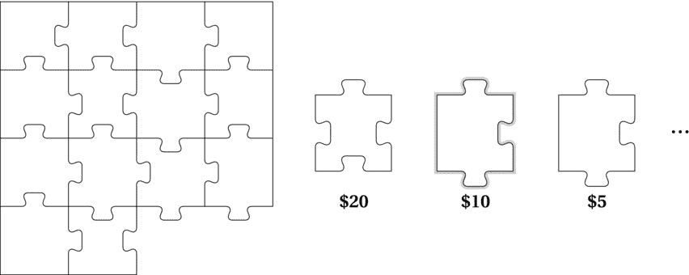
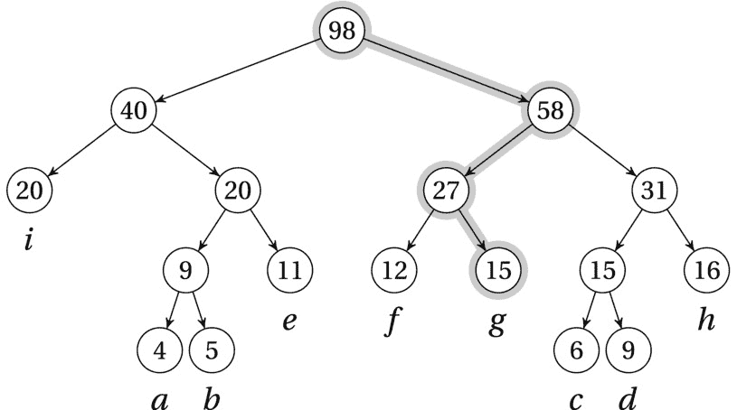
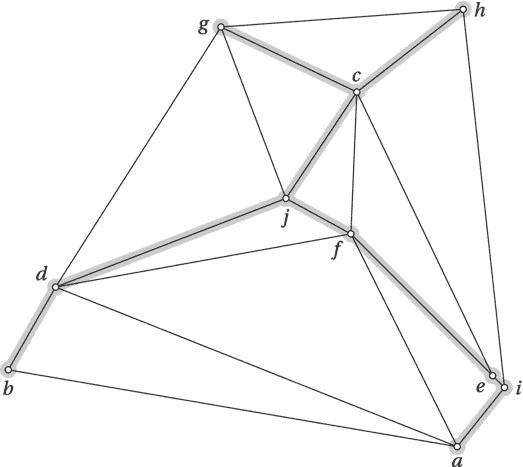

# 七、贪婪是好事？证明一下！

伙计，这不是够不够的问题。

——戈登·盖柯，*华尔街*

所谓的贪婪算法是短视的，因为它们孤立地做出每个选择，做此时此地看起来好的事情。在许多方面，*急切的*或*不耐烦的*可能是它们更好的名字，因为其他算法通常也试图找到尽可能好的答案；只是贪婪的人拿走了此刻能得到的，而不是担心未来。设计和实现一个贪婪的算法通常很容易，当他们工作时，往往是非常高效的。主要问题是展示他们*做了*工作——如果他们真的做了。这就是“证明它”的原因章节标题的一部分。

本章讨论给出正确(最优)答案的贪婪算法；我将在第 11 章中重温设计策略，在那里我将把这个要求放宽到“几乎正确(最优)”。

一步一步保持安全

贪婪算法的常见设置是一系列选择(正如您将看到的动态编程)。贪婪包括根据当地信息做出每个选择，做看起来最有希望的事情，而不考虑背景或未来的后果，然后，一旦做出选择，就永远不要回头。如果这能带来一个解决方案，我们必须确保每个选择都是安全的——不会破坏我们未来的前景。您将会看到许多关于我们如何确保这种安全性的例子(或者说，我们如何证明一个算法是安全的)，但是让我们从“一步一步”的部分开始。

用贪婪算法解决的这类问题通常会逐步建立一个解决方案。它有一组“解决方案片段”,可以组合成部分的、最终完整的解决方案。这些部分可以以复杂的方式组合在一起；可能有许多方法来组合它们，并且一旦我们使用了某些其他的，一些部分可能不再适合。你可以把这想象成一个有许多可能解决方案的拼图游戏(见[图 7-1](#Fig1) )。拼图图片是空白的，拼图块比较规整，可以在几个位置组合使用。



[图 7-1](#_Fig1) 。部分解决方案，和一些贪婪地排序的块(从左到右考虑)，下一个贪婪的选择被突出显示

现在给每个拼图块添加一个值。这是您将该特定部分融入完整解决方案所获得的奖励金额。接下来的目标是找到一种方式来铺设拼图，让你获得最高的总价值——也就是说，我们有一个优化问题。一般来说，解决这样的组合优化问题根本不是一件简单的任务。您可能需要考虑放置这些片段的每一种可能方式，从而产生指数级(可能是阶乘)运行时间。

假设你从顶部开始一行一行地填充拼图,那么你总是知道下一块拼图应该放在哪里。在这种情况下，贪婪的方法非常简单，至少对于选择要使用的棋子来说是如此。只需按价值递减排序，逐个考虑。如果一块不合适，你就扔掉它。如果合适，你就用它，不用考虑以后的作品。

即使不考虑正确性(或最优性)的问题，很明显这种算法需要几样东西才能运行:

*   一组候选元素，或*个片段*，附带一些*值*
*   检查部分解决方案是否有效或*可行*的一种方式

因此，部分解决方案被构建为解决方案片段的集合。我们依次检查每一部分，从最有价值的部分开始，然后添加每一部分，得到一个更大的、仍然有效的解决方案。当然，还可以添加一些微妙的东西(例如，总值不必是元素值的总和，我们可能想知道什么时候完成，而不必穷尽元素集)，但这只是一个原型描述。

这类问题的一个简单例子是找零——试图用尽可能少的硬币和钞票凑成一个给定的总数。比如说，有人欠你 43.68 美元，给你一张百元大钞。你是做什么的？这个问题之所以是一个很好的例子，是因为我们都本能地知道在这里做什么是正确的 [<sup>1</sup>](#Fn1) :我们从最大的面额开始，然后一路向下。每一张钞票或硬币都是一块拼图，我们正试图准确地覆盖 56.32 美元这个数字。我们可以考虑对一堆钞票和硬币进行分类，而不是对它们进行分类，因为每种钞票和硬币都有很多。我们按降序对这些堆栈进行排序，并开始分发最大面额的，如以下代码所示(使用美分，以避免浮点问题):

```py
>>> denom = [10000, 5000, 2000, 1000, 500, 200, 100, 50, 25, 10, 5, 1]
>>> owed = 5632
>>> payed = []
>>> for d in denom:
...     while owed >=d:
...         owed -= d
...         payed.append(d)
...
>>> sum(payed)
5632
>>> payed
[5000, 500, 100, 25, 5, 1, 1]
```

大多数人可能很少怀疑这是可行的；这似乎是显而易见的事情。事实上，它是可行的，但是这个解决方案在某些方面非常脆弱。即使稍微改变可用面额的列表也会破坏它(见练习 7-1)。计算出贪婪算法将对哪些货币起作用并不简单(尽管已经有了算法)，而且一般问题本身还没有解决。事实上，它与背包问题密切相关，背包问题将在下一节讨论。

让我们转向一个不同类型的问题，与我们在第 4 章中处理的匹配相关。电影结束了(许多人认为电视剧明显更好)，小组决定出去跳探戈，他们再次面临匹配问题。每对人都有一定的相容性，他们用数字表示，他们希望所有对的相容性之和尽可能高。同性舞伴在探戈中并不少见，所以我们不必局限于双方的情况——我们最终会遇到*最大重量匹配问题*。在这种情况下(或就此而言，在双边情况下)，贪婪一般不会起作用。然而，由于某种奇怪的巧合，*所有兼容数字*恰好是两个的*的不同幂。现在，发生了什么？ [<sup>2</sup>](#Fn2)*

让我们首先考虑一下贪婪算法是什么样子，然后看看为什么它会产生最佳结果。我们将一点一点地构建一个解决方案——让每一部分都是所有可能的配对，而部分解决方案是一组配对。只有当每个人最多参与其中一对时，这样的部分解才是有效的。算法大致如下:

1.  列出可能的配对，按兼容性降序排列。
2.  从列表中选择第一个未使用的配对。
3.  这对中有人已经被占用了吗？如果有，丢弃它；否则，使用它。
4.  单子上还有别的对子吗？如果是，请转到 2。

正如您稍后将看到的，这与 Kruskal 的最小生成树算法非常相似(尽管*认为*不管边权重如何都有效)。这也是一个相当典型的贪婪算法。其正确性另当别论。使用不同的 2 的幂是一种欺骗，因为它会让几乎所有贪婪的算法都起作用；也就是说，只要你能得到一个有效的解，你就会得到一个最优的结果(见练习 7-3)。尽管这是欺骗，但它说明了这里的中心思想:做出贪婪的选择是*安全的*。使用剩余夫妇中最合适的一对将【T4 永远】至少和其他选择一样好。 [<sup>3</sup>](#Fn3)

在接下来的几节中，我将向您展示一些众所周知的问题，这些问题可以使用贪婪算法来解决。对于每个算法，你会看到它是如何工作的，为什么贪婪是正确的。在本章快结束时，我将总结一些证明正确性的通用方法，你可以用它们来解决其他问题。

渴望的追求者和稳定的婚姻

事实上，有一个经典的匹配问题可以被贪婪地解决:*稳定的婚姻问题* 。这个想法是，一个群体中的每个人都有他或她想和谁结婚的偏好。我们希望看到每个人都结婚，我们希望婚姻稳定*，这意味着没有男人喜欢婚外也喜欢他的女人。(为了简单起见，我们在这里忽略同性婚姻和一夫多妻制。)*

 *大卫·盖尔和劳埃德·沙普利设计了一个简单的算法来解决这个问题。这种提法在性别上相当保守，但如果性别角色颠倒过来，肯定也行得通。该算法运行多个*轮*，直到没有未订婚的男人。每一轮包括两个步骤:

1.  每个没有订婚的男人都向他还没有邀请的女人中他最喜欢的一个求婚。
2.  每个女人都(暂时)与她最喜欢的追求者订婚，并拒绝其他人。

这可以被视为贪婪，因为我们现在只考虑可用的最爱(男性和女性)。你可能会反对说，这只是*有点*贪婪，因为我们没有锁定目标，直接走向婚姻；如果有更感兴趣的求婚者出现，女性可以解除婚约。即便如此，一旦一个男人被拒绝，他就永远被拒绝了，这意味着我们保证了进步和二次最坏情况运行时间。

为了证明这是一个最优且正确的算法，我们需要知道每个人都会结婚，而且婚姻是稳定的。一旦一个女人订婚，她就保持订婚状态(尽管她可能会取代她的未婚夫)。我们不可能被一对未婚情侣困住，因为在某个时候，男方会向女方求婚，而女方会(暂时)接受他的求婚。

我们怎么知道婚姻是稳定的？假设斯佳丽和斯图尔特都结婚了，但不是彼此。有没有可能他们暗地里更喜欢对方而不是现在的配偶？不。如果是这样，斯图尔特早就向她求婚了。如果她接受了那个提议，她一定后来找到了她更喜欢的人；如果她拒绝了，她已经有了一个更好的伴侣。

虽然这个问题看起来很傻很琐碎，但其实不然。例如，它被用于一些大学的录取和分配医学生到医院工作。事实上，有整本书(如唐纳德·克努特、丹·古斯菲尔德和罗伯特·w·欧文的书)专门讨论这个问题及其变种。


***所有的女孩。*** *你知道我永远不会离开你。只要她和别人在一起就不会。(`http://xkcd.com/770` `)`*

背包问题

在某种程度上，这个问题是前面讨论过的变革问题的概括。在那个问题中，我们使用硬币面额来确定部分/全部解决方案是否有效(不要给太多/给准确的数量)，硬币的数量衡量最终解决方案的质量。背包问题用不同的术语来描述:我们有一组想要随身携带的物品，每一个都有一定的重量和 T2 值；然而，我们的背包有一个最大容量(总重量的上限)，我们希望最大化我们得到的总价值。

背包问题涵盖了很多应用。每当你要选择一组有价值的对象(内存块、文本片段、项目、人)，其中每个对象都有一个单独的值(可能与金钱、概率、新近性、能力、相关性或用户偏好相关)，但你受到一些资源的约束(无论是时间、内存、屏幕空间、重量、体积还是其他任何东西)，你很可能正在解决背包问题的一个版本。还有一些特殊情况和密切相关的问题，如*子集和*问题、[第十一章](11.html)中讨论的，以及前面讨论的找零问题。这种广泛的适用性也是它的弱点——这使得它成为一个如此难以解决的问题。一般来说，问题越有表现力，就越难找到有效的算法。幸运的是，有一些特殊的情况我们可以用不同的方式来解决，正如你将在接下来的章节中看到的。

分数背包

这是背包问题中最简单的一个。在这里，我们不需要包括或排除整个对象；例如，我们可能会在背包里塞满豆腐、威士忌和金粉(为一次有点奇怪的野餐做准备)。然而，我们不需要允许任意分数。例如，我们可以使用克或盎司的分辨率。(我们可以更加灵活；参见练习 7-6。)你将如何处理这个问题？

这里最重要的是找到*价值与重量*的比率。例如，大多数人会同意金粉每克价值最高(尽管这可能取决于你用它做什么)；假设威士忌介于两者之间(尽管我肯定有人会对此提出异议)。在这种情况下，为了充分利用我们的背包，我们会把它装满金粉——或者至少是我们现有的金粉。如果用完了，我们就开始加威士忌。如果我们喝完威士忌后还有剩余的空间，我们就用豆腐把它全部填满(并开始害怕打开包装收拾这一团乱)。

这是贪婪算法的一个典型例子。我们直奔好的(或者至少是昂贵的)东西。如果我们使用一个离散的重量测量，这可能会更容易看到；也就是说，我们不需要担心比率。我们基本上有一套单独的金粉、威士忌和豆腐，我们根据它们的价值对它们进行分类。然后，我们(从概念上)把克一个一个的打包。

整数背包

假设我们放弃了片段，现在需要包含整个对象——这种情况在现实生活中更有可能发生，无论您是在编程还是打包行李。然后问题突然变得更加难以解决了。现在，假设我们仍然在处理对象的*类别*，那么我们可以从每个类别中添加一个整数(即对象的数量)。每个类别都有一个固定的权重和值，适用于所有对象。比如所有的金条重量一样，价值一样；这同样适用于瓶装威士忌(我们坚持单一品牌)和袋装豆腐。现在，我们该怎么办？

整数背包问题有两种重要情况——有界和无界情况。有界的情况假设我们在每个类别中有固定数量的对象，[<sup>【4】</sup>](#Fn4)，无界的情况让我们想用多少就用多少。可悲的是，贪婪在这两种情况下都行不通。事实上，这两个都是未解决的问题，在某种意义上，没有已知的多项式算法来解决它们。然而，T4 还是有希望的。正如你将在下一章看到的，我们可以使用动态编程在*伪多项式*时间内解决问题，这在许多重要情况下可能已经足够好了。此外，对于*无界*的情况，事实证明贪婪的方法并不坏！或者，更确切地说，它至少有一半好，这意味着我们永远不会得到少于一半的最佳值。稍加修改，有界版本也能得到同样好的结果。贪婪近似的概念将在第 11 章的[中详细讨论。](11.html)

 **注**这主要是背包问题的一个初步“尝试”。我会在第八章的[中更彻底地处理整数背包问题的解决方案。](08.html)

霍夫曼算法

霍夫曼算法是贪婪的另一个经典。假设你在某个紧急中心工作，人们在那里寻求帮助。你试图将一些简单的是/否问题放在一起，以帮助来电者诊断急性医疗问题，并决定适当的行动方案。您有一个应该涵盖的条件列表，以及一组诊断标准、严重程度和发生频率。您首先想到的是构建一个平衡的二叉树，在每个节点中构造一个问题，将可能条件的列表(或子列表)分成两半。不过，这似乎太简单了；这个清单很长，包括许多非临界条件。不知何故，你需要考虑严重程度和发生频率。

开始简化任何问题通常是个好主意，所以你决定把重点放在频率上。你意识到平衡二叉树是基于 *均匀概率*的假设——如果某些项目更有可能，将列表分成两半是不行的。例如，如果病人有一半的机会失去知觉，*这就是*要问的事情——即使“病人有皮疹吗？”可能会把列表从中间分开。换句话说，你想要一个*加权*平衡:你想要预期的问题数量尽可能低。您希望最小化从根到叶的遍历的*预期深度*。

你会发现这个想法也可以用来解释严重性。您可能希望对最危险的情况进行优先排序，以便快速识别(“患者有呼吸吗？”)，代价是让病情不太严重的患者等待几个额外的问题。在一些健康专家的帮助下，你可以通过结合频率(概率)和所涉及的健康风险，给每种情况一个*成本*或*权重*来做到这一点。你对树形结构的目标还是一样的。如何最小化所有叶子的*深度* ( *u* ) × *重量* ( *u* )之和 *u* ？

这个问题当然也有其他的应用。事实上，最初的(也是最常见的)应用是通过*可变长度编码*来*压缩*——更紧凑地表示文本。文本中的每个字符都有出现的频率，您希望利用这些信息给出不同长度的字符编码，以便最小化任何文本的预期长度。同样，对于任何字符，您都希望最小化其编码的预期长度。

你看出这和前面的问题有什么相似之处了吗？考虑一下你只关注给定医疗条件的可能性的版本。现在，我们不是最小化识别某种疾病所需的是/否问题的数量，而是最小化识别一个字符所需的比特数。是/否答案和位唯一地标识了二叉树中叶子的路径(例如，零= *否* = *左*和一= *是* = *右*)。 [<sup>5</sup>](#Fn5) 例如，考虑字符 *a* 到 *f* 。图 7-2 给出了对它们进行编码的一种方式(暂时忽略节点中的数字)。例如， *g* (由突出显示的路径给出)的代码将是 101。因为所有的字符都在树叶中，所以当解码一个用这种方法压缩过的文本时，不会有歧义(见练习 7-7)。没有有效代码是另一个代码的前缀，这一特性产生了术语*前缀代码*。



[图 7-2](#_Fig2) 。a–I 的霍夫曼树，频率/权重为 4、5、6、9、11、12、15、16 和 20，代码 101 表示的路径(右、左、右)突出显示

该算法

让我们先设计一个贪婪算法来解决这个问题，然后证明它是正确的(这当然是关键的一步)。最明显的贪婪策略可能是从出现频率最高的字符开始，一个接一个地添加字符(叶子)。但是我们应该在哪里添加它们呢？另一种方法(稍后你会在克鲁斯卡尔的算法中再次看到)是让部分解决方案由几个树片段组成，然后重复地由 T2 组合 T3。当我们合并两棵树时，我们添加一个新的共享根，并赋予它一个等于其子树之和的权重，也就是先前的根。这正是[图 7-2](#Fig2) 中节点内数字的含义。

清单 7-1 显示了一种实现霍夫曼算法的方法。它将部分解决方案维护为一个森林，每棵树都表示为嵌套列表。只要森林中至少有两棵独立的树，就会挑出两棵最轻的树(根部重量最低的树)，合并，然后放回原处，并赋予新的根部重量。

[***清单 7-1***](#_list1) 。霍夫曼算法

```py
from heapq import heapify, heappush, heappop
from itertools import count

def huffman(seq, frq):
    num = count()
    trees = list(zip(frq, num, seq))            # num ensures valid ordering
    heapify(trees)                              # A min-heap based on frq
    while len(trees) > 1:                       # Until all are combined
        fa, _, a = heappop(trees)               # Get the two smallest trees
        fb, _, b = heappop(trees)
        n = next(num)
        heappush(trees, (fa+fb, n, [a, b]))     # Combine and re-add them
    return trees[0][-1]
```

下面是一个如何使用代码的示例:

```py
>>> seq = "abcdefghi"
>>> frq = [4, 5, 6, 9, 11, 12, 15, 16, 20]
>>> huffman(seq, frq)
[['i', [['a', 'b'], 'e']], [['f', 'g'], [['c', 'd'], 'h']]]
```

在实现中有几个细节值得注意。它的主要特性之一是使用堆(来自`heapq`)。重复选择和组合未排序列表的两个最小元素会给我们一个二次运行时间(线性选择时间，线性迭代次数)，而使用堆会将其减少到对数线性(对数选择和重新添加)。但是，我们不能直接将树添加到堆中；我们需要确保它们按频率分类。我们可以简单地添加一个元组`(freq, tree)`，只要所有频率(即权重)都不同，这就可以工作。然而，一旦森林中的两棵树具有相同的频率，堆代码就必须比较这两棵树，看哪一棵树更小——然后我们很快就会遇到未定义的比较。

 **注意**在 Python 3 中，不允许比较`["a", ["b", "c"]]`和`"d"`这样不兼容的对象，会引发一个`TypeError`。在早期版本中，这是允许的，但排序通常没有太大意义；无论如何，实施更可预测的键可能都是一件好事。

一个解决方案是在两者之间添加一个字段，这个字段保证对所有对象都不同。在这种情况下，我简单地使用了一个计数器，产生了`(freq, num, tree)`，其中使用任意的`num`打破了频率关系，避免了直接比较(可能无法比较的)树。 [<sup>6</sup>](#Fn6)

如你所见，生成的树结构相当于图 7-2 中的[所示。](#Fig2)

当然，要使用这种技术压缩和解压缩文本，您需要一些预处理和后处理。首先，您需要计算字符数以获得频率(例如，使用来自`collections`模块的`Counter`类)。然后，一旦你有了霍夫曼树，你必须找到所有字符的代码。你可以用一个简单的递归遍历来实现，如[清单 7-2](#list2) 所示。

[***清单 7-2***](#_list2) 。从霍夫曼树中提取霍夫曼码

```py
def codes(tree, prefix=""):
    if len(tree) == 1:
        yield (tree, prefix)                    # A leaf with its code
        return
    for bit, child in zip("01", tree):          # Left (0) and right (1)
        for pair in codes(child, prefix + bit): # Get codes recursively
            yield pair
```

例如，`codes`函数产生适合在`dict`构造函数中使用的`(char, code)`对。要使用这样的字典来压缩代码，您只需遍历文本并查找每个字符。为了*解压缩*文本，您宁愿直接使用霍夫曼树，使用输入中的位来遍历它(即，确定您应该向左还是向右)；我将把细节留给读者作为练习。

第一个贪婪的选择

我相信你可以看到霍夫曼代码将让你忠实地编码一个文本，然后再次解码——但是它怎么可能是*最优的*(在我们正在考虑的代码类别中)？也就是说，为什么使用这个简单、贪婪的过程，任何叶子的预期深度都被最小化了？

正如我们通常所做的，我们现在转向归纳法:我们需要证明我们从头到尾都是安全的——贪婪的选择不会给我们带来麻烦。我们常常可以将这个证明拆分成两部分，也就是通常所说的( *i* ) *贪婪选择性质*和( *ii* ) *最优子结构*(例如，参见 Cormen 等人在[第 1 章](01.html)的“参考文献”部分)。贪婪选择属性意味着贪婪选择给了我们一个新的部分解，它是最优解的一部分。最优子结构*与第 8 章的材料[非常](08.html)*密切相关，它意味着问题的*剩余部分*，在我们做出选择之后，是否能够*也*像原始问题一样得到解决——如果我们能够找到子问题的最优解，我们可以将它与我们的贪婪选择结合起来，从而得到整个问题的解决方案。换句话说，最优解是从最优子解构建的。

为了展示 Huffman 算法的贪婪选择属性，我们可以使用一个*交换参数*(例如，参见[第 1 章](01.html)的“参考”部分中的 Kleinberg 和 Tardos)。这是一种通用技术，用来表明我们的解决方案至少和最优方案一样好(因此是最优的)，或者在这种情况下，存在*和*一个我们贪婪选择的解决方案，至少有这么好。“至少一样好”的部分是通过采用一个假设的(完全未知的)最优解，然后逐渐将其变为我们的解(或者，在这种情况下，包含我们感兴趣的位的解)*而不使它变得更糟*来证明的。

Huffman 算法的贪婪选择包括将两个最轻的元素作为同级叶子放置在树的最低层。(注意，我们担心的只是第*首*个贪婪的选择；最优子结构将处理其余的归纳。)我们需要证明这是安全的——存在一个最优解，其中两个最轻的元素实际上是底层的兄弟树叶。通过定位另一个最优树开始交换论证，其中这两个元素是*而不是*最低层的兄弟。让 *a* 和 *b* 是最低频率的元素，并且假设这个假设的最优树具有 *c* 和 *d* 作为最大深度处的兄弟树叶。我们假设 *a* 比 *b* 轻(具有较低的权重/频率),并且 *c* 比 *d* 轻。 [<sup>7</sup>](#Fn7) 在这种情况下，我们也知道 *a* 比 *c* 轻， *b* 比 *d* 轻。为简单起见，让我们假设 *a* 和 *d* 的频率不同，因为否则证明是简单的(见练习 7-8)。

如果我们交换 *a* 和 *c* 会发生什么？然后互换 *b* 和 *d* ？首先，我们现在有了作为底层兄弟的 *a* 和 *b* ，这是我们想要的，但是预期的叶子深度发生了什么变化呢？您可以在这里修改加权和的完整表达式，但简单的想法是:我们在树中上移了一些重节点*和下移了一些轻节点*和*。这意味着一些短路径现在在总和中被给予较高的权重，而一些长路径被给予较低的权重。总而言之，总成本不可能增加。(事实上，如果深度和权重都不同，我们的树会更好，我们有一个矛盾的证明，因为我们假设的替代最优方案不存在——贪婪的方法是最好的。)*

走完剩下的路

这是证明的前半部分。我们知道做出第一个贪婪选择是可以的(贪婪选择属性)，但是我们需要知道使用贪婪选择(最优子结构)来保持*是可以的。不过，我们需要先处理剩下的子问题*是什么*。更好的是，我们希望它有和原来一样的结构，这样感应机制就能正常工作。换句话说，我们希望将事情简化为一个新的、更小的元素集，我们可以为其构建一个最佳树，然后展示如何在此基础上进行构建。*

这个想法是将前两个组合的叶子视为一个新元素，忽略它是一棵树的事实。我们只担心它的根源。然后，子问题就变成了为这组新元素找到一棵最优树——通过归纳，我们可以假设这是正确的。剩下的唯一问题是，一旦我们通过再次包括它的叶子节点，将这个节点扩展回三节点子树，这个树是否是最优的；这是给我们引导步骤的关键部分。

假设我们的两片叶子是 *a* 和 *b* ，频率为 *f* ( *a* )和 *f* ( *b* )。我们将它们聚集成一个单个节点，频率为*f*(*a*)+*f*(*b*)，并构建一个最优树。让我们假设这个组合节点在深度 *D* 结束。那么它对总树成本的贡献就是*D*×(*f*(*a*)+*f*(*b*)。如果我们现在展开这两个子节点，它们的父节点不再对成本有贡献，但是叶子(现在在深度 *D* + 1)的总贡献将是(*D*+1)×(*f*(*a*)+*f*(*b*)。换句话说，全解的成本超过最优子解*f*(*a*)+*f*(*b*)。我们能确定这是最优的吗？

是的，我们可以，我们可以用矛盾来证明，假设它是*而不是*最优。我们变出另一棵更好的树——假设它也有 *a* 和 *b* 作为底层兄弟。(根据上一节的讨论，我们知道存在这样的最优树。)再一次，我们可以折叠 *a* 和 *b* ，我们最终得到子问题的一个解决方案，这个解决方案比我们得到的解决方案*更好*…但是我们得到的解决方案根据假设是最优的！换句话说，我们找不到比包含最优子解更好的全局解。

最佳合并

虽然霍夫曼算法通常用于构造最佳前缀码，但还有其他方式来解释霍夫曼树的属性。正如最初解释的那样，人们可以把它看作一棵决策树，其中期望的遍历深度是最小的。不过，我们也可以在解释中使用内部节点的权重，从而产生一个相当不同的应用。

我们可以将霍夫曼树视为一种微调的分治树，其中我们不像第 6 章中的[那样进行平面平衡，而是将叶子权重考虑在内。然后，我们可以将叶权重解释为子问题的大小，如果我们假设组合(合并)子问题的成本是线性的(分而治之中经常出现这种情况)，则所有内部节点权重的总和代表所执行的总工作量。](06.html)

例如，这方面的一个实际例子是合并已排序的文件。合并大小为 *n* 和 *m* 的两个文件需要在 *n* + *m* 中线性花费时间。(这类似于关系数据库中的连接问题或 timsort 等算法中的序列合并问题。)换句话说，如果你把图 7-2 中的叶子想象成文件，把它们的权重想象成文件大小，那么内部节点就代表了整个合并的成本。如果我们能够最小化内部节点的总和(或者，等价地，所有节点的总和)，我们将找到最佳的合并时间表。(练习 7-9 要求你证明这真的很重要。)

我们现在需要证明霍夫曼树确实可以最小化节点权重。幸运的是，我们可以根据前面的讨论来证明这一点。我们知道，在霍夫曼树中，所有叶子的深度乘以权重之和是最小的。现在，考虑每个叶子如何对所有节点的总和做出贡献:叶子权重作为被加数在其每个祖先节点中出现一次——这意味着总和完全相同！即`sum(weight(node) for node in nodes)`与`sum(depth(leaf)*weight(leaf) for leaf in leaves)`相同。换句话说，霍夫曼算法正是我们进行最佳合并所需要的。

 **提示**Python 标准库有几个处理压缩的模块，包括`zlib`、`gzip`、`bz2`、`zipfile`、`tar`。`zipfile`模块处理 ZIP 文件，它使用基于霍夫曼码的压缩。 [<sup>8</sup>](#Fn8) 

最小生成树

现在让我们看看贪婪问题最广为人知的例子:寻找最小生成树。这个问题由来已久——至少从 20 世纪初就存在了。1926 年，捷克数学家奥塔卡尔·borůvka 首次解决了这个问题，试图为摩拉维亚建造一个廉价的电网。从那以后，他的算法被重新发现了很多次，它仍然是今天已知的一些最快的算法的基础。我将在本节中讨论的算法(Prim 的和 Kruskal 的)在某种程度上更简单，但具有相同的渐近运行时间复杂度( *O* ( *m* lg *n* ，对于 *n* 节点和 *m* 边)。 [<sup>9</sup>](#Fn9) 如果你对这个问题的历史感兴趣，包括经典算法的反复重新发现，可以看看 Graham 和 Hell 的论文《关于最小生成树问题的历史》。(例如，你会看到 Prim 和 Kruskal 并不是唯一声称拥有其同名算法的人。)

我们基本上是在寻找连接一个加权图的所有节点的最便宜的方法，因为我们只能使用它的边的子集来完成这项工作。解决方案的成本就是我们使用的边的加权和。这在建设电网、构建公路或铁路网络的核心、设计电路，甚至是执行某种形式的集群(在这种情况下，我们只需要*几乎*连接所有节点)时会很有用。最小生成树也可以用作第 1 章中介绍的旅行销售代表问题的近似解决方案的基础(见[第 11 章](11.html)对此的讨论)。

连通无向图 *G* 的生成树 *T* 具有与 *G* 相同的节点集和边的子集。如果我们将一个边权重函数与 *G* 相关联，那么边 *e* 具有权重 *w* ( *e* ，那么生成树的权重 *w* ( *T* )，就是 *T* 中每条边 *e* 的 *w* ( *e* 之和。在*最小生成树问题*中，我们想在 *G* 上找到一棵具有最小权重的生成树。(注意可能不止一个。)还要注意，如果 *G* 断开，它将没有*也没有*生成树，所以在下面，通常假设我们正在处理的图是连通的。

在第 5 章中，你看到了如何使用遍历构建生成树；构建最小生成树也可以像这样一步一步来构建，这就是贪婪的来源:我们*逐渐*通过一次添加一条边来构建树。在每一步，我们都在我们的建造程序允许的范围内选择*最便宜的*(或*最轻的*)边。这个选择就是*局部最优*(也就是贪心的)*不可撤销*。这个问题的主要任务，或者任何其他贪婪问题，变成显示这些*局部*最优选择导致*全局*最优解。

最短的边

考虑[图 7-3](#Fig3) 。让边权重对应于绘制时节点之间的欧几里德距离(即实际边长)。如果你要为这个图构造一个生成树，你会从哪里开始？你能确定其中有某种优势吗？或者至少包含某个边缘是安全的？当然( *e* ， *i* )看起来很有希望。它太小了！事实上，它是所有边中最短的一条，也是权重最低的一条。但这就够了吗？



[图 7-3](#_Fig3) 。欧几里得图及其最小生成树(突出显示)

事实证明，的确如此。考虑任何没有的生成树*的最小重量边( *e* ， *i* )。生成树必须包括 *e* 和 *i* (根据定义)，因此它还将包括从 *e* 到 *i* 的单一路径。如果我们现在将( *e* ， *i* )添加到混合中，我们将得到一个*循环*，并且为了回到一个合适的生成树，我们将不得不删除这个循环的一条边——哪条都没关系。因为( *e* ， *i* )是最小的，移除*任何其他的*边会产生比我们开始时更小的树。正确换句话说，任何不包括最短边的树*都可以变小，所以最小生成树*必须*包括最短边。(正如你将看到的，这是克鲁斯卡尔算法背后的基本思想。)**

如果我们考虑所有的边都发生在一个节点上，会怎么样呢——我们能得出什么结论吗？比如看一下 *b* 。根据生成树的定义，我们必须以某种方式将 *b* 连接到其余部分，这意味着我们必须包括*或者* ( *b* ， *d* ) *或者* ( *b* ， *a* )。同样，选择两者中最短的一个似乎很有诱惑力。再一次，贪婪的选择被证明是非常明智的。我们再一次用反证法证明了选择是次等的:假设用( *b* ， *a* )更好。我们将构建包含( *b* ， *a* )的最小生成树。然后，为了好玩，我们会添加( *b* ， *d* )，创建一个循环。但是，嘿——如果我们去掉( *b* ， *a* )，我们就有了*另一个*生成树，因为我们把一条边换成了一条更短的边，所以这个新树肯定*更小*。换句话说，我们有一个矛盾，没有( *b* ， *d* )的那个一开始就不可能最小。而*这个*是 Prim 算法背后的基本思想，我们将在 Kruskal 的算法之后再看。

事实上，这两个想法都是涉及*削减*的更普遍原则的特例。切割只是将图节点划分为两个集合，在这种情况下，我们感兴趣的是在这两个节点集合之间通过的边。我们说这些边缘*穿过*切口。例如，想象在[图 7-3](#Fig3) 中画一条垂直线，正好在 *d* 和 *g* 之间；这将产生由五条边交叉的切口。到现在为止，我相信你已经明白了:我们可以*确定*包含穿过切割的最短边是安全的，在这种情况下( *d* ， *j* )。争论再次完全相同:我们建立一个替代树，它必须包括至少一个穿过切割的其他边(为了保持图的连接)。如果我们然后添加( *d* ， *j* )，则至少穿过切割的其他较长边中的一条将是与( *d* ， *j* )相同循环的一部分，这意味着移除另一条边将是安全的，从而给出更小的生成树。

您可以看到前两个想法是这种“穿过切割的最短边”原则的特殊情况:选择图中的最短边将是安全的，因为它在它参与的每个切割中都是最短的，选择与任何节点相关的最短边将是安全的，因为它是切割上的最短边，将该节点与图的其余部分分开。在下文中，我对这些想法进行了扩展，将它们变成了两个用于寻找最小生成树的成熟的贪婪算法。第一个(Kruskal 的)接近典型的贪婪算法，而第二个(Prim 的)使用遍历原则，并在顶部添加了贪婪选择。

其余的呢？

表现出第一个贪婪的选择是可以的是不够的。我们需要证明剩下的问题是同一问题的一个较小的实例——我们的归约可以安全地用于归纳。换句话说，我们需要建立最优的子结构。这并不太难(练习 7-12)，但这里有另一种方法可能更简单:我们证明我们的解是最小生成树的一部分(一个子图)的不变量。只要解决方案不是生成树，我们就不断添加边(也就是说，只要还有边不会形成循环)，所以如果这个不变量为真，算法必须以完整的最小生成树终止。

那么，不变量成立吗？最初，我们的部分解决方案是空的，这显然是一个部分的最小生成树。现在，归纳地假设我们已经建立了一些部分的最小生成树 *T* ，并且我们添加了一条安全边(也就是说，一条不产生循环并且是穿过一些切割的最短的边)。显然，新的结构仍然是一个森林(因为我们小心翼翼地避免创建循环)。同样，上一节中的推理仍然适用:在包含 *T* 的生成树中，包含该安全边的生成树将比不包含该安全边的生成树小。因为(根据假设)，包含 *T* 的树中至少有一棵是最小生成树，包含 *T* 和安全边的树中至少有一棵*也会*是最小生成树。

克鲁斯卡尔算法

这种算法接近于本章开始时概述的一般贪婪方法:对边进行排序并开始挑选。因为我们在寻找*短*边，所以我们按照长度(或重量)的增加对它们进行排序。唯一的问题是如何检测会导致无效解决方案的边缘。使我们的解决方案无效的唯一方法是添加一个循环，但是我们如何检查呢？一个简单的解决方案是使用遍历；每当我们考虑一条边( *u* 、 *v* )，我们就从 *u* 开始遍历我们的树，看看是否有路径到达 *v* 。如果有，我们就丢弃它。不过，这似乎有点浪费；在最坏的情况下，遍历检查将花费我们部分解决方案的线性时间。

我们还能做什么？我们*可以*维护到目前为止我们的树中的一组节点，然后对于一个预期的边( *u* ， *v* )，我们将查看两者是否都在解决方案中。这将意味着排序边缘是主导；检查每个边缘可以在恒定的时间内完成。这个计划只有一个致命的缺陷:行不通。如果我们能保证部分解在每一步都是*连接*的，那么*将会起作用(这就是我们在 Prim 算法中要做的)，但是我们不能。因此，即使两个节点是我们目前解决方案的一部分，它们可能在不同的树中，连接它们将是完全有效的。我们需要知道的是它们不在同一个*树中。**

让我们通过让解决方案中的每个节点知道它属于哪个组件(树)来尝试解决这个问题。我们可以让组件中的一个节点作为代表、，然后组件中的所有节点都可以指向这个代表。这就留下了*组合*组件的问题。如果合并组件的所有节点都必须指向同一个代表，那么这个组合(或联合)将是一个线性操作。我们能做得更好吗？我们可以*试试*；例如，我们可以让每个节点指向另一个节点，我们将沿着这个链直到到达代表(它将指向它自己)。然后，加入只是一个代表点指向另一个代表点的问题(恒定时间)。没有直接的保证证明链会有多长，但至少这是第一步。

这就是我在清单 7-3 中所做的，使用地图`C`来实现“指向”正如你所看到的，每个节点最初是它自己的组件的代表，然后我重复地用新的边连接组件，按照排序的顺序。请注意，我实现的方式是，我期望一个无向图，其中每条边只表示一次(也就是说，使用它的一个方向，任意选择)。和往常一样，我假设图中的每个节点都是一个键，尽管可能有一个空的权重图(也就是说，如果`u`没有外边缘，那么就是`G[u] = {}`)。

[***清单 7-3***](#_list3) 。克鲁斯卡尔算法的简单实现

```py
def naive_find(C, u):                           # Find component rep.
    while C[u] != u:                            # Rep. would point to itself
        u = C[u]
    return u

def naive_union(C, u, v):
    u = naive_find(C, u)                        # Find both reps
    v = naive_find(C, v)
    C[u] = v                                    # Make one refer to the other

def naive_kruskal(G):
    E = [(G[u][v],u,v) for u in G for v in G[u]]
    T = set()                                   # Empty partial solution
    C = {u:u for u in G}                        # Component reps
    for _, u, v in sorted(E):                   # Edges, sorted by weight
        if naive_find(C, u) != naive_find(C, v):
            T.add((u, v))                       # Different reps? Use it!
            naive_union(C, u, v)                # Combine components
    return T
```

天真的克鲁斯卡尔很管用，但并不那么好。(什么，名字泄露了？)在最坏的情况下，我们需要在`naive_find`中遵循的引用链可能是线性的。一个相当明显的想法可能是总是让`naive_union`中两个组件的*较小的*指向*较大的*，给我们一些平衡。或者我们可以从平衡树的角度考虑更多，给每个节点一个等级*或高度*。如果我们总是让最低位的代表点指向最高位的代表点，那么调用`naive_find`和`naive_`联合的总运行时间为*O*(*m*LG*n*)(见练习 7-16)。**

 *这实际上没什么问题，因为排序操作的起点是θ(*m*LG*n*)。 [<sup>12</sup>](#Fn12) 不过，这个算法中还有一个常用的技巧，叫做*路径压缩*。它需要在执行`find`时“拉动指针”,确保我们在途中检查的所有节点现在都直接指向代表。直接指向代表的节点越多，后面的`find` s 中的事情应该进行得越快，对吗？可悲的是，这到底如何以及为什么会有帮助背后的原因对我来说太复杂了，我无法在这里深入讨论(尽管我会推荐 Sect。21.4 在 Cormen 等人的*算法简介*中，如果你感兴趣的话)。不过最终的结果是，`union` s 和`find` s 最坏情况下的总运行时间是*O*(*mα*(*n*)，其中 *α* ( *n* )是*几乎*一个常数。事实上，你可以假设 *α* ( *n* ) ≤ 4，对于 *n* 的任何一个看似遥远的值。关于`find`和`union`的改进实现，参见[清单 7-4](#list4) 。

[***清单 7-4***](#_list4) 。克鲁斯卡尔算法

```py
def find(C, u):
    if C[u] != u:
        C[u] = find(C, C[u])                    # Path compression
    return C[u]

def union(C, R, u, v):a
    u, v = find(C, u), find(C, v)
    if R[u] > R[v]:                             # Union by rank
        C[v] = u
    else:
        C[u] = v
    if R[u] == R[v]:                            # A tie: Move v up a level
        R[v] += 1

def kruskal(G):
    E = [(G[u][v],u,v) for u in G for v in G[u]]
    T = set()
    C, R = {u:u for u in G}, {u:0 for u in G}   # Comp. reps and ranks
    for _, u, v in sorted(E):
        if find(C, u) != find(C, v):
            T.add((u, v))
            union(C, R, u, v)
    return T
```

总而言之，克鲁斯卡尔算法的运行时间是θ(*m*LG*n*)，这个时间来自于排序。

请注意，您可能希望以不同的方式表示生成树(即，不是边的集合)。在这方面，算法应该很容易修改——或者你可以基于边集`T`构建你想要的结构。

 **注意**克鲁斯卡尔算法中使用的子问题结构是一个*拟阵*的例子，其中可行的部分解是简单的集合——在这种情况下，是无圈边集。对于拟阵来说，贪婪是有用的。规则如下:可行集的所有子集也必须是可行的，较大的集合必须有可以扩展较小集合的元素。

普里姆算法

克鲁斯卡尔的算法在概念层面上很简单——它是对生成树问题的贪婪方法的直接翻译。正如您刚才看到的，有效性检查有些复杂。在这方面，Prim 的算法要简单一点。[<sup>13</sup>](#Fn13)Prim 算法的主要思想是从一个起始节点开始遍历图，总是添加连接到树的最短边。这是安全的，因为如前所述，该边将是穿过我们的部分解决方案的切口的最短的一条边。

这意味着 Prim 的算法只是另一种遍历算法，如果你读过《T2》第五章，这应该是一个熟悉的概念。正如在那一章中所讨论的，遍历算法之间的主要区别是我们的“待办事项”列表的排序——在我们发现的未访问节点中，我们将遍历树扩展到下一个节点？在广度优先搜索中，我们使用了一个简单的队列(即一个`deque`)；在 Prim 的算法中，我们简单地用一个用堆实现的*优先级队列*、替换这个队列，使用`heapq`库(在第 6 章的[的“黑盒”侧栏中讨论)。](06.html)

然而，这里有一个重要的问题:最有可能的是，我们将发现指向已经在我们的队列中的*节点的新边。如果我们发现的新边*比前一个边*短，我们应该*根据这个新边调整优先级*。然而，这可能相当麻烦。我们需要在堆中找到给定的节点，改变优先级，然后重新构造堆，使其仍然正确。您可以通过从每个节点到它在堆中的位置的映射来做到这一点，但是在执行堆操作时您必须更新该映射，并且您不能再使用`heapq`库。*

不过，事实证明还有另一种方法。一个非常好的解决方案，也适用于其他基于优先级的遍历(如 Dijkstra 算法和 A*，在第 9 章的[中讨论)，就是简单地多次添加节点*。每次你找到一个节点的边，你就以适当的权重将该节点添加到堆(或其他优先级队列)中，并且你*不关心它是否已经在那里*。为什么这可能行得通？*](09.html)

 **   我们使用的是优先级队列，所以如果一个节点被添加了多次，当我们删除它的一个条目时，它将是权重最低的那个(那时)，也就是我们想要的那个。
*   我们确保不会将同一个节点多次添加到我们的遍历树中。这可以通过恒定时间的成员检查来确保。因此，任何给定节点的所有队列条目都将被丢弃，只有一个除外。
*   多次加法不会影响渐近运行时间(见练习 7-17)。

对实际运行时间也有重要的影响。(更)简单的代码不仅更容易理解和维护；它的开销也少了很多。因为我们可以使用超快的`heapq`库，最终结果很可能是性能的大幅提升。(如果你想尝试更复杂的版本，这在许多算法书籍中都有使用，当然欢迎你。)

 **注**重新添加一个权重较低的节点相当于一个松弛，如[第 4 章](04.html)所述。正如您将看到的，我还将 predecessor 节点添加到队列中，使得任何显式的放松都是不必要的。然而在[第 9 章](09.html)实现 Dijkstra 的算法时，我使用了一个单独的`relax`函数。这两种方法是可以互换的(所以你可以让 Prim 的*带*T1，Dijkstra 的*不带*T1)。

你可以在清单 7-5 的[中看到我版本的 Prim 算法。因为`heapq`还不像`list.sort`和 friends 那样支持排序键，所以我在堆中使用`(weight, node)`对，当节点弹出时丢弃权重。除了使用堆之外，代码类似于清单 5-10](#list5) 中广度优先搜索的实现。这意味着这里的许多理解应该是免费的。

[***清单 7-5***](#_list5) 。普里姆算法

```py
from heapq import heappop, heappush

def prim(G, s):
    P, Q = {}, [(0, None, s)]
    while Q:
        _, p, u = heappop(Q)
        if u in P: continue
        P[u] = p
        for v, w in G[u].items():
            heappush(Q, (w, u, v))
    return P
```

注意，与`kruskal`不同，在[清单 7-4](#list4) 中，[清单 7-5](#list5) 中的`prim`函数假设图`G`是一个无向图，其中*和*两个方向都被显式表示，因此我们可以很容易地在两个方向上遍历每条边。 [<sup>14</sup>](#Fn14)

与 Kruskal 的算法一样，您可能希望用不同于我在这里所做的方式来表示生成树。重写这部分应该很容易。

 **注意**Prim 算法中使用的子问题结构是 *greedoid* 的一个例子，它是拟阵的简化和概括，其中我们不再要求可行集的所有子集都是可行的。可悲的是，拥有一个 greedoid 本身并不能保证贪婪会奏效——尽管这是朝着正确方向迈出的一步。

**略有不同的视角**

在他们对最小生成树算法的历史概述中，Ronald L. Graham 和 Pavol Hell 概述了三种他们认为特别重要并且在该问题的历史中起到核心作用的算法。前两种算法通常归属于 Kruskal 和 Prim(尽管第二种算法最初是由 vojtch jarník 在 1930 年制定的)，而第三种算法最初是由 Boru˚ vka 描述的。格雷厄姆和赫尔简明扼要地解释了算法如下。部分解决方案是一个生成森林，由一组*片段*(组件，树)组成。最初，每个节点都是一个片段。在每一次迭代中，边被添加，连接片段，直到我们有一个生成树。

**算法 1:** 添加连接两个不同片段的最短边。

**算法 2:** 添加一条最短的边，将包含根的片段连接到另一个片段。

**算法 3:** 对于每一个片段，添加连接它和另一个片段的最短边。

对于算法 2，在开始时任意选择根。对于算法 3，假设所有的边权重都不同，以确保不会出现循环。如您所见，所有三种算法都基于相同的基本事实，即切割的最短边是安全的。此外，为了有效地实现它们，您需要能够找到最短的边，检测两个节点是否属于同一个片段，等等(如正文中对算法 1 和 2 的解释)。尽管如此，这些简短的解释还是有助于记忆，或者有助于鸟瞰正在发生的事情。

贪婪起作用。但是什么时候？

虽然归纳法通常被用来证明贪婪算法是正确的，但是还有一些额外的“技巧”可以使用。我已经在这一章中使用了一些，但在这里我将尝试给你一个概述，使用一些涉及时间间隔的简单问题。事实证明，有很多这种类型的问题可以通过贪婪算法来解决。我不包括这些的代码；实现非常简单(尽管实际实现它们可能是一个有用的练习)。

跟上最好的

这就是 Kleinberg 和 Tardos(在*算法设计*中)所说的*保持领先*。这个想法是为了表明，当你一步一步地构建你的解决方案时，贪婪算法将总是得到*至少与假设的最优算法会得到的*一样远。一旦你到达终点，你就证明了贪婪是最理想的。这种技术在解决一个常见的贪婪问题时很有用:*资源调度*。

该问题涉及选择一组*兼容的间隔*。通常，我们认为这些间隔是时间间隔(见[图 7-4](#Fig4) )。兼容性仅仅意味着它们不应该重叠，因此这可以用于对在特定时间段内使用资源(如演讲厅)的请求进行建模。另一个例子是让 *you* 成为“资源”,让时间间隔成为你想参加的各种活动。无论哪种方式，我们的优化任务是选择尽可能多的相互兼容(不重叠)的区间。为了简单起见，我们可以假设没有起点或终点是相同的。处理相同的值并不困难。


[图 7-4](#_Fig4) 。一组随机区间，其中最多可以找到四个相互兼容的区间(例如 a、c、e 和 g)

这里有两个明显的贪婪选择的候选:如果我们在时间轴上从左到右，我们可能想要从*首先开始*的间隔或者*首先结束*的间隔开始，消除任何其他重叠的间隔。我希望很清楚，第一个选择是行不通的(练习 7-18)，这就让我们来证明另一个*行不通。*

算法(大致)如下:

1.  在解决方案中包括完成时间最短的间隔。
2.  移除与步骤 1 中的间隔重叠的所有剩余间隔。
3.  还有剩余的间隔吗？转到步骤 1。

在图 7-4 的[中设置的间隔上运行该算法，得到高亮显示的一组间隔( *a* 、 *c* 、 *e* 和 *g* )。由此产生的解决方案显然是有效的；也就是说，其中没有任何重叠的音程。这将是一般情况；我们只需要证明它是最优的，也就是说，我们有尽可能多的区间。让我们尝试应用保持领先的理念。](#Fig4)

假设我们的区间按照相加的顺序是:*I*<sub xmlns:m="http://www.w3.org/1998/Math/MathML" xmlns:pls="http://www.w3.org/2005/01/pronunciation-lexicon" xmlns:ssml="http://www.w3.org/2001/10/synthesis">1</sub>…*I*<sub xmlns:m="http://www.w3.org/1998/Math/MathML" xmlns:pls="http://www.w3.org/2005/01/pronunciation-lexicon" xmlns:ssml="http://www.w3.org/2001/10/synthesis">*k*</sub>，假设最优解给出了区间*j*<sub xmlns:m="http://www.w3.org/1998/Math/MathML" xmlns:pls="http://www.w3.org/2005/01/pronunciation-lexicon" xmlns:ssml="http://www.w3.org/2001/10/synthesis">1</sub>…*j*<sub xmlns:m="http://www.w3.org/1998/Math/MathML" xmlns:pls="http://www.w3.org/2005/01/pronunciation-lexicon" xmlns:ssml="http://www.w3.org/2001/10/synthesis">*m*</sub>。我们想表明，k = *m* 。假设最佳间隔按结束(和开始)时间排序。 [<sup>15</sup>](#Fn15) 为了说明我们的算法保持在最优算法的前面，我们需要说明对于任意的 *r* ≤ *k* ， *i* <sub xmlns:m="http://www.w3.org/1998/Math/MathML" xmlns:pls="http://www.w3.org/2005/01/pronunciation-lexicon" xmlns:ssml="http://www.w3.org/2001/10/synthesis">*r*</sub> 的结束时间至少早于 *j* <sub xmlns:m="http://www.w3.org/1998/Math/MathML" xmlns:pls="http://www.w3.org/2005/01/pronunciation-lexicon" xmlns:ssml="http://www.w3.org/2001/10/synthesis">*r*</sub> 的结束时间，我们可以用归纳法证明这一点。

对于 *r* = 1，显然是正确的:贪婪算法选择 *i* <sub>1</sub> ，这是完成时间最短的元素。现在，让 *r* > 1，并假设我们的假设对 *r* - 1 成立。那么问题就变成了贪婪算法在这一步是否有可能“落后”。也就是说， *i* <sub>*r*</sub> 的完成时间现在有可能大于 *j* <sub>*r*</sub> 的完成时间吗？答案显然是否定的，因为贪婪算法也可以选择 *j* <sub>*r*</sub> (它与*j*<sub>*r*-1</sub>兼容，因此也与*I*<sub>*r*-1</sub>兼容，后者至少完成得更早)。

所以，贪婪算法跟上最好，一直到最后。然而，这种“保持”只涉及结束时间，而不是间隔的数量。我们需要证明跟上会产生最优解，我们可以通过矛盾来做到:如果贪婪算法是*不是*最优，那么 *m* > *k* 。对于每一个 *r* ，包括 *r* = *k* ，我们知道 *i* <sub>*r*</sub> 至少早于 *j* <sub>*r*</sub> 完成。因为 *m* > *k* 一定有一个区间*j*<sub>*r*+1</sub>我们没有用。这必须在 *j* <sub>*r*</sub> 之后开始，因此在 *i* <sub>*r*</sub> 之后开始，这意味着我们*可以*拥有——事实上，*会*拥有 *—* 包含它。换句话说，我们有一个矛盾。

不比完美差

这是我在展示霍夫曼算法的贪婪选择属性时使用的一种技术。它包括展示你可以将一个假设的最优解转化为贪婪的解，而不会降低质量。克莱恩伯格和塔多斯称之为*交换论点*。让我们来扭转一下音程问题。不再有固定的开始和结束时间，我们现在有一个*持续时间*和一个*截止时间*，你可以自由安排时间间隔——让我们称之为*任务*——只要它们不重叠。当然，你也有一个给定的开始时间。

然而，任何超过期限的任务都会招致与其延迟相等的惩罚，并且您希望最小化这些延迟的最大值。从表面上看，这似乎是一个相当复杂的调度问题(事实上，许多调度问题真的很难解决)。然而，令人惊讶的是，你可以通过一个超级简单的贪婪策略找到最佳时间表:总是执行最紧急的任务。对于贪婪算法来说，正确性证明比算法本身更难。

贪婪的解决方案没有漏洞。我们一完成一项任务，就开始下一项。还会有至少一个没有缺口的最优解——如果我们有一个有缺口的最优解*,我们总是可以将它们封闭起来，导致后面的任务提前完成。此外，贪婪解决方案将没有*反转*(在其他具有更早截止时间的作业之前调度的作业)。我们可以证明，所有没有间隙或反转的解都具有相同的最大延迟。这两种解决方案的区别仅在于具有相同期限的任务的顺序，并且这些任务必须被连续安排。在这样的连续块中的任务中，最大延迟仅取决于最后一个任务，并且该延迟不取决于任务的顺序。*

唯一有待证明的是，存在一个没有间隙或反演的最优解，因为它与贪婪解是等价的。这个证明有三个部分:

*   如果最优解有反转，则有两个连续的任务，其中第一个任务的截止日期比第二个晚。
*   切换这两个可以消除一个反转。
*   消除这种反转不会增加最大延迟。

第一点应该够明显了。在两个反向任务之间，一定有某个时间点，截止日期开始减少，给我们两个连续的反向任务。至于第二点，交换任务显然去除了一个倒置，并且没有新的倒置产生。第三点需要一点小心。交换任务 *i* 和 *j* (所以 *j* 现在先来)可能会潜在地增加只有 *i* 的迟到；所有其他任务都是安全的。在新的时间表中， *i* 完成之前 *j* 完成的地方。因为(假设)i 的截止日期比 j 的截止日期晚*晚*，所以延迟不可能增加。这样，证明的第三部分就完成了。

应该清楚的是，这些部分一起示出了贪婪调度最小化最大延迟。

保持安全

这是我们开始的地方:为了确保贪婪算法是正确的，我们必须确保过程中的每个贪婪步骤都是安全的。这样做的一种方式是两部分方法，显示(1)贪婪选择属性，即贪婪选择与最优性兼容，以及(2)最优子结构，即剩余的子问题是一个较小的实例，也必须以最优方式解决。例如，贪婪选择属性可以使用交换参数来显示(就像对霍夫曼算法所做的那样)。

另一种可能性是将安全视为不变量。或者，用 Michael Soltys 的话说(参见第四章的“参考资料”部分)，我们需要证明，如果我们有一个*有希望的*部分解决方案，贪婪的选择将产生一个新的、更大的解决方案，也就是*有希望的*。如果部分解决方案可以扩展为最优解决方案，则它是有希望的。这是我在“其余的怎么办？”一节中采用的方法本章前面；在那里，一个解决方案是有希望的，如果它包含在(因此，可以扩展到)一个最小生成树中。显示“当前的部分解决方案是有希望的”是贪婪算法的一个不变量，因为你一直在做出贪婪的选择，这是你真正需要的。

让我们考虑最后一个涉及时间间隔的问题。问题很简单，算法也很简单，但正确性证明相当复杂。 [<sup>16</sup>](#Fn16) 它可以作为一个例子来说明一个相对简单的贪婪算法是正确的。

这一次，我们再次有了一组有截止日期的任务，以及一个开始时间(比如现在)。然而，这一次，这些都是很难的最后期限——如果我们不能在最后期限前完成任务，我们就根本不能接受它。此外，每个任务都有一个给定的*利润*与之关联。像以前一样，我们一次只能执行一项任务，我们不能把它们分成几部分，所以我们在寻找一组我们实际上能做的工作，这给我们带来尽可能大的总利润。然而，为了简单起见，这一次所有的任务花费相同的时间——一个时间步长。如果 *d* 是最晚的截止日期，以从起点开始的时间步长来衡量，我们可以从一个空的调度开始，空出 *d* 个时间段，然后用任务填充这些时间段。

这个问题的解决方案在某种程度上是*加倍*贪婪。首先，我们从利润最大的任务开始，考虑利润递减的任务；这是第一个贪婪的部分。接下来是第二部分:我们根据任务的截止日期，将每个任务放在它能占用的最晚的空闲位置。如果没有空闲的、有效的槽，我们就放弃这个任务。一旦我们完成了，如果我们还没有填满所有的空位，我们当然可以提前执行任务，以便消除差距——这不会影响利润或允许我们执行任何更多的任务。为了感受这个解决方案，你可能想实际实现它(练习 7-20)。

这个解决方案听起来很有吸引力；我们优先考虑有利可图的任务，并通过尽可能将它们推向截止日期，确保它们使用最少的我们宝贵的“早期时间”。但是，再说一次，我们不会依赖直觉。我们将使用一点归纳法，表明当我们以这种贪婪的方式添加任务时，我们的时间表仍然是有希望的。

 **注意**下面的演示不涉及任何深奥的数学或火箭科学，更多的是非正式的解释，而不是完整的技术证明。尽管如此，这有点复杂，可能会伤害你的大脑。如果你觉得不能胜任，可以直接跳到章节摘要。

一如既往，最初的空解决方案是有希望的。在超越基本情况的过程中，重要的是要记住，只有使用剩余的任务、将时间表扩展为最佳时间表*，时间表才是真正有希望的，因为这是我们被允许扩展时间表的唯一方式。现在，假设我们有一个有希望的部分时间表 p，它的一些位置被填满，一些没有。P 是有希望的这一事实意味着它可以扩展到一个最优的时间表—让我们称之为 s。另外，让我们假设 T 是正在考虑的下一个任务。*

我们现在有四种情况要考虑:

*   t 放不下 P，因为截止日期前没房了。在这种情况下，T 影响不了什么，所以一旦 T 被丢弃，P 还是有希望的。
*   t 将会放入 P 中，它的最终位置与 S 中的位置相同，在这种情况下，我们实际上是向 S 延伸，所以 P 仍然是有希望的。
*   t 会合适，但最终会到别的地方。这似乎有些麻烦。
*   t 会适合，但是 S 不包含。也许更麻烦的是。

很明显，我们需要解决最后两种情况，因为它们似乎离最优调度 s 越来越远。事实是，可能有不止一个最优调度——我们只需要表明，在添加 T 之后，我们仍然可以到达其中的一个*。*

首先，让我们考虑这样一种情况，我们贪婪地添加 T，它并不在 S 中的相同位置，然后我们可以建立一个*几乎*像 S 的调度，除了 T 已经与另一个任务 T '交换了位置。让我们称这另一个时间表为 S。根据构造，T 尽可能晚地*放置在 S '中的*，这意味着它必须在 S '中早*放置*，相反，T '必须在 S 中晚*放置*，因此在 S '中早*。这意味着我们不能在构造 S '的时候破坏 T '的期限，所以这是一个有效的解决方案。此外，因为 S 和 S '包含相同的任务，利润必须相同。*

 *剩下的唯一情况是 T 是最优调度 S 中调度的*而不是*。同样，让 S '几乎像 S 一样*。唯一的区别是我们已经用我们的算法调度 T，有效地“覆盖”了 S 中的一些其他任务 T'。我们没有违反任何截止日期，所以 S '是有效的。我们还知道，我们可以从 P 到 S '(通过*几乎*遵循到达 S 所需的步骤，只是用 T 代替 T ')。*

 *最后一个问题就变成了，S '和 S 有一样的利润吗？我们可以通过矛盾来证明这一点。假设 T '比 T 有更大的利润，这是 S 能有更高利润的唯一方法。如果是这种情况，贪婪算法将在 T 之前考虑 T’。由于在 T’的截止日期之前至少有一个空闲时隙，贪婪算法将调度它，必然在与 T 不同的位置，因此在与 S 不同的位置。但是我们假设我们可以将 P 扩展到 S，如果它在不同的位置有任务，我们就有矛盾。


摘要

贪婪算法的特点是如何做决定。在逐步构建解决方案的过程中，每个添加的元素都是在添加时看起来最好的*，而不考虑之前发生了什么或之后会发生什么。这种算法通常很容易设计和实现，但是要证明它们是正确的(也就是最优的)通常是具有挑战性的。一般来说，你需要证明做出贪婪的选择是*安全的*——如果你的解决方案是有希望的，也就是说，它可以扩展到一个最优方案，那么贪婪选择后的方案是*也是*有希望的。总的原则，一如既往，是归纳法，虽然有一些更专业的想法可能是有用的。例如，如果你可以证明一个假设的最优解可以被修改成贪婪解*而不损失质量*，那么贪婪解就是最优的。或者，如果你能证明在解决方案构建过程中，贪婪的部分解决方案在某种意义上*能跟上*一个假设的最优解决方案序列，一直到最终的解决方案，你可以(稍微小心一点)用它来证明最优。*

 *本章讨论的重要贪婪问题和算法包括背包问题(选择具有最大值的项目的重量有界子集)，其中分数版本可以被贪婪地解决；霍夫曼树，可用于创建最佳前缀码，并通过组合部分解决方案中的最小树来贪婪地构建；以及最小生成树，可以使用 Kruskal 的算法(保持添加最小的有效边)或 Prim 的算法(保持连接离你的树最近的节点)来构建。

如果你好奇的话…

关于贪婪算法有一个很深的理论，我在这一章中还没有真正触及，它涉及到拟阵、拟阵和所谓的拟阵嵌入。虽然拟阵的东西有点难，而且拟阵嵌入的东西会很快变得令人困惑，但拟阵并不真的那么复杂，它们对一些贪婪的问题提供了一个优雅的视角。(拟阵更一般，拟阵嵌入是三者中最一般的，实际上涵盖了*所有*贪心问题。)关于拟阵的更多信息，你可以看看 Cormen 等人的书(参见[第一章](01.html)的“参考”部分)。

如果你对为什么做出改变的问题通常很难感兴趣，你应该看看第 11 章的材料。如前所述，对于许多货币系统，贪婪算法工作得很好。David Pearson 设计了一种算法，用于检查任何给定货币的*是否是这种情况*；如果你感兴趣，你应该看看他的论文(参见“参考文献”)。

如果你发现你需要建立最小*有向*生成树，从某个开始节点分支，你不能使用 Prim 的算法。关于*将*用于寻找这些所谓的最小成本树状结构的算法的讨论可以在 Kleinberg 和 Tardos 的书中找到(参见[第一章](01.html)的“参考”部分)。

练习

7-1.举一组面额的例子，会打破给零钱的贪心算法。

7-2.假设你有面值是某个整数的幂的硬币 *k* > 1。为什么你能确定贪婪算法在这种情况下会起作用？

7-3.如果某个选择问题中的权重是 2 的唯一幂，贪婪算法通常会最大化权重和。为什么呢？

7-4.在稳定婚姻问题中，我们说两个人之间的婚姻，比如说杰克和吉尔，是*可行的*如果在杰克和吉尔结婚的地方存在稳定的配对。显示盖尔-沙普利算法将匹配每个男人与他的最高排名可行的妻子。

7-5.吉尔是杰克最合适的妻子。表明杰克是吉尔的*最坏的*可行的丈夫。

7-6.假设你想装进背包的各种东西是可以部分分割的。也就是说，你可以把它们在某些间隔均匀的点上分开(比如一块糖分成正方形)。不同的项目在它们的断裂点之间具有不同的间距。贪婪算法还能工作吗？

7-7.证明你从霍夫曼代码中得到的代码是没有歧义的。也就是说，当解码一个霍夫曼编码的文本时，你总是可以确定符号边界在哪里，哪些符号在哪里。

7-8.在霍夫曼树的贪婪选择性质的证明中，假设 *a* 和 *d* 的频率不同。如果他们不是呢？

7-9.表明一个坏的合并时间表可以给出一个更差的运行时间，渐近地，比一个好的，这真的取决于频率。

7-10.(连通)图在什么情况下可以有多棵最小生成树？

7-11.你将如何构建一棵最大生成树(也就是边权重和最大的树)？

7-12.证明最小生成树问题有最优子结构。

7-13.如果图不连通，克鲁斯卡尔的算法会发现什么？你如何修改 Prim 的算法来做同样的事情？

7-14.如果你在一个*有向*图上运行 Prim 的算法会发生什么？

7-15.对于平面上的 *n* 个点，没有算法能在最坏的情况下比 loglinear 更快地找到最小生成树(使用欧氏距离)。怎么会这样

7-16.展示如果使用 union by rank，对`union`或`find`的 *m* 调用的运行时间将为 *O* ( *m* lg *n* )。

7-17.展示当在遍历过程中使用二进制堆作为优先级队列时，每次遇到节点时添加一次不会影响渐进运行时间。

7-18.在从左到右选择一组区间的最大非重叠子集时，为什么不能使用基于*开始*次的贪婪算法？

7-19.寻找最大非重叠区间集的算法的运行时间是多少？

7-20.实现调度问题的贪婪解决方案，其中每个任务都有成本和严格的截止日期，并且所有任务都需要相同的时间来执行。

参考

盖尔和沙普利(1962)。大学录取和婚姻的稳定性。*美国数学月刊*，69(1):9-15。

格雷厄姆，R. L .和地狱，P. (1985 年)。最小生成树问题的历史。 *IEEE 计算史上的年鉴*，7(1)。

古斯菲尔德和欧文(1989 年)。稳定的婚姻问题:结构和算法。麻省理工学院出版社。

Helman，p .，Moret，B. M. E .和 Shapiro，H. D. (1993 年)。贪婪结构的精确刻画。 *SIAM 离散数学杂志*，6(2):274-283。

Knuth，D. E. (1996 年)。*稳定婚姻及其与其他组合问题的关系:算法数学分析导论*。美国数学学会。

Korte，B. H .，洛瓦斯，l .，和施拉德，r .(1991)*希腊人*。斯普林格出版社。

Nešetřil、米尔科瓦和 nešetřilová(2001 年)。奥塔卡尔·borůvka 论最小生成树问题:1926 年论文、评论、历史的翻译。离散数学，233(1-3):3-36。

皮尔逊博士(2005 年)。变更问题的多项式时间算法。*运筹学快报*，33(3):231-234。

___________________________

[<sup>1</sup>](#_Fn1) 不，不是跑去买漫画书。

[<sup>2</sup>](#_Fn2) 这个版本问题的创意来自迈克尔·索尔提斯(参见[第四章](04.html)中的参考文献)。

[<sup>3</sup>](#_Fn3) 为了安全起见，让我强调一下，这种贪婪的解决方案在一般情况下会*而不是*起作用，使用任意的一组权重。二的不同力量是这里的关键。

[<sup>4</sup>](#_Fn4) 如果我们单独查看每个对象，这通常被称为 *0-1 背包*，因为我们可以从每个对象中取 0 或 1。

[<sup>5</sup>](#_Fn5) 不仅零表示*左*还是*右*并不重要，哪些子树在左边，哪些在右边也不重要。打乱它们对解决方案的最优性没有影响。

[<sup>6</sup>](#_Fn6) 如果`heapq`库的未来版本允许你使用一个关键函数，比如在`list.sort`中，你当然就不再需要这个元组包装了。

[<sup>7</sup>](#_Fn7) 他们也可能有*等于*的权重/频率；这并不影响争论。

顺便问一下，你知道得克萨斯州霍夫曼的邮政编码是 77336 吗？

[<sup>9</sup>](#_Fn9) 实际上，你可以把 Borůvka's 算法和普里姆的结合起来，得到一个更快的算法。

[<sup>10</sup>](#_Fn10) 只要我们假设边权重为正，你明白为什么结果不能包含任何循环了吗？

在这种表示和一种两边都有边的表示之间来回穿梭并不困难，但我会把细节留给读者作为练习。

[<sup>12</sup>](#_Fn12) 我们在排序 *m* 边，但是我们也知道 *m* 是 *O* ( *n* <sup xmlns:m="http://www.w3.org/1998/Math/MathML" xmlns:pls="http://www.w3.org/2005/01/pronunciation-lexicon" xmlns:ssml="http://www.w3.org/2001/10/synthesis">2</sup> )，而且(因为图是连通的)， *m* 是ω(*n*)。因为θ(LG*n*T20】2)=θ(2 . LG*n*)=θ(LG*n*)所以我们得到结果。

[<sup>13</sup>](#_Fn13) 其实，差异是骗人的。Prim 的算法基于遍历和堆——我们已经讨论过这些概念——而 Kruskal 的算法引入了一种新的不相交集机制。换句话说，简单性的差异主要是视角和抽象的问题。

[<sup>14</sup>](#_Fn14) 正如我在讨论克鲁斯卡尔算法时提到的，添加和删除这样的冗余反向边是相当容易的，如果你需要这样做的话。

[<sup>15</sup>](#_Fn15) 因为区间不重叠，所以按起止时间排序是等价的。

[<sup>16</sup>](#_Fn16) 这个问题的版本可以在 Soltys 的书里找到(见[第四章](04.html)的“参考文献”)和 Cormen 等人的书里找到(见[第一章](01.html)的“参考文献”)。我的证明严格遵循 Soltys 的，而 Cormen 等人选择证明问题形成一个拟阵，这意味着贪婪算法将对它起作用。******