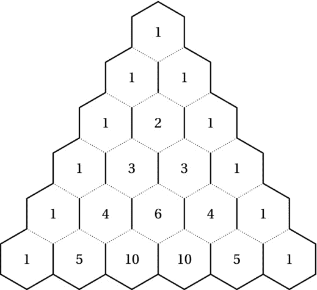
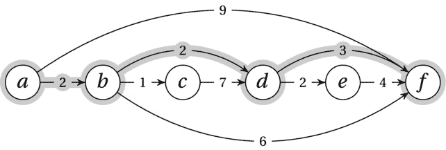
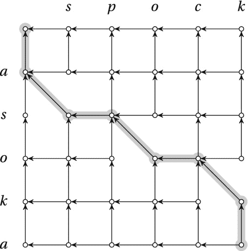

# 八、纠结的依赖和记忆

***两次*** *，adv .一次过于频繁。*

——比尔斯，A·，*魔鬼的字典*

你们中的许多人可能知道 1957 年是编程语言的诞生年。对于算法学家来说，今年发生了一件可能更有意义的事情:理查德·贝尔曼出版了他的开创性著作*动态编程*。虽然贝尔曼的书本质上主要是数学的，根本不是真正针对程序员的(考虑到时间，也许可以理解)，但他的技术背后的核心思想为许多非常强大的算法奠定了基础，它们形成了任何算法设计者都需要掌握的坚实的设计方法。

术语*动态编程*(或者简称为 DP)对于新手来说可能有点混乱。这两个词的用法与大多数人想象的不同。*这里的编程*指的是做出一系列选择(如“线性编程”)，因此与这个术语在电视上的用法比在编写计算机程序上更为相似。*动态*仅仅意味着事物会随着时间而变化——在这种情况下，每个选择都取决于前一个选择。换句话说，这种“动态主义”与您将要编写的程序没有什么关系，只是对问题类的描述。用贝尔曼自己的话说，“我认为动态编程是一个好名字。这是连国会议员都不会反对的事情。所以我把它当成了我活动的保护伞。” [<sup>2</sup>](#Fn2)

当应用于算法设计时，DP 的核心技术是缓存。你像以前一样递归地/归纳地分解你的问题——但是你允许子问题之间的重叠。这意味着一个简单的递归解决方案可以很容易地达到每个基本情况的指数次数；然而，通过缓存这些结果，这种指数级的浪费可以被削减掉，并且结果通常是令人印象深刻的高效算法*和对问题更深入的洞察*。

通常，DP 算法颠倒递归公式，使其迭代并逐步填充一些数据结构(如多维数组)。另一种选择——我认为特别适合 Python 等高级语言——是直接实现递归公式，但缓存返回值。如果使用相同的参数进行多次调用，结果将直接从缓存中返回。这被称为*记忆化*。

 **注意**尽管我认为记忆化使 DP 的基本原理变得清晰，但我在整章中始终如一地重写迭代程序的记忆化版本。虽然记忆化是很好的第一步，可以让您获得更多的洞察力和原型解决方案，但是有些因素(例如有限的堆栈深度和函数调用开销)在某些情况下可能会使迭代解决方案更可取。

DP 的基本思想非常简单，但是需要一点时间来适应。根据另一位这方面的权威埃里克·v·德纳多的说法，“大多数初学者觉得它们都很奇怪，很陌生。”我会尽最大努力坚持核心思想，不迷失在形式主义中。此外，通过将重点放在递归分解和记忆化上，而不是迭代 DP 上，我希望到目前为止我们在本书中所做的所有工作的联系应该非常清楚。

在进入本章之前，这里有一个小难题:假设你有一个数字序列，你想找到它的*最长的递增*(或者，更确切地说是*非递减* ) 子序列——或者其中的一个，如果有更多的话。子序列由按原始顺序排列的元素子集组成。因此，例如，在序列`[3, 1, 0, 2, 4]`中，一个解将是`[1, 2, 4]`。在[清单 8-1](#list1) 中，你可以看到这个问题的一个相当紧凑的解决方案。它使用高效的内置函数来完成工作，比如来自`itertools`和`sorted`的`combinations`，所以开销应该很低。然而，该算法是一个简单的强力解决方案:生成每个子序列，并逐个检查它们是否已经排序。在最坏的情况下，这里的运行时间显然是指数级的。

写一个强力解决方案对理解问题是有用的，甚至可能有助于获得一些更好算法的想法；如果你能找到几种改进的方法，我不会感到惊讶。然而，实质性的改进可能有点困难。比如，你能找到一个二次算法吗(有点挑战性)？对数线性的呢(相当难)？一会儿我会告诉你怎么做。

[***清单 8-1***](#_list1) 。最长增长子序列问题的一个简单解法

```py
from itertools import combinations

def naive_lis(seq):
    for length in range(len(seq), 0, -1):       # n, n-1, ... , 1
        for sub in combinations(seq, length):   # Subsequences of given length
            if list(sub) == sorted(sub):        # An increasing subsequence?
                return sub                      # Return it!
```

不要重复你自己

你可能听说过干原则:不要重复自己。它主要用于你的*代码*，意思是你应该避免多次编写相同(或几乎相同)的代码，依靠各种形式的抽象来避免剪切粘贴编码。这当然是编程最重要的基本原则之一，但这不是我在这里谈论的内容。本章的基本思想是避免你的*算法*重复出现。这个原理非常简单，甚至很容易实现(至少在 Python 中是这样)，但是随着我们的进展，您将会看到这里的魔力非常深刻。

但是让我们从几个经典开始:斐波那契数和帕斯卡三角。你可能以前遇到过这些，但是“每个人”都使用它们的原因是它们很有教育意义。不要害怕——我将在这里对解决方案进行扭曲，我希望这对大多数人来说是新的。

Fibonacci 数列被递归地定义为从两个 1 开始，随后的每一个数都是前两个数的和。这很容易实现为一个 Python 函数 [<sup>3</sup>](#Fn3) :

```py
>>> def fib(i):
...     if i < 2: return 1
...     return fib(i-1) + fib(i-2)
```

让我们试一试:

```py
>>> fib(10)
89
```

似乎是正确的。让我们大胆一点:

```py
>>> fib(100)
```

啊哦。好像挂了。显然出了问题。我将会给你一个解决方案，对于这个特殊的问题来说，这个解决方案绝对是多余的，但是实际上你可以用它来解决本章中的所有问题。它是清单 8-2 中[的简洁的小`memo`函数。这个实现使用嵌套的作用域来给包装的函数提供内存——如果你愿意，你可以很容易地使用带有`cache`和`func`属性的类来代替。](#list2)

 **注意**在 Python 标准库的`functools`模块中其实有一个等价的 decorator，叫做`lru_cache`(从 Python 3.2 开始可用，或者在 Python 2.7 [<sup> 4 </sup>](#Fn4) 的`functools32`包中)。如果将它的`maxsize`参数设置为`None`，它将作为一个完整的记忆装饰器工作。它还提供了一个`cache_clear`方法，您可以在算法的两次使用之间调用它。

[***清单 8-2***](#_list2) 。纪念装饰家

```py
from functools import wraps

def memo(func):
    cache = {}                                  # Stored subproblem solutions
    @wraps(func)                                # Make wrap look like func
    def wrap(*args):                            # The memoized wrapper
        if args not in cache:                   # Not already computed?
            cache[args] = func(*args)           # Compute & cache the solution
        return cache[args]                      # Return the cached solution
    return wrap                                 # Return the wrapper
```

在进入`memo`实际做什么之前，让我们试着使用它:

```py
>>> fib = memo(fib)
>>> fib(100)
573147844013817084101
```

嘿，成功了！但是……为什么呢？

一个*记忆的*函数 [<sup>5</sup>](#Fn5) 的想法是缓存它的返回值。如果您用相同的参数再次调用它，它将简单地返回缓存的值。您当然可以将这种缓存逻辑放在您的函数中，但是`memo`函数是一个更可重用的解决方案。它甚至被设计成用作*装饰器* [<sup>6</sup>](#Fn6) :

```py
>>> @memo
... def fib(i):
...     if i < 2: return 1
...     return fib(i-1) + fib(i-2)
...
>>> fib(100)
573147844013817084101
```

正如你所看到的，简单地用`@memo`标记`fib`就可以大大减少*的运行时间*。我仍然没有真正解释如何或为什么。

事情是，斐波纳契数列的递归公式有两个子问题，它有点像*看起来*像一个分治的事情。主要区别在于子问题有*纠缠不清的依赖关系*。或者，换句话说，我们面临和*重叠的子问题*。这在斐波纳契数的这个相当愚蠢的相对关系中可能更加清楚:2 的幂的递归公式:

```py
>>> def two_pow(i):
...     if i == 0: return 1
...     return two_pow(i-1) + two_pow(i-1)
...
>>> two_pow(10)
1024
>>> two_pow(100)
```

还是很恐怖。试试加`@memo`，瞬间得到答案。*或*，你可以尝试做如下的改变，这实际上相当于*的*:

```py
>>> def two_pow(i):
...     if i == 0: return 1
...     return 2*two_pow(i-1)
...
>>> print(two_pow(10))
1024
>>> print(two_pow(100))
1267650600228229401496703205376
```

我已经将递归调用的数量从两个减少到一个，从指数运行时间减少到线性运行时间(分别对应于递归 3 和 1，来自[表 3-1](03.html#Tab1) )。神奇的是，这相当于记忆化版本的功能。第一个递归调用将正常执行，一直到底部(`i == 0`)。然而，在此之后的任何调用都将直接进入缓存，只给出恒定量的额外工作。[图 8-1](#Fig1) 说明了不同之处。如你所见，当多个层次上存在重叠的子问题(即相同数量的节点)时，冗余计算会迅速变成指数级。


[图 8-1](#_Fig1) 。递归树显示记忆化的影响。节点标签是子问题参数

我们来解决一个稍微有用一点的问题 [<sup>7</sup>](#Fn7) :计算二项式系数(见[第三章](03.html))。 *C* ( *n* ， *k* )的组合意义是你可以从一组大小为 *n* 的集合中得到的 *k* 大小的子集的个数。第一步，几乎总是，是寻找某种形式的简化或递归分解。在这种情况下，我们可以使用一个你在使用动态编程 [<sup>8</sup>](#Fn8) 时会多次看到的想法:我们通过*以某个元素是否被包含*为条件来分解问题。也就是说，如果元素*包含在*中，我们得到一个递归调用，如果元素*不包含在*中，我们得到另一个递归调用。(你知道如何用这种方式解读`two_pow`吗？参见练习 8-2。)

为了做到这一点，我们通常认为元素是有序的，因此对 *C* ( *n* ， *k* )的单个评估只会担心是否应该包括元素编号 *n* 。如果*包含在*中，我们就要统计剩余 *n* -1 个元素的 *k* -1 个大小的子集，简单来说就是 *C* ( *n* -1， *k* -1)。如果*不包括*，我们就必须寻找大小为 *k* 或 *C* ( *n* -1， *k* )的子集。换句话说:


此外，我们还有以下基本情况: *C* ( *n* ，0) = 1 用于单个空集， *C* (0， *k* ) = 0， *k* > 0 用于空集的非空集。

这种递归公式对应于通常被称为“T2”的帕斯卡三角(T3)(以其发现者之一布莱士·帕斯卡的名字命名)，尽管它是由伟大的中国数学家朱世杰在 1303 年首次发表的，他声称它是在第二个千年早期被发现的。[图 8-2](#Fig2) 展示了如何将二项式系数放置在一个三角形图案中，使得每个数字都是上面两个数字的和。这意味着*行*(从零开始计数)对应于 *n* ，而*列*(该行左边从零开始计数的单元格编号)对应于 *k* 。例如，值 6 对应于 *C* (4，2)，可以计算为 *C* (3，1) + *C* (3，2) = 3 + 3 = 6。



[图 8-2](#_Fig2) 。帕斯卡三角形

解释该模式的另一种方式(如图所示)是*路径计数*。如果你只向下走，越过虚线，从最上面的单元格到其他每个单元格，有多少条路径？这将我们引向相同的循环——我们可以从上面左边的单元格或者从上面右边的单元格。因此，路径的数量是两者之和。这意味着，如果你在向下的路上随机选择左/右，这些数字与通过它们的*概率*成正比。这正是在日本游戏弹球或 Plinko 中发生的事情*价格合适*。在那里，一个球从顶部落下，落在一些规则网格(例如图 8-2 中的六边形网格的交叉点)中的球钉之间。我将在下一节回到这个路径计数——它实际上比现在看起来更重要。

*C* ( *n* ， *k* )的代码很琐碎:

```py
>>> @memo
>>> def C(n,k):
...     if k == 0: return 1
...     if n == 0: return 0
...     return C(n-1,k-1) + C(n-1,k)
>>> C(4,2)
6
>>> C(10,7)
120
>>> C(100,50)
100891344545564193334812497256
```

不过，你应该在有和没有`@memo`的情况下都尝试一下，让自己相信这两个版本之间的巨大差异。通常，我们将缓存与一些常数因子加速联系起来，但这完全是另一个大概。对于我们将要考虑的大多数问题，记忆化意味着指数和多项式运行时间的不同。

 **注意**本章中的一些记忆算法(特别是背包问题的算法，以及本节中的算法)是*伪多项式*，因为我们得到的多项式运行时间是输入中的*数*之一的函数，而不仅仅是它的*大小*。请记住，这些数字的范围与其编码大小(即用于编码的位数)呈指数关系。

事实上，在大多数动态编程的演示中，没有使用记忆函数。递归分解是算法设计的一个重要步骤，但它通常被视为一个数学工具，而实际实现是“颠倒的”——一个迭代版本。正如你所看到的，有了像`@memo` decorator 这样的简单帮助，记忆化的解决方案可以变得非常简单，我认为你不应该回避它们。它们将帮助你摆脱讨厌的指数爆炸，而不会妨碍你漂亮的递归设计。

然而，正如之前所讨论的(在[第四章](04.html)，你可能有时想要重写你的代码以使它迭代。这可以使它更快，并且避免在递归深度过大时耗尽堆栈。还有另一个原因:迭代版本通常基于特殊构造的缓存，而不是我的`@memo`中使用的通用“参数元组键化的字典”。这意味着您有时可以使用更有效的结构，比如 NumPy 的多维数组，可能与 Cython 结合使用(参见附录 A)，或者甚至只是嵌套列表。这种定制的缓存设计使得在更低级的语言中使用 DP 成为可能，而像我们的`@memo`装饰器这样的通用抽象解决方案通常是不可行的。请注意，尽管这两种技术经常一起使用，但是您当然可以自由地使用带有更通用缓存的迭代解决方案，或者为您的子问题解决方案使用带有定制结构的递归解决方案。

让我们把算法反过来，直接填写帕斯卡三角形。为了简单起见，我将使用一个`defaultdict`作为缓存；例如，可以随意使用嵌套列表。(另请参见练习 8-4。)

```py
>>> from collections import defaultdict
>>> n, k = 10, 7
>>> C = defaultdict(int)
>>> for row in range(n+1):
...     C[row,0] = 1
...     for col in range(1,k+1):
...         C[row,col] = C[row-1,col-1] + C[row-1,col]
...
>>> C[n,k]
120
```

基本上同样的事情正在发生。主要的区别是，我们需要找出缓存中哪些单元格需要填充，我们需要找到一个安全的顺序来完成它，这样当我们将要计算`C[row,col]`时，单元格`C[row-1,col-1]`和`C[row-1,col]`已经被计算了。有了记忆化的函数，我们就不用担心这两个问题:它会递归地计算任何需要的东西。

 **提示**可视化带有一两个子问题参数的动态规划算法(比如这里的 *n* 和 *k* )的一个有用方法是使用一个(真实的或想象的)电子表格。例如，尝试在电子表格中计算二项式系数，方法是用 1 填充第一列，用 0 填充第一行的其余部分。将公式=A1+B1 放入单元格 B2，并将其复制到其余单元格。

有向无环图中的最短路径

动态规划的核心是顺序决策问题的思想。你做的每一个选择都会导致一个新的局面，你需要找到让你达到你想要的局面的最佳选择顺序。这类似于贪婪算法的工作方式——只是它们依赖于哪个选择现在看起来最好*，而一般来说，你必须不那么短视，并考虑未来的影响。*

 *典型的顺序决策问题是在有向无环图中找到从一个节点到另一个节点的路径。我们将决策过程的可能状态表示为单个节点。外边缘代表我们在每种状态下可能做出的选择。边是有权重的，找到一组最优选择就相当于找到一条最短路径。[图 8-3](#Fig3) 给出了一个 DAG 的例子，其中从节点 *a* 到节点 *f* 的最短路径被突出显示。我们应该如何着手寻找这条道路呢？



[图 8-3](#_Fig3) 。拓扑排序的有向无环图。边标有权重，从 a 到 f 的最短路径已经突出显示

应该清楚这是一个连续的决策过程。你从节点 *a* 开始，你可以选择沿着边到 *b* 或者沿着边到 *f* 。一方面，edge to *b* 看起来很有希望，因为它太便宜了，而 one to *f* 很诱人，因为它直奔目标。然而，我们不能采用这样简单的策略。例如，已经构建了该图，以便沿着我们访问的每个节点的最短边，我们将沿着最长的*路径。*

和前面几章一样，我们需要归纳思考。让我们假设我们已经*知道*我们可以移动到的所有节点的答案。假设从一个节点 *v* 到我们的终点节点的距离是 *d* ( *v* )。设 edge ( *u* ， *v* )的边缘权重为 *w* ( *u* ， *v* )。然后，如果我们在节点 *u* 中，我们已经(通过归纳假设)知道了每个邻居 *v* 的 *d* ( *v* )，所以我们只需要沿着边到邻居 *v* ，这最小化了表达式 *w* ( *u* ，*v*+*d*(【T36 换句话说，我们最小化第一步和从那里开始的最短路径的总和。

当然，我们并不真的*知道*所有邻居的 *d* ( *v* )的值，但是对于任何电感设计来说，它会通过递归的魔力自行处理。唯一的问题是重叠的子问题。例如，在[图 8-3](#Fig3) 中，寻找从 *b* 到 *f* 的距离需要寻找从例如 *d* 到 *f* 的最短路径。但是找到从 *c* 到 *f* 的最短路径也是如此。我们的情况与斐波那契数列、`two_pow`或帕斯卡三角形完全相同。如果我们直接实现递归求解，一些子问题将被求解指数倍。而对于那些问题，记忆化的魔力去除了所有冗余，我们最终得到了一个*线性时间算法*(也就是说，对于 *n* 节点和 *m* 边，运行时间为θ(*n*+*m*)。

在清单 8-3 的[中可以找到一个直接的实现(使用类似边权重函数的 dicts 表示的 dicts)。如果您从代码中删除`@memo`,您最终会得到一个指数算法(对于相对较小的几乎没有边的图来说，它可能仍然工作得很好)。](#list3)

[***清单 8-3***](#_list3) 。递归、记忆的 DAG 最短路径

```py
def rec_dag_sp(W, s, t):                        # Shortest path from s to t
    @memo                                       # Memoize f
    def d(u):                                   # Distance from u to t
        if u == t: return 0                     # We're there!
        return min(W[u][v]+d(v) for v in W[u])  # Best of every first step
    return d(s)                                 # Apply f to actual start node
```

在我看来，[清单 8-3](#list3) 中的实现相当优雅。它直接表达了算法的归纳思想，同时抽象出记忆。然而，这不是表示该算法的经典方式。像在许多其他 DP 算法中一样，这里通常做的是将算法“颠倒”并使其迭代。

DAG 最短路径算法的迭代版本通过一步一步地传播部分解决方案来工作，使用在第 4 章的[中介绍的松弛思想。](04.html) [<sup>9</sup>](#Fn9) 由于我们表示图的方式(也就是说，我们通常通过出边而不是入边来访问节点)，它可以有助于反转归纳设计:与其考虑我们想要*去哪里*，不如考虑我们想要*来自哪里*。然后，我们希望确保一旦到达节点 *v* ，我们已经从所有 *v* 的前任传播了正确答案。也就是说，我们已经放松了它的内边缘。这就提出了一个问题——我们如何确定我们已经做到了？

知道的方法是按拓扑排列节点，如图 8-3 中的[所示。关于*递归*版本(在](#Fig3)[清单 8-3](#list3) 中)的巧妙之处在于不需要单独的拓扑排序。递归隐式执行 DFS，并按照拓扑排序顺序自动执行所有更新*。但是，对于我们的迭代解决方案，我们需要执行单独的拓扑排序。如果你想完全摆脱递归，你可以使用清单 4-10 中的`topsort`；如果你不介意，你可以使用清单 5-7 中的`dfs_topsort`(尽管你已经非常接近记忆化递归解决方案)。清单 8-4 中的函数`dag_sp`向你展示了这个更常见的迭代解决方案。*

 *[***清单 8-4***](#_list4) 。DAG 最短路径

```py
def dag_sp(W, s, t):                            # Shortest path from s to t
    d = {u:float('inf') for u in W}             # Distance estimates
    d[s] = 0                                    # Start node: Zero distance
    for u in topsort(W):                        # In top-sorted order...
        if u == t: break                        # Have we arrived?
        for v in W[u]:                          # For each out-edge ...
            d[v] = min(d[v], d[u] + W[u][v])    # Relax the edge
    return d[t]                                 # Distance to t (from s)
```

迭代算法的思想是，只要我们已经从你的每一个可能的*前任*(也就是那些在拓扑排序中较早的)中放松了每一条边*出*，我们必然已经放松了中的所有*-边到*你*。利用这一点，我们可以归纳地表明，当我们在外`for`循环中到达它时，每个节点接收到正确的距离估计。这意味着一旦我们到达目标节点，我们将找到正确的距离。*

找到与这个距离相对应的实际路径也并不难(见练习 8-5)。你甚至可以从开始节点构建整个最短路径树，就像第五章中的遍历树一样。(但是，您必须删除`break`语句，并一直进行到最后。)注意，一些节点，包括那些在拓扑排序顺序中早于开始节点的节点，可能根本不能到达，并且将保持它们的无限距离。

 **注意**在这一章的大部分时间里，我专注于寻找一个解决方案的最优*值*，而不需要额外的簿记来重建产生那个值的解决方案。这种方法使演示更简单，但实际上可能不是您想要的。一些练习要求你扩展算法以找到实际的解；你可以在背包问题的最后找到一个例子。

**各种 DAG 最短路径**

虽然基本算法是相同的，但是有许多方法可以在 DAG 中找到最短路径，并且通过扩展，可以解决大多数 DP 问题。你可以递归地做，用记忆化，或者你可以迭代地做，用放松。对于递归，您可以从第一个节点开始，尝试各种“后续步骤”，然后对剩余部分进行递归，或者如果您的图形表示允许，您可以查看最后一个节点，尝试“之前的步骤”，然后对初始部分进行递归。前者通常更自然，而后者更接近迭代版本中发生的情况。

现在，如果你使用迭代版本，你也有两个选择:你可以从每个节点的中松弛出边*(按照拓扑排序的顺序)，或者你可以将所有的边*松弛到每个节点的*中。后者更明显地产生正确的结果，但是需要通过向后跟随边来访问节点。当你用一个*隐式* DAG 处理一些非图形问题时，这并不像看起来那么牵强。(例如，在本章后面讨论的最长增长子序列问题中，查看所有向后的“边”可能是一个有用的视角。)*

向外放松，称为*达到*，完全等同于你放松所有的边缘。如前所述，一旦你到达一个节点，它所有的内边都会被放松。*然而*，有了 reaching，你可以做一些递归版本中很难的事情(或者放松 in-edges):修剪。例如，如果您只对查找距离 *r* 以内的所有节点感兴趣，您可以跳过距离估计值大于 *r* 的任何节点。你仍然需要访问每一个节点，但是在放松的时候你可能会忽略很多边。不过，这不会影响渐进运行时间(练习 8-6)。

请注意，在 DAG 中查找最短的*路径与查找最长的*路径*非常相似，甚至可以计算 DAG 中两个节点之间的*路径的*数量。后一个问题正是我们之前对帕斯卡三角所做的；同样的方法也适用于任意的 DAG。不过，对于一般的图形来说，这些事情就不那么容易了。在一般的图中寻找最短的路径有点困难(事实上，[第 9 章](09.html)专门讨论了这个话题)，而寻找*最长的*路径是一个*未解决的问题*(参见[第 11 章](11.html)了解更多关于这个的信息)。*

最长增长子序列

尽管在 DAG 中寻找最短路径是典型的 DP 问题，但是您将遇到的许多 DP 问题(可能是大多数)与(显式)图没有任何关系。在这些情况下，您必须自己找出 DAG 或顺序决策过程。或者可能更容易从递归分解的角度考虑它，忽略整个 DAG 结构。在这一节中，我将遵循这两种方法来解决本章开头介绍的问题:寻找最长的非减子序列。(这个问题通常被称为“最长增长子序列”，但是我在这里允许结果中有多个相同的值。)

我们直接进行归纳，以后可以更多的用图的方式来思考。为了进行归纳(或递归分解)，我们需要定义我们的子问题——许多 DP 问题的主要挑战之一。在许多与序列相关的问题中，从前缀的角度考虑可能是有用的——我们已经弄清楚了关于前缀我们需要知道的一切，归纳步骤是为另一个元素弄清楚事情。在这种情况下，这可能意味着我们已经为每个前缀找到了最长的递增子序列，但这还不够。我们需要加强我们的归纳假设，这样我们就可以实际执行归纳步骤。相反，让我们试着找出在每个给定位置*结束于*的最长的递增子序列。

如果我们已经知道如何为第一个 *k* 位置*，*找到它，那么我们如何为位置 *k* + 1 找到它呢？一旦我们走到这一步，答案就非常简单了:我们只需查看以前的位置，并查看那些元素比当前位置小的位置。在这些序列中，我们选择位于最长子序列末尾的那个。直接递归实现会给我们带来指数级的运行时间，但是记忆化又一次摆脱了指数级的冗余，如清单 8-5 所示。再一次，我已经集中精力寻找解决方案的*长度*；扩展代码以找到实际的子序列并不难(练习 8-10)。

[***清单 8-5***](#_list5) 。最长增长子序列问题的记忆递归解法

```py
def rec_lis(seq):                               # Longest increasing subseq.
    @memo
    def L(cur):                                 # Longest ending at seq[cur]
        res = 1                                 # Length is at least 1
        for pre in range(cur):                  # Potential predecessors
            if seq[pre] <= seq[cur]:            # A valid (smaller) predec.
                res = max(res, 1 + L(pre))      # Can we improve the solution?
        return res
    return max(L(i) for i in range(len(seq)))   # The longest of them all
```

让我们也做一个迭代版本。在这种情况下，差别真的很小——很像图 4-3 中的镜像图。由于递归的工作方式，`rec_lis`将按顺序(0，1，2 …)解决每个位置的问题。在迭代版本中，我们所需要做的就是用查找来切换递归调用，并将整个事情封装在一个循环中。参见[清单 8-6](#list6) 中的实现。

[***清单 8-6***](#_list6) 。最长增长子序列问题的基本迭代解法

```py
def basic_lis(seq):
    L = [1] * len(seq)
    for cur, val in enumerate(seq):
        for pre in range(cur):
            if seq[pre] <= val:
                L[cur] = max(L[cur], 1 + L[pre])
    return max(L)
```

我希望你能看到递归版本的相似之处。在这种情况下，迭代版本可能和递归版本一样容易理解。

现在，把它想象成一个 DAG:每个序列元素都是一个节点，并且从每个元素到后面每个更大的元素都有一条隐含的边——也就是说，到一个递增子序列中允许的后继元素(见[图 8-4](#Fig4) )。*瞧啊*！我们现在正在解决 DAG 最长路径问题。这在`basic_lis`函数中非常清楚。我们没有显式表示的边，所以它必须查看每个先前的元素，看它是否是有效的前置元素，但是如果是，它只是放松 in-edge(这就是带有`max`表达式的行所做的)。我们是否可以通过在决策过程中使用这个“前一步”(即这个 in-edge 或这个有效的前任)来改进当前位置的解决方案？ [<sup>10</sup>](#Fn10)


[图 8-4](#_Fig4) 。一个数字序列和隐含的 DAG，其中每条路径是一个递增的子序列。突出显示了一个最长的递增子序列

正如你所看到的，有不止一种方法来看待大多数 DP 问题。有时你想把重点放在递归分解和归纳上；有时你宁愿尝试嗅出一些 DAG 结构；有时候，再一次，看看你面前的东西是值得的。在这种情况下，这将是序列。这个算法仍然是二次的，你可能已经注意到了，我把它叫做*基本* `_lis` …那是因为我还有另一个锦囊妙计。

该算法中的主要时间消耗是检查先前的元素，以在那些有效的前置元素中找到最佳的。你会发现在一些 DP 算法中就是这种情况——内部循环致力于线性搜索。如果是这种情况，可能值得尝试用一个二进制搜索来代替它。在这种情况下，这怎么可能一点都不明显，但是简单地知道我们在寻找什么——我们试图做什么——有时会有所帮助。我们试图做某种形式的簿记，这将让我们在寻找最佳前任时执行二分法。

一个至关重要的观点是，如果不止一个前导终止长度为 *m* 的子序列，我们使用哪一个都没关系——它们都会给我们一个最佳答案。比如说，我们想只保留其中的一个人；我们应该保留哪一个？唯一安全的选择是保留其中最小的一个，因为这不会错误地阻止任何后来的元素在其上构建。让我们归纳地说，在某一点，我们有一个端点序列`end`，其中`end[idx]`是我们看到的长度`idx+1`递增的子序列中最小的端点(我们从 0 开始索引)。因为我们是在序列上迭代，所以这些都会比我们当前的值`val`早发生。我们现在需要的是一个扩展`end`的归纳步骤，找出如何给它加上`val`。如果我们能做到这一点，在算法的最后`len(end)`会给我们最终的答案——最长递增子序列的长度。

`end`序列必然不会减少(练习 8-8)。我们想找到最大的`idx`这样的`end[idx-1] <= val`。这将为我们提供`val`所能贡献的最长序列，因此在`end[idx]`处添加`val`将会改善当前结果(如果我们需要添加的话)或者减少该位置处的当前端点值。添加之后，`end`序列仍然具有之前的属性，因此感应是安全的。好消息是——我们可以使用(超快的)`bisect`函数找到`idx`！ [<sup>11</sup>](#Fn11) 你可以在[清单 8-7](#list7) 中找到最终代码。如果你愿意，你可以去掉一些对`bisect`的调用(练习 8-9)。如果你想提取实际的序列，而不仅仅是长度，你需要增加一些额外的簿记(练习 8-10)。

[***清单 8-7***](#_list7) 。最长增长子序列

```py
from bisect import bisect

def lis(seq):                                   # Longest increasing subseq.
    end = []                                    # End-values for all lengths
    for val in seq:                             # Try every value, in order
        idx = bisect(end, val)                  # Can we build on an end val?
        if idx == len(end): end.append(val)     # Longest seq. extended
        else: end[idx] = val                    # Prev. endpoint reduced
    return len(end)                             # The longest we found
```

这就是最长的增长子序列问题。在我们深入一些众所周知的动态编程的例子之前，先回顾一下我们到目前为止所看到的内容。用 DP 解题的时候，还是用递归分解或者归纳思维。你仍然需要证明一个最优或正确的全局解依赖于你的子问题的最优或正确的解(最优子结构，或最优性原理)。与分而治之的主要区别在于，你可以有重叠的子问题。事实上，这种重叠是发展伙伴关系存在的理由。你甚至可以说你应该*寻找*一个有重叠的分解*，因为消除重叠(有记忆)会给你一个有效的解决方案。除了“带重叠的递归分解”的观点之外，您通常可以将 DP 问题视为顺序决策问题，或者视为在 DAG 中寻找特殊(例如，最短或最长)路径。这些视角都是等价的，但是可以不同的拟合各种问题。*

序列比较

比较序列的相似性是许多分子生物学和生物信息学中的一个关键问题，其中涉及的序列通常是 DNA、RNA 或蛋白质序列。除了其他用途之外，它还被用来构建系统发育(即进化)树——哪个物种是哪个物种的后代？它还可以用来寻找患有某种疾病的人或对某种特定药物敏感的人共有的基因。不同种类的序列或字符串比较也与许多种类的信息检索相关。例如，你可能搜索“空间之外的颜色”，并期望找到“空间之外的颜色”——为了实现这一点，你使用的搜索技术需要以某种方式知道这两个序列足够相似。

有几种比较序列的方法，其中许多比人们想象的更相似。例如，考虑寻找两个序列之间的*最长公共子序列* (LCS)以及寻找它们之间的*编辑距离*的问题。LCS 问题类似于最长递增子序列问题——除了我们不再寻找*递增*子序列。我们正在寻找也出现在第二个序列*中的子序列*。(比如*星际行者* [<sup>12</sup>](#Fn12) 和*星巴克*的 LCS 就是*斯塔克*。编辑距离(也称为 Levenshtein 距离)是将一个序列变成另一个序列所需的最小编辑操作(插入、删除或替换)次数。(例如，*企业*与*次棱镜*的编辑距离为 4。)如果我们不允许替换，这两者实际上是等价的。最长的公共子序列是当以尽可能少的编辑将一个序列编辑到另一个序列中时*保持不变*的部分。在任一序列中，每隔一个字符必须插入或删除。因此，如果序列的长度是 *m* 和 *n* 并且最长公共子序列的长度是 *k* ，则没有替换的编辑距离是 *m+n-* 2 *k* 。

这里我将重点讨论 LCS，把编辑距离留给一个练习(练习 8-11)。同样，和以前一样，我将把自己限制在解决方案的成本上(即 LCS 的长度)。按照标准模式增加一些额外的簿记，让你找到底层结构(练习 8-12)。对于一些相关的序列比较问题，请参见本章末尾附近的“如果你好奇…”一节。

尽管如果你没有接触过本书中的任何技术，设计一个多项式算法来寻找最长的公共子序列会非常困难，但是使用我在本章中讨论的工具却非常简单。至于所有的 DP 问题，关键是设计一组我们可以相互关联的子问题(也就是一个纠缠依赖的递归分解)。将子问题集合想象成由一组索引等参数化的通常会有所帮助。这些就是我们的归纳变量。 [<sup>13</sup>](#Fn13) 在这种情况下，我们可以使用序列的前缀*(就像我们在最长递增子序列问题中使用单个序列的前缀一样)。任何一对前缀(由它们的长度标识)都会产生一个子问题，我们希望在一个子问题图(即依赖 DAG)中把它们联系起来。*

 *假设我们的序列是 *a* 和 *b* 。如同一般的归纳思维一样，我们从两个任意的前缀开始，通过它们的长度 *i* 和 *j* 来识别。我们需要做的是将这个问题的解决方案与其他一些问题联系起来，其中至少有一个前缀更小。直觉上，我们想要从任一序列的末尾临时砍掉一些元素，通过我们的归纳假设解决由此产生的问题，然后将这些元素粘回去。如果我们沿着任一序列坚持弱归纳(减一)，我们会得到三种情况:从 *a* 、从 *b* 或从两者中截取最后一个元素。如果我们只从一个序列中删除一个元素，它将被排除在 LCS 之外。然而，如果我们从两个中去掉最后一个*，会发生什么取决于这两个元素是否等于*。如果是的话，我们可以用它们来扩展 LCS 一个！(如果不是，他们对我们就没用了。)

事实上，这给了我们整个算法(除了几个细节)。我们可以将 *a* 和 *b* 的 LCS 长度表示为前缀长度 *i* 和 *j* 的函数，如下所示:


换句话说，如果任一前缀为空，则 LCS 为空。如果最后的元素相等，则该元素是 LCS 的最后一个元素，我们递归地找到剩余部分(即前面的部分)的长度。如果最后的元素*不等于*，我们只有两个选择:要么切断 *a* 要么切断 *b* 的元素。因为可以自由选择，所以取两个结果中最好的。清单 8-8 给出了这个递归解决方案的一个简单的记忆实现。

[***清单 8-8***](#_list8) 。LCS 问题的记忆递归解法

```py
def rec_lcs(a,b):                               # Longest common subsequence
    @memo                                       # L is memoized
    def L(i,j):                                 # Prefixes a[:i] and b[:j]
        if min(i,j) < 0: return 0               # One prefix is empty
        if a[i] == b[j]: return 1 + L(i-1,j-1)  # Match! Move diagonally
        return max(L(i-1,j), L(i,j-1))          # Chop off either a[i] or b[j]
    return L(len(a)-1,len(b)-1)                 # Run L on entire sequences
```

这种递归分解可以很容易地被看作是一个动态决策过程(我们是从第一个序列、第二个序列还是两者中砍掉一个元素？)，它可以表示为一个 DAG(见[图 8-5](#Fig5) )。我们从由完整序列表示的节点开始，并尝试找到返回到表示两个空前缀的节点的最长路径。重要的是要清楚这里的“最长路径”是什么，也就是说，边权重是多少。*我们可以扩展 LCS(这是我们的目标)的唯一时间*是当我们砍掉两个相同的元素时，当节点被放置在网格中时，由对角线的 DAG 边表示，如图[图 8-5](#Fig5) 。这些边的权重为 1，而其他边的权重为零。



[图 8-5](#_Fig5) 。LCS 问题的基本有向无环图，其中水平边和垂直边的成本为零。从一个角到另一个角的最长路径(即对角线最多的路径)会高亮显示，其中对角线代表 LCS

出于通常的原因，您可能想要反转解决方案并使其迭代。清单 8-9 给出了一个版本，通过只保存 DP 矩阵的当前行和前一行来节省内存。(不过，你可以多存一点；参见练习 8-13。)注意`cur[i-1]`对应递归版本中的`L(i-1,j)`，而`pre[i]`和`pre[i-1]`分别对应`L(i,j-1)`和`L(i-1,j-1)`。

[***清单 8-9***](#_list9) 。最长公共子序列(LCS)的迭代解法

```py
def lcs(a,b):
    n, m = len(a), len(b)
    pre, cur = [0]*(n+1), [0]*(n+1)             # Previous/current row
    for j in range(1,m+1):                      # Iterate over b
        pre, cur = cur, pre                     # Keep prev., overwrite cur.
        for i in range(1,n+1):                  # Iterate over a
            if a[i-1] == b[j-1]:                # Last elts. of pref. equal?
                cur[i] = pre[i-1] + 1           # L(i,j) = L(i-1,j-1) + 1
            else:                               # Otherwise...
                cur[i] = max(pre[i], cur[i-1])  # max(L(i,j-1),L(i-1,j))
    return cur[n]                               # L(n,m)
```

背包反击

在[第七章](07.html)中，我承诺给你一个整数背包问题的解决方案，有有界和无界两个版本。是时候兑现这个承诺了。

回想一下，背包问题涉及一组对象，每个对象都有一个*权重*和一个*值*。我们的背包还有一个*容量*。我们想在背包里装满物品，这样(1)总重量小于或等于容量，并且(2)总价值最大化。假设物体 *i* 有重量 *w* [ *i* ]和值 *v* [ *i* ]。让我们先做无界的——这稍微简单一点。这意味着每个对象都可以使用任意多次。

我希望你开始从本章的例子中看到一种模式。这个问题正好符合这个模式:我们需要以某种方式定义子问题，将它们递归地相互关联，然后确保每个子问题只计算一次(通过使用记忆，隐式或显式)。问题的“无界性”意味着使用常见的“in 或 out”思想(尽管我们将在有界版本中使用它)来限制我们可以使用的对象有点困难。相反，我们可以简单地用背包容量参数化我们的子问题，也就是说，使用归纳法。

如果我们说 *m* ( *r* )是我们用一个(剩余)容量 *r* 所能得到的最大值，那么 *r* 的每一个值都给了我们一个子问题。递归分解基于使用或不使用最后一个单位的能力。如果我们*不用*，我们有*m*(*r*)=*m*(*r*-1)。如果我们真的使用它，我们必须选择正确的对象来使用。如果我们选择对象 *i* (假设它将适合剩余容量)，我们将有*m*(*r*)=*v*[*I*]+*m*(*r*-*w*[*I*)，因为我们将添加 *i* ，的值

我们可以(再一次)把这看作一个决策过程:我们可以选择是否使用最后一个容量单位，如果我们确实使用了它，我们可以选择添加哪个对象。因为我们可以选择任何我们想要的方式，我们只是在所有的可能性中取最大值。记忆化处理了递归定义中的指数冗余，如清单 8-10 所示。

[***清单 8-10***](#_list10) 。无界整数背包问题的记忆递归解法

```py
def rec_unbounded_knapsack(w, v, c):            # Weights, values and capacity
    @memo                                       # m is memoized
    def m(r):                                   # Max val. w/remaining cap. r
        if r == 0: return 0                     # No capacity? No value
        val = m(r-1)                            # Ignore the last cap. unit?
        for i, wi in enumerate(w):              # Try every object
            if wi > r: continue                 # Too heavy? Ignore it
            val = max(val, v[i] + m(r-wi))      # Add value, remove weight
        return val                              # Max over all last objects
    return m(c)                                 # Full capacity available
```

这里的运行时间取决于容量和对象的数量。每个记忆调用`m(r)`只计算一次，这意味着对于容量 *c* ，我们有θ(*c*)个调用。每个调用都经过所有的 *n* 对象，所以得到的运行时间是θ(*cn*)。(这可能会在接下来的等价迭代版本中更容易看到。另请参见练习 8-14，了解提高运行时间常数的方法。)注意，这是*而不是*多项式运行时间，因为 *c* 可以随着实际问题大小(位数)呈指数增长。如前所述，这种运行时间被称为*伪多项式*，对于合理大小的容量，该解决方案实际上非常有效。

清单 8-11 显示了该算法的迭代版本。正如您所看到的，这两个实现实际上是相同的，除了递归被替换为一个`for`循环，缓存现在是一个列表。 [<sup>14</sup>](#Fn14)

[***清单 8-11***](#_list11) 。无界整数背包问题的迭代解法

```py
def unbounded_knapsack(w, v, c):
    m = [0]
    for r in range(1,c+1):
        val = m[r-1]
        for i, wi in enumerate(w):
            if wi > r: continue
            val = max(val, v[i] + m[r-wi])
        m.append(val)
    return m[c]
```

现在让我们来看看可能更著名的背包问题——0-1 背包问题。在这里，每个对象最多只能使用一次。(您可以很容易地将它扩展到多次，要么稍微调整一下算法，要么在问题实例中多次包含同一个对象。)这是一个在实际情况中经常出现的问题，在[第 7 章](07.html)中讨论过。如果你玩过有库存系统的电脑游戏，我肯定你知道这有多令人沮丧。你刚刚杀死了一些强大的怪物，并找到了一堆战利品。你试着捡起来，但是发现你的负担太重了。现在怎么办？哪些物品你应该保留，哪些应该留下？

这个版本的问题和无界的很像。主要的区别是，我们现在为子问题添加了另一个参数:除了限制容量，我们还添加了“in 或 out”的概念，并限制了允许使用的对象数量。或者，更确切地说，我们指定哪个对象(按顺序)是“当前正在考虑的”，并且我们使用强归纳，假设所有子问题，其中我们或者考虑较早的对象，具有较低的容量，或者两者都可以递归地解决。

现在我们需要将这些子问题联系起来，并从子解决方案中构建一个解决方案。设 *m* ( *k* ， *r* )是我们用前 *k* 个对象和剩余容量 *r* 所能拥有的最大值。那么，很明显，如果 *k* = 0 或者 *r* = 0，我们就会得到 *m* ( *k* ， *r* ) = 0。对于其他情况，我们必须再次审视我们的决定是什么。对于这个问题，决策比无界问题简单；我们只需要考虑是否要包含最后一个对象， *i* = *k* -1。如果我们*没有*，我们就会有 *m* ( *k* ，*r*)=*m*(*k*-1， *r* )。实际上，我们只是“继承”了尚未考虑 *i* 的情况下的最优值。注意，如果*w*[*I*>*r*，我们别无选择，只能放下物体。

但是，如果对象足够小，我们可以包括它，这意味着 *m* ( *k* ，*r*)=*v*[*I*]+*m*(*k*-1，*r*-*w*[*I*)，这与无界情况非常相似，除了额外的情况因为我们可以自由选择是否包含对象，所以我们尝试了两个选项，并使用两个结果值中的最大值。同样，记忆消除了指数冗余，我们最终得到类似于清单 8-12 中的代码。

[***清单 8-12***](#_list12) 。0-1 背包问题的记忆递归解法

```py
def rec_knapsack(w, v, c):                      # Weights, values and capacity
    @memo                                       # m is memoized
    def m(k, r):                                # Max val., k objs and cap r
        if k == 0 or r == 0: return 0           # No objects/no capacity
        i = k-1                                 # Object under consideration
        drop = m(k-1, r)                        # What if we drop the object?
        if w[i] > r: return drop                # Too heavy: Must drop it
        return max(drop, v[i] + m(k-1, r-w[i])) # Include it? Max of in/out
    return m(len(w), c)                         # All objects, all capacity
```

在像 LCS 这样的问题中，简单地寻找一个解的值可能是有用的。对 LCS 来说，最长公共子序列的长度给了我们两个序列有多相似的概念。然而，在许多情况下，您希望找到产生最佳成本的实际解决方案。清单 8-13 中的[迭代背包版本构造了一个额外的表，称为`P`，因为它的工作有点像遍历(](#list13)[第 5 章](05.html))和最短路径算法([第 9 章](09.html))中使用的前任表。0-1 背包解的两个版本与无界解具有相同的(伪多项式)运行时间，即θ(*cn*)。

[***清单 8-13***](#_list13) 。0-1 背包问题的迭代解法

```py
def knapsack(w, v, c):                          # Returns solution matrices
    n = len(w)                                  # Number of available items
    m = [[0]*(c+1) for i in range(n+1)]         # Empty max-value matrix
    P = [[False]*(c+1) for i in range(n+1)]     # Empty keep/drop matrix
    for k in range(1,n+1):                      # We can use k first objects
        i = k-1                                 # Object under consideration
        for r in range(1,c+1):                  # Every positive capacity
            m[k][r] = drop = m[k-1][r]          # By default: drop the object
            if w[i] > r: continue               # Too heavy? Ignore it
            keep = v[i] + m[k-1][r-w[i]]        # Value of keeping it
            m[k][r] = max(drop, keep)           # Best of dropping and keeping
            P[k][r] = keep > drop               # Did we keep it?
    return m, P                                 # Return full results
```

既然背包函数返回了更多的信息，我们可以用它来提取实际包含在最优解中的对象集。例如，您可以这样做:

```py
>>> m, P = knapsack(w, v, c)
>>> k, r, items = len(w), c, set()
>>> while k > 0 and r > 0:
...     i = k-1
...     if P[k][r]:
...         items.add(i)
...         r -= w[i]
...     k -= 1
```

换句话说，通过简单地保留一些关于所做选择的信息(在这种情况下，保留或删除考虑中的元素)，我们可以逐渐将自己从最终状态追溯到初始条件。在这种情况下，我从最后一个对象开始，检查`P[k][r]`看它是否包含在内。如果是，我从`r`中减去它的重量；如果不是，我就不去管`r`(因为我们仍有全部可用容量)。在这两种情况下，我都减少了`k`，因为我们已经看完了最后一个元素，现在想看看倒数第二个元素(具有更新的容量)。你可能想说服自己，这个回溯操作有一个线性的运行时间。

同样的基本思想可以用在本章的所有例子中。除了给出的核心算法(通常只计算最优的*值*，您可以跟踪每一步做出了什么选择，然后在找到最优值后返回。

二元序列分割

在结束本章之前，让我们看一下另一种典型的 DP 问题，其中一些序列以某种方式被递归划分。你可以认为这是给序列加上括号，这样我们就可以从，比如，ABCDE 到((AB)((CD)E))。这有几个应用，例如下面的:

*   *矩阵链乘法*:我们有一个矩阵序列，我们想把它们全部相乘得到一个单一的矩阵。我们不能交换它们(矩阵乘法是不可交换的)，但我们可以把括号放在我们想要的地方，这可能会影响所需的运算数量。我们的目标是找到括号(唷！)给出最低数量的操作。
*   *解析任意上下文无关语言* : [<sup>16</sup>](#Fn16) 任何上下文无关语言的语法都可以重写为*乔姆斯基范式*，其中每个产生式规则要么产生一个终结符、空字符串，要么产生一对非终结符 *A* 和 *B* 的 *AB* 。解析一个字符串基本上等同于设置括号，就像矩阵例子一样。每个带括号的基团代表一个非末端基团。
*   *最优搜索树* : 这是霍夫曼问题的一个更难的版本。目标是相同的——最小化预期的遍历深度——但是因为它是一个搜索树，我们不能改变叶子的顺序，贪婪算法不再有效。同样，我们需要的是一个括号，对应于树形结构。 [<sup>17</sup>](#Fn17)

这三个应用非常不同，但问题本质上是相同的:我们希望分层分割序列，以便每个片段包含两个其他片段，我们希望找到这样一种分区，它可以优化一些成本或值(在解析的情况下，值只是“有效”/“无效”)。递归分解就像分治算法一样工作，如图 8-6 所示。在当前间隔内选择分裂点，产生两个子间隔，这两个子间隔被递归地划分。如果我们要创造一个基于排序序列的平衡的二叉查找树，那就是全部了。使用中间的元素(或者两个中间元素中的一个，对于偶数长度的区间)作为分割点(即根)，递归地创建平衡的左右子树。


[图 8-6](#_Fig6) 。递归序列分割应用于最佳搜索树。区间中的每个根产生两个子树，对应于左右子区间的最佳划分

现在，我们将不得不加强我们的游戏，虽然，因为分裂点没有给出，就像平衡分治的例子。不，现在我们需要尝试*多个*分割点，选择最好的一个。事实上，在一般情况下，我们需要尝试*每一个可能的分裂点*。这是一个典型的 DP 问题——在某些方面就像在 Dag 中寻找最短路径一样。DAG 最短路径问题封装了 DP 的顺序决策视角；这个序列分解问题体现了“带重叠的递归分解”的观点。子问题是各种各样的区间，除非我们记住我们的递归，否则它们将被解决指数倍。还要注意，我们已经得到了最优子结构:如果我们最初在最优(或正确)点分割序列，那么两个新片段必须被最优分割，这样我们才能得到最优(正确)解。 [<sup>18</sup>](#Fn18)

作为一个具体的例子，让我们用最优搜索树。 [<sup>19</sup>](#Fn19) 正如我们在[第 7 章](07.html)中构建霍夫曼树时，每个元素都有一个*频率*，我们想要最小化一个二叉查找树的期望遍历深度(或搜索时间)。但是在这种情况下，输入是排序的，我们不能改变它的顺序。为了简单起见，让我们假设每个查询都是针对树中实际存在的一个元素。(参见练习 8-19 了解解决方法。)归纳思考，我们只需要找到正确的根节点，两个子树(在更小的区间上)就会自己搞定(见[图 8-6](#Fig6) )。再一次，为了简单起见，让我们只考虑最优成本的计算。如果您想要提取实际的树，您需要记住哪些子树根产生了最优子树成本(例如，将它存储在`root[i,j]`)。

现在我们需要弄清楚递归关系；假设我们知道子树的成本，我们如何计算给定根的成本？单个节点的贡献类似于霍夫曼树中的贡献。然而，在那里，我们只处理树叶，成本是预期的深度。对于最优搜索树，我们可以以任何节点结束。此外，为了不使根的成本为零，让我们计算一下预期访问的节点数(即预期深度+ 1)。节点 *v* 的贡献则是*p*(*v*)×(*d*(*v*)+1，其中 *p* ( *v* )是其相对频率， *d* ( *v* )是其深度，我们对所有节点求和得到总成本。(这正好是*p*(*v*)×*d*(*v*)的 1 +总和，因为 *p* ( *v* )总和为 1。)

设`e(i,j)`为区间`[i:j]`的期望搜索成本。如果我们选择`r`作为我们的根，我们可以将成本分解为`e(i,j) = e(i,r) + e(r+1,j) + something`。对`e`的两次递归调用代表了在每个子树中继续搜索的预期成本。但是，缺少的`something`是什么呢？我们必须加上`p[r]`，寻找根的概率，因为这将是它的预期成本。但是我们如何解释这两个子树的额外边呢？这些边将增加子树中每个节点的深度，这意味着除了根之外的每个节点 v 的每个概率`p[v]`都必须添加到结果中。但是，嘿——正如所讨论的，我们也将增加`p[r]`！换句话说，我们需要将区间中所有节点的概率相加。给定根`r`的一个相对简单的递归表达式可能如下:

```py
e(i,j) = e(i,r) + e(r+1,j) + sum(p[v] for v in range(i, j))
```

当然，在最终的解决方案中，我们会尝试`range(i, j)`中的所有`r`并选择最大值。尽管还有更大的改进空间:表达式的`sum`部分将对二次方数量的重叠区间求和(每个可能的`i`和`j`对应一个区间)，并且每个和具有线性运行时间。本着 DP 的精神，我们找出重叠部分:我们引入表示总和的记忆函数`s(i,j)`，如清单 8-14 所示。如您所见，`s`是在常量时间内计算的，假设递归调用已经被缓存(这意味着计算每个 sum `s(i,j)`花费的时间是常量)。代码的其余部分直接来自前面的讨论。

[***清单 8-14***](#_list14) 。期望最优搜索成本的记忆递归函数

```py
def rec_opt_tree(p):
    @memo
    def s(i,j):
        if i == j: return 0
        return s(i,j-1) + p[j-1]
    @memo
    def e(i,j):
        if i == j: return 0
        sub = min(e(i,r) + e(r+1,j) for r in range(i,j))
        return sub + s(i,j)
    return e(0,len(p))
```

总而言之，这个算法的运行时间是立方的。渐近上限很简单:有二次方数量的子问题(即区间)，我们对每个子问题内部的最佳根进行线性扫描。其实下界也是三次的(这个展示起来有点棘手)，所以运行时间是θ(*n*T2】3)。

至于以前的 DP 算法，迭代版本([清单 8-15](#list15) )在许多方面与记忆版本相似。为了以安全的(即拓扑排序的)顺序解决问题，它先解决一定长度的所有区间`k`，然后再解决更大的区间。为了简单起见，我使用了一个 dict(或者更具体地说，一个自动提供零的`defaultdict`)。你可以很容易地重写实现来使用，比方说，一个列表的列表。(不过，注意，只需要一个三角半矩阵，而不是完整的 *n* 乘 *n* 。)

[***清单 8-15***](#_list15) 。最优搜索树问题的迭代解法

```py
from collections import defaultdict

def opt_tree(p):
    n = len(p)
    s, e = defaultdict(int), defaultdict(int)
    for k in range(1,n+1):
        for i in range(n-k+1):
            j = i + k
            s[i,j] = s[i,j-1] + p[j-1]
            e[i,j] = min(e[i,r] + e[r+1,j] for r in range(i,j))
            e[i,j] += s[i,j]
    return e[0,n]
```

摘要

本章讨论一种称为动态编程(DP)的技术，当子问题的依赖关系纠缠在一起时(也就是说，我们有重叠的子问题)，直接的分治解决方案会产生指数级的运行时间。术语*动态规划*最初应用于一类顺序决策问题，但现在主要用于解决技术，其中执行某种形式的缓存，以便每个子问题只需要计算一次。实现的一种方法是直接在体现算法设计的递归分解(即归纳步骤)的递归函数中加入缓存；这叫做*记忆化*。不过，反转记忆化的递归实现，将它们变成迭代的实现，通常是有用的。在本章中使用 DP 解决的问题包括计算二项式系数、在 Dag 中寻找最短路径、寻找给定序列的最长递增子序列、寻找两个给定序列的最长公共子序列、利用有限和无限的不可分物品从背包中获得最大价值，以及构建最小化预期查找时间的二分搜索法树。

如果你好奇的话…

好奇？关于动态编程？你很幸运——有很多关于 DP 的 rad 资料。网络搜索应该会出现很多很酷的东西，比如竞争问题。如果您对语音处理或一般的隐马尔可夫模型感兴趣，您可以寻找维特比算法，它是许多种 DP 的一个很好的心理模型。在图像处理领域，可变形轮廓(也称为*蛇*)是一个很好的例子。

如果你认为序列比较听起来很酷，你可以看看 Gusfield 和 Smyth 的书(参见参考资料)。关于动态时间弯曲和加权编辑距离(本章没有讨论的两个重要变化)的简要介绍，以及*对齐*的概念，你可以看看 Christian Charras 和 Thierry Lecroq 的优秀教程“序列比较”。 [<sup>20</sup>](#Fn20) 对于 Python 标准库中的一些序列比较优度，可以查看`difflib`模块。如果你安装了 Sage，你可以看看它的背包模块(`http://sage.numerical.knapsack`)。

关于动态编程最初是如何出现的，请看 Stuart Dreyfus 的论文“理查德·贝尔曼论动态编程的诞生”对于 DP 问题的例子，你真的打不过 Lew 和 Mauch 他们关于这个主题的书讨论了大约 50 个问题。(不过，他们书中的大部分内容都偏重于理论。)

练习

8-1.重写`@memo`,这样就可以减少一次字典查找。

8-2.如何将`two_pow`视为采用了“进或出”的理念？“进还是出”对应的是什么？

8-3.写 *fib* 和 *two_pow* 的迭代版本。这应该允许您使用恒定的内存量，同时保留伪线性时间(即参数 *n* 中的时间线性)。

8-4.本章计算帕斯卡三角形的代码实际上填充了一个*矩形*，其中不相关的部分就是简单的零。重写代码以避免这种冗余。

8-5.扩展递归或迭代代码，以查找 DAG 中最短路径的长度，从而返回实际的最佳路径。

8-6.为什么边栏“各种 DAG 最短路径”中讨论的修剪不会对渐近运行时间有任何影响，即使在最好的情况下？

8-7.在面向对象的*观察者模式*中，几个*观察者*可以注册一个*可观察*对象。当可观察值发生变化时，这些观察者就会得到通知。这个想法如何被用来实现 DAG 最短路径问题的 DP 解决方案？它与本章讨论的方法有何相似或不同之处？

8-8.在 *lis* 函数中，我们如何知道 *end* 不减？

8-9.你如何减少在 *lis* 中*平分*的调用次数？

8-10.将递归或迭代解扩展到最长递增子序列问题，使其返回实际的子序列。

8-11.实现一个函数来计算两个序列之间的编辑距离，要么使用记忆，要么使用迭代 DP。

8-12.如何找到 LCS 的底层结构(即实际的共享子序列)或编辑距离(编辑操作的序列)？

8-13.如果在`lcs`中比较的两个序列有不同的长度，你如何利用它来减少函数的内存使用？

8-14.你如何修改 *w* 和 *c* 来(潜在地)减少无界背包问题的运行时间？

8-15.清单 8-13 中的背包解决方案让你找到最佳解决方案中包含的实际元素。以类似的方式扩展其他背包解决方案之一。

8-16.当整数背包问题被认为是困难的、未解决的问题时，我们怎么能开发出有效的解决方案呢？

8-17.*子集和*的问题你也会在[第 11 章](11.html)中看到。简而言之，它要求你从一组整数中挑选一个子集，使得这个子集的和等于一个给定的常数， *k* 。基于动态编程实现这个问题的解决方案。

8-18.与寻找最优二分搜索法树密切相关的一个问题是*矩阵链乘法*问题，在正文中简要提及。如果矩阵 *A* 和 *B* 分别具有维度 *n* × *m* 和 *m* × *p* ，那么它们的乘积 *AB* 将具有维度 *n* × *p* ，我们用乘积 *nmp* 来近似计算这个乘法的成本(元素乘法的次数)。设计并实现一个算法，寻找一个矩阵序列的括号，使得执行所有矩阵乘法的总成本尽可能低。

8-19.我们构建的最优搜索树仅仅基于元素的频率。我们可能还想考虑搜索树中*不是*的各种查询的频率。例如，我们可以获得一种语言中所有单词的频率，但只在树中存储一些单词。你如何考虑这些信息？

参考

Bather，J. (2000 年)。决策理论:对动态规划和顺序决策的介绍。约翰·威利&儿子有限公司

贝尔曼，R. (2003 年)。*动态编程*。多佛出版公司。

德纳多(2003 年)。*动态规划:模型与应用*。多佛出版公司。

德雷福斯，S. (2002 年)。理查德·贝尔曼论动态规划的诞生。运筹学，50(1):48-51。

弗雷德曼法学博士(1975 年)。关于最长增长子序列长度的计算。离散数学，11(1):29-35。

古斯菲尔德博士(1997 年)。字符串、树和序列的算法:计算机科学和计算生物学。剑桥大学出版社。

Lew a .和 Mauch h .(2007 年)。*动态编程:一种计算工具*。斯普林格。

史密斯，B. (2003 年)。*字符串中的计算模式*。艾迪森-韦斯利。

___________________________

这一年，约翰·巴科斯的团队发布了第一个 FORTRAN 编译器。许多人认为这是第一个*完整的*编译器，尽管第一个编译器是在 1942 年由格蕾丝·赫柏编写的。

[<sup>2</sup>](#_Fn2) 参见*理查德·贝尔曼关于动态编程的诞生*中的参考文献。

[<sup>3</sup>](#_Fn3) 有些定义以零和一开头。如果你想那样，就用`return i`代替`return 1`。唯一的区别是将序列索引移动一位。

[<sup>4</sup>](#_Fn4)T0】

[<sup>5</sup>](#_Fn5) 那是*记的*，不是*记的*。

[<sup>6</sup>](#_Fn6) 使用`functools`模块中的`wraps`装饰器不会影响功能。它只是让被修饰的函数(比如`fib`)在包装后保留它的属性(比如它的名字)。有关详细信息，请参见 Python 文档。

[<sup>7</sup>](#_Fn7) 这仍然只是说明基本原理的一个例子。

[<sup>8</sup>](#_Fn8) 比如，这个“进还是不进？”方法用于解决背包问题，在这一章的后面。

[<sup>9</sup>](#_Fn9) 这种方法也与 Prim 的和 Dijkstra 的算法密切相关，还有 Bellman-Ford 算法(见[第 7 章](07.html)和 [9](09.html) )。

[<sup>10</sup>](#_Fn10) 实际上，对于最长增长子序列问题，我们寻找所有路径中最长的*，而不仅仅是任意两个给定点之间的最长路径。*

11 这个极其聪明的小算法是由迈克尔·l·弗雷德曼在 1975 年首次描述的。

[<sup>12</sup>](#_Fn12) 使用*天行者*这里给出了稍微没那么有趣的 LCS *Sar* 。

[<sup>13</sup>](#_Fn13) 当然，通常情况下归纳法只对*一个*整数变量起作用，比如问题大小。该技术可以很容易地扩展到多个变量，但是，归纳假设适用于至少有一个*变量更小的情况。*

[<sup>14</sup>](#_Fn14) 你可以用`m = [0]*(c+1)`预分配列表，如果你愿意，然后用`m[r] = val`代替`append`。

[<sup>15</sup>](#_Fn15) 对象索引 *i* = *k* -1 只是个方便。我们不妨把 *m* ( *k* ，*r*)=*v*[*k*-1】+*m*(*k*-1，*r*-*w*[*k*-1))。

[<sup>16</sup>](#_Fn16) 如果解析对你来说完全陌生，可以随意跳过这个要点。或者调查一下？

[<sup>17</sup>](#_Fn17) 你可以在 Cormen 等人的*算法简介*的第 15.5 节和 Donald E. Knuth 的*计算机编程艺术*第 3 卷“排序和搜索”的第 6.2.2 节中找到关于最优搜索树的更多信息(参见[第 1 章](01.html)的“参考资料”部分)。

[<sup>18</sup>](#_Fn18) 你当然可以设计某种成本函数，所以这个*不是*的情况，但是我们不能再使用动态编程(或者，实际上，递归分解)了。感应不起作用。

你应该自己尝试一下矩阵链(练习 8-18)，如果你愿意的话，甚至可以尝试一下解析。

[<sup>20</sup>](#_Fn20)T0】***