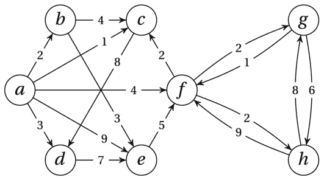
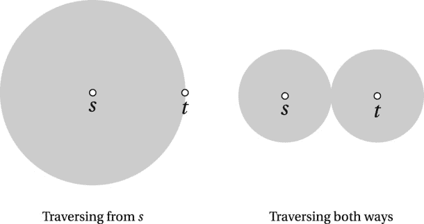
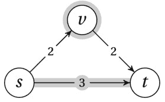

第九章


从 A 到 B 与埃德格和朋友

*两点之间的最短距离正在建设中。*

noelie altito

是时候从简介回到第二个问题: [<sup>1</sup>](#Fn1) 喀什到宁波的最短路线怎么找？如果你向任何地图软件提出这个问题，你可能会在不到一秒钟内得到答案。到目前为止，这似乎没有最初那么神秘了，你甚至有工具可以帮助你编写这样的程序。您知道，如果所有路段的长度相同，BFS 会找到最短路径，只要您的图中没有任何环，您就可以使用 DAG 最短路径算法。可悲的是，中国的路线图既包含自行车，也包含长度不等的道路。然而，幸运的是，这一章会给你有效解决这个问题所需的算法！

以免你认为这一章对编写地图软件有好处，考虑一下最短路径的抽象在其他什么情况下可能有用。例如，您可以在任何想要有效浏览网络的情况下使用它，这将包括互联网上所有类型的数据包路由。事实上，网络中充满了这样的路由算法，它们都在幕后工作。但是这种算法也用于不太明显的图形导航，比如让角色在电脑游戏中智能地移动。或者，也许你正试图找到最少的移动次数来解决某种形式的难题？这相当于在它的状态空间中找到最短的路径——这个抽象的图形代表了谜题的状态(节点)和移动(边)。还是在寻找利用货币汇率差异赚钱的方法？本章中的一个算法至少会带你走一段路(见练习 9-1)。

寻找最短路径也是其他算法中的一个重要子例程，这些算法不需要非常像图形。例如，在 *n* 人和 *n* 工作 [<sup>2</sup>](#Fn2) 之间寻找最佳可能匹配的一个通用算法需要反复解决这个问题。有一次，我开发了一个程序，试图修复 XML 文件，根据需要插入开始和结束标记，以满足一些简单的 XML 模式(规则如“列表项需要包装在列表标记中”)。事实证明，这可以通过使用本章中的一种算法来轻松解决。在运筹学、集成电路制造、机器人学等领域都有应用——只要你能说出来的。这绝对是你想了解的问题。幸运的是，尽管有些算法可能有点困难，但在前面的章节中，你已经完成了许多(如果不是大部分的话)具有挑战性的部分。

最短路径问题有几种类型。例如，您可以在有向和无向图中找到最短路径(就像任何其他类型的路径一样)。然而，最重要的区别来自于你的出发点和目的地。您是否希望找到从一个节点到所有其他节点的最短路径(单源)？从一个节点到另一个节点(单对、一对一、点对点)？从所有节点到一个(单一目的地)？从所有节点到所有其他节点(所有对)？其中两个——单源和所有线对——可能是最重要的。尽管我们有一些解决单对问题的技巧(参见后面的“在中间相遇”和“知道你要去哪里”)，但没有保证能让我们比一般的单源问题更快地解决那个问题。当然，单目的地问题等价于单源版本(只需翻转有向情况的边)。所有对的问题可以通过将每个节点作为一个单独的源来解决(我们将会研究这个问题)，但是也有专门的算法来解决这个问题。

传播知识

在[第 4 章](04.html)中，我介绍了放松和逐步提高的思想。在[第 8 章](08.html)中，你看到了在 Dag 中寻找最短路径的想法。事实上，DAGs 的迭代最短路径算法([清单 8-4](#list4) )不仅仅是动态规划的一个原型例子；本章还说明了算法的基本结构:我们在图的边上使用松弛来传播关于最短路径的知识。

让我们回顾一下这是什么样子的。我将使用 dicts 图的 dicts 表示，并使用 dict `D`来维护距离估计(上限)，就像第 8 章中的[一样。另外，我会添加一个前任字典，`P`，至于](08.html)[第 5 章](05.html)中的很多遍历算法。这些前任指针将形成所谓的最短路径树，并允许我们重建与`D`中的距离相对应的实际路径。然后可以在[清单 9-1](#list1) 中的`relax`函数中排除松弛。请注意，我将`D`中不存在的条目视为无限。(当然，我也可以在主算法中将它们都初始化为无穷大。)

[***清单 9-1***](#_list1) 。放松操作

```py
inf = float('inf')
def relax(W, u, v, D, P):
    d = D.get(u,inf) + W[u][v]                  # Possible shortcut estimate
    if d < D.get(v,inf):                        # Is it really a shortcut?
        D[v], P[v] = d, u                       # Update estimate and parent
        return True                             # There was a change!
```

我们的想法是，通过尝试走捷径穿过`u`，来改善目前已知的到`v`的距离。如果这不是一条捷径，没关系。我们只是忽略它。如果*是*捷径，我们记录新的距离并记住我们来自哪里(通过将`P[v]`设置为`u`)。我还增加了一点额外的功能:返回值表明是否实际发生了任何变化；这将在以后派上用场(尽管你不会在所有的算法中都需要它)。

下面看看它是如何工作的:

```py
>>> D[u]
7
>>> D[v]
13
>>> W[u][v]
3
>>> relax(W, u, v, D, P)
True
>>> D[v]
10
>>> D[v] = 8
>>> relax(W, u, v, D, P)
>>> D[v]
8
```

正如你所看到的，对`relax`的第一次调用将`D[v]`从 13 提高到 10，因为我通过`u`找到了一条捷径，我已经(大概)使用 7 的距离到达了这条捷径，而这条捷径距离`v`只有 3。现在我不知何故发现我可以通过一条长度为 8 的路径到达`v`。我再次运行`relax`，但是这一次没有找到快捷方式，所以什么也没有发生。

正如你可能猜测的那样，如果我现在将`D[u]`设置为 4，并再次运行相同的`relax`，`D[v]`，*将会提高*，这次提高到 7，将改进的估计从`u`传播到`v`。这种传播就是`relax`的意义所在。如果你随机放松边，距离(和它们相应的路径)*的任何改进将*最终在整个图中传播——所以如果你永远保持随机放松，你知道你会有正确的答案。然而，永远是一段很长的时间...

这就是 relax 游戏(在第 4 章的[中简要提及)的用武之地:我们希望通过尽可能少的调用`relax`来实现正确性。我们能侥幸逃脱的具体数量取决于我们问题的确切性质。例如，对于 Dag，我们可以避开*每个边一个调用*——这显然是我们所能期望的最好结果。稍后您会看到，对于更一般的图，我们实际上也可以得到更低的值(尽管总运行时间更长，并且不允许负权重)。然而，在深入讨论之前，让我们先来看看一些重要的事实，这些事实可能会有所帮助。在下文中，假设我们从节点`s`开始，并且我们将`D[s]`初始化为零，而所有其他距离估计被设置为无穷大。设`d(u,v)`为从`u`到`v`的最短路径的长度。](04.html)

*   `d(s,v) <= d(s,u) + W[u,v]`。这是一个*三角形不等式*T3 的例子。
*   `d(s,v) <= D[v]`。对于除了`s`之外的`v`，`D[v]`最初是无限的，只有当我们找到实际的捷径时，我们才减少它。我们从不“作弊”，所以它仍然是一个上限。
*   如果没有到节点`v`的路径，那么放松永远不会使`D[v]`低于无穷大。那是因为我们永远找不到改善`D[v]`的捷径。
*   假设到`v`的最短路径由从`s`到`u`的路径和从`u`到`v`的边组成。现在，如果在将边缘从`u`放松到`v`之前的任何时候`D[u]`是正确的(即`D[u] == d(s,u)`，那么`D[v]`在之后的任何时候都是正确的。由`P[v]`定义的路径也是正确的。
*   设`[s, a, b, ... , z, v]`是从`s`到`v`的最短路径。假设所有的边`(s,a)`、`(a,b)`、...，`(z,v)`中的路径已经被放宽了顺序。然后`D[v]`和`P[v]`就正确了。如果在此期间执行了其他放松操作，则没有关系。

在继续之前，你应该确保你理解为什么这些陈述是正确的。这可能会使这一章的其余部分更容易理解。

疯狂放松

随意放松有点疯狂。然而，疯狂放松可能不是。假设你放松了所有的边缘。如果你愿意，你可以随意地做这件事——没关系。只要确保你看完了所有的。然后你再做一次——也许是以另一种顺序——但是你又一次穿过了所有的边。一次又一次。直到一切都没有改变。

 **提示**想象一下，每个节点根据自己目前获得的最短路径，不断大声叫价，向其外部邻居提供最短路径。如果任何一个节点得到一个比它已经得到的更好的报价，它就转换它的路径供应商并相应地降低它的出价。

至少对于第一次尝试来说，这似乎不是一个不合理的方法。不过，有两个问题摆在面前:要多久才会有任何改变(如果我们真的到了那一步的话)，以及当这一切发生的时候，你能确定你已经得到了正确的答案吗？

我们先考虑一个简单的案例。假设所有的边权重都是相同且非负的。这意味着`relax`操作只有在找到由较少边组成的路径时才能找到捷径。那么，当我们放松了所有的边缘之后，会发生什么呢？至少，`s`的所有邻居都有正确答案，并且在最短路径树中将`s`设置为它们的父节点。根据我们放松边缘的顺序，树可能会蔓延得更远，但我们不能保证这一点。我们再放松一下怎么样？好吧，如果没有别的，这棵树至少会再延伸一层。事实上，在最坏的情况下，最短路径树会一层一层地蔓延，就好像我们在执行一些极其低效的 BFS 一样。对于一个有 *n* 个节点的图，任何路径的最大边数是 *n* -1，所以我们知道 *n* -1 是我们需要的最大迭代次数。

不过，一般来说，我们不能对我们的优势做这么多假设(或者如果可以，我们应该只使用 BFS，它会做得很好)。因为边可以具有不同的(甚至可能是负的)权重，所以后面几轮的`relax`操作可能会修改前面几轮中的前趋指针集。例如，在一轮之后，`s`的邻居`v`将`P[v]`设置为`s`，但是我们不能确定这是正确的！也许我们会通过其他节点找到一条到`v`的更短的路径，然后`P[v]`会被覆盖。那么，在一轮放松所有边缘之后，我们能知道什么？

回想一下上一节列出的最后一个原则:如果我们沿着从`s`到节点`v`的最短路径放松所有的边，那么我们的答案(由`D`和`P`组成)将是正确的。具体来说，在这种情况下，我们将放松所有最短路径上的所有边...由一条边组成的。我们不知道这些路径*在哪里*，请注意，因为我们(还)不知道有多少条边进入各种最优路径。尽管连接`s`和它的邻居的一些`P`边很可能不是最终的，但是我们知道*和*正确的边肯定已经存在了。

故事是这样的。在 *k* 轮放松图中的每条边之后，我们知道由 *k* 条边组成的所有最短路径都已经完成。按照我们之前的推理，对于一个有 *n* 个节点和 *m* 条边的图，它最多需要 *n* -1 轮直到我们完成，给我们一个运行时间θ(*nm*)。当然，这只需要是最坏情况下的运行时间，如果我们添加一个检查:在上一轮中有什么变化吗？如果什么都没有改变，继续下去就没有意义了。我们甚至可能会放弃整个 *n* -1 计数，而只有*依赖于该检查。毕竟，我们刚刚推理出，我们永远不会需要超过 *n* -1 轮，所以检查将最终停止算法。正确没有吗？不。有一个问题:消极循环。*

你看，负循环是最短路径算法的敌人。如果我们没有负循环，那么“没有变化”的条件将会很好，但是加入一个负循环，我们的估计可以永远保持改进。因此...只要我们允许负面边缘(为什么我们不能？)，我们需要迭代计数作为保障。关于这一点的*好消息*是，我们可以使用计数*来检测*负周期:不是运行 *n* -1 轮，而是运行 *n* 轮，看看在最后一次迭代中是否有任何变化。如果我们*确实*得到了改善(这是我们本不应该得到的)，我们会立即得出结论“是一个负面循环造成的！”我们宣布我们的答案无效并放弃。

 **注**别误会。即使存在负循环，也完全有可能找到最短路径。答案不允许包含循环，所以负循环不会影响答案。只是*在允许负循环的情况下找到*最短路径是一个未解决的问题(见[第十一章](11.html))。

我们现在已经到达了这一章的第一个合适的算法:贝尔曼-福特(见清单 9-2 )。这是一个单源最短路径算法，允许任意有向或无向图。如果图中包含一个负循环，算法将报告这一事实并放弃。

[***清单 9-2***](#_list2) 。贝尔曼-福特算法

```py
def bellman_ford(G, s):
    D, P = {s:0}, {}                            # Zero-dist to s; no parents
    for rnd in G:                               # n = len(G) rounds
        changed = False                         # No changes in round so far
        for u in G:                             # For every from-node...
            for v in G[u]:                      # ... and its to-nodes...
                if relax(G, u, v, D, P):        # Shortcut to v from u?
                    changed = True              # Yes! So something changed
        if not changed: break                   # No change in round: Done
    else:                                       # Not done before round n?
        raise ValueError('negative cycle')      # Negative cycle detected
    return D, P                                 # Otherwise: D and P correct
```

请注意，贝尔曼-福特算法的这个实现与许多演示的不同之处在于它包含了`changed`检查。那张支票给了我们两个好处。首先，如果我们不需要所有的迭代，它让我们提前终止；第二，它让我们检测在最后一次“多余的”迭代中是否发生了任何变化，这表明了一个负循环。(没有这种检查的更常见的方法是添加一段单独的代码来实现最后一次迭代，并带有自己的变更检查。)

因为这个算法是其他几个算法的基础，所以我们要确保清楚它是如何工作的。考虑第 2 章中[的加权图示例。我们可以将其指定为字典中的字典，如下所示:](02.html)

```py
a, b, c, d, e, f, g, h = range(8)
G = {
    a: {b:2, c:1, d:3, e:9, f:4},
    b: {c:4, e:3},
    c: {d:8},
    d: {e:7},
    e: {f:5},
    f: {c:2, g:2, h:2},
    g: {f:1, h:6},
    h: {f:9, g:8}
}
```

图表的直观展示见图 9-1 。假设我们调用`bellman_ford(G, a)`。会发生什么？如果我们想找出更多的细节，我们可以使用调试器，或者也许是`trace`或`logging`包。为了简单起见，假设我们添加了几个`print`语句，向我们显示放松的边界，以及对`D`的赋值，如果有的话。假设我们也按照排序的顺序迭代节点和邻居(使用`sorted`)，以获得确定性的结果。



[图 9-1](#_Fig1) 。一个加权图的例子

然后，我们得到一个打印输出，开始如下所示:

```py
(a,b)    D[b] = 2
(a,c)    D[c] = 1
(a,d)    D[d] = 3
(a,e)    D[e] = 9
(a,f)    D[f] = 4
(b,c)
(b,e)    D[e] = 5
(c,d)
(d,e)
(e,f)
(f,c)
(f,g)    D[g] = 6
(f,h)    D[h] = 6
(g,f)
(g,h)
(h,f)
(h,g)
```

这是第一轮贝尔曼-福特；如你所见，它一次穿过了所有的边。打印输出将继续下一轮，但不会给`D`赋值，因此函数返回。这里有些草率:距离估计值`D[e]`首先被设置为 9，这是从`a`直接到`e`的距离。只有先放松`(a,b)`，再放松`(b,e)`，我们才会发现一个更好的选择，即长度为 5 的路径`a`、`b`、`e`。然而，我们已经相当幸运，因为我们只需要一次通过边缘。让我们看看是否可以让事情变得更有趣，并迫使算法在稳定下来之前再做一轮。有什么办法吗？一种方法是:

```py
G[a][b] = 3
G[a][c] = 7
G[c][d] = -4
```

现在我们有了一条通过`f`到`d`的好路线，但是我们在第一轮中找不到:

```py
(a,b)    D[b] = 3
(a,c)    D[c] = 7
(a,d)    D[d] = 3
(a,e)    D[e] = 9
(a,f)    D[f] = 4
(b,c)
(b,e)    D[e] = 6
(c,d)
(d,e)
(e,f)
(f,c)    D[c] = 6
(f,g)    D[g] = 6
(f,h)    D[h] = 6
(g,f)
(g,h)
(h,f)
(h,g)
```

我们已经在第一轮将`D[c]`降到了 6，但是当我们到达那个点的时候，我们已经放松了`(c,d)`，在那个优势不能给我们任何改善的时候，因为`D[c]`是 7，`D[d]`已经是 3。然而，在第二轮，你会看到

```py
(c,d)    D[d] = 2
```

到了第三轮，事情就会稳定下来。

在离开例子之前，让我们试着引入一个负循环。让我们使用原始权重，并做如下修改:

```py
G[g][h] = -9
```

让我们去掉不改变`D`的松弛，让我们在打印输出中加入一些整数。然后我们得到以下结果:

```py
# Round 1:
(a,b)    D[b] = 2
(a,c)    D[c] = 1
(a,d)    D[d] = 3
(a,e)    D[e] = 9
(a,f)    D[f] = 4
(b,e)    D[e] = 5
(f,g)    D[g] = 6
(f,h)    D[h] = 6
(g,h)    D[h] = -3
(h,g)    D[g] = 5
# Round 2:
(g,h)    D[h] = -4
(h,g)    D[g] = 4
# Round 3:
(g,h)    D[h] = -5
(h,g)    D[g] = 3
# Round 4:
(g,h)    D[h] = -6
(h,f)    D[f] = 3
(h,g)    D[g] = 2

...

# Round 8:
(g,h)    D[h] = -10
(h,f)    D[f] = -1
(h,g)    D[g] = -2
Traceback (most recent call last):
  ...
ValueError: negative cycle
```

我已经删除了一些回合，但我相信你可以看到这种模式:在第三轮之后，`g`、`h`和`f`的距离估计值反复减少一。鉴于只有 8 个节点，他们甚至在第 8 轮中也这样做，这一事实提醒我们存在负循环。这并不意味着没有解决方案——只是意味着持续放松不会为我们找到它，所以我们提出了一个例外。

当然，只有当我们真的能够*到达*时，负循环才是一个问题。让我们尝试消除边缘`(f,g)`，例如通过使用`del G[f][g]`。现在至少`f`不会参与这个循环，但是我们还有`g`和`h`来改进彼此的估计，使之超出正确的范围。然而，如果我们也去掉`(f,h)`，我们的问题就消失了！

```py
(a,b)    D[b] = 2
(a,c)    D[c] = 1
(a,d)    D[d] = 3
(a,e)    D[e] = 9
(a,f)    D[f] = 4
(b,e)    D[e] = 5
```

图还是连通的，负循环还在，只是我们的遍历从来没有到达。如果这让你不舒服，请放心:到`g`和`h`的距离是正确的。它们都是无限的，这是理所应当的。然而，如果你试图调用`bellman_ford(G, g)`或`bellman_ford(G, h)`，这个循环又可以到达了，所以你会得到一系列的动作，每一轮都有几次更新，最后是负循环异常。


***枕边细语。*** *也许我应该试试韦克斯勒？(* *`http://xkcd.com/69`*

寻找隐藏的匕首

贝尔曼-福特算法很棒。在许多方面，这是本章中最容易理解的算法:放松所有的边，直到我们*知道*一切都必须是正确的。对于任意图，这是一个很好的算法，但是如果我们可以做一些假设，我们就可以(通常情况下)做得更好。您应该还记得，对于 Dag，单源最短路径问题可以在*线性时间*内解决。在这一节中，我将处理一个不同的约束。我们仍然可以有周期，但是*没有负边权重*。(事实上，这是在大量实际应用中出现的情况，例如在引言中讨论的那些。)这不仅意味着我们可以忘记消极的周期忧郁；这将让我们得出某些结论，当不同的距离是正确的，导致运行时间的实质性改善。

我在这里建立的算法，是由算法超级大师 Edsger W. Dijkstra 在 1959 年设计的，可以有几种解释，理解它为什么正确可能有点棘手。我认为把它看作 DAG 最短路径算法的近亲是有用的，重要的区别是它必须*发现隐藏的 DAG* 。

你看，即使我们正在处理的图可以有任何它想要的结构，我们可以认为一些边是不相关的。为了开始，我们可以想象我们已经*知道*从开始节点到其他每个节点的距离。我们当然不知道，但是这种假想的情况可以帮助我们推理。想象一下，根据节点之间的距离，从左到右对节点进行排序。会发生什么？对于一般情况来说——不多。然而，我们假设我们没有负的边权重，这就有所不同了。

因为所有的边都是正的，所以在我们假设的排序中，能够对节点的解做出贡献的唯一节点将位于其左边的*。不可能在右边找到一个节点来帮助我们找到一条捷径，因为这个节点离我们更远，只有当它有一个*负后沿*时才能给我们一条捷径。*正*后沿对我们来说完全没用，也不是问题结构的一部分。剩下的就是一个 DAG，我们想要使用的拓扑排序正是我们开始时假设的排序:节点按照它们的实际距离排序。该结构的图示见图 9-2 。(我一会儿再回到问号。)*


[图 9-2](#_Fig2) 。逐渐揭开隐藏的匕首。节点标有它们的最终距离。因为权重为正，所以后向边(虚线)不会影响结果，因此是不相关的

不出所料，我们现在碰到了解决方案中的主要缺口:它完全是循环的。在揭示基本的问题结构(分解成子问题或找到隐藏的 DAG)时，我们假设我们已经解决了问题。不过，这个推理仍然是有用的，因为我们现在有了特定的东西可以寻找。我们想要找到排序——我们可以用我们可靠的工具——归纳法来找到它！

再次考虑图 9-2 。假设突出显示的节点是我们在归纳步骤中试图识别的节点(意味着较早的节点已经被识别，并且已经有了正确的距离估计)。就像在普通的 DAG 最短路径问题中一样，我们将放松每个节点的所有外边缘，只要我们已经识别出它并确定了它的正确距离。这意味着我们已经放松了所有早期节点的边缘。我们还没有放宽*后面的*节点的外边缘，但是正如所讨论的，它们无关紧要:这些后面的节点的距离估计是上界，后边缘具有正的权重，所以它们不可能对捷径有贡献。

这意味着(通过前面的松弛特性或第 8 章中对 DAG 最短路径算法的讨论)下一个节点*必须具有正确的距离估计*。也就是说，[图 9-2](#Fig2) 中高亮显示的节点现在肯定已经得到了正确的距离估计，因为我们已经放松了前三个节点的所有边。这是一个非常好的消息，剩下的就是找出*是哪个节点*。我们还是不知道顺序是什么，记得吗？我们一步一步地进行拓扑排序。

当然，只有一个节点可能是下一个节点: [<sup>3</sup>](#Fn3) 具有*最低距离估计的节点*。我们知道它是排序中的下一个，我们知道它有一个正确的估计。因为这些估计值是上限，所以后面的节点不可能有更低的估计值。很酷，不是吗？现在，通过归纳，我们解决了这个问题。我们只是按照距离顺序放松每个节点的所有外边缘——这意味着总是接下来选择估计值最低的一个。

这种结构与 Prim 的算法非常相似:带优先级队列的遍历。就像 Prim 的一样，我们知道在我们的遍历中没有发现的节点不会被放松，所以我们(还)对它们不感兴趣。在我们*已经*发现(并放松)的那些中，我们总是想要优先级最低的那个。在 Prim 的算法中，优先级是链接回遍历树的边的权重；在 Dijkstra 的，优先是距离估计。当然，当我们找到快捷方式时，优先级可以改变(就像新的可能的生成树边可以降低 Prim 的优先级一样)，但是就像在[清单 7-5](#list5) 中一样，我们可以简单地将同一个节点多次添加到我们的堆中(而不是试图修改堆条目的优先级)，而不会损害正确性或运行时间。结果可以在[清单 9-3](#list3) 中找到。它的运行时间是对数线性的，或者更具体地说，是θ((*m*+*n*)LG*n*)，其中 *m* 是边数， *n* 是节点数。这里的理由是，您需要一个(对数)堆操作，用于(1)从队列中提取每个节点和(2)释放每个边。 [<sup>4</sup>](#Fn4) 只要你有ω(*n*)条边，对于你从开始节点可以到达θ(*n*个节点的图，运行时间可以简化为θ(*m*LG*n*)。

[***清单 9-3***](#_list3) 。迪杰斯特拉算法

```py
from heapq import heappush, heappop

def dijkstra(G, s):
    D, P, Q, S = {s:0}, {}, [(0,s)], set()      # Est., tree, queue, visited
    while Q:                                    # Still unprocessed nodes?
        _, u = heappop(Q)                       # Node with lowest estimate
        if u in S: continue                     # Already visited? Skip it
        S.add(u)                                # We've visited it now
        for v in G[u]:                          # Go through all its neighbors
            relax(G, u, v, D, P)                # Relax the out-edge
            heappush(Q, (D[v], v))              # Add to queue, w/est. as pri
    return D, P                                 # Final D and P returned
```

Dijkstra 的算法可能类似于 Prim 的算法(为队列设置了另一组优先级)，但它也与另一个老宠儿密切相关:BFS 。考虑边权重是正整数的情况。现在，用 *w* -1 条未加权的边替换一条权重为 *w* 的边，连接一条虚拟节点路径(见[图 9-3](#Fig3) )。我们正在毁掉我们得到一个*高效*解决方案的机会(见练习 9-3)，但是我们知道 BFS 会找到一个*正确的*解决方案。事实上，它将以与 Dijkstra 算法非常相似的*方式完成:它将在每条(原始)边上花费与其权重成比例的时间，因此它将按照与起始节点的距离顺序到达每个(原始)节点。*


[图 9-3](#_Fig3) 。虚拟节点模拟的边的重量或长度

这有点像沿着每条边设置了一系列多米诺骨牌(多米诺骨牌的数量与重量成比例)，然后在开始节点倾斜第一个多米诺骨牌。一个节点可以从多个方向到达，但是我们可以通过观察哪些多米诺骨牌位于其他方向之下来判断哪个方向获胜。

如果我们*用这种方法开始*,我们可以将 Dijkstra 的算法视为通过“模拟”BFS 或多米诺骨牌(或流动的水或传播的声波，或...)，而不必费心单独处理每个虚拟节点(或 domino)。相反，我们可以把我们的优先级队列想象成一条时间轴，在这条时间轴上，我们标记了通过不同的路径到达节点的不同时间。我们向下看一条新发现的边的长度，然后想，“多米诺骨牌什么时候能沿着这条边到达那个节点？”我们将边将花费的时间(边权重)加到当前时间(到当前节点的距离)上，并将结果放在时间轴(我们的堆)上。我们对第一次到达的每个节点都这样做(毕竟，我们只对最短的*路径*感兴趣)，并且我们继续沿着时间轴移动到达其他节点。当我们再次到达同一个节点时，在时间线的后面，我们简单地忽略它。[T55](#Fn5)

我已经清楚了 Dijkstra 算法与 DAG 最短路径算法的相似之处。这在很大程度上是动态编程的应用，尽管递归分解不像 DAG 那样明显。为了得到一个解，它也使用贪婪，因为它总是移动到当前具有最低距离估计的节点。将二进制堆作为优先级队列，甚至有点分而治之的意思；总而言之，这是一个很好的算法，使用了你到目前为止学到的很多东西。花些时间完全理解它是很值得的。

所有人对抗所有人

在下一节中，您将看到一个非常酷的算法，用于查找所有节点对之间的最短距离。这是一种特殊用途的算法，即使图形有很多边也是有效的。不过，在这一节中，我将快速介绍一种方法，将之前的两种算法——Bellman-Ford 和 Dijkstra 的算法——结合成一种真正在*稀疏*图(即边相对较少的图)中闪耀的算法。这是约翰逊的算法，它似乎在许多算法设计的课程和书籍中被忽略了，但它真的很聪明，而且鉴于你已经知道的东西，你几乎可以免费得到它。

Johnson 算法的动机如下:当解决稀疏图的所有对最短路径问题时，简单地从每个节点使用 Dijkstra 算法实际上是一个非常好的解决方案。这本身并没有激发出新的 T2 算法...但问题是 Dijkstra 的算法不允许负边缘。对于单源最短路径问题，除了使用 Bellman-Ford 之外，我们没有太多办法。然而，对于所有对的问题，我们可以允许自己做一些初始的预处理，使*所有的*权重为正。

这个想法是添加一个新的节点 *s* ，零权重边到所有现有节点，然后从 *s* 运行贝尔曼-福特。这将给我们一个距离——让我们称之为*h*(*v*)——从 *s* 到我们图中的每个节点 *v* 。然后我们可以使用 *h* 来调整每条边的权重:我们定义新的权重如下: *w* '( *u* ，*v*)=*w*(*u*，*v*)+*h*(*u*)-*h*(*这个定义有两个非常有用的性质。首先，它向我们保证了每个新的权重*w*’(*u*， *v* )都是非负的(这是根据三角形不等式得出的，正如本章前面所讨论的；另请参见练习 9-5)。第二，我们没有把我们的问题搞砸！也就是说，如果我们用这些*新的*权重找到最短路径，那些路径也将是用*原始的*权重的最短路径(尽管有其他长度)。这是为什么呢？*

这可以用一个叫做*伸缩总和* 的好主意来解释:一个像(*A*-*b*)+(*b*-*c*)+的总和...+ ( *y* - *z* )会像望远镜一样坍缩，给我们*一个*–*z*。原因是，每隔一个被加数，前面加一次加号，后面加一次减号，所以它们的和都是零。在约翰逊的算法中，同样的事情会发生在每一条修改了边的路径上。对于这样一条路径中的任何一条边( *u* 、 *v* )，除了第一条或最后一条，都会通过加上 *h* ( *u* )减去 *h* ( *v* )来修改权重。下一个边缘*将 *v* 作为其第一个节点，并将*加上 h* ( *v* )，将其从总和中移除。类似地，前一条边将减去 *h* ( *u* )，移除该值。*

唯一有点不同的两条边(在任何路径中)是第一条和最后一条。第一个不是问题，因为 *h* ( *s* )将为零，并且 *w* ( *s* ， *v* )对于所有节点 *v* 被设置为零。但是最后一个呢？没问题。是的，我们将以最后一个节点 *v* 减去 *h* ( *v* )而结束，但是所有在该节点结束的*路径都是如此——最短路径仍然是最短的。*

转换也不会丢弃任何信息，所以一旦我们使用 Dijkstra 算法找到了最短路径，我们就可以反向转换所有的路径长度。使用类似的伸缩论证，我们可以看到，通过基于转换后的权重从我们的答案中加上 *h* ( *v* )并减去 *h* ( *u* )，我们可以获得从 *u* 到 *v* 的最短路径的实际长度。这给了我们在清单 9-4 中实现的算法。 [<sup>6</sup>](#Fn6)

[***清单 9-4***](#_list4) 。约翰逊算法

```py
from copy import deepcopy

def johnson(G):                                 # All pairs shortest paths
    G = deepcopy(G)                             # Don't want to break original
    s = object()                                # Guaranteed unused node
    G[s] = {v:0 for v in G}                     # Edges from s have zero wgt
    h, _ = bellman_ford(G, s)                   # h[v]: Shortest dist from s
    del G[s]                                    # No more need for s
    for u in G:                                 # The weight from u ...
        for v in G[u]:                          # ... to v ...
            G[u][v] += h[u] - h[v]              # ... is adjusted (nonneg.)
    D, P = {}, {}                               # D[u][v] and P[u][v]
    for u in G:                                 # From every u ...
        D[u], P[u] = dijkstra(G, u)             # ... find the shortest paths
        for v in G:                             # For each destination ...
            D[u][v] += h[v] - h[u]              # ... readjust the distance
    return D, P                                 # These are two-dimensional
```

 **注意**不需要检查对`bellman_ford`的调用是否成功或者是否发现了负循环(在这种情况下 Johnson 的算法不起作用)，因为如果图中有*是*的负循环，`bellman_ford`就会引发异常。

假设 Dijkstra 算法的θ(*m*LG*n*)运行时间，Johnson 的只是慢了 *n* 的一个因子，给我们θ(*Mn*LG*n*)，这比 Floyd-Warshall 的三次运行时间(稍作讨论)要快，对于稀疏图(即边相对较少的图)。 [<sup>7</sup>](#Fn7)

约翰逊算法中使用的变换与 A*算法的潜在功能密切相关(参见本章后面的“知道你要去哪里”)，它类似于第 10 章中[的最小成本二分匹配问题中使用的变换。这里的目标也是确保正的边权重，但是情况略有不同(边权重在迭代之间不断变化)。](10.html)

牵强附会的子问题

虽然 Dijkstra 的算法肯定是基于动态编程的原则，但由于需要随时发现子问题的顺序(或子问题之间的依赖关系)，这一事实在一定程度上被掩盖了。我在这一节中讨论的算法是由 Roy、Floyd 和 Warshall 独立发现的，是 DP 的一个典型例子。它基于记忆递归分解，并且在其普通实现中是迭代的。它的形式看似简单，但设计极其巧妙。在某些方面，它是基于第八章讨论的“进或出”原则，但由此产生的子问题，至少乍一看，似乎是高度人为和牵强的。

在许多动态规划问题中，我们可能需要寻找一组递归相关的子问题，但是一旦我们找到它们，它们通常看起来很自然。例如，想想 DAG 最短路径中的节点，或者最长公共子序列问题的前缀对。后者说明了一个有用的原则，可以扩展到不太明显的结构:限制我们可以使用的元素。例如，在 LCS 问题中，我们限制前缀的长度。在背包问题中，这稍微人工一些:我们为对象发明了一个排序，并将自己限制在第 *k* 个对象上。然后，子问题由这个“允许集”和背包容量的一部分来参数化。

在所有对最短路径问题中，我们可以使用这种形式的限制，以及“输入或输出”原则，来*设计*一组非显而易见的子问题:我们对节点进行任意排序，并限制我们可以使用多少个节点——也就是说，首先是*k*—作为形成路径的中间节点。现在，我们已经使用三个参数对我们的子问题进行了参数化:

*   起始节点
*   结束节点
*   我们被允许通过的最高节点数

除非你对我们的进展有所了解，否则增加第三项可能看起来完全没有意义——它怎么能帮助我们限制我们被允许做的事情呢？我相信你可以看到，这个想法是*分割*解决方案空间，将问题分解成子问题，然后将这些子问题连接成一个子问题图。链接是通过基于“输入或输出”的思想创建递归依赖来实现的:节点 *k* ，输入还是输出？

设 *d* ( *u* 、 *v* 、 *k* )为从节点 *u* 到节点 *v* 的最短路径的长度，如果只允许使用第 *k* 个第一节点作为中间节点。我们可以将问题分解如下:

*d* ( *u* ， *v* ，*k*)= min(*d*(*u*， *v* ，*k*1)， *d* ( *u* ， *k* ，*k*1)+*d*

 *就像在背包问题中，我们正在考虑是否包括 *k* 。如果我们不包括它，我们简单地使用现有的解决方案，我们可以使用 *k* 找到没有的最短路径*，这是 *d* ( *u* ， *v* ，*k*—1)。如果*包含了*，我们必须使用从*到 k* 的最短路径(即 *d* ( *u* ， *k* ，*k*—1))以及从 k* (即 *d* ( *k* ， *v* ，*请注意，在所有这三个子问题中，我们使用的是第*k*1 个节点，因为要么我们排除了第 *k* 个节点，要么我们明确地将它用作端点而不是中间节点。这保证了我们对子问题的大小排序(即拓扑排序)——没有循环。*

你可以在清单 9-5 中看到结果算法。(实现使用第 8 章中[的`memo`装饰器。)注意，我假设节点是范围 1 内的整数... *n* 这里。如果你使用其他节点对象，你可以有一个包含任意顺序节点的列表`V`，然后在`min`部分使用`V[k-1]`和`V[k-2]`代替`k`和`k-1`。还要注意返回的`D`图的形式是`D[u,v]`而不是`D[u][v]`。我还假设这是一个全权重矩阵，所以从`u`到`v`没有边的话`D[u][v]`就是`inf`。如果你愿意，你可以很容易地修改这一切。](08.html)

[***清单 9-5***](#_list5) 。Floyd-Warshall 算法的记忆递归实现

```py
def rec_floyd_warshall(G):                                # All shortest paths
    @memo                                                 # Store subsolutions
    def d(u,v,k):                                         # u to v via 1..k
        if k==0: return G[u][v]                           # Assumes v in G[u]
        return min(d(u,v,k-1), d(u,k,k-1) + d(k,v,k-1))   # Use k or not?
    return {(u,v): d(u,v,len(G)) for u in G for v in G}   # D[u,v] = d(u,v,n)
```

让我们试试迭代版本。假设我们有三个子问题参数( *u* 、 *v* 和 *k* )，我们将需要三个`for`循环来迭代处理所有子问题。似乎有理由认为我们需要存储所有的子解，这导致了立方内存的使用，但就像 LCS 问题一样，我们可以减少这种情况。 [<sup>8</sup>](#Fn8) 我们的递归分解只将阶段 *k* 中的问题与阶段*k*1 中的问题联系起来。这意味着我们只需要*两张*距离图——一张用于当前迭代，一张用于前一次迭代。但是我们可以做得更好...

就像使用`relax`时一样，我们在这里寻找快捷方式。阶段 *k* 的问题是“与我们现有的相比，通过节点 *k* 会提供捷径吗？”如果`D`是我们当前的距离图，而`C`是之前的距离图，我们得到了:

```py
D[u][v] = min(D[u][v], C[u][k] + C[k][v])
```

现在考虑一下，如果我们始终使用单一距离图，会发生什么情况:

```py
D[u][v] = min(D[u][v], D[u][k] + D[k][v])
```

意思现在*稍微*不太清楚，看起来有点绕，但是真的没有问题。我们在寻找捷径，对吗？值`D[u][k]`和`D[k][v]`将是真实路径的长度(因此是最短距离的上限)，所以我们没有作弊。此外，它们不会大于`C[u][k]`和`C[k][v]`，因为我们从不*增加*地图中的值。因此，唯一可能发生的事情就是`D[u][v]`更快地找到正确答案——这当然没问题。结果是我们只需要一个单一的二维距离图(也就是说，二次方内存与三次方内存相反)，我们将通过寻找快捷方式来不断更新它。在许多方面，结果非常(尽管不完全)像贝尔曼-福特算法的二维版本(见清单 9-6)。

[***清单 9-6***](#_list6) 。弗洛伊德-沃肖尔算法，仅距离

```py
def floyd_warshall(G):
    D = deepcopy(G)                             # No intermediates yet
    for k in G:                                 # Look for shortcuts with k
        for u in G:
            for v in G:
                D[u][v] = min(D[u][v], D[u][k] + D[k][v])
    return D
```

您会注意到，我开始使用图形本身的副本作为候选距离图。这是因为我们还没有尝试通过任何中间节点，所以唯一的可能性是直接边，由原始权重给出。还要注意，关于顶点是数字的假设完全消失了，因为我们不再需要明确地参数化我们所处的阶段。只要我们在先前结果的基础上，尝试为每个可能的中间节点创建快捷方式，解决方案将是相同的。我希望你会同意最终的算法是超级简单的，尽管它背后的推理可能并不简单。

不过，如果有一个`P`矩阵也不错，就像约翰逊的算法一样。正如在许多 DP 算法中一样，构建实际的解决方案很好地依赖于计算最优值——您只需要记录做出了哪些选择。在这种情况下，如果我们通过`k`找到一个快捷方式，那么`P[u][v]`中记录的前任必须替换为`P[k][v]`，也就是属于快捷方式最后“一半”的前任。最终算法可以在[清单 9-7](#list7) 中找到。原始的`P`获得由边链接的任何不同节点对的前任。此后，每当`D`更新时，`P`就会更新。

[***清单 9-7***](#_list7) 。弗洛伊德-沃肖尔算法

```py
def floyd_warshall(G):
    D, P = deepcopy(G), {}
    for u in G:
        for v in G:
            if u == v or G[u][v] == inf:
                P[u,v] = None
            else:
                P[u,v] = u
    for k in G:
        for u in G:
            for v in G:
                shortcut = D[u][k] + D[k][v]
                if shortcut < D[u][v]:
                    D[u][v] = shortcut
                    P[u,v] = P[k,v]
    return D, P
```

注意这里使用`shortcut < D[u][v]`而不是`shortcut <= D[u][v]`很重要。尽管后者仍然会给出正确的距离，但您可能会遇到最后一步是`D[v][v]`，这将导致`P[u,v] = None`的情况。

Floyd-Warshall 算法可以很容易地被修改来计算图的传递闭包(Warshall 算法)。请参见练习 9-9。

在中间相遇

Dijkstra 算法的子问题解决方案——及其未加权特例 BFS 的子问题解决方案——在图上向外扩散，就像池塘里的涟漪。如果你想要的只是从 A 到 B，或者使用习惯的节点名称，从 *s* 到 *t* ，这意味着“波纹”必须经过许多你并不真正感兴趣的节点，如图 9-4 中的左图所示。另一方面，如果你同时从起点*和终点*开始遍历(假设你可以反向遍历边)，在某些情况下，两个波纹可以在中间相遇，这样可以节省很多工作，如右图所示。



[图 9-4](#_Fig4) 。单向和双向“波纹”，表示通过遍历找到从 s 到 t 的路径所需的工作

请注意，尽管图 9-4 的“图形证据”可能令人信服，但它当然不是一个正式的论证，也没有给出任何保证。事实上，尽管本节和下一节的算法为单源、单目的地最短路径提供了实际的改进，但没有哪种点对点算法比普通的单源问题具有更好的渐近最坏情况行为。当然，两个半径为原半径一半的圆将有一半的总面积，但是图形的行为不一定像欧几里得平面。我们当然*希望*在运行时间上有所改进，但这就是所谓的*启发式*算法。这种算法是基于有根据的猜测，并且通常根据经验进行评估。我们可以确信它不会比 Dijkstra 的算法更差，渐进地说——这都是为了提高实际运行时间。

为了实现 Dijkstra 算法的这个双向版本，让我们首先稍微修改一下原始版本，使其成为一个生成器，这样我们就可以只提取“meetup”所需的子解。这类似于[第五章](05.html)中的一些遍历函数，比如`iter_dfs` ( [清单 5-5](#list5) )。这种迭代行为意味着我们可以完全丢弃距离表，只依赖优先级队列中保存的距离。为了简单起见，我不会在这里包含前置信息，但是您可以通过向堆中的元组添加前置来轻松扩展解决方案。要获得距离表(就像最初的`dijkstra`)，你可以简单地调用`dict(idijkstra(G, s))`。代码见[清单 9-8](#list8) 。

[***清单 9-8***](#_list8) 。作为生成器实现的 Dijkstra 算法

```py
from heapq import heappush, heappop

def idijkstra(G, s):
    Q, S = [(0,s)], set()                       # Queue w/dists, visited
    while Q:                                    # Still unprocessed nodes?
        d, u = heappop(Q)                       # Node with lowest estimate
        if u in S: continue                     # Already visited? Skip it
        S.add(u)                                # We've visited it now
        yield u, d                              # Yield a subsolution/node
        for v in G[u]:                          # Go through all its neighbors
            heappush(Q, (d+G[u][v], v))         # Add to queue, w/est. as pri
```

注意，我已经完全放弃了使用`relax`——它现在隐含在堆中。或者说，`heappush`是新的`relax`。重新添加具有更好估计的节点意味着它将优先于旧条目，这相当于用 relax 操作覆盖旧条目。这类似于第 7 章中[Prim 算法的实现。](07.html)

既然我们已经一步一步地接触到了 Dijkstra 的算法，构建一个双向版本就不是太难了。我们在原始算法的 to 和 from 实例之间交替，扩展每个波纹，一次扩展一个节点。如果我们继续下去，这会给我们两个完整的答案——从 *s* 到 *t* 的距离，以及从 *t* 到 *s* 的距离，如果我们沿着边向后走。当然，这两个答案是一样的，这使得整个练习毫无意义。想法是一旦涟漪相遇就停下来。一旦`idijkstra`的两个实例产生了同一个节点，跳出循环似乎是个好主意。

这就是算法中唯一真正的问题所在:你从 *s* 和 *t* 开始遍历，一直移动到下一个最近的节点，所以一旦两个算法都移动到(也就是说，产生了)同一个节点，那么这两个算法沿着最短路径相遇似乎是合理的，对吗？毕竟，如果您只是从 *s* 开始遍历，那么您可以在到达 *t* 时立即终止(即`idijkstra`让步)。可悲的是，正如很容易发生的那样，我们的直觉(或者至少是我的直觉)在这里让我们失望了。图 9-5 中的简单例子应该可以澄清这种可能的误解；但是哪里的*是最短路径呢？我们怎么知道停下来是安全的？*



[图 9-5](#_Fig5) 。第一个会合点(突出显示的节点)不一定沿着最短路径(突出显示的边)

事实上，一旦两个实例相遇就结束遍历是没问题的。然而，为了找到最短路径，打个比方，当算法执行时，我们需要保持警惕。我们需要保持到目前为止找到的最佳距离，每当一条边( *u* ， *v* )放松，并且我们已经有了从 *s* 到 *u* 的距离(通过向前遍历)和从 *v* 到 *t* 的距离(通过向后遍历)，我们需要检查用( *u* ， *v* )连接路径是否会改进我们的最佳解决方案

事实上，我们可以把停止标准收紧一点(见练习 9-10)。我们不需要等待两个实例都访问同一个节点，我们只需要查看它们已经走了多远——也就是它们已经到达的最近距离。这些不能减少，所以如果他们的总和至少和我们目前找到的最佳路径一样大，我们找不到更好的，我们就完了。

尽管如此，仍有一个挥之不去的疑问。前面的论点可能会让你相信我们不可能通过继续下去找到任何更好的路径，但是我们怎么能确定我们没有错过任何路径呢？假设我们找到的最佳路径长度为*米*。导致终止的两个距离是 *l* 和 *r* ，所以我们知道 *l* + *r* ≥ *m* (停止判据)。现在，假设有一条从 *s* 到 *t* 的路径，该路径比 *m* 短*。为此，路径必须包含一条边( *u* ， *v* )，使得 *d* ( *s* ， *u* ) < *l* 和 *d* ( *v* ， *t* ) < *r* (见练习 9-11)。这意味着 *u* 和 *v* 分别比当前节点更靠近 *s* 和 *t* ，所以这两个节点肯定都已经被访问过(产生过)。在两者都被放弃的时候，我们对迄今为止的最佳解决方案的维护应该已经找到了这条道路——一个矛盾。换句话说，算法是正确的。*

到目前为止，这整个跟踪最佳路径的业务需要我们访问 Dijkstra 算法的内部。我更喜欢`idijkstra`给我的抽象，所以我将坚持使用这种算法的最简单版本:一旦我从两次遍历中接收到相同的节点就停止，然后在之后扫描最佳路径*，检查连接两半的所有边。如果您的数据集是可以从双向搜索中获益的那种类型，那么这种扫描不太可能成为太大的瓶颈，但是当然，您可以随意使用分析器并进行调整。完成的代码可以在清单 9-9 中找到。来自`itertools`的`cycle`函数给了我们一个迭代器，它将从其他迭代器重复地给我们值，从头到尾重复地产生它的值。在这种情况下，这意味着我们在向前和向后方向之间循环。*

[***清单 9-9***](#_list9) 。Dijkstra 算法的双向版本

```py
from itertools import cycle

def bidir_dijkstra(G, s, t):
    Ds, Dt = {}, {}                              # D from s and t, respectively
    forw, back = idijkstra(G,s), idijkstra(G,t)  # The "two Dijkstras"
    dirs = (Ds, Dt, forw), (Dt, Ds, back)        # Alternating situations
    try:                                         # Until one of forw/back ends
        for D, other, step in cycle(dirs):       # Switch between the two
            v, d = next(step)                    # Next node/distance for one
            D[v] = d                             # Remember the distance
            if v in other: break                 # Also visited by the other?
    except StopIteration: return inf             # One ran out before they met
    m = inf                                      # They met; now find the path
    for u in Ds:                                 # For every visited forw-node
        for v in G[u]:                           # ... go through its neighbors
            if not v in Dt: continue             # Is it also back-visited?
            m = min(m, Ds[u] + G[u][v] + Dt[v])  # Is this path better?
    return m                                     # Return the best path
```

注意，这段代码假设`G`是无向的(也就是说，所有的边在两个方向上都是可用的),并且所有的节点`u`都是`G[u][u] = 0`。你可以很容易地扩展算法，这样就不需要那些假设了(练习 9-12)。

知道你要去哪里

到目前为止，您已经看到了遍历的基本思想是非常通用的，通过简单地使用不同的队列，您可以得到几种有用的算法。例如，对于 FIFO 和 LIFO 队列，您可以获得 BFS 和 DFS，通过适当的优先级，您可以获得 Prim 和 Dijkstra 算法的核心。本节描述的算法称为 A*，通过再次调整优先级来扩展 Dijkstra 的算法。

如前所述，A*算法使用了类似于 Johnson 算法的思想，尽管目的不同。Johnson 的算法转换所有边权重以确保它们是正的，同时确保最短路径仍然是最短的。在 A*中，我们希望以类似的方式修改边，但这一次的目标不是使边为正——我们假设它们已经为正(因为我们是在 Dijkstra 算法的基础上构建的)。不，我们想要的是通过使用我们要去的地方的信息来引导遍历到正确的方向:我们想要使远离我们的目标节点的边比那些使我们更接近它的边更昂贵。

 **注意**这类似于第十一章中[讨论的分支定界策略中使用的最佳优先搜索。](11.html)

当然，如果我们真的知道哪些边缘会让我们走得更近，我们可以通过贪婪来解决整个问题。我们只是沿着最短的路径前进，不走任何旁道。A*算法的好处在于，它填补了 Dijkstra 算法和这种假设的理想情况之间的空白，在 Dijkstra 算法中，我们不知道我们要去哪里，而在这种假设的理想情况下，我们知道我们要去哪里的确切位置。它引入了一个*势函数* ，或者说*启发式 h* ( *v* )，这是我们对剩余距离的最佳猜测， *d* ( *v* ， *t* )。一分钟后你会看到，Dijkstra 的算法作为特例“掉出”A*，当 *h* ( *v* ) = 0 时。同样，如果我们可以用魔法设置*h*(*v*)=*d*(*v*， *t* )，那么算法将直接从 *s* 前进到 *t* 。

那么，它是如何工作的呢？我们定义修改后的边缘权重来获得伸缩和，就像我们在约翰逊算法中所做的那样(尽管你应该注意到这里符号被调换了): *w* '( *u* ， *v* ) = *w* ( *u* ，*v*)-*h*(*u*)+*h*(*v*伸缩和保证了最短路径仍然是最短的(就像在 Johnson 的例子中一样)，因为所有路径长度都改变了相同的量，*h*(*t*)-*h*(*s*)。如您所见，如果我们将启发式规则设置为零(或者，实际上，任何常数)，权重都不会改变。

显而易见，这种调整反映了我们奖励方向正确的优势、惩罚方向错误的优势的意图。对于每个边的权重，我们加上潜在的下降*(启发式)，这类似于重力的工作方式。如果你把一个弹球放在一个凹凸不平的桌子上，它将开始向一个降低其势能的方向运动。在我们的例子中，算法将被引导到导致剩余距离下降的方向——这正是我们想要的。*

A*算法等价于修改图上的 Dijkstra 算法，所以如果 *h* 是*可行*就是正确的，意味着 *w* '( *u* ， *v* )对于所有节点 *u* 和 *v* 都是非负的。按照*D*[*v*]-*h*(*s*)+*h*(*v*)的递增顺序扫描节点，而不是简单的 *D* [ *v* 。因为 *h* ( *s* )是一个常见的常量，所以我们可以忽略它，只需将 *h* ( *v* )添加到我们现有的优先级中。这个总和是我们对从 *s* 经由 *v* 到 *t* 的最短路径的最佳估计。如果 *w* '( *u* ， *v* )可行， *h* ( *v* )也将是 *d* ( *v* ， *t* )上的一个*下界*(见练习 9-14)。

实现所有这些的一个(非常常见的)方法是使用类似于原始的`dijkstra`的东西，并在将节点推到堆上时简单地将 *h* ( *v* )添加到优先级中。最初的距离估计在`D`中仍然可用。然而，如果我们想简化事情，*只*使用堆(如在`idijkstra`中)，我们需要实际使用权重调整，以便对于一个边( *u* ， *v* )，我们也减去 *h* ( *u* )。这是我在清单 9-10 中采用的方法。如你所见，在返回距离之前，我已经确保删除了多余的 *h* ( *t* )。(考虑到`a_star`函数正在打包的算法 punch，它相当简短而甜蜜，你说呢？)

[***清单 9-10***](#_list10) 。A*算法

```py
from heapq import heappush, heappop
inf = float('inf')

def a_star(G, s, t, h):
    P, Q = {}, [(h(s), None, s)]                # Preds and queue w/heuristic
    while Q:                                    # Still unprocessed nodes?
        d, p, u = heappop(Q)                    # Node with lowest heuristic
        if u in P: continue                     # Already visited? Skip it
        P[u] = p                                # Set path predecessor
        if u == t: return d - h(t), P           # Arrived! Ret. dist and preds
        for v in G[u]:                          # Go through all neighbors
            w = G[u][v] - h(u) + h(v)           # Modify weight wrt heuristic
            heappush(Q, (d + w, u, v))          # Add to queue, w/heur as pri
    return inf, None                            # Didn't get to t
```

正如你所看到的，除了对`u == t`增加的检查之外，与 Dijkstra 算法的唯一不同之处实际上是对权重的调整。换句话说，如果你愿意，你可以在修改了权重的图上使用直接点对点版本的 Dijkstra 算法(也就是说，包括`u == t`检查的算法),而不是为 A*使用单独的算法。

当然，为了从 A*算法中获得任何好处，您需要一个好的启发式算法。当然，这个函数应该是什么在很大程度上取决于你试图解决的确切问题。例如，如果您正在导航一个路线图，您会知道从一个给定节点到您的目的地的直线欧几里得距离必须是一个有效的启发式(下限)。事实上，这对于平面上的任何运动都是一个有用的启发，比如怪物在电脑游戏世界里走来走去。但是，如果有很多死胡同和曲折，这个下限可能不是很准确。(参见“如果你好奇……”部分寻找替代方案。)

A*算法也用于搜索解空间，我们可以将其视为抽象(或隐含)图。例如，我们可能想要解决魔方 [<sup>9</sup>](#Fn9) 或者刘易斯·卡罗尔所谓的*字梯*谜题。事实上，让我们试一试后一个难题(没有双关语的意思)。

单词阶梯是从一个起始单词开始构建的，比如 *lead* ，而你想以另一个单词结束，比如 *gold* 。你逐步建立阶梯，每一步都使用实际的单词。要从一个单词转到另一个单词，您可以替换单个字母。(还有其他版本，允许你添加或删除字母，或者允许你交换字母。)所以，举例来说，你可以通过单词 *load* 和 *goad* 从 *lead* 到 *gold* 。如果我们把某个字典中的每个单词解释为我们图中的一个节点，我们可以在相差一个字母的所有单词之间添加边。我们可能不想显式地构建这样的结构，但是我们可以“伪造”它，如清单 9-11 所示。

[***清单 9-11***](#_list11) 。带有单词阶梯路径的隐式图

```py
from string import ascii_lowercase as chars

def variants(wd, words):                        # Yield all word variants
    wasl = list(wd)                             # The word as a list
    for i, c in enumerate(wasl):                # Each position and character
        for oc in chars:                        # Every possible character
            if c == oc: continue                # Don't replace with the same
            wasl[i] = oc                        # Replace the character
            ow = ''.join(wasl)                  # Make a string of the word
            if ow in words:                     # Is it a valid word?
                yield ow                        # Then we yield it
        wasl[i] = c                             # Reset the character

class WordSpace:                                # An implicit graph w/utils

    def __init__(self, words):                  # Create graph over the words
        self.words = words
        self.M = dict()                         # Reachable words

    def __getitem__(self, wd):                  # The adjacency map interface
        if wd not in self.M:                    # Cache the neighbors
            self.M[wd] = dict.fromkeys(self.variants(wd, self.words), 1)
        return self.M[wd]

    def heuristic(self, u, v):                  # The default heuristic
        return sum(a!=b for a, b in zip(u, v))  # How many characters differ?

    def ladder(self, s, t, h=None):             # Utility wrapper for a_star
        if h is None:                           # Allows other heuristics
            def h(v):
                return self.heuristic(v, t)
        _, P = a_star(self, s, t, h)            # Get the predecessor map
        if P is None:
            return [s, None, t]                 # When no path exists
        u, p = t, []
        while u is not None:                    # Walk backward from t
            p.append(u)                         # Append every predecessor
            u = P[u]                            # Take another step
        p.reverse()                             # The path is backward
        return p
```

`WordSpace`类的主要思想是它作为一个加权图工作，这样它可以与我们的`a_star`实现一起使用。如果`G`是一个`WordSpace`，`G['lead']`将是一个字典，其他单词(如`'load'`和`'mead'`)作为关键字，1 作为每个边的权重。我使用的默认启发式算法只是简单地计算单词不同的位置。

使用`WordSpace`类很容易，只要你有某种单词表。许多 UNIX 系统都有一个名为`/usr/share/dict/words`或`/usr/dict/words`的文件，每行一个单词。如果你没有这样的文件，你可以从`http://ftp.gnu.org/gnu/aspell/dict/en`那里得到一个。如果你没有这个文件，你可以在网上找到它(或类似的东西)。例如，您可以像这样构造一个`WordSpace`(删除空白并将所有内容规范化为小写):

```py
>>> words = set(line.strip().lower() for line in open("/usr/share/dict/words"))
>>> G = WordSpace(words)
```

当然，如果你得到了你不喜欢的单词阶梯，你可以随意地从其中删除一些单词。 [<sup>10</sup>](#Fn10) 一旦你有了自己的`WordSpace`，该出发了:

```py
>>> G.ladder('lead', 'gold')
['lead', 'load', 'goad', 'gold']
```

很整洁，但也许不是那么令人印象深刻。现在尝试以下方法:

```py
>>> G.ladder('lead', 'gold', h=lambda v: 0)
```

我只是简单地用一个完全没有信息的方法代替了启发式方法，基本上是把我们的 A* 变成了 BFS(或者，更确切地说，是在一个未加权图上运行的 Dijkstra 算法)。在我的电脑上(和我的单词表)，运行时间的差异是相当明显的。事实上，使用第一种(默认)启发式算法时的加速因子接近 100！[<sup>11</sup>](#Fn11)T5】

摘要

与前几章相比，这一章更集中于在网络状的结构和空间中寻找最佳路径，换句话说，就是图中的最短路径。本章算法中使用的一些基本思想和机制在本书前面已经介绍过了，所以我们可以逐步构建我们的解决方案。所有最短路径算法共有的一个基本策略是寻找*条捷径*，或者通过使用`relax`函数或类似函数(大多数算法都这样做)，通过沿着路径的一个新的可能的倒数第二个节点，或者通过考虑一条由两个子路径组成的捷径，往返于某个中间节点(Floyd-Warshall 的策略)。基于松弛的算法以不同的方式处理事物，基于它们对图形的假设。贝尔曼-福特算法简单地尝试依次构建每个边的捷径，并重复这个过程至多 *n* -1 次迭代(如果仍有改进的潜力，则报告负循环)。

你在第 8 章中看到，有可能比这更有效率；对于 Dag，只要我们按照拓扑排序的顺序访问节点，就可以只放松每条边*一次*。对于一般的图来说，topsort 是不可能的，但是如果我们不允许负边，我们可以找到一种拓扑排序，这种排序尊重那些*重要的边*——也就是说，根据节点与起始节点的距离对节点进行排序。当然，我们不知道这种排序是如何开始的，但我们可以通过始终选取剩余的距离估计值最低的节点来逐步构建它，就像 Dijkstra 的算法一样。我们知道这是要做的事情，因为我们已经放松了所有可能的前一个的外边缘，所以排序顺序中的下一个现在必须有正确的估计——唯一可能的是具有最低上限的那个。

当查找所有节点对之间的距离时，我们有几个选项。例如，我们可以从每个可能的开始节点运行 Dijkstra 算法。这对于相当稀疏的图来说非常好，事实上，即使边不都是正的，我们也可以使用这种方法！我们首先运行 Bellman-Ford，然后调整所有的边，这样我们(1)保持路径的长度等级(最短的仍然是最短的),并且(2)使边权重为正。另一种选择是使用动态规划，就像在 Floyd-Warshall 算法中一样，其中每个子问题都由它的起始节点、结束节点和允许我们通过的其他节点的数量(以某种预定的顺序)来定义。

没有已知的方法可以找到从一个节点到另一个节点的最短路径，渐近地，比找到从开始节点到所有其他节点的最短路径更好。尽管如此，还是有一些启发性的方法可以在实践中给予改进。其中之一是双向搜索*，从开始节点和结束节点“同时”执行遍历，然后在两者相遇时终止，从而减少需要访问的节点数量(或者我们希望如此)。另一种方法是使用启发式“最佳优先”方法，使用启发式函数引导我们在不太有希望的节点之前找到更有希望的节点，如 A*算法。*

 *如果你好奇的话...

大多数算法书都会给你寻找最短路径的基本算法的解释和描述。不过，一些更高级的启发式算法，比如 A*，通常会在人工智能书籍中讨论。在那里，您还可以找到关于如何使用这种算法(以及其他相关算法)来搜索复杂的解决方案空间的全面解释，这些解决方案空间看起来一点也不像我们一直在使用的显式图结构。对于人工智能这些方面的坚实基础，我衷心推荐罗素和诺维格的精彩著作。对于 A*算法的启发，你可以尝试在网上搜索“最短路径”以及“地标”或“ALT”

如果你想在渐近前沿推动 Dijkstra 算法，你可以研究 Fibonacci 堆。如果您将二进制堆替换为 Fibonacci 堆，Dijkstra 的算法将获得改进的渐进运行时间，但您的性能仍有可能受到影响，除非您正在处理非常大的实例，因为 Python 的堆实现非常快，而用 Python 实现的 Fibonacci 堆(相当复杂的事情)可能不会如此。但仍然值得一看。

最后，您可能希望将 Dijkstra 算法的双向版本与 A*的启发式机制结合起来。不过，在此之前，您应该对这个问题进行一些研究——这里有一些陷阱，可能会使您的算法无效。Nannicini 等人的论文(见“参考文献”)提供了一个(稍微先进的)关于这一点和使用基于界标的试探法(以及随时间变化的图形的挑战)的信息来源。

练习

9-1.在某些情况下，货币之间的汇率差异使得从一种货币兑换到另一种货币成为可能，这种情况会持续下去，直到一种货币回到原来的货币，从而获得利润。你如何使用贝尔曼-福特算法来检测这种情况的存在？

9-2.如果多个节点与起始节点的距离相同，在 Dijkstra 算法中会发生什么？现在还正确吗？

9-3.为什么像图 9-3 中的[那样用虚拟节点来表示边长是一个非常糟糕的主意？](#Fig3)

9-4.如果用一个未排序的列表而不是二进制堆来实现 Dijkstra 算法，它的运行时间会是多少？

9-5.为什么我们能确定约翰逊算法中调整后的权重是非负的？有可能出错的情况吗？

9-6.在约翰逊的算法中， *h* 函数基于贝尔曼-福特算法。为什么我们不能用一个任意的函数呢？它会消失在伸缩总和中吗？

9-7.实现 Floyd-Warshall 的记忆化版本，这样它可以像迭代一样节省内存。

9-8.扩展 Floyd-Warshall 的记忆版本来计算一个`P`表，就像迭代一样。

9-9.你将如何修改 Floyd-Warshall 算法，使其检测路径的*存在*，而不是寻找*最短*路径(Warshall 算法)？

9-10.为什么双向 Dijkstra 算法的更严格停止标准的正确性意味着原始算法的正确性？

9-11.在 Dijkstra 算法的双向版本的正确性证明中，我假设了一条比我们迄今为止发现的最佳路径更短的假设路径，并声明它必须包含一条边( *u* ， *v* )，使得 *d* ( *s* ， *u* ) < *l* 和 *d* ( *v* ，*为什么会这样呢？*

9-12.重写`bidir_dijkstra`,这样就不需要输入图是对称的，有零权重的自边。

9-13.实现 BFS 的双向版本。

9-14.为什么在 *w* 可行的情况下， *h* ( *v* )是 *d* ( *v* ， *t* )上的一个下界？

参考

迪杰斯特拉，E. W. (1959)。关于图的两个问题的注记。*数字数学*，1(1):269-271。

Nannicini，g .，Delling，d .，Liberti，l .，和 Schultes，D. (2008)。时间相关快速路径的双向 A*搜索。在*第七届国际实验算法会议记录*中，计算机科学讲义，334-346 页。

Russell，s .和 Norvig，P. (2009 年)。人工智能:现代方法，第三版。普伦蒂斯霍尔。

___________________________

[<sup>1</sup>](#_Fn1) 别急，我会在[第十一章](11.html)里重温“瑞典游”的问题。

[<sup>2</sup>](#_Fn2) 最小费用二部匹配问题，在[第十章](10.html)中讨论。

好吧，我在这里假设不同的距离。如果多个节点具有相同的距离，则可能有多个候选节点。练习 9-2 要求你展示接下来会发生什么。

[<sup>4</sup>](#_Fn4) 你可能会注意到，为了保持代码简单，回溯*到`S`的边在这里也被放松了。这对正确性或渐进运行时间没有影响，但是如果您愿意，您可以自由地重写代码来跳过这些节点。*

 *在 Dijkstra 算法的一个更传统的版本中，每个节点只被添加一次，但是它的估计在堆内被修改，如果一些更好的估计出现并覆盖它，你可以说这个路径被忽略。

[<sup>6</sup>](#_Fn6) 如你所见，我只是实例化`object`来创建节点`s`。每个这样的实例都是唯一的(也就是说，它们在`==`下不相等)，这使得它们对于添加的虚拟节点以及其他形式的 *sentinel* 对象非常有用，这些对象需要与所有合法值不同。

[<sup>7</sup>](#_Fn7) 称一个图*稀疏*的一个常见标准是，例如 *m* 是 *O* ( *n* )。不过，在这种情况下，只要 *m* 是*O*(*n*<sup>2</sup>/LG*n*，约翰逊的意志(渐近地)与弗洛伊德-沃肖尔的意志相匹配，这就允许了相当多的优势。另一方面，Floyd-Warshall 具有非常低的恒定开销。

你也可以在内存化版本中做同样的内存节省。参见练习 9-7。

[<sup>9</sup>](#_Fn9) 实际上，当我为第一版写这一章时，已经证明(使用 35 年的 CPU 时间)魔方最难的位置需要 20 步(见`www.cube20.org`)。

[<sup>10</sup>](#_Fn10) 举个例子，在处理我的炼金术例子时，我去掉了像*阿尔盖多*和*多拉*这样的词。

[<sup>11</sup>](#_Fn11) 那个数是 100，不是 100 的阶乘。(当然也不是 100 的 11 次方。)***