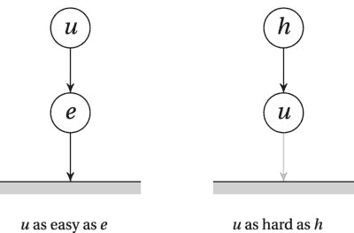
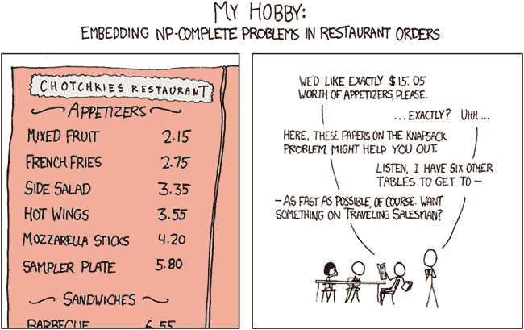
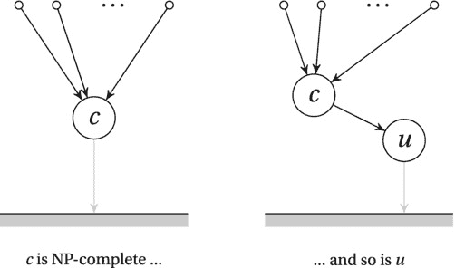
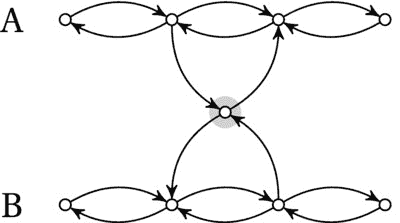
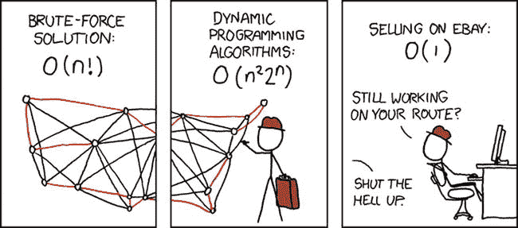

第十一章


难题和(有限的)马虎

最好是好的敌人。

—伏尔泰

这本书显然是关于算法问题解决的。到目前为止，重点一直是算法设计的基本原则，以及许多问题领域中重要算法的例子。现在，我给你看一下算法的另一面:硬度。尽管为许多重要而有趣的问题找到高效的算法肯定是可能的，但令人悲伤的事实是，大多数问题真的很难。事实上，大多数问题都很难，试图解决它们几乎没有意义。然后，重要的是要认识到困难，表明问题是难以解决的(或者至少很有可能如此)，并且知道除了简单地放弃之外还有什么选择。

这一章有三个部分。首先，我将解释世界上最大的未解问题之一的潜在思想——以及它如何适用于你。第二，我将在这些想法的基础上，向你们展示一些极其困难的问题，你们很可能会以这样或那样的形式遇到。最后，鉴于本章前两部分的令人沮丧的消息，我将向你展示如何遵循伏尔泰的智慧，并稍微放松你的要求，可以让你比看起来可能的更接近你的目标。

当您阅读下面的内容时，您可能想知道所有的代码都到哪里去了。需要明确的是，这一章的大部分内容都是关于那种太难的问题。这也是关于你如何发现一个给定问题的困难。这很重要，因为它探索了我们的程序实际上可以*做什么*的外部边界，但它并没有真正导致任何编程。只有在本章的最后三分之一，我才会关注(并给出一些代码)近似法和试探法。这些方法将允许你找到可用的解决方案来解决那些太难的问题，这些问题很难得到最优的、有效的、普遍的解决。他们通过利用一个漏洞实现了这一点——事实上，在现实生活中，我们可能满足于在这三个轴中的一些或所有轴上“足够好”的解决方案。

提示跳到这一章看似更有内容的部分，具体的问题和算法可能很有诱惑力。如果你想理解这一点，我强烈建议尝试一下更抽象的部分，至少从头开始略读这一章以获得一个概述。

还原还原

从第四章开始，我一直在时不时地讨论削减。大部分时间，我一直在谈论把问题简化成你知道如何解决的问题——要么是你正在处理的问题的较小实例，要么是一个完全不同的问题。这样，你也就有了这个新的未知问题的解决方案，实际上证明了它很简单(或者，至少，你可以解决它)。在《T2》第四章快结束的时候，我引入了一个不同的想法:向另一个方向减少来证明*的硬度*。在第 6 章的[中，我用这个想法给出了解决凸包问题的任何算法的最坏情况运行时间的下界。现在我们终于到达了这种技术完全在家的点。事实上，定义复杂性类别(和问题难度)是大多数教科书中通常使用的简化方法。不过，在深入讨论之前，我想从基础层面上彻底说明一下这种硬度证明是如何工作的。这个概念非常简单(虽然证明本身当然不需要)，但是出于某种原因，许多人(包括我自己)总是把它搞反了。也许——仅仅是也许——下面这个小故事可以在你试图回忆它是如何工作的时候帮到你。](06.html)

假设你来到一个小镇，这里的主要景点之一是一对双峰。当地人亲切地称这两个兄弟为 Castor 和 Pollux，以希腊和罗马神话中的孪生兄弟命名。有传言说在 Pollux 山顶上有一个被遗忘已久的金矿，但是许多冒险者已经迷失在这座危险的山中。事实上，已经有太多不成功的尝试试图到达金矿，以至于当地人开始相信这是不可能的。你决定出去走走，亲自看看。

在当地的路边小店买了甜甜圈和咖啡后，你出发了。走了一小段路后，你到了一个可以相对清晰地看到群山的有利位置。从你站的地方，你可以看到 Pollux 看起来真的像一个地狱般的攀登——陡峭的表面，深深的峡谷，周围布满荆棘。另一方面，蓖麻看起来像登山者的梦想。两边坡度平缓，似乎有许多扶手一直通到顶部。你不能确定，但看起来这可能是一次不错的攀登。可惜金矿不在上面。

你决定仔细看看，拿出双筒望远镜。这时你会发现一些奇怪的事情。在 Castor 的顶部似乎有一个小塔，上面有一条滑索一直延伸到 Pollux 的顶峰。立刻，你放弃了任何爬蓖麻的计划。为什么呢？(如果你没有立即看到它，它可能值得思考一下。) [<sup>1</sup>](#Fn1)

当然，在第 4 章和第 6 章关于硬度的讨论中，我们已经看到了确切的情况。滑索使得从 Castor 到 Pollux 变得很容易，所以如果 Castor 很容易的话，早就有人发现金矿了。 [<sup>2</sup>](#Fn2) 这是一个简单的反命题:如果 Castor 很容易，Pollux 也会很容易；Pollux 不容易，Castor 也不容易。当我们想证明一个问题(Castor)很难的时候，这正是我们要做的。我们拿一些我们*知道*很难的东西(Pollux)来说明使用我们新的未知的东西很容易解决这个难题(我们发现了一条从 Castor 到 Pollux 的拉链线)。

正如我之前提到的，这本身并不令人困惑。然而，当我们开始谈论减排时，很容易混淆。例如，我们在这里将 Pollux 简化为 Castor，这对您来说是不是很明显？减少的部分是 zip line，它让我们可以像使用 Pollux 的解决方案一样使用 Castor 的解决方案。换句话说，如果你想证明问题 X 是难的，那就找一些难的问题 Y，化归到 X。

 **注意**滑索在*与减速*相反的方向。至关重要的是*你不能混淆，否则整个想法就会瓦解。*归约*这个词在这里的意思基本上是“哦，那很简单，你只要……”换句话说，如果你把 A 归约为 B，你就是在说“你想解 A？这很简单，你只需解决 b。”或者在这种情况下:“你想缩放 Pollux？这很简单，只需缩放 Castor(并采取滑索)。”换句话说，我们将 Pollux 的伸缩性降低到 Castor 的伸缩性(而*不是*反过来)。*

这里有几件事值得注意。首先，我们假设 zip line*易于使用*。如果不是滑索而是一条你必须平衡的水平线呢？这真的很难——所以它不会给我们任何信息。就我们所知，人们可能很容易到达卡斯特的顶峰；他们可能无论如何也到不了 Pollux 上的金矿，所以我们知道些什么？另一个是相反方向的减少也没有告诉我们什么。从 Pollux 到 Castor 的一条滑索不会影响我们对 Castor 的估计。那么，如果你能从 Pollux 到 Castor 呢？你无论如何也无法到达波利克斯的顶峰！

考虑图 11-1 的[图。节点代表问题，](#Fig1)，边代表简单的减少(也就是说，渐进地，它们无关紧要)。底部的粗线是为了说明“地面”，从某种意义上说，未解决的问题是“天上的”，而解决它们就相当于将它们减少到零，或将其接地。第一幅图展示了未知问题 *u* 被简化为已知的简单问题 *e* 的情况。从 *e* 到地面有一个简单的减少，这代表了 *e* 容易的事实。因此，将 *u* 连接到 *e* 为我们提供了一条从 *u* 到地面的路径——一个解决方案。



[图 11-1](#_Fig1) 。归约的两种用途:将未知问题归约为简单问题，或将困难问题归约为未知问题。在后一种情况下，未知问题一定和已知问题一样难

现在看第二张图片。在这里，一个已知的难题被简化为未知问题 *u* 。我们能有一条从 *u* 到地面的边吗(就像图中的灰色边)？那会给我们一条从 *h* 到地面的路径——但是这样的路径不可能存在，否则 *h* 不会很难！

在下文中，我将使用这一基本思想，不仅表明问题是困难的，而且还将*定义*一些困难的概念。正如你可能(也可能没有)注意到的，这里的术语 *hard* 有些模糊。它基本上可以有两种不同的含义:

*   这个问题很棘手——任何解决它的算法都必须是指数级的。
*   我们不知道这个问题是否棘手，但从来没有人能够找到它的多项式算法。

第一个意思是这个问题对计算机来说很难解决，而第二个意思是对人来说也很难(也许对计算机来说也是如此)。再看一下[图 11-1](#Fig1) 中最右边的图像。“努力”的两种含义在这里是如何起作用的？让我们举第一个例子:我们*知道*这个 *h* 很难处理。高效解决是*不可能*的。对 *u* 的解决方案(即降低到地)意味着对 *h* 的解决方案，因此不存在这样的解决方案。所以， *u* 也一定是顽固性的。

第二种情况有点不同——这里的困难在于缺乏知识。我们不知道问题 *h* 是否棘手，尽管我们知道似乎很难找到解决方案。核心见解仍然是，如果我们把 *h* 减少到 *u* ，那么 *u* 至少和 h 一样硬。如果说 *h* 难对付，那么 *u* 也难对付。此外，许多人试图找到解决问题的方法，这一事实使得我们成功的可能性变得更小，这也意味着我们不太可能是易驾驭的。为解决 *h* 问题付出的努力越多，如果 *u* 变得容易控制(因为那样的话 *h* 也会变得容易控制)就会越令人吃惊。事实上，这正是一系列实际重要问题的情况:我们不知道这些问题是否棘手，但大多数人仍然坚信它们是棘手的。让我们仔细看看这些流氓问题。

子问题归约

虽然通过使用归约来显示困难的想法可能有点抽象和奇怪，但是有一个特例(或者在某些方面，一个不同的视角)可能很容易理解:如果你的问题有一个困难的子问题，那么这个问题作为一个整体(显然)是困难的。换句话说，如果解决你的问题意味着你也必须解决一个众所周知的难题，那么你基本上就不走运了。例如，如果你的老板让你制作一个反重力悬浮滑板，你可能会做很多工作，比如制作滑板本身或者在一个漂亮的图案上绘画。然而，实际上解决绕过重力的问题使得整个努力从一开始就注定失败。

那么，这是如何减少的呢？这是一种简化，因为你仍然可以用你的问题来解决困难的子问题。换句话说，如果你能够*建造*一个反重力悬浮滑板，那么你的解决方案就可以(再次，非常明显)用于规避重力。和大多数削减一样，困难的问题甚至没有真正转化；只是嵌入了一个(相当不相关的)语境。或者考虑一般排序的最坏情况运行时间的对数线性下限。如果您要编写一个程序，它接收一组对象，对它们执行一些操作，然后按排序顺序输出关于对象的信息，那么在最坏的情况下，您可能不会比对数线性更好。

但为什么是“可能”？因为这取决于是否有真正的减少。你的程序可以被想象成“分类机器”吗？如果我可以随心所欲地使用你的程序，有没有可能给它输入一些对象，让我对任何实数进行排序？如果是，那么界限成立。如果没有，那么也许没有。例如，也许排序是基于可以使用计数排序的整数？或者也许你实际上自己创建了排序键，所以对象可以按你喜欢的任何顺序输出？你的问题是否*足够表达*的问题——是否能表达一般的排序问题。事实上，这是本章的关键观点之一:问题的难度是一个表达的问题。

已经不在堪萨斯了？

当我为第一版写下这一章时，一篇科学论文在网上发表后，兴奋才刚刚开始在互联网上消退，该论文声称已证明解决了所谓的 P 对 NP 问题，并得出结论说 P 不等于 NP。尽管新出现的共识是证明是有缺陷的，但这篇论文引起了极大的兴趣——至少在计算机科学界。此外，具有类似主张(或者相反，P 等于 NP)的不太可信的论文不断定期出现。自 20 世纪 70 年代以来，计算机科学家和数学家一直在研究这个问题，这个解决方案甚至获得了一百万美元的奖金。尽管在理解这个问题上已经取得了很大的进展，但似乎还没有真正的解决方案。为什么这么难？为什么它如此重要？而 P 和 NP 到底是什么？

问题是，我们真的不知道我们生活在一个什么样的世界。用*绿野仙踪*来打个比方——我们可能*认为*我们生活在堪萨斯州，但是如果有人证明 P = NP，我们肯定已经不在堪萨斯州了。相反，我们会置身于某种类似于奥兹的仙境，一个拉塞尔·因帕利亚佐命名为算法的世界。 [<sup>5</sup>](#Fn5) 你说 Algorithmica 有什么了不起？在 Algorithmica，引用一首众所周知的歌曲，“你永远不会换袜子，小股酒精流从岩石上流淌下来。”更严重的是，生活会少很多问题。如果你能陈述一个数学问题，你也能自动解决它。事实上，程序员不再需要告诉计算机做什么——他们只需要给出想要的输出的清晰描述。几乎任何一种优化都是微不足道的。另一方面，密码学现在会变得非常困难，因为破解密码会变得非常非常容易。

问题是，P 和 NP 看起来是非常不同的野兽，尽管它们都是问题的类别。事实上，它们是一类*决策问题*，可以用*是*或*否*来回答的问题。这可能是一个问题，例如“是否存在一条从 *s* 到 *t* 的路径，其权重至多为 *w* ？”或者“有没有一种方法可以把物品装进这个背包，让我得到至少 *v* 的价值？”第一类，P，被定义为由那些我们可以在多项式时间**(在最坏的情况下)内解决的问题组成。换句话说，如果你把我们到目前为止看到的几乎所有问题都变成决策问题，结果将属于 p。**

 *NP 似乎有一个更宽松的定义 [<sup>6</sup>](#Fn6) :它包括任何可以在多项式时间内被称为 *非确定性图灵机*或 NTM 的“神奇计算机”解决的决策问题。这就是 NP 中的 N 的来源——NP 代表“非确定性多项式”。据我们所知，这些非决定论的机器超级强大。基本上，在他们需要做出选择的任何时候，他们都可以猜，而且*通过魔法*，他们总是猜对。听起来很棒，对吧？

例如，考虑在图中找到从 *s* 到 *t* 的最短路径的问题。你已经知道很多关于如何用更…非数学类的算法做到这一点。但是如果你有一个 NTM 呢？你可以从 *s* 开始，看看邻居。你应该走哪条路？谁知道呢——猜猜看。因为你正在使用的机器，你将永远是正确的，所以你将神奇地沿着最短的路径行走，不走弯路。例如，对于 DAG 中的最短路径这样的问题，这可能看起来不像是一个巨大的胜利。这是一个可爱的聚会把戏，当然，但运行时间将是线性的。

但是考虑一下第一章中的第一个问题:尽可能高效地游览一次瑞典的所有城镇。还记得几年前我说过用最先进的技术解决这个问题花了大约 85 个 CPU 年吗？如果有一个 NTM，每个城镇只需要一个计算步骤。即使你的机器是带手摇曲柄的机械，它也应该在几秒钟内完成计算。这个*看起来很强大吧？而且神奇？*

 *描述 NP(或者，就此而言，非确定性计算机)的另一种方式是看*解决*问题和*检查*解决方案之间的区别。我们已经知道解决问题意味着什么。如果我们要*检查*一个决策问题的解决方案，我们需要的不仅仅是“是”或“否”——我们还需要某种证明，或者*证书*(这个证书需要是多项式大小)。例如，如果我们想知道是否存在从 *s* 到 *t* 的路径，证书可能就是实际的路径。换句话说，如果你解决了问题，发现答案是“是”，你可以用这个证明来说服我这是真的。换句话说，如果你设法证明了某个数学陈述，你的证明可能就是证明。

那么，一个属于 NP 的问题的要求是，我能够在多项式时间内检查任何“是”答案的证书。非确定性图灵机可以通过简单地猜测证书来解决任何这样的问题。魔法，对吧？

嗯，也许…你看，这就是问题所在。我们知道 P 是*而不是*神奇的——它充满了我们非常清楚如何解决的问题。NP *看起来*像是一大类问题，任何能解决所有这些问题的机器都将超越这个世界。问题是，在 Algorithmica 中，有一种叫做 NTM 的东西。或者，更确切地说，我们非常普通、单调的计算机(确定性图灵机)将被证明是*一样强大的*。他们一直都有魔力！如果 P = NP，我们可以解决任何有实际(可验证)解决方案的(决策)问题。

同时，回到堪萨斯…

好吧，Algorithmica 是一个神奇的世界，如果我们真的生活在其中，那将会非常棒——但很有可能，我们不是。十有八九，*发现*证据和*检查*证据之间有着非常真实的区别——在*解决*问题和每次简单地*猜测*正确的解决方案之间。所以如果我们还在堪萨斯，我们为什么要关心这些？

因为它给了我们一个非常有用的硬度概念。你看，我们有一群卑鄙的小动物组成了一个叫 NPC 的班级。这代表“NP-complete”，这些是所有 NP 中最难的*个问题。更准确地说，NPC 的每个问题至少和 NP 中的其他问题一样难。我们不知道这些问题是否棘手，但是如果你要解决其中一个棘手的问题，你会自动把我们都送到 Algorithmica！虽然世界人口可能会为不用再换袜子而高兴，但这不太可能发生(我希望上一节强调了这一点)。这将是非常惊人的，但似乎完全不可行。*

这不仅会非常奇怪，而且考虑到巨大的优势和巨大的努力，仅仅是为了打破其中一个生物，四十年的失败(到目前为止)似乎会增强我们的信心，相信你不会是成功的那个。至少短期内不会。换句话说，NP 完全问题*可能*很棘手(对计算机来说很难)，但迄今为止，它们*肯定*对人类来说很难。



***NP-完成。*** *一般方案给你 50%的小费。(* *`http://xkcd.com/287`* *)*

但是这一切是如何运作的呢？为什么杀死一个 NPC 怪物会让所有的 NP 完全崩溃，让我们陷入算法世界？让我们回到我们的简化图。看一下[图 11-2](#Fig2) 。现在，假设所有的节点都代表 NP 中的问题(也就是说，目前我们把 NP 视为“整个世界的问题”)。左图说明了完整性的概念。在一类问题中，一个问题 *c* 是*完备*如果该类中的所有问题都可以“容易地”化为 *c* 。 [<sup>7</sup>](#Fn7) 在这种情况下，我们讨论的类是 NP，如果它们是多项式，那么归约就“容易”了。换句话说，一个问题 *c* 是 NP 完全的，如果(1) *c* 本身在 NP 中，并且(2)NP 中的每一个问题都可以在多项式时间内化简为 *c* 。



[图 11-2](#_Fig2) 。NP 完全问题是 NP 中至少和其他问题一样难的问题。即 NP 中的所有问题都可以归结为它

(NP 中的)每一个问题都可以归结为这些棘手的问题，这意味着它们是核心——如果你能解决它们，你就能解决 NP 中的任何问题(突然间，我们不再是在堪萨斯了)。该图应该有助于澄清这一点:解决 *c* 意味着添加一个从 *c* 到地面的实心箭头(将其化为零)，这立即给我们提供了一条从 NP 中的每个*其他*问题到地面的路径，*经由 c* 。

我们现在用归约来定义 NP 中最困难的问题，但是我们可以稍微扩展这个概念。在[图 11-2](#Fig2) 中的右图说明了我们如何使用缩减*过渡*，用于硬度校样，例如我们之前讨论过的那些(例如，像在[图 11-1](#Fig1) 中右边的那个)。我们知道 *c* 是硬的，所以简化为 *u* 证明 *u* 是硬的。我们已经知道这是如何工作的，但是这个图说明了为什么在这个例子中它是正确的一个稍微更技术性的原因。通过将 *c* 减少为 *u* ，我们现在已经将 *u* 放置在 *c* 原来所在的相同位置。我们已经知道 NP 中的每个问题都可以归结为 *c* (意味着它是 NP 完全的)。现在我们也知道，每一个问题都可以通过 *c* 归结为 *u* 。换句话说， *u* 也满足 NP-完全性的定义——如图所示，如果我们能在多项式时间内解决它，我们将建立 P = NP。

到目前为止，我只讨论了决策问题。这样做的主要原因是，它使形式推理中的许多事情(其中大部分我不会在这里介绍)变得更加容易。即便如此，这些想法也适用于其他类型的问题，例如我们在本书中处理的许多优化问题(将在本章后面处理)。

例如，考虑寻找最短的瑞典之旅的问题。因为不是决策问题，不在 NP。即便如此，这也是一个非常困难的问题(从“人类很难解决”和“很可能难以解决”的意义上来说)，就像 NP 中的任何事情一样，如果我们发现自己在 Algorithmica 中，它会突然变得很容易。这两点我们分开考虑。

术语*完全性*是为一个类中最难的问题*保留的，所以 NP 完全问题是 NP 的类霸王。不过，我们也可以对*可能不属于这个类别的问题使用相同的硬度标准。也就是说，任何问题至少与 NP 中的任何问题一样困难(由多项式时间缩减确定)，但不需要*本身*在 NP 中。这样的问题叫做 *NP 难*。这意味着 NP 完全问题的 NPC 类的另一个定义是，它包括 NP 中所有的 NP 困难问题。是的，通过一个图寻找最短的路线(比如通过瑞典的城镇)是一个 NP-hard 问题，称为旅行推销员(或销售代表)问题，或者通常只是 TSP。我稍后将回到那个问题。**

关于另一点:如果 P = NP，为什么像这样的优化问题会很容易？关于如何使用证书找到实际的路线等等，还有一些技术细节，但是让我们只关注 NP 的是-否性质和我们在 TSP 问题中寻找的数字长度之间的区别。为了简单起见，我们假设所有的边权重都是整数。此外，因为 P = NP，我们可以在多项式时间内解决决策问题的是和否实例(参见侧栏“不对称、共 NP 和算法的奇迹”)。一种方法是将决策问题作为一个黑箱，对最优答案进行二分搜索法。

例如，我们可以对所有的边权重求和，我们得到 TSP 旅行的成本的上限 *C* ，下限为 0。然后我们初步猜测最小值是 *C* /2，并解决决策问题“是否存在长度最多为 *C* /2 的游览？”我们在多项式时间内得到“是”或“否”,然后可以继续平分值范围的上半部分或下半部分。练习 11-1 要求你展示产生的算法是多项式的。

 **提示**这种用黑盒一分为二的策略也可以用在其他情况下，甚至在复杂性类的上下文之外。如果您有一个算法可以让您确定一个参数是否足够大，您可以一分为二，以对数因子为代价找到正确/最佳的值。相当便宜，真的。

换句话说，尽管复杂性理论主要关注决策问题，但优化问题并没有什么不同。在许多情况下，你可能会听到人们使用术语 NP-完全，而他们真正的意思是 NP-难。当然，你应该小心把事情做对，但是你是否表明一个问题是 NP 难的还是 NP 完全的，对于争论它的困难性的实际目的来说并不那么重要。(只要确保你的削减是在正确的方向上！)

不对称、共 NP 和算法的奇迹

NP 的类别是不对称定义的。它由所有决策问题组成，这些问题的 *yes* 实例可以用 NTM 在多项式时间内解决。但是，请注意，我们没有提到任何关于 *no* 实例的内容。因此，举例来说，很明显，如果有一个旅游团恰好游览瑞典的每个城镇一次，一个 NTM 会在合理的时间内回答“是”。然而，如果答案是“不”，它可能需要一段甜蜜的时间。

这种不对称背后的直觉很容易理解，真的。这个想法是，为了回答“是”，NTM 只需要(通过“魔法”)找到一个单一的选择集合，导致这个答案的计算。然而，为了回答“否”，它需要确定不存在这样的计算。虽然这看起来非常不同，但是我们并不知道它是否是 T1。你看，这里我们有另一个复杂性理论中的“相对问题”: NP 对 co-NP。

co-NP 类是 NP 问题的补集类。对于每一个“是”的回答，我们现在都想要“不是”，反之亦然。如果 NP 是真正不对称的，那么这两个类是不同的，尽管它们之间有重叠。例如，所有的 P 都位于它们的交叉点上，因为 P 中的 yes 和 no 实例都可以用 NTM 在多项式时间内解决(就此而言，还可以用确定性图灵机解决)。

现在考虑如果在 NP 和 co-NP 的交集中发现 NP 完全问题 FOO 会发生什么。首先，NP 中的所有问题都归结为 NPC，所以这将意味着 NP 的所有*将在 co-NP 中(因为我们现在可以通过 FOO 处理它们的补码)。NP 之外的 co-NP 还会有问题吗？考虑这样一个假设的问题吧。它的补语 co-BAR 应该在 NP 中，对吗？但是因为 NP 在 co-NP 里面，所以 co-BAR*也会*在 co-NP 里面。这意味着它的补码 BAR 应该在 NP 中。但是，但是，但是……我们假设它是 NP 的*外的*——矛盾！*

换句话说，如果我们在 NP 和 co-NP 的交集中找到单个 NP-完全问题，我们将证明 NP = co-NP，并且不对称已经消失。如上所述，所有的 P 都在这个交点上，所以如果 P = NP，我们也有 NP = co-NP。这意味着在 Algorithmica 中，NP 是令人愉快的对称的。

注意，这个结论经常被用来论证在 NP 和 co-NP 的交集中*是*的问题很可能*不是* NP 完全，因为(强烈)认为 NP 和 co-NP 是不同的。例如，没有人找到分解数字问题的多项式解，这就形成了许多密码学的基础。然而问题存在于 NP 和 co-NP 中，所以大多数计算机科学家认为这是*而不是* NP 完全。

但是你从哪里开始呢？你从那里去哪里？

我希望现在基本的想法已经很清楚了:NP 类包括所有的决策问题，这些问题的“是”答案可以在多项式时间内得到验证。NPC 类由 NP 中最难的问题组成；NP 中的所有问题都可以在多项式时间内归结为这些。p 是我们可以在多项式时间内解决的 NP 问题的集合。由于类的定义方式，如果 P 和 NPC 之间有一点重叠，我们就有 P = NP = NPC。我们还建立了，如果我们有一个从 NP 完全问题到 NP 中其他问题的多项式时间约简，那么第二个问题也一定是 NP 完全的。(自然，所有的 NP 完全问题都可以在多项式时间内相互约化；参见练习 11-2。)

这给了我们*看起来*有用的硬度概念——但是到目前为止，我们甚至还没有确定*存在*NP 完全问题，更不用说*发现了*一个。我们该怎么做？库克和莱文来救援了！

在 20 世纪 70 年代初，史蒂文·库克证明了确实存在这样的问题，不久之后，列昂尼德·莱文独立地证明了同样的事情。他们都证明了一个叫做 *布尔可满足性*或 SAT 的问题是 NP 完全的。这个结果以他们两个的名字命名，现在被称为库克-莱文定理。这个定理给了我们起点，它相当高级，我在这里无法给你一个完整的证明，但我会试着勾勒出主要思想。(例如，Garey 和 Johnson 给出了充分的证明；请参见“参考资料”部分。)

SAT 问题取一个逻辑公式，比如`(A or not B) and (B or C)`，问有没有办法让它成真(也就是*满足*它)。在这种情况下，当然有。例如，我们可以设置`A = B = True`。为了证明这是 NP 完全的，考虑 NP 中的任意问题 FOO，以及如何将其简化为 SAT。这个想法是首先构造一个 NTM，它将在多项式时间内求解 FOO。从定义上来说这是可能的(因为 FOO 在 NP 中)。然后，对于 FOO 的给定实例 *bar* (也就是说，对于机器的给定输入)，您将(在多项式时间内)构造一个逻辑公式(多项式大小),表示如下:

*   机器的输入是*条*。
*   这台机器工作正常。
*   机器停下来回答“是”

棘手的部分是你如何用布尔代数来表达它，但是一旦你这么做了，很明显 NTM 实际上是由这个逻辑公式给出的 SAT 问题模拟的。如果公式是可满足的——也就是说，如果(且仅当)我们可以通过为各种变量(代表机器做出的神奇选择等)赋予真值来实现它，那么原始问题的答案应该是“是”。

概括一下，库克-莱文定理说 SAT 是 NP 完全的，这个证明基本上给了你一个用 SAT 问题模拟 ntm 的方法。这适用于基本 SAT 问题及其近亲电路 SAT，其中我们使用逻辑(数字)电路，而不是逻辑公式。

这里的一个重要思想是，所有逻辑公式都可以写成所谓的 *合取范式* (CNF)，也就是说，作为子句的合取(一系列`and` s)，其中每个子句都是一系列`or` s。变量的每次出现可以是形式`A`或其否定形式`not A`。这些公式可能一开始就不在 CNF中，但是它们可以被自动(高效地)转换。例如，考虑公式`A and (B or (C and D))`。与 CNF 的另一个公式完全等价:`A and (B or C) and (B or D)`。

因为任何公式都可以被有效地改写成(不太大的)CNF 版本，所以 CNF SAT 是 NP 完全的就不足为奇了。有意思的是，即使我们将每个子句的变量个数限制为 *k* ，得到所谓的 *k* -CNF-SAT(或者简单的说 *k* -SAT)问题，只要 *k* > 2，仍然可以表现出 NP-完全性。你会看到很多 NP 完全性证明都是基于 3-SAT 是 NP 完全的事实。

2-SAT NP 完全吗？谁知道…

当处理复杂类时，您需要注意特殊情况。例如，背包问题的变体(或者子集和，稍后您会遇到)被用于加密。事实是，背包问题的许多情况都很容易解决。事实上，如果背包容量以多项式为界(作为物品数量的函数)，问题就在 P(见练习 11-3)。如果在构造问题实例时不小心，加密很容易被破解。

我们和 *k* -SAT 也有类似的情况。对于 *k* ≥3，这个问题是 NP 完全的。然而，对于 *k* =2，它可以在多项式时间内求解。或者考虑最长路径问题。一般来说这是 NP 难的，但是如果你碰巧知道你的图是一个 DAG，你可以在线性时间内求解。事实上，在一般情况下，即使是最短路径问题也是 NP 难的。这里的解决方案是假设不存在负循环。

如果您不使用加密，这种现象是个好消息。这意味着，即使你遇到了一个问题，它的一般形式是 NP 完全的，你需要处理的具体实例可能是在 p 中，这是一个你可能称之为硬度不稳定性的例子。稍微调整一下你的问题*的需求*会有很大的不同，让一个棘手的问题变得容易处理，甚至让一个无法决定的问题(比如停机问题)变得可以决定。这就是近似算法(稍后讨论)如此有用的原因。

这是否意味着 2-SAT 不是 NP 完全的？事实上，没有。得出这个结论是一个容易陷入的陷阱。只有当 P ≠ NP 时才成立，否则 P 中的所有问题都是 NP 完全的。换句话说，我们的 NP 完全性证明对于 2-SAT 是失败的，我们可以证明它在 P 中，但是我们不知道它在 NPC 是 T2 而不是 T3。

现在我们有了一个起点:SAT 和它的好朋友，Circuit SAT 和 3-SAT。然而，仍然有许多问题需要研究，复制库克和莱文的壮举似乎有点令人生畏。例如，你如何证明 NP 中的每一个问题都可以通过寻找一个城镇之旅来解决？

这是我们(最终)开始着手削减的地方。让我们来看一个相当简单的 NP 完全问题，即寻找哈密尔顿圈。我已经在第五章中提到了这个问题(在侧栏“在加里宁格勒跳岛”)。问题是确定一个有 *n* 个节点的图是否有一个长度为 *n* 的圈；也就是说，你能准确地访问每个节点一次，然后沿着图的边回到你的起点吗？

这看起来并不像 SAT 问题那样具有表现力——毕竟，在 SAT 问题中，我们可以使用命题逻辑的完整语言——所以对 ntm 进行编码似乎有点多。如你所见，事实并非如此。汉密尔顿循环问题和 SAT 问题一样具有表现力。我的意思是，从 SAT 到哈密尔顿圈问题有一个多项式时间的缩减。换句话说，我们可以使用汉密尔顿循环问题的机制来创建一个 SAT 解决机器！

我将带你了解细节，但在此之前，我想请你记住你脑海中的大图:我们正在做的事情的总体想法是，我们将一个问题作为一种机器来处理，我们几乎要给那台机器编程来解决一个不同的问题。这种简化就是隐喻编程。考虑到这一点，让我们看看如何将布尔公式编码为图形，以便用一个哈密尔顿循环来表示满意度…

为了简单起见，让我们假设我们想要满足的公式是 CNF 形式的。我们甚至可以假设 3-SAT(虽然这并不是真正必要的)。这意味着我们需要满足一系列子句，在每一个子句中，我们需要满足至少一个元素，这些元素可以是变量(如`A`)或它们的否定(`not A`)。真值需要用路径和循环来表示，那么假设我们将每个变量的真值编码为一个路径的*方向*。

这个想法在[图 11-3](#Fig3) 中有说明。每个变量都由单行节点表示，这些节点用反平行边链接在一起，这样我们就可以从左到右或者从右到左移动。一个方向(比如从左到右)表示变量被设置为*真*，而另一个方向表示*假*。只要我们有足够的节点，节点的数量并不重要。 [<sup>8</sup>](#Fn8)


[图 11-3](#_Fig3) 。一个“行”，代表我们试图满足的布尔表达式的变量。如果循环从左向右通过，变量为真；否则，它就是假的

在我们开始尝试对实际公式进行编码之前，我们希望强制我们的机器将每个变量设置为两个可能的逻辑值中的一个。也就是说，我们要确保任何哈密尔顿循环都会经过每一行(方向给我们真值)。我们还必须确保循环在从一行到下一行时可以自由转换方向，这样变量就可以彼此独立地赋值。我们可以通过用两条边将每一行连接到下一行，在两端的锚点处(在[图 11-3](#Fig3) 中突出显示)，如图[图 11-4](#Fig4) 所示。


[图 11-4](#_Fig4) 。这些行是链接在一起的，所以当从一个变量到下一个变量时，哈密尔顿循环可以保持或改变它的方向，让 A 和 B 彼此独立地为真或为假

如果我们只有如图[图 11-4](#Fig4) 所示的一组连接的行，那么图中就没有哈密尔顿圈。我们只能从一排走到下一排，没有办法再站起来。然后，对基本行结构的最后一点修改是在顶部添加一个源节点 *s* (具有到第一行的左右锚点的边)和在底部添加一个接收器节点 *t* (具有来自最后一行的左右锚点的边)，然后添加从 *t* 到 *s* 的边。

在继续之前，你应该说服自己，这个结构确实做了我们想要它做的事情。对于 *k* 变量，我们到目前为止构建的图将具有 2 个 <sup>*k*</sup> 不同的哈密尔顿循环，一个用于变量的真值的每个可能赋值，真值由给定行中向左或向右的循环表示。

既然我们已经在汉密尔顿机器中编码了将真值赋给一组逻辑变量的想法，我们只需要一种方法来编码涉及这些变量的实际公式。我们可以通过为每个子句引入一个节点来做到这一点。一个哈密尔顿循环将必须精确地访问这些中的每一个一次。诀窍是将这些子句节点挂接到我们现有的行上，以利用这些行已经编码了真值这一事实。我们进行设置，以便循环可以通过子句节点从路径中绕道，但是只有在正确的方向上才是*。因此，例如，如果我们有子句`(A or not B)`，我们将向 A 行添加一个迂回，要求循环从左到右，并且我们向 B 行添加另一个迂回(通过相同的子句节点)，但是这次是从右到左(因为`not`)。我们需要注意的唯一一件事是，没有两条弯路可以链接到相同位置的行——这就是为什么我们需要在每一行中有多个节点，这样我们就有足够多的节点用于所有的子句。你可以在[图 11-5](#Fig5) 中看到我们的例子是如何工作的。*



[图 11-5](#_Fig5) 。使用子句节点(突出显示)对子句(A 或 not B)进行编码，并添加要求 A 为真(从左到右)和 B 为假(从右到左)的迂回路径，以满足子句(即访问节点)

以这种方式对子句进行编码后，只要每个子句的变量中至少有一个具有正确的真值，就可以满足每个子句，让它绕过子句节点。因为一个哈密尔顿循环必须访问每个节点(包括每个子句节点)，所以满足公式的*和*-部分。换句话说，逻辑公式是可满足的，当且仅当在我们构建的图中存在哈密尔顿圈。这意味着我们已经成功地将 SAT(或者更具体地说，CNF-SAT)简化为 Hamilton 圈问题，从而证明后者是 NP 完全的！这有那么难吗？

好吧，确实有点难。至少你自己想这样的事情会很有挑战性。幸运的是，许多 NP 完全问题比 SAT 和汉密尔顿圈问题更相似，正如你将在下文中看到的。

没完没了的故事

这个故事还有更多。事实上，这个故事还有很多，你不会相信的。复杂性理论是一个独立的领域，有*吨*的结果，更不用说复杂性类了。(为了一瞥正在被研究的类的多样性，你可以去复杂性动物园。)

这个领域的一个形成性例子是一个比 NP 完全问题难*得多的问题:艾伦·图灵的停顿问题(在第四章中提到)。它只是要求你确定一个给定的算法是否会终止于一个给定的输入。为了理解为什么这实际上是不可能的，假设您有一个函数`halt`，它将一个函数和一个输入作为其参数，这样如果`A(X)`终止，那么`halt(A, X)`将返回 true，否则返回 false。现在，考虑以下函数:*

`def trouble(A):`
T1】

调用`halt(A, A)`确定`A`在应用于自身时是否暂停。这样还舒服吗？如果你评价`trouble(trouble)`会怎么样？基本上，它停了就不停，不停就停……我们有一个悖论(或者矛盾)，意思是`halt`不可能存在。停顿问题是*无法决定的*。换句话说，解决它是不可能的。

但你认为不可能很难？正如一位伟大的拳击手曾经说过的，不可能就是一切。事实上，有一种东西叫做*高度*不可判定，或者“非常不可能”对于这些有趣的介绍，我推荐大卫·哈雷尔的*电脑有限公司:他们真的不能做什么*。

怪兽之家

在这一节中，我将简要介绍几千个已知的 NP 完全问题中的几个。请注意，这里的描述同时服务于两个目的。第一个，也是最明显的，目的是给你一个大量困难问题的概述，这样你就可以更容易地认识到(并证明)你在编程中可能遇到的任何困难。我可以通过简单地列出(并简要描述)问题来给你一个概述。然而，我也想给你一些硬度证明如何工作的例子，所以我将在这一节描述相关的减少。

背包的回归

这一节的问题大多是关于选择子集的。这是一种你在很多场合都会遇到的问题。也许你正试图选择在一定的预算内完成哪些项目？还是把不同大小的箱子装进尽可能少的卡车里？或者，也许你正试图用一组箱子装满一组固定的卡车，这将给你带来尽可能多的利润？幸运的是，这些问题中的许多在实践中有相当有效的解决方案(例如第 8 章中的背包问题的伪多项式解决方案和本章稍后讨论的近似)，但是如果你想要一个多项式算法，你可能就不走运了。 [<sup>9</sup>](#Fn9)

 **注**伪多项式解只为*一些* NP-hard 问题所知。事实上，对于很多 NP 难的问题，你*找不到*的伪多项式解，除非 P = NP。Garey 和 Johnson 称这些为强意义上的 NP 完全。(更多细节，请参见他们的书《计算机和棘手问题》中的第 4.2 节。)

背包问题现在应该很熟悉了。我在第 7 章的[中重点讨论了分数版本，在第 8 章](07.html)的[中，我们使用动态编程构造了一个伪多项式解。在这一节中，我将研究背包问题本身和它的几个朋友。](08.html)

先说看似简单的事情， [<sup>10</sup>](#Fn10) 所谓的*分区问题*。这看起来真的很无辜——这只是公平分配的问题。最简单的形式是，划分问题要求你获取一个数字列表(比如说整数)，并将其划分为两个和相等的列表。将 SAT 简化为分区问题有点复杂，所以我只想请你在这一点上相信我(或者，更确切地说，参见 Garey 和 Johnson 的解释)。

不过，从分区问题转移到其他问题要容易得多。因为看起来复杂性很低，所以使用其他问题来模拟分区问题会很容易。就拿*箱包装*的问题来说吧。这里我们有一组大小在 0 到 *k* 范围内的物品，我们想把它们装进大小为 *k* 的箱子里。从划分问题中进行简化相当容易:我们只需将 *k* 设置为数字总和的一半。现在，如果装箱问题设法将数字塞进两个箱子，那么划分问题的答案是肯定的；否则，答案是否定的。这意味着装箱问题是 NP 难的。

另一个众所周知的简单陈述的问题是所谓的子集和问题。这里你又一次有了一组数字，你想找到一个子集，它的总和等于某个给定的常数， *k* 。再次，找到一个减少是足够容易的。例如，我们可以通过(再次)将 *k* 设置为数字之和的一半来减少划分问题。子集和问题的一个版本将 *k* 锁定为零——尽管这个问题仍然是 NP 完全的(练习 11-4)。

现在，让我们看看实际的(整数的，非分数的)背包问题。先处理 0-1 版本。如果我们愿意，我们可以从划分问题中再次约简，但我认为从子集和中约简更容易。背包问题也可以被公式化为一个决策问题，但是假设我们正在使用我们以前见过的相同优化版本:我们希望最大化项目值的总和，同时保持项目大小的总和低于我们的容量。让每一项都是子集和问题中的一个数，让价值和重量都等于那个数。

现在，我们能得到的最好的可能答案是我们与背包容量*完全匹配*。只要把容量设为 *k* ，背包问题就会给出我们所寻求的答案:能否把背包装满，等价于能否找到一笔 *k* 。

为了总结这一节，我将简单地触及一个最明显的问题: *整数编程*。这是*线性规划*技术的一个版本，其中线性函数在一组线性约束下被优化。然而，在整数编程中，你还要求变量只能取整数值——这打破了所有现有的算法。这也意味着你可以减少各种各样的问题，这些背包式的问题就是一个明显的例子。事实上，我们可以证明 0-1 整数规划这种特殊情况是 NP 难的。假设背包问题的每一项都是一个变量，可以取值为 0 或 1。然后在这些基础上建立两个线性函数，分别以值和权重作为系数。您可以根据值优化一个，并根据权重将一个限制在容量以下。结果会给你背包问题的最优解。 [<sup>11</sup>](#Fn11)

无界积分背包呢？在[第八章](08.html)中，我算出了一个伪多项式解，但是真的是 NP 难吗？当然，它看起来确实与 0-1 背包关系密切，但这种对应关系并不十分密切，因此减少是明显的。事实上，这是一个很好的机会来试着做一个缩减——所以我将指导你做练习 11-5。

派系和色彩

让我们从数字子集转移到寻找图形中的结构。这些问题中有许多是关于冲突的。例如，您可能正在为一所大学编写一个日程安排软件，并且您正试图最小化涉及教师、学生、班级和礼堂的时间冲突。祝你好运。或者你正在编写一个编译器，你想通过找出哪些变量可以共享一个寄存器来最大限度地减少使用的寄存器数量？和以前一样，您可能在实践中找到可接受的解决方案，但是您可能无法在一般情况下最优地解决大型实例。

我已经多次讨论过二分图——其节点可以分成两个集合的图，这样所有的边都在集合之间(也就是说，没有边连接同一集合中的节点)。另一种方式可以看作是*双色*，其中你将每个节点涂成黑色或白色(举例来说)，但是你要确保没有邻居有相同的颜色。如果这是可能的，那么这个图就是二部图。

现在，如果你想看看一个图是否是*三分的*，也就是说，你是否能管理一个*三色的*？事实证明，这并不容易。(当然，一个*k*-给 *k* > 3 上色也不容易；参见练习 11-6。)把 3-SAT 简化为三色，其实也没那么难。然而，这有点复杂(就像本章前面的哈密尔顿循环证明一样)，所以我只告诉你它是如何工作的。

基本上，您构建一些专门的组件或小部件，就像 Hamilton 循环证明中使用的行一样。这里的想法是首先创建一个三角形(三个相连的节点)，其中一个代表真，一个代表假，一个是所谓的*基*节点。对于一个变量`A`，然后创建一个三角形，其中包含一个节点`A`，一个节点`not A`，第三个节点是基节点。这样，如果`A`获得与真实节点相同的颜色，那么`not A`将获得虚假节点的颜色，反之亦然。

此时，为每个子句构建一个小部件，将`A`或`not A`的节点链接到其他节点，包括真节点和假节点，因此找到三色的唯一方法是变量节点之一(形式为`A`或`not A`)获得与真节点相同的颜色。(如果你尝试一下，你可能会找到这样做的方法。如果你想要完整的证明，可以在几本算法书里找到，比如 Kleinberg 和 Tardos 的那本；参见[第 1 章](01.html)中的“参考资料”。)

现在，假设*k*-着色是 NP-完全的(对于 *k* > 2)，那么寻找一个图的*色数*-你需要多少种颜色。如果色数小于等于 *k* ，那么*k*-着色问题的答案是肯定的；否则，答案是否定的。这种问题可能看起来很抽象，很没用，但事实远非如此。这对于需要确定某些类型的资源需求的情况来说是一个基本问题，例如，对于编译器和并行处理都是如此。

让我们来看看确定一个代码段需要多少寄存器(某种有效的内存槽)的问题。要做到这一点，你需要弄清楚哪些变量将被同时使用。变量是节点，任何冲突都用边来表示。冲突仅仅意味着两个变量同时被使用，因此不能共享一个寄存器。现在，找到可以使用的最小数量的寄存器相当于确定这个图的色数。

*k* 的近亲——着色就是所谓的 *小团体掩护*问题(又称*分派系*)。正如你可能记得的，团就是一个完全的图，尽管这个术语通常用于指一个完全的*子图*。在这种情况下，我们希望将一个图分成几个集团。换句话说，我们希望将节点分成几个(不重叠的)集合，这样在每个集合中，每个节点都相互连接。一会儿我会告诉你为什么这是 NP-hard，但是首先，让我们仔细看看集团。

简单地确定一个图是否有一个给定大小的团是 NP 完全的。假设你正在分析一个社交网络，你想看看是否有一群 *k* 人，其中每个人都是彼此的朋友。没那么容易…优化版本，max-clique，当然至少一样难。从 3-SAT 到 clique 问题的简化再次涉及到创建逻辑变量和子句的模拟。这里的想法是为每个子句使用三个节点(每个字面量一个节点，无论它是变量还是它的否定)，然后在所有节点之间添加边，这些节点代表与*兼容的*字面量，也就是那些可以同时为真的节点。(换句话说，你在除了变量和它的否定之间的所有节点之间添加边，比如`A`和`not A`。)

你做*不是*，但是，在一个子句里面加边*。这样，如果您有 *k* 子句，并且您正在寻找一个大小为 *k* 的小团体，那么您就是在*强制每个子句中的*至少有一个节点在这个小团体中。这样一个集团将代表一个有效的赋值给变量的真值，你将通过找到一个集团解决 3-SAT 问题。(科尔曼等人给出了详细的证明；参见第 1 章中[的“参考资料”。)](01.html)*

小团体问题有一个非常相近的亲戚——一阴一阳，如果你愿意的话——叫做 *独立组*问题。这里的挑战是找到一组 *k* 的独立节点(即彼此没有任何边的节点)。优化版本是寻找图中最大的独立集。这个问题可以应用于资源调度，就像图着色一样。例如，在某种形式的交通系统中，如果一个十字路口的不同车道不能同时使用，那么它们就是冲突的。你用表示冲突的边拼凑一个图，最大的独立集将给出在任何时候都可以使用的最大数量的车道。(在这种情况下，更有用的当然是找到一个将*划分为独立集合的*；我会回来的。)

你看到家族和小团体的相似之处了吗？没错。这是完全一样的，除了我们现在想要的不是边，而是没有边。为了解决独立集问题，我们可以简单地解决图的*补图*上的团问题——其中每个边都已被移除，每个缺失的边都已被添加。(换句话说，邻接矩阵中的每个真值都被求逆了。)类似地，我们可以使用独立集问题来解决小团体问题——因此我们已经简化了两种方法。

现在让我们回到小团体掩护的想法。我确信你可以看到，我们也可以在补图中寻找一个*独立集覆盖*(也就是说，将节点划分成独立集)。问题的重点是找到一个由 *k* 个小集团(或独立集)组成的封面，优化版试图最小化 *k* 。请注意，在独立的集合中没有冲突(边)，因此同一集合中的所有节点都可以接收相同的颜色。换句话说，寻找一个*k*-团划分本质上等价于寻找一个*k*-着色，我们知道这是 NP-完全的。等价地，两个优化版本都是 NP 难的。

另一种覆盖是*顶点*(或*节点*)覆盖，它由图中节点的子集组成，并覆盖边。也就是说，图中的每条边都与封面中的至少一个节点相关联。决策问题要求你找到一个最多由 *k* 个节点组成的顶点覆盖。我们马上就会看到，当图有一个至少由 *n* - *k* 个节点组成的独立集合时，这种情况就会发生，其中 *n* 是图中节点的总数。这给了我们一个双向的归约，就像集团和独立集之间的归约一样。

这种简化非常简单。基本上，一个节点集是一个顶点覆盖当且仅当其余的节点形成一个独立的集合。考虑不在顶点覆盖中的任意一对节点。如果他们之间有一个优势，它不会被覆盖(一个矛盾)，所以他们之间不可能有优势。因为这适用于封面外的任何一对节点，所以这些节点形成一个独立的集合。(当然，单个节点可以独立工作。)

这种暗示也是反过来的。假设你有一个独立的集合——你明白为什么剩下的节点必须形成一个顶点覆盖了吗？当然，任何没有连接到独立集的边都将被剩余的节点覆盖。但是如果一条边连接到你的一个独立节点呢？嗯，它的另一端不可能在独立集合中(那些节点没有连接)，这意味着边被外部节点覆盖。换句话说，顶点覆盖问题是 NP 完全的(或者在其优化版本中是 NP 困难的)。

最后，我们有*集合覆盖问题*，它要求你找到一个所谓的大小至多为 *k* 的集合覆盖(或者，在优化版本中，找到最小的一个)。基本上，你有一个集合 *S* 和另一个集合 *F* ，由 *S* 的子集组成。 *F* 中所有集合的并集等于 *S* 。你试图找到一个覆盖了所有元素的子集。要对此有一个直观的理解，可以从节点和边的角度来考虑。如果 *S* 是一个图的节点， *F* 是边(也就是节点对)，你将试图找到覆盖(关联)所有节点的最小数量的边。

 **小心**这里用的例子就是所谓的边缘覆盖问题。虽然它是集合覆盖问题的一个有用的例子，但是你不应该得出结论说边覆盖问题是 NP 完全的。事实上，它可以在多项式时间内解决。

应该很容易看出集合覆盖问题是 NP 难的，因为顶点覆盖问题基本上是一个特例。只要让 *S* 是一个图的边， *F* 由每个节点的邻居集组成，你就大功告成了。

路径和电路

这是我们最后一组动物——我们正在接近这本书开头的那个问题。这种材料主要与有效导航有关，当对您必须经过的位置(或州)有要求时。例如，你可能试图为一个工业机器人设计出运动模式，或者一些电子电路的布局。你可能不得不再次满足于近似值或特殊情况。我已经展示了寻找一个哈密顿循环是多么令人畏惧的前景。现在，让我们看看是否可以从这些知识中找出一些其他硬路径和电路相关的问题。

首先，我们来考虑方向的问题。我给出的对哈密尔顿圈的检查是 NP-完全的证明是基于使用一个有向图(并且，因此，找到一个有向圈)。无向的情况呢？看起来我们丢失了一些信息，早期的证据在这里不成立。然而，通过一些 widgetry，我们可以用无向图模拟方向！

这个想法是将有向图中的每个节点分成三个，基本上用长度为 2 的路径来代替。想象一下给节点着色:将原始节点着色为蓝色，但是添加了红色的入节点和绿色的出节点。所有有向入边现在都变成了链接到红色入节点的无向边，出边链接到绿色出节点。显然，如果原来的图有一个哈密尔顿圈，那么新的图也会有。挑战在于从另一个方面得到暗示——我们需要“如果且仅如果”来使缩减有效。

想象我们的新图*有汉密尔顿圈。这个循环的节点颜色可以是“…红色、蓝色、绿色、红色、蓝色、绿色…”或者“…绿色、蓝色、红色、绿色、蓝色、红色…”在第一种情况下，蓝色节点将表示原始图中的有向哈密尔顿循环，因为它们仅通过它们的入节点(表示原始的入边)进入，并通过出节点离开。在第二种情况下，蓝色节点将代表一个*反向*定向汉密尔顿循环——这也告诉我们需要知道什么(也就是说，我们在另一个方向上有一个可用的定向汉密尔顿循环)。*

所以，现在我们知道有向和无向哈密尔顿圈基本上是等价的(见练习 11-8)。所谓的哈密尔顿*路径*问题呢？这类似于循环问题，除了你不再需要结束在你开始的地方。看起来可能会容易一点？不好意思。没有骰子。如果你能找到一条哈密尔顿路径，你可以用它来找到一个哈密尔顿圈。让我们考虑一下有向情况(无向情况见练习 11-9)。取任意一个节点 *v* 的内外边。(如果没有这样的节点，就不可能有哈密顿圈。)将其分成两个节点， *v* 和 *v* ，保持所有的入边指向 *v* ，所有的出边从 *v* 开始。如果原始图有一个哈密尔顿循环，转换后的图将有一条哈密尔顿路径，从 *v* 开始，到 *v* 结束(我们基本上只是在 *v* 处剪短了循环，形成了一条路径)。相反，如果新图有哈密尔顿路径，那么它*必须*从 *v* 开始(因为它没有内边)，同样，它必须在 *v* 结束。通过将这些节点合并在一起，我们在原始图中得到一个有效的哈密尔顿圈。

 **注意**上一段的“相反地……”部分确保我们在两个方向都有暗示。这一点很重要，这样在使用归约时“是”和“否”的答案都是正确的。然而，这并不*而不是*意味着我在两个方向上都减少了。

现在，也许你开始看到最长路径问题的问题，我已经提到过几次了。事情是，找到两个节点之间的最长路径将让您检查汉密尔顿路径的存在！您可能不得不使用每一对节点作为搜索的终点，但这只是一个二次因素，缩减仍然是多项式的。正如我们所见，图是否有向并不重要，增加权重只是将问题一般化。(非循环情况见练习 11-11。)

最短路径呢？在一般情况下，寻找最短路径完全等价于寻找最长路径。你只需要否定所有的边权重。然而，当我们在最短路径问题中不允许负循环时，就像在最长路径问题中不允许正循环一样。在这两种情况下，我们的归约都失败了(练习 11-12)，我们不再知道这些问题是否是 NP 难的。(事实上，我们坚信它们是*而不是*，因为我们可以在多项式时间内解决它们。)

 **注意**当我说我们不允许负循环时，我指的是图中的*。对于路径本身中的负循环没有特别的禁令，因为它们被假定为简单路径*，因此根本不能包含任何循环，无论是负循环还是其他循环。**

 **现在，*终于*，我开始了解为什么很难找到一个最佳的瑞典之旅这个伟大的(或者，到现在为止，也许不是那么伟大的)谜团。如上所述，我们正在处理*旅行推销员问题*，或 TSP。这个问题有几个变种(大多数也是 NP 难的)，但我将从最简单的一个开始，其中你有一个加权无向图，你想找到一条通过所有节点的路线，使路线的加权和尽可能小。实际上，我们试图做的是找到*最便宜的汉密尔顿循环*——如果我们能够找到，我们也已经确定那里*是*汉密尔顿循环。换句话说，TSP 也一样辛苦。



***旅行推销员问题。*** *最佳线性规划割平面技术的复杂度是多少？我到处都找不到它。男人，加菲猫的家伙没有这些问题… (* *`http://xkcd.com/399`* *)*

但是还有另一个 TSP 的常见版本，其中图被假设为*完成*。在一个完整的图中，总会有一个哈密尔顿圈(如果我们至少有三个节点)，所以归约实际上不再起作用了。现在怎么办？实际上，这并不像看起来那样有问题。通过将多余边的边权重设置为某个非常大的值，我们可以将以前的 TSP 版本简化为图必须完整的情况。如果它足够大(大于其他权重的总和)，我们将找到一条穿过原始边的路径，如果可能的话。

但是，对于许多实际应用来说，TSP 问题似乎过于普遍。它允许完全任意的边权重，而许多路线规划任务不需要这种灵活性。例如，规划穿过地理位置的路线或机器人手臂的移动只需要我们能够在欧几里得空间中表示距离。这给了我们更多关于这个问题的信息，这应该会使它更容易解决——对吗？再次抱歉。不。显示欧几里德 TSP 是 NP-hard 有点复杂，但是让我们看一个更一般的版本，它仍然比一般的 TSP 具体得多:*度量 TSP 问题*。

A *公制* 是一个距离函数 *d* ( *a* ， *b* )，度量两点 *a* 和 *b* 之间的距离。然而，这不一定是直线的欧几里德距离。例如，在制定飞行路线时，您可能想要测量沿*测地线*(沿地球表面的曲线)的距离，在布置电路板时，您可能想要分别测量水平和垂直距离，将两者相加(产生所谓的*曼哈顿距离*或*出租车距离*)。有许多其他的距离(或类似距离的函数)可以作为度量标准。要求是它们是对称的、非负的实值函数，仅从一个点到其自身的距离为零。还有，他们需要遵循*三角不等式* : *d* ( *a* ，*c*)≤*d*(*a*，*b*)+*d*(*b*， *c* )。这只是意味着两点之间的最短距离直接由度量给出——你不能通过穿过一些其他点找到捷径。

证明这仍然是 NP 难的并不太难。我们可以从哈密尔顿循环问题中减少。因为三角不等式，我们的图必须是完整的。 [<sup>13</sup>](#Fn13) 仍然，我们可以让原来的边得到一个权值，而增加的边，一个权值，比如说，两个(仍然不打破东西)。度量 TSP 问题将给出度量图的最小权 Hamilton 圈。因为这样的圈总是由相同数量的边(每个节点一条)组成，当且仅当在原始的任意图中存在哈密尔顿圈时，它将由原始的(单位权)边组成。

尽管度量 TSP 问题也是 NP 难的，但在下一节中，您将看到它在一个非常重要的方面不同于一般的 TSP 问题:对于度量情况，我们有多项式*近似算法*，而近似一般的 TSP 本身就是 NP 难的问题。

当事情变得艰难时，聪明人会变得草率

正如我所承诺的，在向你展示了许多看起来相当无辜的问题实际上难以想象的困难之后，我将向你展示一条出路:草率。我在前面提到了“硬度的不稳定性”的概念，即使是对问题需求的微小调整也能让你从完全糟糕变得非常好。您可以进行多种调整——我将只介绍两种。在这一节中，我将向你展示如果你在寻找最优时允许一定比例的草率会发生什么；在下一节中，我们将看看算法设计的“手指交叉”学派。

让我首先阐明近似的概念。基本上，我们将允许算法找到一个可能不是最优的解决方案，但其值最多是一个给定的百分比。更常见的是，这个百分比被作为一个因子，或*近似比率*给出。例如，对于比率 2，最小化算法将保证我们的解至多是最优解的两倍，而最大化问题将给出我们的解至少是最优解的一半。 [<sup>14</sup>](#Fn14) 让我们回到我在[第 7 章](07.html)中所做的承诺，来看看这是如何运作的。

我说的是，无界整数背包问题可以用贪婪来近似到两倍以内。至于精确的贪婪算法，在这里设计解决方案是琐碎的(只需使用与分数背包相同的贪婪方法)；问题是证明它是正确的。如果我们不断添加具有最高单位价值(即价值-重量比)的物品类型，我们怎么能保证达到至少一半的最佳价值呢？当我们不知道最佳值*是什么*时，我们怎么能知道这个呢？

这是近似算法的关键点。我们不知道近似值与最佳值的确切比例——我们只是保证它会变得多糟糕。这意味着，如果我们在*上得到最优能得到*有多好的估计，我们可以用它来代替实际的最优，我们的答案仍然有效。让我们考虑最大化的情况。如果我们知道最优值永远不会比 A 大*，并且我们知道我们的近似值永远不会比 B 小*，我们就可以确定这两者的比值永远不会大于 A/B**

 **对于无界背包，你能想出你能达到的价值的某个上限吗？好吧，我们没有比用具有最高单位价值的项目类型填满背包更好的了(有点像无限分数解决方案)。这样的解决方案很可能是不可能的，但是我们肯定不能做得更好。设这个乐观界限为 a。

能不能给我们的近似值一个下界 B，或者至少说一下 A/B 的比值？考虑您添加的第一个项目。假设它使用了一半以上的容量。这意味着我们不能添加更多的这种类型，所以我们已经比假设的 A 更糟了。但是我们*用最好的物品类型填充了至少*一半*背包，所以即使我们现在停止，我们知道 A/B 最多是 2。如果我们设法增加更多项目，情况只会有所改善。*

如果第一项*没有使用超过一半的容量怎么办？ [<sup>16</sup>](#Fn16) 好消息，各位:我们又可以增加一项同类了！事实上，我们可以继续添加这类项目，直到我们使用了至少一半的容量，确保近似比率的界限仍然成立。*

有许许多多的近似算法——仅关于这个主题的书就有很多。如果你想更多地了解这个话题，我建议你去买一本(Williamson 和 Shmoys 的《近似算法的设计》和 Vijay V. Vazirany 的《T2 近似算法》都是很好的选择)。不过，我将向您展示一个特别漂亮的算法，用于近似度量 TSP 问题。

我们要做的是，再次找到某种无效的、乐观的解决方案，然后调整它，直到我们得到一个有效的(但可能不是最优的)解决方案。更具体地说，我们的目标是*某个东西*(不一定是有效的哈密尔顿循环)，它的权重至多是最优解的两倍，然后使用捷径(三角形不等式保证不会使事情变得更糟)调整和修复那个东西，直到我们实际上得到一个哈密尔顿循环。那么这个周期也将至多是最佳长度的两倍。听起来像个计划，不是吗？

然而，有什么东西离汉密尔顿圈只有几条捷径，而长度至多是最优解的两倍？我们可以从更简单的开始:什么能保证重量不大于最短的汉密尔顿圈？我们知道怎么找到的东西？最小生成树！好好想想。汉密尔顿圈连接所有节点，而连接所有节点的绝对最便宜的方法是使用最小生成树。

然而，一棵树不是一个循环。TSP 问题的思想是，我们将*访问*每个节点，从一个节点走到下一个节点。我们当然也可以沿着树的边缘访问每个节点。如果特里莫是一名推销员，他可能会这么做(见第五章)。换句话说，我们可以以深度优先的方式沿着边，回溯到其他节点。这给了我们一个图的*封闭行走*，而不是一个*循环*(因为我们正在重新访问节点和边)。不过，想想这段封闭路程的重量吧。我们沿着每条边走两次，所以它是生成树重量的两倍。让这成为我们乐观(但无效)的解决方案。

度量案例的伟大之处在于，我们可以跳过回溯，走捷径。我们不用沿着已经看到的边往回走，访问已经经过的节点，我们可以直接去下一个未访问的节点。由于三角不等式，我们保证这不会降低我们的解决方案，所以我们最终得到一个近似比率界限 2！(这种算法通常被称为“绕树两圈”算法，尽管你可能会认为这个名字没有多大意义，因为我们只绕树一圈。)

实现这个算法可能看起来并不完全简单。实际上，有点像。一旦我们有了生成树，我们需要做的就是遍历它，避免多次访问节点。仅仅报告在 DFS 期间发现的节点实际上会给我们提供我们想要的解决方案。你可以在清单 11-1 中找到这个算法的实现。你可以在清单 7-5 的[中找到`prim`的实现。](07.html#list5)

[***清单 11-1***](#_list1) 。“绕树两圈”算法，度量 TSP 的 2-近似

```py
from collections import defaultdict

def mtsp(G, r):                                 # 2-approx for metric TSP
    T, C = defaultdict(list), []                # Tree and cycle
    for c, p in prim(G, r).items():             # Build a traversable MSP
        T[p].append(c)                          # Child is parent's neighbor
    def walk(r):                                # Recursive DFS
        C.append(r)                             # Preorder node collection
        for v in T[r]: walk(v)                  # Visit subtrees recursively
    walk(r)                                     # Traverse from the root
    return C                                    # At least half-optimal cycle
```

有一种方法可以改进这种近似算法，这种方法在概念上很简单，但在实践中相当复杂。它被称为克里斯托菲德斯算法，其思想是在生成树的奇数度节点之间创建一个*最小成本匹配*，而不是遍历树的边缘两次。[我们已经知道生成树并不比最优圈差。还可以看出，最小匹配的权重不大于最优周期的一半(练习 11-15)，所以总的来说，这给了我们一个 1.5 的近似值，这是迄今为止该问题已知的最佳界限。问题是，寻找最小成本匹配的算法相当复杂(它肯定比寻找最小成本二分匹配差得多，如第 10 章](#Fn18)中的[所讨论的那样)，所以我不打算在这里详述。](10.html)

假设我们可以找到一个距离最优值 1.5 倍的度量 TSP 问题的解决方案，即使该问题是 NP-hard 的，但可能有点令人惊讶的是，找到这样一个近似算法——或在最优值的固定因子内的任何近似——本身就是 TSP 的 NP-hard 问题(即使 TSP 图是完整的)。事实上，这是几个问题的情况，这意味着我们不一定依赖近似作为所有 NP-hard 优化问题的实际解决方案。

为了了解为什么近似 TSP 是 NP 难的，我们从哈密尔顿循环问题简化到近似。你有一个图，你想知道它是否有哈密尔顿圈。为了得到 TSP 问题的完整图形，我们添加任何丢失的边，但是我们确保给它们*巨大的*边权重。如果我们的近似比是 *k* ，我们确保这些边权重大于 *km* ，其中 *m* 是原始图中的边数。那么，如果我们能找到原图的哈密尔顿之旅，那么新图的最佳之旅将至多是 *m* ，如果我们包括甚至*一条*新边，我们将打破我们的近似保证。这意味着，如果(且仅当)原始图中存在哈密尔顿圈，新图的近似算法将找到它——这意味着近似至少是一样困难的(即，NP 困难)。

拼命寻求解决方案

我们已经看到了硬度不稳定的一种方式——有时找到接近最优的解决方案比找到最优的解决方案要容易得多。不过，还有另一种马虎的方式。你可以创建一个算法，基本上是一个蛮力解决方案，但使用猜测来尽量避免计算。如果运气好的话，如果你要解决的问题不是很难，你可能会很快找到解决方案！换句话说，这里的草率不是关于解决方案的质量，而是关于运行时间的保证。

这有点像快速排序，它有二次最坏情况运行时间，但在平均情况下是对数线性的，常数因子非常低。对困难问题的大部分推理都是关于我们能对最坏情况下的性能给出什么样的保证，但实际上，这可能不是我们所关心的全部。事实上，即使我们不在 Russel Impagliazzo 的幻想世界 Algorithmica 中，我们也可能在他的另一个世界中，他称之为 Heuristica。这里，NP-hard 问题在最坏的情况下仍然是棘手的，但是在*平均*的情况下它们是易处理的。即使情况不是这样，它肯定*是*通过使用启发式方法，我们可以经常解决看起来不可能的问题。

这方面有很多方法。例如，在第 9 章的[中讨论的 A*算法](09.html)可用于搜索整个解决方案空间，以便找到一个正确或最优的解决方案。还有人工进化和模拟退火这样的启发式搜索技术(见本章后面的“如果你好奇……”)。不过，在这一节中，我将向您展示一个非常酷而且实际上非常简单的想法，它可以应用于本章中讨论的那些难题，但也可以作为解决任何类型的算法问题的快捷方式，甚至是那些有多项式解的问题。这可能是有用的，因为你想不出自定义算法，或者因为你的自定义算法太慢。

这项技术被称为 *分支定界*，在人工智能领域尤为知名。甚至有一个特殊版本(称为 *alpha-beta 修剪* )用于玩游戏的程序。(例如，如果你有一个国际象棋程序，很可能其中会有一些分支和界限。)实际上，分支定界是解决 NP 难问题的主要工具之一，包括整数规划这样的一般性和表达性问题。尽管这种令人敬畏的技术遵循非常简单的模式，但很难以完全通用的方式实现。如果您要使用它，您可能需要实现一个针对您的问题定制的版本。

分支定界法，或称 B&B，是基于逐步构建解决方案，有点像许多贪婪算法(见第 7 章)。事实上，考虑哪个新的积木块往往是贪婪地选择的，导致所谓的最佳先分支定界。然而，不是完全致力于这个新的构建块(或这种扩展解决方案的方式)，而是考虑所有的可能性。从本质上来说，我们正在处理一个蛮力解决方案。不过，能让这一切都起作用的是，通过推理探索的前景如何(或者更确切地说，前景如何)，整个探索的途径都可以被修剪掉。

为了更具体，让我们考虑一个具体的例子。事实上，让我们再来看一个我们以前用几种方法处理过的问题，0-1 背包问题。1967 年，Peter J. Kolesar 发表了论文“背包问题的分支定界算法”，他在其中准确地描述了这种方法。正如他所说，“分支定界算法通过反复将所有可行解分成越来越小的子类，最终获得最优解。”这些“类”是我们通过构造部分解决方案得到的。

例如，如果我们决定将项目 *x* 包含在背包中，我们已经隐式地构造了包含 *x* 的所有解的类。当然，还有这个类的补充，所有做*不做*的解都包括 *x* 。我们将需要检查这两个类，除非我们能以某种方式得出结论，其中一个不能包含最优。你可以把这想象成一个树形的状态空间，这是第五章中提到的概念。每个节点由两个集合定义:背包中包含*的物品和背包中不包含*的物品。任何剩余的项目尚未确定。

在这个(抽象的，隐含的)树结构的根中，没有对象被包含或排除，所以所有的都是不确定的。为了将一个节点扩展成两个子节点(分支部分,*,我们决定其中一个未决定的对象，并通过 *include* 得到一个子节点，通过 *exclude* 得到另一个子节点。如果一个节点没有未决定的项目，它就是一片叶子，我们不能继续下去。*

应该清楚的是，如果我们完全探索这个树，我们将检查包含和排除的对象的每一种可能的组合(一种蛮力解决方案)。分支定界算法的整体思想是将*修剪*添加到我们的遍历中(就像在二分法和搜索树中一样)，因此我们尽可能少地访问搜索空间。对于近似算法，我们引入了上界和下界。对于一个最大化问题，我们在最优解上使用一个*下限*(基于我们目前所发现的)，在任何给定子树的解上使用一个*上限*(基于一些启发)。换句话说，我们在比较对最优值的保守估计和对给定子树的乐观估计。如果子树包含的保守界限比乐观界限更好，则该子树不能保持最优，因此它被修剪掉(包围部分的*)。*

在基本情况下，最优值的保守界限就是我们迄今为止发现的最佳值。当 B&B 开始运行时，让这个界限尽可能的高是非常有益的，所以我们可能想先在这上面花些时间。(例如，如果我们正在寻找一个度量 TSP 旅行，这是一个最小化问题，我们可以将初始上限设置为我们的近似算法的结果。)然而，为了使我们的背包例子简单，让我们只跟踪最佳解决方案，从零值开始。(练习 11-16 要求你对此进行改进。)

剩下的唯一难题是如何找到部分解的上限(表示搜索空间的子树)。如果我们不想失去实际解，这个界必须是一个真实的上界；我们不想排除基于过于悲观预测的子树。话又说回来，我们不应该太乐观(“这可能有*无穷大*的值！耶！”)因为那样我们就永远不能排除任何东西。换句话说，我们需要找到一个尽可能紧(低)的上限。一种可能性(也是 Kolesar 使用的一种)是假装我们正在处理*分数*背包问题，然后对其使用贪婪算法。这个解不会比我们寻找的实际最优解更差(练习 11-17)，事实证明这是一个非常接近实际目的的解。

你可以在清单 11-2 的[中看到 0-1 背包 B&B 的一个可能的实现。为了简单起见，代码只计算最优解的*值*。如果您想要实际的解决方案结构(包括哪些项目)，您将需要添加一些额外的簿记。正如您所看到的，不是为每个节点显式地管理两个集合(包括和排除的项目)，而是只使用到目前为止包括的项目的权重和值，用一个计数器( *m* )指示哪些项目已经被考虑(按顺序)。每个节点都是一个生成器，它将(在提示时)生成任何有希望的子节点。](#list2)

 **注意**在[清单 11-2](#list2) 中使用的`nonlocal`关键字让你修改周围范围内的变量，就像`global`让你修改全局范围一样。然而，这个特性是 Python 3.0 中的新特性。如果您想在早期的 Pythons 中获得类似的功能，只需用`sol = [0]`替换最初的`sol = 0`，然后使用表达式`sol[0]`而不仅仅是`sol`来访问该值。(有关更多信息，请参见 PEP 3104，可从`http://legacy.python.org/dev/peps/pep-3104`获得。)

这个故事的寓意是…

好吧。这一章可能不是书中最容易的一章，而且在日常编码中如何使用这里的一些主题可能也不完全清楚。为了阐明这一章的要点，我想我会试着给你一些建议，告诉你当你遇到一个棘手的问题时该怎么做。

*   首先，遵循[第 4 章](04.html)中的前两条解题建议。你确定你真的了解这个问题吗？你是否已经在*到处*寻找简化(例如，你是否知道任何看起来有一点相关的算法)？
*   如果你被难住了，再次寻找缩减，但是这次是从一些已知的 NP-hard 问题，而不是从*到*你知道如何解决的问题。如果你找到一个，至少你知道这个问题很难，所以没有理由自责。
*   考虑一下第四章的最后一点解决问题的建议:有没有什么额外的假设可以让问题不那么严重？最长路径问题通常是 NP 难的，但是在 DAG 中，你可以很容易地解决它。
*   你能介绍一些松弛吗？如果你的解决方案不需要 100%最优，也许有一个近似算法可以使用？你可以设计一个或者研究这个主题的文献。如果你不需要多项式最坏情况的保证，也许像分支定界这样的东西可以工作？

[***清单 11-2***](#_list2) 。用分枝定界策略求解背包问题

```py
from __future__ import division
from heapq import heappush, heappop
from itertools import count

def bb_knapsack(w, v, c):
    sol = 0                                     # Solution so far
    n = len(w)                                  # Item count

    idxs = list(range(n))
    idxs.sort(key=lambda i: v[i]/w[i],          # Sort by descending unit cost
              reverse=True)

    def bound(sw, sv, m):                       # Greedy knapsack bound
        if m == n: return sv                    # No more items?
        objs = ((v[i], w[i]) for i in idxs[m:]) # Descending unit cost order
        for av, aw in objs:                     # Added value and weight
            if sw + aw > c: break               # Still room?
            sw += aw                            # Add wt to sum of wts
            sv += av                            # Add val to sum of vals
        return sv + (av/aw)*(c-sw)              # Add fraction of last item

    def node(sw, sv, m):                        # A node (generates children)
        nonlocal sol                            # "Global" inside bb_knapsack
        if sw > c: return                       # Weight sum too large? Done
        sol = max(sol, sv)                      # Otherwise: Update solution
        if m == n: return                       # No more objects? Return
        i = idxs[m]                             # Get the right index
        ch = [(sw, sv), (sw+w[i], sv+v[i])]     # Children: without/with m
        for sw, sv in ch:                       # Try both possibilities
            b = bound(sw, sv, m+1)              # Bound for m+1 items
            if b > sol:                         # Is the branch promising?
                yield b, node(sw, sv, m+1)      # Yield child w/bound

    num = count()                               # Helps avoid heap collisions
    Q = [(0, next(num), node(0, 0, 0))]         # Start with just the root
    while Q:                                    # Any nodes left?
        _, _, r = heappop(Q)                    # Get one
        for b, u in r:                          # Expand it ...
            heappush(Q, (b, next(num), u))      # ... and push the children

    return sol                                  # Return the solution
```

如果其他方法都失败了，你可以实现一个看起来合理的算法，然后用实验来看看结果是否足够好。例如，如果你在安排讲课以尽量减少学生的课程冲突(这是一种很容易 NP 难的问题)，你可能不需要保证结果是最优的，只要结果足够好。 [<sup>20</sup>](#Fn20)

摘要

这一章是关于难题和一些你可以做的事情来处理它们。有许多类(看起来)困难的问题，但是在这一章中最重要的一个是 NPC，NP 完全问题的类。NPC 构成了 NP 的核心，这类决策问题的解可以在多项式时间内得到验证——基本上是任何实际应用中的每一个决策问题。NP 中的每个问题都可以在多项式时间内归结为 NPC 中的每个问题(或任何所谓的 NP 难问题)，这意味着如果任何 NP 完全问题都可以在多项式时间内解决，那么 NP 中的每个问题也可以在多项式时间内解决。大多数计算机科学家认为这种情况不太可能发生，尽管还没有证据证明这两种情况。

NP-完全和 NP-困难问题举不胜举，它们在许多情况下都会突然出现。这一章让你体验了这些问题，包括它们的硬度的简要证明草图。这种证明的基本思想是依靠 Cook-Levin 定理，该定理认为 SAT 问题是 NP 完全的，然后减少多项式时间，或者从其他一些我们已经证明是 NP 完全或 NP 困难的问题。

为实际处理这些难题而暗示的策略是基于受控的马虎。近似算法可让您精确控制您的答案与最优解的差距，而分支定界等启发式搜索方法可保证您获得最优解，但可能需要不确定的时间来完成。

如果你好奇的话…

有很多书讨论计算复杂性、近似算法和启发式算法；请参阅“参考资料”部分了解一些想法。

有一个领域我还没有涉及到，那就是所谓的 *元启发式*，一种启发式搜索的形式，它给出的保证很少，但却惊人的强大。例如，有人工进化，所谓的遗传程序设计，或 GP，作为其最著名的技术之一。在 GP 中，你维护一个虚拟的结构群体，通常被解释为小的计算机程序(尽管它们可能是 TSP 问题中的哈密尔顿循环，或者任何你想要构建的结构)。在每一代中，你评估这些个体(例如，在解决 TSP 问题时计算它们的长度)。最有希望的被允许有后代——在下一代中的新结构，基于父母，但有一些随机的修改(简单的突变，甚至几个父母结构的组合)。其他元启发式方法基于熔化的材料在缓慢冷却时的行为(模拟退火)，当避开你最近寻找的区域时你可能如何搜索东西(禁忌搜索)，甚至一群昆虫样的解决方案可能如何在状态空间中移动(粒子群优化)。

练习

11-1.我们已经看到了几种情况，其中算法的运行时间取决于输入中的一个值，而不是输入的实际大小(例如，0-1 背包问题的动态编程解决方案)。在这些情况下，运行时间被称为*伪多项式* ，它是问题大小的指数函数。为什么对一个特定的整数值进行二等分是一个例外？

11-2.为什么每一个 NP 完全问题都可以化简为每隔一个？

11-3.如果背包问题的容量被一个项目数为多项式的函数所有界，那么问题就在 p 中，为什么？

11-4.证明即使目标和 *k* 固定为零，子集和问题也是 NP 完全的。

11-5.描述从正整数子集和问题到无界背包问题的多项式时间简化。(这可能有点挑战性。)

11-6.为什么一个四色或者任何一个 *k* > 3 的 *k* 色并不比一个三色容易？

11-7.*同构*的一般问题，找出两个图是否具有相同的结构(即，如果你忽略节点的标签或身份，它们是否相等)，不知道是 NP 完全的。*子图同构*的相关问题是，虽然。这个问题要求你确定一个图是否有与另一个图同构的子图。说明这个问题是 NP 完全的。

11-8.你如何用有向版本模拟无向的汉密尔顿圈问题？

11-9.你如何将无向汉密尔顿圈问题(有向或无向)简化为无向汉密尔顿路径问题？

11-10.你如何将汉密尔顿路径问题简化为汉密尔顿圈问题？

11-11.为什么本节给出的证明不能让我们得出在 DAG 中寻找最长路径是 NP 完全的结论？削减在哪里分解？

11-12.为什么我们没有证明没有正圈的最长路问题是 NP 完全的？

11-13.在无界背包问题的贪婪 2 近似中，为什么我们可以确定我们可以填满超过一半的背包(假设至少有一些对象可以放进去)？

11-14.假设你有一个有向图，你想找到最大的没有圈的子图(可以说是最大的子 DAG)。您将通过相关边的数量来测量大小。不过，你认为这个问题似乎有点挑战性，所以你决定满足于 2-近似。描述这样一个近似值。

11-15.在克里斯托菲德斯的算法中，为什么会有总权重至多等于最佳哈密尔顿圈的一半的奇数度节点的匹配？

11-16.在 0-1 背包问题的分枝定界解中，对最优下界的起始值做了一些改进。

11-17.为什么贪婪分数解永远不会比 0-1 背包中的实际最优差？

11-18.考虑最优化问题 MAX-3-SAT(或 MAX-3-CNF-SAT)，其中你试图使 3-CNF 公式中的尽可能多的子句为真。这显然是 NP 难的(因为它可以用来解决 3-SAT)，但有一个奇怪的有效和奇怪的简单随机近似算法:只需为每个变量抛硬币。表明在一般情况下，这是一个 8/7-近似(假设没有子句同时包含一个变量及其否定)。

11-19.在练习 4-3 和 10-8 中，你开始建立一个选择邀请朋友参加聚会的系统。您对每个来宾都有一个数字兼容性，并且您希望选择一个子集来提供最高的兼容性总和。有些客人只有在其他人在场的情况下才会来，而你设法适应了这一限制。然而，你意识到如果其他人在场，一些客人会拒绝来。表明解决问题突然变得困难了很多。

11-20.您正在编写一个并行处理系统，它将批处理作业分配给不同的处理器，以便尽可能快地完成所有工作。你有 n 个任务的处理时间，你要在 *m 个*相同的处理器之间分配这些时间，这样最终的完成时间是最小的。说明这是 NP 难的，描述并实现一个近似比为 2 的算法求解。

11-21.使用分支定界策略，编写一个程序，找出练习 11-20 中调度问题的最优解。

参考

阿罗拉和巴拉克(2009 年)。计算复杂性:一种现代方法。剑桥大学出版社。

Crescenzi，G. A .，Gambosi，g .，Kann，v .，Marchetti-Spaccamela，a .，和 Protasi，M. (1999 年)。*复杂性与逼近:组合优化问题及其逼近性质*。斯普林格。附录在线:`ftp://ftp.nada.kth.se/Theory/Viggo-Kann/compendium.pdf`。

Garey，M. R .和 Johnson，D. S. (2003 年)。计算机和难处理性:NP 完全理论指南。弗里曼公司。

o . gold Reich(2010 年)。P、NP 和 NP-完全性:计算复杂性的基础。剑桥大学出版社。

Harel 博士(2000 年)。计算机有限公司:他们真正不能做的事情。牛津大学出版社。

Hemaspaandra，L. A .和 Ogihara，M. (2002 年)。*复杂性理论伴侣*。斯普林格。

霍赫鲍姆博士，编辑(1997 年)。*NP 难问题的近似算法*。PWS 出版公司。

因帕利亚佐(1995 年)。个人对一般情况复杂性的看法。在*第十届复杂性结构理论年会* (SCT '95)，第 134–147 页。`http://cseweb.ucsd.edu/~russell/average.ps`。

Kolesar，P. J. (1967 年)。背包问题的分枝定界算法。*管理学*，13(9):723–735。`http://www.jstor.org/pss/2628089`。

Vazirani，V. V. (2010 年)。*近似算法*。斯普林格。

Williamson 博士和 Shmoys 博士(2011 年)。*近似算法的设计*。剑桥大学出版社。`http://www.designofapproxalgs.com`。

___________________

你可以假设从 Pollux 上取下*很容易。也许有水滑道？所有这些都是在 Pollux 变得坚不可摧之前建造的。也许有一个岩石滑坡？*

 *一个经济学教授和一个学生漫步在校园里。“看，”学生喊道，“路上有一张 100 美元的钞票！”“不，你错了，”聪明的脑袋回答道。这不可能。如果真的有一张 100 美元的钞票，肯定会有人捡起来的。”(摘自*补偿*，作者 G. T .米尔科维奇和 J. M .纽曼。)

[<sup>3</sup>](#_Fn3)Vinay Deolalikar。 *P 不等于 NP* 。2010 年 8 月 6 日。

[<sup>4</sup>](#_Fn4)T0】

[<sup>5</sup>](#_Fn5) 实际上，Impagliazzo 对 Algorithmica 的定义也允许一些稍微不同的场景。

[<sup>⑥</sup>](#_Fn6)注“似乎”我们真的不知道 P = NP，所以这个定义实际上可能是等价的。

[<sup>7</sup>](#_Fn7)

[<sup>8</sup>](#_Fn8) 我们当然需要坚持用多项式的节点数。

对于这一节和接下来的两节，你可能想试着展示在最初段落中的例子实际上是 NP-hard。

为了更容易理解这些章节中的论点，我通常会从看似简单的问题进展到更有表现力的问题(使用简化)。当然，在现实中，它们都一样具有表现力(也很难)——但有些问题比其他问题更好地隐藏了这一点。

[<sup>11</sup> 如果你没有完全理解，不要担心，这不是很重要。](#_Fn11)

[<sup>12</sup>](#_Fn12) 除非我们要把相对论或者地球曲率考虑进去...

[<sup>13</sup>](#_Fn13) 任何无限的距离都会打破它，除非它完全没有边或者只由两个节点组成。

[<sup>14</sup>](#_Fn14) 注意，我们总是用两者(最优和近似)中较大的除以较小的。

[<sup>15</sup>](#_Fn15)

[<sup>16</sup>](#_Fn16) 注意这里“以例证明”的用法。这是一个非常有用的技术。

不过，我猜他会想到更好的办法。

[<sup>18</sup>](#_Fn18) 你可能想自己验证一下，任何图中奇数度节点的个数都是偶数。

如果你最小化，边界当然会被交换。

如果你想变得有趣，你可以研究一些源于人工智能领域的启发式搜索方法，比如遗传编程和禁忌搜索。见“如果你好奇……”部分了解更多信息。*******