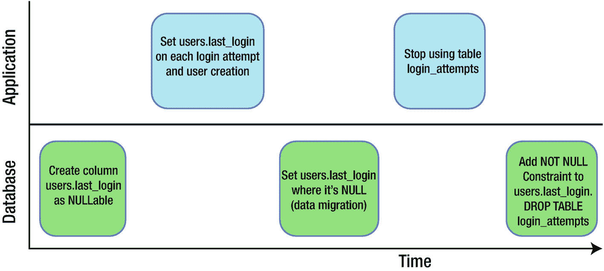

# 13.国家管理

连续交付(CD)对于一个无状态的应用程序来说很好也很容易，也就是说，对于一个没有持久存储数据的应用程序来说。安装新的应用程序版本是一项简单的任务，只需要安装新的二进制文件(或者源代码，如果是未编译的语言)，停止旧的实例，并启动新的实例。

一旦有持久状态要考虑，事情就变得更复杂了。在这里，我将考虑带有模式的传统关系数据库。您可以通过使用无模式的“noSQL”数据库来避免一些问题，但是您并不总是拥有这种奢侈。如果您真的采用无模式，您必须在应用程序代码中处理旧的数据结构，而不是通过部署过程。

随着模式的改变，您可能需要考虑数据迁移，这可能涉及到用默认值填充缺失值或者从不同的数据源导入数据。一般来说，这种数据迁移与模式迁移符合相同的模式，即要么执行一段 SQL 和[数据](https://en.wikipedia.org/wiki/Data_definition_language) [定义语言(DDL](https://en.wikipedia.org/wiki/Data_definition_language) ) <sup>[1](#Fn1)</sup> ，要么运行直接与数据库对话的外部命令。

## 13.1 代码和数据库版本之间的同步

状态管理很困难，因为代码通常被绑定到数据库模式的一个版本上。在一些情况下，这可能会导致问题。

*   数据库更改通常比应用程序更新慢。如果应用程序的版本 1 只能处理模式的版本 1，而应用程序的版本 2 只能处理模式的版本 2，那么您必须停止应用程序的版本 1，进行数据库升级，并且只有在数据库迁移完成之后才启动应用程序的版本 2。

*   回滚到应用程序的前一个版本，以及它的数据库模式版本，变得非常痛苦。通常，数据库更改或其回滚都可能丢失数据，因此您不能轻松地跨这些界限进行自动释放和回滚。

为了详细说明最后一点，考虑向数据库的表中添加一列的情况。在这种情况下，更改的回滚(再次删除列)会丢失数据。相反，如果最初的更改是删除一列，这一步通常不能逆转。您可以重新创建相同类型的列，但数据会丢失。即使您存档了已删除的列数据，新行也可能已被添加到表中，并且这些新行没有存档的数据。

## 13.2 分离应用程序和数据库版本

有一些工具可以帮助您将数据库模式可重复地转换到一个定义的状态，但是它不能为您解决回滚过程中潜在的数据丢失问题。唯一可行的方法是在应用程序开发人员和数据库管理员之间建立协作，并将有问题的更改分解成多个步骤。

假设您想要的更改是删除一个有`NOT NULL`约束的列。简单地在一个步骤中删除列会带来上一节中概述的问题。相反，您可以执行以下步骤:

1.  部署一个能够处理从列中读取`NULL`值的应用程序版本，即使还不允许使用`NULL`值。

2.  等到您确定不希望回滚到无法处理`NULL`值的应用程序值。

3.  部署数据库更改，使列可为空(或给它一个默认值)。

4.  等到您确定不想回滚到该列为`NOT NULL`的模式版本。

5.  部署不再使用该列的新版本的应用程序。

6.  等到您确定不希望回滚到使用该列的应用程序版本。

7.  部署完全删除该列的数据库更改。

有些场景允许您跳过其中的一些步骤，或者将多个步骤合并为一个步骤。向表中添加列是一个类似的过程，如下所示:

1.  部署一个数据库更改，添加带有默认值(或允许`NULL`值)的新列。

2.  部署写入新列的应用程序版本。

3.  可以选择运行一些迁移来填充旧行的列。

4.  可选地部署一个数据库变更，添加开始时不可能的约束(如`NOT NULL`)。

    …在步骤之间有适当的等待。

### 模式更改的示例

假设您有一个由 PostgreSQL 数据库支持的 web 应用程序，并且目前该应用程序将登录尝试记录到数据库中。因此，该模式如下所示:

```py
CREATE TABLE users (
    id          SERIAL,
    email       VARCHAR NOT NULL,
    PRIMARY KEY(id)
);

CREATE TABLE login_attempts (
    id          SERIAL,
    user_id     INTEGER NOT NULL REFERENCES users (id),
    success     BOOLEAN NOT NULL,
    timestamp   TIMESTAMP NOT NULL DEFAULT NOW(),
    source_ip   VARCHAR NOT NULL,
    PRIMARY KEY(id)
);

```

随着 web 应用程序负载的增加，您意识到您正在为数据库创建不必要的写负载，并开始记录到外部日志服务。在数据库中，您真正需要的是最后一次成功登录的日期和时间(您的 CEO 坚持要求您在每次登录时显示该日期和时间，因为一名审计员确信这将提高安全性)。

所以，你最终想要的模式是这样的:

```py
CREATE TABLE users (
    id          SERIAL,
    email       VARCHAR NOT NULL,
    last_login  TIMESTAMP NOT NULL,
    PRIMARY KEY(id)
);

```

一个直接的数据库更改脚本将会有

```py
DROP TABLE login_attempts;

ALTER TABLE users
    ADD COLUMN last_login TIMESTAMP NOT NULL;

```

但是这存在前面提到的问题，即它将模式版本与应用程序版本联系在一起，而且在没有默认值和没有为其提供值的情况下，您不能引入一个`NOT NULL`列。

让我们把它分解成不受这些问题困扰的独立步骤。

#### 创建新列，可空

第一步是添加可选的新列`users.last_login`(通过允许`NULL`值)。如果起点是模式的版本 1，这就是版本 2:

```py
CREATE TABLE users (
    id          SERIAL,
    email       VARCHAR NOT NULL,
    last_login  TIMESTAMP,
    PRIMARY KEY(id)
);

-- table login_attempts omitted, because it's unchanged.

```

运行 apgdiff，另一个 [PostgreSQL Diff 工具](http://www.apgdiff.com/)、<sup>、 [2](#Fn2) 、</sup>针对这两个方案文件给出了我们:

```py
$ apgdiff schma-1.sql schema-2.sql

ALTER TABLE users
    ADD COLUMN last_login TIMESTAMP;

```

这是从模式 1 到模式 2 的正向迁移脚本。请注意，我们不一定需要回滚脚本，因为每个可以处理模式版本 1 的应用程序版本也可以处理模式版本 2(除非应用程序做了类似于`SELECT * FROM users`的傻事，并期望得到一定数量或顺序的结果。我会假设应用程序没有那么愚蠢)。

这个迁移脚本可以在 web 应用程序运行时应用于数据库，而不会有任何停机时间。

MySQL 有一个不幸的特性，即模式更改不是事务性的，在模式更改期间它们会锁定整个表，这抵消了您从增量数据库更新中获得的一些优势。

为了减轻这种情况，有一些外部工具可以解决这一问题，方法是创建表的修改副本，逐渐将数据从旧表复制到新表，最后进行重命名以替换旧表。GitHub 的 [gh-ost](https://github.com/github/gh-ost/) <sup>[3](#Fn3)</sup> 就是这样一个工具。

这些工具通常只对外键约束提供有限的支持，所以在使用它们之前要仔细评估。

当模式更改完成后，您可以部署新版本的 web 应用程序，每当成功登录时，该应用程序都会写入到`users.last_login`。请注意，该应用程序版本必须能够处理从该列读取的`NULL`值，例如，通过返回到表`login_attempts`来确定最后一次登录尝试。

该应用程序版本还可以停止向表`login_attempts`中插入新条目。更保守的方法是将该步骤推迟一段时间，这样您就可以安全地回滚到较旧的应用程序版本。

#### 数据迁移

最后，`users.last_login`应该是`NOT NULL`，所以你必须为它的位置`NULL`生成值。这里，表`last_login`是这种数据的来源。

```py
UPDATE users
  SET last_login = (
         SELECT login_attempts.timestamp
           FROM login_attempts
          WHERE login_attempts.user_id = users.id
            AND login_attempts.success
       ORDER BY login_attempts.timestamp DESC
          LIMIT 1
       )
 WHERE users.last_login IS NULL;

```

如果`NULL`值仍然存在，比如说，因为用户从未成功登录，或者因为表`last_login`没有足够远地返回，您必须有一些回退，这可以是一个固定值。在这里，我选择简单的方法，简单地使用`NOW()`作为退路。

```py
UPDATE users SET last_login = NOW() WHERE last_login IS NULL;

```

当应用程序运行时，这两个更新可以再次在后台运行。此次更新后，`users.last_login`中不应显示更多的`NULL`值。等待几天后，验证确实如此，是时候应用必要的约束了。

#### 应用约束，清理

一旦您确信在列`last_login`中没有丢失值的行，并且您不会回滚到引入丢失值的应用程序版本，您可以部署停止使用表`login_attempts`的应用程序版本，处理表`login_attempts`，然后应用`NOT NULL`约束(参见图 [13-1](#Fig1) )。



图 13-1

应用程序和数据库更新步骤的顺序。每个数据库版本都与之前和之后的应用程序版本兼容，反之亦然。

```py
DROP TABLE login_attempts;

ALTER TABLE users
    ALTER COLUMN last_login SET NOT NULL;

```

总的来说，一个逻辑数据库更改已经被分散到三次数据库更新(两次模式更新和一次数据迁移)和两次应用程序更新中。

这使得应用程序开发更加费力，但是您获得了操作上的优势。其中一个优势是保持应用程序在任何时候都可以发布到生产环境中。

### 先决条件

如果在几个步骤中部署单个逻辑数据库更改，则必须进行几次部署，而不是一次引入代码和模式更改的大型部署。只有当部署(至少大部分)是自动化的，并且组织提供了足够的连续性，您可以实际完成变更过程时，这才是可行的。

如果开发人员不断地灭火，他们很可能从来没有时间添加最终期望的`NOT NULL`约束，并且一些未被发现的 bug 将导致以后信息的丢失。

您还应该建立某种问题跟踪器，使用它您可以跟踪模式迁移的路径，以确保没有未完成的，例如，在开发人员离开公司的情况下。

### 工具作业

不幸的是，我不知道有哪种工具能够完全支持我所描述的数据库和应用程序发布周期。一般来说，有一些工具可以管理模式更改。例如，Sqitch <sup>[4](#Fn4)</sup> 和 Flyway <sup>[5](#Fn5)</sup> 是管理数据库变更和回滚的通用框架。

在较低的层次上，有一些工具，比如 apgdiff，可以比较新旧模式，并使用这种比较来生成 DDL 语句，将您从一个版本带到下一个版本。这种自动生成的 DDL 可以构成 Sqitch 或 Flyway 随后管理的升级脚本的基础。

一些 ORM 还带有框架，承诺为您管理模式迁移。仔细评估它们是否允许在不丢失数据的情况下进行回滚。

### 结构

如果您将应用程序部署与模式部署分离，那么您必须拥有至少两个可单独部署的包:一个用于应用程序，一个用于数据库模式和模式迁移脚本。如果您希望或必须支持数据库模式的回滚，您必须记住，您需要与新模式相关联的元数据才能回滚到旧版本。

模式版本 5 的数据库描述不知道如何从版本 6 回滚到版本 5，因为它对版本 6 一无所知。因此，您应该始终安装最新版本的模式文件包，并将已安装的版本与当前活动的数据库版本分开。控制模式迁移的工具可以独立于应用程序及其模式，因此应该存在于第三个软件包中。

### 没有银弹

没有一个解决方案可以在部署期间自动管理您的所有数据迁移。您必须仔细设计应用程序和数据库的更改，以分离并分别部署它们。这通常是应用程序开发方面的更多工作，但它为您购买了部署和回滚的能力，而不会受到数据库更改的阻碍。

工具可用于某些部分，但通常不适用于全局。必须有人跟踪应用程序和模式的版本，或者将它们自动化。

## 13.3 摘要

数据库中保存的状态会使应用程序升级变得复杂。

不兼容的数据结构和模式更改可以分解成几个较小的步骤，每个步骤都与前一个步骤兼容。

这允许在不停机的情况下升级应用程序，代价是必须进行多次应用程序和模式部署。

<aside class="FootnoteSection" epub:type="footnotes">Footnotes [1](#Fn1_source)

维基百科，《数据定义语言》， [`https://en.wikipedia.org/wiki/Data_definition_language`](https://en.wikipedia.org/wiki/Data_definition_language) ，2018 年。

  [2](#Fn2_source)

[`www.apgdiff.com/`](http://www.apgdiff.com/) 。

  [3](#Fn3_source)

[`https://github.com/github/gh-ost/`](https://github.com/github/gh-ost/) 。

  [4](#Fn4_source)

[`https://sqitch.org/`](https://sqitch.org/) 。

  [5](#Fn5_source)

[`https://flywaydb.org/`](https://flywaydb.org/) 。

 </aside>